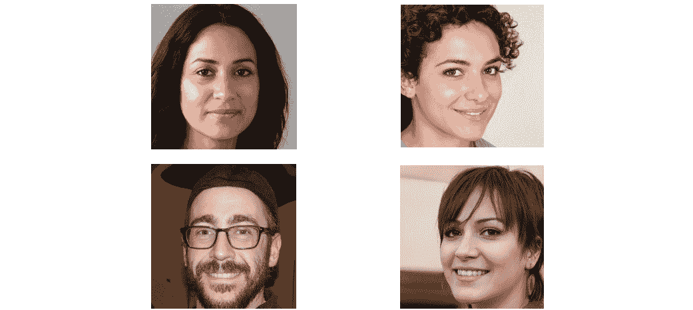
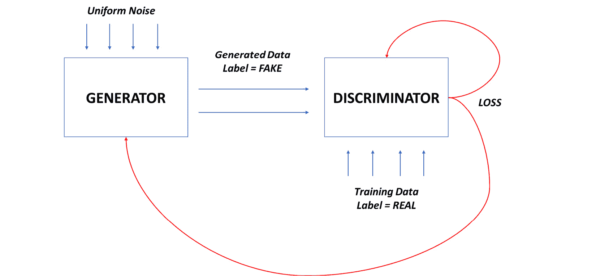
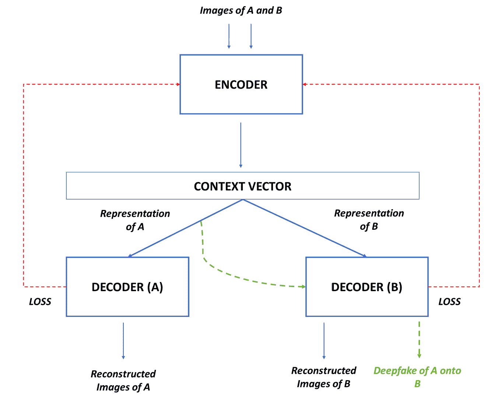
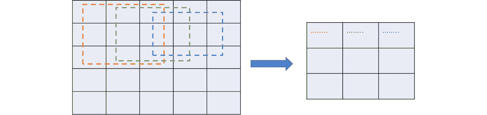
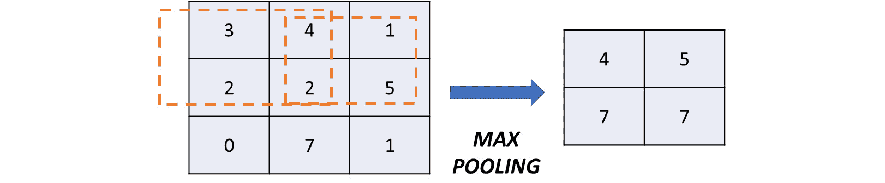
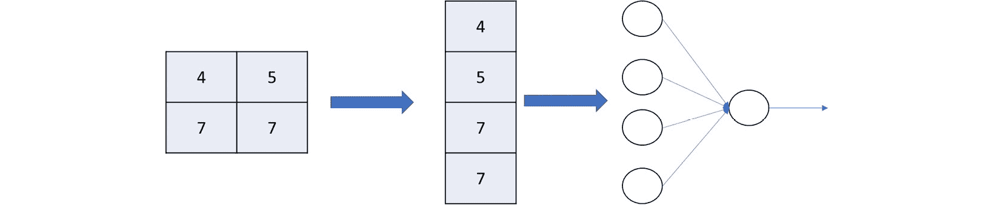

# 第五章：检测深度伪造

近年来，深度伪造问题在互联网上变得普遍。易于获取的技术使得攻击者能够通过深度神经网络的魔法创建出从未存在过的人的图像！这些图像可以被用来增强欺诈或机器人账户，以提供真实人物的错觉。似乎深度伪造图像还不够，深度伪造视频同样容易创建。这些视频允许攻击者将某人的面孔 morph 到现有视频中另一个人的脸上，或者制作一个视频中某人说某话的剪辑。深度伪造是一个热门的研究课题，具有深远的影响。深度伪造技术的滥用可能导致虚假信息、身份盗窃、性骚扰，甚至政治危机。

本章将重点介绍用于检测深度伪造的机器学习方法。首先，我们将了解深度伪造背后的理论，它们是如何被创建的，以及它们可能产生的影响。然后，我们将介绍两种检测深度伪造图像的方法——使用标准机器学习模型的常规方法，接着是一些高级方法。最后，由于深度伪造视频是虚假信息的重大驱动因素，并且有最大的利用空间，本章的最后部分将专注于检测深度伪造视频。

本章将涵盖以下主要内容：

+   深度伪造全解析

+   检测虚假图像

+   检测虚假视频

到本章结束时，你将深入理解深度伪造、其背后的技术以及如何检测它们。

# 技术要求

你可以在 GitHub 上找到本章的代码文件，链接为 [`github.com/PacktPublishing/10-Machine-Learning-Blueprints-You-Should-Know-for-Cybersecurity/tree/main/Chapter%205`](https://github.com/PacktPublishing/10-Machine-Learning-Blueprints-You-Should-Know-for-Cybersecurity/tree/main/Chapter%205)。

# 深度伪造全解析

词语 *deepfake* 是由两个词组合而成——*deep learning* 和 *fake*。简单来说，深度伪造是使用深度学习技术创建的虚假媒体。在过去十年中，机器学习和生成模型取得了重大进展——这些模型不是仅仅进行分类，而是创建内容。这些模型（如 **生成对抗网络**（**GANs**））可以合成看起来真实的图像——甚至包括人类面孔！

深度伪造技术如今对攻击者和恶意行为者来说触手可及。它不需要任何复杂的技术或技能。作为一个实验，请访问网站 [thispersondoesnotexist.com](http://thispersondoesnotexist.com)。这个网站允许你生成人们的图像——这些人从未存在过！

例如，以下图中的人不是真实的。他们是 [thispersondoesnotexist.com](http://thispersondoesnotexist.com) 生成的深度伪造，而且只需几秒钟！



图 5.1 – 从网站生成的深度伪造图像

非常神奇，对吧？现在让我们了解是什么使得生成这些图像成为可能，以及机器学习在其中扮演的角色。

## 探索 GAN

让我们来看看生成深度伪造的技术——GAN（生成对抗网络）。

GAN 是使用神经网络合成数据而不是仅仅进行分类的深度学习模型。名称“对抗”来源于这些模型的架构设计；GAN 架构由两个神经网络组成，我们可以迫使它们进行猫捉老鼠的游戏，以生成可以冒充真实的合成媒体。

### GAN 架构

一个 GAN 由两个主要部分组成——生成器和判别器。这两个模型都是深度神经网络。通过将这些网络相互绘制，可以生成合成图像：

+   **生成器**：生成器是学习生成看起来真实的数据的模型。它接收一个固定长度的随机向量作为输入，并在目标域（如图像）中生成输出。这个随机向量是从高斯分布（即标准正态分布，其中大多数观测值聚集在均值周围，观测值离均值越远，其发生的概率就越低）中随机采样的。

+   **判别器**：判别器是一个传统的机器学习模型。它接收数据样本并将它们分类为真实或虚假。正例（标记为真实的样本）来自训练数据集，而负例（标记为虚假的样本）来自生成器。

### GAN 工作原理

生成图像是一个无监督的机器学习任务，而图像分类则是一个监督学习任务。通过联合训练生成器和判别器，我们能够对两者进行优化，并得到一个能够生成足够好的样本以欺骗判别器的生成器。

在联合训练中，生成器首先生成一批样本数据。这些数据被视为负样本，并使用来自训练数据集的图像作为正样本进行增强。这些数据一起被用来微调判别器。判别器模型根据这些数据更新参数。此外，判别器损失（即生成的图像欺骗判别器的程度）被反馈给生成器。这个损失用于更新生成器以生成更好的数据。



图 5.2 – GAN 模型的工作原理

最初，生成器产生的是随机数据，显然是嘈杂且质量差的。判别器学会轻松地区分真实和伪造的例子。随着训练的进行，生成器开始变得更好，因为它利用了判别器的信号，相应地改变其生成参数。最终，在理想情况下，生成器将经过充分训练，生成器损失降低，判别器损失开始增加，这表明判别器不能再有效地区分实际数据和生成数据。

## 深度伪造是如何被创建的？

除了是“深度学习”和“伪造”这两个词的组合之外，“深度伪造”一词还有一个来源。第一个深度伪造视频是由一个名叫`r/deepfakes`的 Reddit 用户创建的。这位用户使用了谷歌提供的开源实现，将几位女演员的脸交换到色情视频中。今天野外的大部分业余深度伪造都是基于这个代码生成深度伪造的。

通常，任何深度伪造的创建都包括以下四个步骤：

1.  分析源图像，识别人脸所在区域，并将图像裁剪到该区域。

1.  计算特征，这些特征通常是裁剪图像在潜在低维空间中的表示，从而将图像编码成特征向量。

1.  根据某些信号（如目标图像）修改生成的特征向量。

1.  解码修改后的向量，并将图像融合到目标帧中。

大多数深度伪造生成方法依赖于神经网络，特别是编码器-解码器架构。编码器将图像转换到低维子空间，并将其映射到潜在向量（类似于我们在讨论转换器时描述的上下文向量）。这个潜在向量捕捉了图片中人物的特征，如颜色、表情、面部结构和身体姿势。解码器执行反向映射，将潜在表示转换为目标图像。加入 GAN（生成对抗网络）可以使深度伪造生成器更加健壮和强大。

深度伪造技术的首次商业应用始于 2018 年 1 月 FakeApp 的开发。这是一个桌面应用程序，允许用户创建人脸交换的视频。它基于自动编码器架构，由两个编码器-解码器对组成。一对编码器-解码器在源图像上训练，另一对在目标图像上训练。然而，两个编码器共享相同的权重；换句话说，在两个自动编码器中都使用了相同的编码器。这意味着两个图像的潜在向量表示处于相同的环境中，因此表示相似的特征。在训练期结束时，共同的编码器将学会识别两个面孔中的共同特征。

假设 A 是源图像（我们受害者的原始图像），B 是目标图像（我们想要插入 A 的图像）。使用此方法生成深度伪造的高级过程如下：

1.  使用数据增强技术和图像变换获取 A 和 B 的多张图像，以便考虑来自多个视角的同一张图片。

1.  在 A 图像上训练第一个自动编码器模型。

1.  从第一个自动编码器中提取编码器。使用这个编码器在 B 图像上训练第二个自动编码器模型。

1.  训练结束时，我们有两个具有共享编码器的自动编码器，可以识别 A 和 B 图像中的共同特征和特性。

1.  要生成深度伪造，将图像 A 通过公共编码器，以获得潜在表示。

1.  使用第二个自动编码器（即 B 图像的解码器）来将此解码回深度伪造图像。以下展示了这个过程：



图 5.3 – 深度伪造创建方法

FakeApp 已被广泛使用，并启发了许多其他开源实现，如 DeepFaceLab、FaceSwap 和 Dfaker。

## 深度伪造的社会影响

虽然深度伪造技术在机器学习领域，尤其是在深度学习领域，确实具有革命性，但它对社会有着深远的影响。自从它们出现以来，深度伪造就被用于善意的和恶意的目的。我们现在将简要讨论这两者。了解深度伪造的全面影响对于它们的研究至关重要，尤其是对于网络安全行业的机器学习从业者来说。

### 无害

并非所有深度伪造都是有害的。有一些非常好的理由说明为什么使用深度伪造可能是合理的，有时甚至是有益的。深度伪造在以下领域已被证明具有极大的实用性：

+   **娱乐**：深度伪造技术现在对每个人都是可访问的。强大的预训练模型允许通过智能手机上的应用程序暴露端点，它们已被广泛用于创建娱乐视频。这些深度伪造包括喜剧视频，其中卡通人物说出某些对话，交换两个人面孔的图像，或生成将人脸变形为动物的面部滤镜。

+   **复活**：深度伪造的一个创新用途是使死者复活。深度伪造可以描绘死者以他们自己的声音说出某些话！这就像魔法一样，尤其是对于那些在这个世界上没有留下任何视频记忆的人来说。深度伪造也被用来创建能够描绘某人几年或几十年后外观的图像。

### 恶意

然而，不幸的是，每枚硬币都有两面。同样的深度伪造技术可以推动娱乐，并使复活的数字人格成为可能，但也可能被攻击者恶意使用。以下是这个领域从业者应该注意的几个攻击向量：

+   **虚假信息**: 这可能是深度伪造最大的用途，也是最具挑战性的一个。因为深度伪造允许我们创建某人说出他们从未说过的话的视频，这已经被用来传播虚假新闻。例如，一个展示卫生部长说疫苗有害并导致自闭症的视频肯定会引起广泛的恐慌，并使人们相信这是真的。恶意实体可以创建和传播这样的深度伪造来推进自己的事业。这也可能导致政治危机和人员伤亡。2022 年，俄罗斯团体制作了一个乌克兰总统弗拉基米尔·泽连斯基的深度伪造视频，视频中他似乎接受了失败并要求士兵放下武器——这不是事实，但视频在社交媒体上迅速传播，直到被删除。

+   **欺诈**: 传统上，许多应用程序依赖于视觉身份验证。在 COVID-19 大流行之后，大多数这些应用程序转向通过在线文档和视频进行身份验证。深度伪造在这里被用于身份盗窃具有巨大的潜力；通过制作深度伪造视频，你可以假装成另一个人，绕过自动身份验证系统。2022 年 6 月，**联邦调查局**（**FBI**）发布了一则公共服务公告，警告公司注意深度伪造在在线面试和远程工作中被使用。深度伪造还可以用于在社交媒体网站上创建木偶账户，生成图像可以使用 GAN，深度伪造视频可以用来丰富个人资料中的媒体（显示人物讲话的视频），使其看起来真实。

+   **色情**: 第一个被创建的深度伪造是一个色情电影。报复色情是当今世界中深度伪造令人担忧的应用增长。通过使用一个人的图像和任何色情片段作为基础，可以描绘出该人在色情片段中的样子。肉眼可能无法确定视频是伪造的。

# 检测伪造图像

在上一节中，我们探讨了如何生成深度伪造图像和视频。由于这项技术对每个人都是可访问的，我们也讨论了它可以在多个层面上产生的影响。现在，我们将探讨如何检测伪造图像。这是一个需要解决的问题，对社交媒体和互联网整体具有深远的影响。

## 一个用于检测伪造图像的简单模型

我们知道机器学习在图像处理领域取得了显著的进步。卷积神经网络（CNN）已经超越了先前的图像检测器，并达到了甚至超过人类准确性的水平。为了检测深度伪造图像，我们将这项任务视为一个简单的二分类问题，并使用标准的深度学习图像分类方法作为第一步。

### 数据集

深伪影检测有多个公开可用的数据集。我们将使用 140k 真实与伪造人脸数据集。此数据集可在 Kaggle 上免费下载（[`www.kaggle.com/datasets/xhlulu/140k-real-and-fake-faces`](https://www.kaggle.com/datasets/xhlulu/140k-real-and-fake-faces))）。

如其名所示，该数据集包含 140,000 张图像。其中一半来自 Flickr 的真实人脸，另一半是由 GAN 生成的伪造人脸。真实人脸由 NVIDIA 的研究人员收集，图像中涵盖了多个民族、年龄组和配饰的显著覆盖。

该数据集相当大（约 4 GB）。您需要从 Kaggle 下载压缩的数据集，解压并存储在本地。根目录包含三个文件夹 – 分别用于训练数据、测试数据和验证数据。

### 模型

我们将使用 CNN 模型进行分类。这些神经网络擅长理解和分类那些数据的空间表示很重要的数据。这使得它非常适合处理图像，因为图像本质上是由像素组成的矩阵，这些像素以网格状拓扑排列。CNN 通常有三个主要层 – 卷积、池化和分类：

+   **卷积层**：这是 CNN 的基本构建块。该层遍历图像并生成一个称为 **激活图** 的矩阵。每次卷积将图像的一部分与核矩阵（矩阵中的权重是可以通过梯度下降和反向传播学习的参数）相乘。卷积矩阵逐行滑动图像并执行点积。卷积层聚合图像的多个邻域并生成一个压缩输出，如图 *图 5**.4* 所示：



图 5.4 – 卷积层

+   **池化层**：池化层对卷积输出进行聚合。它在一个邻域上计算一个汇总统计量，并用汇总替换邻域细胞。该统计量可以是平均值、最大值、中位数或其他标准度量。池化通过在多个元素上汇总来减少卷积表示中的冗余并降低维度，如图 *图 5**.5* 所示：



图 5.5 – 池化层

+   **全连接层**：池化层的输出被展平并转换为一条一维向量。这很简单，只需将行依次连接即可。现在，这个向量被传递到一个全连接神经网络中，其末尾是一个 **softmax 层**。该层作为一个标准神经网络运行，权重通过多个周期使用梯度下降和反向传播进行更新。softmax 层将输出图像预测类别的概率分布，如图 *图 5**.6* 所示：



图 5.6 – 展平层和全连接层

在训练过程中，数据流入网络并经历卷积和池化。我们可以堆叠多个卷积-池化层，希望每一层都能从图像中学习到新的东西，并获得越来越具体的表示。最后一个卷积层之后的池化输出流入完全连接的神经网络（也可以由多个层组成）。在 softmax 输出后，计算损失，然后整个网络反向传播。所有层，包括卷积层，都会更新它们的权重，使用梯度下降来最小化这个损失。

### 将所有内容整合在一起

现在，我们将使用 CNN 模型来检测 deepfakes，并在 140k 数据集上运行这个实验。

首先，我们导入所需的库：

```py
# Data Processing
import numpy as np
import pandas as pd
import scipy.misc
from sklearn.datasets import load_files
import matplotlib.pyplot as plt
%matplotlib inline
# Deep Learning Libraries
from keras.models import Sequential, Model
from keras.layers import Input, Dense, Flatten, Dropout, Activation, Lambda, Permute, Reshape
from keras.layers import Convolution2D, ZeroPadding2D, MaxPooling2D
from keras_vggface.vggface import VGGFace
from keras_vggface import utils
from keras.preprocessing import image
from keras.preprocessing.image import ImageDataGenerator
from keras.utils import np_utils
```

回想一下，数据科学流程中的第一步是数据预处理。我们需要解析我们下载的图像，并将它们转换为适合 CNN 模型消费的形式。幸运的是，`keras` 库中的 `ImageDataGenerator` 类帮助我们做到了这一点。我们将使用这个库并定义我们的训练和测试数据集：

```py
training_data_path = ""
test_data_path = ""
batch_size = 64
print("Loading Train…")
training_data = ImageDataGenerator(rescale = 1./255.) .flow_from_directory(
    training_data_path,
    target_size=(224, 224),
    batch_size=batch_size,
    class_mode='binary'
)
print("Loading Test…")
test_data = ImageDataGenerator(rescale = 1./255.)
.flow_from_directory(
    test_data_path,
    target_size=(224, 224),
    batch_size=batch_size,
    class_mode='binary'
)
```

运行此操作后，你应该会看到类似以下输出：

```py
Loading Train…
Found 100000 images belonging to 2 classes.
Loading Test…
Found 20000 images belonging to 2 classes.
```

现在数据已经预处理完毕，我们可以定义实际的模型并指定 CNN 的架构。我们的模型将包括卷积、池化和完全连接层，如前所述：

```py
input_shape = (224,224,3)
epsilon=0.001
dropout = 0.1
model = Sequential()
# Convolution and Pooling -- 1
model.add(BatchNormalization(input_shape=input_shape))
model.add(Conv2D(filters=16, kernel_size=3, activation='relu', padding='same'))
model.add(MaxPooling2D(pool_size=2))
model.add(BatchNormalization(epsilon=epsilon))
# Convolution and Pooling -- 2
model.add(Conv2D(filters=32, kernel_size=3, activation='relu', padding='same'))
model.add(MaxPooling2D(pool_size=2))
model.add(BatchNormalization(epsilon=epsilon))
model.add(Dropout(dropout))
#Convolution and Pooling -- 3
model.add(Conv2D(filters=64, kernel_size=3, activation='relu', padding='same'))
model.add(MaxPooling2D(pool_size=2))
model.add(BatchNormalization(epsilon=epsilon))
model.add(Dropout(dropout))
# Aggregation
model.add(GlobalAveragePooling2D())
# Fully Connected Layer
model.add(Dense(1, activation='sigmoid'))
```

让我们仔细看看我们在这里做了什么。首先，我们设置了一些基本模型参数，并使用 `Sequential` 类定义了一个空模型。这个模型将成为我们的基础，我们在其上堆叠不同的层来构建整个架构。

然后，我们定义了我们的**卷积层**。每个卷积层都有一个**最大池化层**，后面跟着一个**归一化层**。归一化层只是对池化输出进行归一化和缩放。这导致梯度稳定，避免了损失爆炸。

然后，我们使用 `GlobalAveragePooling2D` 类添加了一个聚合层。这将把之前的输出连接成一个一维向量。最后，我们在末尾有一个带有 softmax 激活的完全连接层；这个层负责实际的分类。

你可以通过打印摘要来查看你的模型架构：

```py
model.summary()
```

最后，我们可以在预处理的数据上训练我们定义的模型：

```py
model.compile(loss='binary_crossentropy',optimizer=Adam(0.0001), metrics=['accuracy'])
training_steps = 40000//batch_size
num_epochs = 10
history = model.fit_generator(
    training_data,
    epochs=num_epochs,
    steps_per_epoch = training_steps
)
```

这将需要大约 30 分钟到 1 小时才能完成。当然，确切的时间将取决于你的处理器、调度和系统使用情况。

一旦模型训练完成，我们可以用它来对测试数据进行预测，并将预测与真实值进行比较：

```py
y_pred = model.predict(test_data)
y_actual = test_data.classes
```

现在，你可以像我们在前几章中的其他模型一样绘制混淆矩阵。

### 在模型上尝试不同的操作

在上一节中，我们探讨了如何定义端到端的 CNN 模型以及如何训练它。在这个过程中，我们做出了几个可能影响模型性能的设计选择。作为一个实验，你应该探索这些设计选择，并使用不同的参数重新运行实验。我们不会详细分析超参数调整，但我们会讨论一些可以调整的参数。我们将把它留给你去测试，因为这是一个很好的学习练习。以下是一些你可以尝试的事情来玩转模型：

+   **卷积层**：在我们的模型中，我们有三层卷积和最大池化层。然而，你可以扩展到任意多（或少）层。如果你有 10 层会发生什么？如果你只有一层会发生什么？结果混淆矩阵会如何变化？

+   **池化层**：我们在模型中使用了最大池化。然而，正如 CNN 架构中讨论的那样，池化可以利用任何统计聚合。如果我们使用均值池化或最小池化而不是最大池化会发生什么？结果混淆矩阵会如何变化？

+   **全连接层**：我们的模型在最后只有一个全连接层。然而，这并不一定非得如此；你可以有一个具有多个层的完整神经网络。你应该检查如果层数增加会发生什么。

+   **Dropout**：请注意，每个层后面都跟着一个 dropout 层。Dropout 是一种在神经网络中用于避免过拟合的技术。一定比例的权重被随机设置为 0；这些被认为是“丢弃”的。在这里，我们有一个 0.1 的 dropout 比例。如果它增加会发生什么？如果它设置为 0（即完全没有 dropout）会发生什么？

这完成了我们对深度伪造图像检测的讨论。接下来，我们将看到深度伪造是如何从图像过渡到视频的，我们将探讨检测它们的方法。

# 检测深度伪造视频

就像深度伪造图像还不够一样，深度伪造视频现在正在改变互联网。从良性的用途，如喜剧和娱乐，到恶性的用途，如色情和政治动荡，深度伪造视频正在席卷社交媒体。因为深度伪造看起来如此逼真，仅凭肉眼观看视频并不能提供任何关于它是真实还是伪造的线索。作为一名在安全领域工作的机器学习从业者，了解如何开发模型和技术来识别深度伪造视频是至关重要的。

一个视频可以被视为图像的扩展。视频是由多个图像依次排列并快速连续观看的。每个这样的图像被称为一帧。通过以高速（每秒多帧）查看这些帧，我们看到图像在移动。

神经网络不能直接处理视频——不存在一种适当的方法来编码图像并将它们转换为适合机器学习模型消费的形式。因此，深度伪造视频检测涉及对视频每一帧进行深度伪造图像检测。我们将查看帧的连续性，检查它们的演变，并确定变换和运动是否正常或类似于真实视频中的预期。

通常，检测视频深度伪造遵循以下模式：

1.  解析视频文件并将其分解成多个帧。

1.  读取最多帧数的帧。如果帧数少于设定的最大值，则用空帧填充。

1.  检测每一帧中的面部。

1.  裁剪每一帧中的面部。

1.  使用裁剪面部序列（每帧获得一个面部）作为输入，以及真实/伪造标签作为输出的模型进行训练。

我们将在下一节利用这些步骤来检测伪造视频。

## 构建深度伪造检测器

在本节中，我们将探讨如何构建模型以检测深度伪造视频。

### 数据集

我们将使用 Kaggle 深度伪造检测挑战赛（[`www.kaggle.com/competitions/deepfake-detection-challenge/overview`](https://www.kaggle.com/competitions/deepfake-detection-challenge/overview)）的数据集。作为挑战的一部分，提供了三个数据集——训练、测试和验证。由于奖金高达 100 万美元，参与者需要提交代码和输出文件，这些文件在私有测试集上进行了评估。

实际数据集太大（约 0.5 TB），我们无法实际下载和处理，考虑到你们大多数人只有有限的计算能力。我们将使用`train_sample_videos.zip`和`test_videos.zip`文件中可用的数据子集，总共约 4 GB。您需要下载这些数据并将其保存在本地，以便您能够运行实验。

### 模型

在上一节中，我们开发了我们的 CNN 模型，并从头到尾进行分类训练。在本节中，我们将探讨基于迁移学习概念的另一种技术。在机器学习中，迁移学习是一种范式，其中一个任务中学习的参数可以应用于另一个任务，并提高后者的性能。

在迁移学习中，我们在基础任务上训练一个分类模型。一旦该模型训练完成，我们可以通过以下两种方式将其用于另一个任务：

+   **在第二个任务的新数据上重新训练模型**：通过这样做，我们将初始化模型权重为在第一个任务上训练后产生的权重。希望模型（实际上将在两组数据上训练）在两个任务上都能表现出良好的性能。

+   **使用模型作为特征提取器**：模型的最后一层通常是 softmax 层。我们可以提取预最终层，并使用没有 softmax 的模型为我们的新数据生成特征。这些特征可以用于训练下游分类模型。

注意，第二个任务通常是第一个任务的精炼和具体版本。例如，第一个任务可以是情感分类，第二个任务可以是电影评论分类。希望训练第一个任务将帮助模型学习情感分类的高级信号（表示特定情感的关键词，如`优秀`、`惊人`、`好`和`糟糕`）。在第二个任务中的微调将帮助它学习除了高级知识之外的任务特定知识（如电影特定的关键词`大片`和`烂片`）。另一个例子是，基础任务是动物图像分类，微调任务是猫和狗图像的分类器。

我们将使用这里列出的第二种方法。我们不会开发自定义特征，而是让预训练的模型完成所有工作。我们将使用的模型是**InceptionV3 模型**，它将为视频中的每一帧提取特征。我们将使用**循环神经网络**（**RNN**）根据帧序列对视频进行分类。这项技术是从挑战赛的一个提交中改编的（[`www.kaggle.com/code/krooz0/deep-fake-detection-on-images-and-videos/notebook`](https://www.kaggle.com/code/krooz0/deep-fake-detection-on-images-and-videos/notebook)）。

### 将所有这些放在一起

首先，我们将导入必要的库：

```py
# Libraries for Machine Learning
import tensorflow as tf
from tensorflow import keras
import pandas as pd
import numpy as np
# Helper Libraries
import imageio
import cv2
import os
```

然后，我们将读取每个视频的文件和标签，并将它们读入一个 DataFrame。数据集包含每个集合的元数据文件，为我们提供这些信息。请注意，您可能需要根据您在本地存储数据的位置和方式调整路径：

```py
train_meta_file = '../deepfake-detection-challenge/train_sample_videos/metadata.json'
train_sample_metadata = pd.read_json(train_meta_file).T
```

让我们看看其中一个 DataFrame：

```py
train_sample_metadata.head()
```

它应该显示视频文件及其相关标签（真实或伪造）的列表。现在，我们将定义几个辅助函数。第一个是一个裁剪函数，它将接受一个帧并将其裁剪成方形：

```py
def crop_image(frame):
  # Read dimensions
    y = frame.shape[0]
    x = frame.shape[1]
  # Calculate dimensions of cropped square
    min_dimension = min(x, y)
    start_x = (x/2) - (min_dimension/2)
    start_y = (y/2) - (min_dimension/2)
  # Pick only the part of the image to be retained
    cropped = frame[start_y : start_y + min_dim,
                    start_x : start_x + min_dim]
    return cropped
```

第二个辅助函数将解析视频文件并从中提取指定最大帧数的帧。我们将每个帧调整大小为（`224,224`）以进行标准化，然后将其裁剪成方形。输出将是一系列大小均匀且裁剪过的帧：

```py
def parse_video_into_frames(video_file_path):
    new_shape = (224, 224)
    capture = cv2.VideoCapture(path)
    frames = []
    try:
        while True:
      # Read from the video stream
            ret, frame = capture.read()
            if not ret: # Have reached the end of frames
                break
      # Crop the frame and resize it
            frame = crop_image(frame)
            frame = cv2.resize(frame, new_shape)
            frame = frame[:, :, [2, 1, 0]]
       # Append it to a sequence
            frames.append(frame)
    finally:
        capture.release()
    return np.array(frames)
```

现在，我们将定义我们的特征提取器，它使用迁移学习和利用`InceptionV3`模型从帧中提取特征。幸运的是，`keras`库为我们提供了一个方便的接口来加载预训练的模型：

```py
inception_model = keras.applications.InceptionV3(
        weights="imagenet",
        include_top=False,
        pooling="avg",
        input_shape=(224,224, 3),
    )
preprocess_input = keras.applications.inception_v3.preprocess_input
inputs = keras.Input((224,224, 3))
preprocessed = preprocess_input(inputs)
outputs = inception_model(preprocessed)
feature_extractor = keras.Model(inputs, outputs, name="feature_extractor")
```

最后，我们将编写另一个函数，该函数解析整个数据集，生成一系列帧，从每个帧中提取特征，并为视频生成特征序列和标签（真实或伪造）的元组：

```py
def prepare_data(df, data_dir):
    MAX_SEQ_LENGTH = 20
    NUM_FEATURES = 2048
    num_samples = len(df)
    video_paths = list(df.index)
  # Binarize labels as 0/1
    labels = df["label"].values
    labels = np.array(labels=='FAKE').astype(np.int)
   # Placeholder arrays for frame masks and features
    frame_masks = np.zeros(shape=(num_samples, MAX_SEQ_LENGTH), dtype="bool")
    frame_features = np.zeros(shape=(num_samples, MAX_SEQ_LENGTH, NUM_FEATURES), dtype="float32")
  # Parse through each video file
    for idx, path in enumerate(video_paths):
        # Gather all its frames and add a batch dimension.
        frames = parse_video_into_frames(os.path.join(data_dir, path))
        frames = frames[None, ...]
        # Initialize placeholders to store the masks and features of the current video.
        temp_frame_mask = np.zeros(shape=(1, MAX_SEQ_LENGTH,), dtype="bool")
        temp_frame_features = np.zeros(shape=(1, MAX_SEQ_LENGTH, NUM_FEATURES), dtype="float32")
        # Extract features from the frames of the current video.
        for i, batch in enumerate(frames):
            video_length = batch.shape[0]
            length = min(MAX_SEQ_LENGTH, video_length)
            for j in range(length):
                temp_frame_features[i, j, :] = feature_extractor.predict(batch[None, j, :])
            temp_frame_mask[i, :length] = 1  # 1 = not masked, 0 = masked
        frame_features[idx,] = temp_frame_features.squeeze()
        frame_masks[idx,] = temp_frame_mask.squeeze()
    return (frame_features, frame_masks), labels
```

为了训练模型，我们需要将可用的数据分成训练集和测试集（注意，提供的测试集没有标签，因此我们无法在它上面评估我们的模型）。我们将使用我们的预处理函数来准备数据并将其转换为所需的形式：

```py
from sklearn.model_selection import train_test_split
train_set, test_set = train_test_split(train_sample_metadata,test_size=0.1,random_state=42,stratify=train_sample_metadata['label'])
train_data, train_labels = prepare_data(train_set, "train")
test_data, test_labels = prepare_data(test_set, "test")
```

现在，我们可以定义一个模型并使用这些数据来训练它。在这里，我们只将预训练模型用作特征提取器。提取的特征将被传递到下游模型：

```py
MAX_SEQ_LENGTH = 20
NUM_FEATURES = 2048
DROPOUT = 0.2
frame_features_input = keras.Input((MAX_SEQ_LENGTH, NUM_FEATURES))
mask_input = keras.Input((MAX_SEQ_LENGTH,), dtype="bool")
x = keras.layers.GRU(32, return_sequences=True)(frame_features_input, mask=mask_input)
x = keras.layers.GRU(16)(x)
x = keras.layers.GRU(8)(x)
x = keras.layers.Dropout(DROPOUT)(x)
x = keras.layers.Dense(8, activation="relu")(x)
x = keras.layers.Dense(8, activation="relu")(x)
output = keras.layers.Dense(1, activation="sigmoid")(x)
model = keras.Model([frame_features_input, mask_input], output)
model.compile(loss="binary_crossentropy", optimizer="adam", metrics=["accuracy"])
```

在这里，我们使用了`8`个神经元。最后一层包含一个具有 sigmoid 激活的单个神经元。你可以通过打印出来检查架构：

```py
model.summary()
```

注意，在这里，我们不使用 softmax，而是使用 sigmoid。我们为什么要这样做？我们这里有一个二分类问题；sigmoid 会给我们序列帧是 deepfake 的概率。如果我们有一个多分类问题，我们会使用 softmax。记住，softmax 只是 sigmoid 推广到多个类别。

最后，我们训练模型。由于我们使用 Keras，训练就像在模型上调用`fit()`函数并将所需数据传递给它一样简单：

```py
EPOCHS = 10
model.fit(
        [train_data[0], train_data[1]],
        train_labels,
        validation_data=([test_data[0], test_data[1]],test_labels),
        epochs=EPOCHS,
        batch_size=8
    )
```

你应该能够通过每个 epoch 观察到模型的训练。在每一个 epoch 中，你都可以看到模型在训练数据和验证数据上的损失。

在我们获得训练好的模型后，我们可以将测试示例运行通过它，并获取模型预测。我们将获得输出概率，如果它大于我们的阈值（通常，`0.5`），我们将其分类为伪造（标签 = `1`）：

```py
predicted_labels = []
THRESHOLD = 0.5
for idx in range(len(test_data[0])):
  frame_features = test_data[0][idx]
  frame_mask = test_data[1][idx]
  output_prob = model.predict([frame_features, frame_mask])[0]
  if (output_prob >= THRESHOLD):
    predicted_labels.append(1)
  else:
    predicted_labels.append(0)
```

为了检验我们模型的性能，我们可以通过生成混淆矩阵来比较实际标签和预测标签。

### 玩转模型

回想一下，在上一个关于检测 deepfake 图像的章节中，我们包括了玩转模型和跟踪性能的提示。我们也将在这里为 deepfake 视频分类做同样的事情。虽然这样的任务可能看起来是多余的，因为我们已经有了模型，但在现实世界和行业中，模型调优是数据科学家必须处理的一项基本任务。

作为学习练习，你应该尝试模型并确定你可以拥有的最佳参数集。以下是一些你可以尝试的事情：

+   **图像处理**：注意，我们将视频解析为帧，并将每个图像调整为 224 x 224 的形状。如果这个形状改变会发生什么？极端大的尺寸（1,048 x 1,048）或极端小的尺寸（10 x 10）会如何影响模型？性能会受到什么影响？

+   **数据参数**：在前面的操作过程中，在预处理数据时，我们设置了两个重要的参数。第一个是*最大序列长度*，它决定了我们考虑多少个帧。第二个是*特征数量*，它控制从预训练模型中提取的特征向量的长度。如果我们改变这些参数——无论是单独还是相互结合——会对模型产生什么影响？

+   **特征提取**：我们使用了迁移学习和预训练模型来处理我们的输入并给出我们的特征。InceptionV3 是一个模型；然而，还有其他几个模型可以使用。是否有其他模型能产生更好的特征（如更好的模型性能所示）？

+   **模型架构**：GRU 层数、全连接层以及每层的神经元数量都是任意选择的。如果我们不选择 32-16-8 的 GRU 层，而是选择 16-8-8 会怎样？8-8-8 又如何？5 层，每层 16 个神经元（即 16-16-16-16-16）又会怎样？同样，也可以对全连接层进行类似的实验。这里的可能性是无限的。

+   **训练**：我们在 10 个时期上训练了我们的模型。如果我们只训练 1 个时期会怎样？50 个？100 个？直观上，你会期望更多的时期会导致更好的性能，但这是否真的是这样？此外，我们的预测阈值设置为 0.5。如果我们改变这个阈值，精确度和召回率会受到怎样的影响？

这使我们的关于深度伪造视频的讨论达到了终点。

# 摘要

在本章中，我们研究了深度伪造，这是一种使用深度神经网络创建的合成媒体（图像和视频）。这些媒体通常显示人们不在的位置，可以用于多种恶意目的，包括虚假信息、欺诈和色情。影响可能是灾难性的；深度伪造可以引发政治危机和战争，在公众中引起广泛恐慌，促进身份盗窃，并导致诽谤和生命损失。在了解深度伪造是如何创建的之后，我们专注于检测它们。首先，我们使用卷积神经网络（CNNs）来检测深度伪造图像。然后，我们开发了一个模型，将深度伪造视频解析成帧，并使用迁移学习将它们转换为向量，这些向量的序列被用于伪造或真实分类。

深度伪造是一个日益增长的挑战，并为网络犯罪提供了巨大的潜力。行业对理解深度伪造、它们的生成、它们可能产生的社会影响以及最重要的是，对抗它们的方法的专家有强烈的需求。本章为您提供了对深度伪造的深入理解，并为您提供了检测它们的工具和技术。

在下一章中，我们将探讨深度伪造图像的文本对应物——机器生成的文本。
