# 第二章：设计查询策略框架

**查询策略**作为驱动主动机器学习的引擎，并决定哪些数据点被选中进行标记。在本章中，我们旨在提供对主动机器学习中应用最广泛、最有效的查询策略框架的全面和详细解释。这些框架在主动机器学习领域发挥着至关重要的作用，有助于选择具有信息性和代表性的数据点进行标记。我们将深入探讨的策略包括不确定性采样、委员会查询、**预期模型变化**（**EMC**）、**预期误差减少**（**EER**）和密度加权方法。通过彻底理解这些框架及其背后的原理，你可以在设计和实现主动机器学习算法时做出明智的决策。

在本章中，你将获得设计并部署查询策略的技能，这些策略可以从标记工作中提取最大价值。你将获得在构建主动机器学习系统时将匹配策略与数据集和用例相匹配的直觉。

我们将涵盖以下主题：

+   探索不确定性采样方法

+   理解委员会查询方法

+   使用 EMC 采样进行标记

+   使用 EER 进行采样

+   理解密度加权采样方法

# 技术要求

对于本章中演示的代码示例，我们使用了 Python 3.9.6 以及以下包：

+   `numpy`（版本 1.23.5）

+   `scikit-learn`（版本 1.2.2）

+   `matplotlib`（版本 3.7.1）

# 探索不确定性采样方法

**不确定性采样**指的是查询模型对其预测最不确定的数据点。这些是模型认为最模糊且无法自信地自行标记的样本。将这些高不确定性点标记出来，允许模型阐明其知识不足之处。

在不确定性采样中，主动机器学习系统查询当前模型预测表现出**高不确定性**的实例。目标是选择位于类别之间的**决策边界**附近的数据点。标记这些模糊示例有助于模型在知识最薄弱的领域建立信心。

不确定性采样方法选择靠近**决策边界**的数据点，因为这些点表现出最高的预测不确定性。决策边界定义为模型在区分给定输入的不同类别时表现出最大不确定性的点。边界上的点代表模型最模糊、最不确定的情况。

*图 2**.1*展示了不确定性采样与随机采样的区别：

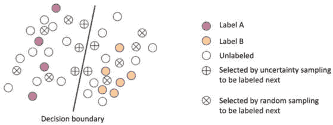

图 2.1 – 不确定性采样与随机采样的比较

对于位于类区域（标记为 A 或 B）内远离决策边界（*图 2**.1*）的数据点，模型将非常自信地将它们分配到该类（例如，>95%）。这些点被认为是确定的，在采用不确定性采样时不会被选中。然而，当使用随机采样时，可能选择其中的一些点。对于非常接近或直接位于决策边界上的数据点，模型将难以区分这些类别。预测的类概率将更加均匀分布，顶级预测非常接近。因此，这些点被认为是不确定的，在采用不确定性采样时将被选中。这些重要的数据点在使用随机采样时可能会被忽略。因此，到边界的距离与不确定性相关联——最接近边界的点将具有最低的最大置信度，顶级类别之间的最小边缘，以及类概率的最高熵。

因此，通过根据低置信度、低边缘和高熵度等指标选择点，不确定性采样查询了最接近决策边界的实例。我们将在本章接下来的部分详细讨论这些指标。对这些实例进行标注提供了帮助，有助于明确类区域并细化边界。模型不太可能从它已经可以高置信度正确预测的例子中获得很多信息。然而，直接查询模型非常不确定的数据点直接提供了关于其差距的有用信息。不确定性采样通过针对具有高预测模糊性的点来利用这一点。

例如，图像分类器的最小置信度预测很可能对应于具有挑战性的分布外示例，传统采样会错过这些示例。通过查询这些异常情况以获取标签，模型可以快速提高对边缘案例的分类能力。现在，让我们讨论一些用于不确定性采样的常用方法。

首先，我们将讨论**最小置信度采样**，其中数据点根据它们的最小置信度得分进行排序。这个得分是通过从每个项目的最自信预测标签中减去 1 来获得的，这代表 100%的置信度。为了便于理解，将不确定性得分转换为 0-1 的范围是有益的，其中 1 表示最高水平的不确定性。分配给每个数据点的分数的大小在于它与模型预测的不确定性之间的关联。因此，具有最高最小置信度得分的数据样本应该优先进行标注。

最具信息量的样本 x 可以按以下方式计算：

![<mml:math xmlns:mml="http://www.w3.org/1998/Math/MathML" xmlns:m="http://schemas.openxmlformats.org/officeDocument/2006/math" display="block"><mml:msubsup><mml:mrow><mml:mi>x</mml:mi></mml:mrow><mml:mrow><mml:mi>L</mml:mi><mml:mi>C</mml:mi></mml:mrow><mml:mrow><mml:mi>*</mml:mi></mml:mrow></mml:msubsup><mml:mo>=</mml:mo><mml:mrow><mml:mrow><mml:munder><mml:mrow><mml:mi mathvariant="normal">argmax</mml:mi></mml:mrow><mml:mrow><mml:mi>x</mml:mi></mml:mrow></mml:munder></mml:mrow><mml:mo>⁡</mml:mo><mml:mrow><mml:mo>(</mml:mo><mml:mn>1</mml:mn><mml:mo>-</mml:mo><mml:msub><mml:mrow><mml:mi>P</mml:mi></mml:mrow><mml:mrow><mml:mi>θ</mml:mi></mml:mrow></mml:msub><mml:mfenced separators="|"><mml:mrow><mml:mi>y</mml:mi></mml:mrow><mml:mrow><mml:mi>x</mml:mi></mml:mrow></mml:mfenced><mml:mo>)</mml:mo></mml:mrow></mml:mrow></mml:math>](img/1.png)

这里，我们有以下内容：

![<mml:math xmlns:mml="http://www.w3.org/1998/Math/MathML" xmlns:m="http://schemas.openxmlformats.org/officeDocument/2006/math" display="block"><mml:mover accent="true"><mml:mrow><mml:mi>y</mml:mi></mml:mrow><mml:mo>^</mml:mo></mml:mover><mml:mo>=</mml:mo><mml:mrow><mml:mrow><mml:munder><mml:mrow><mml:mi mathvariant="normal">argmax</mml:mi></mml:mrow><mml:mrow><mml:mi>x</mml:mi></mml:mrow></mml:munder></mml:mrow><mml:mo>⁡</mml:mo><mml:mrow><mml:mo>(</mml:mo><mml:msub><mml:mrow><mml:mi>P</mml:mi></mml:mrow><mml:mrow><mml:mi>θ</mml:mi></mml:mrow></mml:msub><mml:mfenced separators="|"><mml:mrow><mml:mi>y</mml:mi></mml:mrow><mml:mrow><mml:mi>x</mml:mi></mml:mrow></mml:mfenced><mml:mo>)</mml:mo></mml:mrow></mml:mrow></mml:math>](img/2.png)

例如，假设我们有一个将样本分类为三个不同类别的模型。现在，我们正在尝试使用最小置信度采样方法对两个样本进行排序。样本 1 和样本 2 的预测概率分别为 `[0.05, 0.85, 0.10]` 和 `[0.35, 0.15, 0.50]`。让我们通过以下 Python 代码找出使用最小置信度采样方法时哪个样本最有信息量：

```py
import numpy as np
# Model's probabilities of samples 1 and 2 for the 3 classes
probs_sample_1 = np.array([0.05, 0.85, 0.10])
probs_sample_2 = np.array([0.35, 0.15, 0.50])
def least_confident_score(predicted_probs):
    return 1 - predicted_probs[np.argmax(predicted_probs)]
LC_samples_scores = np.array(
    [least_confident_score(probs_sample_1),
    least_confident_score(probs_sample_2)])
print(f'Least confident score for sample 1 is: 
    {LC_samples_scores[0]}')
print(f'Least confident score for sample 2 is: 
    {LC_samples_scores[1]}')
most_informative_sample = np.argmax(LC_samples_scores)
print(f'The most informative sample is sample 
    {most_informative_sample+1}')
```

上述代码片段的输出如下：

```py
Least confident score for sample 1 is: 0.15000000000000002
Least confident score for sample 2 is: 0.5
```

因此，最有信息量的样本是样本 2。

在这个例子中，我们可以看到当使用最小置信度采样方法时，选择了样本 2，因为模型对该样本的预测最不自信。

接下来，我们将讨论**边缘采样**。这种方法旨在识别和选择在两个预测类别之间概率差异最小的数据点。通过关注类别之间最小边缘的数据点，我们可以有效地优先标注导致模型产生更高混淆程度的数据样本。因此，当模型遇到边缘分数较低的数据点时，其不确定性水平更高，这使得它们成为理想的标注候选。使用边缘采样方法计算最有信息量数据点分数的公式如下：

![<mml:math xmlns:mml="http://www.w3.org/1998/Math/MathML" xmlns:m="http://schemas.openxmlformats.org/officeDocument/2006/math" display="block"><mml:msubsup><mml:mrow><mml:mi>x</mml:mi></mml:mrow><mml:mrow><mml:mi>M</mml:mi></mml:mrow><mml:mrow><mml:mi>*</mml:mi></mml:mrow></mml:msubsup><mml:mo>=</mml:mo><mml:mrow><mml:mrow><mml:munder><mml:mrow><mml:mi mathvariant="normal">argmin</mml:mi></mml:mrow><mml:mrow><mml:mi>x</mml:mi></mml:mrow></mml:munder></mml:mrow><mml:mo>⁡</mml:mo><mml:mrow><mml:mo>(</mml:mo><mml:msub><mml:mrow><mml:mi>P</mml:mi></mml:mrow><mml:mrow><mml:mi>θ</mml:mi></mml:mrow></mml:msub><mml:mfenced separators="|"><mml:mrow><mml:msub><mml:mrow><mml:mover accent="true"><mml:mrow><mml:mi>y</mml:mi></mml:mrow><mml:mo>^</mml:mo></mml:mover></mml:mrow><mml:mrow><mml:mi>m</mml:mi><mml:mi>a</mml:mi><mml:mi>x</mml:mi><mml:mn>1</mml:mn></mml:mrow></mml:msub></mml:mrow><mml:mrow><mml:mi>x</mml:mi></mml:mrow></mml:mfenced><mml:mo>-</mml:mo><mml:msub><mml:mrow><mml:mi>P</mml:mi></mml:mrow><mml:mrow><mml:mi>θ</mml:mi></mml:mrow></mml:msub><mml:mfenced separators="|"><mml:mrow><mml:msub><mml:mrow><mml:mover accent="true"><mml:mrow><mml:mi>y</mml:mi></mml:mrow><mml:mo>^</mml:mo></mml:mover></mml:mrow><mml:mrow><mml:mi>m</mml:mi><mml:mi>a</mml:mi><mml:mi>x</mml:mi><mml:mn>2</mml:mn></mml:mrow></mml:msub></mml:mrow><mml:mrow><mml:mi>x</mml:mi></mml:mrow></mml:mfenced><mml:mo>)</mml:mo></mml:mrow></mml:mrow></mml:math>](img/3.png)

让我们再次使用我们之前的示例中的样本：

```py
import numpy as np
# Model's probabilities of sample 1 and 2 for the 3 classes
probs_sample_1 = np.array([0.05, 0.85, 0.10])
probs_sample_2 = np.array([0.35, 0.15, 0.50])
def margin_score(predicted_probs):
    predicted_probs_max_1 = np.sort(predicted_probs)[-1]
    predicted_probs_max_2 = np.sort(predicted_probs)[-2]
    margin_score = predicted_probs_max_1 - predicted_probs_max_2
    return margin_score
# For sample 1
margin_score_sample_1 = margin_score(probs_sample_1)
print(f'The margin score of sample 1 is: {margin_score_sample_1}')
# For sample 2
margin_score_sample_2 = margin_score(probs_sample_2)
print(f'The margin score of sample 2 is: {margin_score_sample_2}')
margin_scores = np.array([margin_score_sample_1, 
    margin_score_sample_2])
most_informative_sample = np.argmin(margin_scores)
print(f'The most informative sample is sample 
    {most_informative_sample+1}')
```

上述脚本的输出如下：

```py
The margin score of sample 1 is: 0.75
The margin score of sample 2 is: 0.15000000000000002
The most informative sample is sample 2
```

使用边缘采样方法，样本 2 也被选中，因为它在两个预测类别之间的概率差异最小。

在**置信度比率**方法中，选择具有最小概率比的数据点，即最高预测类别的概率与第二可能类别的概率之间的比率。这针对的是模型的前两个预测在可能性上最接近的例子。较低的比率表示模型对第二类相对于最高类别的置信度较低。通过查询最高两个类别概率之间的最小比率点，这种技术专注于模型在两个类别之间几乎无法区分的情况。将这些边界点标记出来将推动模型对真实类别有更大的信心。较低的比率意味着更高的歧义，因此置信度采样比率找到模型最不确定哪个类别是正确的点。

我们可以使用置信度采样方法通过以下方程计算最有信息量的数据点的得分：

![<mml:math xmlns:mml="http://www.w3.org/1998/Math/MathML" xmlns:m="http://schemas.openxmlformats.org/officeDocument/2006/math" display="block"><mml:msubsup><mml:mrow><mml:mi>x</mml:mi></mml:mrow><mml:mrow><mml:mi>R</mml:mi></mml:mrow><mml:mrow><mml:mi>*</mml:mi></mml:mrow></mml:msubsup><mml:mo>=</mml:mo><mml:mrow><mml:mrow><mml:munder><mml:mrow><mml:mi mathvariant="normal">argmin</mml:mi></mml:mrow><mml:mrow><mml:mi>x</mml:mi></mml:mrow></mml:munder></mml:mrow><mml:mo>⁡</mml:mo><mml:mrow><mml:mo>(</mml:mo><mml:mfrac><mml:mrow><mml:msub><mml:mrow><mml:mi>P</mml:mi></mml:mrow><mml:mrow><mml:mi>θ</mml:mi></mml:mrow></mml:msub><mml:mfenced separators="|"><mml:mrow><mml:msub><mml:mrow><mml:mover accent="true"><mml:mrow><mml:mi>y</mml:mi></mml:mrow><mml:mo>^</mml:mo></mml:mover></mml:mrow><mml:mrow><mml:mi>m</mml:mi><mml:mi>a</mml:mi><mml:mi>x</mml:mi><mml:mn>1</mml:mn></mml:mrow></mml:msub></mml:mrow><mml:mrow><mml:mi>x</mml:mi></mml:mrow></mml:mfenced></mml:mrow><mml:mrow><mml:msub><mml:mrow><mml:mi>P</mml:mi></mml:mrow><mml:mrow><mml:mi>θ</mml:mi></mml:mrow></mml:msub><mml:mfenced separators="|"><mml:mrow><mml:msub><mml:mrow><mml:mover accent="true"><mml:mrow><mml:mi>y</mml:mi></mml:mrow><mml:mo>^</mml:mo></mml:mover></mml:mrow><mml:mrow><mml:mi>m</mml:mi><mml:mi>a</mml:mi><mml:mi>x</mml:mi><mml:mn>2</mml:mn></mml:mrow></mml:msub></mml:mrow><mml:mrow><mml:mi>x</mml:mi></mml:mrow></mml:mfenced></mml:mrow></mml:mfrac><mml:mo>)</mml:mo></mml:mrow></mml:mrow></mml:math>](img/4.png)

再次，我们将使用之前用于此方法的样本：

```py
import numpy as np
# Model's probabilities of sample 1 and 2 for the 3 classes
probs_sample_1 = np.array([0.05, 0.85, 0.10])
probs_sample_2 = np.array([0.35, 0.15, 0.50])
def ratio_score(predicted_probs):
    predicted_probs_max_1 = np.sort(predicted_probs)[-1]
    predicted_probs_max_2 = np.sort(predicted_probs)[-2]
    margin_score = predicted_probs_max_1 / predicted_probs_max_2
    return margin_score
# For sample 1
ratio_score_sample_1 = ratio_score(probs_sample_1)
print(f'The ratio score of sample 1 is: {ratio_score_sample_1}')
# For sample 2
ratio_score_sample_2 = ratio_score(probs_sample_2)
print(f'The ratio score of sample 2 is: {ratio_score_sample_2}')
margin_scores = np.array([ratio_score_sample_1, ratio_score_sample_2])
most_informative_sample = np.argmin(margin_scores)
print(f'The most informative sample is sample 
    {most_informative_sample+1}')
```

该脚本的输出如下：

```py
The ratio score of sample 1 is: 8.5
The ratio score of sample 2 is: 1.4285714285714286
The most informative sample is sample 2
```

因此，当使用置信度采样方法时，选择样本 2，因为它具有最高预测类别概率与第二可能类别概率之间的最小比率。

另一种方法是**熵采样**。这种方法选择在类别概率分布上具有最高熵的数据点。熵表示预测类别概率的整体不确定性。熵值越高，模型的不确定性越大，类别上的概率分布越均匀。熵值越低，表示信心，概率集中在单个类别上。

通过查询具有最大熵的点，这种技术针对模型预测的类别概率分布最均匀的实例。这些高度不确定的点提供了最多的信息增益，因为模型不能强烈偏向一个类别——其预测是最不确定的。获取这些高熵点进行标记使模型能够对其最不确定的领域获得更多信心。总的来说，熵采样找到具有最高总模糊度的点。使用熵采样方法计算最有信息数据点得分的公式如下：

![<mml:math xmlns:mml="http://www.w3.org/1998/Math/MathML" xmlns:m="http://schemas.openxmlformats.org/officeDocument/2006/math" display="block"><mml:msubsup><mml:mrow><mml:mi>x</mml:mi></mml:mrow><mml:mrow><mml:mi>H</mml:mi></mml:mrow><mml:mrow><mml:mi>*</mml:mi></mml:mrow></mml:msubsup><mml:mo>=</mml:mo><mml:mrow><mml:mrow><mml:munder><mml:mrow><mml:mi mathvariant="normal">argmax</mml:mi></mml:mrow><mml:mrow><mml:mi>x</mml:mi></mml:mrow></mml:munder></mml:mrow><mml:mo>⁡</mml:mo><mml:mrow><mml:mo>(</mml:mo><mml:mo>-</mml:mo><mml:mrow><mml:munder><mml:mo stretchy="false">∑</mml:mo><mml:mrow><mml:mi>i</mml:mi></mml:mrow></mml:munder><mml:mrow><mml:msub><mml:mrow><mml:mi>P</mml:mi></mml:mrow><mml:mrow><mml:mi>θ</mml:mi></mml:mrow></mml:msub><mml:mfenced separators="|"><mml:mrow><mml:msub><mml:mrow><mml:mi>y</mml:mi></mml:mrow><mml:mrow><mml:mi>i</mml:mi></mml:mrow></mml:msub></mml:mrow><mml:mrow><mml:mi>x</mml:mi></mml:mrow></mml:mfenced><mml:mi mathvariant="normal">l</mml:mi><mml:mi mathvariant="normal">o</mml:mi><mml:mi mathvariant="normal">g</mml:mi><mml:mo>⁡</mml:mo><mml:mo>(</mml:mo><mml:msub><mml:mrow><mml:mi>P</mml:mi></mml:mrow><mml:mrow><mml:mi>θ</mml:mi></mml:mrow></mml:msub><mml:mfenced separators="|"><mml:mrow><mml:msub><mml:mrow><mml:mi>y</mml:mi></mml:mrow><mml:mrow><mml:mi>i</mml:mi></mml:mrow></mml:msub></mml:mrow><mml:mrow><mml:mi>x</mml:mi></mml:mrow></mml:mfenced></mml:mrow></mml:mrow><mml:mo>)</mml:mo></mml:mrow></mml:mrow></mml:math>](img/5.png)

让我们再次使用这个方法来使用我们的样本示例：

```py
import numpy as np
# Model's probabilities of sample 1 and 2 for the 3 classes
probs_sample_1 = np.array([0.05, 0.85, 0.10])
probs_sample_2 = np.array([0.35, 0.15, 0.50])
def entropy_score(predicted_probs):
    return -np.multiply(predicted_probs, \
        np.nan_to_num(np.log2(predicted_probs))).sum()
# For sample 1
entropy_score_sample_1 = entropy_score(probs_sample_1)
print(f'The margin score of sample 1 is: {entropy_score_sample_1}')
# For sample 2
entropy_score_sample_2 = entropy_score(probs_sample_2)
print(f'The margin score of sample 2 is: {entropy_score_sample_2}')
entropy_scores = np.array([entropy_score_sample_1, \
    entropy_score_sample_2])
most_informative_sample = np.argmax(entropy_scores)
print(f'The most informative sample is sample 
    {most_informative_sample+1}')
```

此脚本输出以下结果：

```py
The margin score of sample 1 is: 0.747584679824574
The margin score of sample 2 is: 1.4406454496153462
The most informative sample is sample 2.
```

使用熵采样，样本 2 被选中，因为它在类别概率分布上具有最高的熵。

这些常见的不确定性采样技术提供了简单但有效的策略来识别高度模糊的点进行查询。

现在，让我们探索不确定性采样为主动机器学习提供的关键好处：

+   不确定性采样是一种概念上直观且计算效率高的查询策略。如置信度、间隔、比率和熵等指标具有明确的不确定性解释，并且可以快速计算。

+   它通过查询最不确定的案例以获取其真实情感，积极增强模型在不确定区域中的信心，扩大知识边界。例如，情感分类器可以通过查询最不确定的案例来获得包含罕见短语的模糊评论的更多确定性。

+   不确定性采样在分类任务和各种模型类型（如**支持向量机**（**SVMs**）、逻辑回归、随机森林和**神经网络**（**NNs**））中具有广泛的应用。不确定性在分类任务中具有广泛的应用。

+   不确定性采样通过寻找模型无法解释的模糊异常值来用于异常检测。不确定性突出了不寻常的案例。

+   它可以通过寻找模型之间预测不一致的点来识别标签错误。高不确定性可能表明数据有噪声。

总体而言，不确定性采样是一种高度有效和通用的主动机器学习方法。它可用于各种领域，直观且高效。它有助于扩展模型的能力并发现未知点。无论是用于分类、回归还是其他机器学习任务，不确定性采样都能持续提高模型性能。通过选择不确定数据点进行标注，模型从信息丰富的例子中学习并改进预测。它在自然语言处理、计算机视觉和数据挖掘中已被证明是有用的。不确定性采样积极获取新知识并增强机器学习模型。虽然不确定性采样关注模型个体不确定的点，但查询委员会方法旨在通过识别模型集成分歧的点来增加多样性。我们将在下一节中讨论查询委员会方法。

# 理解查询委员会方法

**查询委员会**旨在通过查询模型集成分歧最大的点来增加多样性。不同的模型会在数据最不确定或模糊的地方产生分歧。

在查询委员会方法中，一组模型使用标记数据集进行训练。通过这样做，集成模型可以协同工作并提供更稳健和准确的预测。

这种方法的一个有趣方面是，它确定了导致集成成员之间最大分歧的数据点。然后，这个数据点被选中进行查询以获取标签。

这种方法之所以有效，是因为不同的模型往往在难以处理和边界示例上存在最大分歧，如图*2**.2 所示。这些是存在歧义或不确定性的实例，通过关注这些最大分歧的点，集成模型可以达成共识并做出更自信的预测：

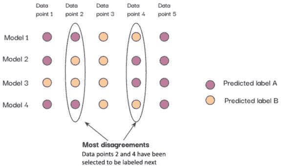

图 2.2 – 使用五个未标记数据点的查询委员会采样

*图 2.2*揭示了模型 1 和 4 之间的分歧，而不是模型 2 和 3，关于数据点 2。类似的模式也可以在数据点 4 上观察到。因此，数据点 2 和 4 已被选中发送到预言机进行标记。

查询委员会是一种广泛使用且有效的活跃机器学习策略，它解决了不确定性采样的局限性。虽然不确定性采样可能会偏向当前的学习者，并可能忽略其估计者关注范围之外的至关重要示例，但查询委员会克服了这些挑战。这种方法涉及同时维护多个假设，并选择导致这些假设之间产生不一致的查询。通过这样做，它确保了对数据的更全面和多样化的探索，从而增强了学习过程。例如，一个图像分类器的委员会可能会在传统采样无法捕捉到的模糊图像上产生很大的分歧。通过查询具有最大分歧的图像标签，例如对不寻常物体的不同预测，委员会可以集体改进。

查询委员会采样的常见技术包括**最大不一致**、**投票熵**和**平均 KL 散度**，我们将在下面讨论这些内容。

## 最大不一致

这种简单的方法关注委员会成员之间预测标签的直接不一致。在标签上大多数集成成员存在分歧的数据点被查询。例如，如果一个三模型委员会的标签投票为（1，2，3），这表明最大不一致，因为每个模型预测了不同的类别。查询具有最多标签冲突的点有助于我们只关注分裂委员会的案例。最大不一致的目标实例在集成中造成了最大的分歧。对这些高分歧点进行标记的目的是解决模型之间的核心差异。

让我们通过一个活跃机器学习中的查询委员会最大不一致方法的数值示例来探讨。在这个例子中，我们将考虑一个包含 10 个未标记数据点的集合，如图*图 2.3*所示，我们希望对这些数据进行标记以训练一个分类器。我们创建了两个委员会成员（模型），分别称为 M1 和 M2。我们使用 M1 和 M2 评估每个未标记数据点，以获得以下预测标签：

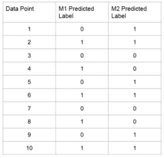

图 2.3 – 用数值示例说明查询委员会最大不一致方法

然后，我们选择两个委员会成员之间分歧最大的数据点。在这里，数据点 1、4、5、8 和 9 被 M1 和 M2 预测为不同的标签。我们选择这些点中的一个，比如点 4，来查询来自先知者的真实标签。然后，我们将新标记的点添加到重新训练委员会成员。

我们可以用一个简单的 Python 脚本来实现：

```py
import numpy as np
# Predicted labels from 2 committee members
y1 = np.array([0, 1, 0, 1, 0, 1, 0, 1, 0, 1])
y2 = np.array([1, 1, 0, 0, 1, 1, 0, 0, 1, 1])
# Calculate disagreement
disagreement = np.abs(y1 - y2)
# Find index of point with max disagreement
query_index = np.argmax(disagreement)
print(f"Data point {query_index+1} selected with maximum disagreement")
```

这将返回以下输出：

```py
Data point 1 selected with maximum disagreement
```

然后重复此过程，查询委员会预测标签分歧最大的点，直到达到足够的性能。最有信息量的点通过委员会成员的最大分歧显现出来。

## 投票熵

这种技术计算了集成委员会中每个模型的标签投票的熵。**熵**代表整体不确定性，熵值越高意味着模型预测的分布越广。熵值较低表明模型在标签上大体上达成一致。查询投票分布中熵值最大的数据点有助于定位委员会显示最高集体不确定性和分歧的实例。对具有最大熵的点进行标记将推动集成向更大的一致性发展。总的来说，投票熵识别出最分裂委员会的案例，将标记重点放在它们的分歧上。如果我们回到使用数值示例来更好地理解基于委员会的投票熵方法的工作原理，我们可以再次使用一个包含 10 个未标记数据点的池，如图*图 2**.4*所示，以及一个由两个模型 M1 和 M2 组成的委员会。我们对数据点上的每个类别得到以下预测概率：

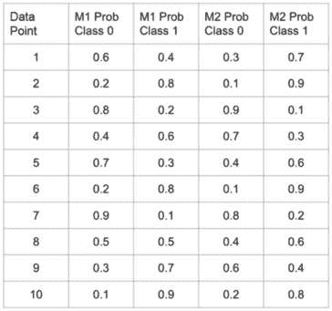

图 2.4 – 用一个数值示例来说明基于委员会的投票熵方法

我们按照以下方式计算每个点的投票熵：


这里，是平均每个委员会成员的。

在计算投票熵时，委员会成员的概率会被平均，因为我们想测量整个委员会对一个数据点的总不确定性或分歧。通过平均，我们实际上得到了整个委员会对每个类别的概率的“投票”，而不仅仅是考虑个别成员的预测。这使我们能够选择委员会在数据点上最不确定或与其预测分歧最大的数据点：

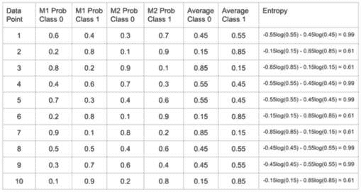

图 2.5 – 用每类的平均值和计算出的熵来展示查询委员会投票熵方法的一个数值示例

具有最大熵的点将在模型之间产生最多的分歧。在 *图 2**.5 中，点 1、4、5、8 和 9 具有最高的熵，因此我们查询它们的标签。下一步将是重新训练模型并重复此过程。

我们也可以用一些 Python 代码来写这个：

```py
import numpy as np
p1 = np.array([[0.6, 0.4], [0.2, 0.8], [0.8, 0.2], [0.4, 0.6], [0.7, 0.3],
               [0.2, 0.8], [0.9, 0.1], [0.5, 0.5], [0.3, 0.7], [0.1, 0.9]])
p2 = np.array([[0.3, 0.7], [0.1, 0.9], [0.9, 0.1], [0.7, 0.3], [0.4, 0.6],
               [0.1, 0.9], [0.8, 0.2], [0.4, 0.6], [0.6, 0.4], [0.2, 0.8]])
# Average probabilities per class
p_class0 = (p1[:, 0] + p2[:, 0]) / 2
p_class1 = (p1[:, 1] + p2[:, 1]) / 2
p_avg = np.concatenate((p_class0.reshape(-1, 1), \
    p_class1.reshape(-1, 1)), axis=1)
# Calculate entropy
H = -np.sum(p_avg * np.log2(p_avg), axis=1)
query_index = np.argmax(H)
print(f"Data point {query_index+1} selected with maximum entropy of {H[query_index]}")
```

此脚本的输出如下：

```py
Data point 1 selected with maximum entropy of 0.9927744539878083
```

接下来，我们将把重点转移到使用 KL 散度方法进行预测的计算上。

## 平均 KL 散度

此方法测量每个委员会成员预测的标签分布与所有成员的平均预测分布之间的**Kullback-Leibler 散度（KL 散度**）。

KL 散度定义为以下：

![<math xmlns="http://www.w3.org/1998/Math/MathML" display="block"><mrow><mrow><mrow><msub><mi>D</mi><mrow><mi>K</mi><mi>L</mi></mrow></msub><mo>(</mo><mi>P</mi><mo>|</mo><mfenced open="|" close=")"><mi>Q</mi></mfenced><mo>=</mo><mo>−</mo><mrow><munder><mo>∑</mo><mrow><mi>x</mi><mo>∈</mo><mi>X</mi></mrow></munder><mrow><mi>P</mi><mo>(</mo><mi>x</mi><mo>)</mo><mi mathvariant="normal">l</mi><mi mathvariant="normal">o</mi><mi mathvariant="normal">g</mi><mo>(</mo><mfrac><mrow><mi>Q</mi><mo>(</mo><mi>x</mi><mo>)</mo></mrow><mrow><mi>P</mi><mo>(</mo><mi>x</mi><mo>)</mo></mrow></mfrac><mo>)</mo></mrow></mrow></mrow></mrow></mrow></math>](img/8.png)

在这里，P 和 Q 是两个概率分布。

具有最高平均 KL 散度的数据点将被查询。更高的 KL 散度表明模型预测与委员会共识之间的差异更大。查询最大差异的点旨在针对个体模型与整体集成强烈不一致的实例。标记这些高差异点将使个体模型更接近委员会的平均值。平均 KL 散度识别出具有异常模型预测的案例，以便将标记重点放在协调上。让我们看一下我们的查询委员会平均 KL 散度方法的数值示例。同样，我们使用*图 2**.6*中显示的 10 个未标记数据点的池，以及一个由两个模型 M1 和 M2 组成的委员会。我们从 M1 和 M2 对每个数据点进行预测，并计算 M1 和 M2 预测之间的 KL 散度：

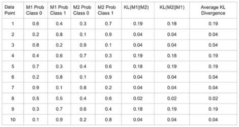

图 2.6 – 一个数值示例，说明查询委员会平均 KL 散度方法

我们计算 M1 和 M2 之间以及 M2 和 M1 之间的 KL 散度平均值。我们计算两个方向的 KL 散度（KL(M1||M2)和 KL(M2||M1)）——因为 KL 散度是非对称的，它将根据方向给出不同的值。

从 M1 到 M2 的 KL 散度 KL(M1||M2)衡量 M2 的分布如何近似 M1 的分布。另一方面，KL(M2||M1)衡量 M1 的分布如何近似 M2 的分布。

在查询委员会中，我们想要衡量两位委员会成员分布之间的总差异。仅仅使用 KL(M1||M2)或仅仅使用 KL(M2||M1)将无法捕捉到完整的差异。通过取 KL(M1||M2)和 KL(M2||M1)的平均值，我们得到两个分布之间总差异的对称度量。这为两个委员会成员在数据点上的整体差异提供了更好的指示。

在两个方向上取平均 KL 散度确保我们选择两个模型预测之间最大互变异的点。这揭示了标记以解决委员会不确定性的最有信息量的点。具有最大平均 KL 散度的点是分歧最大的点。因此，这里点 1、4、5 和 9 具有最高的平均 KL 散度。然后我们会查询这些标签，重新训练模型，并重复此过程。

我们也可以用一些 Python 代码来实现这一点：

```py
import numpy as np
p1 = np.array([[0.6, 0.4], [0.2, 0.8], [0.8, 0.2], [0.4, 0.6], [0.7, 0.3],
               [0.2, 0.8], [0.9, 0.1], [0.5, 0.5], [0.3, 0.7], [0.1, 0.9]])
p2 = np.array([[0.3, 0.7], [0.1, 0.9], [0.9, 0.1], [0.7, 0.3], [0.4, 0.6],
               [0.1, 0.9], [0.8, 0.2], [0.4, 0.6], [0.6, 0.4], [0.2, 0.8]])
KL1 = np.sum(p1 * np.log(p1 / p2), axis=1)
KL2 = np.sum(p2 * np.log(p2 / p1), axis=1)
avg_KL = (KL1 + KL2) / 2
print("KL(M1||M2):", KL1)
print("KL(M2||M1):", KL2)
print("Average KL:", avg_KL)
query_index = np.argmax(avg_KL)
print("\nData point", query_index+1, "selected with max average KL of", avg_KL[query_index])
```

这是我们的输出结果：

```py
KL(M1||M2): [0.19204199 0.04440301 0.04440301 0.19204199 0.1837869  0.04440301
0.03669001 0.020411   0.1837869  0.03669001]
KL(M2||M1): [0.1837869  0.03669001 0.03669001 0.1837869  0.19204199 0.03669001
0.04440301 0.02013551 0.19204199 0.04440301]
Average KL: [0.18791445 0.04054651 0.04054651 0.18791445 0.18791445 0.04054651
0.04054651 0.02027326 0.18791445 0.04054651]
Data point 1 selected with max average KL of 0.18791444527430518
```

在探索用于执行查询委员会采样的不同方法时，我们发现这可能会非常计算密集。确实，如图*图 2**.7*所示，查询委员会技术是一种迭代方法，每次向训练集中添加新的标记数据时，都需要重新训练委员会中的模型：

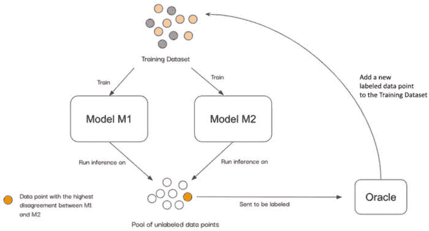

图 2.7 – 查询委员会采样技术中的迭代过程

总之，这项技术旨在通过量化集成模型之间的一致性水平来识别信息查询点，并提供了几个关键优势：

+   通过寻找各种模型解释不同的点来促进多样性。这些技术可以有效地优先处理可能提供有价值信息的查询点，从而提高基于查询的学习过程的整体质量。

+   它通过积极寻找不太可预测或常见的查询点来鼓励探索，从而对数据集有更全面的理解。

+   它提供了构建包含 SVMs、NNs 等多种不同模型的委员会的能力。这种多功能性允许在做出重要决策时采用多样化的策略和方法。通过利用这些不同的模型，你可以获得更深入的见解并提高委员会的整体性能。查询委员会方法与传统技术（如 bagging 和 boosting）不同。其主要目标是选择最有信息的未标记数据点进行标记并包含在训练集中。另一方面，传统的集成方法（如 bagging 和 boosting）侧重于结合多个模型以增强整体预测性能。确实，查询委员会方法通过计算委员会成员之间的不一致性来找到最佳的查询点，正如我们之前所看到的。传统的集成通过投票或平均来组合预测以产生统一的预测。

+   在未标记数据池中，底层分布的表示有限的情况下，它非常有用。通过结合不同委员会成员的意见和预测，查询委员会方法可以有效地解决未标记数据池中覆盖不良分布所提出的挑战。

通过利用委员会的不同意见，查询委员会增强了学习系统的整体性能。

现在，我们将更深入地探讨 EMC 策略的实施及其潜在优势。

# 使用 EMC 采样进行标记

EMC 旨在查询那些在被标记和训练后将对当前模型产生最大变化的点。这侧重于对具有最高预期影响的点进行标记。

EMC 技术涉及选择一个特定的数据点进行标记和学习，以对当前模型的参数和预测造成最大的改变。核心思想是查询如果知道其标签，将对模型参数的最大变化产生影响的点。通过仔细识别这个特定的数据点，EMC 方法旨在最大化对模型的影响并提高其整体性能。这个过程涉及评估各种因素和分析每个数据点的潜在影响，最终选择预期将对模型产生最大变化的那个，如图*图 2*.8*所示。目标是提高模型的准确性并使其在做出预测时更加有效。

当我们提到查询导致模型目标更新更大的点时，我们讨论的是在输入空间的不确定区域中识别高度信息性的示例。这些示例在影响和提升模型性能方面起着至关重要的作用。通过关注这些特定实例，我们可以更深入地了解输入空间的复杂性和微妙之处，从而实现更全面的理解和改进的整体结果：

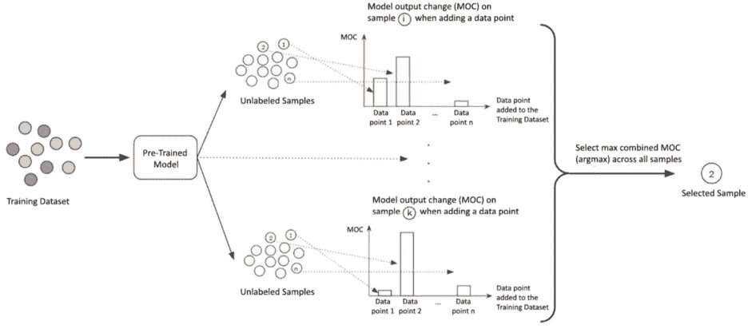

图 2.8 – EMC 采样

初始模型使用训练数据集进行训练。然后，根据将未标记样本包括在训练集中后模型输出的变化来评估这些样本。在*图 2*.8*中，图表显示了三个示例样本导致的**模型输出变化**（**MOC**）。在考虑所有数据的情况下，导致最大输出变化的样本被选中进行标记。

换句话说，在 EMC 采样中，过程从对未标记的示例进行排序开始。这种排序是通过估计如果每个示例都被标记，模型预测中预期会发生的变化来确定的。这种估计考虑了各种因素和考虑事项，最终为标记优先级提供了依据。

这种估计通常基于计算**预期梯度长度**（**EGL**）。EGL 方法估计如果模型在新的标记点上训练，损失函数梯度的预期长度。在训练判别概率模型时，基于梯度的优化通常被使用。为了评估模型的**变化**，我们可以检查训练梯度的尺寸。这个梯度指的是在训练过程中用来更新参数值的向量。简单来说，学习者应该选择实例，，当标记并包含在标记数据集中时，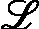)，将导致新的训练梯度具有最大的幅度：

![<math xmlns="http://www.w3.org/1998/Math/MathML" display="block"><mrow><mrow><msubsup><mi>x</mi><mrow><mi>E</mi><mi>G</mi><mi>L</mi></mrow><mi mathvariant="normal">*</mi></msubsup><mo>=</mo><munder><mi>argmax</mi><mi>x</mi></munder><mrow><munder><mo>∑</mo><mi>i</mi></munder><mrow><mi>P</mi><mfenced open="(" close=")"><mrow><msub><mi>y</mi><mi>i</mi></msub><mo>|</mo><mi>x</mi><mo>;</mo><mi>θ</mi></mrow></mfenced><mfenced open="‖" close="‖"><mrow><mo>∇</mo><mi mathvariant="script">l</mi><mo>(</mo><mi mathvariant="script">L</mi><mo>∪</mo><mfenced open="〈" close="〉"><mrow><mi>x</mi><mo>,</mo><msub><mi>y</mi><mi>i</mi></msub></mrow></mfenced><mo>;</mo><mi>θ</mi><mo>)</mo></mrow></mfenced></mrow></mrow></mrow></mrow></math>](img/11.png)

在这里，||.|| 是每个结果梯度向量的欧几里得范数，θ 是模型参数，x 是一个未标记的点，y 是对 x 的预测标签， 是通过将训练元组  添加到标记数据集 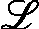 中所获得的新梯度。具有更长预期梯度的数据点被优先用于查询。更长的梯度表示在训练过程中模型参数的预期变化更大。通过选择具有高预期梯度长度的点，模型专注于一旦标记将对模型产生重大影响的样本。这针对的是那些将对模型预测更新产生巨大影响的不确定区域中的点。简而言之，EGL 识别出那些可能显著重塑决策边界的数据点。

通过采用这种技术，算法可以精确地识别出预计将对模型预测产生重大改变的具体数据点。选定的示例随后被发送进行标记，因为它们被认为在有效训练模型方面具有最大的价值。一旦指定，这些信息样本就会无缝地集成到现有的训练数据中，从而促进对模型整体性能和准确性的必要更新和改进。

EMC 方法有几个关键优势：

+   它能够在输入空间内积极寻找有影响力和代表性不足的区域。这意味着它可以有效地识别在传统建模方法中可能被忽视或未得到足够关注的区域。假设我们正在训练一个预测房价的模型。输入特征包括平方英尺、卧室数量、位置等等。使用传统的建模方法，我们可能会收集一个随机样本的房屋来训练模型。然而，如果某些社区或房屋风格不太常见，这可能会导致某些社区或房屋风格代表性不足。EMC 方法会分析当前模型，并确定新训练数据可能导致模型预测最大变化的地方。例如，它可能会发现添加更多旧房屋的样本可以更好地校准模型对年龄影响价格的理解，或者从代表性不足的新郊区开发中收集数据可以提高该地区房屋的性能。通过积极寻找这些有影响力的区域，EMC 可以使模型在更少的整体训练示例下更加稳健。与被动或随机数据收集相比，它降低了输入空间中某些区域欠拟合的风险。它可以帮助揭示可能不是立即显而易见的隐藏模式或关系，从而进一步增强对数据集的整体理解。

+   它与概率模型和基于核的模型兼容。通过利用这些模型的概率性质，EMC 方法可以提供有洞察力和准确的预测。此外，它与基于核的模型的兼容性允许对复杂数据模式和相关关系有更深入的理解。这些特性的结合使 EMC 方法成为分析和解释广泛领域数据的有力工具。

+   它允许在每一步无需完全重新训练的情况下进行估计。这意味着过程可以更加高效且节省时间，因为它消除了反复从头开始训练模型的需求。相反，该方法通过关注模型参数的预期变化来估计模型的变化。通过利用这种方法，你可以在仍然获得准确和可靠估计的同时，节省宝贵的时间和资源。

总结来说，EMC 查询旨在识别对模型影响最大的点。它选择那些预期影响最大的点。这种方法在文献中广泛讨论，但由于其高计算成本，在实践中并未得到实施。

接下来，我们将探讨 EER 采样。这种技术通过选择预期对错误减少贡献最大的点来减少模型的误差。通过战略性地采样这些点，我们可以提高整体模型的准确性。

# 使用 EER 进行采样

EER 关注于衡量泛化误差的潜在下降，而不是像先前方法中看到的那样，关注模型期望的变化。目标是通过对当前标记集和剩余未标记样本进行训练来估计模型预期的未来误差。EER 可以定义为以下：

![<math xmlns="http://www.w3.org/1998/Math/MathML" display="block"><mrow><mrow><msub><mi>E</mi><msub><mover><mi>P</mi><mo stretchy="true">ˆ</mo></mover><mi mathvariant="script">L</mi></msub></msub><mo>=</mo><mrow><msub><mo>∫</mo><mi>x</mi></msub><mrow><mi>L</mi><mfenced open="(" close=")"><mrow><mi>P</mi><mfenced open="(" close=")"><mrow><mi>y</mi><mo>|</mo><mi>x</mi></mrow></mfenced><mo>,</mo><mover><mi>P</mi><mo stretchy="true">ˆ</mo></mover><mfenced open="(" close=")"><mrow><mi>y</mi><mo>|</mo><mi>x</mi></mrow></mfenced></mrow></mfenced><mi>P</mi><mo>(</mo><mi>x</mi><mo>)</mo></mrow></mrow></mrow></mrow></math>](img/15.png)

在这里， 是成对标记数据的集合，，和 是估计的输出分布。L 是一个选择的损失函数，用于衡量真实分布  和学习者的预测  之间的误差。

这涉及到选择预计未来误差（称为*风险*）最低的实例进行查询。这使主动机器学习专注于减少长期泛化误差，而不仅仅是立即的训练性能。

换句话说，EER 选择那些在查询和学习后预计将显著减少模型在相同分布的新数据点上错误的数据点。通过关注如图*图 2**.9 所示的最小化未来预期误差的点，EER 旨在识别有价值的训练示例，这将增强模型有效泛化的能力。这项技术针对高价值的训练示例，通过最小化错误预测来提高模型的表现。

这种方法通过避免包含冗余的相似示例，而是专注于更好地覆盖特征空间的多样化边缘情况，有助于防止短期过拟合。例如，在图像分类器的情况下，该技术可能会优先考虑包含能够捕捉广泛特征的多样化边缘情况，而不是包含冗余的相似示例：

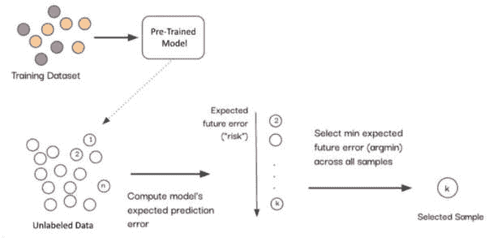

图 2.9 – EER 采样

可以使用各种损失函数来计算预期模型的预测误差，例如对数损失，其定义为 ![<math xmlns="http://www.w3.org/1998/Math/MathML"><mrow><mrow><mi>L</mi><mo>=</mo><mrow><msub><mo>∑</mo><mrow><mi>y</mi><mo>∈</mo><mi>Y</mi></mrow></msub><mrow><mi>P</mi><mfenced open="(" close=")"><mrow><mi>y</mi><mo>|</mo><mi>x</mi></mrow></mfenced><mi mathvariant="normal">l</mi><mi mathvariant="normal">o</mi><mi mathvariant="normal">g</mi><mo>(</mo><msub><mover><mi>P</mi><mo stretchy="true">ˆ</mo></mover><mi mathvariant="script">L</mi></msub><mfenced open="(" close=")"><mrow><mi>y</mi><mo>|</mo><mi>x</mi></mrow></mfenced><mo>)</mo></mrow></mrow></mrow></mrow></math>](img/21.png)，或者 0/1 损失，其定义为 .

由于误差减少的估计，EER 会带来显著的时间成本。为了计算预期的泛化误差，分类器必须针对每个数据点重新优化，考虑其可能的标签。此外，还需要重新推断其他数据点的标签。然而，这项技术提供了一些关键优势：

+   它允许直接优化减少泛化误差的真实目标，而不是仅仅关注提高训练性能。通过优先考虑减少泛化误差，EER 允许在现实世界场景中进行更准确和可靠的预测。这不仅提高了模型的总体性能，还确保了它能够有效地推广到未见过的数据。

+   它考虑了对未见数据点的影响，而不仅仅是训练集。通过这样做，EER 有助于减轻过拟合，这是机器学习和统计建模中常见的挑战。过拟合发生在模型在训练数据上表现极好，但无法很好地推广到新的、未见过的数据时。EER 通过综合评估潜在错误及其减少来直接应对这个问题。这确保了模型的表现不仅限于训练集，而是扩展到现实世界场景，使其成为数据驱动决策的有价值工具。

EER 是一个预测性和鲁棒的查询框架，专注于最大限度地减少模型的一般化误差。与 EMC 方法类似，EER 方法在文献中是一个广泛讨论的话题。然而，它并没有在实用应用中得到广泛采用，主要是因为它对计算资源的需求非常显著。

我们将要探索的下一个采样方法是密度加权采样，旨在通过从所有密度区域中选择代表性点来提高多样性。

# 理解密度加权采样方法

**密度加权方法**是旨在仔细选择能够准确代表其各自局部邻域密度的点的途径。通过这样做，这些方法优先考虑对多样化聚类中心的标记，确保数据的全面和包容性表示。

密度加权技术在查询点时非常有用和有效。这些技术利用了信息性度量与密度权重的一个巧妙组合。一个 **信息性度量** 提供了一个分数，表示如果我们查询数据点的标签，它对改进模型有多有用。信息性越高，表示该点对标记和添加到训练集越有价值。在本章中，我们探讨了几个信息性度量，如不确定性和不一致性。在密度加权方法中，信息性分数与密度权重相结合，以确保我们在输入空间的不同区域选择具有代表性且多样化的查询。这是通过根据数据点的密度和信息性为其分配权重来实现的。信息性高且密度低的数据点将获得更高的权重，因此更有可能被选中进行标记。密集聚类中的点将获得较低的权重。密度和信息性通过乘法、指数或加法公式相结合。这平衡了信息性和密度，以实现多样性。

密度权重表示每个点周围局部邻域的密度，允许从不同密度中更全面和准确地采样点，如图 *图 2**.10 所示。这种方法避免了仅仅关注密集聚类的陷阱，这可能导致冗余点。通过考虑密度权重，这些技术保证所选点能够有效地捕捉数据集的整体分布。因此，获得的结果更有意义，并提供了对数据的更深入洞察：

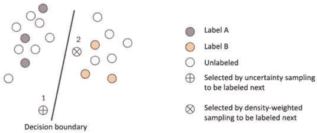

图 2.10 – 密度加权采样

在 *图 2**.10 中，我们可以观察到样本密度在主动机器学习过程中的重要性。由于实例 1 位于决策边界附近，这使得它成为被选为最不确定实例的理想候选者。然而，如果我们更仔细地分析情况，很明显，选择实例 2 在提高模型整体质量方面会更有利。这是因为实例 2 不仅能够准确代表自身，而且还能代表数据分布中的其他实例。因此，将其纳入主动机器学习过程可以导致更全面和可靠的模型改进。

在前面的例子中，通过各种密度加权采样方法（如 kNN 密度、**核密度估计**（**KDE**）、K-均值聚类和**最大均值差异**（**MMD**））实现选择实例 2 的查询可以完成。

让我们从导入和生成虚拟数据开始：

```py
import numpy as np
import matplotlib.pyplot as plt
from sklearn.neighbors import NearestNeighbors
from sklearn.neighbors import KernelDensity
from sklearn.cluster import KMeans
from sklearn.metrics.pairwise import pairwise_distances
# Generate sample 2D data
np.random.seed(1)
X = np.concatenate((np.random.randn(100, 2) + [2, 2],
                    np.random.randn(50, 2)))
```

现在，让我们了解并应用不同的基于密度的技术来处理我们的 `X` 样本数据：

+   **kNN 密度**通过每个数据点的**k 个最近邻**来计算其周围的局部密度。密度是通过取到 k 个最近点平均距离的倒数来估计的。密度较高的点具有更高的密度，而孤立点具有较低的密度。估计的密度随后用作权重。当与信息性标准（如不确定性）结合时，稀疏邻域中的点会获得更高的密度权重，从而提高它们的优先级。kNN 密度加权提供了一种有效的方法来增加样本多样性，并在查询时避免对簇进行过度采样：

    ```py
    # kNN density
    knn = NearestNeighbors(n_neighbors=5).fit(X)
    distances, _ = knn.kneighbors(X)
    knn_density = 1 / distances.sum(axis=1)
    ```

+   **核密度估计（KDE**）使用以点为中心的核函数来估计每个点周围的局部密度。通常使用高斯核。通过将附近点的核密度求和来获得整体估计密度。与 kNN 密度类似，稀疏区域的点与拥挤区域相比将具有较低的核密度。这些密度值可以与信息性标准结合使用作为权重。孤立簇中的点将被赋予更高的权重，从而提高它们的查询优先级。KDE 提供了一种平滑、概率性的局部密度估计，与 kNN 的离散簇相对。它比 kNN 计算成本更高，但在高维中可以高效实现。KDE 加权将采样集中在代表性低密度点上：

    ```py
    # Kernel density estimation
    kde = KernelDensity(kernel='gaussian', bandwidth=0.2).fit(X)
    kde_dens = np.exp(kde.score_samples(X))
    ```

+   **K-means 密度**使用 k-means 将未标记的数据点聚类成 k 个簇。每个簇的大小表示其密度——较小的簇对应于稀疏区域。这种簇密度可以与信息性标准结合使用作为权重。较小、更紧密的簇中的点会获得更高的权重，从而使其更有可能被查询。这平衡了不同密度下的采样。K-means 提供了一种简单的方法来估计密度并从所有密度中识别代表性点。它速度快，并且在大数据集上具有良好的扩展性。一个限制是预先确定簇的数量，k。K-means 密度加权将主动机器学习集中在所有密度的多样化案例上：

    ```py
    # K-means clustering
    km = KMeans(n_clusters=5).fit(X)
    km_density = 1 / pairwise_distances(X, 
        km.cluster_centers_).sum(axis=1)
    ```

+   **最大均值差异（MMD**）测量分布之间的**距离**以识别低密度区域的点。计算一个点的邻域分布与整体数据分布之间的 MMD。较高的 MMD 表明局部区域与整体分布非常不同，因此它很可能是一个低密度区域。然后，将这些 MMD 密度分数与信息性度量结合使用作为权重。具有高 MMD 的稀疏、孤立区域中的点在查询时将获得更高的优先级。这导致在变化密度上实现平衡采样，从而避免簇过度采样。MMD 提供了一种原则性的方法来估计密度，它捕捉了有用的非线性变化。MMD 密度加权将主动机器学习集中在代表性低密度区域上：

    ```py
    # Maximum Mean Discrepancy
    mmd = pairwise_distances(X).mean()
    mmd_density = 1 / pairwise_distances(X).sum(axis=1)
    ```

现在，让我们可视化这些密度加权采样方法：

```py
# Plot the density estimations
fig, axs = plt.subplots(2, 2, figsize=(12, 8))
axs[0, 0].scatter(X[:, 0], X[:, 1], c=knn_density)
axs[0, 0].set_title('kNN Density')
axs[0, 1].scatter(X[:, 0], X[:, 1], c=kde_dens)
axs[0, 1].set_title('Kernel Density')
axs[1, 0].scatter(X[:, 0], X[:, 1], c=km_density)
axs[1, 0].set_title('K-Means Density')
axs[1, 1].scatter(X[:, 0], X[:, 1], c=mmd_density)
axs[1, 1].set_title('Maximum mean discrepancy (MMD) Density')
fig.suptitle('Density-Weighted Sampling methods')
plt.show()
```

结果图展示在 *图 2**.11* 中：

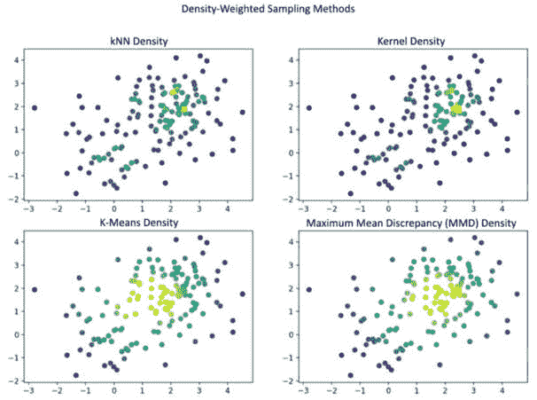

图 2.11 – 不同密度加权采样方法的比较

包括之前提到的在内的密度加权采样方法提供了多种优势：

+   它们可以帮助通过选择更有可能提供信息的样本来提高机器学习模型的表现。这是因为位于数据高密度区域的样本更有可能代表基础分布，因此更有可能对模型提供信息。

+   它们有助于减少训练模型所需的标注样本数量。这是因为密度加权采样可以帮助将标注工作集中在最有信息的样本上，这可能导致模型更快收敛。

+   它们可以与任何类型的数据一起使用。密度加权采样不对数据分布做出任何假设，因此可以与任何类型的数据一起使用，包括结构化和非结构化数据。

总结来说，密度加权，这是一种用于增加样本多样性和覆盖率的技巧，提供了一种有效且高效的方法。通过根据每个样本的密度为其分配权重，这种方法确保了结果样本集更准确地代表基础人群。采用这种方法，您可以获得对数据的更全面理解，从而进行更好的决策和分析。总的来说，密度加权是研究和统计分析中的一个宝贵工具，可以帮助您突出那些可能被忽视的隐藏模式和趋势。

现在我们已经讨论了几种查询策略，让我们比较它们以了解它们之间的表现：

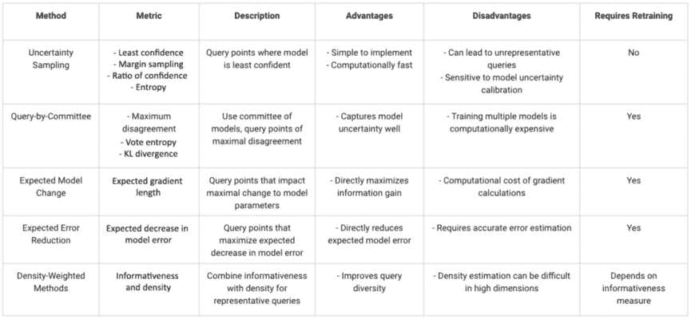

图 2.12 – 查询策略比较图

*图 2**.12* 总结并比较了本章中讨论的各种查询策略。

# 摘要

在本章中，我们介绍了设计有效的主动机器学习查询策略的关键技术，如不确定性采样、委员会查询、EMC、EER 和密度加权。展望未来，在下一章中，我们的重点将转向探索管理闭环中人类角色的策略。优化与专家标签器的交互对于确保主动机器学习过程的最大效率至关重要。通过理解人类交互的复杂性并利用这些知识来简化标注过程，我们可以显著提高主动机器学习算法的效率和效果。在下一章中，我们将讨论如何管理主动机器学习中人类标注员的角色。
