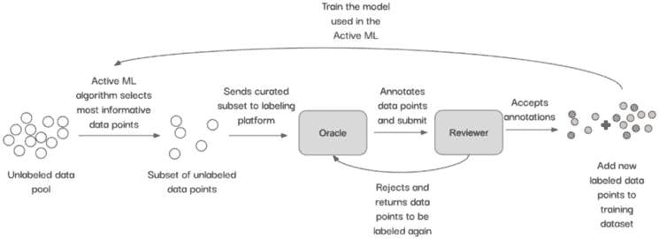
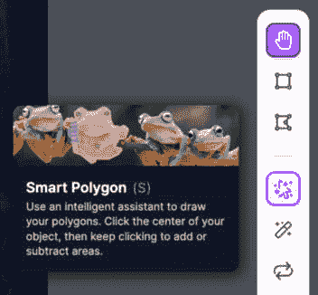
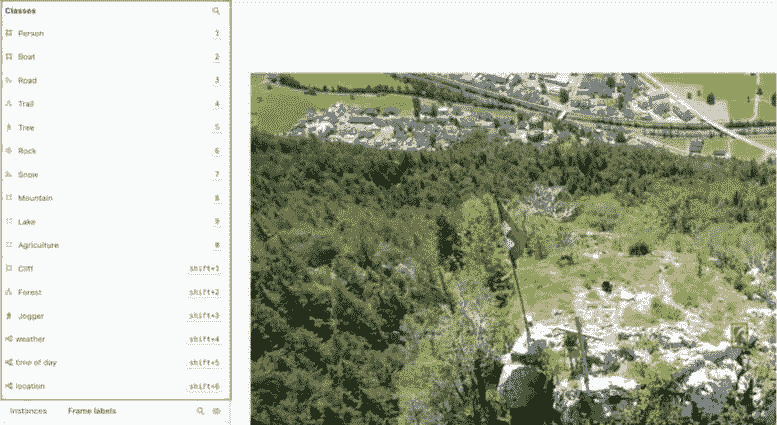
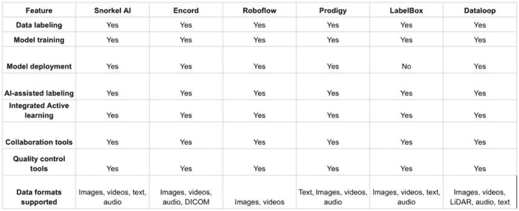
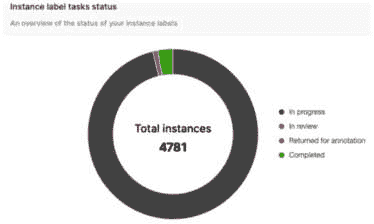

# 第三章：管理人机交互

活跃式机器学习通过智能选择由人类神谕进行标记的最具信息量的样本，承诺实现更高效的机器学习。然而，这些人机交互系统的成功取决于有效的界面设计和工作流程管理。在本章中，我们将介绍优化活跃式机器学习中人类角色的最佳实践。首先，我们将探讨交互式系统设计，讨论如何创建能够实现高效和准确标注的标记界面。接下来，我们将提供对管理标注管道的领先人机交互框架的广泛概述。然后，我们将转向通过裁决和质量控制处理模型与标签之间的不一致。之后，我们将讨论招募合格标注员和管理他们的策略。最后，我们将检查评估和确保高质量标注以及适当平衡数据集的技术。到本章结束时，你将具备构建充分利用人类与 AI 共生关系的优化人机交互系统的技能。

在本章中，我们将讨论以下主题：

+   设计交互式学习系统和工作流程

+   处理模型与标签不一致

+   有效管理人机交互系统

+   确保标注质量和数据集平衡

# 技术要求

在本章中，我们将使用`huggingface`包，因此你需要按照以下步骤进行安装：

```py
pip install datasets transformers huggingface_hub && apt-get install git-lfs
```

此外，你还需要以下导入：

```py
from transformers import pipeline
import torch
from datasets import load_dataset
import numpy as np
import pandas as pd
from sklearn.metrics import accuracy_score
```

# 设计交互式学习系统和工作流程

人机交互系统的有效性在很大程度上取决于标注界面和工作流程的设计是否得当。即使有先进的活跃式机器学习算法选择最有用的数据点，糟糕的界面设计也可能破坏标注过程。如果没有直观的控制、信息丰富的查询和适应人类的效率高工作流程，标注质量和速度将受到影响。

在本节中，我们将介绍优化与活跃式机器学习系统交互的人类体验的最佳实践。遵循这些指南将使你能够创建直观的标注管道，最大限度地减少歧义，尽可能简化标注过程。我们还将讨论集成活跃式机器学习查询、收集标注员反馈以及结合专家和众包标注员的策略。通过关注以人为中心的设计，你可以开发出最大化人类输入模型效用性的交互式系统。

首先，我们将提供之前提到的术语的定义，因为它们将是本节的主要内容。

**标注界面**是通过它，人类标注员为数据样本提供标签的用户界面，例如*Roboflow*、*Encord*和*LabelBox*等。它包括每个样本的视觉展示，以及输入或选择所需标签的控制和机制。例如，一个目标检测标注界面可能显示一张图像并提供绘制对象边界框和为每个框选择类别标签的工具。标注员可以使用界面控制来标注图像中出现的汽车、行人、动物和其他对象。这可以在*图 3.1*中看到，其中狗周围已经用*狗*类别绘制了边界框：


图 3.1 – 标注员在狗周围绘制边界框的标注界面示例

现在，让我们来谈谈工作流程。

**工作流程**是标注员完成标注任务所遵循的端到端步骤序列。它包括标注工作的完整生命周期，从接收待标注的样本，与界面交互应用标签，提交完成的标注，以及可能处理异常或错误，如图*图 3.2*所示。优化工作流程涉及简化这些步骤，以便标注员可以高效地完成标注。对于图像分类任务，工作流程可能如下进行：

1.  标注员登录到标注系统并接收一批需要标注的图像。

1.  标注员首先看到第一张图像，并使用界面应用标签。

1.  标注员提交标注后的图像并继续到下一张图像。

1.  在标注完一批图像后，标注员提交工作，这会触发一个质量检查阶段。

1.  审查员检查标注图像的准确性和一致性。

1.  如果发现任何错误，带有错误标注的图像将被退回给标注员，此时他们需要重新标注这些图像。

1.  一旦所有图像通过质量检查，工作将被标记为完成：



图 3.2 – 标注工作流程的说明

简而言之，标注界面专注于与单个样本交互并应用标签的具体时刻。工作流程则更全面地看待整个过程以及如何顺畅地引导标注员完成标注工作。一个有效的人机交互系统需要在围绕人类用户设计这两个方面时都仔细考虑。

现在我们已经了解了标注界面和工作流程是什么，我们明白它们可以极大地影响一个活跃的机器学习系统中标注的效率、准确性和整体质量。在设计交互式系统时，有几个关键考虑因素：

+   **直观且高效的界面**：标记界面应该是直观且易于使用的。在选择您想要用于项目的标记界面时，请记住，标记者将使用的 UI 必须简单且高效。例如，在计算机视觉标注项目中，围绕感兴趣的对象绘制边界框或多边形是否容易？是否有加快标记过程的功能，例如使用预训练模型，如 Meta 的**Segment Anything Model**（**SAM**）([`segment-anything.com/`](https://segment-anything.com/))，该模型可以分割图像中的任何对象并在图像上预先标记对象？Roboflow 提供的智能多边形功能是一个很好的例子，它允许用户使用多边形或边界框自动标记对象，如图*图 3.3*所示。我们将在本章后面讨论 Roboflow。



图 3.3 - Roboflow 的智能多边形功能，使用 SAM 自动在图像上标记对象，如[`blog.roboflow.com/automated-polygon-labeling-computer-vision/`](https://blog.roboflow.com/automated-polygon-labeling-computer-vision/)所示

+   **入门资源**：标记者使用标记平台所需的培训应尽可能少。为了最小化所需的培训量，一个有效的方法是提供一份由熟悉使用标记界面的知识人士最初编写的入门文档。然后，标记者可以在学习如何克服障碍的过程中自行编辑和更新该文档。这样，标记者的培训变得更加高效，因为他们可以利用每个标记者获得的知识，并将所学内容传授给新加入团队的新成员。

+   **本体 – 命名约定**：在设计标注项目的工作流程时，一个重要的考虑因素是仔细选择用于标注的类的名称。对于同一类使用多个拼写或词汇是常见问题。例如，在一个旨在对各种宠物进行分类的项目中，如果标注者决定使用狗的品种（例如，澳大利亚牧羊犬）而不是类*狗*，这可能会在以后造成问题。修复这些问题并不总是容易，可能耗时且昂贵。因此，选择一个允许使用标注本体的标注平台至关重要。**标注本体**是一个结构化词汇表，它提供了对如何标注数据的共同理解，定义了类，并概述了不同类之间的关系，特别是在存在嵌套结构的情况下。本体还应支持纠正拼写错误或错误的命名。在这种情况下，类的名称应该是可修改的，并更新使用该类标注的所有对象。此外，本体应在不同的标注项目中可共享，以确保一致性。本体应支持不同风格的标注，如边界框、多边形、分类等。例如，标注平台 Encord 具有灵活的标注本体功能，如图*图 3.4*所示。我们将在本章后面讨论 Encord：



图 3.4 – Encord 的标注本体

+   **信息查询**：提供给标注者的样本应提供足够的信息和上下文，以确保标注任务的清晰性。这可能涉及提供完整的文档或图像，而不仅仅是摘录。查询应设计得尽可能减少任何潜在的歧义。例如，当使用主动机器学习从未标记的视频中选择用于标注的最具信息量的帧时，仔细组织工作流程以确保标注者了解他们正在标注的具体视频至关重要。在这种情况下，解决方案是确保选定的帧按视频分开并排序后再发送到标注平台。然后，应将这些帧以包含因缺少未选帧而产生的跳跃的视频形式呈现给标注者。然而，需要注意的是，这些缺失的帧并没有完全消除整体上下文。Encord 的标注平台为这类情况提供了一个解决方案，其名为*图像序列*的功能。他们的图像序列格式将图像组以视频的形式呈现给标注者。

+   **自动化工作流程**：标注任务应尽可能自动化。创建任务的过程应涉及最小程度的人类干预。实现这种自动化的一个有效方法是通过实施一个脚本，该脚本可以在未标记的数据池上运行模型推理，然后使用这些预测在主动机器学习采样中，尤其是在利用不确定性采样时，最后将选定的数据样本发送到标注平台，并根据他们的可用性分配给标注者和审稿人。

+   **标注者反馈**：允许标注者对困难或模糊的样本提供反馈或提问，可以使注释质量随着时间的推移而提高。因此，标注平台应包括评论和聊天系统，这将允许标注者互相帮助或寻求领域专家和审稿人的指导。

通过关注这些方面，您可以创建适应人类优势和局限性的标注系统。精心设计的界面和工作流程导致更准确、一致和高效的注释，这对于机器学习项目的成功至关重要。现在，让我们探索您可以考虑的当前标注平台。

# 探索人类在循环的标注工具

**人类在循环的标注框架**对于实现人类与机器学习系统之间有效协作至关重要。在本节中，我们将探讨一些领先的用于主动机器学习的人类在循环标注工具。

我们将探讨这些框架如何允许人类通过优化人类-人工智能协作的界面和工作流程来提供注释、验证预测、调整模型置信度阈值以及指导模型训练。人类在循环框架提供的关键能力包括注释辅助的主动机器学习、人类验证预测、置信度校准和模型可解释性。

我们将要检查的标注工具包括 Snorkel AI、Prodigy、Encord、Roboflow 等。我们将通过示例说明如何利用这些工具在有效的人类指导下构建应用主动学习系统。我们将讨论不同方法的优缺点。在本节结束时，您将深入了解如何根据您的用例需求和限制确定适合您的机器学习项目的正确人类在循环框架。

## 常见的标注平台

许多标注平台提供了一系列数据标注功能，包括人工智能辅助标注、主动机器学习、协作工具和质量控制工具。然而，它们在定价、模型训练、部署能力、数据管理和整理工具以及模型可解释性功能方面存在差异。例如，当我们检查如图 3.5 所示的六种最常用的标注平台时，我们可以观察到这些区别：



图 3.5 – 六个最常见的标注平台比较表

总体而言，之前提到的所有标注平台都提供了各种优点和缺点。选择一个适合特定 ML 项目需求和要求的平台非常重要。

如果你正在寻找一个具有广泛功能平台的用户，包括 AI 辅助标注、主动学习、协作工具和质量控制，那么 Snorkel AI ([`snorkel.ai/`](https://snorkel.ai/))、Encord ([`encord.com/`](https://encord.com/))、LabelBox ([`labelbox.com/`](https://labelbox.com/))和 Dataloop ([`dataloop.ai/`](https://dataloop.ai/))可能是适合你的选择。另一方面，如果你需要一个专门为**自然语言处理**（**NLP**）任务设计的平台，那么 Prodigy ([`prodi.gy/`](https://prodi.gy/))可能是一个不错的选择。

接下来，我们将检查如何处理模型与人工意见不一致的情况。

# 处理模型与标签之间的不一致

模型预测与人工标签之间的不一致是不可避免的。在本节中，我们将研究如何识别和解决冲突。

## 编程识别不匹配

为了识别模型预测与人工标注标签之间的差异，我们可以编写一些简单的 Python 代码来突出显示这些不匹配以便审查。

让我们考虑一个 NLP 情感分类器的例子。这种分类器旨在分析和理解文本中表达的情感或情绪。通过检查给定文本中使用的单词、短语和上下文，NLP 情感分类器可以确定情感是正面、负面还是中性。首先，我们将使用 Huggingface 的`sentiment-analysis`模型：

```py
sentiment_pipeline = pipeline("sentiment-analysis")
data = ["I love you", "I hate you"]
sentiment_pipeline(data)
```

这返回以下输出：

```py
[{'label': 'POSITIVE', 'score': 0.9998656511306763},
{'label': 'NEGATIVE', 'score': 0.9991129040718079}]
```

模型正确地分类了这两句话。现在，我们想要研究是什么标志了标注数据集与模型预测之间的不匹配，以便进行进一步审查。因此，我们将从`huggingface`下载一个名为*imdb*的标注数据集。这个数据集是一个大型的电影评论数据集，用于二元情感分类。我们可以使用以下代码行来加载数据集：

```py
imdb = load_dataset("imdb")
```

为了测试目的，我们只使用几个样本：

```py
small_dataset = imdb["train"].shuffle(seed=120).
    select([i for i in list(range(5))])
print(small_dataset)
```

这返回以下输出：

```py
Dataset({
    features: ['text', 'label'],
    num_rows: 5
})
```

我们可以通过查看数据集的最后一条记录来更好地了解这个数据集：

```py
small_dataset[-1]
```

这给出了以下输出：

```py
{'text': "Shot into car from through the windscreen, someone is playing someone else their latest song, someone else didn't react, according to the voice-over. I just wonder how that came to be made. There were too many scenes in this movie that I wondered about how come a camera was there. If the scenes shot where the Warhols descended on a BJM post-party are true then that was inexcusable exploitation to the max, if not, then it was a total fabrication, either way it made me uncomfortable, if that was the purpose? All the way thru this movie I kept wondering how the footage came about. Taken at face value, a nice portrait of the (tortured) genius we all believe ourselves to be.",
'label': 1}
```

在这里，我们有一个名为`text`的字段，它提供了电影的评论，还有一个名为`label`的字段，它将情感分类为正面或负面。在这种情况下，它是正面的。

让我们收集模型对这五个样本的预测：

```py
classes = ['NEGATIVE', 'POSITIVE']
results = []
for review in small_dataset['text']:
results.append(classes.index(sentiment_pipeline(review)[0]['label']))
print(results)
```

这返回以下输出：

```py
[1, 0, 0, 1, 0]
```

现在，为了找出我们是否有与数据集原始标注的不匹配，我们必须定义`x_true`和`y_true`，如下所示：

```py
y_true = np.array(small_dataset['label'])
x_true = np.array(small_dataset['text'])
```

在这里，`x_true`是一个包含评论的数组，而`y_true`是一个包含标签的数组。我们可以将这些与模型的预测进行比较：

```py
# Compare to true labels
mismatches = np.where(results != y_true)[0]
# Return mismatched samples
X_mismatched = x_true[mismatches]
y_mismatched = y_true[mismatches]
print(f"There are {len(X_mismatched)} mismatches: {X_mismatched}")
```

这将返回以下输出：

```py
There are 2 mismatches: ['"Meatball Machine" has got to be one of the most complex ridiculous, awful and over-exaggerated sci-fi horror films that I have ever came across. It is about good against evil and a coming-of-age tale, with the aim of to entertain with bloody, sleazy and humorous context. Because of that the violence isn\'t particularly gruesome and it doesn\'t make you squirm, but the gratuitous bloodletting and nudity does run freely. The performances by Issei Takahashi and Toru Tezuka is the worst i have seen, if that was not enough it is also directed by an unheard of director called Yudai Yamaguchi. This movie just have it all, it is bad to the bone!, A must see for every b-movie freak!!!... Simply: an enjoying and rare gem.'
"Shot into car from through the windscreen, someone is playing someone else their latest song, someone else didn't react, according to the voice-over. I just wonder how that came to be made. There were too many scenes in this movie that I wondered about how come a camera was there. If the scenes shot where the Warhols descended on a BJM post-party are true then that was inexcusable exploitation to the max, if not, then it was a total fabrication, either way it made me uncomfortable, if that was the purpose? All the way thru this movie I kept wondering how the footage came about. Taken at face value, a nice portrait of the (tortured) genius we all believe ourselves to be."]
```

在这里，模型和人类不一致的数据点已被返回。在这种情况下，这些数据点将被选中进行额外审查。

## 手动审查冲突

在采样不匹配案例后，我们可以进行手动审查。以下是一些示例场景：

+   模型预测的是**狗**，但人类标注的是**猫**。在审查过程中，照片质量很差，实际上是一只狗。这是一个人为错误。

+   模型预测的是**负面**情绪，但根据审阅者的判断，文本是自信地**正面**的。这表明模型存在弱点，需要修复。

对模型预测进行手动审查可以提供关于模型和人类标注者所犯错误的有价值见解。一个关键优势是它能够识别训练数据中的**系统性偏差**，以及模型以人类不会的方式失败的情况。然而，手动审查耗时且受限于人类的主观性和监督。通常，只有一小部分案例被审查，这可能无法揭示模型的所有弱点。虽然手动审查在模型开发期间作为有用的调试工具很有用，但进行大规模审查通常不切实际。在这种情况下，可能需要采用如主动学习周期等替代技术来进一步提高模型的鲁棒性。

利用不匹配采样的另一种方式是将不匹配的样本包含在主动机器学习池中重新标注。这有助于更好地理解复杂案例，并使模型能够更有效地处理此类案例。这种持续添加和重新标注数据的迭代过程有助于微调模型，而无需手动审查。

通过系统地识别、理解和解决模型与标注之间的不一致，系统会随着时间的推移而改进。关键是在这个过程中保持人类的监督。在下一节中，我们将讨论如何管理闭环人类系统。

# 有效管理闭环人类系统

获取高质量的标注需要找到、审查、支持和保留有效的标注者。构建一个符合机器学习项目要求的适当标注团队至关重要。

第一个选择是建立内部标注团队。这涉及到雇佣全职员工进行数据标注，这有助于密切管理和培训。当内部进行时，培养领域专业知识更容易。然而，这种方法也有缺点，例如成本较高和人员流动。这种方法仅适用于大型、持续的数据标注需求。

另一种选择是使用 ScaleAI 等平台进行众包标注任务，这些平台允许将标注任务分配给大量按需工作的人员。这种选择提供了灵活性和较低的成本，但可能缺乏领域专业知识。与匿名众包工作者合作时，质量控制变得具有挑战性。

您可以使用第三方标注服务，例如 Innovatiana，该服务专门为 ML 项目提供训练有素的标注员。此选项利用现有的标注团队和工作流程。然而，这可能比众包成本更高，且管理起来更具挑战性。

最后，混合选项也是可行的。例如，您可以使用结合第三方标注员和内部审查员的混合策略。最佳方法取决于预算、时间表、数据敏感性、领域专业知识以及项目范围。来源的组合提供了灵活性。关键是实施强大的培训、验证和监控，以从任何标注资源中获得所需的质量。

*接下来要问的问题是如何高效地管理标注* *团队*。

为了最大限度地提高效率，管理标注团队需要制定明确的指南，使标注员了解期望和整体目标。如本章前面所述，工作流程应结构化以优化标注员的时间，尽可能自动化，并最小化重复性任务。提供良好的工具也是关键。

当可行时，给予标注员访问仪表板和指标的权利，以便他们可以看到不断增长的数据库。这使他们保持对过程的参与。例如，在*图 3*.6 中，我们可以看到在 Encord 平台上，标注员可以看到他们已经标注了多少以及还剩下多少：



图 3.6 – Encord 的标注项目实例标签任务状态

开放沟通渠道使标注员能够轻松讨论模糊性、提问并提供反馈。让自己成为一个可利用的资源。审查标注速度、准确性和成本，以识别通过改进工具、培训或工作流程来提高生产力的机会。

有效的管理还要求定期举行会议来讨论进度、问题和反馈。指派资深标注员帮助培训和支援新成员。将大型项目分解为阶段，并设定里程碑以保持专注。突出表现优异者并庆祝胜利以激励团队。通过指导和培训解决表现不佳的问题。

通过强大的培训、优化的工作流程、沟通和绩效管理，标注团队能够高效工作。

另一个需要注意并解决的问题是，标注者可能会根据他们的个人经验、文化背景或对当前任务的误解引入偏差。这可能导致某些观点或特征在数据集中过度或不足代表，从而影响基于这些数据集训练的机器学习模型的公平性和准确性。有偏差的标注可能导致 AI 模型持续或甚至放大这些偏差。这在面部识别、情感分析和预测警务等敏感应用中尤其令人担忧，因为有偏差的数据可能导致不公平或歧视性的结果。随着机器学习的发展，越来越重视开发通用基础模型，这些模型可以显著减少对大量人工标注的依赖。

注意

通用基础模型是一种多才多艺的 AI 系统，它已经在大量数据上进行了训练，可以适应或微调以执行不同领域内广泛的任务，而无需从头开始进行特定任务的训练。

这样的创新例子是当 SAM 作为标注平台上的一个功能使用时，它有助于加速标注，体现了理解和分割图像或视频中的各种对象的能力，而无需为每个新的对象类型进行明确、详细的人工标注。这不仅通过减少手动标注来简化开发过程，还旨在通过依赖可以适应各种场景的通用学习能力来减轻偏差，而不继承一小部分人类标注者的特定偏差。然而，这些基础模型的设计和训练仍然需要仔细考虑它们所训练的数据以及这些数据集中固有的潜在偏差，突出了在 AI 领域公平性和伦理考量持续的重要性。

即使有一个高效的标注团队，我们能否确保标注质量在时间上的一致性？在下一节中，我们将探讨这个问题，并讨论确保标注持续质量的方法。

# 确保标注质量和数据集平衡

维护高标注质量和目标类别平衡需要勤勉的管理。在本节中，我们将探讨一些可以帮助确保标注质量的技巧。

## 评估标注者技能

非常推荐标注者在独立工作之前接受彻底的培训课程并完成资格测试。这确保了他们在各自任务上拥有坚实的知识和理解基础。这些性能指标可以在标注平台上通过审查者接受或拒绝标注时进行可视化。如果一个标注者有许多被拒绝的标注，有必要确保他们理解任务并评估可以提供的帮助。

建议定期通过提供用于评估的控制样本来评估标签者的技能。这种持续的评估有助于保持他们工作质量的一致性。

例如，设计带有已知标签的数据集，并要求标签者对这些评估集进行标注，可以是一种检查任务是否理解良好的好方法。然后，我们可以使用简单的 Python 脚本来评估标注的准确性。

首先，我们必须定义一些标签者已做的虚拟标注和一些真实标注：

```py
dummy_annotator_labels = ['positive', 'negative', 'positive', 
    'positive', 'positive']
dummy_known_labels = ['negative', 'negative', 'positive', 'positive', 
    'negative']
```

然后，我们必须使用 `sklearn` 函数计算准确率和 kappa 分数：

```py
accuracy = accuracy_score(dummy_annotator_labels, dummy_known_labels)
print(f"Annotator accuracy: {accuracy*100:.2f}%")
kappa = cohen_kappa_score(dummy_annotator_labels, dummy_known_labels)
print(f"Cohen's Kappa: {kappa:.3f}")
```

这将返回以下输出：

```py
Annotator accuracy: 60.00%
Cohen's Kappa: 0.286
```

这种技术是实现标注者技能基本评估的简单易行方法。目标是准确性超过 90% 和 kappa 分数超过 0.80，然后我们可以调查不良的协议。

## 使用多个标注者

如果您的预算允许，您可以将每个数据点分配给多个标注者以识别冲突。然后，可以通过共识或由专家审阅员来解决这些冲突。

例如，在情感分析标注中，我们有三个标签者的虚拟标注：

```py
dummy_annotator_labels_1 = ['positive', 'negative', 'positive', 
    'positive', 'positive']
dummy_annotator_labels_2 = ['positive', 'negative', 'positive', 
    'negative', 'positive']
dummy_annotator_labels_3 = ['negative', 'negative', 'positive', 
    'positive', 'negative']
```

我们可以使用来自三个标签器的标签创建一个 pandas DataFrame：

```py
df = pd.DataFrame({
    "Annotator1": dummy_annotator_labels_1,
    "Annotator2": dummy_annotator_labels_2,
    "Annotator3": dummy_annotator_labels_3
})
```

然后，我们可以将多数投票作为真实标签：

```py
df["MajorityVote"] = df.mode(axis=1)[0]
print(df["MajorityVote"])
```

这将返回以下输出：

```py
0    positive
1    negative
2    positive
3    positive
4    positive
```

这种方法可能成本较高，因为标签器在相同的数据上工作，但它最终可能导致更准确的标注。其可行性取决于机器学习项目的优先级，以及标注团队的预算和组织。例如，如果标注团队由对领域新手的初级标签器组成，这种方法可能是一个合适的选择。

## 平衡采样

为了防止数据集不平衡，我们可以在数据收集期间以更高的比率主动采样少数类。

在收集数据集时，重要的是要监控标签在各个类别之间的分布，并相应地调整采样率。如果没有干预，由于自然的高频率，数据集往往偏向于多数类。

让我们看看一些在更高比率上主动采样少数类的方法：

+   采用如**不确定性采样**等主动机器学习方法可能会使选择偏向于罕见案例。实际上，不确定性采样会主动选择当前模型最不确定的数据点进行标注。这些通常是边缘案例和罕见示例，而不是模型已经看到很多示例的常见案例。由于，根据定义，少数类出现的频率较低，模型对这些类自然更不确定。因此，不确定性采样倾向于从代表性不足的类别中选取更多示例进行标注，以改善模型的理解。

+   在数据收集期间定期检查标签分布很重要。如果少数类代表性不足，建议有选择性地采样更多具有这些标签的数据点。这可以通过使用能够识别未代表类别的预训练模型从未标记数据池中采样数据来实现。为了确保更高的代表性，采样策略应设置为以更高的比例选择特定类别。例如，让我们重新使用 Hugging Face 的*imdb*数据集：

    ```py
    dataset = load_dataset('imdb')
    ```

    为了测试目的，我们假设数据集是无标签的，并且附加到其上的标签来自模型的预测。因此，我们的目标是采样代表性不足的类别。假设类别`0`是代表性不足的，我们希望对其进行过采样。首先，我们必须将训练数据集作为我们的虚拟无标签数据池，并将其转换为 pandas `DataFrame`：

    ```py
    dummy_unlabeled_dataset_with_predictions_from_a_model \
        dataset['train']
    df = pd.DataFrame(
        dummy_unlabeled_dataset_with_predictions_from_a_model)
    ```

+   接下来，我们必须获取每个标签的数据点数量：

    ```py
    n_label_0 = df[df['label'] == 0].shape[0]
    n_label_1 = df[df['label'] == 1].shape[0]
    ```

+   现在，我们必须计算每个标签要采样的样本数量，假设我们想要采样 1,000 个样本，并且我们希望其中 80%的样本属于类别`0`，20%属于类别`1`：

    ```py
    nb_samples = 1000
    n_sample_0 = int(0.8 * nb_samples)
    n_sample_1 = int(0.2 * nb_samples)
    sample_0 = df[df['label'] == 0].sample(n_sample_0, 
        replace=False)
    sample_1 = df[df['label'] == 1].sample(n_sample_1, 
        replace=False)
    # Concatenate the two samples into a single dataframe
    sample_df = pd.concat([sample_0, sample_1], ignore_index=True)
    # Print the sample dataframe
    print(f"We have {len(sample_df['label'][sample_df['label']==0])} class 0 samples and {len(sample_df['label'][sample_df['label']==1])} class 1 samples")
    We have 800 class 0 samples and 200 class 1 samples
    ```

    因此，我们按照正确的比例进行了采样，理论上可以将这些样本添加到我们的标记队列中。通过从未标记数据中为类别`0`设置更高的采样率，我们在获取新的标记数据时，有选择性地对少数类进行了过采样。

关键是密切跟踪标签分布的演变，并将采样引导到代表性不足的类别。这防止了高度不平衡的数据集，这些数据集未能为少数类提供足够的示例。结果是更高质量、更平衡的训练数据。

# 摘要

本章探讨了将人工输入有效融入主动机器学习系统的策略。我们讨论了如何设计工作流程，以实现人类与 AI 模型之间的有效协作。回顾了包括其注释、验证和主动学习能力在内的领先开源框架。

处理模型与标签之间的不一致性是人与 AI 系统中的关键挑战。例如，手动审查冲突和主动学习周期等技术有助于识别和解决不匹配。仔细管理人工标注工作团队也是至关重要的，因为它涵盖了招聘、培训、质量控制和技术工具。

主要重点是确保使用如资格考试、注释者间度量（如准确率或 Kappa 分数）、共识评估和针对性采样等方法获得高质量的平衡数据集。通过在协作、冲突解决、标注者管理和数据标注质量周围实施稳健的过程，可以最大化循环中人工输入的有用性。

在下一章中，我们将把我们的重点转向应用专门针对计算机视觉任务的主动机器学习（ML）方法，例如图像分类、语义分割和目标检测。
