# 第二章：机器学习基础

本章介绍了本书中将使用和引用的一些机器学习基本概念。这是使用 DataRobot 有效所需的最基本知识。经验丰富的数据科学家可以安全地跳过本章。本章的目的不是让你对统计学或机器学习有一个全面的理解，而是对一些关键思想和概念进行复习。此外，重点是了解你需要了解的实践方面，以便理解核心思想，而不深入细节。你可能想跳进去，让 DataRobot 自动构建模型，但如果没有基本理解，这样做可能会适得其反。如果你是数据科学团队的领导者，请确保你的团队中有经验丰富的数据科学家，他们正在指导他人，并且已经建立了其他治理流程。

一些这些概念将在实际操作示例中再次出现，但我们在这里涵盖了可能不会在特定示例中出现，但可能在某个时候与你的项目相关的许多概念。这里列出的主题可以用作指南，以确定你开始使用像 DataRobot 这样的强大工具所需的一些基本知识。

到本章结束时，你将学习到一些使用 DataRobot 有效所需的核心概念。在本章中，我们将涵盖以下主要主题：

+   数据准备

+   数据可视化

+   机器学习算法

+   性能指标

+   理解结果

# 数据准备

在算法可以应用于数据集之前，数据集需要符合一定的模式。数据集还需要没有错误。某些方法和技术被用来确保数据集为算法做好准备，这将是本节的重点。

## 监督学习数据集

由于 DataRobot 主要处理监督学习问题，因此我们只会关注监督机器学习的数据集（其他类型将在后面的章节中介绍）。在监督机器学习问题中，我们将所有答案作为数据集的一部分提供。想象一下一张数据表，其中每一行代表一组线索及其相应的答案（*图 2.1*）：

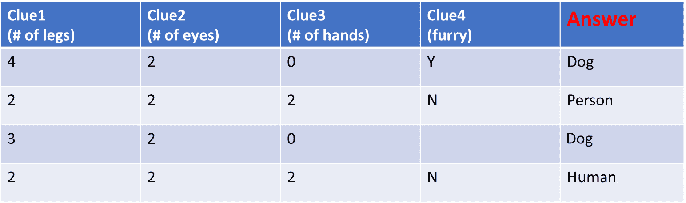

图 2.1 – 监督学习数据集

该数据集由包含线索的列（这些被称为**特征**）和一个包含答案的列（这被称为**目标**）组成。给定一个类似这样的数据集，算法学习如何根据一组线索产生正确的答案。无论您的数据以何种形式存在，您的任务首先是将其转换成*图 2.1*中的表格样子。请注意，您拥有的线索可能分布在多个数据库或 Excel 文件中。您将不得不将这些信息全部汇总到一个表格中。如果您拥有的数据集很复杂，您将需要使用 SQL 等语言，**Python Pandas**或**Excel**等工具，或**Paxata**等工具。

## 时间序列数据集

时间序列或预测问题的时间是其数据集的关键组成部分。它们与监督学习数据集类似，略有不同，如*图 2.2*所示：

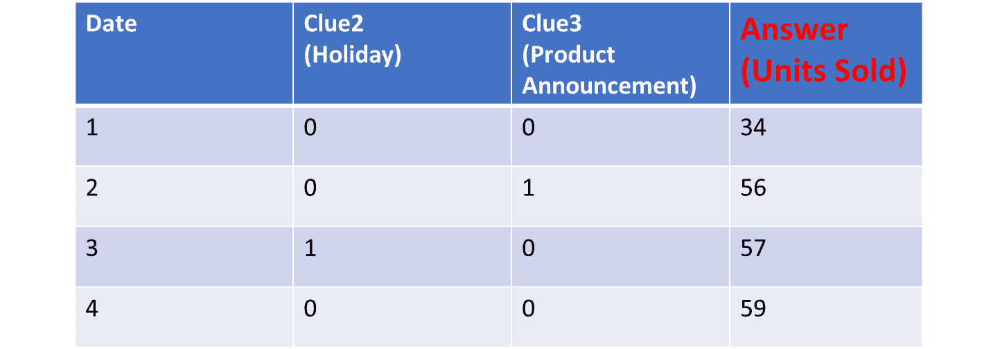

图 2.2 – 时间序列数据集

您需要确保您的时间序列数据集看起来与前面的图表一样。它应该有一个基于日期或时间的列，一个包含您试图预测的序列值的列，以及所需的一组线索。如果您需要预测多个时间序列，您还可以添加帮助分类不同序列的列。例如，您可能对预测第 5 天和第 6 天的销量感兴趣。如果您的数据以其他形式存在，它需要被转换成前面图表的样子。

## 数据清理

您收到的数据通常会有错误。例如，您可能会在应该包含数字的字段中看到文本。您可能会看到价格列中的值有时包含美元符号，但有时没有符号。DataRobot 可以捕捉到其中的一些错误，但有时自动化工具无法捕捉到这些错误，因此您需要仔细查看和分析数据集。有时将您的数据上传到 DataRobot 以查看它发现了什么，然后使用其分析结果来确定下一步操作是有用的。一些清理工作需要在 DataRobot 之外完成，因此请准备好多次迭代以正确设置数据集。需要注意的常见问题包括以下内容：

+   列中的数据类型错误

+   列中的混合数据类型

+   在数值列中的空格或其他字符使它们看起来像文本

+   同义词或拼写错误的单词

+   日期以字符串形式编码

+   日期格式不同

## 数据归一化和标准化

当不同的数据特征具有不同的尺度和范围时，比较它们对目标值的影响变得更加困难。此外，许多算法在处理不同尺度的值时存在困难，有时会导致稳定性问题。避免这些问题的方法之一是对值进行归一化（不要与数据库范式混淆）或标准化。

在归一化（也称为缩放）中，您将值缩放，使它们在 0 到 1 之间：

Xnormalized = (X – Xmin) / (Xmax – Xmin)

另一方面，标准化会将数据中心化，使得平均值变为零，并按比例缩放，使得标准差变为 1。这也被称为 **z 分数** 数据：

Xstandardized = (X – Xmean) / XSD

在这里，Xmean 是所有 X 值的平均值，XSD 是 X 值的标准差。

通常，您不需要担心这个问题，因为 DataRobot 会根据需要自动对数据集进行此操作。

## 异常值

异常值是相对于数据集的其他部分似乎不合适的数据。这些值可能非常大或非常小。一般来说，与平均值相差超过三个标准差的数据被认为是异常值，但这仅适用于预期值呈正态分布的特征。异常值通常来自数据质量问题或一些不寻常的情况，这些情况被认为不足以作为训练数据。被认为异常的数据点通常从数据集中移除，以防止它们对您的模型产生过度影响。这些经验法则仅用于突出候选者。您将必须运用您的判断力来确定任何值是否为异常值以及是否需要删除它们。再次强调，DataRobot 将突出潜在的异常值，但您必须审查这些数据点并确定是否删除它们或保留。

## 缺失值

这是在数据集中非常常见的问题。您的数据集可能包含许多缺失值，标记为 **NULL** 或 **NaN**。在某些情况下，您可能会看到一个 **?**，或者您可能会看到一个不寻常的值，例如 **-999**，这可能是一个组织用来表示缺失或未知值的值。您如何处理这些值在很大程度上取决于您试图解决的问题以及数据集代表的内容。很多时候，您可能会选择删除包含缺失值的行数据。有时，这可能不可行，因为您可能没有足够的数据，删除这些行可能会导致您数据集的重要部分被移除。有时，您可能会看到一个特征（或列）中的大量值可能缺失。在这些情况下，您可能希望从数据集中删除该特征。

另一种处理这种情况的可能方法是使用合理的猜测来填充缺失值。这可能采取零值的形式，或者该特征的均值，或者该特征的中间值。对于分类数据，缺失值通常被视为一个单独的类别。

更复杂的方法使用 k 最近邻算法根据其他相似数据点计算缺失值。没有一种答案在每次都适用，所以你需要使用你的判断和对问题的理解来做出决定。最后一个选项是保持原样，让 DataRobot 找出如何处理这种情况。DataRobot 也有许多填充策略以及处理缺失值的算法。但你要小心，因为这可能并不总是导致最佳解决方案。与经验丰富的数据科学家交谈，并使用你对业务问题的理解来规划行动方案。

## 类别编码

在许多问题中，你必须将你的特征转换为数值。这是因为许多算法无法处理分类数据。有许多方法可以编码分类值，DataRobot 内置了许多这些方法。其中一些技术包括独热编码、留一法编码和目标编码。我们不会深入细节，因为通常你会让 DataRobot 为你处理这些，但可能会有一些情况，由于你对业务问题的理解，你将想要以特定的方式自行编码。DataRobot 的这个特性可以节省大量时间，并且通常对大多数问题都工作得很好。

## 合并类别

有时，你会有包含大量类别的分类数据。尽管有处理大量类别计数的方法（如前文所述），但很多时候，合并类别是明智的选择。例如，你可能有很多包含非常少数据点但彼此非常相似的类别。在这种情况下，你可以将它们合并成一个单独的类别。在其他情况下，可能只是有人使用了不同的拼写、同义词或缩写。在这种情况下，最好也将它们合并成一个单独的类别。有时，你可能想要将数值特征分割成对用户或利益相关者有业务意义的区间。这是你需要根据对问题的理解自行进行的数据准备的一个例子。你应该在将数据上传到 DataRobot 之前完成这项工作。

## 目标泄露

有时，数据集包含从目标本身派生的特征。这些特征在事先未知或在预测时未知。无意中使用这些特征来构建模型会导致下游问题。这个问题被称为目标泄露。应该仔细检查数据集，并将这些特征从训练特征中移除。DataRobot 也会自动分析特征，并尝试标记可能导致目标泄露的任何特征。

## 项-文档矩阵

您的数据集中可能包含包含文本或注释的特征。这些注释通常包含对做出决策有用的重要信息。然而，许多算法却无法直接利用这些文本。这些文本必须被解析成数值，以便对建模算法变得有用。为此有几种方法，其中最常见的是术语-文档矩阵。这里的文档指的是单个文本或注释条目。每个文档都可以被解析以分割成术语。现在您可以计算一个术语在文档中出现的次数。这个结果可以存储在一个称为**词频（TF**）矩阵中。一些信息也可以在词云中进行可视化。DataRobot 会自动为您构建这些词云。虽然 TF 很有用，但它可能有限制，因为某些术语可能在所有文档中都非常常见，因此它们在区分它们之间不是非常有用。这导致另一个想法，即我们可能应该寻找仅对某些文档独特的术语。这种给仅在某些文档中出现的术语赋予更多权重的概念被称为**逆文档频率（IDF**）。一个术语在文档中多次出现（TF）并且相对罕见（IDF）的组合被称为**TFIDF**。TFIDF 是 DataRobot 会自动为您计算并应用于包含文本的特征。

## 数据转换

虽然 DataRobot 会为您执行许多数据转换（并且它一直在添加更多），但有许多转换会影响您的模型，但 DataRobot 将无法捕捉到。您将不得不自己执行这些操作。这些操作的例子包括数学转换，如对数、平方、平方根、绝对值和差值。其中一些简单的可以在 DataRobot 内部设置，但对于更复杂的转换，您必须在 DataRobot 之外或使用 Paxata 等工具执行操作。有时，您会进行转换以线性化问题或处理具有长尾数据的特征。DataRobot 自动执行的一些转换如下：

+   计算聚合数据，如计数、最小值、最大值、平均值、中位数、最频繁值和熵

+   一个广泛的时间相关特征列表，例如随时间变化、随时间最大值和随时间平均值

+   一些文本提取特征，例如词数、提取的标记和术语-文档矩阵

+   来自地理空间数据的地理空间特征

我们将在*第四章*中更详细地讨论这个主题，*为 DataRobot 准备数据*。

## 共线性检查

在任何给定的数据集中，都存在一些与其他特征高度相关的特征。本质上，它们携带与某些其他特征相同的信息。通常，我们希望删除这些与数据集中某些其他特征高度重复的特征。DataRobot 会自动为您执行这些检查，并将这些共线性特征标记出来。这对于线性模型尤其关键，但一些较新的方法可以更好地处理这个问题。使用的阈值取决于建模算法和您的业务问题。在 DataRobot 中删除这些特征以用于建模是非常容易的。

DataRobot 还会生成一个相关矩阵，显示不同特征之间是如何相互关联的。这有助于识别共线性特征以及模型中要使用的候选关键特征。通过分析相关矩阵，您可以深入了解您的数据和问题。在*第五章*《使用 DataRobot 进行探索性数据分析》中，我们将讨论如何进行这种分析的例子。

## 数据分区

在开始构建模型之前，您需要将数据集分为三个部分。这些部分被称为训练集、验证集和保留集。在模型构建过程中，这三个部分用于不同的目的。通常将 10-20%的数据集分为保留集。剩余的部分进一步分割，其中 70-80%用于训练集，20-30%用于验证集。这种分割是为了确保模型不会过拟合，并且部署中预期的结果与模型构建期间看到的结果一致。

只有训练集用于训练模型。验证集的设计是为了通过执行多次交叉验证测试来调整算法，以优化结果。最后，在构建模型后，使用保留集来测试模型在之前从未见过的数据上的表现。如果保留集上的结果是可以接受的，那么模型可以考虑部署。

DataRobot 自动化了这一过程的大部分，但它允许用户自定义分割百分比以及分区应该如何进行。它还通过自动分割数据以进行基于时间的回溯测试，为时间序列或预测问题执行类似的功能。

# 数据可视化

数据分析师或数据科学家需要完成的最重要任务之一是理解数据集。数据可视化是实现这一理解的关键。DataRobot 提供了多种可视化数据集的方法，以帮助您理解数据集。这些可视化是自动为您构建的，这样您就可以花时间分析它们，而不是准备它们。让我们看看这些是什么以及如何使用它们。

当你访问你项目的数据页面（*图 1.20*）时，你会看到你数据集的高级概要信息。仔细检查这些信息，以全面了解你的数据集。如果你点击左上角的**特征关联**菜单，你会看到特征之间是如何相互关联的（*图 2.3*）：

图 2.3 – 使用互信息进行特征关联

此图使用互信息指标显示了特征之间的相互关系。**互信息**（**MI**）使用信息理论来确定从另一个特征中获取关于一个特征的信息量。与皮尔逊相关系数相比，使用 MI 的优点是它可以用于任何类型的特征。其值从 0（两个特征是独立的）到 1（它们携带相同的信息）。这在确定哪些特征将是模型的良好候选者以及哪些特征不会提供任何有用的信息或冗余方面非常有用。在模型构建开始之前，理解并使用这种观点非常重要，尽管 DataRobot 会自动使用这些信息来做出建模决策。

另有一个指标也以类似的方式使用。如果你点击前面截图底部的度量下拉菜单，你可以选择另一个称为**Cramer's V**的指标。一旦选择 Cramer's V，你将看到类似的图形视图（*图 2.4*）：

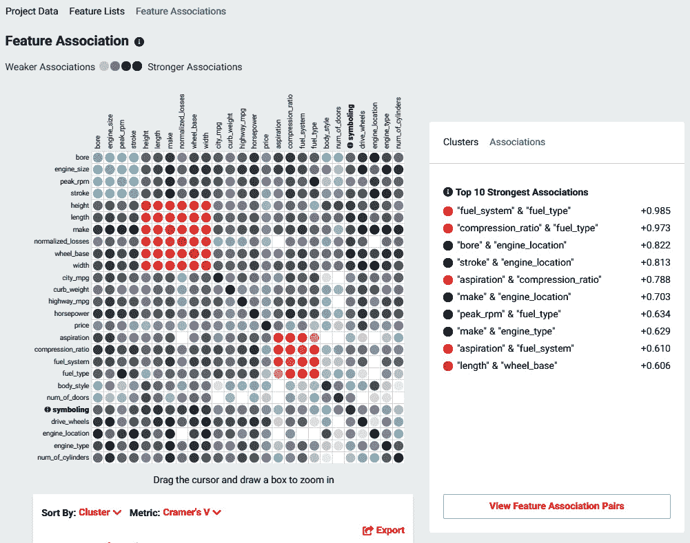

图 2.4 – 使用 Cramer's V 进行特征关联

Cramer's V 是 MI 的另一种指标，其使用方式类似。其值范围也从 0（无关系）到 1（特征高度相关）。Cramer's V 通常与分类变量一起使用，作为皮尔逊相关系数的替代。

注意到 DataRobot 自动找到了相互关联的特征簇。每个簇用不同的颜色编码，特征按簇排序在*图 2.4*中。你可以放大到特定的簇以进一步检查它们。这是 DataRobot 环境的一个重要特性，因为非常少的数据科学家了解这个想法或利用它。这些簇很重要，因为它们突出了相互关联的特征组。这些复杂的相互依赖关系通常对于理解业务问题非常重要。通常，只有拥有大量领域经验的人才知道这些复杂的相互依赖关系。大多数人甚至不会意识到这些复杂性。如果你是某个领域的初学者，那么理解这些将给你相当于多年的经验。仔细研究这些，与你的业务专家讨论，以全面理解他们试图强调的内容，然后使用这些见解来改进你的模型以及你的业务流程。

此外，请注意 DataRobot 提供了一个包含前 10 个最强关联的列表。注意这些关联并花些时间思考它们对你的问题意味着什么。这些是否与你对领域的了解一致，或者有一些惊喜？往往是惊喜导致的关键洞察，这些洞察可能对你的业务具有价值。在以下列表中，你可以看到一个**查看特征关联对**按钮。如果你点击该按钮，你将看到*图 2.5*：

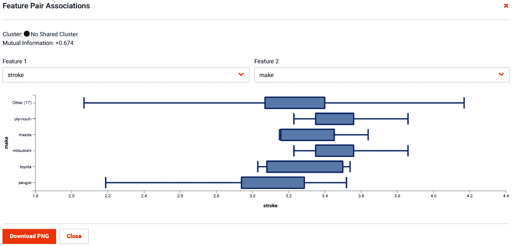

图 2.5 – 特征关联细节

此图形详细显示了两个选定特征之间的关系。在这个例子中，一个特征是分类的，而另一个是数值的。该图显示了这两个特征之间的关系，并可能为问题提供额外的见解。务必调查这些关系，特别是那些可能具有反直觉性的关系。

现在你可以点击特定的特征来查看它们的分布情况(*图 2.6*)：

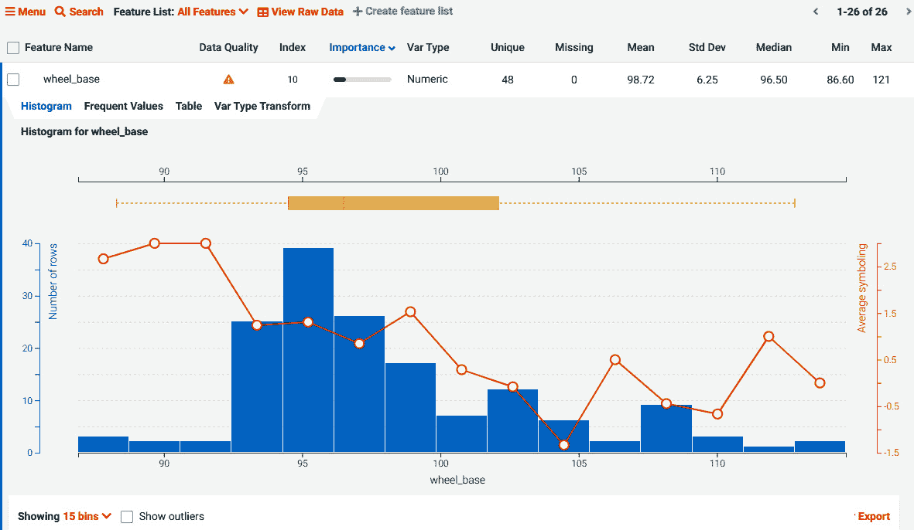

图 2.6 – 特征细节

此视图显示了值的分布情况以及它们与目标值之间的关系。需要关注的关键点是数据不足的区间以及非线性区间。这些可能会给你关于特征工程的想法。这些也是你询问系统为何表现出这种行为的区域？

在完成这项背景工作后，你现在可以开始深入研究建模算法。

# 机器学习算法

现在已经有数百种机器学习算法可供机器学习项目使用，并且每天都有新的算法被发明。DataRobot 支持广泛的开源机器学习算法，包括几个深度学习算法——Prophet、基于 SparkML 的算法和 H2O 算法。现在让我们看看存在哪些类型的算法以及它们的应用(*图 2.7*)：

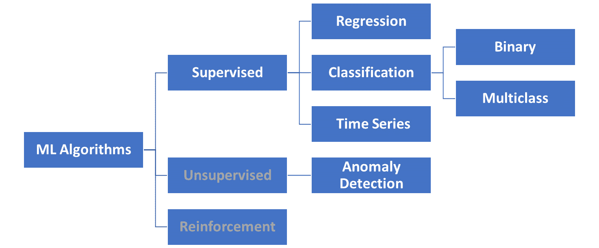

图 2.7 – 机器学习算法

我们的重点将主要放在 DataRobot 支持的算法类型上。这些算法类型将在以下子节中描述。

### 监督学习

当你可以提供作为训练数据集一部分的答案（也称为标签）时，使用监督学习算法。对于监督学习，你必须将你的数据集的一个特征分配为答案，算法通过观察多个示例并从这些示例中学习来尝试预测答案。参见*图 2.8*以了解不同类型的答案：

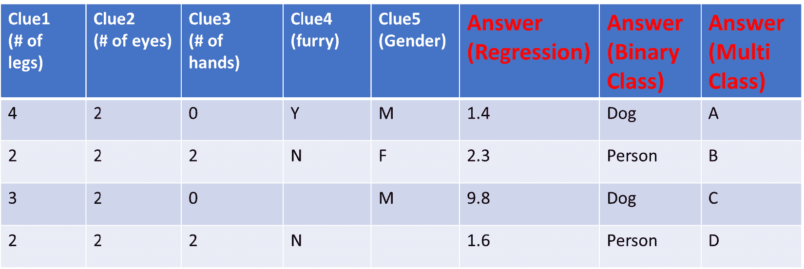

图 2.8 – 监督学习算法的目标

DataRobot 的功能主要集中于监督学习算法。该套件包括深度学习算法以及来自 SparkML 和 H2O 的大数据算法。DataRobot 内置了最佳实践来选择最适合您问题和数据集的算法。监督学习问题主要有以下四种类型：

### 回归

回归问题是指答案（目标）以数值形式出现的情况（参见*图 2.8*）。回归模型试图拟合一条曲线，使得预测值与实际值之间的误差在整个训练数据集上最小化。有时，甚至可以将分类问题设置为一个数值回归问题。在这种情况下，答案是数字，然后可以通过阈值将其转换为二进制。逻辑回归就是这样一种方法，它产生一个介于零和一之间的值。您可以将低于某个阈值的所有答案标记为零，而高于阈值的答案标记为一。根据问题，可以使用线性回归算法以及非线性回归算法。模型是根据回归线与数据匹配的程度来评估的。常用的指标包括**RMSE**、**MAPE**、**LogLoss**和**Rsquared**。常用的算法包括**XGBoost**、**Elastic Net**、**随机森林**和**GA2M**。

### 二元分类

二元分类问题的答案只能取两个不同的值（称为类别）。这些可以是 0 或 1、是或否等形式。请参阅*图 2.8*以了解二元分类的目标特征的示例。您通常遇到的一个典型问题是类别不平衡问题。当大多数数据集偏向于一个类别时，这种情况就会发生。这些通常通过在存在足够训练数据的情况下对过度代表的类别进行下采样来解决。当这不可能时，您可以尝试对代表性不足的类别进行上采样或使用其他方法。这些方法都不是完美的，有时您不得不尝试不同的方法来查看哪种方法最有效。DataRobot 提供了在需要时指定下采样的机制。一些常用的二元分类算法包括**逻辑回归**、**k 最近邻**、**基于树的算法**、**SVM**和**朴素贝叶斯**。在分类问题的情况下，最好避免使用准确率作为评估结果的指标。结果通常以混淆矩阵的形式显示（本章后面将描述）。在需要时，DataRobot 将自动选择合适的指标来使用。

### 多类分类

多分类分类问题是你试图预测两个以上类别或类别的那些问题。为了简单说明目标可能的样子，请参阅 *图 2.8*。多分类能力是最近添加的，许多 DataRobot 功能可能不适用于此类问题。由于没有下采样可用，你可能想在将数据集上传到 DataRobot 之前调整你的采样。此外，请注意，你可以通过将类别合并为两个类别来频繁地将问题简化为二元分类问题。这可能或可能不适用于你的用例，但如果需要，这是一个选项。此外，并非所有算法都适用于多分类问题。DataRobot 将自动选择合适的算法来构建多分类问题的模型。典型的指标包括 AUC、LogLoss 或平衡准确率。结果通常以混淆矩阵的形式显示（本章后面将描述）。典型的算法包括 XGBoost、随机森林和 TensorFlow。

### 时间序列/预测

在 DataRobot 中，时间序列或预测模型也被称为时间感知模型。在这些问题中，你拥有随时间变化的数据，并且你对预测/预测未来某个目标值感兴趣（*图 2.2*）。DataRobot 不仅支持时间序列的常用算法，如 ARIMA，还可以将这些问题适应为机器学习回归问题，然后应用 XGBoost 等算法来解决它们。这些问题要求将序列转换为平稳序列，并需要大量的特征工程来创建基于时间的特征。这些问题还要求你考虑过去可能重复发生的重要事件（如假日或大型购物日）。时间序列模型还需要通过一种称为回测的方法来处理验证和测试：

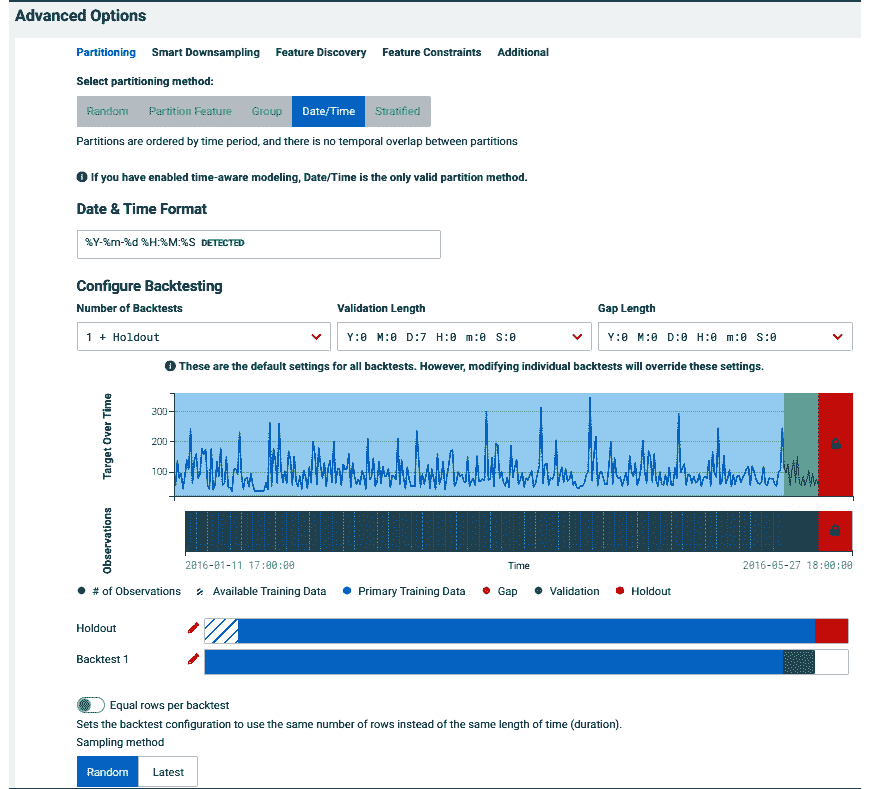

图 2.9 – 时间序列问题的回测

在回测中，模型使用过去的数据构建，然后使用模型从未见过的较新和未知的保留数据进行测试。这种基于时间的保留数据切片也被称为时间外验证。DataRobot 自动为你自动化了许多这些任务，我们将在后面更详细地看到。

### 算法

让我们回顾一下 DataRobot 中使用的一些主要算法。在这里，我们只提供这些算法的高级概述。这些算法可以通过更改它们的超参数来针对特定问题进行调整。要更详细地了解任何特定算法，你可以参考机器学习书籍或 DataRobot 文档。一些重要的算法如下：

+   **随机森林**。随机森林模型是通过创建多个决策树模型，然后使用输出的平均值来构建的。这是通过创建训练数据的自助样本并在这些样本上构建决策树（*图 2.10*）来实现的：

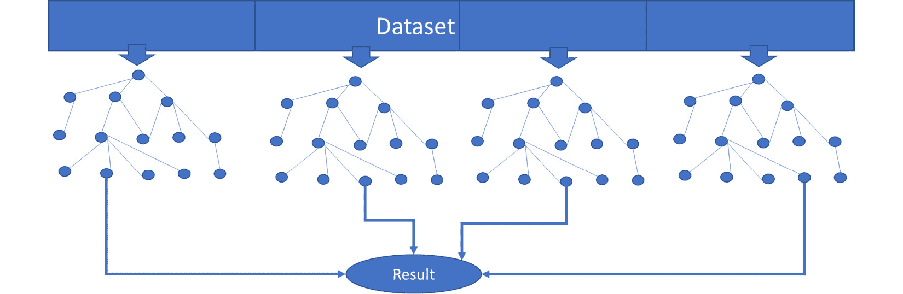

图 2.10 – 随机森林

随机森林模型可以处理缺失数据和非线性，并在许多情况下证明效果极佳。随机森林模型既可以用于回归问题，也可以用于分类问题：

+   **XGBoost**：也称为**eXtreme**梯度提升树，是基于决策树的算法，因其通常能产生非常有效的预测并可以处理缺失值而变得非常流行。它们可以处理非线性问题和特征之间的交互。XGBoost 通过创建一个随机森林并在先前树的残差上创建树来构建在随机森林模型之上。这样，每一组新的树都能产生更好的结果。XGBoost 可以用于回归问题，也可以用于分类问题。

+   **Rulefit**：Rulefit 模型是由简单规则组成的集成模型。你可以将这些规则想象成像决策树一样串联在一起。Rulefit 模型更容易理解，因为大多数人都能理解将规则组合起来解决问题。DataRobot 通常会构建这个模型来帮助你理解问题并提供洞察。你可以访问**模型**标签页的洞察部分，查看从 Rulefit 模型生成的洞察以及给定规则对问题的有效性。它们可以用于分类问题，也可以用于回归问题。

+   **ElasticNet**、**岭回归**、**Lasso 回归**：这些模型使用正则化来确保模型不会过拟合且不会过于复杂。正则化是通过添加更多特征的惩罚来实现的，这反过来迫使模型要么丢弃一些特征，要么减少它们的相对影响。Lasso 回归（也称为**L1 回归**）使用的是系数的绝对值作为惩罚权重。使用 Lasso 的效果是尝试将系数减少到零，从而选择重要的特征并移除那些贡献不大的特征。岭回归（也称为**L2 回归**）使用的是平方系数作为惩罚权重。这种影响是减少系数的幅度。**ElasticNet**用于指代同时使用 Lasso 和岭正则化的线性模型，以产生既简单又正则化的模型。当你有很多相互关联的特征时，这非常有用。

+   **逻辑回归**：逻辑回归是一种用于二元分类的非线性回归模型。输出形式为概率，值在 0 到 1 之间。这通常与一个阈值一起使用，以将值分配为 0 或 1。

+   **SVM**（**支持向量机**）：这是一种试图找到最佳分离类别的分类算法。在二维空间中，这种算法的样子很容易理解（*图 2.11*），但该算法在高维空间中表现良好。SVM 的另一个优点是它能够通过使用非线性核函数来处理非线性，这可以将问题线性化：

图 2.11 – 监督学习算法的目标

+   **GA2M**（**广义加性模型**）：这是那些罕见算法之一，它提供了可理解性，同时在非线性问题中也能提供高准确度。名字中的数字“2”代表其建模特征之间相互作用的能力。GAM 模型的输出是单个特征效果的输出之和，这些效果已经被分箱。由于 GAM 允许这些效果非线性，它可以捕捉问题的非线性特征。模型的结果可以用一个简单的表格表示，该表格显示了每个特征对整体答案的贡献。这种表格表示方式容易被大多数人理解。对于理解和可解释性非常重要的行业或用例，这可能是一个最佳选择之一。

+   **K-Nearest Neighbors**：这是一个非常直接的算法，它找到 k 个最近的数据点（基于一种特定的距离计算方式）。现在它为这些 k 个点找到分类答案。然后它确定得票最多的答案，并将其作为答案。默认的距离度量是**欧几里得**距离，但 DataRobot 会根据数据集选择合适的度量。用户也可以指定要使用的特定距离度量。

+   **TensorFlow**. TensorFlow 是一种基于深度神经网络的深度学习模型。深度神经网络是指由人工神经元集合构成的深层隐藏层。这些神经元携带高度非线性的激活函数，使它们能够适应高度非线性问题。这些模型在不需要特征工程的情况下，能够产生非常高的准确度，但与其它算法相比，它们需要更多的训练数据。这些模型通常被认为非常不透明，容易过拟合，因此不适合某些应用。它们在特征和特征工程难以提取的应用中特别成功，例如图像处理。这些模型可以用于回归问题，也可以用于分类问题。

+   **Keras 神经网络**：Keras 是一个基于 TensorFlow 构建的高级深度学习库，它允许将许多类型的深度学习模型集成到 DataRobot 中。作为一个高级库，它使得构建 TensorFlow 模型变得容易得多。前述章节中描述的一切都适用于 Keras。在 DataRobot 中的特定实现非常适合稀疏数据集，并且特别适用于文本处理和分类问题。

## 无监督学习

无监督学习问题是指那些没有提供答案或标签的问题。这类问题的例子包括聚类或异常检测。DataRobot 对于这些问题没有太多提供，但它确实有一些异常或离群值检测的能力。这些问题是指那些数据点在非常罕见的情况下表现出不寻常的情况。例子包括欺诈检测、网络安全漏洞检测、故障检测和数据离群值检测。DataRobot 允许你设置一个没有目标的项目，然后它会尝试识别异常数据点。对于任何聚类问题，你应该尝试使用 Python 或 R 来创建聚类模型。

## 强化学习

强化学习问题是你希望学习一系列由代理做出的决策，以便实现某个特定目标。这个目标与一个奖励相关联，这个奖励是给予代理的，以表彰它完全或部分地实现了目标。对于这种训练没有可用的数据集，因此代理必须尝试多次（使用不同的策略）并在每次尝试中学习一些东西。经过多次尝试，代理将学会产生最佳奖励的策略或规则。正如你现在可以猜到的，这些算法在没有数据但可以在现实世界（或合成世界）中反复实验的情况下工作得最好。正如我们之前讨论的，DataRobot 不是这类问题的合适工具。

## 集成/混合模型

集成是一种创建聚合或混合其他模型预测的模型的技术。不同的算法有时能够更好地利用问题的不同方面或数据集。这意味着很多时候，通过结合几个好的模型，你可以提高预测精度。当然，这伴随着复杂性和成本的提高。DataRobot 提供了许多混合方法，并且在大多数情况下，它会自动为你的项目构建混合模型。然后你可以评估精度提高是否足以证明额外的复杂性是合理的。

## 蓝图

在 DataRobot 中，每个模型都与一个蓝图相关联。蓝图是 DataRobot 用来训练特定模型的一步步食谱。参见*图 2.12*以获取示例：

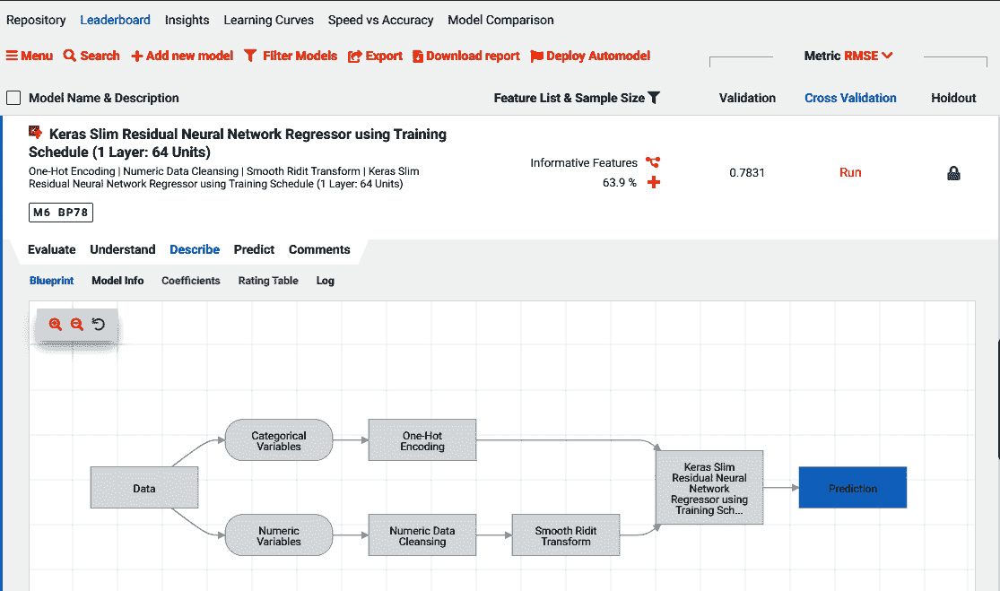

图 2.12 – 模型蓝图

蓝图显示了 DataRobot 构建特定模型所采取的所有步骤，包括 DataRobot 所做的任何数据准备和特征工程。点击任何特定的框将显示采取的行动、使用的参数以及特定算法的文档。这也为您的建模项目提供了出色的文档，这些文档是自动为您创建的。

现在，让我们看看如何确定算法的表现如何。为此，我们需要一些性能指标。

# 性能指标

DataRobot 为模型提供了一系列性能指标。您必须指定您想要使用的指标来优化您项目的模型。通常，最佳指标是 DataRobot 推荐的指标。一旦构建了模型，DataRobot 也会计算其他指标，因此您可以在多个指标上查看您模型的结果。请记住，没有哪个指标适合所有情况，您在选择评估结果的指标时应谨慎。以下是一些关于常用指标的详细信息：

+   **RMSE（均方根误差）**：RMSE 是一种首先计算误差平方（实际值与预测值之间的差异）的指标。然后，在整个数据集上对这些值进行平均，然后计算这个平均值的平方根。鉴于这个指标依赖于值的规模，其解释依赖于问题。您不能比较两个不同数据集的 RMSE。这个指标在数据不是高度偏斜的回归问题中经常被使用。

+   **MAPE（平均绝对百分比误差）**：MAPE 在某种程度上与 RMSE 相似，因为它首先计算百分比误差的绝对值。然后，这些值在数据集上平均。鉴于这个指标按百分比缩放，比较不同数据集的 MAPE 更容易。然而，您必须注意，非常小的值（或零值）的百分比误差往往会看起来很大。

+   **SMAPE（对称绝对百分比误差）**：SMAPE 与 MAPE 类似，但解决了上述讨论的一些缺点。SMAPE 限制了上限百分比值，这样小的值的误差就不会压倒指标。这使得 SMAPE 成为一个可以轻松跨不同问题比较的好指标。

+   **准确率**：准确率是用于分类问题的一种指标。它可以表示如下：

    *准确率 = 正确预测的数量/总预测数量*

    它本质上是指正确预测的数量与所有预测数量的比率。对于不平衡问题，这个指标可能会误导，因此它从不单独用来确定模型的表现如何。它通常与其他指标结合使用。

+   **Balanced Accuracy**: 平衡准确率通过在预测的两个类别中归一化准确率来克服准确率的问题。假设两个类别是 A 和 B：

    (a) *A 的准确率 = 正确预测 A 的数量/总数 A*

    (b) *B 的准确率 = 正确预测 B 的数量/总数 B*

    (c) *平衡准确率 = A 的准确率 + B 的准确率/2*

    平衡准确率实际上是 A 的准确率和 B 的准确率的平均值。

+   **AUC（ROC 曲线下的面积**）: AUC 是 ROC（接收者操作特征）曲线下的面积。这个指标经常用于分类问题，因为它也克服了与准确率指标相关的缺陷。ROC 曲线表示真正例率和假正例率之间的关系。AUC 从 0 到 1，它显示了模型区分两个类别的效果。0.5 表示随机模型，因此您希望模型的 AUC 大于 0.5。

+   **Gamma Deviance**: 当目标值呈伽马分布时，使用 Gamma 偏差进行回归问题。对于此类目标，gamma 偏差衡量预测值与实际值之间的平均偏差的两倍（使用对数似然函数）。一个拟合完美的模型将具有零偏差。

+   **泊松偏差**: 泊松偏差用于回归问题，当目标是计数偏斜数据时。它的工作方式与伽马偏差非常相似。

+   **LogLoss**: LogLoss（也称为交叉熵损失）是衡量分类问题预测概率不准确性的指标。值为 0 表示模型完美，随着模型变差，logloss 值增加。

+   **R-squared**: R-squared 是用于回归问题的指标，它说明了拟合线如何代表数据集。其值介于 0 和 1 之间。0 表示模型较差，无法解释任何变化，而 1 表示模型完美，解释了 100%的变化。这是最常用的指标之一，但它可能存在一个问题，即通过添加更多变量可以提高它，而不一定改善模型。它也不适用于非线性问题。

现在我们已经讨论了一些常用的指标，让我们看看如何查看其他结果来评估模型的质量，以及不同特征对模型的影响。

# 理解结果

在本节中，我们将讨论各种指标和其他信息的可视化，以理解建模练习的结果。这些是重要的可视化，除了检查上一节中讨论的模型指标外，还需要仔细检查。这些可视化是 DataRobot 为它训练的任何模型自动生成的。

## 升值图

抬升图显示了模型在预测目标值方面的有效性。由于数据点通常非常多，无法在一个图表中显示，因此抬升图对输出进行排序，并将数据聚合到多个桶中。然后，它比较每个桶中预测值和实际值的平均值（*图 2.13*）：

Figure 2.13 – Lift chart

前面的抬升图显示了预测是如何从低到高排序并分桶的（本例中有 60 个桶）。现在你可以看到每个桶中的平均预测值和平均实际值。这让你对模型在整个范围内的表现有一个感觉。你可以看到模型表现较差的范围。如果模型在对你业务重要的范围内表现不佳，你可以进一步调查以了解如何在该范围内改进模型。你还可以检查不同的模型，看看是否有在更重要的区域内表现更好的模型。抬升图对于回归问题更有意义。

## 混淆矩阵（二分类和多分类）

对于分类问题，评估模型结果的最佳方法之一是查看混淆矩阵及其相关指标（*图 2.14*）。此选项卡适用于多分类问题：

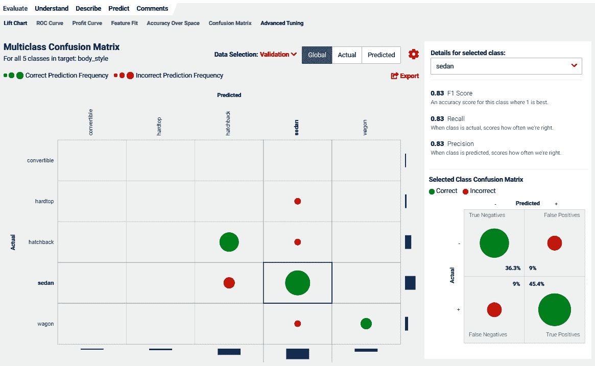

Figure 2.14 – Confusion matrix

混淆矩阵映射了每个类别的预测值与实际值的计数（频率）。让我们看看轿车列。大绿色圆圈表示我们正确地将轿车分类为轿车多少次。在该列中，你还会看到红色点，表示模型预测它为轿车，但实际上它是另一种类型。你可以看到所有类别的这些情况。相对尺度应该能给你一个关于你的模型表现如何以及它在哪些方面有困难的印象。

如果你选择一个特定的类别，你可以查看右侧的类别特定混淆矩阵。你可以看到两列（+表示预测为轿车，-表示预测为非轿车）。同样，你看到两行（+表示它是轿车，-表示它不是轿车）。你还可以看到一些关键的定义和指标：

+   **真阳性**（**TP**）= 当它是轿车且预测结果显示是轿车时

+   **假阳性**（**FP**）= 当它不是轿车但预测结果却显示是轿车时

+   **真阴性**（**TN**）= 当它不是轿车且预测结果显示不是轿车时

+   **假阴性**（**FN**）= 当它是一辆轿车但预测结果却显示不是轿车时

使用这些，我们现在可以计算这个类别的某些特定指标：

+   *精确度 = 预测正确的比例 = TP/所有正预测 = TP/(TP+FP)*

+   *召回率 = 实际正确的比例 = TP/所有正实际值 = TP/(TP+FN)*

+   *F1 分数 = 精确度和召回率的调和平均。所以，1/F1 = 1/精确度 + 1/召回率*

## ROC

此标签适用于二元分类问题。**ROC**（**接收者操作特征**）曲线是真正例率和假正例率之间的关系。此曲线下的面积称为 AUC。它从 0 到 1，显示了模型在两个类别之间的区分能力（*图 2.15*）：

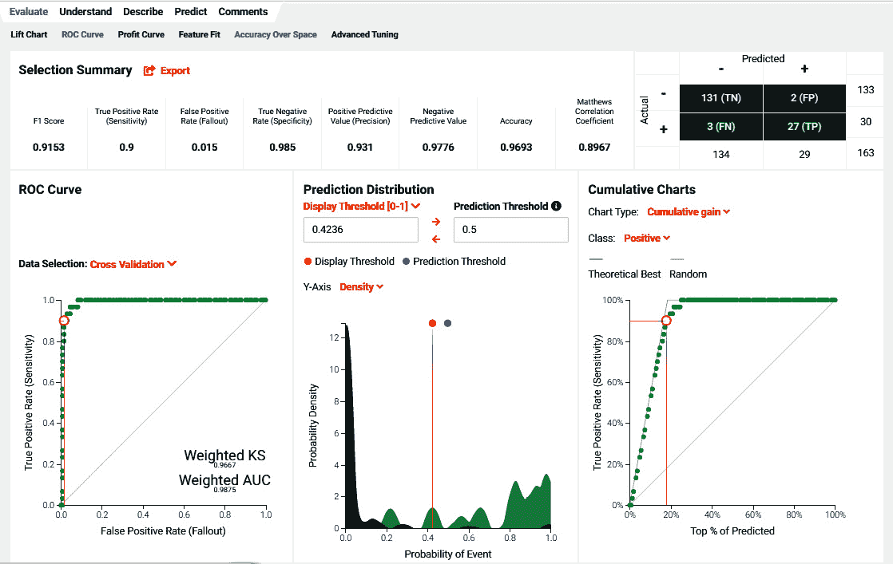

图 2.15 – ROC 曲线和混淆矩阵

你还可以看到（之前描述的）混淆矩阵和两个类别的相关指标。你可以移动阈值并评估产生的权衡和累积收益。由于大多数问题在真实正例与真实负例具有不同业务价值的情况下并不对称，你应该选择适合你业务问题的阈值。

## 随时间变化的准确率

此标签适用于时间序列问题（*图 2.16*）并比较序列随时间变化的实际值与预测值：

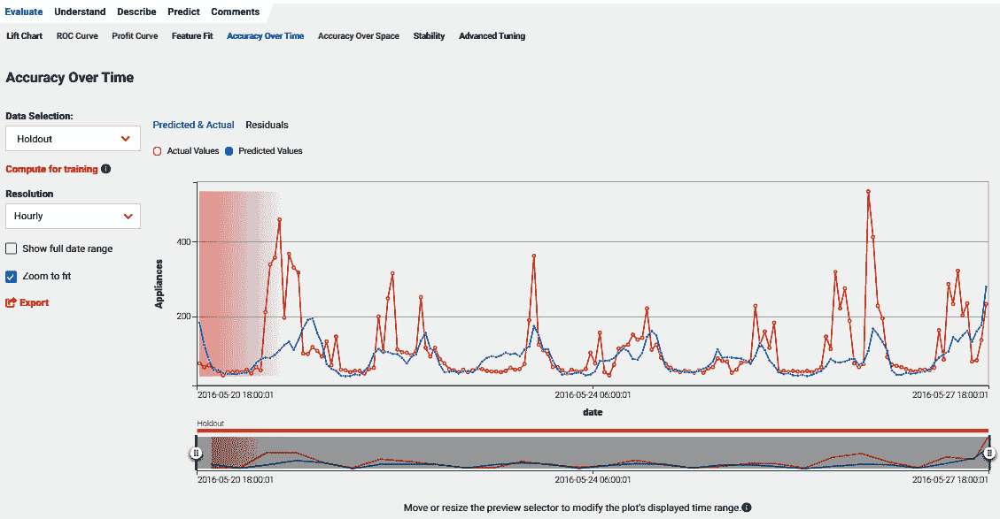

图 2.16 – 模型准确率随时间变化

你可以查看这些值对于回测或保留数据集。图表将清楚地显示模型表现不佳的地方以及你可能想要关注以改进模型的地方。

## 特征影响

除了模型性能之外，你首先想要了解的是特征在模型性能方面的影响程度。**特征影响**标签（*图 2.17*）可能是理解你的模型最关键的部分：

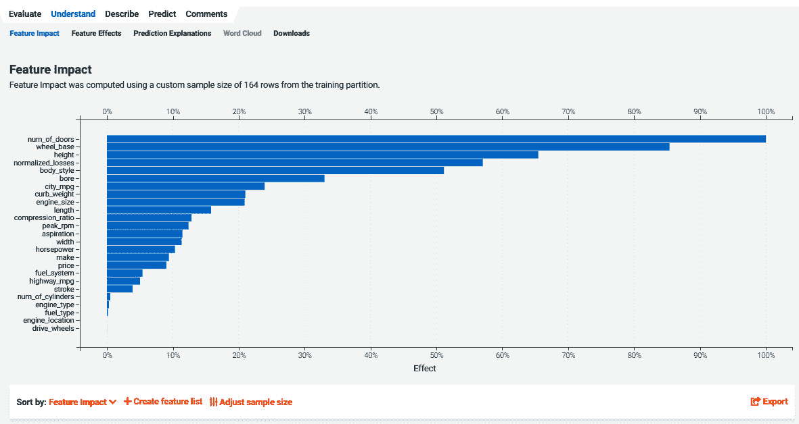

图 2.17 – 特征影响

图形显示了一个按重要性排序的最重要特征列表。对于每个特征，你可以看到该特征对模型相对影响的程度。你可以看到哪些特征贡献很小；这可以通过移除一些影响很小的特征来创建新的特征列表。

## 特征拟合

**特征拟合**标签（*图 2.18*）显示了特征的另一种贡献视图。图形显示了按重要性排序的特征：

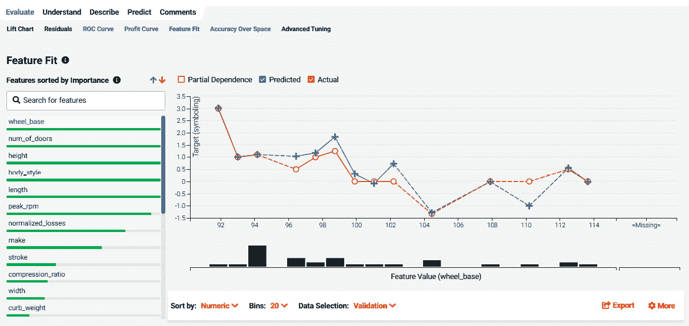

图 2.18 – 特征拟合

对于选定的特征，它显示了预测值与特征值范围的实际情况的比较。回顾这些关键特征的图表可以提供关于特征如何影响结果以及表现较好的值范围和表现最差的值范围的很多见解。这有时可能会突出你可能需要收集更多数据以改进模型的数据区域。

## 特征效应

**特征效应**显示的信息与**特征拟合**（*图 2.19*）非常相似。在此图形中，特征按**特征影响**排序。此外，**特征效应**专注于部分依赖性：

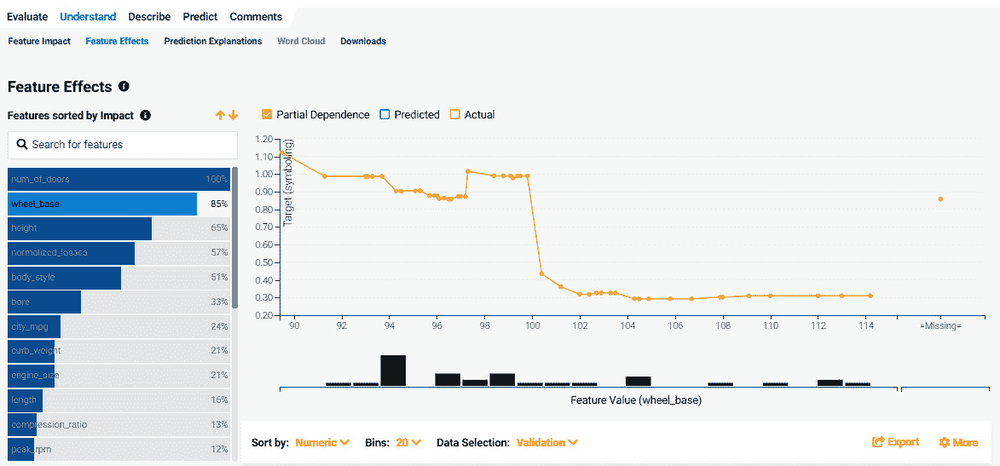

图 2.19 – 特征效应和局部依赖性

局部依赖性图是您想要仔细研究的最重要图表之一。这些图表告诉您特征值的变化如何影响其他特征值范围内目标平均值的改变。这种洞察力对于理解业务问题、理解模型正在做什么以及更重要的是，模型的哪些方面是可操作的以及哪些值范围会产生最大影响至关重要。

## 预测解释

**预测解释**描述了针对特定实例或正在评分的行的特征值来解释特定预测的原因（*图 2.20*）。请注意，这与**特征影响**不同，它告诉你特征在全局级别的重要性：

图 2.20 – 预测解释

**预测解释**可以为整个数据集或数据子集生成，如前述截图所示。例如，它将提供模型预测特定值的前三个原因。在某些用例中，出于监管原因，这些解释有时是必需的，但生成这些解释是一个好主意，因为它们有助于理解模型为何以某种方式预测，并且在验证或捕捉模型中的错误时非常有用。DataRobot 使用两种算法来计算解释：**XEMP**（**基于示例的解释**）或**Shapley 值**。XEMP 支持更广泛的模型，并默认选择。Shapley 值将在下一节中描述。

## Shapley 值

**Shapley** **值**（**SHAP**）是生成预测解释的另一种机制（*图 2.21*）。如果您想使用 SHAP 进行解释，您必须在按下**开始**按钮之前的项目设置的高级选项中指定这一点。一旦 DataRobot 开始构建模型，您就不能切换到 SHAP。SHAP 值仅适用于线性或基于树的模型，并且对于集成模型不可用：

图 2.21 – 基于 SHAP 的解释

SHAP 值基于合作博弈论，它试图为协作项目中团队成员的贡献分配价值。在机器学习的背景下，它试图在特征团队协作进行预测时分配特定特征的价值贡献。SHAP 值是可加的，您可以轻松地看到最终答案中有多少是由于特定特征值。

# 摘要

在本章中，我们介绍了一些基本的机器学习概念，这些概念在我们继续阅读剩余章节时将非常有用，并且在你的数据科学之旅中也将非常有用。请注意，我们只对概念进行了高层次概述，根据你的工作角色，你可能需要更深入地探索一些领域。我们还将这些材料与 DataRobot 执行某些功能的方式以及你需要更加关注的地方联系起来。

希望这已经让你对 DataRobot 将显示的内容以及在你项目不同阶段需要关注的地方有了更深的了解。由于 DataRobot 自动化了相当一部分模型构建和预测任务，你可能会有忽略 DataRobot 为你自动生成的大多数输出的诱惑。请抵制这种诱惑。DataRobot 软件在产生这些输出时投入了大量的努力和资源，这是有很好的理由的。它还在为你做大量的基础工作，所以请充分利用这些功能。具体来说，我们涵盖了以下内容：在数据准备过程中需要注意哪些事项？哪些数据可视化对于理解你的数据集很重要？关键机器学习算法有哪些，你何时使用它们？你如何衡量模型结果的好坏？你如何评估模型性能并理解模型对你问题的描述？

现在我们已经了解了基础知识，我们将在下一章开始我们的数据科学之旅，学习如何理解业务问题以及如何将其转化为可以通过机器学习解决的问题的规范。
