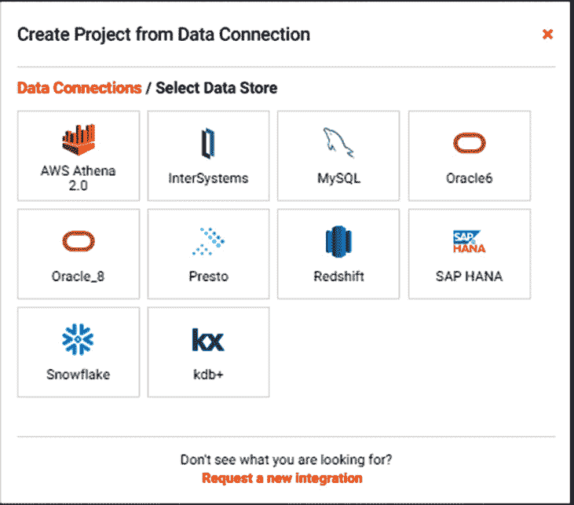
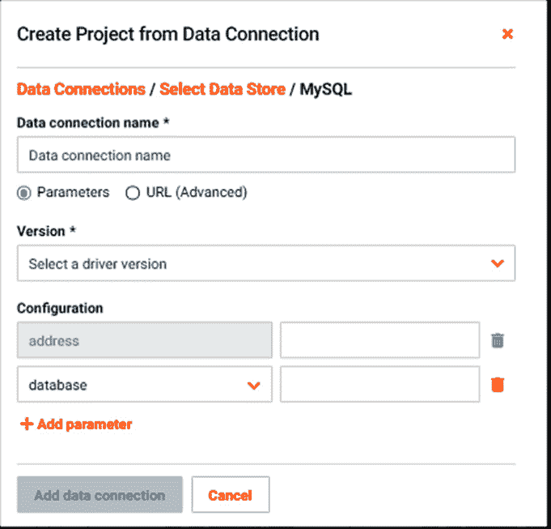

# 第四章：为 DataRobot 准备数据

本章涵盖了与为建模准备数据相关的任务。虽然这些任务本身相对简单，但它们可能需要花费大量时间，有时还可能引起挫败感。只需知道，如果你有这样的感觉，你并不孤单。这是很正常的。这也是你开始注意到事情与你在学术环境中的经验略有不同的时候。数据几乎永远不会以适合建模的形式出现，假设你收到的数据状况良好且质量上乘是错误的。

大多数现实世界的问题并不附带现成的数据集，你可以开始处理并用于构建模型。很可能会需要从多个不同的来源拼接数据。根据数据的不同，**DataRobot**可能会自动执行数据准备和清洗任务，或者你可能需要自己完成其中的一些。本章涵盖了概念和示例，展示了如何清洗和准备你的数据，以及 DataRobot 提供的帮助完成这些任务的特性。

到本章结束时，你将了解如何设置数据以便将其传递给 DataRobot 并开始建模。在本章中，我们将涵盖以下主要主题：

+   连接到数据源

+   为建模聚合数据

+   清洗数据集

+   处理不同类型的数据

+   为建模工程特征

# 技术要求

本章的一些部分需要访问 DataRobot 软件和一些数据处理工具。大多数示例处理的是小型数据集，因此可以通过 Excel 处理。本书后面将使用的数据集将在以下章节中描述。

## 汽车数据集

汽车数据集（来源：Dua, D. 和 Graff, C. (2019)。UCI 机器学习库[[`archive.ics.uci.edu/ml`](http://archive.ics.uci.edu/ml)]。加州大学欧文分校，信息与计算机科学学院）可以在 UCI 机器学习库([`archive.ics.uci.edu/ml/datasets/Automobile`](https://archive.ics.uci.edu/ml/datasets/Automobile))中访问。该数据集中的每一行代表一辆特定的汽车。特征（列）描述了其特性、风险评级和相关的归一化损失。尽管这是一个小型数据集，但它具有许多既是数值型又是分类型的特征。特征在网页上进行了描述，数据以`.csv`格式提供。

## 家用电器能耗预测数据集

此数据集（来源：Luis M. Candanedo, Veronique Feldheim, Dominique Deramaix, *Data driven prediction models of energy use of appliances in a low-energy house*，Energy and Buildings，Volume 140，2017 年 4 月 1 日，第 81-97 页，ISSN 0378-7788）可在 UCI 机器学习库中访问（[`archive.ics.uci.edu/ml/datasets/Appliances+energy+prediction#`](https://archive.ics.uci.edu/ml/datasets/Appliances+energy+prediction#)）。此数据集捕捉了房屋中各个房间和外部环境中的温度和湿度数据，以及各种设备随时间推移的能耗。数据每 10 分钟捕获一次。这是一个典型的时间序列数据集示例。数据以`.csv`格式提供，网站还提供了各种特征的描述。此数据集中的所有特征都是数值特征。数据集还包括两个随机变量以使问题更有趣。

SQL

对于本章的一些部分，了解 SQL 将很有帮助，尽管您不需要了解 SQL 就能通过示例问题。

# 连接到数据源

到目前为止，您应该有一个数据源列表以及存储在那里的数据的大致了解。根据您的用例，这些源可能是需要挖掘的实时数据流源。以下是一些典型的数据源：

+   文件系统

+   Excel 文件

+   SQL 数据库

+   Amazon S3 存储桶

+   **Hadoop 分布式文件系统**（**HDFS**）

+   NoSQL 数据库

+   数据仓库

+   数据湖

+   图数据库

+   数据流

根据数据源的类型，您将使用不同的机制来访问这些数据。这些机制可以是本地或云端的。根据数据的状态，您可以直接将数据带入 DataRobot，或者可能需要在将数据带入 DataRobot 之前进行一些准备工作。DataRobot 最近添加了**Paxata**功能来帮助这个过程，但您可能无法访问该附加组件。大部分的处理工作是通过**SQL**、**Python**、**pandas**和**Excel**完成的。为了本书的目的，我们将只关注 Excel。

如果您还不熟悉 SQL 和 pandas，那么在有机会的时候开始学习它们将很有帮助：

1.  您可以通过访问**创建新项目**菜单来连接数据源，如图所示：

    

1.  您可以搜索已定义的现有数据源，或者添加一个新的数据连接。如果您选择**添加新数据连接**选项（如图所示），您将看到以下连接选项：

    Figure 4.2 – 数据连接类型

1.  您将看到为您的组织提供的连接选项。这里显示的内容可能与前面的图不同。大多数具有 JDBC 驱动的数据库都受支持，但您可能需要与您的管理员确认。例如，让我们选择**MySQL**选项，如图下所示：

图 4.3 – 配置数据连接

在前面的图中，您将看到配置 MySQL 数据源的配置参数。其他数据源在本质上类似。在这里，您将输入可以从您的数据库管理员那里获得的配置设置。如果您正在连接到数据库以将数据导入 Python 或 Excel，则需要创建类似的连接。

注意

您需要具备一些 SQL 的工作知识或与了解 SQL 的人合作，才能使用这些选项。

# 为建模聚合数据

从前面的章节中，您可能还记得机器学习算法期望数据集以特定的形式存在，并且它需要在一个表中。然而，为这个表所需的数据可能存在于多个来源。因此，您需要做的第一件事之一就是从多个来源聚合数据。这通常使用 SQL 或 Python 完成。最近，DataRobot 添加了将多个数据集添加到项目中的功能，并在 DataRobot 内部聚合这些数据。请注意，您可能仍需要在 DataRobot 之外执行一些数据清洗操作，因此如果您想使用 DataRobot 的聚合功能，您需要在将数据带入 DataRobot 之前执行清洗操作。我们将在下一节中介绍数据清洗。如果您选择在 DataRobot 内部进行数据聚合，您必须确保在项目的非常开始阶段就进行此操作（如图 4.4）：

图 4.4 – 添加二级数据集

在前面的图中，在**开始**按钮下方，您可以点击**添加数据集**。一旦点击，您将看到一个窗口，允许您指定附加的数据集，如图 4.5 所示：

图 4.5 – 二级数据集

在这里，您可以添加新的数据集并定义主数据集与二级数据集之间的关系。对于时间序列问题，您还可以使用此功能将数据聚合到正确的时间尺度，并将其与主数据集连接起来。

请注意，这确实需要您对关系表的工作方式以及一些 SQL 概念有一定的了解。如果您不熟悉这些概念，并且不确定要使用哪些索引，请与了解数据库的人合作，以帮助您设置这些选项。

# 数据集清洗

这一步可以在我们之前章节中提到的数据聚合之前或之后进行。我们在 *第二章* 的数据清洗部分介绍了一些概念，*机器学习基础*，所以让我们看看如何在数据集上实际操作。为此，让我们从汽车数据集开始。请参考 *技术要求* 部分以访问该数据集的 UCI 存储库：

1.  让我们下载两个文件：`imports-85.data` 和 `imports-85.names`。数据文件是 `.csv` 格式，所以让我们将文件重命名为带有 `.csv` 扩展名的文件，并使用 Excel（你也可以使用任何文本编辑器）打开它。现在你会看到数据（*图 4.6*）：

    图 4.6 – 汽车数据

1.  你会在前面的截图中发现缺少了标题信息。要检索标题信息，请在任何文本编辑器中打开 `.names` 文件。你将看到属性名称以及它们的定义。在你的 `.csv` 文件顶部创建一个空行，然后你必须手动将这些属性的名称作为文件的第一行输入。现在让我们将这个文件保存为 `autodata.csv`。现在它应该看起来像 *图 4.7* 所示：

图 4.7 – 带标题的汽车数据

请检查这个数据文件中的所有单元格。你可能会注意到，在前面的图中，许多单元格都有一个 `normalized-losses`，其中 20%的总值是缺失的。鉴于我们的数据集非常小，我们不希望删除包含缺失数据的行。此外，DataRobot 有机制来处理缺失值，所以我们打算将大部分保留原样。我们唯一想要考虑的是 `normalized-losses`。如果 `normalized-losses` 是我们的目标变量，那么我们别无选择，只能删除这些行。如果不是，我们可以先尝试保留原样，让 DataRobot 构建模型。然后我们可以尝试使用每个 **Symboling** 值的 `normalized-losses` 平均值作为替代策略，看看这会有什么不同。我将使用 Excel 的交叉表功能来计算这些平均值（*图 4.8*）：

图 4.8 – 交叉表

使用 **Symboling** 的原因是它是风险的指标。根据问题和你要达成的目标，你可以选择其他一些特征来完成这个目的。现在，我们将使用 **Symboling** 来说明如何操作。还有更复杂的插补方法可用，例如基于 K-Nearest Neighbor 的插补方法，如果你愿意可以探索（[`scikit-learn.org/stable/modules/generated/sklearn.impute.KNNImputer.html`](https://scikit-learn.org/stable/modules/generated/sklearn.impute.KNNImputer.html))）。

在审查家用电器能源预测数据集时，我们发现数据看起来非常干净，不需要进一步清洗。在现实世界的项目中，您几乎找不到没有任何问题的数据集。在时间序列数据集中需要注意的典型问题如下：

+   **数据非常少**：为了使 DataRobot 能够对您的数据进行有用的操作，回归问题至少需要 35 个数据点，分类问题需要 100 个数据点。

+   **数据缺失**：有时某些时间步的数据可能缺失。在这种情况下，您可以使用之前或之后时间步的值来为缺失的时间步分配值。您也可以让 DataRobot 为您完成这项工作。

+   **相互关联的序列**：通常您会尝试预测多个时间序列。如果这些序列相似并且相互关联，那么您可以将它们合并为一个单一模型。这通常可以提高预测精度。在这些情况下，您必须创建一个特征来告诉 DataRobot 这些序列是同一集群的一部分。

我们将根据 DataRobot 发现的情况重新审视数据质量。现在，数据集看起来相当干净（顺便说一句，这在现实中是非常不寻常的），让我们进一步调查这些数据。

# 处理不同类型的数据

您可能已经注意到，一些特征具有数值，而其他特征具有分类值。例如，您数据集中的`standard`以及`std`。在这种情况下，即使它们是相同的，DataRobot 也会将它们视为不同的值。

有些特征可以被视为分类或数值。例如，`num-of-cylinders`；在这里，值以文本形式表示。鉴于这里存在数值顺序，将其转换为数值变量可能是有益的，如*图 4.9*所示：

图 4.9 – 分类到数值特征的转换

在这里，我们创建了（在`cylinder-count`中，它携带了气缸数量的数值。在这个例子中，我们使用 Excel 进行数据处理，但这也可以通过许多方法实现，例如 SQL、Python 和 Paxata。您也可以进行类似的数据处理，并为`num-of-doors`创建一个新列。

让我们看一下以下图中的`make`特征。这似乎有 22 个可能的值，但我们可用的数据非常有限。如果我们为每个制造商计算行数，我们可以看到每个制造商可用的数据量：

图 4.10 – 每个制造商的数据

我们注意到某些车型数据非常少，因此将它们组合起来可能很有用。例如，我们可以（使用 Excel）将突出显示的行组合成一个名为`other`的型号。你划线的依据取决于你对业务问题的理解或与领域专家的讨论。即使有了这些知识，你也可能需要尝试几种不同的选项，看看哪种效果最好。这就是机器学习是一个迭代和探索过程的原因。同时，请记住，你的时间有限，所以不要过度探索。当然，有一个点，额外的调整不会带来很多好处。

DataRobot 还允许对图像和地理空间数据进行特殊处理。我们将在 *第十一章* *使用地理空间数据、NLP 和图像处理* 中介绍它们。现在让我们看看可以对数据进行的其他转换。

# 为建模工程特征

作为系统理解的一部分，你可能会对问题和数据集有一些洞察，这些洞察可以通过以各种方式组合现有特征来创建新的数据特征。例如，我们可以通过乘以长度、宽度和高度来创建一个名为`volume`的新特征。同样，我们可以通过将`highway-mpg`除以`city-mpg`来创建一个名为`mpg-ratio`的特征。让我们还通过将`engine-size`除以`cylinder-count`来创建一个名为`cylinder-size`的特征。这些特征的方程如下：

+   `volume = length * width * height`

+   `mpg-ratio = highway-mpg / city-mpg`

+   `cylinder-size = engine-size / cylinder-count`

*Figure 4.11* 展示了这些特征值的一个示例：

图 4.11 – 汽车 Dataset 的工程特征

如你现在所看到的，有许多可能性可以创建新的特征，这些特征可能有助于解决你的问题。许多这些新特征可能并不有用，稍后删除它们是可以的。有时，这些特征对客户或利益相关者可能有意义，你可能想保留它们而不是其他冗余的特征。

让我们看看 Appliances Energy Prediction Dataset 文件。使用这个数据集，我们可以创建以下特征：

+   `total-energy = Appliances + lights`

+   `avg-temp-inside = (T1 + T2 + T3 + T4 + T5 + T7 + T8 + T9 ) / 8`

+   `avg-rh-inside = (RH_1 + RH_2 + RH_3 + RH_4 + RH_5 + RH_7 + RH_8 + RH_9 ) / 8`

+   `temp-inout-diff = T6 – avg-temp-inside`

+   `rh-inout-diff = RH_6 – avg-rh-inside`

+   `windchill-factor`（我正在根据[`www.weather.gov/media/epz/wxcalc/windChill.pdf`](https://www.weather.gov/media/epz/wxcalc/windChill.pdf)创建一个近似的风寒指数）`= T_out * (Windspeed⁰.16 )`

新的数据特征将如图 *Figure 4.12* 所示：

图 4.12 – 用于家用电器能源预测数据集的工程化特征

如您所见，这些特征利用了我们通过与领域专家交谈或在网上进行一些研究而获得的领域知识。您可能通过研究露点、压力和能见度等主题找到更多此类特征。自动化可能很难独立捕捉到所有这些特征，但另一方面，自动化可能能够基于这些特征找到一些额外的有趣特征。最近，DataRobot 也开始添加一些自动进行特征工程的能力，但这些能力相对有限。这些能力非常有用的一个领域是时间序列问题。在这个特定领域，这些能力在尝试大量难以独自匹配的特征时极为有帮助。话虽如此，通过工程化特征将您的领域知识注入模型仍然是您的责任。

# 摘要

在本章中，我们介绍了帮助您为构建模型准备数据集的方法。尽管 DataRobot 正在开始提供对许多数据准备任务的支持，但许多这些方法必须在 DataRobot 之外应用。正如我们讨论的，许多这些任务目前无法自动化，并且需要领域理解来做出适当的决策。

具体来说，在本章中，我们学习了如何连接到各种数据源以及如何从这些源中聚合数据。我们研究了如何处理缺失数据问题以及其他在建模前应进行的数据处理。我们还介绍了创建新特征的方法，这些特征对于提高模型性能可能非常重要。

我们现在处于一个几乎完全在 DataRobot 环境中分析数据和构建模型的状态。在下一章中，我们将使用 DataRobot 来分析数据集。
