# 第六章：使用 DataRobot 进行模型构建

在本章中，我们将看到 DataRobot 是如何用于构建模型的。模型构建的大部分过程已经自动化，DataRobot 提供了许多功能来自动探索广泛的算法，同时允许数据科学家微调他们想要构建的内容。这为数据科学团队节省了大量的时间，并导致探索比其他情况下更多的模型。这也导致更好地遵循最佳实践，从而减少了犯错误的机会。

到本章结束时，你将学会如何利用 DataRobot 构建各种模型。在本章中，我们将涵盖以下主要主题：

+   配置建模项目

+   构建模型和模型排行榜

+   理解模型蓝图

+   构建集成模型

# 配置建模项目

在上一章中，我们创建了一个项目并执行了数据分析。我们还看到 DataRobot 自动为我们构建了几个模型。为了构建这些模型，我们使用了默认的项目设置。

在本节中，我们将介绍 DataRobot 默认为我们做了什么，并查看我们如何可以微调这种行为。如果你还记得，一旦我们在项目页面上点击 **开始** 按钮（见 *第五章*，*使用 DataRobot 进行探索性数据分析*），我们就不能对项目选项进行任何更改。因此，我们将创建一个新的项目来审查和选择我们想要的选项。

为了这个目的，让我们进入 DataRobot 并选择 `Automobile Example 2`，如图下所示：

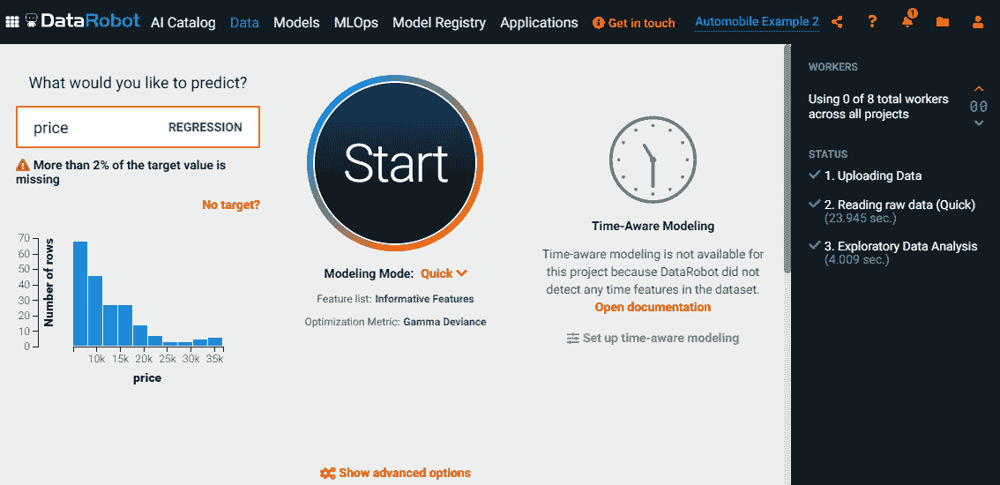

图 6.1 – 上传新项目的数据集

你可以选择与我们之前相同的靶特征（价格）。现在，请点击屏幕底部的 **显示高级选项**，而不是点击 **开始** 按钮。现在，你将看到 **高级选项** 屏幕，如图下所示：

图 6.2 – 高级选项

在这里，你可以看到分区选项。你可以看到默认设置，并且可以根据需要更改它们。由于我们拥有的数据量非常有限，我已经将交叉验证折数减少到 `3`，将保留百分比设置为 15%。你可以轻松更改这些值，并根据需要使用不同的设置运行。接下来，我们点击 **智能降采样** 选项卡，如图下所示：

图 6.3 – 智能降采样

由于这不是一个分类问题，我们在这里不需要担心降采样。如果你有一个不平衡的分类数据集，你可以使用此选项进行降采样。现在，让我们看看 **特征约束** 选项卡，如图下所示：

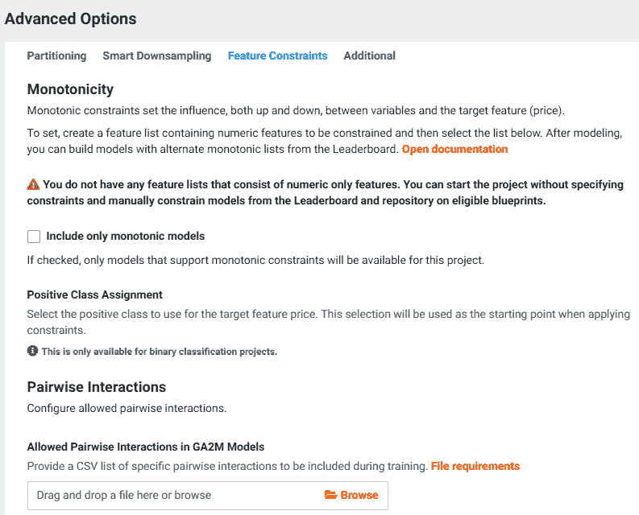

图 6.4 – 特征约束

在这里，您可以设置对特征（如单调性）的约束，即目标值是否与特征的值增加方向相同。目前，我们预见不到需要设置此类约束。此类约束可能是某些用例中的监管要求的一部分。如果是这样，它们可以在此处指定。大多数用例不需要此类约束。现在，让我们点击**额外**选项卡，如下面的截图所示：

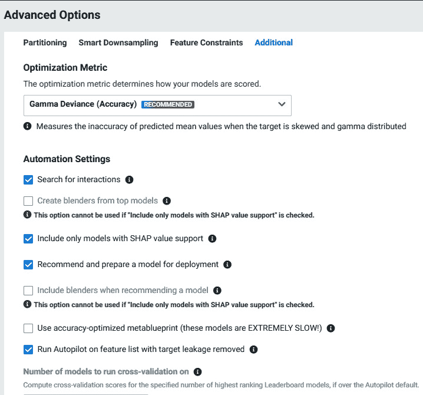

图 6.5 – 额外选项

在这里，我们看到一个选项可以更改用于建模的**优化指标**。我发现 DataRobot 的推荐非常好，除非您有充分的商业理由选择不同的指标，否则您应该使用此选项。鉴于我们处于建模的早期阶段，并且我们希望了解我们的数据，我们将选择**搜索交互**选项，取消选择**从顶级模型创建混合器**选项，并选择**仅包括具有 SHAP 值支持的模型**选项。如*第二章*中所述，*机器学习基础*，**SHapley Additive exPlanations** (**SHAP**) 值有助于理解模型，并将为我们的问题提供额外的见解。这可能以模型精度为代价，但我们将在以后担心提高精度。如果您继续向下滚动此页面，您将看到更多选项，如下面的截图所示：

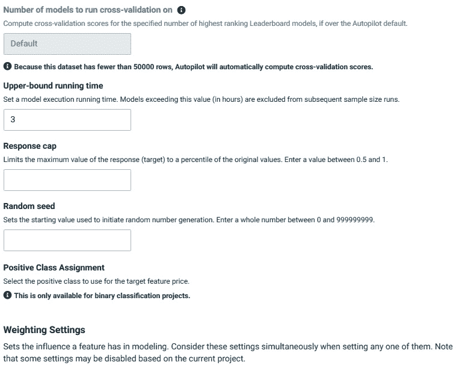

图 6.6 – 更多选项

在这里，您可以设置选项以限制运行时间，限制目标变量预测的值，设置随机种子，或为特定特征添加权重。目前，我们看不出有必要更改这些默认设置。

这完成了配置过程，我们现在可以构建模型。

# 构建模型和模型排行榜

一旦我们完成对配置设置的任何更改，我们可以向上滚动并点击**开始**按钮。DataRobot 将自动开始构建模型，如下面的截图所示：

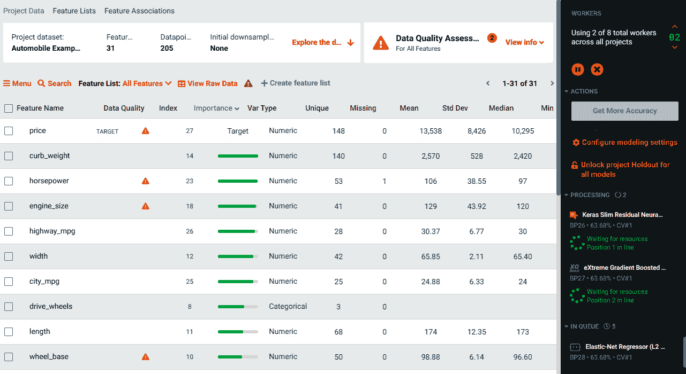

图 6.7 – 模型的自动构建

您可以看到 DataRobot 正在构建哪些模型以及使用了多少训练数据。您会注意到 DataRobot 将首先使用较小的数据集构建快速模型，学习哪个表现更好，然后有选择地使用更多数据构建模型。在当前情况下，您可能看不到这一点，因为一开始数据就很少。一旦 DataRobot 完成构建模型，它将显示模型排行榜，如下面的截图所示：

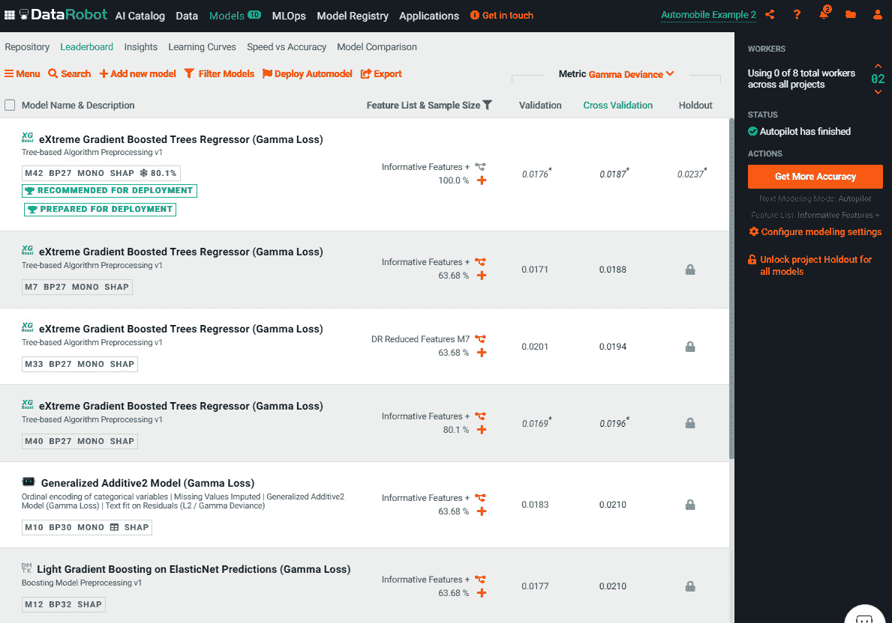

图 6.8 – 模型排行榜

在前面的截图中，你可以看到哪些模型基于你为交叉验证选择的指标而上升至顶端。你也可以从下拉菜单中选择不同的指标，以查看模型在不同指标上的比较。你可以清楚地看到哪些模型上升至顶端。在顶级看到梯度提升模型并不罕见。你也会注意到，根据所选的指标，模型排名会有所变化。你会看到一旦 DataRobot 为部署选择了一个模型，它已经解锁了保留结果，并使用 100%的数据训练模型以准备部署。现在，我们将忽略这一点，因为我们还没有准备好讨论部署。另一件需要注意的事情是用于顶级模型的特征列表。你会看到一个新的**信息性特征+**特征列表被使用。这是 DataRobot 为这些模型创建的特征列表。让我们看看这个列表包含的内容，如下所示：

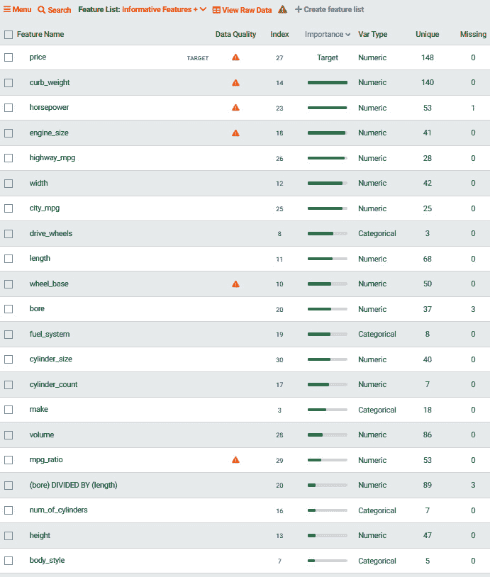

图 6.9 – 新特征列表

如你所见，这个列表包含了一组特征，它还包含了一个 DataRobot 自动创建的新特征：（孔径）除以（长度）。这个比率可能对发动机有重要意义，你应该与**领域专家**（SMEs）讨论其作用。如果之前不知道，这可能会代表你业务团队的一个新见解。实际上，这被称为**冲程比**，被认为是发动机的一个重要参数。建模过程的下一步是看看是否需要进一步细化这个特征列表。让我们回到模型排行榜，选择表现最好的模型**eXtreme Gradient Boosted Trees Regressor (Gamma Loss)**，转到**理解**选项卡并选择**特征影响**子选项卡，如下面的截图所示：

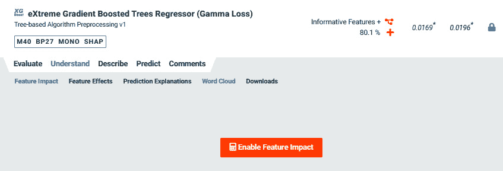

图 6.10 – 理解和特征影响选项卡

你会看到并不是每个模型都会计算特征影响，所以请点击**启用特征影响**按钮，让 DataRobot 进行计算。一旦点击，DataRobot 将开始计算影响，并显示结果，如下面的截图所示：

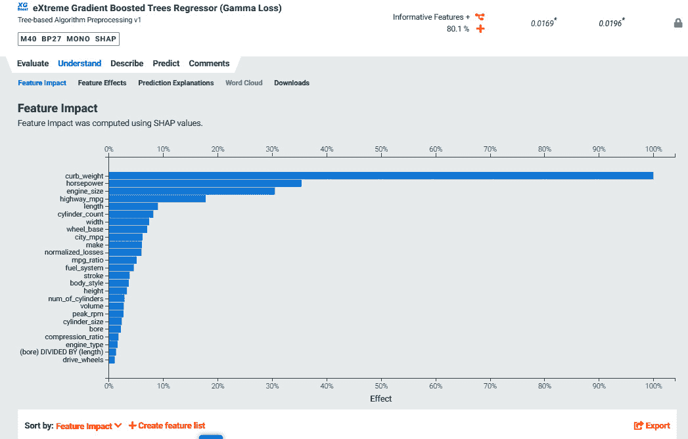

图 6.12 – 导出特征影响

你可以将这些信息下载为`.csv`文件以进行更详细的探索。让我们使用 Excel 打开`.csv`文件来查看特征影响，如下面的截图所示：

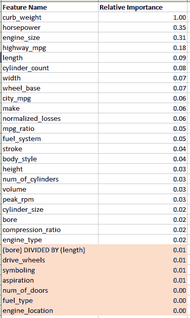

图 6.13 – 整个集合的特征影响

如你所见，最后七个特征没有增加太多，我们可以尝试移除它们并查看影响。像 DataRobot 这样的工具的一个好处是运行这些实验非常快且容易。现在我们知道我们想要做什么，让我们回到**特征影响**屏幕。注意左下角的**+ 创建特征列表**按钮。点击该按钮将弹出一个创建新特征列表的对话框，如下面的截图所示：

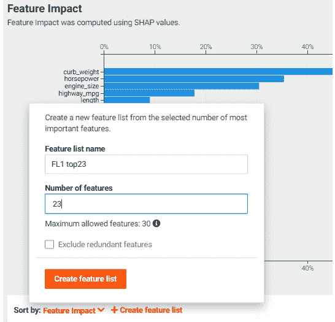

图 6.14 – 创建新的特征列表

在这里，我们可以给特征列表起一个新的名字，`FL1 top23`，并指定我们想要 23 个最佳特征。现在，我们可以点击**创建特征列表**按钮来保存这个新的特征列表。现在，一个新的特征列表已经创建，我们可以在页面右侧的列中点击**配置建模设置**。这将弹出一个配置对话框，如下面的截图所示：

图 6.15 – 配置建模设置

我们现在可以从下拉菜单中选择新的特征列表，`FL1 top23`。如果我们需要，可以修改其他设置并点击**运行**按钮。DataRobot 现在将开始使用新的特征列表构建模型，当过程完成后，你可以在排行榜中看到新的模型，如下面的截图所示：

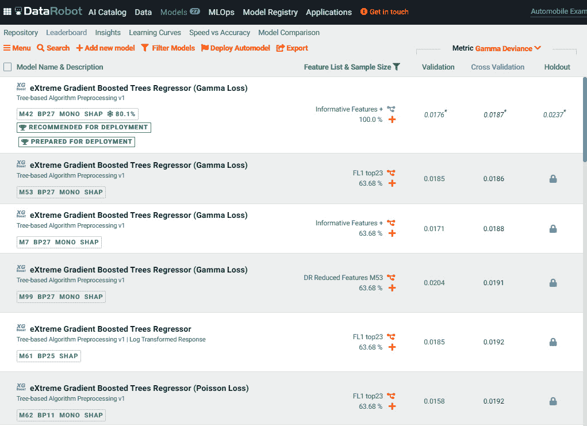

图 6.16 – 带有新模型的排行榜

如你所见，使用新特征列表构建的模型表现更好，现在位于排行榜的顶部（忽略已部署就绪的模型，因为它使用了整个数据集）。正如我们所见，移除贡献不大的特征实际上有助于模型（即使只是略微）。鉴于这个模型使用的是更小的特征集，它是一个更理想的模型。我们可以根据需要继续这个过程。在此阶段，我们也开始更深入地查看模型的细节和它产生的结果。我们将在下一章回到这个话题。现在，我们想看看模型蓝图或 DataRobot 构建模型所采取的步骤。

# 理解模型蓝图

DataRobot 在构建模型时执行了许多数据转换和超参数调整。它利用了许多最佳实践来构建特定类型的模型，这些最佳实践以蓝图的形式编码。您可以通过检查这些蓝图来了解这些最佳实践，并更好地理解构建模型所采取的步骤。要检查模型的蓝图，您可以点击一个模型，转到**描述**选项卡，然后选择**蓝图**选项卡，如下面的截图所示：

![图 6.17 – 模型蓝图

![img/Figure_6.17_B17159.jpg]

图 6.17 – 模型蓝图

在这里，您可以查看工作流程步骤。如您所见，这个蓝图相当简单。这是因为梯度提升方法非常灵活，不需要太多的预处理。让我们看看另一个表现相当不错的模型，即**广义加性 2 模型（Gamma 损失）**的蓝图，如下面的截图所示：

![图 6.18 – 广义加性 2 模型（Gamma 损失）的模型蓝图]

![img/Figure_6.18_B17159.jpg]

图 6.18 – 广义加性 2 模型（Gamma 损失）的模型蓝图]

在这里，您可以看到需要对分类变量和缺失值进行预处理。现在让我们看看另一个**深度学习**（**DL**）模型的蓝图。选择**使用训练计划的 Keras 精简残差神经网络回归器**模型，并选择**蓝图**选项卡，如下面的截图所示：

![图 6.19 – Keras 的模型蓝图

![img/Figure_6.19_B17159.jpg]

图 6.19 – Keras 的模型蓝图

您可以看到，对于 Keras，我们需要对数据进行清洗、缩放，并对分类变量进行独热编码。您可以通过点击模型框来检查这些步骤的详细信息，如下面的截图所示：

![图 6.20 – 处理步骤细节

![img/Figure_6.20_B17159.jpg]

图 6.20 – 处理步骤细节

您现在可以看到构建模型时执行的任务以及使用的超参数设置。还有一个链接，可以查看关于该方法的其他详细信息。在检查蓝图后，您可能会发现 DataRobot 没有使用您最喜欢的算法，您可能会想知道该算法或模型的性能可能是什么样的。为此，您可以在页面左上角点击**存储库**选项卡，如下面的截图所示：

![图 6.21 – 存储库蓝图

![img/Figure_6.21_B17159.jpg]

图 6.21 – 存储库蓝图

在这里，您将看到 DataRobot 提供的所有与此项目相关的蓝图。如您所见，这是一个相当全面的列表。请注意，这个列表将因项目类型的不同而有所变化（例如，时间序列项目）。您可以选择这些蓝图中的任何一个来构建一个模型。新模型将显示在排行榜上，您可以在那里评估其相对性能。目前，我们对此特定项目不感兴趣做这件事。

在这一点上，我们感兴趣的是比较一些模型，以查看它们在更详细层面上如何比较。为此，让我们点击顶部的最右侧标签，称为**模型比较**。这将打开一个页面，您可以选择任何两个模型来查看它们的匹配情况，如下面的截图所示：

图 6.22 – 模型比较

在这里，我们选择了 XGBoost 模型和**广义加性模型**（**GAM**）模型，用于在多个指标上进行比较。我们可以看到，这两个模型之间并不太远，您可以根据其他因素选择任何一个。正如我们之前讨论的，GAMs 的优势在于它们易于向商业用户解释，并且可以呈现为**查找表**（**LUT**），有时也称为评级表。选择 GAM 模型可能还有监管原因。让我们通过点击**计算双重提升数据**按钮进一步探索，带我们到以下屏幕：

图 6.23 – 双重提升图

**双重提升图**用于比较两个模型的结果。对于双重提升图，结果是根据两个模型之间的差异进行排序，而不是根据目标值。然后，这些值被分箱以显示每个箱子的结果。阴影区域描述了两个模型之间的差异。在这里，我们再次看到，这两个模型在性能上非常相似。

如果两个模型在整体得分良好但在此图表中显示值有较大偏差，那么这些模型将是创建集成模型的良好候选者。

# 构建集成模型

众所周知，模型集合往往表现更好，并且也更稳健。DataRobot 提供了自动构建模型集合的能力；然而，这确实需要一些权衡。例如，构建和部署模型集合需要更多的时间和计算资源，并且它们也往往更不透明。这就是我们最初没有从构建模型集合开始的理由。一旦你构建了几个模型，并且你对提高模型准确率的方法感兴趣，你可以决定构建模型集合。正如我们在前面的章节中看到的，我们必须明确选择构建模型集合的选项，这也意味着我们无法计算 SHAP 值。让我们看看这是如何操作的。首先，让我们转到项目列表页面，该页面显示了所有当前项目，如下面的截图所示：

图 6.24 – 项目列表

在这里，我们将选择 `Automobile Example 2`。从菜单中，我们将选择 **Duplicate** 选项。现在，你会看到 **Duplicate** 对话框，如下面的截图所示：

图 6.25 – 复制项目

我们可以给它一个新的名字，`Automobile Example 3`，并且我们将选择 **Copy dataset only**。这样，我们可以应用新的项目设置。让我们点击 **Confirm**。这将创建一个新的项目。我们可以选择目标为价格，现在我们点击 **Advanced Options** 选项卡，如下面的截图所示：

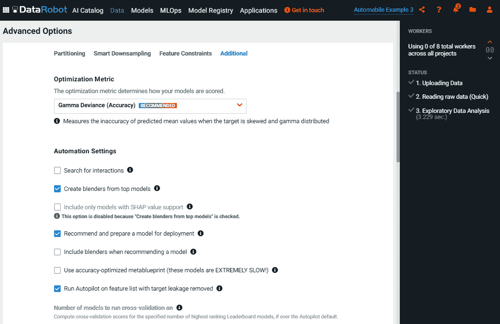

图 6.26 – 模型集合（blender）的高级选项

这次，我们将选择 **Create blenders from top models** 选项，并取消选择 **Include only models with SHAP value support** 选项。现在，我们可以点击 **Start** 按钮让 DataRobot 构建模型。一旦 DataRobot 完成构建模型，我们可以检查排行榜，如下面的截图所示：

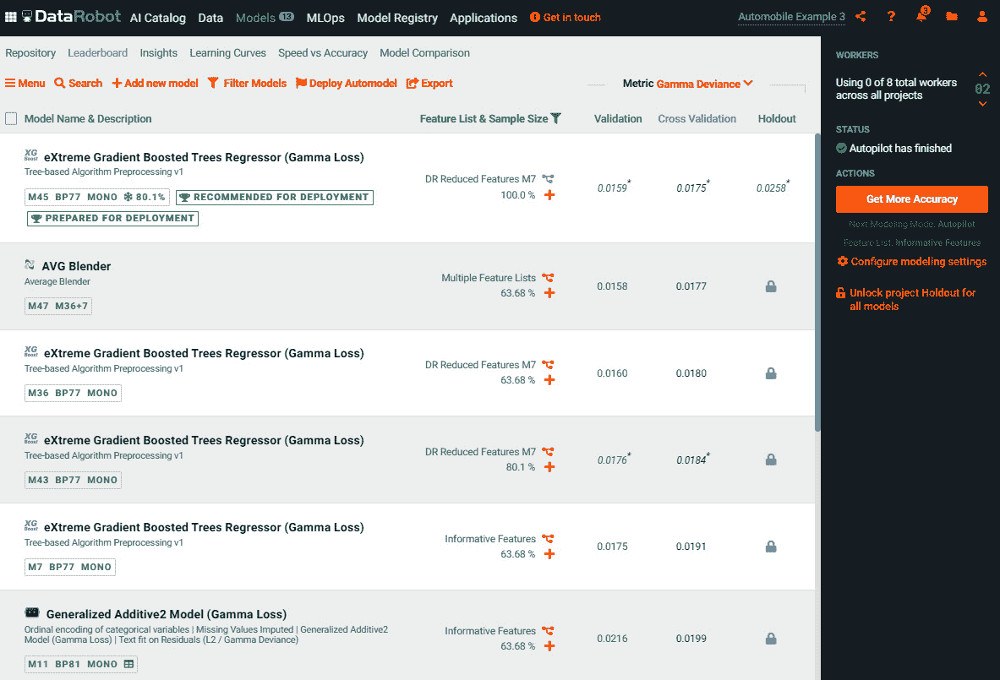

图 6.27 – 拼接模型排行榜

你会注意到 DataRobot 构建了一个 **AVG Blender** 模型，这似乎是顶级模型，但提升效果并不明显。混合模型有时可以比单个模型产生更大的提升，因此探索这个选项是值得的。我们可以选择这个模型，并点击 **Describe** 选项卡，然后点击 **Blueprint** 选项卡，如下面的截图所示：

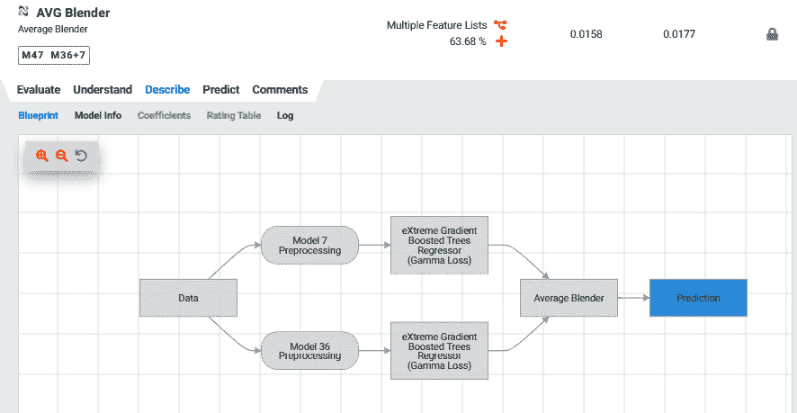

图 6.28 – AVG Blender 的蓝图

现在，我们可以看到 blender 已经选择了两个 XGBoost 模型，因此提升效果并不令人惊讶。在这种情况下，我们不会选择混合模型，而是返回到上一个项目。

# 摘要

在本章中，我们学习了如何利用 DataRobot 的功能构建和比较模型。正如你所见，DataRobot 使得快速构建多个模型变得非常简单，并帮助我们比较这些模型。正如你所体验的，我们尝试了许多事情，构建了数十个模型。这种快速模型探索是 DataRobot 的关键功能，其对数据科学团队的重要性不容小觑。如果你要自己用 Python 构建这些模型，将会花费更多的时间和精力。相反，我们利用了这些时间和思考来实验不同的想法，并将更多的精力投入到理解问题上。我们还了解到了编码最佳实践的蓝图。这些蓝图对于新晋和经验丰富的数据科学家都是有用的学习工具。我们还学习了 DataRobot 如何为我们构建集成或混合模型。

可能会有一种冲动想要跳过分析阶段，直接开始部署这些模型，但重要的是在进行一些分析之前不要直接跳入这一步。我们现在已经准备好深入挖掘模型，理解它们，并看看我们能否从中获得更多见解。
