# 第七章: 模型理解和可解释性

在上一章中，我们学习了如何构建模型，现在我们将学习如何使用 DataRobot 生成的输出理解模型，并利用这些信息解释为什么模型会做出特定的预测。正如我们之前讨论的，这一点对于确保我们正确使用结果至关重要。DataRobot 自动化了创建图表和绘图的大部分任务，以帮助人们理解模型，但你仍然需要知道如何在你试图解决的问题的背景下解释它所显示的内容。这也是为什么即使许多任务已经自动化，我们仍然需要参与这个过程的人的原因。正如你可以想象的，随着自动化程度的提高，解释结果的任务将变得越来越有价值。

在本章中，我们将涵盖以下主要内容：

+   检查和理解模型细节

+   评估模型性能和指标

+   生成模型解释

+   理解模型学习曲线和权衡

# 检查和理解模型细节

在上一章中，我们为不同的项目创建了几个模型。DataRobot 在一个项目中创建 10 到 20 个模型，查看和分析所有这些模型的细节将非常繁琐。你不必逐一审查这些模型，在做出最终选择之前，通常只审查前几个模型。现在，我们将查看`Automobile Example 2`项目中的模型排行榜，并选择最顶尖的模型，如下面的截图所示：

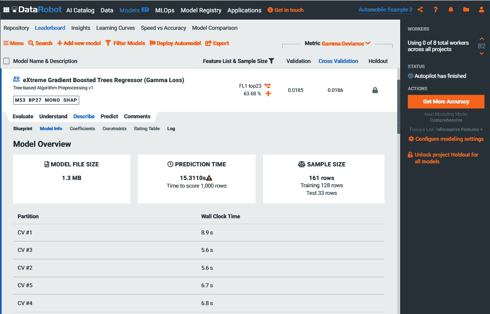

图 7.1 – 模型信息

在前面的截图中，我们在**描述**选项卡内选择了**模型信息**选项卡，以查看模型的大小以及创建预测所需预期时间。这些信息对于需要快速评分数千笔交易且对时间敏感的实时应用非常有用。现在，让我们转到**理解**选项卡内的**特征影响**选项卡，如下面的截图所示：

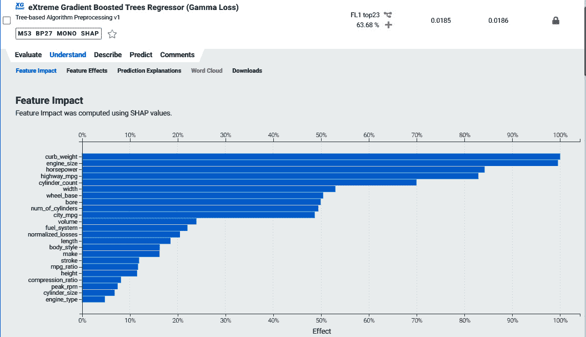

图 7.2 – 特征影响

这张图对于模型来说非常重要，因为它展示了特征对 XGBoost 模型贡献的大小。我们可以看到，最大的贡献者是`curb_weight`、`engine_size`、`horsepower`、`highway_mpg`和`cylinder_count`。另一方面，`cylinder_size`和`engine_type`的贡献很小。虽然`cylinder_size`的预测能力不是很强，但我们不能忘记预测并不总是最终目标。我们知道`cylinder_size`对`engine_size`有影响，这是一个重要的特征。目标可能是利用这些信息找出降低成本的方法。为此，我们可能希望减小`engine_size`，但你不能直接减小`engine_size`。为此，你需要减小气缸的大小或数量，这将导致`engine_size`的减小。拥有一个因果图来指导你，在确定实现目标的最佳行动时变得非常有帮助。

在我们采取行动之前，让我们检查一下**广义加性模型**（**GAM**）的结果，如图下所示截图：

![图 7.3 – GAM 的特征影响]

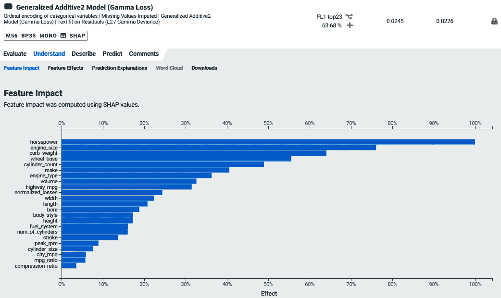

图 7.3 – GAM 的特征影响

*图 7.3* 展示了 GAM 的重要特征。虽然许多特征看起来很相似，但我们注意到`engine_type`在这个模型中的重要性相当高，而在之前的模型中`engine_type`的重要性非常低。这并不是错误——它指向了这样一个事实，即许多特征是相互关联的，不同的模型可以从不同的特征中捕捉到信号，并且预测能力并不一定等同于根本原因。为了采取行动，我们需要了解导致目标特征变化的根本特征。换句话说，最能预测某事的特征，并不总是可以改变以在目标中产生期望变化的特征。

为了进一步了解特征如何影响目标，让我们在模型的“理解”选项卡中选择“**特征效应**”选项卡，如图下所示截图：

![图 7.4 – 特征效应]

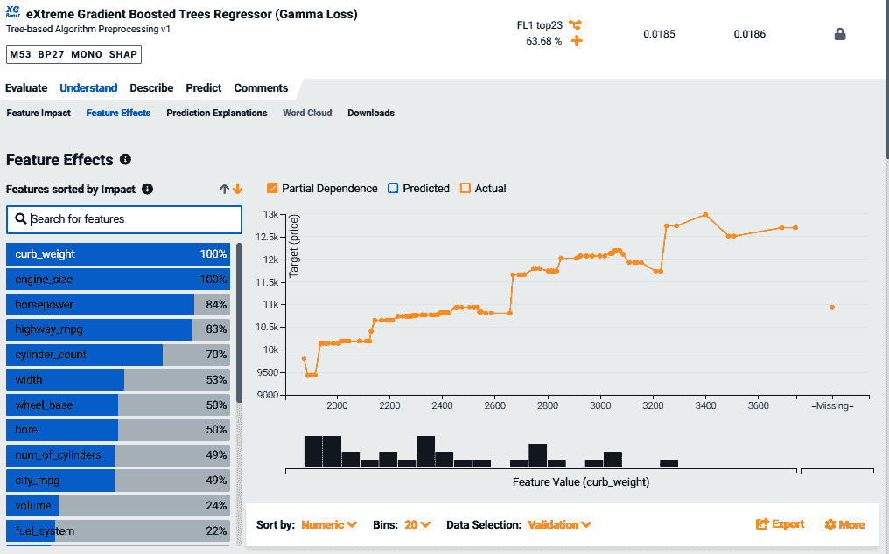

图 7.4 – 特征效应

上述截图显示了各种特征的局部依赖性图。选定的图是关于`curb_weight`的。该图显示了`curb_weight`和价格之间相当线性的关系。我们确实在几个地方看到了价格的一些异常下降——例如，在`curb_weight`值为`2700`左右。在我们对此过于认真之前，我们注意到围绕这个值的数据量非常有限。这告诉我们，这个特定的观察结果很可能是由于数据不足。这确实提出了一个问题，即我们的模型很可能会在那个小区域内预测一个较低的价格，这反过来又可能导致收入降低。

让我们在以下截图中查看另一个特征：

![图 7.5 – engine_size 的部分依赖性]

图 7.5 – engine_size 的部分依赖图

前面的截图显示了 `engine_size` 和价格之间高度非线性关系。我们在 `engine_size` 值为 `180` 附近看到了价格的一个非常戏剧性的上升。如果不与领域专家讨论，很难知道这个效果有多真实。我们可以注意到，对于大于 `130` 的尺寸，可用的数据量非常小，因此我们看到的效应可能仅仅是数据不足造成的。就目前来看，它表明价格在 `200` 以上的尺寸上停滞不前，这对业务可能是一个重要的见解。

让我们看一下以下截图中的 `highway_mpg` 的另一个部分依赖图：

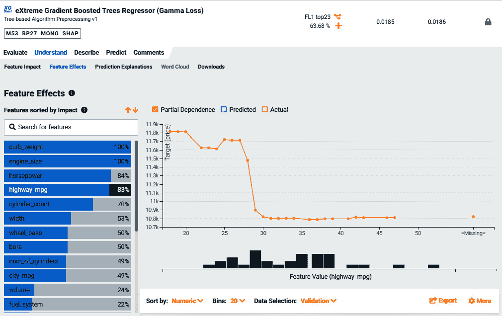

图 7.6 – highway_mpg 的部分依赖图

*图 7.6* 显示了另一个高度非线性关系，一个关键的转折点发生在 `highway_mpg` 值约为 `28` 附近。这清楚地表明在 `28` 附近有一个大的价格下降，因此这是一个关键点。这可能是由于法规，低于 `28` 将您置于不同类型的车辆或发动机。我们还注意到，一旦超过这个阈值，任何进一步的变化对价格的影响都不是很大（然而，从其他角度来看，它仍然可能非常有影响）。如果您不知道为什么是这样，与您的**主题专家**（**SMEs**）讨论这一点很重要。

我展示和讨论这些图表的主要目的是向您展示分析这些图表而不是花费所有时间编写这些图表的重要性。由于 DataRobot 会自动为您创建这些图表，您现在可以花时间进行更有价值的分析工作，以帮助改进您的业务。

让我们回顾一下 `engine_size` 的图表，但这次是针对 GAM，如下截图所示：

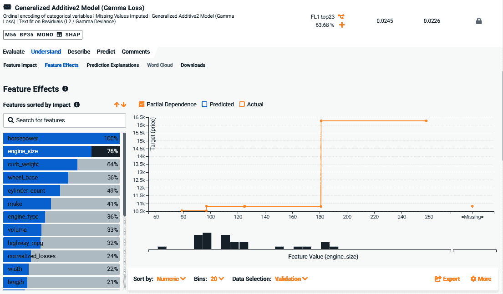

图 7.7 – GAM 的部分依赖图

*图 7.7* 显示了 GAM 的部分依赖图。与 *图 7.5* 进行比较，我们看到 *图 7.7* 在 `95` 和 `180` 的值周围显示了更清晰的阈值。与领域专家讨论这个问题可以帮助您确定哪个模型更好地代表现实，哪个模型有助于您更好地设定定价。GAMs 的一个好处是您可以轻松地平滑这些曲线并调整它们的形状以部署。记住——准确的预测并不总是等同于更好的干预或行动。

GAMs 更容易理解和解释。让我们再看另一个图表，它有助于理解这一点：

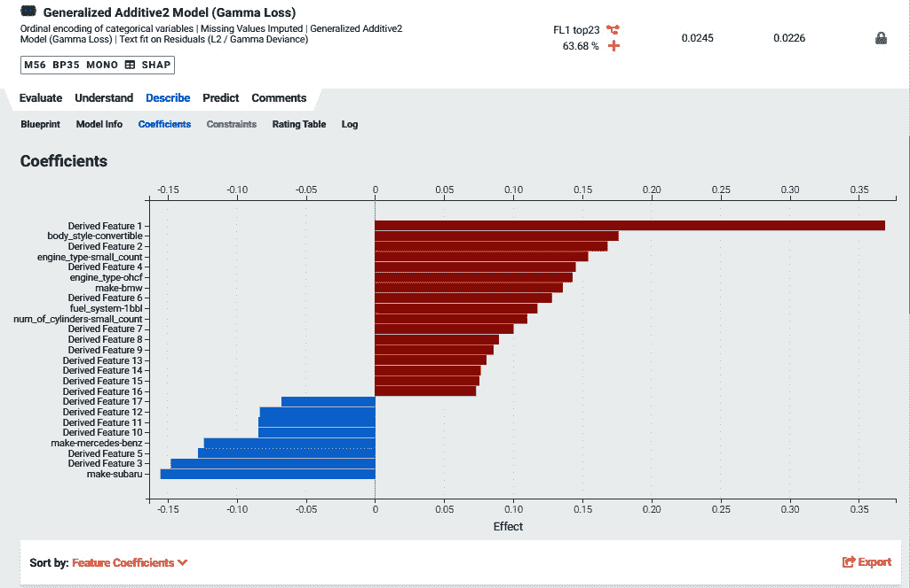

图 7.8 – 特征系数

*图 7.8* 展示了 GAM 中不同特征的系数。你会注意到 DataRobot 创建了一些派生特征。你可以点击它们以查看更多详细信息。这提供了一个系数的高级视图，但还有一个更好的视图，可以更好地理解模型。为此，让我们点击 GAM 的“描述”选项卡内的“**评级表**”选项卡，如下面的截图所示：

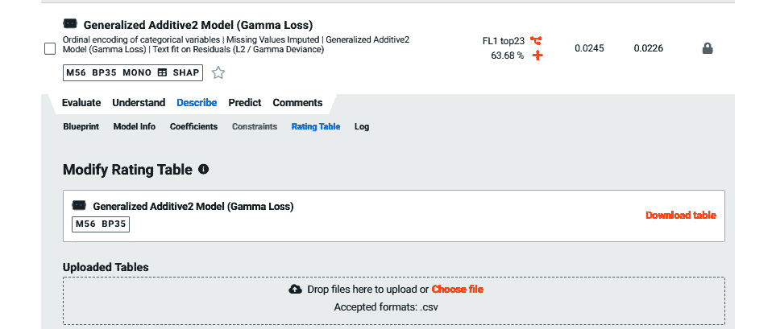

图 7.9 – GAM 的评级表

这个视图允许你下载 DataRobot 构建的评级表；你也可以修改这个表并将其上传回来以使用修改后的表。这种机制因此允许你根据对问题的理解手动微调你的模型。因此，这个功能非常强大，因为它为你提供了很多灵活性，但与此同时，你必须谨慎使用。让我们点击“**下载表格**”按钮并下载**逗号分隔值**（**CSV**）文件。下载后，我们可以使用**Excel**打开文件，如下面的截图所示：

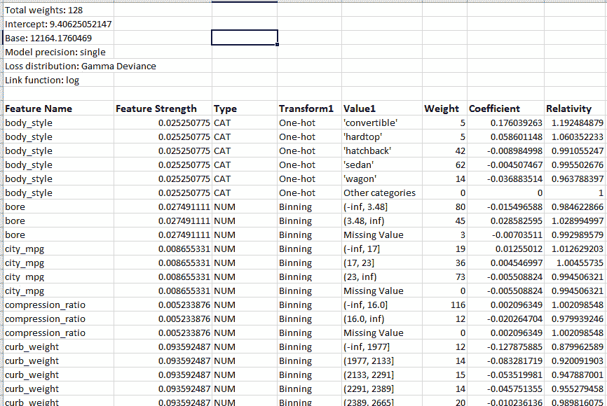

图 7.10 – GAM 的评级表

现在，你可以看到评级表的样子。在这里，你可以看到 DataRobot 为各种特征创建了区间。对于每个区间，它都分配了系数和相对性，以说明特征变化如何影响目标变量。为了更好地理解这一点，我们可以在 Excel 中为单个特征创建图表，如下面的截图所示：

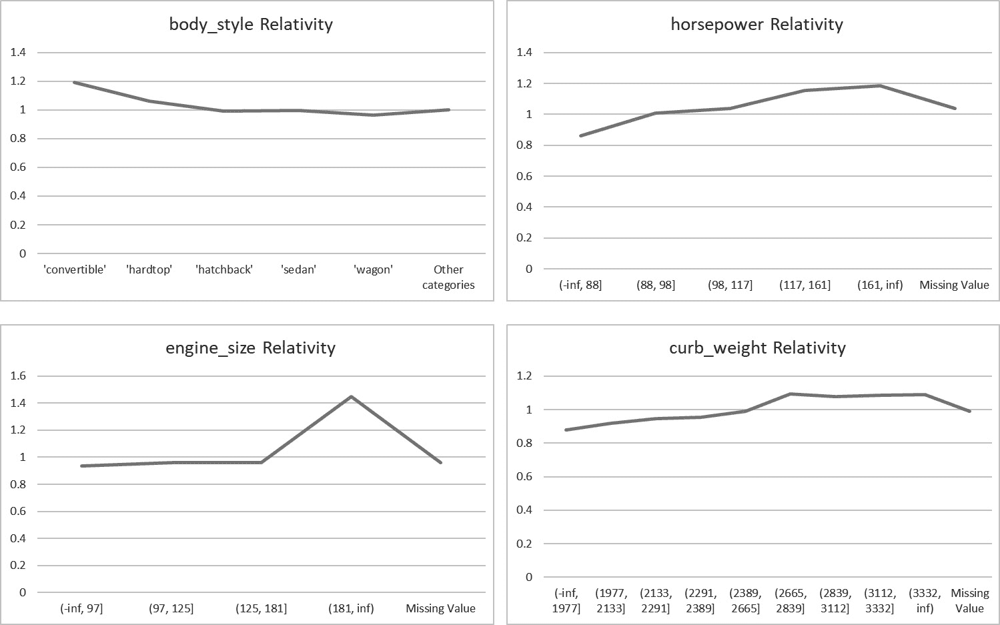

图 7.11 – 特征相对性

在 *图 7.11* 中，你可以看到给定特征（如 `body_style`）如何影响价格。GAM 模型本质上是从所选特征中得到的所有贡献的总和。给定评级表，任何人都可以轻松计算价格，这也可以以非常简单的方式实现。鉴于单个特征效应是非线性的（但仍非常易于理解），这使得这些模型在易于理解的同时表现出色。GAMs 变得非常受欢迎也就不足为奇了。

我们还想查看一个图表，这个图表经常有助于理解特征的贡献。为此，我们将点击页面顶部的“**洞察**”菜单项，这将显示下面的图表：

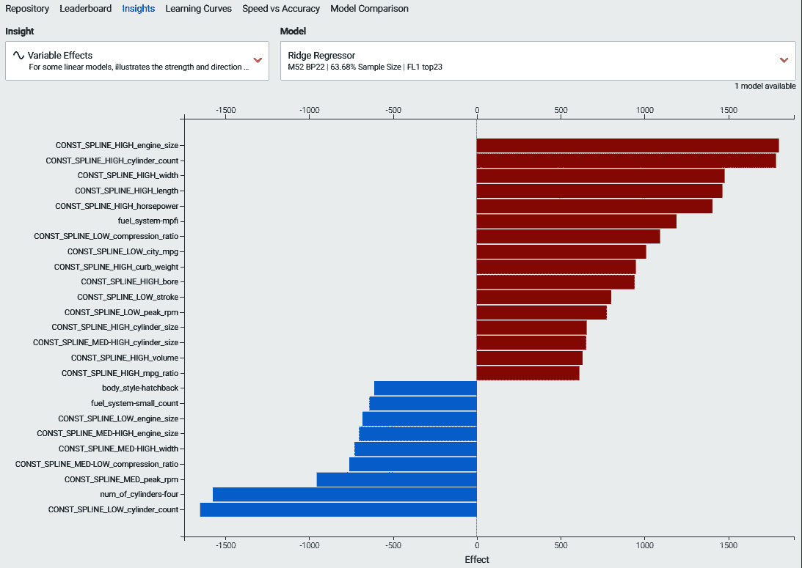

图 7.12 – 模型洞察

*图 7.12* 使用 DataRobot 选定的模型（在这种情况下，如果值落在特定区间内则为`one`，否则为`zero`）展示了变量效应。你可以参考所选模型的特征效应来查看这些图表之间是否存在任何不一致。

现在我们已经从哪些特征重要以及它们如何有助于目标值的视角理解了模型，我们可以关注模型的表现如何。

# 评估模型性能和指标

在本节中，我们将关注模型在尝试预测目标值方面的表现如何。让我们首先查看不同模型之间的整体性能比较，如下面的截图所示：

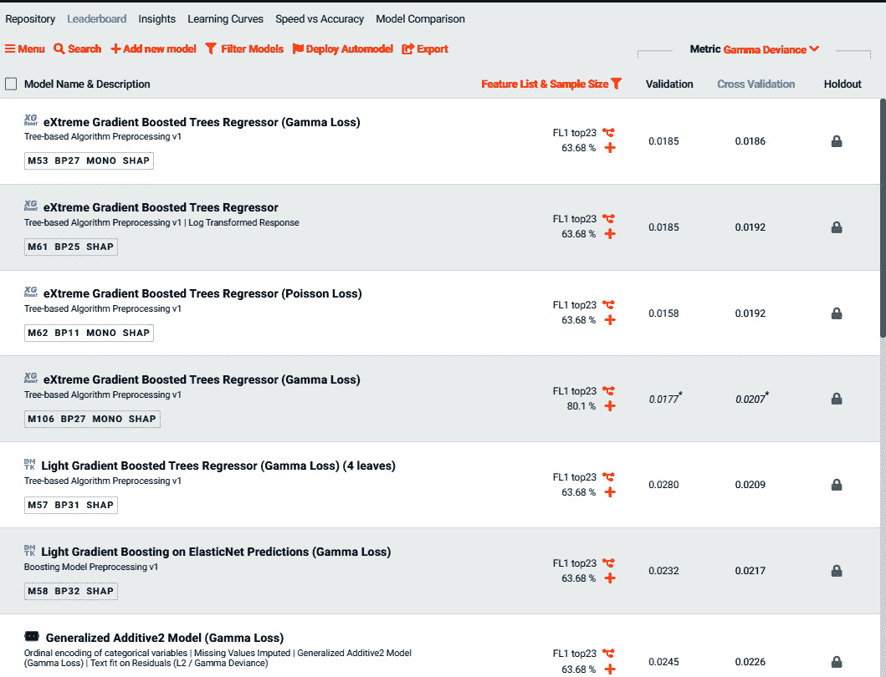

图 7.13 – 模型间的性能

前一个截图显示了之前见过的整体排行榜。在这里，我们可以看到基于**Gamma 偏差**指标的不同模型的总体性能。我们还可以通过点击指标附近的下拉箭头来查看基于其他指标的性能，如下面的截图所示：

图 7.14 – 性能指标

*图 7.14* 展示了我们可以选择的各项指标。你通常会看到在不同指标中，哪些模型会出现在顶部位置上呈现出相似的趋势。一般来说，DataRobot 选择的指标是一个非常不错的选择，如果不是最佳选择。现在，让我们通过点击模型并在**评估**选项卡中选择**升力图**选项卡来检查特定模型的性能细节，如下面的截图所示：

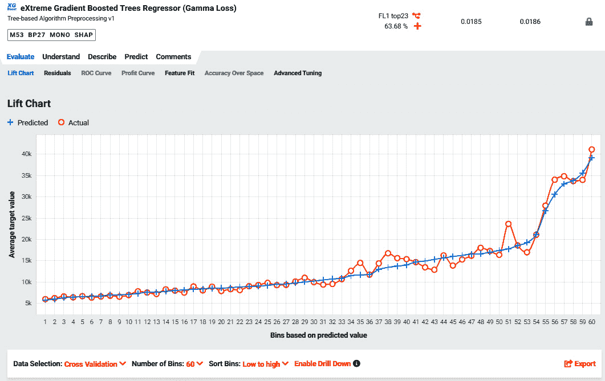

图 7.15 – 升力图

前一个截图中的升力图显示了预测值与实际值之间的对比。你可以选择分组结果的桶数。最大值为`60`，这通常是一个好的起点。这意味着预测值首先按升序排序，然后分组到`60`个桶中。你看到的结果是那个桶内的平均值。分桶的原因是，如果你查看整个数据集，会有如此多的数据，你将无法从中得出任何有意义的结论。你可以看到，模型在整个值域上表现非常好，有一些小区域，其中差异似乎比其他区域更高。我们通常希望看到多个模型的升力图，以查看是否有某个模型比另一个模型表现更好的区域。现在，让我们查看 GAM 的升力图，如下面的截图所示：

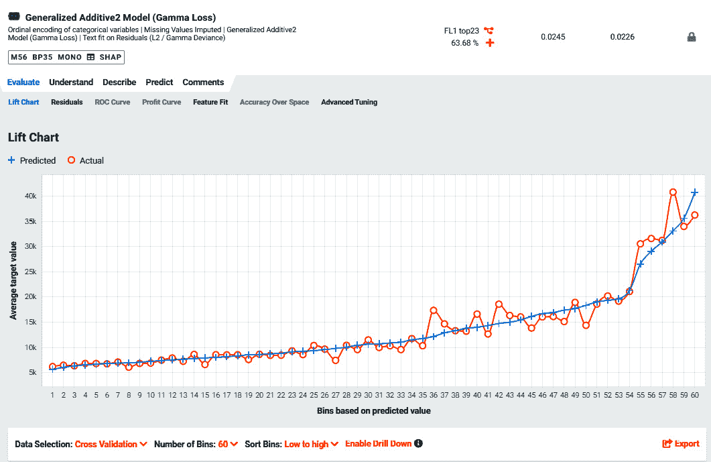

图 7.16 – GAM 的升力图

*图 7.16* 的结果看起来与*图 7.15* 的结果非常相似，但我们可以看到，对于更高的值，GAM 的表现不如 XGBoost 模型。现在我们知道 GAM 相对于 XGBoost 模型在哪些具体区域较弱。让我们进一步查看，通过点击**评估**选项卡中的**残差**选项卡，如下面的截图所示：

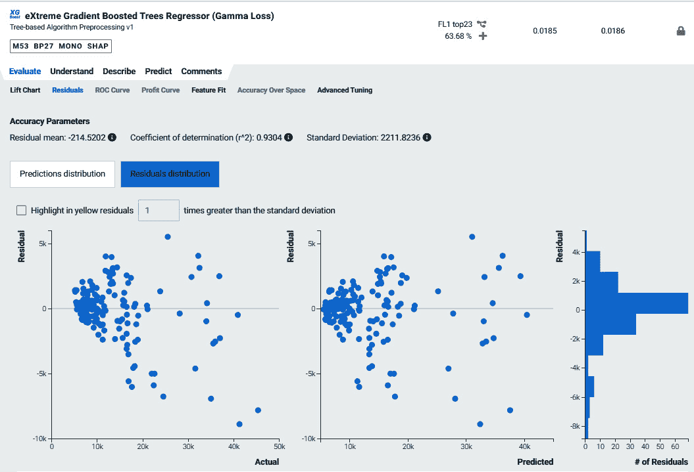

图 7.17 – 模型残差

残差似乎在平均值周围分布良好，但略偏向负值。让我们也检查一下 GAM 的残差分布。我们可以在下面的屏幕截图中看到输出：

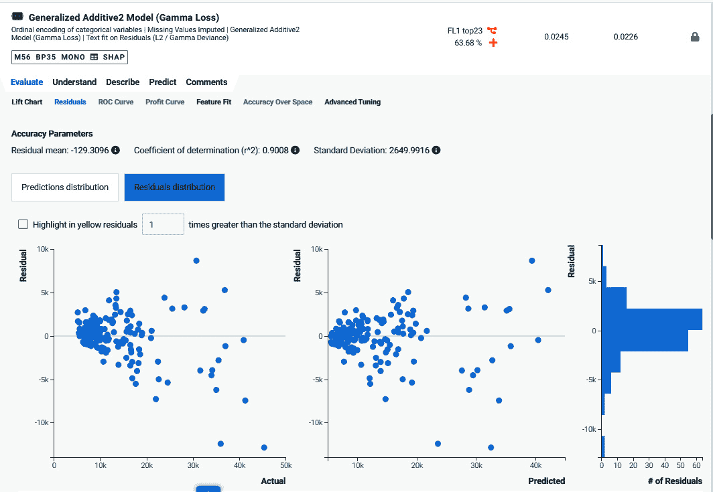

图 7.18 – GAM 的残差

GAM 的残差也分布良好，但与 XGBoost 模型相比，略偏斜。总体而言，模型的表现看起来非常好。我们现在可以深入了解个别预测及其解释。

# 生成模型解释

DataRobot 的另一个关键功能是它自动为每个预测生成实例级解释。这对于理解为什么特定的预测结果是这样非常重要。这不仅对于理解模型很重要；很多时候，这也需要用于合规目的。我相信如果你被拒绝信用，你一定见过生成的解释。生成这些解释的能力并不简单，可能非常耗时。让我们首先看看 XGBoost 模型生成的解释，如下面的屏幕截图所示：

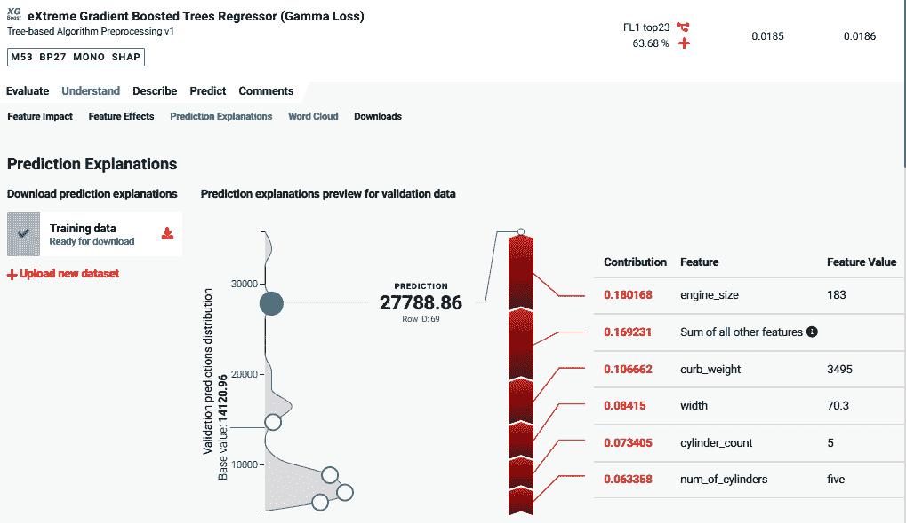

图 7.19 – 模型解释

由于我们选择了 `0` 到 `10000`。您可以选择一些特定的点，并查看构成该预测的组成部分。在 *图 7.19* 中，我们选择了预测点 `27788.86`。我们可以看到右侧的主要贡献元素，其中 `engine_size` 贡献最大，在这种情况下，`engine_size` 的值为 `183`。请注意，特征的相对贡献可能会根据具体情况而变化，这里特征的排序将不会与前面章节中看到的特征影响顺序完全匹配。让我们将此与 GAM 生成的解释进行比较，如下面的屏幕截图所示：

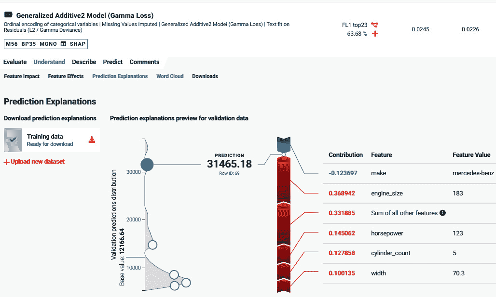

图 7.20 – GAM 模型的模型解释

在前面的屏幕截图中，选择的点是预测 `31465.18`。对于这个点，我们可以看到对价格有主要贡献的特征，我们还注意到由于 `engine_size` 的 `183` 导致的减少或负贡献在 GAM 中要大得多。

整个数据集的解释可以下载并进行分析，以获得更多见解。您还可以通过点击**上传新数据集**按钮，轻松上传全新的数据集进行评分并生成这些解释。

正如你在本章中看到的，不同的模型有不同的性能，使用特征的方式略有不同，可理解性水平也不同。在最终选择你想要使用的模型之前，应该考虑几个其他维度。现在让我们看看模型学习曲线和一些模型权衡。

# 理解模型学习曲线和权衡

在**机器学习**（**ML**）问题中，我们总是试图找到更多数据来改进我们的模型，但正如你可以想象的那样，总会有一个点，收益递减。很难知道何时达到那个点，但你可以通过查看学习曲线来获得一些指示。幸运的是，DataRobot 通过自动构建这些学习曲线使这项任务变得简单。当 DataRobot 开始构建模型时，它首先尝试在数据的小样本上使用广泛范围的算法。然后使用更大的样本大小构建有希望的模型，依此类推。

在这个过程中，我们发现随着更多数据的添加，性能改进了多少。要查看学习曲线，你可以点击屏幕顶部的**学习曲线**菜单项，如下面的截图所示：

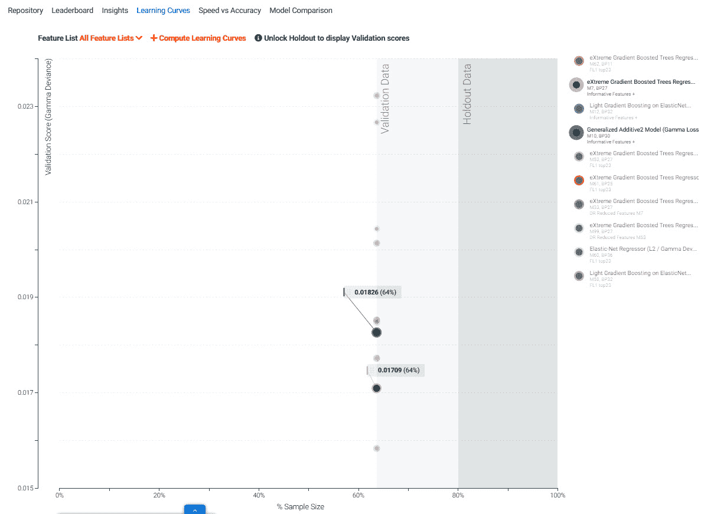

图 7.21 – 模型学习曲线

你可以在页面右侧看到不同的模型类型。在这里，你可以点击你想要检查和比较的模型。选择模型后，你点击**+ 计算学习曲线**按钮。这将弹出一个对话框，显示所选模型和相应的样本大小，如下面的截图所示：

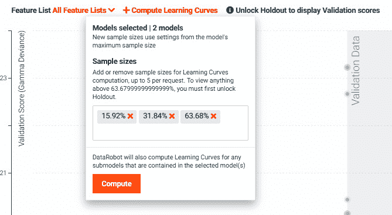

图 7.22 – 用于比较的模型

如果*图 7.22*中的选择看起来正确，你可以点击**计算**按钮。现在你会看到所选模型的曲线，如下面的截图所示：

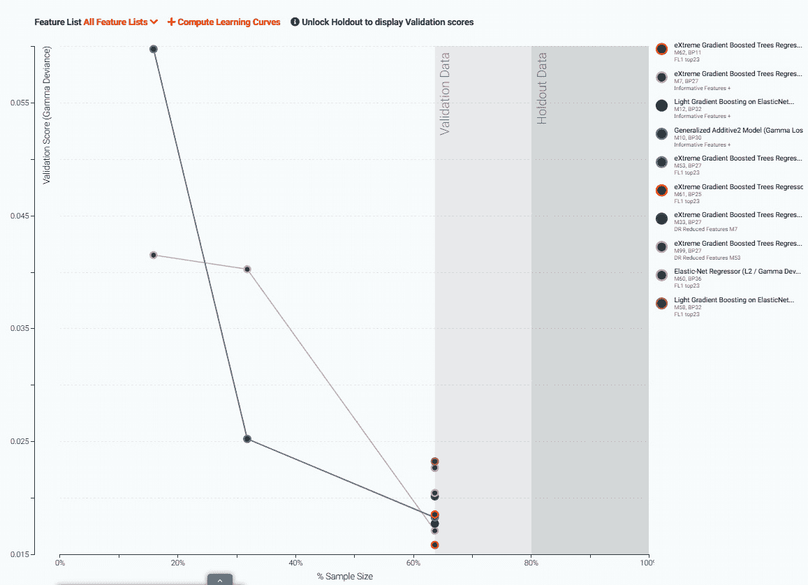

图 7.23 – 学习曲线比较

随着样本量的增加，你现在可以看到性能的改进。我们可以看到 GAM 学习非常快，但随着样本量的增加，XGBoost 模型开始占据主导地位。我们可以看到，这两个模型都将从额外的数据中受益。我们还可以看到，如果我们只有目前数据的一半，那么 GAM 将是明显的赢家。

我们现在可以看看模型的一个另一个权衡——即速度与准确率的权衡。如果你点击页面顶部的**速度与准确率**菜单项，你会看到一个图表，如下面的截图所示：

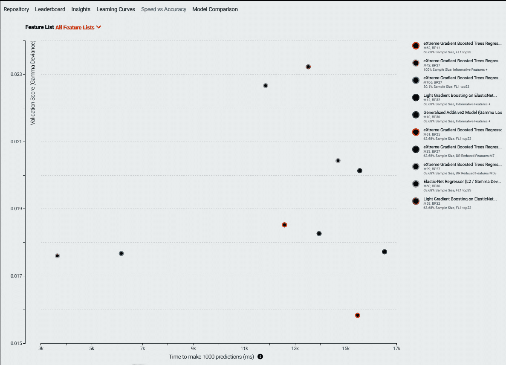

图 7.24 – 速度与准确率权衡

你会注意到 DataRobot 构建了一个 AVG Blender 模型，这似乎是顶级模型，但提升并不大。混合模型有时可以比单个模型产生更大的提升，因此探索这个选项是值得的。我们可以选择这个模型，并在“描述”菜单项中的“蓝图”选项卡上点击。

# 摘要

在本章中，我们介绍了如何利用 DataRobot 的功能构建和比较模型。正如你所见，DataRobot 使得快速构建多个模型变得非常简单，并帮助我们进行比较。正如你所体验的，我们尝试了许多事情，构建了数十个模型。这是 DataRobot 的关键功能，其对数据科学团队的重要性不容小觑。如果你要自己用 Python 构建这些模型，将会花费更多的时间和精力。相反，我们利用了这些时间和思考来实验不同的想法，并将更多的精力投入到理解问题上。我们还了解到了编码最佳实践的蓝图。这些蓝图对于新晋和经验丰富的数据科学家都是非常有用的学习工具。我们还学习了 DataRobot 如何为我们构建集成或混合模型。

可能会很有诱惑力直接跳过并开始部署这些模型之一，但重要的是在进行一些分析之前不要直接跳到那一步。在下一章中，我们将更深入地研究模型，以了解它们，并看看我们是否能从中获得更多见解。
