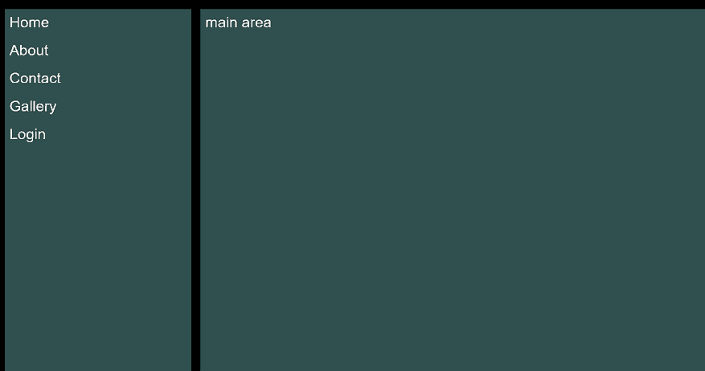
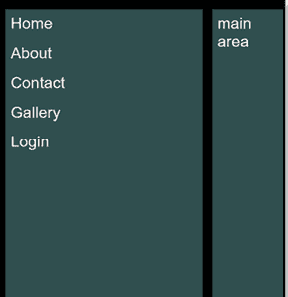
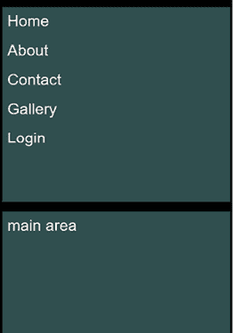
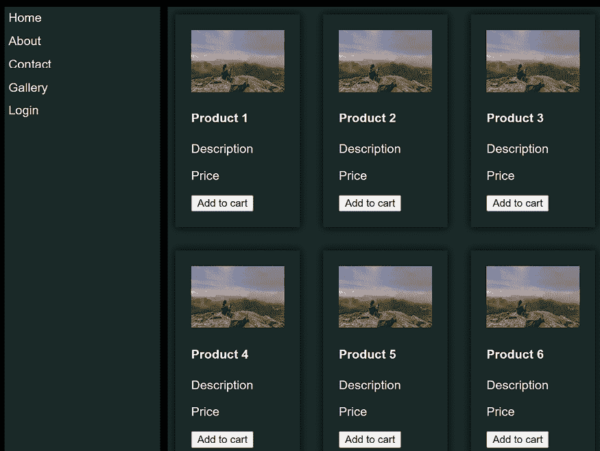
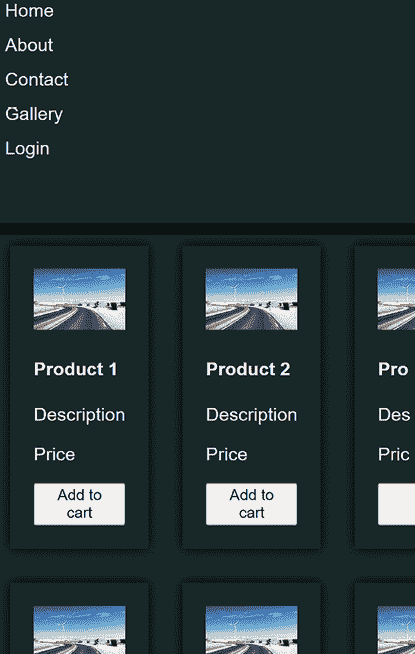
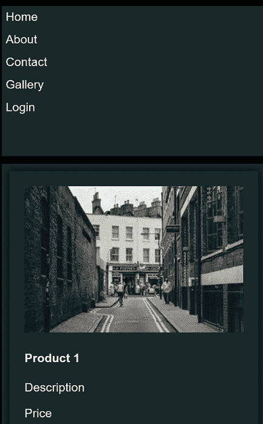
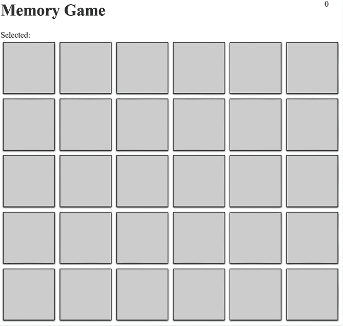

# 第七章：使用响应式网页布局支持多个视口

# 简介

构建网页是一个挑战。你不仅需要用 HTML、CSS 和 JavaScript 来制作这些页面以执行你设定的任务，而且还需要确保它们对大多数用户都是可访问的。此外，你需要确保页面无论在 PC、平板电脑还是移动设备上都能良好渲染，这意味着你需要考虑屏幕尺寸；设备的方向，即横屏或竖屏；以及像素密度。

确保你的网页在许多设备上看起来很好有很多不同的技术，但这一切都始于有一个策略，一个根据使用的设备为用户提供的体验愿景。一旦你设定了这个愿景，你就可以开始实施它。

你需要做出的某些选择包括，如果你的内容以列的形式呈现，应该列出多少列。其他事物应该如何表现，比如填充和边距？内容应该是居中还是左对齐？内容应该是垂直堆叠还是水平排列？是否有在移动设备上应该隐藏的内容？正如你所看到的，有许多选择会影响你需要使用的提示。

在处理网页布局时使用 AI 助手可能会有所帮助，因为你需要记住很多信息，所以不仅 AI 助手可以记住所有这些细节以便于查找，而且你还可以利用它来建议不同的设计。

在本章中，我们将：

+   解释像视口和媒体查询这样的技术术语。

+   应用不同的技术来优化不同视口的渲染。

+   利用 Copilot 聊天功能来改进我们的代码。这是 GitHub Copilot 中你可以使用的“其他”模式；它是一个聊天窗口，让你可以输入提示并得到响应。这种体验类似于 ChatGPT 这样的 AI 工具。

# 商业问题：电子商务

本章将继续探讨在前三章中已经工作的电子商务用例。构建功能是一回事，但你必须假设你的用户会从许多不同的设备与你的网站互动，并且这种体验必须是好的，否则他们会去竞争对手的网站。

# 问题与数据域

现在有许多不同的设备：平板电脑、手机，从小型桌面屏幕到大型屏幕。像素密度各不相同。这不仅仅是将网站缩小或放大以适应新设备的问题，你可能还需要设计一个完全不同的体验，以更好地适应特定设备的视觉风格。还有其他一些考虑因素，比如如果我们假设设备有限制，比如它能处理多少并发下载以及可能具有的网络速度，我们希望向较小的设备发送多少内容。一个具有宽分辨率的桌面机器通常与互联网有很好的连接，这是很常见的。相反，一个移动设备可能处于 3G 网络或更差的网络，因此你需要通过要求更少的图形资源、更小的 JavaScript 包和更多来适应这种情况。

# 将问题分解为功能

在此之前的几个章节中，我们已经看到，一个好的方法就是确定我们需要实现的功能。这些功能更多地关乎确保设计和交互在优先设备上工作良好，而不是关于读写数据。因此，你可能会有一个如下所示的功能分解列表：

+   应在横幅模式下以双列设计渲染购物车页面。

+   竖幅模式：

    +   应在竖幅模式下以单列设计渲染购物车页面。

    +   应在屏幕底部显示菜单操作。

    +   你应该隐藏某些功能，比如 X、Y、Z（假设 X、Y、Z 在宽屏桌面上有可用）。这个要求的目的在于你必须“重新思考”移动体验与桌面体验的区别，哪些功能是体验的核心，以及我们只有在有足够的屏幕空间来显示时才显示哪些功能。

    +   应支持并渲染以下移动设备的视觉吸引力外观：iPhone X、Y、X 和 Android。

+   应在 3G 连接上在 1 秒内渲染页面。

如你所见，这些功能与用户体验的联系比任何数据领域都要紧密。

# 提示策略

我们的提示策略与之前类似，是一种混合方法，即使用编辑器内的体验，并在开放文本文件中添加提示，以在 Copilot 中打开**聊天**窗口；根据你的判断混合这些方法。

至于提示，这些提示中应有足够的内容，使 Copilot 意识到它需要为特定设备提出设计建议。因此，它应该能够从上下文中推断出哪些分辨率、像素密度和其他细节应该影响它即将生成的建议。至于使用的提示模式，我们将使用*第二章*中描述的“探索性提示模式”。

# 视口

那些只需要开发一个看起来在 PC 上很漂亮的网页的日子已经过去了。今天，你的网页可以在多种不同的设备上渲染，并且需要在所有这些设备上都看起来很好，否则你的客户可能会去其他地方。

理解如何构建网页的第一步是熟悉一些关键概念。第一个概念是视口。视口是用户可以看到的页面的一部分。视口与窗口之间的区别在于，视口是窗口的一部分。

根据所使用的设备，例如，桌面屏幕或移动设备，其大小会有所不同。当你编写代码以适应不同的大小，以便良好渲染时，这被称为使页面“响应式”。

## 媒体查询

好吧，我正在处理不同屏幕大小的设备，所以我如何编写代码以确保视觉界面适应我使用的设备大小？

答案是利用一个称为媒体查询的结构。媒体查询是 CSS 中的一个逻辑块，它识别一个特定条件，并在该条件为真时应用特定的 CSS。

假设存在以下代码；这基本上就是它的工作原理：

```py
if(page.Width > 1024px) {
  // render this UI so it looks good for desktop
} else {
  // render this UI to look good for a mobile device
} 
```

下面是一个媒体查询的示例：

```py
body {
  background: blue;
}
@media (max-width: 600px) {
    body {
        background-color: lightblue;
    }
} 
```

前面的代码识别了一个条件，即如果视口当前宽度最多为 600 像素（这对大多数移动设备来说是正确的），则将背景颜色设置为浅蓝色。

这个例子可能感觉有点牵强；为什么我会在移动设备上想要一个不同的背景颜色，而不是在正常的桌面设备上？你不会，但上面的例子给你一个关于媒体查询如何识别视口大小并在视口满足某些条件时应用特定 CSS 的想法。

## 何时调整不同视口并使其响应式

使用响应式设计的良好理由是，你有一个在桌面设备上看起来很棒的布局，但可能对移动设备来说太宽了。例如，假设你有一个带有左侧菜单和右侧主要区域的网页：



图 7.1：带有菜单和主要区域的页面

如果我们尝试在移动设备上查看此页面，它看起来不会很好。它看起来可能像这样：



图 7.2：移动设备上的非响应式页面

在上面，我们看到设备试图查看页面，但主要区域被截断了。在这个时候，作为设计师，你需要考虑如何解决这个问题。一种方法是通过使用 flexbox 或 grid 等技术垂直对齐内容。例如，菜单可以放在顶部，而主要区域放在底部。

检查此页面上使用的样式，你会看到以下 CSS：

```py
<style>
    /* container, grid, left col is menu, right col is main area */
    .container {
        max-width: 1200px;
        margin: 0 auto;
        display: grid;
        /* 2 columns */
        grid-template-columns: 200px 1fr;
        background-color: #000;
        padding: 10px;
        /* space 5 px between columns */
        grid-gap: 10px;
        /* height 100% */
        height: 100%;
    } 
```

在前面的代码中，你可以看到如何使用`display:grid`网格来创建布局：

```py
 /* menu items */
    .menu {
        /* background black shade */
        background-color: darkslategrey;

        padding: 0px;
        /* column 1 */
        grid-column: 1;

    } 
```

你还可以看到菜单是如何放置在左侧的，`grid-column: 1:`

```py
 /* menu item */
    .menu-item {
        padding: 5px;
        background-color: darkslategrey;
        height: 20px;
    }
    .menu-item a {  
        color: white;
        text-decoration: none;
        font-family: sans-serif;
    }
    /* main area, padding 5px, dark grey */
    .main {
        padding: 5px;
        background-color: darkslategrey;

        grid-column: 2;
        color: white;
        font-family: sans-serif;
    } 
```

主要区域是第二列，`grid-column: 2:`

```py
</style> 
```

为了改进此设计，使其能够在屏幕较小的设备上使用，例如移动设备，我们可以使用以下提示：

**[提示]**

如果是移动设备，将菜单设置为第 1 行，主要区域设置为第 2 行。

**[提示结束]**

结果 CSS 如下：

**[提示响应]**

```py
@media (max-width: 768px) {
    .container {
        grid-template-columns: 1fr;
        grid-template-rows: 200px 1fr;
    }
    .menu {
        grid-row: 1;
        grid-column: 1;
    }
    .main {
        grid-row: 2;
        grid-column: 1;
    }
} 
```

**[结束响应]**

如你所见，Copilot 可以接受这个提示指令并相应地调整 CSS。代码将布局调整为单列两行。同时，它确保菜单位于顶部，主区域位于底部：

结果页面现在在移动设备上的渲染方式如下：



图 7.3：菜单和主区域在移动视口中垂直渲染

大多数浏览器都有内置的功能，允许你调整视口大小，这有助于你测试你修改过的 CSS。你还可以更改窗口大小。

# 用例：使我们的产品画廊响应式

在这个用例中，我们将使用一个在桌面渲染良好的电子商务应用程序，但在移动设备上不良好，并修复这个问题。

首先，这是它的 HTML 代码。如果你想跟上来，你可以将以下代码保存到`products.html`文件中：

```py
<html>
<head>
    <title>menu</title>
    <link rel="stylesheet" href="css/style.css">
    <style>
        /* container, grid, left col is menu, right col is main area */
        .container {
            max-width: 1200px;
            margin: 0 auto;
            display: grid;
            /* 2 columns */
            grid-template-columns: 200px 1fr;
            background-color: #000;
            padding: 10px;
            /* space 5 px between columns */
            grid-gap: 10px;
            /* height 100% */
            height: 100%;
        }
        /* menu items */
        .menu {
            /* background black shade */
            background-color: rgb(25, 41, 41);

            /* background-color: #ddd; */
            padding: 0px;
            /* column 1 */
            grid-column: 1;

        }
        /* menu item */
        .menu-item {
            padding: 5px;
            background-color: rgb(25, 41, 41);
            height: 20px;
        }
        .menu-item a {  
            color: white;
            text-decoration: none;
            font-family: sans-serif;
        }

        /* main area, padding 5px, dark grey */
        .main {
            padding: 5px;
            background-color: rgb(25, 41, 41);

            grid-column: 2;
            color: white;
            font-family: sans-serif;
        }
        /* if mobile, set menu to row 1 and main row 2 */
        @media (max-width: 768px) {
            .container {
                grid-template-columns: 1fr;
                grid-template-rows: 200px 1fr;
            }
            .menu {
                grid-row: 1;
                grid-column: 1;
            }
            .main {
                grid-row: 2;
                grid-column: 1;
            }
        }
        /* gallery, 2 columns per row */
        .gallery {
            display: grid;
            /* horizontal grid */
            grid-template-columns: auto auto auto;
            grid-gap: 20px;
        }
        /* gallery item */
        .gallery-item {
            flex: 1 0 24%;
            margin-bottom: 10px;
            /* padding 10px */
            padding: 20px;
            /* margin 5px */
            margin: 5px;
            /* black shadow */
            box-shadow: 0 0 10px 0 black;

        }
        /* gallery image */
        .gallery-image {
            width: 100%;
            height: auto;

            transition: transform 0.3s ease-in-out;
        }
        /* gallery image hover */
        .gallery-image:hover {
            transform: scale(1.1);
        }

    </style>
</head>
<body>
    <div class="container">
        <!-- menu items -->
        <div class="menu">
            <div class="menu-item">
                <a href="index.php">Home</a>
            </div>
            <div class="menu-item">
                <a href="about.php">About</a>
            </div>
            <div class="menu-item">
                <a href="contact.php">Contact</a>
            </div>
            <div class="menu-item">
                <a href="gallery.php">Gallery</a>
            </div>
            <div class="menu-item">
                <a href="login.php">Login</a>
            </div>
    </div>
    <!-- main area -->
    <div class="main">
               <div class="gallery">
            <div class="gallery-item">
                
                <h4>Product 1</h4>
                <p>Description</p>
                <p>Price</p>
                <button>Add to cart</button>
            </div>
            <div class="gallery-item">
                
                <h4>Product 2</h4>
                <p>Description</p>
                <p>Price</p>
                <button>Add to cart</button>
            </div>
            <!-- code shortened -->
        </div>
</div>
</body>
</html> 
```

这应该在桌面上的渲染如下（确切的图片可能有所不同，因为这些 URL 生成随机的图片）：



图 7.4：电子商务产品列表页面

然而，尝试在移动设备上渲染相同的页面，它看起来如下：



图 7.5：电子商务产品列表，在移动设备上看起来很糟糕

为了解决这个问题，我们需要将自己放在 CSS 代码中，并询问我们的 AI 助手我们应该做什么。

在 CSS 底部放置一个提示，如下所示：

**[提示]**

在移动设备上从 3 列切换到 1 列以用于画廊。

**[结束提示]**

结果应该是一个如下的媒体查询：

**[提示响应]**

```py
@media (max-width: 768px) {
    .gallery {
        grid-template-columns: auto;
    }
} 
```

**[结束响应]**

我们新的移动渲染现在看起来像下面的图片，这是可接受的。



图 7.6：这显示了在移动设备纵向模式下的图片库渲染

# 作业

作为一名新聘的前端开发者，你被雇佣来维护一个记忆游戏。

游戏看起来像下面的图片：



图 7.7：记忆游戏中的网格

你的公司希望你做以下事情：

+   确保在桌面上的渲染是一个 5x5 的网格。对于更大的视口，它表现不佳，但你应该解决这个问题。

+   支持移动设备，这意味着它应该渲染为一个 5x5 的网格，但使用大小减半的瓷砖。

+   在为移动设备修复时，确保右上角的分数移动到中间并居中。

作为一名开发者，现在你的任务是使用 GitHub Copilot 调整这个游戏的代码，可以使用内联编辑开放文本文件或 Copilot 中的聊天功能来确保代码对不同设备都有效。

# 解决方案

你可以在 GitHub 仓库中找到这个任务的解决方案：[`github.com/PacktPublishing/AI-Assisted-Software-Development-with-GitHub-Copilot-and-ChatGPT`](https://github.com/PacktPublishing/AI-Assisted-Software-Development-with-GitHub-Copilot-and-ChatGPT)

## 挑战

所有任务的代码都在一个文件中。看看你是否能将其拆分成不同的文件。此外，尝试进行匹配卡片的实验；尝试移除它们或添加一个显示它们不再是游戏一部分的类。

## 摘要

在本章中，我们讨论了视口作为响应式网页设计的核心概念。为了帮助我们处理不同的视口，我们使用了媒体查询。

我们也继续我们的用例，即电子商务网站的工作，并尝试确保产品列表在移动设备上渲染良好。首先，要意识到你有一个问题，我们已经设法识别出这个问题。其次，我们提出了一个解决问题的策略，即使用媒体查询。第三，我们实施了这一策略。最后，我们测试了它以确保它工作正常。

在下一章中，我们将从前端转向后端。后端由一个 Web API 组成。我们将继续使用我们的用例，即电子商务网站，并构建一个主要服务于产品列表的 Web API。然而，希望它也能清楚地展示如何将其他资源添加到 Web API 中。

# 加入我们的 Discord 社区

加入我们的社区 Discord 空间，与作者和其他读者进行讨论：

[`packt.link/aicode`](https://packt.link/aicode)


