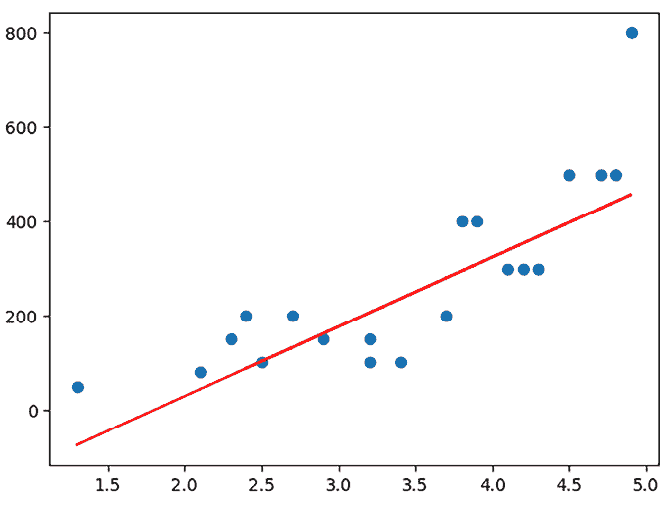

# 第九章：通过人工智能服务增强 Web 应用

# 简介

网络应用可以通过多种方式增强人工智能服务：你可以利用现有的暴露模型的 Web API，或者自己构建并使其调用模型。

你最初想要将人工智能添加到你的应用中的原因是为了让它变得更智能。不是为了它自己的目的而变得聪明，而是为了让它对用户更有用。例如，如果你有一个允许用户搜索产品的网络应用，你可以添加一个基于用户先前购买的产品推荐功能。实际上，为什么只限于先前购买的产品呢？为什么不能根据用户的先前搜索推荐产品？或者，如果用户可以拍照产品，应用会推荐类似的产品呢？

正如你所见，有很多可能性可以增强你的网络应用，使其通过人工智能提升用户体验。

在本章中，我们将：

+   讨论不同的模型格式，如 Pickle 和 ONNX

+   学习如何使用 Python 中的 Pickle 和 ONNX 将你的模型持久化为文件

+   消费存储在 ONNX 格式的模型并通过 JavaScript REST API 公开

# 商业领域，电子商务

我们一直在努力工作在我们的电子商务领域，但我们的业务重点是评分。好的或坏的评分可以影响特定产品的销量。逻辑领域包括以下内容：

+   **产品**：要评分的产品

+   **评分**：实际的评分和元信息，如评论、日期等

# 问题和数据领域

需要解决的问题是如何使用这些评分数据并从中学习。

+   **洞察**：例如，我们可以得到这样的洞察，我们应该开始/停止销售某种产品。可能还有其他洞察，因为某些产品在世界某些地区销售得很好。

+   **技术** **问题**：这一方面的技术问题是弄清楚如何摄取数据，从数据中训练模型，然后弄清楚如何让网络应用利用该模型。

# 特征分解

从功能的角度来看，我们需要将其视为由三个主要部分组成。

+   **数据摄取和训练**：这需要一个单独的界面，可能是在没有用户界面的情况下完成的，只是静态数据被输入到能够从数据中训练模型的代码中。有了这个理解，我们可以概述以下步骤：

    +   加载数据

    +   清洗数据

    +   创建功能

    +   训练模型

    +   评估模型

    +   运行预测

+   **消费模型**：一旦模型训练完成，它需要被公开，最好是通过 Web 端点。为了达到这一点，我们认为我们需要以下步骤：

    +   如有必要，将模型转换为合适的格式

    +   构建 Web API

    +   通过 Web API 公开模型

    +   部署模型，这里有一个步骤需要将 API 上线

+   **预测**：对于预测部分，这是一个面向“后台”而非面向客户的功能。

    +   构建用户界面以运行预测

    +   构建与 Web API 通信的底层代码以实现预测

# 提示策略

你可以选择在这里采用提示方法，要么从提示注释中获取建议，要么使用聊天界面。

对于提示模式，我们将使用第二章中描述的“探索模式”。

# 创建模型

假设我们正在处理`sales_rating.csv`文件中的以下数据，这是合并两个数据集的结果，一个包含销售数据，另一个包含评分数据。数据看起来像这样：

```py
product_id,avg_rating,sold 
1,2.5,100
2,3.7,200
3,4.2,300
4,1.3,50
5,4.9,800
6,3.2,150
7,2.1,80
8,4.8,500
9,3.9,400
10,2.4,200
11,4.1,300
12,3.2,100
13,2.9,150
14,4.5,500
15,3.8,400
16,2.7,200
17,4.3,300
18,3.4,100
19,2.3,150
20,4.7,500 
```

前面的数据显示了一个包含`product_id`、`avg_rating`和`sold`列的数据集。我们的理论是产品的平均评分与销售数量相关。一个高评分的产品似乎会比一个低评分的产品卖得更好，这是一个合理的假设。通过创建模型，我们可以更接近地确定我们的假设是否成立。

# 制定计划

我们可以向 Copilot 询问创建模型所需的步骤。我们将这些提示作为注释输入：

如果你想让 Copilot 提供关于代码之外的其他文本答案，你可以在代码文件或 Markdown 文件中的注释中输入文本。在注释之后放置下一行，并从“a:”开始行，也有助于。你也可以使用 Copilot Chat 提问：

**[提示]**

告诉我生命、宇宙和万物的答案。

**[结束提示]**

**[提示响应]**

```py
a: 42 
```

**[结束响应]**

上述参考来自道格拉斯·亚当斯的书籍《银河系漫游指南》。

接下来，让我们让 Copilot 帮助我们了解创建模型的步骤。

**[提示]**

在给定的 CSV 文件中创建模型有哪些步骤？

**[结束提示]**

输出：

+   导入 pandas 和 scikit-learn

+   读取 CSV 文件

+   创建测试和训练数据集

+   创建一个模型

+   模型的效果如何？

+   预测

+   将模型保存为 pkl

好的，我们有一个计划，那么就执行它，并使用 Copilot 帮助我们编写代码。

## 导入库

首先，让我们在 VS Code 中创建一个新的笔记本。让我们称它为`sales.ipynb`。

`.ipynb`是 Jupyter Notebook 的文件格式，作为数据科学实践者，你很可能熟悉它。想法是你在文件中工作，文件由单元格组成，其中一些是文本单元格，其他是你可以运行的代码单元格。

要使用某些库，我们需要安装它们。我们可以使用 Copilot 来帮助我们。我们可以利用我们是数据科学实践者的这一事实，因此了解我们需要哪些库。因此，我们将建议以下 pandas 和 scikit-learn 库来帮助我们完成任务。

**[提示]**

在笔记本中安装 pandas 和 scikit-learn。

**[结束提示]**

**[提示响应]**

```py
! pip install pandas scikit-learn 
```

**[结束响应]**

接下来，让我们导入所需的库。

**[提示]**

在笔记本中导入 pandas 和 scikit-learn。

**[结束提示]**

**[提示响应]**

```py
# Import pandas and scikit-learn in a notebook.
import pandas as pd
import sklearn.linear_model 
```

**[结束响应]**

## 读取 CSV 文件

现在我们有了需要的库，让我们读取 CSV 文件。

**[提示]**

在笔记本中读取 CSV 文件。

**[提示结束]**

**[提示回复]**

```py
# Read a CSV file in a notebook. 
df = pd.read_csv("sales_rating.csv") 
```

**[回复结束]**

CSV 文件现在已加载到 pandas DataFrame 中，这是一个包含列和行的结构。让我们看看前几行。

```py
df.head() 
```

这将产生以下输出：

```py
 product_id  avg_rating  sold
0            1         2.5   100
1            2         3.7   200
2            3         4.2   300
3            4         1.3    50
4            5         4.9   800 
```

太好了，我们已经将数据加载到 DataFrame 中。接下来，我们需要将数据分为测试集和训练集。

## 创建测试集和训练集

在机器学习中，我们通常将数据分为测试集和训练集。训练集用于训练模型，测试集用于测试模型。我们可以使用 Copilot 来帮助我们完成这项工作。

**[提示]**

在笔记本中创建测试集和训练集，建议测试集大小为 0.2。

**[提示结束]**

**[提示回复]**

```py
# Create a test and training dataset in a notebook, suggested test size of 0.2
test_size = 0.2
test = df.sample(frac=test_size)
training = df.drop(test.index) 
```

**[回复结束]**

0.2 是一个好的测试集大小。这意味着 20%的数据将用于测试，80%的数据将用于训练。

您可能需要在相应的行中开始键入“test_size”和“training”，然后按*TAB*键接受建议。

现在我们已经设置好了，接下来让我们创建一个模型。

## 创建模型

创建模型涉及选择我们想要使用的算法，然后训练模型。让我们提出一个提示：

**[提示]**

在笔记本中使用`LinearRegression`算法创建一个模型。

**[提示结束]**

**[提示回复]**

```py
# Create a model in a notebook using the LinearRegression algorithm.
model = sklearn.linear_model.LinearRegression()
model.fit(training[["avg_rating"]], training[["sold"]]) 
```

**[回复结束]**

在前面的代码中，我们使用`LinearRegression`算法创建了一个模型，然后使用`fit`方法使用训练集训练了模型。同时，请注意我们是如何使用`avg_rating`列作为输入，`sold`列作为输出的。这是因为我们想要根据平均评分预测销售数量。

## 模型有多好？

在这个阶段，我们想知道模型有多好。为了找出这一点，让我们请 Copilot 来帮助我们。

您可以使用注释风格并获取内联建议，或者使用 Copilot Chat。在两种情况下，Copilot 都会根据上下文理解。

**[提示]**

在笔记本中，模型表现如何？显示代码。

**[提示结束]**

**[提示回复]**

```py
# How good is the model in a notebook? Show the code.
score = model.score(test[["avg_rating"]], test[["sold"]]) 
```

**[回复结束]**

调用模型上的`score`并传入`test`数据集似乎是我们了解模型有多好的方法。我们甚至可以询问 Copilot 关于这一点：

**[提示]**

分数是什么意思？

**[提示结束]**

**[提示回复]**

```py
score returns the coefficient of determination R² of the prediction. 
```

**[回复结束]**

如果您愿意，您可以继续查询并更详细地解释，如下面的提示：

**[提示]**

这在简单术语中意味着什么？

**[提示结束]**

**[提示回复]**

```py
it returns a number between 0 and 1, where 1 is perfect prediction and 0 is no prediction. 
```

**[回复结束]**

## 预测

在我们尝试预测某些东西之前，我们不会知道模型有多好，即使我们可以参考分数值。让我们为这个任务编写一个提示：

**[提示]**

在笔记本中预测。显示代码。

**[提示结束]**

**[提示回复]**

```py
# Predict in a notebook. Show the code.
predictions = model.predict(test[["avg_rating"]]) 
```

**[回复结束]**

好的，我们得到了一个名为 `predictions` 的变量，它包含预测值，但很难理解这些预测是否合理。让我们尝试询问 Copilot 并看看它有什么建议。

**[提示]**

你建议我们如何在笔记本中显示预测结果？

**[提示结束]**

**[提示响应]**

```py
print the predictions 
```

**[响应结束]**

**[提示]**

除了打印之外，你建议我们还有哪些方法可以在笔记本中显示预测结果？

**[提示结束]**

**[提示响应]**

```py
plot the predictions 
```

**[响应结束]**

现在我们已经获得了关于我们各种选项的更多信息，让我们利用这些知识在提示中使用：

**[提示]**

在笔记本中展示如何打印和绘制预测数据与实际数据对比的图表。

**[提示结束]**

**[提示响应]**

```py
# Show me how to print and plot predictions vs actual data in a notebook.
import matplotlib.pyplot as plt
plt.scatter(test[["avg_rating"]], test[["sold"]],  color='black')
plt.plot(test[["avg_rating"]], predictions, color='blue', linewidth=3) 
```

**[响应结束]**

在笔记本中运行此代码将生成以下图表：



图 9.1：显示预测数据与实际数据对比的图表

在图表中，看起来这条线很好地拟合了数据。我们还可以打印预测值以查看实际值：

```py
print(predictions) 
```

## 将模型保存到 .pkl 文件

我们还剩下一步：我们需要将模型保存到文件中。我们有几种不同的保存模型的方式。例如，我们可以将其保存为 pickle 文件或 ONNX 文件。让我们先从将其保存为 pickle 文件开始。

如同往常，让我们为这个任务创建一个提示：

**[提示]**

在笔记本中将模型保存为 pkl。

**[提示结束]**

**[提示响应]**

```py
# Save the model to pkl in a notebook.
import pickle
pickle.dump(model, open("model.pkl", "wb")) 
```

**[响应结束]**

为了完成上述内容，你可能需要开始输入“import”以获取建议。另外，它很可能使用 pickle 库，所以你可以在下一行开始输入“pickle”并按 *TAB* 键接受建议。

## 在 Python 中创建 REST API

到目前为止，我们有一个包含我们模型的 `model.pkl` 文件。我们可以通过这个文件通过 REST API 暴露模型。让我们让 Copilot 帮助我们完成这个任务。

**[提示]**

在 Python 中创建一个 REST API，以暴露 pkl 文件中的模型。

**[提示结束]**

**[提示响应]**

```py
# Create a REST API in Python that exposes the model in a pkl file.
import pickle
import flask
# load the model
model = pickle.load(open("model.pkl", "rb"))
# app
app = flask.Flask(__name__)
# routes
@app.route('/', methods=['GET', 'POST'])
def predict():
    if flask.request.method == 'GET':
        return "Please POST a JSON object to this endpoint to get a prediction."
    else:
        data = flask.request.json
        prediction = model.predict([[data["avg_rating"]]])
        return flask.jsonify({"prediction": prediction[0][0]}) 
```

**[响应结束]**

注意我们上面使用了好几个提示。首先，我们在文件顶部添加了提示“创建一个在 Python 中暴露 pkl 文件的 REST API”，从而设置了上下文。然后我们使用各种辅助提示，如“加载模型”、“应用”和“路由”，帮助我们编写代码。最终我们得到了一个通过 REST API 暴露模型的 API。

# 将模型转换为 ONNX

到目前为止，你已经看到了我们如何使用 Pickle 保存模型，然后在 Python 中加载它。然而，Pickle 有一些缺点，包括它是 Python 特定的。另一方面，ONNX 是一种不是 Python 特定的格式，可以在其他语言中使用。让我们看看我们如何使用 ONNX 格式来处理我们的模型。

我们需要分两步解决我们的任务：

+   将模型转换为 ONNX 格式。

+   加载模型并在 JavaScript 中创建一个 REST API。

## 在 ONNX 格式中创建模型

因为我们使用的是笔记本，我们需要安装依赖项，导入我们需要的库，然后将模型转换为 ONNX 格式。

**[提示]**

我需要哪些 ONNX 依赖项？展示安装这些依赖项的 Python 代码。

**[提示结束]**

**[提示回复]**

```py
! pip install skl2onnx 
```

**[回复结束]**

**[提示]**

展示如何导入我需要的 ONNX 库，并展示如何将模型转换为 ONNX 格式。

**[提示结束]**

**[提示回复]**

```py
import skl2onnx
# convert the model to ONNX
skl2onnx.to_onnx(model, train[["avg_rating"]].astype("float32"), "model.onnx") 
```

**[回复结束]**

现在我应该有一个包含 ONNX 格式模型的 `model.onnx` 文件。让我们看看我们是否可以在 JavaScript 中加载它。

# 在 JavaScript 中加载 ONNX 模型

接下来，我们需要在 JavaScript 中（特别是 Node.js，因为我们是在后端进行此操作）加载 ONNX 模型。我们可以使用 `onnxruntime` 库来完成此操作。让我们让 Copilot 帮助我们。

**[提示]**

展示一个逐步指南，说明如何在 JavaScript 中加载 ONNX 模型。

**[提示结束]**

**[提示回复]**

+   在 JavaScript 中安装 onnxruntime

+   在 JavaScript 中加载 ONNX 模型

+   使用 ONNX 模型在 JavaScript 中进行预测

**[回复结束]**

现在我们有了计划，让我们执行它。

## 在 JavaScript 中安装 onnxruntime

因为我们正在构建一个 Node.js 项目，所以首先，在一个新文件夹中创建一个 `app.js` 文件，并运行 `npm init -y` 终端命令来创建一个新的 Node.js 项目。

我们计划的第一个步骤是在 JavaScript 中安装 `onnxruntime`。我们可以使用 npm 来执行此任务。

**[提示]**

在 JavaScript 中安装 onnxruntime。

**[提示结束]**

**[提示回复]**

```py
npm install onnxruntime 
```

**[回复结束]**

很好，这已经在我们的项目中安装了 `onnxruntime` 库。接下来，我们需要加载 ONNX 模型。

## 在 JavaScript 中加载 ONNX 模型

现在我们已经安装了 `onnxruntime`，我们可以加载 ONNX 模型。

**[提示]**

在 JavaScript 中加载 ONNX 模型。

**[提示结束]**

**[提示回复]**

```py
const rt = require("onnxruntime");
# load model from ONNX
model rt.InferenceSession("model.onnx");
# predict
model.run(null, {model.get_inputs()[0].name: [[4.5]]}); 
```

**[回复结束]**

在前面的代码中，我们从 ONNX 文件中加载模型，然后使用模型对输入 `4.5` 进行预测，以表示平均评分，看看我们可以期待多少销售额。

# 任务：使用 JavaScript 构建一个消耗模型的 REST API

1.  将我们在上一节中创建的模型添加到笔记本中，将其转换为 ONNX 文件。

1.  在存储库中创建一个名为的新文件夹，并在该文件夹中创建一个名为 `app.js` 的新文件。

1.  将 POST /predict 路由添加到 `server.js` 文件中，并确保它根据输入返回一个预测结果。

这里有一些你可以尝试的起始提示，以帮助你完成这个任务：

+   **提示**：使用 Express 在 JavaScript 中创建 REST API

+   **提示**：使用 Express 在 JavaScript 中创建一个 POST /predict 路由

+   **提示**：使用 Express 在 JavaScript 中从 ONNX 加载模型

+   **提示**：使用 Express 在 JavaScript 中的 REST API 中使用 ONNX 模型进行预测

# 解决方案

请参阅代码库 [[`github.com/PacktPublishing/AI-Assisted-Software-Development-with-GitHub-Copilot-and-ChatGPT/tree/main/09`](https://github.com/PacktPublishing/AI-Assisted-Software-Development-with-GitHub-Copilot-and-ChatGPT/tree/main/09)] 和 *09* 文件夹以获取解决方案。

# 测验

Pickle 和 ONNX 之间的区别是什么？

1.  Pickle 是 Python 特定的，而 ONNX 则不是。

1.  Pickle 可以在 JavaScript 中使用，而 ONNX 则不能。

1.  ONNX 的效率不如 Pickle。

# 摘要

在本章中，我们介绍了各种模型格式，如 Pickle 和 ONNX，以及如何使用 Python 将模型持久化为文件。将模型存储为文件很有用，因为它允许您将其与其他应用程序集成。

然后，我们讨论了存储模型的不同格式的优缺点，如 Pickle 和 ONNX。我们得出结论，ONNX 可能是更好的选择，因为它不是 Python 特定的，并且可以在其他语言中使用。

然后，我们介绍了如何使用 JavaScript 加载存储为 ONNX 格式的模型，并创建 REST API 使模型可供其他应用程序使用。

在下一章中，我们将更详细地介绍如何使用 GitHub Copilot 并充分利用它。我们将涵盖技巧和窍门以及有助于让您更快、更高效的功能。

# 加入我们的 Discord 社区

加入我们社区的 Discord 空间，与作者和其他读者进行讨论：

[`packt.link/aicode`](https://packt.link/aicode)


