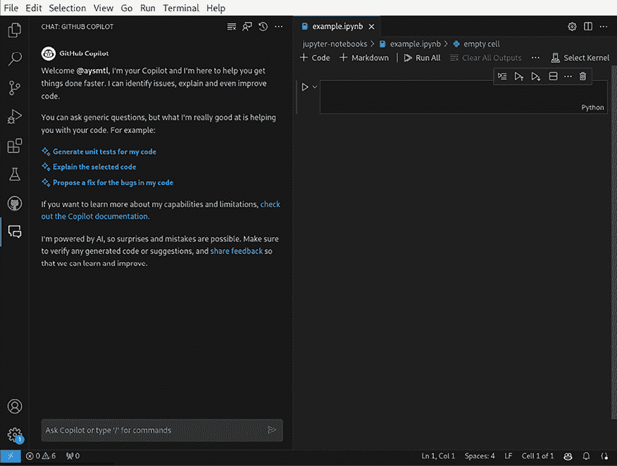
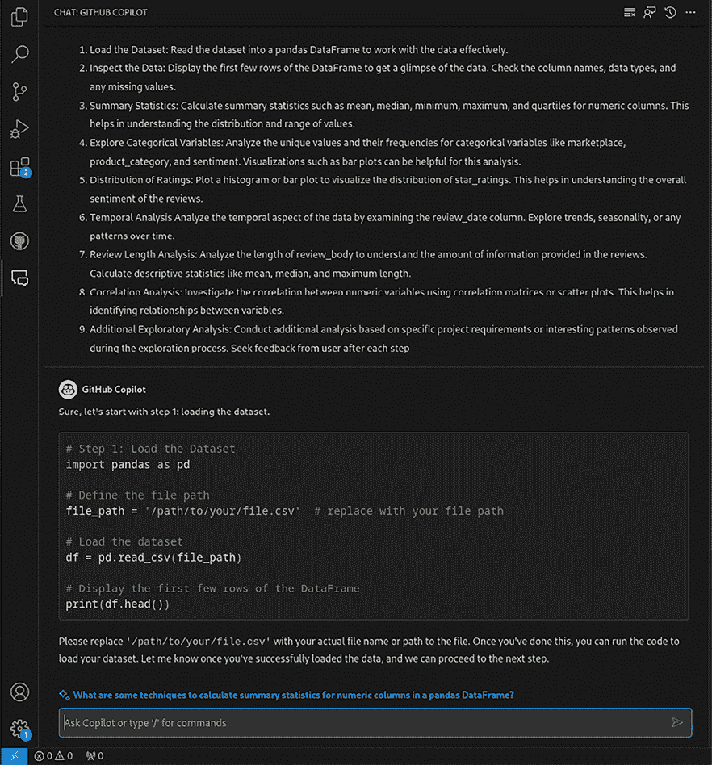
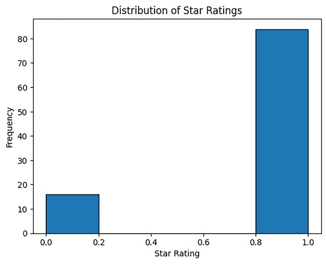
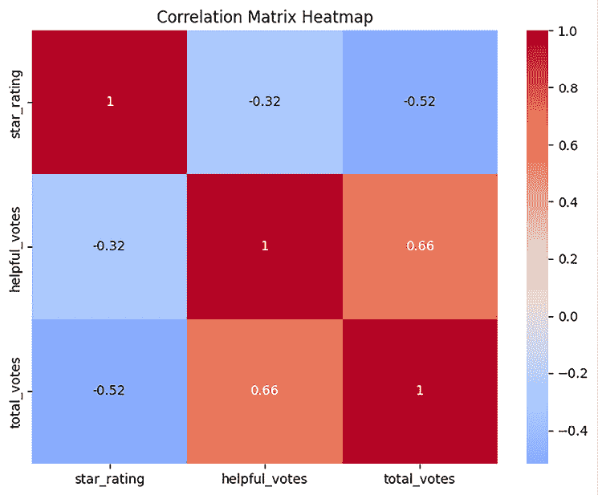
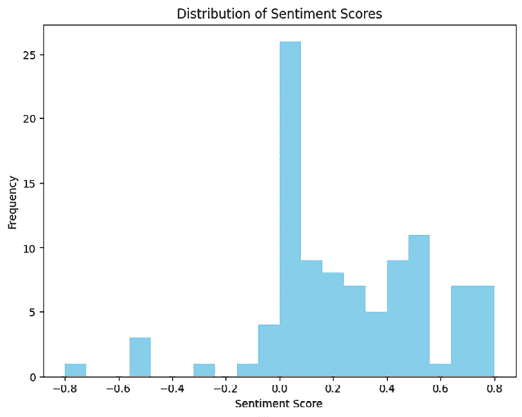
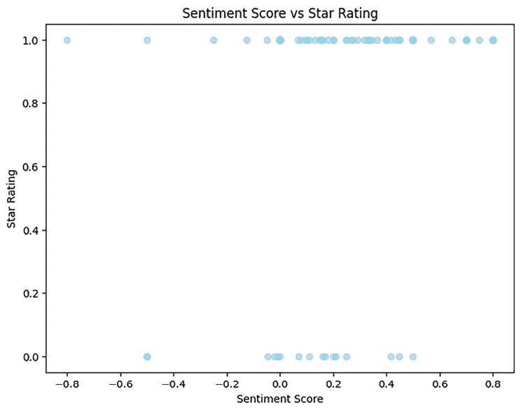
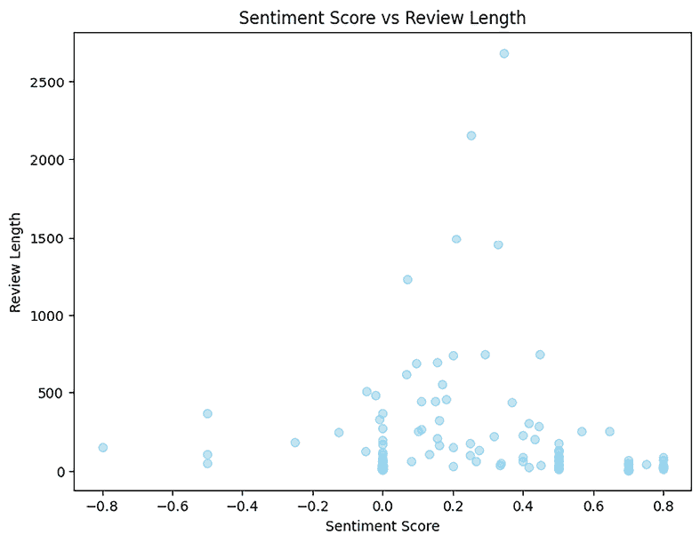

# 第十七章：使用 Copilot 进行机器学习

# 简介

机器学习，或 ML，涉及从数据中学习和发现模式，并使用这些模式进行预测或决策。机器学习包括一系列步骤，从加载数据和清洗数据到最终训练模型以从模型中获得所需见解。所有这些步骤对于这个领域中的大多数问题都是大致相同的。然而，细节可能有所不同，如预处理步骤的选择、算法的选择等。像 GitHub Copilot 这样的 AI 工具从几个不同的角度进入机器学习：

+   **建议工作流程**：由于 Copilot 在机器学习工作流程方面进行了训练，因此它能够建议适合你问题的流程。

+   **推荐工具和算法**：如果你向你的 AI 工具提供足够的问题背景和数据的形状，像 Copilot 这样的 AI 工具就可以建议适合你特定问题的工具和算法。

+   **代码辅助**：Copilot 作为一大帮助的另一个方式是能够生成机器学习过程中的各种步骤的代码。

本章将探讨一个电子商务数据集，本章将作为与其他章节有趣的比较练习，这些章节使用 ChatGPT 来解决机器学习问题。

让我们深入探索 GitHub Copilot 的建议。

# GitHub Copilot Chat 在你的 IDE 中

GitHub Copilot Chat 是某些**集成开发环境**（**IDEs**）中的一个工具，它回答编码问题。它通过建议代码、解释代码功能、创建单元测试和修复错误来帮助。

## 工作原理

你有两种不同的方式向 GitHub Copilot 提供提示：

+   编辑器内模式：在这种模式下，你提供文本注释，并通过*Tab*或*Return*键，Copilot 能够生成输出。

+   聊天模式：在聊天模式下，你在文本框中输入提示，然后 GitHub Copilot 会将打开的文件/文件作为上下文（如果你使用`@workspace`，则它将查看你目录中的所有文件）。

文本文件可以是，例如，一个代码文件如`app.py`或 Jupyter Notebook。Copilot 可以将这两个文件作为上下文，连同你输入的提示一起处理。



图 17.1：左侧的 GitHub Copilot 聊天和右侧打开的 Jupyter Notebook

# 数据集概述

让我们探索我们将要使用的数据集。就像我们在其他关于机器学习的章节中所做的那样，我们从数据集开始，这个数据集是亚马逊书评数据集。

数据集包含有关不同产品和它们评论的信息。它包括以下列：

+   `marketplace` (字符串)：产品的位置

+   `customer_id` (字符串)：客户的唯一 ID

+   `review_id` (字符串)：评论 ID

+   `product_id` (字符串)：产品的唯一 ID

+   `product_parent` (字符串)：父产品

+   `product_title` (字符串)：被评论产品的标题

+   `product_category` (字符串)：不同的产品类别

+   `star_rating` (整数): 产品 5 星评分

+   `helpful_votes` (整数): 产品获得的有用票数

+   `total_votes` (整数): 产品获得的总票数

+   `review_headline` (字符串): 评论的标题

+   `review_body` (字符串): 评论的内容

+   `review_date` (字符串): 产品评论的日期

+   `sentiment` (字符串): 评论的情感（正面或负面）

# 数据探索步骤

进行数据探索有助于我们了解数据集及其特征。它包括检查数据、识别模式和总结关键见解。以下是我们将遵循的步骤：

1.  **加载数据集**: 将数据集读入 pandas DataFrame 以有效地处理数据。

1.  **检查数据**: 显示 DataFrame 的前几行以了解数据。检查列名、数据类型和任何缺失值。

1.  **摘要统计量**: 计算数值列的摘要统计量，如平均值、中位数、最小值、最大值和四分位数。这有助于理解值的分布和范围。

1.  **探索分类变量**: 分析如`marketplace`、`product_category`和`sentiment`等分类变量的唯一值及其频率。条形图等可视化工具可以帮助进行此类分析。

1.  **评分分布**: 绘制直方图或条形图以可视化`star_ratings`的分布。这有助于理解评论的整体情感。

1.  **时间序列分析**: 通过检查`review_date`列来分析数据的时序方面。探索趋势、季节性或任何随时间变化的模式。

1.  **评论长度分析**: 分析`review_body`的长度以了解评论中提供的信息量。计算描述性统计量，如平均值、中位数和最大长度。

1.  **相关性分析**: 使用相关矩阵或散点图调查数值变量之间的相关性。这有助于识别变量之间的关系。

1.  **附加探索性分析**: 根据特定项目要求或探索过程中观察到的有趣模式进行附加分析。

注意，您还可以询问 GitHub Copilot 在进行机器学习时应遵循哪些步骤。

# 提示策略

我们即将使用的提示为 Copilot 提供高级指导，而输出/结果允许进一步调整 Copilot 的响应以匹配特定数据集和分析需求。

提示方法的关键方面是：

+   定义任务。明确指示 AI 助手我们正在解决的任务。

+   将数据探索分解为步骤。将数据探索分解为逻辑步骤（如数据加载、检查、摘要统计等）

+   为每个提示提供上下文/意图以引导 Copilot（例如请求数值摘要统计量）

+   将之前的结果作为输入。将 Copilot 代码片段的输出和结果分享，以进一步引导对话（例如打印摘要统计）

+   逐步细化提示，与 Copilot 进行来回对话

因此，我们将使用第二章中描述的 TAG（任务-操作-指导）提示模式。让我们描述这个项目以适应这个模式，这样我们就能了解如何编写我们的初始提示：

+   **任务**：数据探索，在电子商务项目中找到客户评论的模式和见解。

+   **操作**：我们在前面的部分中描述了我们应该采取的步骤；这些步骤应该反映在我们编写的提示中。

+   **指导**：我们将提供的额外指导是，我们希望建议探索性技术以及代码片段。

# 您的初始数据探索提示：提示 1，设置高级上下文

就像在其他章节中使用 ChatGPT 一样，我们的初始提示为我们要解决的问题设定了高级上下文，包括领域和我们的数据形状。所有这些上下文都有助于 AI 工具在文本和代码中提供正确的步骤。

下面是一个你可以尝试的初始提示：

**[提示**]

我正在进行 AwesomeShop 电子商务项目的数据探索。数据集包含有关各种产品和它们评论的信息。我想深入了解数据，识别模式，并理解评论的特征。你能提供一些探索性分析技术和代码片段，帮助我从数据集中发现有趣的见解吗？AwesomeShop 电子商务项目的数据集包含有关不同产品和它们评论的信息。它包括以下列：

+   `marketplace`（字符串）：产品位置

+   `customer_id`（字符串）：客户的唯一 ID

+   `review_id`（字符串）：评论 ID

+   `product_id`（字符串）：产品的唯一 ID

+   `product_parent`（字符串）：父产品

+   `product_title`（字符串）：被评论产品的标题

+   `product_category`（字符串）：不同的产品类别

+   `star_rating`（整数）：产品 5 星评分

+   `helpful_votes`（整数）：产品有用投票数

+   `total_votes`（整数）：产品的总投票数

+   `review_headline`（字符串）：评论标题

+   `review_body`（字符串）：评论内容

+   `review_date`（字符串）：产品评论日期

+   `sentiment`（字符串）：评论的情感（正面或负面）

但请记住，我想逐步学习，如下所示：

1.  **加载数据集**：将数据集读入 pandas DataFrame 以有效地处理数据。

1.  **检查数据**：显示 DataFrame 的前几行以了解数据。检查列名、数据类型和任何缺失值。

1.  **摘要统计**：计算数值列的摘要统计，如平均值、中位数、最小值、最大值和四分位数。这有助于了解值的分布和范围。

1.  **探索分类变量**：分析分类变量（如`marketplace`、`product_category`和`sentiment`）的唯一值及其频率。条形图等可视化工具可以帮助进行此类分析。

1.  **评分分布**：绘制直方图或条形图以可视化`star_ratings`的分布。这有助于了解评论的整体情感。

1.  **时间序列分析**：通过检查`review_date`列来分析数据的时序方面。探索趋势、季节性或任何随时间变化的模式。

1.  **评论长度分析**：分析`review_body`的长度，以了解评论中提供的信息量。计算描述性统计量，如平均值、中位数和最大长度。

1.  **相关性分析**：使用相关矩阵或散点图调查数值变量之间的相关性。这有助于识别变量之间的关系。

1.  **额外的探索性分析**：根据特定项目要求或探索过程中观察到的有趣模式进行额外的分析。在每个步骤后从用户那里寻求反馈。

**[提示结束]**

# 第 1 步：加载数据集

我们从 Copilot 那里得到了一段相当冗长的响应，所以让我们将响应分解成几个部分并解释我们得到了什么。

您应该收到与以下响应类似的响应：

**[提示响应]**

当然，让我们从第 1 步：加载数据集开始。

```py
# Step 1: Load the Dataset
import pandas as pd
# Define the file path
file_path = '/path/to/your/file.csv'  # replace with your file path
# Load the dataset
df = pd.read_csv(file_path)
# Display the first few rows of the DataFrame
print(df.head()) 
```

请将`'/path/to/your/file.csv'`替换为您的实际文件名或文件路径。完成此操作后，您可以运行代码以加载数据集。

一旦您成功加载数据，请告诉我，然后我们可以进行下一步。

**[响应结束]**



图 17.2：显示 Copilot 提示和加载数据的 Copilot 结果的开始部分

让我们尝试 Copilot 生成的输出代码，看看它是否可行。修改`file_path`变量以指向您的数据集位置，然后执行代码。注意以下如何编辑文件路径以反映我们系统中的实际路径：

```py
import pandas as pd
# Define the file path
file_path = '../Datasets/amazon_books_Data.csv'
# Load the dataset
df = pd.read_csv(file_path) 
```

## 运行加载数据的代码

让我们运行 Copilot 提供的代码。请看以下来自我们 Jupyter Notebook 的输出：

```py
# Display the first few rows of the DataFrame
print(df.head())
   Unnamed: 0 market_place customer_id         review_id    product_id  \
0           0         "US"  "25933450"   "RJOVP071AVAJO"  "0439873800"   
1           1         "US"   "1801372"  "R1ORGBETCDW3AI"  "1623953553"   
2           2         "US"   "5782091"   "R7TNRFQAOUTX5"  "142151981X"   
3           3         "US"  "32715830"  "R2GANXKDIFZ6OI"  "014241543X"   
4           4         "US"  "14005703"  "R2NYB6C3R8LVN6"  "1604600527"   
  product_parent                                   product_title  \
0     "84656342"  "There Was an Old Lady Who Swallowed a Shell!"   
1    "729938122"                                "I Saw a Friend"   
2    "678139048"                          "Black Lagoon, Vol. 6"   
3    "712432151"                                     "If I Stay"   
4    "800572372"                       "Stars 'N Strips Forever"   
  product_category  star_rating  helpful_votes  total_votes     vine  \
0          "Books"            1              0            0  0 \t(N)   
1          "Books"            1              0            0  0 \t(N)   
2          "Books"            1              0            0  0 \t(N)   
3          "Books"            1              0            0  0 \t(N)   
4          "Books"            1              2            2  0 \t(N)   
  verified_purchase                                    review_headline  \
0           1 \t(Y)                                       "Five Stars"   
1           1 \t(Y)  "Please buy "I Saw a Friend"! Your children wi...   
2           1 \t(Y)                                    "Shipped fast."   
3           0 \t(N)                                       "Five Stars"   
4           1 \t(Y)                                       "Five Stars"   
                                         review_body review_date  \
0               "I love it and so does my students!"  2015-08-31   
1  "My wife and I ordered 2 books and gave them a...  2015-08-31   
2  "Great book just like all the others in the se...  2015-08-31   
3                                     "So beautiful"  2015-08-31   
4  "Enjoyed the author's story and his quilts are...  2015-08-31   
  Sentiment_books review_month review_day  review_year  
0        positive       August     Monday         2015  
1        positive       August     Monday         2015  
2        positive       August     Monday         2015  
3        positive       August     Monday         2015  
4        positive       August     Monday         2015 
```

# 第 2 步：检查数据

接下来，让我们检查数据。对于检查提示，我们将使用代码执行的结果，看看我们能否让 Copilot 告诉我们下一步需要做什么：

**[提示]**

运行正常；以下是输出：

```py
Unnamed: 0 market_place customer_id review_id product_id 0 0 "US" "25933450" "RJOVP071AVAJO" "0439873800"
1 1 "US" "1801372" "R1ORGBETCDW3AI" "1623953553"
2 2 "US" "5782091" "R7TNRFQAOUTX5" "142151981X"
3 3 "US" "32715830" "R2GANXKDIFZ6OI" "014241543X"
4 4 "US" "14005703" "R2NYB6C3R8LVN6" "1604600527"
product_parent product_title 0 "84656342" "There Was an Old Lady Who Swallowed a Shell!"
1 "729938122" "I Saw a Friend"
2 "678139048" "Black Lagoon, Vol. 6"
3 "712432151" "If I Stay"
4 "800572372" "Stars 'N Strips Forever"
product_category star_rating helpful_votes total_votes vine 0 "Books" 1 0 0 0 \t(N)
1 "Books" 1 0 0 0 \t(N)
2 "Books" 1 0 0 0 \t(N)
3 "Books" 1 0 0 0 \t(N)
4 "Books" 1 2 2 0 \t(N)
verified_purchase review_headline 0 1 \t(Y) "Five Stars"
1 1 \t(Y) "Please buy "I Saw a Friend"! Your children wi...
2 1 \t(Y) "Shipped fast."
... 1 positive August Monday 2015
2 positive August Monday 2015
3 positive August Monday 2015
4 positive August Monday 2015 
```

输出被截断。将其视为可滚动的元素或在文本编辑器中打开。调整单元格输出设置...

**[提示结束]**

您应该收到与以下响应类似的响应：

**[提示响应]**

太好了！现在您已成功加载数据集，让我们继续到“检查数据”阶段。

```py
# Step 2: Inspect the Data
# Check the column names
print("Column Names:")
print(df.columns)
# Check the data types of each column
print("\nData Types:")
print(df.dtypes)
# Check for missing values
print("\nMissing Values:")
print(df.isnull().sum()) 
```

这段代码将为您提供数据集的概述，包括列名、每列的数据类型以及每列中缺失值的数量。运行此代码并告诉我您发现了什么。

**[响应结束]**

让我们尝试上面的代码来检查数据并看看它是否工作。在您的 Jupyter Notebook 中的代码单元中运行以下代码：

```py
# Display the first few rows of the DataFrame
df.head()
# Check the column names
column_names = df.columns
print(column_names)
# Check the data types of the columns
data_types = df.dtypes
print(data_types)
# Check for missing values
missing_values = df.isnull().sum()
print(missing_values)
You should see an output similar to below:
Index(['Unnamed: 0', 'market_place', 'customer_id', 'review_id', 'product_id',
       'product_parent', 'product_title', 'product_category', 'star_rating',
       'helpful_votes', 'total_votes', 'vine', 'verified_purchase',
       'review_headline', 'review_body', 'review_date', 'Sentiment_books',
       'review_month', 'review_day', 'review_year'],
      dtype='object')
Unnamed: 0            int64
market_place         object
customer_id          object
review_id            object
product_id           object
product_parent       object
product_title        object
product_category     object
star_rating           int64
helpful_votes         int64
total_votes           int64
vine                 object
verified_purchase    object
review_headline      object
review_body          object
review_date          object
Sentiment_books      object
review_month         object
review_day           object
review_year           int64
dtype: object
Unnamed: 0           0
market_place         0
customer_id          0
review_id            0
product_id           0
product_parent       0
product_title        0
product_category     0
star_rating          0
helpful_votes        0
total_votes          0
vine                 0
verified_purchase    0
review_headline      0
review_body          0
review_date          0
Sentiment_books      0
review_month         0
review_day           0
review_year          0
dtype: int64 
```

太好了！到目前为止，当我们向 Copilot 提供我们的目标状态并获取其建议的下一步时，它一直表现得很好；让我们继续遵循这个格式。

# 第 3 步：摘要统计量

接下来，我们想要总结一下，所以我们再次提供输出数据，希望 Copilot 会告诉我们下一步是什么：

**[提示]**

没有缺失值；以下是输出：

```py
Index(['Unnamed: 0', 'market_place', 'customer_id', 'review_id', 'product_id', 'product_parent', 'product_title', 'product_category', 'star_rating', 'helpful_votes', 'total_votes', 'vine', 'verified_purchase', 'review_headline', 'review_body', 'review_date', 'Sentiment_books', 'review_month', 'review_day', 'review_year'], dtype='object') Unnamed: 0 int64 market_place object customer_id object review_id object product_id object product_parent object product_title object product_category object star_rating int64 helpful_votes int64 total_votes int64 vine object verified_purchase object review_headline object review_body object review_date object Sentiment_books object review_month object review_day object ... review_month 0 review_day 0 review_year 0 dtype: int64 
```

**[提示结束]**

您应该收到以下类似的响应：

**[提示响应]**

太好了！现在我们已经检查了数据，让我们继续到第 3 步：计算数值列的摘要统计量。这将帮助我们了解值的分布和范围。

```py
# Step 3: Summary Statistics
# Calculate summary statistics for numeric columns
numeric_columns = ['star_rating', 'helpful_votes', 'total_votes']
print(df[numeric_columns].describe()) 
```

这段代码将为您提供数据集中数值列的计数、平均值、标准差、最小值、25 百分位数、中位数（50 百分位数）、75 百分位数和最大值。运行此代码并告诉我您发现了什么。

**[响应结束]**

让我们尝试这个并看看它是否工作。让我们运行下面的代码并调用`df.describe`：

```py
# Calculate summary statistics
summary_stats = df.describe()
print(summary_stats) 
```

您应该看到以下输出：

```py
 Unnamed: 0  star_rating  helpful_votes  total_votes  review_year
count  100.000000   100.000000     100.000000   100.000000        100.0
mean    49.500000     0.840000       0.540000     0.960000       2015.0
std     29.011492     0.368453       1.298173     2.420118          0.0
min      0.000000     0.000000       0.000000     0.000000       2015.0
25%     24.750000     1.000000       0.000000     0.000000       2015.0
50%     49.500000     1.000000       0.000000     0.000000       2015.0
75%     74.250000     1.000000       1.000000     1.000000       2015.0
max     99.000000     1.000000       9.000000    14.000000       2015.0 
```

太好了！我们能够看到计数、平均值、标准差等。我们继续使用向 Copilot 提供我们代码的输出的想法，并且它已经能够理解在机器学习过程的哪个点以及下一步该做什么。

# 第 4 步：探索分类变量

就像之前一样，让我们构建一个提示，包括我们刚刚运行的代码的输出，让 Copilot 告诉我们下一步应该做什么：

**[提示]**

以下是输出：

```py
Unnamed: 0 star_rating helpful_votes total_votes review_year count 100.000000 100.000000 100.000000 100.000000 100.0 mean 49.500000 0.840000 0.540000
0.960000 2015.0 std 29.011492 0.368453 1.298173 2.420118 0.0 min 0.000000 0.000000 0.000000 0.000000 2015.0 25% 24.750000 1.000000 0.000000 0.000000 2015.0 50% 49.500000 1.000000 0.000000 0.000000 2015.0 75% 74.250000 1.000000 1.000000 1.000000 2015.0 max 99.000000 1.000000 9.000000 14.000000 2015.0 
```

**[提示结束]**

您应该收到以下类似的响应：

**[提示响应]**

太好了！现在我们已经有了摘要统计量，让我们继续到第 4 步：探索分类变量。我们将分析分类变量如`marketplace`、`product_category`和`sentiment`的唯一值及其频率。

```py
# Step 4: Explore Categorical Variables
# Analyze the unique values and their frequencies for categorical variables
categorical_columns = ['market_place', 'product_category', 'Sentiment_books']
for column in categorical_columns:
    print("\n" + column)
    print(df[column].value_counts())
This code will print the unique values and their frequencies for each of the specified
 categorical columns. Run this code and let me know what you find. 
```

**[响应结束]**

让我们尝试这个并看看它是否工作。在代码单元中运行以下代码以分析分类变量：

```py
# Analyze categorical variables
categorical_cols = ['market_place', 'product_category', 'Sentiment_books']
for col in categorical_cols:
    unique_values = df[col].unique()
    value_counts = df[col].value_counts()
    print(f"\n{col} unique values:\n{unique_values}\n")
    print(f"{col} value counts:\n{value_counts}") 
```

您应该看到以下输出：

```py
market_place unique values:
['"US"']
market_place value counts:
market_place
"US"    100
Name: count, dtype: int64
product_category unique values:
['"Books"']
product_category value counts:
product_category
"Books"    100
Name: count, dtype: int64
Sentiment_books unique values:
['positive' 'negative']
Sentiment_books value counts:
Sentiment_books
positive    84
negative    16
Name: count, dtype: int64 
```

# 第 5 步：评分分布

接下来，我们想要了解评分的分布。为了了解更多关于评分的信息，我们将提供最后一次代码执行的输出作为提示：

**[提示]**

以下是输出：

+   `market_place` 唯一值：[‘“US”’]

+   `market_place` 值计数：`market_place` “US” 100 名称：计数，数据类型：int64

+   `product_category` 唯一值：[‘“Books”’]

+   `product_category` 值计数：product_category “Books” 100 名称：计数，数据类型：int64

+   `Sentiment_books` 唯一值：[‘positive’ ‘negative’]

+   `Sentiment_books`值计数：`Sentiment_books`正面 84 条，负面 16 条。名称：计数，数据类型：int64

**[End of prompt]**

您应该收到以下类似的响应：

**[Prompt response]**

太好了！现在我们已经探索了分类变量，让我们继续到第 5 步：星级评分的分布可视化。

```py
# Step 5: Distribution of Ratings
import matplotlib.pyplot as plt
# Plot a histogram for star ratings
plt.hist(df['star_rating'], bins=5, edgecolor='black')
plt.title('Distribution of Star Ratings')
plt.xlabel('Star Ratings')
plt.ylabel('Frequency')
plt.show() 
```

这段代码将绘制星级评分的直方图，这将帮助我们了解评论的整体情感。运行此代码并告诉我您发现了什么。

**[End of response]**

让我们尝试这个并看看它是否工作。下面，我们有执行可视化的代码；在代码单元格中运行此代码：

```py
import matplotlib.pyplot as plt
# Plot the distribution of star ratings
plt.hist(df['star_rating'], bins=5, edgecolor='black')
plt.xlabel('Star Rating')
plt.ylabel('Frequency')
plt.title('Distribution of Star Ratings')
plt.show() 
```



图 17.3：星级评分的分布

# 第 6 步：时序分析

到目前为止，我们对评分的分布有了很好的了解；它们似乎要么非常低，要么非常高。让我们继续下一步。

**[Prompt]**

进行下一步。

**[End of prompt]**

您应该收到以下类似的响应：

**[Prompt response]**

太好了！现在让我们继续到第 6 步：时序分析。我们将分析`review_date`列，以探索趋势、季节性或任何随时间变化的模式。

首先，我们需要将`review_date`列转换为日期时间格式。然后，我们可以将年、月和日提取到单独的列中，以便更容易分析。

```py
# Step 6: Temporal Analysis
# Convert review_date to datetime format
df['review_date'] = pd.to_datetime(df['review_date'])
# Extract year, month, and day into separate columns
df['year'] = df['review_date'].dt.year
df['month'] = df['review_date'].dt.month
df['day'] = df['review_date'].dt.day
# Check the number of reviews per year
print(df['year'].value_counts().sort_index())
# Check the number of reviews per month
print(df['month'].value_counts().sort_index())
# Check the number of reviews per day
print(df['day'].value_counts().sort_index()) 
```

这段代码将打印每年、每月和每天的评论数量。运行此代码并告诉我您发现了什么。

**[End of response]**

让我们尝试这段代码看看它是否工作。在代码单元格中运行上述代码：

```py
# Step 6: Temporal Analysis
# Convert review_date to datetime format
df['review_date'] = pd.to_datetime(df['review_date'])
# Extract year, month, and day into separate columns
df['year'] = df['review_date'].dt.year
df['month'] = df['review_date'].dt.month
df['day'] = df['review_date'].dt.day
# Check the number of reviews per year
print(df['year'].value_counts().sort_index())
# Check the number of reviews per month
print(df['month'].value_counts().sort_index())
# Check the number of reviews per day
print(df['day'].value_counts().sort_index()) 
```

您应该看到以下类似的输出：

```py
year
2015    100
Name: count, dtype: int64
month
8    100
Name: count, dtype: int64
day
31    100
Name: count, dtype: int64 
```

# 第 7 步：评论长度分析

让我们继续我们的分析；下一步是第 7 步：评论长度分析。

**[Prompt]**

下面是输出：年 2015 100 名称：计数，数据类型：int64 月 8 100 名称：计数，数据类型：int64 日 31 100 名称：计数，数据类型：int64

**[End of prompt]**

您应该收到以下类似的响应：

**[Prompt response]**

太好了！现在我们已经分析了数据的时序方面，让我们继续到第 7 步：评论长度分析。我们将分析`review_body`的长度，以了解评论中提供的信息量。

```py
# Step 7: Review Length Analysis
# Calculate the length of each review
df['review_length'] = df['review_body'].str.len()
# Calculate descriptive statistics for review length
print(df['review_length'].describe()) 
```

这段代码将计算每条评论的长度，并提供描述性统计，如平均值、中位数和最大长度。运行此代码并告诉我您发现了什么。

**[End of response]**

到目前为止，我们想要了解上述代码在做什么；让我们向 Copilot 寻求帮助：

**[Prompt]**

在我们继续到第 7 步之前，您能解释一下如何解释输出吗？

**[End of prompt]**

您应该收到以下类似的响应：

**[Prompt response]**

绝对正确。您分享的输出表明了基于年、月和日的评论频率。

+   `year`: 您的数据集中所有 100 条评论都是在 2015 年写的。

+   `month`: 所有 100 条评论都是在第 8 个月写的，即 8 月。

+   `day`: 所有 100 条评论都是在该月的第 31 天写的。

这表明你数据集中的所有评论都是在同一天——2015 年 8 月 31 日——撰写的。

在一个更大、更多样化的数据集中，你可能看到评论分布在不同的年份、月份和日。分析这些评论可以帮助识别随时间变化的趋势或模式，例如在特定时期评论数量的增加。

**[回复结束]**

好吧，我们遇到了问题——我们的数据集有限，所有评论似乎都发生在同一时间点，这阻止了我们发现趋势。让我们通知 Copilot 并看看我们能做什么：

**[提示]**

在这种情况下，我们无法探索数据集中的趋势或模式。

**[提示结束]**

你应该收到以下类似的回复：

**[提示回复]**

这是正确的。由于这个数据集中的所有评论都来自同一天，我们无法分析随时间的变化趋势或模式。然而，你仍然可以进行其他类型的分析。例如，你可以分析评论的长度、星级评分的分布，或者在评论文本中分析某些单词或短语的频率。

如果你有一个更大、更多样化的数据集，你也可以分析随时间的变化趋势，比较不同的产品或类别，或者使用机器学习根据评论文本预测星级评分。

按计划进行评论长度分析：

```py
# Step 7: Review Length Analysis
# Calculate the length of each review
df['review_length'] = df['review_body'].str.len()
# Calculate descriptive statistics for review length
print(df['review_length'].describe()) 
```

这段代码将计算每条评论的长度，并提供描述性统计，如平均值、中位数和最大长度。运行此代码并告诉我你的发现。

**[回复结束]**

让我们尝试这段代码看看它是否可行。将此代码输入到代码单元格中并运行：

```py
# Step 7: Review Length Analysis
# Calculate the length of each review
df['review_length'] = df['review_body'].str.len()
# Calculate descriptive statistics for review length
print(df['review_length'].describe()) 
```

你应该看到以下类似的输出：

```py
count     100.000000
mean      253.190000
std       420.934403
min         6.000000
25%        36.000000
50%       104.500000
75%       269.750000
max      2685.000000
Name: review_length, dtype: float64 
```

**[提示]**

下面是输出结果：

count 100.000000 mean 253.190000 std 420.934403 min 6.000000 25% 36.000000 50% 104.500000 75% 269.750000 max 2685.000000 Name: review_length, dtype: float64

**[提示结束]**

你应该收到以下类似的回复。

**[提示回复]**

太好了！你分享的输出提供了你数据集中评论长度的总结：

+   `count`: 你的数据集中有 100 条评论。

+   `mean`: 平均而言，评论长度约为 253 个字符。

+   `std`: 标准差大约为 421，表明评论长度围绕平均值变化较大。

+   `min`: 最短的评论长度为 6 个字符。

+   `25%`: 25%的评论长度为 36 个字符或更短。

+   `50%`（或中位数）：一半的评论长度为 104.5 个字符或更短。

+   `75%`: 75%的评论长度为 269.75 个字符或更短。

+   `max`: 最长的评论长度为 2685 个字符。

这条信息对于了解任何文本分析或自然语言处理任务中可用的文本量很有用。

对于下一步，您可以考虑可视化这些数据或分析评论的文本内容。例如，您可以创建评论长度的直方图，或者可以使用词云来可视化评论中最常见的单词。告诉我您下一步想做什么。

**[响应结束]**

# 第 8 步：相关性分析

现在，我们想要确定两个或多个变量之间的关系，以了解哪些变量是相关的。以下提示显示了我们在分析中的进展：

**[提示]**

进行下一步进行相关性分析。

**[提示结束]**

您应该收到与以下类似的响应：

**[快速响应]**

当然，让我们继续到第 8 步：相关性分析。我们将分析 `star_rating`、`helpful_votes` 和 `total_votes` 等数值变量之间的相关性。

```py
# Step 8: Correlation Analysis
# Calculate the correlation matrix
correlation_matrix = df[['star_rating', 'helpful_votes', 'total_votes']].corr()
# Print the correlation matrix
print(correlation_matrix) 
```

此代码将计算并打印出相关性矩阵，它显示了变量对之间的相关系数。相关系数的范围从 -1 到 1。接近 1 的值表示高度正相关，而接近 -1 的值表示高度负相关。接近 0 的值表示没有相关性。运行此代码并告诉我您发现了什么。

**[响应结束]**

让我们尝试这段代码，看看它是否可行。将相关性代码添加到您的笔记本中的代码单元格中并运行它：

```py
# Step 8: Correlation Analysis
# Calculate the correlation matrix
correlation_matrix = df[['star_rating', 'helpful_votes', 'total_votes']].corr()
# Print the correlation matrix
print(correlation_matrix) 
```

您应该看到与以下类似的输出：

```py
 star_rating  helpful_votes  total_votes
star_rating       1.000000      -0.324371    -0.517002
helpful_votes    -0.324371       1.000000     0.659612
total_votes      -0.517002       0.659612     1.000000 
```

接下来，让我们将上述输出发送到 Copilot，看看我们是否能得到对相关性的解释：

**[提示]**

以下为输出结果：star_rating helpful_votes total_votes star_rating 1.000000 -0.324371 -0.517002 helpful_votes -0.324371 1.000000 0.659612 total_votes -0.517002 0.659612 1.000000

**[响应结束]**

您应该收到与以下类似的响应：

**[快速响应]**

太好了！您分享的输出是一个相关性矩阵，它显示了变量对之间的相关系数。以下是解释方法：

+   `star_rating` 和 `helpful_votes`：相关系数为 -0.324371，表明弱负相关。这表明随着星级评分的增加，有帮助的投票数往往会略有减少，反之亦然。

+   `star_rating` 和 `total_votes`：相关系数为 -0.517002，表明中等程度的负相关。这表明随着星级评分的增加，总投票数（包括有帮助和无帮助的投票）往往会减少，反之亦然。

+   `helpful_votes` 和 `total_votes`：相关系数为 0.659612，表明中等程度的正相关。这表明随着有帮助的投票数的增加，总投票数也倾向于增加，反之亦然。

对于下一步，您可以考虑使用热图可视化这些相关性，或者您可以继续进行另一种类型的分析。告诉我您下一步想做什么。

**[响应结束]**

接下来，我们想要查看这些相关性的可视化；热图是其中一种方法。

**[提示]**

对于第 8.1 步，使用热图可视化这些相关性。

**[提示结束]**

你应该收到以下类似的响应：

**[提示响应]**

当然，让我们使用热图可视化相关矩阵。我们将使用 seaborn 库来完成这项工作。

```py
# Step 8.1: Visualize Correlation Matrix with Heatmap
import seaborn as sns
# Plot a heatmap of the correlation matrix
plt.figure(figsize=(8, 6))
sns.heatmap(correlation_matrix, annot=True, cmap='coolwarm', center=0)
plt.title('Correlation Matrix Heatmap')
plt.show() 
```

此代码将创建相关矩阵的热图。颜色代表相关系数：暖色（趋向红色）表示正相关，冷色（趋向蓝色）表示负相关，中性颜色（围绕白色）表示无相关。`annot=True`选项将在热图上显示相关系数。运行此代码并告诉我你发现了什么。

**[响应结束]**

让我们尝试这段代码，使用 seaborn 库创建热图可视化，看看它是否工作。在 Notebook 中的代码单元格中运行此代码：

```py
# Step 8.1: Visualize Correlation Matrix with Heatmap
import seaborn as sns
# Plot a heatmap of the correlation matrix
plt.figure(figsize=(8, 6))
sns.heatmap(correlation_matrix, annot=True, cmap='coolwarm', center=0)
plt.title('Correlation Matrix Heatmap')
plt.show() 
```

你应该看到以下类似的输出：



图 17.4：显示三个变量之间相关性的热图：总票数、有帮助的票数和星级评分

# 第 9 步：额外的探索性分析

那么，为什么我们想要进行额外的探索性分析呢？好吧，有一些很好的理由我们会想要做那件事：

+   揭示隐藏的用户模式：有时，有一些趋势、模式和关系不是立即可发现的，进行第二次更深入的观察可以找到这些。

+   验证初步发现：通过用第二次分析验证初步分析的结果，你可以确保结果的稳健性和可靠性。

+   识别异常值：未能有效地找到异常值可能会歪曲结果。在这些异常值上花费更多时间可能会得到回报。

+   提高模型准确性：可以识别出能够提高准确性的额外变量。

上面的列表并不是我们应该进行额外分析的所有原因。让我们看看 Copilot 如何帮助我们：

**[提示]**

感谢，我想了解是否还有更多关于此数据集情感分析的探索性分析。

**[提示结束]**

你应该收到以下类似的响应：

**[提示响应]**

当然，情感分析通常涉及更深入地探索文本数据。以下是一些你可以考虑的额外步骤：

# 第 10 步：文本预处理

在分析文本之前，通常有助于对其进行一些清理。这可能包括将所有文本转换为小写，删除标点符号，删除停用词（如“和”、“the”、“a”等常见词汇，它们不会增加太多意义），以及词干提取或词形还原（将单词还原到其基本形式）。

```py
from nltk.corpus import stopwords
from nltk.stem import PorterStemmer
import re
# Initialize a PorterStemmer object to perform stemming
stemmer = PorterStemmer()
# Define a function to preprocess the text
def preprocess_text(text):
    # Convert to lower case
    text = text.lower()
    # Remove punctuation
    text = re.sub(r'[^\w\s]', '', text)
    # Remove stop words and stem the words
    text = ' '.join([stemmer.stem(word) for word in text.split() if word not in stopwords.words('english')])
    return text
# Apply the function to the review_body column
df['review_body_clean'] = df['review_body'].apply(preprocess_text) 
```

# 第 11 步：单词频率分析

在预处理文本后，你可以分析评论中的单词频率。这有助于识别常见的主题或话题。

```py
from collections import Counter
# Count the frequency of words in the reviews
word_counts = Counter(' '.join(df['review_body_clean']).split())
# Print the 10 most common words
print(word_counts.most_common(10)) 
```

# 第 12 步：情感评分计算

你可以使用 TextBlob 或 Vader 等情感分析工具为每条评论计算情感评分。这可以提供对评论中表达的情感的更定量度量。

```py
from textblob import TextBlob
# Define a function to calculate sentiment
def calculate_sentiment(text):
    return TextBlob(text).sentiment.polarity
# Apply the function to the review_body_clean column
df['sentiment_score'] = df['review_body_clean'].apply(calculate_sentiment)
# Print the average sentiment score
print(df['sentiment_score'].mean()) 
```

请注意，你需要安装`nltk`和`textblob`库来运行此代码，你可以使用`pip`来安装：

```py
pip install nltk textblob 
```

如果你想继续以上任何步骤，或者有其他需要做的事情，请告诉我。

**[响应结束]**

这个提示产生了三个步骤作为响应。让我们尝试这三个步骤中的代码，看看是否可行：

## 文本预处理

```py
# uncomment if the nltk and textblob are not installed
# !pip install nltk textblob
from nltk.corpus import stopwords
from nltk.stem import PorterStemmer
import re
# Initialize a PorterStemmer object to perform stemming
stemmer = PorterStemmer()
# Define a function to preprocess the text
def preprocess_text(text):
    # Convert to lower case
    text = text.lower()
    # Remove punctuation
    text = re.sub(r'[^\w\s]', '', text)
    # Remove stop words and stem the words
    text = ' '.join([stemmer.stem(word) for word in text.split() if word not in stopwords.words('english')])
    return text
# Apply the function to the review_body column
df['review_body_clean'] = df['review_body'].apply(preprocess_text) 
```

## 单词频率分析

```py
from collections import Counter
# Count the frequency of words in the reviews
word_counts = Counter(' '.join(df['review_body_clean']).split())
# Print the 10 most common words
print(word_counts.most_common(10)) 
```

你应该看到以下类似的输出：

```py
[('book', 80), ('read', 25), ('love', 24), ('great', 24), ('stori', 19), ('good', 17), ('page', 16), ('one', 15), ('like', 14), ('realli', 14)] 
```

接下来，使用上面的输出构建下一个提示，以更好地了解我们的情况：

**[提示]**

对于下面的代码：

```py
from collections import Counter
# Count the frequency of words in the reviews
word_counts = Counter(' '.join(df['review_body_clean']).split())
# Print the 10 most common words
print(word_counts.most_common(10)) 
```

下面是输出：[(‘book’，80)，(‘read’，25)，(‘love’，24)，(‘great’，24)，(‘stori’，19)，(‘good’，17)，(‘page’，16)，(‘one’，15)，(‘like’，14)，(‘realli’，14)]

**[提示结束]**

你应该收到以下类似的响应：

**[响应提示]**

太好了！你分享的输出显示了清洗后的评论中最常见的 10 个单词及其频率：

```py
'book': Appears 80 times
'read': Appears 25 times
'love': Appears 24 times
'great': Appears 24 times
'stori': Appears 19 times
'good': Appears 17 times
'page': Appears 16 times
'one': Appears 15 times
'like': Appears 14 times
'realli': Appears 14 times 
```

这表明大多数评论都是积极的，像“喜欢”、“优秀”和“好”这样的词在评论中相当常见。在书评数据集中，“book”、“read”和“page”这些词也很常见，这是预期的。

对于下一步，你可以考虑为每个评论计算情感分数，以获得更量化的情感度量。或者，你可以使用条形图或词云可视化单词频率。请告诉我你下一步想做什么。

**[响应结束]**

让我们尝试运行下面的情感分数计算代码：

## 情感分数计算

```py
from textblob import TextBlob
# Define a function to calculate sentiment
def calculate_sentiment(text):
    return TextBlob(text).sentiment.polarity
# Apply the function to the review_body_clean column
df['sentiment_score'] = df['review_body_clean'].apply(calculate_sentiment)
# Print the average sentiment score
print(df['sentiment_score'].mean()) 
```

这里是输出：

```py
0.23785470981747298 
```

接下来，让我们尝试解释这个响应。像往常一样，让我们从响应中创建一个提示，看看 Copilot 对这个提示的看法：

**[提示]**

对于下面的代码：

```py
from textblob import TextBlob
# Define a function to calculate sentiment
def calculate_sentiment(text):
return TextBlob(text).sentiment.polarity
# Apply the function to the review_body_clean column
df['sentiment_score'] = df['review_body_clean'].apply(calculate_sentiment)
# Print the average sentiment score
print(df['sentiment_score'].mean()) 
```

这里是输出结果：0.23785470981747298

**[提示结束]**

你应该收到以下类似的响应：

**[响应提示]**

太好了！你分享的输出是你数据集中评论的平均情感分数。

情感分数是一个介于-1 和 1 之间的数字。-1 表示极端负面情感，1 表示极端正面情感，0 表示中性情感。

在你的数据集中，平均情感分数大约为 0.238，这表明评论总体上呈现积极情感。这与单词频率分析结果一致，显示“喜欢”、“优秀”和“好”等积极词汇在评论中相当常见。

对于下一步，你可以考虑使用直方图或箱线图可视化情感分数的分布。或者，你可以分析情感分数与其他变量（如星级评分或评论长度）之间的关系。请告诉我你下一步想做什么。

**[响应结束]**

**[提示]**

按照以下步骤逐步操作：

+   使用直方图可视化情感分数的分布。

+   分析情感分数与其他变量（如星级评分或评论长度）之间的关系。

**[结束提示]**

你应该会收到与以下回复类似的回复。

**[提示回复]**

当然，让我们继续执行这些步骤。

# 步骤 13：可视化情感分数的分布

我们可以使用直方图来可视化情感分数的分布。

```py
import matplotlib.pyplot as plt
# Plot a histogram of the sentiment scores
plt.figure(figsize=(8, 6))
plt.hist(df['sentiment_score'], bins=20, color='skyblue')
plt.title('Distribution of Sentiment Scores')
plt.xlabel('Sentiment Score')
plt.ylabel('Frequency')
plt.show() 
```

# 步骤 14：分析情感分数与其他变量之间的关系

我们可以使用散点图来可视化情感分数与其他变量（如星级评分和评论长度）之间的关系。

```py
# Plot a scatter plot of sentiment score vs star rating
plt.figure(figsize=(8, 6))
plt.scatter(df['sentiment_score'], df['star_rating'], alpha=0.5, color='skyblue')
plt.title('Sentiment Score vs Star Rating')
plt.xlabel('Sentiment Score')
plt.ylabel('Star Rating')
plt.show()
# Plot a scatter plot of sentiment score vs review length
plt.figure(figsize=(8, 6))
plt.scatter(df['sentiment_score'], df['review_length'], alpha=0.5, color='skyblue')
plt.title('Sentiment Score vs Review Length')
plt.xlabel('Sentiment Score')
plt.ylabel('Review Length')
plt.show() 
```

这些图表将帮助你了解情感分数与星级评分或评论长度之间是否存在任何相关性。运行这些代码，并告诉我你发现了什么。

**[结束回复]**

让我们尝试上面的代码，看看它是否可行。将以下代码添加到一个代码单元格中并运行：

## 可视化情感分数的分布

```py
import matplotlib.pyplot as plt
# Plot a histogram of the sentiment scores
plt.figure(figsize=(8, 6))
plt.hist(df['sentiment_score'], bins=20, color='skyblue')
plt.title('Distribution of Sentiment Scores')
plt.xlabel('Sentiment Score')
plt.ylabel('Frequency')
plt.show() 
```



图 17.5：描述情感分数分布的图像

## 分析情感分数与其他变量之间的关系

```py
# Plot a scatter plot of sentiment score vs star rating
plt.figure(figsize=(8, 6))
plt.scatter(df['sentiment_score'], df['star_rating'], alpha=0.5, color='skyblue')
plt.title('Sentiment Score vs Star Rating')
plt.xlabel('Sentiment Score')
plt.ylabel('Star Rating')
plt.show()
# Plot a scatter plot of sentiment score vs review length
plt.figure(figsize=(8, 6))
plt.scatter(df['sentiment_score'], df['review_length'], alpha=0.5, color='skyblue')
plt.title('Sentiment Score vs Review Length')
plt.xlabel('Sentiment Score')
plt.ylabel('Review Length')
plt.show() 
```



图 17.6：情感分数与星级评分的关系



图 17.7：情感分数与评论长度的关系

# 作业

你的任务是反思所采取的方法，并针对波士顿房价数据集进行类似的回归场景：[`www.kaggle.com/datasets/vikrishnan/boston-house-prices`](https://www.kaggle.com/datasets/vikrishnan/boston-house-prices)。

这里有一些问题，你可以尝试使用上述数据集和回归来回答：

+   价格预测：给定房屋的特征（例如，大小、位置和卧室数量），估计房屋的价格是多少？

+   特征重要性：哪些特征对房价影响最大？

+   价格趋势：在特定地区，房价随时间如何变化？

# 解决方案

解决方案在仓库中：[`github.com/PacktPublishing/AI-Assisted-Software-Development-with-GitHub-Copilot-and-ChatGPT`](https://github.com/PacktPublishing/AI-Assisted-Software-Development-with-GitHub-Copilot-and-ChatGPT)

# 摘要

本章有一个重要的目的——比较和对比使用 ChatGPT 与 GitHub Copilot 以及在此情况下其聊天功能的经验。我们采取的方法是向 Copilot 提供大量前置信息，通过描述整体问题和数据集的形状。我们还提供了指令，让 Copilot 引导我们做什么，这显示了逐步采取的步骤和要运行的代码。总体结论是，我们可以使用与 ChatGPT 类似的方法使用 Copilot Chat。

我们还看到了 Copilot 如何帮助我们解释输出，了解我们在过程中的位置，并建议下一步要采取的行动。

根据规则，我们应该始终测试代码，如果代码无法运行或产生预期的输出，我们应该请求我们的 AI 助手帮助。

# 加入我们的 Discord 社区

加入我们的 Discord 空间，与作者和其他读者进行讨论：

[`packt.link/aicode`](https://packt.link/aicode)


