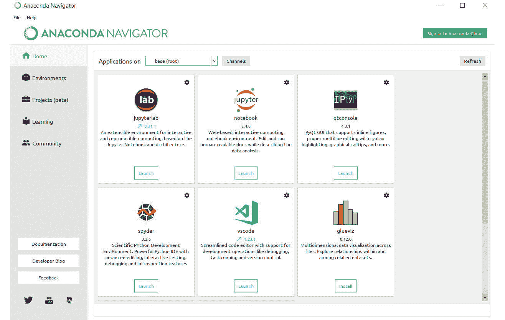

# 前言

## 关于

本节简要介绍了作者、本书涵盖的内容、开始学习所需的技术技能，以及完成所有包含的活动和练习所需的硬件和软件要求。

## 关于本书

机器学习和神经网络正迅速成为构建智能应用的支柱。本书首先向您介绍 Python，并讨论人工智能搜索算法的使用。您将学习数学密集型主题，如回归和分类，并通过 Python 示例进行说明。

然后您将进入高级人工智能技术和概念的学习，并使用真实数据集来形成决策树和聚类。您将介绍神经网络，这是一种受益于摩尔定律应用于 21 世纪计算能力的强大工具。到本书结束时，您将信心满满，并期待使用您新获得的技术构建自己的 AI 应用程序！

### 关于作者

**Zsolt Nagy** 是一家数据科学占主导地位的广告技术公司的工程经理。在获得关于本体推理的硕士学位后，他主要使用人工智能分析在线扑克策略，以帮助职业扑克选手做出决策。随着扑克热潮的结束，他将精力投入到构建领导力和软件工程 T 型轮廓中。

### 目标

+   理解人工智能的重要性、原则和领域

+   学习如何使用 Python 实现基本的路径寻找和游戏击败的人工智能

+   在 Python 中实现回归和分类练习，应用于现实世界问题

+   使用决策树和随机森林在 Python 中进行预测分析

+   使用 k-means 和 mean shift 算法在 Python 中进行聚类

+   通过实际示例了解深度学习的原理

### 读者对象

软件开发人员认为他们的未来作为数据科学家更有利可图，或者希望使用机器学习来丰富他们当前的个人或专业项目。虽然不需要 AI 的先前经验，但至少需要了解一种编程语言（最好是 Python）和高中水平的数学知识。尽管这是一本关于人工智能的入门级书籍，但中级学生将通过实现实际应用、使用和更新他们的基本人工智能知识来从提高 Python 技能中受益。

### 方法

本书采用实践方法教授您使用 Python 学习人工智能和机器学习。它包含多个活动，使用真实场景让您练习并应用您的新技能，在高度相关的环境中进行实践。

### 最小硬件要求

为了获得最佳的学生体验，我们推荐以下硬件配置：

+   处理器：Intel Core i5 或等效

+   内存：8 GB RAM

+   存储：35 GB 可用空间

### 软件要求

您还需要预先安装以下软件：

+   操作系统：Windows 7 SP1 64 位，Windows 8.1 64 位或 Windows 10 64 位，Ubuntu Linux，或最新版本的 macOS

+   浏览器：Google Chrome（最新版本）

+   Anaconda（最新版本）

+   IPython（最新版本）

### 通用约定

文本中的代码单词、数据库表名、文件夹名、文件名、文件扩展名、路径名、虚拟 URL、用户输入和 Twitter 昵称显示如下：“最常见的激活函数是`sigmoid`和`tanh`（双曲正切函数）”

代码块设置如下：

```py
from sklearn.metrics.pairwise import euclidean_distances
points = [[2,3], [3,7], [1,6]]
euclidean_distances([[4,4]], points)
```

新术语和重要词汇以粗体显示。屏幕上显示的单词，例如在菜单或对话框中，在文本中显示如下：“支持向量机找到的最佳分隔符称为**最佳分离超平面**。”

### 安装和设置

在您开始本书之前，您需要安装 Python 3.6 和 Anaconda。您将在这里找到安装它们的步骤：

**安装 Python**

按照以下链接中的说明安装 Python 3.6：[`realpython.com/installing-python/`](https://realpython.com/installing-python/)。

**安装虚拟环境**

从以下链接安装 Anaconda 版本。Anaconda 对于避免冲突的包至关重要，通过避免令人沮丧的错误，可以节省您的时间和精力。

要安装 Anaconda，请点击以下链接：[`www.anaconda.com/download/`](https://www.anaconda.com/download/)。

选择您的操作系统并选择 Python 的最新版本。一旦您的包下载完成，运行它。

点击**下一步**后，您将看到一份许可协议。点击**我同意**后，您可以选择是否要为计算机上的所有用户安装 Anaconda。后者需要管理员权限。选择**仅为我**。

然后，您必须选择您想要安装 Anaconda 的文件夹。请确保文件夹名称中没有空格或长 Unicode 字符。请确保您的计算机上至少有 3 GB 的空闲空间，并且您有一个足够快的互联网连接来下载文件。

在下一屏幕上，您可以选择是否要将 Anaconda 添加到**PATH**环境变量中。不要选择此选项，因为您将能够从**开始**菜单启动 Anaconda。

点击**安装**。安装 Anaconda 到您的计算机上可能需要几分钟。安装完成后，您可以选择了解更多关于 Anaconda Cloud 和 Anaconda 支持的信息，或者您可以选择取消勾选这些框并完成安装。

### 启动 Anaconda

您可以在**开始**菜单中找到已安装的 Anaconda。如果您在开始本书之前已经安装了 Anaconda，您可以选择将其升级到 Python 3。最干净的方法是卸载并重新安装它。

Anaconda Navigator 为您提供了访问本书所需的大部分工具。通过选择右上角的选项启动**IPython**。



Jupyter Notebook 是你将执行本书 Python 代码的地方。

### 其他资源

本书代码包也托管在 GitHub 上：https://github.com/TrainingByPackt/Artificial-Intelligence-and-Machine-Learning-Fundamentals。

我们还有其他来自我们丰富图书和视频目录的代码包，可在 [`github.com/PacktPublishing/`](https://github.com/PacktPublishing/) 找到。去看看吧！
