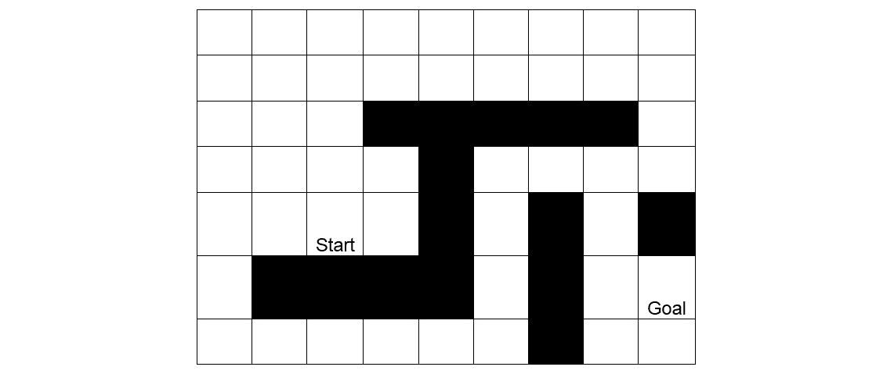
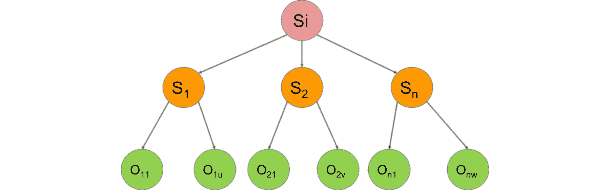
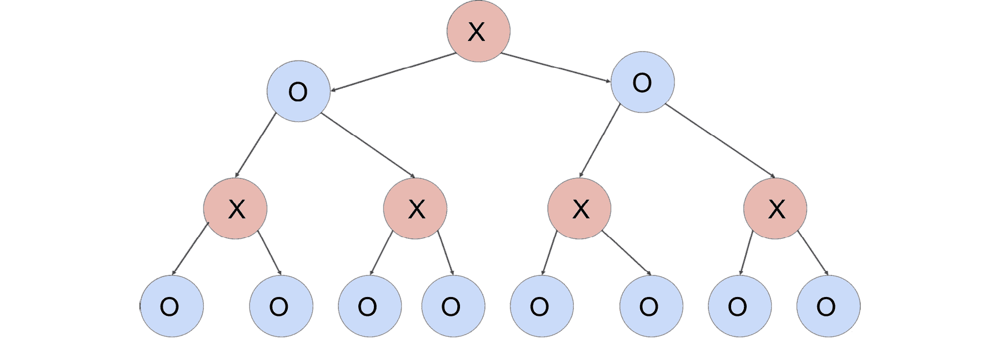
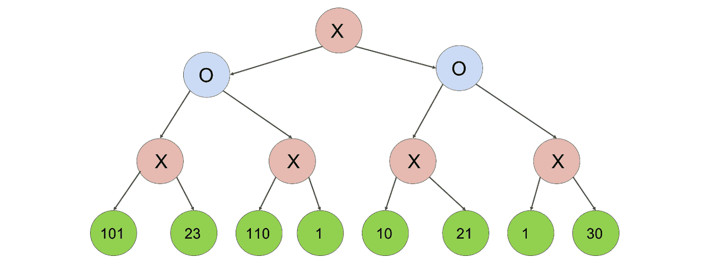
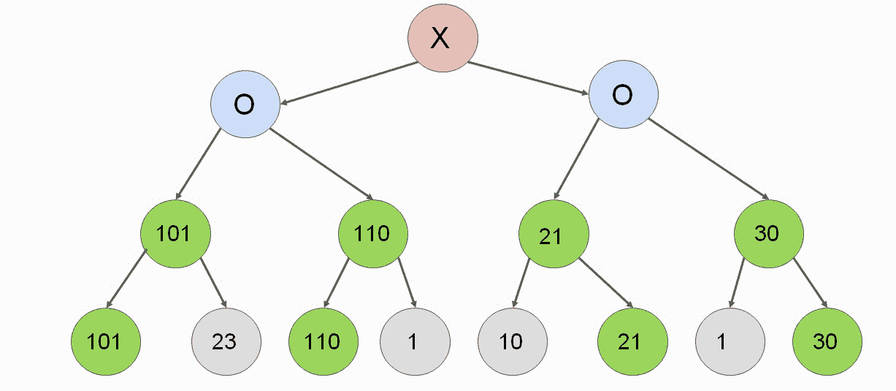
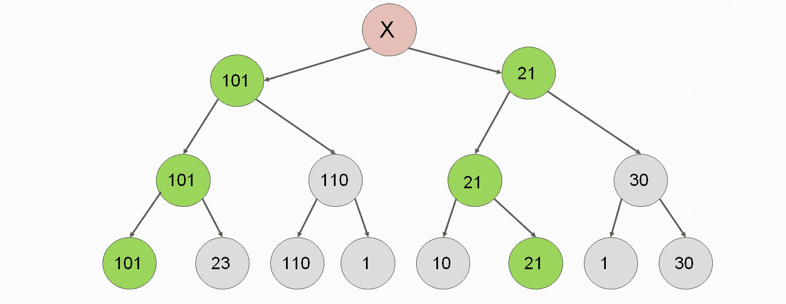
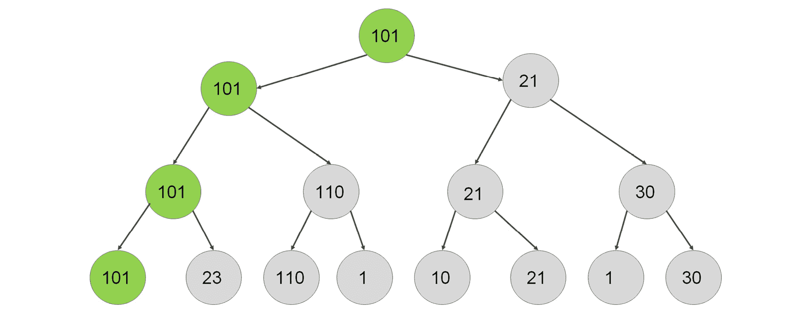
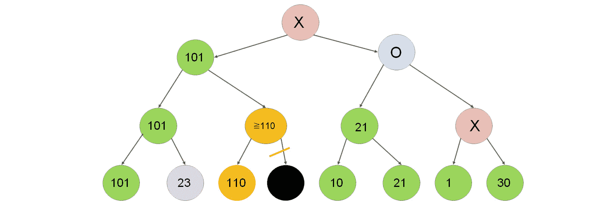
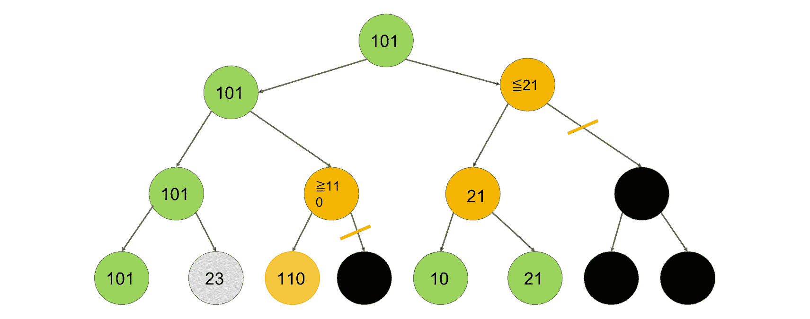

# 第二章：基于搜索技术和游戏的 AI

## 学习目标

到本章结束时，你将能够：

+   使用 Python 基于静态规则构建简单的游戏 AI

+   确定启发式在游戏 AI 中的作用

+   使用搜索技术和路径查找算法

+   实现使用 Minmax 算法的两人游戏 AI

在本章中，我们将探讨创建智能体。

## 简介

在上一章中，我们了解了智能体的意义。我们还检查了游戏 AI 的游戏状态。在本章中，我们将专注于如何创建并引入智能体中的智能。

我们将研究减少状态空间中的状态数量，分析游戏棋盘可能经历的阶段，并使环境以我们获胜的方式工作。到本章结束时，我们将拥有一个永远不会输掉比赛的井字棋玩家。

### 练习 4：教会智能体获胜

在这个练习中，我们将看到如何减少赢得所需的步骤。我们将使我们在上一章中开发的智能体检测它能够赢得游戏的情况。以随机游戏为例，比较可能的状态数量。

1.  我们将定义两个函数，`ai_move` 和 `all_moves_from_board`。我们将创建 `ai_move`，使其返回一个考虑其先前移动的移动。如果在该移动中可以赢得游戏，`ai_move` 将选择该移动。

    ```py
    def ai_move(board):
        new_boards = all_moves_from_board(board, AI_SIGN)
        for new_board in new_boards:
        if game_won_by(new_board) == AI_SIGN:
        return new_board
        return choice(new_boards)
    ```

1.  让我们通过游戏循环测试应用程序。每当 AI 有机会赢得游戏时，它总是会将 X 放在正确的单元格中：

    ```py
    game_loop()
    ```

1.  输出如下：

    ```py
    . X .
    . . .
    . . .
    Enter row: 3
    Enter column: 1
    . X .
    . . .
    O . .

    . X X
    . . .
    O . .

    Enter row: 2
    Enter column: 1

    . X X
    O . .
    O . .

    X X X
    O . .
    O . .
    Game has been ended.
    ```

1.  为了计算所有可能的移动，我们必须将 `all_moves_from_board` 函数更改为包括这个改进。我们必须这样做，以便如果游戏被 `AI_SIGN` 赢得，它将返回该值：

    ```py
    def all_moves_from_board(board, sign):
        move_list = []
        for i, v in enumerate(board):
            if v == EMPTY_SIGN:
                new_board = board[:i] + sign + board[i+1:]
                move_list.append(new_board)
                if game_won_by(new_board) == AI_SIGN:
                    return [new_board]
        return move_list
    ```

1.  然后，我们生成所有可能的移动。一旦我们找到一个为 AI 赢得游戏的移动，我们就返回它。我们不在乎 AI 是否在一次移动中有多个赢得游戏的机会 - 我们只返回第一个可能性。如果 AI 无法赢得游戏，我们返回所有可能的移动。

1.  让我们看看这在对每一步计算所有可能性方面意味着什么：

    ```py
    count_possibilities()
    ```

1.  输出如下：

    ```py
    step 0\. Moves: 1
    step 1\. Moves: 9
    step 2\. Moves: 72
    step 3\. Moves: 504
    step 4\. Moves: 3024
    step 5\. Moves: 8525
    step 6\. Moves: 28612
    step 7\. Moves: 42187
    step 8\. Moves: 55888
    First player wins: 32395
    Second player wins: 23445
    Draw 35544
    Total 91344
    ```

### 活动二：教会智能体意识到防御损失的情况

在本节中，我们将讨论如何让计算机玩家玩得更好，以便我们可以减少状态空间和损失的数量。我们将迫使计算机防御玩家连续放置第三个标记的情况，即行、列或对角线：

1.  创建一个名为 `player_can_win` 的函数，该函数使用 `all_moves_from_board` 函数从棋盘获取所有移动，并使用一个名为 `next_move` 的变量遍历它。在每次迭代中，它检查游戏是否可以通过标记赢得，然后返回 true 或 false。

1.  扩展 AI 的移动，使其更倾向于做出安全的移动。一个移动是安全的，如果对手在下一步无法赢得游戏。

1.  测试新应用程序。你会发现 AI 已经做出了正确的移动。

1.  将这个逻辑放入状态空间生成器中，并通过生成所有可能的比赛来检查计算机玩家的表现。

我们不仅又去掉了几乎所有三分之二的可能比赛，而且大多数时候，AI 玩家要么获胜，要么接受平局。尽管我们努力使 AI 变得更好，但它仍然有 962 种失败的方式。我们将在下一个活动中消除所有这些损失。

#### 注意

本活动的解决方案可以在第 261 页找到。

### 活动三：修复 AI 的第一和第二次移动以使其无敌

本节将讨论如何将穷举搜索集中在更有用的移动上。我们将通过硬编码第一和第二次移动来减少可能的比赛：

1.  计算棋盘上空格的数量，并在有 9 个或 7 个空格的情况下进行硬编码移动。你可以尝试不同的硬编码移动。

1.  占据任何角落，然后占据对角角落，都不会导致损失。如果对手占据了对角角落，在中部移动会导致没有损失。

1.  修复前两个步骤后，我们只需要处理 8 种可能性，而不是 504 种。我们还引导 AI 进入一个状态，其中硬编码的规则足以永远不会输掉比赛。

    #### 注意

    本活动的解决方案可以在第 263 页找到。

让我们总结一下我们应用以减少状态空间的重要技术：

1.  **经验简化**：我们接受最佳第一次移动是角落移动。我们简单地硬编码了一个移动，而不是考虑替代方案，以关注游戏的其它方面。在更复杂的游戏中，经验移动往往是误导性的。最著名的国际象棋 AI 胜利往往包含违反象棋大师的常识。

1.  **对称性**：在我们开始使用角落移动后，我们注意到位置 1、3、7 和 9 在赢得游戏的角度上是等效的。即使我们没有进一步发展这个想法，请注意，我们甚至可以旋转桌子以进一步减少状态空间，并将所有四个角落移动视为完全相同的移动。

1.  **减少导致相同状态的不同的排列**：假设我们可以移动 A 或 B，假设我们的对手移动 X，其中 X 不等于移动 A 或 B。如果我们探索序列 A、X、B，然后我们开始探索序列 B、X，那么我们不需要考虑序列 B、X、A。这是因为这两个序列导致完全相同的状态，我们之前已经探索了一个包含这三个移动的状态。

1.  **对玩家的强制移动**：当一个玩家在水平、垂直或对角线上收集到两个标记，并且该行的第三个单元格为空时，我们被迫占据那个空单元格，要么是为了赢得游戏，要么是为了防止对手赢得游戏。强制移动可能意味着其他强制移动，这进一步减少了状态空间。

1.  **对对手的强制移动**：当对手的移动明显是最佳选择时，考虑对手不做出最佳移动的情况是没有意义的。当对手可以通过占据一个单元格来赢得游戏时，我们是否对对手错过最佳移动的情况进行长期探索并不重要。我们不探索对手未能阻止我们赢得游戏的情况可以节省很多。这是因为在对手犯错误后，我们简单地赢得游戏。

1.  **随机移动**：当我们无法决定且没有搜索能力时，我们会随机移动。随机移动几乎总是不如基于搜索的有根据的猜测，但有时我们别无选择。

## 启发式方法

在这个主题中，我们将通过定义和应用启发式方法来形式化有信息搜索技术。

### 无信息和有信息搜索

在井字棋的例子中，我们实现了一个贪婪算法，首先关注获胜，然后关注不输。当涉及到立即赢得游戏时，贪婪算法是最佳的，因为没有比赢得游戏更好的步骤。当涉及到不输时，我们如何避免损失很重要。我们的算法只是简单地选择一个安全的随机移动，而不考虑我们创造了多少获胜机会。

广度优先搜索和深度优先搜索是无信息的，因为它们考虑了游戏中所有可能的状态。有信息搜索智能地探索可用状态的空间。

### 创建启发式方法

如果我们想要做出更好的决策，我们会应用启发式方法，通过考虑长期效用来引导搜索的正确方向。这样，我们可以根据未来可能发生的情况，在现在做出更明智的决策。这也可以帮助我们更快地解决问题。我们可以如下构建启发式方法：

+   对游戏中移动的效用进行有根据的猜测

+   从玩家视角对给定游戏状态的效用进行有根据的猜测

+   对我们目标距离的有根据的猜测

启发式方法是评估游戏状态或过渡到新游戏状态的函数，基于它们的效用。启发式方法是使搜索问题有信息的基础。

在这本书中，我们将使用效用和成本作为否定术语。最大化效用和最小化移动成本被认为是同义的。

一个用于启发式评估函数的常用例子出现在路径查找问题中。假设我们正在寻找一条路径，这条路径在状态树中通向目标状态。每一步都有一个相关的成本，象征着旅行距离。我们的目标是使达到目标状态的成本最小化。

以下是一个用于解决路径查找问题的启发式示例：取当前状态和目标状态的坐标。无论连接这些点的路径如何，计算这些点之间的距离。平面内两点之间的距离是连接这些点的直线长度。这种启发式被称为欧几里得距离。

假设我们在迷宫中定义一个路径查找问题，我们只能向上、向下、向左或向右移动。迷宫中有几个障碍物阻挡了我们的移动。我们可以用来评估我们离目标状态有多近的启发式称为曼哈顿距离，它被定义为当前状态和最终状态对应坐标的水平距离和垂直距离之和。

### 可接受和非可接受启发式

我们在路径查找问题中定义的两个启发式，当在给定的问题域中使用时，被称为可接受启发式。可接受意味着我们可能会低估达到最终状态的成本，但我们永远不会高估它。在下一个主题中，我们将探讨一个寻找当前状态和目标状态之间最短路径的算法。这个算法的最优性取决于我们是否可以定义一个可接受启发式函数。

一个非可接受启发式的例子是将曼哈顿距离应用于二维地图。想象一下，从我们的当前状态到目标状态有一条直接路径。当前状态位于坐标（2，5），目标状态位于坐标（5，1）。

两个节点之间的曼哈顿距离如下：

```py
abs(5-2) + abs(1-5) = 3 + 4 = 7
```

由于我们高估了从当前节点到目标状态的旅行成本，当我们可以斜向移动时，曼哈顿距离不是可接受的。

### 启发式评估

从起始玩家的角度创建一个井字棋游戏状态的启发式评估。

我们可以定义游戏状态或移动的效用。两者都适用，因为游戏状态的效用可以定义为导致该状态的移动的效用。

**启发式 1：简单评估终局**

让我们通过评估棋盘来定义一个简单的启发式：我们可以定义游戏状态或移动的效用。两者都适用，因为游戏状态的效用可以定义为导致该状态的移动的效用。游戏的效用可以是：

+   如果状态意味着 AI 玩家将赢得游戏，则返回+1

+   如果状态意味着 AI 玩家将输掉游戏，则返回-1

+   如果已经达到平局或无法从当前状态中识别出明确的胜者，则返回 0

这个启发式方法很简单，因为任何人都可以查看棋盘并分析玩家是否即将获胜。

这个启发式方法的效用取决于我们能否提前玩很多步。请注意，我们甚至无法在五步内赢得游戏。我们在主题 A 中看到，当我们达到第 5 步时，有 13,680 种可能的组合。在这些 13,680 种情况中的大多数，我们的启发式方法返回零。

如果我们的算法没有超过这五步，我们对如何开始游戏完全一无所知。因此，我们可以发明一个更好的启发式方法。

**启发式 2：移动的效用**

+   在一行、一列或对角线上有两个 AI 符号，第三个单元格为空：空单元格+1000 分。

+   对手在一行、一列或对角线上有两个连续的符号，第三个单元格为空：空单元格+100 分。

+   一个 AI 符号在一行、一列或对角线上，其他两个单元格为空：空单元格+10 分。

+   没有 AI 或对手的符号在一行、一列或对角线上：空单元格+1 分。

+   被占据的单元格得到负无穷大的值。在实践中，由于规则的性质，-1 也足够了。

为什么我们使用 10 的乘数因子来计算这四条规则？因为在一行、一列和对角线上，有八种可能的方式组成三个连续的符号。所以，即使我们对这个游戏一无所知，我们也可以确定低级规则可能不会累积到覆盖高级规则。换句话说，如果我们能赢得游戏，我们永远不会防御对手的移动。

#### 备注

由于对手的任务也是获胜，我们可以从对手的角度计算这个启发式方法。我们的任务是最大化这个值，以便我们可以防御对手的最佳策略。这也是 Minmax 算法背后的思想。如果我们想将这个启发式方法转换为描述当前棋盘的启发式方法，我们可以计算所有开放单元格的启发式值，并取 AI 字符值的最大值，以便我们可以最大化我们的效用。

对于每个棋盘，我们将创建一个效用矩阵。例如，考虑以下棋盘：


###### 图 2.1：井字棋游戏状态

从这里，我们可以构建它的效用矩阵：


###### 图 2.2：井字棋游戏效用矩阵

在第二行，如果我们选择左边的单元格，它并不是很有用。请注意，如果我们有一个更优化的效用函数，我们会奖励阻止对手。

第三列的两个单元格都因为有两个连续的符号而得到 10 分的提升。

右上角的单元格也因为防御对手的对角线而得到 100 分。

从这个矩阵中，很明显我们应该选择右上角的移动。

我们可以使用这个启发式方法来指导我们走向最佳下一步，或者通过取这些值的最大值来对当前棋盘给出一个更明智的评分。我们在主题 A 中实际上已经以硬编码规则的形式使用了这个启发式方法的一部分。然而，需要注意的是，启发式方法的真正效用不是对棋盘的静态评估，而是它提供的在限制搜索空间方面的指导。

### 练习 5：使用启发式函数的井字棋静态评估

使用启发式函数对井字棋游戏进行静态评估。

1.  在本节中，我们将创建一个函数，该函数接受可能的移动的效用向量，接受效用向量内部的三个索引表示一个三元组，并返回一个函数。返回的函数期望一个点数参数，并修改效用向量，使得在(i, j, k)三元组中的每个单元格增加点数，只要该单元格的原始值是非负的。换句话说，我们只增加空单元格的效用。

    ```py
    def init_utility_matrix(board):
        return [0 if cell == EMPTY_SIGN else -1 for cell in board]
    def generate_add_score(utilities, i, j, k):
        def add_score(points):
            if utilities[i] >= 0:
                utilities[i] += points
            if utilities[j] >= 0:
                utilities[j] += points
            if utilities[k] >= 0:
                utilities[k] += points
        return add_score
    ```

1.  现在我们已经拥有了创建任何棋盘配置的效用矩阵所需的一切：

    ```py
    def utility_matrix(board):
        utilities = init_utility_matrix(board)
        for [i, j, k] in combo_indices:
            add_score = generate_add_score(utilities, i, j, k)
            triple = [board[i], board[j], board[k]]
            if triple.count(EMPTY_SIGN) == 1:
                if triple.count(AI_SIGN) == 2:
                    add_score(1000)
                elif triple.count(OPPONENT_SIGN) == 2:
                    add_score(100)
            elif triple.count(EMPTY_SIGN) == 2 and triple.count(AI_SIGN) == 1:
                add_score(10)
            elif triple.count(EMPTY_SIGN) == 3:
                add_score(1)
        return utilities
    ```

1.  现在，我们将创建一个函数，该函数严格选择具有最高效用值的移动。如果有多个移动具有相同的效用值，该函数将返回这两个移动。

    ```py
    def best_moves_from_board(board, sign):
        move_list = []
        utilities = utility_matrix(board)
        max_utility = max(utilities)
        for i, v in enumerate(board):
            if utilities[i] == max_utility:
                move_list.append(board[:i] + sign + board[i+1:])
        return move_list
    def all_moves_from_board_list(board_list, sign):
        move_list = []
        get_moves = best_moves_from_board if sign == AI_SIGN else all_moves_from_board
        for board in board_list:
            move_list.extend(get_moves(board, sign))
        return move_list
    ```

1.  让我们运行这个应用程序。

    ```py
    count_possibilities()
    ```

    输出将如下所示：

    ```py
    step 0\. Moves: 1
    step 1\. Moves: 1
    step 2\. Moves: 8
    step 3\. Moves: 24
    step 4\. Moves: 144
    step 5\. Moves: 83
    step 6\. Moves: 214
    step 7\. Moves: 148
    step 8\. Moves: 172
    First player wins: 504
    Second player wins: 12
    Draw 91
    Total 607
    ```

### 使用启发式方法进行信息搜索

我们还没有真正体验到启发式方法的威力，因为我们是在不知道未来移动效果的情况下进行移动的，因此影响了对手的合理游戏。

这就是为什么一个更精确的启发式方法会导致比简单地硬编码游戏的前两步更多的损失。注意，在前一个主题中，我们是根据基于运行具有固定第一步的游戏所生成的统计数据来选择这两个移动的。这种方法本质上就是启发式搜索应该关注的内容。静态评估无法与生成数以万计的未来状态并选择最大化我们奖励的玩法相竞争。

### 启发式方法的类型

因此，一个更精确的启发式方法会导致比简单地硬编码游戏的前两步更多的损失。注意，在主题 A 中，我们是根据基于运行具有固定第一步的游戏所生成的统计数据来选择这两个移动的。这种方法本质上就是启发式搜索应该关注的内容。静态评估无法与生成数以万计的未来状态并选择最大化我们奖励的玩法相竞争。

+   这是因为我们的启发式方法并不精确，而且很可能也不是可接受的。

在前面的练习中，我们看到了启发式方法并不总是最优的：在第一个主题中，我们提出了允许 AI 总是赢得游戏或以平局结束的规则。这些启发式方法使 AI 在大多数情况下都能获胜，但在少数情况下会失败。

+   如果我们可以低估游戏状态的效用，但永远不会高估它，那么一个启发式方法被认为是可接受的。

在井字棋的例子中，我们可能高估了一些游戏状态的价值。为什么？因为我们最终输了十二次。导致失败的一些游戏状态具有最大的启发式分数。为了证明我们的启发式方法不可接受，我们只需要找到一个可能获胜的游戏状态，这个状态在我们选择导致失败的游戏状态时被忽略了。

描述启发式方法的还有两个特性：最优和完全：

+   **最优启发式**总是找到最佳可能的解决方案。

+   **完全启发式**有两个定义，这取决于我们如何定义问题域。在广义上，如果启发式方法总是找到解决方案，则称其为完全的。在狭义上，如果启发式方法找到所有可能的解决方案，则称其为完全的。我们的井字棋启发式方法不是完全的，因为我们故意忽略了许多可能的获胜状态，而选择了失败状态。

## 使用 A*算法进行路径查找

在前两个主题中，我们学习了如何定义智能体，以及如何创建一个引导智能体向目标状态前进的启发式方法。我们了解到这并不完美，因为有时我们为了几个失败状态而忽略了几个获胜状态。

现在，我们将学习一种结构化和最优的方法，以便我们可以执行搜索以找到当前状态和目标状态之间的最短路径：**A*算法**（"A star"而不是"A asterisk"）：



###### 图 2.3：在迷宫中找到最短路径

对于人类来说，通过仅仅查看图像就能找到最短路径很简单。我们可以得出结论，存在两个潜在的最短路径候选者：一条路径向上开始，另一条路径向左开始。然而，AI 并不知道这些选项。实际上，对于计算机玩家来说，最合逻辑的第一步是移动到以下图中标记为数字 3 的方格：

为什么？因为这是唯一一个减少起始状态和目标状态之间距离的步骤。所有其他步骤最初都远离目标状态：


###### 图 2.4：带有效用的最短路径查找游戏棋盘

### 练习 6：找到达到目标的最短路径

找到最短路径的步骤如下：

1.  使用 Python 描述棋盘、初始状态和最终状态。创建一个函数，该函数返回可能的后继状态列表。

1.  我们将使用元组，其中第一个坐标表示从 1 到 7 的行号，第二个坐标表示从 1 到 9 的列号：

    ```py
    size = (7, 9)
    start = (5, 3)
    end = (6, 9)
    obstacles = {
        (3, 4), (3, 5), (3, 6), (3, 7), (3, 8),
        (4, 5),
        (5, 5), (5, 7), (5, 9),
        (6, 2), (6, 3), (6, 4), (6, 5), (6, 7),
        (7, 7)
    }
    ```

1.  我们将使用数组推导来生成以下方式的后继状态。我们从当前列向左和向右移动一个单位，只要我们保持在棋盘上。我们从当前行向上和向下移动一个单位，只要我们保持在棋盘上。我们取新的坐标，生成所有四个可能的元组，并过滤结果，以确保新的状态不能在障碍物列表中。同时，排除回到我们之前访问过的场地的移动也是有意义的，以避免无限循环：

    ```py
    def successors(state, visited_nodes):
        (row, col) = state
        (max_row, max_col) = size
        succ_states = []
        if row > 1:
            succ_states += [(row-1, col)]
        if col > 1:
            succ_states += [(row, col-1)]
        if row < max_row:
            succ_states += [(row+1, col)]
        if col < max_col:
            succ_states += [(row, col+1)]
        return [s for s in succ_states if s not in visited_nodes if s not in obstacles]
    ```

### 练习 7：使用 BFS 寻找最短路径

要找到最短路径，请按照以下步骤操作：

使用 BFS 算法找到最短路径。

回顾基本的 BFS 实现。

1.  我们必须修改这个实现以包含成本。让我们测量成本：

    ```py
    import math
    def initialize_costs(size, start):
        (h, w) = size
        costs = [[math.inf] * w for i in range(h)]
        (x, y) = start
        costs[x-1][y-1] = 0
        return costs
    def update_costs(costs, current_node, successor_nodes):
        new_cost = costs[current_node[0]-1][current_node[1]-1] + 1
        for (x, y) in successor_nodes:
            costs[x-1][y-1] = min(costs[x-1][y-1], new_cost)
    def bfs_tree(node):
        nodes_to_visit = [node]
        visited_nodes = []
        costs = initialize_costs(size, start)
        while len(nodes_to_visit) > 0:
            current_node = nodes_to_visit.pop(0)
            visited_nodes.append(current_node)
            successor_nodes = successors(current_node, visited_nodes)
            update_costs(costs, current_node, successor_nodes)
            nodes_to_visit.extend(successor_nodes)
        return costs
    bfs_tree(start)
    ```

1.  输出将如下所示：

    ```py
    [[6, 5, 4, 5, 6, 7, 8, 9, 10],
    [5, 4, 3, 4, 5, 6, 7, 8, 9],
    [4, 3, 2, inf, inf, inf, inf, inf, 10],
    [3, 2, 1, 2, inf, 12, 13, 12, 11],
    [2, 1, 0, 1, inf, 11, inf, 13, inf],
    [3, inf, inf, inf, inf, 10, inf, 14, 15],
    [4, 5, 6, 7, 8, 9, inf, 15, 16]]
    ```

1.  你可以看到，一个简单的 BFS 算法成功地确定了从起始节点到任何节点（包括目标节点）的成本。让我们测量找到目标节点所需的步数：

    ```py
    def bfs_tree_verbose(node):
        nodes_to_visit = [node]
        visited_nodes = []
        costs = initialize_costs(size, start)
        step_counter = 0
        while len(nodes_to_visit) > 0:
            step_counter += 1
            current_node = nodes_to_visit.pop(0)
            visited_nodes.append(current_node)
    ```

    ```py
            successor_nodes = successors(current_node, visited_nodes)
            update_costs(costs, current_node, successor_nodes)
            nodes_to_visit.extend(successor_nodes)
            if current_node == end:
                print(
                    'End node has been reached in ',
                    step_counter, '
                    steps'
                )
                return costs
        return costs
    bfs_tree_verbose(start)
    ```

1.  目标节点在 110 步后到达：

    ```py
    [[6, 5, 4, 5, 6, 7, 8, 9, 10],
    [5, 4, 3, 4, 5, 6, 7, 8, 9],
    [4, 3, 2, inf, inf, inf, inf, inf, 10],
    [3, 2, 1, 2, inf, 12, 13, 12, 11],
    [2, 1, 0, 1, inf, 11, inf, 13, inf],
    [3, inf, inf, inf, inf, 10, inf, 14, 15],
    [4, 5, 6, 7, 8, 9, inf, 15, 16]]
    ```

我们现在将学习一个可以找到从起始节点到目标节点的最短路径的算法：A* 算法。

### 介绍 A* 算法

A* 是一种完整且最优的启发式搜索算法，它可以在当前游戏状态和获胜状态之间找到可能的最短路径。在此状态下，完整和最优的定义如下：

+   完整意味着 A* 总是能找到解决方案。

+   最优意味着 A* 将找到最佳解决方案。

要设置 A* 算法，我们需要以下内容：

+   初始状态

+   描述目标状态

+   可行的启发式方法来衡量通向目标状态的过程

+   一种生成通向目标下一步的方法

一旦设置完成，我们将按照以下步骤在初始状态下执行 A* 算法：

1.  我们生成所有可能的后继步骤。

1.  我们将按照它们与目标距离的顺序存储这些子节点。

1.  我们首先选择得分最高的子节点，然后以得分最高的子节点作为初始状态重复这三个步骤。这是从起始节点到达节点的最短路径。

    `distance_from_end( node )` 是一个可接受的启发式估计，显示了我们从目标节点有多远。

在路径查找中，一个好的启发式方法是欧几里得距离。如果当前节点是 (x, y) 且目标节点是 (u, v)，那么：

*distance_from_end( node ) = sqrt( abs( x – u ) ** 2 + abs( y – v ) ** 2 )*

其中：

+   `sqrt` 是平方根函数。别忘了从 math 库中导入它。

+   `abs` 是绝对值函数。`abs( -2 )` = `abs( 2 )` = `2` 。

+   `x ** 2` 是 *x* 的平方。

我们将使用 `distance_from_start` 矩阵来存储从起始节点到距离。在算法中，我们将把这个成本矩阵称为 `distance_from_start( n1 )` 。对于任何具有坐标 `(x1, y1)` 的节点 `n1` ，这个距离等同于 `distance_from_start[x1][y1]` 。

我们将使用 `succ( n )` 符号从 `n` 生成后继节点列表。

让我们看看算法的伪代码：

```py
frontier = [start], internal = {}
# Initialize the costs matrix with each cell set to infinity.
# Set the value of distance_from_start(start) to 0.
while frontier is not empty:
    # notice n has the lowest estimated total
    # distance between start and end.
    n = frontier.pop()
    # We'll learn later how to reconstruct the shortest path
    if n == end:
        return the shortest path.
    internal.add(n)
    for successor s in succ(n):
        if s in internal:
            continue # The node was already examined
        new_distance = distance_from_start(n) + distance(n, s)
        if new_distance >= distance_from_start(s):
            # This path is not better than the path we have
            # already examined.
            continue
        if s is a member of frontier:
            update the priority of s
        else:
            Add s to frontier.
```

关于检索最短路径，我们可以利用成本矩阵。这个矩阵包含从起始节点到路径上每个节点的距离。由于在向后行走时成本总是减少，我们只需要从终点开始，贪婪地向减少的成本方向行走：

```py
path = [end_node], distance = get_distance_from_start( end_node )
while the distance of the last element in the path is not 0:
    for each neighbor of the last node in path:
        new_distance = get_distance_from_start( neighbor )
        if new_distance < distance:
            add neighbor to path, and break out from the for loop
return path
```

当我们有一个起始状态和一个目标状态时，A* 算法表现得尤为出色。A* 算法的复杂度是 `O( E )`，其中 `E` 代表场中所有可能的边。在我们的例子中，任何节点最多有四个离开的边：上、下、左和右。

#### 注意

为了按正确顺序对前沿列表进行排序，我们必须使用特殊的 Python 数据结构：优先队列。

```py
# Import heapq to access the priority queue
import heapq
# Create a list to store the data
data = []
# Use heapq.heappush to push (priorityInt, value) pairs to the queue
heapq.heappush(data, (2, 'first item'))
heapq.heappush(data, (1, 'second item'))
# The tuples are stored in data in the order of ascending priority
[(1, 'second item'), (2, 'first item')]
# heapq.heappop pops the item with the lowest score from the queue
heapq.heappop(data)
```

输出结果如下：

```py
(1, 'second item')
# data still contains the second item
data
```

输出结果如下：

```py
[(2, 'first item')]
```

为什么算法使用的启发式函数必须是可接受的很重要？

因为这就是我们保证算法最优性的方法。对于任何节点 `x`，我们测量以下总和：从起始节点到 `x` 的距离，从 `x` 到终点节点的估计距离。如果估计永远不会高估 `x` 到终点节点的距离，我们就永远不会高估总距离。一旦我们到达目标节点，我们的估计为零，从起始点到终点的总距离就变成了一个确切的数字。

我们可以确信我们的解决方案是最优的，因为优先队列中没有其他项目具有更低的估计成本。鉴于我们从未高估我们的成本，我们可以确信算法前沿的所有节点要么具有与找到的路径相似的总成本，要么具有更高的总成本。

在以下游戏场景中实现 A* 算法以找到最低成本的路径：


###### 图 2.5：最短路径查找游戏板

我们将重用游戏建模练习中的初始化代码：

```py
import math
import heapq
size = (7, 9)
start = (5, 3)
end = (6, 9)
obstacles = {
    (3, 4), (3, 5), (3, 6), (3, 7), (3, 8),
    (4, 5),
    (5, 5), (5, 7), (5, 9),
    (6, 2), (6, 3), (6, 4), (6, 5), (6, 7),
    (7, 7)
}
# Returns the successor nodes of State, excluding nodes in VisitedNodes
def successors(state, visited_nodes):
    (row, col) = state
    (max_row, max_col) = size
    succ_states = []
    if row > 1:
        succ_states += [(row-1, col)]
    if col > 1:
        succ_states += [(row, col-1)]
    if row < max_row:
        succ_states += [(row+1, col)]
    if col < max_col:
        succ_states += [(row, col+1)]
    return [s for s in succ_states if s not in visited_nodes if s not in obstacles]
```

我们还编写了初始化成本矩阵的代码：

```py
import math
def initialize_costs(size, start):
    costs = [[math.inf] * 9 for i in range(7)]
    (x, y) = start
    costs[x-1][y-1] = 0
    return costs
```

我们将省略更新成本的函数，因为我们将在 A* 算法内部执行此操作：

让我们初始化 A* 算法的前沿和内部列表。对于前沿，我们将使用 Python PriorityQueue。请勿直接执行此代码，因为我们将在 A* 搜索函数内部使用这四行：

```py
frontier = []
internal = set()
heapq.heappush(frontier, (0, start))
costs = initialize_costs(size, start)
```

现在是时候实现一个启发式函数，该函数使用我们在理论部分看到的算法来衡量当前节点和目标节点之间的距离：

```py
def distance_heuristic(node, goal):
    (x, y) = node
    (u, v) = goal
    return math.sqrt(abs(x - u) ** 2 + abs(y - v) ** 2)
```

最后一步是将 A* 算法转换为可执行的代码：

```py
def astar(start, end):
    frontier = []
    internal = set()
    heapq.heappush(frontier, (0, start))
    costs = initialize_costs(size, start)
    def get_distance_from_start(node):
        return costs[node[0] - 1][node[1] - 1]
    def set_distance_from_start(node, new_distance):
        costs[node[0] - 1][node[1] - 1] = new_distance
    while len(frontier) > 0:
        (priority, node) = heapq.heappop(frontier)
```

```py
        if node == end:
            return priority
        internal.add(node)
        successor_nodes = successors(node, internal)
        for s in successor_nodes:
            new_distance = get_distance_from_start(node) + 1
            if new_distance < get_distance_from_start(s):
                set_distance_from_start(s, new_distance)
                # Filter previous entries of s
                frontier = [n for n in frontier if s != n[1]]
                heapq.heappush(frontier, (
                    new_distance + distance_heuristic(s, end), s
                )
                )
astar(start, end)
15.0
```

我们的实施方案与原始算法之间有一些差异：

我们定义了一个 `distance_from_start` 函数，使其更容易且更具语义地访问 `costs` 矩阵。请注意，我们从 1 开始编号节点索引，而在矩阵中，索引从 0 开始。因此，我们从节点值中减去 1 以获得索引。

在生成后续节点时，我们自动排除了内部集合中的节点。`successors = succ(node, internal)` 确保我们只得到那些尚未完成检查的邻居，这意味着它们的分数不一定是最优的。

作为结果，我们可能可以跳过步骤检查，因为内部节点永远不会出现在`succ( n )`中。

由于我们使用的是优先队列，在插入节点 s 之前，我们必须确定节点 s 的估计优先级。然而，我们只会将节点插入到边界，如果我们知道这个节点没有比它分数更低的条目。

可能会发生节点 s 已经在边界队列中，但分数更高的情况。在这种情况下，我们在将其插入到优先队列的正确位置之前，先删除这个条目。当我们找到终点节点时，我们只需返回最短路径的长度，而不是路径本身。

为了获取更多关于执行的信息，让我们将这些信息打印到控制台。为了跟踪 A*算法的执行过程，执行以下代码并研究日志：

```py
def astar_verbose(start, end):
    frontier = []
    internal = set()
    heapq.heappush(frontier, (0, start))
    costs = initialize_costs(size, start)
    def get_distance_from_start(node):
        return costs[node[0] - 1][node[1] - 1]
    def set_distance_from_start(node, new_distance):
        costs[node[0] - 1][node[1] - 1] = new_distance
    steps = 0
    while len(frontier) > 0:
        steps += 1
        print('step ', steps, '. frontier: ', frontier)
        (priority, node) = heapq.heappop(frontier)
        print(
            'node ',
            node,
            'has been popped from frontier with priority',
            priority
        )
        if node == end:
            print('Optimal path found. Steps: ', steps)
            print('Costs matrix: ', costs)
            return priority
        internal.add(node)
        successor_nodes = successors(node, internal)
        print('successor_nodes', successor_nodes)
        for s in successor_nodes:
            new_distance = get_distance_from_start(node) + 1
            print(
                's:',
                s,
                'new distance:',
                new_distance,
                ' old distance:',
                get_distance_from_start(s)
            )
            if new_distance < get_distance_from_start(s):
                set_distance_from_start(s, new_distance)
                # Filter previous entries of s
                frontier = [n for n in frontier if s != n[1]]
                new_priority = new_distance + distance_heuristic(s, end)
                heapq.heappush(frontier, (new_priority, s))
                print(
        'Node',
        s,
        'has been pushed to frontier with priority',
        new_priority
    )
    print('Frontier', frontier)
    print('Internal', internal)
    print(costs)
astar_verbose(start, end)
```

输出如下：

```py
step 1 . Frontier: [(0, (5, 3))]
Node (5, 3) has been popped from Frontier with priority 0
successors [(4, 3), (5, 2), (5, 4)]
s: (4, 3) new distance: 1 old distance: inf
Node (4, 3) has been pushed to Frontier with priority 7.324555320336759
s: (5, 2) new distance: 1 old distance: inf
Node (5, 2) has been pushed to Frontier with priority 8.071067811865476
s: (5, 4) new distance: 1 old distance: inf
Node (5, 4) has been pushed to Frontier with priority 6.0990195135927845
step 2 . Frontier: [(6.0990195135927845, (5, 4)), (8.071067811865476, (5, 2)), (7.324555320336759, (4, 3))]
Node (5, 4) has been popped from Frontier with priority 6.0990195135927845
successors [(4, 4)]
s: (4, 4) new distance: 2 old distance: inf
Node (4, 4) has been pushed to Frontier with priority 7.385164807134504
…
step 42 . Frontier: [(15.0, (6, 8)), (15.60555127546399, (4, 6)), (15.433981132056603, (1, 1)), (15.82842712474619, (4, 7))]
Node (6, 8) has been popped from Frontier with priority 15.0
successors [(7, 8), (6, 9)]
s: (7, 8) new distance: 15 old distance: inf
Node (7, 8) has been pushed to Frontier with priority 16.414213562373096
s: (6, 9) new distance: 15 old distance: inf
Node (6, 9) has been pushed to Frontier with priority 15.0
step 43 . Frontier: [(15.0, (6, 9)), (15.433981132056603, (1, 1)), (15.82842712474619, (4, 7)), (16.414213562373096, (7, 8)), (15.60555127546399, (4, 6))]
Node (6, 9) has been popped from Frontier with priority 15.0
Optimal path found. Steps: 43
```

```py
Costs matrix: [[6, 5, 4, 5, 6, 7, 8, 9, 10], [5, 4, 3, 4, 5, 6, 7, 8, 9], [4, 3, 2, inf, inf, inf, inf, inf, 10], [3, 2, 1, 2, inf, 12, 13, 12, 11], [2, 1, 0, 1, inf, 11, inf, 13, inf], [3, inf, inf, inf, inf, 10, inf, 14, 15], [4, 5, 6, 7, 8, 9, inf, 15, inf]]
```

我们已经看到 A*搜索返回了正确的值。问题是，我们如何重建整个路径？

为了清晰起见，从代码中删除 print 语句，并继续使用我们在第 4 步中实现的 A*算法。我们不仅要返回最短路径的长度，还要返回路径本身。我们将编写一个函数，通过从终点节点向后遍历，分析成本矩阵来提取此路径。暂时不要在全局定义此函数。我们将将其定义为之前创建的 A*算法中的局部函数：

```py
def get_shortest_path(end_node):
    path = [end_node]
    distance = get_distance_from_start(end_node)
    while distance > 0:
        for neighbor in successors(path[-1], []):
            new_distance = get_distance_from_start(neighbor)
            if new_distance < distance:
                path += [neighbor]
                distance = new_distance
                break # for
    return path
```

现在我们知道了如何分解路径，让我们将其返回到 A*算法中：

```py
def astar_with_path(start, end):
    frontier = []
    internal = set()
    heapq.heappush(frontier, (0, start))
    costs = initialize_costs(size, start)
    def get_distance_from_start(node):
        return costs[node[0] - 1][node[1] - 1]
    def set_distance_from_start(node, new_distance):
        costs[node[0] - 1][node[1] - 1] = new_distance
    def get_shortest_path(end_node):
        path = [end_node]
        distance = get_distance_from_start(end_node)
        while distance > 0:
            for neighbor in successors(path[-1], []):
                new_distance = get_distance_from_start(neighbor)
                if new_distance < distance:
                    path += [neighbor]
                    distance = new_distance
                    break # for
        return path
    while len(frontier) > 0:
        (priority, node) = heapq.heappop(frontier)
        if node == end:
            return get_shortest_path(end)
        internal.add(node)
        successor_nodes = successors(node, internal)
        for s in successor_nodes:
            new_distance = get_distance_from_start(node) + 1
            if new_distance < get_distance_from_start(s):
                set_distance_from_start(s, new_distance)
                # Filter previous entries of s
                frontier = [n for n in frontier if s != n[1]]
                heapq.heappush(frontier, (
                    new_distance + distance_heuristic(s, end), s
                )
                )
astar_with_path( start, end )
```

输出如下：

```py
[(6, 9),
(6, 8),
(5, 8),
(4, 8),
(4, 9),
(3, 9),
(2, 9),
(2, 8),
(2, 7),
(2, 6),
(2, 5),
(2, 4),
(2, 3),
(3, 3),
(4, 3),
(5, 3)]
```

技术上，我们不需要从成本矩阵中重建路径。我们可以在矩阵中记录每个节点的父节点，并简单地检索坐标以节省一些搜索。

### 使用 simpleai 库进行 A*搜索实践

`simpleai`库可在 GitHub 上找到，并包含许多流行的 AI 工具和技术。

#### 注意

你可以通过[`github.com/simpleai-team/simpleai`](https://github.com/simpleai-team/simpleai) 访问该库。Simple AI 库的文档可以在这里访问：[`simpleai.readthedocs.io/en/latest/`](http://simpleai.readthedocs.io/en/latest/)。要访问`simpleai`库，首先你必须安装它：

```py
pip install simpleai
```

一旦安装了 simpleai，你就可以在 Python 的 Jupyter QtConsole 中导入 simpleai 库中的类和函数：

```py
from simpleai.search import SearchProblem, astar
```

**搜索问题**为你提供了一个定义任何搜索问题的框架。`astar`导入负责在搜索问题中执行 A*算法。

为了简单起见，我们在之前的代码示例中没有使用类，以便在没有杂乱的情况下专注于算法。不过，`simpleai`库将迫使我们使用类。

要描述一个搜索问题，你需要提供以下信息：

+   **constructor**：此函数初始化状态空间，从而描述问题。我们将通过将这些值添加为属性来使 Size、Start、End 和 Obstacles 值在对象中可用。在构造函数的末尾，别忘了调用超构造函数，别忘了提供初始状态。

+   **actions( state )**：此函数返回从给定状态可以执行的动作列表。我们将使用此函数来生成新状态。从语义上讲，创建动作常量如 UP、DOWN、LEFT 和 RIGHT，然后将这些动作常量解释为结果会更合理。然而，在这个实现中，我们将简单地解释一个动作为“移动到`(x, y)`”，并将此命令表示为`(x, y)`。此函数包含的逻辑与我们在`succ`函数中实现的逻辑大致相同，只是我们不会根据一组已访问节点过滤结果。

+   **result( state0, action)**：此函数返回在 state0 上应用动作后的新状态。

+   **is_goal( state )**：如果状态是目标状态，则此函数返回 true。在我们的实现中，我们将不得不将状态与最终状态坐标进行比较。

+   **cost( self, state, action, newState )**：这是通过动作从状态移动到`newState`的成本。在我们的例子中，移动的成本是均匀的 1：

    ```py
    import math
    from simpleai.search import SearchProblem, astar
    class ShortestPath(SearchProblem):
        def __init__(self, size, start, end, obstacles):
            self.size = size
            self.start = start
            self.end = end
    ```

    ```py
            self.obstacles = obstacles
            super(ShortestPath, self).__init__(initial_state=self.start)
        def actions(self, state):
            (row, col) = state
            (max_row, max_col) = self.size
            succ_states = []
            if row > 1:
                succ_states += [(row-1, col)]
            if col > 1:
                succ_states += [(row, col-1)]
            if row < max_row:
                succ_states += [(row+1, col)]
            if col < max_col:
                succ_states += [(row, col+1)]
            return [s for s in succ_states if s not in self._obstacles]
        def result(self, state, action):
            return action
        def is_goal(self, state):
            return state == end
        def cost(self, state, action, new_state):
            return 1
        def heuristic(self, state):
            (x, y) = state
            (u, v) = self.end
            return math.sqrt(abs(x-u) ** 2 + abs(y-v) ** 2)
    size = (7, 9)
    start = (5, 3)
    end = (6, 9)
    obstacles = {
        (3, 4), (3, 5), (3, 6), (3, 7), (3, 8),
        (4, 5),
        (5, 5), (5, 7), (5, 9),
        (6, 2), (6, 3), (6, 4), (6, 5), (6, 7),
        (7, 7)
    }
    searchProblem = ShortestPath(Size, Start, End, Obstacles)
    result = astar( searchProblem, graph_search=True )
    result
    Node <(6, 9)>
    result.path()
    [(None, (5, 3)),
    ((4, 3), (4, 3)),
    ((3, 3), (3, 3)),
    ((2, 3), (2, 3)),
    ((2, 4), (2, 4)),
    ((2, 5), (2, 5)),
    ((2, 6), (2, 6)),
    ((2, 7), (2, 7)),
    ((2, 8), (2, 8)),
    ((2, 9), (2, 9)),
    ((3, 9), (3, 9)),
    ((4, 9), (4, 9)),
    ((4, 8), (4, 8)),
    ((5, 8), (5, 8)),
    ((6, 8), (6, 8)),
    ((6, 9), (6, 9))]
    ```

`simpleai`库使搜索描述比手动实现容易得多。我们只需要定义几个基本方法，然后我们就可以访问有效的搜索实现了。

## 使用最小-最大算法和 Alpha-Beta 剪枝的游戏 AI

在前两个主题中，我们看到了创建一个简单游戏如井字棋的获胜策略是多么困难。最后一个主题介绍了几种使用 A*算法解决搜索问题的结构。我们还看到，像`simpleai`库这样的工具帮助我们减少用代码描述任务所付出的努力。

我们将利用所有这些知识来提升我们的游戏 AI 技能并解决更复杂的问题。

### 轮流制多人游戏的搜索算法

轮流制多人游戏，如井字棋，与路径查找问题类似。我们有一个初始状态，我们有一组目标状态，在那里我们赢得游戏。

轮流制多人游戏的挑战在于对手可能移动的组合爆炸。这种差异使得将轮流制游戏与常规路径查找问题区别对待是合理的。

例如，在井字棋游戏中，从一个空板中，我们可以选择九个单元格中的一个，并将我们的标志放在那里，假设我们开始游戏。让我们用函数`succ`表示这个算法，表示后继状态的创建。考虑我们有一个用`Si`表示的初始状态。

`succ(Si)`返回`[ S1, S2, ..., Sn ]`，其中`S1, S2, ..., Sn`是后继状态：


###### 图 2.6：表示函数后继状态的树状图

然后，对手也进行了一步移动，这意味着从每个可能的状态，我们必须检查更多的状态：



###### 图 2.7：表示父-后继关系的树状图

可能的未来状态的扩展在两种情况下停止：

+   游戏结束

+   由于资源限制，对于具有特定效用的状态，在某个深度以上的移动不值得进一步解释

一旦我们停止扩展，就必须对状态进行静态启发式评估。这正是我们在前两个主题中在选择最佳移动时所做的事情；然而，我们从未考虑过未来的状态。

因此，尽管我们的算法变得越来越复杂，但没有使用对未来状态的了解，我们很难检测我们的当前移动是否可能是一个赢家或输家。我们控制未来的唯一方法是通过改变启发式方法，了解我们将来会赢多少场、输多少场或平局。我们可以最大化我们的胜利或最小化我们的损失。我们仍然没有深入挖掘，看看我们的损失是否可以通过 AI 端更聪明的玩法来避免。

所有这些问题都可以通过深入挖掘未来状态并递归评估分支的效用来避免。为了考虑未来状态，我们将学习最小-最大算法及其变体，即 Negamax 算法。

### 最小-最大算法

假设有一个游戏，启发式函数可以从 AI 玩家的角度评估游戏状态。例如，我们在井字棋练习中使用了特定的评估：

+   赢得游戏的移动加 1,000 分

+   阻止对手赢得游戏的移动加 100 分

+   创建两行、列或对角线的移动加 10 分

+   创建一行、列或对角线的一个移动加 1 分

这种静态评估在任何节点上都非常容易实现。问题是，当我们深入到所有可能未来状态的树中时，我们还不知道如何处理这些分数。这就是最小-最大算法发挥作用的地方。

假设我们构建一个树，其中包含每个玩家可以执行的可能移动，直到一定深度。在树的底部，我们评估每个选项。为了简化起见，让我们假设我们有一个如下所示的搜索树：



###### 图 2.8：搜索树到一定深度的示例

AI 用 X 玩，玩家用 O 玩。带有 X 的节点意味着轮到 X 移动。带有 O 的节点意味着轮到 O 行动。

假设树底部的所有 O 都是叶子节点，由于资源限制，我们没有计算更多的值。我们的任务是评估叶子的效用：



###### 图 2.9：具有可能移动的搜索树示例

我们必须从我们的角度选择最佳可能的移动，因为我们的目标是最大化我们移动的效用。这种最大化收益的愿望代表了 MinMax 算法中的 Max 部分：



###### 图 2.10：具有最佳移动的搜索树示例

如果我们再往上一层，就轮到对手行动。对手选择对我们最不利的值。这是因为对手的职责是降低我们赢得游戏的机会。这是 MinMax 算法中的 Min 部分：



###### 图 2.11：最小化赢得游戏的机会

在顶部，我们可以在具有效用值 101 的移动和另一个具有效用值 21 的移动之间进行选择。由于我们正在最大化我们的价值，我们应该选择 101。



###### 图 2.12：最大化赢得游戏的机会

让我们看看我们如何实现这个想法：

```py
def min_max( state, depth, is_maximizing):
    if depth == 0 or is_end_state( state ):
    &#9;return utility( state )
    if is_maximizing:
        utility = 0
        for s in successors( state ):
            score = MinMax( s, depth - 1, false )
            utility = max( utility, score )
        return utility
    else
        utility = infinity
        for s in successors( state ):
            score = MinMax( s, depth - 1, true )
            utility = min( utility, score )
        return utility
```

这就是 MinMax 算法。我们从自己的角度评估叶子节点。然后，从下往上，我们应用递归定义：

+   对手通过从我们的角度选择最坏可能的节点来最优地玩游戏。

+   我们通过从我们的角度选择最佳可能的节点来最优地玩游戏。

我们需要考虑更多因素来理解 MinMax 算法在井字棋游戏中的应用：

+   `is_end_state`是一个函数，用于确定是否应该评估状态而不是进一步挖掘，要么是因为游戏已经结束，要么是因为游戏即将通过强制移动结束。使用我们的效用函数，我们可以安全地说，一旦我们达到 1000 分或更高，我们就已经有效地赢得了游戏。因此，`is_end_state`可以简单地检查节点的分数并确定我们是否需要进一步挖掘。

+   虽然`successors`函数只依赖于状态，但在实际操作中，传递谁轮到移动的信息是有用的。因此，如果需要，不要犹豫添加一个参数；你不必遵循伪代码。

+   我们希望最小化实现 MinMax 算法的努力。因此，我们将评估现有的算法实现，并且我们还将简化本主题中算法描述的对偶性。

+   与我们在这个算法中可能使用的效用函数相比，建议的效用函数相当准确。一般来说，我们走得越深，我们的效用函数就越不需要准确。例如，如果我们能在井字棋游戏中深入九步，我们只需要为胜利奖励 1 分，平局 0 分，失败 -1 分。考虑到在九步中，棋盘是完整的，我们拥有所有必要的信息来进行评估。如果我们只能看四步深，这个效用函数在游戏开始时将完全无用，因为我们至少需要五步才能赢得游戏。

+   通过剪枝树，Minmax 算法可以进一步优化。剪枝是一种去除对最终结果没有贡献的分支的行为。通过消除不必要的计算，我们节省了宝贵的资源，这些资源可以用来深入树中。

### 使用 Alpha-Beta 剪枝优化 Minmax 算法

在之前的思考过程中，最后一个考虑因素促使我们探索通过关注重要的节点来减少搜索空间的可能的优化。

在树中存在一些节点组合，我们可以确信子树的评估不会对最终结果产生影响。我们将找到、检查并概括这些组合以优化 Minmax 算法。

让我们通过之前的节点示例来检查剪枝：



###### 图 2.13：展示剪枝节点的搜索树

在计算了具有值 101、23 和 110 的节点后，我们可以得出结论，在两步之上，将选择值 101。为什么？

+   假设 X <= 110。那么 110 和 X 的最大值将被选择，即 110，X 将被省略。

+   假设 X > 110。那么 110 和 X 中的最大值是 X。在更高一级，算法将选择两个中的最小值。因为 X > 110，所以 101 和 X 的最小值始终是 101。因此，X 将在更高一级被省略。

这就是我们剪枝树的方法。

在右侧，假设我们计算了分支 10 和 21。它们的最大值是 21。计算这些值的含义是我们可以省略节点 Y1、Y2 和 Y3 的计算，并且我们将知道 Y4 的值小于或等于 21。为什么？

21 和 Y3 的最小值永远不会大于 21。因此，Y4 永远不会大于 21。

现在，我们可以在具有效用 101 的节点和具有最大效用 21 的另一个节点之间进行选择。很明显，我们必须选择具有效用 101 的节点。



###### 图 2.14：剪枝树示例

这就是 alpha-beta 剪枝背后的想法。我们剪枝那些我们知道不需要的子树。

让我们看看我们如何在 Minmax 算法中实现 alpha-beta 剪枝。

首先，我们将向 Minmax 的参数列表中添加一个 alpha 和一个 beta 参数：

```py
def min_max(state, depth, is_maximizing, alpha, beta):
    if depth == 0 or is_end_state(state):
    &#9;return utility(state)
    if is_maximizing:
        utility = 0
        for s in successors(state):
            score = MinMax(s, depth - 1, false, alpha, beta)
            utility = max(utility, score)
        return utility
    else
```

```py
        utility = infinity
        for s in successors(state):
            score = MinMax(s, depth - 1, true, alpha, beta)
            utility = min(utility, score)
        return utility
```

对于`isMaximizing`分支，我们计算新的 alpha 分数，并在`beta <= alpha`时跳出循环：

```py
def min_max(state, depth, is_maximizing, alpha, beta):
    if depth == 0 or is_end_state(state):
    &#9;return utility(state)
    if is_maximizing:
        utility = 0
        for s in successors(state):
            score = MinMax(s, depth - 1, false, alpha, beta)
            utility = max(utility, score)
            alpha = max(alpha, score)
            if beta <= alpha:
                break
        return utility
    else
        utility = infinity
        for s in successors(state):
            score = MinMax(s, depth - 1, true, alpha, beta)
            utility = min(utility, score)
        return utility
```

我们需要对最小化分支做双重处理：

```py
def min_max(state, depth, is_maximizing, alpha, beta):
    if depth == 0 or is_end_state( state ):
    &#9;return utility(state)
    if is_maximizing:
        utility = 0
```

```py
        for s in successors(state):
            score = min_max(s, depth - 1, false, alpha, beta)
            utility = max(utility, score)
            alpha = max(alpha, score)
            if beta <= alpha: break
        return utility
    else
        utility = infinity
        for s in successors(state):
            score = min_max(s, depth - 1, true, alpha, beta)
            utility = min(utility, score)
            beta = min(beta, score)
            if beta <= alpha: break
        return utility
```

我们已经完成了实现。建议你逐步在示例树中执行算法，以获得对实现的感受。

缺少一个重要部分，阻止我们正确执行：alpha 和 beta 的初始值。任何在效用值可能范围之外的数字都可以。我们将使用正负无穷大作为初始值来调用 Minmax 算法：

```py
alpha = infinity
beta = -infinity
```

### Minmax 算法的 DRY 化 – NegaMax 算法

Minmax 算法工作得很好，特别是与 alpha-beta 剪枝结合使用时。唯一的问题是算法中有两个分支，一个 if 和一个 else，它们本质上相互否定。

如我们所知，在计算机科学中，有 DRY 代码和 WET 代码。DRY 代表不要重复自己。WET 代表我们喜欢打字。当我们写相同的代码两次时，我们增加了一半在编写时犯错的几率。我们也增加了未来每次维护工作被执行的几率。因此，重用我们的代码会更好。

在实现 Minmax 算法时，我们总是从 AI 玩家的视角计算节点的效用。这就是为什么在本质上是双重的实现中，我们必须有一个效用最大化分支和一个效用最小化分支。由于我们更喜欢只描述问题的干净代码，我们可以通过改变评估的视角来消除这种双重性。

当 AI 玩家的回合到来时，算法中没有任何变化。

每当对手的回合到来时，我们否定视角。最小化 AI 玩家的效用等同于最大化对手的效用。

这简化了 Minmax 算法：

```py
def Negamax(state, depth, is_players_point_of_view):
    if depth == 0 or is_end_state(state):
        return utility(state, is_players_point_of_view)
    utility = 0
    for s in successors(state):
        score = Negamax(s,depth-1,not is_players_point_of_view)
    return score
```

使用 Negamax 算法有一些必要条件：棋盘状态的评估必须是对称的。如果一个游戏状态从第一个玩家的视角来看是+20，那么从第二个玩家的视角来看就是-20。因此，我们通常将分数标准化在零周围。

### 使用 EasyAI 库

我们已经看到了`simpleai`库，它帮助我们执行路径查找问题的搜索。现在我们将使用 EasyAI 库，它可以轻松处理两人游戏的 AI 搜索，将井字棋问题的实现简化为编写几个评估棋盘效用和确定游戏何时结束的函数。

你可以在 GitHub 上阅读库的文档：[`github.com/Zulko/easyAI`](https://github.com/Zulko/easyAI)。

要安装 EasyAI 库，请运行以下命令：

```py
pip install easyai
```

#### 注意

和往常一样，如果你使用 Anaconda，你必须在这个 Anaconda 提示符中执行此命令，而不是在 Jupyter QtConsole 中。

一旦 EasyAI 可用，按照文档的结构描述井字棋问题是有意义的。这个实现是从[`zulko.github.io/easyAI/examples/games.html`](https://zulko.github.io/easyAI/examples/games.html)中取的，在那里井字棋问题被简洁而优雅地描述：

```py
from easyAI import TwoPlayersGame
from easyAI.Player import Human_Player
class TicTacToe( TwoPlayersGame ):
    """ The board positions are numbered as follows:
            7 8 9
            4 5 6
            1 2 3
    """    
    def __init__(self, players):
        self.players = players
        self.board = [0 for i in range(9)]
        self.nplayer = 1 # player 1 starts.

    def possible_moves(self):
        return [i+1 for i,e in enumerate(self.board) if e==0]

```

```py
    def make_move(self, move):
        self.board[int(move)-1] = self.nplayer
    def unmake_move(self, move): # optional method (speeds up the AI)
        self.board[int(move)-1] = 0

    def lose(self):
        """ Has the opponent "three in line ?" """
        return any( [all([(self.board[c-1]== self.nopponent)
                      for c in line])
                      for line in [[1,2,3],[4,5,6],[7,8,9],
                                   [1,4,7],[2,5,8],[3,6,9],
                                   [1,5,9],[3,5,7]]])

    def is_over(self):
        return (self.possible_moves() == []) or self.lose()

    def show(self):
        print ('\n'+'\n'.join([
                        ' '.join([['.','O','X'][self.board[3*j+i]]
                        for i in range(3)])
                 for j in range(3)]) )

    def scoring(self):
        return -100 if self.lose() else 0

if __name__ == "__main__":

    from easyAI import AI_Player, Negamax
    ai_algo = Negamax(6)
    TicTacToe( [Human_Player(),AI_Player(ai_algo)]).play()
```

在这个实现中，电脑玩家永远不会输，因为 Negamax 算法在深度 6 中探索搜索标准。

注意评分函数的简单性。胜利或失败可以引导 AI 玩家达到永不输掉游戏的目标。

### 活动 4：四子棋

在本节中，我们将练习使用**EasyAI**库并开发一种启发式方法。我们将使用四子棋来进行这个练习。游戏棋盘宽度为 7 个单元格，高度为 7 个单元格。当你移动时，你只能选择放置你的标记的列。然后，重力将标记拉到最低的空单元格。你的目标是先于对手水平、垂直或对角线连接四个自己的标记，或者你用完所有空位。游戏规则可以在[`en.wikipedia.org/wiki/Connect_Four`](https://en.wikipedia.org/wiki/Connect_Four)找到。

我们可以保留一些函数的定义不变。我们必须实现以下方法：

+   `__init__`

+   `possible_moves`

+   `make_move`

+   `unmake_move (可选)`

+   `lose`

+   `show`

1.  我们将重用井字棋的基本评分函数。一旦你测试了游戏，你就会看到游戏并非不可战胜，尽管我们只使用了基本的启发式方法，但它的表现却出人意料地好。

1.  然后，让我们编写`init`方法。我们将定义棋盘为一个一维列表，就像井字棋的例子。我们也可以使用二维列表，但建模并不会变得更容易或更难。我们将生成游戏中所有可能的获胜组合，并保存它们以供将来使用。

1.  让我们处理移动。可能的移动函数是一个简单的枚举。注意，我们在移动名称中使用从 1 到 7 的列索引，因为在人类玩家界面中从 1 开始列索引比从 0 开始更方便。对于每一列，我们检查是否有未占用的区域。如果有，我们将该列设为可能的移动。

1.  移动与可能的移动函数类似。我们检查移动的列，并从底部开始找到第一个空单元格。一旦找到，我们就占据它。你还可以阅读`make_move`函数的对应函数`unmake_move`的实现。在`unmake_move`函数中，我们从顶部到底部检查列，并在第一个非空单元格处移除移动。注意，我们依赖于`easyAi`的内部表示，这样它就不会撤销它没有做出的移动。如果我们不这样做，这个函数就会在没有检查移除的是哪个玩家的标记的情况下移除另一个玩家的标记。

1.  由于我们已经有了必须检查的元组，我们可以主要重用井字棋示例中的 lose 函数。

1.  我们最后一个任务是实现一个打印棋盘的显示方法。我们将重用井字棋的实现，只需更改变量。

1.  现在所有函数都已完成，你可以尝试运行示例。你可以随意与对手玩几轮。你可以看到对手并不完美，但它的表现相当合理。如果你有一台强大的计算机，你可以增加 Negamax 算法的参数。我鼓励你提出一个更好的启发式函数。

    #### 注意

    这个活动的解决方案可以在第 265 页找到。

## 摘要

在本章中，我们学习了如何将搜索技术应用于游戏。

首先，我们创建了一个静态方法，该方法基于预定义的规则玩井字棋游戏，而不进行前瞻。然后，我们将这些规则量化为一个我们称之为启发式函数的数字。在下一个主题中，我们学习了如何在 A*搜索算法中使用启发式函数来找到一个问题的最优解。

最后，我们了解了 Minmax 和 NegaMax 算法，这样人工智能就能赢得两人游戏。

既然你已经了解了编写游戏人工智能的基础知识，那么是时候学习人工智能领域内的另一个不同领域：机器学习了。在下一章中，你将学习关于回归的内容。
