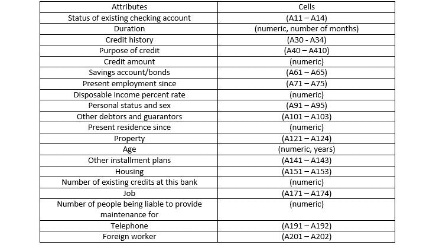
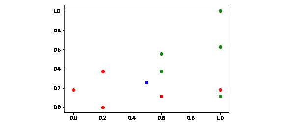
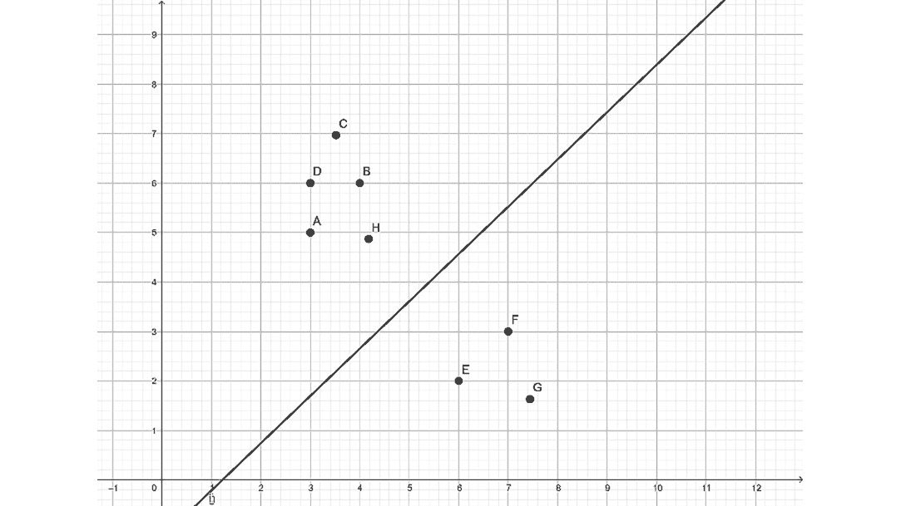
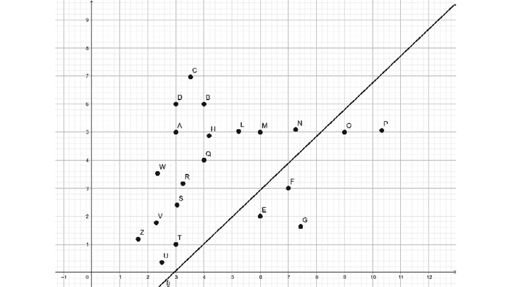
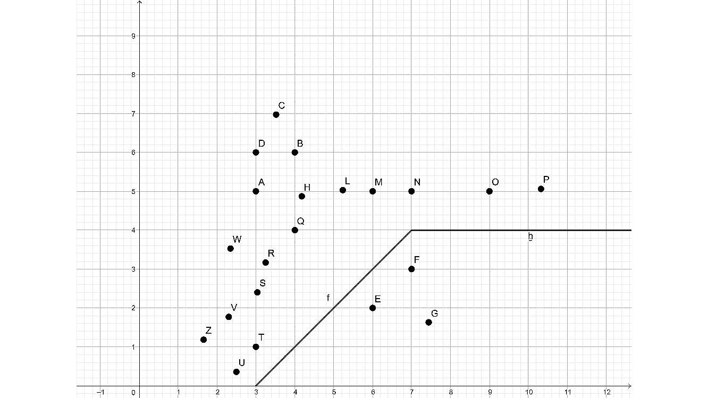

# 第四章：分类

## 学习目标

到本章结束时，你将能够：

+   描述分类的基本概念

+   加载和预处理用于分类的数据

+   实现 k-最近邻和支持向量机分类器

本章将重点关注分类的目标，并学习 k-最近邻和支持向量机。

4

## 简介

在本章中，我们将学习关于分类器的内容，特别是 k-最近邻分类器和支持向量机。我们将使用这种分类来对数据进行分类。就像我们对回归所做的那样，我们将基于训练数据构建一个分类器，并使用测试数据来测试我们分类器的性能。

## 分类基础

当回归关注于创建一个最佳拟合我们数据的模型以预测未来时，分类则是关于创建一个将我们的数据分离成不同类别的模型。

假设你有一些属于不同类别的数据，分类可以帮助你预测新数据点所属的类别。分类器是一个模型，它确定域中任何数据点的标签值。假设你有一组点，`P = {p1, p2, p3, ..., pm}`，以及另一组点，`Q = {q1, q2, q3, ..., qn}`。你将这些点视为不同类别的成员。为了简单起见，我们可以想象 `P` 包含值得信赖的个人，而 `Q` 包含在信用还款倾向方面有风险的个人。

你可以将状态空间划分为所有点都在 `P` 的一个状态空间簇中，然后与包含 `Q` 中所有点的状态空间簇不相交。一旦你找到了这些被称为**簇**的边界空间，你就在状态空间内成功执行了**聚类**。

假设我们有一个点 `x`，它不等于任何前面的点。点 `x` 属于簇 `P` 还是簇 `Q`？这个问题的答案是一个**分类练习**，因为我们正在对点 `x` 进行分类。

分类通常由邻近性决定。点 `x` 越接近簇 `P` 中的点，它属于簇 `P` 的可能性就越大。这是最近邻分类背后的理念。在 k-最近邻分类的情况下，我们找到点 `x` 的 k 个最近邻，并根据来自同一类的最近邻的最大数量对其进行分类。除了 k-最近邻，我们还将使用支持向量机进行分类。在本章中，我们将详细介绍这种信用评分方法。

我们可以自己组装随机虚拟数据，或者我们可以选择使用包含数百个数据点的在线数据集。为了使这次学习体验尽可能真实，我们将选择后者。让我们继续进行一个练习，让我们下载一些我们可以用于分类的数据。下载机器学习数据集的一个流行地方是 [`archive.ics.uci.edu/ml/datasets.html`](https://archive.ics.uci.edu/ml/datasets.html) 。您可以在信用批准方面找到五个不同的数据集。现在我们将加载德国信用批准的数据集，因为 1,000 个数据点的规模非常适合示例，并且其文档是可用的。

**german** 数据集以 CSV 格式提供

CSV 代表逗号分隔值。CSV 文件是一个简单的文本文件，其中文件的每一行都包含数据集中的数据点。数据点的属性以固定顺序给出，由分隔符字符（如逗号）分隔。这个字符可能不会出现在数据中，否则我们就不知道分隔符字符是数据的一部分还是作为分隔符。尽管逗号分隔值这个名字暗示分隔符字符是逗号，但这并不总是如此。例如，在我们的例子中，分隔符字符是空格。CSV 文件在许多应用程序中使用，包括 Excel。CSV 是不同应用程序之间一个非常简洁的接口。

### 练习 10：加载数据集

1.  访问 [`archive.ics.uci.edu/ml/datasets/Statlog+%28German+Credit+Data%29`](https://archive.ics.uci.edu/ml/datasets/Statlog+%28German+Credit+Data%29) 。数据文件位于 [`archive.ics.uci.edu/ml/machine-learning-databases/statlog/german/`](https://archive.ics.uci.edu/ml/machine-learning-databases/statlog/german/) 。

    从空格分隔的 `german.data` 文件加载数据。确保您为 DataFrame 添加标题，这样您就可以通过名称而不是列号来引用您的特征和标签。

    将 `german.data` 文件保存在本地。将标题数据插入到您的 CSV 文件中。

    数据集的前几行如下：

    ```py
    A11 6 A34 A43 1169 A65 A75 4 A93 A101 4 A121 67 A143 A152 2 A173 1 A192 A201 1
    A12 48 A32 A43 5951 A61 A73 2 A92 A101 2 A121 22 A143 A152 1 A173 1 A191 A201 2
    A14 12 A34 A46 2096 A61 A74 2 A93 A101 3 A121 49 A143 A152 1 A172 2 A191 A201 1
    ```

    解释这些数据的说明在 `german.doc` 文件中，您可以查看属性列表。这些属性包括：现有支票账户状态（A11 – A14）、期限（数值，月数）、信用历史（A30 - A34）、信用目的（A40 – A410）、信用金额（数值）、储蓄账户/债券（A61 – A65）、自就业以来（A71 – A75）、可支配收入百分比（数值）、个人状况和性别（A91 – A95）、其他债务人担保人（A101 – A103）、自居住以来（数值）、财产（A121 – A124）、年龄（数值，年）、其他分期付款计划（A141 – A143）、住房（A151 – A153）、在本银行现有信用数量、工作（A171 – A174）、需要提供赡养费的人数（数值）、电话（A191 – A192）和外国工人（A201 – A202）。

    分类结果如下：`1 表示良好债务人，而 2 表示不良债务人`。

    我们的任务是确定如何将二十个输入变量的状态空间分为两个簇：良好债务人和不良债务人。

1.  我们将使用 pandas 库来加载数据。不过，在加载数据之前，我建议在`german.data`文件中添加一个标题。在第一行之前插入以下标题行：

    ```py
    CheckingAccountStatus DurationMonths CreditHistory CreditPurpose CreditAmount SavingsAccount EmploymentSince DisposableIncomePercent PersonalStatusSex OtherDebtors PresentResidenceMonths Property Age OtherInstallmentPlans Housing NumberOfExistingCreditsInBank Job LiabilityNumberOfPeople Phone ForeignWorker CreditScore
    ```

    注意，前面的标题只有一行，这意味着直到第 21 个标签`CreditScore`的末尾都没有换行符。

    #### 注意

    标题很有帮助，因为 pandas 可以将第一行解释为列名。实际上，这是 pandas 的`read_csv`方法的默认行为。`.csv`文件的第一行将是标题，其余行是实际数据。

    让我们使用`pandas.read_csv`方法导入 CSV 数据：

    ```py
    import pandas
    data_frame = pandas.read_csv('german.data', sep=' ')
    ```

1.  `read_csv`的第一个参数是文件路径。例如，如果你将其保存在 Windows PC 的 E 驱动器上，你也可以在那里写一个绝对路径：*e:\german.data*。



###### 图 4.1：显示各自单元格中属性列表的表格

让我们看看数据的格式。`data_frame.head()`调用打印 CSV 文件的前五行，由 pandas DataFrame 结构化：

```py
data_frame.head()
```

输出将如下所示：

```py
  CheckingAccountStatus DurationMonths CreditHistory CreditPurpose \
0                 A11             6         A34         A43
..
4                 A11             24         A33         A40
   CreditAmount SavingsAccount EmploymentSince DisposableIncomePercent \
0         1169            A65             A75                        4
..
4         4870            A61             A73                        3
  PersonalStatusSex OtherDebtors     ...     Property Age \
0             A93         A101     ...         A121 67
..
4             A93         A101     ...         A124 53
   OtherInstallmentPlans Housing NumberOfExistingCreditsInBank Job \
0                 A143    A152                             2 A173
..
4                 A143    A153                             2 A173
  LiabilityNumberOfPeople Phone ForeignWorker CreditScore
0                     1 A192         A201         1
..
4                     2 A191         A201         2
[5 rows x 21 columns]
```

我们已经成功将数据加载到 DataFrame 中。

### 数据预处理

在构建分类器之前，我们最好将我们的数据格式化，以便我们可以以最适合分类的格式保留相关数据，并删除我们不感兴趣的所有数据。

1. **替换或删除值**

例如，如果数据集中有`N/A`（或`NA`）值，我们可能更愿意用我们可以处理的数值替换这些值。NA 代表不可用。我们可能选择忽略包含 NA 值的行，或者用异常值替换它们。异常值是一个像-1,000,000 这样的值，它明显不同于数据集中的常规值。DataFrame 的 replace 方法就是这样进行替换的。用异常值替换 NA 值看起来如下：

```py
data_frame.replace('NA', -1000000, inplace=True)
```

replace 方法将所有 NA 值更改为数值。

这个数值应该远远超出 DataFrame 中任何合理的值。减去一百万被分类器识别为异常，假设那里只有正值。

用极端值替换不可用数据的替代方法是删除包含不可用数据的行：

```py
data_frame.dropna(0, inplace=True)
```

第一个参数指定我们删除行，而不是列。第二个参数指定我们执行删除操作，而不克隆 DataFrame。删除 NA 值不太理想，因为你通常会丢失数据集的一部分。

2. **删除列**

如果有一列我们不希望包含在分类中，我们最好将其删除。否则，分类器可能会在完全没有相关性的地方检测到虚假模式。例如，你的电话号码本身与你的信用评分几乎不可能相关。它是一个 9 到 12 位的数字，可能会很容易地向分类器提供大量噪声。因此，我们删除电话列。

```py
data_frame.drop(['Phone'], 1, inplace=True)
```

第二个参数表示我们删除的是列，而不是行。第一个参数是我们想要删除的列的枚举。`inplace` 参数是为了让调用修改原始 DataFrame。

3. **转换数据**

通常，我们处理的数据格式并不总是最适合分类过程。我们可能出于多个原因想要将我们的数据转换成不同的格式，例如以下原因：

+   为了突出我们感兴趣的数据方面（例如，Minmax 缩放或归一化）

+   为了删除我们不感兴趣的数据方面（例如，二值化）

+   标签编码

**Minmax 缩放**可以通过 scikit 预处理工具的 `MinMaxScaler` 方法执行：

```py
from sklearn import preprocessing
data = np.array([
    [19, 65],
    [4, 52],
    [2, 33]
])
preprocessing.MinMaxScaler(feature_range=(0,1)).fit_transform(data)
```

输出结果如下：

```py
 array([[1\.        , 1\.        ],
     [0.11764706, 0.59375 ],
     [0\.        , 0\.        ]])
```

`MinMaxScaler` 将数据中的每一列缩放，使得列中的最小数变为 0，最大数变为 1，而介于两者之间的所有值按比例缩放到 0 和 1 之间。

**二值化**根据条件将数据转换为 1 和 0：

```py
preprocessing.Binarizer(threshold=10).transform(data)
array([[1, 1],
     [0, 1],
     [0, 1]])
```

**标签编码**对于准备你的特征以便 scikit-learn 处理非常重要。虽然你的某些特征是字符串标签，但 scikit-learn 预期这些数据是数字。

这就是 scikit-learn 预处理库发挥作用的地方。

#### 注意

你可能已经注意到，在信用评分示例中，有两个数据文件。一个包含字符串形式的标签，另一个是整数形式。我故意让你用字符串标签加载数据，这样你就可以获得一些使用标签编码器正确预处理数据的经验。

标签编码不是什么高深的技术。它创建了一个字符串标签和数值之间的映射，这样我们就可以向 scikit-learn 提供数字：

```py
from sklearn import preprocessing
labels = ['Monday', 'Tuesday', 'Wednesday', 'Thursday', 'Friday']
label_encoder = preprocessing.LabelEncoder()
label_encoder.fit(labels)
```

让我们列举编码方式：

```py
[x for x in enumerate(label_encoder.classes_)]
```

输出结果如下：

```py
[(0, 'Friday'),
 (1, 'Monday'),
 (2, 'Thursday'),
 (3, 'Tuesday'),
 (4, 'Wednesday')]
```

我们可以使用编码器来转换值：

```py
encoded_values = label_encoder.transform(['Wednesday', 'Friday'])
```

输出结果如下：

```py
 array([4, 0], dtype=int64)
```

将编码值转换回标签的反向转换是通过 `inverse_transform` 函数执行的：

```py
label_encoder.inverse_transform([0, 4])
```

输出结果如下：

```py
 array(['Wednesday', 'Friday'], dtype='<U9')
```

### 练习 11：数据预处理

在这个练习中，我们将使用 pandas 数据集。

1.  从[`github.com/TrainingByPackt/Artificial-Intelligence-and-Machine-Learning-Fundamentals/blob/master/Lesson04/Exercise%2011%20Pre-processing%20Data/ks-projects-201801.csv`](https://github.com/TrainingByPackt/Artificial-Intelligence-and-Machine-Learning-Fundamentals/blob/master/Lesson04/Exercise%2011%20Pre-processing%20Data/ks-projects-201801.csv)加载 2017-2018 年 1 月 Kickstarter 项目的 CSV 数据，并在加载的数据上应用预处理步骤。

    #### 注意

    注意，你需要一个有效的互联网连接才能完成这个练习。

1.  如果你打开文件，你会看到你不需要麻烦地添加标题，因为它包含在 CSV 文件中：

    ```py
    ID,name,category,main_category,currency,deadline,goal,launched,pledged,state,backers,country,usd pledged,usd_pledged_real,usd_goal_real
    ```

1.  导入数据并使用 pandas 创建 DataFrame：

    ```py
    import pandas
    data_frame = pandas.read_csv('ks-projects-201801.csv', sep=',')
    data_frame.head()
    ```

1.  之前的命令打印了属于数据集的前五个条目。我们可以看到每个列的名称和格式。现在我们有了数据，是时候进行一些预处理步骤了。

1.  假设数据集中有一些 NA 或 N/A 值。你可以用以下`replace`操作来替换它们：

    ```py
       data_frame.replace('NA', -1000000, inplace=True)
       data_frame.replace('N/A', -1000000, inplace=True)
    ```

1.  在执行分类或回归时，保留 ID 列只会带来麻烦。在大多数情况下，ID 与最终结果不相关。因此，删除 ID 列是有意义的：

    ```py
    data_frame.drop(['ID'], 1, inplace=True)
    ```

1.  假设我们只对项目是否有支持者感兴趣。这是一个二值化的完美案例：

    ```py
    from sklearn import preprocessing
    preprocessing.Binarizer(threshold=1).transform([data_frame['backers']])
    ```

1.  输出将如下所示：

    ```py
     array([[0, 1, 1, ..., 0, 1, 1]], dtype=int64)
    ```

    #### 注意

    我们正在丢弃生成的二进制数组。为了使用二进制数据，我们必须用它来替换支持者列。为了简单起见，我们将省略这一步。

1.  让我们编码标签，使它们成为可以被分类器解释的数值：

    ```py
    labels = ['AUD', 'CAD', 'CHF', 'DKK', 'EUR', 'GBP', 'HKD', 'JPY', 'MXN', 'NOK', 'NZD', 'SEK', 'SGD', 'USD']
    label_encoder = preprocessing.LabelEncoder()
    label_encoder.fit(labels)
    label_encoder.transform(data_frame['currency'])
    ```

1.  输出将如下所示：

    ```py
     array([ 5, 13, 13, ..., 13, 13, 13], dtype=int64)
    ```

你必须了解文件中可能出现的所有可能的标签。文档负责提供可用的选项。在不太可能的情况下，如果你无法获得文档，你必须从文件中逆向工程可能的值。

一旦返回编码后的数组，就与前一点相同的问题：我们必须利用这些值，通过用这些新值替换 DataFrame 中的`currency`列来使用这些值。

### 目标列的 Minmax 缩放

当介绍 Minmax 缩放时，你看到的是，不是对矩阵中每个向量的值进行缩放，而是对每个向量中每个坐标的值一起缩放。这就是矩阵结构描述数据集的方式。一个向量包含一个数据点的所有属性。当只缩放一个属性时，我们必须转置我们想要缩放的列。

你在*第一章*，*人工智能原理*中学习了 NumPy 的转置操作：

```py
import numpy as np
values_to_scale = np.mat([data_frame['goal']]).transpose()
```

然后，我们必须应用`MinMaxScaler`来缩放转置的值。为了将结果放在一个数组中，我们可以将结果转置回原始形式：

```py
preprocessing
    .MinMaxScaler(feature_range=(0,1))
    .fit_transform(values_to_scale)
    .transpose()
```

输出如下所示：

```py
array([[9.999900e-06, 2.999999e-04, 4.499999e-04, ..., 1.499999e-04, 1.499999e-04, 1.999990e-05]])
```

这些值看起来很奇怪，因为 Kickstarter 上可能有某些目标金额很高，可能使用了七位数。除了线性 Minmax 缩放外，还可以使用幅度和按对数尺度缩放，计算目标价格有多少位数字。这是另一种可能有助于减少分类练习复杂性的转换。

和往常一样，你必须将结果放入 DataFrame 的相应列中，以便使用转换后的值。

我们在这里停止预处理。希望现在对这些不同方法的用法已经清楚，你将能够熟练地使用这些预处理方法。

### 识别特征和标签

与回归类似，在分类中，我们也必须将我们的特征和标签分开。从原始示例继续，我们的特征是所有列，除了最后一列，它包含信用评分的结果。我们唯一的标签是信用评分列。

我们将使用 NumPy 数组来存储我们的特征和标签：

```py
import numpy as np
features = np.array(data_frame.drop(['CreditScore'], 1))
label = np.array(data_frame['CreditScore'])
```

现在我们已经准备好了特征和标签，我们可以使用这些数据来进行交叉验证。

### 使用 scikit-learn 进行交叉验证

关于回归的另一个相关点是，我们可以使用交叉验证来训练和测试我们的模型。这个过程与回归问题的情况完全相同：

```py
from sklearn import model_selection
features_train, features_test, label_train, label_test =
    model_selection.train_test_split(
        features,
        label,
        test_size=0.1
    )
```

`train_test_split`方法会打乱数据，然后将我们的特征和标签分为训练数据集和测试数据集。我们可以指定测试数据集的大小为一个介于`0`和`1`之间的数字。`test_size`为`0.1`表示`10%`的数据将进入测试数据集。

### 活动七：为分类准备信用数据

在本节中，我们将讨论如何为分类器准备数据。我们将使用来自[`archive.ics.uci.edu/ml/machine-learning-databases/statlog/german/`](https://archive.ics.uci.edu/ml/machine-learning-databases/statlog/german/)的`german.data`作为示例，并将准备数据用于训练和测试分类器。确保所有标签都是数值型，并且值已准备好用于分类。使用 80%的数据点作为训练数据：

1.  将[`archive.ics.uci.edu/ml/machine-learning-databases/statlog/german/`](https://archive.ics.uci.edu/ml/machine-learning-databases/statlog/german/)中的`german.data`保存，并在文本编辑器（如 Sublime Text 或 Atom）中打开它。向其中添加标题行。

1.  使用 pandas 导入数据文件，并用异常值替换 NA 值。

1.  执行标签编码。将数据框中的所有标签转换为整数。

1.  将特征与标签分开。我们可以应用我们在理论部分看到的相同方法。

1.  将训练数据和测试数据进行缩放。使用 Scikit 的预处理库中的`MinMaxScaler`。

1.  最后一步是交叉验证。打乱我们的数据，并使用 80%的所有数据用于训练，20%用于测试。

    #### 注意

    本活动的解决方案可在第 276 页找到。

### K 近邻分类器

我们将从第一主题结束的地方继续。我们有训练数据和测试数据，现在是时候准备我们的分类器以执行 k 近邻分类了。在介绍 K 近邻算法后，我们将使用 scikit-learn 进行分类。

### 介绍 K 近邻算法

分类算法的目标是将数据分割，以便我们可以确定哪些数据点属于哪个区域。假设给定了一组分类点。我们的任务是确定新数据点属于哪个类别。

K 近邻分类器接收具有给定特征和标签值的数据点的类别。算法的目标是对数据进行分类。这些数据点包含特征坐标，分类的目标是确定标签值。分类基于邻近性。邻近性定义为欧几里得距离。如果点 `A` 和点 `B` 之间的欧几里得距离短于点 `A` 和点 `C` 之间的欧几里得距离，则点 `A` 比点 `C` 更接近点 `B`。

K 近邻分类器获取数据点的 k 个最近邻居。属于点 A 的标签是点 A 的 k 个最近邻居中最频繁出现的标签值。确定 `K` 的值是一个不明显的问题。显然，如果有两组，例如有信用和无信用，我们需要 `K` 至少为 3，否则，如果 `K=2`，我们很容易在邻居数量上出现平局。然而，一般来说，`K` 的值并不依赖于组数或特征数。

K 近邻的一个特殊情况是当 `K=1` 时。在这种情况下，分类简化为找到一个点的最近邻居。`K=1` 通常比 `K=3` 或更大的结果差得多。

### 距离函数

许多距离度量可以与 k 近邻算法一起工作。现在我们将计算两个数据点的欧几里得距离和曼哈顿距离。欧几里得距离是我们计算平面或三维空间中两点距离的推广。

点 `A = (a1, a2, …, an)` 和点 `B=(b1, b2, …, bn)` 之间的距离是连接这两个点的线段长度：


###### 图 4.2：点 A 和点 B 之间的距离

从技术上讲，当我们只是寻找最近的邻居时，我们不需要计算平方根，因为平方根是一个单调函数。

由于本书将使用欧几里得距离，让我们看看如何使用一个 scikit-learn 函数调用计算多个点的距离。我们必须从 `sklearn.metrics.pairwise` 中导入 `euclidean_distances`。此函数接受两组点，并返回一个矩阵，其中包含每个点与第一组和第二组点的成对距离：

```py
from sklearn.metrics.pairwise import euclidean_distances
points = [[2,3], [3,7], [1,6]]
euclidean_distances([[4,4]], points)
```

输出如下：

```py
array([[2.23606798, 3.16227766, 3.60555128]])
```

例如，点(4,4)和(3,7)的距离大约是 3.162。

我们还可以计算同一集合中点之间的欧几里得距离：

```py
euclidean_distances(points)
array([[0\.        , 4.12310563, 3.16227766],
     [4.12310563, 0\.        , 2.23606798],
     [3.16227766, 2.23606798, 0\.        ]])
```

**曼哈顿/汉明距离**

汉明距离和曼哈顿距离代表相同的公式。

曼哈顿距离依赖于计算数据点坐标差的绝对值：


###### 图 4.3：曼哈顿和汉明距离

欧几里得距离是距离的更准确推广，而曼哈顿距离计算起来稍微容易一些。

### 练习 12：展示 K 最近邻分类器算法

假设我们有一个员工数据列表。我们的特征是每周工作小时数和年薪。我们的标签表示员工是否在我们公司工作超过两年。停留时间用零表示如果少于两年，如果大于或等于两年则用一表示。

我们希望创建一个 3-最近邻分类器，该分类器可以确定员工是否至少在我们公司工作两年。

然后，我们希望使用这个分类器来预测一个每周请求工作 32 小时、年薪 52,000 美元的员工是否会在这家公司工作两年或更长时间。

数据集如下：

```py
employees = [
    [20, 50000, 0],
    [24, 45000, 0],
    [32, 48000, 0],
    [24, 55000, 0],
    [40, 50000, 0],
    [40, 62000, 1],
    [40, 48000, 1],
    [32, 55000, 1],
    [40, 72000, 1],
    [32, 60000, 1]
]
```

1.  缩放特征：

    ```py
    import matplotlib.pyplot as plot
    from sklearn import preprocessing
    import numpy as np
    from sklearn.preprocessing import MinMaxScaler
    scaled_employees = preprocessing.MinMaxScaler(feature_range=(0,1))
        .fit_transform(employees)
    ```

    缩放后的结果如下：

    ```py
    array([[0\.        , 0.18518519, 0\.        ],
         [0.2     , 0\.        , 0\.        ],
         [0.6     , 0.11111111, 0\.        ],
         [0.2     , 0.37037037, 0\.        ],
         [1\.        , 0.18518519, 0\.        ],
         [1\.        , 0.62962963, 1\.        ],
         [1\.        , 0.11111111, 1\.        ],
         [0.6     , 0.37037037, 1\.        ],
         [1\.        , 1\.        , 1\.        ],
         [0.6     , 0.55555556, 1\.        ]])
    ```

    在这个阶段，将我们请求的员工进行缩放也是有意义的：*[32, 52000]*变为*[ (32-24)/(40 - 24), (52000-45000)/(72000 - 45000)] = [0.5, 0.25925925925925924]*。

1.  在二维平面上绘制这些点，使得前两个坐标代表平面上的一个点，第三个坐标确定点的颜色：

    ```py
    import matplotlib.pyplot as plot
    [&#9;
        plot.scatter(x[0], x[1], color = 'g' if x[2] > 0.5 else 'r')
        for x in scaled_employees
    ] + [plot.scatter(0.5, 0.25925925925925924, color='b')]
    ```

    输出如下：

    

    ###### 图 4.4：在二维平面上绘制的点

1.  要计算蓝色点与其他所有点的距离，我们将应用来自*第一章，人工智能原理*的转置函数。如果我们转置`scaledEmployee`矩阵，我们得到三个包含十个元素的数组。特征值在前两个数组中。我们可以简单地使用`[:2]`索引来保留它们。然后，将这个矩阵转置回其原始形式，我们得到特征数据点的数组：

    ```py
    scaled_employee_features = scaled_employees.transpose()[:2].transpose()
    scaled_employee_features
    ```

    输出如下：

    ```py
     array([[0\.        , 0.18518519],
        [0.2     , 0\.        ],
        [0.6     , 0.11111111],
        [0.2     , 0.37037037],
        [1\.        , 0.18518519],
        [1\.        , 0.62962963],
        [1\.        , 0.11111111],
        [0.6     , 0.37037037],
        [1\.        , 1\.        ],
         [0.6     , 0.55555556]])
    ```

1.  使用以下方法计算欧几里得距离：

    ```py
    from sklearn.metrics.pairwise import euclidean_distances
    euclidean_distances(
        [[0.5, 0.25925925925925924]],
        scaled_employee_features
    )
    ```

    输出如下：

    ```py
     array([[0.50545719, 0.39650393, 0.17873968, 0.31991511, 0.50545719,
            0.62223325, 0.52148622, 0.14948471, 0.89369841, 0.31271632]])
    ```

最短的距离如下：

+   对于点`[0.6, 0.37037037, 1.]`的`0.14948471`

+   对于点`[0.6, 0.11111111, 0.]`的`0.17873968`

+   对于点`[0.6, 0.55555556, 1.]`的`0.31271632`

由于三个点中有两个标签为 1，我们发现有两个绿色点和一个红色点。这意味着我们的 3-最近邻分类器将新员工分类为更有可能至少工作两年，而不是完全不工作。

#### 注意

虽然，第四个点仅以非常小的差距错过了前三名。事实上，如果存在两个不同颜色的点，它们与目标点的第三小距离相等，我们的算法就会找到平局。在距离的竞争条件下，可能会有平局。但这是一种边缘情况，几乎不会在实际问题中发生。

### 练习 13：scikit-learn 中的 k 近邻分类

1.  将我们的数据分为四个类别：`训练`和`测试`，`特征`和`标签`：

    ```py
    from sklearn import model_selection
    import pandas
    import numpy as np
    from sklearn import preprocessing
    features_train, features_test, label_train, label_test =
    model_selection.train_test_split(
        scaled_features,
        label,
        test_size=0.2
    )
    ```

1.  创建一个 K-近邻分类器来执行此分类：

    ```py
    from sklearn import neighbors
    classifier = neighbors.KNeighborsClassifier()
    classifier.fit(features_train, label_train)
    ```

    由于我们没有提到 K 的值，默认是*5*。

1.  检查我们的分类器在测试数据上的表现如何：

    ```py
    classifier.score(features_test, label_test)
    ```

    输出是`0.665`。

您可能会在其他数据集上找到更高的评分，但超过 20 个特征可能很容易包含一些随机噪声，这使得数据分类变得困难。

### 练习 14：使用 k 近邻分类器进行预测

这段代码是基于之前练习的代码构建的。

1.  我们将创建一个数据点，我们将通过取第 i 个测试数据点的第 i 个元素来对其进行分类：

    ```py
    data_point = [None] * 20
    for i in range(20):
        data_point[i] = features_test[i][i]
    data_point = np.array(data_point)
    ```

1.  我们有一个一维数组。分类器期望一个包含数据点数组的数组。因此，我们必须将我们的数据点重塑为数据点数组：

    ```py
    data_point = data_point.reshape(1, -1)
    ```

1.  通过这种方式，我们创建了一个完全随机的角色，我们感兴趣的是他们是否被分类为有信用价值：

    ```py
    credit_rating = classifier.predict(data_point)
    ```

    现在，我们可以安全地使用预测来确定数据点的信用评级：

    ```py
    classifier.predict(data_point)
    ```

    输出如下：

    ```py
    array([1], dtype=int64)
    ```

我们已经根据输入数据成功评估了一个新用户。

### scikit-learn 中 k 近邻分类器的参数化

您可以在此处访问 k 近邻分类器的文档：[`scikit-learn.org/stable/modules/generated/sklearn.neighbors.KNeighborsClassifier.html`](http://scikit-learn.org/stable/modules/generated/sklearn.neighbors.KNeighborsClassifier.html)。

分类器的参数化可以微调您分类器的准确性。由于我们还没有学习到所有可能的 k 近邻变体，我们将专注于基于这个主题您已经理解的参数。

**n_neighbors**：这是 k 近邻算法的 k 值。默认值是 5。

**metric**：在创建分类器时，您会看到一个奇怪的名字——“Minkowski”。不要担心这个名字——您已经学过第一和第二阶的 Minkowski 度量。这个度量有一个幂参数。对于*p=1*，Minkowski 度量与曼哈顿度量相同。对于*p=2*，Minkowski 度量与欧几里得度量相同。

*p*：这是 Minkowski 度量的幂。默认值是 2。

在创建分类器时，您必须指定这些参数：

```py
classifier = neighbors.KNeighborsClassifier(n_neighbors=50)
```

### 活动 8：提高信用评分的准确性

在本节中，我们将学习 k 近邻分类器的参数化如何影响最终结果。信用评分的准确率目前相当低：66.5%。找到一种方法将其提高几个百分点。为确保正确实现，你需要完成之前的练习。

完成这项练习有许多方法。在这个解决方案中，我将向你展示一种提高信用评分的方法，这将通过改变参数化来实现：

1.  将 k 近邻分类器的 k 值从默认的 5 增加到 10、15、25 和 50。

1.  对所有四个`n_neighbors`值运行此分类器并观察结果。

1.  较高的 K 值并不一定意味着更好的分数。然而，在这个例子中，`K=50`比`K=5`得到了更好的结果。

    #### 注意

    本活动的解决方案可在第 280 页找到。

## 支持向量机分类

我们在第三章*回归*中首次使用支持向量机进行回归。在本主题中，你将了解如何使用支持向量机进行分类。一如既往，我们将使用 scikit-learn 在实践中的例子中运行我们的示例。

### 支持向量机分类器是什么？

在 n 维向量空间上定义的支持向量机的目标是找到该 n 维空间中的一个表面，将空间中的数据点分成多个类别。

在二维空间中，这个表面通常是直线。在三维空间中，支持向量机通常找到一个平面。一般来说，支持向量机找到一个超平面。这些表面在优化意义上是最佳的，因为基于机器可用的信息，它优化了 n 维空间的分隔。

支持向量机找到的最佳分隔表面被称为**最佳分隔超平面**。

支持向量机用于找到将两组数据点分开的一个表面。换句话说，支持向量机是**二元分类器**。这并不意味着支持向量机只能用于二元分类。尽管我们只讨论了一个平面，但支持向量机可以通过泛化任务本身来将空间划分为任意数量的类别。

分隔表面在优化意义上是最佳的，因为它最大化了每个数据点到分隔表面的距离。

向量是在具有大小（长度）和方向的 n 维空间上定义的数学结构。在二维空间中，你从原点绘制向量（x, y）到点（x, y）。基于几何学，你可以使用勾股定理计算向量的长度，并通过计算水平轴与向量之间的角度来确定向量的方向。

例如，在二维空间中，向量（3, -4）具有以下长度：

`sqrt( 3 * 3 + 4 * 4 ) = sqrt( 25 ) = 5`

它具有以下方向：

`np.arctan(-4/3) / 2 / np.pi * 360 = -53.13010235415597 度`

### 理解支持向量机

假设有两组点，**红色**和**蓝色**。为了简单起见，我们可以想象一个二维平面，具有两个特征：一个映射在水平轴上，另一个映射在垂直轴上。

支持向量机的目标是找到最佳分离线，将点**A**、**D**、**C**、**B**和**H**与点**E**、**F**和**G**分开：



###### 图 4.5：分离红色和蓝色成员的线

分离并不总是那么明显。例如，如果在 E、F 和 G 之间有一个蓝色点，就没有一条线可以无误差地分离所有点。如果蓝色类中的点围绕红色类中的点形成一个完整的圆，就没有一条直线可以分离这两个集合：



###### 图 4.6：包含两个异常点的图

例如，在前面的图中，我们容忍两个异常点，O 和 P。

在以下解决方案中，我们不容忍异常值，而不是用一条线，我们创建由两条半线组成的最优分离路径：



###### 图 4.7：移除两个异常点的分离图

完美分离所有数据点很少值得投入资源。因此，支持向量机可以被正则化以简化并限制最优分离形状的定义，并允许异常值。

支持向量机的**正则化参数**决定了允许或禁止误分类的错误率。

支持向量机有一个核参数。线性核严格使用线性方程来描述最优分离超平面。多项式核使用多项式，而指数核使用指数表达式来描述超平面。

边距是围绕分离器的区域，由最接近分离器的点界定。平衡边距有来自每个类的点，它们与线的距离相等。

当涉及到定义最优分离超平面的允许错误率时，一个 gamma 参数决定了是否只有靠近分离器的点在确定分离器位置时计数，或者是否连最远离线的点也要计数。gamma 值越高，影响分离器位置的点就越少。

### scikit-learn 中的支持向量机

我们的起点是先前活动的最终结果。一旦我们分割了训练数据和测试数据，我们就可以设置分类器：

```py
features_train, features_test, label_train, label_test = model_selection
    .train_test_split(
        scaled_features,
        label,
        test_size=0.2
    )
```

我们将使用`svm.SVC()`分类器而不是使用 K-最近邻分类器：

```py
from sklearn import svm
classifier = svm.SVC()
classifier.fit(features_train, label_train)
# Let's can check how well our classifier performs on the
# test data:
classifier.score(features_test, label_test)
```

输出是`0.745`。

看起来，scikit-learn 的默认支持向量机分类器比 k 最近邻分类器做得稍微好一些。

### scikit-learn SVM 的参数

以下为 scikit-learn SVM 的参数：

**Kernel**：这是一个字符串或可调用参数，用于指定算法中使用的核。预定义的核有线性、poly、rbf、sigmoid 和预计算。默认值为 rbf。

**Degree**：当使用多项式时，你可以指定多项式的次数。默认值为 3。

**Gamma**：这是 rbf、poly 和 sigmoid 核的系数。默认值为 auto，计算为`number_of_features`的倒数。

**C**：这是一个默认为 1.0 的浮点数，描述了误差项的惩罚参数。

你可以在[`scikit-learn.org/stable/modules/generated/sklearn.svm.SVC.html`](http://scikit-learn.org/stable/modules/generated/sklearn.svm.SVC.html)的参考文档中阅读关于其余参数的内容。

这里是一个 SVM 的例子：

```py
classifier = svm.SVC(kernel="poly", C=2, degree=4, gamma=0.05)
```

### 活动 9：scikit-learn 中的支持向量机优化

在本节中，我们将讨论如何使用支持向量机分类器的不同参数。我们将使用、比较和对比你已学到的不同支持向量回归分类器参数，并找到一组参数，在之前活动中加载和准备的训练和测试数据上获得最高的分类数据。为了确保你能完成这个活动，你需要完成本章的第一个活动。

我们将尝试几种组合。你可能需要选择不同的参数并检查结果：

1.  让我们先选择线性核，并检查分类器的拟合和评分。

1.  完成这些后，选择四次方的多项式核，C=2，gamma=0.05，并检查分类器的拟合和评分。

1.  然后，选择四次方的多项式核，C=2，gamma=0.25，并检查分类器的拟合和评分。

1.  之后，选择四次方的多项式核，C=2，gamma=0.5，并检查分类器的拟合和评分。

1.  选择下一个分类器为 sigmoid 核。

1.  最后，选择默认核，gamma=0.15，并检查分类器的拟合和评分。

    #### 注意

    本活动的解决方案可以在第 280 页找到。

## 摘要

在本章中，我们学习了分类的基础知识。在发现分类的目标、加载数据和格式化数据后，我们发现了两种分类算法：K-最近邻和支持向量机。我们使用基于这两种方法的自定义分类器来预测值。在下一章中，我们将使用树进行预测分析。
