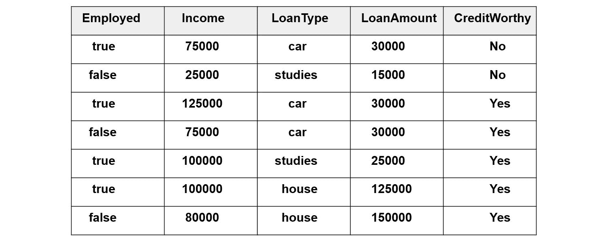
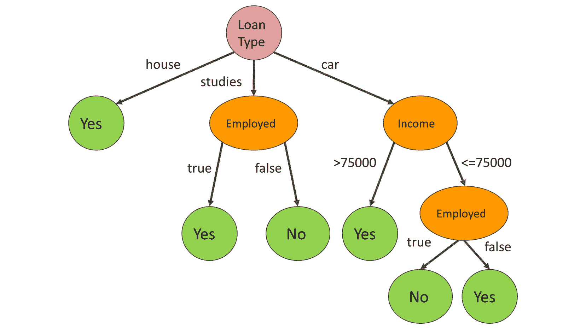
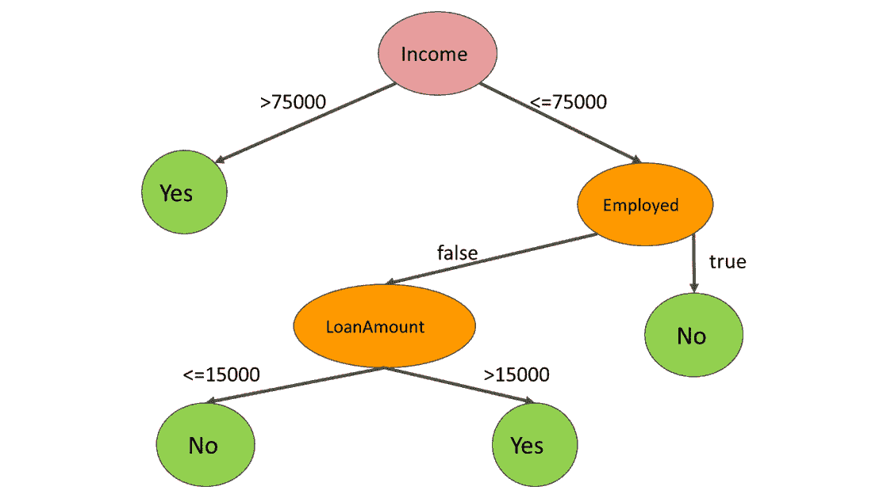

# 第五章：使用树进行预测分析

## 学习目标

到本章结束时，你将能够：

+   理解用于评估数据模型效用度的指标

+   根据决策树对数据点进行分类

+   根据随机森林算法对数据点进行分类

在本章中，我们将详细介绍两种监督学习算法。第一个算法将帮助我们使用决策树对数据点进行分类，而另一个算法将帮助我们使用随机森林进行分类。

## 决策树简介

在决策树中，我们在训练数据中有输入和相应的输出。决策树，就像任何树一样，有叶子、分支和节点。叶子是像是是或否的终端节点。节点是做出决策的地方。决策树由我们用来对数据点的预测做出决策的规则组成。

决策树的每个节点代表一个特征，每个从内部节点出来的边代表树的可能值或可能值的区间。树的每个叶子代表树的标签值。

如我们在前几章所学，数据点有特征和标签。决策树的任务是根据固定规则预测标签值。规则来自观察训练数据上的模式。

让我们考虑一个确定标签值的例子

假设以下训练数据集给出。制定规则以帮助你确定标签值：



###### 图 5.1：制定规则的数据库

在这个例子中，我们根据四个特征预测标签值。为了设置决策树，我们必须对可用数据进行观察。基于我们可用的数据，我们可以得出以下结论：

+   所有房屋贷款都被认定为有信用资格。

+   只要债务人就业，助学贷款就有信用资格。如果债务人没有就业，他就/她没有信用资格。

+   年收入超过 75,000 元的贷款有信用资格。

+   在 75,000 元/年或以下，如果债务人没有就业，汽车贷款就有信用资格。

根据我们考虑这些规则的顺序，我们可以构建一棵树并描述一种可能的信用评分方式。例如，以下树映射了前面的四个规则：



###### 图 5.2：贷款类型的决策树

我们首先确定贷款类型。根据第一条规则，房屋贷款自动具有信用资格。助学贷款由第二条规则描述，导致包含另一个关于就业决策的子树。因为我们已经涵盖了房屋和助学贷款，只剩下汽车贷款。第三条规则描述了收入决策，而第四条规则描述了就业决策。

每当我们需要评分一个新债务人以确定他/她是否有信用资格时，我们必须从决策树顶部到底部进行遍历，并观察底部的真或假值。

显然，基于七个数据点的模型非常不准确，因为我们可以概括出一些根本不符合现实的规则。因此，规则通常是基于大量数据确定的。

这不是创建决策树的唯一方法。我们也可以根据其他规则的序列构建决策树。让我们从图 5.1 中的数据集中提取一些其他规则。

**观察 1**：注意，严格大于 75,000 的个体工资都是有信用资格的。这意味着我们可以用一个决策将七个数据点中的四个进行分类。

**规则 1**：收入`> 75,000` => 有信用资格`is true`。

**规则 1**将七个数据点中的四个进行了分类；我们需要为剩下的三个数据点制定更多规则。

**观察 2**：在剩下的三个数据点中，有两个不是有工作的。有一个是有工作但无信用资格的。通过一个模糊的概括，我们可以提出以下规则：

**规则 2**：假设收入`<= 75,000`，以下成立：有工作`== true` => 有信用资格`is false`。

前两条规则对五个数据点进行了分类。只剩下两个数据点。我们知道他们的收入小于或等于 75,000，并且他们都没有工作。尽管如此，他们之间还是有一些差异：

+   有信用资格的人收入为 75,000，而没有信用资格的人收入为 25,000。

+   有信用资格的人借了汽车贷款，而没有信用资格的人借了学习贷款。

+   有信用资格的人借了 30,000 元，而没有信用资格的人借了 15,000 元。

这些差异中的任何一个都可以提取成规则。对于离散的范围，如汽车、学习和房屋，规则是一个简单的成员资格检查。在连续范围的情况下，如工资和贷款金额，我们需要确定一个范围来分支。

假设我们选择了贷款金额作为我们的第三条规则的依据。

**规则 3**：

假设`Income <= 75,000`和`Employed == false`，

如果`LoanAmount <= AMOUNT`

然后`CreditWorthy`为`false`。

否则`CreditWorthy`为`true`。

第一行描述了导致这个决策的路径。第二行制定了条件，最后两行描述了结果。

注意，规则中有一个恒定的数量。这个数量应该是多少？

答案是，在 15,000 <= AMOUNT < 30,000 的范围内，任何数字都是可以的。我们可以自由选择任何数字。在这个例子中，我们选择了范围的低端：



###### 图 5.3：收入决策树

第二个决策树更简单。同时，我们不能忽视模型所说的，“较高的贷款金额比较低的贷款金额更有可能被偿还。”同样，我们也无法忽视这样一个事实，即收入较低的有工作的人从未偿还过他们的贷款。不幸的是，可用的训练数据不足，这使得我们最终得出错误结论的可能性很大。

在决策树中，基于少量数据点做出决策时，过拟合是一个常见问题。这个决策很少具有代表性。

由于我们可以在任何可能的顺序中构建决策树，因此定义算法构建决策树所需的方式是有意义的。因此，我们现在将探索一个用于在决策过程中最优排序特征的良好度量。

### 熵

在信息论中，熵衡量一个属性的可能的值分布的随机性。随机性程度越高，属性的熵就越高。

熵是事件最高可能性。如果我们事先知道结果将会是什么，那么事件就没有随机性。因此，熵为零。

在测量要分类的系统的熵时，我们测量标签的熵。

熵被定义为如下：

+   `[v1, v2, ..., vn]` 是一个属性的可能的值

+   `[p1, p2, ..., pn]` 是这些值对于该属性的假设概率，假设这些值是均匀分布的

+   `p1 + p2 + ... + pn = 1` 

###### 图 5.4：熵公式

在信息论中，熵的符号是 H。不是因为熵与 h 声音有什么关系，而是因为 H 是大写希腊字母 eta 的符号。Eta 是熵的符号。

#### 注意

我们使用熵对决策树中的节点进行排序，因为熵越低，其值的分布就越不随机。分布中的随机性越少，确定标签值的可能性就越大。

要在 Python 中计算分布的熵，我们必须使用 NumPy 库：

```py
import numpy as np
distribution = list(range(1,4))
minus_distribution = [-x for x in distribution]
log_distribution = [x for x in map(np.log2,distribution)]
entropy_value = np.dot(minus_distribution, log_distribution)
```

分布以 NumPy 数组或常规列表的形式给出。在第 2 行，你必须将你自己的分布 `[p1, p2, …, pn]` 插入其中。

我们需要创建一个包含第 3 行分布的负值的向量。

在第 4 行，我们必须对分布列表中的每个值取以 2 为底的对数

最后，我们通过标量积（也称为两个向量的点积）来计算总和。

让我们将前面的计算以函数的形式定义：

```py
def entropy(distribution):
    minus_distribution = [-x for x in distribution]
    log_distribution = [x for x in map(np.log2, distribution)]
    return np.dot(minus_distribution, log_distribution)
```

#### 注意

你首先在 *第三章* ，*回归* 中了解了点积。两个向量的点积是通过将第一个向量的第 i 个坐标乘以第二个向量的第 i 个坐标来计算的，对于每个 i。一旦我们有了所有的乘积，我们求和这些值：

`np.dot([1, 2, 3], [4, 5, 6]) # 1*4 + 2*5 + 3*6 = 32`

### 练习 15：计算熵

计算数据集 *图 5.1* 中特征的熵。

我们将为所有特征计算熵。

1.  我们有四个特征：**Employed**，**Income**，**LoanType**，和 **LoanAmount**。为了简单起见，我们现在将 **Income** 和 **LoanAmount** 中的值视为离散值。

1.  下表是 **Employed** 的值分布：

    `true 4/7 times`

    `false 3/7 times`

1.  让我们使用熵函数来计算 Employed 列的熵：

    ```py
    H_employed = entropy([4/7, 3/7])
    ```

    输出结果是 `0.9852`。

1.  以下是对 **Income** 的值分布：

    `25,000 1/7 次`

    `75,000 2/7 次`

    `80,000 1/7 次`

    `100,000 2/7 次`

    `125,000 1/7 次`

1.  让我们使用熵函数来计算 Income 列的熵：

    ```py
    H_income = entropy([1/7, 2/7, 1/7, 2/7, 1/7])
    ```

    输出结果是 `2.2359`。

1.  以下是对 **LoanType** 的值分布：

    `car 3/7 次`

    `studies 2/7 次`

    `house 2/7 次`

1.  让我们使用熵函数来计算 LoanType 列的熵：

    ```py
    H_loanType = entropy([3/7, 2/7, 2/7])
    ```

    输出结果是 `1.5567`。

1.  以下是对 **LoanAmount** 的值分布：

    `15,000 1/7 次`

    `25,000 1/7 次`

    `30,000 3/7 次`

    `125,000 1/7 次`

    `150,000 1/7 次`

1.  让我们使用熵函数来计算 LoanAmount 列的熵：

    ```py
    H_LoanAmount = entropy([1/7, 1/7, 3/7, 1/7, 1/7])
    ```

    输出结果是 `2.1281`。

1.  如您所见，分布越接近均匀分布，熵就越高。

1.  在这个练习中，我们有点作弊，因为这些不是我们将用于构建树的熵。在两个树中，我们都有像“大于 75,000”这样的条件。因此，我们将计算我们在原始树中使用的决策点的熵。

1.  以下是对 **Income>75000** 的值分布：

    `true 4/7 次`

    `false 3/7 次`

1.  让我们使用熵函数来计算 Income>75,000 列的熵：

    ```py
    H_incomeMoreThan75K = entropy([4/7, 3/7])
    ```

    输出结果是 `0.9852`。

1.  以下是对 **LoanAmount>15000** 的值分布：

    `true 6/7 次`

    `false 1/7 次`

1.  让我们使用熵函数来计算 **LoanAmount** 的熵：

    >15,000 列：

    ```py
    H_loanMoreThan15K = entropy([6/7, 1/7])
    ```

    输出结果是 `0.5917`。

直观地说，分布 [1] 是最确定的分布。这是因为我们知道一个事实，即特征值保持固定的概率是 100%。

`H([1]) = 1 * np.log2( 1 ) # 1*0 =0`

我们可以得出结论，分布的熵是严格非负的。

### 信息增益

当我们根据属性的值划分数据集中的数据点时，我们降低了系统的熵。

要描述信息增益，我们可以计算标签的分布。最初，在我们的数据集中有五个有信用和两个无信用的人。初始分布的熵如下：

```py
H_label = entropy([5/7, 2/7])
0.863120568566631
```

让我们看看如果我们根据贷款金额是否大于 15,000 来划分数据集会发生什么。

+   在第 1 组中，我们得到一个属于 15,000 贷款金额的数据点。这个数据点无信用。

+   在第 2 组中，我们有 5 个有信用和 1 个无信用的人。

每个组中标签的熵如下：

```py
H_group1 = entropy([1]) #0
H_group2 = entropy([5/6, 1/6]) #0.65
```

要计算信息增益，让我们计算组熵的加权平均值：

```py
H_group1 * 1/7 + H_group2 * 6/7 #0.55
Information_gain = 0.8631 – 0.5572 #0.30
```

在创建决策树时，在每个节点上，我们的任务是使用最大化信息增益的规则来划分数据集。

我们也可以使用 Gini 不纯度代替基于熵的信息增益来构建决策树的最佳分割规则。

### Gini 不纯度

除了熵之外，还有一个广泛使用的指标可以用来衡量分布的随机性：Gini 不纯度。

Gini 不纯度定义为如下：


###### 图 5.5：Gini 不纯度

对于两个变量，Gini 不纯度为：


###### 图 5.6：两个变量的 Gini 不纯度

由于使用了对数，熵的计算可能稍微慢一些。另一方面，在衡量随机性方面，Gini 不纯度不够精确。

#### 注意

信息增益与熵或 Gini 不纯度哪一个更适合创建决策树？

有些人更喜欢 Gini 不纯度，因为不需要计算对数。从计算的角度来看，这些解决方案都不特别复杂，因此两者都可以使用。在性能方面，以下研究得出结论，这两个指标之间通常只有微小的差异：[`www.unine.ch/files/live/sites/imi/files/shared/documents/papers/Gini_index_fulltext.pdf`](https://www.unine.ch/files/live/sites/imi/files/shared/documents/papers/Gini_index_fulltext.pdf)。

我们已经了解到我们可以根据信息增益或 Gini 不纯度来优化决策树。不幸的是，这些指标仅适用于离散值。如果标签定义在连续区间，比如价格范围或薪资范围，怎么办呢？

我们必须使用其他指标。从技术上讲，你可以理解基于连续标签创建决策树的想法，这涉及到回归。我们可以从本章重用的指标是均方误差。我们不仅要最小化 Gini 不纯度或信息增益，还要最小化均方误差来优化决策树。由于这是一本入门书籍，我们将省略此指标。

### 退出条件

我们可以根据规则值连续分割数据点，直到决策树的每个叶子节点熵为零。问题是这种最终状态是否可取。

通常，这种状态并不理想，因为我们可能会过度拟合模型。当我们的模型规则过于具体和过于挑剔，并且决策所依据的样本量太小，我们可能会得出错误的结论，从而在数据集中识别出在现实生活中并不存在的模式。

例如，如果我们旋转轮盘三次，得到 12、25、12，得出每次奇数次旋转的结果都是 12 的结论，这不是一个明智的策略。通过假设每次奇数次旋转等于 12，我们发现了一个仅由随机噪声产生的规则。

因此，对我们可以分割的数据集的最小大小的限制是一个在实践中效果很好的退出条件。例如，如果你在数据集大小低于 50、100、200 或 500 时停止分割，你就可以避免在随机噪声上得出结论，从而最小化模型过拟合的风险。

另一个流行的退出条件是对树深度的最大限制。一旦我们达到固定的树深度，我们就在叶子节点上对数据点进行分类。

### 使用 scikit-learn 构建决策树分类器

我们已经学习了如何从`.csv`文件加载数据，如何对数据进行预处理，以及如何将数据分割成训练集和测试集。如果你需要复习这方面的知识，请回到前面的章节，在那里你会在回归和分类的上下文中进行这个过程。

现在，我们将假设一组训练特征、训练标签、测试特征和测试标签作为 scikit-learn train-test-split 调用的返回值。

注意，在 scikit-learn 的旧版本中，你必须导入 cross_validation 而不是 model selection：

```py
features_train, features_test, label_train, label_test =
    model_selection.train_test_split(
        features,
        label,
        test_size=0.1
    )
```

我们不会关注我们如何得到这些数据点，因为过程与回归和分类的情况完全相同。

是时候导入并使用 scikit-learn 的决策树分类器了：

```py
from sklearn.tree import DecisionTreeClassifier
decision_tree = DecisionTreeClassifier(max_depth=6)
decision_tree.fit( features_train, label_train )
```

我们在`DecisionTreeClassifier`中设置了一个可选参数，即`max_depth`，以限制决策树的深度。你可以阅读官方文档以获取参数的完整列表：[`scikit-learn.org/stable/modules/generated/sklearn.tree.DecisionTreeClassifier.html`](http://scikit-learn.org/stable/modules/generated/sklearn.tree.DecisionTreeClassifier.html)。一些更重要的参数如下：

+   **criterion**：Gini 代表基尼不纯度，而 entropy 代表信息增益。

+   **max_depth**：这是树的最大深度。

+   **min_samples_split**：这是分割内部节点所需的最小样本数。

你还可以在文档中列举的所有其他参数上进行实验。我们将在本主题中省略它们。

模型构建完成后，我们可以使用决策树分类器来预测数据：

```py
decision_tree.predict(features_test)
```

你将在本主题末尾的活动构建一个决策树分类器。

### 评估分类器的性能

在分割训练和测试数据后，决策树模型有一个`score`方法来评估测试数据被模型分类得有多好。我们已经在第三章和第四章中学习了如何使用`score`方法：

```py
decision_tree.score(features_test, label_test)
```

`score`方法的返回值是一个小于或等于 1 的数字。我们越接近 1，我们的模型就越好。

现在，我们将学习另一种评估模型的方法。你也可以在上一章中构建的模型上使用这种方法。

假设我们有一个测试特征和一个测试标签：

```py
# testLabel denotes the test label
predicted_label = decision_tree.predict(testFeature)
```

假设我们正在调查一个标签值，positiveValue。

我们将使用以下定义来定义一些指标，帮助您评估您的分类器有多好：

+   **定义（真正阳性）**：`positiveValue == predictedLabel == testLabel`

+   **定义（真正阴性）**：`positiveValue != predictedLabel == testLabel`

+   **定义（假阳性）**：`positiveValue == predictedLabel != testLabel`

+   **定义（假阴性）**：`positiveValue != predictedLabel != testLabel`

假阳性是指预测结果等于正值，但测试数据中的实际标签并不等于这个正值。例如，在技术面试中，假阳性是指一个能力不足的软件开发者因为表现得很令人信服而被录用，隐藏了他完全缺乏的能力。

不要将假阳性与假阴性混淆。使用技术面试的例子，假阴性是指一个有能力完成工作的软件开发者，但他没有得到录用。

使用前面的四个定义，我们可以定义三个指标来描述我们的模型如何预测现实。符号 #( X ) 表示 X 中值的数量。使用技术术语，#( X ) 表示 X 的基数：

**定义（精度）**：

`#( 真正值 ) / (#( 真正值 ) + #( 假阳性值 ))`

**定义（召回率）：**

`#( 真正值 ) / (#( 真正值 ) + #( 假阴性值 ))`

精度关注的是我们的分类器找到的正值。其中一些结果是真正的正值，而其他结果是假阳性。高精度意味着与真正的正值相比，假阳性结果的数量非常低。这意味着一个精确的分类器在寻找正值时很少出错。

召回率关注的是测试数据中值为正的部分。其中一些结果是由分类器找到的。这些是真正的正值。那些未被分类器找到的正值是假阴性。具有高召回率的分类器能找到大多数正值。

### 练习 16：精度和召回率

找出以下两个分类器的精度和召回率值：

```py
# Classifier 1
TestLabels1 = [True, True, False, True, True]
PredictedLabels1 = [True, False, False, False, False]
# Classifier 2
TestLabels2 = [True, True, False, True, True]
PredictedLabels = [True, True, True, True, True]
```

1.  根据公式，让我们计算分类器 1 中真正的正值、假阳性和假阴性的数量：

    ```py
    TruePositives1 = 1 # both the predicted and test labels are true
    FalsePositives1 = 0 # predicted label is true, test label is false
    FalseNegatives1 = 3 # predicted label is false, test label is true
    Precision1 = TruePositives1 / (TruePositives1 + FalsePositives1)
    Precision1 # 1/1 = 1
    Recall1 = TruePositives1 / (TruePositives1 + FalseNegatives1)
    Recall1 #1/4 = 0.25
    ```

1.  第一个分类器具有出色的精度，但召回率不佳。让我们为第二个分类器计算相同的结果。

    ```py
    TruePositives2 = 4
    FalsePositives2 = 1
    FalseNegatives2 = 0
    Precision2 = TruePositives2 / (TruePositives2 + FalsePositives2) Precision2 #4/5 = 0.8
    Recall2 = TruePositives2 / (TruePositives2 + FalseNegatives2)
    Recall2 # 4/4 = 1
    ```

1.  第二个分类器具有出色的召回率，但其精度并不完美。

1.  F1 分数是精度和召回率的调和平均值。其值介于 0 和 1 之间。F1 分数的优势在于它考虑了假阳性和假阴性。

### 练习 17：计算 F1 分数

计算前一个练习中两个分类器的 F1 分数：

1.  计算 F1 分数的公式如下：

    ```py
    2*Precision*Recall / (Precision + Recall)
    ```

1.  第一个分类器的 F1 分数如下：

    ```py
    2 * 1 * 0.25 / (1 + 0.25) # 0.4
    ```

1.  第二个分类器的 F1 分数如下：

    ```py
    2 * 0.8 * 1 / (0.8 + 1) # 0.888888888888889
    ```

现在我们已经知道了精确率、召回率和 F1 分数的含义，让我们使用 scikit-learn 实用工具来计算并打印这些值：

```py
from sklearn.metrics import classification_report
print(
    classification_report(
        label_test,
        decision_tree.predict(features_test)
    )
)
```

输出结果将如下所示：

```py
             precision    recall f1-score support
          0     0.97     0.97     0.97        36
          1     1.00     1.00     1.00         5
          2     1.00     0.99     1.00     127
          3     0.83     1.00     0.91         5
avg / total     0.99     0.99     0.99     173
```

在这个例子中，有四个可能的标签值，分别用 0、1、2 和 3 表示。在每一行中，你得到属于每个可能标签值的精确率、召回率和 F1 分数值。你还可以在支持列中看到这些标签值在数据集中存在的数量。最后一行包含汇总的精确率、召回率和 f1 分数。

如果你使用标签编码将字符串标签编码为数字，你可能想要执行逆变换以找出哪些行属于哪个标签。在以下示例中，Class 是标签的名称，而 `labelEncoders['Class']` 是属于 Class 标签的标签编码器：

```py
labelEncoders['Class'].inverse_transform([0, 1, 2, 3])
array(['acc', 'good', 'unacc', 'vgood'])
```

如果你更喜欢单独计算精确率、召回率和 F1 分数，你可以使用单独的调用。请注意，在下一个示例中，我们将对每个分数函数调用两次：一次使用 `average=None` ，另一次使用 `average='weighted'` 。

当平均指定为 None 时，我们得到属于每个可能标签值的分数值。如果你将结果与对应列的前四个值进行比较，你可以看到相同的值四舍五入在表中。

当平均指定为加权时，你得到属于分数名称列的单元格值和 avg/total 行：

```py
from sklearn.metrics import recall_score, precision_score, f1_score
label_predicted = decision_tree.predict(features_test)
```

使用无平均计算精确率分数可以这样进行：

```py
precision_score(label_test, label_predicted, average=None)
```

输出结果如下：

```py
 array([0.97222222, 1\.        , 1\.        , 0.83333333])
```

使用加权平均计算精确率分数可以这样进行：

```py
precision_score(label_test, label_predicted, average='weighted')
```

输出结果为 `0.989402697495183` 。

使用无平均计算召回率分数可以这样进行：

```py
recall_score(label_test, label_predicted, average=None)
```

输出结果如下：

```py
 array([0.97222222, 1\.        , 0.99212598, 1\.        ])
```

使用加权平均计算召回率分数可以这样进行：

```py
recall_score(label_test, label_predicted, average='weighted')
```

输出结果为 `0.9884393063583815` 。

使用无平均计算 f1_score 可以这样进行：

```py
f1_score(label_test, label_predicted, average=None)
```

输出结果如下：

```py
 array([0.97222222, 1\.        , 0.99604743, 0.90909091])
```

使用加权平均计算 f1_score 可以这样进行：

```py
f1_score(label_test, label_predicted, average='weighted')
```

输出结果为 `0.988690625785373` 。

值得进一步研究的一个分数是准确率分数。假设 #( Dataset ) 表示总数据集的长度，换句话说，是真正例、真负例、假正例和假负例的总和。

准确率的定义如下：

**定义（准确率）**： #( 真正例 ) + #( 真负例 ) / #( 数据集 )

准确率是一个用于确定分类器给出正确答案次数的指标。这是我们用来评估分类器分数的第一个指标。每次我们调用分类器模型的分数方法时，我们都计算其准确率：

```py
from sklearn.metrics import accuracy_score
accuracy_score(label_test, label_predicted )
```

输出结果为 `0.9884393063583815` 。

计算决策树分数可以这样进行：

```py
decisionTree.score(features_test, label_test)
```

输出结果为 `0.9884393063583815` 。

### 混淆矩阵

我们将用一个有助于评估分类模型性能的数据结构来结束这个主题：混淆矩阵。

混淆矩阵是一个方阵，其中行数和列数等于不同标签值的数量。在矩阵的列中，我们放置每个测试标签值。在矩阵的行中，我们放置每个预测标签值。

对于每个数据点，我们根据预测的实际标签值，将其加到混淆矩阵的相应单元格中。

### 练习 18：混淆矩阵

构建以下两个分布的混淆矩阵：

```py
# Classifier 1
TestLabels1 = [True, True, False, True, True]
PredictedLabels1 = [True, False, False, False, False]
# Classifier 2
TestLabels2 = [True, True, False, True, True]
PredictedLabels = [True, True, True, True, True]
```

1.  我们将从第一个分类器开始。列确定测试标签的位置，而行确定预测标签的位置。第一个条目是`TestLabels1[0]`和`PredictedLabels1[0]`。这些值都是真实的，所以我们将其加到左上角的列中。

1.  第二个值是`TestLabels1[1] = True`和`PredictedLabels1[1] = False`。这些值决定了 2x2 矩阵的左下角单元格。

1.  在完成所有五个标签对的放置后，我们得到以下混淆矩阵：

    ```py
           True False
    True     1     0
    False     3     1
    ```

1.  在完成所有五个标签对的放置后，我们得到以下混淆矩阵：

    ```py
           True False
    True     4     1
    False     0     0
    ```

1.  在一个 2x2 矩阵中，我们有以下分布：

    ```py
                    True            False
    True    TruePositives FalsePositives
    False FalseNegatives TrueNegatives    
    ```

1.  混淆矩阵可以用来计算精确率、召回率、准确率和 f1_score 指标。计算是直接的，并且由指标的定义隐含。

1.  混淆矩阵可以通过 scikit-learn 计算：

    ```py
    from sklearn.metrics import confusion_matrix
    confusion_matrix(label_test, label_predicted)
    array([[ 25, 0, 11, 0],
         [ 5, 0, 0, 0],
         [ 0, 0, 127, 0],
           [ 5, 0, 0, 0]])
    ```

1.  注意，这并不是我们在上一节中使用过的相同示例。因此，如果你使用混淆矩阵中的值，你将得到不同的精确率、召回率和 f1_score 值。

1.  你也可以使用 pandas 创建混淆矩阵：

    ```py
    import pandas
    pandas.crosstab(label_test, label_predicted)
    col_0 0    2
    row_0        
    0     25 11
    1     5    0
    2     0 127
    3     5    0
    ```

让我们通过计算模型的准确率来验证这些值：

+   我们有 127 + 25 = 152 个被正确分类的数据点。

+   数据点的总数是 152 + 11 + 5 + 5 = 173。

+   152/173 是 0.8786127167630058。

让我们使用之前使用的 scikit-learn 工具来计算准确率：

```py
from sklearn.metrics import accuracy_score
accuracy_score(label_test, label_predicted)
```

输出如下：

```py
0.8786127167630058
```

我们得到了相同的价值。所有指标都可以从混淆矩阵中推导出来。

### 活动 10：汽车数据分类

在本节中，我们将讨论如何构建一个可靠的决策树模型，该模型能够帮助你的公司在寻找客户可能购买的汽车方面发挥作用。我们将假设你受雇于一家汽车租赁代理机构，该机构专注于与客户建立长期关系。你的任务是构建一个决策树模型，将汽车分类为以下四个类别之一：不可接受、可接受、良好和非常好。

本活动的数据集可以在此处访问：[`archive.ics.uci.edu/ml/datasets/Car+Evaluation`](https://archive.ics.uci.edu/ml/datasets/Car+Evaluation)。点击数据文件夹链接下载数据集。然后，点击数据集描述链接以访问属性描述。

让我们来评估你的决策树模型的效用：

1.  从这里下载汽车数据文件：[`archive.ics.uci.edu/ml/machine-learning-databases/car/car.data`](https://archive.ics.uci.edu/ml/machine-learning-databases/car/car.data)。在 CSV 文件的前面添加一个标题行，这样你就可以在 Python 中轻松引用它。我们简单地将标签称为 Class。我们根据[`archive.ics.uci.edu/ml/machine-learning-databases/car/car.names`](https://archive.ics.uci.edu/ml/machine-learning-databases/car/car.names)中的描述命名了六个特征。

1.  将数据集加载到 Python 中，并检查是否正确加载。

    是时候使用 scikit-learn 的交叉验证（在新版本中，这是模型选择）功能来分离训练数据和测试数据了。我们将使用 10%的测试数据。

    注意，从 scikit-learn 0.20 版本开始，`train_test_split`方法将在`model_selection`模块中可用，而不是在`cross_validation`模块中。在之前的版本中，`model_selection`已经包含了`train_test_split`方法。

    构建决策树分类器。

1.  检查基于测试数据的模型得分。

1.  基于`classification_report`功能创建对模型的更深入评估。

    #### 注意

    该活动的解决方案可在第 282 页找到。

## 随机森林分类器

如果你考虑随机森林分类器的名字，可以得出以下结论：

+   森林由多棵树组成。

+   这些树可以用于分类。

+   由于我们迄今为止用于分类的唯一树是决策树，因此随机森林是决策树的森林是有意义的。

+   树的随机性意味着我们的决策树是以随机方式构建的。

+   因此，我们将基于信息增益或基尼不纯度构建决策树。

一旦你理解了这些基本概念，你本质上就知道了随机森林分类器是什么。森林中的树越多，预测的准确性就越高。在执行预测时，每棵树都会进行分类。我们收集结果，得票最多的类别获胜。

随机森林既可以用于回归，也可以用于分类。当使用随机森林进行回归时，我们不是对类别的投票进行计数，而是取预测结果算术平均值的平均值（平均）并返回它。尽管如此，随机森林在回归方面并不像在分类方面那样理想，因为用于预测值的模型往往失控，并且经常返回一个很宽的范围的值。这些值的平均值通常并不太有意义。在回归练习中管理噪声比在分类中更难。

随机森林通常比一个简单的决策树更好，因为它们提供了冗余。它们处理异常值更好，并且有更低的模型过拟合概率。只要你在创建模型时使用的数据上使用决策树，它们似乎表现得很好。一旦你使用它们来预测新数据，随机森林就会失去优势。随机森林被广泛用于分类问题，无论是银行的客户细分、电子商务、图像分类还是医学。如果你拥有一台带有 Kinect 的 Xbox，你的 Kinect 设备中就包含一个用于检测你身体部位的随机森林分类器。

随机森林分类和回归是集成算法。集成学习的理念是我们对多个潜在具有不同弱点的代理人的决策进行聚合视图。由于聚合投票，这些弱点相互抵消，多数投票很可能代表正确的结果。

### 构建随机森林

构建随机森林的树的一种方法是在分类任务中限制使用的特征数量。假设你有一个特征集，F。特征集的长度是 `#(F)`。特征集中的特征数量是 `dim(F)`，其中 dim 表示维度。

假设我们将训练数据限制为大小为 *s < #(F)* 的不同子集，并且每个随机森林接收一个大小为 s 的不同训练数据集。假设我们指定我们将使用 *k < dim(F)* 个可能的特征来构建随机森林中的树。k 个特征的选取是随机的。

我们完全构建每个决策树。一旦我们得到一个新的数据点进行分类，我们就执行随机森林中的每个树来进行预测。一旦预测结果出来，我们统计投票，得票最多的类别将成为随机森林预测的数据点的类别。

在随机森林术语中，我们用一个词来描述随机森林的性能优势：袋装法。袋装法是一种由自助法和聚合决策组成的技巧。自助法负责创建一个包含原始数据集条目子集的数据集。原始数据集和自助数据集的大小仍然相同，因为我们允许在自助数据集中多次选择相同的数据点。

出袋数据点是那些最终没有出现在某些自助数据集中的数据点。为了衡量随机森林分类器的出袋误差，我们必须在未考虑出袋数据点的随机森林分类器的树上运行所有出袋数据点。误差范围是正确分类的出袋数据点与所有出袋数据点之间的比率。

### 使用 scikit-learn 进行随机森林分类

我们的起点是训练-测试分割的结果：

```py
from sklearn import model_selection
features_train, features_test, label_train, label_test =
    model_selection.train_test_split(
        features,
        label,
        test_size=0.1
    )
```

随机森林分类器可以如下实现：

```py
from sklearn.ensemble import RandomForestClassifier
random_forest_classifier = RandomForestClassifier(
    n_estimators=100,
    max_depth=6
)
randomForestClassifier.fit(features_train, label_train)
labels_predicted = random_forest_classifier.predict(features_test)
```

scikit-learn 的接口使得处理随机森林分类器变得容易。在整个前三章中，我们已经习惯了这种调用分类器或回归模型进行预测的方式。

### 随机森林分类器的参数化

如往常一样，请查阅完整参数列表的文档。您可以在以下位置找到文档：http://scikit-learn.org/stable/modules/generated/sklearn.ensemble.RandomForestClassifier.html#sklearn.ensemble.RandomForestClassifier。

我们将只考虑可能参数的一个子集，这是基于您已经了解的内容，即基于构建随机森林的描述：

+   **n_estimators**：随机森林中的树的数量。默认值为 10。

+   **criterion**：使用 Gini 或熵来确定是否在每个树中使用 Gini 不纯度或使用熵的信息增益。

+   **max_features**：森林中任何树中考虑的最大特征数。可能的值包括一个整数。您还可以添加一些字符串，如"`sqrt`"，表示特征数的平方根。

+   **max_depth**：每棵树的最大深度。

+   **min_samples_split**：在给定节点中，数据集中样本的最小数量，以执行分割。这也可能减少树的大小。

+   **bootstrap**：一个布尔值，表示在构建树时是否对数据点使用自助法。

### 特征重要性

随机森林分类器会告诉你数据分类中每个特征的重要性。记住，我们使用大量的随机构造的决策树来分类数据点。我们可以测量这些数据点的行为准确性，我们还可以看到哪些特征在决策中至关重要。

我们可以使用以下查询检索特征重要性分数数组：

```py
random_forest_classifier.feature_importances_
```

输出如下：

```py
array([0.12794765, 0.1022992 , 0.02165415, 0.35186759, 0.05486389,
       0.34136752])
```

在这个六特征分类器中，第四和第六个特征显然比其他任何特征都重要得多。第三个特征的重要性得分非常低。

当我们有很多特征并且想要减少特征大小以避免分类器陷入细节时，特征重要性分数很有用。当我们有很多特征时，我们可能会过度拟合模型。因此，通过删除最不显著的特征来减少特征数量通常是有帮助的。

### 极端随机树

极端随机树通过在随机森林中随机化分割规则来增加随机化，这些规则是在随机森林中已经随机化的因素之上。

参数化与随机森林分类器相似。您可以在以下位置查看完整参数列表：[`scikit-learn.org/stable/modules/generated/sklearn.ensemble.ExtraTreesClassifier.html`](http://scikit-learn.org/stable/modules/generated/sklearn.ensemble.ExtraTreesClassifier.html)。

Python 实现如下：

```py
from sklearn.ensemble import ExtraTreesClassifier
extra_trees_classifier = ExtraTreesClassifier(
    n_estimators=100,
    max_depth=6
)
extra_trees_classifier.fit(features_train, label_train)
labels_predicted = extra_trees_classifier.predict(features_test)&#9;
```

### 活动 11：为您的租车公司进行随机森林分类

在本节中，我们将优化你的分类器，以便在选择未来的车队车辆时更能满足客户的需求。我们将对你在本章前一个活动中工作的汽车经销商数据集执行随机森林和超随机树分类。为提高分类器的性能，提出对模型的进一步改进建议：

1.  按照前一个活动的步骤 1 到 5 进行。

1.  如果你使用的是`IPython`，你的变量可能已经在你的控制台中可访问。

1.  创建一个随机森林和一个超随机树分类器，并训练模型。

1.  估计两个模型在测试数据上的表现如何。我们还可以计算准确率评分。

1.  作为一种首次优化技术，让我们看看哪些特征更重要，哪些特征不太重要。由于随机化，移除最不重要的特征可能会减少模型中的随机噪声。

1.  从模型中移除第三个特征并重新训练分类器。比较新模型与原始模型的表现如何。

1.  稍微调整一下分类器的参数化。

注意，我们通过允许最大特征数增加到这个程度来减少了非确定性，这最终可能导致一定程度上的过拟合。

#### 注意

本活动的解决方案可在第 285 页找到。

## 摘要

在本章中，我们学习了如何使用决策树进行预测。通过集成学习技术，我们创建了复杂的强化学习模型来预测任意数据点的类别。

独立的决策树在表面上证明非常准确，但它们容易过拟合模型。随机森林和超随机树通过引入一些随机元素和投票算法（多数胜出）来对抗过拟合。

除了决策树、随机森林和超随机树之外，我们还学习了评估模型效用的新方法。在采用众所周知的准确率评分之后，我们开始使用精确率、召回率和 F1 评分指标来评估我们的分类器工作得如何。所有这些值都是从混淆矩阵中推导出来的。

在下一章中，我们将描述聚类问题，并比较和对比两种聚类算法。
