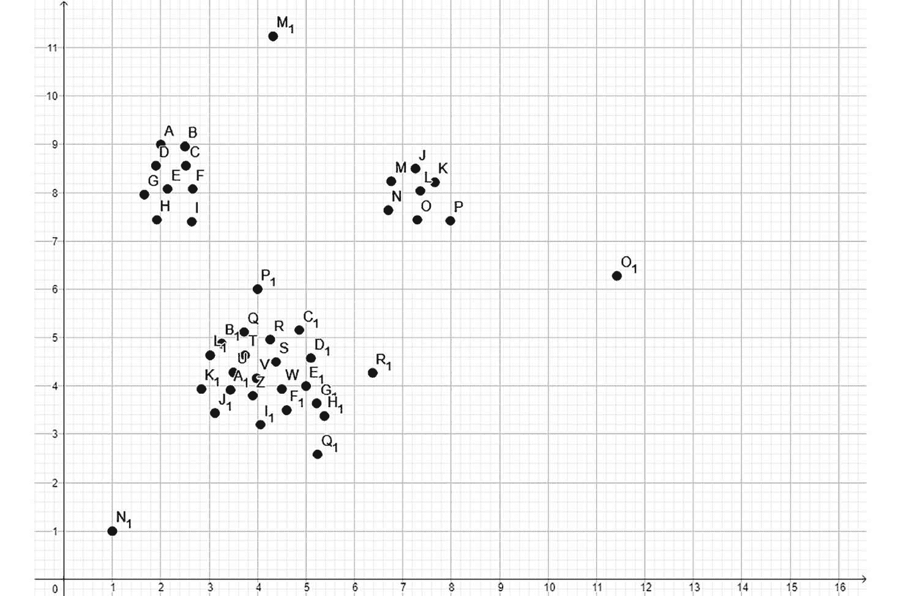
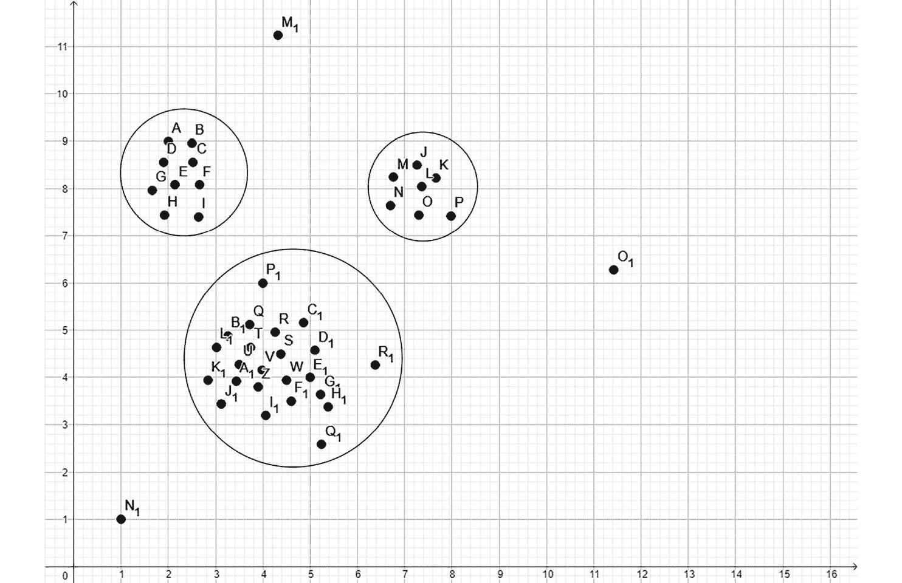
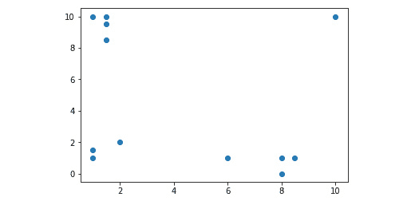
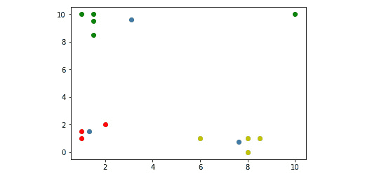
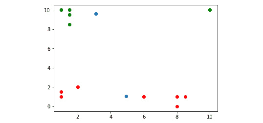
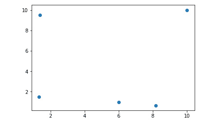

# 第六章：聚类

## 学习目标

到本章结束时，你将能够：

+   总结聚类的要点

+   使用 k-means 算法执行平面聚类

+   使用均值漂移算法执行层次聚类

在本章中，你将了解聚类的原理，这将通过两个无监督学习算法进行说明。

## 聚类简介

在前面的章节中，我们处理了监督学习算法以执行分类和回归。我们使用训练数据来训练我们的分类或回归模型，然后我们使用测试数据来验证我们的模型。

在本章中，我们将通过使用聚类算法进行无监督学习。

我们可以使用聚类来分析数据，以找到某些模式和创建组。除此之外，聚类还可以用于许多目的：

+   市场细分检测你在基本面应该关注的最佳股票。我们可以使用聚类检测趋势、细分客户或向特定客户类型推荐某些产品。

+   在计算机视觉中，使用聚类进行图像分割，我们可以在图像中找到计算机处理的不同对象。

+   聚类可以与分类相结合，其中聚类可以生成多个特征的紧凑表示，然后将其输入到分类器中。

+   聚类还可以通过检测异常值来过滤数据点。

无论我们是将聚类应用于遗传学、视频、图像还是社交网络，如果我们使用聚类分析数据，我们可能会发现数据点之间的相似性，这些相似性值得统一处理。

我们执行聚类而不指定标签。聚类根据数据点之间的距离定义聚类。而在分类中，我们定义精确的标签类别以分组分类数据点，在聚类中则没有标签。我们只是给机器学习模型提供特征，模型必须找出这些特征集所属的聚类。

### 定义聚类问题

假设你是一位负责确保商店盈利性的商店经理。你的产品被分为不同的类别。不同顾客的商店偏好不同的商品。

例如，对生物产品感兴趣的顾客倾向于选择天然生物产品。如果你查看亚马逊，你也会找到针对不同产品组的建议。这是基于用户可能感兴趣的内容。

我们将定义聚类问题，以便我们能够找到数据点之间的这些相似性。假设我们有一个由点组成的数据集。聚类帮助我们通过描述这些点的分布来理解这种结构。

让我们看看二维空间中数据点的例子：



###### 图 6.1：二维空间中的数据点

在这个例子中，很明显有三个聚类：



###### 图 6.2：使用二维空间中的数据点形成的三个簇

由于点彼此靠近，因此三个簇很容易检测到。聚类确定彼此靠近的数据点。还有一些不属于任何簇的异常点。聚类算法应该准备好适当处理这些异常点，而不会将它们移动到簇中。

虽然在二维空间中识别簇很容易，但我们通常有多维数据点。因此，了解哪些数据点彼此靠近很重要。同样，定义检测数据点彼此接近的距离度量也很重要。一个著名的距离度量是欧几里得距离。在数学中，我们经常使用欧几里得距离来测量两点之间的距离。因此，当涉及到聚类算法时，欧几里得距离是一个直观的选择，这样我们就可以确定数据点在定位簇时的邻近程度。

大多数距离度量（包括欧几里得距离）有一个缺点：当我们增加维度时，这些距离相对于彼此将变得更加均匀。因此，去除作为噪声而不是有用信息的特征可能会大大提高聚类模型的准确性。

### 聚类方法

聚类有两种类型：**平面**和**层次**。

在平面聚类中，我们指定机器要找到的簇数量。平面聚类的一个例子是 k-means 算法，其中 K 指定了算法要使用的簇数量。

在层次聚类中，机器学习算法找出所需的簇数量。

层次聚类也有两种方法：

+   **自底向上的层次聚类**将每个点视为一个簇。这种方法将彼此靠近的簇合并在一起。

+   **自顶向下的层次聚类**将数据点视为一个覆盖整个状态空间的簇。然后，聚类算法将我们的簇分割成更小的簇。

+   **点分配聚类**根据新数据点到现有簇的接近程度将新数据点分配给现有簇。

### scikit-learn 支持的聚类算法

在本章中，我们将学习 scikit-learn 支持的两种聚类算法：**k-means**算法和**均值漂移**算法。

**k-means**是平面聚类的例子，我们必须提前指定簇的数量。k-means 是一种通用目的的聚类算法，如果簇的数量不是太高且簇的大小均匀，则表现良好。

**均值漂移**是层次聚类的一个例子，其中聚类算法确定簇的数量。当事先不知道簇的数量时，使用均值漂移。与 k-means 相比，均值漂移支持存在许多簇的用例，即使簇的大小差异很大。

scikit-learn 提供了其他聚类算法。这些如下：

+   **亲和传播**：与均值漂移表现相似

+   **谱聚类**：如果只有少数簇存在，且簇的大小均匀，则表现更好

+   **Ward 层次聚类**：当预期有许多簇时使用

+   **层次聚类**：当预期有许多簇时使用

+   **DBSCAN 聚类**：支持不均匀的簇大小和点分布的非平面几何

+   **高斯混合**：使用平面几何，这对于密度估计很有用

+   **Birch 聚类**：支持大型数据集，去除异常值，并支持数据降维

要完整描述聚类算法，包括性能比较，请访问 scikit-learn 的聚类页面，网址为[`scikit-learn.org/stable/modules/clustering.html`](http://scikit-learn.org/stable/modules/clustering.html)。

## k-means 算法

k-means 算法是一种平面聚类算法。它的工作原理如下：

+   设置 K 的值。

+   从数据集中选择 K 个数据点作为各个簇的初始中心。

+   计算每个数据点到所选中心点的距离，并将每个点分组到其初始中心点最接近的数据点所在的簇中。

+   当所有点都位于 K 个簇之一中时，计算每个簇的中心点。这个中心点不必是数据集中的现有数据点；它只是一个平均值。

+   重复将每个数据点分配到中心点最接近数据点的簇的过程。重复进行，直到中心点不再移动。

为了确保 k-means 算法终止，我们需要以下条件：

+   当质心移动小于容差值时，我们退出时的最大容差级别

+   移动点的最大重复次数

由于 k-means 算法的性质，它将很难处理大小差异很大的簇。

k-means 算法有许多用例，这些都是我们日常生活中的一部分：

**市场细分**：公司从其客户群中收集各种数据。对公司客户群进行 k-means 聚类分析可以揭示具有定义特性的市场细分。属于同一细分市场的客户可以类似对待。不同的细分市场将接受不同的处理。

**书籍、电影或其他文档的分类**：当影响者建立他们的个人品牌时，作者会写书并创作书籍，或者公司管理其社交媒体账户，内容为王。内容通常由标签和其他数据描述。这些数据可以用作聚类的依据，以定位性质相似的文档组。

**欺诈和犯罪活动的检测**：欺诈者经常以异常的客户或访客行为的形式留下线索。例如，汽车保险保护驾驶者免受盗窃和事故造成的损害。真实盗窃和虚假盗窃具有不同的特征值。同样，故意撞毁汽车留下的痕迹与意外撞毁汽车留下的痕迹不同。聚类通常可以检测欺诈，帮助行业专业人士更好地了解他们最差的客户的行为。

### 练习 19：scikit-learn 中的 k-means

要在二维平面上绘制数据点并对其执行 k-means 算法以进行聚类，请执行以下步骤：

1.  我们将创建一个 NumPy Array 的人工数据集来演示 k-means 算法：

    ```py
    import numpy as np
    data_points = np.array([
        [1, 1],
        [1, 1.5],
        [2, 2],
        [8, 1],
        [8, 0],
        [8.5, 1],
        [6, 1],
        [1, 10],
        [1.5, 10],
        [1.5, 9.5],
        [10, 10],
        [1.5, 8.5]
    ])
    ```

    我们可以使用`matplotlib.pyplot`在二维平面上绘制这些数据点：

    ```py
    import matplotlib.pyplot as plot
    plot.scatter(data_points.transpose()[0], data_points.transpose()[1])
    ```

    输出如下：

    

    ###### 图 6.3：使用 matplotlib.pyplot 在二维平面上显示数据点的图表

    #### 注意

    我们使用了`transpose array`方法来获取第一个特征和第二个特征值。这与前面的章节一致。我们也可以使用适当的数组索引来访问这些列：`dataPoints[:,0]`等同于`dataPoints.transpose()[0]`。

1.  现在我们有了数据点，是时候对它们执行 k-means 算法了。如果我们把 k-means 算法中的 K 定义为`3`，我们期望在图表的左下角、右上角和右下角有一个簇：

    ```py
    from sklearn.cluster import KMeans
    k_means_model = KMeans(n_clusters=3)
    k_means_model.fit(data_points)
    ```

1.  聚类完成后，我们可以访问每个簇的中心点：

    ```py
    k_means_model.cluster_centers_
    ```

    输出将如下：

    ```py
     array([[1.33333333, 1.5     ],
            [3.1     , 9.6     ],
            [7.625     , 0.75     ]])
    ```

    事实上，簇的中心点似乎位于图表的左下角、右上角和右下角。右上角簇的 X 坐标是 3.1，这很可能是由于它包含了我们的异常数据点[10, 10]。

1.  让我们用不同的颜色绘制簇及其中心点。要知道哪个数据点属于哪个簇，我们必须查询 k-means 分类器的`labels_`属性：

    ```py
    k_means_model.labels_
    ```

    输出将如下：

    ```py
    array([0, 0, 0, 2, 2, 2, 2, 1, 1, 1, 1, 1])
    ```

1.  输出数组显示了哪些数据点属于哪个簇。这是我们绘制数据所需的所有信息：

    ```py
    plot.scatter(
        k_means_model.cluster_centers_[:,0],
        k_means_model.cluster_centers_[:,1]
    )
    for i in range(len(data_points)):
        plot.plot(
            data_points[i][0],
            data_points[i][1],
            ['ro','go','yo'][k_means_model.labels_[i]]
        )
    plot.show()
    ```

    输出如下：

    

    ###### 图 6.4：显示红色、绿色和蓝色数据点并选择三个簇的图表

    蓝色的中心点确实位于它们的簇中，这些簇由红色点、绿色点和黄色点表示。

1.  让我们看看如果我们选择两个簇而不是三个簇会发生什么：

    ```py
    k_means_model = KMeans(n_clusters=2)
    k_means_model.fit(data_points)
    plot.scatter(
        k_means_model.cluster_centers_[:,0],
        k_means_model.cluster_centers_[:,1]
    )
    for i in range(len(data_points)):
        plot.plot(
            data_points[i][0],
            data_points[i][1],
            ['ro','go'][k_means_model.labels_[i]]
        )
    plot.show()
    ```

    输出如下：

    

    ###### 图 6.5：显示在选择两个簇时红色、蓝色和绿色数据点的图形

    这次，我们只有红色和绿色点，我们有一个底部簇和一个顶部簇。有趣的是，第二个示例中的顶部红色簇包含与第一个示例中顶部簇相同的点。第二个示例的底部簇由第一个示例的底部左簇和底部右簇的数据点组成。

1.  我们还可以使用 k-means 模型进行预测。输出是一个包含每个数据点所属簇编号的数组：

    ```py
    k_means_model.predict([[5,5],[0,10]])
    ```

    输出结果如下：

    ```py
     array([1, 0])
    ```

### scikit-learn 中 k-means 算法的参数化

与第 3、4 和 5 章中的分类和回归模型一样，k-means 算法也可以参数化。完整的参数列表可以在[`scikit-learn.org/stable/modules/generated/sklearn.cluster.KMeans.html`](http://scikit-learn.org/stable/modules/generated/sklearn.cluster.KMeans.html) 找到。

以下是一些示例：

+   `n_clusters`：数据点被分离的簇的数量。默认值是 **8**。

+   `max_iter`：最大迭代次数。

+   `tol`：检查我们是否可以退出 k-means 算法的容差。

在上一节中，我们使用了两个属性来检索簇中心点和簇本身：

`cluster_centers_`：这返回簇中心点的坐标。

`labels_`：这返回一个表示数据点所属簇编号的整数数组。编号从零开始。

### 练习 20：检索中心点和标签

要了解 `cluster_centers_` 和 `labels_` 的用法，请执行以下步骤：

1.  回想一下我们从 scikit-learn 中执行 k-means 算法时的示例。我们有 12 个数据点和三个簇：

    ```py
    data_points = np.array([
        [1, 1],
        [1, 1.5],
        [2, 2],
        [8, 1],
        [8, 0],
        [8.5, 1],
        [6, 1],
        [1, 10],
        [1.5, 10],
        [1.5, 9.5],
        [10, 10],
        [1.5, 8.5]
    ])
    k_means_model.cluster_centers_
    ```

    输出结果如下：

    ```py
     array([[1.33333333, 1.5     ],
          [3.1     , 9.6     ],
           [7.625     , 0.75     ]])
    ```

1.  在簇上应用 **labels_** 属性：

    ```py
    k_means_model.labels_
    ```

    输出结果如下：

    ```py
     array([0, 0, 0, 2, 2, 2, 2, 1, 1, 1, 1, 1])
    ```

    **cluster_centers_** 属性的输出很明显：它显示了中心点的 X 和 Y 坐标。**labels_** 属性是一个长度为 12 的数组，显示了它所属的 12 个数据点的簇。第一个簇与数字 0 相关联，第二个与 1 相关联，第三个与 2 相关联，以此类推。

### 销售数据的 k-means 聚类

在即将进行的活动过程中，我们将考虑销售数据，并将在这些销售数据上执行 k-means 聚类。

### 活动 12：销售数据的 k-means 聚类

在本节中，我们将检测表现相似的产品销售，以识别产品销售趋势。

我们将使用以下 URL 中的销售交易周数据集：

[`archive.ics.uci.edu/ml/datasets/Sales_Transactions_Dataset_Weekly`](https://archive.ics.uci.edu/ml/datasets/Sales_Transactions_Dataset_Weekly) 使用 k-means 算法对数据集进行聚类。确保你根据之前章节中学到的知识准备你的聚类数据。

使用 k-means 算法的默认设置：

1.  使用 pandas 加载数据集。如果你检查 CSV 文件中的数据，你会意识到第一列包含产品 ID 字符串。这些值只是给聚类过程添加噪声。此外，请注意，对于第 0 周到第 51 周，存在带有 W 前缀的标签和归一化标签。使用归一化标签更有意义，这样我们就可以从数据集中删除常规的每周标签。创建一个 k-means 聚类模型，并将数据点拟合到 8 个聚类中。从聚类算法中检索中心点和标签。

1.  使用 **labels_** 属性可以检索每个数据点的标签。这些标签决定了原始数据框中行的聚类。这些标签有什么好处？

假设，在原始数据框中，产品名称是给出的。你可以很容易地认识到类似类型的产品销售情况相似。也有一些产品波动很大，还有一些季节性产品。例如，如果某些产品宣传减肥和塑形，它们往往在年初的销售，在海滩季节之前。

#### 注意

此活动的解决方案可在第 291 页找到。

## 均值漂移算法

均值漂移是一种层次聚类算法。与 k-means 算法不同，在均值漂移中，聚类算法确定需要多少个聚类，并执行聚类。这有优势，因为我们很少知道我们正在寻找多少个聚类。

此算法在我们的日常生活中也有许多应用场景。例如，Xbox Kinect 设备使用均值漂移算法检测人体部位。一些手机也使用均值漂移算法来检测人脸。随着社交媒体平台的增长，图像分割已成为许多用户习惯的功能。由于图像分割也是计算机视觉的基础，因此在该领域可以找到一些应用。均值漂移算法甚至可能拯救生命，因为它被集成到许多现代汽车的车辆检测软件中。想象一下，如果有人在你面前紧急刹车。你的汽车图像分割软件会检测到你前面的车辆正危险地接近你，并在你意识到紧急情况之前施加紧急制动。这些驾驶辅助系统在现代汽车中很常见。自动驾驶汽车仅一步之遥。

### 练习 21：在 2D 中展示均值漂移

要通过使用均值漂移算法学习聚类，请执行以下步骤：

1.  让我们回顾一下之前主题中的数据点：

    ```py
    data_points = np.array([
        [1, 1],
        [1, 1.5],
        [2, 2],
        [8, 1],
        [8, 0],
        [8.5, 1],
        [6, 1],
        [1, 10],
        [1.5, 10],
        [1.5, 9.5],
        [10, 10],
        [1.5, 8.5]
    ])
    r = 2;
    ```

1.  我们现在的任务是找到一个点 P (x, y)，使得从点 P 出发，半径 R 内的数据点数量最大化。点分布如下：

    ###### 图 6.6：显示 data_points 数组数据点的图表

1.  假设我们最初将点 P 等同于第一个数据点，[1, 1]：

    ```py
    P = [1, 1]
    ```

1.  让我们找到距离这个点 R 距离内的点：

    ```py
    from scipy.spatial import distance
    points = np.array([
        p0 for p0 in data_points if distance.euclidean(p0, P) <= r
    ])
    points
    ```

    输出将如下所示：

    ```py
     array([[1\. , 1\. ],
       [1\. , 1.5],
       [2\. , 2\. ]])
    ```

1.  让我们计算数据点的平均值：

    ```py
    import numpy as np
    P = [
        np.mean( points.transpose()[0] ),
        np.mean(points.transpose()[1] )
    ]
    P
    ```

    输出将如下所示：

    ```py
     [1.3333333333333333, 1.5]
    ```

1.  现在新的平均值已经计算出来，我们可以再次检索给定半径内的点：

    ```py
    points = np.array([
        p0 for p0 in data_points if distance.euclidean( p0, P) <= r
    ])
    points
    ```

    输出将如下所示：

    ```py
     array([[1\. , 1\. ],
       [1\. , 1.5],
       [2\. , 2\. ]])
    ```

1.  这些是相同的三个点，所以我们在这里可以停止。已经找到了围绕平均值[1.3333333333333333, 1.5]的三个点。在这个中心半径为 2 的点形成了一个簇。

1.  如果我们检查数据点[1, 1.5]和[2, 2]，我们会得到相同的结果。让我们继续处理列表中的第四个点，[8, 1]：

    ```py
    P = [8, 1]
    points = np.array( [
        p0 for p0 in data_points if distance.euclidean(p0, P) <= r
    ])
    points
    ```

    输出将如下所示：

    ```py
     array([[8\. , 1\. ],
            [8\. , 0\. ],
            [8.5, 1\. ],
            [6\. , 1\. ]])
    ```

1.  这次，我们找到了该区域的所有四个点。因此，我们可以简单地计算它们的平均值：

    ```py
    P = [
        np.mean(points.transpose()[0]),
        np.mean(points.transpose()[1])
    ]
    ```

    输出将如下所示：

    ```py
     [7.625, 0.75]
    ```

    这个平均值不会改变，因为在下一次迭代中，我们会找到相同的数据点。

1.  注意，我们在选择点[8, 1]时很幸运。如果我们从`P = [8, 0]`或`P = [8.5, 1]`开始，我们只会找到三个点而不是四个：

    ```py
    P = [8, 0]
    points = np.array([
        p0 for p0 in data_points if distance.euclidean(p0, P) <= r
    ])
    points
    ```

    输出将如下所示：

    ```py
     array([[8\. , 1\. ],
       [8\. , 0\. ],
       [8.5, 1\. ]])
    ```

1.  计算这三个点的平均值后，我们必须重新运行距离计算，使用偏移的平均值：

    ```py
    P = [
        np.mean(points.transpose()[0]),
        np.mean(points.transpose()[1])
    ]
    P
    ```

    输出将如下所示：

    ```py
     [8.166666666666666, 0.6666666666666666]
    ```

1.  点 P = [8.5, 1]的输出如下数组：

    ```py
     array([[8\. , 1\. ],
       [8\. , 0\. ],
       [8.5, 1\. ]])
    ```

    我们只又找到了相同的三个点。这意味着从[8,1]开始，我们得到的簇比从[8, 0]或[8.5, 1]开始要大。因此，我们必须选择包含最多数据点的中心点。

1.  现在，让我们看看如果我们从第四个数据点开始发现会发生什么，**[6, 1]**：

    ```py
    P = [6, 1]
    points = np.array([
        p0 for p0 in data_points if distance.euclidean(p0, P) <= r
    ])
    points
    ```

    输出将如下所示：

    ```py
     array([[8., 1.],
      [6., 1.]])
    ```

1.  我们成功找到了数据点[8, 1]。因此，我们必须将平均值从[6, 1]移动到计算出的新平均值[7, 1]：

    ```py
    P = [
        np.mean(points.transpose()[0]),
        np.mean(points.transpose()[1])
    ]
    P
    ```

    输出将如下所示：

    ```py
     [7.0, 1.0]
    ```

1.  让我们检查是否找到了更多的点：

    ```py
    points = np.array([
        p0 for p0 in data_points if distance.euclidean(p0, P) <= r
    ])
    points
    ```

    输出将如下所示：

    ```py
     array([[8\. , 1\. ],
       [8\. , 0\. ],
       [8.5, 1\. ],
       [6\. , 1\. ]])
    ```

    是的——我们成功找到了所有四个点！因此，我们成功地定义了一个大小为 4 的簇。平均值将与之前相同：[7.625, 0.75]。

    这是一个简单的聚类示例，应用了均值漂移算法。我们只提供了算法考虑用于找到聚类的说明。尽管如此，还有一个问题：半径的值。

    注意，如果半径为 2 没有设置，我们可以简单地从一个包含所有数据点的巨大半径开始，然后减小半径，或者从一个非常小的半径开始，确保每个数据点都在它自己的簇中，然后增加半径，直到我们得到期望的结果。

### scikit-learn 中的均值漂移算法

让我们使用与 k-means 算法相同的数据点：

```py
import numpy as np
data_points = np.array([
    [1, 1],
    [1, 1.5],
    [2, 2],
    [8, 1],
    [8, 0],
    [8.5, 1],
    [6, 1],
    [1, 10],
    [1.5, 10],
    [1.5, 9.5],
    [10, 10],
    [1.5, 8.5]
])
```

均值漂移聚类算法的语法与 k-means 聚类算法类似。

```py
from sklearn.cluster import MeanShift
mean_shift_model = MeanShift()
mean_shift_model.fit(data_points)
```

一旦完成聚类，我们可以访问每个聚类的中心点：

```py
mean_shift_model.cluster_centers_
```

输出将如下：

```py
array([[ 1.375     , 9.5     ],
       [ 1.33333333, 1.5     ],
       [ 8.16666667, 0.66666667],
       [ 6\.        , 1\.        ],
       [10\.        , 10\.        ]])
```

均值漂移模型找到了 5 个聚类，其中心点在前面代码中显示。

与 k-means 类似，我们也可以获取标签：

```py
mean_shift_model.labels_
```

输出将如下：

```py
 array([1, 1, 1, 2, 2, 2, 3, 0, 0, 0, 4, 0], dtype=int64)
```

输出数组显示了哪些数据点属于哪个聚类。这是我们绘制数据所需的所有信息：

```py
plot.scatter(
    mean_shift_model.cluster_centers_[:,0],
    mean_shift_model.cluster_centers_[:,1]
)
for i in range(len(data_points)):
    plot.plot(
        data_points[i][0],
        data_points[i][1],
        ['ro','go','yo', 'ko', 'mo'][mean_shift_model.labels_[i]]
    )
plot.show()
```

输出将如下：



###### 图 6.7：基于 k-means 的图，

三个蓝色点分别是红色、绿色和黄色聚类的中心点。在坐标系中还有两个单独的点聚类，分别属于点(6,1)和(10,10)。

### Python 中的图像处理

要解决即将到来的活动，你需要知道如何在 Python 中处理图像。我们将使用 SciPy 库来完成这项工作。

你可以从路径读取图像文件有多种方式。

最简单的一种方法是来自 Python Imaging Library (PIL)的**Image**接口：

```py
from PIL import Image
image = Image.open('file.jpg')
```

前面的代码假设在**open**方法的字符串参数中指定的文件路径指向一个有效的图像文件。

我们可以通过查询大小属性来获取图像的大小：

```py
image.size
```

输出将如下：

```py
 (750, 422)
```

我们可以从包含每个像素 RGB 值的图像创建一个二维 NumPy 数组：

```py
import numpy as np
pixel_array = np.array(image)
```

一旦构建了像素数组，我们就可以轻松地检索和操作每个像素：

```py
pixel_array[411][740]
```

输出将如下：

```py
 array([29, 33, 32], dtype=uint8)
```

我们也可以通过图像的`load()`方法使图像的像素可访问。一旦我们获得了对这些像素的访问权限，我们可以根据文件格式获取每个像素的 RGB 或 RGBA 值：

```py
pixels = image.load()
pixels[740, 411]
```

输出将如下：

```py
 (29, 33, 32)
```

注意，像素坐标的顺序是相反的，即从左到右读取时为`pixel_array[411][740]`。我们正在读取完全相同的像素，但我们必须以不同的方式提供坐标。

我们还可以将像素设置为新的值：

```py
pixels[740, 411] = (255, 0, 0)
```

如果你想要保存更改，请使用图像的`save()`方法：

```py
image.save('test.jpg')
```

要对图像的像素进行聚类分析，我们需要将图像转换为数据框。这意味着我们必须将图像的像素转换为`['x', 'y', 'red', 'green', 'blue']`值的元组或数组。一旦我们有一个这些值的单维数组，我们可以将它们转换为 pandas DataFrame：

```py
import pandas
data_frame = pandas.DataFrame(
    [[x,y,pixels[x,y][0], pixels[x,y][1], pixels[x,y][2]]
        for x in range(image.size[0])
        for y in range(image.size[1])
    ],
    columns=['x', 'y', 'r', 'g', 'b' ]
)
data_frame.head()
```

输出将如下：

```py
   x y r g b
0 0 0 6 29 71
1 0 1 7 32 73
2 0 2 8 37 77
3 0 3 8 41 82
4 0 4 7 45 84
```

这是完成使用均值漂移算法处理图像活动所需了解的所有内容。

### 活动第 13 项：使用均值漂移算法进行形状识别

在本节中，我们将学习如何对图像进行聚类。想象一下，你正在为一家公司工作，该公司从照片中检测人类情绪。你的任务是提取头像照片中构成脸部的像素。

创建一个使用均值漂移进行图像像素聚类的聚类算法。检查均值漂移算法的结果，并检查在用于头像图像时，是否有任何聚类包含面部。

然后，应用具有固定默认聚类数（在这种情况下为 8）的 k 均值算法。将你的结果与均值漂移聚类算法进行比较：

1.  选择你想要聚类的图像并加载图像。

1.  将像素转换为数据帧以执行聚类。使用 scikit-learn 在图像上执行均值漂移聚类。请注意，这次，我们将跳过特征归一化，因为像素的邻近性和颜色成分的邻近性以几乎相等的权重表示。算法将找到两个聚类。

1.  根据你使用的图像，注意均值漂移算法如何处理人类肤色，以及图像的哪些其他部分被放置在同一个聚类中。包含头像中大部分肤色的聚类通常包括非常接近和/或与肤色颜色相似的数据点。

1.  让我们使用 K 均值算法在相同的数据上形成八个聚类。

你会看到聚类算法确实定位了接近且颜色相似的数据点。

#### 注意

此活动的解决方案可在第 293 页找到。

## 摘要

在本章中，我们学习了聚类是如何工作的。聚类是一种无监督学习形式，其中特征是给定的，聚类算法找到标签。

聚类有两种类型：平面和层次。

K 均值算法是一种平面聚类算法，其中我们为我们的 K 个聚类确定 K 个中心点，算法找到数据点。

均值漂移是层次聚类算法的一个例子，其中要确定的唯一标签值的数量由算法决定。

最后一章将介绍一个由于计算能力的爆炸式增长和廉价、可扩展的在线服务器容量而成为本十年热门领域的科学——神经网络和深度学习。
