# 第七章：使用神经网络进行深度学习

## 学习目标

到本章结束时，你将能够：

+   执行基本的 TensorFlow 操作以解决各种表达式

+   描述人工神经网络的工作原理

+   使用 TensorFlow 训练和测试神经网络

+   使用 TensorFlow 实现深度学习神经网络模型

在本章中，我们将使用 TensorFlow 库检测手写数字。

## 简介

在本章中，我们将学习另一种监督学习技术。然而，这次，我们不会使用像分类或回归这样的简单数学模型，而将使用一个完全不同的模型：**神经网络**。虽然我们将使用神经网络进行监督学习，但请注意，神经网络也可以模拟无监督学习技术。这个模型的重要性在上个世纪有所增加，因为在过去，使用这个模型进行监督学习所需的计算能力不足。因此，在上个世纪，神经网络在实践中应运而生。

## TensorFlow for Python

TensorFlow 是 Google 维护的最重要的人工智能和开源库之一。TensorFlow API 在许多语言中可用，包括 Python、JavaScript、Java 和 C。由于 TensorFlow 支持监督学习，我们将使用 TensorFlow 构建图模型，然后使用此模型进行预测。

TensorFlow 与张量一起工作。张量的例子包括：

+   标量值，例如浮点数。

+   长度任意的向量。

+   一个包含 p 乘 q 个值的常规矩阵，其中 p 和 q 是有限的整数。

+   一个 p x q x r 的广义矩阵结构，其中 p、q、r 是有限的整数。想象这个结构在三维空间中是一个具有边长 p、q 和 r 的长方体对象。这个数据结构中的数字可以在三维空间中可视化。

+   观察上述四种数据结构，更复杂、n 维数据结构也可以是张量的有效示例。

在本章中，我们将坚持使用标量、向量和常规矩阵张量。在本章范围内，将张量视为标量值、数组或数组的数组。

TensorFlow 用于创建人工神经网络，因为它模拟了其输入、输出、内部节点以及这些节点之间的有向边。TensorFlow 还附带数学函数来转换信号。当神经网络中的神经元被激活时，这些数学函数在建模时也会很有用。

#### 注意

张量是类似数组的对象。流符号表示对张量数据的操作。因此，本质上，TensorFlow 是一个数组数据处理库。

TensorFlow 的主要用途是人工神经网络，因为这个领域需要对大数组和大矩阵进行操作。TensorFlow 附带了许多与深度学习相关的函数，因此它是神经网络的最佳环境。TensorFlow 用于语音识别、语音搜索，也是 translate.google.com 背后的大脑。在本章的后面部分，我们将使用 TensorFlow 来识别手写字符。

### 在 Anaconda Navigator 中安装 TensorFlow

让我们打开 Anaconda Prompt，使用`pip`安装 TensorFlow：

```py
pip install tensorflow
```

安装需要几分钟，因为包本身相当大。如果你更喜欢使用你的显卡 GPU 而不是 CPU，你也可以使用`tensorflow-gpu`。确保只有在你有一个足够好的显卡时才使用 GPU 版本。

安装完成后，你可以在 IPython 中导入 TensorFlow：

```py
import tensorflow as tf
```

首先，我们将使用 TensorFlow 构建一个图。这个模型的执行是分开的。这种分离很重要，因为执行是资源密集型的，因此可能需要在专门解决计算密集型问题的服务器上运行。

### TensorFlow 操作

TensorFlow 提供了许多操作来操作数据。以下是一些这些操作的例子：

+   **算术运算**：`加`和`乘`

+   **指数运算**：`exp`和`log`

+   **关系运算**：`大于`、`小于`和`等于`

+   **数组操作**：`concat`、`slice`和`split`

+   **矩阵运算**：`matrix_inverse`、`matrix_determinant`和`matmul`

+   **神经网络相关操作**：`sigmoid`、`ReLU`和`softmax`

### 练习 22：使用基本操作和 TensorFlow 常量

使用 TensorFlow 中的算术运算来解决表达式：*2 * 3 + 4*

这些操作可以用来构建图形。为了更深入地了解 TensorFlow 常量和基本算术运算符，让我们考虑一个简单的表达式*2 * 3 + 4*，这个表达式的图形如下：

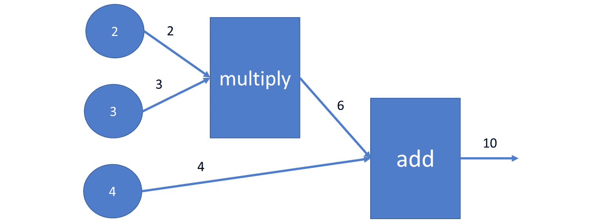

###### 图 7.1：表达式 2*3+4 的图形

1.  使用以下代码在 TensorFlow 中模拟此图形：

    ```py
    import tensorflow as tf
    input1 = tf.constant(2.0, tf.float32, name='input1')
    input2 = tf.constant(3.0, tf.float32, name='input2')
    input3 = tf.constant(4.0, tf.float32, name='input3')
    product12 = tf.multiply(input1, input2)
    sum = tf.add(product12, input3)
    ```

1.  图形构建完成后，为了进行计算，我们必须打开一个 TensorFlow 会话并执行我们的节点：

    ```py
    with tf.Session() as session:
        print(session.run(product12))
        print(session.run(sum))
    ```

    中间结果和最终结果将打印到控制台：

    ```py
    6.0
    10.0
    ```

### 占位符和变量

现在你可以使用 TensorFlow 构建表达式了，让我们更进一步，构建占位符和变量。

当会话开始执行时，占位符会被替换为一个常量值。占位符本质上是在解决表达式之前被替换的参数。变量是在会话执行过程中可能发生变化的值。

让我们使用 TensorFlow 创建一个参数化表达式：

```py
import tensorflow as tf
input1 = tf.constant(2.0, tf.float32, name='input1')
input2 = tf.placeholder(tf.float32, name='p')
input3 = tf.Variable(0.0, tf.float32, name='x')
product12 = tf.multiply(input1, input2)
sum = tf.add(product12, input3)
with tf.Session() as session:
    initializer = tf.global_variables_initializer()
    session.run(initializer)
    print(session.run(sum, feed_dict={input2: 3.0}))
```

输出是`6.0`。

`tf.global_variables_initializer()`调用在`session.run`执行后，将`input3`中的变量初始化为其默认值，即零。

通过使用 feed 字典在另一个`session.run`语句中计算了总和，因此用常数`3.0`代替了`input2`参数。

注意，在这个特定示例中，变量 x 被初始化为零。在 TensorFlow 会话执行期间，x 的值不会改变。稍后，当我们使用 TensorFlow 来描述神经网络时，我们将定义一个优化目标，并且会话将优化变量的值以满足这个目标。

### 全局变量初始化器

由于 TensorFlow 经常使用矩阵运算，因此学习如何初始化一个随机变量的矩阵到一个以零为中心的正态分布随机生成的值是有意义的。

不仅矩阵，所有全局变量都是在会话内部通过调用`tf.global_variables_initializer()`来初始化的：

```py
randomMatrix = tf.Variable(tf.random_normal([3, 4]))
with tf.Session() as session:
    initializer = tf.global_variables_initializer()
    print( session.run(initializer))
    print( session.run(randomMatrix))

None
[[-0.41974232 1.8810892 -1.4549098 -0.73987174]
[ 2.1072254 1.7968426 -0.38310152 0.98115194]
[-0.550108 -0.41858754 1.3511614 1.2387075 ]]
```

如您所见，`tf.Variable`的初始化需要一个参数：`tf.random_normal([3,4])`的值。

## 神经网络简介

神经网络是人工智能的最新分支。神经网络受到人类大脑工作方式的启发。最初，它们是在 20 世纪 40 年代由沃伦·麦卡洛克和沃尔特·皮茨发明的。神经网络是一个数学模型，用于描述人类大脑如何解决问题。

当我们谈论数学模型时，我们将使用“人工神经网络”这个短语，当我们谈论人类大脑时，我们将使用“生物神经网络”。人工神经网络是监督学习算法。

神经网络的学习方式比其他分类或回归模型更复杂。神经网络模型有很多内部变量，输入变量和输出变量之间的关系可能要通过多个内部层。与其他监督学习算法相比，神经网络具有更高的准确性。

#### 注意

掌握 TensorFlow 中的神经网络是一个复杂的过程。本节的目的就是为你提供一个入门资源，帮助你开始学习。

在本章中，我们将使用的主要示例是从图像中识别数字。我们考虑这个图像是因为它很小，我们大约有 70,000 张图像可用。处理这些图像所需的处理能力与普通计算机相似。

人工神经网络的工作原理与人类大脑的工作原理相似。在人类大脑中，树突连接到细胞核，细胞核连接到轴突。在这里，树突充当输入，细胞核是计算发生的地方（加权总和和激活函数），轴突的作用类似于输出。

然后，我们通过将加权总和传递给激活函数来确定哪个神经元会激发。如果这个函数确定一个神经元必须激发，信号就会出现在输出中。这个信号可以是网络中其他神经元的输入：

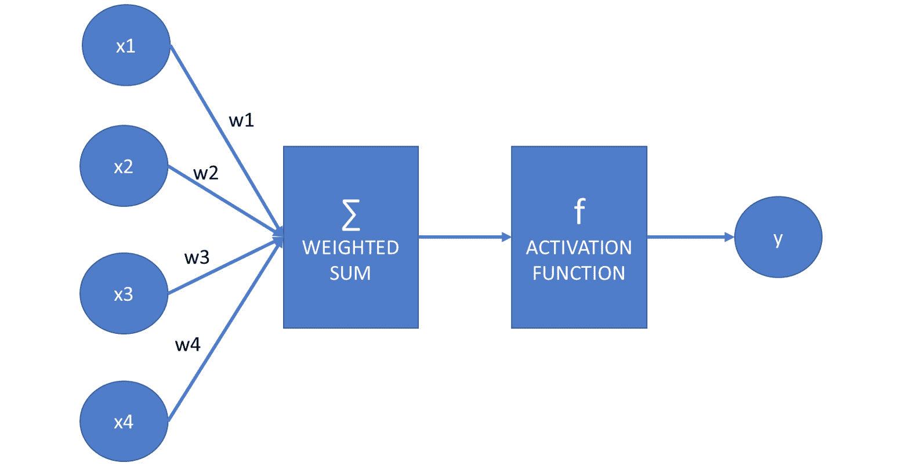

###### 图 7.2：展示人工神经网络工作原理的图

假设`f`是激活函数，`x1`，`x2`，`x3`和`x4`是输入，它们的和与权重`w1`，`w2`，`w3`和`w4`相乘：

```py
y = f(x1*w1 + x2*w2 + x3*w3 + x4*w4)
```

假设向量`x`是(`x1`，`x2`，`x3`，`x4`)，向量`w`是(`w1`，`w2`，`w3`，`w4`)，我们可以将这个方程写成这两个向量的标量或点积：

y = f(x ⋅ w)

我们定义的结构是一个神经元：

让我们隐藏这个神经元的细节，以便更容易构建神经网络：

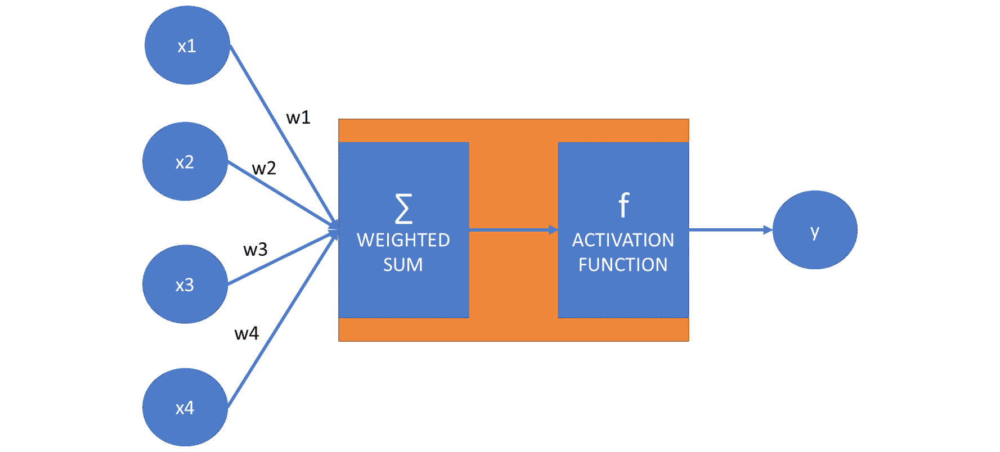

###### 图 7.4：表示神经元隐藏层的图

我们可以创建多个框和多个输出变量，这些变量可能由于读取输入的加权平均值而被激活。

虽然在下面的图中，所有输入都指向所有框的箭头，但请记住，箭头上的权重可能为零。我们仍然在图中显示这些箭头：

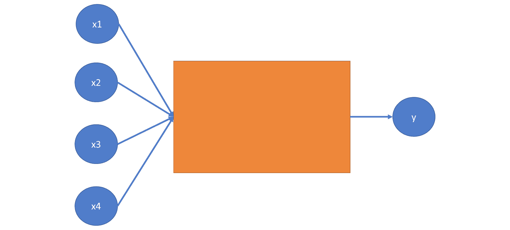

###### 图 7.5：表示神经网络的图

描述输入和输出之间关系的框被称为隐藏层。只有一个隐藏层的神经网络被称为**常规神经网络**。

在连接输入和输出时，我们可能有多个隐藏层。具有多个层的神经网络被称为**深度神经网络**：

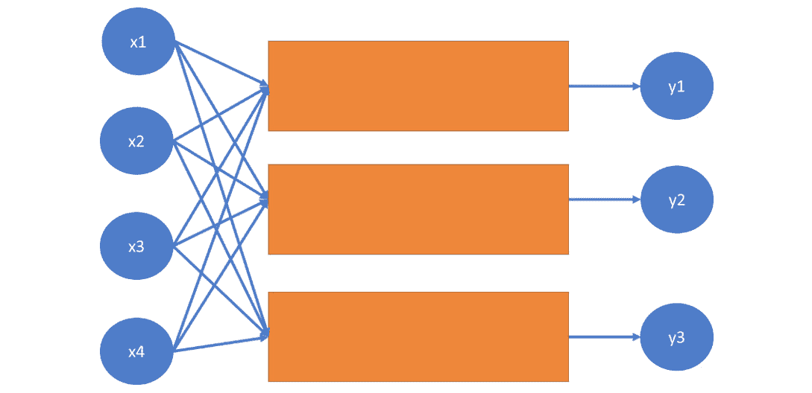

###### 图 7.6：表示深度神经网络的图

深度学习这个术语来源于多层结构的存在。在创建人工神经网络时，我们可以指定隐藏层的数量。

### 偏置

让我们再次看看神经网络中神经元的模型：

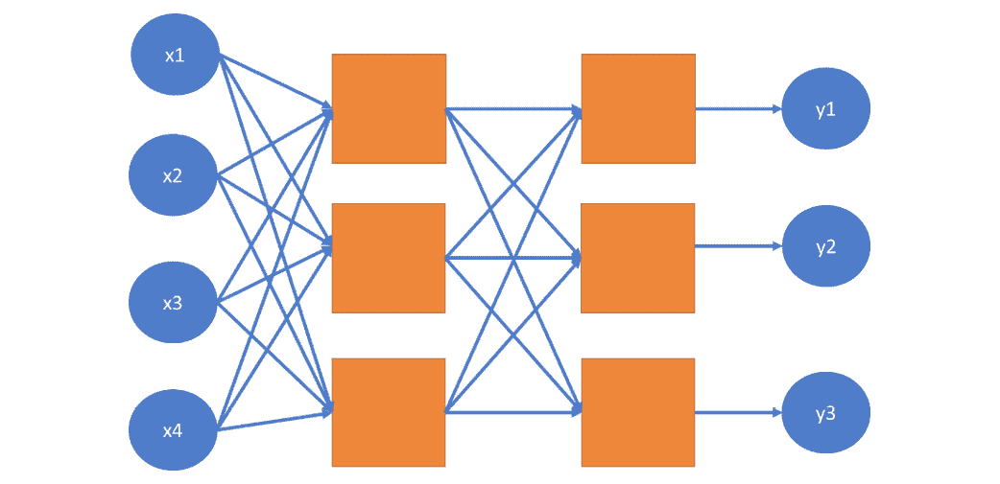

###### 图 7.7：神经网络中神经元的图

我们了解到这个神经元的方程如下：

```py
y = f(x1*w1 + x2*w2 + x3*w3 + x4*w4)
```

这个方程的问题是没有依赖于输入 x1，x2，x3 和 x4 的常数因子。这意味着神经网络中的每个神经元，如果没有偏置，总是会在每个权重-输入对的乘积为零时产生这个值。

因此，我们在方程中添加偏置：

```py
y = f(x1*w1 + x2*w2 + x3*w3 + x4*w4 + b)
y = f(x ⋅ w + b)
```

第一个方程是详细形式，描述了每个坐标、权重系数和偏置的作用。第二个方程是向量形式，其中 x = (x1, x2, x3, x4)和 w = (w1, w2, w3, w4)。向量之间的点运算符表示两个向量的点积或标量积。这两个方程是等价的。我们将在实践中使用第二种形式，因为它比逐个定义每个变量更容易使用 TensorFlow 定义变量向量。

同样，对于*w1*，*w2*，*w3*和*w4*，偏置*b*是一个变量，意味着它的值可以在学习过程中改变。

由于每个神经元都内置了这个常数因子，神经网络模型在拟合特定训练数据集方面变得更加灵活。

#### 注意

可能会发生这样的情况，由于存在一些负权重，乘积 `p = x1*w1 + x2*w2 + x3*w3 + x4*w4` 是负的。我们可能仍然希望模型具有灵活性，以在超过给定负数的值上激活神经元。因此，添加一个常数偏置 b = 5，例如，可以确保神经元在 -5 到 0 之间的值上也能激活。

### 人工神经网络的用例

人工神经网络在监督学习技术中占有一席之地。它们可以模拟分类和回归问题。分类神经网络寻求特征和标签之间的关系。特征是输入变量，而分类器可以选择作为返回值的每个类别是一个单独的输出。在回归的情况下，输入变量是特征，而有一个单一的输出：预测值。虽然传统的分类和回归技术在人工智能中有其用例，但人工神经网络通常在寻找输入和输出之间的复杂关系方面表现得更好。

### 激活函数

神经网络中使用了不同的激活函数。没有这些函数，神经网络将是一个可以用矩阵乘法轻松描述的线性模型。

神经网络的激活函数提供了非线性。最常用的激活函数是 `sigmoid` 和 `tanh`（双曲正切函数）。

`sigmoid` 的公式如下：

```py
import numpy as np
def sigmoid(x):
    return 1 / (1 + np.e ** (-x))
```

让我们使用 `pyplot` 绘制这个函数：

```py
import matplotlib.pylab as plt
x = np.arange(-10, 10, 0.1)
plt.plot(x, sigmoid(x))
plt.show()
```

输出如下：

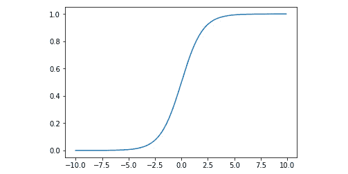

###### 图 7.8：显示 sigmoid 曲线的图形

Sigmoid 函数存在一些问题。

首先，它可能会不成比例地放大或衰减权重。

第二，`sigmoid(0)` 不为零。这使得学习过程更加困难。

双曲正切的公式如下：

```py
def tanh(x):
    return 2 / (1 + np.e ** (-2*x)) - 1
```

我们也可以这样绘制这个函数：

```py
x = np.arange(-10, 10, 0.1)
plt.plot(x, tanh(x))
plt.show()
```

输出如下：

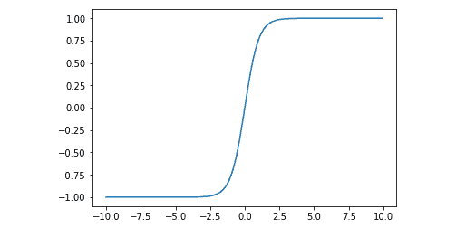

###### 图 7.9：绘制双曲正切后的图形

这两个函数都给神经元发出的值增加了一点点非线性。sigmoid 函数看起来更平滑，而 tanh 函数给出稍微尖锐的结果。

最近另一种激活函数也变得流行起来：`ReLU`。`ReLU` 代表修正线性单元：

```py
def relu(x):
    return 0 if x < 0 else x
```

使神经网络模型非线性化使得模型更容易逼近非线性函数。没有这些非线性函数，无论网络有多少层，我们都只能逼近线性问题：

```py
def reluArr(arr):
   return [relu(x) for x in arr]
x = np.arange(-10, 10, 0.1)
plt.plot(x, reluArr(x))
plt.show()
```

输出如下：

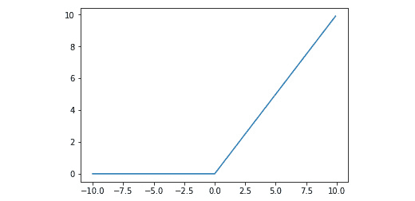

###### 图 7.10：显示 ReLU 函数的图形

从快速收敛到神经网络权重和偏差的最终值的角度来看，`ReLU` 激活函数表现得非常出色。

在本章中，我们将使用一个额外的函数：`softmax`。

`softmax` 函数将列表中的值缩小到 *0* 和 *1* 之间，使得列表中所有元素的和变为 *1*。`softmax` 函数的定义如下：

```py
def softmax(list):
    return np.exp(list) / np.sum(np.exp(list))
```

这里有一个例子：

```py
softmax([1,2,1])
```

输出结果如下：

```py
array([0.21194156, 0.57611688, 0.21194156])
```

当我们过滤列表而不是单个值时，可以使用 `softmax` 函数。列表中的每个元素都将被转换。

让我们尝试不同的激活函数。观察这些函数如何通过解决以下练习来抑制加权的输入。

### 练习 23：激活函数

考虑以下神经网络：

*y = f( 2 * x1 + 0.5 * x2 + 1.5 * x3 - 3 ).*

假设 *x1* 是 1，*x2* 是 2，计算以下 x 值（-1，0，1，2）对应的 *y* 值：

+   f 是 `sigmoid` 函数

+   f 是 `tanh` 函数

+   f 是 `ReLU` 函数

执行以下步骤：

1.  代入已知的系数：

    ```py
    def get_y( f, x3 ):
        return f(2*1+0.5*2+1.5*x3)
    ```

1.  使用以下三个激活函数：

    ```py
    import numpy as np
    def sigmoid(x):
        return 1 / (1 + np.e ** (-x))
    def tanh(x):
        return 2 / (1 + np.e ** (-2*x)) - 1
    def relu(x):
        return 0 if x < 0 else x
    ```

1.  使用以下命令计算 `sigmoid` 值：

    ```py
    get_y( sigmoid, -2 )
    ```

    输出结果为 `0.5`

    ```py
    get_y(sigmoid, -1)
    ```

    输出结果为 `0.8175744761936437`

    ```py
    get_y(sigmoid, 0)
    ```

    输出结果为 `0.9525741268224331`

    ```py
    get_y(sigmoid, 1)
    ```

    输出结果为 `0.9890130573694068`

    ```py
    get_y(sigmoid, 2)
    ```

    输出结果为 `0.9975273768433653`

1.  如您所见，当 `sigmoid` 函数内部的求和表达式增加时，变化迅速被抑制。我们期望 `tanh` 函数具有更大的抑制效果：

    ```py
    get_y(tanh, -2)
    ```

    输出结果为 `0.0`

    ```py
    get_y(tanh, -1)
    ```

    输出结果为 `0.9051482536448663`

    ```py
    get_y(tanh, 0)
    ```

    输出结果为 `0.9950547536867307`

    ```py
    get_y(tanh, 1)
    ```

    输出结果为 `0.9997532108480274`

    ```py
    get_y(tanh, 2)
    ```

    输出结果为 `0.9999877116507956`

1.  根据函数 `tanh` 的特性，输出比 `sigmoid` 函数更快地接近 1 的渐近线。对于 *x3 = -2*，我们计算 `f(0)`。而 `sigmoid(0)` 是 *0.5*，`tanh(0)` 是 *0*。与另外两个函数不同，`ReLu` 函数不会抑制正值：

    ```py
    get_y(relu,-2)
    ```

    输出结果为 `0.0`

    ```py
    get_y(relu,-1)
    ```

    输出结果为 `1.5`

    ```py
    get_y(relu,0)
    ```

    输出结果为 `3.0`

    ```py
    get_y(relu,1)
    ```

    输出结果为 `4.5`

    ```py
    get_y(relu,2)
    ```

    输出结果为 `6.0`

    `ReLU` 函数的另一个优点是，它的计算是所有激活函数中最简单的。

### 前向和反向传播

由于人工神经网络提供了一种监督学习技术，我们必须使用训练数据来训练我们的模型。训练网络的过程是找到属于每个变量输入对的权重。权重优化的过程包括重复执行两个步骤：前向传播和反向传播。

前向传播和反向传播这两个名称暗示了这些技术的工作方式。我们首先初始化神经网络箭头上的权重。然后，我们进行前向传播，接着进行反向传播。

**前向传播**根据输入值计算输出值。**反向传播**根据模型创建的标签值与训练数据中实际标签值之间的误差范围调整权重和偏差。权重调整的速率取决于神经网络的 学习率。学习率越高，反向传播期间权重和偏差的调整就越多。神经网络的动量决定了过去的结果如何影响权重和偏差的即将到来的值。

### 配置神经网络

以下参数通常用于创建神经网络：

+   隐藏层的数量

+   每个隐藏层的节点数

+   激活函数

+   学习率

+   动量

+   前向和反向传播的迭代次数

+   错误容忍度

有一些经验法则可以用来确定每个隐藏层的节点数。如果你的隐藏层包含的节点数多于输入的大小，你可能会使模型过拟合。通常，节点数在输入和输出之间是合理的。

### 导入 TensorFlow 数字数据集

初看起来，识别手写数字似乎是一个简单的任务。然而，这个任务是一个具有十个可能标签值的简单分类问题。TensorFlow 提供了一个用于识别数字的示例数据集。

#### 注意

你可以在 TensorFlow 网站上阅读有关此数据集的信息：[`www.tensorflow.org/tutorials/`](https://www.tensorflow.org/tutorials/)。

我们将使用`keras`来加载数据集。你可以在 Anaconda Prompt 中使用以下命令进行安装：

```py
pip install keras
```

记住，我们将对这些数据集进行监督学习，因此我们需要训练和测试数据：

```py
import tensorflow.keras.datasets.mnist as mnist
(features_train, label_train),(features_test, label_test) =
mnist.load_ data()
```

特征是包含 28x28 图像像素值的数组。标签是介于 0 到 9 之间的一位整数。让我们看看第五个元素的特性和标签。我们将使用与上一节相同的图像库：

```py
from PIL import Image
Image.fromarray(features_train[5])
```

###### 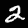

###### 图 7.11：训练图像

```py
label_train[5]
2
```

在本章末尾的活动结束时，你的任务将是创建一个神经网络，根据这些手写数字的值进行分类。

### 建模特征和标签

我们将通过 TensorFlow 数字数据集中识别手写数字的特征和标签建模示例来讲解。

我们以一个 28x28 像素的图像作为输入。每个图像的值要么是黑色，要么是白色。因此，特征集由一个 28 * 28 = 784 像素的向量组成。

图像为灰度图，颜色从 0 到 255 不等。为了处理它们，我们需要对数据进行缩放。通过将训练和测试特征除以 255.0，我们确保我们的特征缩放在 0 到 1 之间：

```py
features_train = features_train / 255.0
features_test = features_test / 255.0
```

注意，我们可以有一个 28x28 的方阵来描述特征，但我们更愿意将矩阵展平并简单地使用一个向量。这是因为神经网络模型通常处理一维数据。

关于标签的建模，许多人认为用单个标签建模这个问题最有意义：一个介于 0 到 9 之间的整数值。这种方法是有问题的，因为计算中的小错误可能会导致完全不同的数字。我们可以想象，5 和 6 是相似的，所以相邻的值在这里工作得很好。然而，在 1 和 7 的情况下，一个小错误可能会让神经网络将 1 识别为 2，或者将 7 识别为 6。这非常令人困惑，并且可能需要更多的时间来训练神经网络以减少相邻值的错误。

更重要的是，当我们的神经网络分类器返回结果为 4.2 时，我们可能像《银河系漫游指南》中的英雄一样难以解释这个答案。4.2 很可能是 4。但如果不是，它可能是一个 5，或者一个 3，或者一个 6。这不是数字检测的工作方式。

因此，使用十个标签的向量来模拟这个任务更有意义。当使用 TensorFlow 进行分类时，为每个可能的类别创建一个标签，其值介于 0 和 1 之间，这是完全合理的。这些数字描述了读取的数字被分类为标签所代表的类别的成员的概率。

例如，值 `[0, 0.1, 0, 0, 0.9, 0, 0, 0, 0, 0]` 表示我们的数字有 90%的可能性是 4，有 10%的可能性是 2。

在分类问题中，我们总是为每个类别使用一个输出值。

让我们继续讨论权重和偏差。为了连接 28*28 = 784 个特征和 10 个标签，我们需要一个 784 行 10 列的权重矩阵。

因此，方程变为 `y = f( x ⋅ W + b )` ，其中 x 是一个 784 维空间中的向量，W 是一个 784 x 10 的矩阵，b 是一个包含十个维度的偏差向量。y 向量也包含十个坐标。f 函数定义在具有十个坐标的向量上，并且应用于每个坐标。

#### 注意

为了将二维 28x28 的数据点矩阵转换为 28x28 元素的单一维向量，我们需要展平矩阵。与许多其他语言和库不同，Python 没有展平方法。

由于展平是一个简单的任务，让我们构建一个展平方法：

```py
def flatten(matrix):
    return [elem for row in matrix for elem in row]
flatten([[1,2],[3,4]])
```

输出如下：

```py
 [1, 2, 3, 4]
```

让我们将 28*28 矩阵的特征展平到 784 维空间的向量：

```py
features_train_vector = [
    flatten(image) for image in features_train
]
features_test_vector = [
    flatten(image) for image in features_test
]
```

为了将标签转换为向量形式，我们需要进行归一化：

```py
import numpy as np
label_train_vector = np.zeros((label_train.size, 10))
for i, label in enumerate(label_train_vector):
    label[label_train[i]] = 1
label_test_vector = np.zeros((label_test.size, 10))
for i, label in enumerate(label_test_vector):
    label[label_test[i]] = 1
```

### TensorFlow 多标签建模

我们现在将在 TensorFlow 中建模以下方程：`y = f( x ⋅ W + b )`

在导入 TensorFlow 后，我们将定义特征、标签和权重：

```py
import tensorflow as tf
f = tf.nn.sigmoid
x = tf.placeholder(tf.float32, [None, 28 * 28])
W = tf.Variable(tf.random_normal([784, 10]))
b = tf.Variable(tf.random_normal([10]))
```

如果我们知道如何使用 TensorFlow 执行点积乘法，我们可以简单地写出方程 `y = f( x ⋅ W + b )`。

如果我们将 x 视为一个*1x84*矩阵，我们可以使用`tf.matmul`函数将其与*784x10*的 W 矩阵相乘。

因此，我们的方程变为以下：`y = f( tf.add( tf.matmul( x, W ), b ) )`

你可能已经注意到 x 包含占位符，而 W 和 b 是变量。这是因为 x 的值是已知的。我们只需要在方程中替换它们。TensorFlow 的任务是优化 W 和 b 的值，以最大化我们读取正确数字的概率。

让我们将 y 的计算表达为一个函数形式：

```py
def classify(x):
    return f(tf.add(tf.matmul(x, W), b))
```

#### 注意

这是定义激活函数的地方。在本章末尾的活动结束时，你最好使用 softmax 激活函数。这意味着你将不得不在代码中将 sigmoid 替换为 softmax：`f = tf.nn.softmax`

### 优化变量

占位符代表输入。TensorFlow 的任务是优化变量。

为了执行优化，我们需要使用一个成本函数：交叉熵。交叉熵具有以下特性：

+   如果预测输出与实际输出匹配，其值为零

+   其值在之后是严格正的

我们的任务是最小化交叉熵：

```py
y = classify(x)
y_true = tf.placeholder(tf.float32, [None, 10])
cross_entropy = tf.nn.sigmoid_cross_entropy_with_logits(
    logits=y,
    labels=y_true
)
```

虽然计算 y 的函数被称为 classify，但我们在这里并没有执行实际的分类。记住，我们正在使用占位符代替 x，实际值在运行 TensorFlow 会话时被替换。

`sigmoid_cross_entropy_with_logits`函数接受两个参数来比较它们的值。第一个参数是标签值，而第二个参数是预测结果。

为了计算成本，我们必须调用 TensorFlow 的`reduce_mean`方法：

```py
cost = tf.reduce_mean(cross_entropy)
```

成本最小化通过一个优化器进行。我们将使用带有学习率的`GradientDescentOptimizer`。学习率是影响模型调整速度的神经网络参数：

```py
optimizer = tf.train.GradientDescentOptimizer(learning_rate = 0.5).minimize(cost)
```

在这个阶段不执行优化，因为我们还没有运行 TensorFlow。我们将在主循环中执行优化。

如果你使用的是不同的激活函数，如 softmax，你将不得不在源代码中替换它。而不是以下语句：

```py
cross_entropy = tf.nn.sigmoid_cross_entropy_with_logits(
    logits=y,
    labels=y_true
)
```

使用以下内容：

`cross_entropy = tf.nn.softmax_cross_entropy_with_logits_v2(`

`logits=y,`

`labels=y_true`

`)`

#### 注意

方法名称中的 _v2 后缀。这是因为原始的`tf.nn.softmax_cross_entropy_with_logits`方法已被弃用。

### 训练 TensorFlow 模型

我们需要创建一个 TensorFlow 会话并运行模型：

```py
session = tf.Session()
```

首先，我们使用`tf.global_variables_initializer()`初始化变量：

```py
session.run(tf.global_variables_initializer())
```

然后是优化循环。我们将确定迭代次数和批量大小。在每次迭代中，我们将随机选择与批量大小相等的特征-标签对。

为了演示目的，我们不会创建随机批次，而是在每次新迭代开始时简单地提供即将到来的前一百张图像。

由于我们总共有 60,000 张图像，我们可能会有多达 300 次迭代和每次迭代 200 张图像。实际上，我们只会运行几次迭代，这意味着我们只会使用部分可用的训练数据：

```py
iterations = 300
batch_size = 200
for i in range(iterations):
    min = i * batch_size
    max = (i+1) * batch_size
    dictionary = {
        x: features_train_vector[min:max],
        y_true: label_train_vector[min:max]
    }
    session.run(optimizer, feed_dict=dictionary)
    print('iteration: ', i)
```

### 使用模型进行预测

我们现在可以使用训练好的模型进行预测。语法很简单：我们将测试特征输入到会话的字典中，并请求`classify(x)`值：

```py
session.run(classify(x), feed_dict={
    x: features_test_vector[:10]
} )
```

### 测试模型

现在我们已经训练了模型，并且可以使用它进行预测，是时候测试其性能了：

```py
label_predicted = session.run(classify(x), feed_dict={
    x: features_test_vector
})
```

我们必须通过从每个结果中取最大值的索引，将`labelsPredicted`值转换回 0 到 9 的整数范围。我们将使用 NumPy 函数来完成这个转换。

`argmax`函数返回其列表或数组参数中具有最大值的索引。以下是一个示例：

```py
np.argmax([0.1, 0.3, 0.5, 0.2, 0, 0, 0, 0.2, 0, 0 ])
```

输出是`2`。

这里是带有`argmax`函数的第二个示例

np.argmax([1, 0, 1])

输出是`0`。

让我们进行转换：

```py
label_predicted = [
    np.argmax(label) for label in label_predicted
]
```

我们可以使用我们在前几章中学到的 scikit-learn 中的度量。让我们先计算混淆矩阵：

```py
from sklearn.metrics import confusion_matrix, accuracy_score, precision_score, recall_score, f1_score
confusion_matrix(label_test, label_predicted)
accuracy_score(label_test, label_predicted)
precision_score( label_test, label_predicted, average='weighted' )
recall_score( label_test, label_predicted, average='weighted' )
f1_score( label_test, label_predicted, average='weighted' )
```

### 随机化样本大小

回忆神经网络的训练函数：

```py
iterations = 300
batch_size = 200
for i in range(iterations):
    min = i * batch_size
    max = (i+1) * batch_size
    dictionary = {
        x: features_train_vector[min:max],
        y_true: label_train_vector[min:max]
    }
    session.run(optimizer, feed_dict=dictionary)
```

问题在于，在 60,000 个数字中，我们只能进行 5 次迭代。如果我们想超过这个阈值，我们就会面临重复这些输入序列的风险。

我们可以通过随机选择训练数据中的值来最大化使用训练数据的有效性。

我们可以使用`random.sample`方法来完成这个目的：

```py
iterations = 6000
batch_size = 100
sample_size = len(features_train_vector)
for _ in range(iterations):
    indices = random.sample(range(sample_size), batchSize)
    batch_features = [
        features_train_vector[i] for i in indices
    ]
    batch_labels = [
        label_train_vector[i] for i in indices
    ]
    min = i * batch_size
    max = (i+1) * batch_size
    dictionary = {
        x: batch_features,
        y_true: batch_labels
    }
    session.run(optimizer, feed_dict=dictionary)
```

#### 注意

随机样本方法从列表中随机选择给定数量的元素。例如，在匈牙利，主要的国家级彩票是基于从 90 个数字中选择 5 个数字。我们可以使用以下表达式来模拟一轮彩票：

```py
import random
random.sample(range(1,91), 5)
```

输出如下：

```py
[63, 58, 25, 41, 60]
```

### 活动 14：手写数字检测

在本节中，我们将讨论如何通过检测手写数字为加密货币交易者提供更多安全性。我们将假设你是一家新加密货币交易平台上的软件开发者。你正在实施的最新安全措施需要识别手写数字。使用 MNIST 库训练一个神经网络来识别数字。你可以在[`www.tensorflow.org/tutorials/`](https://www.tensorflow.org/tutorials/)了解更多关于这个数据集的信息。

通过执行以下步骤尽可能提高模型的准确度：

1.  加载数据集并格式化输入。

1.  设置 TensorFlow 图。现在我们将使用`ReLU`函数而不是 sigmoid 函数。

1.  训练模型。

1.  测试模型并计算准确度得分。

1.  通过重新运行负责训练数据集的代码段，我们可以提高其准确性。运行代码 50 次。

1.  打印混淆矩阵。

在第五十次运行结束时，混淆矩阵已经改进。

这不是一个坏的结果。超过 8 个数字被准确识别。

#### 注意

这个活动的解决方案可以在第 298 页找到。

如你所见，神经网络并不呈线性提高。可能看起来训练网络在一段时间内对准确性的增量改进很小或没有。然而，在达到某个阈值后，会出现突破，准确度会大幅提高。

这种行为与人类学习相似。你可能现在也会在神经网络方面遇到困难。然而，在深入材料并尝试一些练习之后，你将实现一次又一次的突破，你的进步将加速。

## 深度学习

在这个主题中，我们将增加神经网络的层数。你可能记得我们可以向我们的图中添加隐藏层。我们将通过实验隐藏层来提高我们模型的准确性。

### 添加层

回想一下具有两个隐藏层的神经网络图：

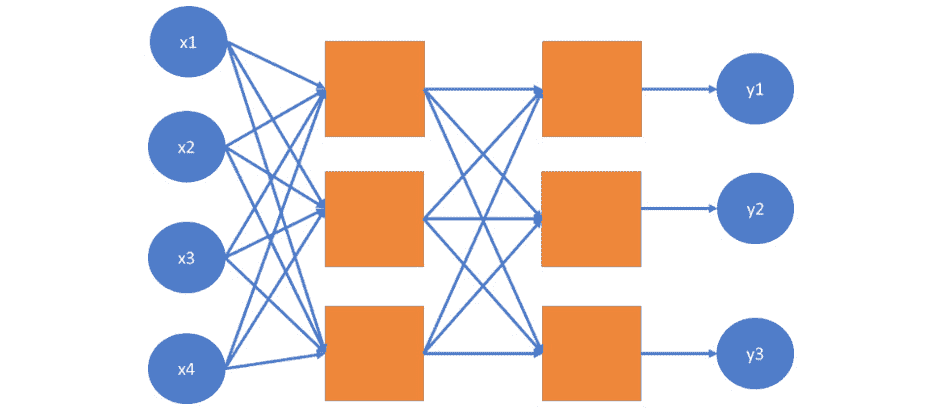

###### 图 7.12：展示神经网络中两个隐藏层的图

我们可以通过复制权重和偏差并确保 TensorFlow 变量的维度匹配来在等式中添加第二个层。注意，在第一个模型中，我们将 784 个特征转换成了 10 个标签。

在这个模型中，我们将把 784 个特征转换成指定数量的输出。然后我们将这些输出转换成 10 个标签。

确定添加的隐藏层的节点数并不完全是科学。在这个例子中，我们将使用 200 个节点，因为它位于特征和标签维度之间。

由于我们有两个层，我们将定义两个矩阵`(W1, W2)`和向量`(b1, b2)`来分别表示权重和偏差。

首先，我们使用`W1`和`b1`减少 784 个输入点，并创建 200 个变量值。我们将这些值作为第二层的输入，并使用`W2`和`b2`创建 10 个标签值：

```py
x = tf.placeholder(tf.float32, [None, 28 * 28 ])
f = tf.nn.softmax
W1 = tf.Variable(tf.random_normal([784, 200]))
b1 = tf.Variable(tf.random_normal([200]))
layer1_out = f(tf.add( tf.matmul(x, W1), b1))
W2 = tf.Variable(tf.random_normal([200, 10]))
b2 = tf.Variable(tf.random_normal([10]))
y = f(tf.add(tf.matmul(layer1_out, W2), b2))
```

如果需要，我们可以这样增加层数。层 n 的输出必须是层 n+1 的输入。其余的代码保持不变。

### 卷积神经网络

**卷积神经网络**（**CNNs**）是针对模式识别优化的人工神经网络。CNNs 基于深度神经网络中的卷积层。卷积层由使用卷积操作转换其输入的神经元组成。

当使用卷积层时，我们使用一个 m*n 的矩阵在图像中检测模式，其中 m 和 n 分别小于图像的宽度和高度。在执行卷积操作时，我们将这个 m*n 矩阵在图像上滑动，匹配每一个可能性。我们计算 m*n 卷积滤波器与当前卷积滤波器所在的 3x3 图像像素值的标量积。卷积操作从原始图像创建一个新的图像，其中我们图像的重要方面被突出显示，不那么重要的方面则被模糊化。

卷积操作总结了它所观察到的窗口上的信息。因此，它是一个识别图像中形状的理想操作符。形状可以出现在图像的任何位置，卷积操作符识别相似图像信息，无论其确切位置和方向如何。卷积神经网络超出了本书的范围，因为它是一个更高级的话题。

### 活动十五：使用深度学习进行手写数字检测

在本节中，我们将讨论深度学习如何提高你模型的表现。我们假设你的老板对你提交的第 14 个活动的结果不满意，并要求你考虑在你的原始模型中添加两个隐藏层，以确定新层是否能提高模型的准确性。为了确保你能正确完成这个活动，你需要对深度学习有所了解：

1.  执行上一个活动的步骤，并测量模型的准确率。

1.  通过添加新层来改变神经网络。我们将结合`ReLU`和`softmax`激活函数。

1.  重新训练模型。

1.  评估模型。找到准确率分数。

1.  运行代码 50 次。

1.  打印混淆矩阵。

这个深度神经网络比单层神经网络表现得更加混沌。它经过 600 次迭代，每次迭代 200 个样本，从准确率 0.572 提升到 0.5723。不久之后，在相同的迭代次数中，准确率从 0.6076 跃升至 0.6834。

由于深度神经网络的灵活性，我们预计达到准确率上限的时间会比简单模型晚。由于深度神经网络的复杂性，它也更可能长时间陷入局部最优。

#### 注意

这个活动的解决方案可以在第 302 页找到。

## 摘要

在这本书中，我们在“人工智能原理”章节学习了人工智能的基础知识以及人工智能的应用，然后我们编写了 Python 代码来模拟井字棋游戏。

在“使用搜索技术和游戏的人工智能”这一章节中，我们使用游戏人工智能工具和搜索技术解决了井字棋游戏。我们学习了广度优先搜索和深度优先搜索的搜索算法。A*算法帮助学生建模路径查找问题。这一章节以建模多人游戏作为结束。

在接下来的几章中，我们学习了使用回归和分类进行监督学习。这些章节包括数据预处理、训练-测试分割以及在几个实际场景中使用的模型。当预测股票数据时，线性回归、多项式回归和支持向量机都非常有用。分类使用了 k 近邻和支持向量机分类器。几个活动帮助学生将分类的基本原理应用于一个有趣的现实生活用例：信用评分。

在*第五章*，*使用树进行预测分析*中，我们介绍了决策树、随机森林和超随机树。本章介绍了评估模型效用性的不同方法。我们学习了如何计算模型的准确率、精确率、召回率和 F1 分数。我们还学习了如何创建模型的混淆矩阵。本章的模型通过评估汽车数据得到了实际应用。

在*第六章*，*聚类*中介绍了无监督学习，以及 k 均值和均值漂移聚类算法。这些算法的一个有趣方面是，标签不是预先给出的，而是在聚类过程中检测到的。

本书以第七章，*使用神经网络进行深度学习*结束，其中介绍了神经网络和 TensorFlow 的深度学习。我们使用这些技术在现实生活中的一个例子上应用了这些技术：手写数字的检测。
