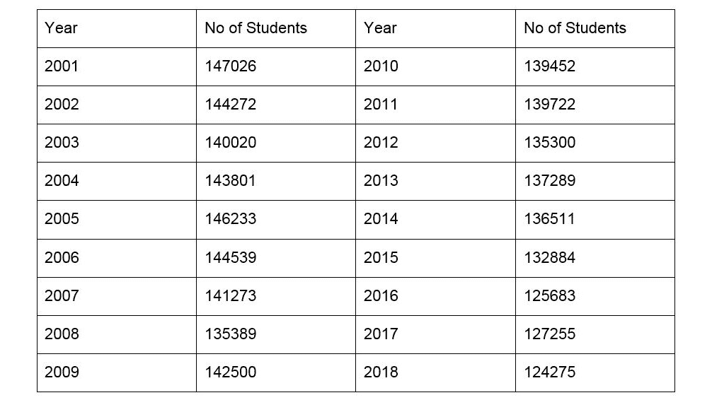
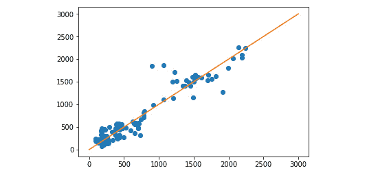
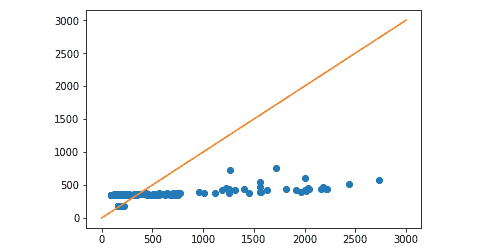

# 附录

## 关于

本节包含以帮助学生执行书中活动的内容。它包括学生为实现活动目标需要执行的详细步骤。

## 第一章：人工智能原理

在代码中，反斜杠（\）表示换行，当代码一行放不下时使用。行尾的反斜杠会转义换行符。这意味着在反斜杠后面的内容应该被读取为从反斜杠字符开始的内容。

### 活动一：生成井字棋游戏中所有可能的步骤序列

本节将探讨当两位玩家随机出牌时可能出现的组合爆炸。我们将使用一个程序，基于之前的结果生成计算机玩家和人类玩家之间所有可能的移动序列。确定根据行动序列的不同，胜负和平局的数量。假设人类玩家可以做出任何可能的移动。在这个例子中，由于计算机玩家是随机出牌，我们将检查两个随机出牌玩家的胜负和平局：

1.  创建一个函数，将 `all_moves_from_board` 函数映射到每个棋盘列表的元素上。这样，我们将在每个深度上拥有决策树的全部节点：

    ```py
    def all_moves_from_board(board, sign):
        move_list = []
        for i, v in enumerate(board):
            if v == EMPTY_SIGN:
                move_list.append(board[:i] + sign + board[i+1:])
        return move_list
    ```

1.  决策树从 `[ EMPTY_SIGN * 9 ]` 开始，并在每一步之后扩展：

    ```py
    all_moves_from_board_list( [ EMPTY_SIGN * 9 ], AI_SIGN )
    ```

1.  输出如下：

    ```py
     ['X........',
     '.X.......',
     '..X......',
     '...X.....',
     '....X....',
     '.....X...',
     '......X..',
     '.......X.',
     '........X']
     ['XO.......',
     'X.O......',
     'X..O.....',
     'X...O....',
     'X....O...',
     'X.....O..',
     'X......O.',
    .
    .
    .
    .
    '......OX.',
     '.......XO',
     'O.......X',
     '.O......X',
     '..O.....X',
     '...O....X',
     '....O...X',
     '.....O..X',
     '......O.X',
     '.......OX']
    ```

1.  让我们创建一个 `filter_wins` 函数，它从移动列表中移除结束的游戏，并将包含 AI 玩家和对手玩家赢得的棋盘状态的数组附加到其中：

    ```py
    def filter_wins(move_list, ai_wins, opponent_wins):
        for board in move_list:
            won_by = game_won_by(board)
            if won_by == AI_SIGN:
                ai_wins.append(board)
                move_list.remove(board)
            elif won_by == OPPONENT_SIGN:
                opponent_wins.append(board)
                move_list.remove(board)
    ```

1.  在这个函数中，三个列表可以被视为引用类型。这意味着函数不返回值，而是操作这三个列表而不返回它们。

1.  让我们完成这一节。然后使用一个 `count_possibilities` 函数，打印出以平局结束、第一玩家获胜和第二玩家获胜的决策树叶子的数量：

    ```py
    def count_possibilities():
        board = EMPTY_SIGN * 9
        move_list = [board]
        ai_wins = []
        opponent_wins = []
        for i in range(9):
            print('step ' + str(i) + '. Moves: ' + \        str(len(move_list)))
            sign = AI_SIGN if i % 2 == 0 else OPPONENT_SIGN
            move_list = all_moves_from_board_list(move_list, sign)
            filter_wins(move_list, ai_wins, opponent_wins)
        print('First player wins: ' + str(len(ai_wins)))
        print('Second player wins: ' + str(len(opponent_wins)))
        print('Draw', str(len(move_list)))
        print('Total', str(len(ai_wins) + len(opponent_wins) + \    len(move_list)))
    ```

1.  在每个状态下，我们最多有 9 步。在 0th、2nd、4th、6th 和 8th 次迭代中，AI 玩家移动。在所有其他迭代中，对手移动。我们在所有步骤中创建所有可能的移动，并从移动列表中移除结束的游戏。

1.  然后执行可能性数量以体验组合爆炸。

    ```py
    count_possibilities()
    ```

1.  输出如下：

    ```py
    step 0\. Moves: 1
    step 1\. Moves: 9
    step 2\. Moves: 72
    step 3\. Moves: 504
    step 4\. Moves: 3024
    step 5\. Moves: 13680
    step 6\. Moves: 49402
    step 7\. Moves: 111109
    step 8\. Moves: 156775
    First player wins: 106279
    Second player wins: 68644
    Draw 91150
    Total 266073
    ```

如您所见，棋盘状态的树由 266,073 个叶子组成。`count_possibilities`函数本质上实现了一个广度优先搜索算法来遍历游戏的所有可能状态。请注意，我们确实多次计算了这些状态，因为第 1 步在右上角放置 X，第 3 步在左上角放置 X，会导致与从左上角开始然后放置右上角 X 相似的可能状态。如果我们实现了重复状态的检测，我们就需要检查更少的节点。然而，在这个阶段，由于游戏的深度有限，我们省略了这个步骤。

## 第二章：具有搜索技术和游戏的 AI

### 活动二：教会智能体识别它防守损失的情况

按照以下步骤完成活动：

1.  创建一个名为`player_can_win`的函数，它使用`all_moves_from_board`函数从棋盘上获取所有移动，并使用变量`next_move`遍历它。在每次迭代中，它检查游戏是否可以通过标记获胜，然后返回 true 否则返回 false。

    ```py
    def player_can_win(board, sign):
        next_moves = all_moves_from_board(board, sign)
        for next_move in next_moves:
            if game_won_by(next_move) == sign:
                return True
        return False
    ```

1.  我们将扩展 AI 的移动，使其更喜欢安全的移动。一个移动是安全的，如果对手在下一步不能赢得比赛。

    ```py
    def ai_move(board):
        new_boards = all_moves_from_board(board, AI_SIGN)
        for new_board in new_boards:
            if game_won_by(new_board) == AI_SIGN:
                return new_board
        safe_moves = []
        for new_board in new_boards:
            if not player_can_win(new_board, OPPONENT_SIGN):
                safe_moves.append(new_board)
        return choice(safe_moves) if len(safe_moves) > 0 else \        new_boards[0]
    ```

1.  您可以测试我们的新应用程序。您会发现 AI 已经做出了正确的移动。

1.  我们现在将这个逻辑放入状态空间生成器中，并通过生成所有可能的比赛来检查计算机玩家的表现。

    ```py
    def all_moves_from_board( board, sign ):
    ```

1.  我们现在将这个逻辑放入状态空间生成器中，并通过生成所有可能的比赛来检查计算机玩家的表现。

    ```py
    def all_moves_from_board(board, sign):
        move_list = []
        for i, v in enumerate(board):
            if v == EMPTY_SIGN:
                new_board = board[:i] + sign + board[i+1:]
                move_list.append(new_board)
                if game_won_by(new_board) == AI_SIGN:
                    return [new_board]
        if sign == AI_SIGN:
            safe_moves = []
            for move in move_list:
                if not player_can_win(move, OPPONENT_SIGN):
                    safe_moves.append(move)
            return safe_moves if len(safe_moves) > 0 else \            move_list[0:1]
        else:
            return move_list
    ```

1.  计算所有可能的情况。

    ```py
    count_possibilities()
    ```

1.  输出如下：

    ```py
    step 0\. Moves: 1
    step 1\. Moves: 9
    step 2\. Moves: 72
    step 3\. Moves: 504
    step 4\. Moves: 3024
    step 5\. Moves: 5197
    step 6\. Moves: 18606
    step 7\. Moves: 19592
    step 8\. Moves: 30936
    ```

    ```py
    First player wins: 20843
    Second player wins: 962
    Draw 20243
    Total 42048
    ```

我们的表现比以前更好。我们不仅又消除了几乎三分之二的可能游戏，而且大多数时候，AI 玩家要么获胜，要么接受平局。尽管我们努力使 AI 变得更好，但它仍然有 962 种方式会输掉比赛。我们将在下一个活动中消除所有这些损失。

### 活动三：固定 AI 的前两个移动使其无敌

按照以下步骤完成活动：

1.  我们将计算棋盘上空格的数量，并在有 9 个或 7 个空格的情况下进行硬编码的移动。您可以尝试不同的硬编码移动。我们发现占据任何角落，然后占据对角角落会导致没有损失。如果对手占据了对角角落，然后在中间移动会导致没有损失。

    ```py
    def all_moves_from_board(board, sign):
        if sign == AI_SIGN:
            empty_field_count = board.count(EMPTY_SIGN)
            if empty_field_count == 9:
                return [sign + EMPTY_SIGN * 8]
            elif empty_field_count == 7:
                return [
                    board[:8] + sign if board[8] == \                    EMPTY_SIGN else
                    board[:4] + sign + board[5:]
                ]
        move_list = []
        for i, v in enumerate(board):
            if v == EMPTY_SIGN:
                new_board = board[:i] + sign + board[i+1:]
                move_list.append(new_board)
                if game_won_by(new_board) == AI_SIGN:
                    return [new_board]
        if sign == AI_SIGN:
    ```

    ```py
            safe_moves = []
            for move in move_list:
                if not player_can_win(move, OPPONENT_SIGN):
                    safe_moves.append(move)
            return safe_moves if len(safe_moves) > 0 else \            move_list[0:1]
        else:
            return move_list
    ```

1.  让我们验证状态空间

    ```py
    countPossibilities()
    ```

1.  输出如下：

    ```py
    step 0\. Moves: 1
    step 1\. Moves: 1
    step 2\. Moves: 8
    step 3\. Moves: 8
    step 4\. Moves: 48
    step 5\. Moves: 38
    step 6\. Moves: 108
    step 7\. Moves: 76
    step 8\. Moves: 90
    First player wins: 128
    Second player wins: 0
    Draw 60
    ```

1.  在固定前两个步骤之后，我们只需要处理 8 种可能性，而不是 504 种。我们还引导 AI 进入一个状态，其中硬编码的规则足以确保永远不会输掉比赛。

1.  固定步骤并不重要，因为我们将会给 AI 提供硬编码的步骤作为起始点，但它是重要的，因为它是一个评估和比较每个步骤的工具。

1.  在修复了前两步之后，我们只需要处理 8 种可能性，而不是 504 种。我们还引导 AI 进入一个状态，其中硬编码的规则足以确保永远不会输掉游戏。

### 活动 4：四子棋

本节将练习使用`EasyAI`库并开发启发式方法。我们将使用四子棋游戏。游戏板宽度为 7 个单元格，高度为 6 个单元格。当你移动时，你只能选择放下你的标记的列。然后重力将标记拉到最低的空单元格。你的目标是先于对手水平、垂直或对角线连接四个自己的标记，或者你用完所有空位。游戏规则可以在[`en.wikipedia.org/wiki/Connect_Four`](https://en.wikipedia.org/wiki/Connect_Four)找到。

1.  让我们设置 TwoPlayersGame 框架：

    ```py
    from easyAI import TwoPlayersGame
    from easyAI.Player import Human_Player
    class ConnectFour(TwoPlayersGame):
        def __init__(self, players):
            self.players = players
        def possible_moves(self):
            return []
        def make_move(self, move):
            return
        def unmake_move(self, move):
    # optional method (speeds up the AI)
            return
        def lose(self):
            return False
        def is_over(self):
            return (self.possible_moves() == []) or self.lose()
        def show(self):
            print ('board')
        def scoring(self):
            return -100 if self.lose() else 0

    if __name__ == "__main__":
        from easyAI import AI_Player, Negamax
        ai_algo = Negamax(6)
    ```

1.  我们可以保留定义中的一些函数不变。我们必须实现以下方法：

    ```py
    __init__
    possible_moves
    make_move
    unmake_move (optional)
    lose
    show
    ```

1.  我们将重用 tic-tac-toe 中的基本评分函数。一旦你测试了游戏，你会发现游戏并非不可战胜，尽管我们只使用了基本的启发式方法，但游戏表现却出人意料地好。

1.  让我们编写 init 方法。我们将定义棋盘为一个一维列表，类似于 tic-tac-toe 示例。我们也可以使用二维列表，但建模不会变得容易或困难很多。除了像 tic-tac-toe 游戏中那样进行初始化之外，我们还会稍微提前工作。我们将生成游戏中所有可能的获胜组合，并将它们保存供将来使用：

    ```py
    def __init__(self, players):
            self.players = players
            # 0 1 2 3 4 5 6
            # 7 8 9 10 11 12 13
            # ...
            # 35 36 37 38 39 40 41
            self.board = [0 for i in range(42)]
            self.nplayer = 1 # player 1 starts.
            def generate_winning_tuples():
                tuples = []
                # horizontal
                tuples += [
                    list(range(row*7+column, row*7+column+4, 1))
                    for row in range(6)
                    for column in range(4)]
                # vertical
                tuples += [
                    list(range(row*7+column, row*7+column+28, 7))
                    for row in range(3)
                    for column in range(7)
                ]
    ```

    ```py
                # diagonal forward
                tuples += [
                    list(range(row*7+column, row*7+column+32, 8))
                    for row in range(3)
                    for column in range(4)
                ]
                # diagonal backward
                tuples += [
                    list(range(row*7+column, row*7+column+24, 6))
                    for row in range(3)
                    for column in range(3, 7, 1)
                ]
                return tuples
    self.tuples=generate_winning_tuples()
    ```

1.  让我们处理移动。可能的移动函数是一个简单的枚举。注意我们在移动名称中使用从 1 到 7 的列索引，因为在人类玩家界面中从 1 开始列索引比从 0 开始更方便。对于每一列，我们检查是否存在未占用的字段。如果有一个，我们将该列设为可能的移动。

    ```py
    def possible_moves(self):
            return [column+1
                    for column in range(7)
                    if any([
                        self.board[column+row*7] == 0
                        for row in range(6)
                    ])
                    ]
    ```

1.  进行移动与可能的移动函数类似。我们检查移动的列，并从底部开始找到第一个空单元格。一旦找到，我们就占据它。你也可以阅读 make_move 函数的逆函数：unmake_move 的实现。在 unmake_move 函数中，我们从顶部到底部检查列，并在第一个非空单元格处移除移动。注意我们依赖于 easyAi 的内部表示，这样它就不会撤销它没有做出的移动。否则，这个函数会移除其他玩家的标记，而不会检查是哪个玩家的标记被移除。

    ```py
    def make_move(self, move):
            column = int(move) - 1
            for row in range(5, -1, -1):
                index = column + row*7
                if self.board[index] == 0:
                    self.board[index] = self.nplayer
                    return
        def unmake_move(self, move):
    # optional method (speeds up the AI)
            column = int(move) - 1
            for row in range(6):
                index = column + row*7
                if self.board[index] != 0:
                    self.board[index] = 0
                    return
    ```

1.  我们已经有了需要检查的元组，因此我们可以大部分重用 tic-tac-toe 示例中的 lose 函数。

    ```py
    def lose(self):
            return any([all([(self.board[c] == self.nopponent)
                             for c in line])
                        for line in self.tuples])
        def is_over(self):
            return (self.possible_moves() == []) or self.lose()
    ```

1.  我们最后一个任务是 show 方法，它将打印出棋盘。我们将重用 tic-tac-toe 的实现，并仅更改变量。

    ```py
    def show(self):
            print('\n'+'\n'.join([
                ' '.join([['.', 'O', 'X'][self.board[7*row+column]]
                         for column in range(7)]
                         )
                for row in range(6)])
            )
    ```

现在所有函数都已完成，你可以尝试一下示例。请随意与对手玩几轮。你可以看到对手并不完美，但它的表现相当不错。如果你有一台强大的计算机，你可以增加 Negamax 算法的参数。我鼓励你提出更好的启发式方法。

### 第三章：回归

### 活动 5：预测人口

你在 Metropolis 政府办公室工作，试图预测小学容量需求。你的任务是确定 2025 年和 2030 年开始上小学的儿童数量预测。以下为历史数据：



###### 图 3.21：小学数据

在二维图表上绘制趋势。使用线性回归。

我们的特征是 2001 年至 2018 年的年份。为了简单起见，我们可以将 2001 年表示为第 1 年，2018 年表示为第 18 年。

```py
x = np.array(range(1, 19))
y = np.array([
    147026,
    144272,
    140020,
    143801,
    146233,
    144539,
    141273,
    135389,
    142500,
    139452,
    139722,
    135300,
    137289,
    136511,
    132884,
    125683,
    127255,
    124275
])
```

使用 `np.polyfit` 来确定回归线的系数。

```py
[a, b] = np.polyfit(x, y, 1)
[-1142.0557275541753, 148817.5294117646]
```

使用 matplotlib.pyplot 绘制结果以确定未来的趋势。

```py
import matplotlib.pyplot as plot
plot.scatter( x, y )
plot.plot( [0, 30], [b, 30*a+b] )
plot.show()
```

### 活动 6：使用多元二次和三次线性多项式回归预测股价

本节将讨论如何使用 scikit-learn 执行线性、多项式和支持向量回归。我们还将学习预测给定任务的最佳拟合模型。我们将假设你是金融机构的一名软件工程师，你的雇主想知道线性回归或支持向量回归哪个更适合预测股价。你必须从数据源中加载所有 S&P 500 的数据。然后使用线性回归、三次多项式线性回归和具有三次多项式核的支持向量回归构建回归器。然后分离训练数据和测试数据。绘制测试标签和预测结果，并与 `y` = `x` 线进行比较。最后，比较三个模型的得分情况。

让我们使用 `Quandl` 加载 S&P 500 指数数据，然后准备预测数据。你可以在“多元线性回归”主题的“预测未来”部分中阅读这个过程。

```py
import quandl
import numpy as np
from sklearn import preprocessing
from sklearn import model_selection
from sklearn import linear_model
from sklearn.preprocessing import PolynomialFeatures
from matplotlib import pyplot as plot
from sklearn import svm
data_frame = quandl.get("YALE/SPCOMP")
data_frame[['Long Interest Rate', 'Real Price',
           'Real Dividend', 'Cyclically Adjusted PE Ratio']]
data_frame.fillna(-100, inplace=True)
# We shift the price data to be predicted 20 years forward
data_frame['Real Price Label'] = data_frame['RealPrice'].shift(-240)
# Then exclude the label column from the features
features = np.array(data_frame.drop('Real Price Label', 1))
# We scale before dropping the last 240 rows from the features
scaled_features = preprocessing.scale(features)
# Save the last 240 rows before dropping them
scaled_features_latest240 = scaled_features[-240:]
# Exclude the last 240 rows from the data used for # # modelbuilding
scaled_features = scaled_features[:-240]
# Now we can drop the last 240 rows from the data frame
data_frame.dropna(inplace=True)
# Then build the labels from the remaining data
label = np.array(data_frame['Real Price Label'])
# The rest of the model building stays
(features_train,
    features_test,
    label_train,
    label_test
) = model_selection.train_test_split(
    scaled_features,
    label,
   test_size=0.1
)
```

让我们先使用一次多项式来评估模型并进行预测。我们仍在重新创建第二个主题中的主要示例。

```py
model = linear_model.LinearRegression()
model.fit(features_train, label_train)
model.score(features_test, label_test)
```

1.  输出如下：

    ```py
     0.8978136465083912
    ```

1.  输出始终取决于测试数据，因此每次运行后的值可能不同。

    ```py
    label_predicted = model.predict(features_test)
    plot.plot(
        label_test, label_predicted, 'o',
        [0, 3000], [0, 3000]
    )
    ```



###### 图 3.22：显示输出的图表

点越接近 y=x 线，模型的误差就越小。

```py
It is now time to perform a linear multiple regression with quadratic polynomials. The only change is in the Linear Regression model
poly_regressor = PolynomialFeatures(degree=3)
poly_scaled_features = poly_regressor.fit_transform(scaled_features)
(poly_features_train,
 poly_features_test,
 poly_label_train,
 poly_label_test) = model_selection.train_test_split(
    poly_scaled_features,
    label,
    test_size=0.1)
model = linear_model.LinearRegression()
model.fit(poly_features_train, poly_label_train)
print('Polynomial model score: ', model.score(
    poly_features_test, poly_label_test))
print('\n')
poly_label_predicted = model.predict(poly_features_test)
plot.plot(
    poly_label_test, poly_label_predicted, 'o',
    [0, 3000], [0, 3000]
)
```

模型在测试数据上的表现令人惊讶。因此，我们可以怀疑我们的多项式在训练和测试场景中过度拟合。

我们现在将执行一个具有三次多项式核的支持向量回归。

```py
model = svm.SVR(kernel='poly')
model.fit(features_train, label_train)
label_predicted = model.predict(features_test)
plot.plot(
    label_test, label_predicted, 'o',
    [0,3000], [0,3000]
)
```



###### 图 3.23：显示输出的图表

```py
model.score(features_test, label_test)
```

输出将是 `0.06388628722032952`。

我们现在将执行一个具有三次多项式核的支持向量回归。

## 第四章：分类

### 活动 7：为分类准备信用数据

本节将讨论如何为分类器准备数据。我们将使用 german.data 从[`archive.ics.uci.edu/ml/machine-learning-databases/statlog/german/`](https://archive.ics.uci.edu/ml/machine-learning-databases/statlog/german/)作为示例，并为训练和测试分类器准备数据。确保所有标签都是数值的，并且值已准备好进行分类。使用 80%的数据点作为训练数据。

1.  从[`archive.ics.uci.edu/ml/machine-learning-databases/statlog/german/`](https://archive.ics.uci.edu/ml/machine-learning-databases/statlog/german/)保存 german.data，并在 Sublime Text 或 Atom 等文本编辑器中打开它。向其中添加以下第一行：

    ```py
    CheckingAccountStatus DurationMonths CreditHistory CreditPurpose CreditAmount SavingsAccount EmploymentSince DisposableIncomePercent PersonalStatusSex OtherDebtors PresentResidenceMonths Property Age OtherInstallmentPlans Housing NumberOfExistingCreditsInBank Job LiabilityNumberOfPeople Phone ForeignWorker CreditScore
    ```

1.  使用 pandas 导入数据文件，并用异常值替换 NA 值：

    ```py
    import pandas
    data_frame = pandas.read_csv('german.data', sep=' ')
    data_frame.replace('NA', -1000000, inplace=True)
    ```

1.  执行标签编码。我们需要将数据框中的所有标签转换为整数。我们可以在一维数组中创建所有标签。然而，这将非常低效，因为每个标签恰好出现在一个列中。按列分组我们的标签更有意义：

    ```py
    labels = {
     'CheckingAccountStatus': ['A11', 'A12', 'A13', 'A14'],
     'CreditHistory': ['A30', 'A31', 'A32', 'A33', 'A34'],
     'CreditPurpose': ['A40', 'A41', 'A42', 'A43', 'A44', 'A45', 'A46', 'A47', 'A48', 'A49', 'A410'],
     'SavingsAccount': ['A61', 'A62', 'A63', 'A64', 'A65'],
     'EmploymentSince': ['A71', 'A72', 'A73', 'A74', 'A75'],
     'PersonalStatusSex': ['A91', 'A92', 'A93', 'A94', 'A95'],
     'OtherDebtors': ['A101', 'A102', 'A103'],
     'Property': ['A121', 'A122', 'A123', 'A124'],
     'OtherInstallmentPlans': ['A141', 'A142', 'A143'],
     'Housing': ['A151', 'A152', 'A153'],
     'Job': ['A171', 'A172', 'A173', 'A174'],
     'Phone': ['A191', 'A192'],
     'ForeignWorker': ['A201', 'A202']
    }
    ```

1.  让我们为每一列创建一个标签编码器并编码值：

    ```py
    from sklearn import preprocessing
    label_encoders = {}
    data_frame_encoded = pandas.DataFrame()
    for column in data_frame:
        if column in labels:
            label_encoders[column] = preprocessing.LabelEncoder()
            label_encoders[column].fit(labels[column])
            data_frame_encoded[column] = label_encoders[
                column].transform(data_frame[column])
        else:
            data_frame_encoded[column] = data_frame[column]
    ```

    让我们验证我们是否一切都做对了：

```py
data_frame_encoded.head()
CheckingAccountStatus DurationMonths CreditHistory CreditPurpose \
0                     0             6             4             4
1                     1             48             2             4
2                     3             12             4             7
3                     0             42             2             3
4                     0             24             3             0
   CreditAmount SavingsAccount EmploymentSince DisposableIncomePercent \
0         1169             4                4                        4
1         5951             0                2                        2
2         2096             0                3                        2
3         7882             0                3                        2
4         4870             0                2                        3
   PersonalStatusSex OtherDebtors     ...     Property Age \
0                 2             0     ...             0 67
1                 1             0     ...             0 22
2                 2             0     ...             0 49
3                 2             2     ...             1 45
4                 2             0     ...             3 53
   OtherInstallmentPlans Housing NumberOfExistingCreditsInBank Job \
0                     2        1                             2    2
1                     2        1                             1    2
2                     2        1                             1    1
3                     2        2                             1    2
4                     2        2                             2    2
   LiabilityNumberOfPeople Phone ForeignWorker CreditScore
0                        1     1             0            1
1                        1     0             0            2
2                        2     0             0            1
3                        2     0             0            1
4                        2     0             0            2
[5 rows x 21 columns]
label_encoders
{'CheckingAccountStatus': LabelEncoder(),
 'CreditHistory': LabelEncoder(),
 'CreditPurpose': LabelEncoder(),
 'EmploymentSince': LabelEncoder(),
 'ForeignWorker': LabelEncoder(),
 'Housing': LabelEncoder(),
 'Job': LabelEncoder(),
 'OtherDebtors': LabelEncoder(),
 'OtherInstallmentPlans': LabelEncoder(),
 'PersonalStatusSex': LabelEncoder(),
 'Phone': LabelEncoder(),
 'Property': LabelEncoder(),
 'SavingsAccount': LabelEncoder()}
```

所有 21 列都可用，标签编码器也已保存到对象中。我们的数据现在已预处理。

如果您不想解码编码后的值，则不需要保存这些标签编码器。我们只是为了完整性而保存了它们。

1.  是时候将特征与标签分开。我们可以应用我们在理论部分看到的方法：

    ```py
    import numpy as np
    features = np.array(
        data_frame_encoded.drop(['CreditScore'], 1)
    )
    label = np.array(data_frame_encoded['CreditScore'])
    ```

    我们的特征尚未缩放。这是一个问题，因为信用金额的距离可能比年龄的差异显著更高。

    我们必须一起对训练数据和测试数据进行缩放，因此，我们可以在将训练数据从测试数据中分割出来之前进行缩放的最新步骤。

1.  让我们使用 scikit 的预处理库中的 Min-Max 缩放器：

    ```py
    scaled_features = preprocessing.MinMaxScaler(
    feature_range=(0,1)).fit_transform(features)
    ```

1.  最后一步是交叉验证。我们将打乱我们的数据，并使用所有数据的 80%进行训练，20%进行测试。

    ```py
    from sklearn import model_selection
    features_train, features_test, label_train,
    label_test = model_selection.train_test_split(
        scaled_features,
        label,
        test_size = 0.2
    )
    ```

### 活动 8：提高信用评分的准确性

本节将学习 k 最近邻分类器的参数化如何影响最终结果。信用评分的准确性目前相当低：66.5%。找到一种方法将其提高几个百分点。并且为了确保它正确发生，您需要完成之前的练习。

完成这个练习有很多方法。在这个解决方案中，我将向您展示一种通过改变参数化来提高信用评分的方法。

您必须完成第 13 项练习，才能完成此活动。

1.  将 k 最近邻分类器的 K 值从默认的 5 增加到 10、15、25 和 50。评估结果：

    ```py
    You must have completed Exercise 13, to be able to complete this activity
    classifier = neighbors.KNeighborsClassifier(n_neighbors=10)
    classifier.fit(
        features_train,label_train
        )
    classifier.score(features_test, label_test)
    ```

1.  在为所有四个`n_neighbors`值运行这些行之后，我得到了以下结果：

    ```py
    K=10: accuracy is 71.5%
    K=15: accuracy is 70.5%
    K=25: accuracy is 72%
    K=50: accuracy is 74%
    ```

1.  较高的 K 值并不一定意味着更好的分数。然而，在这个例子中，`K=50`比`K=5`得到了更好的结果。

### 活动 9：在 scikit-learn 中进行支持向量机优化

本节将讨论如何使用支持向量机分类器的不同参数。我们将通过比较和对比你之前学习过的不同支持向量回归分类器参数，找到一组在之前活动中加载和准备好的训练和测试数据上产生最高分类数据的参数。为确保正确执行，你需要完成之前的活动和练习。

我们将尝试几种组合。你可以选择不同的参数，例如

1.  线性核

    ```py
    classifier = svm.SVC(kernel="linear")
    classifier.fit(features_train, label_train)
    classifier.score(features_test, label_test)
    ```

1.  四次方多项式核，C=2，gamma=0.05

    ```py
    classifier = svm.SVC(kernel="poly", C=2, degree=4, gamma=0.05)
    classifier.fit(features_train, label_train)
    classifier.score(features_test, label_test)
    ```

    输出如下：0.705。

1.  四次方多项式核，C=2，gamma=0.25

    ```py
    classifier = svm.SVC(kernel="poly", C=2, degree=4, gamma=0.25)
    classifier.fit(features_train, label_train)
    classifier.score(features_test, label_test)
    ```

    输出如下：0.76。

1.  四次方多项式核，C=2，gamma=0.5

    ```py
    classifier = svm.SVC(kernel="poly", C=2, degree=4, gamma=0.5)
    classifier.fit(features_train, label_train)
    classifier.score(features_test, label_test)
    ```

    输出如下：0.72。

1.  Sigmoid 核

    ```py
    classifier = svm.SVC(kernel="sigmoid")
    classifier.fit(features_train, label_train)
    classifier.score(features_test, label_test)
    ```

    输出如下：0.71。

1.  默认核，gamma 为 0.15

    ```py
    classifier = svm.SVC(kernel="rbf", gamma=0.15)
    classifier.fit(features_train, label_train)
    classifier.score(features_test, label_test)
    ```

    输出如下：0.76。

## 第五章：使用树进行预测分析

### 活动 10：汽车数据分类

本节将讨论如何构建一个可靠的决策树模型，以帮助你的公司在寻找可能购买汽车的客户方面发挥作用。我们将假设你受雇于一家汽车租赁代理机构，专注于与客户建立长期关系。你的任务是构建一个决策树模型，将汽车分类为以下四个类别之一：不可接受、可接受、好、非常好。

数据集可以通过以下链接访问：[`archive.ics.uci.edu/ml/datasets/Car+Evaluation`](https://archive.ics.uci.edu/ml/datasets/Car+Evaluation)。点击数据文件夹链接下载数据集。点击数据集描述链接以访问属性描述。

评估你的决策树模型的效用。

1.  从这里下载汽车数据文件：[`archive.ics.uci.edu/ml/machine-learning-databases/car/car.data`](https://archive.ics.uci.edu/ml/machine-learning-databases/car/car.data)。在 CSV 文件的前面添加一个标题行，以便在 Python 中更容易引用：

    `Buying,Maintenance,Doors,Persons,LuggageBoot,Safety,Class`

    我们简单地将标签称为 Class。我们根据[`archive.ics.uci.edu/ml/machine-learning-databases/car/car.names`](https://archive.ics.uci.edu/ml/machine-learning-databases/car/car.names)中的描述命名了六个特征。

1.  将数据集加载到 Python 中

    ```py
    import pandas
    data_frame = pandas.read_csv('car.data')
    ```

    让我们检查数据是否正确加载：

    ```py
    data_frame.head()
    Buying Maintenance Doors Persons LuggageBoot Safety Class
    0 vhigh     vhigh     2     2     small    low unacc
    1 vhigh     vhigh     2     2     small    med unacc
    2 vhigh     vhigh     2     2     small high unacc
    3 vhigh     vhigh     2     2         med    low unacc
    4 vhigh     vhigh     2     2         med    med unacc
    ```

1.  由于分类与数值数据一起工作，我们必须执行标签编码，如前一章所示。

    ```py
    labels = {
        'Buying': ['vhigh', 'high', 'med', 'low'],
        'Maintenance': ['vhigh', 'high', 'med', 'low'],
        'Doors': ['2', '3', '4', '5more'],
        'Persons': ['2', '4', 'more'],
        'LuggageBoot': ['small', 'med', 'big'],
        'Safety': ['low', 'med', 'high'],
        'Class': ['unacc', 'acc', 'good', 'vgood']
    }
    from sklearn import preprocessing
    label_encoders = {}
    data_frame_encoded = pandas.DataFrame()
    for column in data_frame:
        if column in labels:
            label_encoders[column] = preprocessing.LabelEncoder()
            label_encoders[column].fit(labels[column])
            data_frame_encoded[column] = label_encoders[column].transform(data_frame[column])
        else:
    data_frame_encoded[column] = data_frame[column]
    ```

1.  让我们分离特征和标签：

    ```py
    import numpy as np
    features = np.array(data_frame_encoded.drop(['Class'], 1))
    label = np.array( data_frame_encoded['Class'] )
    ```

1.  是时候使用 scikit-learn 的交叉验证（在新版本中为模型选择）功能来分离训练数据和测试数据了。我们将使用 10%的测试数据：

    ```py
    from sklearn import model_selection
    features_train, features_test, label_train, label_test = model_selection.train_test_split(
        features,
        label,
        test_size=0.1
    )
    ```

    注意，train_test_split 方法将在 model_selection 模块中可用，而不是从 scikit-learn 0.20 版本开始在 cross_validation 模块中可用。在之前的版本中，model_selection 已经包含了 train_test_split 方法。

1.  我们已经拥有了构建决策树分类器所需的一切：

    ```py
    from sklearn.tree import DecisionTreeClassifier
    decision_tree = DecisionTreeClassifier()
    decision_tree.fit(features_train, label_train)
    ```

    fit 方法的输出如下：

    ```py
    DecisionTreeClassifier(
        class_weight=None,
        criterion='gini',
        max_depth=None,
        max_features=None,
        max_leaf_nodes=None,
        min_impurity_decrease=0.0,
        min_impurity_split=None,
        min_samples_leaf=1,
        min_samples_split=2,
        min_weight_fraction_leaf=0.0,
        presort=False,
        random_state=None,
        splitter='best'
    )
    ```

    您可以看到决策树分类器的参数化。我们可以设置很多选项来调整分类器模型的性能。

1.  让我们根据测试数据对我们的模型进行评分：

    ```py
    decision_tree.score( features_test, label_test )
    ```

    输出如下：

    ```py
     0.9884393063583815
    ```

1.  这就是您在第四章之前的知识将如何帮助您进行模型评估的时刻。现在，我们将进一步深入，基于我们在这个主题中学到的 classification_report 特征创建一个更深入的模型评估：

    ```py
    from sklearn.metrics import classification_report
    print(
        classification_report(
            label_test,
            decision_tree.predict(features_test)
        )
    )
    ```

    输出如下：

    ```py
                 precision    recall f1-score support
             0     0.97     0.97     0.97        36
             1     1.00     1.00     1.00         5
             2     1.00     0.99     1.00     127
             3     0.83     1.00     0.91         5
    avg / total     0.99     0.99     0.99     173
    ```

    该模型已被证明相当准确。在这种情况下，高分可能表明存在过拟合的可能性。

### 活动 11：为您的租车公司进行随机森林分类

1.  本节将优化您的分类器，以便在选择未来车队车辆时更好地满足客户需求。我们将对您在本章活动 1 中处理过的汽车经销商数据集执行随机森林和极端随机森林分类。建议进一步改进模型以提高分类器的性能。

    我们可以重用活动 1 的第 1 步至第 5 步。第 5 步的结束看起来如下：

    ```py
    from sklearn import model_selection
    features_train, features_test, label_train, label_test = model_selection.train_test_split(
        features,
        label,
        test_size=0.1
    )
    ```

    如果您使用 IPython，您的变量可能已经在您的控制台中可用。

1.  让我们创建一个随机森林和一个极端随机化树分类器，并训练这些模型。

    ```py
    from sklearn.ensemble import RandomForestClassifier,ExtraTreesClassifier
    random_forest_classifier = RandomForestClassifier(n_estimators=100, max_depth=6)
    random_forest_classifier.fit(features_train, label_train)
    extra_trees_classifier =ExtraTreesClassifier(
        n_estimators=100, max_depth=6
    )
    extra_trees_classifier.fit(features_train, label_train)
    ```

1.  让我们来评估这两个模型在测试数据上的表现：

    ```py
    from sklearn.metrics import classification_report
    print(
        classification_report(
            label_test,
            random_forest_classifier.predict(features_test)
        )
    )
    ```

    模型 1 的输出如下：

    ```py
                     precision    recall f1-score support
             0     0.78     0.78     0.78        36
             1     0.00     0.00     0.00         5
             2     0.94     0.98     0.96     127
             3     0.75     0.60     0.67         5
    avg / total     0.87     0.90     0.89     173
    ```

    模型 1 的输出如下：

    ```py
    print(
        classification_report(
            label_test,
            extra_trees_classifier.predict(features_test)
        )
    )
    ```

    ```py
                 precision    recall f1-score support
              0     0.72     0.72     0.72        36
              1     0.00     0.00     0.00         5
              2     0.93     1.00     0.96     127
              3     0.00     0.00     0.00         5
    avg / total     0.83     0.88     0.86     173
    ```

1.  我们也可以计算准确度分数：

    ```py
    random_forest_classifier.score(features_test, label_test)
    ```

    输出如下：

    ```py
     0.9017341040462428
    ```

    `extraTreesClassifier`的输出如下：

    ```py
    extra_trees_classifier.score(features_test, label_test)
    ```

    输出如下：

    ```py
     0.884393063583815
    ```

    我们可以看到，随机森林分类器在性能上略优于额外树分类器。

1.  作为一种初步的优化技术，让我们看看哪些特征更重要，哪些特征不太重要。由于随机化，移除不太重要的特征可能会减少模型中的随机噪声。

    ```py
    random_forest_classifier.feature_importances_
    ```

    输出如下：

    ```py
    array([0.12656512, 0.09934031, 0.02073233, 0.35550329, 0.05411809, 0.34374086])
    ```

    `extra_trees_classifier`的输出如下：

    ```py
    extra_trees_classifier.feature_importances_
    ```

    输出如下：

    ```py
    array([0.08699494, 0.07557066, 0.01221275, 0.38035005, 0.05879822, 0.38607338])
    ```

    两个分类器都认为第三个和第五个属性相当不重要。我们可能对第五个属性不太确定，因为两个模型中的重要性分数都超过 5%。然而，我们可以相当确定第三个属性是决策中最不重要的属性。让我们再次查看特征名称。

    ```py
    data_frame_encoded.head()
    ```

    输出如下：

    ```py
    Buying Maintenance Doors Persons LuggageBoot Safety Class
    0     3            3     0        0            2     1    
    1     3            3     0        0            2     2    
    2     3            3     0        0            2     0    
    3     3            3     0        0            1     1    
    4     3            3     0        0            1     2    
    ```

    最不重要的特征是车门。事后看来很明显：车门数量对汽车评分的影响不如安全评级大。

1.  从模型中移除第三个特征并重新训练分类器。

    ```py
    features2 = np.array(data_frame_encoded.drop(['Class', 'Doors'], 1))
    label2 = np.array(data_frame_encoded['Class'])
    features_train2,
    features_test2,
    label_train2,
    label_test2 = model_selection.train_test_split(
        features2,
        label2,
        test_size=0.1
    )
    random_forest_classifier2 = RandomForestClassifier(
        n_estimators=100, max_depth=6
    )
    random_forest_classifier2.fit(features_train2, label_train2)
    extra_trees_classifier2 = ExtraTreesClassifier(
        n_estimators=100, max_depth=6
    )
    extra_trees_classifier2.fit(features_train2, label_train2)
    ```

1.  让我们比较新模型与原始模型的表现如何：

    ```py
    print(
        classification_report(
            label_test2,
            random_forest_classifier2.predict(features_test2)
        )
    )
    ```

    输出结果如下：

    ```py
                precision    recall f1-score support
             0     0.89     0.85     0.87        40
             1     0.00     0.00     0.00         3
             2     0.95     0.98     0.96     125
             3     1.00     1.00     1.00         5
    avg / total     0.92     0.93     0.93     173
    ```

1.  第二个模型：

    ```py
    print(
        classification_report(
            label_test2,
            extra_trees_classifier2.predict(features_test2)
        )
    )
    ```

    输出结果如下：

    ```py
                precision    recall f1-score support
             0     0.78     0.78     0.78        40
             1     0.00     0.00     0.00         3
             2     0.93     0.98     0.95     125
             3     1.00     0.40     0.57         5
    avg / total     0.88     0.90     0.88     173
    ```

    虽然我们确实提高了几个百分点，但请注意，由于以下原因，直接的比较是不可能的。首先，训练-测试分割选择了不同的数据用于训练和测试。一些错误选择的数据点可能会轻易导致分数的几个百分点增加或减少。其次，我们训练分类器的方式也有随机元素。这种随机化也可能稍微改变分类器的性能。在解释结果时，始终使用最佳判断，并在必要时在多个训练-测试分割上多次测量你的结果。

1.  让我们进一步调整分类器的参数。以下参数集将随机森林分类器的 F1 分数提高到 97%：

    ```py
    random_forest_classifier2 = RandomForestClassifier(
        n_estimators=150,
        max_ depth=8,
        criterion='entropy',
        max_features=5
    )
    random_forest_classifier2.fit(features_train2, label_train2)
    print(
        classification_report(
            label_test2,
            random_forest_classifier2.predict(features_test2)
        )
    )
    ```

    输出结果如下：

    ```py
               precision    recall f1-score support
              0     0.95     0.95     0.95        40
              1     0.50     1.00     0.67         3
              2     1.00     0.97     0.98     125
              3     0.83     1.00     0.91         5
    avg / total     0.97     0.97     0.97     173
    ```

1.  在 Extra Trees 分类器上使用相同的参数，我们也得到了令人惊讶的好结果：

    ```py
    extra_trees_classifier2 = ExtraTreesClassifier(
        n_estimators=150,
        max_depth=8,
        criterion='entropy',
        max_features=5
    )
    extra_trees_classifier2.fit(features_train2, label_train2)
    print(
        classification_report(
            label_test2,
            extra_trees_classifier2.predict(features_test2)
        )
    )
    ```

    输出结果如下：

    ```py
                precision    recall f1-score support
              0     0.92     0.88     0.90        40
              1     0.40     0.67     0.50         3
              2     0.98     0.97     0.97     125
              3     0.83     1.00     0.91         5
    avg / total     0.95     0.94     0.94     173
    ```

## 第六章：聚类

### 活动 12：销售数据的 k-means 聚类

本节将检测在本质上表现相似的产品销售，以识别产品销售趋势。

我们将使用以下 URL 的 Sales Transactions Weekly 数据集：

[`archive.ics.uci.edu/ml/datasets/Sales_Transactions_Dataset_Weekly`](https://archive.ics.uci.edu/ml/datasets/Sales_Transactions_Dataset_Weekly) 使用 k-means 算法对数据集进行聚类。确保你根据前几章学到的知识准备你的聚类数据。

使用 k-means 算法的默认设置。

1.  使用 pandas 加载数据集。

    ```py
    import pandas
    pandas.read_csv('Sales_Transactions_Dataset_Weekly.csv')
    ```

1.  如果你检查 CSV 文件中的数据，你可以意识到第一列包含产品 ID 字符串。这些值只是给聚类过程添加噪声。同时请注意，对于第 0 周到第 51 周，有一个以 W 为前缀的标签和一个归一化标签。使用归一化标签更有意义，因此我们可以从数据集中删除常规的每周标签。

    ```py
    import numpy as np
    drop_columns = ['Product_Code']
    for w in range(0, 52):
        drop_columns.append('W' + str(w))
    features = data_frame.drop(dropColumns, 1)
    ```

1.  我们的数据点已归一化，除了最小值和最大值

    ```py
    from sklearn.preprocessing import MinMaxScaler
    scaler = MinMaxScaler()
    scaled_features = scaler.fit_transform(features)
    ```

1.  创建一个 k-means 聚类模型，并将数据点拟合到 8 个聚类中。

    ```py
    from sklearn.cluster import KMeans
    k_means_model = KMeans()
    k_means_model.fit(scaled_features)
    ```

1.  可以使用 labels_ 属性检索每个数据点的标签。这些标签决定了原始数据框中行的聚类。

    ```py
    k_means_model.labels_
    ```

1.  从聚类算法中检索中心点和标签：

    ```py
    k_means_model.cluster_centers_
    ```

    输出结果如下：

    ```py
     array([5, 5, 4, 5, 5, 3, 4, 5, 5, 5, 5, 5, 4, 5, 0, 0, 0, 0, 0, 4, 4, 4,
           4, 0, 0, 5, 0, 0, 5, 0, 4, 4, 5, 0, 0, 0, 0, 0, 0, 0, 0, 0, 0, 0,
           0, 0, 0, 0, 0, 5, 0, 0, 5, 0, 0, 0, 0, 0, 4, 0, 0, 5, 0, 0, 5, 0,
           ...
           1, 7, 3, 2, 6, 7, 6, 2, 2, 6, 2, 7, 2, 7, 2, 6, 1, 3, 2, 2, 6, 6,
           7, 7, 7, 1, 1, 2, 1, 2, 7, 7, 6, 2, 7, 6, 6, 6, 1, 6, 1, 6, 7, 7,
           1, 1, 3, 5, 3, 3, 3, 5, 7, 2, 2, 2, 3, 2, 2, 7, 7, 3, 3, 3, 3, 2,
           2, 6, 3, 3, 5, 3, 2, 2, 6, 7, 5, 2, 2, 2, 6, 2, 7, 6, 1])
    ```

这些标签有什么好处？

假设原始数据框中给出了产品名称。你可以轻松地认识到相似类型的产品销售情况相似。也有一些波动很大的产品，以及具有季节性的产品。例如，如果某些产品推广减肥和塑形，它们往往在一年中的前半段销售，在海滩季节之前。

### 活动 13：使用 Mean Shift 算法进行形状识别

本节将学习如何对图像进行聚类。我们将假设你正在为一家公司工作，该公司从照片中检测人类情绪。你的任务是提取头像照片中构成面部的像素。

使用均值漂移算法创建一个聚类算法来聚类图像的像素。检查均值漂移算法的结果，并检查在应用于头像图像时，是否有任何聚类包含面部。

然后使用固定默认数量的聚类数：8，应用 k-means 算法。将你的结果与均值漂移聚类算法进行比较。

1.  选择你想要聚类的图像并加载图像。

1.  我们从作者的 YouTube 频道选择了这张图片

    ###### 图 7.13：包含作者图片的图像

1.  图像大小已经显著减小，以便我们的算法能够更快地终止。

    ```py
    image = Image.open('destructuring.jpg')
    pixels = image.load()
    ```

1.  将像素转换成数据框以执行聚类

    ```py
    import pandas
    data_frame = pandas.DataFrame(
        [[x,y,pixels[x,y][0], pixels[x,y][1], pixels[x,y][2]]
            for x in range(image.size[0])
            for y in range(image.size[1])
        ],
        columns=['x', 'y', 'r', 'g', 'b']
    )
    ```

1.  使用 scikit-learn 在图像上执行均值漂移聚类。请注意，这次我们将跳过特征归一化，因为像素的邻近性和颜色成分的邻近性几乎以相同的权重表示。像素距离的最大差异是 750，而颜色成分的最大差异是 256。

    ```py
    from sklearn.cluster import MeanShift
    mean_shift_model = MeanShift()
    mean_shift_model.fit(data_frame)
    for i in range(len(mean_shift_model.cluster_centers_)):
        image = Image.open('destructuring.jpg')
        pixels = image.load()
        for j in range(len(data_frame)):
            if (mean_shift_model.labels_[j] != i ):
               pixels[ int(data_frame['x'][j]),
           int(data_frame['y'][j]) ] = (255, 255, 255)
        image.save( 'cluster' + str(i) + '.jpg' )
    ```

1.  算法找到了以下两个聚类

    ###### 图 7.14：执行 k-means 聚类后的图像

1.  均值漂移算法将我的皮肤和黄色 JavaScript 以及解构文本处理得足够接近，以至于形成了相同的聚类。

1.  让我们使用 k-means 算法在相同的数据上形成八个聚类。

    ```py
    k_means_model = KMeans(n_clusters=8)
    k_means_model.fit(data_frame)
    for i in range(len(k_means_model.cluster_centers_)):
        image = Image.open('destructuring.jpg')
        pixels = image.load()
        for j in range(len(data_frame)):
            if (k_means_model.labels_[j] != i):
                pixels[int(data_frame['x'][j]), int(data_frame['y'][j])] = (255, 255, 255)
        image.save('kmeanscluster' + str(i) + '.jpg')
    ```

1.  以下 8 个聚类如下：

    第一个输出的结果如下：


###### 图 7.15：执行 k-means 聚类后的图像

第二个输出的结果如下：


###### 图 7.16：执行 K-means 聚类后的图像

第三个输出的结果如下：


###### 图 7.17：执行 k-means 聚类后的图像

第四个输出的结果如下：


###### 图 7.18：执行 K-means 聚类后的图像

第五个输出的结果如下：


###### 图 7.19：执行 K-means 聚类后的图像

第六个输出的结果如下：


###### 图 7.20：执行 K-means 聚类后的图像

第七个输出的结果如下：


###### 图 7.21：执行 K-means 聚类后的图像

第八个输出的结果如下：


###### 图 7.22：执行 K-means 聚类后的图像

如你所见，第五个簇很好地识别了我的脸。聚类算法确实定位了接近且颜色相似的数据点。

## 第七章：使用神经网络的深度学习

### 活动 14：手写数字检测

1.  本节将讨论如何通过检测手写数字为加密货币交易者提供更多安全性。我们将假设你是新加密货币交易平台的一名软件开发者。你正在实施的最新安全措施需要识别手写数字。使用 MNIST 库训练一个神经网络来识别数字。你可以在 [`www.tensorflow.org/tutorials/`](https://www.tensorflow.org/tutorials/) 上了解更多关于这个数据集的信息。

1.  尽可能提高模型的准确度。为了确保正确发生，你需要完成前面的主题。

1.  加载数据集并格式化输入

    ```py
    import tensorflow.keras.datasets.mnist as mnist
    (features_train, label_train),
    (features_test, label_test) = mnist.load_data()
    features_train = features_train / 255.0
    features_test = features_test / 255.0
    def flatten(matrix):
        return [elem for row in matrix for elem in row]
    features_train_vector = [
        flatten(image) for image in features_train
    ]
    features_test_vector = [
        flatten(image) for image in features_test
    ]
    import numpy as np
    label_train_vector = np.zeros((label_train.size, 10))
    for i, label in enumerate(label_train_vector):
        label[label_train[i]] = 1
    label_test_vector = np.zeros((label_test.size, 10))
    for i, label in enumerate(label_test_vector):
        label[label_test[i]] = 1
    ```

1.  设置 Tensorflow 图。现在我们将使用 `relu` 函数而不是 `sigmoid` 函数。

    ```py
    import tensorflow as tf
    f = tf.nn.softmax
    x = tf.placeholder(tf.float32, [None, 28 * 28 ])
    W = tf.Variable( tf.random_normal([784, 10]))
    b = tf.Variable( tf.random_normal([10]))
    y = f(tf.add(tf.matmul( x, W ), b ))
    ```

1.  训练模型。

    ```py
    import random
    y_true = tf.placeholder(tf.float32, [None, 10])
    cross_entropy = tf.nn.softmax_cross_entropy_with_logits_v2(
        logits=y,
        labels=y_true
    )
    cost = tf.reduce_mean(cross_entropy)
    optimizer = tf.train.GradientDescentOptimizer(
        learning_rate = 0.5
    ).minimize(cost)
    session = tf.Session()
    session.run(tf.global_variables_initializer())
    iterations = 600
    batch_size = 200
    sample_size = len(features_train_vector)
    for _ in range(iterations):
        indices = random.sample(range(sample_size), batchSize)
        batch_features = [
            features_train_vector[i] for i in indices
        ]
        batch_labels = [
            label_train_vector[i] for i in indices
        ]
        min = i * batch_size
        max = (i+1) * batch_size
        dictionary = {
            x: batch_features,
            y_true: batch_labels
        }
        session.run(optimizer, feed_dict=dictionary)
    ```

1.  测试模型

    ```py
    label_predicted = session.run(classify( x ), feed_dict={
        x: features_test_vector
    })
    label_predicted = [
        np.argmax(label) for label in label_predicted
    ]
    confusion_matrix(label_test, label_predicted)
    ```

    输出如下：

    ```py
    array([[ 0, 0, 223, 80, 29, 275, 372, 0, 0, 1],
       [ 0, 915, 4, 10, 1, 13, 192, 0, 0, 0],
       [ 0, 39, 789, 75, 63, 30, 35, 0, 1, 0],
       [ 0, 6, 82, 750, 13, 128, 29, 0, 0, 2],
       [ 0, 43, 16, 16, 793, 63, 49, 0, 2, 0],
       [ 0, 22, 34, 121, 40, 593, 76, 5, 0, 1],
       [ 0, 29, 34, 6, 44, 56, 788, 0, 0, 1],
       [ 1, 54, 44, 123, 715, 66, 24, 1, 0, 0],
       [ 0, 99, 167, 143, 80, 419, 61, 0, 4, 1],
       [ 0, 30, 13, 29, 637, 238, 58, 3, 1, 0]], dtype=int64)
    ```

1.  计算准确度分数：

    ```py
    accuracy_score(label_test, label_predicted)
    ```

    输出如下：

    ```py
     0.4633
    ```

1.  通过重新运行负责训练数据集的代码段，我们可以提高准确度：

    ```py
    for _ in range(iterations):
        indices = random.sample(range(sample_size), batch_size)
        batch_features = [
            features_train_vector[i] for i in indices
        ]
        batch_labels = [
            label_train_vector[i] for i in indices
        ]
        min = i * batch_size
        max = (i+1) * batch_size
        dictionary = {
            x: batch_features,
            y_true: batch_labels
        }
        session.run(optimizer, feed_dict=dictionary)
    ```

    第二次运行：0.5107

    第三次运行：0.5276

    第四次运行：0.5683

    第五次运行：0.6002

    第六次运行：0.6803

    第七次运行：0.6989

    第八次运行：0.7074

    第九次运行：0.713

    第十次运行：0.7163

    第二十次运行：0.7308

    第三十次运行：0.8188

    第四十次运行：0.8256

    第五十次运行：0.8273

    在第五十次运行的末尾，改进后的混淆矩阵如下：

    ```py
    array([
     [946, 0,    6,    3,    0,    1, 15,    2,    7,    0],
     [ 0,1097,    3,    7,    1,    0,    4,    0, 23,    0],
     [11, 3, 918, 11, 18,    0, 13,    8, 50,    0],
     [3,    0, 23, 925,    2, 10,    4,    9, 34,    0],
     [2,    2,    6,    1, 929,    0, 14,    2, 26,    0],
     [16, 4,    7, 62,    8, 673, 22,    3, 97,    0],
     [8,    2,    4,    3,    8,    8, 912,    2, 11,    0],
     [5,    9, 33,    6,    9,    1,    0, 949, 16,    0],
     [3,    4,    5, 12,    7,    4, 12,    3, 924,    0],
     [8,    5,    7, 40, 470, 11,    5, 212, 251,    0]
    ],
         dtype=int64)
    ```

结果还不错。超过 8 个数字被准确识别。

### 活动 15：使用深度学习进行手写数字检测

本节将讨论深度学习如何提高你模型的性能。我们将假设你的老板对你之前活动中展示的结果不满意，要求你考虑在你的原始模型中添加两个隐藏层，并确定新层是否提高了模型的准确度。为了确保正确发生，你需要了解深度学习。

1.  执行前一个活动的代码并测量模型的准确度。

1.  通过添加新层来改变神经网络。我们将结合 `relu` 和 `softmax` 激活函数：

    ```py
    x = tf.placeholder(tf.float32, [None, 28 * 28 ])
    f1 = tf.nn.relu
    W1 = tf.Variable(tf.random_normal([784, 200]))
    b1 = tf.Variable(tf.random_normal([200]))
    layer1_out = f1(tf.add(tf.matmul(x, W1), b1))
    f2 = tf.nn.softmax
    W2 = tf.Variable(tf.random_normal([200, 100]))
    b2 = tf.Variable(tf.random_normal([100]))
    layer2_out = f2(tf.add(tf.matmul(layer1_out, W2), b2))
    f3 = tf.nn.softmax
    W3 = tf.Variable(tf.random_normal([100, 10]))
    b3 = tf.Variable( tf.random_normal([10]))
    y = f3(tf.add(tf.matmul(layer2_out, W3), b3))
    ```

1.  重新训练模型

    ```py
    y_true = tf.placeholder(tf.float32, [None, 10])
    cross_entropy = tf.nn.softmax_cross_entropy_with_logits_v2(
        logits=y,
        labels=y_true
    )
    cost = tf.reduce_mean(cross_entropy)
    optimizer = tf.train.GradientDescentOptimizer(
    learning_rate=0.5).minimize(cost)
    session = tf.Session()
    session.run(tf.global_variables_initializer())
    iterations = 600
    batch_size = 200
    sample_size = len(features_train_vector)
    for _ in range(iterations):
        indices = random.sample(range(sample_size), batchSize)
        batch_features = [
            features_train_vector[i] for i in indices
        ]
        batch_labels = [
            label_train_vector[i] for i in indices
        ]
        min = i * batch_size
        max = (i+1) * batch_size
        dictionary = {
            x: batch_features,
            y_true: batch_labels
        }
        session.run(optimizer, feed_dict=dictionary)
    ```

1.  评估模型

    ```py
    label_predicted = session.run(y, feed_dict={
        x: features_test_vector
    })
    label_predicted = [
        np.argmax(label) for label in label_predicted
    ]
    confusion_matrix(label_test, label_predicted)
    ```

    输出如下：

    ```py
    array([[ 801, 11,    0, 14,    0,    0, 56,    0, 61, 37],
         [ 2, 1069,    0, 22,    0,    0, 18,    0,    9, 15],
         [ 276, 138,    0, 225,    0,    2, 233,    0, 105, 53],
         [ 32, 32,    0, 794,    0,    0, 57,    0, 28, 67],
         [ 52, 31,    0, 24,    0,    3, 301,    0, 90, 481],
         [ 82, 50,    0, 228,    0,    3, 165,    0, 179, 185],
         [ 71, 23,    0, 14,    0,    0, 712,    0, 67, 71],
         [ 43, 85,    0, 32,    0,    3, 31,    0, 432, 402],
         [ 48, 59,    0, 192,    0,    2, 45,    0, 425, 203],
         [ 45, 15,    0, 34,    0,    2, 39,    0, 162, 712]],
         dtype=int64)
    ```

1.  计算准确度分数。

    ```py
    accuracy_score(label_test, label_predicted)
    ```

输出为 `0.4516` 。

准确度没有提高。

让我们看看进一步的运行是否能提高模型的准确度。

第二次运行：0.5216

第三次运行：0.5418

第四次运行：0.5567

第五次运行：0.564

第六次运行：0.572

第七次运行：0.5723

第八次运行：0.6001

第九次运行：0.6076

第十次运行：0.6834

第二十次运行：0.7439

第三十次运行：0.7496

第四十次运行：0.7518

第五十次运行：0.7536

此后，我们得到了以下结果：0.755，0.7605，0.7598，0.7653

最终的混淆矩阵：

```py
array([[ 954,    0,    2,    1,    0,    6,    8,    0,    5,    4],
     [ 0, 1092,    5,    3,    0,    0,    6,    0, 27,    2],
     [ 8,    3, 941, 16,    0,    2, 13,    0, 35, 14],
     [ 1,    1, 15, 953,    0, 14,    2,    0, 13, 11],
     [ 4,    3,    8,    0,    0,    1, 52,    0, 28, 886],
     [ 8,    1,    5, 36,    0, 777, 16,    0, 31, 18],
     [ 8,    1,    6,    1,    0,    6, 924,    0,    9,    3],
     [ 3, 10, 126, 80,    0,    4,    0,    0, 35, 770],
     [ 4,    0,    6, 10,    0,    6,    4,    0, 926, 18],
     [ 4,    5,    1,    8,    0,    2,    2,    0, 18, 969]],
     dtype=int64)
```

这个深度神经网络的行为甚至比单层网络更加混沌。它需要经过 600 次迭代，每次迭代 200 个样本，才能将准确率从 0.572 提升到 0.5723。在这个迭代过程不久之后，我们就在同样的迭代次数内将准确率从 0.6076 提升到了 0.6834。
