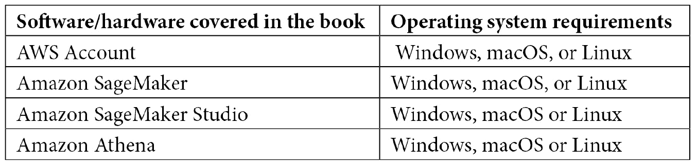

# 前言

**Amazon SageMaker** 是一个完全托管的 AWS 服务，它提供了构建、训练、部署和监控机器学习模型的能力。本书从对映射到机器学习过程各个阶段的 Amazon SageMaker 功能的高层次概述开始，以帮助建立正确的基础。你将学习有效的策略来应对数据科学挑战，例如大规模处理数据、数据准备、连接到大数据管道、识别数据偏差、运行 A/B 测试以及使用 Amazon SageMaker 进行模型可解释性。

随着你不断进步，你将了解如何应对大规模训练的挑战，包括如何在节省成本的同时使用大数据集，监控训练资源以识别瓶颈，加快长时间的训练任务，以及跟踪为共同目标训练的多个模型。继续前进，你将发现如何将 Amazon SageMaker 与其他 AWS 服务集成，以构建可靠、成本优化和自动化的机器学习应用。此外，你还将构建与 MLOps 原则集成的 ML 管道，并应用最佳实践来构建安全且性能卓越的解决方案。

到本书结束时，你将能够自信地应用 Amazon SageMaker 的广泛功能，以应对机器学习工作流程的全谱系。

# 本书面向的对象

本书面向的是负责使用 Amazon SageMaker 构建机器学习应用的高级数据科学家。需要具备 Amazon SageMaker、机器学习、深度学习以及使用 Jupyter Notebooks 和 Python 的经验。对与数据、安全和监控相关的 AWS 服务的了解将帮助你充分利用本书。

# 本书涵盖的内容

*第一章*，*Amazon SageMaker 概述*，提供了对映射到机器学习过程各个阶段的高层次概述的 Amazon SageMaker 功能。这为使用 SageMaker 功能处理数据科学挑战的最佳实践讨论奠定了基础。

*第二章*，*数据科学环境*，提供了技术要求的简要概述，并讨论了使用 Amazon SageMaker 设置必要的数据科学环境。这为本书其余部分构建和自动化机器学习解决方案奠定了基础。

*第三章*，*使用 Amazon SageMaker Ground Truth 进行数据标注*，从对大规模标注数据所涉及挑战的回顾开始——成本、时间、独特的标注需求、不准确性和偏见。讨论了使用 Amazon SageMaker Ground Truth 解决已识别挑战的最佳实践。

*第四章*, *使用 Amazon SageMaker Data Wrangler 和 Processing 进行大规模数据准备*，首先回顾了大规模数据准备中涉及到的挑战——计算/内存资源限制、长处理时间，以及特征工程努力重复、偏差检测和了解特征重要性的挑战。随后讨论了 Amazon SageMaker 解决这些挑战的能力以及应用最佳实践。

*第五章*, *使用 Amazon SageMaker Feature Store 的集中特征仓库*，提供了使用 Amazon SageMaker Feature Store 构建的集中特征仓库的最佳实践。讨论了摄取特征和提供特征访问以满足访问时间要求的技术。

*第六章*, *大规模训练和调优*，提供了使用 Amazon SageMaker 在大数据集上训练和调优机器学习模型的最佳实践。讨论了诸如数据并行和模型并行分布式训练、自动模型调优以及将多个训练作业分组以识别最佳性能作业等技术。

*第七章*, *使用 Amazon SageMaker Debugger 分析训练作业*，讨论了调试、监控和配置训练作业以检测长时间运行的非收敛作业和消除资源瓶颈的最佳实践。Amazon SageMaker Debugger 提供的监控和配置能力有助于提高训练时间并降低训练成本。

*第八章*, *使用模型注册表进行大规模模型管理*，介绍了 SageMaker Model Registry 作为训练模型的集中目录。模型可以从注册表中部署，注册表中维护的元数据有助于了解单个模型的部署历史。模型注册表是解决模型部署自动化挑战（CI/CD）的重要组件。

*第九章*, *使用 Amazon SageMaker 端点生产变体更新生产模型*，探讨了使用 Amazon SageMaker 端点生产变体以最小化对模型消费者的影响来更新生产模型所面临的挑战。将使用相同的生产变体来展示高级策略，如金丝雀部署、A/B 测试、蓝绿部署，这些策略在平衡成本与停机时间以及回滚的简便性方面取得了平衡。

*第十章*, *优化模型托管和推理成本*，介绍了在 Amazon SageMaker 上优化托管和推理成本的最佳实践。讨论了多种部署策略，以满足不同推理流量需求下的计算需求和响应时间要求。

*第十一章*，*使用 Amazon SageMaker Model Monitor 和 Clarify 监控生产模型*，介绍了监控生产模型质量并接收关于模型质量退化的主动警报的最佳实践。你将学习如何使用 Amazon SageMaker Model Monitor 和 SageMaker Clarify 监控数据偏差、模型偏差、偏差漂移和特征归因漂移。

*第十二章*，*机器学习自动化工作流程*，将数据处理、训练、部署和模型管理集成到可以编排和集成到端到端解决方案的自动化工作流程中。

*第十三章*，*使用 Amazon SageMaker 构建架构良好的机器学习解决方案*，将 AWS 架构良好的框架提供的最佳实践应用于在 Amazon SageMaker 上构建机器学习解决方案。

*第十四章*，*跨账户管理 SageMaker 功能*，讨论了在涉及多个 AWS 账户的跨账户设置中使用 Amazon SageMaker 功能的最佳实践，这允许你更好地治理和管理机器学习开发生命周期中的机器学习活动。

# 为了充分利用这本书

你应该有一个 AWS 账户，并熟悉 AWS 和 Amazon SageMaker。你还应该熟悉基本的机器学习概念。代码示例是用 Python 编写的，通常在 Jupyter 笔记本中执行。你不需要在计算机上安装 Python 或其他软件。

为了设置你的数据科学环境，你还应该熟悉基础设施即代码和配置即代码的概念。如果你也熟悉 AWS CloudFormation，那将很有帮助，但这不是必需的。



**如果你使用的是这本书的数字版，我们建议你亲自输入代码或从书的 GitHub 仓库（下一节中有一个链接）获取代码。这样做将帮助你避免与代码复制粘贴相关的任何潜在错误。**

# 下载示例代码文件

你可以从 GitHub 上下载这本书的示例代码文件[`github.com/PacktPublishing/Amazon-SageMaker-Best-Practices`](https://github.com/PacktPublishing/Amazon-SageMaker-Best-Practices)。如果代码有更新，它将在 GitHub 仓库中更新。

我们还有其他来自我们丰富的书籍和视频目录的代码包，可在[`github.com/PacktPublishing/`](https://github.com/PacktPublishing/)找到。查看它们吧！

# 下载彩色图像

我们还提供了一个包含本书中使用的截图和图表彩色图像的 PDF 文件。你可以从这里下载：

[`static.packt-cdn.com/downloads/9781801070522_ColorImages.pdf`](https://static.packt-cdn.com/downloads/9781801070522_ColorImages.pdf)

# 使用的约定

在本书中使用了多种文本约定。

`文本中的代码`：表示文本中的代码词汇、数据库表名、文件夹名、文件名、文件扩展名、路径名、虚拟 URL、用户输入和 Twitter 昵称。以下是一个示例：“要使用 Amazon SageMaker Debugger，您必须使用三个额外的配置参数增强`Estimator`：`DebuggerHookConfig`、`Rules`和`ProfilerConfig`。”

代码块应如下设置：

```py
#Feature group name
weather_feature_group_name_offline = 'weather-feature-group-offline' + strftime('%d-%H-%M-%S', gmtime())
```

当我们希望您注意代码块中的特定部分时，相关的行或项目将以粗体显示：

```py
@smp.step
def train_step(model, data, target):
       output = model(data)
       long_target = target.long()
       loss = F.nll_loss(output, long_target, reduction="mean")
       model.backward(loss)
       return output, loss
    return output, loss 
```

任何命令行输入或输出都应如下所示：

```py
$ mkdir css
$ cd css
```

**粗体**：表示新术语、重要词汇或屏幕上看到的词汇。例如，菜单或对话框中的词汇以**粗体**显示。以下是一个示例：“请注意，当您在训练集群中使用多个实例时，所有实例应位于相同的**可用区**。”

小贴士或重要注意事项

看起来像这样。

# 联系我们

我们始终欢迎读者的反馈。

`customercare@packtpub.com`并在邮件主题中提及书名。

**勘误表**：尽管我们已经尽一切努力确保内容的准确性，但错误仍然可能发生。如果您在这本书中发现了错误，我们将非常感激您向我们报告。请访问[www.packtpub.com/support/errata](http://www.packtpub.com/support/errata)并填写表格。

`copyright@packt.com`并附上材料的链接。

**如果您有兴趣成为作者**：如果您在某个领域有专业知识，并且您有兴趣撰写或为书籍做出贡献，请访问[authors.packtpub.com](http://authors.packtpub.com)。

# 分享您的想法

一旦您阅读了*Amazon SageMaker 最佳实践*，我们很乐意听听您的想法！请访问[`packt.link/r/1-801-07052-0`](https://packt.link/r/1-801-07052-0)此书并分享您的反馈。

您的评论对我们和科技社区都很重要，并将帮助我们确保我们提供高质量的内容。
