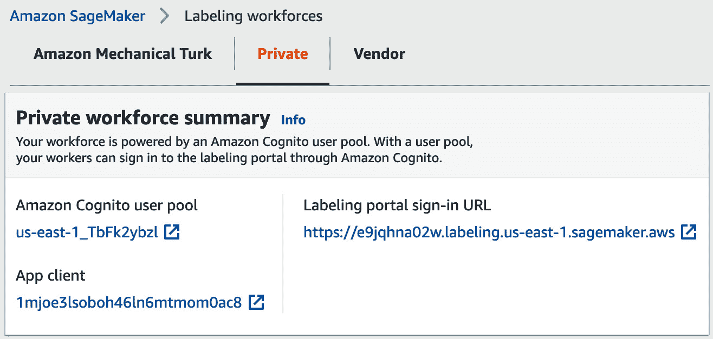
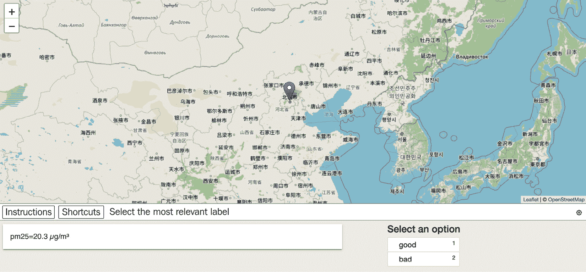
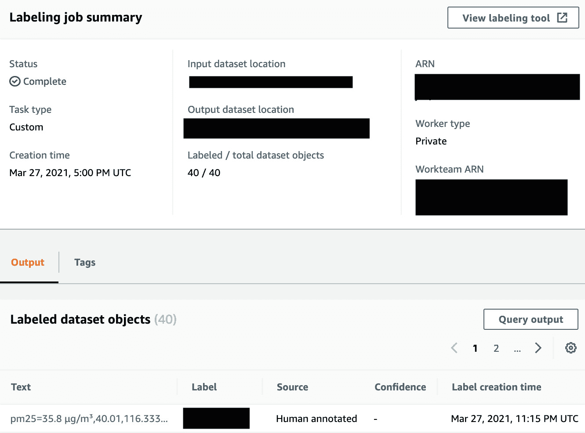
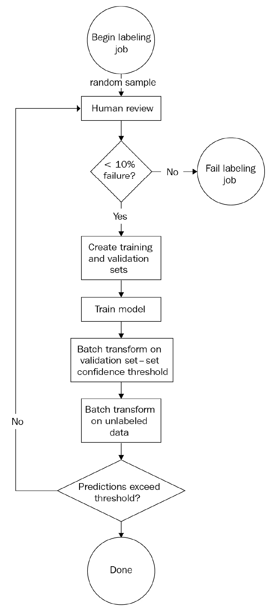
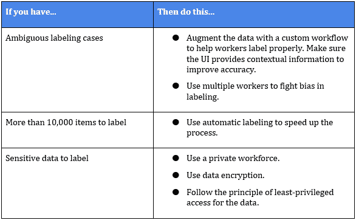

# 第三章：使用 Amazon SageMaker Ground Truth 进行数据标注

在大多数公司中，最大的机器学习项目障碍之一是获取标注的训练数据。在我们合作的一家公司中，我们试图确定对消费者有影响的故障。客户从其应用程序堆栈的每一层都有大量数据，但他们无法就如何定义故障达成一致。故障是不是当负载均衡器宕机时？可能不是——我们在基础设施层有冗余。故障是不是当客户无法访问服务超过 10 分钟时？这可能太细粒度了；单个客户可能由于本地网络连接问题而出现问题。那么，我们究竟指的是什么故障？我们如何自动将我们的训练数据标注为*故障*或*非故障*？

在本章中，我们将回顾使用 SageMaker Ground Truth 进行数据标注。我们将涵盖与大数据集和潜在有偏见数据相关的一些常见挑战。

本章将涵盖以下主题：

+   在大规模数据标注中遇到的挑战

+   使用自定义标注工作流程解决独特的标注需求

+   使用主动学习来减少标注时间

+   安全性和权限

# 技术要求

您需要 AWS 账户来运行本章包含的示例。如果您尚未设置数据科学环境，请参阅*第二章**，数据科学环境*，其中提供了设置过程的概述。

书中包含的代码示例可在 GitHub 上找到，网址为[`github.com/PacktPublishing/Amazon-SageMaker-Best-Practices/tree/main/Chapter03`](https://github.com/PacktPublishing/Amazon-SageMaker-Best-Practices/tree/main/Chapter03)。您需要安装 Git 客户端才能访问它们（[`git-scm.com/`](https://git-scm.com/))。

本章的代码位于 GitHub 仓库的`CH03`文件夹中。

# 在大规模数据标注中遇到的挑战

除了在如何标注数据上达成共识的概念性挑战外，我们还需要考虑物流。**SageMaker Ground Truth**允许您将数据标注工作分配给人工劳动力。但您可能会面临以下额外挑战：

+   **独特的标注逻辑**：如果我们的标注案例需要自定义工作流程，我们需要在地面真实情况中对其进行建模。

+   **标注质量**：工人应用标签可能存在隐含偏见，这会影响结果。

+   **成本和时间**：标注数据需要一段时间的人力。如果您有一个非常大的数据集，您将消耗大量的人时。

+   **安全性**：鉴于您的数据可能敏感，您需要确保数据访问仅限于授权的工作人员。

    其他信息

    如果您需要了解地面真实情况的介绍，请参阅由 Julien Simon 撰写的《Learn Amazon SageMaker》的*第二章*。

为了将这些关注点聚焦起来，让我们考虑一下我们在上一章中介绍的天气数据。Ground Truth 没有内置的工作流程允许我们提示工作人员根据我们描述空气为 *好* 或 *坏* 的逻辑来标注天气数据。整个时间段的整个数据集大约为 499 GB；手动将每条记录标注为 *好* 或 *坏* 天气质量将花费一些时间。最后，我们的工作人员可能会有他们自己的隐含或无意识的偏见。

在一个严重雾霾的城市长大的工作人员可能对空气质量的感知与在一个非常干净的乡村地区长大的工作人员大不相同。在接下来的章节中，我们将讨论如何解决这些挑战。

# 使用自定义标注工作流程解决独特的标注需求

让我们从为我们的天气数据创建一个标注任务开始。我们希望将每个天气报告标注为 *好* 或 *坏*。为了帮助我们的工作人员完成这项工作，我们将制作一个精美的前端，在地图上显示气象站的位置并显示气象站的读数。我们需要一个自定义的工作流程，因为这种场景并没有完美地符合现有的 Ground Truth 模板。

我们需要设置以下内容：

+   由 Cognito 用户池支持的私有工作团队

+   一个列出我们想要标注的项目清单的清单文件

+   一个自定义的 Ground Truth 标注工作流程，由两个 Lambda 函数和一个 UI 模板组成

我们存储库 `CH02` 文件夹中的笔记本 `LabelData.ipynb` 演示了这些步骤。

## 一个私有的标注工作团队

虽然你可以使用公共工作团队，但大多数公司都会希望使用私有工作团队来标注自己的数据。设置私有工作团队的第一步是定义一个 Cognito 用户池，在实际用例中，它可能链接到另一个身份提供者，如 Active Directory。

我们将在 Cognito 中创建一个用户组；你可以使用组来创建不同类型标注工作的团队。最后，我们将定义一个与 Cognito 用户组链接的 SageMaker 工作团队。请注意，SageMaker 创建了一个标注域，我们必须将其设置为 Cognito 用户池客户端的回调 URL。

一旦工作团队设置完成，笔记本将添加一个示例工作人员。

笔记本中的 **创建一个私有工作团队** 部分为您执行了所有这些步骤：

+   创建一个 Cognito 用户池

+   为用户池创建一个 Cognito 客户端

+   为客户端创建一个身份池

+   创建一个用户组

+   将一个域分配给用户池

+   创建一个使用 Cognito 用户池和组的 SageMaker 工作团队

+   添加一个示例用户

一旦你执行了笔记本中的 **创建一个私有工作团队** 部分，你应该会看到一个定义好的私有工作团队，以及工作人员将使用的登录 URL。如果你继续向下滚动控制台的这一部分，你还会看到关于工作团队和分配给该团队的工作人员的信息，如图 *图 3.1* 所示：



图 3.1 – 在 SageMaker 控制台中显示的标记劳动力

## 列出需要标记的数据

我们需要创建一个清单文件，告诉 Ground Truth 如何找到我们想要标记的数据。在清单中，我们可以列出 S3 中的文件引用，或者直接提供文本数据。

回想一下，我们的源数据是 JSON 格式。每个源文件包含多个条目，看起来像这样：

```py
{"date":{"utc":"2021-03-20T19:00:00.000Z","local":"2021-03-20T23:00:00+04:00"},"parameter":"pm25","value":32,"unit":"µg/m³","averagingPeriod":{"val
ue":1,"unit":"hours"},"location":"US Diplomatic Post: Dubai","city":"Dubai","country":"AE","coordinates":{"latitude":25.25848,"longitude":55.309166
},"attribution":[{"name":"EPA AirNow DOS","url":"http://airnow.gov/index.cfm?action=airnow.global_summary"}],"sourceName":"StateAir_Dubai","sourceT
ype":"government","mobile":false}
```

我们不能传递单个文件的链接，因为每个文件都包含多个需要标记的记录。相反，我们将在清单文件中直接总结每条记录。清单中的每一行将包含空气质量指标和位置：

```py
{"source": "pm25,35.8,µg/m³,40.01,116.333"}
```

`创建清单文件` 笔记本部分将为记录集生成一个清单。由于您是唯一的工人，我们默认将记录数限制为 20（更多内容将在下一节中介绍）。

## 创建工作流程

为了创建自定义工作流程，我们需要以下内容：

+   一个可以接受清单中的一个条目并将变量注入 UI 的 *Lambda 函数*。在这种情况下，我们将简单地映射清单文本条目到一个度量标签，并与其地理位置一起显示。

+   一个 *UI 模板，可以合理地显示给工人的数据*。在这种情况下，我们有一个简单的 UI 模板，它展示了指标以及收集指标的地理位置地图。

    注意

    对于本书的目的，我们正在使用来自 OpenStreetMap 的地图瓦片。不要在生产用例中使用这些瓦片。相反，使用商业提供商，如 Google Maps 或 Here。

+   一个 *Lambda 函数，用于合并多个工人的注释*。由于我们的样本劳动力中只有一个工人，我们在这里简单地进行了透传。

笔记本部分 `创建自定义工作流程` 会引导你完成以下步骤：

+   定义工作流程和 Lambda 函数的 IAM 角色

+   将用户界面模板和 Lambda 处理代码上传到 S3

+   创建预处理和后处理 Lambda 函数

+   定义标记工作

一旦创建标记工作，您可以通过标记门户 URL（见 *图 1.1*）登录，使用笔记本中指定的用户名和密码。一旦打开工作，您将看到一个类似于 *图 3.2* 的 UI：



图 3.2 – 显示气象站位置的标记 UI。位置以当地语言显示

您将看到一个显示测量位置和实际测量的地图。您可以选择 *好* 或 *坏* 来指定您认为测量是否代表空气质量好或坏的一天。在您标记完所有指标后，您的作业将显示为完成，您将看到每个数据点的标签，如图 *图 3.3* 所示：



图 3.3 – 完成的标记工作

我们将在下一章中描述如何使用标注输出。您将在与本章节相关的笔记本中看到标注输出的示例。

# 使用多个工作者提高标注质量

依赖于单一意见进行主观评估是危险的。在某些情况下，标注看起来很简单；在标注交通图片时区分汽车和飞机相当简单。但让我们回到我们的天气数据。如果我们根据一个不直观的测量值（如颗粒物水平 PM25）来标注空气质量为好或坏，我们可能会发现工作者的意见在很大程度上取决于我们给予他们的建议和他们的先入之见。如果一个工作者认为某个城市或国家有 *脏空气*，他们在模糊情况下可能会倾向于选择 *坏* 标签。而这些偏见有实际后果——一些政府对他们的空气质量差这一想法非常敏感！

解决这个问题的方法之一是使用多个工作者来标注每个项目，并 somehow 结合分数。在名为 `Add another worker` 的笔记本部分，我们将向我们的私人工作团队中添加第二个工作者。然后在 `Launch labeling job for multiple workers` 部分中，我们将创建一个新的标注任务。一旦新任务准备就绪，以两个工作者的身份登录并标注我们已选定的少量数据。

现在会发生什么？我们需要调整我们的后处理 Lambda 来巩固标注。我们可以使用各种策略来进行巩固。例如，我们可以使用多数投票方案，在平局的情况下将其分配给一个 *混合* 类别。在本章中，我们将简单地使用最新的标注作为胜者，因为我们只有两个工作者。

# 使用主动学习减少标注时间

现在我们已经建立了一个标注工作流程，我们需要考虑规模。如果我们的数据集有超过 5,000 条记录，那么 Ground Truth 很可能能够学会如何为我们进行标注。（您至少需要 1,250 个标注记录来进行自动标注，但至少 5,000 是一个很好的经验法则。）这将在以下图中以迭代过程的形式发生：



图 3.4 – 自动标注工作流程

当您使用自动标注创建标注任务时，Ground Truth 将选择输入数据的一个随机样本进行人工标注。如果至少 90% 的这些项目在无错误的情况下被标注，Ground Truth 将将标注数据分成训练集和验证集。它将训练一个模型并计算一个置信度分数，然后尝试标注剩余的数据。如果自动生成的标签低于置信度阈值，它将把它们转交给工作者进行人工审查。这个过程会重复进行，直到整个数据集都被标注。虽然这个过程很难模拟，但它提供了一个迭代方法，通过人工输入来改进自动标注。

作为本节的结束语，你可能想知道一个能够自动标注数据的模型与一个更通用的机器学习模型之间的区别。这里有一条很细的界限。请记住，我们用于地面真相（Ground Truth）的数据可能并不完全代表我们在生产中看到的数据。我们对于一个通用机器学习模型的目标是创建一个无需任何人工输入就能产生准确推断的模型。

# 安全和权限

虽然有些数据并不敏感，但大多数公司都不希望在标注过程中将数据暴露给公众。在本节中，我们将介绍数据访问控制、加密和数据标注工作的人力资源管理。

当使用地面真相（或任何其他云服务）时，你应该遵循最小权限访问原则。限制允许创建标注作业的用户，并限制允许使用非私有工作队伍创建标注作业的用户。在自定义标注作业中，明确提供 Lambda 函数的调用权限。限制标注作业的访问权限，仅限于适当的 S3 存储桶和前缀。

当你运行标注作业时，地面真相将始终在 S3 中加密输出。你可以使用 S3 管理的密钥或提供自己的 KMS 密钥。对于非敏感数据，默认的 S3 管理密钥就足够了。如果你有敏感数据，考虑为不同的数据集使用不同的 KMS 密钥，因为这提供了另一层安全性。你也可以使用 KMS 密钥来加密用于自动标注的实例上的存储卷。

在管理你的工作队伍时，你应该限制对已知良好 IP 地址范围（CIDR 块）的访问。你还应该使用工人跟踪功能来记录哪些工人正在访问数据。当使用 Cognito 进行身份验证时，利用强大的密码策略和多因素身份验证。在大多数情况下，大型公司更愿意使用他们自己的身份提供者进行工作队伍管理。

最后，请注意，你需要在涉及标注工作的 S3 存储桶中添加**CORS（跨源资源共享）**配置，如文档中所述（[`docs.aws.amazon.com/sagemaker/latest/dg/sms-cors-update.html`](https://docs.aws.amazon.com/sagemaker/latest/dg/sms-cors-update.html)）。

在我们进入总结之前，请看一下以下表格，它总结了数据标注的一些最佳实践：



图 3.5 – 数据标注最佳实践的总结

通过这样，我们现在来到了本章的结尾。

# 总结

在本章中，我们开始深入挖掘我们的天气数据集，重点关注数据标注的问题。我们学习了如何使用 SageMaker Ground Truth 结合人工审核和自动化来标注大量数据集，如何使用自定义工作流程来辅助标注过程，以及如何通过使用多种意见来对抗标注偏差。我们以确保标注过程安全的一些建议作为结束。

在下一章中，我们将探讨数据准备。我们将在整个数据集上运行特征工程处理作业。
