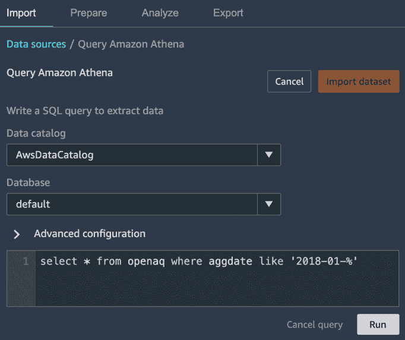
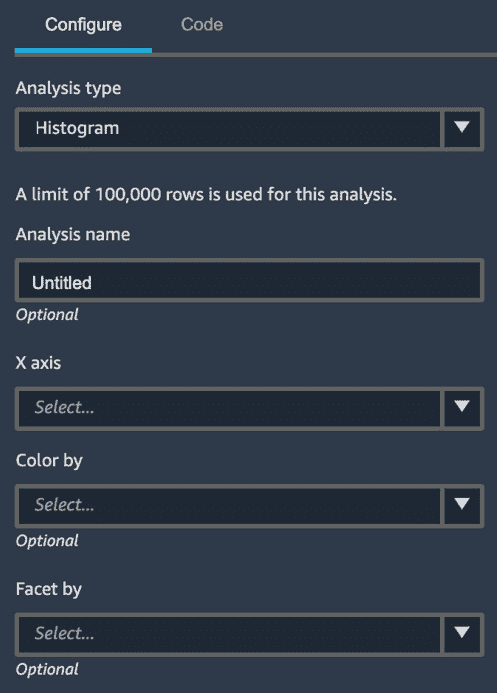
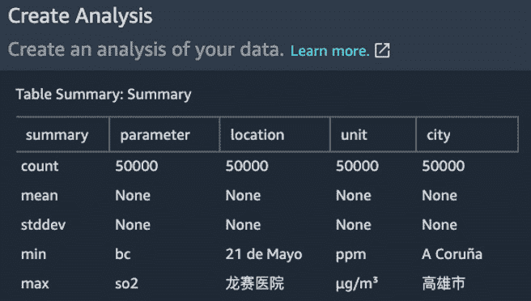
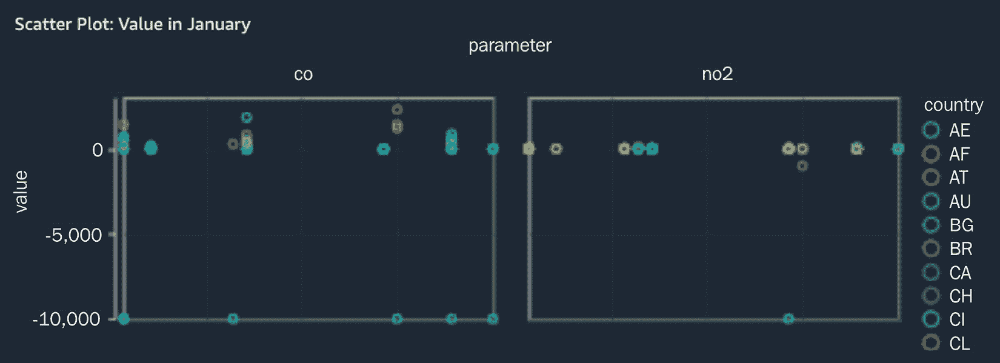
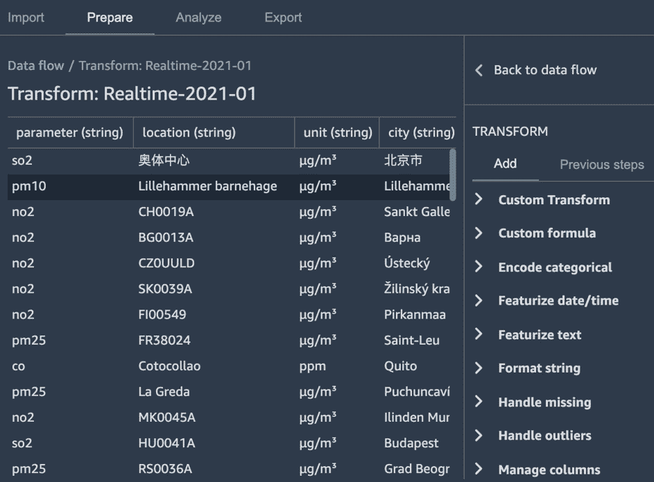
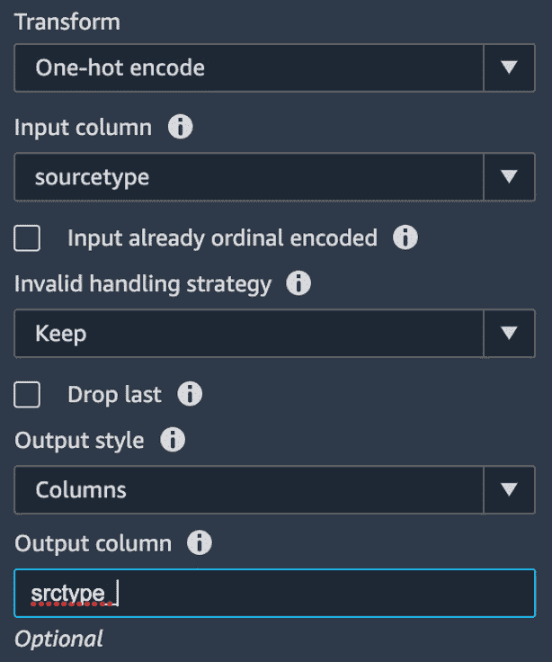
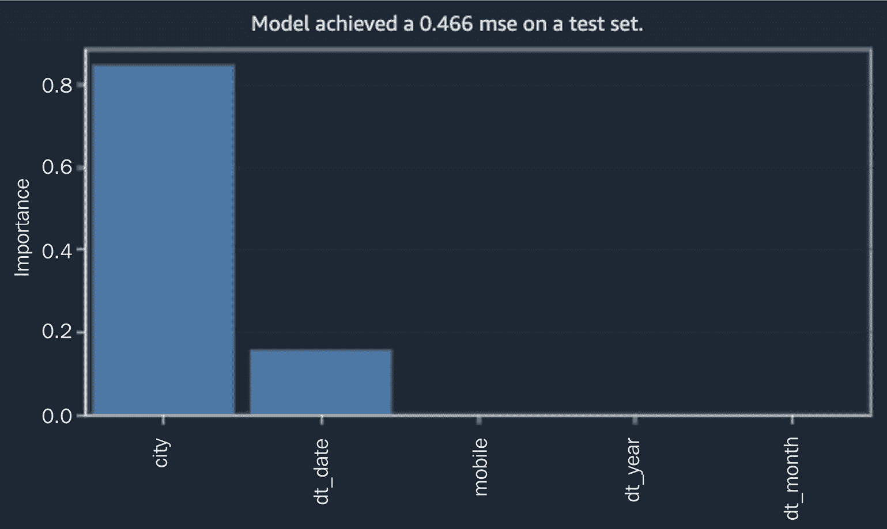

# 第四章：使用 Amazon SageMaker Data Wrangler 和 Processing 进行大规模数据准备

到目前为止，我们已经确定了我们的数据集并探索了手动和自动标记。现在，我们需要将注意力转向为训练准备数据。数据科学家熟悉特征工程步骤，例如**缩放数值特征**、**编码分类特征**和**降维**。

作为动机，让我们考虑我们的天气数据集。如果我们的输入数据集不平衡或并不真正代表我们在生产中遇到的数据，会怎样呢？我们的模型可能不会像我们希望的那样准确，后果可能非常严重。一些面部识别系统在偏向白人脸的数据集上进行了训练，产生了令人不安的后果([`sitn.hms.harvard.edu/flash/2020/racial-discrimination-in-face-recognition-technology/?web=1&wdLOR=cB09A9880-DF39-442C-A728-B00E70AF1CA9`](https://sitn.hms.harvard.edu/flash/2020/racial-discrimination-in-face-recognition-technology/?web=1&wdLOR=cB09A9880-DF39-442C-A728-B00E70AF1CA9))。

我们需要了解哪些输入特征正在影响模型。这在商业角度和法律或监管角度都很重要。考虑一个预测应用程序操作中断的模型。了解中断发生的原因可能比预测中断发生的时间更有价值——问题是出在我们的应用程序中，还是由于一些外部因素，如网络故障？然后，在某些行业，如金融服务行业，如果我们不能证明模型没有违反歧视性贷款等规定，我们就不能使用该模型。 

我们数据集的小版本（涵盖 1 个月）大约有 5 GB 的数据。我们可以在现代工作站上分析这个数据集而不会遇到太多困难。但完整的数据集，接近 500 GB，怎么办呢？如果我们想准备完整的数据集，我们需要与水平可扩展的集群计算框架合作。此外，如果我们使用低效的处理框架，编码分类变量等活动可能需要相当长的时间。

在本章中，我们将探讨在处理大型数据集时数据准备所面临的挑战，并检查**SageMaker**中帮助我们进行大规模特征工程的功能。

在本章中，我们将涵盖以下主题：

+   使用 Data Wrangler 进行可视数据准备

+   使用 Data Wrangler 进行偏差检测和可解释性

+   使用 SageMaker Processing 进行大规模数据准备

# 技术要求

运行本章中包含的示例需要 AWS 账户。如果您尚未设置数据科学环境，请参阅*第二章**，数据科学环境*，其中将指导您完成设置过程。

书中包含的代码示例可在 GitHub 上找到：[`github.com/PacktPublishing/Amazon-SageMaker-Best-Practices/tree/main/Chapter04`](https://github.com/PacktPublishing/Amazon-SageMaker-Best-Practices/tree/main/Chapter04)。您需要安装 Git 客户端才能访问它们（[`git-scm.com/`](https://git-scm.com/)）。

本章的代码位于 GitHub 仓库的 `CH04` 文件夹中。

# 使用 Data Wrangler 进行可视数据准备

让我们从我们的 1 个月数据集开始小规模操作。在深入研究更可扩展的技术之前，使用小数据集熟悉数据是一个好方法。SageMaker Data Wrangler 以一种简单的方式为我们提供了构建数据流的方法，这是一系列由可视化界面驱动的数据准备步骤。

在本节的其余部分，我们将使用 Data Wrangler 检查和转换数据，然后将 Data Wrangler 步骤导出为可重用的流程。

## 数据检查

让我们从数据检查的 Data Wrangler 开始，在这里我们查看数据的属性并确定如何为模型训练做准备。首先在 SageMaker Studio 中添加一个新的流程；转到**文件**菜单，然后选择**新建**，再选择**流程**。在流程启动并连接到 Data Wrangler 后，我们需要导入我们的数据。以下截图显示了 Data Wrangler 中的数据导入步骤：


图 4.1 – 在 Data Wrangler 中导入数据源

由于我们的数据集由多个散布在日期分区文件夹中的小 JSON 文件组成，我们将使用 `PrepareData.ipynb` 笔记本，它将指导你创建一个 `Glue` 数据库和表，并在名为 `Glue Catalog` 的部分中注册分区。完成这些后，点击**Athena**开始导入小数据集。

在下一屏幕上，指定你在笔记本中创建的数据库。输入以下查询以导入一个月的数据：

```py
select * from openaq where aggdate like '2019-01%'
```

以下截图显示了 Data Wrangler 中的导入步骤：



图 4.2 – Athena 导入到 Data Wrangler

运行查询并点击**导入数据集**。

现在我们准备进行一些分析和转换。点击数据流中最后一个框旁边的**+**符号，选择**添加分析**。你现在将有一个屏幕，你可以选择一个可用的分析，如下面的截图所示：



图 4.3 – 数据分析配置

从一个**表摘要**步骤开始，它显示了数值特征的某些统计属性，如下面的截图所示：



图 4.4 – 表摘要

接下来，让我们尝试一个散点图来帮助我们可视化测量值的分布。将 `y` 轴设置为 `value`，`x` 轴设置为 `aggdate`，按 `country` 着色，并按 `parameter` 分面。我们可以在以下预览图表中看到，二氧化氮的值随时间相对稳定，而一氧化碳的值在一些国家显示出更多的变化性：



图 4.5 – 通过日期显示测量值，按国家着色，并按参数分面的散点图

随意添加更多散点图或尝试直方图。我们将在“使用 Data Wrangler 和 Clarify 进行偏差检测和可解释性”部分探索偏差报告和快速模式。

现在我们已经进行了一些基本的数据检查，我们将继续进行数据转换。

## 数据转换

在本节中，我们将把原始数据格式转换为可用于模型训练的格式。回顾一下我们原始数据的基本格式：

```py
{“date”:{“utc”:”2021-03-20T19:00:00.000Z”,”local”:”2021-03-20T23:00:00+04:00”},”parameter”:”pm25”,”value”:32,”unit”:”µg/m³”,”averagingPeriod”:{“val
ue”:1,”unit”:”hours”},”location”:”US Diplomatic Post:Dubai”,”city”:”Dubai”,”country”:”AE”,”coordinates”:{“latitude”:25.25848,”longitude”:55.309166
},”attribution”:[{“name”:”EPA AirNow DOS”,”url”:”http://airnow.gov/index.cfm?action=airnow.global_summary”}],”sourceName”:”StateAir_Dubai”,”sourceT
ype”:”government”,”mobile”:false}
```

我们将使用 Data Wrangler 执行以下步骤：

+   规模数值。

+   对分类值进行编码。

+   添加与日期相关的特征（例如，星期几，月份中的某一天）。

+   删除不需要的列（`source name`、`coordinates`、`averaging period`、`attribution`、`units` 和 `location`）。这些列要么是冗余的（例如，位置的重要部分在城市和国家列中），要么不能作为特征使用。

返回流程的 *准备* 部分，点击数据流面板中最后一个框旁边的 **+** 符号，并选择 **添加转换**。您将看到数据集的预览和可用转换的列表，如下所示：



图 4.6 – Data Wrangler 中的数据转换

对于我们的第一次转换，选择 `sourcetype` 作为列，将 **输出样式** 设置为 **列**，并为新列名添加前缀：



图 4.7 – Data Wrangler 中的独热编码

当您完成设置转换后，点击 **预览**，然后点击 **添加** 以添加转换。现在您可以添加额外的转换来删除不需要的列，缩放数值列，并特征化日期。如果您愿意，还可以提供自己的自定义代码。

## 导出流程

当我们想要快速探索数据集时，Data Wrangler 非常方便。但我们也可以将流程的结果导出到 Amazon SageMaker **特征存储库**，生成 **SageMaker 管道**，创建 Data Wrangler 作业，或生成 **Python** 代码。我们现在不会使用这些功能，但请随意尝试它们。

# 使用 Data Wrangler 和 Clarify 进行偏差检测和可解释性

在我们对数据进行了初步的探索和准备之后，现在让我们对我们的输入数据进行一次合理性检查。虽然偏差可以意味着许多事情，但一个特定的症状是数据集中一种类型的数据样本比另一种类型多得多，这将影响我们模型的表现。我们将使用 Data Wrangler 来查看我们的输入数据是否不平衡，并了解哪些特征对我们模型最重要。

首先，向流程中添加一个分析。选择`mobile`列作为标签，`1`作为预测值。选择`city`列用于偏差分析，然后点击**检查偏差**。在这种情况下，我们想确定我们的数据集是否在某种程度上与城市不平衡，以及数据是否在移动站收集。如果来自移动源的数据质量低于非移动源，了解移动源在城市间的分布是否均匀将是有益的。

接下来，我们将检查**特征重要性**。特征重要性是模型可解释性的一个方面。我们想了解数据集中哪些部分对模型行为最重要。另一个方面，我们将在*第十一章**，使用 Amazon SageMaker Model Monitor 和 Clarify 监控生产模型*部分探讨，是了解哪些特征对特定推理做出了贡献。

在流程的最后一步添加另一个分析。选择`value`列（Data Wrangler 将推断这是一个回归问题）。预览并创建分析。您应该看到一个类似于以下屏幕截图的屏幕：



图 4.8 – Data Wrangler 生成的特征重要性

此分析生成一个随机森林模型，使用包含 30% 数据的测试集评估性能，并为每个特征计算一个**Gini 重要性分数**。如图 4.8 所示，城市和月份是最重要的特征。

到目前为止，我们已经使用 Data Wrangler 进行了视觉检查和转换。现在，我们将探讨如何使用 SageMaker Processing 处理更大的数据集。

# 使用 SageMaker Processing 进行大规模数据准备

现在，让我们将注意力转向准备整个数据集。由于有 500 GB，它太大，无法使用单个 EC2 实例上的 `sklearn` 进行处理。我们将编写一个使用 **Spark ML** 进行数据准备的 SageMaker 处理作业。（或者，您也可以使用 **Dask**，但在撰写本文时，SageMaker Processing 并未提供开箱即用的 Dask 容器。）

本章笔记本的`Processing Job`部分将指导您启动处理作业。请注意，我们将使用 15 个 EC2 实例的集群来运行作业（如果您需要提高限制，可以联系 AWS 支持）。

还请注意，到目前为止，我们一直在使用数据的未压缩 JSON 版本。这种包含数千个小 JSON 文件的格式对于 Spark 处理来说并不理想，因为`OpenAQ`数据集还包括一个`gzip`，它不是一个首选的压缩格式，因为它不可分割；如果您有选择，请使用 Snappy 压缩格式。

我们将使用我们数据的 gzip Parquet 版本进行较大的数据准备工作：

1.  首先，我们将定义`processor`类，使用`7200`秒（2 小时）。两小时足以处理 Parquet 数据集中的至少一张表。如果您想处理所有八张表，请将超时时间更改为 3 小时，并在`preprocess.py`脚本中进行调整：

    ```py
    spark_processor = PySparkProcessor(
        base_job_name=”spark-preprocessor”,
        framework_version=”3.0”,
        role=role,
        instance_count=15,
        instance_type=”ml.m5.4xlarge”,
        max_runtime_in_seconds=7200,
    )
    ```

1.  接下来，我们将设置 Spark 配置，遵循 EMR 博客中定义的公式（[`aws.amazon.com/blogs/big-data/best-practices-for-successfully-managing-memory-for-apache-spark-applications-on-amazon-emr/`](https://aws.amazon.com/blogs/big-data/best-practices-for-successfully-managing-memory-for-apache-spark-applications-on-amazon-emr/))：

    ```py
    configuration = [
        {
        “Classification”: “spark-defaults”,
        “Properties”: {“spark.executor.memory”: “18g”, 
            “spark.yarn.executor.memoryOverhead”: “3g”,
                       “spark.driver.memory”: “18g”,
              “spark.yarn.driver.memoryOverhead”: “3g”,
                       “spark.executor.cores”: “5”, 
                       “spark.driver.cores”: “5”,
                       “spark.executor.instances”: “44”,
                       “spark.default.parallelism”: “440”,
                “spark.dynamicAllocation.enabled”: “false”
                      },
        },
        {
        “Classification”: “yarn-site”,
        “Properties”: {“yarn.nodemanager.vmem-check-enabled”: “false”, 
          “yarn.nodemanager.mmem-check-enabled”: “false”},
        }
    ]
    ```

1.  最后，我们将启动作业。我们需要包含一个 JSON `serde`类：

    ```py
    spark_processor.run(
        submit_app=”scripts/preprocess.py”,
        submit_jars=[“s3://crawler-public/json/serde/json-serde.jar”],
        arguments=['--s3_input_bucket', s3_bucket,
                  '--s3_input_key_prefix', s3_prefix_parquet,
                   '--s3_output_bucket', s3_bucket,
                 '--s3_output_key_prefix', s3_output_prefix],
        spark_event_logs_s3_uri=”s3://{}/{}/spark_event_logs”.format(s3_bucket, 'sparklogs'),
        logs=True,
        configuration=configuration
    )
    ```

处理脚本`CH04/scripts/preprocess.py`会经过几个步骤，我们将在后续章节中解释。

## 加载数据集

我们将从 S3 加载一个或多个 Parquet 表集。如果您想处理多个，请修改`get_tables`函数以返回列表中的更多表名，如下所示：

```py
# the helper function `get_tables` lists the tables we want to include
tables = get_tables()
df = spark.read.parquet( 
    f”s3://{args.s3_input_bucket}/” +
    f”{args.s3_input_key_prefix}/{tables[0]}/”)
for t in tables[1:]:
    df_new = spark.read.parquet( 
        f”s3://{args.s3_input_bucket}/” +
        f”{args.s3_input_key_prefix}/{t}/”)
    df = df.union(df_new)
```

处理脚本中的下一步是删除数据集中的不必要的列。

## 删除列

我们将重复在 Data Wrangler 中执行的大部分步骤，使用**PySpark**。我们需要删除一些我们不想要的列，如下所示：

```py
df = df.drop('date_local') \     
.drop('unit') \
.drop('attribution') \
.drop('averagingperiod') \
.drop('coordinates')
```

## 转换数据类型

我们将`mobile`字段转换为整数：

```py
df = df.withColumn(“ismobile”,col(“mobile”).cast(IntegerType())) \
.drop('mobile')
```

## 缩放数值字段

我们将使用 Spark ML 标准缩放器来转换`value`字段：

```py
value_assembler = VectorAssembler(inputCols=[“value”], outputCol=”value_vec”)
value_scaler = StandardScaler(inputCol=”value_vec”, outputCol=”value_scaled”)
value_pipeline = Pipeline(stages=[value_assembler, value_scaler])
value_model = value_pipeline.fit(df)
xform_df = value_model.transform(df)
```

## 特征化日期

日期本身并不那么有用，因此我们将从中提取几个新特征，表示日期、月份、季度和年份：

```py
xform_df = xform_df.withColumn('aggdt', 
               to_date(unix_timestamp(col('date_utc'), 
“yyyy-MM-dd'T'HH:mm:ss.SSSX”).cast(“timestamp”)))
xform_df = xform_df.withColumn('year',year(xform_df.aggdt)) \
        .withColumn('month',month(xform_df.aggdt)) \
        .withColumn('quarter',quarter(xform_df.aggdt))
xform_df = xform_df.withColumn(“day”, date_format(col(“aggdt”), “d”))
```

## 模拟空气质量标签

虽然我们在*第三章**，使用 Amazon SageMaker Ground Truth 进行数据标注*中使用了地面真实数据，但为了演示的目的，我们将使用一个简单的启发式方法来分配这些标签：

```py
isBadAirUdf = udf(isBadAir, IntegerType())
xform_df = xform_df.withColumn('isBadAir', isBadAirUdf('value', 'parameter'))
```

## 编码分类变量

现在，我们将对分类特征进行编码。这些特征中的大多数都具有相当高的基数，因此我们将在这里执行顺序编码，并在训练过程中稍后学习嵌入。我们只将对参数使用独热编码，它只有七个可能的选择：

```py
parameter_indexer = StringIndexer(inputCol=”parameter”, \
outputCol=”indexed_parameter”, handleInvalid='keep')
location_indexer = StringIndexer(inputCol=”location”, \
outputCol=”indexed_location”, handleInvalid='keep')
city_indexer = StringIndexer(inputCol=”city”, \ 
outputCol=”indexed_city”, handleInvalid='keep')
country_indexer = StringIndexer(inputCol=”country”, \
outputCol=”indexed_country”, handleInvalid='keep')
sourcename_indexer = StringIndexer(inputCol=”sourcename”, \
outputCol=”indexed_sourcename”, handleInvalid='keep')
sourcetype_indexer = StringIndexer(inputCol=”sourcetype”, \
outputCol=”indexed_sourcetype”, handleInvalid='keep')
enc_est = OneHotEncoder(inputCols=[“indexed_parameter”], \
outputCols=[“vec_parameter”])
enc_pipeline = Pipeline(stages=[parameter_indexer, location_indexer, 
        city_indexer, country_indexer, sourcename_indexer, 
        sourcetype_indexer, enc_est])
enc_model = enc_pipeline.fit(xform_df)
enc_df = enc_model.transform(xform_df)
param_cols = enc_df.schema.fields[17].metadata['ml_attr']['vals']
```

## 分割和保存数据集

在对数据集进行一些最后的清理后，我们可以将数据集分为训练集、验证集和测试集，并将它们保存到 S3：

```py
(train_df, validation_df, test_df) = final_df.randomSplit([0.7, 0.2, 0.1])
train_df.write.option(“header”,True).csv('s3://' + \
os.path.join(args.s3_output_bucket, 
      args.s3_output_key_prefix, 'train/'))
validation_df.write.option(“header”,True).csv('s3://' + \
os.path.join(args.s3_output_bucket, 
      args.s3_output_key_prefix, 'validation/'))
test_df.write.option(“header”,True).csv('s3://' + \
os.path.join(args.s3_output_bucket, 
      args.s3_output_key_prefix, 'test/'))
```

在本节中，我们学习了如何使用 SageMaker Processing 作业在更大的数据集上使用 Apache Spark 进行数据准备。在实际应用中，许多数据集足够大，需要分布式处理框架，现在你了解了如何将 Spark 作业集成到你的 SageMaker 工作流程中。

# 摘要

在本章中，我们处理了一个大型（约 500 GB）数据集的特征工程问题。我们探讨了包括可扩展性、偏差和可解释性在内的挑战。我们了解了如何使用 SageMaker Data Wrangler、Clarify 和 Processing 作业来探索和准备数据。

虽然有多种使用这些工具的方法，但我们建议使用 Data Wrangler 进行小到中等规模数据集的交互式探索。对于处理整个大型数据集，切换到使用 Spark 框架的编程方式来利用并行处理。 （在撰写本文时，Data Wrangler 不支持在多个实例上运行，但你可以在多个实例上运行一个处理作业。）你始终可以将 Data Wrangler 流程导出作为起点。

如果你的数据集达到数个 TB，考虑直接在**EMR**或 Glue 上运行 Spark 作业，并使用 SageMaker Spark SDK 调用 SageMaker。EMR 和 Glue 对 Spark 运行时进行了优化，并与 S3 存储有更高效的集成。

到目前为止，我们的数据已经准备好用于模型训练。在下一章中，我们将探讨使用 Amazon SageMaker Feature Store 来帮助我们管理准备好的特征数据。
