# 第五章：使用 Amazon SageMaker Feature Store 的集中式特征仓库

让我们从基本问题开始——什么是特征存储，为什么它是必要的？特征存储是一个持久化工程特征的仓库。特征工程需要花费大量时间，有时涉及多步骤的数据处理管道，这些管道需要数小时的计算时间。机器学习模型依赖于这些来自各种数据源的工程特征。特征存储通过减少将原始数据转换为特征所需的重复数据处理来加速这一过程。特征存储不仅允许你在模型构建活动中共享工程特征，还允许在使用工程特征进行推理时保持一致性。

**Amazon SageMaker Feature Store** 是一个具有存储、更新、检索和共享特征功能的托管仓库。SageMaker Feature Store 提供了在两种不同场景下重用工程特征的能力。首先，特征可以在单个机器学习项目的训练和推理阶段之间共享，从而实现一致的模型输入和减少训练-服务偏差。其次，SageMaker

特征存储也可以在多个机器学习项目中共享，从而提高数据科学家的生产力。

到本章结束时，您将能够使用 Amazon SageMaker Feature Store 的功能，并将最佳实践应用于解决减少数据处理时间和为近实时机器学习推理设计特征架构的挑战。

在本章中，我们将涵盖以下主要内容：

+   Amazon SageMaker Feature Store 的基本概念

+   创建可重用特征以减少特征不一致性和推理延迟

+   为近实时机器学习预测设计解决方案

# 技术要求

您需要 AWS 账户才能运行本章中包含的示例。如果您尚未设置数据科学环境，请参阅*第二章*，*数据科学环境*，其中提供了设置过程的概述。

书中包含的代码示例可在 GitHub 上找到，网址为 [`github.com/PacktPublishing/Amazon-SageMaker-Best-Practices/tree/main/Chapter05`](https://github.com/PacktPublishing/Amazon-SageMaker-Best-Practices/tree/main/Chapter05)。您需要安装 Git 客户端才能访问它们（[`git-scm.com/`](https://git-scm.com/)）。

# Amazon SageMaker Feature Store 基础知识

在本节中，您将学习 Amazon SageMaker Feature Store 的基本术语和功能。Amazon SageMaker Feature Store 提供了一个集中式仓库，具有存储、更新、检索和共享特征的能力。可扩展的存储和近实时特征检索是 Amazon SageMaker Feature Store 的核心。利用 Amazon SageMaker Feature Store 涉及三个高级步骤，如下面的图所示：

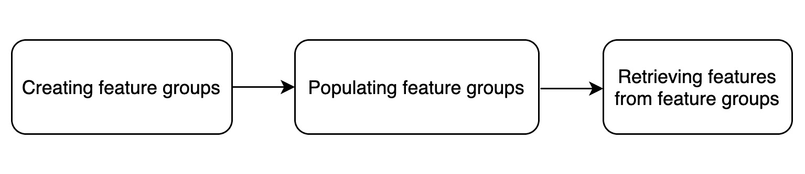

图 5.1 – 使用 Amazon SageMaker 特征存储的高级步骤

让我们更详细地看看这些步骤中每一步涉及的内容。

# 创建特征组

在 Amazon SageMaker 特征存储中，特征存储在一个称为 `RecordIdentifier` 的集合中。属于每个特征组的每个记录都将使用与 `RecordIdentifier` 相同的特征。例如，为天气数据创建的特征存储的记录标识符可以是 `parameter_id` 或 `location_id`。将 `RecordIdentifier` 视为特征组的主键。使用这个主键，您可以查询特征组以快速查找特征。还重要的是要注意，特征组的每个记录至少必须包含一个 `RecordIdentifier` 和一个事件时间特征。当设置特征组时，事件时间特征由 `EventTimeFeatureName` 确定。当特征记录被摄入特征组时，SageMaker 为每个特征记录添加三个特征 – `is_deleted`、`api_invocation` 时间和 `write_time` –。`is_deleted` 用于管理记录的删除，`api_invocation_time` 是调用 API 将记录写入特征存储的时间，而 `write_time` 是特征记录持久化到离线存储的时间。

*图 5.2* 展示了特征存储的结构的高级视图：

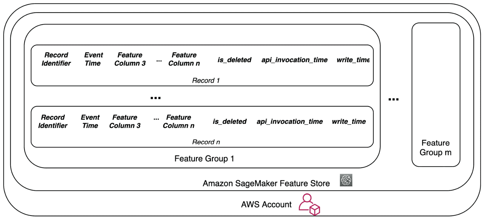

图 5.2 – Amazon SageMaker 特征存储结构

虽然每个特征组都是独立管理和扩展的，但你可以在适当访问权限的情况下搜索和发现多个特征组中的特征。

当您使用 SageMaker 创建特征存储组时，可以选择启用离线存储、在线存储或两者都启用。当启用在线和离线存储时，服务将在线存储内容复制到 Amazon S3 中维护的离线存储。

以下代码块展示了创建特征存储的过程：

1.  首先定义特征组名称：

    ```py
    #Feature group name
    weather_feature_group_name_offline = 'weather-feature-group-offline' + strftime('%d-%H-%M-%S', gmtime())
    ```

1.  然后，创建捕获特征名称和类型的特征定义：

    ```py
    ##Create FeatureDefinitions
    fd_location=FeatureDefinition(feature_name='location', feature_type=FeatureTypeEnum('Integral'))
    fd_event_time=FeatureDefinition(feature_name='EventTime', feature_type=FeatureTypeEnum('Fractional'))
    …
    weather_feature_definitions = []
    weather_feature_definitions.append(fd_location)
    weather_feature_definitions.append(fd_event_time)
    …
    ```

1.  接下来，定义记录标识符特征：

    ```py
    ##Define unique identifier
    record_identifier_feature_name = "location"
    ```

1.  最后，使用 `create()` API 创建特征组，默认情况下，它创建一个具有离线存储的特征组：

    ```py
    #Create offline feature group
    weather_feature_group_offline =     \ 
        FeatureGroup(name=weather_feature_group_name_offline,
             feature_definitions=weather_feature_definitions,
                     sagemaker_session=sagemaker_session) 
    weather_feature_group_offline.create(
                 s3_uri=f"s3://{s3_bucket_name}/{prefix}",
                record_identifier_name="location",
                event_time_feature_name="EventTime",
                role_arn=role
    )
    ```

1.  要启用在线存储以及离线存储，请使用 `enable_online_store`，如下面的代码所示：

    ```py
    weather_feature_group_offline_online.create(
                s3_uri=f"s3://{s3_bucket_name}/{prefix}",
        record_identifier_name="location", 
               event_time_feature_name="EventTime",
               role_arn=role,
              enable_online_store=True
    )
    ```

1.  要创建仅启用在线存储的特征组，将 `s3_uri` 设置为 `False`，如下面的代码所示：

    ```py
    weather_feature_group_online.create(
                s3_uri=False,
                record_identifier_name="location", 
               event_time_feature_name="EventTime",
               role_arn=role,
               enable_online_store=True
    )
    ```

注意，您还可以使用 **SageMaker Studio** 创建特征组。一旦使用 API 或 SageMaker Studio 创建了特征组，您就可以在 SageMaker Studio 中查看它们及其状态。*图 5.3* 展示了 SageMaker Studio 中的特征组列表：

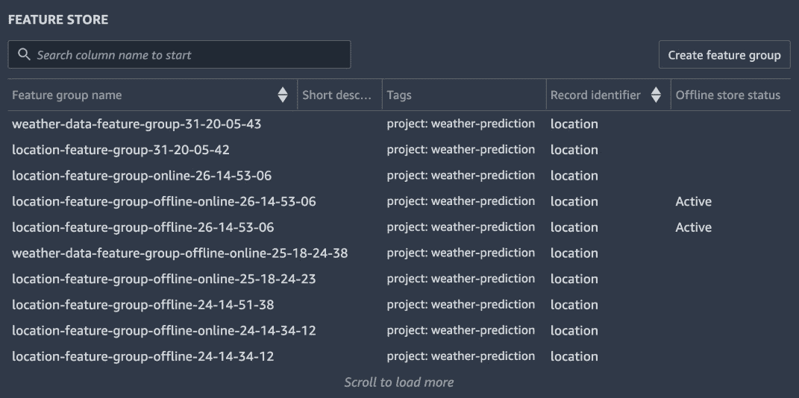

图 5.3 – SageMaker Studio 中的特征组列表

为了总结特征组创建的讨论，以下表格总结了在线和离线特征存储之间的差异：

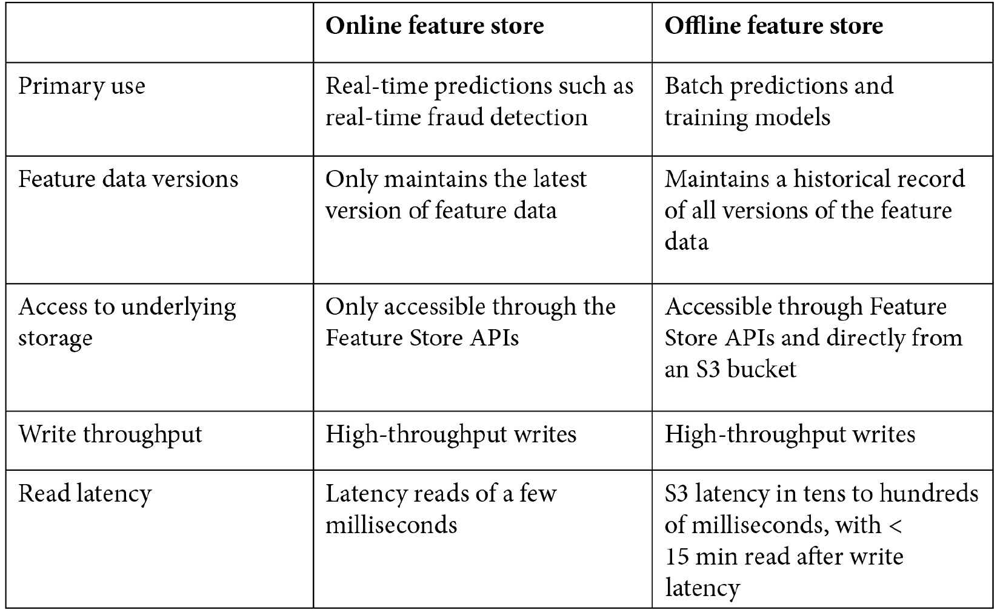

图 5.4 – 在线特征存储和离线特征存储的比较

现在您可以在特征存储中创建特征组了，让我们看看如何填充它们。

# 填充特征组

在创建特征组后，您将使用特征填充它们。您可以使用**批量摄取**或**流式摄取**将特征摄取到特征组中，如图 5.5 所示：

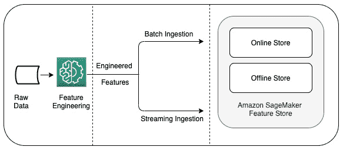

图 5.5 – 将特征摄取到特征组中

要将特征摄取到特征存储中，您创建一个可以填充特征存储的特征管道。`PutRecord` API 调用是摄取特征的核心 SageMaker API。这适用于在线和离线特征存储，以及通过批量或流式方法摄取。

以下代码块显示了`PutRecord` API 的使用：

```py
##Create a record to ingest into the feature group
record = []
event_time_feature = {'FeatureName': 'EventTime','ValueAsString': str(int(round(time.time())))}
location_feature =   {'FeatureName': 'location','ValueAsString': str('200.0')}
ismobile_feature =   {'FeatureName':   'ismobile','ValueAsString': str('0')}
value_feature ={'FeatureName': 'value','ValueAsString': str('34234.0')}

record.append(event_time_feature)
record.append(location_feature)
record.append(ismobile_feature)
record.append(value_feature)

response = sagemaker_fs_runtime_client.put_record(
       FeatureGroupName=weather_feature_group_online,
                                             Record=record)
```

您还可以使用包装 API，`fg.ingest`，它接受一个 pandas `dataframe`作为输入，并允许您配置多个工作进程和进程以并行摄取特征。以下代码块显示了如何使用`ingest()` API：

```py
#Read csv directly from S3 into a dataframe
weather_df = pd.read_csv(s3_path)

#Ingest features into the feature group
weather_feature_group_offline.ingest(
          data_frame=weather_df, max_workers=3, wait=True
)
```

对于批量摄取，您可以使用作者特征（例如，使用`PutRecord` API 调用）。当将记录摄取到在线特征存储时，您仅维护给定记录标识符的最新特征值。如果特征组配置了在线和离线存储，则历史值仅在复制的离线存储中维护。图 5.6 概述了与在线和离线特征存储相关的摄取特征的方法：

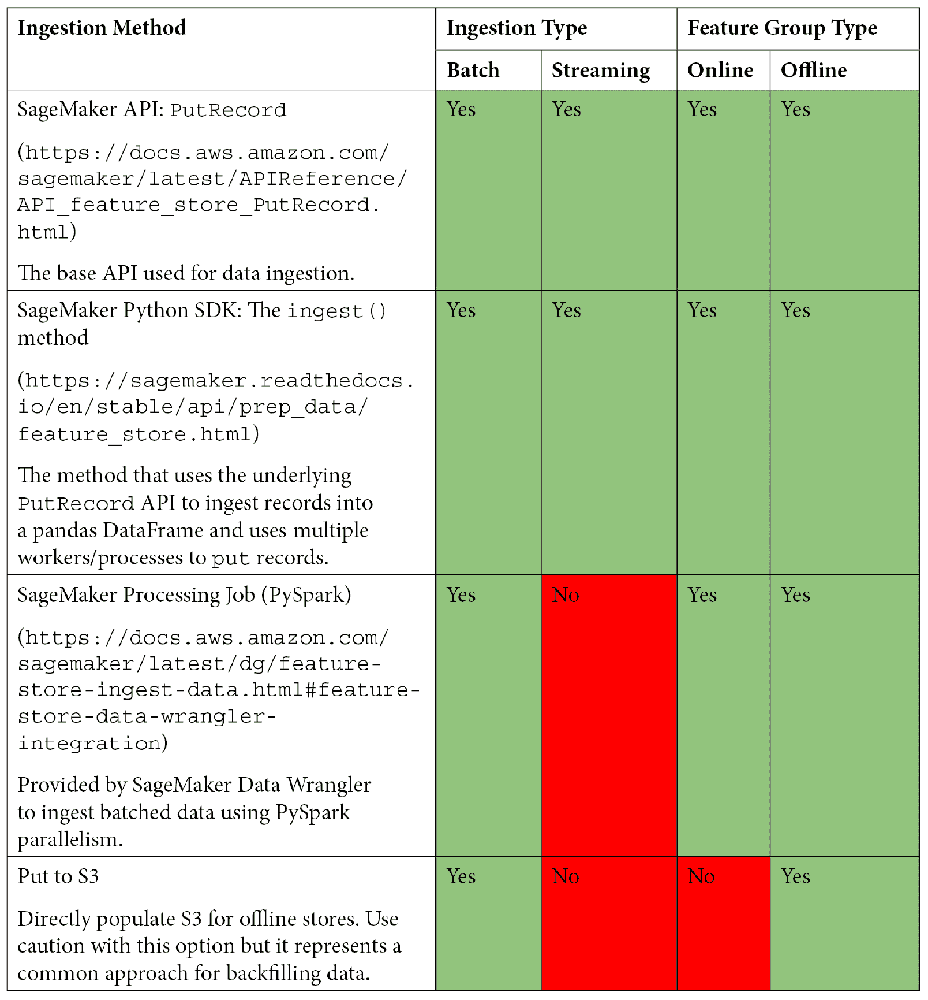

图 5.6 – 摄取特征存储记录

拥有摄取 API 在手，让我们看看一个通用的批量摄取架构。图 5.7 显示了使用**Amazon SageMaker Processing**进行批量摄取的架构：

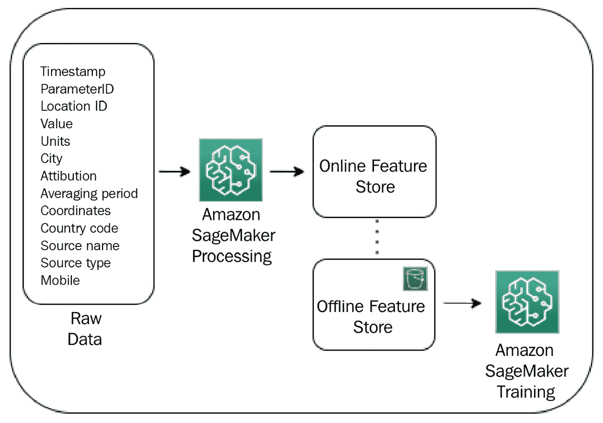

图 5.7 – 使用 SageMaker Processing 进行批量摄取

下面是批量摄取架构中涉及的高级步骤：

1.  大量原始数据存储在 S3 桶中。

1.  Amazon SageMaker Processing 作业以原始数据作为输入，并应用特征工程技术到数据上。处理作业可以配置在实例的分布式集群上运行，以大规模处理数据。

1.  处理作业还使用`PutRecord` API 摄取到特征组的在线存储中的工程化特征。然后，特征自动复制到特征组的离线存储。

1.  离线存储中的特征可以用于训练其他模型，以及其他数据科学团队来解决各种其他用例。在线存储中的特征可以用于实时预测期间的特性查找。

注意，如果在此架构中使用的特征存储仅是离线的，处理作业可以直接使用`PutRecord` API 写入离线存储。

接下来，让我们看看可能的流式摄取架构，如图 5.8 所示。这应该看起来与批量摄取非常相似，除了不使用处理作业，而是使用单个计算实例或**AWS Lambda 函数**：

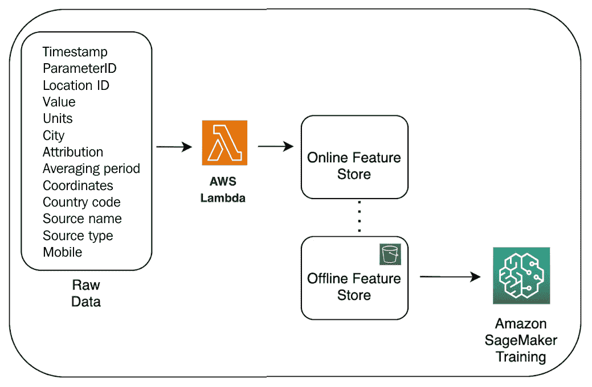

图 5.8 – 使用 AWS Lambda 的流式摄取

流式摄取架构涉及以下高级步骤：

1.  原始数据落在 S3 存储桶中，这触发了 AWS Lambda 函数。

1.  Lambda 函数通过`PutRecord` API 处理数据并将特征插入特征组的在线存储中。

1.  特征随后会自动复制到特征组的离线存储中。

1.  离线存储中的特征可以用于训练其他模型，以及其他数据科学团队来解决各种其他用例。在线存储中的特征可以用于实时预测期间的特性查找。

除了使用摄取 API 填充离线存储之外，您还可以直接填充底层 S3 存储桶。如果您不需要实时推理，并且有大量历史特征数据（数太字节甚至数百吉字节）想要迁移到离线特征存储以用于训练模型，您可以直接将它们上传到底层 S3 存储桶。为了有效地完成这项工作，了解离线存储桶的 S3 文件夹结构非常重要。离线存储中的特征组按照`s3`结构组织：

```py
s3://<bucket-name>/<customer-prefix>/<account-id>/sagemaker/<aws-region>/offline-store/<feature-group-name>-<feature-group-creation-time>/data/year=<event-time-year>/month=<event-time-month>/day=<event-time-day>/hour=<event-time-hour>/<timestamp_of_latest_event_time_in_file>_<16-random-alphanumeric-digits>.parquet
```

还请注意，当您使用摄取 API 时，`isdeleted`、`api_invocation_time`和`write-time`特征会自动包含在特征记录中，但当你直接写入离线存储时，您负责包括它们。

# 从特征组检索特征

一旦特征组被填充，要从特征存储中检索特征，有两个 API 可用——`get_record`和`batch_get_record`。以下代码块展示了使用`get_record` API 从一个特征组中检索单个记录：

```py
record_identifier_value = str('300')
response = sagemaker_fs_runtime_client.get_record
(FeatureGroupName=weather_feature_group_name_online,
RecordIdentifierValueAsString=record_identifier_value)
response
Response from the code block looks similar to the following figure:
{'ResponseMetadata': {'RequestId': '195debf2-3b10-4116-98c7-142dc13e9df3',
  'HTTPStatusCode': 200,
  'HTTPHeaders': {'x-amzn-requestid': '195debf2-3b10-4116-98c7-142dc13e9df3',
   'content-type': 'application/json',
   'content-length': '214',
   'date': 'Wed, 14 Jul 2021 04:27:11 GMT'},
  'RetryAttempts': 0},
 'Record': [{'FeatureName': 'value', 'ValueAsString': '4534.0'},
  {'FeatureName': 'ismobile', 'ValueAsString': '0'},
  {'FeatureName': 'location', 'ValueAsString': '300'},
  {'FeatureName': 'EventTime', 'ValueAsString': '1626236799'}]}
```

类似地，以下代码展示了使用`batch_get_record` API 从一个或多个特征组中检索多个记录：

```py
record_identifier_values = ["200", "250", "300"]
response=sagemaker_fs_runtime_client.batch_get_record(
            Identifiers=[
           {"FeatureGroupName": weather_feature_group_name_online, "RecordIdentifiersValueAsString": record_identifier_values}
            ]
)
response
```

代码块的响应应该类似于以下响应：

```py
{'ResponseMetadata': {'RequestId': '3c3e1f5f-3a65-4b54-aa18-8683c83962c5',
  'HTTPStatusCode': 200,
  'HTTPHeaders': {'x-amzn-requestid': '3c3e1f5f-3a65-4b54-aa18-8683c83962c5',
   'content-type': 'application/json',
   'content-length': '999',
   'date': 'Wed, 14 Jul 2021 04:29:47 GMT'},
  'RetryAttempts': 0},
 'Records': [{'FeatureGroupName': 'weather-feature-group-online-13-19-23-46',
   'RecordIdentifierValueAsString': '300',
   'Record': [{'FeatureName': 'value', 'ValueAsString': '4534.0'},
           {'FeatureName': 'ismobile', 'ValueAsString': '0'},
           {'FeatureName': 'location', 'ValueAsString': '300'},
          {'FeatureName': 'EventTime', 'ValueAsString': '1626236799'}]},
  {'FeatureGroupName': 'weather-feature-group-online-13-19-23-46',
   'RecordIdentifierValueAsString': '200',
   'Record': [{'FeatureName': 'value', 'ValueAsString': '34234.0'},
            {'FeatureName': 'ismobile', 'ValueAsString': '0'},
           {'FeatureName': 'location', 'ValueAsString': '200'},
          {'FeatureName': 'EventTime', 'ValueAsString': '1626236410'}]}],
 'Errors': [],
 'UnprocessedIdentifiers': []}
```

应该使用 `get_record` 和 `batch_get_record` API 与在线存储一起使用。此外，由于离线存储的底层存储是一个 S3 存储桶，你可以直接使用 Athena 或其他访问 S3 的方式来查询离线存储。以下代码展示了从支持离线存储的 S3 存储桶中直接检索所有特征记录的示例 Athena 查询：

```py
weather_data_query = weather_feature_group.athena_query()
weather_table = weather_data_query.table_name

#Query string
query_string = 'SELECT * FROM "'+ weather_table + '"'
print('Running ' + query_string)

#run Athena query. The output is loaded to a Pandas dataframe.
weather_data_query.run(query_string=query_string, output_location='s3://'+s3_bucket_name+'/'+prefix+'/query_results/')
weather_data_query.wait()
dataset = weather_data_query.as_dataframe()
```

对于本书中使用的数据集，我们将使用两个特征组——位置和天气数据。位置特征组将使用 `location_id` 作为记录标识符，并捕获与位置相关的特征，例如城市名称。天气数据特征组也将使用 `location_id` 作为记录标识符，并捕获天气质量测量值，例如 pm25。这使我们能够在多个 ML 项目中使用特征组。

例如，来自位置和天气数据特征组的特征被用于回归模型，以预测给定位置的未来的天气测量值。另一方面，来自天气数据特征组的特征也可以用于聚类模型，以找到具有相似测量的站点。

重要提示

示例笔记本提供了创建特征组、将特征摄入特征组以及从特征组中检索特征的 Amazon SageMaker Feature Store 关键 API 的操作指南。为了看到所有功能存储功能在实际中的应用，我们建议你在 *第二章*，*数据科学环境*中设置的数据科学环境中执行示例笔记本：

[`gitlab.com/randydefauw/packt_book/-/blob/main/CH05/feature_store_apis.ipynb`](https://gitlab.com/randydefauw/packt_book/-/blob/main/CH05/feature_store_apis.ipynb).

现在你已经学习了 SageMaker Feature Store 的功能，在接下来的两节中，你将学习如何使用这些功能来解决数据科学家和组织面临的功能设计挑战。

# 创建可重用特征以减少特征不一致性和推理延迟

数据科学家面临的一个挑战是，为了准备用于 ML 训练的特征，需要花费很长时间的数据处理时间——几个小时甚至几天。此外，在特征工程中应用的数据处理步骤需要在预测时间对推理请求进行应用，这增加了推理延迟。每个数据科学团队即使使用相同的原始数据为不同的模型，也需要花费这些数据处理时间。在本节中，我们将讨论使用 Amazon SageMaker Feature Store 解决这些挑战的最佳实践。

对于需要低延迟特征进行推理的使用案例，应配置在线特征存储，并且通常建议同时启用在线和离线特征存储。启用在线和离线存储的特征存储允许您在训练和推理阶段重用相同的特征值。这种配置减少了两个阶段之间的不一致性，并最小化了训练和推理偏差。在此模式下，为了填充存储，可以使用批量或流式方式将特征摄取到在线存储中。

当您将特征摄取到在线存储中时，SageMaker 会自动将特征值复制到离线存储中，并持续追加最新的值。重要的是要注意，对于在线特征存储，只维护最新的特征记录，并且 `PutRecord` API 总是作为 `insert`/`upsert` 处理。这是关键，因为如果您需要更新特征记录，那么执行此操作的过程是重新插入或覆盖现有记录。这是为了允许以尽可能低的延迟检索用于推理用例的特征。

虽然在线特征存储只维护最新的记录，但离线存储将提供特征值随时间变化的全历史记录。记录将保留在离线存储中，直到它们被明确删除。因此，您应该建立一个流程，使用为 S3 归档提供的标准机制来修剪离线特征存储中的不必要记录。

重要提示

来自 GitHub 仓库的示例笔记本展示了创建特征存储、摄取特征、检索特征以及进一步使用特征进行模型训练、部署模型和在使用推理期间从特征存储中获取特征的端到端流程：[`gitlab.com/randydefauw/packt_book/-/blob/main/CH04/feature_store_train_deploy_models.ipynb`](https://gitlab.com/randydefauw/packt_book/-/blob/main/CH04/feature_store_train_deploy_models.ipynb)。

另一个最佳实践是为特征版本设置标准。随着特征的演变，跟踪特征版本非常重要。考虑在两个级别上进行版本控制——特征组的版本和特征组内特征的版本。当需要添加或删除特征定义时，例如特征模式发生变化时，您需要为特征组创建一个新的版本。

在本书出版时，特征组是不可变的。要添加或删除特征，你需要创建一个新的特征组。为了满足具有不同数量特征的多个版本的特征组的需求，建立并坚持命名约定。例如，你可以最初创建一个 `weather-conditions-v1` 特征组。当该特征组需要更新时，你可以创建一个新的 `weather-conditions-v2` 特征组。你也可以考虑在数据准备或使用上添加描述性标签，例如 `weather-conditions-latest-v2` 或 `weather-conditions-stable-v2`。你还可以对特征组进行标记以提供元数据。此外，你还应该建立支持多少个并发版本的标准以及何时弃用旧版本。

对于单个特征的版本控制，离线存储会保留特征组中所有特征值的记录。每个特征记录都需要有一个 `eventTime`，这支持通过日期访问特征版本。要从离线存储中检索特征的先前版本值，请使用具有特定时间戳的 Athena 查询，如下面的代码块所示：

```py
#Query string with specific date/time
timestamp = int(round(time.time()))
time_based_query_string = f"""
SELECT *
FROM "{weather_table}"
where eventtime <= {timestamp} and city=1080.0
"""
# Run Athena query. The output is loaded to a Pandas dataframe.
weather_query.run(query_string=time_based_query_string, output_location='s3://'+s3_bucket_name+'/'+prefix+'/query_results/')
weather_query.wait()
dataset = weather_query.as_dataframe()
```

注意，你可以进一步微调 Athena 查询以包括 `write-time` 和 `api_call_time` 以提取非常具体的特征版本。请参阅参考文献部分，以获取有关 SageMaker Feature Store 中时间点查询的详细博客链接。

此外，当记录从在线存储中删除时，离线存储中的相应记录仅逻辑删除，这通常被称为墓碑。当你查询离线存储时，你可能会在结果中看到墓碑。使用记录的 `is_deleted` 特征从结果中过滤这些记录。

现在你已经创建了并填充了特征组，你的组织中的团队如何发现和重用这些特征？所有授权的 Amazon SageMaker Feature Store 用户都可以在 SageMaker Studio 环境中查看和浏览特征存储中的特征组列表。你也可以通过名称、描述、记录标识符、创建日期和标签来搜索特定的特征组，如图 *图 5.9* 所示：

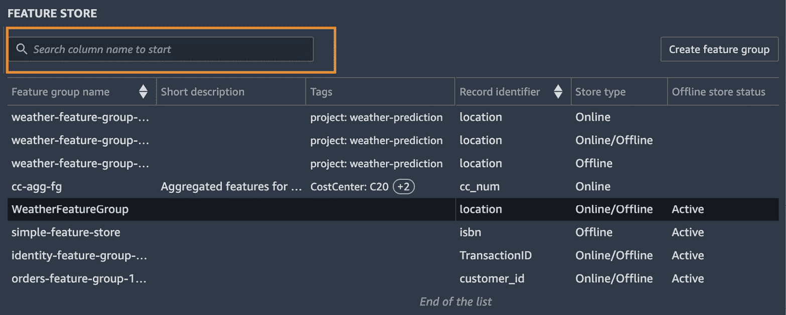

图 5.9 – 搜索和发现特征组

你可以更进一步，查看特征组的特征定义，并如图 *图 5.10* 所示搜索特定特征：

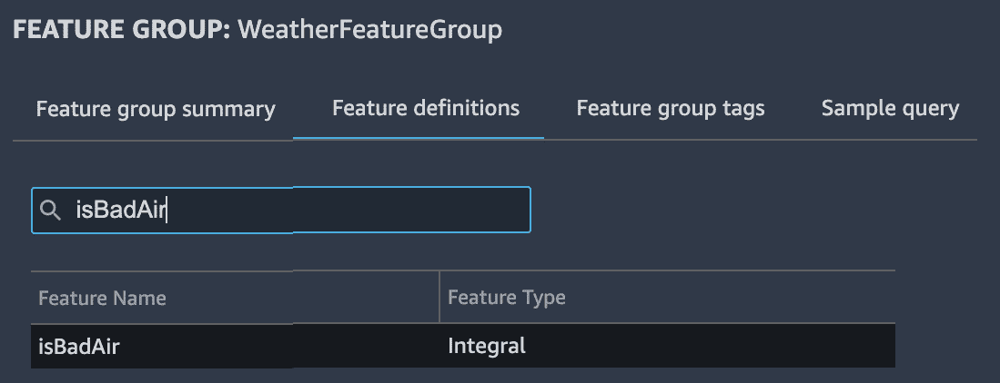

图 5.10 – 搜索和发现特征

在下一节中，你将了解如何设计一个提供近实时预测的机器学习系统。

# 设计针对近实时机器学习预测的解决方案

有时机器学习应用需要高吞吐量更新特征和接近实时的更新特征访问。及时访问快速变化的特征对于这些应用预测的准确性至关重要。例如，考虑一个在呼叫中心中的机器学习应用，该应用预测如何将 incoming 客户电话路由到可用的代理。此应用需要了解客户的最新网页会话点击，以便做出准确的路由决策。如果您将客户的网页点击行为作为特征，则特征需要即时更新，并且应用需要接近实时地访问更新后的特征。同样，对于天气预报问题，您可能需要频繁捕获天气测量特征以进行准确的天气预报，并需要实时查找特征的能力。

让我们来看看设计一个满足高吞吐量写入和低延迟读取要求的可靠解决方案的一些最佳实践。从高层次来看，此解决方案将流式摄取与特征组中的流式预测相结合。我们将讨论应用于特征存储的摄取和服务的最佳实践。

对于摄取特征，选择批处理和流式摄取的决定应基于特征存储中的特征值需要多频繁更新以供下游训练或推理使用。虽然简单的机器模型可能需要来自单个特征组的特征，但如果您正在处理来自多个来源的数据，您将发现自己正在使用来自多个特征组的特征。其中一些特征需要定期更新（每小时、每天、每周），而其他特征必须以接近实时的方式流式传输。

特征更新频率和推理访问模式也应作为创建不同特征组和隔离特征的考虑因素。通过隔离需要在不同时间插入的特征，可以独立地提高流式特征的摄取吞吐量。然而，从多个特征组检索值会增加 API 调用的数量，并可能增加整体检索时间。

您的解决方案需要平衡特征隔离和检索性能。如果您的模型在推理时需要来自大量不同特征组的特征，设计解决方案以利用更大的特征组或并行从特征存储中检索以满足预测的近实时服务级别协议。例如，如果您的模型在推理时需要来自三个特征组的特征，您可以在合并这些数据用于模型推理之前并行发出三个 API 调用以获取特征记录数据。这可以通过执行通过 AWS 服务（如**AWS Step Functions**）的典型推理工作流程来完成。如果相同的特征组总是用于推理，您可能还想考虑将这些特征组合成一个单独的特征组。

*图 5.11* 展示了支持高吞吐量写入和低延迟读取的流式摄入和流式推理的端到端架构：

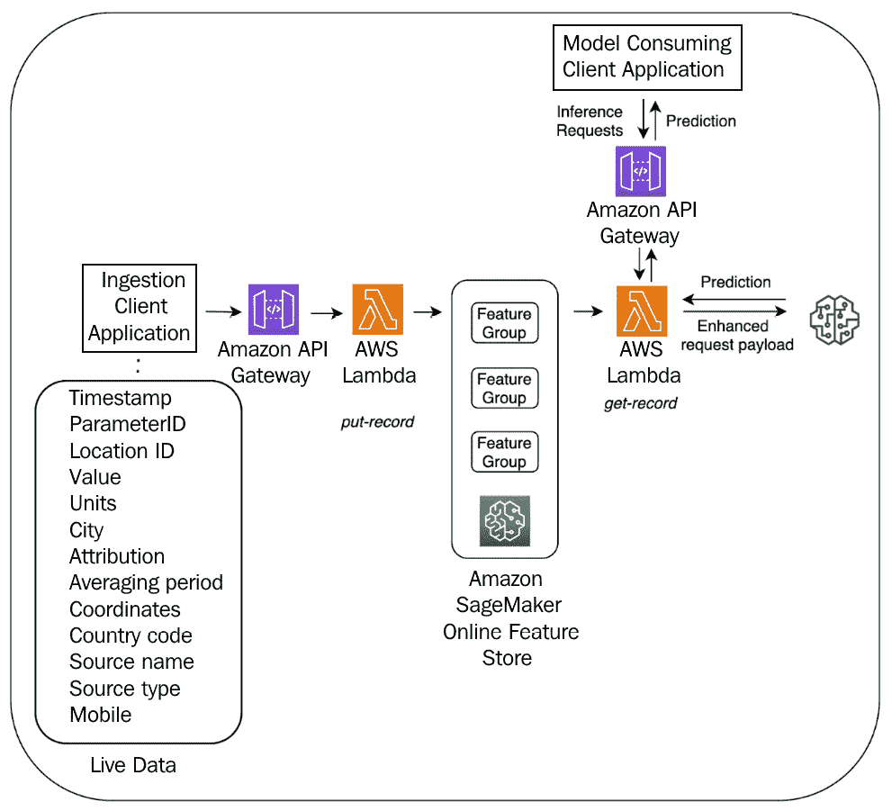

图 5.11 – 实时特征摄入和检索的端到端架构

在此架构中涉及到的步骤概述如下：

在摄入端：

1.  客户端应用程序收集并处理实时数据。对于流式应用程序，一个选项是使用**Kinesis 数据流**。为了摄入特征，客户端应用程序调用由 API 网关托管的摄入 API。

1.  API 网关调用使用`put_record` API 将特征推送到在线特征存储的 lambda 函数。根据需要，lambda 函数还可以在将特征推送到特征存储之前对原始数据进行额外的处理。

在预测端：

1.  模型消耗客户端应用程序调用由 API 网关托管的预测 API。API 网关调用一个 lambda 函数，从在线特征存储中查找与推理请求相关的特征，并创建一个增强请求。

1.  增强请求被发送到 SageMaker 部署的端点。端点的预测会回传到客户端应用程序。

使用这些技术和最佳实践，您可以设计实时机器学习系统。

# 摘要

在本章中，您回顾了 Amazon SageMaker 特征存储的基本功能以及可用的 API。通过结合不同的功能，您学习了如何在单个机器学习项目的训练和推理阶段以及多个机器学习项目中重用工程化特征。最后，您结合了流式摄入和提供来设计近实时推理解决方案。在下一章中，您将使用这些工程化特征在规模上训练和调整机器学习模型。

# 参考文献

对于额外的阅读材料，请查阅以下参考文献：

+   使用 Amazon SageMaker 特征存储的流式摄入在近实时内做出基于机器学习的决策：

    [使用 Amazon SageMaker Feature Store 进行流式摄取以在接近实时的情况下做出基于机器学习的决策](https://aws.amazon.com/blogs/machine-learning/using-streaming-ingestion-with-amazon-sagemaker-feature-store-to-make-ml-backed-decisions-in-near-real-time/ )

+   Enable feature reuse across accounts and teams using Amazon SageMaker Feature Store:

    [使用 Amazon SageMaker Feature Store 在账户和团队之间启用特征重用](https://aws.amazon.com/blogs/machine-learning/enable-feature-reuse-across-accounts-and-teams-using-amazon-sagemaker-feature-store/ )

+   Build accurate ML training datasets using point-in-time queries with Amazon SageMaker Feature Store and Apache Spark:

    [使用 Amazon SageMaker Feature Store 和 Apache Spark 通过时间点查询构建准确的机器学习训练数据集](https://aws.amazon.com/blogs/machine-learning/build-accurate-ml-training-datasets-using-point-in-time-queries-with-amazon-sagemaker-feature-store-and-apache-spark/ )

+   Ingesting historical feature data into Amazon SageMaker Feature Store:

    [将历史特征数据摄取到 Amazon SageMaker Feature Store 中](https://towardsdatascience.com/ingesting-historical-feature-data-into-sagemaker-feature-store-5618e41a11e6)
