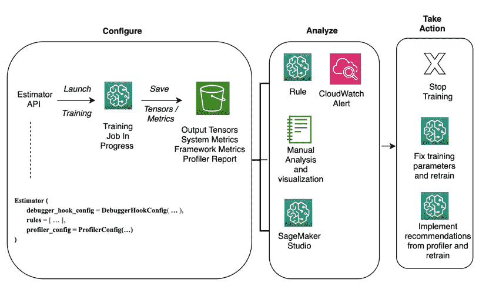
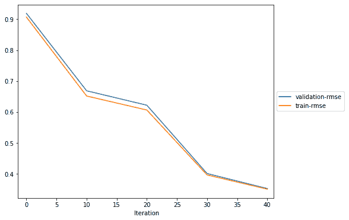
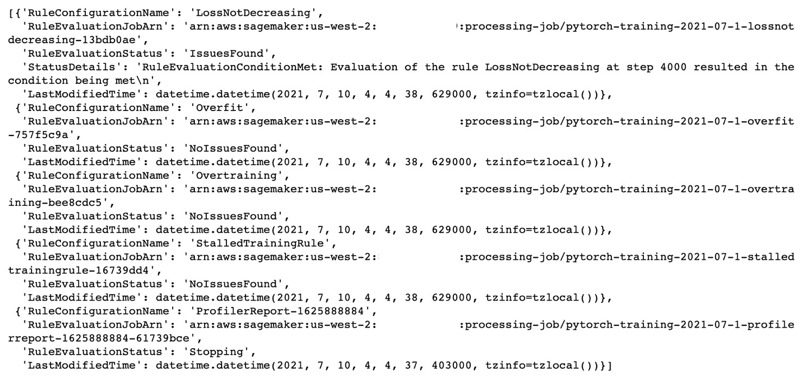
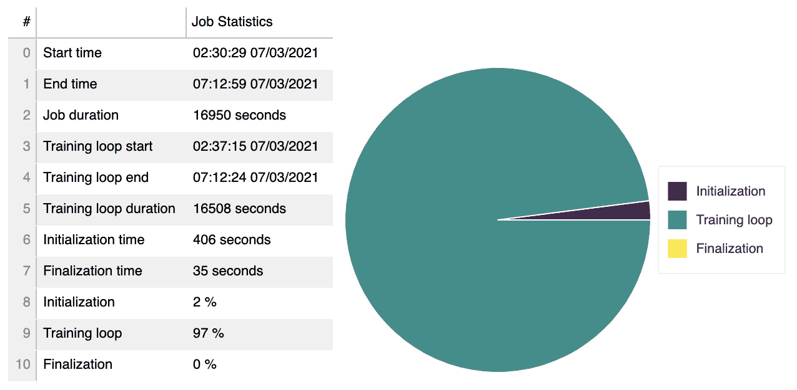
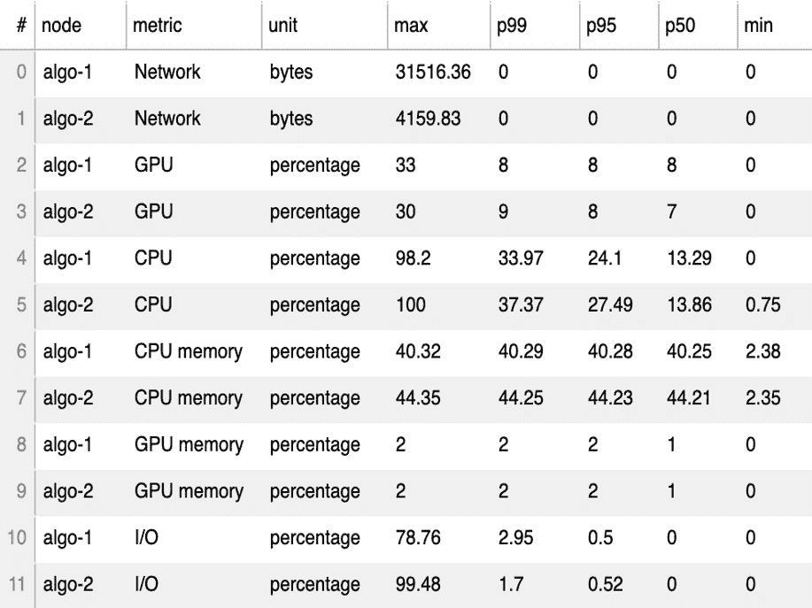
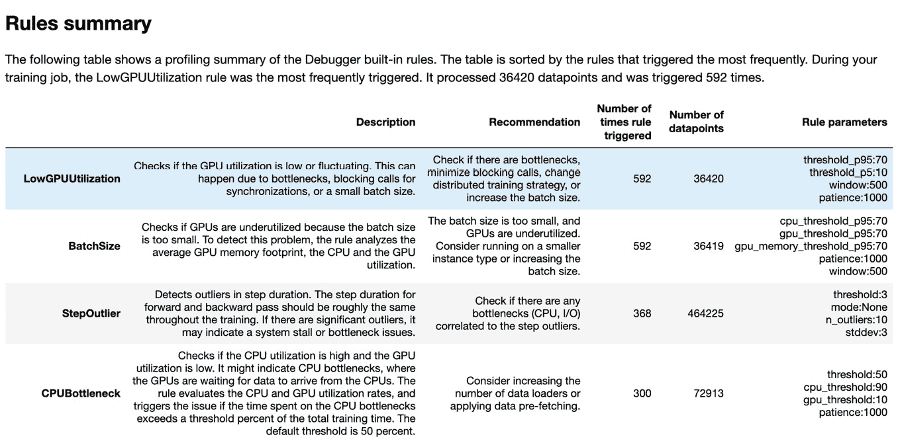
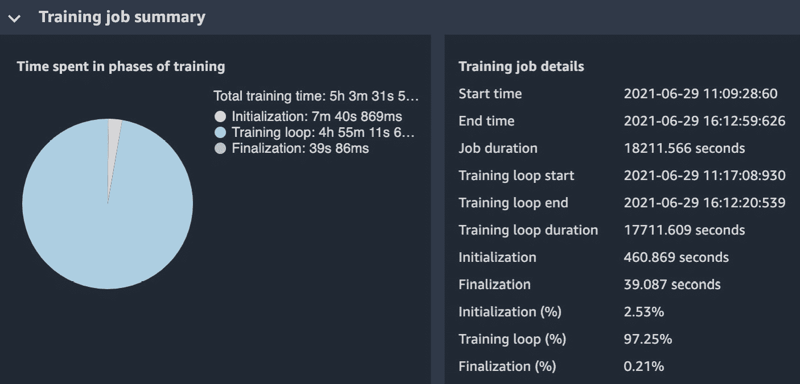

# 第七章：使用 Amazon SageMaker Debugger 分析训练作业

训练 **机器学习**（**ML**）模型涉及对多个算法进行实验，它们的超参数通常需要处理大量数据。训练出最优结果的模型是一项既耗时又耗计算的任务。提高训练时间可以提高生产力并降低整体训练成本。

如我们在*第六章*“大规模训练和调优”中讨论的，分布式训练通过使用可扩展的计算集群来显著提高训练时间。然而，监控训练基础设施以识别和调试资源瓶颈并非易事。一旦启动了训练作业，整个过程就变得不透明，你对模型训练过程几乎没有可见性。同样不简单的是实时监控以检测次优训练作业并在早期停止它们，以避免浪费训练时间和资源。

Amazon SageMaker Debugger 提供了对训练作业及其执行的基础设施的可见性。SageMaker Debugger 捕获的实时训练指标，如**学习梯度**和**网络权重**，为正在进行的训练作业提供了可见性，因此你可以对**梯度消失**和**过拟合**等条件采取行动。

Debugger 还监控并提供有关系统资源（如 CPU、GPU 和内存）的报告，为你提供资源利用率和瓶颈的见解。此外，如果你使用 TensorFlow 或 PyTorch 进行深度学习训练作业，Debugger 提供了框架指标的可视化，这些指标可用于加速你的训练作业。

到本章结束时，你将能够使用 Amazon SageMaker Debugger 的功能，并应用最佳实践来解决调试 ML 训练的典型挑战。这些挑战包括识别和应对次优训练、了解训练基础设施的资源利用率，以及优化训练框架参数。你还将学习如何通过应用 SageMaker Debugger 提供的详细建议来提高训练时间和成本。

在本章中，我们将涵盖以下主要主题：

+   Amazon SageMaker Debugger 精要

+   使用内置和自定义规则实时监控训练作业

+   了解训练基础设施和训练框架

# 技术要求

你需要 AWS 账户来运行本章中包含的示例。如果你还没有为本书设置数据科学环境，请参阅*第二章*“数据科学环境”，其中将指导你完成设置过程。

本书包含的代码示例可在 GitHub 上找到 [`github.com/PacktPublishing/Amazon-SageMaker-Best-Practices/tree/main/Chapter07`](https://github.com/PacktPublishing/Amazon-SageMaker-Best-Practices/tree/main/Chapter07)。要访问它们，您需要安装 Git 客户端 ([`git-scm.com/`](https://git-scm.com/))。

# Amazon SageMaker Debugger 基础知识

在本节中，你将了解 Amazon SageMaker Debugger 的基本术语和功能。使用 Debugger 与你的训练作业涉及三个高级步骤：

1.  *配置*训练作业以使用 SageMaker Debugger。

1.  *分析*收集到的张量和指标。

1.  *采取*行动。

以下图示说明了前面的要点：



图 7.1 – Amazon SageMaker Debugger 概览

当我们深入到这些步骤中的每一个时，我们将介绍必要的术语。

## 配置训练作业以使用 SageMaker Debugger

第一步是配置训练作业以使用 Amazon SageMaker Debugger。到目前为止，你已经熟悉了使用 SageMaker SDK 中的 `Estimator` 对象来启动训练作业。要使用 Amazon SageMaker Debugger，你必须通过三个额外的配置参数增强 `Estimator`：`DebuggerHookConfig`、`Rules` 和 `ProfilerConfig`。

使用 `DebuggerHookConfig`，你可以指定要收集哪些调试指标以及将它们存储在哪里，如下面的代码块所示：

```py
Estimator(
    …
    debugger_hook_config=DebuggerHookConfig(
        s3_output_path=bucket_path,  # Where the debug data is stored.
        collection_configs=[ # Organize data to collect into collections.
            CollectionConfig(
                name="metrics",
                parameters={
                    "save_interval": str(save_interval)
                }
            )
        ],
    ),
    ….
)
```

`s3_output_path` 是所有收集到的数据持久化的位置。如果未指定此位置，调试器将使用默认路径，`s3://<output_path>/debug-output/`，其中 `<output_path>` 是 SageMaker 训练作业的输出路径。`CollectionConfig` 列表允许您将调试数据或张量组织成集合，以便更容易分析。张量表示训练网络在训练过程中特定时间的状态。数据按照 `save_interval` 指定的间隔收集，`save_interval` 是训练运行中的步数。

你如何知道要收集哪些张量？SageMaker Debugger 随带一组内置集合来捕获常见的训练指标，如 `weights`、`layers` 和 `outputs`。你可以选择收集所有可用的张量或它们的子集。在先前的代码示例中，调试器正在收集 `metrics` 集合。

注意

对于内置集合的完整列表，请参阅 [`github.com/awslabs/sagemaker-debugger/blob/master/docs/api.md#collection`](https://github.com/awslabs/sagemaker-debugger/blob/master/docs/api.md#collection)。

你还可以创建一个自定义的指标集合来收集。在下面的代码块中，调试器捕获所有名称中包含 `relu`、`tanh` 或 `weight` 的指标：

```py
# Use Debugger CollectionConfig to create a custom collection
collection_configs=[
        CollectionConfig(
            name="custom_collection",
            parameters={
                "include_regex": ".*relu |.*tanh | *weight ",
        })
]
```

注意

虽然收集所有张量可能很有吸引力，但这会导致收集大量数据，从而增加训练时间、训练成本和存储成本。在这种情况下，使用 `ReductionConfig` 允许您保存减少后的张量而不是保存完整的张量 ([`github.com/awslabs/sagemaker-debugger/blob/master/docs/api.md#collection`](https://github.com/awslabs/sagemaker-debugger/blob/master/docs/api.md#collection))。

虽然 `DebuggerHookConfig` 允许您配置和保存张量，但规则会分析训练过程中捕获的张量以检查特定条件，例如 **损失未减少**。SageMaker Debugger 支持两种不同类型的规则：**内置** 和 **自定义**。SageMaker Debugger 随带一组内置规则，这些规则可以用 Python 检测并报告常见的训练问题，如过拟合、欠拟合和梯度消失。使用自定义规则，您可以在 Python 中编写自己的规则，以便 SageMaker Debugger 对收集到的张量进行评估。

例如，在下面的代码块中，调试器收集与 `metrics` 收集相关的张量，并评估张量以检测训练过程中的损失是否减少：

```py
Estimator(
    …
    rules=[
        Rule.sagemaker(
            rule_configs.loss_not_decreasing(),
            rule_parameters={
                "collection_names": "metrics",
                "num_steps": str(save_interval * 2),
            },
        ),
    ],
)
```

最后，`ProfilerConfig` 允许您收集系统指标，例如 CPU、GPU、内存、I/O 以及您在训练作业中使用的框架的特定框架指标。对于系统指标，您必须指定要收集指标的时长间隔，而对于框架指标，您指定起始步数和步数，如下面的代码块所示：

```py
Estimator(
    …
    profiler_config = ProfilerConfig(
        ## Monitoring interval in milliseconds
     system_monitor_interval_millis=500,       ## Start collecting metrics from step 2 and collect from the next 7 steps.
      framework_profile_params=FrameworkProfile(
    start_step=2, 
    num_steps=7
)     )
```

下表总结了 SageMaker 收集的张量和指标。它显示了不同类型的指标、每种类型的示例以及如何收集和使用它们：

![图 7.2 – SageMaker Debugger 收集的张量和指标

![img/011.jpg]

图 7.2 – SageMaker Debugger 收集的张量和指标

使用这些配置参数，SageMaker Debugger 收集了大量关于您的训练作业的信息。但您如何确保收集的数据是安全的？

最佳实践是对 S3 存储桶中的所有数据进行加密，无论是使用 AWS 提供的密钥还是您自己的具有 **客户管理密钥**（**CMK**）的密钥。此外，已配置的规则在隔离的调试器规则容器中执行。规则容器也在与训练作业相同的 VPC 中执行，并使用训练作业使用的 IAM 角色。

一旦您对调试器配置满意，就可以使用 `estimator.fit()` 启动训练。接下来，我们将分析调试器在训练作业期间收集的信息。

## 分析收集到的张量和指标

在训练过程中收集的所有张量和指标都保存在 S3 中。SageMaker 调试器使用`trial`对象来表示单个训练运行。`trial`对象由多个步骤组成，其中每个步骤代表单个批次的训练数据。在每一步中，收集到的张量具有特定的值。

要访问张量值，您从估计器获取张量的路径，创建一个试验，获取张量列表，找出您感兴趣的具体张量的数据所在的步骤，并查看张量的值。

通过从试验到单个张量值的路径，您可以手动查询张量值，如下面的代码块所示：

```py
tensors_path = estimator.latest_job_debugger_artifacts_path()
print('S3 location of tensors is: ', tensors_path)
trial.tensor_names()
trial.tensor("feature_importance/cover/f1").values()
```

您可以通过在笔记本中使用自定义绘图代码进一步可视化收集到的张量值。以下图表显示了**train-rmse**和**validation-rmse**训练指标的可视化，这些指标是在训练过程中收集的：



图 7.3 – 训练和验证错误

注意，您还可以在 SageMaker Studio 中查看可视化。此外，如果您已配置规则，调试器将自动分析张量以评估训练条件并触发云监控警报。同样，当您设置`ProfileConfig`参数时，将生成详细的分析报告并保存在 S3 中。接下来，让我们看看如何对规则结果采取行动。

## 采取行动

规则评估收集的张量数据。由于规则评估的状态在训练过程中发生变化，将触发 CloudWatch 事件。您可以为 CloudWatch 事件配置 CloudWatch 规则，以自动化对规则发现的问题的响应。

此外，您还可以使用调试器内置的操作来自动化响应。以下代码块显示了如何使用调试器内置规则和操作的组合来在训练过程中损失值没有持续降低时停止训练作业：

```py
built_rules=[
        #Check for loss not decreasing during training and stop the training job.
        Rule.sagemaker(
            rule_configs.loss_not_decreasing(),
            actions = (rule_configs.StopTraining())
        )
]
```

另一方面，当您已配置`ProfilerConfig`参数时，将生成一个包含系统指标和框架指标详细分析的分析报告，并持久化存储在 S3 中。您可以从 S3 下载、审查并将建议应用于分析报告。

在接下来的两个部分中，您将学习如何自动化对规则评估的响应并实施分析报告中的建议。

# 使用内置和自定义规则实时监控训练作业

在本节中，您将使用调试器功能来监控带有内置和自定义规则的作业，以检测次优训练条件，例如`LossNotDecreasing`和`ExplodingGradients`。

SageMaker 提供了一套内置规则来识别常见的训练问题，例如`class_imbalance`、`loss_no_decreasing`和`overfitting`。

注意

SageMaker 内置规则的完整列表可以在此处访问：[`docs.aws.amazon.com/sagemaker/latest/dg/debugger-built-in-rules.html`](https://docs.aws.amazon.com/sagemaker/latest/dg/debugger-built-in-rules.html)。

以下代码示例展示了如何使用 SageMaker Debugger 配置`内置`规则：

```py
#Specify the rules you want to run
built_in_rules=[
        #Check for loss not decreasing during training and stop the training job.
        Rule.sagemaker(
            rule_configs.loss_not_decreasing(),

            actions = (rule_configs.StopTraining())
        ),
        #Check for overfit, overtraining and stalled training
        Rule.sagemaker(rule_configs.overfit()),  
   Rule.sagemaker(rule_configs.overtraining()),       
   Rule.sagemaker(rule_configs.stalled_training_rule())     
]
#Create an estimator and pass in the built_in rules.
pt_estimator = PyTorch(
    ...
    rules = built_in_rules
)
```

在调用 fit 之后，SageMaker 为每个配置的内置规则启动一个训练作业和一个处理作业。规则评估状态在 CloudWatch 的训练日志中以固定间隔可见。你还可以使用以下命令以编程方式查看规则执行的结果：

```py
pt_estimator.latest_training_job.rule_job_summary()
```

已配置的内置规则的结果应类似于以下内容：



图 7.4 – 内置规则执行摘要

通过分析规则摘要，你可以看到`LossNotDecreasing`规则被触发，如`RuleEvaluationStatus`中的`IssuesFound`所示。由于配置的操作用于停止训练作业，你将注意到训练作业在执行所有 epoch 之前就已经停止。你还可以看到其他内置规则——`Overfit`、`Overtraining`和`StalledTrainingRule`——在训练过程中没有被触发。

内置规则由 AWS 管理，从而免去了你需要管理规则更新的麻烦。你只需将它们插入到估计器中即可。然而，你可能想监控内置规则中未包含的指标，在这种情况下，你必须配置自定义规则。自定义规则需要更多的工作。例如，假设你希望在训练过程中跟踪梯度是否变得过大。为了创建这个自定义规则，你必须扩展 SageMaker Debugger 提供的`Rule`接口。

注意

SageMaker 为规则提供了两套 Docker 镜像：一套用于评估内置规则，另一套用于评估自定义规则。这些 Docker 镜像的**弹性容器注册库**（**ECR**）URL 可在[`docs.aws.amazon.com/sagemaker/latest/dg/debugger-docker-images-rules.html`](https://docs.aws.amazon.com/sagemaker/latest/dg/debugger-docker-images-rules.html)找到。

在以下示例中，自定义规则将与使用`gradients`收集收集的张量一起工作。`invoke_at_step`方法提供了要执行的逻辑。在每一步中，梯度值的平均值与阈值进行比较。如果梯度值大于阈值，则触发规则，如下面的代码所示：

```py
class CustomGradientRule(Rule):
    def __init__(self, base_trial, threshold=10.0):
        super().__init__(base_trial)
        self.threshold = float(threshold)
    def invoke_at_step(self, step):
        for tname in self.base_trial.tensor_names(collection="gradients"):
            t = self.base_trial.tensor(tname)
            abs_mean = t.reduction_value(step, "mean", abs=True)
            if abs_mean > self.threshold:
                return True
        return False
```

接下来，定义自定义规则，如下所示：

```py
custom_rule = Rule.custom(
    name='CustomRule', # used to identify the rule
    # rule evaluator container image
image_uri='759209512951.dkr.ecr.us-west-2.amazonaws.com/sagemaker-debugger-rule-evaluator:latest',    instance_type='ml.t3.medium',     source='rules/my_custom_rule.py', # path to the rule source file
    rule_to_invoke='CustomGradientRule', # name of the class to invoke in the rule source file
    volume_size_in_gb=30, # EBS volume size required to be attached to the rule evaluation instance
    collections_to_save=[CollectionConfig("gradients")],
    # collections to be analyzed by the rule. since this is a first party collection we fetch it as above
    rule_parameters={
       #Threshold to compare the gradient value against
      "threshold": "20.0"     }
)
```

在估计器中配置自定义规则并调用`fit`方法，如下所示：

```py
pt_estimator_custom = PyTorch(
    ….
    ## New parameter
    rules = [custom_rule]
)
estimator.fit(wait = False)
```

在调用 `fit` 之后，Amazon SageMaker 会为每个配置的客户规则启动一个训练作业和一个处理作业。规则评估状态会在 CloudWatch 的训练日志中以固定的时间间隔可见。类似于 `built_in` 规则的规则摘要，您可以使用以下代码查看自定义规则摘要：

```py
pt_estimator.latest_training_job.rule_job_summary()
```

通过结合内置和自定义规则，您可以深入了解训练过程，并主动停止训练作业，而无需运行无效的训练作业直到完成。

重要提示

在以下 GitHub 仓库中提供了一个示例笔记本，该笔记本提供了使用 SageMaker 调试器的内置和自定义规则的全过程指南：[`gitlab.com/randydefauw/packt_book/-/blob/master/CH06/debugger/weather-prediction-debugger-rules.ipynb`](https://gitlab.com/randydefauw/packt_book/-/blob/master/CH06/debugger/weather-prediction-debugger-rules.ipynb)。

在本节中，您对训练过程有了深入了解，并根据内置和自定义规则检测到的问题改进了训练作业。在下一节中，您将学习如何深入了解用于训练作业的基础设施和框架。

# 深入了解训练基础设施和训练框架。

在本节中，您将学习如何了解训练基础设施和训练框架的资源利用率。您还将学习如何分析和实施 SageMaker 调试器深度分析功能提供的建议。

调试器分析器为您提供对在 SageMaker 上运行机器学习训练作业的基础设施利用情况的可见性。调试器自动监控系统资源，如 CPU、GPU、网络、I/O 和内存。此外，调试器收集针对训练框架的特定指标，如步骤持续时间、数据加载、预处理以及在 CPU 和 GPU 上的算子运行时间。您可以选择对整个训练作业进行分析，或者只对其部分进行分析以收集必要的框架指标。

除了收集系统和框架指标之外，在幕后，调试器会自动关联这些指标，这使得您能够轻松地识别可能存在的资源瓶颈并执行根本原因分析。

让我们通过我们的示例用例——使用 PyTorch 预测天气——来详细探讨这个问题。在这里，我们将探索系统指标、由分析器生成的框架指标，并查看实施分析器提出的建议。这种对训练作业的深度分析包括以下高级步骤：

1.  在启用调试器的情况下，使用 PyTorch 模型进行天气预测训练。

1.  分析和可视化由分析器生成的系统和框架指标。

1.  分析由 SageMaker 调试器生成的分析器报告。

1.  检查并实施分析器报告中的建议。

1.  比较训练作业。

让我们详细查看每个步骤。

## 训练用于天气预测的 PyTorch 模型

首先，我们将使用 PyTorch 框架训练一个深度学习模型。由于数据量庞大和深度学习框架，我们将在 GPU 实例上训练。我们将在两个`ml.p3.2xlarge`实例上训练。我们的基础设施配置将如下所示：

```py
…
train_instance_type = "ml.p3.2xlarge" 
instance_count = 2
```

接下来，让我们定义`ProfilerConfig`，以便它可以收集系统和框架指标：

```py
profiler_config = ProfilerConfig(
    system_monitor_interval_millis=500,
    framework_profile_params=FrameworkProfile(start_step=2, num_steps=7)
)
```

现在，我们必须通过使用基础设施和配置分析器作为参数来配置 PyTorch 估计器：

```py
pt_estimator = PyTorch(
    entry_point="train_pytorch.py",
    source_dir="code",
    role=sagemaker.get_execution_role(),
    instance_count=instance_count,
    instance_type=train_instance_type,
    framework_version="1.6",
    py_version="py3",
    volume_size=1024,
    # Debugger-specific parameters
    profiler_config=profiler_config,
)
```

现在，让我们使用`fit()`方法开始训练作业：

```py
estimator.fit(inputs, wait= False)
```

在下一节中，您将分析和可视化由调试器生成的指标。

## 分析和可视化由分析器生成的系统和框架指标

一旦训练作业开始，调试器开始收集系统和框架指标。在本节中，您将学习如何查询、分析和可视化收集到的指标。

首先，让我们看看如何手动分析收集到的指标。下面的代码块展示了如何查询系统指标：

```py
#All collected metrics are persisted in S3.  Define path to the profiler artifacts
path = estimator.latest_job_profiler_artifacts_path()
#Create a reader for the system metrics
system_metrics_reader = S3SystemMetricsReader(path)
#Get the latest event
last_timestamp = system_metrics_reader.get_timestamp_of_latest_available_file()
events = system_metrics_reader.get_events(0, last_timestamp * 1000000)  # UTC time in microseconds
#Show the first system metric event collected
print(
    "Event name:",  events[0].name,
    "\nTimestamp:",  timestamp_to_utc(events[0].timestamp),
    "\nValue:", events[0].value,
)
```

上述代码块的结果如下，显示了特定时间一个训练实例的 GPU：

```py
Event name: gpu2 
Timestamp: 2021-07-02 18:44:20 
Value: 0.0
```

`0.0`的值表示该 GPU 未被利用。

与系统指标类似，您也可以审查框架指标。下面的代码块展示了如何查询框架指标：

```py
#Create a reader for the system metrics
framework_metrics_reader = S3AlgorithmMetricsReader(path)
framework_metrics_reader.refresh_event_file_list()
last_timestamp = framework_metrics_reader.get_timestamp_of_latest_available_file()
events = framework_metrics_reader.get_events(0, last_timestamp)
#We can inspect one of the recorded events to get the following:
print("Event name:", events[0].event_name, 
      "\nStart time:", timestamp_to_utc(events[0].start_time/1000000000), 
      "\nEnd time:", timestamp_to_utc(events[0].end_time/1000000000), 
      "\nDuration:", events[0].duration, "nanosecond")
```

上述代码块的结果如下，显示了特定时间的一个框架指标：

```py
Event name: embeddings.0 
Start time: 1970-01-19 19:27:42 
End time: 1970-01-19 19:27:42 
Duration: 141298 nanosecond
```

一旦收集到指标，您可以使用笔记本中的热图或自定义图表来可视化它们。

重要提示

为了更丰富的热图可视化以及更深入的系统与框架指标分析，请查看以下笔记本：[`gitlab.com/randydefauw/packt_book/-/blob/master/CH06/weather-prediction-debugger-profiler.ipynb`](https://gitlab.com/randydefauw/packt_book/-/blob/master/CH06/weather-prediction-debugger-profiler.ipynb)。

## 分析 SageMaker Debugger 生成的分析报告

在本节中，我们将下载并审查由调试器生成的分析报告。SageMaker Debugger 创建了一个详细的分析报告，并将其保存在 S3 桶中，路径为`s3://<你的桶> /<作业名称>/profiler-output/`。您可以直接从 S3 下载报告。在以下列表中，我们将审查下载报告的几个部分：

+   **训练作业摘要**

    报告的这一部分提供了训练作业的详细摘要，包括作业的开始和结束时间以及训练各个阶段的耗时。以下截图显示了训练作业摘要的示例：




图 7.5 – 分析报告的训练作业摘要

+   **系统指标摘要**

    本节报告显示了训练节点的资源利用率。以下截图显示了 CPU、GPU、内存利用率、I/O 等待时间以及发送和接收的数据量：



图 7.6 – 性能分析报告的系统指标摘要

+   **框架指标摘要**

    本节报告首先显示了训练作业在训练和验证阶段花费的时间，以及它等待的时间：


图 7.7 – 性能分析报告的框架指标摘要

+   **规则摘要**

    当训练作业运行时，调试器执行一系列规则来分析训练过程。本节性能分析报告总结了所有已评估的调试器规则，规则的描述，每个规则在训练期间被触发的次数，分析以及改进训练作业的建议。以下截图显示了以表格格式的规则摘要：



图 7.8 – 性能分析报告的规则摘要

除了直接查询和可视化指标，以及在你的笔记本中下载性能分析报告外，你还可以使用 SageMaker Studio，它提供了内置的可视化来分析性能分析洞察。

要在 Studio 中访问调试器，请按照以下步骤操作：

1.  在导航面板上，选择**组件和注册表**。

1.  选择**实验和试验**。

1.  选择你的训练作业（右键点击）。

1.  从打开的调试器选项卡中选择**调试器洞察**。

在**调试器**选项卡中，你会看到多个部分。其中一部分被称为**训练作业摘要**，如下面的截图所示。这个内置的可视化显示了训练作业的详细信息，如开始时间、结束时间、持续时间以及训练各个阶段的耗时。饼图可视化显示了训练作业在初始化、训练和最终化阶段所花费的相对时间：



图 7.9 – SageMaker Studio 中的调试器可视化

在本节中，我们从下载的性能分析报告中高屋建瓴地回顾了几个部分。要更详细地探索性能分析报告，请运行我们 Git 仓库中的笔记本。

## 分析和实施性能分析报告中的建议

既然我们已经从性能分析中获得了建议，让我们分析并实施一个建议，看看它是否能提高训练作业。

从前一个节段的规则摘要表中，我们可以看到在训练过程中触发次数最多的规则是 `LowGPUUtilization`。这个规则表明，由于阻塞调用，可能会出现瓶颈，建议更改分布式训练策略或增加批量大小。触发次数最多的下一个规则是 `BatchSize`，这表明由于批量大小较小，GPU 利用率可能较低。

根据这个规则的执行结果，分析器的建议是考虑在较小的实例类型上运行，并增加批量大小。让我们结合这两个最常触发的规则的分析器建议，运行两个具有不同设置的新的训练作业，并检查新训练作业的分析器报告，以查看是否有任何改进。

我们将使用相同的基础设施，`()`，但增加批量大小来运行第一个训练作业，如下面的代码块所示：

```py
train_instance_type='ml.p3.2xlarge'
instance_count = 2
hyperparameters = {"batch_size": 1024}
```

对于下一个训练作业，我们将使用较小的训练实例，`()`，并增加批量大小：

```py
training_job_name=
train_instance_type='ml.p2.8xlarge'
instance_count = 2
hyperparameters = {"batch_size": 1024}
```

使用这两种不同的配置，使用 `estimator.fit()` 运行两个不同的训练作业。一旦训练作业完成，下载并分析这两个分析器报告。

## 比较两个训练作业

到目前为止，我们总共有三个配置不同的已完成训练作业。在本节中，我们将比较原始训练作业与根据分析器建议配置的两个新训练作业。在比较这些作业时，我们将关注训练时间和产生的训练成本。以下表格显示了初始和修订的训练作业配置，以及训练时间、资源利用率和成本比较：


图 7.10 – 训练作业比较

首先，让我们比较原始的训练作业和使用了第一次修订训练配置的训练作业。在修订的训练配置中，批量大小从 `64` 增加到 `1024`。这种配置更改将训练时间减少了 `17637` 秒；即从 `18262` 秒减少到 `895` 秒。假设训练作业是在 us-west-2 区域运行的，写作时的 `p3.2xlarge` 成本为 $3.825。这导致成本节省了 26.67%。

同样，如果您比较第二次修订的训练配置，其中我们将批量大小和实例类型都更新到原始配置，训练时间增加了，但整体训练成本提高了 65.36%。如果您可以容忍训练时间的轻微增加，通过实施分析器的建议可以节省训练成本。

重要提示

在以下 GitHub 仓库中提供了一个使用 SageMaker Debugger 分析器的完整教程笔记本：[`gitlab.com/randydefauw/packt_book/-/blob/master/CH06/weather-prediction-debugger-profiler.ipynb`](https://gitlab.com/randydefauw/packt_book/-/blob/master/CH06/weather-prediction-debugger-profiler.ipynb).

本节讨论的结果来自使用完整数据集进行 PyTorch 训练。在笔记本中，你将有机会探索相同的功能，但使用的是更小的数据集。

在本节中，我们实施了几项分析器的建议，并看到了显著的训练改进。还有更多建议你可以进行实验。

此外，在本节中，我们专注于如何启用调试器启动估计器。你也可以使用`estimator.enable_default_profiling()`将分析器附加到正在运行的训练作业上。同样，要启用调试器内置的规则、系统监控和框架分析，并使用可定制的配置参数，请使用`estimator.update_profiler()`。

# 摘要

在本章中，你学习了如何使用 Amazon SageMaker Debugger 的功能来了解训练过程、训练基础设施和训练框架。这种可见性使你能够对典型的训练问题做出反应，例如过拟合、训练损失以及停止训练作业以避免完成，结果只得到次优模型。通过使用 Amazon SageMaker 深度分析器的建议，你学习了如何从训练时间和成本的角度改进训练作业。

使用本章讨论的调试器功能，你可以通过调整底层机器学习框架参数和训练基础设施配置来持续改进你的训练作业，以实现更快和成本效益更高的机器学习训练。在下一章中，你将学习如何大规模管理训练好的模型。

# 进一步阅读

对于额外的阅读材料，请查阅以下参考文献：

+   使用 Amazon SageMaker Debugger 的深度分析功能识别瓶颈、提高资源利用率并降低机器学习训练成本：

    [`aws.amazon.com/blogs/machine-learning/identify-bottlenecks-improve-resource-utilization-and-reduce-ml-training-costs-with-the-new-profiling-feature-in-amazon-sagemaker-debugger/`](https://aws.amazon.com/blogs/machine-learning/identify-bottlenecks-improve-resource-utilization-and-reduce-ml-training-costs-with-the-new-profiling-feature-in-amazon-sagemaker-debugger/)

+   使用 Amazon SageMaker Debugger 进行机器学习可解释性：

    [`aws.amazon.com/blogs/machine-learning/ml-explainability-with-amazon-sagemaker-debugger/`](https://aws.amazon.com/blogs/machine-learning/ml-explainability-with-amazon-sagemaker-debugger/)
