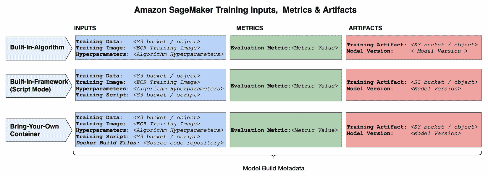
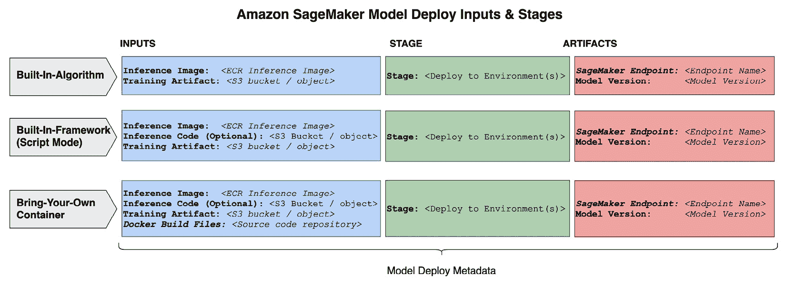
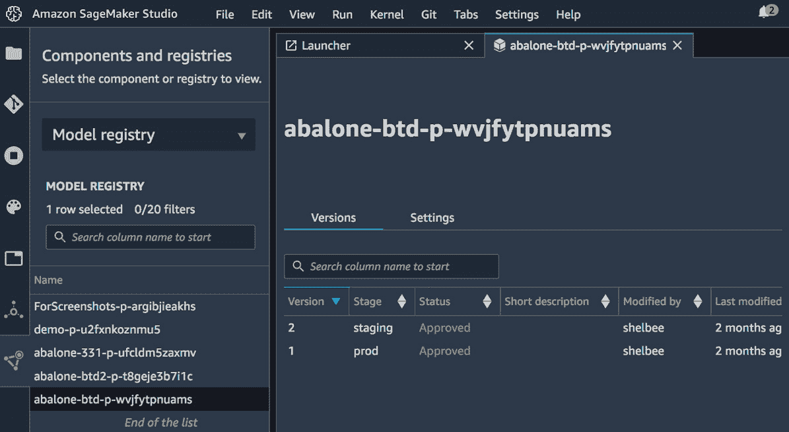
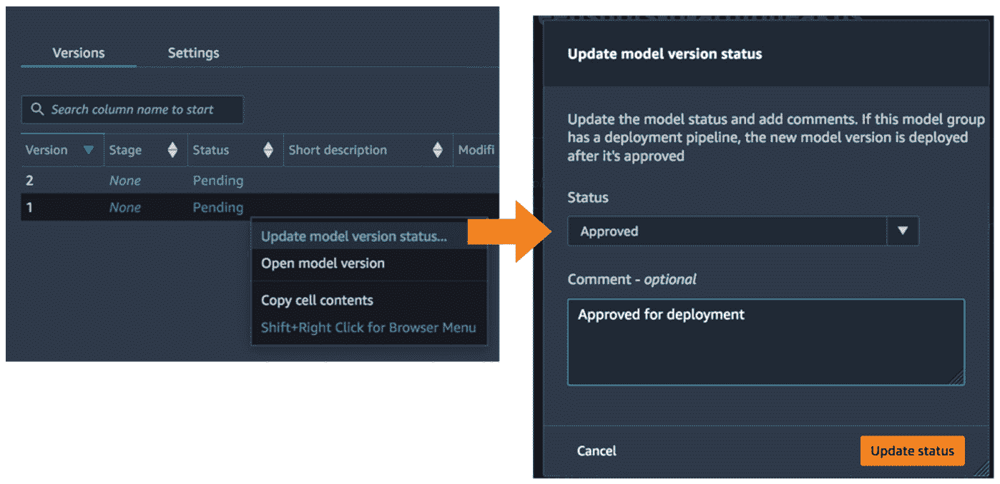
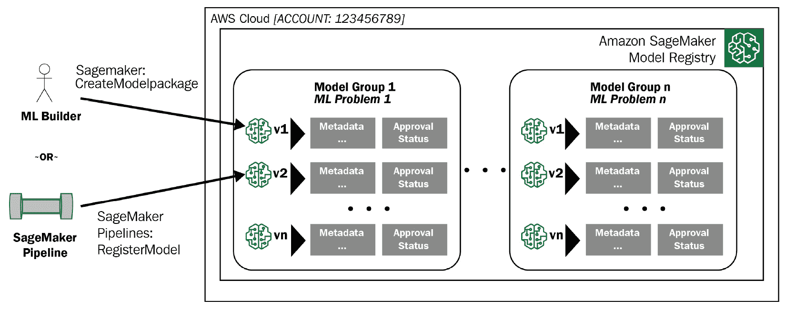
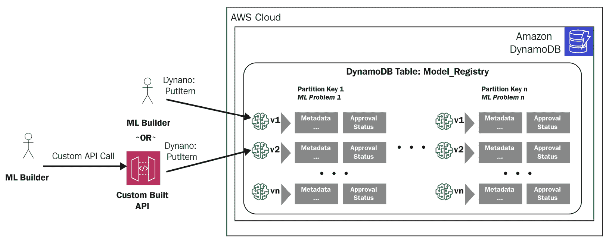
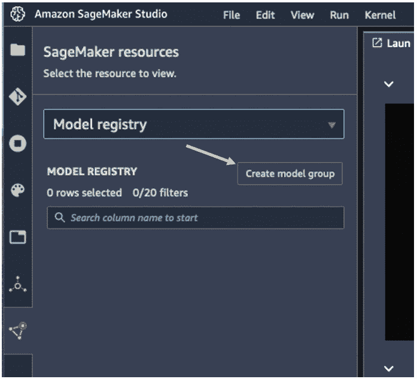

# 第八章：使用模型注册管理大规模模型

当您开始部署多个模型并管理多个模型版本时，如果不使用模型注册，确保遵循核心架构实践（如治理、可追溯性和可恢复性）是具有挑战性的。模型注册是一个包含特定于模型版本的元数据的中央存储库。它包括有关模型如何构建、该模型的表现以及模型部署位置和方式的信息。模型注册服务或解决方案通常包括额外的功能，例如审批流程和通知。

在本章中，我们将介绍模型注册的概念以及为什么模型注册对于管理大规模的多个模型很重要。我们还将概述在选择模型注册实现时需要考虑的因素，以便最好地满足您环境和操作需求。为此，我们将检查两个模型注册的示例实现。这些将是一个使用 AWS 服务的自定义构建的模型注册，以及 SageMaker 的实现（称为 SageMaker 模型注册）。

Amazon SageMaker 提供了一个内置的模型注册功能。这是一个完全管理的模型注册，针对在 Amazon SageMaker 中使用进行了优化。然而，如果 Amazon SageMaker 模型注册不符合您的需求，有几种常见的模式，利用自定义构建的模型注册或第三方解决方案，这些解决方案与 Amazon SageMaker 也兼容得很好。尽管有许多第三方模型注册可供使用，用于 SageMaker 训练的模型，但我们不会在本章中具体介绍它们。

在本章中，我们将涵盖以下主要主题：

+   使用模型注册

+   选择模型注册解决方案

+   使用 Amazon SageMaker 模型注册管理模型

# 技术要求

您需要有一个 AWS 账户来运行本章包含的示例。如果您尚未设置数据科学环境，请参阅*第二章**，数据科学环境*。该章节提供了设置过程的概述。

书中包含的代码示例可在以下 URL 的 GitHub 上找到：https://github.com/PacktPublishing/Amazon-SageMaker-Best-Practices/tree/main/Chapter08。您需要安装 Git 客户端才能访问它们（[`git-scm.com/`](https://git-scm.com/)）。

本章的代码位于 GitHub 仓库的`CH08`文件夹中。

# 使用模型注册

模型注册允许您集中跟踪每个模型版本的关键元数据。跟踪的元数据粒度通常取决于所选的实现（Amazon SageMaker 的模型注册、自定义解决方案或第三方解决方案）。

不论实现方式如何，需要考虑的关键元数据包括模型版本标识符以及每个已注册模型版本以下信息：

+   **模型输入**：这包括与模型输入及其版本相关的元数据。这可以包括诸如存储训练数据的 Amazon S3 存储桶名称、训练超参数以及用于训练的**Amazon Elastic Container Registry**（**ECR**）仓库或容器镜像等输入。

+   **模型性能**：这包括模型评估数据，如训练和验证指标。

+   `model.tar.gz`）。

+   **模型部署**：这包括与模型部署相关的元数据。这包括诸如模型版本部署到的环境（们）或用于注册模型的推理代码等信息。

Amazon SageMaker 提供了多种训练模型的选择，包括内置算法、内置框架（即脚本模式）以及自带容器。根据选择的不同，训练模型所需的输入数量可能会有所不同。这可能会影响您选择跟踪的元数据。因此，确定您需要跟踪的元数据的最低要求，以满足您可能具有的任何监管或内部可追溯性要求，是非常重要的。

当评估粒度级别时，您需要跟踪您的用例。记住您的团队是如何使用 Amazon SageMaker 来构建模型的。*图 8.1*展示了在 SageMaker 的训练模型选项中跟踪时需要考虑的输入、指标和工件示例：



图 8.1 – 训练选项中的模型构建元数据

对于跟踪和存储模型部署数据，也存在类似的考虑。为模型部署跟踪的元数据应提供足够的信息，以便使用 Amazon SageMaker 打包模型进行部署，到实时端点，或使用批量转换。这也应允许某人轻松地识别给定模型版本部署的位置，以及它是如何打包进行部署和使用的。*图 8.2*展示了在 SageMaker 的模型部署选项中跟踪时需要考虑的输入、部署阶段和工件示例：



图 8.2 – 模型部署选项中的模型部署元数据

如果您要管理几个模型，您可以使用简单的方法（如电子表格）来跟踪上述信息。然而，当您开始扩展到 20、100 或数千个模型时，跟踪模型元数据的那种机制就不再可扩展了。集中存储和跟踪每个模型版本的元数据（如图*8.1*和*8.2*所示）提供了以下好处：

+   **操作效率**：模型注册库提供了对构建特定模型版本所使用的关键输入、输出工件以及与该版本对齐的部署阶段信息的跟踪和可见性。拥有这些元数据允许您快速了解模型是如何构建的，模型的表现如何，有关训练模型工件的信息，同时也提供了跟踪特定版本部署到哪些环境的能力。

+   **可恢复性**：为了能够恢复已部署的模型或回滚到之前的版本，您需要能够看到用于创建可部署工件或已部署模型的输入和输入版本。在系统或人为错误的情况下，您可以使用存储在模型注册库中的元数据，结合受保护的版本化输入，恢复到特定的时间点。例如，如果管理员意外删除了一个模型端点，应该能够轻松地识别用于重新创建该端点的工件。这可以通过存储在模型注册库中的元数据来识别，这些元数据指向版本化模型工件的位置，并结合版本化的推理容器镜像。

+   **管道源和触发器**：通常需要连接模型构建和模型部署环境。这在拥有中央部署团队的大型企业中很常见，或者在模型构建和模型部署角色分离的组织中很常见。模型注册库提供了一个机制来捕获对了解模型构建所需的最小元数据。然而，它也可以用于触发审批工作流和下游部署。

在下一节中，我们将介绍三种创建模型注册库的模式，以集中跟踪和管理大规模机器学习模型。我们将概述每个模式的考虑因素和高级架构，以便指导您找到适合您特定用例的正确匹配。

# 选择模型注册库解决方案

实现模型注册库有多种选项。虽然每种实现都提供不同的功能或能力，但提供中央存储库以跟踪关键元数据的概念在所有实现中基本保持一致。在本节中，我们将介绍创建模型注册库的一些常见模式，并讨论每个模式的考虑因素。本节中涵盖的模式包括以下内容：

+   Amazon SageMaker 模型注册库

+   构建自定义模型注册库

+   利用第三方或**开源软件**（**OSS**）模型注册库

## Amazon SageMaker 模型注册库

Amazon SageMaker 模型注册表是一项托管服务，允许您集中目录化模型、管理模型版本、将元数据与您的模型版本关联，并管理模型版本的批准状态。该服务持续发展，新增功能，因此本节中的信息以出版日期为准。始终建议您通过官方文档验证当前功能和能力，官方文档为 *Amazon SageMaker 模型注册表* ([`docs.aws.amazon.com/sagemaker/latest/dg/model-registry.html`](https://docs.aws.amazon.com/sagemaker/latest/dg/model-registry.html))。SageMaker 模型注册表针对与 Amazon SageMaker Pipelines 和项目一起使用进行了优化；然而，它也可以独立使用。

您可以通过编程方式与 SageMaker 的模型注册表进行交互，也可以在 Amazon SageMaker Studio 中进行。Studio 提供了版本管理的可视化界面和体验。Studio 界面还提供了额外的搜索功能。以下截图展示了这些功能：



图 8.3 – SageMaker Studio 的 SageMaker 模型注册表界面

当模型获得生产批准时，SageMaker 模型注册表还包括一个可以修改的批准状态。这可能是经过同行或指定的部署审批者审查模型元数据和指标，作为部署的最终质量关卡之后。在以下截图中，您可以看到批准状态字段如何与 Amazon SageMaker Pipelines 中的 MLOps 项目集成，以根据模型状态的变化创建自动触发器：



图 8.4 – SageMaker 模型注册表 – 批准状态

SageMaker 模型注册表的主要组件包括以下内容：

+   **模型注册表**：这是包含模型组的中央存储库，它存在于 AWS 账户和 AWS 区域级别。可以设置跨账户权限，以便从其他 AWS 账户与模型注册表进行交互。

+   **模型组**：模型组是一种逻辑分组。它们允许您跟踪与同一机器学习问题相关或分组的不同模型版本。

+   **模型包**：模型包是已注册的模型或模型的特定版本。

*图 8.5* 展示了主要组件，其中每个模型版本都是包含在模型注册表内模型组中的模型包：



图 8.5 – Amazon SageMaker 模型注册表组件和用法

在模型组内注册新的模型版本时，您可以使用 Python 的 AWS SDK（`boto3`）的`create_model_package`方法（[`boto3.amazonaws.com/v1/documentation/api/latest/reference/services/sagemaker.html#SageMaker.Client.create_model_package`](https://boto3.amazonaws.com/v1/documentation/api/latest/reference/services/sagemaker.html#SageMaker.Client.create_model_package)），或者在使用 Amazon SageMaker Pipelines 中的`RegisterModel`步骤（[`sagemaker.readthedocs.io/en/stable/workflows/pipelines/sagemaker.workflow.pipelines.html#pipeline`](https://sagemaker.readthedocs.io/en/stable/workflows/pipelines/sagemaker.workflow.pipelines.html#pipeline)）在模型构建管道内创建一个步骤。了解您如何注册模型对于理解您如何在 SageMaker 管道之外使用 SageMaker 模型注册非常重要。这同样对于理解您如何将 SageMaker 模型注册集成到您可能已经使用的其他工作流程工具选项中也很重要。

可以将模型注册为**版本化**或**非版本化**。版本化的模型包是模型组的一部分，而非版本化的模型包不是模型组的一部分。使用模型组或版本化模型的优点在于能够逻辑上分组和管理相关的模型，以及提供自动版本化与特定**机器学习**（**ML**）问题相关的模型的能力。建议使用带有已注册版本化模型的模型组来注册您的模型。这是默认设置。

已注册的模型具有特定的元数据，可以与该版本关联。元数据由 API 请求参数定义和配置。在高级别上，API 接受并关联以下关键元数据作为输入：

+   **推理规范**：一系列参数，提供有关托管模型进行推理的详细信息和指导。传递的信息包括如 Amazon ECR 数据等信息。这包含推理代码镜像、包含训练模型实体的 Amazon S3 存储桶，以及托管模型进行实时推理或批量推理时支持的实例类型。例如，如果模型需要 GPU 进行推理，这可以在注册表中捕获。

+   **模型指标**：跨评估类别的模型评估指标，例如模型中的统计偏差或模型质量。

+   **验证规范**：有关用于验证模型包的 SageMaker 批量转换作业（如果适用）的信息。

+   **算法规范**：关于创建模型所使用的算法的详细信息，以及包含训练模型实体的 Amazon S3 存储桶。

+   `CodeCommit` 提交 ID、源作者、SageMaker Pipelines 项目 ID 以及 `CodeCommit` 仓库的名称。虽然它们在 Amazon SageMaker Pipelines 之外的使用没有限制，但它们是直接指向 SageMaker Pipelines 项目资源的指针。

+   **模型批准状态**：此参数用于指示模型是否获准部署。此参数可用于管理工作流程。在 SageMaker Pipelines 项目的情况下，基于此字段的状况，自动工作流程触发器会自动设置。如果模型状态更改为**批准**，则可以触发下游部署工作流程。

Amazon SageMaker 的模型注册库是全托管的，这意味着没有服务器需要管理。它还原生集成到 SageMaker Pipelines 中，提供直接在模型构建管道中将模型注册库作为原生步骤集成的功能。它是通过使用 `RegisterModel` 步骤来实现的。

例如，如果您构建了一个包含数据预处理、训练和模型评估的自动化步骤的模型构建管道，您可以添加一个条件步骤来验证评估指标。如果评估指标高于指定的阈值（例如，准确率 > 90%），则可以配置管道以自动注册您的模型。

SageMaker 的模型注册库也原生集成到 SageMaker Pipelines 项目中。项目允许您自动配置 MLOps 管道和利用模型注册库的模板。SageMaker 项目可用于自动设置模型包组，以及可以用来触发预配置的下游部署管道的批准工作流程。

重要提示

在*第十二章*“机器学习自动化工作流程”中更详细地介绍了 Amazon SageMaker Pipelines。模型注册库是 SageMaker Pipelines 中的一个组件，但可以独立于 SageMaker Pipelines 使用。

传递给 `CreateModelPackage` API 的许多参数针对 Amazon SageMaker 使用和与其他 Amazon SageMaker 功能的集成进行了定制。例如，可以与模型指标相关联的数据与使用 Amazon SageMaker Clarify、模型统计偏差指标、Amazon SageMaker Model Monitor 和数据质量约束指标等特征产生的指标有直接关联。在另一个例子中，验证规范专门针对 SageMaker 批量转换作业运行以评估 SageMaker 模型包。

在本节中，我们回顾了 Amazon SageMaker 模型注册库的高级架构和用法，以便与其他选项进行比较，这些选项将在下一节中介绍。本章涵盖了多个选项。这是为了支持各种用例，并帮助您为您的特定用例选择正确的选项。

## 构建自定义模型注册库

模型注册表也可以使用 AWS 服务构建。构建自定义注册表需要更多努力来构建解决方案、设置 AWS 服务之间的集成、设置 ML 管道集成，然后管理解决方案。然而，自定义注册表也提供了完全自定义注册表以满足特定于您的用例的需求的能力。这可能包括跟踪更细粒度元数据的特定要求，或支持多个 ML 服务/平台的要求。在本节中，我们将回顾使用 AWS 服务创建自定义模型注册表的一个模式。

*图 8.6*中所示的模式说明了使用 Amazon DynamoDB 构建的简单模型注册表。可以使用设计模式通过分区键将模型分组分开来存储模型元数据。您还可以考虑如果更喜欢表级隔离，为不同的团队或业务单元建立一个新的表的设计模式。还应使用**AWS 身份和访问管理**（**IAM**）设置控制，以控制对 DynamoDB 特定表的访问，以及设置特定主键以对谁可以访问特定的模型分组进行控制：



图 8.6 – 使用 AWS 服务的自定义模型注册表

基于 DynamoDB 的模型注册表架构为每个模型版本存储的元数据提供了灵活性。例如，您可能希望跟踪与 Amazon S3 存储桶中对象相对应的数据版本。一个自定义构建的模型注册表提供了定义和调整架构的灵活性，以满足您对可追溯性或更细粒度元数据跟踪的个别需求。

通过 Amazon DynamoDB API（**PutItem**）或通过自定义构建的 API 与自定义构建的模型注册表进行交互。使用简单的**PutItem** API 通常适用于较小的团队或执行端到端任务（如模型构建、模型部署和在生产环境中运行）的团队。然而，在许多情况下，模型注册表作为共享服务（或 ML 平台组件）的一部分构建，为多个团队和用例提供服务。在这种情况下，建议构建一个包含类似控制和验证的 API，就像在托管服务（如 SageMaker 的模型注册表）中看到的那样。

要将自定义构建的模型注册表扩展以包括工作流任务，例如根据更改的属性触发模型部署管道，解决方案需要扩展以设置检测更改的触发器，然后执行您想要调用的任何下游过程。为此，您可以使用 DynamoDB Streams 和 AWS Lambda 触发器。

在本节中，我们介绍了使用 AWS 服务创建自定义模型注册表的高级实现模式。此示例在注册表架构、收集的数据点和定义预期用途方面提供了完全的灵活性。

例如，您可能有一些团队正在使用 Amazon SageMaker 功能，而其他团队则在使用其他服务，甚至是在本地构建模型。构建自定义注册库也允许您根据现有的多账户策略，将模型注册库放置在您选择的 AWS 账户中，并根据使用情况调整模式。

讨论的模式还利用了 AWS 管理的服务，如 DynamoDB 和 API Gateway，这意味着仍然没有服务器需要管理。然而，这并不是一个打包的解决方案。因此，需要设置和配置这些服务。可能需要编写接口代码，设置服务之间的集成，并管理解决方案。

## 利用第三方或开源模型注册库

接下来，我们将简要介绍使用第三方或开源模型注册库的方法。由于可供选择的项目很多，本节将侧重于高级考虑因素，而不是深入探讨任何特定实现。常见的实现，如 MLflow，已经提供了与 Amazon SageMaker 集成的现有文档。在实施第三方/开源实现并与 Amazon SageMaker 集成时，应利用这些资源。

在考虑第三方或开源实现时，在评估您的选项时需要考虑以下几个问题：

+   实现是否要求您管理底层服务器，这意味着您需要承担一些额外的运营开销，以确保服务器得到修补、监控、扩展和设置，使用的是现成的架构？

+   实现是否提供与 Amazon SageMaker 集成的原生集成，使其易于集成？

+   为了与 Amazon SageMaker 集成，您需要设置和管理哪些额外的凭证？

使用第三方或开源选项可能会在设置、集成和持续管理方面增加一些额外的开销。然而，许多这些实现提供了强大的功能、接口和可扩展性，这可能会根据您的 ML 环境和用例而受到青睐。

在本节中，我们讨论了三种用于与 Amazon SageMaker 模型一起使用的模型注册库实现的常见模式。根据您的需求，每种模式都可以是一个有效的选择。因此，讨论了每个模式的关键考虑因素，以提供一般性指导，以便选择最佳实现。

通常情况下，建议根据您自己的需求选择提供所需功能的选项，并结合提供最低开发和运营开销的选项。在下一节中，我们将重点深入探讨 Amazon SageMaker 模型注册库的技术细节。

# 使用 Amazon SageMaker 模型注册库管理模型

在名为“Amazon SageMaker 模型注册表”的部分中包含了 Amazon SageMaker 模型注册表的介绍。这是为了解释在选择模型注册表实现时需要考虑的总体架构和功能。在本节中，我们将通过介绍设置和使用 SageMaker 模型注册表的过程和最佳实践指南来深入了解 Amazon SageMaker 模型注册表。

SageMaker 的模型注册表包括模型注册表、模型组和模型包。每个模型组包含与相同机器学习问题相关的模型版本或模型包。每个模型包代表模型的特定版本，并包含与该版本相关的元数据。在与 SageMaker 模型注册表交互时使用 SageMaker 模型注册表 API，并且可以通过以下任何一种方式调用这些 API：

+   `create-model-package-group`或`create-model-package`命令。

+   (`boto3`): 这使用方法与模型注册表进行交互，例如`create_model_package_group`或`create_model_package`方法。

+   **Amazon SageMaker Studio**：这使用 SageMaker Studio 中的点击式界面（如图 8.7 所示）来创建模型包组。

+   `RegisterModelstep`。

*图 8.7*展示了使用 Studio UI 创建模型包组的过程：



图 8.7 – 使用 SageMaker Studio 创建新的模型组

虽然你可以使用列出的任何方法与模型注册表进行交互，但在本章中，我们将介绍使用 AWS Python SDK（`boto3`）与模型注册表进行交互，以展示一个不依赖于 Amazon SageMaker Studio 或 Amazon SageMaker Pipelines 的低级别抽象。

在本节中，你了解了 SageMaker 模型注册表的主要组件，以及你可以通过编程方式或通过 Studio UI 与模型注册表进行交互的不同方式。

## 创建模型包组

模型包组包含一组模型包或模型版本。创建模型包组不是注册模型包的要求；然而，为了在机器学习用例中管理你的模型版本，建议使用模型包组。模型包组可以包含一个或多个模型包。

创建一个模型包组涉及一种方法，该方法在输入时仅接受少量参数进行配置，如下所示：

```py
import time
model_package_group_name = "air-quality-" + str(round(time.time()))
model_package_group_input_dict = {
"ModelPackageGroupName" : model_package_group_name,
"ModelPackageGroupDescription" : "model package group for air quality models",
"Tags": [
            {
            "Key": "MLProject",
             "Value": "weather"
              }
]  
}
create_model_pacakge_group_response = sm_client.create_model_package_group(**model_package_group_input_dict)
print('ModelPackageGroup Arn : {}'.format(create_model_pacakge_group_response['ModelPackageGroupArn']))
```

上述代码用于创建一个模型包组，然后可以由机器学习构建者使用，以及与机器学习管道一起注册模型包（版本）以进行部署。配置模型包组只需要一个模型包组名称，以及可选的描述和任何你想要与模型组关联的标签。

创建模型包组时的建议包括以下内容：

+   **建立模型包组的命名标准**：随着模型包组数量的增加，拥有清晰的命名标准可以帮助轻松识别和搜索相关的模型包组。一些考虑因素可能包括团队标识符和/或项目标识符。由于通常有多个团队在模型上工作，团队标识符可以帮助轻松地对特定团队的模型进行分类和搜索。在整体解决方案中使用多个模型也很常见。在这种情况下，拥有一种将特定项目或解决方案相关的模型分组的方法是非常有价值的。这可以通过建立命名约定以及标签来实现。

+   `MLProject`使用`weather`的值创建。在这种情况下，让我们假设一个天气团队负责构建与天气相关的模型，并且只有属于天气团队的团队成员应该能够查看带有此标签的模型包组。资源标签可以用来建立访问的条件策略。

## 创建模型包

模型包是一个可以存在于模型包组之外（称为*未版本化*）或存在于模型包组内（称为*版本化*）的模型版本。模型包组之外的模型包被称为未版本化，因为它没有使用模型包组的版本化功能。建议使用模型包组注册模型包，以自动管理模型版本，并在模型版本数量增加时提高可管理性。

重要提示

Amazon SageMaker 有两个名为`CreateModel` API 的概念。这是使用 Amazon SageMaker 部署模型所必需的，并在*Amazon SageMaker 文档*中讨论（[`docs.aws.amazon.com/sagemaker/latest/dg/sagemaker-mkt-model-pkg-model.html`](https://docs.aws.amazon.com/sagemaker/latest/dg/sagemaker-mkt-model-pkg-model.html)）。第二个例子，也是我们在本章中提到的例子，是使用`CreateModelPackage` API 创建的专门针对 Amazon SageMaker 模型注册表的模型包。

`CreateModelPackage` API 在输入时接受多个参数。高级参数类别已在标题为*Amazon SageMaker 模型注册表*的章节中介绍过，因此在本节中，我们将包括一个示例，使用这些参数然后通过我们的示例用例注册一个模型。在*第十二章* *机器学习自动化工作流程*中，我们将在 ML 管道的上下文中再次讨论模型注册表，以展示如何将模型注册表集成到您的自动化工作流程中。现在，我们将专注于注册模型包，以表明它已通过管道工作流程之外的初始模型验证。

在这种情况下，模型已经训练完毕，我们已经评估了训练指标。一旦我们的模型达到评估指标所确定的最低阈值，我们就可以准备注册模型包了。使用 AWS Python SDK (`boto3`)，我们将注册模型包，如下面的代码所示：

```py
modelpackage_inference_specification =  {
            "InferenceSpecification": {
            "Containers": [
            {
             "Image": xgboost_container,
             "ModelDataUrl": model_url
             }
             ],
             "SupportedContentTypes": [ "text/csv" ],
              "SupportedResponseMIMETypes": [ "text/csv" ],
  }
}
create_model_package_input_dict = {
            "ModelPackageGroupName" : model_package_group_name,
           "ModelPackageDescription" : "Model to predict air quality ratings using XGBoost",
            "ModelApprovalStatus" : "PendingManualApproval"
}
create_model_package_input_dict.update(modelpackage_inference_specification)
create_mode_package_response = sm_client.create_model_package(**create_model_package_input_dict)
model_package_arn = create_mode_package_response["ModelPackageArn"]
print('ModelPackage Version ARN : {}'.format(model_package_arn))
```

`ModelPackageGroupName` 是必需的，用于将模型包与模型包组关联。这允许您利用之前讨论过的自动版本控制功能。

可以使用 `list_model_packages` 方法以及 Amazon SageMaker Studio 来查看模型包。要列出模型包，请使用以下代码：

```py
sm_client.list_model_packages(ModelPackageGroupName=model_package_group_name)
```

创建模型包时的建议包括以下内容：

+   **创建版本化包**：在创建模型包时指定模型包组，以便将模型包与模型组关联。这允许自动进行版本控制和将用例分组，以便于管理。

+   在对已注册模型进行同行评审后，可以选择使用 `ApprovalStatus` 来表明该模型已达到最低标准或符合特定标准。

+   **保护模型注册表中引用的输入/工件**：模型注册表中的详细信息可用于重新创建或回滚已部署的模型；然而，这些资源需要受到未经授权的访问或意外删除的保护。例如，如果管理员意外删除了 SageMaker 端点，它仍然可以很容易地使用模型注册表中标识的资源重新创建。这包括包含模型工件的 S3 对象、包含推理代码的 S3 对象（可选）以及 ECR 推理镜像。如果这些输入中的任何一个不可用或无法保证，则可能无法重新创建该端点。因此，元数据提供了所需的信息，但仍需要采取额外步骤来保护输入和工件。

+   **考虑标签以添加额外元数据**：SageMaker 的模型注册表中的元数据固定在 API 中定义的输入参数。然而，可以使用标签来补充额外的元数据。在此处推荐使用标签的示例可能是捕获模型工件等资源的 S3 版本，以便在工件跟踪中包含更多粒度。

+   `MLProject` 使用 `weather` 的值创建。在这种情况下，假设一个天气团队负责构建与天气相关的模型，并且只有该团队成员应该能够注册新模型到该模型包组或其他使用此标签创建的模型包组。资源标签可以用来建立访问条件策略，以便在特定的模型包组内创建模型包。资源标签可以用来建立访问条件策略。

在本节中，我们详细介绍了使用本章提供的示例代码创建模型包组和将模型包注册到该模型包组的步骤。我们还概述了在创建自己的模型包组和模型包时需要考虑的建议。*第十二章*，*机器学习自动化工作流程*，将扩展本章涵盖的信息，包括将 Amazon SageMaker 的模型注册集成到 MLOps 流程中。

# 摘要

在本章中，我们讨论了模型注册以及利用模型注册在规模上管理 Amazon SageMaker 模型的优势。涵盖了模型注册实现的常见模式，包括 Amazon SageMaker 的模型注册、使用 AWS 服务构建自定义模型注册以及利用第三方或开源模型注册实现。根据您的用例和需求，每个选项都是一个有效的选择。然而，我们也强调了在选择最适合您需求的实现时需要考虑的一些因素。

最后，我们深入探讨了 Amazon SageMaker 的模型注册功能，涵盖了创建模型包组和通过创建模型包注册模型的具体建议。

在下一章中，我们将介绍使用 Amazon SageMaker 端点生产变体进行生产模型的实时测试和更新的内容。
