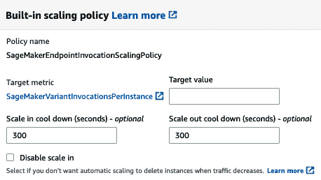
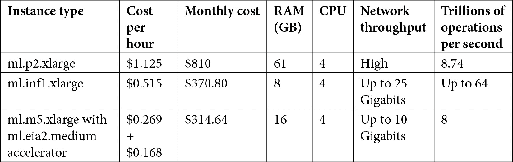

# 第十章：优化模型托管和推理成本

更强大的计算机（特别是**图形处理单元**，或**GPU**）和强大的**机器学习**（**ML**）框架，如 TensorFlow 的引入，导致了机器学习能力的一个代际飞跃。作为机器学习从业者，我们的视野现在包括优化这些新功能的使用，以最大化我们投入的时间和金钱所获得的价值。

在本章中，您将学习如何使用多种部署策略来满足您的训练和推理需求。您将学习何时提前获取和存储推理，何时按需获取，如何扩展推理服务以满足波动需求，以及如何使用多个模型进行模型测试。

在本章中，我们将涵盖以下主题：

+   实时推理与批量推理

+   在单个推理端点后面部署多个模型

+   扩展推理端点以满足推理流量需求

+   使用弹性推理进行深度学习模型

+   使用 SageMaker Neo 优化模型

# 技术要求

您需要一个 AWS 账户来运行本章包含的示例。如果您尚未设置数据科学环境，请参阅*第二章**，数据科学环境*，该章节将指导您完成设置过程。

书中包含的代码示例可在 GitHub 上找到，网址为[`github.com/PacktPublishing/Amazon-SageMaker-Best-Practices/tree/main/Chapter10`](https://github.com/PacktPublishing/Amazon-SageMaker-Best-Practices/tree/main/Chapter10)。您需要安装 Git 客户端才能访问它们（[`git-scm.com/`](https://git-scm.com/))。

本章的代码位于 GitHub 仓库的`CH10`文件夹中。

# 实时推理与批量推理

SageMaker 提供了两种获取推理的方法：

+   **实时推理**允许您从实时推理端点以非常低的延迟获取单个推理或少量推理。

+   **批量推理**允许您从批量处理作业中获取大量推理。

批量推理更高效且更具成本效益。只要您的推理需求允许，就使用它。我们将首先探讨批量推理，然后转向实时推理。

## 批量推理

在许多情况下，我们可以提前进行推理并将它们存储起来以供以后使用。例如，如果您想为电子商务网站上的用户生成产品推荐，这些推荐可能基于用户的先前购买以及您希望第二天推广的产品。您可以在夜间生成这些推荐并将它们存储起来，以便电子商务网站在用户浏览网站时调用。

存储批量推理有多种选择。由于以下原因，Amazon DynamoDB 是常见的选择，例如：

+   它很快。您可以在几毫秒内查找单个值。

+   它是可扩展的。您可以在低成本下存储数百万个值。

+   对于 DynamoDB 来说，最佳访问模式是通过高基数主键查找值。这非常适合许多推断使用模式，例如，当我们想要查找为单个用户存储的推荐时。

根据您的访问模式，您可以使用其他数据存储，包括 DocumentDB 和 Aurora。

在 GitHub 仓库的`CH10`文件夹中，您会找到`optimize.ipynb`笔记本。该仓库的*实时和批量推断*部分会指导您使用简单的 XGBoost 模型进行批量推断和实时推断。以下代码允许您运行批量推断作业：

```py
batch_input = "s3://{}/{}/{}/".format(s3_bucket, s3_prefix, 'test')
batch_output = "s3://{}/{}/{}/".format(s3_bucket, "xgboost-sample", 'xform')
transformer = estimator.transformer(instance_count=1, 
instance_type='ml.m5.4xlarge', output_path=batch_output, max_payload=3)
transformer.transform(data=batch_input, data_type='S3Prefix', 
content_type=content_type, split_type='Line')
```

这个作业大约需要 3 分钟来运行。

## 实时推断

当您将 SageMaker 模型部署到实时推断端点时，SageMaker 会将模型工件和您的推断代码（打包在 Docker 镜像中）部署到一个或多个推断实例。现在您有一个用于推断的实时 API 端点，并且可以根据需要从其他软件服务中调用它。

只要推断端点（实例）在运行，您就需要为其付费。在以下情况下使用实时推断：

+   推断依赖于*上下文*。例如，如果您想推荐一部视频观看，推断可能取决于用户刚刚看完的节目。如果您有一个大型视频目录，您无法提前生成所有可能的推荐排列。

+   您可能需要为*新事件*提供推断。例如，如果您试图将信用卡交易分类为欺诈或非欺诈，您需要等待您的用户实际尝试交易。

以下代码部署了一个推断端点：

```py
from sagemaker.deserializers import JSONDeserializer
from sagemaker.serializers import CSVSerializer
predictor = estimator.deploy(initial_instance_count=1,
                            instance_type='ml.m5.2xlarge',
                            serializer=CSVSerializer(),
                            deserializer=JSONDeserializer()
                             )
```

一旦端点上线，我们可以使用我们刚刚部署的端点来获取推断：

```py
result = predictor.predict(csv_payload)
print(result)
```

使用我们简单的 XGBoost 模型，一个推断大约需要 30 毫秒来完成。

## 成本比较

考虑这样一个场景，我们想要预测我们所有气象站第二天测量的数据，并在交互式网站上提供查询。我们大约有 11,000 个独特的气象站和每个站点的 7 个不同的预测参数。

使用`ml.m5.2xlarge`实例类型的实时端点，我们每小时支付 0.538 美元，或大约每月 387 美元。使用批量推断，我们每小时支付 1.075 美元用于`ml.m5.4xlarge`实例。每天运行作业需要 3 分钟，每月需要 90 分钟。这大约是 1.61 美元。

如果您不需要上下文相关的实时预测，批量推断方法通常更具成本效益。从 NoSQL 数据库中提供预测是一个更好的选择。

# 在单个推断端点后面部署多个模型

SageMaker 推理端点是实际包含负载均衡器和一个或多个推理容器实例的逻辑实体。你可以在单个端点后面部署同一模型的多个版本或完全不同的模型。在本节中，我们将探讨这两个用例。

## 同一模型的多个版本

SageMaker 端点允许你托管多个模型，这些模型为传入请求提供不同百分比的流量。这种能力支持常见的**持续集成**（**CI**）和**持续交付**（**CD**）实践，如金丝雀和蓝绿部署。虽然这些实践相似，但它们的目的略有不同，如以下所述：

+   **金丝雀部署**意味着你让模型的新版本承载一小部分流量，这样你就可以在流量的一小部分上测试模型的新版本，直到你对它的工作效果满意。

+   **蓝绿部署**意味着你同时运行模型的两个版本，保留一个较老的版本以便在新的版本出现问题时快速切换。

实际上，这些都是主题的变体。在 SageMaker 中，你指定每个模型变体处理的流量量。对于金丝雀部署，你可能会从新模型版本的小部分（通常为 1-5%）开始。对于蓝绿部署，你会使用 100%的新版本，但如果出现问题，会切换回 0%。

完成这些部署模式还有其他方法。例如，你可以使用两个推理端点，并使用 DNS（Route 53）、负载均衡器或全球加速器来处理流量整形。但通过 SageMaker 管理流量可以简化你的运营负担并降低成本，因为你不需要运行两个端点。

在笔记本的*A/B 测试*部分，我们将创建模型的另一个版本，并创建一个新的端点，该端点使用这两个模型：

1.  我们将首先通过以下方式训练模型的一个新版本，并改变超参数（最大树深度从`5`变为`10`）：

    ```py
    hyperparameters_v2 = {
            "max_depth":"10",
            "eta":"0.2",
            "gamma":"4",
            "min_child_weight":"6",
            "subsample":"0.7",
            "objective":"reg:squarederror",
            "num_round":"5"}
    estimator_v2 = \ sagemaker.estimator.Estimator(image_uri=xgboost_container, 
                        hyperparameters=hyperparameters,
                        role=sagemaker.get_execution_role(),
                        instance_count=1, 
                        instance_type='ml.m5.12xlarge', 
                        volume_size=200, # 5 GB 
                        output_path=output_path)
    predictor_v2 = estimator_v2.deploy(initial_instance_count=1,
                               instance_type='ml.m5.2xlarge',
                                serializer=CSVSerializer(),
                              deserializer=JSONDeserializer()
                                 )
    ```

1.  接下来，我们为每个模型版本定义端点变体。这里最重要的参数是`initial_weight`，它指定了应该有多少流量流向每个模型版本。通过将两个版本都设置为`1`，流量将在这两个版本之间平均分配。对于 A/B 测试，你可能从现有版本的权重为`20`，新版本的权重为`1`开始：

    ```py
    model1 = predictor._model_names[0]
    model2 = predictor_v2._model_names[0]
    from sagemaker.session import production_variant
    variant1 = production_variant(model_name=model1,
                                instance_type="ml.m5.xlarge",
                                  initial_instance_count=1,
                                  variant_name='Variant1',
                                  initial_weight=1)
    variant2 = production_variant(model_name=model2,
                                instance_type="ml.m5.xlarge",
                                  initial_instance_count=1,
                                  variant_name='Variant2',
                                  initial_weight=1)
    ```

1.  现在，我们使用以下两种模型变体部署一个新的模型：

    ```py
    from sagemaker.session import Session
    smsession = Session()
    smsession.endpoint_from_production_variants(
        name='mmendpoint',
        production_variants=[variant1, variant2]
    )
    ```

1.  最后，我们可以测试新的端点：

    ```py
    from sagemaker.deserializers import JSONDeserializer
    from sagemaker.serializers import CSVSerializer
    import boto3
    from botocore.response import StreamingBody
    smrt = boto3.Session().client("sagemaker-runtime")
    for tl in t_lines[0:50]:
        result = smrt.invoke_endpoint(EndpointName='mmendpoint',
             ContentType="text/csv", Body=tl.strip())
        rbody = StreamingBody( \
    raw_stream=result['Body'], \
    content_length= \
    int(result['ResponseMetadata']['HTTPHeaders']['content-length']))
        print(f"Result from {result['InvokedProductionVariant']} = " + \
    f"{rbody.read().decode('utf-8')}")
    ```

    你会看到类似以下输出的内容：

    ```py
    Result from Variant2 = 0.16384175419807434
    Result from Variant1 = 0.16383948922157288
    Result from Variant1 = 0.16383948922157288
    Result from Variant2 = 0.16384175419807434
    Result from Variant1 = 0.16384175419807434
    Result from Variant2 = 0.16384661197662354
    ```

注意，流量会根据我们指定的权重在模型的两个版本之间切换。在生产环境中，你应该在 CI/CD 或 MLOps 自动化工具中自动化模型端点的更新。

## 多个模型

在其他情况下，你可能需要运行完全不同的模型。例如，你可能希望有一个模型为美国提供天气推断，另一个模型为德国提供天气推断。你可以构建对这两个国家之间的差异敏感的模型。你可以在同一个端点后面托管这两个模型，并根据传入的请求将流量引导到它们。

或者，对于 A/B 测试，你可能希望控制哪些流量流向你的新模型版本，而不是让负载均衡器执行随机的加权分布。如果你有一个应用服务器可以识别哪些消费者应该使用新的模型版本，你可以将流量引导到推理端点后面的特定模型。

在“单个端点中的多个模型”笔记本部分，我们将通过创建针对不同空气质量参数优化的模型的示例来演示。当我们需要预测时，我们指定我们想要的参数类型，端点将我们的请求引导到适当的模型。这个用例非常现实；可能很难使用相同的模型同时预测颗粒物（`PM25`）和臭氧（`O3`）：

1.  首先，我们将通过创建 Spark 处理作业来准备只包含单个参数数据的新数据集：

    ```py
    spark_processor.run(
        submit_app="scripts/preprocess_param.py",
        submit_jars=["s3://crawler-public/json/serde/json-serde.jar"],
        arguments=['--s3_input_bucket', s3_bucket,
                  '--s3_input_key_prefix', s3_prefix_parquet,
                   '--s3_output_bucket', s3_bucket,
                   '--s3_output_key_prefix', f"{s3_output_prefix}/o3",
                   '--parameter', 'o3',],
        spark_event_logs_s3_uri="s3://{}/{}/spark_event_logs".format(s3_bucket, 'sparklogs'),
        logs=True,
        configuration=configuration
    )
    ```

    我们将对`PM25`和`O3`重复前面的步骤。

1.  现在，我们将根据单个参数训练集训练新的 XGBoost 模型，如下所示：

    ```py
    estimator_o3 = sagemaker.estimator.Estimator(image_uri=xgboost_container, 
                        hyperparameters=hyperparameters,
                        role=sagemaker.get_execution_role(),
                        instance_count=1, 
                        instance_type='ml.m5.12xlarge', 
                        volume_size=200,  
                        output_path=output_path)
    content_type = "csv"
    train_input = TrainingInput("s3://{}/{}/{}/{}/".format(s3_bucket, s3_output_prefix, 'o3', 'train'), content_type=content_type)
    validation_input = TrainingInput("s3://{}/{}/{}/{}/".format(s3_bucket, s3_output_prefix, 'o3', 'validation'), content_type=content_type)
    # execute the XGBoost training job
    estimator_o3.fit({'train': train_input, 'validation': validation_input})
    ```

1.  接下来，我们定义多模型类：

    ```py
    model = estimator_o3.create_model(role=sagemaker.get_execution_role(), image_uri=xgboost_container)
    from sagemaker.multidatamodel import MultiDataModel
    model_data_prefix = f's3://{s3_bucket}/{m_prefix}/mma/'
    model_name = 'xgboost-mma'
    mme = MultiDataModel(name=model_name,
                         model_data_prefix=model_data_prefix,
                         model=model) 
    ```

1.  接下来，我们将部署多模型端点：

    ```py
    predictor = mme.deploy(initial_instance_count=1,
                           instance_type='ml.m5.2xlarge',
                           endpoint_name=model_name,
                          serializer=CSVSerializer(),
                        deserializer=JSONDeserializer())
    ```

1.  到目前为止，端点实际上没有任何模型在其后面。我们需要在下一步添加它们：

    ```py
    for est in [estimator_o3, estimator_pm25]:
        artifact_path = \ est.latest_training_job.describe()['ModelArtifacts']['S3ModelArtifacts']
        m_name = artifact_path.split('/')[4]+'.tar.gz'

        # This is copying over the model artifact to the S3 location for the MME.
        mme.add_model(model_data_source=artifact_path, model_data_path=m_name)

    list(mme.list_models())
    ```

1.  我们已经准备好测试端点。下载两个测试文件，每个参数一个：

    ```py
    s3.download_file(s3_bucket, f"{s3_output_prefix}/pm25/test/part-00120-81a51ddd-c8b5-47d0-9431-0a5da6158754-c000.csv", 'pm25.csv')
    s3.download_file(s3_bucket, f"{s3_output_prefix}/o3/test/part-00214-ae1a5b74-e187-4b62-ae4a-385afcbaa766-c000.csv", 'o3.csv')
    ```

1.  读取文件并获取推断，指定我们想要使用的模型：

    ```py
    with open('pm25.csv', 'r') as TF:
        pm_lines = TF.readlines()
    with open('o3.csv', 'r') as TF:
        o_lines = TF.readlines()
    for tl in pm_lines[0:5]:
        result = predictor.predict(data = tl.strip(), target_model='pm25.tar.gz')
        print(result)
    for tl in o_lines[0:5]:
        result = predictor.predict(data = tl.strip(), target_model='o3.tar.gz')
        print(result)
    ```

现在我们已经看到了如何部署多个模型进行测试或其他目的，让我们转向处理波动流量需求。

# 扩展推理端点以满足推理流量需求

当我们需要实时推理端点时，处理能力需求可能会根据传入流量而变化。例如，如果我们为移动应用程序提供空气质量推断，使用量可能会根据一天中的时间而波动。如果我们为峰值负载配置推理端点，我们将在非峰值时段支付过多。如果我们为较小的负载配置推理端点，我们可能在峰值时段遇到性能瓶颈。我们可以使用推理端点自动扩展来调整容量以满足需求。

有两种扩展类型，垂直扩展和水平扩展。**垂直扩展**意味着我们调整单个端点实例的大小。**水平扩展**意味着我们调整端点实例的数量。我们更喜欢水平扩展，因为它对最终用户的影响较小；负载均衡器可以在不影响最终用户的情况下重新分配流量。

配置 SageMaker 推理端点自动扩展有四个步骤：

+   设置最小和最大实例数量。

+   选择缩放指标。

+   设置缩放策略。

+   设置冷却时间。

虽然您可以使用 API 自动设置自动缩放，但在这个部分，我们将通过控制台中的步骤进行说明。首先，前往 SageMaker 控制台的**端点**部分，如下面的截图所示：

![图 10.1 – SageMaker 控制台中的端点列表]

![img/B17249_10_01.jpg]

![图 10.1 – SageMaker 控制台中的端点列表]

选择您的端点之一，在名为**端点运行时设置**的部分，选择**配置自动缩放**：

![图 10.2 – 端点运行时设置]

![img/B17249_10_02.jpg]

![图 10.2 – 端点运行时设置]

现在，让我们详细了解推理端点的设置。

## 设置最小和最大容量

您可以为端点使用的最小和最大实例数量设置边界。这些边界可以帮助您防止需求激增导致的不预期成本。如果您预计会有周期性的峰值，请在达到推理端点之前在您的应用程序中构建一个断路器来减轻负载。以下截图显示了控制台中的这些设置：

![图 10.3 – 设置最小和最大容量]

![img/B17249_10_03.jpg]

![图 10.3 – 设置最小和最大容量]

如果您的负载高度可变，您可以从小型实例类型开始，并积极地进行扩展。这可以防止您为不需要的大型实例类型付费。

## 选择缩放指标

我们需要决定何时触发缩放操作。我们通过指定 CloudWatch 指标来完成此操作。默认情况下，SageMaker 提供了两个有用的指标：

+   `InvocationsPerInstance`报告在一段时间内发送到每个端点实例的推理请求数量。

+   `ModelLatency`是响应推理请求的微秒数。

我们建议将`ModelLatency`作为自动缩放的指标，因为它报告了最终用户的使用体验。设置该指标的实际值将取决于您的需求和一段时间内端点性能的观察。例如，您可能会发现，如果推理结果通过几个其他服务（这些服务在结果到达最终用户之前增加了自己的延迟），超过 100 毫秒的延迟会导致用户体验下降。

## 设置缩放策略

您可以选择**目标跟踪**和**步进缩放**。目标跟踪策略更有用，并试图调整容量以保持某些目标指标在给定边界内。步进缩放策略更高级，以增量步骤增加容量。

## 设置冷却时间

**冷却时间**是指端点在开始下一次缩放操作之前等待的时间。如果您让端点即时响应，您可能会过于频繁地进行缩放。一般来说，积极地进行扩展，保守地进行缩减。

以下截图展示了如果你使用默认的缩放策略，如何配置目标指标值和冷却期：



图 10.4 – 设置目标指标值和冷却期

接下来，让我们看看为深度学习模型提供的另一种优化技术。

# 使用 Elastic Inference 进行深度学习模型

如果你检查机器学习的整体成本，你可能会惊讶地发现，你每月的大部分成本来自实时推理端点。训练作业虽然可能资源密集，但运行一段时间后会终止。托管笔记本实例可以在非工作时间关闭。但推理端点每天 24 小时，每周 7 天都在运行。如果你使用深度学习模型，推理端点的成本会更加明显，因为具有专用 GPU 容量的实例比其他类似实例更昂贵。

当你从深度学习模型获取推理时，你不需要像训练期间那样多的 GPU 容量。**Elastic Inference** 允许你将部分 GPU 容量附加到常规 EC2 实例或**Elastic Container Service** (**ECS**) 容器。因此，你可以以较低的成本快速获得深度学习推理。

笔记本中的 *Elastic Inference* 部分展示了如何将 Elastic Inference 加速器附加到端点，如下面的代码块所示：

```py
predictor_ei = predictor.deploy(initial_instance_count = 1, instance_type = 'ml.m5.xlarge', 
                    serializer=CSVSerializer(),
                    deserializer=JSONDeserializer(),
                    accelerator_type='ml.eia2.medium')
```

考虑一个我们需要一些 GPU 容量进行推理的情况。让我们考虑实例类型的三个选项并比较成本。假设我们每月运行端点 720 小时。下表比较了不同推理选项的月度成本，使用的是撰写时的公布价格：



图 10.5 – 推理成本比较

你需要查看你的具体用例，并找出最佳的 RAM、CPU、网络吞吐量和 GPU 容量组合，以最低的成本满足你的性能需求。如果你的推理完全受 GPU 限制，Inferentia 实例可能会给你提供最佳的性能价格比。如果你需要更多一些的 GPU 计算资源，P2/P3 系列将工作得很好。如果你需要的整体容量非常小，Elastic Inference 提供了最便宜的 GPU 选项。

在下一节中，我们将介绍针对特定硬件部署的模型的另一种优化技术。

# 使用 SageMaker Neo 优化模型

在上一节中，我们看到了 Elastic Inference 如何降低深度学习模型的推理成本。同样，SageMaker Neo 允许你通过为特定平台编译训练好的 ML 模型以获得更好的性能来提高推理性能并降低成本。虽然这有助于一般情况，但在你尝试在低功耗边缘设备上运行推理时尤其有效。

为了使用 SageMaker Neo，您只需使用支持框架中的训练模型启动一个编译作业。当编译作业完成后，您可以将工件部署到 SageMaker 端点或使用*Greengrass* IoT 平台部署到边缘设备。

笔记本中的*使用 SageMaker Neo 进行模型优化*部分演示了如何编译我们的 XGBoost 模型以在托管端点使用：

1.  首先，我们需要获取输入记录的长度（特征数量）：

    ```py
    ncols = len(t_lines[0].split(','))
    ```

1.  现在，我们将编译我们的一个训练模型。我们需要指定目标平台，在这个例子中，它只是一个标准的`ml_m5`系列：

    ```py
    import sagemaker
    from sagemaker.model import Model
    n_prefix = 'xgboost-sample-neo'
    n_output_path = 's3://{}/{}/{}/output'.format(s3_bucket, n_prefix, 'xgboost-neo')
    m1 = Model(xgboost_container,model_data=estimator\    .latest_training_job.describe()['ModelArtifacts']['S3ModelArtifacts'], 
               role=sagemaker.get_execution_role())
    neo_model = m1.compile('ml_m5', 
               {'data':[1, ncols]}, 
               n_output_path, 
               sagemaker.get_execution_role(), 
               framework='xgboost', 
               framework_version='latest',
               job_name = 'neojob')
    ```

1.  一旦编译作业完成，我们可以按照以下方式部署编译后的模型：

    ```py
    neo_predictor = neo_model.deploy(initial_instance_count = 1, instance_type = 'ml.m5.xlarge', 
                        serializer=CSVSerializer(),
                        deserializer=JSONDeserializer(),
                        endpoint_name='neo_endpoint')
    ```

1.  让我们测试端点以查看是否可以看到速度提升：

    ```py
    for tl in t_lines[0:5]:
        result = smrt.invoke_endpoint(EndpointName='neo_endpoint',
                        ContentType="text/csv",
                        Body=tl.strip())
        rbody = \ StreamingBody(raw_stream=result['Body'],content_length=int(result['ResponseMetadata']['HTTPHeaders']['content-length']))
        print(f"Result from {result['InvokedProductionVariant']} = {rbody.read().decode('utf-8')}")
    ```

发送了几次调用请求后，让我们检查 CloudWatch 度量。回到编译端点的控制台页面，在**监控**部分点击**查看调用度量**，如下面的截图所示：

![图 10.6 – 端点控制台中的监控部分

![img/B17249_10_06.jpg]

图 10.6 – 端点控制台中的监控部分

现在，您将看到 CloudWatch 度量控制台，如下面的截图所示。在此，选择**ModelLatency**和**OverheadLatency**度量：

![图 10.7 – CloudWatch 度量控制台

![img/B17249_10_07.jpg]

图 10.7 – CloudWatch 度量控制台

在我的简单测试中，模型的延迟在常规 XGBoost 端点上是 10 毫秒，在用 Neo 编译后下降到 9 毫秒。如果您在低功耗设备上使用深度学习模型，编译模型的冲击将更为显著。

# 摘要

在本章中，我们探讨了多种提高推理性能和降低推理成本的方法。这些方法包括尽可能使用批量推理，在单个推理端点后面部署多个模型以降低成本并帮助进行高级金丝雀或蓝/绿部署，扩展推理端点以满足需求，以及使用 Elastic Inference 和 SageMaker Neo 以更低的成本提供更好的推理性能。

在下一章中，我们将讨论监控以及 ML 的其他重要操作方面。
