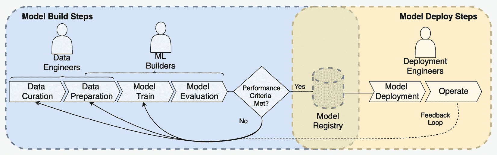
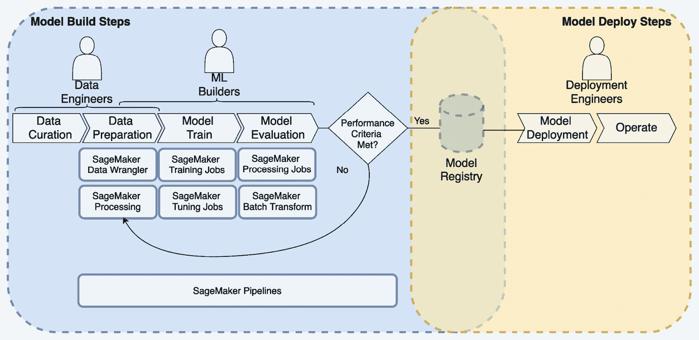
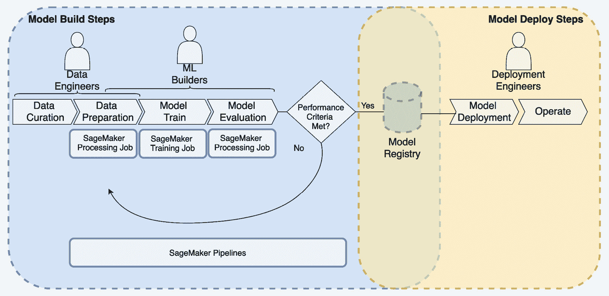
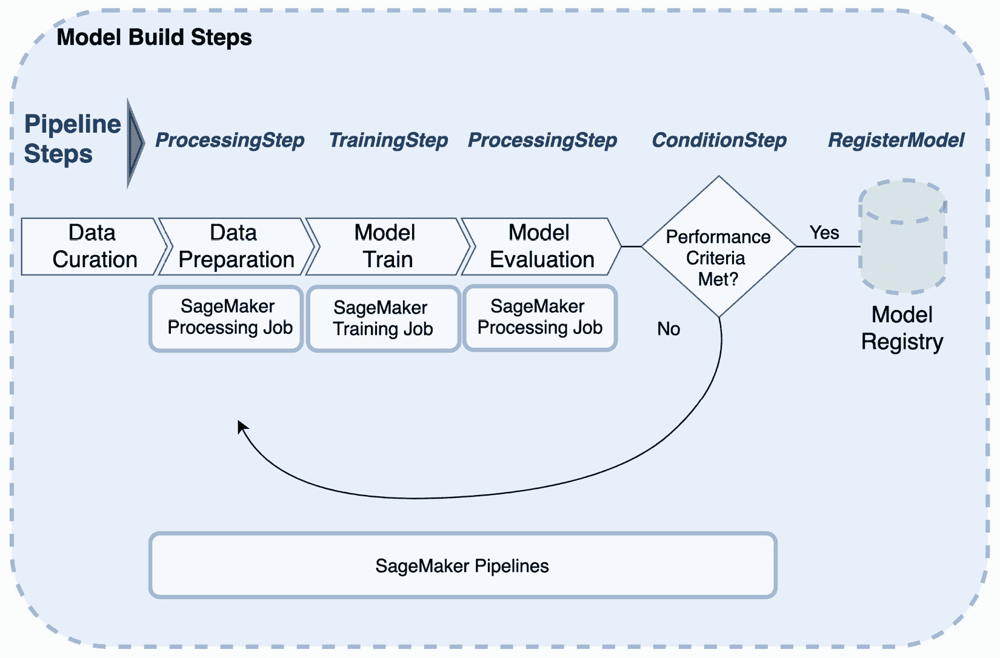
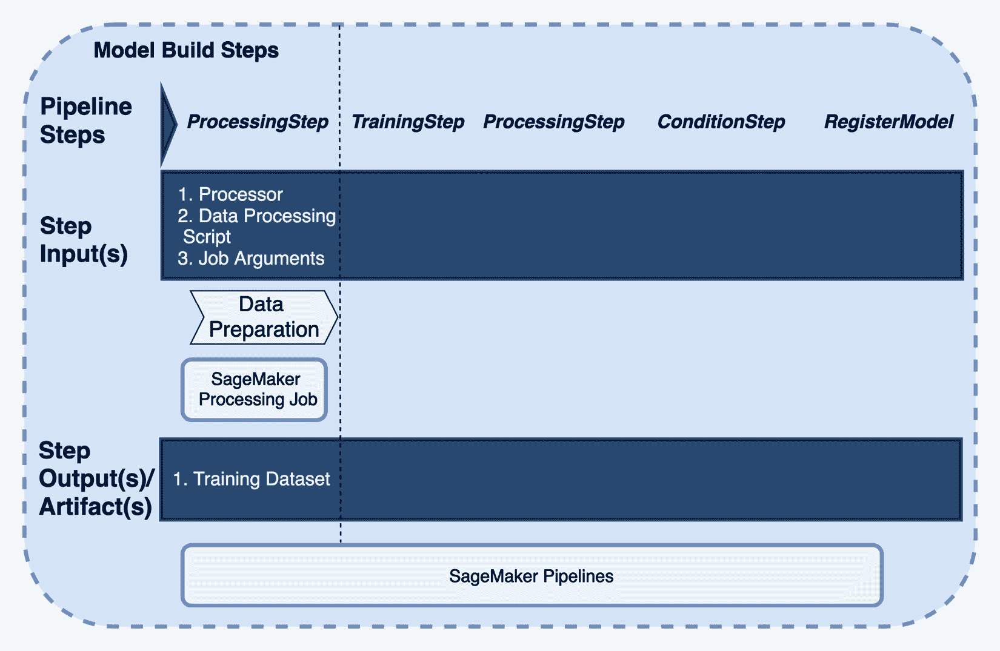
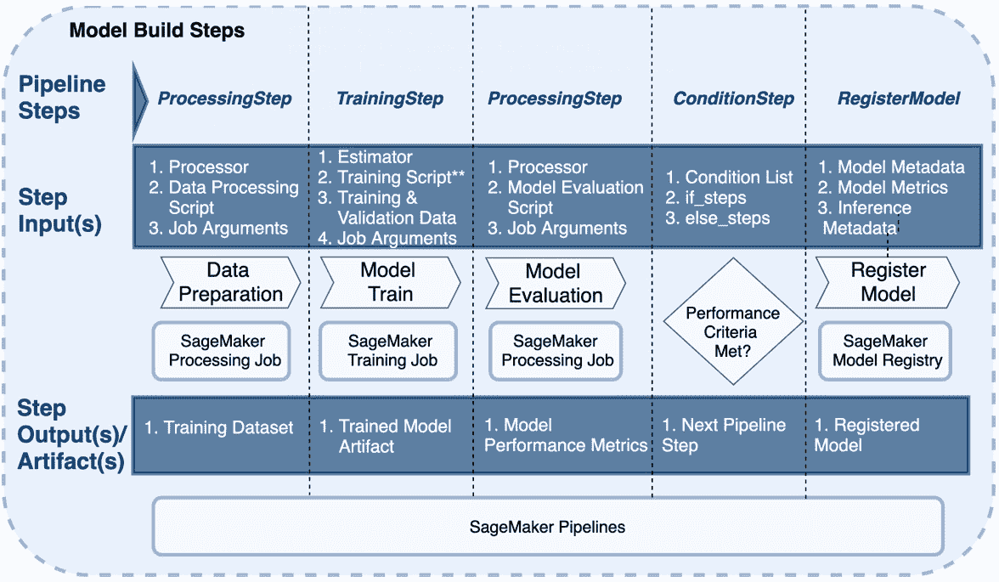
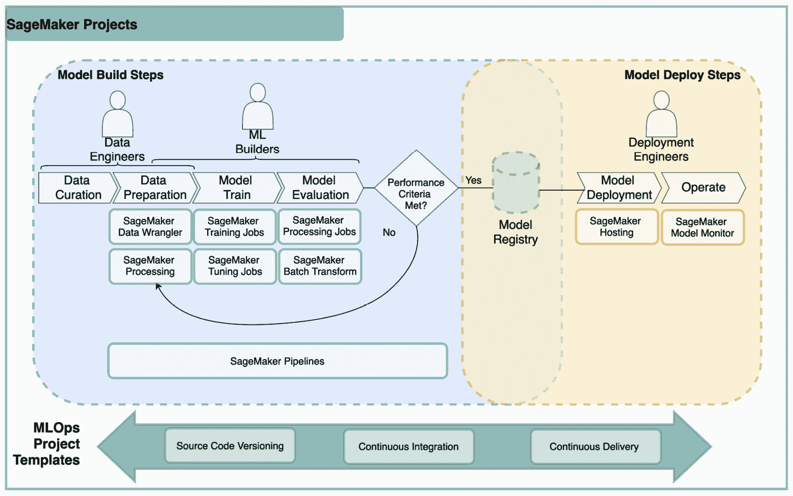
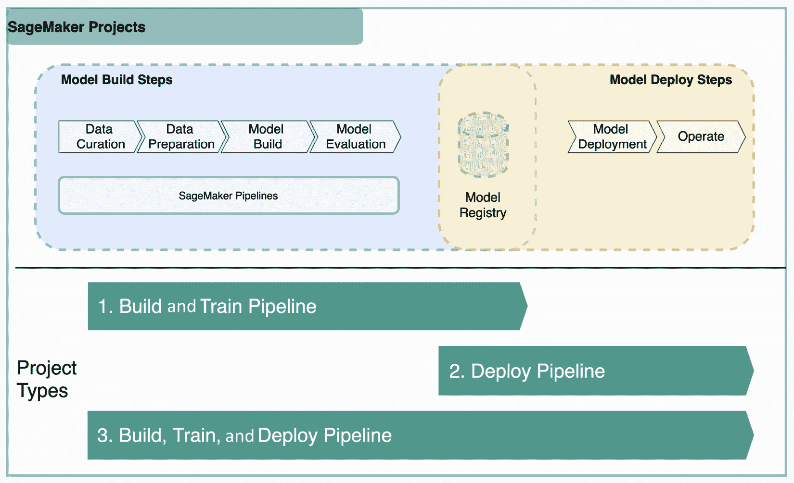

# 第十二章：机器学习自动化工作流程

对于部署到生产环境中的**机器学习**（**ML**）模型，建立一致且可重复的过程来重新训练、部署和操作这些模型非常重要。随着在生产环境中运行的 ML 模型数量的增加，这一点变得越来越重要。**机器学习开发生命周期**（**ML 生命周期**）在实施 ML 工作流程时带来了一些独特的挑战。这一点将在本章中讨论。我们还将讨论常见的模式，不仅自动化 ML 工作流程，而且为 ML 管道实施**持续集成**（**CI**）和**持续交付**/**部署**（**CD**）实践。

尽管我们将在本章中涵盖自动化 ML 工作流程和构建 ML 的 CI/CD 管道的各种选项，但我们特别关注使用 Amazon SageMaker Pipelines 和 Amazon SageMaker 项目进行详细实现模式。SageMaker Pipelines 专为包括自动化构建模型所需的步骤的活动而设计，例如**数据准备**、**模型训练**和**模型评估**任务。SageMaker 项目通过将 CI/CD 实践纳入您的 ML 管道来构建在 SageMaker Pipelines 的基础上。SageMaker 项目利用 SageMaker Pipelines 结合 SageMaker 模型注册表构建端到端 ML 管道，这些管道还纳入了 CI/CD 实践，如源代码控制、版本管理和自动化部署。

本章将涵盖以下主题：

+   自动化 SageMaker ML 工作流程的考虑因素

+   使用 Amazon SageMaker Pipelines 构建 ML 工作流程

+   使用 Amazon SageMaker 项目创建 CI/CD ML 管道

# 自动化 SageMaker ML 工作流程的考虑因素

在本节中，我们将回顾一个典型的 ML 工作流程，包括模型构建和部署活动的基本步骤。理解每个步骤的关键 SageMaker 输入和工件对于构建自动化工作流程非常重要，无论您选择使用哪种自动化或工作流程工具。

此信息已在*第八章*中介绍，*使用模型注册表按比例管理模型*。因此，如果您尚未阅读该章节，建议在继续阅读本章之前先阅读。我们将在此基础上构建信息，并涵盖构建 SageMaker 工作流程的自动化工作流程和 CI/CD 管道的高级考虑因素和指导。我们还将简要介绍在构建自动化工作流程和 CI/CD ML 管道时常用的 AWS 原生服务选项。

## 典型的 ML 工作流程

一个机器学习工作流程包含构建机器学习模型所需的全部步骤，随后是部署和在生产环境中运行该模型所需的步骤。*图 12.1*展示了包含模型构建和模型部署步骤的典型机器学习工作流程。工作流程中的每一步通常都有多个相关任务。例如，数据准备可能包括将数据转换成与你的机器学习算法一致格式的多个任务。

当我们考虑自动化端到端的机器学习工作流程时，我们寻求自动化步骤中包含的任务，以及如何编排步骤的顺序和时机到一个端到端的管道中。因此，了解每一步的关键输入以及步骤的预期输出或工件对于构建端到端管道至关重要。

此外，模型开发是一个迭代的过程。因此，可能需要多次实验才能找到一个满足模型性能标准的候选模型。因此，在找到可以注册到模型注册表的候选模型之前，通常会在数据科学沙盒环境中继续进行实验。这表明模型已准备好部署到一个或多个目标环境进行进一步测试，然后部署到生产环境。

参考以下图例，了解典型工作流程的示例：



图 12.1 – 典型机器学习工作流程

模型部署后，还可能需要额外的任务来将模型与现有的客户端应用程序集成。还可能需要创建一个更复杂的推理工作流程，该工作流程包括多个模型和推理所需的任务。最后，仍需要执行操作该模型的任务。尽管*操作*步骤位于最后，但需要考虑在早期过程中执行该模型持续运行所需的活动。这是为了确保在自动化工作流程中包含所有必要的任务，以及确保关键指标被捕获并可供关键角色使用。此外，这还允许你根据需要设置警报。这包括以下活动：

+   **模型监控**：这包括确保您的模型性能随时间不退化的任务。此主题在*第十一章*，*使用 Amazon SageMaker 模型监控和 Clarify 监控生产模型*中详细说明。然而，在构建您的自动化部署工作流时，考虑可能需要在管道中包含和自动化的额外任务是很重要的。例如，SageMaker 模型监控对于数据漂移需要诸如基准测试您的训练数据、在您的端点上启用数据捕获以及安排 SageMaker 监控作业等任务。所有这些任务都应自动化并包含在您的自动化工作流中。您还可以利用带有**Amazon 增强 AI**（**Amazon A2I**）的**人工审核**来检查低置信度预测，这些预测可以与 SageMaker 模型监控一起实施，或作为其补充。

+   **系统监控**：系统监控包括捕获和警报对托管您的模型以及支持已部署机器学习解决方案的其他资源至关重要的指标。例如，Amazon SageMaker 将自动捕获端点的关键指标，例如 CPU/GPU 利用率或调用次数。在 Amazon CloudWatch 中设置阈值和创建警报有助于确保托管模型的资源以及其他解决方案组件的整体健康。

+   **模型重新训练**：为了设置自动模型重新训练，应在模型构建步骤中执行的任务被捕获为可以作为模型构建管道一部分执行的代码。此管道将包括每个步骤内所有任务的自动化，以及这些步骤的编排。

+   **管道监控**：如果您为模型构建和模型部署活动设置了自动化管道，那么在您的管道上实施监控也很关键，以确保在管道中的步骤失败时您会收到通知。

我们已经覆盖了机器学习工作流中的通用步骤。然而，由于许多因素，每个自动化工作流和 CI/CD 管道都可能有所不同。在下一节中，我们将讨论一些在机器学习用例中常见的考虑因素。

## 构建 SageMaker 工作流和 CI/CD 管道的考虑和指导

在机器学习工作流中执行的任务可能因用例而异；然而，当为您的机器学习用例构建自动化工作流时，以下高级实践是推荐的：

+   **实施模型注册表**：**模型注册表**有助于连接模型构建实验阶段和将模型部署到更高级环境之间的步骤。模型注册表捕获关键元数据，如**模型指标**。它还确保您能够跟踪关键输入和工件以实现可追溯性，以及管理跨环境的多个模型版本。

+   **版本输入和工件**：能够回滚或重新创建特定模型版本或可部署工件的能力取决于知道创建该资源所使用的输入和工件的具体版本。例如，要重新创建 SageMaker 端点，你需要知道关键版本信息，例如模型工件和推理容器镜像。这些输入和工件应免受意外删除的保护。它们还应通过端到端管道进行跟踪，以便能够自信地作为自动化工作流程的一部分重新创建资源。

## 自动化工作流程和 CI/CD 管道中的 AWS 原生选项

在本章中，我们主要关注 SageMaker 原生选项用于创建自动化工作流程，以及在端到端管道中叠加 CI/CD 实践。然而，还有其他选项也可以用于创建包含 SageMaker 任务的自动化工作流程，这些任务用于模型构建和模型部署。还有第三方选项包含与 SageMaker 的操作符或集成。然而，这些内容在本书中并未涉及。

首先，我们将介绍一些可以用于构建包含 SageMaker 任务的自动化工作流程的 AWS 服务和功能：

+   **AWS Step Functions**：AWS Step Functions ([`aws.amazon.com/step-functions/?step-functions.sort-by=item.additionalFields.postDateTime&step-functions.sort-order=desc`](https://aws.amazon.com/step-functions/?step-functions.sort-by=item.additionalFields.postDateTime&step-functions.sort-order=desc)) 允许你创建包含与多个 AWS 服务集成的自动化无服务器工作流程，同时赋予你将第三方任务集成到工作流程中的能力。AWS Step Functions 还具有对 SageMaker 任务的本地支持，例如 SageMaker 处理作业、SageMaker 训练作业和 SageMaker 托管选项。

    此外，ML 构建者可以选择利用 AWS Step Functions 数据科学 SDK ([`docs.aws.amazon.com/step-functions/latest/dg/concepts-python-sdk.html`](https://docs.aws.amazon.com/step-functions/latest/dg/concepts-python-sdk.html))，使用 Python 而不是通过 Amazon States 语言来创建 ML 工作流程。Amazon States 语言是 AWS Step Functions 的原生管道语法。AWS Step Functions 提供了跨 AWS 服务的可扩展性，具有与在 ML 工作流程中最常使用的 AWS 服务（如 AWS Lambda、Amazon EMR 或 AWS Glue）的本地集成。

+   **Amazon Managed Workflows for Apache Airflow**：Amazon Managed Workflows for Apache Airflow ([`aws.amazon.com/managed-workflows-for-apache-airflow/`](https://aws.amazon.com/managed-workflows-for-apache-airflow/)) 允许您通过与其他常用 AWS 服务（如 SageMaker）的本地集成来创建自动化的机器学习工作流程。许多组织和团队已经使用或投资了 Airflow，因此这项服务提供了一种方式，通过使用包括与 SageMaker 的本地集成在内的托管服务来利用这些现有投资。

+   **Amazon SageMaker Operators for Kubernetes**：SageMaker Operators for Kubernetes ([`docs.aws.amazon.com/sagemaker/latest/dg/amazon-sagemaker-operators-for-kubernetes.html`](https://docs.aws.amazon.com/sagemaker/latest/dg/amazon-sagemaker-operators-for-kubernetes.html)) 允许团队使用 Kubernetes API 和命令行 Kubernetes 工具（如 **kubectl**）原生地创建 SageMaker 任务。

+   **Amazon SageMaker Components for Kubeflow Pipelines**：SageMaker Components for Kubeflow Pipelines 允许团队继续利用 Kubeflow 进行工作流程编排，同时提供与 SageMaker 的集成，以便您可以在托管环境中创建和运行 SageMaker 作业，而无需直接在您的 Kubernetes 集群上运行。这对于利用端到端托管的 SageMaker 功能很有用，同时也适用于您不希望在集群上直接执行这些任务的情况。

接下来，我们将介绍一些 AWS 服务和功能，这些服务可以用于将 CI/CD 实践集成到您的机器学习管道中。这些服务不仅限于机器学习，还可以替代提供类似功能的第三方工具：

+   **AWS CodeCommit**：AWS CodeCommit ([`aws.amazon.com/codecommit/`](https://aws.amazon.com/codecommit/)) 是一个基于 Git 的私有源代码仓库。对于机器学习管道，AWS CodeCommit 可以存储任何相关的源代码，例如 **基础设施即代码**（**IaC**）和**配置即代码**（**CaC**），数据处理代码，训练代码，模型评估代码，管道代码和模型部署代码。您的存储库结构可能有所不同，但通常建议至少将模型构建和模型部署代码分开。

+   **AWS CodeBuild**：AWS CodeBuild ([`aws.amazon.com/codebuild/`](https://aws.amazon.com/codebuild/)) 是一个完全托管的构建服务，可用于多种用途。这包括编译源代码，运行测试，以及作为管道的一部分运行自定义脚本。对于机器学习管道，AWS CodeBuild 可以用于测试通过自定义脚本和打包 AWS CloudFormation 模板等任务。

+   **AWS CodePipeline**：AWS CodePipeline ([`aws.amazon.com/codepipeline/`](https://aws.amazon.com/codepipeline/)) 是一个完全托管的 CD 服务，可用于编排您的 ML 管道步骤。AWS CodePipeline 可用于编排模型构建任务和模型部署任务的步骤。

前面的 AWS 服务列表可用于为您的 ML 管道融入 CI/CD 实践。您还可以选择用 GitHub、BitBucket 或 Jenkins 等第三方选项替换上述服务。

在本节中，我们讨论了在自动化关键步骤的任务以及提供整体编排以自动化这些步骤的背景下，一个高级 ML 工作流程。我们还讨论了构建您的 ML 工作流程时的一些关键考虑因素。我们回顾了创建自动化 ML 工作流程的 AWS 原生选项。然后我们查看可用于融入 CI/CD 实践的 AWS 服务。

所有这些，以及许多第三方选项，都是选择自动化 SageMaker 工作流程的正确工具时的有效选项。决定使用前面提到的服务自定义构建工作流程，或者决定用第三方选项替换上述服务，通常来自个人偏好或组织标准或要求利用现有工具。

在本章剩余部分，我们将重点关注 SageMaker 原生能力，用于自动化您的 ML 工作流程并融入 CI/CD 实践。

# 使用 Amazon SageMaker Pipelines 构建 ML 工作流程

模型构建工作流程涵盖了开发模型时执行的所有步骤，包括数据准备、模型训练、模型调优和模型部署。在这种情况下，模型部署可以包括评估您的模型所需的任务，以及不需要部署到更高环境的批量用例。SageMaker Pipelines 是一个完全托管的托管服务，允许您使用 SageMaker Python SDK 创建自动化的模型构建工作流程。

SageMaker Pipelines 包含用于执行 SageMaker 任务（如 SageMaker Processing 用于数据预处理和 SageMaker Training 用于模型训练）的内置步骤类型 ([`docs.aws.amazon.com/sagemaker/latest/dg/build-and-manage-steps.html`](https://docs.aws.amazon.com/sagemaker/latest/dg/build-and-manage-steps.html))。Pipelines 还包括控制您的管道如何工作的步骤。例如，管道可以包括条件步骤，用于评估前一个步骤的输出，以确定是否继续到管道中的下一个步骤。

要包括执行其他 AWS 服务或非 AWS 任务的步骤，您必须使用 **回调步骤**。如果您在管道中使用另一个 AWS 服务执行任务，这将非常有用。一个例子是如果您正在使用 AWS Glue 进行数据预处理。*图 12.2* 在先前的流程图的基础上，表明 SageMaker Pipelines 在端到端工作流程中的位置，以及为每个模型构建工作流程步骤提供支持的 SageMaker 功能示例：



图 12.2 – SageMaker 管道模型构建工作流程

在本节中，您将为您的机器学习用例构建一个 SageMaker 管道。该管道将包括数据准备、模型训练和模型评估所需的全部步骤。由于我们不需要 SageMaker 的每个功能来构建我们的管道，您将只使用以下图中注明的功能：



图 12.3 – SageMaker 管道示例管道

对于您 SageMaker 管道中的每个步骤，您首先需要配置您将执行的任务（例如，训练作业），然后配置该任务的 SageMaker Pipelines 步骤。配置完所有步骤后，将步骤链接在一起，然后执行管道。以下各节将指导您构建用于示例用例的 SageMaker 管道。

## 构建您的 SageMaker 管道

在本节中，我们将介绍配置您 SageMaker 管道中每个步骤所需的步骤，以及如何将这些步骤链接在一起，并最终执行您的模型构建管道。对于您管道中的每个步骤，您需要遵循以下两个步骤：

1.  配置 SageMaker 作业。

1.  配置 SageMaker Pipelines 步骤。

*图 12.4* 展示了我们构建管道将使用的步骤：



图 12.4 – 使用 SageMaker 步骤的管道用例

我们将从数据准备步骤开始，在此步骤中，我们将使用 SageMaker Processing 将我们的原始数据转换为算法期望的格式。

## 数据准备步骤

在此步骤中，您将配置用于将您的数据转换为算法期望格式的 SageMaker 处理作业。为此，我们将使用来自 *第四章*，*使用 Amazon SageMaker Data Wrangler 和 Processing 进行大规模数据准备* 的相同配置：

1.  首先，我们将配置 SageMaker 处理作业，如下所示：

    ```py
    from sagemaker.spark.processing import PySparkProcessor 
    spark_processor = PySparkProcessor( 
        base_job_name="spark-preprocessor", 
        framework_version="3.0", 
        role=role, 
        instance_count=15, 
        instance_type="ml.m5.4xlarge", 
        max_runtime_in_seconds=7200, ) 
    configuration = [ 
        { 
        "Classification": "spark-defaults", 
        "Properties": {"spark.executor.memory": "18g",
                  "spark.yarn.executor.memoryOverhead": "3g", 
                       "spark.driver.memory": "18g", 
                    "spark.yarn.driver.memoryOverhead": "3g", 
                       "spark.executor.cores": "5", 
                       "spark.driver.cores": "5", 
                     "spark.executor.instances": "44",      
                     "spark.default.parallelism": "440", 
                   "spark.dynamicAllocation.enabled": "false" 
                    }, 
         }, 
         { 
         "Classification": "yarn-site", 
          "Properties": {"yarn.nodemanager.vmem-check-enabled": "false", 
          "yarn.nodemanager.mmem-check-enabled": "false"}, 
          } 
    ]
    ```

1.  接下来，我们将配置用于执行你的数据准备任务的 SageMaker Pipelines 步骤。为此，我们将使用内置的处理步骤（[`docs.aws.amazon.com/sagemaker/latest/dg/build-and-manage-steps.html#step-type-processing`](https://docs.aws.amazon.com/sagemaker/latest/dg/build-and-manage-steps.html#step-type-processing)），它告诉管道这个步骤将是一个 SageMaker 处理作业。*图 12.5* 展示了 `ProcessingStep` 用于数据预处理所期望的高级输入和输出/工件：



图 12.5 – 数据准备管道步骤

我们之前已经配置了处理器，因此现在我们将使用该处理器（结合 *图 12.4* 中显示的其他输入）来设置我们的管道步骤，如下所示：

1.  首先，我们将启用**步骤缓存**。步骤缓存会告诉 SageMaker 检查是否有之前使用相同参数调用过的步骤的执行。这样，它就可以使用成功运行的先前步骤值，而不是重新执行具有完全相同参数的步骤。你应该考虑使用步骤缓存来避免不必要的任务和成本。例如，如果你的管道中的第二个步骤（模型训练）失败，你可以在该步骤没有变化的情况下重新启动管道，而不需要重新执行数据准备步骤，如下所示：

    ```py
    from sagemaker.workflow.steps import CacheConfig
    cache_config = CacheConfig(enable_caching=True, expire_after="T360m")
    ```

1.  接下来，我们将使用 `get_run_args` 方法定义运行时参数。在这种情况下，我们正在传递之前配置的 Spark 处理器，结合标识输入（原始天气数据）、输出（训练、测试和验证数据集）以及数据预处理脚本作为输入接受的其他参数。数据预处理脚本 `preprocess.py` 是用于 *第四章*，*使用 Amazon SageMaker Data Wrangler 和 Processing 进行大规模数据准备* 中使用的处理脚本的略微修改版本。请参考以下脚本：

    ```py
    from sagemaker.processing import ProcessingInput, ProcessingOutput
    run_args = pyspark_processor.get_run_args(
        "preprocess.py",
        submit_jars=["s3://crawler-public/json/serde/json-serde.jar"],
        spark_event_logs_s3_uri=spark_event_logs_s3_uri,
        configuration=configuration,
        outputs=[ \ 
            ProcessingOutput(output_name="validation", destination=validation_data_out, source="/opt/ml/processing/validation"),
            ProcessingOutput(output_name="train", destination=train_data_out, source="/opt/ml/processing/train"),
            ProcessingOutput(output_name="test", destination=test_data_out, source="/opt/ml/processing/test"),
         ],
        arguments=[
            '--s3_input_bucket', s3_bucket,
            '--s3_input_key_prefix', s3_prefix_parquet,
            '--s3_output_bucket', s3_bucket,
            '--s3_output_key_prefix', s3_output_prefix+'/prepared-data/'+timestamp
        ]
    )
    ```

1.  接下来，我们将使用运行时参数来配置实际的数据预处理任务所用的 SageMaker Pipelines 步骤。你会注意到我们正在使用之前配置的所有参数来构建作为管道一部分执行的步骤：

    ```py
    from sagemaker.workflow.steps import ProcessingStep
    step_process = ProcessingStep(
        name="DataPreparation",
        processor=pyspark_processor,
        inputs=run_args.inputs,
        outputs=run_args.outputs,
        job_arguments=run_args.arguments,
        code="modelbuild/pipelines/preprocess.py",
    )
    ```

## 模型构建步骤

在这个步骤中，你将配置用于训练你的模型的 SageMaker 训练作业。你将使用数据准备步骤生成的训练数据，结合你的训练代码和配置参数。

重要提示

虽然我们在这个章节中没有具体介绍，但需要注意的是，SageMaker Pipelines 现在已与 SageMaker Experiments 集成，允许你捕获额外的指标，并在 SageMaker Pipelines 中查看相应的图表。

对于此，我们将使用来自 *第六章*，*大规模训练和调优* 的相同配置。请参考以下步骤：

1.  首先，我们将配置 SageMaker 训练作业，如下所示：

    ```py
    # initialize hyperparameters
    hyperparameters = {
            "max_depth":"5",
            "eta":"0.2",
            "gamma":"4",
            "min_child_weight":"6",
            "subsample":"0.7",
            "objective":"reg:squarederror",
            "num_round":"5"}
    # set an output path where the trained model will be saved
    m_prefix = 'pipeline/model'
    output_path = 's3://{}/{}/{}/output'.format(s3_bucket, m_prefix, 'xgboost')
    # this line automatically looks for the XGBoost image URI and builds an XGBoost container.
    # specify the repo_version depending on your preference.
    image_uri = sagemaker.image_uris.retrieve("xgboost", region, "1.2-1")
    # construct a SageMaker estimator that calls the xgboost-container
    xgb_estimator = sagemaker.estimator.Estimator(image_uri=image_uri, 
                             hyperparameters=hyperparameters,
                         role=sagemaker.get_execution_role(),
                             instance_count=1, 
                             instance_type='ml.m5.12xlarge', 
                             volume_size=200, # 5 GB 
                             output_path=output_path)
    ```

1.  接下来，我们将配置用于执行您的模型训练任务的 SageMaker Pipelines 步骤。为此，我们将使用内置的 `training step` ([`docs.aws.amazon.com/sagemaker/latest/dg/build-and-manage-steps.html#step-type-training`](https://docs.aws.amazon.com/sagemaker/latest/dg/build-and-manage-steps.html#step-type-training))。这告诉 Pipelines 此步骤将是一个 SageMaker 训练作业。*图 12.6* 展示了 **Training step** 预期的高级别输入和输出/工件：

![Figure 12.6 – Model build pipeline step]

![img/B17249_12_06.jpg]

图 12.6 – 模型构建管道步骤

我们之前已配置了估算器，因此现在我们将使用该估算器结合 *图 12.6* 中显示的其他输入来设置我们的 Pipelines 步骤：

```py
from sagemaker.inputs import TrainingInput
from sagemaker.workflow.steps import TrainingStep
step_train = TrainingStep(
    name="ModelTrain",
    estimator=xgb_estimator,
    cache_config=cache_config,
    inputs={
        "train": TrainingInput(
            s3_data=step_process.properties.ProcessingOutputConfig.Outputs["train"].S3Output.S3Uri,
            content_type="text/csv",
        ),
        "validation": TrainingInput(
            s3_data=step_process.properties.ProcessingOutputConfig.Outputs["validation"].S3Output.S3Uri,
            content_type="text/csv",
        ),
    },
)
```

## 模型评估步骤

在此步骤中，您将配置一个用于评估您训练的模型（使用从训练步骤生成的模型工件以及您的处理代码和配置）的 SageMaker 处理作业：

1.  首先，我们将从 `ScriptProcessor` 开始配置 SageMaker 处理作业。我们将使用它来执行一个简单的评估脚本，如下所示：

    ```py
    from sagemaker.processing import ScriptProcessor
    script_eval = ScriptProcessor(
        image_uri=image_uri,
        command=["python3"],
        instance_type=processing_instance_type,
        instance_count=1,
        base_job_name="script-weather-eval",
        role=role,
    )
    ```

1.  接下来，我们将配置用于执行您的模型评估任务的 SageMaker Pipelines 步骤。为此，我们将使用内置的 Processing step ([`docs.aws.amazon.com/sagemaker/latest/dg/build-and-manage-steps.html#step-type-processing`](https://docs.aws.amazon.com/sagemaker/latest/dg/build-and-manage-steps.html#step-type-processing))。这告诉 Pipelines 此步骤将是一个 SageMaker 处理作业。*图 12.7* 展示了用于模型评估的 Processing step 预期的高级别输入和输出/工件：

![Figure 12.7 – Model evaluation pipeline step]

![img/B17249_12_07.jpg]

图 12.7 – 模型评估管道步骤

我们之前已配置了处理器，因此现在我们将使用该处理器结合 *图 12.7* 中显示的其他输入来设置我们的 Pipelines 步骤。为此，我们首先将设置用于存储处理作业输出（在这种情况下，模型评估指标）的属性文件。然后，我们将配置 `ProcessingStep` 定义，如下所示：

```py
from sagemaker.workflow.properties import PropertyFile
evaluation_report = PropertyFile(
    name="EvaluationReport", output_name="evaluation", path="evaluation.json"
)
step_eval = ProcessingStep(
    name="WeatherEval",
    processor=script_eval,
    cache_config = cache_config,
    inputs=[
        ProcessingInput(
            source=step_train.properties.ModelArtifacts.S3ModelArtifacts,
            destination="/opt/ml/processing/model",
        ),
        ProcessingInput(
          source=step_process.properties.ProcessingOutputConfig.Outputs["test"].S3Output.S3Uri,  destination="/opt/ml/processing/test",
        ),
    ],
    outputs=[
        ProcessingOutput(output_name="evaluation", source="/opt/ml/processing/evaluation"),
    ],
    code="modelbuild/pipelines/evaluation.py",
    property_files=[evaluation_report],
)
```

## 条件步骤

在此步骤中，您将配置一个内置的条件步骤，该步骤将根据您之前模型评估步骤的结果确定是否继续执行管道中的下一个步骤。设置条件步骤需要一系列条件或必须为真的项目。这结合了根据该条件执行步骤的指令列表。*图 12.8* 阐述了条件步骤所需的输入和输出：

![Figure 12.8 – Conditional pipeline step]

![img/B17249_12_08.jpg]

图 12.8 – Conditional pipeline 步骤

在这种情况下，我们将使用`if_steps`参数设置一个条件。在这种情况下，如果条件为真，则下一步将是注册模型然后创建打包模型的模型。您可以可选地指定`else_steps`以指示条件不为真时要执行的下一步。在这种情况下，如果条件不为真，我们将简单地终止管道：

```py
from sagemaker.workflow.conditions import ConditionLessThanOrEqualTo
from sagemaker.workflow.condition_step import (
    ConditionStep,
    JsonGet
)
cond_lte = ConditionLessThanOrEqualTo(
    left=JsonGet(
        step=step_eval,
        property_file=evaluation_report,
        json_path="regression_metrics.mse.value"
    ),
    right=6.0
)
step_cond = ConditionStep(
    name="MSECondition",
    conditions=[cond_lte],
    if_steps=[step_register, step_create_model],
    else_steps=[]
)
```

## 注册模型步骤

在这个最后一步，您将打包模型并配置一个内置的注册模型步骤（[`docs.aws.amazon.com/sagemaker/latest/dg/build-and-manage-steps.html#step-type-register-model`](https://docs.aws.amazon.com/sagemaker/latest/dg/build-and-manage-steps.html#step-type-register-model)），该步骤将您的模型注册到 SageMaker 模型注册库中的模型包组。如图 12.9 所示，我们将用于注册模型的输入包含有关打包模型的信息，例如模型版本、估计器和模型工件在 S3 上的位置。这些信息与模型指标和推理规范等附加信息结合使用，用于注册模型版本：



图 12.9 – 条件管道步骤

此步骤将使用管道中先前步骤的数据来注册模型并集中存储有关此特定模型版本的键信息。此外，您将看到`approval_status`参数。此参数可用于触发下游部署过程（这些将在 SageMaker 项目中更详细地讨论）：

```py
from sagemaker.model_metrics import MetricsSource, ModelMetrics
from sagemaker.workflow.step_collections import RegisterModel
model_metrics = ModelMetrics(
    model_statistics=MetricsSource(
        s3_uri="{}/evaluation.json".format(
step_eval.arguments["ProcessingOutputConfig"]["Outputs"][0]["S3Output"]["S3Uri"]
        ),
        content_type="application/json",
    )
)
step_register = RegisterModel(
    name="RegisterModel",
    estimator=xgb_train,
    model_data=step_train.properties.ModelArtifacts.S3ModelArtifacts,
    content_types=["text/csv"],
    response_types=["text/csv"],
    inference_instances=["ml.t2.medium", "ml.m5.xlarge"],
    transform_instances=["ml.m5.xlarge"],
    model_package_group_name=model_package_group_name,
    approval_status=model_approval_status,
    model_metrics=model_metrics,
)
```

## 创建管道

在前面的步骤中，我们配置了作为模型构建管道一部分的任务和步骤。我们现在需要将这些步骤链接起来以创建 SageMaker 管道。

在配置管道步骤和创建 SageMaker 管道时，识别可能随管道执行而变化的参数以及可能更动态的参数非常重要。例如，处理或训练的实例类型可能是您希望在每次执行管道时都能更改的内容，而不直接修改您的管道代码。这就是参数在执行时动态传递参数变得重要的地方。这允许您根据不同的环境或随着数据增长来更改配置（例如更改实例类型参数）。

以下代码显示了将先前配置的管道步骤链接起来，以及确定我们希望在每次执行中能够传递的参数：

```py
from sagemaker.workflow.pipeline import Pipeline
pipeline_name = f"WeatherPipeline"
pipeline = Pipeline(
    name=pipeline_name,
    parameters=[
        processing_instance_type,
        processing_instance_count,
        training_instance_type,
        model_approval_status,
        input_data
    ],
    steps=[step_process, step_train, step_eval, step_cond],
)
```

## 执行管道

现在我们已经定义和配置了步骤和管道本身，我们希望能够执行管道。为此，您需要执行几个步骤。这些步骤需要在每次管道执行时执行。管道可以通过多种方式启动：

+   在笔记本中编程（如本章示例笔记本所示）

+   在 SageMaker Studio UI 中的“Pipelines”下

+   通过其他资源编程方式

+   通过由事件或计划触发的 EventBridge 源

在本节中，我们将关注从你的示例笔记本执行你的 pipeline 所需的步骤。首先，你需要将 pipeline 定义提交给 SageMaker Pipelines 服务。这是通过一个 `upsert` 完成的，该 `upsert` 将 IAM 角色作为参数传递。请注意，如果不存在，`upsert` 将创建 pipeline 定义，如果存在，则更新 pipeline。此外，传递的角色由 SageMaker Pipelines 用于创建和启动步骤中定义的所有任务。因此，你需要确保该角色具有你 pipeline 所需的 API 权限。最佳实践是只包括实际需要的 API 权限，以避免过度授权的角色。

在以下代码中，你需要加载 pipeline 定义，然后通过 `upsert` 提交该定义：

```py
import json
json.loads(pipeline.definition())
pipeline.upsert(role_arn=role)
```

一旦提交了 pipeline 定义，你就可以使用以下代码开始 pipeline：

```py
execution = pipeline.start()
```

有多种方法可以检查你的 pipeline 步骤的状态和进度。你可以在 Studio 控制台中查看你的 pipeline，并点击每个步骤以获取每个步骤的元数据，包括步骤日志。此外，你可以通过编程方式检查 pipeline 执行的状态。为此，你可以运行 `execution.describe()` 来查看 pipeline 执行状态，或运行 `execution.list_steps()` 来查看执行状态和每个步骤。

在模型构建活动中，从笔记本中临时运行你的 pipeline 通常是可以接受的。然而，当你准备将模型部署到生产环境时，在那个阶段找到最一致和可重复的触发或安排模型构建 pipeline 以进行模型重新训练的方式是很常见的。

要做到这一点，你可以利用 SageMaker Pipelines 和 Amazon EventBridge 之间的集成（[`docs.aws.amazon.com/sagemaker/latest/dg/pipeline-eventbridge.html`](https://docs.aws.amazon.com/sagemaker/latest/dg/pipeline-eventbridge.html)）。这种集成允许你通过事件规则触发你的 SageMaker pipeline 的执行。这些规则可以基于事件，例如 AWS Glue 作业的完成，或者它们可以是计划好的。

## Pipeline 推荐实践

在本节中，我们介绍了如何使用你的示例天气用例设置 SageMaker pipeline。随着你构建自己的 pipeline，它们在所需配置和应包含的步骤方面可能会有所不同。然而，以下一般性建议适用于所有用例（适用时突出显示独特考虑因素）：

1.  SageMaker Pipelines 内置了支持各种 SageMaker 作业的步骤，并能够利用回调进行自定义步骤。与 SageMaker 步骤的内置集成简化了管道的构建和管理。因此，建议在可能的情况下，**使用 SageMaker 原生步骤来处理您的管道中的任务**。

1.  **使用运行时参数**对于在执行或环境中更可能变化的作业参数，例如运行训练或处理作业的 ML 实例的大小或数量。这允许你在启动管道执行时传递值，而不是每次都修改你的管道代码。

1.  **启用步骤缓存**以利用消除管道中不必要的步骤执行的优势。这将降低成本，并在前一个管道步骤已成功执行且参数相同的情况下减少管道时间。

在本节中，我们介绍了使用 SageMaker Pipelines 自动化模型构建 ML 工作流程。在下一节中，我们将介绍创建一个超越自动化并包含 CI/CD 实践的端到端 ML 管道。

# 使用 Amazon SageMaker Projects 创建 CI/CD 管道

在本节中，我们将讨论使用 Amazon SageMaker Projects 将 CI/CD 实践纳入您的 ML 管道。SageMaker Projects 是一种服务，它结合使用 SageMaker Pipelines 和 SageMaker 模型注册，以及 CI/CD 工具，来自动提供和配置 CI/CD 管道。*图 12.10* 说明了 SageMaker Projects 的核心组件。使用 Projects，您具有 CD 管道的优势、源代码版本控制和管道执行的自动触发：



图 12.10 – SageMaker 项目

项目通过内置的 SageMaker MLOps 项目模板或通过创建您自己组织的 MLOps 模板提供。底层模板通过 AWS 服务目录、SageMaker Studio 提供，并包含预配置 CI/CD 管道的 CloudFormation 模板。由于项目依赖于 CloudFormation 来提供管道，这确保了 IaC/CaC 实践的实践，能够一致且可靠地创建 CI/CD ML 管道。

SageMaker 内置了三种核心类型的 MLOps 项目模板。*图 12.11* 展示了这三种主要类型：1\. **构建和训练管道**，2\. **部署管道**，3\. **构建、训练和部署管道**。

参考以下图示：



图 12.11 – SageMaker 项目

首先，有一个构建和训练模板。这个模板涵盖了数据准备、特征工程、模型训练和评估所需的任务。当您在 SageMaker 上执行模型构建活动但将模型部署到其他地方时，此模板非常有用。如果您只有批量用例，此模板也很有用。在这种情况下，项目将自动提供和初始化一个模型构建管道的源代码存储库，设置对该代码存储库更改的管道触发器，并在模型注册表中创建一个模型组。然后，您需要负责进入并修改该管道代码以匹配您的用例。

第二，有一个模型部署模板。当您希望标准化 SageMaker 以进行托管时，此模板非常有用。在这种情况下，项目将自动提供和初始化一个模型部署管道的源代码存储库，该存储库基于从模型注册表中拉取的触发器和信息部署到 SageMaker 端点。

最后，有一些端到端的模板涵盖了所有阶段，包括构建、训练和部署。这些模板涵盖了 AWS 开发者服务（AWS CodePipeline、AWS CodeCommit、AWS CodeBuild），或者允许选择利用第三方源代码存储库（GitHub、GitHub Enterprise、BitBucket 或 Jenkins）进行编排。在这种情况下，项目将自动提供和初始化模型构建和模型部署活动的源代码。项目还将设置模型构建和模型部署活动的触发器。再次强调，您需要负责进入并修改初始代码以满足您的用例。

在本节中，我们研究了 SageMaker 项目。我们得出结论，这是一个可以将 CI/CD 实践纳入您的 ML 管道的服务。现在，我们将介绍使用 SageMaker 项目时的一些推荐实践。

## SageMaker 项目推荐实践

在上一节中，我们介绍了 SageMaker 项目，作为通过使用自动提供和配置所需集成的一站式 AWS 服务来将 CI/CD 实践纳入您的 ML 管道的方法。现在，我们将介绍使用 SageMaker 项目时的一些一般推荐实践。

当您使用 SageMaker 项目时，针对您的用例的定制可能因在内置 MLOps 项目模板中定制代码或创建您自己的完全定制的 MLOps 项目模板而异。因此，为了满足您组织和用例的要求，管道之间可能会有很多差异。然而，有一些通用的建议适用于所有用例，如下所述：

+   在满足您的要求时，请使用内置的 MLOps 项目模板。

+   当您有独特的要求，例如额外的部署质量门时，请创建定制的 MLOps 项目模板。

+   在创建自定义 MLOps 项目模板时，通常更容易以用于内置 MLOps 项目模板的 AWS CloudFormation 模板作为起点，然后相应地进行修改。所有内置的 MLOps 项目模板都在 AWS 服务目录中可用且可见。

在本节中，我们介绍了如何使用 SageMaker 项目将 CI/CD 实践添加到您的自动化工作流程中。我们还讨论了可用的 MLOps 项目模板选项。最后，我们讨论了使用 SageMaker 项目时的额外考虑因素和最佳实践。

# 摘要

在本章中，我们首先介绍了自动化 SageMaker 工作流程的一般性考虑因素。然后，我们讨论了如何通过使用 SageMaker Pipelines 自动化 SageMaker 模型构建工作流程，特别是通过使用 SageMaker Pipelines。为了说明 SageMaker Pipeline 的使用，我们强调了构建针对天气用例的管道所需的步骤。最后，我们讨论了如何通过使用 SageMaker 项目来整合 CI/CD 实践，从而增强自动化模型构建工作流程，除了 SageMaker Pipelines 提供的自动化功能之外。

在下一章中，我们将讨论 AWS Well-Architected 架构，特别是探讨每个 Well-Architected 柱石的最佳实践如何映射到 SageMaker 工作负载。
