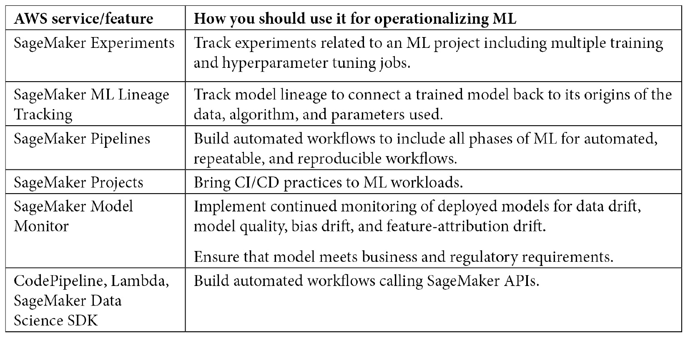
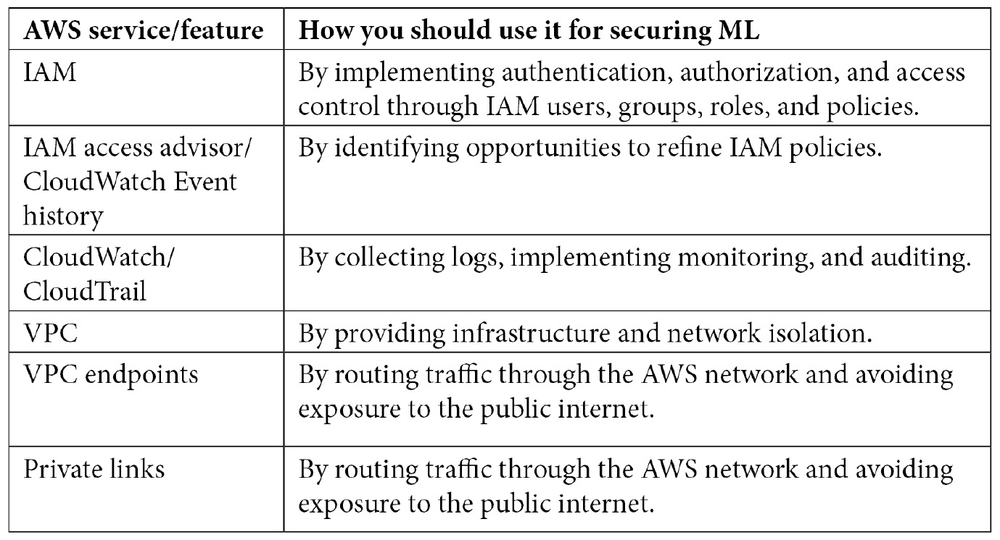
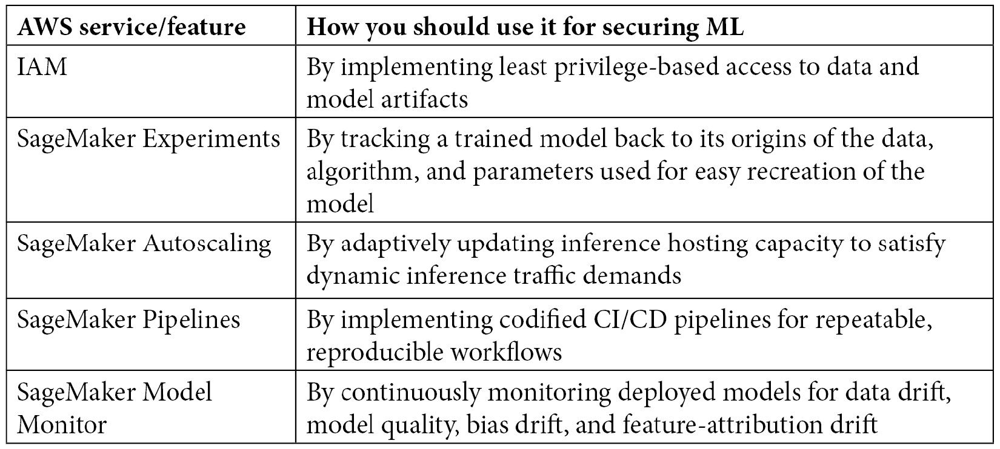
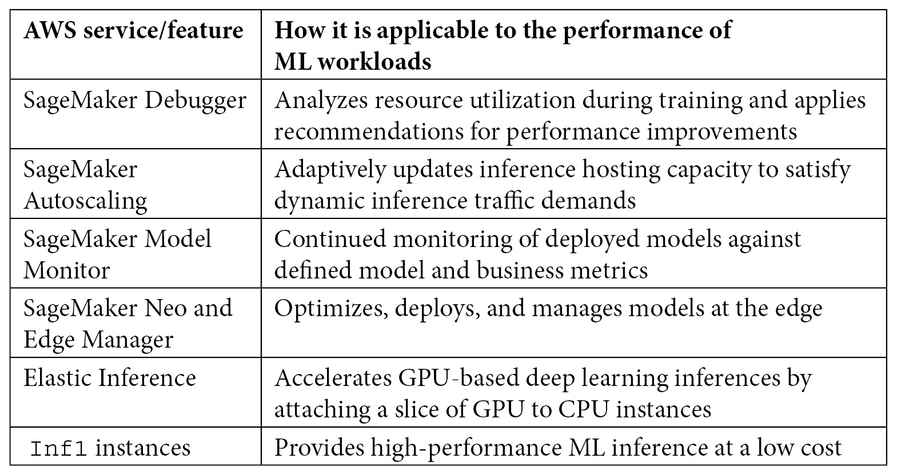

# 第十三章：使用 Amazon SageMaker 进行架构良好的机器学习

在云中运行工作负载时，您希望确保工作负载的架构正确，以便充分利用云所能提供的一切。AWS 架构良好框架可以帮助您做到这一点，通过提供一种正式的方法来学习适用于部署到 AWS 的任何工作负载的五个关键支柱的最佳实践。这些支柱是运营卓越、安全性、可靠性、性能效率和成本优化。

该框架提供了在初始开发和持续更新工作负载过程中如何改进架构以及如何在支柱之间进行权衡的指导。虽然您可以使用架构良好框架从一般技术角度评估您的负载，但在构建**机器学习**（**ML**）应用程序时，拥有针对 ML 五个支柱的特定指导将非常有益。AWS 机器学习透镜提供了这种专注的指导，您可以使用它来比较和衡量您的 AWS 上机器学习工作负载与最佳实践的差距。

重要提示

要深入了解架构良好框架和机器学习透镜，请查阅 AWS 提供的以下两篇白皮书：[`docs.aws.amazon.com/wellarchitected/latest/framework/wellarchitected-framework.pdf`](https://docs.aws.amazon.com/wellarchitected/latest/framework/wellarchitected-framework.pdf) 和 [`docs.aws.amazon.com/wellarchitected/latest/machine-learning-lens/wellarchitected-machine-learning-lens.pdf`](https://docs.aws.amazon.com/wellarchitected/latest/machine-learning-lens/wellarchitected-machine-learning-lens.pdf)。

到目前为止，本书中我们已经讨论了如何使用不同的 Amazon SageMaker 功能跨越机器学习工作负载的所有阶段。在本章中，我们将学习如何结合通用架构良好框架和机器学习透镜的指导，并将其应用于基于 SageMaker 构建的端到端机器学习工作负载。

请注意，本章不介绍任何新的 SageMaker 功能，而是深入探讨如何将您已知的技能应用于构建一个架构良好的机器学习工作负载。您将了解 SageMaker 的具体功能如何与其他 AWS 服务结合，在五个支柱中发挥作用，其中一些功能在多个支柱中扮演关键角色。

在本章中，我们将涵盖以下主要主题：

+   运营机器学习工作负载的最佳实践

+   保护机器学习工作负载的最佳实践

+   构建可靠机器学习工作负载的最佳实践

+   构建高性能机器学习工作负载的最佳实践

+   构建成本优化的机器学习工作负载的最佳实践

# 运营机器学习工作负载的最佳实践

许多组织从构建模型来解决一个或多个业务问题的几个实验开始他们的机器学习之旅。通常，云平台，如 SageMaker，通过提供无缝访问弹性计算基础设施和内置对各种机器学习框架和算法的支持，使这种实验变得容易。一旦这些实验证明成功，下一步自然的步骤就是将模型投入生产。通常，在这个时候，组织希望从研发阶段转向机器学习的运营。

MLOps 的概念最近越来越受欢迎。在非常高的层面上，MLOps 涉及将人员、流程和技术结合起来，将机器学习工作负载集成到发布管理、CI/CD 和运营中。在不深入 MLOps 的所有细节的情况下，在本节中，我们将讨论使用技术来运营机器学习工作负载的最佳实践。我们还将讨论哪些 SageMaker 功能在运营机器学习工作负载的各个方面发挥作用。

现在让我们在以下部分中查看在 AWS 上运营机器学习工作负载的最佳实践。

## 确保可重复性

为了成功地将端到端机器学习系统投入运营，您必须首先通过版本化的数据、代码和工件来确保其可重复性。最佳实践是版本化创建模型所使用的所有输入，包括训练数据、数据准备代码、算法实现代码、参数和超参数，以及所有训练模型工件。版本化策略还涉及在模型更新阶段提供帮助，并在模型更新失败或更新的模型不符合您的要求时，允许轻松回滚到特定的已知有效版本。

## 跟踪机器学习工件

使用不同的算法和超参数对每个算法进行迭代开发，会导致许多训练实验和多个模型版本的产生。跟踪这些实验和结果模型，以及每个模型的血统，对于满足审计和合规要求非常重要。模型血统还有助于在模型性能下降的情况下进行根本原因分析。

虽然您当然可以构建定制的跟踪解决方案，但最佳实践是使用如 SageMaker Experiments 之类的托管服务。Experiments 允许您跟踪、组织、可视化和比较机器学习模型在整个机器学习生命周期中的所有阶段，包括特征工程、模型训练、模型调优和模型部署。使用 SageMaker Experiments，您可以轻松选择部署或更新特定版本的模型。Experiments 还为您提供了模型血统功能。有关 SageMaker Experiments 功能的详细讨论，请参阅*第六章*的*“Amazon SageMaker Experiments”部分*，*“大规模训练和调优”*。

此外，您还可以使用 Amazon SageMaker ML Lineage Tracking 功能，该功能跟踪从数据准备到模型部署的 ML 工作流程的各个步骤的信息。通过跟踪的信息，您可以重现工作流程步骤，跟踪模型和数据集的谱系，并建立模型治理和审计标准。

## 自动化部署流程

自动化流程将最小化将训练好的机器学习模型从开发、预发布等低级环境移动到生产环境时的人工干预。目标是创建一个编码化的部署流程，使用基础设施即代码和配置即代码，并将手动和自动的质量关卡纳入流程中。手动质量关卡可以确保在模型被提升到生产环境之前，不存在诸如安全暴露等运营问题。另一方面，自动质量关卡可以用来评估模型指标，如精确度、召回率或准确度。流程可以实现一致的部署，并提供在多个环境中以最小的人工干预可靠地重新创建机器学习相关资源的能力。

使用 Amazon SageMaker Pipelines，您可以构建自动化的模型工作流程。您可以将机器学习生命周期的每个步骤作为一个流程步骤来开发和部署模型，并监控流程。您可以进一步管理每个步骤之间的依赖关系，构建正确的顺序，并自动执行步骤。将 CI/CD 实践引入机器学习工作负载的服务是 SageMaker Projects。此服务帮助您将模型从概念转移到生产。此外，您可以通过结合使用 SageMaker Projects 和 SageMaker Pipelines，通过在机器学习生命周期的每个步骤自动跟踪代码、数据集和模型版本，轻松满足治理和审计标准。这使您能够回溯并重新播放模型生成步骤，解决问题，并可靠地跟踪模型的规模级谱系。有关自动化工作流程和 MLOps 的详细讨论，请参阅*第十二章**，机器学习自动化工作流程*。

## 监控生产模型

对部署的模型进行持续监控是使机器学习工作负载投入运营的关键步骤，因为模型的表现和有效性可能会随时间退化。确保模型持续满足您的业务需求，首先从识别衡量模型相关指标和业务指标的指标开始。确保在监控过程中早期定义并收集所有对模型评估您的业务关键绩效指标至关重要的指标。

一旦确定了指标，为了确保部署的模型持续保持高质量，使用 Amazon SageMaker Model Monitor 功能及其与 CloudWatch 的集成，主动检测问题、发出警报并自动化修复操作。除了检测模型质量下降外，你还可以监控数据漂移、偏差漂移和特征归因漂移，以满足你的可靠性、监管和模型可解释性要求。

由于模型监控而触发的 CloudWatch 警报可用于自动化以下活动：使当前模型无效、回滚到较旧模型版本或根据新的真实数据重新训练新模型。生产模型的更新应考虑引入更改的风险、重新训练的成本以及在生产中拥有较新模型可能带来的潜在价值。有关模型监控的详细讨论，请参阅*第十一章**，使用 Amazon SageMaker Model Monitor 和 Clarify 进行生产模型监控*。

重要提示

虽然本节重点介绍了用于操作 ML 工作负载的 SageMaker 原生方法，但请注意，可以使用 SageMaker API 和其他 AWS 服务（如 CodePipeline、Step Functions、Lambda 和 SageMaker Data Science SDK）的组合来构建类似的自动化管道。在 [`github.com/aws-samples/mlops-amazon-sagemaker-devops-with-ml`](https://github.com/aws-samples/mlops-amazon-sagemaker-devops-with-ml) 上记录了多个 MLOps 架构和示例代码。

以下表格总结了适用于操作 ML 工作负载的各种 AWS 服务和功能：

图 13.1 – 用于操作 ML 工作负载的 AWS 服务

在下一节中，你将了解 SageMaker 如何与其他 AWS 服务集成，以实现安全的 ML 工作负载。

# 保护 ML 工作负载的最佳实践

在保护 ML 工作负载时，你应该考虑基础设施和网络安全、身份验证和授权、加密数据和模型工件、日志记录和审计以及满足监管要求。在本节中，我们将讨论使用 SageMaker 和相关 AWS 服务组合来保护 ML 工作负载的最佳实践。

现在让我们在以下章节中查看在 AWS 上保护 ML 工作负载的最佳实践。

## 隔离 ML 环境

要构建安全的机器学习工作负载，您需要一个隔离的计算和网络环境。为了在 SageMaker 上实现这一点，请在**虚拟** **私有** **云**（**VPC**）中部署所有资源，例如笔记本、工作室域、训练作业、处理作业和端点。VPC 提供了一个隔离的环境，其中所有 SageMaker 组件之间的流量都在网络内部流动。您可以通过使用包含 VPC 内子网允许的入站和出站流量的规则的网络安全组，添加另一层隔离，从而进一步隔离您的机器学习资源。

即使您在没有 VPC 的情况下使用 SageMaker，所有资源也在由 AWS 管理的单租户 EC2 实例的环境中运行，这确保了您的机器学习环境与其他客户隔离。然而，在 VPC 中部署机器学习资源，例如训练容器，允许您使用 VPC Flow Logs 监控这些资源的进出网络流量。此外，您可以使用 VPC 端点和 AWS PrivateLink 来启用 SageMaker 与其他 AWS 服务（如 S3 或 CloudWatch）之间的通信。这保持了 AWS 网络内各种服务之间所有流量的流动，同时不会将流量暴露给公共互联网。

## 禁用互联网和 root 访问

默认情况下，SageMaker 笔记本实例已启用互联网访问，以便您下载外部库并自定义工作环境。此外，这些笔记本启用了 root 访问，这使您能够利用外部库。

在低级沙盒和开发环境中，仅使用这些默认设置来找出最佳工作笔记本环境。在其他所有非生产环境和生产环境中，请在自己的 VPC 中启动 SageMaker 资源，并关闭 root 访问以防止下载和安装未经授权的软件。在隔离您的环境之前，将所有必要的库导入到私有仓库，例如 AWS CodeArtifact。这允许您无缝下载特定版本的库，而无需访问互联网。

此外，使用编码化的生命周期配置来自动设置笔记本环境。同样，由 SageMaker 管理的训练和部署推理容器默认启用互联网访问。在启动训练和推理资源时，使用`VPCConfig`和`EnableNetworkIsolation`标志来保护这些资源免受外部网络流量的影响。在这种情况下，所有数据和模型工件的上传和下载都通过您的 VPC 路由。同时，训练和推理容器保持与网络的隔离，并且无法访问 VPC 内或互联网上的任何资源。

## 强制执行身份验证和授权

实施一个强大的机制来确定谁可以访问机器学习资源（身份验证）以及认证用户可以访问哪些资源（授权）。SageMaker 与 AWS IAM 服务原生集成，该服务用于管理对所有 AWS 服务和资源的访问。IAM 允许您使用 IAM 用户、组、角色和策略定义细粒度的访问控制。您可以使用基于身份的策略组合来实现最小权限访问，以指定 IAM 用户、角色或组可以执行的操作，以及基于资源的策略来指定谁可以访问资源以及他们可以在其上执行哪些操作。

在设计这些 IAM 策略时，可能会倾向于从开放性较高的 IAM 策略开始，并怀有随着实施过程逐步收紧策略的良好意图。然而，最佳实践是从严格的策略开始，仅授予最小必需的访问权限，并在需要时添加额外的权限。定期审查和精炼策略，以确保不会授予不必要的权限。IAM 服务提供了访问顾问功能，该功能显示各种 AWS 服务最后一次被不同的实体（如 IAM 组、用户、角色和策略）访问的时间。使用这些信息来精炼策略。所有服务 API 调用也由 CloudTrail 记录，您可以使用 CloudTrail 历史记录来确定基于使用模式可以删除哪些权限。

## 保护数据和模型工件

IAM 策略也可以用于 S3 中数据和模型的访问控制。此外，您还可以使用名为 Amazon Macie 的安全服务来保护并分类 S3 中的数据。Macie 内部使用机器学习来自动发现、分类和保护敏感数据。它自动识别敏感数据，如**个人身份信息**（**PII**）或**知识产权**（**IP**），提供对数据访问和移动模式的可视性。Macie 持续监控数据访问模式中的异常，并主动生成关于未经授权的访问和数据泄露的警报。

下一个重要的安全方面是确保机器学习系统的数据和模型工件的安全，无论是在静止状态还是在传输过程中。为了在 VPC 内部传输过程中保护数据，请使用**传输层安全**（**TLS**）。为了在静止状态下保护数据，最佳实践是使用加密来阻止恶意行为者读取您的数据和模型工件。您可以使用客户端或服务器端加密。SageMaker 内置了加密功能，可以保护静止状态和传输过程中的训练数据和模型工件。例如，在启动训练作业时，您可以指定要使用的加密密钥。您可以选择使用 SageMaker 管理的密钥、AWS 管理的密钥或您自己的客户管理的密钥。

## 记录、监控和审计

SageMaker 与 CloudWatch 和 CloudTrail 原生集成。你可以在 CloudWatch 中捕获 SageMaker 训练、处理和推理的日志，这可以进一步用于故障排除。所有 SageMaker（以及其他 AWS 服务）的 API 调用都由 CloudTrail 记录，允许你追踪哪个 IAM 用户、AWS 账户或源 IP 地址执行了 API 调用，以及调用发生的时间。

## 满足监管要求

对于许多组织来说，机器学习解决方案需要符合监管标准，并通过各国和行业差异很大的合规认证。Amazon SageMaker 符合广泛的合规计划，包括 PCI、HIPAA、SOC 1/2/3、FedRAMP 和 ISO 9001/27001/27017/27018。

以下表格总结了适用于保护机器学习工作负载的各种 AWS 服务：

图 13.2 – 用于保护机器学习工作负载的 AWS 服务

在下一节中，你将了解 SageMaker 如何与其他 AWS 服务集成，以构建可靠的机器学习工作负载。

# 可靠机器学习工作负载的最佳实践

对于一个可靠系统，有两个核心考虑因素：

+   首先，能够从计划内和计划外的中断中恢复

+   第二，能够满足不可预测的流量需求增加

理想情况下，系统应在不影响下游应用程序和最终用户的情况下实现这两点。在本节中，我们将讨论使用 SageMaker 和相关 AWS 服务构建可靠机器学习工作负载的最佳实践。

让我们现在看看以下章节中关于在 AWS 上保护机器学习工作负载的一些最佳实践。

## 从故障中恢复

对于机器学习工作负载，优雅地恢复的能力应该是构成迭代机器学习过程的各个步骤的一部分。故障可能发生在数据存储、数据处理、模型训练或模型托管中，这可能是从系统故障到人为错误的各种事件的结果。

对于 SageMaker 上的机器学习，所有数据（以及模型工件）通常都保存在 S3 中。这确保了机器学习数据与计算处理的解耦。为了防止数据意外丢失，最佳实践是使用 IAM 和 S3 策略的组合来确保基于最小权限的数据访问。此外，使用 S3 版本控制和对象标记来启用数据（以及模型工件）的版本控制和可追溯性，以便在发生故障时易于恢复或重建。

接下来，考虑机器学习训练的可靠性，这通常是一个漫长且耗时的过程。看到运行数小时甚至数天的训练作业并不罕见。如果这些长时间运行的训练作业因断电、操作系统故障或其他意外错误而中断，能够可靠地从作业停止的地方继续进行至关重要。在这种情况下应使用机器学习检查点。在 SageMaker 上，一些内置算法和所有支持的深度学习框架在启动训练作业时提供启用检查点的功能。当您启用检查点时，SageMaker 会自动在训练过程中保存模型状态的快照。这使得您可以从最后一个保存的检查点可靠地重新启动训练作业。

## 跟踪模型来源

假设您的训练过程顺利进行，并且您已将训练好的模型工件保存在一个 S3 桶中。如果由于人为错误（例如，您的团队中有人不小心删除了它）而丢失了这个模型工件，会发生什么？在一个可靠的机器学习系统中，您需要能够使用与原始模型相同的数据、代码版本和参数来重新创建此模型。因此，在训练过程中跟踪所有这些方面非常重要。使用 SageMaker 实验，您可以跟踪创建模型的所有步骤和工件，以便您可以根据需要轻松地重新创建模型。使用 SageMaker 实验跟踪的另一个好处是能够对生产中的问题进行故障排除，以确保可靠运行。

除了依赖实验来重新创建模型工件的具体版本外，还应结合使用 IAM 和 S3 策略，以确保基于最小权限的访问，以最大限度地降低意外删除模型工件的风险。实施诸如要求对模型工件删除进行多因素认证以及根据您组织的灾难恢复策略存储工件副本等措施。

## 自动化部署管道

为了确保所有导致模型部署的步骤都得到一致执行，请使用具有访问控制的 CI/CD 管道来强制执行最小权限访问。部署自动化与手动和自动质量门相结合，确保在部署之前所有更改都可以有效地与依赖系统进行验证。Amazon SageMaker Pipelines 具有将 CI/CD 实践应用于机器学习工作负载以改进可靠性的能力。使用 SageMaker Pipelines 编码 CI/CD 管道为您提供了处理模型端点意外删除的额外能力。采用基础设施即代码（IaC）方法，可以重新创建端点。这需要对您的数据、代码、算法、超参数、模型工件、容器镜像等实施良好的版本控制策略。对一切进行版本控制，并记录您的版本控制策略。有关 SageMaker Pipelines 功能的详细讨论，请参阅*第十二章**，机器学习自动化工作流程*中的*Amazon SageMaker Pipelines*部分。

此外，遵循*训练一次，部署到任何地方*的策略。由于训练过程和结果的去耦合性质，您可以在多个环境中共享训练好的模型工件。这可以防止在多个环境中重新训练并引入对模型的不期望变化。

## 处理意外的流量模式

模型部署后，您必须确保部署的模型在服务推理请求时的可靠性。模型应能够处理推理流量的峰值，并继续以符合业务要求的质量运行。

为了处理流量峰值，请使用启用自动扩展的 SageMaker 实时端点部署模型。启用自动扩展后，SageMaker 会根据推理流量的动态变化自动增加（和减少）托管模型背后的计算能力。SageMaker 提供的自动扩展是水平扩展，这意味着它会添加新实例或删除现有实例来处理推理流量的变化。

## 部署模型的持续监控

为了确保部署的模型持续保持高质量，请使用 Amazon SageMaker Model Monitor 的功能及其与 CloudWatch 的集成，以主动检测问题、发出警报，并在生产模型未按预期表现时自动执行修复操作。除了模型质量外，您还可以监控数据漂移、偏差漂移和特征归因漂移，以满足您的可靠性、监管和模型可解释性要求。确保定义并监控所有对模型评估至关重要的指标，以符合您的业务关键绩效指标（KPIs）。有关模型监控的详细讨论，请参阅*第十一章**，使用 Amazon SageMaker Model Monitor 和 Clarify 监控生产模型*。

## 更新模型的新版本

最后，您必须考虑如何可靠地更新生产模型。SageMaker 端点生产变体可用于实现多种部署策略，如 A/B、蓝绿、金丝雀和影子部署。高级部署策略及其详细实现将在*第九章**，使用 Amazon SageMaker 端点生产变体更新生产模型*中讨论。根据模型消费者的风险容忍度和停机时间，选择合适的部署策略。

以下表格总结了适用于构建可靠机器学习工作负载的各种 AWS 服务：

图 13.3 – 用于可靠机器学习工作负载的 AWS 服务功能

在下一节中，您将了解 SageMaker 如何与其他 AWS 服务集成，以构建可靠、性能高效的工作负载。

# 构建高性能机器学习工作负载的最佳实践

由于机器学习工作负载的计算和时间密集型特性，选择适合工作负载每个单独阶段的最高性能资源非常重要。计算、内存和网络带宽需求是机器学习过程每个阶段的独特需求。除了基础设施的性能外，模型性能（如通过准确率等指标衡量）也非常重要。在本节中，我们将讨论在 SageMaker 上构建机器学习工作负载时应应用的最佳实践。

现在让我们在以下章节中查看在 AWS 上构建高性能机器学习工作负载的最佳实践。

## 机器学习资源的合理配置

SageMaker 支持多种机器学习实例类型，这些实例类型具有不同的 CPU、GPU、FPGA、内存、存储和网络容量组合。每个实例类型反过来又支持多个实例大小。因此，您有一系列选择来满足您特定的需求。最佳实践是为数据处理、构建、训练和托管您的机器学习模型选择不同的计算资源配置。这是由 SageMaker 的解耦特性实现的，它允许您为不同的 API 选择不同的实例类型和大小。例如，您可以选择`ml.c5.medium`作为笔记本实例的工作环境，使用四个`ml.p3.large` GPU 实例的集群进行训练，最后在两个附加了弹性推理的`ml.m5.4xlarge`实例上托管训练好的模型。此外，在 SageMaker Studio 环境中，您可以在不中断您的工作的情况下无缝更改笔记本实例类型。

当你有选择不同计算选项的灵活性来应对不同的机器学习阶段时，你如何选择具体的实例类型和大小呢？这取决于你对工作负载的理解和实验。例如，如果你知道你选择的训练框架和算法将需要 GPU 支持，请选择一个用于训练的 GPU 集群。虽然使用 GPU 进行所有训练可能很有吸引力，但传统的算法可能由于涉及到的通信开销而在 GPU 上运行不佳。一些内置算法，如 XGBoost，实现了针对 CPU 计算优化的开源算法。SageMaker 还提供了针对 TensorFlow 和 PyTorch 等框架的优化版本，这些版本包括针对 Amazon EC2 实例家族的高性能训练优化。

## 监控资源利用率

一旦你做出了初始的实例选择并启动了训练，SageMaker 训练作业会发出用于资源利用率的 CloudWatch 指标，你可以使用这些指标来改进下一次的训练运行。此外，当你为训练作业启用调试器时，SageMaker 调试器提供了对训练作业及其执行的基础设施的可见性。调试器还监控并报告系统资源，如 CPU、GPU 和内存，为你提供资源低利用率瓶颈的见解。如果你使用 TensorFlow 或 PyTorch 进行深度学习训练作业，调试器为你提供了框架指标的视图，这些指标可以用来加速你的训练作业。有关调试器功能的详细讨论，请参阅*第七章**，*使用 Amazon SageMaker 调试器分析训练作业性能*。

## 调整托管基础设施的大小

一旦模型训练完成并准备好部署到用于实时端点的实例，考虑一下你的目标性能。目标性能是每个周期要服务的请求数量和每个请求期望的延迟的组合，例如，每分钟 10,000 个请求，最大响应时间为 1 毫秒。一旦你有了目标性能的概念，在非生产环境中进行负载测试，以确定用于托管模型的实例类型、实例大小和实例数量。推荐的最佳实践是，为了高可用性，在两个可用区部署至少两个实例的端点。

一旦你决定了要使用的实例类型，就从满足你的稳定状态流量所需的最小实例数量开始，并利用 SageMaker 托管服务的自动扩展功能。使用自动扩展，SageMaker 可以根据你配置的利用率和请求流量阈值自动调整推理容量。为了满足你的性能要求，通过更新端点配置来调整容量，而无需停机。

此外，您还可以使用 Amazon `Inf1` 实例扩展深度学习模型的托管基础设施，这些实例非常适合搜索、推荐引擎和计算机视觉等应用，且成本较低。

虽然实时端点提供了对 SageMaker 上部署的模型的访问，但由于延迟要求，某些工作负载可能需要在边缘进行推理，例如用于确定制造工厂中缺陷产品部件的模型。在这种情况下，模型需要部署在制造工厂内的摄像头中。对于此类用例，请使用 SageMaker Neo 和 SageMaker Edge Manager 来优化、部署和管理边缘模型。

重要提示

虽然实时端点和边缘部署的模型提供同步预测，但批量转换用于异步推理，对较长的响应时间有更大的容忍度。使用实验来确定合适的实例类型、大小和实例数量，同时考虑到作业完成时间。

## 持续监控已部署模型

一旦模型开始主动处理推理流量，请使用 SageMaker 模型监控器来持续监控机器学习模型的数据漂移、模型质量性能、特征重要性漂移和偏差漂移。在幕后，模型监控器使用分布式处理作业。与批量处理一样，使用实验和负载测试来确定完成每个计划监控作业执行所需的处理作业资源。有关模型监控器的详细讨论，请参阅*第十一章**，使用 Amazon SageMaker 模型监控器和 Clarify 监控生产模型*。

以下表格总结了各种 SageMaker 功能及其在构建高性能机器学习工作负载中的应用：

图 13.4 – AWS 服务能力，用于构建高性能机器学习工作负载。

在下一节中，您将了解 SageMaker 如何与其他 AWS 服务集成以构建成本优化工作负载。

# 成本优化机器学习工作负载的最佳实践

对于许多组织来说，不采用如机器学习等颠覆性技术所失去的机会成本超过了机器学习的成本。通过实施一些最佳实践，这些组织可以从他们的机器学习投资中获得最佳回报。在本节中，我们将讨论适用于 SageMaker 上成本优化机器学习工作负载的最佳实践。

现在让我们看看在 AWS 上构建成本优化机器学习工作负载的最佳实践。

## 优化数据标注成本

用于机器学习训练的数据标注，通常在机器学习过程的初期进行，可能非常繁琐、容易出错且耗时。大规模标注消耗大量工作时间，这使得这项任务也变得成本高昂。为了优化数据标注的成本，请使用 SageMaker Ground Truth。Ground Truth 通过结合人力和主动学习提供大规模数据标注的能力。当启用主动学习时，只有当模型无法自信地完成标注任务时，标注任务才会路由给人类。然后，人工标注的数据被用来训练模型以提高准确性。因此，随着标注工作的进行，需要人工标注的数据越来越少。这导致工作完成速度加快，成本降低。有关 Ground Truth 功能的详细讨论，请参阅*第三章**，使用 Amazon SageMaker Ground Truth 进行数据标注*。

## 使用 AWS Marketplace 中的模型降低实验成本

机器学习本质上是迭代的和实验性的。每次都需要运行多个算法，每个算法都有不同的超参数集，这会导致在确定满足您需求的模型之前，需要执行多个训练任务。所有这些训练在时间和成本上都会累积。

实验的一个很大部分是研究和重用现成的预训练模型，这些模型可能符合您的需求。AWS Marketplace for ML 为您提供了由 AWS 审核的供应商提供的数据集和模型目录。您可以订阅满足您需求的模型，并可能节省开发自己模型所需的时间和成本。如果您最终开发了自己的模型，您可以使用市场将您的模型货币化，使其可供他人使用。

## 使用 AutoML 减少实验时间

如果市场中的模型不符合您的需求，或者您的组织有**购买而非构建**的政策，首先检查您的数据集和用例是否适合 AutoPilot。在撰写本书时，AutoPilot 支持表格数据以及分类和回归问题。AutoPilot 自动分析数据集，并构建多个模型，这些模型具有不同的算法和超参数组合，并最终选择最佳算法。这节省了时间和成本。此外，该服务通过两个笔记本提供透明度——一个数据准备笔记本和一个模型候选选择笔记本，这些笔记本详细说明了 AutoPilot 执行的幕后步骤。因此，即使您最终没有使用 AutoPilot 构建和推荐的模型，您也可以将这些笔记本作为您自己实验的起点，并使用您的业务领域知识进行修改。

然而，在本书出版时，AutoPilot 仅支持使用表格数据进行的回归和分类。对于其他数据类型和问题，您将不得不构建和训练自己的模型。

## 使用小数据集进行本地迭代

在机器学习实验过程中，首先在 SageMaker 笔记本的本地环境中使用较小的数据集进行迭代。一旦解决了代码错误和数据问题等细节，您可以使用 SageMaker 管理的完整数据集和分布式训练集群进行扩展。这种分阶段的方法将使您以更低的成本更快地迭代。SageMaker SDK 通过支持训练 API 中的`instance-type = "local"`来简化这一过程，这样您就可以在本地环境或分布式集群上重用相同的代码。请注意，在发布时，本地模式仅在 SageMaker 笔记本实例中工作，不在 Studio 环境中。

## 调整训练基础设施

当您准备启动分布式训练集群时，选择集群中正确的实例数量和类型非常重要。对于不支持分布式训练的内置或自定义算法，您的集群将始终只有一个实例。对于支持分布式训练的算法和框架，利用如*第六章*中讨论的数据并行性和模型并行性，以更快地完成训练，从而降低整体训练成本。

虽然有各种不同容量配置的实例类型可供选择，但根据所使用的机器学习算法，正确调整训练实例的大小非常重要。例如，简单的算法可能无法在更大的实例类型上更快地训练，因为它们无法利用硬件并行性。更糟糕的是，由于高 GPU 通信开销，它们甚至可能训练得更慢。成本优化的最佳实践是从小实例开始，首先通过向训练集群添加更多实例进行扩展，然后升级到更强大的实例。然而，如果您正在使用深度学习框架和分布式训练，最佳实践是在扩展之前将单个实例上的 GPU/CPUs 数量升级更多，因为涉及的网络安全 I/O 可能会对训练性能产生负面影响。

除了选择正确的基础设施外，您还可以使用优化版本的机器学习框架，从而实现更快的训练。SageMaker 提供了包括 TensorFlow、Chainer、Keras 和 Theano 在内的多个开源机器学习框架的优化版本。这些流行框架的 SageMaker 版本针对所有 SageMaker 机器学习实例的高性能进行了优化。

## 优化超参数调优成本

超参数调整也是一个成本高昂的任务，需要使用复杂的搜索和算法。最佳实践是依赖由托管 SageMaker 自动模型调优提供的自动化模型调优功能，也称为**超参数调整**（**HPT**）。自动模型调优通过运行多个训练作业来找到最佳模型版本，这些作业使用您指定的算法和超参数范围。HPT 然后选择导致最佳模型（根据您指定的目标指标衡量）的超参数值。在幕后，HPT 使用可以在有限数量的训练作业中确定最佳超参数的 ML 技术。

您可以使用预热启动模式进一步加快 HPT 作业的速度。使用预热启动，您不再需要从头开始启动 HPT 作业；相反，您可以根据一个或多个父作业创建一个新的 HPT 作业。这允许您重用父作业中进行的训练作业作为先验知识。预热启动可以帮助您减少与模型调优相关的时耗和成本。

## 使用管理式 Spot 训练节省训练成本

SageMaker 管理式 Spot 训练将 Spot 实例的成本节省结构应用于超参数调整和训练。管理式 Spot 训练功能利用检查点功能，以便轻松恢复训练作业。由于您不必再次从头开始运行训练，这降低了您的整体训练成本。

## 利用调试器的洞察和建议

当谈到在 SageMaker 上的深度学习时，使用 GPU 进行训练非常强大，但训练成本可能会迅速增加。SageMaker Debugger 提供了对正在使用的 ML 框架和底层计算资源的深度学习训练洞察。深度分析功能为您提供改进训练性能和减少资源浪费的建议。有关调试器功能的详细讨论，请参阅*第七章**，*使用 Amazon SageMaker Debugger 分析训练作业*。

## 使用 SavingsPlan 节省 ML 基础设施成本

一旦您在 AWS 账户中启用 SavingsPlan，它将在您选择的时间范围内分析您的 ML 资源使用情况——过去 7 天、30 天或最多 60 天。然后，该服务推荐合适的计划以优化成本。您还可以从三种不同的选项中选择预付费选项：无前期费用、部分前期（50% 或更多）或全部前期。一旦您配置了这些选项，SavingsPlan 将为您提供如何优化月度支出的详细信息。此外，它还建议一个每小时使用承诺，以最大化您的节省。这些计划涵盖了所有 ML 实例系列、笔记本实例、Studio 实例、训练实例、批量转换实例、实时端点实例、Data Wrangler 实例和 SageMaker Processing 实例，从而帮助优化 ML 工作负载各个阶段的成本。

虽然 Managed Spot Training 和 SavingsPlan 都是节省成本的方法，但它们并不适合结合使用。在使用 SavingsPlan 时，无论是否完全使用，你都需要为承诺的每小时付费。最佳实践是分别使用 SavingsPlan 和 Managed Spot Training。例如，使用 SavingsPlan 来处理可预测的稳定状态重复训练工作负载，而使用 Managed Spot Training 来处理新的训练工作负载和原型设计，在这些情况下，你还没有明确的月度成本概念。

## 优化推理成本

推理成本通常占机器学习成本的大部分。推理成本在*第十章*“优化模型托管和推理成本”中进行了详细讨论，该章节详细介绍了几种提高推理性能同时降低推理成本的方法。这些方法包括尽可能使用批量推理，在单个推理端点后面部署多个模型以降低成本并帮助进行高级金丝雀或蓝/绿部署，根据需求扩展推理端点，以及使用 EI 和 SageMaker Neo 以较低的成本提供更好的推理性能。

## 停止或终止资源

确保你在完成工作后终止或至少停止机器学习资源。虽然训练、超参数调整、批量推理和处理作业的实例将由 SageMaker 管理并自动删除，但你负责笔记本实例、端点和监控计划。停止或删除这些资源，以避免使用自动化脚本（基于空闲时间或计划）停止资源而产生不必要的成本。

以下表格总结了各种 SageMaker 功能及其在构建成本优化的机器学习工作负载中的应用：

![图 13.5 – AWS 服务能力，用于成本优化的机器学习工作负载

![图 13.5 – AWS 服务能力，用于成本优化的机器学习工作负载

图 13.5 – AWS 服务能力，用于成本优化的机器学习工作负载

本节总结了在 AWS 上构建良好架构的机器学习工作负载的最佳实践讨论。

# 摘要

在本章中，你回顾了构成 Well-Architected 框架的五个支柱——运营卓越、安全性、可靠性、性能和成本优化。然后你深入研究了这些支柱的最佳实践，目的是将这些最佳实践应用于机器学习工作负载。你学习了如何使用 SageMaker 功能与相关 AWS 服务一起构建 AWS 上的良好架构的机器学习工作负载。

当你设计你的机器学习应用时，你通常必须在根据你组织的优先级进行权衡的支柱之间做出权衡。例如，当你开始使用机器学习时，成本优化可能不是你首先考虑的，但建立操作标准可能很重要。然而，随着机器学习工作负载数量的增加，成本优化可能成为一个重要的考虑因素。通过应用你在本章中学到的最佳实践，你可以设计和实施满足你组织需求的机器学习应用，并定期评估你的应用与最佳实践。

在下一章中，你将应用所有这些最佳实践，并了解如何在多个反映现实世界的 AWS 环境中进行操作。

| **AWS 服务/功能** | **您应该如何使用它来保护机器学习** |
| --- | --- |
| IAM | 通过 IAM 用户、组、角色和政策实现身份验证、授权和访问控制。 |
| IAM 访问顾问/CloudWatch 事件历史 | 通过识别优化 IAM 策略的机会。 |
| CloudWatch/CloudTrail | 通过收集日志、实施监控和审计。 |
| VPC | 通过提供基础设施和网络隔离。 |
| VPC 端点 | 通过路由流量通过 AWS 网络并避免暴露于公共互联网。 |
| 私有链接 | 通过路由流量通过 AWS 网络并避免暴露于公共互联网。 |
