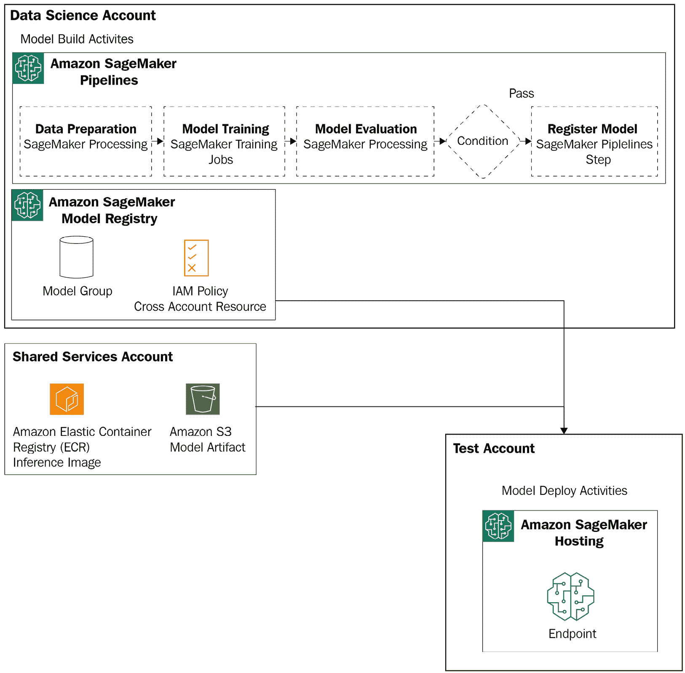
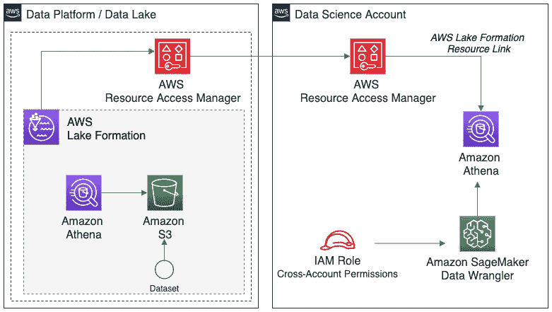

# 第十四章：跨账户管理 SageMaker 功能

AWS 发布了关于工作负载管理和治理的最佳实践。这些实践涉及许多领域，例如成本优化、安全性、合规性，以及确保在 AWS 上扩展的工作负载的运营效率。在构建、部署和运营利用 Amazon SageMaker 功能的工作负载时，多账户模式是常见的架构考虑因素之一。

在本节中，我们不会涵盖关于 AWS 账户间 AWS 工作负载治理的既定建议和考虑因素。相反，我们将特别关注一些关于在 AWS 账户间使用 AWS 功能的考虑因素。有关选择正确账户策略的一般建议，请参阅**AWS 管理和治理服务**（[`aws.amazon.com/products/management-and-governance/`](https://aws.amazon.com/products/management-and-governance/））和**AWS 多账户着陆区策略** – **AWS Control Tower**（[https://docs.aws.amazon.com/controltower/latest/userguide/aws-multi-account-landing-zone.html](https://docs.aws.amazon.com/controltower/latest/userguide/aws-multi-account-landing-zone.html)）。

多账户策略的概念建立在**AWS Well-Architected Framework**之上，拥有多个 AWS 账户可以使您更好地治理和管理在**Amazon SageMaker**上跨**机器学习开发生命周期（ML 生命周期）**的机器学习活动。使用多个 AWS 账户的好处已在通用工作负载中进行了记录。

在本章中，我们将讨论以下与跨多个 AWS 账户管理 SageMaker 功能相关的话题：

+   检查 AWS 多账户环境的概述

+   理解使用多个 AWS 账户与 Amazon SageMaker 一起使用的优势

+   使用 Amazon SageMaker 检查多账户考虑因素

# 检查 AWS 多账户环境的概述

存在许多有效的多账户策略变体。多账户实现可以根据客户在组织和技术方面的需求而有所不同。为了本章的目的，我们将关注一个基本的多账户策略，专注于与使用 Amazon SageMaker 的机器学习工作负载最相关的账户。我们不会明确指出账户（如安全或日志记录），因为它们已经在 AWS 治理实践中得到了很好的定义。*图 14.1*展示了我们将用于讨论本章概念的通用、高级账户。

![Figure 14.1 – Example of AWS accounts and SageMaker features

![img/B17249_14_01.jpg]

图 14.1 – AWS 账户和 SageMaker 功能的示例

以*图 14.1*为例，以下 AWS 账户可以作为端到端 ML 生命周期的一部分使用。请记住，账户命名和资源放置在实现中可能会有很大差异。每个账户都从高层次进行描述，以便更多地关注账户目的而不是命名标准本身：

1.  **共享服务账户**：此账户可以命名为许多不同的名称，也被称为**DevOps**或应用程序管理账户。在本章中，我们将此账户称为通常包括用于管理端到端管道和持续管理工作负载的服务和工具的账户。

1.  **数据平台/数据湖**：此账户作为数据集的中心存储库，包括用于模型构建活动的原始和精选数据集。

1.  **数据科学账户**：此账户（或账户）代表模型开发活动执行的环境。

1.  **测试账户**：此账户代表模型将被测试的环境。此账户通常包括集成和性能测试。

1.  **生产账户**：此账户代表托管支持实时应用程序和工作负载的模型的环境。此账户通常具有最高级别的控制和限制。

1.  **服务目录主账户**：此账户的目的是维护一个中心枢纽，可以提供通过**AWS 服务目录**的产品，并用于在 spoke 账户中一致地配置资源，例如**数据科学账户**。spoke 账户是已被授予从主账户管理的投资组合访问权限的 AWS 账户。

再次强调，这些账户是潜在账户结构的概述，并不包括符合您自身环境要求的每个有效变体。在下一节中，我们将讨论使用多个 AWS 账户的具体好处，特别是它们与在 ML 生命周期中使用 Amazon SageMaker 的关系。

# 理解使用多个 AWS 账户与 Amazon SageMaker 的好处

在本节中，我们将介绍使用多个 AWS 账户的一般、高层次的好处。我们还将讨论使用 Amazon SageMaker 横跨 ML 生命周期时的特定考虑因素：

+   **好处 #1**：实施特定的安全控制

    使用多个 AWS 账户允许客户实施针对工作负载、环境或数据的特定安全控制。例如，某些工作负载可能有独特的安全要求（如 PCI 合规性）并需要额外的控制。使用多个账户允许您在 AWS 账户级别保持细粒度的控制，这些控制是隔离和可审计的。

    对于机器学习生命周期中包含的模型构建活动，使用多个 AWS 账户允许您创建和管理包含特定于机器学习的控制以及您安全要求的数据科学环境。在机器学习中，数据科学家需要访问实时生产数据。通常，在数据科学家获得访问权限之前，这些数据应该被清除任何敏感数据。然而，也存在数据科学家可能需要访问这些敏感数据的情况。通过将可以访问敏感数据的数据科学环境和无法访问敏感数据的数据科学环境分开，您能够在账户级别实施控制，并在账户级别进行审计。

    对于机器学习生命周期中包含的模型部署活动，您将希望确保您的模型在处理实时流量或提供关键推理数据时得到管理和控制。这适用于任何其他生产应用程序。您希望确保可用性。就像您不会在开发人员拥有广泛访问权限的同一账户中实施实时网络应用程序一样，对于服务于实时生产工作负载的机器学习工作负载也是如此。

    例如，一个**SageMaker 端点**服务于生产应用程序应该托管在一个已经实施所有控制和限制访问权限的 AWS 账户中（您希望这种情况适用于任何其他生产工作负载）。这确保了端点不会在可能具有较少控制和更广泛访问权限的下级账户中意外删除。

+   **好处 #2**：支持多个团队的需求

    大型组织和企业通常在寻找可扩展的机制来支持不同团队的资源需求和责任。在业务线之间，通常会有独立的 AWS 账户。机器学习工作负载也是如此。这里的一个例子包括**数据科学环境**（如第*2 章**，数据科学环境*）中所述，每个团队可能对构建机器学习模型的环境有不同的要求。在这种情况下，通常会有多个数据科学环境支持多个团队，同时也支持团队之间和团队内部的需求。

# 检查使用 Amazon SageMaker 的多账户考虑因素

在本节中，我们将讨论使用 Amazon SageMaker 的多账户考虑因素。我们首先将查看一个通用参考架构，然后讨论在机器学习生命周期中针对特定 SageMaker 功能的一些考虑因素。

*图 14.2* 展示了一个多账户结构示例，将关键 SageMaker 特性和其他常见 AWS 服务映射到它们通常使用的账户中。这不是一个一刀切的观点，因为可能还有其他 AWS 服务或第三方工具正在执行 AWS 服务所执行的一个或多个功能。例如，您的模型注册库可能是**SageMaker 模型注册库**，或者它可能是**Amazon DynamoDB**或**MLflow**等工具：

图 14.2 – AWS 账户间服务使用示例

AWS 或等效的支持 ML 生命周期映射到阶段、模型构建或模型部署。这是与之前提到的通过账户实施安全控制的益处相结合的，以及支持每个账户内操作的不同角色和人物的需求。账户的命名和结构可能在多账户实现中有所不同。因此，在以下列表中，我们描述了每个账户的目的，了解这些可能在不同实现中有所不同：

+   共享服务账户或 DevOps 账户通常用于集中管理跨多个账户和环境的工具。在这种情况下，您可以看到一些常见服务，例如用于管理 SageMaker 兼容图像进行训练和推理的**Amazon Elastic Container Registry**。您还经常找到使**持续集成**（**CI**）/ **持续交付或部署**（**CD**）实践成为可能的开发者工具。

+   有自动化和编排跨账户机器学习工作流程步骤所需的工具。这些工具可能包括原生**AWS 开发者工具**或第三方工具，如**GitHub**或**Jenkins**。在此账户中使用的工具和服务需要跨账户**身份和访问管理**（**IAM**）权限策略。最后，您需要创建用于监控机器学习工作负载健康状况的集中式仪表板。这些共享仪表板通常放置在共享服务账户、**基础设施账户**或特定于环境或工作负载的账户中，例如生产环境。

+   **数据平台**，或**数据湖账户**，包含使用原生服务构建的数据湖，例如**AWS Lake Formation**或自定义数据湖。此账户也是放置用于跨团队存储特征的集中式特征存储的常见选项。

+   数据科学账户主要用于模型构建活动，因此这包括执行数据理解、特征工程、跨实验的模型训练和模型评估所需的所有活动。此账户需要访问执行这些模型构建活动所需的 SageMaker 功能，包括**Amazon SageMaker Studio**、**SageMaker 训练作业**、**SageMaker Processing 作业**和**SageMaker Data Wrangler**等功能。

+   除了模型构建所需的常见功能外，当您使用**SageMaker 项目**时，此账户还会配置额外的 AWS 服务。默认情况下，SageMaker 项目会自动配置 AWS 开发者工具和 AWS 服务目录产品，用于在您用于模型构建活动的账户中内置 MLOps 项目模板。

+   工作负载或环境特定的账户，如测试和生产，用于托管实时模型。这些账户也通常托管使用模型更广泛解决方案。从 SageMaker 的角度来看，这些账户中使用的功能通常专注于模型部署和操作活动。

+   最后，您可能还有一个**AWS 服务目录主账户**或基础设施账户，其中包含可以跨多个团队共享的产品组合。这被称为中心账户。它可以用来为数据科学环境或带有 SageMaker 项目的自定义 MLOps 项目模板创建和管理产品中央目录。

一些 AWS 功能非常特定于所需它们的人和组织以及机器学习生命周期中的阶段。例如，SageMaker 训练作业通常由数据科学家在模型构建活动中使用，或作为自动化模型重新训练工作流的一部分所需。然而，有一些 AWS 服务跨越机器学习生命周期的多个阶段，需要一些独特的考虑。这些将在下一节中进一步探讨。

## SageMaker 功能的考虑因素

在尝试在多账户策略中实施 SageMaker 的一些功能时，需要考虑几个额外的因素，特别是因为这些功能被用于整个机器学习生命周期中。例如，SageMaker Processing、SageMaker 训练作业和 SageMaker 托管等功能的考虑因素通常与生命周期中的特定阶段相关。因此，它们在账户间的位置在*图 14.3*中进行了说明。在本节中，我们将介绍一些跨越机器学习生命周期并需要作为您的多账户策略一部分额外考虑的 SageMaker 功能。

### Amazon SageMaker Pipelines

SageMaker Pipelines 允许您使用 Amazon SageMaker Python SDK 编写机器学习管道。管道包括专注于数据准备（通过 SageMaker Processing）、模型训练（通过 SageMaker 训练作业）和模型部署（通过 SageMaker 批量转换）的 SageMaker 原生步骤。`CallbackStep` 用于与其他 AWS 服务或第三方任务集成。最后，Pipelines 包含用于管道功能的内置步骤，例如条件步骤。SageMaker Pipelines 中的所有当前功能都专注于批量推理的模型构建和模型部署。因此，我们将探讨两种在使用 SageMaker Pipelines 时需要考虑跨账户的常见模式。

在第一种模式中，我们将讨论一个端到端管道场景，其中您使用 SageMaker 托管部署模型进行实时推理。在这种情况下，您可以在您的数据科学账户中使用 SageMaker Pipelines 创建一个管道，用于自动化模型构建活动。这些活动包括数据准备、模型训练、模型评估以及用于模型注册的条件步骤。一旦模型通过评估并注册，它就可以用作触发下游部署到您的账户（如测试或生产）的触发器，这些账户将托管和集成已部署的端点。此相同的管道可用于您的重新训练工作流程。

在这种情况下，可以使用跨账户资源策略将模型部署到更高环境，如图 14.3 所示。跨账户资源策略是为 SageMaker 模型注册中的**模型组**创建的。该模型组包含模型版本、推理图像的 Amazon ECR 存储库以及模型实体的 S3 位置。可以创建包含这三个资源的跨账户资源策略，然后允许您将数据科学环境中创建的模型部署到您的应用程序或工作负载环境中（如测试或生产）。

参考以下图：

图 14.3 – 将在数据科学账户中训练的模型部署到跨账户资源策略

在第二种模式中，我们将讨论一个端到端管道场景，其中您使用 SageMaker 托管部署模型进行批量推理。在这种情况下，您可以在您的数据科学账户中使用 SageMaker Pipelines 创建一个管道，用于自动化模型构建活动。这些活动包括数据准备、模型训练、模型评估、用于模型注册的条件步骤以及批量转换步骤。在这种情况下，根据您的用例和需求，有两种选择：

+   **在数据科学账户中运行你的端到端管道**：如果你使用批量转换来验证你的模型，或者运行没有生产级可用性要求的批量作业，这个选项是有效的。

+   **在工作负载账户中运行你的端到端管道**：如果你使用批量转换来部署具有生产级可用性要求或需要与高级环境中系统集成的模型，这个选项是有效的。

### Amazon SageMaker 项目

Amazon SageMaker 项目通过结合 CI/CD 实践（如源和版本控制）以及将自动化部署管道集成到一个或多个目标环境中，在 SageMaker 管道的基础上构建。当考虑将 SageMaker 项目与多个 AWS 账户集成时，以下是一些关键点需要理解：

+   当你为你的 Studio 域或域用户启用项目模板时，项目启用的账户将是用于通过 AWS 服务目录提供的内置 MLOps 项目模板的账户。如果你构建自定义的 MLOps 项目模板，你仍然可以使用中心辐射模型来管理你的组合和产品在服务目录主账户中。

+   所有内置的 MLOps 项目模板都将配置以下资源在同一账户中，其中项目被启用：**AWS CodePipeline**、**AWS CodeBuild**、**AWS CodeCommit**和**Amazon EventBridge**。这很重要，因为一些组织假设或要求这些服务通过共享服务账户（或等效的）集中配置和管理。

+   内置的 MLOps 项目模板将部署你的 SageMaker 端点到项目启用的同一账户。此行为可以被修改。然而，模型注册仍然存在于数据科学账户中。

### Amazon SageMaker 特征存储

**Amazon SageMaker 特征存储**允许创建和共享特征，无论是用于模型构建活动还是模型推理。由于特征存储可以用于模型构建活动，也可以作为模型推理的依赖项，因此确保特征在团队之间保持一致，并在需要时始终可用是很重要的。

当你创建一个特征存储时，它将在你创建它的账户中实例化。然而，当需要集中特征以在团队之间共享，或使用特征存储进行实时推理时，这可能不是最佳选择。如果你在你的数据科学账户中创建特征存储，那么该账户可能为更广泛的角色集提供了更少的控制和更多的访问权限。这为支持生产应用程序带来了风险。

与特征存储相关的两种常见跨账户模式有助于在团队之间促进特征共享和一致性，同时允许在需要时为团队或组织特定的特征存储提供灵活性。

在第一种模式中，如*图 14.4*所示，在单独的 AWS 账户中创建了一个中央特征存储，可以通过 IAM 跨账户角色进行特征的人口和消费。对于特征的人口，这通常是通过一个自动化的特征管道以固定频率收集数据来完成的。然而，也可以从数据科学环境为更静态的特征进行操作。特征可以用于推理以及模型构建活动。模型构建活动通常使用跨账户权限从离线特征存储中消耗特征：

图 14.4 – 中央特征存储模式

在第二种模式中，类似于*图 14.4*，有一个中央特征存储用于共享可能对跨团队普遍或有用的特征，同时也有灵活性，允许各个团队在各自的 AWS 账户中创建自己的特征存储。这种模式有助于促进在中央存储中共享常见特征的能力，同时允许特定团队或应用程序的工作负载或特定应用的特征在仅需要访问这些特征的特定团队或应用程序的账户中得到保护。

### Amazon SageMaker Data Wrangler

Amazon SageMaker Data Wrangler 允许数据科学家在机器学习生命周期中的模型构建阶段探索和准备数据。由于数据整理器是专门为特征工程和数据准备而构建的，因此最常与数据整理器一起工作的角色是**ML 构建者**。大多数模型构建活动将在一个或多个数据科学账户内进行；然而，通常需要一种方式来安全地从数据平台或数据湖账户访问数据，以进行这些模型构建活动。

*图 14.5* 展示了从使用数据科学账户（其中使用数据整理器）到数据平台/数据湖账户（数据通常存储在此处）启用跨账户访问的常见模式。在这种情况下，我们使用 AWS Lake Formation 来构建我们的安全数据湖。当使用其他技术构建数据湖时，这些概念同样适用；然而，实现方式可能不同：

图 14.5 – SageMaker Data Wrangler 的跨账户访问

使用数据整理器，您可以使用 AWS IAM 启用跨账户权限。为此，您需要在数据科学账户中为数据整理器设置跨账户权限，以便访问存储在您的数据平台/数据湖账户中的数据表。这是通过 Lake Formation 权限实现的。这种设置允许您仍然为数据科学家提供数据集的访问权限，同时还可以利用 Lake Formation 提供的安全控制功能。

例如，您可以选择仅共享特定的表，甚至仅共享存储在您的数据湖中的特定表的列。表是通过 AWS Resource Access Manager 共享的。这为在 AWS 账户间共享 Lake Formation 表提供了一种方式。这使用户能够访问次要账户中的共享表。这些共享表可以直接在 Lake Formation 中访问，但它们也作为数据源，通过 Amazon Athena，在您的 Data Wrangler UI 中可用。

# 摘要

在本章中，我们讨论了使用多个账户来管理和操作使用 Amazon SageMaker 的机器学习工作负载在 ML 生命周期中的好处。我们还探讨了 ML 生命周期中账户隔离的常见模式。最后，我们专门关注了在账户间最常使用的 SageMaker 功能，以及您在设计和构建端到端机器学习解决方案时应注意的考虑因素。

本章总结了本书内容，其中涵盖了 SageMaker 在数据准备、模型训练和操作等机器学习生命周期特征方面的最佳实践。在本书中，我们讨论了您在创建自己的项目时可以借鉴的最佳实践和考虑因素。我们使用了一个示例用例，即使用开放天气数据，在本书的各章节中展示这些概念。这样做的目的是让您能够亲身体验所讨论的概念和实践。我们希望您能够将这些实践应用到自己的项目中，同时从 Amazon SageMaker 提供的整体功能和能力中受益。

# 参考资料

请参阅以下参考资料，了解 AWS 在治理和多账户策略方面的最佳实践，以及与 SageMaker 功能相关的具体信息：

+   在您的 AWS 环境中建立最佳实践：[`aws.amazon.com/organizations/getting-started/best-practices/`](https://aws.amazon.com/organizations/getting-started/best-practices/)

+   AWS Control Tower – AWS 服务用于建立和管理多个 AWS 账户：[`aws.amazon.com/controltower/`](https://aws.amazon.com/controltower/)

+   SageMaker – 将模型部署到不同的 AWS 账户：[`aws.amazon.com/premiumsupport/knowledge-center/sagemaker-cross-account-model/`](https://aws.amazon.com/premiumsupport/knowledge-center/sagemaker-cross-account-model/)

+   SageMaker Data Wrangler – 启用跨账户访问：[`aws.amazon.com/blogs/machine-learning/enable-cross-account-access-for-amazon-sagemaker-data-wrangler-using-aws-lake-formation/`](https://aws.amazon.com/blogs/machine-learning/enable-cross-account-access-for-amazon-sagemaker-data-wrangler-using-aws-lake-formation/)

+   SageMaker Pipelines – 多账户部署：[`aws.amazon.com/blogs/machine-learning/multi-account-model-deployment-with-amazon-sagemaker-pipelines/`](https://aws.amazon.com/blogs/machine-learning/multi-account-model-deployment-with-amazon-sagemaker-pipelines/)

+   SageMaker 特征存储：[`aws.amazon.com/blogs/machine-learning/enable-feature-reuse-across-accounts-and-teams-using-amazon-sagemaker-feature-store/`](https://aws.amazon.com/blogs/machine-learning/enable-feature-reuse-across-accounts-and-teams-using-amazon-sagemaker-feature-store/)
