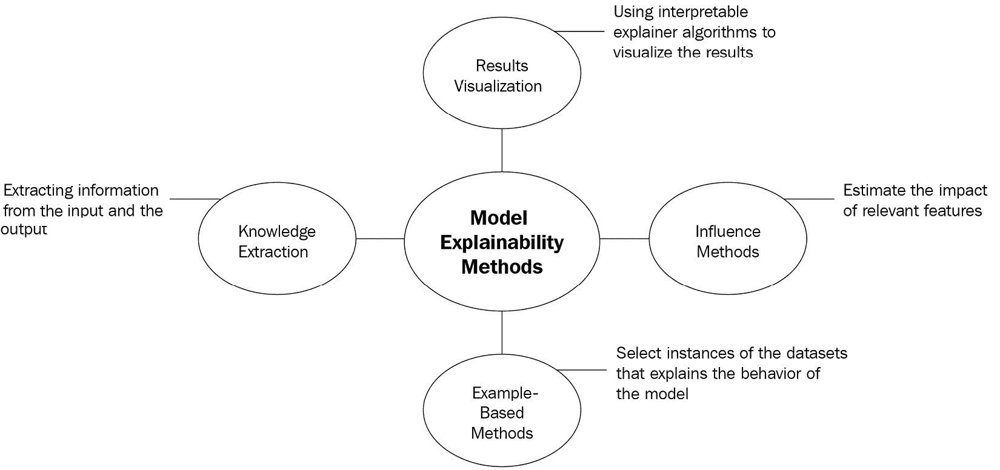
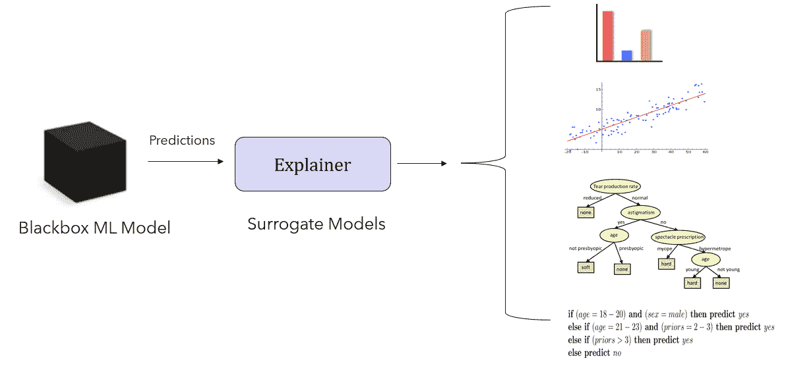
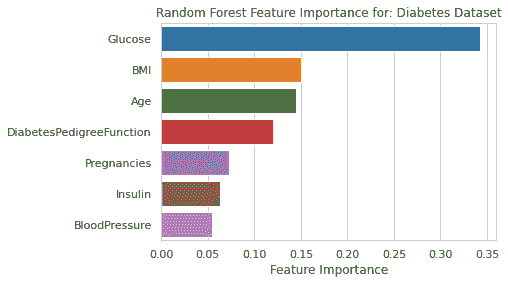
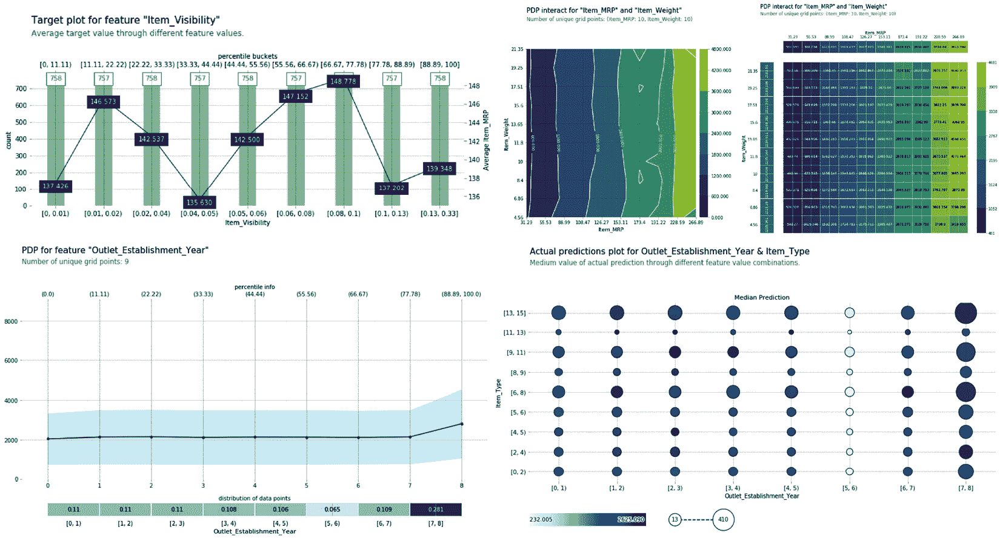
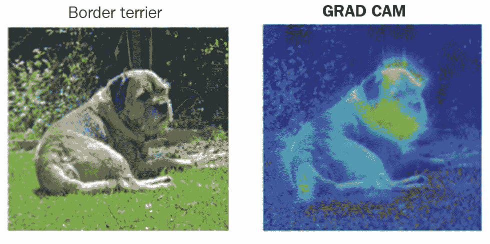
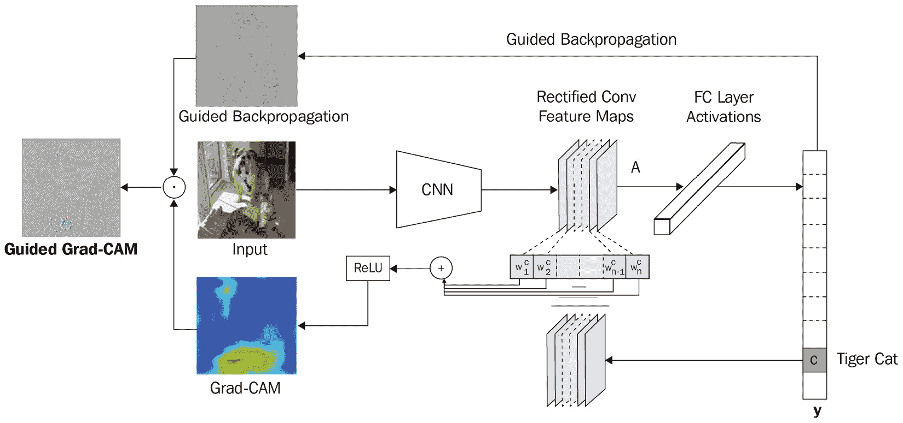
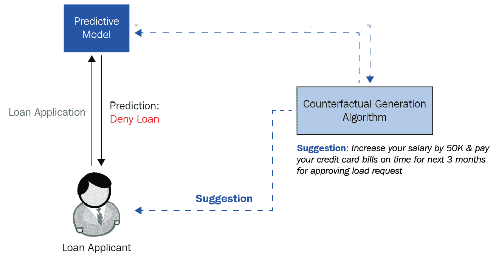
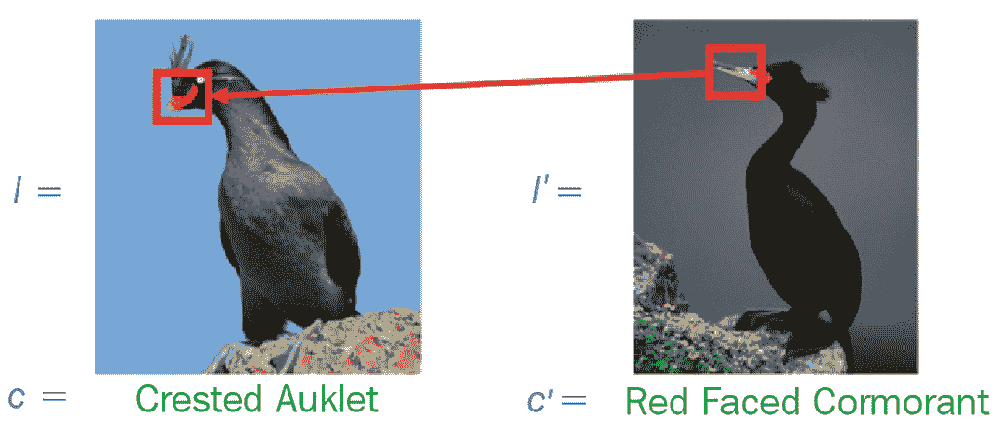
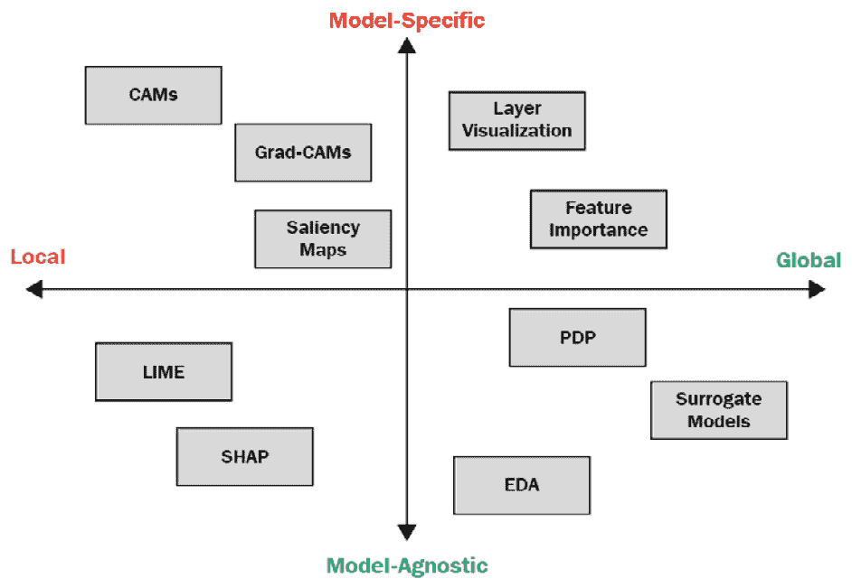

# 第二章：模型可解释性方法

本书的一个关键目标是赋予读者设计可解释机器学习系统的能力，这些系统可用于生产环境中解决关键业务问题。对于健壮的可解释机器学习系统，根据问题的类型和使用的数据类型，可解释性可以以多种方式提供。与图像和文本等非结构化数据相比，为结构化表格数据提供可解释性相对更符合人类习惯，因为图像或文本数据更复杂，具有更少的可解释粒度特征。

为机器学习模型添加可解释性的方法有很多种，例如，通过提取关于数据或模型的信息（知识提取），使用有效的可视化来证明预测结果（结果可视化），识别训练数据中的主导特征并分析其对模型预测的影响（基于影响的方法），或者通过将模型结果与已知场景或情况进行比较作为例子（基于示例的方法）。

因此，在本章中，我们将讨论用于模型可解释性的各种模型无关和模型特定解释方法，这些方法适用于结构化和非结构化数据。

本章涵盖了以下主要主题：

+   模型可解释性方法的类型

+   知识提取方法

+   结果可视化方法

+   基于影响的方法

+   基于示例的方法

# 技术要求

本章的主要目标是提供对模型可解释性方法的概要理解。然而，我将提供一些教程示例，以在 Python 中实现某些方法，并在一些有趣的数据集上应用。我们将使用 Python Jupyter 笔记本来运行代码并在整本书中可视化输出。*第二章*的代码和数据集资源可以从以下 GitHub 仓库下载或克隆：[`github.com/PacktPublishing/Applied-Machine-Learning-Explainability-Techniques/tree/main/Chapter02`](https://github.com/PacktPublishing/Applied-Machine-Learning-Explainability-Techniques/tree/main/Chapter02)。其他运行代码所需的 Python 框架将在笔记本中提及，以及其他相关细节，以理解这些概念中的代码实现。

# 模型可解释性方法的类型

您可以使用不同的方法来提供模型可解释性。某些技术特定于某个模型，而某些方法应用于模型的输入和输出。在本节中，我们将讨论用于解释机器学习模型的不同类型的方法：

+   **知识提取方法**：在**数据探索性分析**（**EDA**）和事后分析期间从数据中提取关键洞察和统计信息是提供模型无关可解释性的方法之一。通常，应用统计配置文件方法来提取平均值和中位数、标准差或方差，以及某些描述性统计来估计预期结果的范围。

同样，使用相关性热图、分解树和分布图等其他洞察力也被用来观察特征之间的任何关系，以解释模型的结果。对于更复杂的非结构化数据，如图像，通常这些统计知识提取方法是不够的。使用**概念激活向量**（**CAVs**），如在第*第八章*“使用 TCAV 进行人性化的解释”中讨论的，更有效的人性化方法。

然而，首先，知识提取方法从输入数据和输出数据中提取关于定义预期模型结果的基本信息。例如，为了解释时间序列预测模型，我们可以考虑一个模型性能指标，比如训练期间预测误差的方差。误差率可以在（比如说）±10%的置信区间内指定。置信区间的形成只有在从输出训练数据中提取关键洞察之后才可能。

+   **结果可视化方法**：绘制模型结果并将其与先前预测的值进行比较，尤其是与代理模型进行比较，通常被认为是一种有效的模型无关的可解释性方法。来自黑盒机器学习算法的预测被传递给代理模型解释器。通常，这些是高度可解释的线性模型、决策树或任何基于规则的启发式算法，可以解释复杂模型的结果。这种方法的主要局限性是可解释性完全依赖于模型结果。如果数据或建模过程中有任何异常，这些可解释性的维度就不会被捕捉到。

例如，假设一个分类器错误地预测了一个输出。仅从预测概率中，我们无法确切理解模型为何以特定方式表现。但这些方法在实际应用中易于应用，甚至易于理解，因为使用了高度可解释的解释算法。

+   **基于影响的方法**：这些是帮助我们理解某些数据特征如何对模型结果产生重要影响的特定技术。目前，这是应用最常见和最有效的方法之一，用于为机器学习模型提供可解释性。特征重要性、敏感性分析、关键影响因素图、显著性图、**类激活图（CAMs**）和其他视觉特征图被用来解释数据中的单个特征是如何被模型用于其决策过程的。

+   **基于实例的方法**：之前讨论的三种模型无关的可解释性方法仍然需要某种技术知识来理解机器学习模型的工作原理。对于非技术用户来说，解释某事最好的方式是提供一个他们能够与之相关联的例子。基于实例的方法，尤其是基于反事实的实例方法，试图查看某些单个数据实例来解释机器学习模型的决策过程。

例如，假设一个由机器学习驱动的自动贷款审批系统拒绝了一个申请人的贷款申请。使用基于实例的可解释性方法，申请人也会被建议，如果他们在接下来的三个月内按时支付信用卡账单并增加每月收入 2000 美元，他们的贷款申请将被批准。

根据最新趋势，模型无关的技术方法比模型依赖的方法更受欢迎，因为即使复杂的机器学习算法也可以在一定程度上使用这些技术进行解释。但某些技术，如显著性图、基于树/森林的特征重要性以及激活图，通常是模型特定的。我们选择解释方法是由我们试图解决的关键问题决定的。

*图 2.1*展示了应用于解释黑盒模型工作原理的四种主要类型的可解释性方法，我们将在以下章节中介绍：

图 2.1 – 模型可解释性方法

现在，让我们更详细地讨论这些模型可解释性方法中的每一个。

# 知识提取方法

无论在任何语境中讨论可解释性，都是关于获取对问题的了解，以便对预期的结果有更清晰的了解。同样，如果我们已经知道结果，可解释性就是追踪到根本原因。机器学习中的知识提取方法用于从输入数据中提取关键见解，或利用模型结果追踪并映射到终端用户已知的信息，无论是结构化数据还是非结构化数据。尽管有多个提取知识的方法，但在实践中，以数据为中心的 EDA 过程是解释任何黑盒模型最常见和最受欢迎的方法之一。让我们更详细地讨论如何在**XAI**的语境中使用 EDA 过程。

## EDA

我总是认为 EDA 对于任何机器学习工作流程来说是最重要的过程。EDA 使我们能够探索数据并得出关键见解；利用这些见解，我们可以从数据中形成某些假设。这实际上帮助我们识别数据中的任何独特模式，并最终帮助我们做出正确的算法选择。因此，EDA 是传统且模型无关的方法之一，它解释了数据的本质，并且通过考虑数据，它帮助我们了解从模型中可以期待什么。使用 EDA 可以轻松地观察到任何明显的异常、模糊、冗余数据点和数据偏差。现在，让我们看看在 EDA 中用于解释结构化和非结构化数据模型的一些重要方法。

### 结构化数据上的 EDA

在结构化数据上进行的 EDA（探索性数据分析）是用于提取洞察力以提供可解释性的初步步骤之一。然而，在 EDA 过程中实际应用的技术可能因问题而异。但一般来说，对于结构化数据，我们可以使用 EDA 来生成某些描述性统计量，以便更好地理解数据，然后应用各种单变量和多变量方法来检测每个特征的重要性，观察数据的分布以找出数据中的任何偏差，并寻找异常值、重复值、缺失值、特征之间的相关性以及基数，这些都可能影响模型的结果。

从 EDA 步骤中获得的信息和假设有助于执行有意义的特征工程和建模技术，并帮助为利益相关者设定正确的期望。在本节中，我们将介绍最流行的 EDA 方法，并讨论在 XAI（可解释人工智能）的背景下使用结构化数据 EDA 的好处。我强烈建议查看 GitHub 仓库（[`github.com/PacktPublishing/Applied-Machine-Learning-Explainability-Techniques`](https://github.com/PacktPublishing/Applied-Machine-Learning-Explainability-Techniques)）以在实际用例中应用这些技术。现在，让我们看看以下列表中的重要 EDA 方法：

+   **摘要统计量**：通常，模型可解释性是相对于数据中的特征来呈现的。在 EDA 过程中观察数据集统计量可以给出早期迹象，表明数据集是否足够用于建模和解决给定问题。它有助于理解数据的维度和存在的特征类型。如果特征是数值型的，则会观察到某些描述性统计量，如均值、标准差、变异系数、偏度、峰度和四分位数范围。

此外，某些基于直方图的分布被用来监控数据中的任何偏斜或偏差。对于分类特征，观察分类值的频率分布。如果数据集不平衡，如果数据集偏向于某个特定的分类值，如果数据集有异常值，或者偏向于某个特定方向，所有这些都可以很容易地观察到。由于所有这些因素都可能影响模型预测，因此理解数据集统计信息对于模型可解释性很重要。

*图 2.2*显示了在 EDA 步骤中创建的汇总统计和可视化，以提取关于数据的知识：

图 2.2 – EDA 过程中的汇总统计和可视化

+   **重复值和缺失值**：重复或冗余的值可能会给模型增加更多偏差。相反，缺失值可能导致信息丢失和训练模型的数据不足。这可能会导致模型过拟合。因此，在训练模型之前，如果观察到缺失值或重复值，并且没有采取进一步措施来纠正这种情况，那么这些观察结果可能有助于解释模型泛化不良的原因。

+   **单变量分析**：这涉及到通过图形技术（如分布图、直方图、箱线图、小提琴图、饼图、聚类图）分析单个特征，以及使用非图形技术（如频率、集中趋势度量[即均值、标准差和变异系数]和四分位数范围）。这些方法帮助我们估计单个特征对模型结果的影响。

+   **多变量分析**：这涉及到使用图形和非图形方法一起分析两个或更多特征。它用于识别数据相关性以及变量的依赖性。在 XAI 的背景下，多变量分析用于理解数据中的复杂关系，并提供比单变量分析方法更详细和更细粒度的解释。

+   **异常值检测**：异常值是某些异常数据点，可能会完全扭曲模型。如果模型是在异常数据点上训练的，那么很难实现泛化。然而，在模型推理时间对异常数据点的预测可能会完全错误。因此，在训练和推理时间进行异常值检测是模型可解释性的一个重要部分。可视化方法，如箱线图、散点图，以及统计方法，如 1.5 倍 IQR 规则（[`www.khanacademy.org/math/statistics-probability/summarizing-quantitative-data/box-whisker-plots/a/identifying-outliers-iqr-rule`](https://www.khanacademy.org/math/statistics-probability/summarizing-quantitative-data/box-whisker-plots/a/identifying-outliers-iqr-rule)）和纳尔逊规则（[`www.leansixsigmadefinition.com/glossary/nelson-rules/`](https://www.leansixsigmadefinition.com/glossary/nelson-rules/））用于检测异常。

+   **帕累托分析**：根据帕累托原则，80%的价值或影响是由 20%的样本量驱动的。因此，在 XAI 中，这个*80-20 规则*用于解释对模型结果影响最大的子样本。

+   **频繁项集挖掘**：这是提取模型可解释性的另一种流行方法。这项技术常用于关联规则挖掘，以了解在给定的数据集中某些观察结果出现的频率。这种方法提供了一些有趣的观察结果，有助于从数据中形成重要的假设，并最终对解释模型结果做出很大贡献。

现在我们已经涵盖了结构化数据的方法，让我们来看看一些非结构化数据的方法。

### 非结构化数据的 EDA

从非结构化数据（如图像和文本）中解释特征是困难的，因为机器学习算法试图识别人类难以直观解释的粒度级特征。然而，有一些特定于图像和文本数据的方法被应用于形成从数据中得出的有意义的假设。如前所述，EDA 过程可能会根据问题和数据而变化，但在这章中，我们将讨论 XAI 背景下最流行的方法选择。

#### 探索图像数据

用于图像的 EDA 方法与用于表格数据的 EDA 方法不同。以下是图像数据集的一些流行的 EDA 步骤选择：

+   **数据维度分析**：对于一致和泛化的模型，理解数据维度很重要。监控图像数量和每个图像的形状对于解释任何过拟合或欠拟合的观察结果都很重要。

+   **观察数据分布**：由于使用图像解决的问题中的大多数都是分类问题，因此监控类别不平衡很重要。如果数据分布不平衡，那么模型可能会偏向多数类。对于像素级分类（用于分割问题），观察像素强度分布很重要。这也有助于理解阴影或非均匀照明条件对图像的影响。

+   **观察平均图像和对比图像**：为了观察图像中的感兴趣区域，经常使用平均图像和对比图像。这在基于分类的问题中尤其有用，用于比较感兴趣区域的占主导地位。

+   **高级统计和代数方法**：除了前面讨论的方法之外，其他统计方法，如寻找 z 分数和标准差，以及基于特征向量的特征图像等代数方法，用于视觉检查图像数据中的关键特征，这为最终的模型结果增加了可解释性。

根据问题的类型，探索图像数据集还有其他复杂的方法。然而，本小节中讨论的方法是最常见的方法。

#### 探索文本数据

通常，与图像或表格数据相比，文本数据更嘈杂。因此，EDA 通常伴随着一些预处理或清洗方法来处理文本数据。但因为我们只关注 EDA 部分，以下列表详细介绍了使用文本数据进行 EDA 的一些流行方法：

+   **数据维度分析**：与图像类似，文本维度分析，如检查记录数量和每条记录的长度，以形成关于潜在过拟合或欠拟合的假设。

+   **观察数据分布**：使用条形图或词云可视化词频分布是观察任何文本数据中顶级单词的流行选择。这种技术使我们能够避免与低频词相比高频词的任何偏差。

+   **n-gram 分析**：考虑到文本数据的性质，通常，一个短语或单词集合比单个单词更容易解释。例如，对于从电影评论中进行情感分析，高频单词如*movie*或*film*相当模糊。相比之下，短语如*good movie*和*very boring film*则更容易解释且更有用，有助于理解情感。因此，n-gram 分析或“n-words”集合的引入为理解模型结果提供了更多的可解释性。

通常，EDA 确实包括某些可视化技术来解释数据并形成一些重要假设。但解释 ML 模型的重要技术之一是通过可视化模型结果。在下一节中，我们将更详细地讨论这些结果可视化方法。

# 结果可视化方法

模型结果的可视化是应用于解释机器学习模型的一种非常常见的方法。通常，这些是在训练后的黑盒模型上应用的模型无关的事后分析方法，并提供可解释性。在下一节中，我们将讨论一些常用的结果可视化方法，用于解释机器学习模型。

## 使用对比分析方法

这些大多是事后分析的方法，用于在训练过程之后通过可视化模型的预测输出来增加模型的可解释性。大多数情况下，这些是模型无关的方法，可以应用于内在可解释模型和黑盒模型。对比分析可用于生成全局和局部解释。它主要用于使用各种可视化方法比较不同结果的多种可能性。

例如，对于基于分类的问题，某些方法如 t-SNE 和 PCA 被用于可视化并比较模型预测标签的转换特征空间，尤其是在误差率较高的情况下。对于回归和时间序列预测模型，使用置信水平来比较模型预测结果与上下限。有各种方法可以应用于对比分析，以获得更清晰的“如果...将会如何”场景的见解。一些突出方法在项目仓库中提到（[https://github.com/PacktPublishing/Applied-Machine-Learning-Explainability-Techniques/blob/main/Chapter02/Comparison%20Analysis.ipynb](https://github.com/PacktPublishing/Applied-Machine-Learning-Explainability-Techniques/blob/main/Chapter02/Comparison%20Analysis.ipynb))。

正如我们在 *图 2.3* 中所看到的，结果可视化有助于提供关于模型的全球视角，以可视化模型预测：

![图 2.3 – 使用 t-SNE 方法对分类问题（左侧）和时间序列预测模型（右侧）的置信区间进行对比分析]

![img/B18216_02_03.jpg]

图 2.3 – 使用 t-SNE 方法对分类问题（左侧）和时间序列预测模型（右侧）的置信区间进行对比分析

在 *图 2.3* 中，我们可以看到如何使用可视化方法通过可视化模型的最终结果并与其他数据实例或可能的 *如果...将会如何* 场景进行比较，从而提供模型的全球视角。

## 使用代理解释器方法

在机器学习的背景下，当外部模型或算法被应用于解释黑盒机器学习模型时，外部方法被称为**代理解释方法**。这种方法背后的基本思想是应用一个内在可解释的模型，该模型简单易解释，并且尽可能准确地近似黑盒模型的预测。然后，使用某些可视化技术来可视化代理解释方法的结果，以深入了解模型行为。

但现在的问题是*我们能否直接应用代理模型而不是使用黑盒模型？* 答案是*不！* 使用代理模型的主要思想是获取一些关于输入数据如何与目标结果相关的信息，而不考虑模型精度。相比之下，原始的黑盒模型更准确、更高效，但不可解释。因此，完全用代理模型替换黑盒模型将损害模型精度，这是我们不愿意看到的。

可解释算法，如回归、决策树和基于规则的算法，是代理解释方法的热门选择。为了提供可解释性，主要分析了输入特征与目标结果之间的三种关系类型：线性、单调性和交互性。

线性关系帮助我们检查输入特征是否与目标结果呈线性相关。单调性帮助我们分析增加整体输入特征值是否会导致目标结果增加或减少。对于整个特征范围，这解释了输入特征与目标结果之间的关系是否始终向同一方向传播。模型交互在提供可解释性时非常有帮助，但实现起来很困难。交互性帮助我们分析单个特征如何相互作用以影响模型决策过程。

决策树和基于规则的算法用于检查输入特征与目标结果之间的交互作用。在《可解释机器学习》一书中，*克里斯托夫·莫尔纳*（[`christophm.github.io/interpretable-ml-book/`](https://christophm.github.io/interpretable-ml-book/))）提供了一个非常有用的表格，比较了不同的内在可解释模型，这对于选择作为代理解释器的可解释模型非常有用。

如下表格展示了这一过程的简化版本：

图 2.4 – 比较选择代理解释方法的可解释算法

这种技术的最大优点之一是它可以帮助使任何黑盒模型可解释。它是模型无关的，并且非常容易实现。但是，当数据复杂时，会使用更复杂的算法来达到更高的建模精度。在这种情况下，代理方法往往会过度简化输入特征之间的复杂模式或关系。

*图 2.5* 展示了如何使用可解释的算法，如决策树、线性回归或任何基于启发式规则的算法，作为代理模型来解释任何黑盒机器学习模型：

图 2.5 – 使用代理解释器进行模型可解释性

尽管这种方法存在缺点，但线性、单调性和交互性的可视化在很大程度上可以证明在复杂黑盒模型上工作的合理性。在下一节中，我们将讨论基于影响的方法来解释机器学习模型。

# 基于影响的方法

基于影响的方法被用来理解数据集中特征对模型决策过程的影响。与其它方法相比，基于影响的方法被广泛使用且更受欢迎，因为这有助于从数据集中识别出主导属性。从结构化和非结构化数据中识别主导属性有助于我们分析主导特征在影响模型结果中的作用。

例如，假设你正在处理一个分类问题，用于区分狼和西伯利亚雪橇犬。假设在训练和评估过程之后，你已经得到了一个准确率超过 95%的良好模型。但在尝试使用基于影响的方法来寻找模型可解释性的重要特征时，你观察到模型将周围背景作为分类是否为狼或雪橇犬的主导特征。在这种情况下，即使你的模型结果看起来高度准确，你的模型也是不可靠的。这是因为模型做出决策的特征并不稳健且不具有普遍性。

基于影响的方法常用于执行根本原因分析以调试机器学习模型和检测机器学习系统中的故障。现在，让我们讨论一些用于模型可解释性的基于影响方法的流行选择。

## 特征重要性

在应用机器学习模型时，理解每个特征相对于影响模型结果的重要性至关重要。这是一种技术，它根据特征在预测目标值中的有用性，对数据集中存在的输入特征分配特定的分数。特征重要性是结构化数据建模中非常流行的模型无关可解释性选择。尽管有各种评分机制来确定特征重要性，例如排列重要性分数、统计相关性分数、基于决策树的评分等，但在本节中，我们将主要关注整体方法，而不仅仅是评分机制。

在 XAI 的背景下，特征重要性可以提供对数据和模型行为的全局洞察。它通常用于特征选择和降维，以提高机器学习模型的效率。通过从建模过程中移除不太重要的特征，观察到通常整体模型性能得到提高。

重要特征的概念有时可能取决于评分机制或所使用的模型类型。因此，建议在得出任何结论之前，您应该使用领域专家验证此技术选择的重要特征。此方法适用于结构化数据集，其中特征被明确定义。对于文本或图像等非结构化数据，特征重要性并不非常相关，因为模型使用的特征或模式更为复杂，并且并不总是可由人类解释。

*图 2.6* 展示了如何突出显示数据集的有影响特征，使最终用户能够关注重要特征的价值，以证明模型结果：

图 2.6 – 糖尿病数据集上的特征重要性图（来自代码教程）

接下来，我们将介绍另一种重要的基于影响度的模型可解释性方法，称为敏感性分析。

## 敏感性分析

敏感性分析是一种定量过程，通过改变关于预测模型使用的输入特征所做的假设来近似预测的不确定性。在敏感性分析中，单个输入特征变量被增加或减少以评估单个特征对目标结果的影响。这种技术在预测建模中非常常用，用于优化系统的整体性能和鲁棒性。

进行敏感性分析可能很简单，但却是任何数据科学项目非常强大的方法，可以为商业利益相关者提供额外信息，特别是对于多元数据集。它有助于理解“如果...会怎样”的情景，并观察是否有任何特定特征对异常值或任何形式的对抗性扰动敏感。它有助于质疑变量假设的可靠性，预测假设改变时的可能结果，并衡量改变变量假设的重要性。敏感性分析是一种数据驱动的建模方法。它表明数据是否可靠、准确且与建模过程相关。此外，它有助于找出是否有其他可能影响模型的因素。

在 XAI 的背景下，由于敏感性分析相对于一些广泛使用的方法来说稍微不那么常见，让我尝试给出我在机器学习中进行敏感性分析的建议。通常，这对于回归问题非常有用，但对于基于分类的问题也非常重要。

请参考 GitHub 仓库中提供的笔记本（[`github.com/PacktPublishing/Applied-Machine-Learning-Explainability-Techniques/blob/main/Chapter02/FeatureImportance_SensitivityAnalysis.ipynb`](https://github.com/PacktPublishing/Applied-Machine-Learning-Explainability-Techniques/blob/main/Chapter02/FeatureImportance_SensitivityAnalysis.ipynb)），以获取进行敏感性分析的详细和实用方法。我建议你为敏感性分析做的第一步是计算原始数据集中每个属性的方差（σ）。然后，对于每个属性，将原始属性值转换为-3σ、-2σ、-σ、σ、2σ和 3σ，并观察回归问题中目标结果的百分比变化或观察基于分类问题的预测类别。

对于一个好的和稳健的模型，我们希望目标结果对特征值的任何变化都不太敏感。理想情况下，我们期望回归问题中目标结果的百分比变化不太剧烈，对于分类问题，预测类别在改变特征值时不应有太大变化。任何超过/低于+/- 3σ的特征值都被认为是异常值，因此通常我们只改变特征值到+/- 3σ。

*图 2.7*展示了详细的敏感性分析如何帮助你分析容易影响模型结果的因素：

图 2.7 – 通过敏感性分析理解数据的有影响特征

除了敏感性分析之外，在下一节中，你将了解**部分依赖图**（**PDPs**），它也可以用来分析有影响特征。

## PDPs

当使用黑盒机器学习模型时，检查特征属性与目标结果之间的功能关系可能具有挑战性。尽管计算特征重要性可能更容易，但 PDPs 提供了一种功能上计算预测特征与预测变量之间关系的机制。它显示了单个或两个属性对目标结果的影响。

PDPs 可以有效地帮助识别预测变量和预测变量之间的线性、单调或任何复杂交互，并指示预测变量对预测变量的平均影响。PDP 通过测量边际效应来衡量特定预测属性的贡献，该效应不包括其他变量对特征空间的影响。

与敏感性分析类似，PDPs 帮助我们近似特定特征可以影响目标结果的方向。为了简化，我将不会添加任何复杂的数学表示来获得预测变量的平均边际效应；然而，我强烈建议阅读 *Jerome H. Friedman* 的关于 *Greedy Function Approximation: A Gradient Boosting Machine* 的工作，以获取更多信息。PDP 的一个最显著的好处是它易于使用、实现和理解，并且可以很容易地向非技术业务利益相关者或机器学习模型的最终用户解释。

但这种方法也存在某些缺点。默认情况下，该方法假设所有特征之间没有相关性，并且特征属性之间没有交互作用。在任何实际场景中，这种情况极不可能发生，因为大多数时候，由于特征变量，总会有一些交互或联合效应。

PDPs 也局限于二维表示，并且 PDPs 并不显示任何特征分布。因此，如果特征空间分布不均匀，分析结果时可能会错过某些偏差的影响。由于 PDPs 只显示平均边际效应，它可能不会显示出任何异质效应。这意味着，如果某个特定特征的半数数据对预测结果有正面影响，而另一半则有负面影响，那么 PDP 可能仅仅是一条水平线，因为两半的影响可以相互抵消。这可能导致结论认为该特征对目标变量没有任何影响，这是误导性的。

通过 **累积局部效应图**（**ALEP**）和 **个体条件期望曲线**（**ICE 曲线**）可以解决 PDP 的缺点。我们不会在本章中涵盖这些概念，但请参考 *参考文献* 部分，*[参考文献 – 4,5]*，以获取帮助您理解这些概念的额外资源。

让我们看看 *图 2.8* 中的某些样本 PDP 可视化：

![图 2.8 – PDP 可视化（来自代码教程）]

图 2.8 – PDP 可视化（来自代码教程）

*图 2.8* 展示了有助于我们理解来自表格数据集的有影响力的特征的 PDP 可视化。在下一节中，我们将讨论**层相关传播（Layer-wise Relevance Propagation，LRP**）方法，以理解非结构化数据中的有影响力特征。

## LRP

我们之前讨论的大多数基于影响的方法对结构化数据非常有效。但不幸的是，这些方法不能应用于图像和文本等非结构化数据，在这些数据中，特征并不总是明确定义的，尤其是在使用**深度卷积神经网络（Deep Convolution Neural Networks，DCNNs**）时。与应用于图像和文本等非结构化数据相比，经典机器学习算法的效率不如深度学习算法。由于深度学习在自动特征提取方面的优势，与经典机器学习中的手动特征工程相比，深度学习算法在模型精度方面更高效，因此更受欢迎。然而，深度学习模型比经典机器学习模型更复杂，可解释性也更差。

为深度学习模型提供可解释性也是一个相当大的挑战；通常，为深度学习模型提供可解释性的定量方法非常少。因此，我们主要依靠定性方法来可视化可能影响权重和偏差计算过程的关键影响数据元素，这些是任何深度学习模型的主要参数。此外，对于具有多个层的深度网络，当层之间的梯度流过程的信息流保持一致时，就会发生学习。因此，为了解释任何深度学习模型，特别是图像和文本，我们会尝试可视化网络不同层中的*激活*或最有影响力的数据元素，并定性检查算法的运行情况。

为了解释深度学习模型，LRP（Layer-wise Relevance Propagation）是其中最突出的方法之一。直观地说，这种方法利用网络中的权重和前向传递的神经激活来通过网络的各个层将输出反向传播到输入层。因此，借助网络权重，我们可以可视化对最终模型输出贡献最大的数据元素（在图像的情况下是像素，在文本数据的情况下是单词）。这些数据元素的贡献是相关性的定性度量，它在网络层之间传播。

现在，我们将探讨一些已经应用于解释深度学习模型工作原理的具体 LRP 方法。在实践中，实现这些方法可能具有挑战性。因此，我没有将这些方法包含在代码教程中，因为本章旨在帮助即使是初学者也能学习。我在*参考*部分分享了一些资源，供中级或高级学习者进行代码演练。

### 显著性图

显著性图是用于解释**卷积神经网络**（**CNN**）预测结果的最常用方法之一。这项技术源于图像显著性概念，它指的是图像的重要特征，例如像素，这些像素在视觉上具有吸引力。因此，显著性图是从原始图像派生出的另一张图像，其中像素亮度与图像的显著性成正比。显著性图有助于突出图像中在模型最终决策过程中发挥重要作用的区域。它是一种专门用于 DCNN 模型的可视化技术，用于区分视觉特征和数据。

除了为深度学习模型提供可解释性之外，显著性图还可以用于识别感兴趣的区域，这些区域可以进一步由自动图像标注算法使用。此外，显著性图在音频领域，尤其是在音频监控中，用于检测不寻常的声音模式，如枪声或爆炸声。

*图 2.9*显示了给定输入图像的显著性图，它突出了模型用于预测结果的重要像素：

图 2.9 – 输入图像的显著性图

接下来，让我们来介绍另一种流行的 LRP 方法——**引导反向传播**（**引导反向传播**）。

### 引导反向传播

另一种用于解释深度学习模型、增加信任并促进其采用的可视化技术是**引导反向传播**。引导反向传播突出图像中的细粒度视觉细节，以解释模型为何预测了特定的类别。它也被称为引导显著性，实际上结合了标准反向传播和通过 ReLU 非线性（也称为**反卷积网络**）的反向传播过程。如果您不熟悉这些术语，我强烈建议您阅读这篇文章，[`towardsdatascience.com/review-deconvnet-unpooling-layer-semantic-segmentation-55cf8a6e380e`](https://towardsdatascience.com/review-deconvnet-unpooling-layer-semantic-segmentation-55cf8a6e380e)，以了解更多关于反向传播和反卷积网络机制的信息。

在这种方法中，网络的神经元充当特征检测器，由于使用了 ReLU 激活函数，因此只保留特征图中正的梯度元素。此外，DeconvNets 只保留正的错误信号。由于负梯度被设置为零，因此在通过 ReLU 层反向传播时，只有重要的像素被突出显示。因此，这种方法有助于可视化图像的关键区域、重要的形状以及算法将要分类的对象的轮廓。

*图 2.10*显示了给定输入图像的引导反向传播图，该图标记了模型用于预测结果的轮廓和一些粒度视觉特征：

图 2.10 – 输入图像的引导反向传播

引导反向传播非常有用，但在下一节中，我们将介绍另一种有用的方法来解释图像等非结构化数据，称为梯度 CAM。

### 梯度 CAM

CAMs 是用于解释深度学习模型的独立可视化方法。在这里，模型预测的类别分数被追踪回最后一个卷积层，以突出图像中具有类别特定性且甚至不适用于其他计算机视觉或图像处理算法的感兴趣区域。**梯度 CAM**结合了引导反向传播和 CAM 的效果，在不突出像素粒度重要性时突出感兴趣区域的类别判别性，这与引导反向传播不同。但 Grad-CAM 可以应用于任何 CNN 架构，而 CAM 只能应用于在预测层之前对来自卷积层的输出特征图执行全局平均池化的架构。

**Grad-CAM**（也称为**梯度加权类别激活图**）有助于可视化高分辨率细节，这些细节通常叠加在原始图像上，以突出预测特定类别的占主导地位的图像区域。对于多类分类模型来说，它非常有用。Grad-CAM 通过检查模型最后一层的梯度信息流来工作。然而，对于某些情况，检查细粒度像素激活信息也很重要。由于 Grad-CAM 不允许我们检查粒度信息，因此存在 Grad-CAM 的另一种变体，称为**引导 Grad-CAM**，用于结合引导反向传播和 Grad-CAM 的优点，以可视化图像中的粒度级类别判别信息。

*图 2.11*显示了任何输入图像的 Grad-CAM 可视化效果：

图 2.11 – 输入图像的 Grad-CAM

Grad-CAM 突出了图像中的重要区域，这些区域被模型用于预测结果。这种方法的另一种变体是使用引导 Grad-CAM，它结合了引导反向传播和 Grad-CAM 方法，以产生有趣的可视化来解释深度学习模型：

图 2.12 – 引导 Grad-CAM 的架构图

*图 2.12*显示了引导 Grad-CAM 方法的架构图，这个图稍微复杂一些，但总体来说，LRP 是一种重要的方法，可以用来解释深度学习模型的工作原理。

## 基于表示的解释

模式表示在决策过程中起着重要作用，尤其是在文本和图像等非结构化数据中。传统上，使用手工设计的模式匹配算法来提取全局特征，这些特征是人类可以关联的。但最近，基于 CAVs 的 GoogleAI 模型可解释性技术，在 XAI 领域获得了极大的普及。在本部分，我们将更详细地讨论 CAVs，尽管从非结构化数据中提取特征和模式也属于基于表示的解释。

### CAVs

尤其对于非结构化数据，大多数深度学习模型在低级特征上工作，如边缘、轮廓和模式，以及一些中级和高级特征，如感兴趣对象的一些定义部分和部分。大多数情况下，这些表示不是人类友好的，尤其是对于复杂的深度学习模型。直观上，CAVs 将低级和细粒度特征与高级人类友好概念联系起来。因此，使用 CAVs 的模型可解释性提供了更现实的解释，任何人类都可以与之相关联。

CAVs 的方法实际上是通过使用 GoogleAI 的**概念激活向量测试**（**TCAV**）框架来实现的。TCAV 利用方向导数来近似神经网络内部状态到人类定义的概念。例如，如果我们要求一个人解释斑马是什么样子，他们可能会说斑马是一种看起来像白色马匹带有黑色条纹的动物，并且生活在草原上。因此，*动物*、*白色马匹*、*黑色条纹*和*草原*可以代表斑马的重要概念。

同样，TCAV 算法试图学习这些概念，并使用训练好的模型学习这些概念对预测的重要性，尽管这些概念可能在训练过程中没有被使用。因此，TCAV 试图量化模型对特定类别的特定概念敏感度。我发现 CAVs 的想法非常吸引人。我认为这是创建人类友好型 AI 模型解释的一步，任何非技术用户都可以轻松地与之相关联。我们将在*第八章*，*使用 TCAV 进行人类友好型解释*中更详细地讨论 GoogleAI 的 TCAV 框架。

*图 2.13*展示了使用人类友好概念来解释模型预测的想法。在下一小节中，我们将看到另一种用于解释复杂深度学习模型的可视化方法：

图 2.13 – CAV 背后的基本思想

接下来，我们将讨论**视觉注意力图**（**VAMs**），它也可以与复杂的深度学习模型一起使用。

## VAMs

近年来，由于在复杂非结构化数据上能够实现最先进的模型性能，转换器模型架构因其能力而获得了大量关注。注意力网络是转换器架构的核心，它允许算法学习更多上下文信息，以产生更准确的结果。

基本思想是数据中的每一部分并不同等重要，只有重要的特征需要比其他数据更多的*关注*。因此，注意力网络会过滤掉无关的数据部分，以便做出更好的判断。通过注意力机制，网络可以根据对底层任务的重要性级别分配更高的权重给重要部分。使用这些注意力权重，可以创建某些可视化，这些可视化可以解释复杂算法的决策过程。这些被称为 VAMs。

这种技术在解决诸如自动图像标题和视觉问答等问题时，对于**多模态编码器-解码器**架构特别有用。如果你对这种技术的理解处于入门水平，应用 VAMs 可能会相当复杂。因此，在这本书或代码教程中，我将不会详细介绍这项技术。如果你对了解这种技术在实践中是如何工作的感兴趣，请参考代码仓库[`github.com/sgrvinod/a-PyTorch-Tutorial-to-Image-Captioning`](https://github.com/sgrvinod/a-PyTorch-Tutorial-to-Image-Captioning)。

如*图 2.14*所示，VAMs 提供了逐步可视化来解释复杂编码器-解码器模型的输出。在下一节中，我们将探讨基于示例的方法，这些方法用于解释机器学习模型：

图 2.14 – 使用 VAMs 解释用于多模态数据集自动图像标题任务的复杂编码器-解码器注意力深度学习模型

在下一节中，我们将介绍另一种使用人类友好示例来解释黑盒模型预测的可解释性方法。

# 基于示例的方法

模型可解释性的另一种方法是示例方法提供的。示例方法的想法类似于人类尝试解释新概念的方式。作为人类，当我们试图向他人解释或介绍新事物时，我们通常会尝试使用听众能够相关联的例子。同样，在 XAI 的背景下，示例方法尝试选择数据集的某些实例来解释模型的行为。它假设观察当前数据实例与历史观察之间的相似性可以用来解释黑盒模型。

这些大多是模型无关的方法，可以应用于结构化和非结构化数据。如果结构化数据是高维的，这些方法会变得稍微具有挑战性，并且无法包含所有特征来解释模型。因此，只有在有选项总结数据实例或仅选择特定特征的情况下，这些方法才能很好地工作。

在本章中，我们将主要讨论**反事实解释**（**CFEs**），这是最流行的基于示例的可解释性方法，适用于结构化和非结构化数据。CFEs 指出特定特征需要改变到何种程度才能显著改变预测结果。通常，这对于基于分类的问题很有用。

对于某些预测模型，CFEs 可以提供指导性的见解和建议，这对于最终用户和商业利益相关者可能非常关键。例如，假设有一个用于自动贷款审批系统的 ML 模型。如果黑盒模型拒绝某个申请人的贷款申请，贷款申请人可能会联系提供者以了解他们的申请为何未被批准的确切原因。但相反，如果系统建议申请人增加 5,000 元的薪水，并在接下来的 3 个月内按时支付信用卡账单，以便批准贷款申请，那么申请人将理解并信任系统的决策过程，并努力使他们的贷款申请获得批准。

## 结构化数据中的 CFEs

在 Python 中使用**Diverse Counterfactual Explanation** (**DiCE**)框架([`interpret.ml/DiCE/`](https://interpret.ml/DiCE/))，可以为结构化数据提供一个 CFE。它可以应用于基于分类和回归的问题，以实现模型无关的局部可解释性，并描述了结构化数据中最小的变化如何改变目标结果。

在 Python 中用于 CFE（Counterfactual Explanations）的重要框架之一是**Alibi** ([`docs.seldon.io/projects/alibi/en/stable/`](https://docs.seldon.io/projects/alibi/en/stable/))，它在实现 CFE 的概念以解释 ML 模型方面也相当不错。尽管我们将在*第九章*“其他流行的 XAI 框架”中讨论这些框架并体验这些框架的实际应用，但现在，我将讨论一些关于结构化数据中 CFE 的直观理解。请参考代码仓库中提供的笔记本([`github.com/PacktPublishing/Applied-Machine-Learning-Explainability-Techniques/blob/main/Chapter02/Counterfactual_structured_data.ipynb`](https://github.com/PacktPublishing/Applied-Machine-Learning-Explainability-Techniques/blob/main/Chapter02/Counterfactual_structured_data.ipynb))，以了解如何在 Python 中编码这些方法以解决实际问题。

当与结构化数据一起使用时，CFE 方法试图分析一个输入查询数据实例，并尝试从历史数据中考虑相同查询实例的原始目标结果。或者，它试图检查特征并将它们映射到历史数据中存在的相似实例，以获取目标输出。然后，算法生成多个反事实示例来预测相反的结果。

对于基于分类的问题，这种方法将尝试预测二分类问题中的相反类别或对于多分类问题中最接近或最相似的类别。对于回归问题，如果目标结果位于谱系的较低端，算法将尝试提供一个目标结果更接近谱系高端的反事实示例，反之亦然。因此，这种方法对于理解“如果...会怎样”的情景非常有效，并且可以提供可操作性的见解以及模型可解释性。解释也非常清晰，易于理解和实现。

但这种方法的重大缺点，尤其是对于结构化数据，是它受到*罗生门效应*([`www.dictionary.com/e/pop-culture/the-rashomon-effect/`](https://www.dictionary.com/e/pop-culture/the-rashomon-effect/))的影响。对于任何现实世界的问题，它可能会找到多个可以相互矛盾的 CFEs。在结构化数据中，由于具有多个特征，相互矛盾的 CFEs 可能会造成更多的混淆，而不是解释机器学习模型！人类干预以及将领域知识应用于选择最相关的示例，可以帮助减轻罗生门效应。否则，我的建议是将这种方法与特征重要性方法结合起来，用于可操作的特征，以选择涉及重大变化的反事实示例，从而提供更好的可操作解释性。

*图 2.15*说明了如何使用 CFEs 来获取规范性见解和可操作的建议，以解释模型的工作原理：

图 2.15 – 从结构化数据中的 CFEs 获得的规范性见解

在表格数据集中，CFEs 非常有用，因为它们可以为最终用户提供可操作的建议。在下一小节中，我们将探讨非结构化数据中的 CFEs。

## 非结构化数据中的 CFEs

在非结构化数据，如图像和文本中，实现 CFEs 可能相当具有挑战性。其中一个主要原因是深度学习模型在图像或文本中使用的细粒度特征并不总是定义良好或对人类友好。但**Alibi**([`docs.seldon.io/projects/alibi/en/stable/`](https://docs.seldon.io/projects/alibi/en/stable/))框架在生成图像数据上的 CFEs 方面做得相当不错。即使是简单的 CFE 方法的改进版本，通过生成由类别原型引导的 CFE，表现也更好。它使用自动编码器或 k-d 树，使用某个输入实例为每个预测类别构建原型。

例如，在 MNIST 数据集中，假设输入查询图像是数字 7。那么，反事实原型方法将构建从 0 到 9 的所有数字的原型。随后，它将尝试生成除原始数字 7 之外最近的数字作为反事实示例。根据数据，最近的手写数字可以是 9 或 1；即使是我们人类，如果书写不清楚，我们可能会混淆数字 7 和 9 或 7 和 1！它采用优化方法来最小化模型的反事实预测损失。

我强烈推荐查看*阿诺德·范·洛弗伦*和*简尼斯·克莱斯*的工作，*基于原型的可解释反事实解释* ([`arxiv.org/abs/1907.02584`](https://arxiv.org/abs/1907.02584))，以获取更多关于此方法如何工作的细节。此 CFE 方法，由原型引导，还消除了由于黑盒深度学习模型的数值梯度评估过程可能出现的任何计算约束。请查看 GitHub 仓库中的笔记本 ([`github.com/PacktPublishing/Applied-Machine-Learning-Explainability-Techniques/blob/main/Chapter02/Counterfactual_unstructured_data.ipynb`](https://github.com/PacktPublishing/Applied-Machine-Learning-Explainability-Techniques/blob/main/Chapter02/Counterfactual_unstructured_data.ipynb))，了解如何将此方法应用于实际问题。

下面的图表，取自论文*Counterfactual Visual Explanations, Goyal et al. 2019* ([`arxiv.org/pdf/1904.07451.pdf`](https://arxiv.org/pdf/1904.07451.pdf))，展示了视觉 CFE 如何成为解释图像分类器的有效方法：

图 2.16 – 基于反事实示例的图像解释

在实践中，使用非结构化数据的 CFE 难以实现。这仍然是一个活跃的研究领域，但我认为这种方法具有很大的潜力，可以为甚至复杂的模型提供人性化的解释。以下图表显示了基于可解释性类型的各种方法映射：

图 2.17 – 基于可解释性类型的各种方法映射

LIME 和 SHAP 是本章未涉及的重要的局部和非模型特定算法，但它们将在稍后进行更详细的介绍。本章讨论的模型可解释性方法广泛应用于各种数据集，以提供不同维度的可解释性。

# 摘要

在本章中，你了解了用于解释黑盒模型的多种模型可解释性方法。其中一些是非模型特定的，而另一些是模型特定的。其中一些方法提供全局可解释性，而另一些则提供局部可解释性。对于大多数这些方法，通过图表、图形和转换图进行可视化，用于定性检查数据或模型结果；而对于某些方法，使用某些示例来提供解释。统计数据和数值指标在提供定量解释中也起着重要作用。

在下一章中，我们将讨论非常重要的数据中心化 XAI 概念，并了解数据中心化方法如何在模型可解释性中发挥作用。

# 参考文献

要获取本章主题的更多信息，请参阅以下资源：

+   *弗里德曼，杰罗姆·H. "贪婪函数逼近：梯度提升机。" 统计学年鉴（2001）*: [`www.researchgate.net/publication/280687718_Greedy_Function_Approximation_A_Gradient_Boosting_Machine`](https://www.researchgate.net/publication/280687718_Greedy_Function_Approximation_A_Gradient_Boosting_Machine)

+   *使用 1.5 倍 IQR 规则识别异常值*: [`www.khanacademy.org/math/statistics-probability/summarizing-quantitative-data/box-whisker-plots/a/identifying-outliers-iqr-rule`](https://www.khanacademy.org/math/statistics-probability/summarizing-quantitative-data/box-whisker-plots/a/identifying-outliers-iqr-rule)

+   *Nelson 规则*: [`www.leansixsigmadefinition.com/glossary/nelson-rules/`](https://www.leansixsigmadefinition.com/glossary/nelson-rules/)

+   *累积局部效应（ALE）-特征效应的全局可解释性*: [`www.analyticsvidhya.com/blog/2020/10/accumulated-local-effects-ale-feature-effects-global-interpretability/`](https://www.analyticsvidhya.com/blog/2020/10/accumulated-local-effects-ale-feature-effects-global-interpretability/)

+   *使用个体条件期望（ICE）图进行模型无关的局部解释*: [`towardsdatascience.com/how-to-explain-and-affect-individual-decisions-with-ice-curves-1-2-f39fd751546f`](https://towardsdatascience.com/how-to-explain-and-affect-individual-decisions-with-ice-curves-1-2-f39fd751546f)

+   *图 2.16：反事实视觉解释，Goyal 等人，2019*: [`arxiv.org/pdf/1904.07451.pdf`](https://arxiv.org/pdf/1904.07451.pdf)

+   *图 2.13：超越特征归因的可解释性：概念激活向量（TCAV）的定量测试，Kim 等人，[2018]*: [`arxiv.org/abs/1711.11279`](https://arxiv.org/abs/1711.11279)

+   *Grad-CAM 类激活可视化*: [`keras.io/examples/vision/grad_cam/`](https://keras.io/examples/vision/grad_cam/)

+   *广义解释 CNN 的指导梯度类激活图方法!!*: `medium.com/@chinesh4/generalized-way-of-interpreting-cnns-a7d1b0178709`

+   *图 2.12：Grad-CAM：基于梯度的定位的深度网络视觉解释，Ramprasaath 等人-* [`arxiv.org/abs/1610.02391`](https://arxiv.org/abs/1610.02391)
