# 第四章：LIME 用于模型可解释性

在前几章中，我们讨论了构建可信赖人工智能系统所需的各种**可解释人工智能**（**XAI**）的技术概念。此外，我们还查看了一些使用各种 Python 框架实现的实际示例和演示，这些示例和演示在本书本章的 GitHub 代码库中给出。XAI 已经是一个重要的研究课题有一段时间了，但直到最近，所有组织才开始将 XAI 作为解决使用人工智能解决商业问题的解决方案生命周期的一部分来采用。其中一种流行的方法是**局部可解释模型无关解释**（**LIME**），它已被广泛采用以提供模型无关的局部可解释性。LIME Python 库是一个健壮的框架，它为表格、文本和图像数据提供人性化的解释，并有助于解释黑盒监督机器学习算法。

在本章中，你将了解 LIME 框架，它在 XAI 领域产生了重大影响。我们将讨论 LIME 算法在全局和局部模型可解释性方面的作用。此外，我将演示一个示例，说明 LIME Python 框架在实际中的应用。我将介绍这个框架的限制，你应该注意这些限制。

因此，在本章中，我们将讨论以下主要主题：

+   对 LIME 的直观理解

+   什么使 LIME 成为一个好的模型解释器？

+   子模块选择（SP-LIME）

+   使用 LIME 解决分类问题的实际示例

+   可能的陷阱

不再拖延，让我们开始吧。

# 技术要求

本章的技术性比本书前几章的内容要高一些。本章的代码和数据集资源可以从位于[`github.com/PacktPublishing/Applied-Machine-Learning-Explainability-Techniques/tree/main/Chapter04`](https://github.com/PacktPublishing/Applied-Machine-Learning-Explainability-Techniques/tree/main/Chapter04)的 GitHub 代码库中下载或克隆。与前面的章节类似，我们将使用 Python 和 Jupyter 笔记本来运行代码并生成必要的输出。在笔记本中还将提到运行代码所需的其他重要 Python 框架，并附带进一步的相关细节，以理解这些概念代码的实现。

# 对 LIME 的直观理解

LIME 是一种新颖的、模型无关的局部解释技术，通过学习预测周围的局部模型来解释黑盒模型。LIME 为模型提供了一个直观的全局理解，这对非专家用户也很有帮助。这项技术最初在 Ribeiro 等人撰写的科研论文 *"为什么我应该相信你？解释任何分类器的预测"* 中被提出。（https://arxiv.org/abs/1602.04938）。Python 库可以从 GitHub 仓库 [`github.com/marcotcr/lime`](https://github.com/marcotcr/lime) 安装。该算法通过使用近似局部可解释模型，以忠实的方式解释任何分类器或回归器，做得相当不错。它提供了一个全局视角，以建立对任何黑盒模型的信任；因此，它允许你识别在人类可解释表示中可解释的模型，这些表示在局部上是忠实于算法的。所以，它主要通过 *学习可解释的数据表示*、*在保真度-可解释性权衡中保持平衡* 和 *寻找局部探索* 来发挥作用。让我们详细看看每一个方面。

## 学习可解释的数据表示

LIME 在区分影响特征和选择任何非专家用户都能理解的可解释数据表示方面做得相当不错，无论算法实际使用的复杂特征如何。例如，当解释在图像等非结构化数据上训练的模型时，实际算法可能使用复杂的数值特征向量进行决策过程，但这些数值特征值对任何非技术终端用户来说都是难以理解的。相比之下，如果解释是通过图像中感兴趣区域或超像素（即像素的连续块）的存在或不存在来提供的，那么这是一种人类可解释的解释方式。

类似地，对于文本数据，与其使用词嵌入向量值来解释模型，不如通过使用描述模型目标结果的某些单词的存在或不存在来提供一种更好的、人类可解释的解释方式。从数学上讲，被解释的数据实例的原始表示用 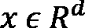 表示，其中 *d* 是数据的整个维度。一个可解释数据表示的二进制向量在数学上表示为 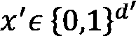。直观地说，算法试图表示人类可解释数据表示的存在或不存在，以解释任何黑盒模型。

*图 4.1* 展示了 LIME 如何尝试将输入图像数据划分为人类可解释的组件，这些组件随后被用来以任何非技术用户都能理解的方式解释黑盒模型：

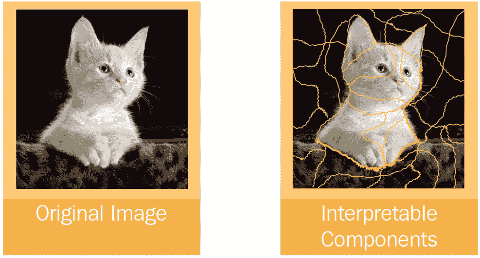

图 4.1 – LIME 如何将图像转换为人类可解释的组件

接下来，让我们讨论如何维持保真度-可解释性权衡。

## 维持保真度-可解释性权衡的平衡

LIME 利用固有的可解释模型，如决策树、线性模型和基于规则的启发式模型，通过视觉或文本工件向非专家用户提供解释。从数学上讲，这种解释是一个可以用表示的模型，其中是所有可能的可解释模型的全集，而的域用另一个二进制向量，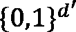表示，它表示可解释组件的存在或不存在。此外，算法还试图衡量解释的**复杂度**及其**可解释性**。例如，即使在可解释模型如决策树中，树的深度是其复杂度的一个度量。

从数学的角度来说，一个可解释模型的复杂度用 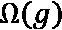 表示。LIME 试图在提供解释的同时保持**局部保真度**。这意味着算法试图复制模型在预测的个体数据实例附近的的行为。因此，从数学上讲，该算法的发明者使用了一个函数，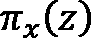，来衡量任何数据实例，，之间的接近程度，从而定义了原始表示，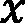周围的局部性。现在，如果概率函数，，定义了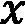属于某个类别的概率，那么为了近似，LIME 算法试图用一个接近函数，，来衡量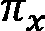的不忠实程度。这个整个操作用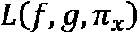函数表示。因此，算法试图最小化局部感知损失函数，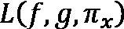，同时保持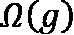为一个低值。这样，它就可以很容易地向任何非专家用户解释。可解释性局部保真度权衡的度量可以用以下数学函数近似：

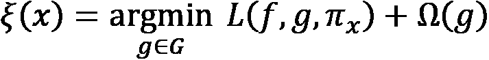

因此，这个权衡度量依赖于可解释模型，，保真度函数，，和复杂度度量，。

## 寻找局部探索

LIME 算法是**模型无关的**。这意味着当我们尝试最小化**局部感知损失函数**，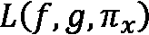，对**f**没有任何假设时。同时，LIME 通过取权重为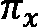的样本来保持局部保真度，同时近似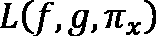。的非零样本被随机均匀抽取，以采样周围的实例。假设存在一个包含非零元素分数的扰动样本，用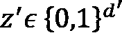表示。算法试图从原始表示，，中恢复样本，以近似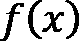。然后，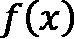被用作解释模型，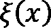的标签。

*图 4.2*展示了在[`arxiv.org/pdf/1602.04938.pdf`](https://arxiv.org/pdf/1602.04938.pdf)原始 LIME 框架论文中的一个例子，它通过视觉表示直观地解释了算法的工作原理：

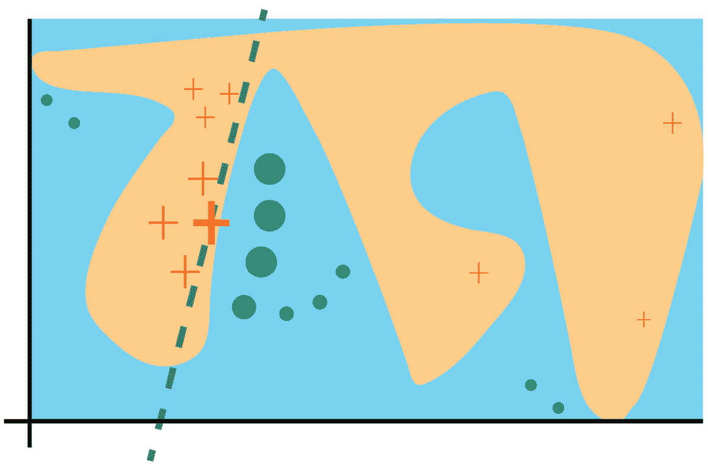

图 4.2 – 直观解释 LIME 算法的工作原理

在*图 4.2*中，分隔浅蓝色和粉红色的曲线被认为是黑盒模型的复杂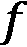决策函数。由于决策函数是非线性的，使用线性模型来近似它并不高效。十字和点代表属于两个不同类别的训练数据。粗十字代表正在解释的推理数据实例。算法通过采样实例来获取使用*f*的预测。然后，算法根据与被解释数据实例的邻近度分配权重。在前面的图中，根据数据实例的邻近度，红色十字和蓝色点的尺寸被调整。因此，采样的实例既更接近*x*，从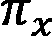中获得更高的权重，又远离它，因此具有较低的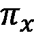权重。原始的黑盒模型可能过于复杂，无法提供全局解释，但 LIME 框架可以提供适合局部数据实例，的解释。通过虚线表示的学习解释在局部上是忠诚的，具有全局视角。

*图 4.3*展示了 LIME 算法的更直观理解。从原始图像中，算法生成了一组扰动数据实例：

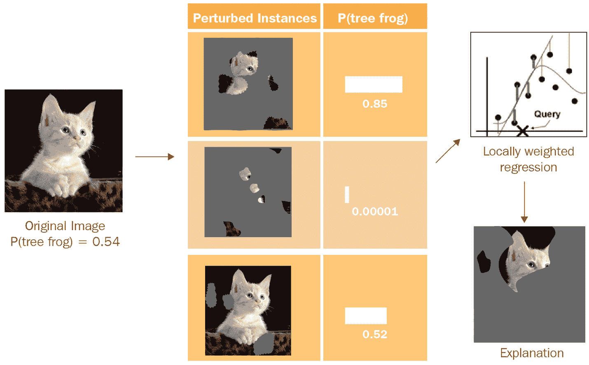

图 4.3 – 使用 LIME 解释的预测

如*图 4.3*所示，扰动实例是通过关闭一些可解释组件创建的。在图像的情况下，如前图所示，这是通过将某些组件变为灰色来实现的。然后，将黑盒模型应用于生成的每个扰动实例，并计算实例被预测为模型最终结果的概率。然后，在数据集上学习一个可解释的模型（例如简单的局部加权线性模型），最后，考虑具有最大正权重的超像素作为最终解释。

在下一节中，让我们讨论为什么 LIME 是一个好的模型解释器。

# 什么使 LIME 成为一个好的模型解释器？

LIME 使非专家用户能够理解不可信的黑盒模型的工作原理。以下 LIME 的特性使其成为一个好的模型解释器：

+   **人类可解释性**：如前节所述，LIME 提供易于理解的解释，因为它提供了一种定性的方法来比较输入数据的组件与模型结果。

+   **模型无关性**：在前几章中，尽管你已经学习了各种特定模型的解释方法，但如果解释方法可以用于为任何黑盒模型提供可解释性，这始终是一个优势。LIME 在提供解释时不对模型做任何假设，并且可以与任何模型一起工作。

+   **局部保真度**：LIME 通过探索被预测的数据实例的邻近性来尝试复制整个模型的行为。因此，它为用于预测的数据实例提供局部可解释性。这对于任何非技术用户理解模型决策过程的准确原因非常重要。

+   **全局直觉**：尽管该算法提供了局部可解释性，但它确实试图向最终用户解释一个代表性集合，从而为模型的运作提供全局视角。SP-LIME 通过解释一组数据实例来提供对模型的全局理解。这将在下一节中更详细地介绍。

既然我们已经了解了 LIME 框架的关键优势，那么在下一节中，让我们讨论 LIME 的子模选择算法，该算法用于提取全局可解释性。

# SP-LIME

为了使解释方法更加可信，对单个数据实例（即局部解释）的解释并不总是足够的，最终用户可能希望对模型有全局的理解，以便对模型的鲁棒性有更高的可靠性。因此，SP-LIME 算法试图在多个多样化、但仔细选择的数据实例集上运行解释，并返回非冗余的解释。

现在，让我提供一个关于 SP-LIME 算法的直观理解。算法认为，通过所有单个局部解释所需的时间是有限的，并且是一个约束。因此，最终用户愿意检查以解释模型的数量是算法的预算，用*B*表示。假设*X*表示实例集合；选择*B*个实例供最终用户分析以进行模型可解释性的任务定义为**选择步骤**。选择步骤与解释的存在无关，并且它需要通过选择一个多样化的代表性实例集来提供*非冗余解释*，以解释模型从全局角度的行为。因此，算法试图避免选择具有相似解释的实例。

从数学上讲，这个想法是通过*解释矩阵*（*W*）来表示的，其中*W* = n * d'，其中*n*是样本数量，*d'*是可解释的人类特征。算法还使用一个*全局重要性组件矩阵*（*I*），其中对于*I*的每个组件*j*，*I(j)*代表解释空间中的全局重要性。直观地说，*I*是以一种方式制定的，为解释数据中的许多实例分配更高的分数。考虑用于解释的重要特征集合用*V*表示。因此，结合所有这些参数，算法试图学习一个*非冗余覆盖直觉函数*，*c(V,W,I)*。非冗余覆盖直觉试图计算至少在集合*V*中的一个实例中出现的所有特征的集体重要性。然而，*选择问题*是关于*最大化加权覆盖函数*的。这由以下方程表示：

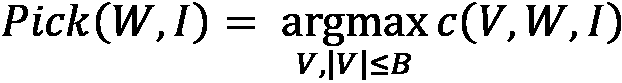

我们在本节中刚刚覆盖的算法的细节可能对某些读者来说理解起来有些令人困惑。然而，直观地说，算法试图覆盖以下步骤：

1.  解释模型在所有实例（*x*）上运行。

1.  计算所有单个组件的全局重要性。

1.  然后，算法通过迭代添加具有最高最大覆盖增益的实例来尝试最大化非冗余覆盖直觉函数（*c*）。

1.  最后，算法试图获得代表性的非冗余解释集（*V*）并将其返回。

在下一节中，我们将通过代码示例介绍如何使用 LIME Python 框架来解决分类问题。

# 使用 LIME 解决分类问题的实际示例

到目前为止，我们已经涵盖了关于 LIME 算法所需的大部分深入概念理解。在本节中，我们将尝试探索用于解释分类问题的 LIME Python 框架。该框架可在 GitHub 上作为开源项目找到[`github.com/marcotcr/lime`](https://github.com/marcotcr/lime)。在 Jupyter 笔记本中使用`pip`安装程序可以轻松安装 LIME：

```py
!pip install lime
```

教程的完整笔记本版本可在 GitHub 仓库[`github.com/PacktPublishing/Applied-Machine-Learning-Explainability-Techniques/blob/main/Chapter04/Intro_to_LIME.ipynb`](https://github.com/PacktPublishing/Applied-Machine-Learning-Explainability-Techniques/blob/main/Chapter04/Intro_to_LIME.ipynb)中找到。然而，现在，我将尝试带你详细了解整个代码。一旦 LIME 框架安装完成，通过导入库快速验证安装是否成功：

```py
import lime
```

如果导入成功，你可以轻松地继续下一步；否则，你需要检查在安装框架时出了什么问题。但通常情况下，你不会遇到任何错误或任何依赖冲突，因为安装库相当直接。对于这个教程，我们将使用*泰坦尼克数据集*([`www.openml.org/search?type=data&sort=runs&id=40945&status=active`](https://www.openml.org/search?type=data&sort=runs&id=40945&status=active))。这是用于预测泰坦尼克号乘客生存的经典机器学习数据集之一。因此，这是一个可以用机器学习解决的问题的二分类问题。尽管这是一个不太复杂的经典数据集，但它包含了所有类型的特征，如*分类*、*有序*、*连续*，甚至某些对分类不相关的*标识符*，这使得这个数据集成为很有趣的工作对象。为了使你更容易执行笔记本，我在代码仓库[`github.com/PacktPublishing/Applied-Machine-Learning-Explainability-Techniques/tree/main/Chapter04/dataset`](https://github.com/PacktPublishing/Applied-Machine-Learning-Explainability-Techniques/tree/main/Chapter04/dataset)中进行了一些轻微修改后下载并提供了数据集。

泰坦尼克数据集

描述泰坦尼克号上个别乘客生存状态的原始泰坦尼克数据集。泰坦尼克数据不包含船员的信息，但它包含了半数乘客的实际年龄。关于泰坦尼克号乘客的数据主要来源于《泰坦尼克号百科全书》。这里使用的数据集由各种研究人员开始。其中一个原始来源是 Eaton & Haas (1994)的《泰坦尼克号：胜利与悲剧》，由 Patrick Stephens Ltd 出版，其中包括由许多研究人员创建并由 Michael A. Findlay 编辑的乘客名单。

UVa 的 Thomas Cason 使用《泰坦尼克号百科全书》对 titanic 数据框进行了大量更新和改进，并在此创建了数据集。一些重复的乘客已被删除，许多错误得到纠正，许多缺失的年龄得到填补，并创建了新的变量。

在安装和导入所有必需的模块后，首先，我们将从目录中加载数据集作为 pandas DataFrame：

```py
data = pd.read_csv('dataset/titanic.csv')
```

当你尝试使用 pandas 的`head`方法可视化 DataFrame 时，你会看到数据集的一个快照，如图*图 4.4*所示。通常，这一步可以帮助你快速了解如何理解你的数据：

```py
data.head()
```

下面的图表展示了用于此例的 pandas DataFrame 的一个快照：

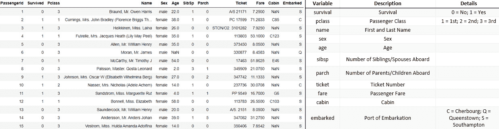

图 4.4 – 以 pandas DataFrame（左侧）和数据字典（右侧）显示数据集

对于这个特定的例子，我们并不关心获得一个高度高效的机器学习模型，而是我们的重点是使用 LIME 在几行代码中生成人类友好的解释。因此，我们将跳过进行严格的**探索性数据分析**（**EDA**）或特征工程步骤。然而，我非常鼓励你们所有人都将这些步骤作为良好的实践。正如我们可以从数据集中看到的那样，某些特征，如*乘客 ID*和*票号*是标识符，可以忽略。*船舱号*特征是一个有趣的特征，特别是因为它可能表明船的某个翼、楼层或侧面更容易受到损害。但是，这个特征是一个稀疏分类特征，单独来看，可能不会非常有帮助，可能需要一些高级的转换或特征工程。因此，为了构建一个简单的模型，我们将删除这个特征。此外，*乘客姓名*对于预测模型没有用，因此我们可以将其删除。有一些分类特征需要转换以获得更好的模型结果。如果你想尝试更多关于特征工程的想法，以下文章可能有所帮助：[`triangleinequality.wordpress.com/2013/09/08/basic-feature-engineering-with-the-titanic-data/`](https://triangleinequality.wordpress.com/2013/09/08/basic-feature-engineering-with-the-titanic-data/).

这里是模型训练前的数据准备代码行：

```py
# Dropping all irrelevant columns
```

```py
data.drop(columns=['PassengerId', 'Name', 'Cabin', 'Ticket'], inplace = True)
```

```py
# Handling missing values
```

```py
data.dropna(inplace=True)
```

```py
# Ensuring that Age and Fare is of type float 
```

```py
data['Age'] = data['Age'].astype('float')
```

```py
data['Fare'] = data['Fare'].astype('float')
```

```py
# Label Encoding features 
```

```py
categorical_feat = ['Sex']
```

```py
# Using label encoder to transform string categories to integer labels
```

```py
le = LabelEncoder()
```

```py
for feat in categorical_feat:
```

```py
    data[feat] = le.fit_transform(data[feat]).astype('int')
```

```py
# One-Hot Encoding Categorical features
```

```py
data = pd.get_dummies(data, columns=['Embarked'])
```

转换后的 DataFrame 在*图 4.5*中显示：

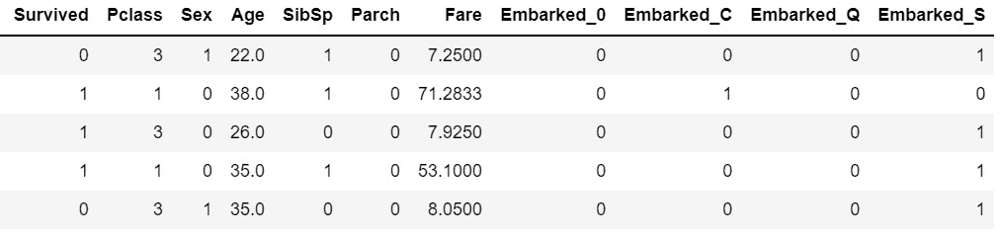

图 4.5 – 基本预处理和特征工程后的 DataFrame 显示

现在，对于模型训练部分，我们将使用 XGBoost 分类器。这是一个集成学习算法，本身不具有可解释性。根据估计器的数量，算法的复杂性可以有所不同。它也可以使用`pip`安装程序轻松安装：

```py
!pip install xgboost
```

将以下代码用于在划分为训练集和测试集后训练模型：

```py
features = data.drop(columns=['Survived'])
```

```py
labels = data['Survived']
```

```py
# Dividing into training-test set with 80:20 split ratio
```

```py
x_train,x_test,y_train,y_test = train_test_split(
```

```py
    features,labels,test_size=0.2, random_state=123)
```

```py
model = XGBClassifier(n_estimators = 300, 
```

```py
                      random_state = 123)
```

```py
model.fit(x_train, y_train)
```

接下来，让我们将![图片 B18216_04_039.png]定义为预测概率分数，该分数将随后被 LIME 框架利用：

```py
predict_fn = lambda x: model.predict_proba(x)
```

为了提供模型解释，我们可以通过几行代码定义 LIME 对象，并解释所需的数据实例：

```py
explainer = lime.lime_tabular.LimeTabularExplainer(
```

```py
    data[features.columns].astype(int).values, 
```

```py
    mode='classification', 
```

```py
    training_labels=data['Survived'],
```

```py
    feature_names=features.columns)
```

```py
exp = explainer.explain_instance(
```

```py
    data.loc[i,features.columns].astype(int).values, 
```

```py
    predict_fn, num_features=5)
```

```py
exp.show_in_notebook(show_table=True)
```

以下图表显示了 LIME 为模型可解释性提供的可视化：

![图 4.6 – LIME 框架提供的模型结果可视化

![图片 B18216_04_006.jpg]

图 4.6 – LIME 框架提供的模型结果可视化

从*图 4.6*中，我们可以看到 LIME 框架仅用几行代码提供的解释。现在，让我们尝试理解这个可视化在告诉我们什么：

+   最左侧的条形图显示了预测概率，这可以被视为模型在做出预测时的置信水平。在*图 4.6*中，对于所选数据实例，模型有 100%的信心认为该乘客会*幸存*。

+   从左数第二个可视化可能是最重要的可视化，它提供了最大的可解释性。它告诉我们最重要的特征是`Sex`特征，其特征重要性得分为 38%，其次是`Age`，其特征重要性得分为 26%。然而，如*图 4.6*所示，对于所选数据实例，`Sex`、`Pclass`（乘客等级）、`Fare`和`Embarked_C`（从瑟堡港出发）特征与从整个数据集中学习到的阈值分数一起，对模型的*幸存*结果做出了贡献。相比之下，蓝色的`Age`特征更倾向于预测结果为*未幸存*，因为该乘客的年龄是 38 岁，通常来说，38 岁以上的乘客在灾难中幸存的机会较低。LIME 模型学习到的阈值特征值也与我们的常识和*先验*知识一致。即使在 100 多年前发生的泰坦尼克号沉船事件中，妇女和儿童被优先考虑使用有限的救生艇逃离沉船。

同样，支付了更高票价的一等舱乘客有更高的优先权使用救生艇，因此有更高的生存机会。所以，提供的模型解释是人性化的，并且与我们之前的信念一致。

+   从左数第三个可视化显示了前五个特征及其相应的值。在这里，橙色突出显示的特征对类别 1 有贡献，而蓝色突出显示的特征对类别 0 有贡献。

+   最右侧的可视化几乎与第二个可视化相同，只是它以不同的格式呈现，并且它还为所选特定数据实例提供了局部解释。

在上一节中，我们讨论了 LIME 也提供了对模型的全面理解，同时提供了局部解释。这是通过 SP-LIME 算法实现的。这可以通过以下几行代码实现：

```py
sp_exp = submodular_pick.SubmodularPick(
```

```py
   explainer, data[features.columns].values, predict_fn,
```

```py
   num_features=5, num_exps_desired=10)
```

```py
[exp.as_pyplot_figure(label=exp.available_labels()[0]) for exp in sp_exp.sp_explanations]
```

*图 4.7* 展示了使用 SP-LIME 获得的可视化：

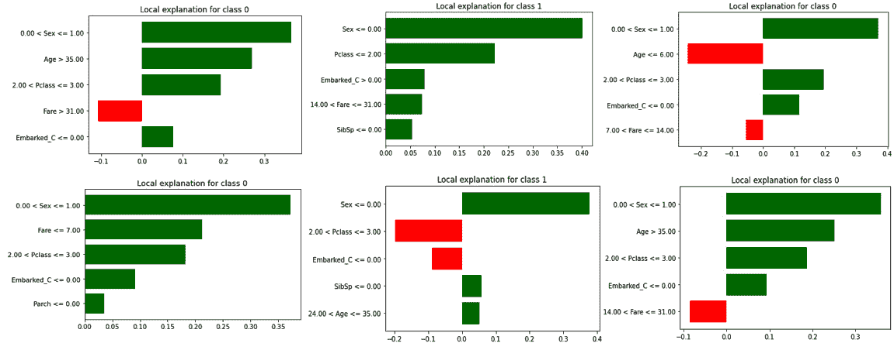

](img/B18216_04_007.jpg)

图 4.7 – 从 SP-LIME 获得的多样化解释的可视化，以获得对模型的全面理解

*图 4.7* 展示了 SP-LIME 代码的输出。SP-LIME 提供了一个多样化的代表性样本集，考虑了模型的不同实例，以获得对黑盒模型的全面视角。这些可视化显示了重要的特征、特征重要性得分，以及每个特征的值范围，以及这些特征如何对任一类别做出贡献。LIME 框架的所有这些属性和特性使其成为向黑盒模型提供模型无关、人类可理解模型可解释性的强大方法。此外，该框架也非常稳健，因此整个算法只需几行代码即可实现。

尽管 LIME 有许多优点，但不幸的是，这个算法也有一些缺点，我们应该意识到。让我们在下一节中讨论它们。

# 潜在的陷阱

在上一节中，我们学习了如何轻松地使用 LIME Python 框架来解释分类问题的黑盒模型。但不幸的是，该算法确实存在某些局限性，并且有一些场景中该算法并不有效：

+   在提供可解释的解释时，特定的可解释数据表示和可解释模型的选择可能仍然存在很多限制。尽管底层训练模型可能仍然被视为黑盒模型，但在解释过程中并没有对模型做出任何假设。然而，某些表示可能不足以表示模型的某些复杂行为。例如，如果我们试图构建一个图像分类器来区分黑白图像和彩色图像，那么超像素的存在与否对于提供解释可能没有帮助。

+   如前所述，LIME 学习一个可解释的模型来提供局部解释。通常，这些可解释的模型是线性和非复杂的。然而，如果底层黑盒模型不是线性的，即使在预测的局部区域，那么 LIME 算法可能就不有效。

+   LIME 解释对输入数据的任何变化都高度敏感。即使输入数据的一点点变化也可能极大地改变 LIME 提供的解释实例。

+   对于某些数据集，LIME 解释并不稳健，即使是对于相似的数据实例，提供的解释也可能完全不同。这可能会阻止最终用户完全依赖 LIME 提供的解释。

+   该算法极其容易受到数据漂移和标签漂移的影响。训练数据和推理数据之间的一点点漂移可能会导致完全不一致的解释。论文《在 LIME 框架中研究数据和标签漂移》的作者*Rahnama*和*Boström*（[`arxiv.org/abs/1910.14421`](https://arxiv.org/abs/1910.14421)）提到了一些可以用来评估 LIME 框架中数据漂移影响的实验。由于这种限制，LIME 解释的近似良好性（也称为*保真度*）被认为是低的。在一个好的解释方法中这是不应该出现的。

+   LIME 提供的解释依赖于算法超参数的选择。与大多数算法类似，即使是 LIME 算法，超参数的选择也会决定所提供解释的质量。对于 LIME 算法来说，超参数调整也是困难的，因为通常采用定性方法来评估 LIME 解释的质量。

有许多研究工作指出了 LIME 算法的其他局限性。我在*参考文献*部分提到了其中一些研究工作。我强烈建议您阅读这些论文，以获取有关算法某些局限性的更多详细信息。

# 摘要

这就带我们结束了这一章。在本章中，我们讨论了 LIME，这是 XAI 中最广泛采用的框架之一。在本章中，我们讨论了算法工作背后的直觉以及使生成的解释对人类友好的算法的一些重要特性。此外，我们还看到了一个端到端的教程，展示了如何使用 LIME 为黑盒分类模型提供可解释性。尽管我们讨论了 LIME 算法的一些局限性，但由于其简单性，LIME 仍然是 XAI 中最受欢迎和最广泛使用的框架之一。因此，对我们来说，讨论这个算法并深入了解框架的工作原理非常重要。

在下一章中，我们将应用 LIME 框架，使用不同类型的数据集来解决其他类型的机器学习问题。

# 参考文献

对于更多信息，请参阅以下资源：

+   *"我应该为什么相信你？"解释任何分类器的预测* by *Ribeiro 等人*：[`arxiv.org/pdf/1602.04938.pdf`](https://arxiv.org/pdf/1602.04938.pdf)

+   *LIME - 本地可解释模型无关解释*：[`homes.cs.washington.edu/~marcotcr/blog/lime/`](https://homes.cs.washington.edu/~marcotcr/blog/lime/)

+   LIME GitHub 项目：[`github.com/marcotcr/lime`](https://github.com/marcotcr/lime)

+   *Rahnama* 和 *Boström* 的研究论文《LIME 框架中的数据与标签偏移研究》: [`arxiv.org/abs/1910.14421`](https://arxiv.org/abs/1910.14421)

+   *LIME 的问题在哪里*：[`towardsdatascience.com/whats-wrong-with-lime-86b335f34612`](https://towardsdatascience.com/whats-wrong-with-lime-86b335f34612)

+   *为什么模型要解释？评估 LIME 的优势和局限性*，作者 *Dieber* 和 *Kirrane*（2020 年）：[`arxiv.org/pdf/2012.00093.pdf`](https://arxiv.org/pdf/2012.00093.pdf)
