# 第六章：使用 SHAP 进行模型可解释性

在前两章中，我们探讨了使用**LIME**框架进行模型无关局部可解释性，以解释黑盒模型。尽管 LIME 仍然是最受欢迎的**可解释人工智能**（**XAI**）算法之一，但我们还讨论了 LIME 方法的一些局限性。在本章中，我们将介绍**SHapley Additive exPlanation**（**SHAP**），这是另一个流行的 XAI 框架，可以为表格、图像和文本数据集提供模型无关的局部可解释性。

**SHAP**基于**Shapley 值**，这是一个在**博弈论**（[`c3.ai/glossary/data-science/shapley-values/`](https://c3.ai/glossary/data-science/shapley-values/)）中广泛使用的概念。尽管 Shapley 值的数学理解可能很复杂，但我将提供一个简单、直观的 Shapley 值和 SHAP 的理解，并更多地关注框架的实践方面。与 LIME 类似，SHAP 也有其优缺点，我们将在本章中讨论。本章将涵盖一个实践教程，将使用 SHAP 解释回归模型。稍后，在第七章*使用 SHAP 在机器学习中实际应用*中，我们将涵盖 SHAP 框架的其他实际应用。

因此，以下是本章讨论的主要主题列表：

+   对 SHAP 和 Shapley 值的直观理解

+   使用 SHAP 的模型可解释性方法

+   优点和局限性

+   使用 SHAP 解释回归模型

现在，让我们开始吧！

# 技术要求

与本章相关的代码教程和必要资源可以从 GitHub 仓库下载或克隆：[`github.com/PacktPublishing/Applied-Machine-Learning-Explainability-Techniques/tree/main/Chapter06`](https://github.com/PacktPublishing/Applied-Machine-Learning-Explainability-Techniques/tree/main/Chapter06)。Python 和 Jupyter 笔记本用于实现本章涵盖的理论概念的实际应用。但我建议您在深入理解本章内容之后再运行笔记本。此外，在开始本章的实践教程部分之前，请先查看*SHAP 勘误表*部分：[`github.com/PacktPublishing/Applied-Machine-Learning-Explainability-Techniques/blob/main/Chapter06/SHAP_ERRATA/ReadMe.md`](https://github.com/PacktPublishing/Applied-Machine-Learning-Explainability-Techniques/blob/main/Chapter06/SHAP_ERRATA/ReadMe.md)。

# 对 SHAP 和 Shapley 值的直观理解

如在 *第一章* 中所讨论的，*可解释性技术的根本概念*，解释黑盒模型对于增加人工智能的采用是必要的。那些模型无关且能够从全局视角提供局部可解释性的算法是机器学习 (ML) 中可解释性技术的理想选择。这就是为什么 LIME 在 XAI 中如此受欢迎。SHAP 是机器学习中另一种流行的可解释性技术，在特定场景下，它比 LIME 更有效。在本节中，我们将讨论 SHAP 框架的直观理解以及它是如何提供模型可解释性的。

## SHAP 和 Shapley 值的介绍

SHAP 框架是由 *Scott Lundberg* 和 *Su-In Lee* 在他们的研究工作中引入的，该研究工作为 *《解释模型预测的统一方法》* ([`arxiv.org/abs/1705.07874`](https://arxiv.org/abs/1705.07874))。这项研究于 2017 年发表。SHAP 基于合作博弈论中的 Shapley 值概念，但与 LIME 框架不同，它考虑了 *加性特征重要性*。根据定义，Shapley 值是 *在特征空间中所有可能值上每个特征值的平均边际贡献*。Shapley 值的数学理解比较复杂，可能会让大多数读者感到困惑。话虽如此，如果你对 Shapley 值的深入数学理解感兴趣，我们建议你阅读名为 *"A Value for n-Person Games." Contributions to the Theory of Games 2.28 (1953), by Lloyd S. Shapley* 的研究论文。在下文中，我们将通过一个非常简单的例子来获得 Shapley 值的直观理解。

## 什么是 Shapley 值？

在本节中，我将通过一个非常简单且易于理解的例子来解释 Shapley 值。假设 Alice、Bob 和 Charlie 是三位朋友，他们作为一个团队参加 Kaggle 竞赛，使用机器学习解决给定问题以赢得一定的奖金。他们的共同目标是赢得比赛并获得奖金。他们在机器学习的所有领域都不擅长，因此以不同的方式做出了贡献。现在，如果他们赢得比赛并获得奖金，*他们将如何确保奖金的公平分配，考虑到他们的个人贡献？* *他们将如何衡量他们为同一目标所做的个人贡献？* 这些问题的答案可以通过 Shapley 值给出，这些值是由 Lloyd Shapley 在 1951 年引入的。

下面的图表为我们提供了该场景的视觉说明：

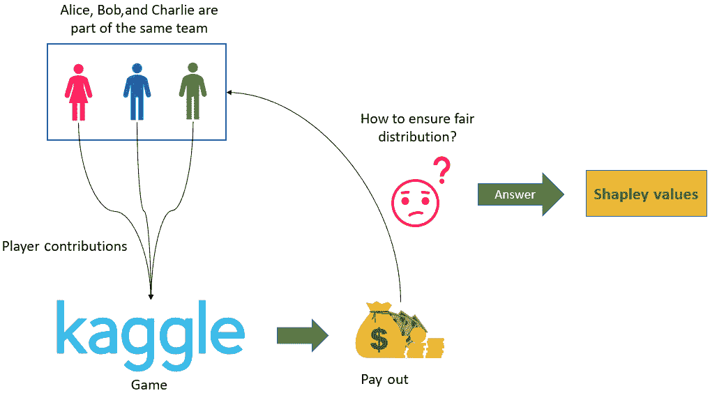

图 6.1 – "什么是 Shapley 值？"部分讨论的场景的视觉说明

因此，在这种情况下，Alice、Bob 和 Charlie 是同一队的成员，在玩同一款游戏（即 Kaggle 比赛）。在博弈论中，这被称为**联盟博弈**。比赛的奖金是他们的**奖金分配**。因此，Shapley 值告诉我们每个玩家对奖金分配的平均贡献，以确保公平分配。但**为什么不是将奖金平均分配给所有玩家**呢？嗯，由于贡献并不相等，所以平均分配奖金是不**公平**的。

### 决定奖金分配

现在，我们如何决定分配奖金的最公平方式呢？一种方法是假设 Alice、Bob 和 Charlie 按照 Alice 首先加入，然后是 Bob，最后是 Charlie 的顺序加入游戏。假设如果 Alice、Bob 和 Charlie 单独参加，他们分别可以获得 10 分、20 分和 25 分。但如果是只有 Alice 和 Bob 组队，他们可能获得 40 分。而 Alice 和 Charlie 一起可以得到 30 分，Bob 和 Charlie 一起可以得到 50 分。当三人共同合作时，他们才能获得 90 分，这足以让他们赢得比赛。

*图 6.2*展示了每种情况下的得分点数。我们将利用这些值来计算每个玩家的平均边际贡献：

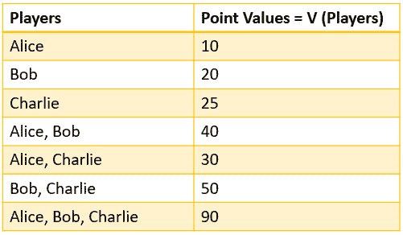

图 6.2 – 所有可能玩家组合的贡献值

从数学上讲，如果我们假设有 *N* 名玩家，其中 *S* 是玩家的联盟子集，而 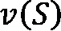 是 *S* 玩家的总价值，那么根据 Shapley 值公式，玩家 *i* 的边际贡献如下所示：

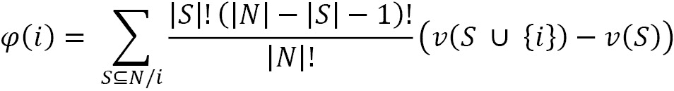

Shapley 值的方程可能看起来很复杂，但让我们用我们的例子来简化它。请注意，每个玩家开始游戏的顺序很重要，因为 Shapley 值试图考虑每个玩家的顺序来计算边际贡献。

现在，对于我们的例子，爱丽丝的贡献可以通过计算爱丽丝对最终分数造成的影响来计算。因此，贡献是通过计算爱丽丝在游戏中和不在游戏中的得分差异来计算的。此外，当爱丽丝在游戏中时，她可以单独玩或者与其他人组队。当爱丽丝在游戏中时，她可以创造的价值可以表示为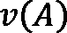。同样，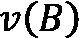和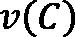分别表示鲍勃和查理创造的个体价值。现在，当爱丽丝和鲍勃组队时，我们只能通过从整体贡献中减去鲍勃的贡献来计算爱丽丝的贡献。这可以表示为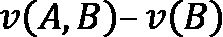。如果三个人一起玩，爱丽丝的贡献给出为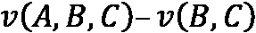。

考虑到爱丽丝、鲍勃和查理玩游戏的所有可能排列顺序，爱丽丝的边际贡献是在所有可能场景中她个体贡献的平均值。这如图*6.3*所示：

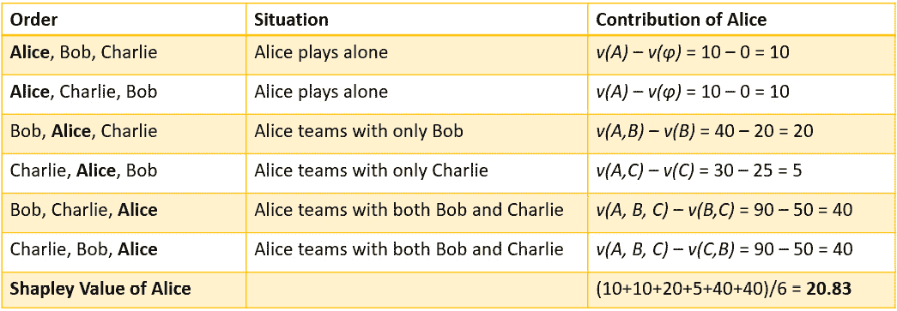

图 6.3 – 考虑所有可能场景的爱丽丝的 Shapley 值

因此，爱丽丝的整体贡献将是她在所有可能场景中的边际贡献，这也恰好是 Shapley 值。对于爱丽丝来说，Shapley 值是**20.83**。同样，我们可以计算出鲍勃和查理的边际贡献，如图*6.4*所示：

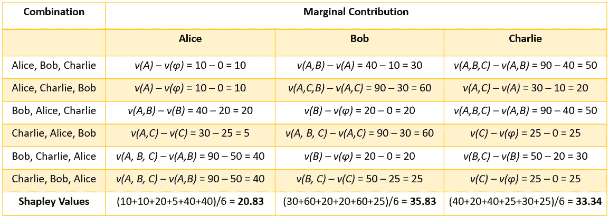

图 6.4 – 爱丽丝、鲍勃和查理的边际贡献

希望这不难理解！有一点需要注意，即爱丽丝、鲍勃和查理的边际贡献之和应该等于他们三个人共同做出的总贡献。现在，让我们尝试在机器学习的背景下理解 Shapley 值。

## 机器学习中的 Shapley 值

为了理解 Shapley 值在机器学习中对解释模型预测的重要性，我们将尝试修改我们用于理解 Shapley 值的关于爱丽丝、鲍勃和查理的例子。我们可以将爱丽丝、鲍勃和查理视为在用于训练模型的**数据集中存在的三个不同的特征**。在这种情况下，**玩家贡献**将是**每个特征的贡献**。**游戏**或 Kaggle 比赛将是**黑盒机器学习模型**，**收益**将是**预测**。因此，如果我们想了解**每个特征对模型预测的贡献**，我们将使用**Shapley 值**。

将*图 6.1*的修改用于表示机器学习背景下的 Shapley 值，如图*6.5*所示：

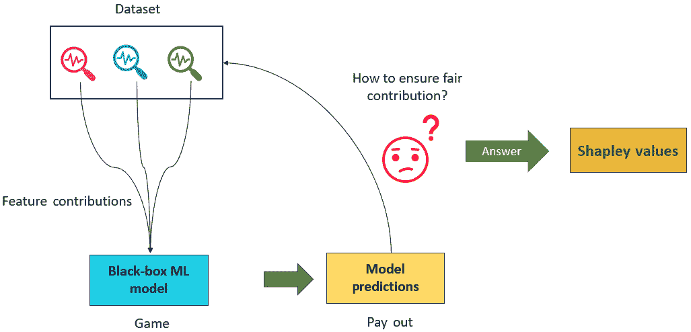

图 6.5 – 在机器学习背景下理解 Shapley 值

因此，Shapley 值帮助我们理解每个特征对黑盒机器学习模型预测结果的集体贡献。通过使用 Shapley 值，我们可以通过估计特征贡献来解释黑盒模型的工作原理。

### Shapley 值的性质

现在我们已经对 Shapley 值有了直观的理解，并且我们已经学习了如何计算 Shapley 值，我们还应该了解 Shapley 值的性质：

+   **效率**：Shapley 值的总和或每个特征的边际贡献应该等于总联盟的价值。例如，在*图 6.4*中，我们可以看到 Alice、Bob 和 Charlie 的 Shapley 值总和等于当 Alice、Bob 和 Charlie 一起组队时获得的总联盟价值。

+   **对称性**：每个玩家都有公平的机会以任何顺序加入游戏。在*图 6.4*中，我们可以看到考虑了所有玩家的序列的所有排列。

+   **虚拟玩家**：如果一个特定的特征无论联盟组如何都不会改变预测值，那么该特征的 Shapley 值为*0*。

+   **可加性**：对于任何具有合并支付的游戏，Shapley 值也会合并。这表示为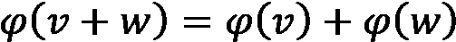，然后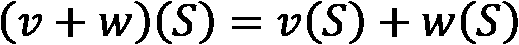。例如，对于机器学习中的随机森林算法，可以通过计算每个单独的树并取平均值来计算特定特征的 Shapley 值，从而找到整个随机森林的加性 Shapley 值。

因此，这些是 Shapley 值的重要性质。接下来，让我们讨论 SHAP 框架，了解它远不止是 Shapley 值的使用。

## SHAP 框架

之前，我们讨论了 Shapley 值是什么以及它们如何在机器学习中使用。现在，让我们介绍 SHAP 框架。虽然 SHAP 通常用作 XAI 工具，为个别预测提供局部可解释性，但 SHAP 还可以通过汇总个别预测提供全局解释。此外，SHAP 是*模型无关的*，这意味着它不对黑盒模型中使用的算法做出任何假设。该框架的创造者广泛提出了两种模型无关的近似方法，如下所示：

+   **SHAP 解释器**：这是基于*Shapley 采样值*。

+   **KernelSHAP 解释器**：这是基于*LIME 方法*。

该框架还包括以下*特定模型*的可解释性方法：

+   **线性 SHAP**：这是针对具有独立特征的线性模型。

+   **Tree SHAP**：这是一个比 SHAP 解释器更快的算法，用于计算树算法和基于树的集成学习算法的 SHAP 值。

+   **Deep SHAP**：这是一个比 SHAP 解释器更快的算法，用于计算深度学习模型的 SHAP 值。

除了这些方法之外，SHAP 还使用有趣的可视化方法来解释 AI 模型。我们将在下一节中更详细地介绍这些方法。但有一点需要注意，Shapley 值的计算在计算上非常昂贵，算法的复杂度为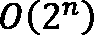，其中*n*是特征的数量。所以，如果数据集有大量特征，计算 Shapley 值可能需要很长时间！然而，SHAP 框架使用近似技术来有效地计算 Shapley 值。与 LIME 框架相比，SHAP 提供的解释更加稳健。让我们进入下一节，我们将讨论 SHAP 在多种类型数据上使用的各种模型可解释性方法。

# 使用 SHAP 的模型可解释性方法

在阅读上一节之后，您已经对 SHAP 和 Shapley 值有了了解。在本节中，我们将讨论使用 SHAP 的各种模型可解释性方法。数据可视化是解释复杂算法工作原理的重要方法。SHAP 利用各种有趣的数据可视化技术来表示近似的 Shapley 值，以解释黑盒模型。因此，让我们讨论一些 SHAP 框架中使用的流行可视化方法。

## SHAP 中的可视化

如前所述，SHAP 可以用于模型的全球可解释性和推理数据实例的局部可解释性。现在，除非我们使用直观的视觉表示，否则 SHAP 算法生成的值很难理解。可视化方法的选择取决于全球可解释性或局部可解释性的选择，我们将在本节中介绍。

### 使用特征重要性条形图的全球可解释性

分析数据集中存在的最具影响力的特征总是有助于我们理解算法相对于底层数据的工作原理。SHAP 提供了一种有效的方法，通过 Shapley 值来找到特征重要性。因此，特征重要性条形图按重要性降序显示重要特征。此外，SHAP 提供了一种独特的方式来使用**层次聚类**（[`www.displayr.com/what-is-hierarchical-clustering/`](https://www.displayr.com/what-is-hierarchical-clustering/)）展示特征交互。这些特征聚类方法帮助我们可视化一组共同影响模型结果的特征。这非常有趣，因为使用 Shapley 值的核心好处之一就是分析多个特征组合的加性影响。然而，对于全球可解释性，特征重要性图有一个缺点。因为这个方法只考虑平均绝对 Shapley 值来估计特征重要性，所以它不显示某些特征是否以负面的方式共同影响模型。

下面的图表说明了使用 SHAP 进行特征重要性图和特征聚类图可视化的示例：

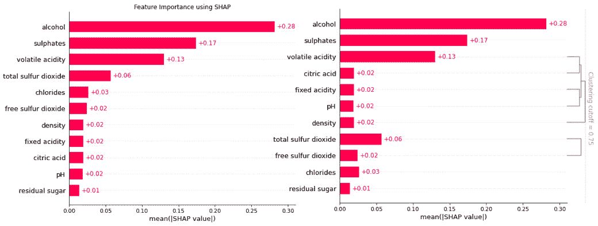

图 6.6 – 用于全局可解释性的特征重要性图（左侧）和用于全局可解释性的特征聚类图（右侧）

接下来，让我们探索 SHAP 队列图。

### 使用队列图进行全局可解释性

有时，分析数据子集是数据分析的重要部分。SHAP 提供了一种非常有趣的方法，将数据分组到某些定义好的队列中，以分析特征重要性。我发现这是 SHAP 中的一个独特选项，非常有帮助！这是现有特征重要性可视化的扩展，并突出了每个队列的特征重要性，以便更好地比较。

*图 6.7* 展示了从数据中定义的两个队列的比较队列图：

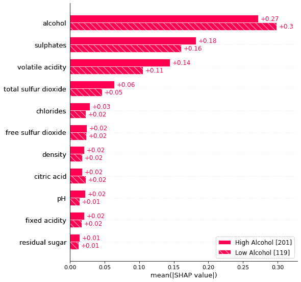

图 6.7 – 用于比较两个队列特征重要性的队列图可视化

接下来，我们将探索 SHAP 热图图。

### 使用热图图进行全局可解释性

为了在更细粒度的层面上理解所有特征对模型的整体影响，热图可视化非常有用。SHAP 热图可视化显示了每个特征值如何积极或消极地影响结果。此外，该图还包括一个折线图，以显示模型预测如何随着特征值的积极或消极影响而变化。然而，对于非技术用户来说，这种可视化可能真的很难解释。这是这种可视化方法的缺点之一。

*图 6.8* 说明了 *SHAP 热图可视化*：

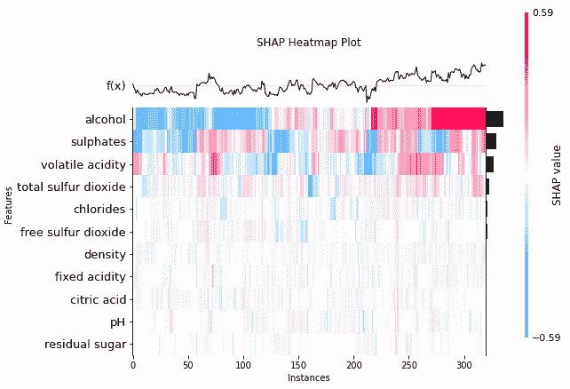

图 6.8 – SHAP 热图图

使用 SHAP 进行全局可解释性的另一种流行的可视化选择是摘要图。让我们在下一节讨论摘要图。

### 使用摘要图进行全局可解释性

摘要图是 SHAP 提供的一种用于提供黑盒模型全局可解释性的可视化方法。它是特征重要性图的良好替代品，不仅包括重要的特征，还包括数据集中这些特征的影响范围。颜色条表示特征的影响。以特定颜色突出显示对模型结果产生积极影响的特征，而以另一种对比颜色表示对模型结果产生负面影响的特征。每个特征的横向小提琴图显示了每个数据实例的特征 Shapley 值的分布。

下面的屏幕截图说明了 *SHAP 摘要图*：

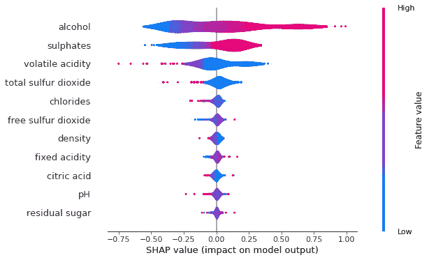

图 6.9 – SHAP 小提琴总结图

在下一节中，我们将讨论 SHAP 依赖性图。

### 使用依赖性图进行全局可解释性

在某些情况下，分析特征之间的相互作用以及这种相互作用如何影响模型结果是很重要的。因此，SHAP 特征依赖性图显示了模型结果随特定特征的变化。这些图类似于在*第二章*“模型可解释性方法”中介绍的*部分依赖性图*。此图可以帮助发现特征值之间的有趣交互模式或趋势。用于选择颜色图的特征由算法自动根据与特定选定特征的交互选择。

*图 6.10* 展示了一个 SHAP 依赖性图：

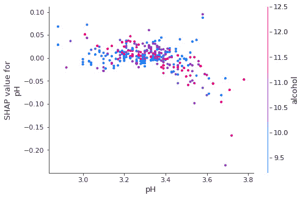

图 6.10 – pH 特征的 SHAP 依赖性图

在这个例子中，选定的特征是*pH*，用于选择颜色图的特征是*alcohol*。因此，该图告诉我们，随着*pH*的增加，*alcohol*值也会增加。这将在下一节中更详细地介绍。

在下一节中，我们将探讨用于局部可解释性的 SHAP 可视化方法。

### 使用条形图进行局部可解释性

到目前为止，我们已经介绍了 SHAP 提供的各种可视化技术，用于提供模型的全球概述。然而，与 LIME 类似，SHAP 也是模型无关的，旨在提供局部可解释性。SHAP 提供了一些可视化方法，可以应用于推理数据以实现局部可解释性。使用 SHAP 条形图进行局部特征重要性分析是此类局部可解释性方法之一。此图可以帮助我们分析数据中存在的特征的正负影响。对模型结果产生正面影响的特征以一种颜色（默认为粉红色）突出显示，而对模型结果产生负面影响的特征则使用另一种颜色（默认为蓝色）表示。此外，正如我们之前讨论的，如果任何特征的总和值为零，这表明该特征根本不影响模型结果。此外，条形图以零为中心，以显示数据中存在的特征的贡献。

以下图表显示了用于局部可解释性的*SHAP 特征重要性条形图*：

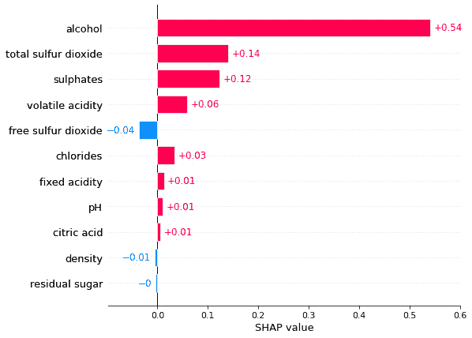

图 6.11 – 用于局部可解释性的 SHAP 特征重要性条形图

接下来，让我们介绍另一种用于局部可解释性的 SHAP 可视化。

### 使用瀑布图进行局部可解释性

条形图并不是 SHAP 为局部可解释性提供的唯一可视化方式。相同的信息可以使用瀑布图来显示，这可能看起来更吸引人。也许，唯一的区别是瀑布图不是以零为中心，而条形图是以零为中心。否则，我们得到基于 Shapley 值的相同特征重要性，以及特定特征对模型结果的正向或负向影响。

*图 6.12* 展示了用于局部可解释性的 *SHAP 瀑布图*：

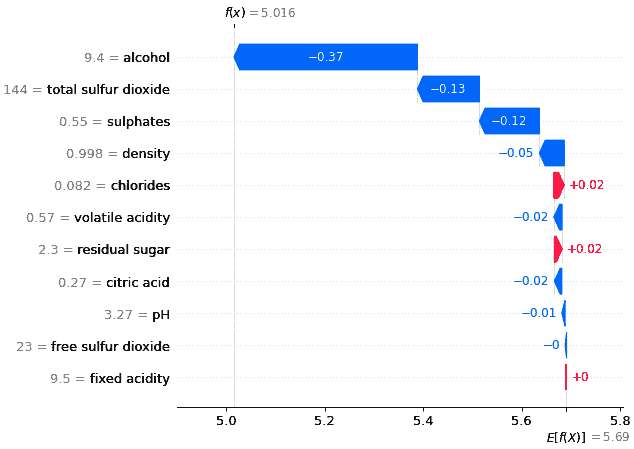

图 6.12 – 用于局部可解释性的 SHAP 瀑布图

接下来，我们将讨论 SHAP 中的力图可视化。

### 使用力图的局部可解释性

我们还可以使用力图来代替瀑布图或条形图来解释局部推理数据。使用力图，我们可以看到模型预测，用 *f(x)* 表示，如图 *图 6.13* 所示。以下图中的 *基础值* 代表模型的平均预测结果。当局部数据实例中不包含特征时，实际上使用的是基础值。因此，使用力图，我们还可以看到预测结果与基础值之间的距离。此外，我们还可以看到特征影响，如图中某些试图增加模型预测（在 *图 6.13* 中用粉色表示）的特征的视觉高亮，以及那些试图降低预测值（在 *图 6.13* 中用绿色表示）并对模型有负面影响的其他重要特征。

因此，*图 6.13* 展示了 SHAP 中的样本力图可视化：

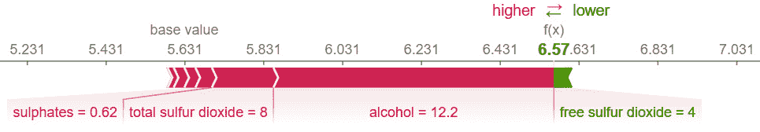

图 6.13 – 用于局部可解释性的 SHAP 力图

尽管力图在视觉上可能看起来非常有趣，但如果数据集中包含许多以正向或负向方式影响模型结果的特征，我们建议使用条形图或瀑布图。

### 使用决策图的局部可解释性

解释某事最简单的方法就是将其与参考值进行比较。到目前为止，在条形图、瀑布图甚至力图中，我们没有看到任何用于底层特征的参考值。然而，为了找出特征值是正向还是负向影响模型结果，算法实际上是在尝试将推理数据的特征值与训练模型特征值的平均值进行比较。因此，这是我们未在所涵盖的三个局部可解释性可视化图中显示的参考值。但 SHAP 决策图帮助我们比较局部数据实例的特征值与训练数据集的平均特征值。此外，决策图显示了特征值的偏差、模型预测以及特征值与参考值偏差的方向。如果偏差方向向右，这表明特征正向影响模型结果；如果偏差方向向左，这表示特征对模型结果的负向影响。使用不同的颜色突出显示正向或负向影响。如果没有偏差，则实际上特征不会影响模型结果。

以下图表说明了使用决策图比较两个不同的数据实例以提供局部可解释性的用法：

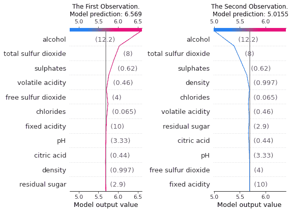


图 6.14 – SHAP 决策图用于局部可解释性

到目前为止，你已经看到了 SHAP 为 ML 模型的全球和局部可解释性提供的各种可视化方法。现在，让我们讨论 SHAP 中提供的各种解释器类型。

## SHAP 中的解释器

在上一节中，我们探讨了如何使用 SHAP 中可用的数据可视化技术来提供可解释性。但可视化方法的选择也可能取决于解释器算法的选择。如我们之前讨论的，SHAP 提供特定于模型和模型无关的可解释性。但该框架具有多个解释器算法，可以应用于不同的模型和不同类型的数据集。在本节中，我们将介绍 SHAP 提供的各种解释器算法。

### TreeExplainer

TreeExplainer 是 **Tree SHAP 算法** ([`arxiv.org/pdf/1802.03888.pdf`](https://arxiv.org/pdf/1802.03888.pdf)) 的快速实现，用于计算树和基于树的集成学习算法的 Shapley 值。该算法对数据集中存在的特征之间的特征依赖性做出了许多不同的假设。仅支持基于树的算法，如 *随机森林*、*XGBoost*、*LightGBM* 和 *CatBoost*。该算法依赖于在本地编译的 C 扩展或外部模型包内部的快速 C++ 实现，但它比传统的基于 Shapley 值的解释器更快。通常，它用于训练在结构化数据上用于分类和回归问题的基于树的模型。

### DeepExplainer

与 LIME 类似，SHAP 也可以应用于在非结构化数据上训练的深度学习模型，例如图像和文本。SHAP 使用基于 **Deep SHAP 算法** 的 DeepExplainer 来解释深度学习模型。DeepExplainer 算法是为深度学习模型近似 SHAP 值而设计的。该算法是 **DeepLIFT 算法** ([`arxiv.org/abs/1704.02685`](https://arxiv.org/abs/1704.02685)) 的修改版。框架的开发者提到，Deep SHAP 算法的实现与原始 DeepLIFT 算法略有不同。它使用背景样本的分布而不是单个参考值。此外，Deep SHAP 算法还使用 Shapley 方程来线性化乘法、除法、最大值、softmax 等计算。该框架主要支持 TensorFlow、Keras 和 PyTorch 等深度学习框架。

### GradientExplainer

DeepExplainer 并不是 SHAP 中唯一可以与深度学习模型一起使用的解释器。GradientExplainer 也可以与深度学习模型一起工作。该算法使用 **预期梯度** 的概念来解释模型。预期梯度是 **集成梯度** ([`arxiv.org/abs/1703.01365`](https://arxiv.org/abs/1703.01365))、SHAP 和 **SmoothGrad** ([`arxiv.org/abs/1706.03825`](https://arxiv.org/abs/1706.03825)) 的扩展，这些算法将这些想法结合成一个单一的预期值方程。因此，与 DeepExplainer 类似，可以使用整个数据集作为背景分布样本，而不是单个参考样本。这允许模型通过数据单个样本和要解释的当前输入数据实例之间的线性函数进行近似。由于假设输入特征是独立的，预期梯度将计算近似的 SHAP 值。

对于模型可解释性，具有更高 SHAP 值的特征值会被突出显示，因为这些特征对模型的输出有积极的贡献。对于如图像这样的非结构化数据，对模型预测贡献最大的像素位置会被突出显示。通常，GradientExplainer 比 DeepExplainer 慢，因为它做出了不同的近似假设。

以下图表展示了在图像上训练的分类模型的局部可解释性的一个样本 GradientExplainer 可视化：

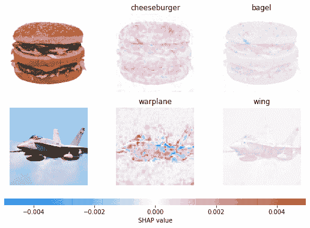

图 6.15 – SHAP GradientExplainers 用于局部可解释性所使用的可视化

接下来，让我们讨论 SHAP KernelExplainers。

### KernelExplainer

SHAP 中的 KernelExplainers 使用 **Kernel SHAP** 方法提供模型无关的可解释性。为了估计任何模型的 SHAP 值，Kernel SHAP 算法利用一个特别加权的局部线性回归方法来计算特征重要性。这种方法与我们在 *第四章* 中讨论的 LIME 算法类似，即 *LIME for Model Interpretability*。Kernel SHAP 和 LIME 之间的主要区别在于它们采用的方法来为回归模型中的实例分配权重。

在 LIME 中，权重是根据局部数据实例与原始实例的接近程度来分配的。而在 Kernel SHAP 中，权重是根据所使用特征的联盟的 Shapley 估计值来分配的。简单来说，LIME 是基于孤立特征分配权重，而 SHAP 考虑了特征的组合效应来分配权重。KernelExplainer 比特定模型算法慢，因为它不对模型类型做出任何假设。

### LinearExplainer

SHAP LinearExplainer 是为计算线性模型的 SHAP 值而设计的，以分析特征间的相关性。LinearExplainer 还支持联盟特征重要性的特征协方差矩阵的估计。然而，对于高维数据集，找到特征相关性可能会非常耗费计算资源。但 LinearExplainers 由于使用采样来估计一个转换，因此它们既快又高效。然后，这个转换被用来解释线性模型的任何结果。

因此，我们已经讨论了 SHAP 中各种解释器的理论方面。有关这些解释器的更多信息，我强烈建议您查看[`shap-lrjball.readthedocs.io/en/docs_update/api.html`](https://shap-lrjball.readthedocs.io/en/docs_update/api.html)。在下一章中，我们将通过 GitHub 上的代码教程来介绍 SHAP 解释器的实际应用，我们将实现 SHAP 解释器来解释在不同类型数据集上训练的模型。在下一节中，我们将介绍一个关于如何使用 SHAP 解释回归模型的实际教程，让您了解如何应用 SHAP 来提高模型的可解释性。

# 使用 SHAP 解释回归模型

在上一节中，我们学习了 SHAP 中用于解释机器学习模型的不同可视化和解释器。现在，我将向您展示如何使用 SHAP 提供模型可解释性的实际操作。该框架作为开源项目在 GitHub 上提供：[`github.com/slundberg/shap`](https://github.com/slundberg/shap)。您可以在[`shap-lrjball.readthedocs.io/en/docs_update/index.html`](https://shap-lrjball.readthedocs.io/en/docs_update/index.html)获取 API 文档。完整的教程在 GitHub 仓库[`github.com/PacktPublishing/Applied-Machine-Learning-Explainability-Techniques/blob/main/Chapter06/Intro_to_SHAP.ipynb`](https://github.com/PacktPublishing/Applied-Machine-Learning-Explainability-Techniques/blob/main/Chapter06/Intro_to_SHAP.ipynb)中提供。我强烈建议您阅读这一部分并边读边执行代码。

## 设置 SHAP

在 Python 中安装 SHAP 可以通过使用以下命令在您的控制台中通过 pip 安装器轻松完成：

```py
pip install shap
```

由于教程需要您安装其他 Python 框架，如果尚未安装，您也可以尝试以下命令从 Jupyter 笔记本本身安装教程所需的全部必要模块：

```py
!pip install --upgrade pandas numpy matplotlib seaborn scikit-learn shap
```

现在，让我们导入 SHAP 并检查其版本：

```py
import shap
```

```py
print(f"Shap version used: {shap.__version__}")
```

我在这个教程中使用的版本是 *0.40.0*。

请注意，由于版本不同，API 可能会有所变化，或者您可能会遇到不同的错误。因此，如果您遇到此类问题，我建议您查看框架的最新文档。我还在仓库中添加了**SHAP 错误列表**([`github.com/PacktPublishing/Applied-Machine-Learning-Explainability-Techniques/tree/main/Chapter06/SHAP_ERRATA`](https://github.com/PacktPublishing/Applied-Machine-Learning-Explainability-Techniques/tree/main/Chapter06/SHAP_ERRATA))，以提供对 SHAP 框架已知问题的解决方案。

## 检查数据集

对于这个教程，我们将使用来自 Kaggle 的*红葡萄酒质量数据集*：[`www.kaggle.com/uciml/red-wine-quality-cortez-et-al-2009`](https://www.kaggle.com/uciml/red-wine-quality-cortez-et-al-2009)。数据集已经添加到代码仓库中，以便您可以轻松访问数据。这个特定的数据集包含了关于葡萄牙*Vinho Verde*红葡萄酒变种的详细信息，并且它来源于原始的 UCI 数据源[`archive.ics.uci.edu/ml/datasets/wine+quality`](https://archive.ics.uci.edu/ml/datasets/wine+quality)。

葡萄酒质量数据集

这个数据集的功劳归功于*P. Cortez, A. Cerdeira, F. Almeida, T. Matos 和 J. Reis*。通过数据挖掘物理化学特性来建模葡萄酒偏好。

我们将使用这个数据集来解决一个回归问题。我们将数据作为 pandas DataFrame 加载，并进行初步检查：

```py
data = pd.read_csv('dataset/winequality-red.csv')
```

```py
data.head()
```

*图 6.16*展示了数据的快照：

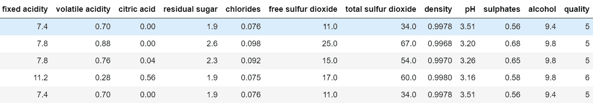

图 6.16 – 葡萄酒质量数据集的 pandas DataFrame 快照

我们可以使用以下命令来检查数据集的一些快速信息：

```py
data.info()
```

这将产生以下输出：

```py
RangeIndex: 1599 entries, 0 to 1598
```

```py
Data columns (total 12 columns):
```

```py
 #   Column                Non-Null Count  Dtype  
```

```py
---  ------                --------------  -----  
```

```py
 0   fixed acidity         1599 non-null   float64
```

```py
 1   volatile acidity      1599 non-null   float64
```

```py
 2   citric acid           1599 non-null   float64
```

```py
 3   residual sugar        1599 non-null   float64
```

```py
 4   chlorides             1599 non-null   float64
```

```py
 5   free sulfur dioxide   1599 non-null   float64
```

```py
 6   total sulfur dioxide  1599 non-null   float64
```

```py
 7   density               1599 non-null   float64
```

```py
 8   pH                    1599 non-null   float64
```

```py
 9   sulphates             1599 non-null   float64
```

```py
 10  alcohol               1599 non-null   float64
```

```py
 11  quality               1599 non-null   int64  
```

```py
dtypes: float64(11), int64(1)
```

```py
memory usage: 150.0 KB
```

如您所见，我们的数据集由*11 个数值特征*和*1,599 条数据记录*组成。回归模型将要学习的目标结果是葡萄酒的*质量*，这是一个*整数特征*。尽管我们使用这个数据集来解决回归问题，但同样的问题也可以被视为分类问题，并且可以使用相同的基础数据。

本教程的目的不是构建一个极其高效的模型，而是考虑任何模型并使用 SHAP 来解释模型的工作原理。因此，我们将跳过 EDA、数据归一化、异常值检测甚至特征工程步骤，这些步骤对于构建一个健壮的机器学习模型是至关重要的。但是，数据集中的缺失值可能会给 SHAP 算法带来问题。因此，我建议至少快速检查缺失值：

```py
sns.displot(
```

```py
    data=data.isna().melt(value_name="missing"),
```

```py
    y="variable",
```

```py
    hue="missing",
```

```py
    multiple="fill",
```

```py
    aspect=1.5
```

```py
)
```

```py
plt.show()
```

上述代码行将产生以下图表作为其输出：

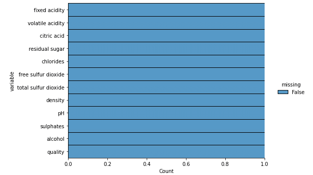

图 6.17 – 数据集的缺失值可视化

幸运的是，数据集没有缺失值；否则，我们可能需要在进一步处理之前处理这个问题。但由于数据没有重大问题，我们可以直接进行建模步骤。

## 训练模型

由于我没有为这个数据集预训练的模型，我想构建一个简单的随机森林模型。我们可以使用 80:20 的分割比例将模型分为训练集和测试集：

```py
features = data.drop(columns=['quality'])
```

```py
labels = data['quality']
```

```py
# Dividing the data into training-test set with 80:20 split ratio
```

```py
x_train,x_test,y_train,y_test = train_test_split(
```

```py
    features,labels,test_size=0.2, random_state=123)
```

要使用随机森林算法，我们需要从 scikit-learn 模块中导入此算法，然后在训练数据上拟合回归模型：

```py
from sklearn.ensemble import RandomForestRegressor
```

```py
model = RandomForestRegressor(n_estimators=2000, 
```

```py
                              max_depth=30, 
```

```py
                              random_state=123)
```

```py
model.fit(x_train, y_train)
```

重要提示

考虑到这个笔记本的目标，我们并没有进行广泛的超参数调整过程。但我强烈建议您为您的用例执行所有必要的最佳实践，如*数据探索性分析（EDA）、特征工程、超参数调整、交叉验证*等。

模型训练完成后，我们将使用**确定系数**（**R2 系数**）的指标对模型进行快速评估：

```py
model.score(x_test, y_test)
```

获得的模型评分大约为 0.5，这表明模型效率不高。因此，对于此类模型，模型可解释性尤为重要。现在，让我们使用 SHAP 来解释模型。

## SHAP 的应用

应用 SHAP 非常简单，只需几行代码即可完成。首先，我们将使用基于 Shapley 值的解释器对测试数据集进行处理：

```py
explainer = shap.Explainer(model)
```

```py
shap_values = explainer(x_test)
```

然后，我们可以使用 SHAP 值来应用之前讨论的各种可视化技术。选择可视化方式取决于我们是否希望追求全局可解释性或局部可解释性。例如，对于*图 6.9*中显示的摘要图，我们可以使用以下代码：

```py
plt.title('Feature Importance using SHAP')
```

```py
shap.plots.bar(shap_values, show=True, max_display=12)
```

如果我们想要使用*图 6.14*中显示的决策图来提供局部可解释性，我们可以尝试以下代码：

```py
expected_value = explainer.expected_value
```

```py
shap_values = explainer.shap_values(x_test)[0]
```

```py
shap.decision_plot(expected_value, shap_values, x_test)
```

要使用不同的解释器算法，我们只需选择合适的解释器。对于树形解释器，我们可以尝试以下代码：

```py
explainer = shap.TreeExplainer(model)
```

```py
shap_values = explainer.shap_values(x_test)
```

在笔记本教程中已经涵盖了使用此框架解释回归模型并考虑各种方面的用法：[`github.com/PacktPublishing/Applied-Machine-Learning-Explainability-Techniques/blob/main/Chapter06/Intro_to_SHAP.ipynb`](https://github.com/PacktPublishing/Applied-Machine-Learning-Explainability-Techniques/blob/main/Chapter06/Intro_to_SHAP.ipynb)。

在下一章中，我们将介绍更多有趣的应用案例。接下来，让我们讨论这个框架的一些优势和劣势。

# SHAP 的优势和局限性

在上一节中，我们讨论了使用 SHAP 仅用几行代码解释回归模型的实际应用。然而，由于 SHAP 不是唯一的可解释性框架，我们也应该了解 SHAP 的具体优势和劣势。

## 优势

以下是一些 SHAP 的优势：

+   **局部可解释性**：由于 SHAP 为推理数据提供了局部可解释性，它使用户能够分析影响模型决策过程的关键因素，这些因素是正面还是负面影响的。由于 SHAP 提供了局部可解释性，因此它对生产级机器学习系统也很有用。

+   **全局可解释性**：SHAP 提供的全局可解释性有助于提取有关模型和训练数据的键信息，特别是从集体特征重要性图中。我认为 SHAP 在获得模型的全局视角方面优于 LIME。LIME 中的 SP-LIME 对于获得以示例驱动的模型全局视角很好，但我认为 SHAP 提供了对训练模型的通用全局理解。

+   **模型无关性和模型特异性**：SHAP 可以是模型无关的，也可以是模型特定的。因此，它可以与黑盒模型一起工作，也可以与复杂的深度学习模型一起工作，以提供可解释性。

+   **理论稳健性**：基于联盟博弈论原则的 Shapley 值用于模型可解释性的概念，很好地捕捉了特征交互。此外，SHAP 关于*效率*、*对称性*、*虚拟性*和*可加性*的性质是在稳健的理论基础上制定的。与 SHAP 不同，LIME 没有建立在坚实的理论基础之上，因为它假设 ML 模型对于某些局部数据点将表现出线性行为。但是，没有多少理论证据证明为什么这个假设对所有情况都成立。这就是为什么我会说 SHAP 基于比 LIME 更稳健的理论思想。

这些优势使 SHAP 成为 XAI 框架中最受欢迎的选择之一。不幸的是，对于高维数据集，应用 SHAP 可能真的具有挑战性，因为它不提供可操作的解释。让我们看看 SHAP 的一些局限性。

## 局限性

这里是 SHAP 的一些局限性的列表：

+   **SHAP 不是高维数据的首选选择**：在高维数据上计算 Shapley 值可能更具计算挑战性，因为算法的时间复杂度为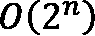，其中*n*是数据集中特征的总数。

+   **Shapley 值对于选择性解释无效**：Shapley 值试图考虑所有特征以提供可解释性。对于只考虑所选特征的稀疏解释，解释可能是错误的。但通常，人类友好的解释会考虑选择性特征。因此，当您寻求选择性解释时，我认为 LIME 比 SHAP 更好。然而，SHAP 框架的最新版本确实包括与 LIME 相同的思想，并且对于稀疏解释可以几乎同样有效。

+   **SHAP 不能用于提供规范性见解**：SHAP 计算每个特征的 Shapley 值，并不像 LIME 那样构建预测模型。因此，它不能用于分析任何*假设情景*或提供任何*反事实示例*以提供可操作的见解。

+   **KernelSHAP 可能很慢**：尽管 KernelSHAP 是模型无关的，但它可能非常慢，因此可能不适合用于在训练高维数据上训练的模型的生产级 ML 系统。

+   **不太适合人类使用**：除了通过特征交互分析特征重要性之外，SHAP 的可视化对于任何非技术用户来说可能都难以解释。通常，非技术用户更喜欢从机器学习模型中获得简单、有针对性的见解、建议或理由。不幸的是，当在生产系统中使用时，SHAP 需要另一层抽象来为人类提供友好的解释。

从本节讨论的要点来看，SHAP 可能不是最理想的解释性框架，而且还有很大的改进空间，使其更加适合人类使用。然而，它确实是一个重要的、非常有用的框架，用于解释黑盒算法，尤其是对于技术用户来说。这使我们来到了本章的结尾。让我们总结一下本章所学的内容。

# 摘要

在本章中，我们专注于理解 SHAP 框架对于模型解释性的重要性。到目前为止，你对 Shapley 值和 SHAP 有了很好的理解。我们介绍了如何通过各种可视化和解释方法使用 SHAP 进行模型解释性分析。我们还介绍了使用 SHAP 解释回归模型的代码示例。最后，我们讨论了该框架的一些优点和局限性。

在下一章中，我们将介绍更多关于在不同类型的数据集上应用 SHAP 的有趣的实际用例。

# 参考文献

如需更多信息，请参阅以下资源：

+   *Shapley, Lloyd S. "A Value for n-Person Games." Contributions to the Theory of Games 2.28 (1953)*：[`doi.org/10.1515/9781400881970-018`](https://doi.org/10.1515/9781400881970-018)

+   Kaggle 上的红葡萄酒质量数据集：[`www.kaggle.com/uciml/red-wine-quality-cortez-et-al-2009`](https://www.kaggle.com/uciml/red-wine-quality-cortez-et-al-2009)

+   SHAP GitHub 项目：[`github.com/slundberg/shap`](https://github.com/slundberg/shap)

+   官方 SHAP 文档：[`shap.readthedocs.io/en/latest/index.html`](https://shap.readthedocs.io/en/latest/index.html)
