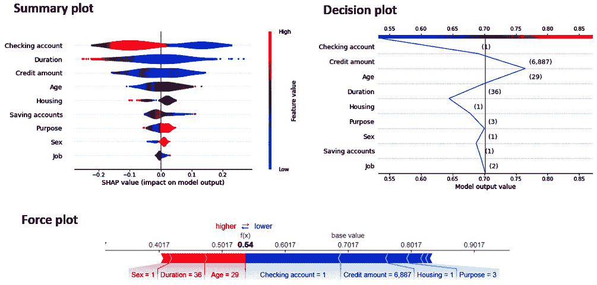
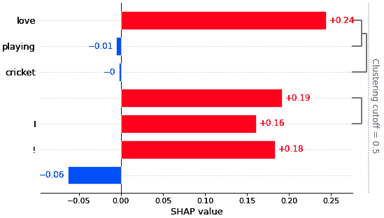

# 第七章：在机器学习中使用 SHAP 的实际经验

在上一章中，我们讨论了**SHapley Additive exPlanation**（**SHAP**），这是最受欢迎的模型可解释性框架之一。我们还介绍了使用 SHAP 解释回归模型的一个实际例子。然而，SHAP 可以解释在多种类型数据集上训练的其他类型的模型。在上一章中，你确实对 SHAP 中可用于解释不同类型数据集上训练的模型的**不同类型的解释器**有一个简要的概念理解。但在本章中，你将获得应用 SHAP 中各种类型解释器所需的实际经验。

更具体地说，你将学习如何应用**TreeExplainers**来解释在结构化表格数据上训练的树集成模型。你还将学习如何应用**DeepExplainer**和**GradientExplainer** SHAP，这些 SHAP 与在图像数据上训练的深度学习模型一起使用。正如你在上一章中学到的，SHAP 中的**KernelExplainer**是模型无关的，你将在本章中获得 KernelExplainers 的实际经验。我们还将涵盖在线性模型上使用**LinearExplainers**的实际方面。最后，你将探索如何使用 SHAP 来解释在文本数据上训练的复杂的**Transformer**模型。

在本章中，我们将涵盖以下重要主题：

+   将 TreeExplainers 应用于树集成模型

+   使用 DeepExplainer 和 GradientExplainer 解释深度学习模型

+   使用 KernelExplainer 进行模型无关的可解释性

+   探索 SHAP 中的 LinearExplainer

+   使用 SHAP 解释 Transformer

让我们开始吧！

# 技术要求

本代码教程以及必要的资源可以从本章的 GitHub 仓库下载或克隆：[`github.com/PacktPublishing/Applied-Machine-Learning-Explainability-Techniques/tree/main/Chapter07`](https://github.com/PacktPublishing/Applied-Machine-Learning-Explainability-Techniques/tree/main/Chapter07)。Python 和 Jupyter 笔记本用于实现本章中涵盖的理论概念的实际应用。然而，我建议你在阅读本章后运行笔记本，以便更好地理解。

# 将 TreeExplainers 应用于树集成模型

如前一章所述，Tree SHAP 实现可以与树集成模型如 **随机森林**、**XGBoost** 和 **LightGBM** 算法一起工作。决策树本身是可解释的。但是，基于树的集成学习模型，无论是实现提升还是袋装，本身并不是可解释的，并且可能相当复杂。因此，SHAP 是用于解释此类复杂模型的最受欢迎的算法之一。SHAP 的核 SHAP 实现是模型无关的，可以解释任何模型。然而，对于具有许多特征的较大数据集，该算法可能非常慢。这就是为什么 **Tree SHAP** ([`arxiv.org/abs/1802.03888`](https://arxiv.org/abs/1802.03888)) 算法的实现是一个针对树集成模型的高速精确算法。TreeExplainer 是 Tree SHAP 算法的快速 C++ 实现，支持 XGBoost、CatBoost、LightGBM 以及来自 scikit-learn 的其他树集成模型。在本节中，我将介绍如何在实践中应用 TreeExplainer。

## 安装所需的 Python 模块

完整的教程可以在 GitHub 仓库中找到，地址为 [`github.com/PacktPublishing/Applied-Machine-Learning-Explainability-Techniques/blob/main/Chapter07/TreeExplainers.ipynb`](https://github.com/PacktPublishing/Applied-Machine-Learning-Explainability-Techniques/blob/main/Chapter07/TreeExplainers.ipynb)，我强烈建议您阅读这一部分并边读边执行代码。如果您已经跟随着其他章节中提供的先前教程，那么现在应该已经安装了大多数所需的 Python 包。否则，您可以使用 `pip` 安装程序安装必要的包：

```py
!pip install --upgrade numpy pandas matplotlib seaborn sklearn lightgbm shap
```

您可以导入这些包以验证它们的成功安装：

```py
import numpy as np
```

```py
import pandas as pd
```

```py
import seaborn as sns
```

```py
import matplotlib.pyplot as plt
```

```py
import sklearn
```

```py
import lightgbm as lgb
```

```py
import shap
```

对于 Jupyter 笔记本中的某些基于 JavaScript 的 SHAP 可视化，请确保初始化 SHAP JavaScript 模块：

```py
shap.initjs()
```

接下来，让我们讨论我们将用于本例的数据集。

## 关于数据集的讨论

在本例中，我们将使用 Kaggle 上的德国信用风险数据集 ([`www.kaggle.com/uciml/german-credit`](https://www.kaggle.com/uciml/german-credit))。该数据集用于构建一个分类模型，用于区分良好的和不良的信用风险。Kaggle 数据集实际上是 UCI ([`archive.ics.uci.edu/ml/datasets/statlog+(german+credit+data)`](https://archive.ics.uci.edu/ml/datasets/statlog+(german+credit+data))) 中可用的原始数据的简化版本）

Statlog (德国信用数据) 数据集

该数据集的归功于 *教授博士汉斯·霍夫曼，汉堡统计学与计量经济学研究所*。

请参阅笔记本以获取有关数据集的更多信息。该数据集已提供在本章的 GitHub 仓库中：[`github.com/PacktPublishing/Applied-Machine-Learning-Explainability-Techniques/tree/main/Chapter07/datasets`](https://github.com/PacktPublishing/Applied-Machine-Learning-Explainability-Techniques/tree/main/Chapter07/datasets)。我们可以使用 pandas Python 模块来加载数据集并将其显示为 DataFrame：

```py
data  = pd.read_csv('datasets/german_credit_data.csv', index_col=0)
```

```py
data.head()
```

下面的图表展示了该数据的 pandas DataFrame：

![Figure 7.1 – pandas DataFrame snapshot of the German Credit Risk dataset

![img/B18216_07_001.jpg]

图 7.1 – 德国信用风险数据集的 pandas DataFrame 快照

我强烈建议您进行彻底的**数据探索分析**（**EDA**）。您还可以使用如*第二章*中所示，*模型可解释性方法*中的 pandas profiling ([`github.com/ydataai/pandas-profiling`](https://github.com/ydataai/pandas-profiling)) 进行自动 EDA。由于我们已经覆盖了这一点，我将跳过本例的 EDA 部分。

然而，数据集确实存在一些缺失值，在构建模型之前需要处理。我们可以使用以下代码行进行检查：

```py
sns.displot(
```

```py
    data=data.isna().melt(value_name="missing"),
```

```py
    y="variable",
```

```py
    hue="missing",
```

```py
    multiple="fill",
```

```py
    aspect=1.5,
```

```py
    palette='seismic'
```

```py
)
```

```py
plt.show()
```

下面的可视化是输出结果：

![Figure 7.2 – Missing value visualization for the German Credit Risk dataset

![img/B18216_07_002.jpg]

图 7.2 – 德国信用风险数据集的缺失值可视化

该数据集在`储蓄账户`特征上大约有 18% 的缺失值，在`支票账户`特征上有 40% 的缺失值。由于缺失数据的百分比较高，且这些特征可能很重要，我们不能完全忽略或删除这些特征。请记住，本教程的重点是使用 TreeExplainers 进行模型可解释性。因此，我们不会花太多时间进行数据插补，因为我们不关心构建一个高效的模型。由于这两个特征都是分类特征，我们将简单地为缺失值创建一个`未知`类别。这可以通过以下代码行完成：

```py
data.fillna('Unknown', inplace=True)
```

我们需要对分类特征进行**标签编码**，因为我们需要将字符串类型的特征值转换为整数格式：

```py
from sklearn.preprocessing import LabelEncoder
```

```py
le = LabelEncoder()
```

```py
for feat in ['Sex', 'Housing', 'Saving accounts', 'Checking account', 'Purpose', 'Risk']:
```

```py
    le.fit(data[feat])
```

```py
    data[feat] = le.transform(data[feat])
```

现在，对于这个例子，我们将使用**LightGBM 算法**([`lightgbm.readthedocs.io/en/latest/`](https://lightgbm.readthedocs.io/en/latest/))，它可以直接在分类变量上工作，因此我们不需要执行**独热编码**。但对于其他算法，我们可能需要执行独热编码。此外，我们不会执行其他复杂的数据预处理或特征工程步骤。我确实建议您进行稳健的特征工程、异常值检测和数据归一化，以构建高效的机器学习模型。然而，对于这个例子，即使模型精度不高，我们也可以使用 SHAP 来生成解释。让我们继续进行模型训练部分。

## 训练模型

在训练模型之前，我们需要创建训练集和测试集：

```py
from sklearn.model_selection import train_test_split
```

```py
features = data.drop(columns=['Risk'])
```

```py
labels = data['Risk']
```

```py
# Dividing the data into training-test set with 80:20 split ratio
```

```py
x_train,x_test,y_train,y_test = \
```

```py
train_test_split(features,labels,test_size=0.2, 
```

```py
                 random_state=123)
```

由于我们将使用 LightGBM 算法，我们需要创建 LightGBM 数据集对象，这些对象在训练过程中会被使用：

```py
data_train = lgb.Dataset(x_train, label=y_train, 
```

```py
                         categorical_feature=cat_features)
```

```py
data_test = lgb.Dataset(x_test, label=y_test, 
```

```py
                        categorical_feature=cat_features)
```

我们还需要将模型参数定义为字典：

```py
params = {
```

```py
    'boosting_type': 'gbdt',
```

```py
    'objective': 'binary',
```

```py
    'metric': 'auc',
```

```py
    'num_leaves': 20,
```

```py
    'learning_rate': 0.05,
```

```py
    'feature_fraction': 0.9,
```

```py
    'bagging_fraction': 0.8,
```

```py
    'bagging_freq': 5,
```

```py
    'verbose': -1,
```

```py
    'lambda_l1': 1,
```

```py
    'lambda_l2': 1,
```

```py
    'seed': 123
```

```py
}
```

最后，我们可以使用创建的参数和数据集对象来训练模型：

```py
model = lgb.train(params,
```

```py
                  data_train,
```

```py
                  num_boost_round=100,
```

```py
                  verbose_eval=100,
```

```py
                  valid_sets=[data_test, data_train])
```

我们再次跳过了超参数调整过程以获得更高效的模型，但我确实建议您花些时间在超参数调整上，以获得更高精度的模型。现在，让我们使用 SHAP 进行模型可解释性部分。

## 在 SHAP 中应用 TreeExplainer

在 SHAP 中应用 TreeExplainer 非常简单，因为框架已经很好地模块化：

```py
explainer = shap.TreeExplainer(model)
```

```py
shap_values = explainer.shap_values(features)
```

一旦我们近似了 SHAP 值，我们就可以应用 SHAP 提供的可视化方法来获得模型的可解释性。我建议您参考*第六章*中的*SHAP 中的可视化*部分，*使用 SHAP 进行模型可解释性*，以刷新您对我们可以使用 SHAP 进行模型可解释性的各种可视化方法的记忆。我们将从全局可解释性开始，使用汇总图。

*图 7.3*展示了使用 TreeExplainer 在此数据集上生成的 SHAP 值创建的 SHAP 汇总图：

![图 7.3 – TreeExplainer 生成的 SHAP 值上的 SHAP 汇总图

![img/B18216_07_003.jpg]

图 7.3 – TreeExplainer 生成的 SHAP 值上的 SHAP 汇总图

如前图所示，汇总图基于 SHAP 值突出显示重要特征，从最重要到最不重要排序。模型将`Checking account`和`Duration`视为最有影响力的特征之一，与`Sex`或`Job`特征相比。

对于局部可解释性，我们可以应用**力图**和**决策图**可视化方法：

```py
# Local explainability with force plots
```

```py
shap.force_plot(explainer.expected_value[1], shap_values[1][0,:], features.iloc[0,:])
```

```py
# Local explainability with force plots
```

```py
shap.decision_plot(explainer.expected_value[1], shap_values[1][0,:], features.iloc[0,:])
```

我经常发现决策图比力图更易于理解，因为决策图显示了每个特征的预期平均值偏差。偏差的方向也表明了特征是正向影响模型决策还是具有负面影响。但有些人可能也更喜欢力图，因为这表明了基于特征值及其如何影响以实现更高的预测值或更低的预测值，哪些特征是正向或负向影响的。

*图 7.4* 展示了我们获得的力图和决策图：


图 7.4 – 用于局部可解释性的力和决策图

在某些情况下，理解特征间的相互依赖性变得很重要，因为 SHAP 不会孤立地考虑特征来获得最有影响力的特征。相反，基于 SHAP 的特征重要性是基于多个特征共同影响的集体估计。因此，为了分析特征重要性，我们可以尝试 SHAP 特征依赖性图：

```py
# For feature wise global interpretability
```

```py
for col in ['Purpose', 'Age']:
```

```py
    print(f"Feature Dependence plot for: {col}")
```

```py
    shap.dependence_plot(col, shap_values[1], features, display_features=features)
```

下图显示了`Purpose`和`Age`特征的依赖性图：


图 7.5 – 目的和年龄特征的 SHAP 特征依赖图

从*图 7.3*中的 SHAP 来看，我发现特征`Purpose`和`Age`并不像`Duration`或`Credit amount`那样重要，这让我有些惊讶。在这种情况下，特征依赖性图会自动计算所选特征的依赖性最强的特征。因此，从*图 7.5*中，我们可以看到对于`Purpose`和`Age`，`Credit Amount`是依赖性最强的特征，我们还可以看到这些特征如何与依赖性特征变化。这证明了`Credit amount`作为一个整体，比`Purpose`和`Age`更有影响力。

您还可以尝试其他在*第六章*中介绍的可视化方法，即使用 SHAP 进行模型可解释性，并且强烈建议您尝试使用 TreeExplainer 生成的 SHAP 值来玩转自定义可视化方法！在下一节中，我们将应用 SHAP 解释器到在图像数据上训练的深度学习模型。

# 使用 DeepExplainer 和 GradientExplainer 解释深度学习模型

在上一节中，我们介绍了 SHAP 中的 TreeExplainer 的使用，这是一个仅适用于树集成模型的特定模型解释方法。现在我们将讨论 GradientExplainer 和 DeepExplainer，SHAP 中的另外两种特定模型解释器，它们主要用于深度学习模型。

## GradientExplainer

如在 *第二章* 中讨论的，*模型可解释性方法*，解释在图像等非结构化数据上训练的深度学习模型的最广泛采用的方法之一是**层相关传播**（**LRP**）。LRP 是关于分析深度神经网络中间层的梯度流。SHAP GradientExplainers 也以类似的方式工作。如在第 *第六章* 中讨论的，*使用 SHAP 的模型可解释性*，GradientExplainer 将 *SHAP*、*集成梯度* 和 *SmoothGrad* 的思想结合成一个单一的期望值方程。GradientExplainer 最终使用基于敏感度图的梯度可视化方法。可视化图中的红色像素表示具有正 SHAP 值的像素，这增加了输出类的概率。蓝色像素表示具有负 SHAP 值的像素，这减少了输出类的可能性。现在，让我带您参观代码仓库中提供的教程：[`github.com/PacktPublishing/Applied-Machine-Learning-Explainability-Techniques/blob/main/Chapter07/Explaining%20Deep%20Learning%20models.ipynb`](https://github.com/PacktPublishing/Applied-Machine-Learning-Explainability-Techniques/blob/main/Chapter07/Explaining%20Deep%20Learning%20models.ipynb)。请加载必要的模块，并按照笔记本教程中提供的详细步骤进行操作，因为我将只在本节中涵盖重要的编码步骤，以帮助您理解代码教程的流程。

## 讨论用于训练模型的训练集

对于这个示例，我们将使用 SHAP ImageNet 数据集，该数据集将被用于生成 GradientExplainer 算法所需的背景参考。我们还将从同一数据集中选取推理图像。然而，你始终可以自由选择任何其他图像数据集或你选择的推理图像：

```py
X,y = shap.datasets.imagenet50(resolution=224)
```

```py
inference_image = X[[46]] 
```

对于这个示例，我们选择了以下图像作为我们的推理图像：


图 7.6 – 来自 SHAP ImageNet50 的推理图像

如我们从推理图像中可以看到，它包含许多可能的物体，包括一个人、一把椅子和一台电脑。所有这些都可以是潜在模型的结果，实际结果取决于模型预测时关注的精确区域。因此，在这种情况下，可解释性非常重要。接下来，让我们讨论这个示例中使用的模型。

## 在这个示例中，我们将使用预训练的 CNN 模型

我已经使用了一个预训练的 CNN 模型，`tensorflow` Python 模块：

```py
from tensorflow.keras.applications.vgg19 import VGG19
```

```py
model = VGG19(weights='imagenet')
```

接下来，让我们将 GradientExplainer 应用到 SHAP 上。

## GradientExplainer 在 SHAP 中的应用

GradientExplainer 有助于将深度学习模型（如 **卷积神经网络**（**CNN**））的中间层的梯度流映射出来，以解释模型的运作原理。因此，我们将尝试探索模型的第 10 层，并基于 SHAP 值可视化梯度。选择第 10 层完全是随机的；你也可以选择其他层：

```py
layer_num = 10
```

```py
# explain how the input to the 10th layer of the model explains the top two classes
```

```py
def map2layer(x, layer):
```

```py
    '''
```

```py
    Source : https://github.com/slundberg/shap
```

```py
    '''
```

```py
    feed_dict = dict(zip([model.layers[0].input],
```

```py
                         [preprocess_input(x.copy())]))
```

```py
    return K.get_session().run(model.layers[layer].input, feed_dict)
```

```py
model_input = (model.layers[layer_num].input, 
```

```py
               model.layers[-1].output)
```

```py
explainer = shap.GradientExplainer(model_input,
```

```py
                                   map2layer(X, layer_num),
```

```py
                                   local_smoothing=0)
```

```py
shap_values, ind = explainer.shap_values(
```

```py
    map2layer(inference_image, layer_num), 
```

```py
    ranked_outputs=4)
```

```py
# plot the explanations
```

```py
shap.image_plot(shap_values, inference_image, class_names)
```

在这个例子中，我们试图估计预训练模型第 10 层基于 GradientExplainer 的 SHAP 值。使用 SHAP 图像绘制方法，我们可以可视化模型前 4 个可能结果的对敏感度图，如图 *图 7.7* 所示：


](img/B18216_07_007.jpg)

图 7.7 – 基于应用 GradientExplainer 到推理图像的 SHAP 图像绘制可视化

模型的前四个预测结果是 **desktop_computer**、**desk**、**monitor** 和 **screen**。所有这些结果都是有效的，取决于模型关注的区域。使用 *图 7.7* 中所示的 SHAP 图像绘制，我们可以识别出对特定模型预测有贡献的确切区域。标记为红色的像素区域对特定模型预测有正面贡献，而蓝色像素区域对模型预测有负面贡献。你也可以尝试可视化模型的其它层，并分析模型预测在各个层中的变化情况！

## 探索 DeepExplainers

在上一节中，我们介绍了 SHAP 中的 GradientExplainers。然而，深度学习模型也可以使用基于 Deep SHAP 算法的 SHAP 中的 DeepExplainers 来解释。Deep SHAP 是一种用于估计深度学习模型 SHAP 值的高速实现。它使用背景样本的分布和 Shapley 方程来线性化深度学习模型中使用的最大值、乘积和 softmax 等主要非线性操作。

提供的教程笔记本 [`github.com/PacktPublishing/Applied-Machine-Learning-Explainability-Techniques/blob/main/Chapter07/Explaining%20Deep%20Learning%20models.ipynb`](https://github.com/PacktPublishing/Applied-Machine-Learning-Explainability-Techniques/blob/main/Chapter07/Explaining%20Deep%20Learning%20models.ipynb) 涵盖了一个从 CIFAR-10 数据集 ([`www.cs.toronto.edu/~kriz/cifar.html`](https://www.cs.toronto.edu/~kriz/cifar.html)) 中从头开始训练的多类分类深度学习模型的示例。该数据集包含 32x32 大小的高度压缩图像，属于 10 个不同的类别。在本节中，我将跳过模型训练过程，因为它已经在笔记本教程中得到了充分的详细说明。相反，我将讨论使用 DeepExplainers 的模型可解释性部分，这是我们主要关注的焦点。您也可以尝试使用预训练的 CNN 模型而不是从头开始训练模型进行相同的教程。现在，让我们讨论模型可解释性部分。

## SHAP 中 DeepExplainer 的应用

为了应用 DeepExplainer，我们首先需要形成背景样本。可解释性的鲁棒性实际上在很大程度上取决于背景样本的选择。在这个例子中，我们将从训练数据中随机选择 1,000 个样本。您也可以增加样本大小，但请确保背景样本在训练或推理数据之间没有数据漂移，通过确保数据收集过程是一致的：

```py
background = x_train[np.random.choice(len(x_train), 1000, replace=False)]
```

一旦选定了背景样本，我们就可以使用在训练模型和背景样本上应用 DeepExplainer 方法来创建一个 SHAP 解释器对象，并估计推理数据的 SHAP 值：

```py
explainer = shap.DeepExplainer(model, background)
```

```py
shap_values = explainer.shap_values(sample_x_test)
```

在计算 SHAP 值之后，我们可以使用 SHAP 图像图来可视化以类似梯度解释器使用的敏感性图来影响模型的像素，无论是正面还是负面的影响：

```py
shap.image_plot(shap_values, sample_x_test, labels, labelpad= 1)
```

下图显示了某些样本推理数据的 SHAP 图像：


图 7.8 – 在 SHAP 中应用 DeepExplainer 后的 SHAP 图像可视化

如我们从 *图 7.8* 中所见，即使模型是在一个非常压缩的数据集上训练的，DeepExplainer 仍然能够计算出 SHAP 值，帮助我们识别图像中（以粉红色像素突出显示）对模型预测有正面贡献的区域。模型确实正确地预测了结果为 *马*，这是从压缩图像中得到的正确分类。然而，应用 DeepExplainer 非常简单，与传统的用于近似在非结构化数据（如图像）上训练的深度学习模型的 SHAP 值的方法相比，这种方法非常快速。接下来，我们将学习关于 KernelExplainer 的模型无关可解释性。

# 使用 KernelExplainer 的模型无关可解释性

在前面的章节中，我们已经讨论了 SHAP 中可用的三种特定于模型的解释器 – TreeExplainer、GradientExplainer 和 DeepExplainer。SHAP 中的 KernelExplainer 实际上使 SHAP 成为一个模型无关的解释方法。然而，与之前的方法不同，基于 Kernel SHAP 算法的 KernelExplainer 要慢得多，尤其是在大型和高维数据集上。Kernel SHAP 尝试结合 Shapley 值和 **局部可解释模型无关解释 (LIME**) 的思想，以实现黑盒模型的全球和局部可解释性。类似于 LIME 采取的方法，Kernel SHAP 算法也创建了局部线性扰动样本，并计算相同样本的 Shapley 值，以识别对模型预测有贡献或相反的特征。

KernelExplainer 是 Kernel SHAP 算法的实际实现。以下笔记本提供了完整的教程，展示了 SHAP KernelExplainer 的应用：[`github.com/PacktPublishing/Applied-Machine-Learning-Explainability-Techniques/blob/main/Chapter07/KernelExplainers.ipynb`](https://github.com/PacktPublishing/Applied-Machine-Learning-Explainability-Techniques/blob/main/Chapter07/KernelExplainers.ipynb)。我使用了与 *TreeExplainer 教程* 中相同的 *德国信用风险数据集*。如果你直接从本节开始，请参阅 *将 TreeExplainers 应用于树集成模型* 部分，以详细了解数据集和模型。在本节中，我们将讨论 KernelExplainer 在 TreeExplainer 教程中讨论的相同问题中的应用。

## SHAP 中 KernelExplainer 的应用

SHAP 中的 KernelExplainer 方法将模型和背景数据作为输入来计算 SHAP 值。对于较大的数据集或具有许多特征的维数据集，建议仅使用训练数据的一个子集作为背景样本。否则，Kernel SHAP 可能是一个非常慢的算法，并且生成 SHAP 值需要很长时间。与之前介绍的解释方法一样，应用 KernelExplainer 非常简单，可以使用以下代码行完成：

```py
explainer = shap.KernelExplainer(model.predict, x_train)
```

```py
shap_values = explainer.shap_values(x_test, nsamples=100)
```

如果我们记录计算 SHAP 值的墙时（在 Jupyter 笔记本中使用 `%%time`），并将 KernelExplainer 与 TreeExplainer 在同一数据集上比较，我们将观察到 KernelExplainer 执行时间明显更长（在我们的案例中几乎长 1,000 倍！）这表明尽管 KernelExplainer 是模型无关的，但算法的缓慢是一个主要的缺点。

对于解释黑盒模型，适用于 TreeExplainer 的相同可视化方法也适用于 KernelExplainer，可以通过以下代码生成：

```py
shap.summary_plot(shap_values, x_test, plot_type='violin', show=False)
```

```py
shap.force_plot(explainer.expected_value, shap_values[1], x_test.iloc[0,:])
```

```py
shap.decision_plot(explainer.expected_value, shap_values[1], x_test.iloc[0,:])
```

*图 7.9* 展示了用于解释黑盒模型的总结图、决策图和力图：



图 7.9 – 使用 SHAP KernelExplainer 获得的总结图、决策图和力图

使用与 TreeExplainer 中介绍的方法相同的途径，可以获得*图 7.9*中显示的图表。在下一节中，我们将介绍 SHAP 中的 LinearExplainer，这是另一种特定于模型的解释方法。

# 探索 SHAP 中的 LinearExplainer

SHAP 中的 LinearExplainer 特别为线性机器学习模型开发。在前一节中，我们了解到虽然 KernelExplainer 是模型无关的，但它可能非常慢。因此，我认为这是使用 LinearExplainer 解释具有独立特征的线性模型，甚至考虑特征相关性的主要动机之一。在本节中，我们将讨论在实践中应用 LinearExplainer 方法。详细的笔记本教程可在[`github.com/PacktPublishing/Applied-Machine-Learning-Explainability-Techniques/blob/main/Chapter07/LinearExplainers.ipynb`](https://github.com/PacktPublishing/Applied-Machine-Learning-Explainability-Techniques/blob/main/Chapter07/LinearExplainers.ipynb)找到。我们使用了与*第六章*中讨论的教程相同的*红酒质量数据集*，*使用 SHAP 进行模型可解释性*。您可以参考相同的教程了解更多关于数据集的信息，因为我们将在本节中仅关注 LinearExplainer 的应用部分。

## SHAP 中 LinearExplainer 的应用

对于这个例子，我们实际上在数据集上训练了一个线性回归模型。与其他解释器类似，我们可以使用几行代码应用 LinearExplainer：

```py
explainer = shap.LinearExplainer(model, x_train, feature_dependence="independent")
```

```py
shap_values = explainer.shap_values(x_test)
```

为了解释训练好的线性模型，适用于 TreeExplainer 和 KernelExplainer 的相同可视化方法同样适用。*图 7.10*展示了用于解释训练好的线性模型的总结图、特征依赖图和力图：


图 7.10 – 使用 SHAP LinearExplainer 获得的总结图、特征依赖图和力图

我们可以使用以下代码行获得*图 7.10*中显示的视觉化图表：

```py
shap.summary_plot(shap_values, x_test, plot_type='violin', show=False)
```

```py
shap.force_plot(explainer.expected_value, shap_values[1], x_test.iloc[0,:])
```

```py
shap.dependence_plot("alcohol", shap_values, x_test, show=False)
```

我会建议您探索其他可视化方法，甚至使用 LinearExplainer 生成的 SHAP 值创建自定义可视化。接下来，我们将讨论将 SHAP 应用于在文本数据上训练的转换器模型。

# 使用 SHAP 解释转换器

在本章中，到目前为止，我们已经看到了使用 SHAP 解释器解释在结构化和图像数据集上训练的不同类型模型的例子。现在，我们将介绍解释在文本数据上训练的复杂模型的方法。对于文本数据，使用传统的**自然语言处理（NLP）**方法训练模型以获得高精度始终具有挑战性。这是因为使用经典方法在顺序文本数据中提取上下文信息总是很困难。

然而，随着基于**注意力机制**的**Transformer**深度学习架构的发明（[`blogs.nvidia.com/blog/2022/03/25/what-is-a-transformer-model/`](https://blogs.nvidia.com/blog/2022/03/25/what-is-a-transformer-model/)），在文本数据上训练更高精度的模型变得容易得多。然而，transformer 模型极其复杂，解释这些模型的工作原理可能非常困难。幸运的是，由于 SHAP 对模型无偏见，它也可以应用于 transformer 模型。

因此，在本节中，我们将介绍如何使用来自 Hugging Face 的基于文本的、预训练的 transformer 模型（[`github.com/huggingface/transformers`](https://github.com/huggingface/transformers)）应用于不同的应用场景。完整的教程可以从[`github.com/PacktPublishing/Applied-Machine-Learning-Explainability-Techniques/blob/main/Chapter07/Explaining_Transformers.ipynb`](https://github.com/PacktPublishing/Applied-Machine-Learning-Explainability-Techniques/blob/main/Chapter07/Explaining_Transformers.ipynb)获取。现在，让我们看看使用 SHAP 解释基于 transformer 的情感分析模型的第一个例子。

## 解释基于 transformer 的情感分析模型

使用`pip`安装程序安装`transformers` Python 模块：

```py
!pip install --upgrade transformers
```

您可以通过导入模块来确认 transformers 框架的成功安装：

```py
import transformers
```

现在，让我们加载一个情感分析预训练模型：

```py
model = transformers.pipeline('sentiment-analysis', return_all_scores=True)
```

我们可以将任何句子作为输入，并将模型应用于检查其是否具有积极或消极的情感。因此，我们将使用句子`"Hugging Face transformers are absolutely brilliant!"`作为我们的推理数据：

```py
text_data = "Hugging Face transformers are absolutely brilliant!"
```

```py
model(text_data)[0]
```

模型将预测推理数据为积极和消极的概率：

```py
[{'label': 'NEGATIVE', 'score': 0.00013269631017465144},
```

```py
 {'label': 'POSITIVE', 'score': 0.99986732006073}]
```

几乎可以肯定（99.99%的概率），模型预测该句子为积极，这是一个正确的预测。现在，让我们应用 SHAP 来解释模型预测：

```py
explainer = shap.Explainer(model) 
```

```py
shap_values = explainer([text_data])
```

一旦成功计算出 SHAP 值，我们可以应用 SHAP 文本图可视化和条形图可视化来突出对模型预测有积极和消极贡献的单词：

```py
shap.plots.text(shap_values[0,:,'POSITIVE'])
```

```py
shap.plots.bar(shap_values[0,:,'POSITIVE'])
```

*图 7.11*向我们展示了 SHAP 文本图，它们看起来类似于力图：


图 7.11 – 使用 SHAP 文本图解释在文本数据上训练的 transformer 模型

正如我们从*图 7.11*中可以看到的，突出显示为红色的单词，如*brilliant*、*absolutely*和*Hugging*，对模型预测分数有正面的贡献，而其他单词则降低了模型预测，因此对模型的预测有负面的贡献。

从以下图中所示的 SHAP 条形图中也可以得出相同的推断：

![图 7.12 – 用于解释在文本数据上训练的变压器模型的 SHAP 条形图

![img/B18216_07_012.jpg]

图 7.12 – 用于解释在文本数据上训练的变压器模型的 SHAP 条形图

我发现解释条形图更容易，它清楚地显示了句子中每个单词的正负影响，如图*图 7.12*所示。

接下来，让我们探索另一个示例，其中基于变压器的多类分类模型是在文本数据上训练的。

## 使用 SHAP 解释多类预测变压器模型

在上一个示例中，我们应用 SHAP 来解释一个基于文本的二分类模型。现在，让我们应用 SHAP 来解释用于检测以下六种情感之一的预训练变压器模型：*悲伤*、*喜悦*、*爱情*、*愤怒*、*恐惧*和*惊讶*。

让我们加载用于情感检测的预训练变压器模型：

```py
tokenizer = transformers.AutoTokenizer.from_pretrained("nateraw/bert-base-uncased-emotion", use_fast=True)
```

```py
model = transformers.AutoModelForSequenceClassification.from_pretrained("nateraw/bert-base-uncased-emotion").cuda()
```

```py
# build a pipeline object to do predictions
```

```py
pipeline = transformers.pipeline("text-classification", model=model, tokenizer=tokenizer, device=0, return_all_scores=True)
```

现在，让我们使用与上一个示例中相同的推断数据，并使用 SHAP 计算 SHAP 值：

```py
explainer = shap.Explainer(pipeline)
```

```py
shap_values = explainer([text_data])
```

然后，我们可以使用 SHAP 文本图来突出显示对六个可能结果中的每一个都有正负贡献的单词：

```py
shap.plots.text(shap_values[0])
```

*图 7.13*展示了从上一行代码中获得的 SHAP 文本图的输出：

![图 7.13 – 交互式 SHAP 文本图突出显示对正负贡献的单词

![img/B18216_07_013.jpg]

图 7.13 – 交互式 SHAP 文本图突出显示对正负贡献的单词

SHAP 文本图是交互式的。正如我们从*图 7.13*中可以看到的，这突出了模型预测结果的红色，以及对模型决策有正负贡献的单词。我们还可以点击其他可能的结果，并可视化每个单词对模型预测的影响。例如，如果我们点击*惊讶*而不是*喜悦*，我们会看到除了单词*face*之外的所有单词都被突出显示为蓝色，因为这些单词对该特定结果有负面的贡献。我个人认为，使用 SHAP 解释在文本数据上训练的变压器模型的方法非常有趣且高效！接下来，让我们探讨应用 SHAP 解释 NLP 零样本学习模型的另一个有趣用例。

## 使用 SHAP 解释零样本学习模型

**零样本学习** 是 NLP 中最迷人的概念之一，它涉及在推理数据上应用模型来预测任何在训练过程中未使用的自定义类别，而无需微调。您可以在以下参考链接中找到有关零样本学习的更多信息：[`aixplain.com/2021/09/23/zero-shot-learning-in-natural-language-processing/`](https://aixplain.com/2021/09/23/zero-shot-learning-in-natural-language-processing/)。将 SHAP 应用于零样本学习模型也非常简单。

首先，我们需要加载预训练的转换器模型：

```py
model = AutoModelForSequenceClassification.from_pretrained("valhalla/distilbart-mnli-12-3")
```

```py
tokenizer = AutoTokenizer.from_pretrained("valhalla/distilbart-mnli-12-3")
```

我们需要创建一个自定义的零样本学习流程，以便 SHAP 能够工作：

```py
class ZSLPipeline(ZeroShotClassificationPipeline):
```

```py
    # Overwrite the __call__ method
```

```py
    def __call__(self, *args):
```

```py
        out = super().__call__(args[0], self.set_labels)[0]
```

```py
        return [[{"label":x[0], "score": x[1]}  for x in zip(out["labels"], out["scores"])]]
```

```py
    def set_labels(self, labels: Union[str,List[str]]):
```

```py
        self.set_labels = labels
```

然后，我们需要定义自定义标签和推理文本数据，并为零样本学习模型配置新标签。对于这个例子，我们选择了文本 `"我喜欢打板球！"` 作为我们的推理数据，并希望我们的零样本学习模型能够预测推理文本数据属于 `昆虫`、`体育` 或 `动物` 类：

```py
text = ["I love playing cricket!"]
```

```py
labels = ["insect", "sports", "animal"]
```

```py
model.config.label2id.update({v:k for k,v in enumerate(labels)})
```

```py
model.config.id2label.update({k:v for k,v in enumerate(labels)})
```

```py
pipe = ZSLPipeline(model=model, tokenizer=tokenizer, return_all_scores=True)
```

```py
pipe.set_labels(labels)
```

一旦零样本学习模型的设置过程准备就绪，我们就可以轻松地应用 SHAP 进行模型可解释性：

```py
explainer = shap.Explainer(pipe)
```

```py
shap_values = explainer(text)
```

在成功计算 SHAP 值之后，我们可以使用文本图或条形图进行模型可解释性：

```py
shap.plots.text(shap_values)
```

```py
shap.plots.bar(shap_values[0,:,'sports'])
```

*图 7.14* 展示了作为输出获得的条形图可视化：



图 7.14 – 零样本学习模型预测运动结果的条形图可视化

用于此例的推理文本句子 – `"我喜欢打板球！"` 实际上与 `体育` 类相关，该模型正确地预测了这一点。然而，板球不仅是一项运动，也是一种昆虫。当使用短语 `打板球` 时，整体上它表示我们在谈论一项运动。因此，这些词应该对模型的预测做出积极的贡献。不幸的是，从 *图 7.14* 中，我们可以看到 `打` 和 `板球` 这两个词都带有负的 SHAP 值，这表明尽管模型预测是正确的，但这并不是一个非常好的模型，因为模型过于依赖单词 `爱` 而不是 `板球` 或 `打`。这是一个经典例子，强调了将 **可解释人工智能**（**XAI**）作为 AI 流程周期中强制性的必要部分的重要性，我们甚至不应该盲目相信模型，即使模型预测是正确的。

我们现在已经到达了本章的结尾，我将总结本章中我们讨论的重要主题。

# 摘要

在阅读本章之后，您已经对使用 SHAP 处理表格结构数据以及非结构化数据（如图像和文本）有了实际的经验。我们讨论了 SHAP 中可用于特定模型和无模型可解释性的不同解释器。在本章中，我们应用 SHAP 来解释线性模型、树集成模型、卷积神经网络模型，甚至 Transformer 模型。使用 SHAP，我们可以解释在不同类型数据上训练的不同类型的模型。我强烈推荐尝试 GitHub 代码仓库中提供的端到端教程，并深入探索以获得更深入的实际知识。

在下一章中，我们将讨论另一个有趣的主题——概念激活向量，并探讨应用谷歌 AI 的 **使用概念激活向量进行测试**（**TCAV**）框架的实践部分，以用人类友好的概念解释模型。

# 参考文献

请参考以下资源以获取更多信息：

+   *Shapley, Lloyd S. "A value for n-person games." Contributions to the Theory of Games 2.28 (1953)*: [`doi.org/10.1515/9781400881970-018`](https://doi.org/10.1515/9781400881970-018)

+   *红酒质量数据集 – Kaggle*: [`www.kaggle.com/uciml/red-wine-quality-cortez-et-al-2009`](https://www.kaggle.com/uciml/red-wine-quality-cortez-et-al-2009)

+   *SHAP GitHub 项目*: [`github.com/slundberg/shap`](https://github.com/slundberg/shap)

+   *SHAP 文档*: [`shap.readthedocs.io/en/latest/index.html`](https://shap.readthedocs.io/en/latest/index.html)

+   *Hugging Face 模型*: [`huggingface.co/`](https://huggingface.co/)

+   *零样本学习*: [`en.wikipedia.org/wiki/Zero-shot_learning`](https://en.wikipedia.org/wiki/Zero-shot_learning)
