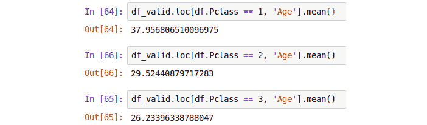

# 第一章：Python 机器学习工具包

## 学习目标

在本章结束时，你将能够：

+   解释监督学习，并描述常见的机器学习问题示例

+   安装并加载 Python 库到开发环境中，用于分析和机器学习问题

+   访问并解读 Python 库子集的文档，包括强大的 pandas 库

+   创建一个 IPython Jupyter 笔记本，并使用可执行代码单元和 markdown 单元来创建动态报告

+   使用 pandas 加载外部数据源，并利用各种方法对数据进行搜索、过滤和计算描述性统计

+   清洗质量较差的数据源，并评估数据源中各种问题可能产生的影响

本章介绍了监督学习、Jupyter 笔记本以及一些常见的 pandas 数据方法。

## 介绍

机器学习和人工智能的研究与应用，近年来成为了科技和商业界广泛关注和研究的热点。先进的数据分析和机器学习技术在推动许多领域（如个性化医疗和自动驾驶汽车）发展方面展现出了巨大的潜力，同时也在解决全球一些重大挑战（如应对气候变化）方面发挥着重要作用。本书旨在帮助你抓住当前数据科学和机器学习领域的独特机遇。在全球范围内，私营企业和政府意识到数据驱动的产品和服务的价值和效率。同时，硬件成本的降低和开源软件解决方案的普及大大降低了学习和应用机器学习技术的门槛。

本书将帮助你发展所需的技能，使你能够使用 Python 编程语言中的监督学习技术来识别、准备和构建预测模型。六个章节分别涵盖了监督学习的各个方面。本章介绍了 Python 机器学习工具包的一个子集，以及在加载和使用数据源时需要考虑的一些事项。这个数据探索过程将在*第二章*《探索性数据分析与可视化》中进一步探讨，介绍探索性数据分析和可视化。*第三章*《回归分析》和*第四章*《分类》将探讨机器学习问题的两个子集——回归分析和分类分析，并通过实例展示这些技术。最后，*第五章*《集成建模》介绍了集成网络，该技术通过多个不同模型的预测来提高整体性能，而*第六章*《模型评估》则涵盖了验证和评估指标这两个极为重要的概念。这些指标提供了一种估计模型真实表现的方法。

## 有监督机器学习

机器学习算法通常被认为仅仅是数学过程（或算法）本身，例如神经网络、深度神经网络或随机森林算法。然而，这只是整体系统的一个组成部分；首先，我们必须定义可以通过这些技术充分解决的问题。接着，我们必须指定并获取一个干净的数据集，该数据集由可以从第一个数值空间映射到第二个数值空间的信息组成。一旦数据集被设计并获得，机器学习模型就可以被指定和设计；例如，使用*tanh*激活函数的 100 个隐藏节点的单层神经网络。

在数据集和模型被明确定义后，可以指定确定模型精确值的方法。这是一个重复的优化过程，它通过评估模型的输出与现有数据的匹配度，通常被称为**训练**。一旦训练完成，且你拥有已定义的模型，接下来最好通过一些参考数据对其进行评估，以提供整体性能的基准。

考虑到完整机器学习算法的这个一般描述，问题定义和数据收集阶段通常是最关键的。你要解决的问题是什么？你希望达到什么样的结果？你打算如何实现这一目标？你如何回答这些问题将决定并定义后续的许多决策或模型设计选择。在回答这些问题时，我们将选择哪种机器学习算法类别：有监督还是无监督方法。

那么，什么是有监督和无监督机器学习问题或方法呢？**有监督学习**技术的核心是通过为训练过程提供输入信息和期望输出，映射某些信息集到另一个信息集，并检查其提供正确结果的能力。例如，假设你是一本杂志的出版商，负责评审并排名来自不同时间段的发型。你的读者常常会给你发送大量的发型图片，比你手动处理的要多。为了节省时间，你希望自动对收到的发型图片按时间段进行分类，从 1960 年代和 1980 年代的发型开始：


###### 图 1.1：来自不同时间段的发型图片

要创建你的发型分类算法，你需要先收集大量发型图片，并手动为每一张图片标注对应的时间段。这样的数据集（称为**标注数据集**）是输入数据（发型图片），并且所需的输出信息（时间段）是已知且记录下来的。这种问题是经典的监督学习问题；我们试图开发一个算法，输入一组数据，然后让它学会返回我们已经告诉它正确的答案。

### 何时使用监督学习

通常情况下，如果你试图自动化或复制一个现有的过程，那么这个问题就是一个监督学习问题。监督学习技术既非常有用又非常强大，或许你已经接触过它们，甚至在不知情的情况下帮助创建了它们的标注数据集。举个例子，几年前，Facebook 引入了在平台上传任何图片时标记朋友的功能。要标记一个朋友，你只需在朋友的面部上画一个框，然后添加朋友的名字以通知他们图片的存在。快进到今天，Facebook 会自动识别图片中的朋友并为你标记他们。这又是一个监督学习的例子。如果你曾经使用过早期的标记系统，并手动在图片中标记你的朋友，实际上你是在帮助创建 Facebook 的标注数据集。用户上传一个人的面部图片（输入数据），并用该人物的名字标记照片，这样就为数据集创建了标签。随着用户持续使用这个标记服务，一个足够大的标注数据集就被创建出来，解决了监督学习问题。现在，Facebook 自动完成朋友标记，使用监督学习算法替代了手动输入的过程：


###### 图 1.2：在 Facebook 上标记朋友

一个特别及时且直接的监督学习例子是自动驾驶汽车的训练。在这个例子中，算法使用由 GPS 系统确定的目标路线，以及车载仪器，如速度测量、刹车位置和/或 **光学雷达**（**LIDAR**）进行道路障碍物检测，作为系统的标注输出。在训练过程中，算法采集人类驾驶员提供的控制输入，如速度、转向角度和刹车位置，并将其与系统的输出进行映射，从而提供标注数据集。这些数据可以用来训练自动驾驶汽车的驾驶/导航系统，或用于模拟练习。

基于图像的监督问题虽然很流行，但并不是监督学习问题的唯一例子。监督学习也常用于自动分析文本，以判断消息的意见或语气是积极的、消极的还是中立的。这种分析被称为**情感分析**，通常涉及创建并使用一个标记数据集，其中一系列的单词或语句被手动标识为积极、消极或中立。例如，考虑以下句子：*我喜欢这部电影* 和 *我讨厌这部电影*。第一个句子显然是积极的，而第二个是消极的。我们可以将句子中的单词分解为积极、消极或中立（都积极、都消极）；见下表：


###### 图 1.3：单词的分解

使用情感分析，可能会创建一个监督学习算法，比如使用电影数据库网站 IMDb 分析发布的关于电影的评论，以确定观众是对电影进行积极评价还是消极评价。监督学习方法还可以应用于其他领域，如分析客户投诉、自动化故障排除电话/聊天会话，甚至在医学领域，如分析痣的图像来检测异常（[`www.nature.com/articles/nature21056`](https://www.nature.com/articles/nature21056)）。

这应该能帮助你更好地理解监督学习的概念，以及一些可以使用这些技术解决的问题示例。监督学习涉及训练一个算法，将输入信息映射到相应的已知输出；而**无监督学习**方法则不同，它们不使用已知的输出，可能是因为这些输出不可用或甚至未知。无监督学习方法并不依赖于一组手动标注的标签，而是通过在训练过程中设计的特定约束或规则来对提供的数据进行建模。

聚类分析是一种常见的无监督学习形式，其中数据集会根据所使用的聚类过程被划分为指定数量的不同组。以 k 近邻聚类为例，数据集中的每个样本会根据与该样本最接近的 k 个点的多数投票结果进行标记或分类。由于没有手动识别的标签，无监督算法的性能会根据使用的数据以及模型选择的参数大不相同。例如，我们是否应该在 k 个最接近的点中使用 5 个最接近的点，还是 10 个最接近的点进行多数投票？由于训练过程中缺乏已知和目标输出，无监督方法通常用于探索性分析或在那些真实目标比较模糊且通过学习方法的约束来更好定义的场景中。

本书中我们不会深入讨论无监督学习，但总结两种方法之间的主要区别是有帮助的。监督学习方法需要真实标签或输入数据的*答案*，而无监督学习方法不使用这些标签，最终结果由训练过程中应用的约束决定。

### 为什么选择 Python？

那么，为什么我们选择 Python 编程语言来进行监督学习的研究呢？虽然有多种替代语言可供选择，包括 C++、R 和 Julia，甚至 Rust 社区也在为其新兴语言开发机器学习库，但 Python 仍是机器学习的首选语言，原因有很多：

+   在工业界和学术研究中，对具备 Python 技能的开发人员有着极大的需求。

+   Python 目前是最受欢迎的编程语言之一，甚至在*IEEE Spectrum*杂志对十大编程语言的调查中位居第一（[`spectrum.ieee.org/at-work/innovation/the-2018-top-programming-languages`](https://spectrum.ieee.org/at-work/innovation/the-2018-top-programming-languages)）。

+   Python 是一个开源项目，Python 编程语言的全部源代码在 GNU GPL Version 2 许可证下免费提供。这种许可机制使得 Python 能够在许多其他项目中使用、修改甚至扩展，包括 Linux 操作系统、支持 NASA 的项目（[`www.python.org/about/success/usa/`](https://www.python.org/about/success/usa/)），以及众多提供额外功能、选择和灵活性的库和项目。在我们看来，这种灵活性是 Python 如此受欢迎的关键因素之一。

+   Python 提供了一套通用的功能，可用于运行 Web 服务器、嵌入式设备上的微服务，或利用图形处理单元的强大功能对大型数据集进行精确计算。

+   使用 Python 和一些特定的库（或在 Python 中称为“包”），可以开发出整个机器学习产品——从探索性数据分析、模型定义与优化，到 API 构建和部署。这些步骤都可以在 Python 中完成，构建一个端到端的解决方案。这是 Python 相对于一些竞争者，特别是在数据科学和机器学习领域的一个显著优势。尽管 R 和 Julia 在数值计算和统计计算方面具有优势，但用这些语言开发的模型通常需要在部署到生产环境之前，转译成其他语言。

我们希望通过本书，你能了解 Python 编程语言的灵活性和强大功能，并开始开发 Python 中端到端监督学习解决方案的道路。那么，让我们开始吧。

## Jupyter 笔记本

数据科学开发环境的一个独特之处是使用 IPython Jupyter 笔记本 ([`jupyter.org`](https://jupyter.org))，这与其他 Python 项目有所不同。Jupyter 笔记本提供了一种创建和共享交互式文档的方式，文档中可以包含实时执行的代码片段、图表以及通过 Latex ([`www.latex-project.org`](https://www.latex-project.org)) 排版系统渲染的数学公式。本章节将介绍 Jupyter 笔记本及其一些关键特性，确保你的开发环境正确设置。

在本书中，我们将经常参考每个介绍的工具/包的文档。有效阅读和理解每个工具的文档非常重要。我们将使用的许多包包含了如此多的功能和实现细节，以至于很难记住它们的所有内容。以下文档可能对接下来的 Jupyter 笔记本部分有所帮助：

+   Anaconda 文档可以在 [`docs.anaconda.com`](https://docs.anaconda.com) 找到。

+   Anaconda 用户指南可以在 [`docs.anaconda.com/anaconda/user-guide`](https://docs.anaconda.com/anaconda/user-guide) 找到。

+   Jupyter 笔记本文档可以在 [`jupyter-notebook.readthedocs.io/en/stable/`](https://jupyter-notebook.readthedocs.io/en/stable/) 找到。

### 练习 1：启动 Jupyter 笔记本

在本练习中，我们将启动 Jupyter 笔记本。请确保你已按 *前言* 中的说明正确安装了 Python 3.7 版本的 Anaconda：

1.  通过 Anaconda 启动 Jupyter 笔记本有两种方式。第一种方法是通过 Windows 开始菜单中的 `Anaconda` 文件夹打开 Jupyter。点击 `http://localhost:8888`，它将在默认的文件夹路径下启动。

1.  第二种方法是通过 Anaconda 提示符启动 Jupyter。要启动 Anaconda 提示符，只需点击 Windows 开始菜单中的 **Anaconda Prompt** 菜单项，你应该会看到一个类似以下屏幕截图的弹出窗口：

    ###### 图 1.4：Anaconda 提示符

1.  进入 Anaconda 提示符后，使用 `cd`（更改目录）命令切换到所需的目录。例如，要切换到 `Packt` 用户的 `Desktop` 目录，可以执行以下操作：

    ```py
    C:\Users\Packt> cd C:\Users\Packt\Desktop
    ```

1.  进入所需的目录后，使用以下命令启动 Jupyter 笔记本：

    ```py
    C:\Users\Packt> jupyter notebook
    ```

    笔记本将会在你之前指定的工作目录中启动。这样，你可以在你选择的目录中浏览并保存你的笔记本，而不是默认的目录，默认目录因系统而异，但通常是你的主目录或`我的电脑`目录。无论是通过何种方式启动 Jupyter，都会在你的默认浏览器中打开一个类似下面的窗口。如果目录中有现有文件，你也应该在这里看到它们：


###### 图 1.5：Jupyter 笔记本启动窗口

### 练习 2：Hello World

*Hello World* 练习是一个必经之路，所以你当然不能错过这个体验！现在，让我们在这个练习中在 Jupyter 笔记本中打印出`Hello World`：

1.  首先通过点击**新建**按钮并选择**Python 3**来创建一个新的 Jupyter 笔记本。Jupyter 允许你在同一个界面中运行不同版本的 Python 以及其他语言，如 R 和 Julia。我们也可以在这里创建新的文件夹或文本文件。但现在，我们将从一个 Python 3 笔记本开始：

    ###### 图 1.6：创建一个新笔记本

    这将会在一个新的浏览器窗口中启动一个新的 Jupyter 笔记本。我们将首先花一些时间查看笔记本中可用的各种工具：

    

    ###### 图 1.7：新笔记本

    每个 Jupyter 笔记本有三个主要部分，如下截图所示：标题栏（**1**）、工具栏（**2**）和文档正文（**3**）。我们按顺序来看一下这些组件：

    

    ###### 图 1.8：笔记本的组件

1.  标题栏仅显示当前 Jupyter 笔记本的名称，并允许对笔记本进行重命名。点击`Hello World`，然后点击**重命名**：

    ###### 图 1.9：重命名笔记本

1.  大多数情况下，工具栏包含所有你预期的常见功能。你可以在**文件**菜单中打开、保存和复制笔记本，或者创建新的 Jupyter 笔记本。在**编辑**菜单中，你可以查找替换、复制和剪切内容，在**视图**菜单中，你可以调整文档的显示方式。在我们讨论文档正文的同时，我们还会更详细地描述一些其他功能，例如**插入**、**单元格**和**内核**菜单中的功能。工具栏有一个部分需要进一步检查，即位于 Python 3 右侧的圆形轮廓区域。

    将鼠标悬停在圆圈上，你将看到**内核空闲**的弹出窗口。这个圆圈是一个指示器，用来表示 Python 内核当前是否正在处理；当正在处理时，这个圆圈指示器将被填充。如果你怀疑某些操作正在运行或没有运行，你可以轻松查看这个图标获取更多信息。当 Python 内核没有运行时，你将看到这个：

    

    ###### 图 1.10：内核空闲

    当 Python 内核正在运行时，你会看到这个：

    

    ###### 图 1.11：内核忙碌

1.  这将带我们进入文档的主体部分，实际的 notebook 内容将在这里输入。Jupyter notebooks 与标准的 Python 脚本或模块不同，它们被分成多个可执行的单元格。虽然 Python 脚本或模块在执行时会运行整个脚本，但 Jupyter notebooks 可以按顺序运行所有单元格，或者如果手动执行，还可以单独运行它们并以不同的顺序执行。

    双击第一个单元格并输入以下内容：

    ```py
    >>> print('Hello World!')
    ```

1.  点击**运行**（或使用*Ctrl* + *Enter* 快捷键）：


###### 图 1.12：运行单元格

恭喜！你刚刚在 Jupyter notebook 中完成了*Hello World*。

### 练习 3：Jupyter Notebook 中的执行顺序

在上一个练习中，注意到`print`语句是在单元格下方执行的。现在让我们再深入一点。如前所述，Jupyter notebooks 由多个可单独执行的单元格组成；最好将它们视为你输入到 Python 解释器中的代码块，代码在你按下*Ctrl* + *Enter* 键之前不会执行。尽管代码在不同的时间运行，但所有的变量和对象都保持在 Python 内核的会话中。让我们进一步探讨这一点：

1.  启动一个新的 Jupyter notebook，然后在三个单独的单元格中输入以下截图中显示的代码：

    ###### 图 1.13：在多个单元格中输入代码

1.  点击`hello_world`变量在第二个单元格中被声明（并执行），并保持在内存中，因此会在第三个单元格中打印出来。如前所述，你还可以不按顺序运行这些单元格。

1.  点击第二个单元格，里面包含了`hello_world`的声明，修改值，添加几个感叹号，然后重新运行该单元格：

    ###### 图 1.14：更改第二个单元格的内容

    注意第二个单元格现在是最新执行的单元格（`print` 语句后它没有更新）。要更新 `print` 语句，你需要执行其下方的单元格。*警告：小心执行顺序*。如果不小心，你很容易覆盖值或在变量首次使用之前在下方单元格中声明变量，因为在 notebooks 中，你不需要一次性运行整个脚本。因此，建议定期点击 **Kernel** | **Restart & Run All**。这将清除内存中的所有变量，并按顺序从上到下运行所有单元格。你还可以在 **Cell** 菜单中选择运行特定单元格下方或上方的所有单元格：

    

    ###### 图 1.15：重启内核

    #### 注意

    写作和组织你的 notebook 单元格时，应该像是要按顺序从上到下依次运行它们一样。仅在调试/早期调查时使用手动单元格执行。

1.  你还可以使用 `hello_world` 变量左侧的上下箭头将单元格移动到其声明之前：

    ###### 图 1.16：移动单元格

1.  点击 **Restart & Run All** 单元格：


###### 图 1.17：变量未定义错误

注意错误报告中显示变量未定义。这是因为它在声明之前被使用了。还要注意，错误后的单元格没有被执行，**In [ ]** 显示为空。

### 练习 4：Jupyter Notebooks 的优势

Jupyter notebooks 还有许多其他有用的功能。在本练习中，我们将探讨其中的一些功能：

1.  Jupyter notebooks 可以通过在 Anaconda 提示符中包含感叹号前缀 (`!`) 来直接执行命令。输入以下截图所示的代码并运行该单元格：

    ###### 图 1.18：运行 Anaconda 命令

1.  Jupyter notebooks 最棒的功能之一是能够创建包含可执行代码的实时报告。这不仅节省了防止分开创建报告和代码的时间，还能帮助传达正在完成的分析的准确性质。通过使用 Markdown 和 HTML，我们可以嵌入标题、章节、图片，甚至是用于动态内容的 JavaScript。

    要在我们的 notebook 中使用 Markdown，首先需要更改单元格类型。首先，点击你想要更改为 Markdown 的单元格，然后点击 **Code** 下拉菜单，选择 **Markdown**：

    

    ###### 图 1.19：运行 Anaconda 命令

    请注意，**In [ ]** 已经消失，单元格边框的颜色不再是蓝色。

1.  现在您可以通过双击单元格并点击**运行**来输入有效的 Markdown 语法和 HTML，以渲染 Markdown。输入以下截图中显示的语法并运行单元格以查看输出：


###### 图 1.20：Markdown 语法

输出如下所示：


###### 图 1.21：Markdown 输出

#### 注意

若要快速参考 Markdown，请查看本章的代码文件中的`Markdown Syntax.ipynb` Jupyter 笔记本。

### Python 包和模块

尽管 Python 包含的标准功能确实非常丰富，但 Python 真正的力量在于额外的库（在 Python 中也称为包），由于开源许可证，可以通过几个简单的命令轻松下载和安装。在 Anaconda 安装中，这更加简单，因为许多最常见的包都预先在 Anaconda 中构建。您可以通过在笔记本单元格中运行以下命令来获取 Anaconda 环境中预安装包的完整列表：

```py
!conda list
```

在本书中，我们将使用以下附加 Python 包：

+   **NumPy**（发音为*Num Pie*，可访问[`www.numpy.org/`](https://www.numpy.org/)）：NumPy（即数值 Python）是 Python 科学计算的核心组件之一。NumPy 提供了基础数据类型，包括线性代数、向量和矩阵，以及关键的随机数功能。

+   **SciPy**（发音为*Sigh Pie*，可访问[`www.scipy.org`](https://www.scipy.org)）：SciPy 与 NumPy 一起，是核心科学计算包。SciPy 提供了许多统计工具、信号处理工具以及傅立叶变换等其他功能。

+   **pandas**（可访问[`pandas.pydata.org/`](https://pandas.pydata.org/)）：pandas 是一个高性能库，用于加载、清理、分析和操作数据结构。

+   **Matplotlib**（可访问[`matplotlib.org/`](https://matplotlib.org/)）：Matplotlib 是创建数据集的图形和图表的基础 Python 库，也是其他 Python 绘图库的基础包。Matplotlib API 与 Matlab 绘图库设计保持一致，以便轻松过渡到 Python。

+   **Seaborn**（可访问[`seaborn.pydata.org/`](https://seaborn.pydata.org/)）：Seaborn 是建立在 Matplotlib 之上的绘图库，提供吸引人的颜色和线条样式，以及许多常见的绘图模板。

+   **Scikit-learn**（可在 [`scikit-learn.org/stable/`](https://scikit-learn.org/stable/) 获取）：Scikit-learn 是一个 Python 机器学习库，提供了一系列简单 API 的数据挖掘、建模和分析技术。Scikit-learn 包含了许多开箱即用的机器学习算法，包括分类、回归和聚类技术。

这些包构成了一个多功能的机器学习开发环境，每个包都提供了一套关键功能。如前所述，通过使用 Anaconda，您将已经安装并准备好所有必需的包。如果您需要一个在 Anaconda 安装中未包含的包，可以通过在 Jupyter 笔记本单元中输入并执行以下命令来安装：

```py
!conda install <package name>
```

作为示例，如果我们想要安装 Seaborn，只需运行以下命令：

```py
!conda install seaborn
```

要在笔记本中使用这些包，我们只需要导入它：

```py
import matplotlib
```

## pandas

如前所述，pandas 是一个用于加载、清洗和分析各种数据结构的库。正是由于 pandas 的灵活性，以及内置功能的丰富性，使其成为一个强大、流行且实用的 Python 包。它也是一个非常适合入门的包，因为显然，如果我们不先将数据加载到系统中，就无法对其进行分析。由于 pandas 提供了如此多的功能，使用该包的一个非常重要的技能就是能够阅读和理解文档。即使是多年使用 Python 编程和 pandas 的经验，我们仍然经常参考文档。API 中的功能如此广泛，以至于无法记住所有特性和实现细节。

#### 注意

pandas 文档可以在 [`pandas.pydata.org/pandas-docs/stable/index.html`](https://pandas.pydata.org/pandas-docs/stable/index.html) 找到。

### 在 pandas 中加载数据

pandas 具有读取和写入多种文件格式和数据结构的能力，包括 CSV、JSON 和 HDF5 文件，以及 SQL 和 Python Pickle 格式。pandas 的输入/输出文档可以在[`pandas.pydata.org/pandas-docs/stable/user_guide/io.html`](https://pandas.pydata.org/pandas-docs/stable/user_guide/io.html)找到。我们将继续通过加载 CSV 文件来探讨 pandas 的功能。本章使用的数据集是*TITANIC: 机器学习灾难*数据集，可以从[`www.kaggle.com/c/Titanic/data`](https://www.kaggle.com/c/Titanic/data)或[`github.com/TrainingByPackt/Applied-Supervised-Learning-with-Python`](https://github.com/TrainingByPackt/Applied-Supervised-Learning-with-Python)下载，该数据集包含了泰坦尼克号上乘客的名单以及他们的年龄、生存状态和兄弟姐妹/父母人数。在我们开始加载数据到 Python 之前，至关重要的是我们花些时间查看数据集提供的信息，以便全面了解其内容。请下载数据集并将其放置在你正在使用的目录中。

查看数据的描述，我们可以看到我们有以下字段可用：


###### 图 1.22: 泰坦尼克数据集中的字段

我们还提供了一些额外的上下文信息：

+   `pclass`：这是社会经济地位的代理变量，其中头等舱为上层，中等舱为中层，三等舱为下层。

+   `age`：如果年龄小于 1，这是一个分数值；例如，*0.25*表示 3 个月。如果年龄是估算的，通常以*xx.5*的形式表示。

+   `sibsp`：兄弟姐妹定义为兄弟、姐妹、继兄或继姐，配偶定义为丈夫或妻子。

+   `parch`：父母是指母亲或父亲，孩子是指女儿、儿子、继女或继子。只有与保姆一起旅行的儿童才不与父母一起旅行。因此，这一字段为*0*。

+   `embarked`：登船地点是乘客登船的地点。

请注意，数据集提供的信息没有说明数据是如何收集的。`survival`、`pclass`和`embarked`字段被称为类别变量，因为它们被分配到固定数量的标签或类别中，用于表示其他信息。例如，在`embarked`字段中，`C`标签表示乘客在谢尔堡登船，而`survival`字段中的值`1`表示他们在沉船事故中幸存。

### 练习 5: 加载和总结泰坦尼克数据集

在本练习中，我们将把泰坦尼克数据集读入 Python，并对其执行一些基本的总结操作：

1.  使用简写符号导入 pandas 包，如下图所示：

    ###### 图 1.23：导入 pandas 包

1.  在 Jupyter notebook 首页中点击 `titanic.csv` 文件以打开它：

    ###### 图 1.24：打开 CSV 文件

    该文件是 CSV 文件，可以视为一个表格，其中每一行是表格中的一行，每个逗号分隔表格中的列。幸运的是，我们不需要以原始文本形式处理这些表格，可以使用 pandas 将其加载：

    

    ###### 图 1.25：CSV 文件的内容

    #### 注意

    花点时间查看 pandas 文档中的 `read_csv` 函数，地址：[`pandas.pydata.org/pandas-docs/stable/reference/api/pandas.read_csv.html`](https://pandas.pydata.org/pandas-docs/stable/reference/api/pandas.read_csv.html)。请注意，加载 CSV 数据到 pandas DataFrame 中有多种不同的选项。

1.  在可执行的 Jupyter notebook 单元格中，执行以下代码来从文件加载数据：

    ```py
    df = pd.read_csv('Titanic.csv')
    ```

    pandas DataFrame 类提供了一整套属性和方法，可以在其自身内容上执行，范围涵盖排序、过滤、分组方法到描述性统计分析、绘图和转换等功能。

    #### 注意

    打开并阅读关于 pandas DataFrame 对象的文档，地址：[`pandas.pydata.org/pandas-docs/stable/reference/frame.html`](https://pandas.pydata.org/pandas-docs/stable/reference/frame.html)。

1.  使用 DataFrame 的 `head()` 方法读取前五行数据：

    ```py
    df.head()
    ```


###### 图 1.26：读取前五行

在这个示例中，我们可以看到 DataFrame 中信息的可视化表示。我们可以看到数据是按表格形式组织的，几乎像一个电子表格。不同类型的数据按列组织，每个样本按行组织。每一行都有一个索引值，并且在 DataFrame 的左侧以粗体数字 **0** 到 **4** 显示。每一列都有一个标签或名称，如同在 DataFrame 顶部以粗体显示的那样。

将 DataFrame 看作一种电子表格是一个合理的类比；正如我们将在本章中看到的那样，我们可以像在电子表格程序中一样对数据进行排序、过滤和计算。虽然本章没有涉及，但有趣的是，DataFrame 还包含数据透视表功能，就像电子表格一样（[`pandas.pydata.org/pandas-docs/stable/reference/api/pandas.pivot_table.html`](https://pandas.pydata.org/pandas-docs/stable/reference/api/pandas.pivot_table.html)）。

### 练习 6：索引和选择数据

现在我们已经加载了一些数据，让我们使用 DataFrame 的选择和索引方法来访问一些感兴趣的数据：

1.  以类似普通字典的方式选择单独的列，方法是使用列的标签，如下所示：

    ```py
    df['Age']
    ```

    

    ###### 图 1.27：选择 Age 列

    如果列名中没有空格，我们也可以使用点操作符。如果列名中有空格，则需要使用括号表示法：

    ```py
    df.Age
    ```

    

    ###### 图 1.28：使用点操作符选择 Age 列

1.  使用括号表示法一次选择多个列，如下所示：

    ```py
    df[['Name', 'Parch', 'Sex']]
    ```

    

    ###### 图 1.29：选择多个列

1.  使用`iloc`选择第一行：

    ```py
    df.iloc[0]
    ```

    

    ###### 图 1.30：选择第一行

1.  使用`iloc`选择前三行：

    ```py
    df.iloc[[0,1,2]]
    ```

    

    ###### 图 1.31：选择前三行

1.  我们还可以获取所有可用列的列表。按以下方式操作：

    ```py
    columns = df.columns # Extract the list of columns
    print(columns)
    ```

    

    ###### 图 1.32：获取所有列

1.  使用这个列列表和标准的 Python 切片语法来获取第 2、3 和 4 列及其对应的值：

    ```py
    df[columns[1:4]] # Columns 2, 3, 4
    ```

    

    ###### 图 1.33：获取第二、第三和第四列

1.  使用`len`操作符获取 DataFrame 中的行数：

    ```py
    len(df)
    ```

    

    ###### 图 1.34：获取行数

1.  如果我们想要获取`Fare`列在第`2`行的值，该怎么做呢？有几种不同的方法。首先，我们将尝试行中心方法。按以下方式操作：

    ```py
    df.iloc[2]['Fare'] # Row centric
    ```

    

    ###### 图 1.35：使用正常的行中心方法获取特定值

1.  尝试使用点操作符来选择列。按以下方式操作：

    ```py
    df.iloc[2].Fare # Row centric
    ```

    

    ###### 图 1.36：使用行中心点操作符获取特定值

1.  尝试使用列中心方法。按以下方式操作：

    ```py
    df['Fare'][2] # Column centric
    ```

    

    ###### 图 1.37：使用正常的列中心方法获取特定值

1.  尝试使用列中心方法与点操作符。按以下方式操作：

    ```py
    df.Fare[2] # Column centric
    ```


###### 图 1.38：使用列中心点操作符获取特定值

### 练习 7：高级索引和选择

在掌握了索引和选择的基础知识后，我们可以将注意力转向更高级的索引和选择。在这个练习中，我们将介绍一些执行高级索引和选择数据的重要方法：

1.  为年龄小于 21 岁的乘客创建一个包含姓名和年龄的列表，如下所示：

    ```py
    child_passengers = df[df.Age  < 21][['Name', 'Age']]
    child_passengers.head()
    ```

    

    ###### 图 1.39：列出所有 21 岁以下乘客的姓名和年龄

1.  计算儿童乘客的数量，如下所示：

    ```py
    print(len(child_passengers))
    ```

    

    ###### 图 1.40：儿童乘客计数

1.  计算年龄在 21 到 30 岁之间的乘客数量。不要使用 Python 的`and`逻辑运算符，而是使用与符号（`&`）。操作如下：

    ```py
    young_adult_passengers = df.loc[
        (df.Age > 21) & (df.Age < 30)
    ]
    len(young_adult_passengers)
    ```

    

    ###### 图 1.41：计算年龄在 21 到 30 岁之间的乘客

1.  计算那些持有一等舱或三等舱票的乘客。再次提醒，我们不会使用 Python 的`or`逻辑运算符，而是使用管道符号（`|`）。操作如下：

    ```py
    df.loc[
        (df.Pclass == 3) | (df.Pclass ==1)
    ]
    ```

    

    ###### 图 1.42：计算那些持有一等舱或三等舱票的乘客

1.  计算那些既没有持有一等舱也没有持有三等舱票的乘客人数。不要简单地选择二等舱票的持有者，而是使用`~`符号作为`not`逻辑运算符。操作如下：

    ```py
    df.loc[
        ~((df.Pclass == 3) | (df.Pclass ==1))
    ]
    ```

    

    ###### 图 1.43：计算那些既没有持有一等舱也没有持有三等舱票的乘客

1.  我们不再需要`Unnamed: 0`列，因此可以使用`del`运算符将其删除：

    ```py
    del df['Unnamed: 0']
    df.head()
    ```


###### 图 1.44：del 运算符

### pandas 方法

现在我们已经掌握了一些 pandas 基础知识以及一些更高级的索引和选择工具，让我们来看一下其他 DataFrame 方法。有关所有可用方法的完整列表，我们可以参考类文档。

#### 注

pandas 文档可以在[`pandas.pydata.org/pandas-docs/stable/reference/frame.html`](https://pandas.pydata.org/pandas-docs/stable/reference/frame.html)找到。

现在你应该知道 DataFrame 中有哪些方法可用。本章内容太多，无法详细介绍所有方法，因此我们将选择一些方法，帮助你在监督学习中起步。

我们已经看过使用`head()`方法，它可以提供 DataFrame 的前五行。如果我们希望选择更多或更少的行，可以通过提供行数作为参数来实现，如下所示：

```py
df.head(n=20) # 20 lines
df.head(n=32) # 32 lines
```

另一个有用的方法是`describe`，它是快速获取 DataFrame 中数据描述性统计信息的方式。我们接下来可以看到，对于 DataFrame 中的所有数值数据列（注意文本列已被省略），返回了样本量（count）、均值、最小值、最大值、标准差以及 25%、50%和 75%的分位数：

```py
df.describe()
```


###### 图 1.45：describe 方法

请注意，只有数值型数据列包含在汇总中。这个简单的命令为我们提供了很多有用的信息；查看`count`的值（它统计有效样本的数量），我们可以看到`Age`类别中有 1,046 个有效样本，`Fare`中有 1,308 个，`Survived`中只有 891 个。我们可以看到最年轻的人是 0.17 岁，平均年龄是 29.898 岁，最年长的是 80 岁。最低票价是£0，平均票价为£33.30，最贵票价为£512.33。如果我们查看`Survived`列，我们有 891 个有效样本，均值为 0.38，这意味着大约 38%的人存活。

我们还可以通过调用 DataFrame 的各自方法，单独获取每一列的这些值，如下所示：

```py
df.count()
```


###### 图 1.46：count 方法

但我们有些列包含文本数据，如`Embarked`、`Ticket`、`Name`和`Sex`。那这些呢？我们怎么获取这些列的描述性信息呢？我们仍然可以使用`describe`，只需要为其提供更多信息。默认情况下，`describe`只会包含数值列，并计算第 25、第 50 和第 75 百分位数。但我们可以通过传递`include = 'all'`参数来配置它，包含文本列，如下所示：

```py
df.describe(include='all')
```


###### 图 1.47：带有文本列的 describe 方法

现在好多了——我们有更多的信息了。查看`Cabin`列，我们可以看到有 295 条记录，其中 186 个唯一值。最常见的值是`C32`、`C25`和`C27`，它们出现了 6 次（根据`freq`值）。类似地，如果我们查看`Embarked`列，我们可以看到有 1,307 条记录，3 个唯一值，最常出现的值是`S`，出现了 914 次。

请注意我们在`describe`输出表格中出现的`NaN`值。`NaN`，即**非数字**，在 DataFrame 中非常重要，因为它们表示缺失或不可用的数据。pandas 库能够读取包含缺失或不完整信息的数据源既是一个优势也是一个弊端。许多其他库会在缺失信息的情况下直接无法导入或读取数据文件，而它能够读取数据也意味着必须适当地处理这些缺失的数据。

查看`describe`方法的输出时，你应该注意到 Jupyter Notebook 将其呈现的方式与我们通过`read_csv`读取的原始 DataFrame 相同。这样做是有充分理由的，因为`describe`方法返回的结果本身就是一个 pandas DataFrame，因此它具有与从 CSV 文件中读取的数据相同的方法和特性。你可以通过 Python 内建的`type`函数轻松验证这一点：


###### 图 1.48：检查类型

现在我们已经有了数据集的概览，接下来让我们深入一些，详细了解可用数据。

#### 注意

对可用数据的全面理解在任何监督学习问题中都是至关重要的。数据的来源和类型、收集数据的方式以及收集过程中可能出现的任何错误都会影响最终模型的表现。

希望到目前为止，您已经能够熟练使用 pandas 提供数据的高层次概览。接下来我们将花些时间更深入地分析这些数据。

### 练习 8：拆分、应用和合并数据源

我们已经看到如何从 DataFrame 中索引或选择行或列，并使用高级索引技术根据特定标准过滤可用数据。另一个有用的方法是 `groupby` 方法，它提供了一种快速选择一组数据的方法，并通过 `DataFrameGroupBy` 对象提供了额外的功能：

1.  使用 `groupby` 方法按 `Embarked` 列对数据进行分组。`Embarked` 列有多少个不同的值？让我们来看一下：

    ```py
    embarked_grouped = df.groupby('Embarked')
    print(f'There are {len(embarked_grouped)} Embarked groups')
    ```

    

    ###### 图 1.49：按 Embarked 列对数据进行分组

1.  `groupby` 方法到底做了什么？我们来看看。显示 `embarked_grouped.groups` 的输出：

    ```py
    embarked_grouped.groups
    ```

    

    ###### 图 1.50：embarked_grouped.groups 的输出

    在这里我们可以看到，三个组是 `C`、`Q` 和 `S`，而 `embarked_grouped.groups` 实际上是一个字典，字典的键是这些组，值是属于该组的行或索引。

1.  使用 `iloc` 方法检查第 `1` 行，并确认它属于 Embarked 组 `C`：

    ```py
    df.iloc[1]
    ```

    

    ###### 图 1.51：检查第 1 行

1.  由于这些组是字典，我们可以遍历它们，并对各个组执行计算。计算每个组的平均年龄，如下所示：

    ```py
    for name, group in embarked_grouped:
        print(name, group.Age.mean())
    ```

    

    ###### 图 1.52：使用迭代计算每个组的平均年龄

1.  另一种选择是使用 `aggregate` 方法，简称 `agg`，并提供要应用到列上的函数。使用 `agg` 方法来计算每个组的均值：

    ```py
    embarked_grouped.agg(np.mean)
    ```

    

    ###### 图 1.53：使用 agg 方法

    那么，`agg`到底是如何工作的，我们可以传递什么类型的函数给它呢？在回答这些问题之前，我们需要首先考虑 DataFrame 中每列的数据类型，因为每列都会传递给此函数，以生成我们在此看到的结果。每个 DataFrame 由一组 pandas 系列数据列组成，这在许多方面类似于列表。因此，任何可以接受列表或类似可迭代对象并计算出一个单一值的函数，都可以与`agg`一起使用。

1.  例如，定义一个简单的函数，返回列中的第一个值，然后将该函数传递给`agg`：

    ```py
    def first_val(x):

        return x.values[0]
    embarked_grouped.agg(first_val)
    ```


###### 图 1.54：使用 agg 方法与函数

### Lambda 函数

使用 Lambda 函数实现`agg`是一种常见且实用的方法。

`def`关键字。Lambda 函数本质上是为了方便而提供的，并不打算长期使用。Lambda 函数的标准语法如下（始终以`lambda`关键字开头）：

```py
lambda <input values>: <computation for values to be returned>
```

### 练习 9：Lambda 函数

在本练习中，我们将创建一个 Lambda 函数，该函数返回列中的第一个值，并与`agg`一起使用：

1.  将`first_val`函数写为一个 Lambda 函数，并传递给`agg`：

    ```py
    embarked_grouped.agg(lambda x: x.values[0])
    ```

    

    ###### 图 1.55：使用 agg 方法与 Lambda 函数

    显然，我们得到了相同的结果，但请注意，Lambda 函数的使用更加便捷，尤其是考虑到它本意仅用于短时间的操作。

1.  我们还可以通过列表将多个函数传递给`agg`，以便对整个数据集应用这些函数。传递 Lambda 函数以及 NumPy 的均值和标准差函数，如下所示：

    ```py
    embarked_grouped.agg([lambda x: x.values[0], np.mean, np.std])
    ```

    

    ###### 图 1.56：使用 agg 方法与多个 Lambda 函数

1.  如果我们想对 DataFrame 中的不同列应用不同的函数怎么办？可以通过向`agg`传递一个字典，字典的键是需要应用函数的列，而值是相应的函数，从而将`numpy.sum`应用到`Fare`列，将 Lambda 函数应用到`Age`列：

    ```py
    embarked_grouped.agg({
        'Fare': np.sum,
        'Age': lambda x: x.values[0]
    })
    ```

    

    ###### 图 1.57：使用 agg 方法与包含不同列的字典

1.  最后，您还可以使用多个列来执行`groupby`方法。向方法提供一个包含列（`Sex`和`Embarked`）的列表进行`groupby`，如下所示：

    ```py
    age_embarked_grouped = df.groupby(['Sex', 'Embarked'])
    age_embarked_grouped.groups
    ```


###### 图 1.58：使用 groupby 方法与多个列

类似于我们仅通过 `Embarked` 列进行分组时的情况，我们可以看到这里返回的是一个字典，其中键是`Sex`和`Embarked`列的组合，作为元组返回。字典中的第一个键值对是一个元组 `('Male', 'S')`，值对应的是具有该特定组合的行的索引。对于`Sex`和`Embarked`列中每个唯一值的组合，都将有一个键值对。

## 数据质量考虑因素

在任何机器学习问题中，无论是监督学习还是无监督学习，数据的质量对最终模型的表现至关重要，应该在规划任何机器学习项目时放在首位。简单的经验法则是，如果你拥有干净的数据，数据量足够，而且输入数据类型与期望输出之间有良好的相关性，那么关于所选监督学习模型的类型和细节就变得不那么重要，仍然可以获得良好的结果。

然而，实际上这种情况很少发生。通常会涉及到一些关于数据量、数据质量或**信噪比**、输入和输出之间的相关性，或者这些因素的某种组合。因此，我们将利用本章的最后部分来讨论可能出现的一些数据质量问题以及一些解决这些问题的机制。之前我们提到过，在任何机器学习问题中，彻底理解数据集是至关重要的，尤其是在构建高性能模型时。当涉及到数据质量并试图解决数据中的一些问题时，这一点尤其重要。如果没有对数据集的全面了解，在数据清理过程中可能会引入额外的噪声或其他意外问题，从而导致性能进一步下降。

#### 注意

关于 Titanic 数据集的详细描述以及其中包含的数据类型，详见 *在 pandas 中加载数据* 部分。如果你需要快速回顾这些细节，请现在回去查看。

### 处理缺失数据

正如我们之前讨论的，pandas 处理缺失数据的能力既是一个福音也是一个诅咒，这无疑是我们在继续开发监督学习模型之前需要管理的最常见问题。最简单的做法（但不一定是最有效的）是直接删除或忽略缺失数据的条目。我们可以通过 pandas 中 `dropna` 方法轻松实现这一点：

```py
complete_data = df.dropna()
```

简单地丢弃缺失数据的行有一个非常重大的后果，那就是我们可能会丢失很多重要的信息。这在泰坦尼克数据集中非常明显，因为很多行都包含缺失数据。如果我们简单地忽略这些行，我们将从 1,309 个样本开始，最终只剩下 183 个样本。在仅使用不到 10%的数据的情况下，开发一个合理的监督学习模型将变得非常困难：


###### 图 1.59：行总数和含有 NaN 值的行总数

所以，除了早期的探索性阶段，简单地丢弃所有包含无效信息的行通常是不被接受的。不过，我们可以对此稍微做得更复杂一些。到底是哪些行缺失了信息？缺失信息的问题是某些特定列独有的，还是贯穿整个数据集的所有列？我们也可以使用`aggregate`来帮助我们：

```py
df.aggregate(lambda x: x.isna().sum())
```


###### 图 1.60：使用 agg 与 Lambda 函数识别含有 NaN 值的行

现在，这很有用！我们可以看到，大多数缺失的信息都在`Cabin`列中，一些在`Age`列中，还有一点在`Survived`列中。这是数据清洗过程中第一次我们可能需要做出有根据的判断。

我们该如何处理`Cabin`列呢？这里缺失的信息太多，实际上可能无法以任何合理的方式使用它。我们可以尝试通过查看姓名、年龄和父母/兄弟姐妹的数量来恢复信息，看看能否将一些家庭联系起来提供信息，但这个过程会充满不确定性。我们也可以通过使用船舱的等级而不是具体的船舱号来简化该列，这可能与姓名、年龄和社会地位更好地相关。这是令人遗憾的，因为`Cabin`与`Survived`之间可能有很好的相关性，或许船舱较低层的乘客可能更难撤离。我们也可以仅查看包含有效`Cabin`值的行，看看`Cabin`条目是否具有任何预测能力；但现在，我们会暂时忽略`Cabin`作为一个合理的输入（或特征）。

我们可以看到，`Embarked`和`Fare`列之间只有三个缺失的样本。如果我们决定需要`Embarked`和`Fare`列来进行建模，那么仅仅丢弃这些行是一个合理的做法。我们可以使用索引技巧来完成这项操作，其中`~`表示`not`操作，或者翻转结果（即，`df.Embarked`不是`NaN`并且`df.Fare`不是`NaN`）：

```py
df_valid = df.loc[(~df.Embarked.isna()) & (~df.Fare.isna())]
```

缺失的年龄值稍微有些复杂，因为有太多行缺少年龄值，不能仅仅把它们丢弃。但我们在这里有更多的选择，因为我们可以对一些合理的值有更多的信心来填充。最简单的选项是直接用数据集的平均年龄填补缺失的年龄值：

```py
df_valid[['Age']] = df_valid[['Age']].fillna(df_valid.Age.mean())
```

这样做没问题，但可能有更好的方法来填充数据，而不是直接给所有 263 个人相同的值。记住，我们的目标是清理数据，以最大化输入特征的预测能力和生存率。虽然这种做法简单，但似乎不太合理。如果我们考虑每个类别（`Pclass`）成员的平均年龄呢？这可能会给出一个更好的估算，因为从类别 1 到类别 3，平均年龄逐渐减少：



###### 图 1.61: 各个类别成员的平均年龄

如果我们考虑性别以及票种类（社会地位）呢？平均年龄在这里也有差异吗？让我们来看看：

```py
for name, grp in df_valid.groupby(['Pclass', 'Sex']):
    print('%i' % name[0], name[1], '%0.2f' % grp['Age'].mean())
```


###### 图 1.62: 各性别和类别成员的平均年龄

我们可以看到，所有票种类的男性通常年龄较大。性别和票种类的组合提供了比简单地用平均年龄填补所有缺失值更高的分辨率。为了实现这一点，我们将使用`transform`方法，它将一个函数应用于序列或数据框的内容，并返回一个包含转换后值的序列或数据框。将它与`groupby`方法结合使用时尤其强大：

```py
mean_ages = df_valid.groupby(['Pclass', 'Sex'])['Age'].\
    transform(lambda x: x.fillna(x.mean()))
df_valid.loc[:, 'Age'] = mean_ages
```

这两行代码中有很多内容，所以让我们将其分解为几个部分。我们先看第一行：

```py
mean_ages = df_valid.groupby(['Pclass', 'Sex'])['Age'].\
    transform(lambda x: x.fillna(x.mean()))
```

我们已经熟悉`df_valid.groupby(['Pclass', 'Sex'])['Age']`，它根据票种类和性别对数据进行分组，并仅返回`Age`列。`lambda x: x.fillna(x.mean())` Lambda 函数接受输入的 pandas 序列，并用该序列的均值填充`NaN`值。

第二行将`mean_ages`中的填充值赋给`Age`列。请注意使用了`loc[:, 'Age']`索引方法，这表示`Age`列中的所有行都将被赋予`mean_ages`中包含的值：

```py
df_valid.loc[:, 'Age'] = mean_ages
```

我们已经描述了几种填补`Age`列缺失值的方法，但这并不是一个详尽的讨论。我们还有很多其他方法可以用来填补缺失数据：我们可以为分组数据应用均值一个标准差范围内的随机值，也可以根据性别、父母/子女数量（`Parch`）或兄弟姐妹数量，或者根据舱位、性别和父母/子女数量对数据进行分组。这个过程中最重要的决策是最终预测准确度的结果。在这个过程中，我们可能需要尝试不同的选项，重新运行模型并考虑其对最终预测准确度的影响。这是特征工程过程中一个重要的方面，即选择能为模型提供最大预测能力的特征或组件；在这个过程中，你会尝试不同的特征，运行模型，查看最终结果并重复，直到你对模型的表现感到满意。

这个监督学习问题的最终目标是根据我们可用的信息预测泰坦尼克号乘客的生还情况。因此，这意味着`Survived`列提供了我们训练的标签。如果我们缺失了 418 个标签，我们该怎么办？如果这是一个我们可以控制数据收集并访问其来源的项目，我们显然可以通过重新收集数据或要求澄清标签来纠正这一点。在泰坦尼克号数据集中，我们无法做到这一点，因此必须做出另一个有根据的判断。我们可以尝试一些无监督学习技术，看看是否能发现一些可以用于生还信息的模式。然而，我们可能别无选择，只能忽略这些行。我们的任务是预测一个人是否生还，而不是他们是否可能生还。通过估算真实标签，我们可能会给数据集引入显著的噪音，降低我们准确预测生还情况的能力。

### 类别不平衡

缺失数据并不是数据集可能存在的唯一问题。类别不平衡——即某一类别或多个类别的样本数远多于其他类别——可能是一个显著的问题，特别是在分类问题中（我们将在*第四章*，*分类*中深入讨论分类问题），在这些问题中，我们试图预测一个样本属于哪个类别（或哪些类别）。查看我们的`Survived`列，我们可以看到数据集中死亡人数（`Survived`为`0`）远多于生还人数（`Survived`为`1`）：


###### 图 1.63: 死亡与生还人数对比

如果我们不考虑类别不平衡，模型的预测能力可能会大大降低，因为在训练过程中，模型只需要猜测“该人未能幸存”就可以正确预测 61%（*549 / (549 + 342)*)的时间。如果现实中的实际生存率是 50%，那么当模型应用于未见数据时，可能会过度预测未幸存的情况。

有几种方法可以用来管理类别不平衡，其中一种方法与缺失数据情境类似，就是随机从过多样本的类别中删除样本，直到达到平衡。再说一次，这个选项并不理想，甚至可能不合适，因为它涉及到忽略可用数据。一个更具建设性的例子是通过从数据集中随机复制样本，来对不足样本的类别进行过采样，从而增加样本数量。虽然删除数据可能会导致由于丢失有用信息而出现准确性问题，但对不足样本类别进行过采样可能会导致无法预测未见数据的标签，这也叫做过拟合（我们将在*第五章*，*集成建模*中讨论）。

向过采样数据的输入特征添加一些随机噪声可能有助于防止一定程度的过拟合，但这高度依赖于数据集本身。与缺失数据一样，检查任何类别不平衡修正对整体模型性能的影响非常重要。使用`append`方法将更多数据复制到 DataFrame 中相对简单，它的工作方式与列表非常相似。如果我们想把第一行复制到 DataFrame 的末尾，我们可以这样做：

```py
df_oversample = df.append(df.iloc[0])
```

### 样本量不足

机器学习领域可以看作是更大统计学领域的一个分支。因此，置信度和样本量的原理同样可以应用于理解小数据集的问题。回想一下，如果我们从一个具有高方差的数据源中采样，那么测量值的不确定性程度也会很高，并且为了对均值值达到指定的置信度，需要更多的样本。这些样本原理也可以应用到机器学习数据集中。那些具有最具预测力的特征方差的数据集通常需要更多的样本来获得合理的性能，因为也需要更多的置信度。

有几种技术可以用来弥补样本量不足的问题，例如迁移学习。然而，这些技术超出了本书的范围。不过，最终来说，使用小数据集能做的事情有限，显著的性能提升可能只有在样本量增加后才会出现。

### 活动 1：pandas 函数

在这个活动中，我们将测试自己在本章中学习到的各种 pandas 函数。我们将使用相同的 Titanic 数据集进行测试。

要执行的步骤如下：

1.  打开一个新的 Jupyter 笔记本。

1.  使用 pandas 加载泰坦尼克号数据集，并描述所有列的摘要数据。

1.  我们不需要`Unnamed: 0`列。在*练习 7：高级索引和选择*中，我们展示了如何使用`del`命令删除该列。我们还可以通过其他方式删除此列？不使用`del`命令删除此列。

1.  计算数据框列的均值、标准差、最小值和最大值，而不使用`describe`方法。

1.  那么 33%、66%和 99%的四分位数呢？我们如何使用各自的方法得到这些值？使用`quantile`方法来完成此操作（[`pandas.pydata.org/pandas-docs/stable/reference/frame.html`](https://pandas.pydata.org/pandas-docs/stable/reference/frame.html)）。

1.  每个类别的乘客有多少？使用`groupby`方法找到答案。

1.  每个类别的乘客有多少？通过选择/索引方法统计每个类别的成员数量，找到答案。

    确认*步骤 6*和*步骤 7*的答案是否匹配。

1.  确定第三类中最年长的乘客是谁。

1.  对于许多机器学习问题，常常需要将数值缩放到 0 和 1 之间。使用带有 Lambda 函数的`agg`方法将`Fare`和`Age`列缩放到 0 和 1 之间。

1.  数据集中有一名个体没有列出`Fare`值，可以通过以下方法找出。

    ```py
    df_nan_fare = df.loc[(df.Fare.isna())]
    df_nan_fare
    ```

    输出结果如下：


###### 图 1.64：没有列出`Fare`值的个体

使用`groupby`方法，将主数据框中这一行的`NaN`值替换为与相同类别和`Embarked`位置对应的`Fare`平均值。

#### 注意

该活动的解决方案可以在第 300 页找到。

## 总结

本章介绍了监督学习机器学习的概念，并列举了一些应用案例，包括自动化手动任务，如识别 1960 年代和 1980 年代的发型。在此介绍中，我们接触到了标签数据集的概念，以及将一个信息集（输入数据或特征）映射到相应标签的过程。

我们采用了实际操作的方法，通过 Jupyter 笔记本和强大的 pandas 库加载和清洗数据。需要注意的是，本章仅涵盖了 pandas 功能的一小部分，实际上整个书籍都可以专门讨论该库。建议你熟悉 pandas 文档，并通过实践不断提升你的 pandas 技能。

本章的最后部分讨论了数据质量问题，这些问题在开发高效的监督学习模型时需要考虑，包括缺失数据、类别不平衡和样本量过小。我们讨论了多种处理这些问题的方法，并强调了根据模型表现检查这些缓解措施的重要性。

在下一章，我们将扩展我们所涵盖的数据清理过程，并将探讨数据探索和可视化过程。数据探索是任何机器学习解决方案中的关键环节，因为没有对数据集的全面了解，几乎不可能对提供的信息进行建模。
