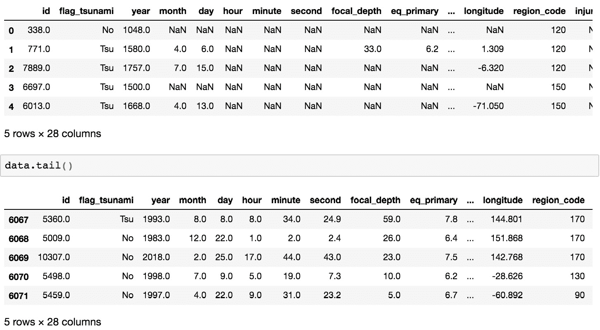

# 第二章：探索性数据分析与可视化

## 学习目标

到本章结束时，你将能够：

+   解释数据探索的重要性并传达数据集的总结性统计信息

+   可视化数据中缺失值的模式，并能够适当替换空值

+   识别连续特征和类别特征

+   可视化单个变量值的分布

+   使用相关性和可视化分析描述不同类型变量之间的关系

本章将带领我们进行对新数据集的探索与分析。

## 介绍

假设我们有一个问题陈述，涉及预测某次地震是否引发了海啸。我们如何决定使用什么模型？我们知道我们拥有的数据是什么吗？什么都不知道！但如果我们不了解数据，最终可能会构建一个既难以解释又不可靠的模型。

在数据科学中，深入理解我们处理的数据非常重要，这样可以生成高度信息量的特征，从而构建准确且强大的模型。

为了获得这种理解，我们对数据进行探索性分析，看看数据能告诉我们特征与目标变量之间的关系。了解数据甚至有助于我们解释构建的模型，并找出改善其准确性的方法。

我们实现这一目标的方法是让数据揭示其结构或模型，这有助于我们获得一些新的、常常是意想不到的数据洞察。让我们深入了解这种方法。

### 探索性数据分析（EDA）

**探索性数据分析**（**EDA**）被定义为一种分析数据集的方法，旨在总结其主要特征，通常采用可视化方法。

EDA 的目的：

+   发现数据集中的模式

+   发现异常

+   对数据的行为形成假设

+   验证假设

从基础的总结性统计数据到复杂的可视化图形，都帮助我们对数据本身形成直观的理解，这在形成新的假设和揭示哪些参数影响目标变量时非常重要。通常，通过发现目标变量如何随单一特征的变化而变化，可以帮助我们判断某个特征的重要性，而多个特征组合的变化则帮助我们构思新的有用特征。

大多数探索和可视化的目的是理解特征与目标变量之间的关系。因为我们想要找出我们拥有的数据和我们想要预测的值之间存在哪些（或不存在的）关系。

一些非常基本的领域知识通常是必要的，以便能够理解问题陈述本身以及数据所传达的信息。在本章中，我们将探索通过分析我们拥有的特征，了解更多关于数据的方式。

EDA 可以告诉我们：

+   不干净、缺失值或存在异常值的特征

+   具有信息价值并且是目标的良好指示器的特征

+   特征与目标之间的关系类型

+   数据可能需要的其他特征，而这些特征我们现在还没有

+   你可能需要单独处理的边缘情况

+   你可能需要在数据集上应用的过滤器

+   错误或虚假的数据点的存在

现在我们已经了解了为什么 EDA 很重要以及它能告诉我们什么，接下来让我们讨论一下 EDA 具体包括什么内容。EDA 可以包括从查看基本的摘要统计到可视化多个变量之间复杂趋势的任何操作。然而，即使是简单的统计数据和图表也可以是强大的工具，因为它们可能揭示出数据中的重要事实，这些事实可能会改变我们建模的视角。当我们看到表示数据的图表时，我们能够轻松地检测到趋势和模式，相比于仅仅处理原始数据和数字。这些可视化进一步让我们能够提出类似“如何？”和“为什么？”的问题，并对数据集形成假设，这些假设可以通过进一步的可视化来验证。这是一个持续的过程，能够帮助我们更深入地理解数据。本章将向你介绍一些可以用来探索任何数据集的基本工具，同时牢记最终的问题陈述。

我们将从一些基本的摘要统计量开始，介绍如何解读它们，接着是关于查找、分析和处理缺失值的部分。然后我们将研究单变量关系，即单个变量的分布和行为。最后，我们会探讨变量之间关系的探索部分。本章将向你介绍可以用来获得数据集及其特征基本概览的图表类型，以及如何通过创建结合多个特征的可视化来获得见解，我们还将通过一些示例展示它们如何使用。

我们将用于探索性分析和可视化的数据集来自 NOAA 的*重大地震数据库*，该数据集作为公共数据集可在 Google BigQuery 上获取（`表 ID：'bigquery-public-data.noaa_significant_earthquakes.earthquakes'`）。我们将使用其中部分列，相关元数据可以在[`console.cloud.google.com/bigquery?project=packt-data&folder&organizationId&p=bigquery-public-data&d=noaa_significant_earthquakes&t=earthquakes&page=table`](https://console.cloud.google.com/bigquery?project=packt-data&folder&organizationId&p=bigquery-public-data&d=noaa_significant_earthquakes&t=earthquakes&page=table)查看，并将其加载到 pandas DataFrame 中以进行探索。我们主要使用 Matplotlib 来进行大多数可视化，同时也会使用 Seaborn 和 Missingno 进行部分可视化。然而需要注意的是，Seaborn 只是对 Matplotlib 功能的封装，因此任何使用 Seaborn 绘制的图表都可以使用 Matplotlib 绘制。我们会通过混合使用两个库的可视化方式，来保持事情的趣味性。

探索和分析将以一个示例问题为基础进行：*给定我们拥有的数据，我们希望预测地震是否引发了海啸*。这将是一个分类问题（更多内容请见*第四章*，*分类*），其中目标变量是`flag_tsunami`列。

### 练习 10：导入数据探索所需的库

在我们开始之前，首先导入我们将用于大多数数据操作和可视化的必要库：

1.  在 Jupyter Notebook 中，导入以下库：

    ```py
    import json
    import pandas as pd
    import numpy as np
    import missingno as msno
    from sklearn.impute import SimpleImputer
    %matplotlib inline
    import matplotlib.pyplot as plt
    import seaborn as sns
    ```

    `%matplotlib inline`命令允许 Jupyter 在 Notebook 中直接显示图表。

1.  我们还可以读取包含每列数据类型的元数据，这些数据类型以 JSON 文件的形式存储。可以使用以下命令完成此操作。该命令将以可读格式打开文件，并使用`json`库将文件读入字典：

    ```py
    with open('dtypes.json', 'r') as jsonfile:
        dtyp = json.load(jsonfile)
    ```

现在，让我们开始吧。

## 汇总统计与中心值

为了了解我们的数据到底是什么样子，我们使用一种叫做**数据分析**的技术。数据分析被定义为检查现有信息源（例如数据库或文件）中的数据，并收集关于该数据的统计信息或信息摘要的过程。目标是确保你充分理解你的数据，并能够尽早识别数据可能带来的挑战，这通过总结数据集并评估其结构、内容和质量来实现。

数据分析包括收集描述性统计和数据类型。以下是一些常用的命令，可以用来获取数据集的总结信息：

+   `data.info()`：此命令告诉我们每列中有多少非空值，并显示每列值的数据类型（非数值类型以 `object` 类型表示）。

+   `data.describe()`：该命令为 DataFrame 中所有数值列提供基本的总结统计数据，例如非空值的计数、最小值和最大值、均值和标准差，以及所有数值特征的四分位数百分位数。如果有任何字符串类型的特征，则不包括这些特征的总结。

+   `data.head()` 和 `data.tail()`：这两个命令分别显示 DataFrame 的前五行和后五行数据。虽然前面的命令可以给我们一个数据集的总体概览，但更深入地了解实际数据本身是一个好主意，可以使用这些命令来完成。

### 标准差

标准差表示 *x* 的值分布的广泛程度。

对于一组数值 xi，标准差由以下公式给出：


###### 图 2.1：标准差公式

这里，𝝈 是标准差，*N* 是数据点的数量，𝝁 是均值。

假设我们有一组 10 个值，*x = [0,1,1,2,3,4,2,2,0,1]*。均值 𝝁 将是这些值的总和除以 10。也就是说，𝝁 = 1.6：


###### 图 2.2：x 的均方值

然后，标准差 = sqrt(14.4/10) = 1.2。

### 百分位数

对于一组值，*n**th* 百分位数是大于该值的数值所占比例为 *n%* 的数据点。例如，第 50*th* 百分位数是数据集中大于该值和小于该值的元素数量相同的值。此外，数据集的第 50 百分位数也称为其中位数，第 25 百分位数和第 75 百分位数也称为下四分位数和上四分位数。

假设我们有与之前相同的 10 个值，*x = [0,1,1,2,3,4,2,2,0,1]*。我们先对这个值列表进行排序。排序后，得到 *x = [0,0,1,1,1,2,2,2,3,4]*。为了找到第 25 百分位数，我们首先计算该值所在的索引：*i = (p/100) * n)*，其中 *p = 25*，*n = 10*。然后，*i = 2.5*。

由于 *i* 不是整数，我们将其四舍五入为 3，并取排序列表中的第三个元素作为第 25 百分位数。给定列表中的第 25 百分位数是 *1*，即我们排序后的列表中的第三个元素。

### 练习 11：我们数据集的总结统计

在本练习中，我们将使用之前了解过的总结统计函数，获取我们数据集的基本情况：

1.  将地震数据读入一个 `data` pandas DataFrame，并使用在上一练习中通过 `json` 库读取的 `dtyp` 字典来指定 CSV 中每一列的数据类型：

    ```py
    data = pd.read_csv('earthquake_data.csv', dtype=dtyp)
    ```

1.  使用 `data.info()` 函数来获取数据集的概览：

    ```py
    data.info()
    ```

    输出将如下所示：

    

    ###### 图 2.3：数据集概览

1.  打印数据集的前五行和最后五行。前五行打印如下：

    ```py
    data.head()
    ```

    输出将如下所示：

    

    ###### 图 2.4：前五行

    最后五行打印如下：

    ```py
    data.tail()
    ```

    输出将如下所示：

    

    ###### 图 2.5：最后五行

    我们可以在这些输出中看到，共有 28 列，但并不是所有列都显示出来。只显示了前 10 列和最后 10 列，省略号表示中间还有其他未显示的列。

1.  使用 `data.describe()` 查找数据集的摘要统计信息。运行 `data.describe().T`：

    ```py
    data.describe().T
    ```

    在这里，`.T` 表示我们正在对应用的 DataFrame 进行转置操作，即将列转换为行，反之亦然。将其应用于 `describe()` 函数，可以使我们更容易地查看输出，因为转置后的 DataFrame 中每一行现在都对应于单个特征的统计数据。

    我们应该得到如下输出：


###### 图 2.6：摘要统计

请注意，这里的 `describe()` 函数仅显示具有数值的列的统计信息。这是因为我们无法为具有非数值的列计算统计信息。

## 缺失值

当某个数据点的特征没有记录值（即缺失值）时，我们称数据缺失。在真实的数据集中出现缺失值是不可避免的；没有数据集是完美的。然而，理解为什么数据会缺失，以及是否有某种因素影响了数据丢失是很重要的。理解和认识到这一点可以帮助我们以合适的方式处理剩余数据。例如，如果数据缺失是随机的，那么剩余数据很可能仍能代表总体。然而，如果缺失的数据不是随机的，我们却假设它是随机的，可能会偏向我们的分析和后续建模。

让我们来看一下缺失数据的常见原因（或机制）：

+   **完全随机缺失**（**MCAR**）：如果数据集中的缺失值与任何其他记录的变量或外部参数之间没有任何相关性，则该值被认为是 MCAR。这意味着剩余的数据仍然能够代表总体，尽管这种情况很少发生，并且将缺失数据视为完全随机通常是一个不现实的假设。

    例如，在一项研究中，研究 K12 儿童肥胖的原因，MCAR 是父母忘记带孩子去诊所参加研究的情况。

+   **随机缺失** (**MAR**)：如果数据缺失的情况与已记录的数据相关，而不是与未记录的数据相关，那么数据被认为是 MAR。由于无法通过统计方法验证数据是否为 MAR，我们只能依赖于其是否为合理的可能性。

    在 K12 研究中，缺失数据是由于父母搬到其他城市，导致孩子不得不退出研究；*缺失性*与研究本身无关。

+   **缺失非随机** (**MNAR**)：既不是 MAR 也不是 MCAR 的数据被称为 MNAR。这是一个不可忽略的非响应情况，也就是说，缺失的变量值与其缺失的原因相关。

    继续以案例研究为例，如果父母对研究的性质感到反感，不希望孩子受到欺负，因此他们将孩子从研究中撤出，那么数据将是 MNAR。

### 寻找缺失值

既然我们已经了解了熟悉数据缺失原因的重要性，接下来我们来讨论如何在数据集中找到这些缺失值。对于 pandas DataFrame，通常使用 `.isnull()` 方法创建空值掩码（即一个布尔值的 DataFrame），用以指示空值的位置——在任意位置的 `True` 值表示空值，而 `False` 值表示该位置存在有效值。

#### 注意

`.isnull()` 方法可以与 `.isna()` 方法互换使用。对于 pandas DataFrame，这两个方法的功能完全相同——之所以有两个方法实现相同的功能，是因为 pandas DataFrame 最初是基于 R DataFrame 的，因此复用了很多 R 中的语法和思想。

数据缺失是否随机可能不会立刻显现：通过两种常见的可视化技术，可以发现数据集中各特征之间缺失值的性质：

+   **空值矩阵**：这是一种数据密集的展示方式，能帮助我们快速可视化数据补全中的模式。它让我们一眼看到每个特征（以及跨特征）的空值分布、数量以及它们与其他特征出现的频率。

+   **空值相关热图**：该热图形象地描述了每对特征之间的空值关系（或数据完整性关系），即它衡量了一个变量的存在或缺失对另一个变量存在的影响强度。

    与常规相关性类似，空值相关性值的范围从 -1 到 1：前者表示一个变量出现时另一个变量肯定不出现，后者则表示两个变量同时存在。值为 0 表示一个变量的空值对另一个变量为空没有影响。

### 练习 12：可视化缺失值

我们来分析缺失值的性质，首先查看每个特征的缺失值数量和百分比，然后使用 Python 中的 `missingno` 库绘制空值矩阵和相关性热图：

1.  计算每列缺失值的数量和百分比，并按降序排列。我们将使用 `.isnull()` 函数在 DataFrame 上获取掩码。每列的空值数量可以通过对掩码 DataFrame 使用 `.sum()` 函数来获得。同样，空值的比例可以通过对掩码 DataFrame 使用 `.mean()` 函数得到，并乘以 100 转换为百分比。

    然后，我们使用 `pd.concat()` 函数将空值的总数和百分比合并成一个单一的 DataFrame，并按空值的百分比对行进行排序，最后打印出 DataFrame：

    ```py
    mask = data.isnull()
    total = mask.sum()
    percent = 100*mask.mean()
    missing_data = pd.concat([total, percent], axis=1,join='outer',
                   keys=['count_missing', 'perc_missing'])
    missing_data.sort_values(by='perc_missing', ascending=False, inplace=True)
    missing_data
    ```

    输出结果如下：

    

    ###### 图 2.7：每列缺失值的数量和百分比

    在这里，我们可以看到 `state`、`total_damage_millions_dollars` 和 `damage_millions_dollars` 列的缺失值超过 90%，这意味着数据集中这些列中不到 10% 的数据点是可用的。另一方面，`year`、`flag_tsunami`、`country` 和 `region_code` 列没有缺失值。

1.  绘制空值矩阵。首先，我们使用 `.any()` 函数在上一步的掩码 DataFrame 上查找包含任何空值的列列表。然后，我们使用 `missingno` 库绘制空值矩阵，针对数据集中随机抽取的 500 个数据点，仅绘制那些包含缺失值的列：

    ```py
    nullable_columns = data.columns[mask.any()].tolist()
    msno.matrix(data[nullable_columns].sample(500))
    plt.show()
    ```

    输出结果如下：

    

    ###### 图 2.8：空值矩阵

    在这里，黑色线条代表非空值，而白色线条则表示该列中存在空值。通过一眼看去，`location_name` 似乎完全填充（我们从之前的步骤知道，这一列实际上只有一个缺失值），而 `latitude` 和 `longitude` 列大多完整，但有一些空白。

    右侧的火花线总结了数据完整性的总体形状，并指出数据集中空值最多和最少的行。

1.  绘制空值相关性热图。我们将使用 `missingno` 库绘制数据集的空值相关性热图，仅针对那些包含空值的列：

    ```py
    msno.heatmap(data[nullable_columns], figsize=(18,18))
    plt.show()
    ```

    输出结果如下：


###### 图 2.9：空值相关性热图

在这里，我们还可以看到一些标记为`injuries`和`total_injuries`的框，这告诉我们有一些记录分别包含这两个值中的一个，但不同时包含这两个值。这类情况需要特别关注——如果这些变量之间的相关性较高，那么拥有两个值并没有意义，两个值中的一个可以被删除。

### 缺失值的插补策略

处理列中缺失值的方法有多种。最简单的方法是直接删除缺失值所在的行；然而，这样做可能会导致丢失其他列中的有价值信息。另一个选项是插补数据，即用从已知部分数据推断出的有效值替代缺失值。常见的插补方法列举如下：

+   创建一个新的值，该值不同于其他值，用来替代列中的缺失值，以便完全区分这些行。然后，使用非线性机器学习算法（如集成模型或支持向量机）来区分这些值。

+   使用列中的适当中心值（均值、中位数或众数）来替换缺失值。

+   使用模型（例如 K 近邻或高斯混合模型）来学习替换缺失值的最佳值。

Python 有一些函数对于用静态值替换列中的空值非常有用。实现这一功能的一种方法是使用内建的 pandas `.fillna(0)`函数：在插补中没有歧义——用来替代列中空数据点的静态值即为传递给函数的参数（括号中的值）。

然而，如果列中空值的数量较多，并且无法立即明确可以用来替换每个空值的适当中心值，那么我们可以选择删除包含空值的行，或从建模的角度完全删除该列，因为它可能不会带来任何显著的价值。这可以通过在 DataFrame 上使用`.dropna()`函数来完成。可以传递给该函数的参数包括：

+   `axis`：此参数定义了是删除行还是删除列，通过将参数分别赋值为 0 或 1 来确定。

+   `how`：可以将`all`或`any`的值赋给此参数，以指示行/列是否应包含所有空值以删除该列，或者是否至少有一个空值时删除该列。

+   `thresh`：此参数定义了行/列必须具有的最小空值数量，才会被删除。

此外，如果无法为分类特征的空值确定合适的替代值，可以考虑在特征中创建一个新的类别来表示空值，而不是删除该列。

#### 注意

如果从直观理解或领域知识上立即能够看出如何替换列的空值，那么我们可以当场替换这些值。然而，在许多情况下，这些推断会在探索过程的后期变得更加明显。在这些情况下，我们可以根据找到的合适方法，随时替换空值。

### 练习 13：使用 pandas 填充

让我们查看缺失值，并将它们替换为零，针对那些具有至少一个空值的基于时间的（连续）特征（如月份、日期、小时、分钟和秒）。我们这样做是因为对于没有记录值的情况，可以安全地假设事件发生在时间段的开始。

1.  创建一个列表，包含我们想要填充值的列名：

    ```py
    time_features = ['month', 'day', 'hour', 'minute', 'second']
    ```

1.  使用 `.fillna()` 填充空值。我们将使用 pandas 的内建 `.fillna()` 函数，将这些列中的缺失值替换为 `0`，并将 `0` 作为参数传递给函数：

    ```py
    data[time_features] = data[time_features].fillna(0)
    ```

1.  使用 `.info()` 函数查看填充列的空值计数：

    ```py
    data[time_features].info()
    ```

    输出将如下所示：


###### 图 2.10：空值计数

如今，我们可以看到，数据框中所有特征的值都已经是非空值。

### 练习 14：使用 scikit-learn 填充

让我们使用 scikit-learn 的 `SimpleImputer` 类，替换与描述相关的分类特征中的空值。在*练习 12：可视化缺失值*中，我们看到几乎所有这些特征中超过 50% 的值都是空值。将这些空值替换为中心值可能会对我们试图构建的模型产生偏差，使它们变得不相关。因此，我们将空值替换为一个单独的类别，值为 `NA`：

1.  创建一个列表，包含我们想要填充值的列名：

    ```py
    description_features = [
        'injuries_description', 'damage_description',
        'total_injuries_description', 'total_damage_description'
    ]
    ```

1.  创建一个 `SimpleImputer` 类的对象。在这里，我们首先创建一个 `imp` 对象，并使用表示如何填充数据的参数初始化它。我们将传递给对象初始化的参数包括：

    `missing_values`：这是缺失值的占位符，即所有出现在 `missing_values` 参数中的值将被填充。

    `strategy`：这是填充策略，可以是 `mean`、`median`、`most_frequent`（即众数）或 `constant`。前三者只能用于数值数据，并会通过指定的中心值替换每列中的缺失值，而最后一个则会根据 `fill_value` 参数，用常数替换缺失值。

    `fill_value`：指定用来替换所有 `missing_values` 的值。如果保持默认设置，当填充数值数据时，填充值将为 `0`，而字符串或对象数据类型将使用 `missing_value` 字符串。

    ```py
    imp = SimpleImputer(missing_values=np.nan, strategy='constant', fill_value='NA')
    ```

1.  执行填充。我们将使用 `imp.fit_transform()` 实际执行填充。它将带有空值的 DataFrame 作为输入，并返回填充后的 DataFrame：

    ```py
    data[description_features] = imp.fit_transform(data[description_features])
    ```

1.  使用 `.info()` 函数查看填充列的空值计数：

    ```py
    data[description_features].info()
    ```

    输出将如下所示：


###### 图 2.11：空值计数

### 练习 15：使用推断值进行填充

让我们用来自类别 `damage_description` 特征的信息替换连续的 `damage_millions_dollars` 特征中的空值。尽管我们可能不知道确切的损失金额，但类别特征为我们提供了因地震造成的损失金额的范围信息：

1.  找出有多少行的 `damage_millions_dollars` 值为空，以及其中有多少行的 `damage_description` 值不为空：

    ```py
    print(data[pd.isnull(data.damage_millions_dollars)].shape[0])
    print(data[pd.isnull(data.damage_millions_dollars) & (data.damage_description != 'NA')].shape[0])
    ```

    输出将如下所示：

    

    ###### 图 2.12：包含空值的行数

    如我们所见，5,594 个空值中有 3,849 个可以通过另一个变量轻松替换。

1.  找出每个类别的平均 `damage_millions_dollars` 值。由于 `damage_description` 中的每个类别代表一系列值，我们从已存在的非空值中找到每个类别的平均 `damage_millions_dollars` 值。这些为该类别提供了合理的最可能值估算：

    ```py
    category_means = data[['damage_description', 'damage_millions_dollars']].groupby('damage_description').mean()
    category_means
    ```

    输出将如下所示：

    

    ###### 图 2.13：每个类别的平均 damage_millions_dollars 值

1.  将平均值存储为字典。在此步骤中，我们将包含平均值的 DataFrame 转换为字典（Python `dict` 对象），这样访问它们就更加方便。

    此外，由于新创建的 `NA` 类别（在前一个练习中的填充值）的值为 `NaN`，并且 `0` 类别的值缺失（数据集中没有 `damage_description` 等于 `0` 的行），我们也明确地将这些值添加到字典中：

    ```py
    replacement_values = category_means.damage_millions_dollars.to_dict()
    replacement_values['NA'] = -1
    replacement_values['0'] = 0
    replacement_values
    ```

    输出将如下所示：

    

    ###### 图 2.14：平均值字典

1.  创建一系列替代值。对于 `damage_description` 列中的每个值，我们使用 `map` 函数将类别值映射到平均值。`.map()` 函数用于将列中的键映射到 `replacement_values` 字典中每个元素的对应值：

    ```py
    imputed_values = data.damage_description.map(replacement_values)
    ```

1.  替换列中的空值。我们通过使用 `np.where` 作为三元运算符来实现：第一个参数是掩码，第二个是如果掩码为正时从中获取值的系列，第三个是如果掩码为负时从中获取值的系列。

    这确保了 `np.where` 返回的数组仅将 `damage_millions_dollars` 中的空值替换为 `imputed_values` 序列中的值：

    ```py
    data['damage_millions_dollars'] = np.where(condition=data.damage_millions_dollars.isnull(),
                                   x=imputed_values,
                                   y=data.damage_millions_dollars)
    ```

1.  使用 `.info()` 函数查看填充列的空值计数：

    ```py
    data[['damage_millions_dollars']].info()
    ```

    输出结果如下：


###### 图 2.15：空值计数

我们可以看到，替换后 `damage_millions_dollars` 列中没有空值。

### 活动 2：汇总统计与缺失值

在本活动中，我们将回顾本章中到目前为止看到的一些汇总统计和缺失值分析。我们将使用一个新的数据集，来自 Kaggle 的 *House Prices: Advanced Regression Techniques* 比赛（可以在 [`www.kaggle.com/c/house-prices-advanced-regression-techniques/data`](https://www.kaggle.com/c/house-prices-advanced-regression-techniques/data) 或 GitHub 上的 [`github.com/TrainingByPackt/Applied-Supervised-Learning-with-Python`](https://github.com/TrainingByPackt/Applied-Supervised-Learning-with-Python) 获取）。虽然在练习中使用的地震数据集是针对解决分类问题的（当目标变量只有离散值时），我们将在活动中使用的数据集将用于解决回归问题（当目标变量包含连续值的范围时）。我们将使用 pandas 函数生成汇总统计，并通过空值矩阵和空值相关热图可视化缺失值。

执行的步骤如下：

1.  读取数据。

1.  使用 pandas 的 `.info()` 和 `.describe()` 方法查看数据集的汇总统计信息。

1.  查找每列的缺失值总数和缺失值百分比，并按缺失百分比的降序显示至少有一个空值的列。

1.  绘制空值矩阵和空值相关热图。

1.  删除缺失值超过 80% 的列。

1.  将 `FireplaceQu` 列中的空值替换为 `NA` 值。

    #### 注意

    本活动的解决方案可以在第 307 页找到。

## 值的分布

在本节中，我们将查看各个变量的行为——它们取什么值，这些值的分布如何，以及如何以可视化方式表示这些分布。

### 目标变量

目标变量可以是连续值（回归问题的情况）或离散值（分类问题的情况）。本章讨论的问题是预测地震是否引发海啸，也就是 `flag_tsunami` 变量，它只有两个离散值——因此是一个分类问题。

可视化有多少地震引发了海啸，以及有多少没有引发海啸的一种方法是柱状图，其中每个柱子代表一个离散值，柱子的高度等于具有相应离散值的数据点的计数。这为我们提供了每个类别的绝对计数的良好比较。

### 练习 16：绘制柱状图

让我们看看数据集中有多少地震引发了海啸。我们将通过对列使用`value_counts()`方法，并直接对返回的 pandas 系列使用`.plot(kind='bar')`函数来完成。按照以下步骤操作：

1.  使用 `plt.figure()` 初始化绘图：

    ```py
    plt.figure(figsize=(8,6))
    ```

1.  接下来，输入我们的主要绘图命令：

    ```py
    data.flag_tsunami.value_counts().plot(kind='bar')
    ```

1.  设置显示参数并显示图表：

    ```py
    plt.ylabel('Number of data points')
    plt.xlabel('flag_tsunami')
    plt.show()
    ```

    输出将如下所示：


###### 图 2.16：柱状图显示有多少地震引发了海啸

从这个柱状图中，我们可以看到大多数地震没有引发海啸，而且不到三分之一的地震引发了海啸。这显示出数据集略微失衡。

让我们更仔细地看一下这些 Matplotlib 命令的作用：

+   `plt.figure(figsize=(8,6))`：此命令定义了我们的图表大小，通过提供宽度和高度的值。这是所有绘图命令之前的第一条命令。

+   `plt.xlabel()` 和 `plt.ylabel()`：这些命令接受字符串作为输入，允许我们指定图表中*X*轴和*Y*轴的标签。

+   `plt.show()`：这是绘图时写入的最后一条命令，它将图表以内联方式显示在 Jupyter Notebook 中。

### 类别数据

类别变量是那些具有离散值，表示不同类别或观察水平的变量，可以是字符串对象或整数值。例如，我们的目标变量`flag_tsunami`是一个类别变量，具有两个类别：`Tsu`和`No`。

类别变量可以分为两种类型：

+   `location_name`。这个变量的值不能说是有序的，也就是说，一个地点并不*大于*另一个地点。类似的变量示例还包括颜色、鞋类类型、种族类型等。

+   `damage_description`，因为每个值表示逐渐增加的损害值。另一个例子可以是星期几，其值从星期一到星期天，具有一定的顺序关系，我们知道星期四在星期三之后，但在星期五之前。

    尽管有序变量可以通过对象数据类型表示，但它们通常也表示为数值数据类型，这通常使得它们与连续变量之间的区分变得困难。

处理数据集中的类别变量时面临的主要挑战之一是高基数，即大量的类别或不同的值，其中每个值在数据集中的出现次数相对较少。例如，`location_name`具有大量的唯一值，每个值在数据集中的出现频率较低。

此外，非数值型的类别变量总是需要某种形式的预处理，将其转换为数值格式，以便机器学习模型能够读取并进行训练。在没有丢失上下文信息的情况下，如何将类别变量编码为数值型是一个挑战。尽管这些信息对于人类来说（由于领域知识或常识）非常容易理解，但计算机却很难自动理解。例如，像国家或地点名称这样的地理特征本身并不能表明不同值之间的地理接近性，但这可能是一个重要特征——如果发生在东南亚地区的地震比欧洲地区的地震触发更多海啸呢？仅仅通过数值编码特征，无法捕获这些信息。

### 练习 17：类别变量的数据类型

让我们找出地震数据集中哪些变量是类别型的，哪些是连续型的。正如我们现在所知道的，类别变量也可以具有数值值，因此，拥有数值数据类型并不意味着变量就是连续型的：

1.  找出所有数值型和对象型的列。我们在 DataFrame 上使用 `.select_dtypes()` 方法，创建一个包含数值型（`np.number`）和类别型（`np.object`）列的子集 DataFrame，然后打印每个列的列名。对于数值列，请使用以下方法：

    ```py
    numeric_variables = data.select_dtypes(include=[np.number])
    numeric_variables.columns
    ```

    输出将如下所示：

    

    ###### 图 2.17：所有数值型的列

    对于类别列，请使用以下方法：

    ```py
    object_variables = data.select_dtypes(include=[np.object])
    Object_variables.columns
    ```

    输出将如下所示：

    

    ###### 图 2.18：所有对象类型的列

    这里显然可以看出，对象类型的列是类别变量。为了区分数值列中的类别变量和连续变量，让我们查看这些特征的唯一值数量。

1.  找出数值特征的唯一值数量。我们在 DataFrame 上使用 `select_dtypes` 方法，找到每一列的唯一值数量，并将结果序列按升序排序。对于数值列，请使用以下方法：

    ```py
    numeric_variables.nunique().sort_values()
    ```

    输出将如下所示：


###### 图 2.19：数值特征的唯一值数量

对于类别列，请使用以下方法：

```py
object_variables.nunique().sort_values()
```

输出将如下所示：


###### 图 2.20：分类列的唯一值数量

对于数值型变量，我们可以看到前九个变量的唯一值显著少于其余行，这些变量很可能是分类变量。然而，我们必须记住，其中一些可能只是具有较小范围的四舍五入值的连续变量。另外，`month` 和 `day` 在这里不会被视为分类变量。

### 练习 18：计算类别值计数

对于具有分类值的列，查看该特征的唯一值（类别）以及这些类别的频率将非常有用，也就是说，每个不同的值在数据集中出现的次数。我们来找出 `injuries_description` 分类变量中每个 `0` 到 `4` 标签和 `NaN` 值的出现次数：

1.  对 `injuries_description` 列使用 `value_counts()` 函数来找出每个类别的频率。使用 `value_counts` 会以降序形式返回每个值的频率，并以 pandas 系列的形式显示：

    ```py
    counts = data.injuries_description.value_counts(dropna=False)
    counts
    ```

    输出应如下所示：

    

    ###### 图 2.21：每个类别的频率

1.  按照顺序变量的升序排序这些值。如果我们希望按值本身的顺序显示频率，我们可以重置索引，从而得到一个 DataFrame，并按索引（即顺序变量）排序值：

    ```py
    counts.reset_index().sort_values(by='index')
    ```


###### 图 2.22：排序后的值

### 练习 19：绘制饼图

由于我们示例数据中的目标变量是分类的，*练习 16：绘制条形图* 中的示例展示了可视化分类值分布的一种方式（使用条形图）。另一种可以帮助我们轻松查看每个类别在整个数据集中所占比例的图表是饼图。让我们绘制一个饼图来可视化 `damage_description` 变量的离散值分布：

1.  将数据格式化成需要绘制的形式。在这里，我们对该列使用 `value_counts()` 并按索引排序系列：

    ```py
    counts = data.damage_description.value_counts()
    counts = counts.sort_index()
    ```

1.  绘制饼图。`plt.pie()` 分类函数使用计数数据绘制饼图。我们将按照 *练习 16：绘制条形图* 中描述的相同三步进行绘图：

    ```py
    plt.figure(figsize=(10,10))
    plt.pie(counts, labels=counts.index)
    plt.title('Pie chart showing counts for\ndamage_description categories')
    plt.show()
    ```

    输出结果将是：


###### 图 2.23：显示 `damage_description` 类别计数的饼图

### 连续数据

连续变量可以取任意数量的值，通常是整数（例如，死亡人数）或浮动数据类型（例如，山脉的高度）。了解特征中值的基本统计信息是非常有用的：`describe()` 函数的输出显示的最小值、最大值和百分位数给我们提供了一个合理的估算。

然而，对于连续变量来说，了解其在操作范围内的分布情况也非常有用。由于我们不能简单地计算各个值的计数，我们会将值按升序排列，将其分组为等间隔的区间，然后计算每个区间的计数。这为我们提供了底层的频率分布，绘制该分布便能得到直方图，从而让我们查看数据的形态、中心值以及变异性。

直方图为我们提供了一个简洁的视角，帮助我们了解正在查看的数据。它们让我们一目了然地看到数据的行为，揭示了底层分布（例如正态分布或指数分布）、异常值、偏度等信息。

#### 注意

很容易将条形图与直方图混淆。主要的区别在于，直方图用于绘制已被分组的连续数据以可视化频率分布，而条形图可以用于多种其他用途，包括表示我们之前处理的类别变量。此外，条形图中的条形高度表示该箱子的频率，但直方图中的宽度也会影响频率的表示，这在条形图中并不适用。

最常见的频率分布之一是高斯（或正态）分布。这是一种对称分布，具有钟形曲线，表示接近中间值的范围在数据集中出现频率最高，随着远离中间部分，频率对称性地减少。

它是一个概率分布，曲线下的面积等于一。


###### 图 2.24：正态分布

**偏度**

如果一个分布不是对称的，我们称其为偏斜的，偏度衡量的是变量相对于其均值的非对称性。偏度的值可以是正值、负值（或未定义）。在前一种情况下，尾巴位于分布的右侧，而后一种情况则表示尾巴位于左侧。

然而，必须注意的是，厚而短的尾部对偏度的影响与长而细的尾部相同。

**峰度**

峰度是衡量变量分布的*尾部形态*的一个指标，用来衡量一侧尾部是否存在异常值。较高的峰度值表示尾部较厚，且存在异常值。与偏度的概念类似，峰度也描述了分布的形态。

### 练习 20：绘制直方图

让我们使用 Seaborn 库绘制`eq_primary`特征的直方图：

1.  使用`plt.figure()`来启动绘图：

    ```py
    plt.figure(figsize=(10,7))
    ```

1.  `sns.distplot()`是我们用来绘制直方图的主要命令。第一个参数是用来绘制直方图的单维数据，bins 参数定义了箱子的数量和大小。使用方式如下：

    ```py
    sns.distplot(data.eq_primary.dropna(), bins=np.linspace(0,10,21))
    ```

1.  使用 `plt.show()` 显示图表：

    ```py
    plt.show()
    ```

    输出结果如下：


###### 图 2.25：eq_primary 特征的直方图

该图给出了一个标准化（或归一化）直方图，这意味着直方图下方的区域总和为 1。此外，直方图上的曲线是**核密度估计**，它给我们提供了变量的概率分布的形态。

从图中我们可以看到，`eq_primary` 的值大多位于 5 到 8 之间，这意味着大多数地震的震级是中等到高值，几乎没有地震震级非常低或非常高。

### 练习 21：偏度与峰度

让我们使用 pandas 核心函数计算数据集中所有特征的偏度和峰度值：

1.  使用 `.skew()` 数据框方法计算所有特征的偏度，然后按升序排序值：

    ```py
    data.skew().sort_values()
    ```

    输出结果将是：

    

    ###### 图 2.26：数据集中所有特征的偏度值

1.  使用 `.kurt()` 数据框方法计算所有特征的峰度：

    ```py
    data.kurt()
    ```

    输出结果将是：


###### 图 2.27：数据集中所有特征的峰度值

在这里，我们可以看到某些变量的峰度值显著偏离 0。这意味着这些列具有长尾。但是，这些变量尾部的值（即表示死亡、受伤人数以及损失金额的数值）在我们的案例中，可能是离群值，我们可能需要特别关注它们。较大的值可能实际上表示额外的因素，增加了由地震引起的破坏，即海啸。

### 活动 3：可视化表示值的分布

在这个活动中，我们将复习上一节关于不同类型数据的内容。我们将使用与*活动 2：摘要统计和缺失值*中相同的数据集，即 *房价：高级回归技术*（可以在[`www.kaggle.com/c/house-prices-advanced-regression-techniques/data`](https://www.kaggle.com/c/house-prices-advanced-regression-techniques/data) 或在 GitHub 上找到 [`github.com/TrainingByPackt/Applied-Supervised-Learning-with-Python`](https://github.com/TrainingByPackt/Applied-Supervised-Learning-with-Python)）。我们将使用不同类型的图表来可视化表示该数据集的值分布。

执行的步骤如下：

1.  使用 Matplotlib 绘制目标变量 `SalePrice` 的直方图。

1.  找出每个对象类型列中唯一值的数量。

1.  创建一个数据框，表示 `HouseStyle` 列中每个类别值的出现次数。

1.  绘制一个饼图，表示这些计数。

1.  查找每个具有数字类型的列中唯一值的数量。

1.  使用 Seaborn 绘制`LotArea`变量的直方图。

1.  计算每列值的偏度和峰度值。

    #### 注意

    此活动的解决方案可以在第 312 页找到。

## 数据中的关系

找到数据中变量之间关系的重要性有两个原因：

+   找出哪些特征可能是重要的可以被认为是至关重要的，因为找到与目标变量有强烈关系的特征将有助于特征选择过程。

+   找到不同特征之间的关系是有用的，因为数据集中的变量通常不可能完全独立于其他所有变量，而这可能会以多种方式影响我们的建模。

现在，我们有许多方法可以可视化这些关系，具体方法取决于我们试图找到关系的变量类型，以及我们考虑作为方程或比较的一部分的变量数量。

### 两个连续变量之间的关系

找到两个连续变量之间的关系，基本上是看一个变量的值增加时另一个变量如何变化。最常见的可视化方法是使用散点图，其中我们将每个变量沿一个轴（当我们有两个变量时，在二维平面中的*X*和*Y*轴）绘制，并使用标记在*X-Y*平面中绘制每个数据点。这种可视化能够很好地展示这两个变量之间是否存在某种关系。

然而，如果我们想量化两个变量之间的关系，最常用的方法是找到它们之间的相关性。如果目标变量是连续的，并且与另一个变量高度相关，这表明该特征在模型中是一个重要部分。

**皮尔逊相关系数**

**皮尔逊相关系数**是一种常用的相关系数，用来显示一对变量之间的线性关系。公式返回一个介于-1 和+1 之间的值，其中：

+   +1 表示强正相关

+   -1 表示强负相关

+   0 表示没有关系

同样，找到特征对之间的相关性也很有用。尽管高度相关的特征的存在不会使模型变差，但它们也不一定会使任何模型变得更好。为了简化起见，最好从一组高度相关的特征中只保留一个。

#### 注意

在拟合线性模型时，特征之间高度相关可能会导致模型不可预测且变化幅度较大。这是因为线性模型中每个特征的系数可以解释为在保持其他特征不变的情况下，目标变量的单位变化。然而，当一组特征不独立（即存在相关性）时，我们无法确定每个特征对目标变量的独立变化所造成的影响，导致系数变化幅度较大。

要找到 DataFrame 中每个数值特征与其他特征的成对相关性，可以在 DataFrame 上使用`.corr()`函数。

### 练习 22：绘制散点图

让我们绘制主震震中震级（*X*轴）与对应的受伤人数（*Y*轴）之间的散点图：

1.  过滤掉空值。由于我们知道两列中都有空值，首先让我们过滤数据，只保留非空行：

    ```py
    data_to_plot = data[~pd.isnull(data.injuries) & ~pd.isnull(data.eq_primary)]
    ```

1.  创建并显示散点图。我们将使用 Matplotlib 的`plt.scatter(x=..., y=...)`作为绘制数据的主要命令。`x`和`y`参数指定哪个特征应沿哪个轴绘制。它们接受单一维度的数据结构，如列表、元组或 pandas 系列。我们还可以向`scatter`函数传递更多参数，例如指定绘制单个数据点时使用的图标。例如，要使用红色的交叉符号作为图标，我们需要传递以下参数：`marker='x', c='r'`：

    ```py
    plt.figure(figsize=(12,9))
    plt.scatter(x=data_to_plot.eq_primary, y=data_to_plot.injuries)
    plt.xlabel('Primary earthquake magnitude')
    plt.ylabel('No. of injuries')
    plt.show()
    ```

    输出结果将如下所示：


###### 图 2.28：散点图

从图表中我们可以推断出，虽然受伤人数和震中震级之间似乎没有明显的趋势，但随着震级的增加，受伤人数较多的地震数量也在增加。然而，对于大多数地震而言，似乎没有明显的关系。

### 练习 23：相关性热力图

让我们使用 Seaborn 的`sns.heatmap()`函数绘制数据集中所有数值变量之间的相关性热力图，该函数基于数据集中的特征间相关性值。

传递给`sns.heatmap()`函数的可选参数是`square`和`cmap`，它们分别表示绘制的图表中每个像素应为正方形，并指定要使用的颜色方案：

1.  绘制一个包含所有特征的基本热力图：

    ```py
    plt.figure(figsize = (12,10))
    sns.heatmap(data.corr(), square=True, cmap="YlGnBu")
    plt.show()
    ```

    输出结果将是：

    

    ###### 图 2.29：相关性热力图

    从图表右侧的颜色条中我们可以看到，最小值大约为`-0.2`，对应的颜色是最浅的，这在某种程度上误导了相关性值的表示，实际相关性值范围应该是从-1 到 1。

1.  在一个更自定义的热图中绘制特征的子集。我们将使用 `vmin` 和 `vmax` 参数指定上下限，并使用带有注释的热图重新绘制，注释显示特征对之间的相关系数值。我们还将更改颜色方案，使其更易于解读——中性色白色表示无相关性，而越来越深的蓝色和红色分别表示更高的正相关性和负相关性：

    ```py
    feature_subset = [
        'focal_depth', 'eq_primary', 'eq_mag_mw', 'eq_mag_ms', 'eq_mag_mb', 'intensity',
        'latitude', 'longitude', 'injuries', 'damage_millions_dollars',
        'total_injuries', 'total_damage_millions_dollars']
    plt.figure(figsize = (12,10))
    sns.heatmap(data[feature_subset].corr(), square=True, annot=True, cmap="RdBu", vmin=-1, vmax=1)
    plt.show()
    ```

    输出结果如下：


###### 图 2.30：自定义的相关性热图

现在，虽然我们可以计算相关系数的值，但这仅仅提供了线性关系的指示。为了更好地判断是否存在可能的依赖关系，我们可以绘制特征对之间的散点图，这在变量之间的关系不明确时特别有用，因为通过可视化数据点的分布，我们可以大致判断这两个变量是否（以及如何）相关。

### 练习 24：Pairplot

pairplot 对于同时可视化多个特征对之间的关系非常有用，可以使用 Seaborn 的 `.pairplot()` 函数绘制。在这个练习中，我们将查看数据集中具有最高成对相关性的特征之间的 pairplot：

1.  定义一个包含要创建 pairplot 的特征子集的列表：

    ```py
    feature_subset = [
        'focal_depth', 'eq_primary', 'eq_mag_mw', 'eq_mag_ms', 'eq_mag_mb', 'intensity',
        'latitude', 'longitude', 'injuries', 'damage_millions_dollars',
        'total_injuries', 'total_damage_millions_dollars']
    ```

1.  使用 Seaborn 创建 pairplot。传递给绘图函数的参数是：`kind='scatter'`，表示我们希望网格中每一对变量之间的单独图形以散点图的形式展示；`diag_kind='kde'`，表示我们希望对角线上的图形（即两变量相同的位置）为核密度估计图。

    此外，还应该注意，对角线对称的图形本质上是相同的，只不过坐标轴被反转了：

    ```py
    plt.figure(figsize = (12,10))
    sns.heatmap(data[feature_subset].corr(), square=True, annot=True, cmap="RdBu", vmin=-1, vmax=1)
    plt.show()
    ```

    输出结果如下：


###### 图 2.31：具有最高成对相关性的特征之间的 pairplot

### 连续型变量与类别型变量之间的关系

当一个变量是类别型变量，另一个是连续型变量时，查看它们之间关系的一种常见方法是使用条形图或箱线图。

+   条形图有助于比较一个变量在一组离散参数中的值，是最常见的图形类型之一。每根条形代表一个类别值，条形的高度通常表示该类别下连续变量的聚合值（如平均值、总和或该类别中连续变量的值的计数）。

+   箱型图是一个矩形，用来表示每个离散类别变量的连续变量的分布。它不仅能够有效地展示异常值，还可以让我们比较不同类别变量下连续变量的分布。矩形的下边缘和上边缘分别代表第一和第三四分位数，矩形中间的线代表中位数，而矩形上下的点（或离群点）代表异常值。

### 练习 25：柱状图

让我们使用柱状图来可视化每个强度级别的地震所造成的海啸总数：

1.  预处理`flag_tsunami`变量。在使用`flag_tsunami`变量之前，我们需要预处理它，将`No`值转换为零，将`Tsu`值转换为一。这将为我们提供二元目标变量。为此，我们使用`.loc`操作符设置列中的值，`:`表示需要为所有行设置值，第二个参数指定要设置值的列名称：

    ```py
    data.loc[:,'flag_tsunami'] = data.flag_tsunami.apply(lambda t: int(str(t) == 'Tsu'))
    ```

1.  删除所有`intensity`值为 null 的行，去掉我们要绘制的数据：

    ```py
    subset = data[~pd.isnull(data.intensity)][['intensity','flag_tsunami']]
    ```

1.  查找每个`intensity`级别的海啸总数并显示数据框。为了将数据转换为可视化柱状图的格式，我们需要按每个强度级别对行进行分组，然后对`flag_tsunami`值进行求和，以获得每个强度级别的海啸总数：

    ```py
    data_to_plot = subset.groupby('intensity').sum()
    data_to_plot
    ```

    输出将如下所示：

    

    ###### 图 2.32：每个强度级别的海啸总数

1.  使用 Matplotlib 的`plt.bar(x=..., height=...)`方法绘制柱状图，该方法需要两个参数，一个指定绘制柱形的位置（`x`值），另一个指定每个柱形的高度。这两者都是一维数据结构，必须具有相同的长度：

    ```py
    plt.figure(figsize=(12,9))
    plt.bar(x=data_to_plot.index, height=data_to_plot.flag_tsunami)
    plt.xlabel('Earthquake intensity')
    plt.ylabel('No. of tsunamis')
    plt.show()
    ```

    输出将如下所示：


###### 图 2.33：柱状图

从这个图中，我们可以看到，随着地震强度的增加，造成的海啸数量也增加，但在强度超过 9 之后，海啸的数量似乎突然下降。

想想为什么会发生这种情况。或许只是因为高强度的地震较少，因此海啸也较少。或者可能是完全独立的因素；也许高强度的地震历史上发生在陆地上，无法引发海啸。探索数据以找出原因。

### 练习 26：箱型图

在本练习中，我们将绘制一个箱型图，表示具有至少 100 次地震的国家中`eq_primary`的变化：

1.  查找发生超过 100 次地震的国家。我们将查找数据集中所有国家的计数值。然后，我们将创建一个仅包含计数大于 100 的国家的系列：

    ```py
    country_counts = data.country.value_counts()
    top_countries = country_counts[country_counts > 100]
    top_countries
    ```

    输出将如下所示：

    

    ###### 图 2.34：地震超过 100 次的国家

1.  对 DataFrame 进行子集化，筛选出前面集合中包含的国家的行。为了筛选这些行，我们使用 `.isin()` 方法在 pandas 系列上选择包含传递为参数的类似数组对象中的值的行：

    ```py
    subset = data[data.country.isin(top_countries.index)]
    ```

1.  创建并显示箱形图。绘制数据的主要命令是 `sns.boxplot(x=..., y=..., data=..., order=)`。`x` 和 `y` 参数是 DataFrame 中要绘制在每个坐标轴上的列名——前者假定是类别变量，后者是连续变量。`data` 参数指定要从中获取数据的 DataFrame，`order` 参数接受一个类别名称列表，指示在 *X* 轴上显示类别的顺序：

    ```py
    plt.figure(figsize=(15, 15))
    sns.boxplot(x='country', y="eq_primary", data=subset, order=top_countries.index)
    plt.show()
    ```

    输出将如下所示：


###### 图 2.35：箱形图

### 两个类别变量之间的关系

当我们只关注一对类别变量以查找它们之间的关系时，最直观的方式是基于第一个类别将数据进行划分，然后再根据第二个类别变量进一步细分，查看结果的计数以找到数据点的分布。虽然这可能看起来有些混乱，但一种常见的可视化方式是使用堆叠条形图。与常规的条形图一样，每个条形图表示一个类别值。但每个条形图将再次被细分为颜色编码的子类别，这可以指示在主类别中有多少数据点落入每个子类别（即第二个类别）。类别数较多的变量通常被认为是主类别。

### 练习 27：堆叠条形图

在本练习中，我们将绘制一个堆叠条形图，表示每个强度级别发生的海啸数量：

1.  查找落入每个 `intensity` 和 `flag_tsunami` 分组值中的数据点数量：

    ```py
    grouped_data = data.groupby(['intensity', 'flag_tsunami']).size()
    grouped_data
    ```

    输出将如下所示：

    

    ###### 图 2.36：每个分组的强度和 flag_tsunami 中落入的数据点

1.  对结果 DataFrame 使用 `.unstack()` 方法，将一级索引（`flag_tsunami`）作为列：

    ```py
    data_to_plot = grouped_data.unstack()
    data_to_plot
    ```

    输出将如下所示：

    

    ###### 图 2.37：一级索引

1.  创建堆叠条形图。我们首先使用 `sns.set()` 函数来指示我们希望使用 Seaborn 作为可视化库。然后，我们可以轻松地使用 pandas 中的原生 `.plot()` 函数，通过传递 `kind='bar'` 和 `stacked=True` 参数来绘制堆叠条形图：

    ```py
    sns.set()
    data_to_plot.plot(kind='bar', stacked=True, figsize=(12,8))
    plt.show()
    ```

    输出将如下所示：


###### 图 2.38：堆叠条形图

现在，该图表让我们能够可视化和解释每个强度级别导致海啸的地震比例。在*练习 25: 条形图*中，我们看到大于 9 级的地震所导致的海啸数量有所下降。从这个图中，我们可以确认，主要是因为超过 10 级的地震数量减少了；而 11 级的地震所导致的海啸比例甚至有所增加。

### 活动 4: 数据内的关系

在本次活动中，我们将回顾上一节中关于数据关系的学习内容。我们将使用与*活动 2: 汇总统计和缺失值*相同的数据集，即*房价：高级回归技术*（可在[`www.kaggle.com/c/house-prices-advanced-regression-techniques/data`](https://www.kaggle.com/c/house-prices-advanced-regression-techniques/data)或 GitHub 上的[`github.com/TrainingByPackt/Applied-Supervised-Learning-with-Python`](https://github.com/TrainingByPackt/Applied-Supervised-Learning-with-Python)找到）。我们将使用不同的图表来突出显示数据集中的值之间的关系。

要执行的步骤如下：

1.  绘制数据集的相关性热图。

1.  绘制一个更紧凑的热图，使用以下特征子集并带有相关性值的注释：

    ```py
    feature_subset = [
        'GarageArea', 'GarageCars','GarageCond','GarageFinish','GarageQual','GarageType',
        'GarageYrBlt','GrLivArea','LotArea','MasVnrArea','SalePrice'
    ]
    ```

1.  显示相同特征子集的配对图，KDE 图位于对角线位置，散点图位于其他地方。

1.  创建一个箱型图，显示`SalePrice`在每个`GarageCars`类别中的变化。

1.  使用 Seaborn 绘制折线图，显示旧公寓和新建公寓的`SalePrice`变化。

    #### 注意

    本次活动的解决方案可以在第 319 页找到。

## 概述

在本章中，我们首先讨论了为什么数据探索是建模过程中的重要部分，它不仅有助于对数据集进行预处理，还能帮助我们设计具有信息量的特征并提高模型的准确性。本章不仅侧重于对数据集及其特征的基本概览，还通过创建结合多个特征的可视化来获得洞见。

我们研究了如何使用 pandas 的核心功能找到数据集的汇总统计数据。我们还研究了如何发现缺失值，并讨论了它们的重要性，同时学习如何使用 Missingno 库分析这些缺失值，以及使用 pandas 和 scikit-learn 库填补缺失值。

接下来，我们研究了如何研究数据集中变量的单变量分布，并通过条形图、饼图和直方图等可视化方式展示这些分布。最后，我们学习了如何探索变量之间的关系，并了解到它们可以通过散点图、热图、箱型图、堆积条形图等形式进行表示。

在接下来的章节中，我们将开始探索监督式机器学习算法。现在我们已经了解了如何探索我们拥有的数据集，我们可以进入建模阶段。下一章将介绍回归：一种主要用于构建连续目标变量模型的算法类别。
