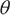
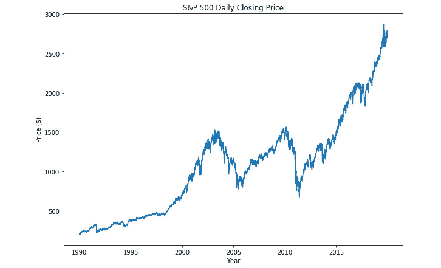

# 第三章：回归分析

## 学习目标

在本章结束时，您将能够：

+   描述回归模型，并解释回归与分类问题的区别

+   解释梯度下降的概念，它在线性回归问题中的应用，以及如何应用到其他模型架构中

+   使用线性回归为*x-y*平面上的数据构建线性模型

+   评估线性模型的性能，并利用评估结果选择最佳模型

+   使用特征工程为构建更复杂的线性模型创建虚拟变量

+   构建时间序列回归模型，使用自回归方法

本章涵盖了回归问题和分析，向我们介绍了线性回归以及多元线性回归、梯度下降和自回归。

## 介绍

在前两章中，我们介绍了 Python 中监督机器学习的概念，以及加载、清理、探索和可视化原始数据源所需的基本技术。我们讨论了指定输入和所需输出之间相关性的关键性，以及初始数据准备过程有时可能占据整个项目所花费时间的大部分。

在本章中，我们将深入探讨模型构建过程，并使用线性回归构建我们的第一个监督机器学习解决方案。所以，让我们开始吧。

## 回归与分类问题

我们在*第一章*、*Python 机器学习工具包*中讨论了两种不同的方法：监督学习和无监督学习。监督学习问题旨在将输入信息映射到已知的输出值或标签，但在此基础上，还有两个进一步的子类别需要考虑。监督学习和无监督学习问题都可以进一步细分为回归问题或分类问题。本章的主题是回归问题，它们旨在预测或建模连续值，例如预测明天的气温（摄氏度）或确定图像中人脸的位置。相反，分类问题则不同，它们预测的是某个输入属于预定类别中的某一个，而不是返回一个连续值。*第一章*、*Python 机器学习工具包*中的示例监督学习问题，即我们想要预测一个假发是来自 1960 年代还是 1980 年代，就是一个很好的监督分类问题的例子。在这个例子中，我们试图预测一个假发是否来自两个不同的类别：类别 1 为 1960 年代，类别 2 为 1980 年代。其他分类问题包括预测泰坦尼克号的乘客是否幸存或死亡，或者经典的 MNIST 问题（`yann.lecun.com/exdb/mnist/`）。MNIST 是一个包含 70,000 个标注过的手写数字图像的数据库，数字范围为 0 到 9。MNIST 分类任务的目标是，从 70,000 张输入图像中挑选一张，预测或分类图像中的数字 0-9。因此，模型必须预测该图像属于 10 个类别中的哪一个。

### 数据、模型、训练和评估

在我们深入探讨回归问题之前，我们将首先审视创建任何机器学习模型所涉及的四个主要阶段，无论是监督回归还是其他类型的模型。这些阶段如下：

1.  数据准备

1.  模型架构的规范

1.  训练过程的设计与执行

1.  训练模型的评估

建议确保你完全理解这个流程以及本节中描述的内容，因为每个阶段对实现高效或合理的系统性能都至关重要。我们将在*第一章*、*Python 机器学习工具包*的背景下，考虑这些阶段如何应用于假发分类问题。

**数据准备**

管道的第一阶段是数据准备，这是*第一章*、*《Python 机器学习工具包》*的一个重要组成部分，因此在本节中不再进一步分析。然而，重要的是要理解数据规范、收集和清理/整理过程的关键性。如果输入数据是次优的，我们不能期望能够产生一个高性能的系统。关于数据质量，有一句常见的格言是*垃圾进，垃圾出*。如果你输入的是垃圾数据，那么你得到的结果也将是垃圾。在我们的假发示例中，我们希望样本量至少在几百个，理想情况下是几千个，并且这些样本已正确标记为 1960 年代或 1980 年代的样本。我们不希望样本被错误标记，或者根本不属于这两个时代。

**模型架构**

第二阶段是模型架构规范，在本章中将进行更详细的描述。该阶段定义了将要使用的模型类型，以及组成模型本身的参数的类型和值。模型本质上是一个数学方程，用于定义输入数据与期望结果之间的关系。与任何方程一样，模型由变量和常量组成，并通过一组过程进行组合，例如加法、减法或卷积。模型参数的性质和值会根据选择的模型类型以及模型能够描述所观察关系的复杂性水平而有所不同。较简单的模型将包含较少的参数，并对其值有更大的约束，而更复杂的模型则可能包含更多的参数，并且这些参数可能会发生变化。在本章中，我们将使用一个线性模型，与一些其他模型（如卷积神经网络模型，它可能包含超过一百万个需要优化的参数）相比，线性模型是较简单的。这种简单性不应被误认为是缺乏能力，或者无法描述数据中的关系，而仅仅是意味着可调参数较少（即调整这些参数的值以优化性能）。

**模型训练**

系统管道的第三个阶段是训练过程的设计与执行，即通过这种机制来确定模型参数的值。在监督学习问题中，我们可以将训练过程类比为一个学生在课堂中的学习过程。在典型的课堂环境中，老师已经知道给定问题的答案，并尝试向学生展示如何根据一组输入来解决问题。在这种情况下，学生就是模型，参数就像学生大脑中的知识，是学生正确解答问题的手段。

训练过程是教师用来训练学生正确回答问题的方法；该方法可以根据学生的学习能力和理解能力进行调整和变化。一旦模型架构被定义（即班级中的学生），训练过程就会提供所需的指导和约束，以接近最优解。就像一些学生在不同的学习环境中表现更好一样，模型也如此。因此，还存在一组额外的参数，称为**超参数**，它们虽然不在模型内部用于根据某些输入数据集进行预测，但它们被定义、使用并调优，旨在通过指定的成本（或误差）函数（例如，均方根误差）优化模型的性能。我们将在本章中更详细地讨论超参数，但目前，最简单的理解方式是将超参数视为决定模型实际参数的环境。

**模型评估**

管道的最终阶段是模型评估，它产生最终的性能指标。这是我们知道模型是否值得发布、是否优于先前版本，或是否在不同的编程语言或开发环境中有效迁移的机制。我们将在*第六章*，*模型评估*中更详细地介绍这些指标，因此在此阶段不会详细讨论。只需记住，无论选择哪种验证技术，它都需要能够持续报告并独立地衡量模型在数据集上的性能表现。再次以我们的假发数据集为例，评估阶段将查看模型在给定假发图像和已知年代标签的情况下，达成多少个正确预测。

## 线性回归

我们将从选择线性模型开始研究回归问题。线性模型因其直观性而成为一个很好的首选，同时也具有强大的预测能力，前提是数据集在输入特征和数值之间存在某种线性或多项式关系。线性模型的直观性通常来源于能够将数据绘制成图表，并观察数据中的趋势模式，例如输出（数据的*y*轴值）随着输入（*x*轴值）的变化呈正向或负向趋势。虽然通常不会以这种方式呈现，线性回归模型的基本组成部分也常常是在高中数学课程中学习的。你可能还记得，直线或线性模型的方程式定义如下：


###### 图 3.1：直线方程

这里，*x* 是输入值，*y* 是对应的输出或预测值。模型的参数是由 *m* 定义的线的梯度或斜率（*y* 值的变化除以 *x* 值的变化），以及 *y* 截距值 *b*，它表示线与 *y* 轴的交点。通过这样的模型，我们可以提供 *m* 和 *b* 参数的值来构建线性模型。例如，*y = 2x + 1*，其斜率为 2，表示 *y* 值的变化速度是 *x* 的两倍；这条线与 *y* 截距相交于 1：


###### 图 3.2：直线的参数

所以，我们了解了定义直线所需的参数，但这实际上并没有做什么特别有趣的事情。我们只是规定了模型的参数来构建一条线。我们真正想做的是，拿一个数据集并构建一个最好描述数据集的模型。正如之前提到的，这个数据集需要在输入特征和输出值之间有某种线性关系的近似。为此，我们创建了一个合成数据集，记录了从 1841 年到 2010 年的空气温度数据，这些数据可以在本书附带的代码包中找到，或者在 GitHub 上查看 `github.com/TrainingByPackt/Supervised-Learning-with-Python`。这个数据集包含的值旨在演示本章的主题，不应与来自科学研究的实际数据混淆。

### 练习 28：使用移动平均绘制数据

正如我们在*第一章*中讨论的，*Python 机器学习工具包*，如果要构建一个高性能的模型，彻底理解所使用的数据集是至关重要的。所以，考虑到这一点，让我们利用这个练习加载、绘制并查询数据源：

1.  导入 `numpy`、`pandas` 和 `matplotlib` 包，并使用替代名称：

    ```py
    Import numpy as np
    import pandas as pd
    import matplotlib.pyplot as plt
    ```

1.  使用 pandas 的 `read_csv` 函数加载包含 `synth_temp.csv` 数据集的 CSV 文件，然后显示前五行数据：

    ```py
    df = pd.read_csv('synth_temp.csv')
    df.head()
    ```

    输出将如下所示：

    

    ###### 图 3.3：前五行数据

1.  由于我们只对 1901 年至 2010 年的数据感兴趣，因此需要删除 1901 年之前的所有行：

    ```py
    df = df.loc[df.Year > 1901]
    df.head()
    ```

    输出将是：

    

    ###### 图 3.4：删除所有 1901 年之前的行后的前五行数据

1.  原始数据集包含每年多个温度测量值，较晚年份的测量值更多（2010 年有 12 个），较早年份的测量值较少（1841 年有 6 个）；然而，我们感兴趣的是每年的平均温度列表。按年份对数据进行分组，并使用 DataFrame 的 `agg` 方法来计算每年的平均值：

    ```py
    df_group_year = df.groupby('Year').agg(np.mean)
    df_group_year.head()
    ```

    输出将是：

    

    ###### 图 3.5：每年平均数据

1.  鉴于数据相当嘈杂，移动平均滤波器将提供总体趋势的有用指标。移动平均滤波器仅计算最后 *N* 个值的平均值，并将此平均值分配给 *(N+1)* 个样本。使用 10 年的窗口计算温度测量的移动平均信号的值：

    ```py
    window = 10
    rolling = df_group_year.AverageTemperature.rolling(window).mean()
    rolling.head(n=20)
    ```

    我们将获得以下输出：

    

    ###### 图 3.6：移动平均信号的值

    注意，前 9 个样本是 `NaN`，这是由于移动平均滤波器窗口的大小。窗口大小为 10，因此需要 9（10-1）个样本来生成第一个平均值，因此前 9 个样本为 `NaN`。

1.  最后，绘制每年的测量值以及移动平均信号：

    ```py
    fig = plt.figure(figsize=(10, 7))
    ax = fig.add_axes([1, 1, 1, 1]);
    # Temp measurements
    ax.scatter(df_group_year.index, df_group_year.AverageTemperature, label='Raw Data', c='k');
    ax.plot(df_group_year.index, rolling, c='k', linestyle='--', label=f'{window} year moving average');
    ax.set_title('Mean Air Temperature Measurements')
    ax.set_xlabel('Year')
    ax.set_ylabel('Temperature (degC)')
    ax.set_xticks(range(df_group_year.index.min(), df_group_year.index.max(), 10))
    ax.legend();
    ```

    输出如下：


###### 图 3.7：年均空气温度

*图 3.7* 是此练习的预期输出，是每年平均陆地温度测量的图表，并显示了 10 年移动平均趋势。通过查看此图，我们可以立即得出几个有趣的观察结果。第一个观察结果是，从 1901 年到大约 1960 年间温度保持相对稳定，之后呈增加趋势，直到数据截至于 2010 年。其次，测量中存在相当多的散点或噪声。

### 活动 5：绘制带有移动平均线的数据

对于此活动，我们获取了奥斯汀，德克萨斯州的天气信息数据集（`austin_weather.csv`），该数据集可在附带的源代码中找到，并将查看平均日温度的变化。我们将为此数据集绘制移动平均滤波器。

在开始之前，我们需要导入一些库，可以按如下方式完成：

```py
import numpy as np
import pandas as pd
import matplotlib.pyplot as plt
```

需要执行的步骤如下：

1.  从 CSV 文件中将数据集加载到 pandas DataFrame 中。

1.  我们只需要 `Date` 和 `TempAvgF` 列；将数据集中的所有其他列删除。

1.  最初，我们只对第一年的数据感兴趣，因此需要仅提取该信息。在 DataFrame 中为年份值创建一列，并从 `Date` 列中的字符串中提取年份值作为整数，并将这些值分配给 `Year` 列。

    注意，温度是每天记录的。

1.  重复此过程以提取月份值，并将这些值存储为 `Month` 列中的整数。

1.  将第一年的数据复制到一个 DataFrame 中。

1.  计算 20 天的移动平均滤波器。

1.  绘制原始数据和移动平均信号，其中 *x* 轴是年中的日期编号。

    #### 注意

    此活动的解决方案可在第 325 页找到。

### 最小二乘法

机器学习和人工智能领域本质上是统计学的一个专业分支，因此，时不时地反思这些起源是很重要的，这有助于我们深入理解模型如何作为预测工具被应用。通过回顾机器学习如何从统计学中发展而来，并对比今天更现代的方法，亦是很有趣的。线性回归模型就是一个很好的例子，它既可以用来展示一些经典的求解方法，如最小二乘法，也可以展示一些更现代的方法，如梯度下降法，这些我们将在本章中讨论。线性模型还具有额外的优势，它包含了高中数学中常见的概念，例如直线方程，为描述拟合数据的方法提供了一个有用的平台。

求解线性模型的传统方法是通过诸如 scikit-learn、SciPy、Minitab 和 Excel 等工具包执行的**最小二乘法**，这也是我们将要讨论的第一个方法。参考我们的标准直线方程（*图 3.1*），*m* 是直线的斜率或梯度，*c* 是 *y* 轴偏移。通过首先确定平均的 *x* 和 *y* 值（分别表示为  和 ），在最小二乘法中这些值可以直接计算出来。计算出平均值后，我们可以通过将 *x* 值的差与平均值的差以及 *y* 值的差与平均值的差相乘，再除以 *x* 与平均值的差的平方，来计算梯度 *m*。然后，可以通过使用新计算的 *m* 和  和  来解出偏移 *b*。数学上可以表示如下：


###### 图 3.8：最小二乘法

我们可以从更实际的角度来理解这一点，回顾一下梯度实际上就是纵向（或 *y*）值的变化除以横向（或 *x*）值的变化。在年均气温随时间变化的背景下，我们可以看到我们在计算的是每个温度值与平均值的差的总和，乘以每个时间值与平均值的差。通过将结果除以时间差的平方和，得出的趋势梯度即为完成，从而为温度随时间的模型提供部分数据。

现在，我们不需要手动计算这些值，虽然这并不困难。但像 SciPy 和 scikit-learn 这样的专业库可以帮助我们完成这项工作，并且关注一些细节，例如计算效率。对于本节内容，我们将使用 scikit-learn 作为我们的首选库，因为它提供了很好的 scikit-learn 接口入门。

需要注意的一个实现细节是，scikit-learn 的线性回归模型实际上是 SciPy 普通最小二乘法函数的封装，并提供了一些附加的便捷方法：


###### 图 3.9：scikit-learn 的线性回归实现

### scikit-learn 模型 API

scikit-learn API 使用一个相对简单的代码模式，无论构建的是何种类型的模型。简单来说，模型必须首先定义所有与训练或拟合过程相关的超参数。在定义模型时，会返回一个模型对象，然后在模型构建的第二阶段——训练或拟合时使用该对象。调用模型对象的`fit`方法并提供适当的训练数据，即可使用定义的超参数训练模型。我们现在将使用这个模式来构建我们的第一个线性回归模型。

### 练习 29：使用最小二乘法拟合线性模型

在这个练习中，我们将使用最小二乘法构建我们的第一个线性回归模型。

1.  我们将在这个练习中使用 scikit-learn 的 `LinearRegression` 模型，因此从 scikit-learn 的 `linear_regression` 模块中导入该类：

    ```py
    from sklearn.linear_model import LinearRegression
    ```

1.  使用默认值构建线性回归模型；即，计算 *y* 截距的值并且不对输入数据进行归一化：

    ```py
    model = LinearRegression()
    model
    ```

    

    ###### 图 3.10：线性回归模型

1.  现在我们准备好将模型拟合或训练到数据上了。我们将提供年份作为输入，年均温度作为输出。请注意，scikit-learn 模型的`fit`方法期望提供二维数组作为 `X` 和 `Y` 的值。因此，年份或索引值需要调整为适合该方法的形状。使用 `.values` 方法获取索引值，并将其调整为 `((-1, 1))` 的形状，这样就变成了一个 *N x 1* 数组。NumPy 形状定义中的值 `-1` 表示该值由数组的当前形状和目标形状推断得出：

    ```py
    model.fit(df_group_year.index.values.reshape((-1, 1)), gf_group_year.AverageTemperature)
    ```

    输出将如下所示：

    

    ###### 图 3.11：fit 方法的输出

1.  通过打印 `model.coef_`（即 *m* 的值）和 `model.intercept_`（即 *y* 截距的值），获取模型的参数：

    ```py
    print(f'm = {model.coef_[0]}')
    print(f'c = {model.intercept_}')
    print('\nModel Definition')
    print(f'y = {model.coef_[0]:0.4}x + {model.intercept_:0.4f}')
    ```

    输出将是：

    

    ###### 图 3.12：模型系数和模型截距的输出

1.  现在我们已经生成了模型，可以预测一些值来构建趋势线。那么，让我们使用第一个、最后一个和平均年份的值作为输入来预测当地温度。用这些值构建一个 NumPy 数组并将其命名为`trend_x`。完成后，将`trend_x`的值传递给模型的`predict`方法来获取预测值：

    ```py
    trend_x = np.array([
        df_group_year.index.values.min(),
        df_group_year.index.values.mean(),
        df_group_year.index.values.max()
    ])
    trend_y = model.predict(trend_x.reshape((-1, 1)))
    trend_y
    ```

    输出将如下所示：

    

    ###### 图 3.13：数组显示最小值、均值和最大值

1.  现在绘制由模型生成的趋势线，并将模型参数叠加到之前的图表上，包含原始数据：

    ```py
    fig = plt.figure(figsize=(10, 7))
    ax = fig.add_axes([1, 1, 1, 1]);
    # Temp measurements
    ax.scatter(df_group_year.index, df_group_year.AverageTemperature, label='Raw Data', c='k');
    ax.plot(df_group_year.index, rolling, c='k', linestyle='--', label=f'{window} year moving average');
    ax.plot(trend_x, trend_y, c='k', label='Model: Predicted trendline')
    ax.set_title('Mean Air Temperature Measurements')
    ax.set_xlabel('Year')
    ax.set_ylabel('Temperature (degC)')
    ax.set_xticks(range(df_group_year.index.min(), df_group_year.index.max(), 10))
    ax.legend();
    ```

    输出将如下所示：


###### 图 3.14：线性回归 – 第一个简单的线性模型

现在我们有了模型，需要评估其性能，以了解它与数据的拟合程度，并与其他可能生成的模型进行比较。我们将在*第六章*《模型评估》中详细讨论这个主题，我们将探讨验证和交叉验证的方法，但目前我们将计算模型与数据集之间的**R-squared**值。R-squared，通常在统计建模中报告，是预测值与实际值之间的平方和与实际值与其均值之间的平方和之比。完美的拟合将有一个 R² 值为 1，而随着性能的下降，分数会降低至 0。


###### 图 3.15：R-squared 分数

我们可以使用`score`方法计算 R² 值：

```py
# Note the year values need to be provided as an N x 1 array
r2 = model.score(df_group_year.index.values.reshape((-1, 1)), df_group_year.AverageTemperature)
print(f'r2 score = {r2:0.4f}')
```

我们将得到如下输出：


###### 图 3.16：模型与数据集的 R-squared 分数

因此，观察*图 3.14*中的趋势线，我们可以看到线性模型表现良好。在 1960 年后的移动平均线性区域，它的表现明显更好，但对于 1970 年之前的数据仍有改进的空间。我们能做些什么来处理这个问题吗？似乎两个单独的线性模型可能比一个模型表现得更好。1960 年前的数据可以作为一个模型，1960 年后的数据作为另一个模型？我们可以这样做，直接将数据分开，创建两个独立的模型，分别评估它们，然后将它们以分段的方式合并起来。但我们也可以通过使用虚拟变量，在现有模型中加入类似的特征。

#### 注意

在继续之前，需要注意的是，在报告机器学习模型的表现时，*不得*使用用于训练模型的数据来评估模型表现，因为这会给出模型表现的乐观看法。我们将在*第六章*《模型评估》中讨论验证的概念，包括评估和报告模型表现。然而，为了本章的目的，我们将使用训练数据来检查模型的表现；只需记住，一旦你完成了*第六章*《模型评估》，你将能更好地理解这一点。

### 活动 6：使用最小二乘法进行线性回归

对于本活动，我们将使用前一个活动中使用的德克萨斯州奥斯丁的天气数据集。我们将使用最小二乘法为该数据集绘制线性回归模型。

在我们开始之前，我们需要导入一些库并加载来自前一个活动的数据，方法如下：

```py
import numpy as np
import pandas as pd
import matplotlib.pyplot as plt
from sklearn.linear_model import LinearRegression
# Loading the data from activity 5
df = pd.read_csv('activity2_measurements.csv')
df_first_year = df[:365]
rolling = pd.read_csv('activity2_rolling.csv')
window = 20
```

需要执行的步骤如下：

1.  可视化测量值。

1.  可视化滚动平均值。

1.  使用默认参数创建线性回归模型，也就是说，为模型计算 *y* 截距，并且不对数据进行归一化处理。

1.  现在拟合模型，其中输入数据为年份中的天数（1 到 365），输出为平均温度。为了便于后续计算，插入一列（`DayOfYear`），对应于该测量的年份中的天数。

1.  使用 `DayOfYear` 值作为输入，`df_first_year.TempAvgF` 作为输出，来拟合模型。

1.  打印模型的参数。

1.  让我们检查模型提供的趋势线。只需使用线性方程中的第一个、中间和最后的值（年份中的天数）来绘制即可。

1.  绘制带有趋势线的值。

1.  评估模型的表现。

1.  让我们检查模型拟合数据的情况。计算 r2 得分来了解。

    #### 注意

    本活动的解答可以在第 329 页找到。

### 带虚拟变量的线性回归

虚拟变量是我们可以通过现有数据集提供的信息引入模型中的分类变量。这些变量的设计和选择被视为特征工程的一部分，具体结果会根据变量的选择而有所不同。我们之前观察到，移动平均值从大约 1960 年开始持续上升，初始的平稳期大约在 1945 年结束。我们将引入两个虚拟变量，`Gt_1960`和`Gt_1945`；这两个变量将表示测量时间是否大于 1960 年和 1945 年。虚拟变量通常被赋值为 0 或 1，以表示每行数据是否具有指定类别。在我们的例子中，由于`Year`的值较大，我们需要增加虚拟变量的正值，因为在`Year`的值达到千位数时，1 的值几乎没有影响。在接下来的练习中，我们将展示回归模型可以由离散值和连续值组成，并且根据适当选择虚拟变量，模型的性能可以得到改善。

### 练习 30: 引入虚拟变量

在本练习中，我们将向线性回归模型中引入两个虚拟变量：

1.  为了方便起见，将 `df_group_year` 数据框的索引值分配给 `Year` 列：

    ```py
    df_group_year['Year'] = df_group_year.index
    ```

1.  创建一个虚拟变量，并为其添加一个名为 `Gt_1960` 的列，其中，如果年份小于 1960，则值为 `0`，如果大于 1960，则值为 `10`：

    ```py
    df_group_year['Gt_1960'] = [0 if year < 1960 else 10 for year in df_group_year.Year] # Dummy Variable - greater than 1960
    df_group_year.head(n=2)
    ```

    输出结果如下：

    

    ###### 图 3.17: 添加的列 Gt_1960

1.  创建一个虚拟变量，并为其添加一个名为 `Gt_1945` 的列，其中，如果年份小于 1945，则值为 `0`，如果大于 1945，则值为 `10`：

    ```py
    df_group_year['Gt_1945'] = [0 if year < 1945 else 10 for year in df_group_year.Year]# Dummy Variable - greater than 1945
    df_group_year.head(n=2)
    ```

    输出结果将是：

    

    ###### 图 3.18: 添加的列 Gt_1945

1.  调用 `tail()` 方法查看 `df_group_year` 数据框的最后两行，以确认 1960 年后和 1945 年后的标签是否已正确分配：

    ```py
    df_group_year.tail(n=2)
    ```

    输出结果将是：

    

    ###### 图 3.19: 最后两行值

1.  通过将 `Year`、`Gt_1960` 和 `Gt_1945` 列作为输入，`AverageTemperature` 列作为输出，来拟合带有附加虚拟变量的线性模型：

    ```py
    # Note the year values need to be provided as an N x 1 array
    model.fit(df_group_year[['Year', 'Gt_1960', 'Gt_1945']], df_group_year.AverageTemperature)
    ```

    输出结果将是：

    

    ###### 图 3.20: 基于数据拟合的线性模型

1.  检查新模型的 R-squared 得分，并与训练数据进行比较，看看是否有所改进：

    ```py
    # Note the year values need to be provided as an N x 1 array
    r2 = model.score(df_group_year[['Year', 'Gt_1960', 'Gt_1945']], df_group_year.AverageTemperature)
    print(f'r2 score = {r2:0.4f}')
    ```

    输出结果如下：

    

    ###### 图 3.21: 模型的 R-squared 得分

1.  我们已经取得了进展！考虑到第一个模型的性能为 0.8618，这在准确度上是一个合理的步骤。我们将绘制另一条趋势线，但由于虚拟变量增加了额外的复杂性，我们需要更多的值。使用`linspace`创建 20 个在 1902 到 2013 年之间均匀分布的值：

    ```py
    # Use linspace to get a range of values, in 20 year increments
    x = np.linspace(df_group_year['Year'].min(), df_group_year['Year'].max(), 20)
    x
    ```

    我们将得到以下输出：

    

    ###### 图 3.22：使用 linspace 创建的 20 年数组

1.  创建一个形状为*20 x 3*的零数组，并将第一列的值填充为`x`，第二列填充为大于 1960 的虚拟变量值，第三列填充为大于 1945 的虚拟变量值：

    ```py
    trend_x = np.zeros((20, 3))
    trend_x[:,0] = x # Assign to the first column
    trend_x[:,1] = [10 if _x > 1960 else 0 for _x in x] # Assign to the second column
    trend_x[:,2] = [10 if _x > 1945 else 0 for _x in x] # Assign to the third column 
    trend_x
    ```

    输出结果将是：

    

    ###### 图 3.23：寻找 trend_x

1.  现在通过对 `trend_x` 进行预测，获取趋势线的 *y* 值：

    ```py
    trend_y = model.predict(trend_x)
    trend_y
    ```

    输出结果如下：

    

    ###### 图 3.24：寻找 trend_y

1.  绘制趋势线：

    ```py
    fig = plt.figure(figsize=(10, 7))
    ax = fig.add_axes([1, 1, 1, 1]);
    # Temp measurements
    ax.scatter(df_group_year.index, df_group_year.AverageTemperature, label='Raw Data', c='k');
    ax.plot(df_group_year.index, rolling, c='k', linestyle='--', label=f'{window} year moving average');
    ax.plot(trend_x[:,0], trend_y, c='k', label='Model: Predicted trendline')
    ax.set_title('Mean Air Temperature Measurements')
    ax.set_xlabel('Year')
    ax.set_ylabel('Temperature (degC)')
    ax.set_xticks(range(df_group_year.index.min(), df_group_year.index.max(), 10))
    ax.legend();
    ```

    输出结果如下：


###### 图 3.25：使用虚拟变量的预测

引入虚拟变量对模型进行了相当大的改进，但从趋势线来看，这似乎不是一个自然现象（如温度）应遵循的合理路径，可能存在过拟合的问题。我们将在*第五章*，*集成建模*中详细讲解过拟合；不过，我们可以先使用线性回归来拟合一个更平滑的预测曲线模型，比如抛物线。

### 活动 7：虚拟变量

对于本活动，我们将使用在之前活动中使用的德克萨斯州奥斯汀的天气数据集。在本活动中，我们将使用虚拟变量来增强该数据集的线性回归模型。

在我们开始之前，我们需要导入一些库，并从之前的活动中加载数据，具体操作如下：

```py
import numpy as np
import pandas as pd
import matplotlib.pyplot as plt
from sklearn.linear_model import LinearRegression
# Loading the data from activity 5
df = pd.read_csv('activity2_measurements.csv')
df_first_year = pd.read_csv('activity_first_year.csv')
rolling = pd.read_csv('activity2_rolling.csv')
window = 20
# Trendline values
trend_x = np.array([
    1,
    182.5,
    365
])
```

需要执行的步骤如下：

1.  绘制原始数据（`df`）和移动平均（`rolling`）。

1.  从上一步的结果来看，似乎在第 250 天左右有一个拐点。创建一个虚拟变量，将此特征引入线性模型中。

1.  检查首尾样本，以确认虚拟变量是否正确。

1.  使用最小二乘法线性回归模型，将模型拟合到 `DayOfYear` 的值和虚拟变量，预测 `TempAvgF`。

1.  计算 R2 分数。

1.  使用 `DayOfYear` 的值，利用该模型构造趋势线进行预测。

1.  将趋势线与数据和移动平均进行对比绘制。

    #### 注意

    本活动的解答请见第 334 页。

### 线性回归的抛物线模型

线性回归模型不仅仅局限于直线模型。我们可以使用完全相同的技术拟合一些更复杂的模型。我们提到过数据似乎具有一些抛物线特征，所以我们来尝试拟合一个抛物线模型。提醒一下，抛物线的方程是：


###### 图 3.26：抛物线的方程

添加这个平方项将把模型从一条直线转换为具有抛物线（或弧线）轨迹的模型。


###### 图 3.27：抛物线曲线

### 练习 31：使用线性回归拟合抛物线模型

为了使用线性回归拟合一个抛物线模型，我们只需要稍微调整一下输入。在这个练习中，我们将看到如何做到这一点：

1.  我们需要做的第一件事是为年份值提供平方项。为了方便，创建一个索引的副本并将其存储在 `Year` 列中。现在对 `Year` 列进行平方，提供抛物线特征，并将结果分配给 `Year2` 列：

    ```py
    df_group_year['Year'] = df_group_year.index
    df_group_year['Year2'] = df_group_year.index ** 2
    df_group_year.head()
    ```

    我们将得到这个：

    

    ###### 图 3.28：前五行数据

1.  将数据拟合到模型中。这一次，我们需要提供两组值作为模型的输入，`Year` 和 `Year2`，这相当于将 *x* 和 *x**2* 传递给抛物线方程。由于我们提供了两列数据，因此不需要重新调整输入数据，它将默认作为 *N x 2* 数组提供。目标 *y* 值保持不变：

    ```py
    # Note the year values need to be provided as an N x 1 array
    model.fit(df_group_year[['Year2', 'Year']], df_group_year.AverageTemperature)
    ```

    输出将如下所示：

    

    ###### 图 3.29：模型拟合

1.  打印模型的参数，通过查看系数和截距；现在将有两个系数需要打印：

    ```py
    print(f'a = {model.coef_[0]}')
    print(f'm = {model.coef_[1]}')
    print(f'c = {model.intercept_}')
    print('\nModel Definition')
    print(f'y = {model.coef_[0]:0.4}x² + {model.coef_[1]:0.4}x + {model.intercept_:0.4f}')
    ```

    输出将会是：

    

    ###### 图 3.30：模型系数和截距

1.  使用 `score` 方法评估模型的表现。性能有所提高吗？

    ```py
    # Note the year values need to be provided as an N x 1 array
    r2 = model.score(df_group_year[['Year2', 'Year']], df_group_year.AverageTemperature)
    print(f'r2 score = {r2:0.4f}')
    ```

    我们将获得以下输出：

    

    ###### 图 3.31：R 平方得分

1.  是的，模型在虚拟变量方法上略有改进，但让我们看看趋势线，看看它是否更合理地拟合。像之前那样绘制趋势线。为了有效地绘制趋势线的抛物线弧线，我们需要更多的预测值。使用 `linspace` 创建 1902 和 2013 之间 20 个线性间隔的值：

    ```py
    # Use linspace to get a range of values, in 20 yr increments
    x = np.linspace(df_group_year['Year'].min(), df_group_year['Year'].max(), 20)
    x
    ```

    我们将得到这个：

    

    ###### 图 3.32：使用 linspace 查找 20 个增量

1.  现在我们训练的模型需要两列年份数据作为输入：第一列包含平方的年份值，第二列仅包含年份值本身。为了向模型提供数据，创建一个 20 行 2 列的零数组（`trend_x`）。将`x`的平方值赋值给`trend_x`的第一列，直接将`x`赋值给`trend_x`的第二列：

    ```py
    trend_x = np.zeros((20, 2))
    trend_x[:,0] = x ** 2 # Assign to the first column
    trend_x[:,1] = x # Assign to the second column 
    trend_x
    ```

    输出结果为：

    

    ###### 图 3.33：x 变量的趋势

1.  现在通过对`trend_x`进行预测，获取趋势线的*y*值：

    ```py
    trend_y = model.predict(trend_x)
    trend_y
    ```

    我们将得到如下结果：

    

    ###### 图 3.34：y 变量的趋势

1.  按照直线模型绘制趋势线。记住，`trend_y`的*x*轴值是年份，也就是`trend_x`的第二列，而不是年份的平方：

    ```py
    fig = plt.figure(figsize=(10, 7))
    ax = fig.add_axes([1, 1, 1, 1]);
    # Temp measurements
    ax.scatter(df_group_year.index, df_group_year.AverageTemperature, label='Raw Data', c='k');
    ax.plot(df_group_year.index, rolling, c='k', linestyle='--', label=f'{window} year moving average');
    ax.plot(trend_x[:,1], trend_y, c='k', label='Model: Predicted trendline')
    ax.set_title('Mean Air Temperature Measurements')
    ax.set_xlabel('Year')
    ax.set_ylabel('Temperature (degC)')
    ax.set_xticks(range(df_group_year.index.min(), df_group_year.index.max(), 10))
    ax.legend();
    ```

    输出结果如下：


###### 图 3.35：带有抛物线模型的线性回归

参考*图 3.35*，我们可以看到使用抛物线模型的性能优势，趋势线几乎与 10 年移动平均线相吻合。考虑到年度平均原始数据中的噪声量，这个拟合效果相当不错。在这种情况下，不应该期望模型能够完美地拟合数据。如果我们的模型能够完美拟合观察到的示例，那么就可能存在严重的过拟合问题，导致模型在面对未见数据时的预测能力较差。

### 活动 8：其他线性回归模型类型

我们尝试了标准的线性模型以及虚拟变量。在这个活动中，我们将尝试几个不同的函数，看看如何更好地拟合数据。对于每个不同的函数，确保打印函数参数、R2 值，并将趋势线与原始数据及移动平均数据进行比较。

尝试几个不同的函数，实验数据，看看你的预测能力能达到什么程度。在这个活动中，我们将使用正弦函数。

在开始之前，我们需要导入一些库并加载来自先前活动的数据，操作步骤如下：

```py
import numpy as np
import pandas as pd
import matplotlib.pyplot as plt
from sklearn.linear_model import LinearRegression
# Loading the data from activity 5
df = pd.read_csv('activity2_measurements.csv')
df_first_year = pd.read_csv('activity_first_year.csv')
rolling = pd.read_csv('activity2_rolling.csv')
window = 20
# Trendline values
trend_x = np.array([
    1,
    182.5,
    365
])
```

执行的步骤如下：

1.  使用正弦曲线函数作为模型的基础。

1.  打印模型的参数。

1.  计算 r2 值以衡量模型性能。

1.  构建趋势线值。

1.  绘制带有原始数据和移动平均线的趋势线。

    #### 注意

    该活动的解答可以在第 338 页找到。

### 通用模型训练

最小二乘法构建线性回归模型是一种有用且准确的训练方法，前提是数据集的维度较低，并且系统内存足够大，能够管理数据集以及在 scikit-learn 实现中进行矩阵除法操作。近年来，大型数据集变得更加容易获取，许多大学、政府甚至一些公司都在线免费发布了大型数据集；因此，在使用最小二乘法回归建模时，可能相对容易超出系统内存。在这种情况下，我们需要采用不同的训练方法，比如梯度下降，它*不那么*容易受到高维度的影响，能够训练大规模数据集，并避免使用内存密集型的矩阵运算。在我们进一步探讨梯度下降之前，我们将重新审视训练模型的一般过程，因为大多数训练方法，包括梯度下降，都遵循这一通用过程（*图 3.36*）。训练过程涉及将模型及其参数反复暴露给一组示例训练数据，并将模型输出的预测值传递给指定的成本或误差函数。

成本函数用于确定模型与目标值的接近程度，并衡量训练过程中进展的程度。过程的最后一步是定义训练超参数，如本章开头所讨论的那样，这些超参数是调节模型更新过程的手段：


###### 图 3.36：通用训练过程

### 梯度下降

梯度下降过程可以总结为根据成本函数定义的误差，逐步更新模型参数，并响应系统中的错误。有多种成本函数可以选择，具体取决于拟合的模型类型或解决的问题。我们将选择简单但有效的均方误差成本函数，但首先，我们将以与机器学习文献中普遍使用的符号一致的方式重写我们的模型方程。以直线方程为我们的模型：


###### 图 3.37：直线方程

它可以重写为：


###### 图 3.38：简化线性模型

其中  是模型做出的预测，按照惯例， 用来表示截距项。使用新的模型符号，我们可以定义均方误差函数如下：


###### 图 3.39：均方误差

其中 *y**t* 是对应的真实值，*N* 是训练样本的数量。

定义了这两个函数后，我们现在可以更详细地看一下梯度下降算法：

1.  梯度下降法从对所有的初始随机猜测开始。

1.  对训练集中的每个样本，使用随机值为进行预测。

1.  然后计算这些参数的误差。

1.  然后修改的值，做出与误差成比例的小调整，试图最小化误差。更正式地说，更新过程使用的当前值，并减去中与相关的部分，该部分等于乘以小调整量，也称为学习率。

不深入探讨数学细节，更新参数或权重()的方程可以写成如下：


###### 图 3.40：梯度下降更新步骤

让我们来讨论这个方程：

+   `:=`操作符表示计算机编程概念中的变量重新赋值或更新。

+   这个训练过程将持续到收敛；也就是说，直到权重的变化非常小，以至于参数几乎没有变化，或者直到我们介入并停止该过程，就像在交叉验证中的情况一样。

+   为学习率分配的值对训练过程至关重要，因为它定义了权重变化的大小，从而决定了沿误差曲线下降的步伐大小。如果值过小，训练过程可能会耗费过长时间，或可能会陷入误差曲线的局部最小值，无法找到最优的全局值。相反，如果步伐过大，训练过程可能会变得不稳定，因为它们会越过局部和全局最小值。

该过程在下图中进行了可视化：


###### 图 3.41：梯度下降过程

#### 注意

关于设置学习率的一般建议是，从较大的值开始，比如 0.1，如果找不到解决方案，即误差为`NaN`（不是一个数字），则将其减少一个数量级。继续这样做，直到训练过程持续进行并且误差不断减少。一旦你对模型满意并且几乎完成时，将学习率稍微减小，并让训练继续更长时间。

虽然这个过程听起来可能很复杂，但它远没有看起来那么可怕。梯度下降可以总结为：第一次猜测权重的值，计算猜测的误差，对权重进行微小调整，并不断重复这一过程，直到误差收敛到最小值。为了加深我们的理解，让我们看一个更具体的例子。我们将使用梯度下降法来训练我们在*练习 29：使用最小二乘法拟合线性模型*中构建的原始线性回归模型，使用梯度下降法替代最小二乘法。

### 练习 32：使用梯度下降法的线性回归

在开始梯度下降过程之前，我们需要花一点时间来设置模型。在我们的 Jupyter 笔记本中，执行以下步骤：

1.  编写一个函数来定义我们的线性模型。这时，使用线性模型的简化形式（*图 3.38*）的优势就显现出来了。我们可以利用线性代数乘法，将权重（theta）与输入值，*x*，进行相乘，这等价于 ：

    ```py
    def h_x(weights, x):
        return np.dot(weights, x).flatten()
    ```

1.  为了使用这种线性代数乘法技巧，我们必须通过插入一行全为 1 的值来修改输入数据，以表示偏置项。创建一个具有两列形状的全 1 数组（一个用于权重的梯度项，另一个用于偏置项）。将标准化后的`Year`值插入到新创建数组的第一行。

    要在梯度下降过程中使用输入数据，我们还必须将所有值标准化到 0 到 1 之间。这是过程中的一个关键步骤，因为如果一个变量的值是 1,000 级别，而第二个变量是 10 级别，那么第一个变量在训练过程中将比第二个变量影响大 100 倍，这可能会导致模型无法训练。通过确保所有变量都在 0 到 1 之间缩放，它们将在训练过程中有相同的影响。通过将`Year`的值除以最大值来对输入数据进行缩放：

    ```py
    x = np.ones((2, len(df_group_year)))
    x[0,:] = df_group_year.Year
    x[1,:] = 1
    x /= x.max()
    x[:,:5]
    ```

    你将得到如下输出：

    

    ###### 图 3.42：修改后的数据

1.  正如我们所学，我们需要对权重的值进行初始猜测。我们需要定义两个权重值，一个用于梯度，另一个用于*y*截距。为了确保每次初始化时使用相同的第一个随机数，需要对 NumPy 的随机数生成器进行初始化。初始化随机数生成器确保每次运行脚本时，生成的随机数集是相同的。这保证了多次运行中模型的一致性，并提供了检查模型表现是否受变化影响的机会：

    ```py
    np.random.seed(255) # Ensure the same starting random values
    ```

1.  使用均值为 0、标准差为 0.1 的正态分布随机数初始化权重。我们希望初始化的权重是随机的，但仍然接近零，以便给它们找到良好解的机会。为了执行`h_x`中的矩阵乘法操作，将随机数重塑为一行两列（一个用于梯度，一个用于*y*截距）：

    ```py
    Theta = np.random.randn(2).reshape((1, 2)) * 0.1
    Theta
    ```

    我们将得到如下输出：

    

    ###### 图 3.43：Theta 值

1.  定义真实值为平均年气温：

    ```py
    y_true = df_group_year.AverageTemperature.values
    ```

1.  将代价函数（均方误差）定义为 Python 函数：

    ```py
    def J_theta(pred, true):
        return np.mean((pred - true) ** 2) # mean squared error
    ```

1.  定义如前所述的学习率。这是一个非常重要的参数，必须适当设置。如前所述，设置得太小，模型可能需要很长时间才能找到最小值；设置得太大，可能根本找不到最小值。将学习率定义为`1e-6`：

    ```py
    gamma = 1e-6
    ```

1.  定义一个函数来实现梯度下降的一步（*图 3.40*）。该函数将接收预测值和真实值，以及*x*和*gamma*的值，并返回需要添加到权重（theta）的值：

    ```py
    def update(pred, true, x, gamma):
        return gamma * np.sum((true - pred) * x, axis=1)
    ```

1.  定义我们希望训练过程运行的最大 epoch 数（或迭代次数）。每个 epoch 根据给定的*x*预测*y*值（标准化的年均气温），并根据预测误差更新权重：

    ```py
    max_epochs = 100000
    ```

1.  做一个初步预测，并使用定义的`h_x`和`J_theta`函数计算该预测的误差或代价：

    ```py
    y_pred = h_x(Theta, x)
    print(f'Initial cost J(Theta) = {J_theta(y_pred, y_true): 0.3f}')
    ```

    输出将如下所示：

    

    ###### 图 3.44：J theta 的初始代价

1.  手动完成第一次更新步骤。使用新预测的值来调用`update`函数，再次调用`h_x`获取预测值，并得到新的误差：

    ```py
    Theta += update(y_pred, y_true, x, gamma)
    y_pred = h_x(Theta, x)
    print(f'Initial cost J(Theta) = {J_theta(y_pred, y_true): 0.3f}')
    ```

    我们将得到如下输出：

    

    ###### 图 3.45：更新后的 J theta 代价

1.  注意到误差的微小减少；因此，需要很多 epoch 的训练。将`predict`和`update`函数调用放入`for`循环中，循环次数为`max_epochs`，并在每第十个 epoch 打印相应的误差：

    ```py
    error_hist = []
    epoch_hist = []
    for epoch in range(max_epochs):
        Theta += update(y_pred, y_true, x, gamma)
        y_pred = h_x(Theta, x)  

        if (epoch % 10) == 0:
            _err = J_theta(y_pred, y_true)
            error_hist.append(_err)
            epoch_hist.append(epoch)
            print(f'epoch:{epoch:4d} J(Theta) = {_err: 9.3f}')
    ```

    输出将如下所示：

    

    ###### 图 3.46：十个 epoch

1.  通过绘制`epoch_hist`与`error_hist`来可视化训练历史：

    ```py
    plt.figure(figsize=(10, 7))
    plt.plot(epoch_hist, error_hist);
    plt.title('Training History');
    plt.xlabel('epoch');
    plt.ylabel('Error');
    ```

    输出将是：

    

    ###### 图 3.47：训练历史曲线：一个非常重要的工具

    注意到误差在 30,000 个 epoch 时达到了一个渐近值，因此`max_epochs`可以减少。

1.  使用`sklearn.metrics`中的`r2_score`函数来计算通过梯度下降训练的模型的 R 平方值：

    ```py
    from sklearn.metrics import r2_score
    r2_score(y_true, y_pred)
    ```

    我们将得到如下输出：

    

    ###### 图 3.48：R 平方值

1.  为了绘制新模型的趋势线，再次创建 1901 到 2013 年之间线性间隔的 20 个年份值：

    ```py
    # Use linspace to get a range of values, in 20 yr increments
    x = np.linspace(df_group_year['Year'].min(), df_group_year['Year'].max(), 20)
    x
    ```

    输出结果如下：

    

    ###### 图 3.49：使用 linspace 的值

1.  为了将这些数据与我们的模型一起使用，我们必须首先将最大值标准化到 0 到 1 之间，并插入一行 1。执行此步骤的方式与为训练准备数据时的 *步骤 2* 类似。

    ```py
    trend_x = np.ones((2, len(x)))
    trend_x[0,:] = x
    trend_x[1,:] = 1
    trend_x /= trend_x.max()
    trend_x
    ```

    输出结果如下：

    

    ###### 图 3.50：x 的趋势

1.  使用训练过程中保存的权重，调用`h_x`模型函数，得到趋势线的预测 *y* 值：

    ```py
    trend_y = h_x(Theta, trend_x)
    trend_y
    ```

    

    ###### 图 3.51：y 的趋势

1.  用数据绘制趋势线：

    ```py
    fig = plt.figure(figsize=(10, 7))
    ax = fig.add_axes([1, 1, 1, 1]);
    # Temp measurements
    ax.scatter(df_group_year.index, df_group_year.AverageTemperature, label='Raw Data', c='k');
    ax.plot(df_group_year.index, rolling, c='k', linestyle='--', label=f'{window} year moving average');
    ax.plot(x, trend_y, c='k', label='Model: Predicted trendline')
    ax.set_title('Mean Air Temperature Measurements')
    ax.set_xlabel('Year')
    ax.set_ylabel('Temperature (degC)')
    ax.set_xticks(range(df_group_year.index.min(), df_group_year.index.max(), 10))
    ax.legend();
    ```

    输出结果如下：


###### 图 3.52：使用梯度下降的平均气温测量值

恭喜！你刚刚用梯度下降训练了第一个模型。这是一个重要的步骤，因为这个简单的工具可以用来构建更复杂的模型，如逻辑回归和神经网络模型。然而，我们首先需要注意一个重要的观察结果：梯度下降模型产生的 r 方值不如最小二乘法模型高。

在梯度下降的第一步，我们猜测一些合理的权重值，然后对权重进行小幅调整，试图减少误差，并在误差停止减少时停止训练。梯度下降的优势体现在两个特定的应用中：

+   解决更复杂的模型，这些模型的数学最优解尚未找到或无法找到

+   提供一种训练方法，适用于数据集或参数非常庞大，以至于物理硬件的限制（例如可用内存）阻止了使用其他方法，如最小二乘法

所以，如果数据集不是特别庞大并且可以通过优化解决，我们应该毫不犹豫地使用更精确的方法。话虽如此，还有很多方法可以修改梯度下降过程，包括不同类型的梯度下降算法、更高级的学习率使用方式以及训练过程中数据的供给方式。这些修改超出了本书的范围，因为关于梯度下降过程和改进性能方法的整本书都有写作空间。

### 练习 33：优化梯度下降

在前一个练习中，我们直接实现了梯度下降；然而，我们通常不会使用这种实现。scikit-learn 的梯度下降方法包含了许多优化，并且只需要几行代码即可使用：

1.  导入`SGDRegressor`类，并使用与前一个练习中相同的参数构建模型：

    ```py
    from sklearn.linear_model import SGDRegressor
    model = SGDRegressor(
        max_iter=100000,
        learning_rate='constant',
        eta0=1e-6,
        random_state=255,
        tol=1e-6,
        penalty='none',
    )
    ```

1.  使用年份值，除以最大年份值，作为输入，并与 `AverageTemperature` 值作为真实值进行拟合：

    ```py
    x = df_group_year.Year / df_group_year.Year.max()
    y_true = df_group_year.AverageTemperature.values.ravel()
    model.fit(x.values.reshape((-1, 1)), y_true)
    ```

1.  使用训练好的模型预测值，并确定 r-squared 值：

    ```py
    y_pred = model.predict(x.values.reshape((-1, 1)))
    r2_score(y_true, y_pred)
    ```

1.  绘制由模型确定的趋势线，除了原始数据和移动平均值之外：

    ```py
    fig = plt.figure(figsize=(10, 7))
    ax = fig.add_axes([1, 1, 1, 1]);
    # Temp measurements
    ax.scatter(df_group_year.index, df_group_year.AverageTemperature, label='Raw Data', c='k');
    ax.plot(df_group_year.index, rolling, c='k', linestyle='--', label=f'{window} year moving average');
    ax.plot(x, trend_y, c='k', label='Model: Predicted trendline')
    ax.set_title('Mean Air Temperature Measurements')
    ax.set_xlabel('Year')
    ax.set_ylabel('Temperature (degC)')
    ax.set_xticks(range(df_group_year.index.min(), df_group_year.index.max(), 10))
    ax.legend();
    ```

    输出将如下所示：


###### 图 3.53：优化后的梯度下降预测趋势线

将此图与使用梯度下降手动实现构建的图形进行比较。注意它们的相似性：这使我们有信心，梯度下降的两种实现都是正确的。

### 活动 9：梯度下降

在本活动中，我们将实现与 *活动 6*，*使用最小二乘法进行线性回归* 相同的模型；但是，我们将使用梯度下降过程。

在我们开始之前，我们需要导入一些库并加载来自先前活动的数据，可以按照以下方式进行：

```py
import numpy as np
import pandas as pd
import matplotlib.pyplot as plt
from sklearn.linear_model import SGDRegressor
# Loading the data from activity 5
df = pd.read_csv('activity2_measurements.csv')
df_first_year = pd.read_csv('activity_first_year.csv')
rolling = pd.read_csv('activity2_rolling.csv')
window = 20
# Trendline values
trend_x = np.array([
    1,
    182.5,
    365
])
```

执行的步骤如下：

1.  创建一个通用的梯度下降模型，并将年份值标准化到 0 到 1 之间。

1.  拟合模型。

1.  打印模型的详细信息。

1.  准备 *x* `(trend_x)` 趋势线的值，通过除以最大值。使用梯度下降模型预测 `y_trend_values`。

1.  绘制数据、移动平均值和趋势线。

    #### 注意

    该活动的解决方案可以在第 341 页找到。

## 多元线性回归

我们已经涵盖了常规线性回归，以及带有多项式项的线性回归，并考虑了使用最小二乘法和梯度下降法训练它们。本章的这一部分将考虑另一种类型的线性回归：多元线性回归，其中使用多个变量（或特征）来构建模型。为了研究多元线性回归，我们将使用波士顿住房数据集的修改版，该数据集可从 [`archive.ics.uci.edu/ml/index.php`](https://archive.ics.uci.edu/ml/index.php) 获取。修改后的数据集可以在随附的源代码中找到，或者在 GitHub 上找到：[`github.com/TrainingByPackt/Supervised-Learning-with-Python`](https://github.com/TrainingByPackt/Supervised-Learning-with-Python)，并且已被重新格式化以简化使用。该数据集包含波士顿地区不同属性的列表，包括按城镇计算的人均犯罪率、低社会经济状态人口的百分比、每个住宅的平均房间数，以及该地区业主自住房屋的中位数价值。

### 练习 34：多元线性回归

我们将使用波士顿住房数据集来构建一个多元线性模型，该模型预测在给定低社会经济状态人口百分比和每个住宅的平均房间数的情况下，业主自住房屋的中位数价值：

1.  导入所需的依赖项：

    ```py
    import numpy as np
    import pandas as pd
    import matplotlib.pyplot as plt
    from sklearn.linear_model import LinearRegression
    ```

1.  读取住房数据库：

    ```py
    df = pd.read_csv('housing_data.csv')
    df.head()
    ```

    `head()` 函数将返回以下输出：

    

    ###### 图 3.54：前五行

1.  绘制两个列：平均房间数量（`RM`）和低社会经济状态人口的百分比（`PTRATIO`）：

    ```py
    fig = plt.figure(figsize=(10, 7))
    fig.suptitle('Parameters vs Median Value')
    ax1 = fig.add_subplot(121)
    ax1.scatter(df.LSTAT, df.MEDV, marker='*', c='k');
    ax1.set_xlabel('% lower status of the population')
    ax1.set_ylabel('Median Value in $1000s')
    ax2 = fig.add_subplot(122, sharey=ax1)
    ax2.scatter(df.RM, df.MEDV, marker='*', c='k');
    ax2.get_yaxis().set_visible(False)
    ax2.set_xlabel('average number of rooms per dwelling');
    ```

    输出结果如下：

    

    ###### 图 3.55：参数与中位数值的关系

1.  构建一个线性回归模型，用于预测低社会经济状态的百分比（`LSTAT`）与中位数房产价值（`MEDV`）之间的关系，并计算模型的性能，使用 R 平方值来衡量：

    ```py
    model = LinearRegression()
    model.fit(df.LSTAT.values.reshape((-1, 1)), df.MEDV.values.reshape((-1, 1)))
    model.score(df.LSTAT.values.reshape((-1, 1)), df.MEDV.values.reshape((-1, 1)))
    ```

    我们将获得以下输出：

    

    ###### 图 3.56：使用 LSTAT 的模型评分

1.  计算使用平均房间数量训练的线性模型的预测性能，以预测房产价值：

    ```py
    model.fit(df.RM.values.reshape((-1, 1)), df.MEDV.values.reshape((-1, 1)))
    model.score(df.RM.values.reshape((-1, 1)), df.MEDV.values.reshape((-1, 1)))
    ```

    输出结果如下：

    

    ###### 图 3.57：使用 RM 的模型评分

1.  创建一个多元线性回归模型，使用 `LSTAT` 和 `RM` 值作为输入，预测中位数房产价值：

    ```py
    model.fit(df[['LSTAT', 'RM']], df.MEDV.values.reshape((-1, 1)))
    model.score(df[['LSTAT', 'RM']], df.MEDV.values.reshape((-1, 1)))
    ```

    输出结果如下：


###### 图 3.58：使用 LSTAT 和 RM 的模型评分

## 自回归模型

自回归模型是经典统计建模技术的一部分，通常用于时间序列数据（即任何随时间变化的数据集），并在本章中涉及的线性回归技术基础上进行扩展。自回归模型在经济学和金融行业中广泛应用，因为它们在拥有大量测量数据的时间序列数据集中尤其有效。为了反映这一点，我们将数据集更改为 1986 年到 2018 年的标准普尔每日收盘价格，该数据可在随附的源代码中找到。



###### 图 3.59：标准普尔 500 指数每日收盘价

自回归模型背后的主要原理是，给定足够的先前观察数据，就可以对未来做出合理的预测；换句话说，我们实际上是在使用数据集将其自身作为回归来构建模型，因此称为 **自回归**。这种关系可以用线性方程在数学上建模：


###### 图 3.60：一阶自回归模型

其中  是时间 *t* 的预测值， 是模型的第一个权重， 是第二个权重，且  是数据集中前一个值， 是误差项。

图中的方程 *图 3.60* 表示使用数据集中的前一个值进行预测的模型。这是一个一阶自回归模型，可以扩展为包括更多的前置样本。

*图 3.61* 中的方程提供了一个二阶模型的示例，包括之前的两个值。

类似地，*k**阶*自回归模型包含与  相应的参数值，增加了关于模型前期观测的更多上下文。同样，参考 *图 3.61* 中的方程和 *k**阶*自回归模型，可以观察到自回归模型的递归特性。每个预测都会使用前一个值（或多个值）进行求和，因此，如果我们取之前预测的值，它们本身也会使用前一个值的预测，因此产生了递归。


###### 图 3.61：二阶和 k 阶自回归模型

### 练习 35：创建自回归模型

我们将使用标准普尔 500 指数模型来创建一个自回归模型：

1.  加载标准普尔 500 指数数据集，从日期列中提取表示年份的两位数字，并创建一个新的列 `Year`，将年份转换为四位数格式（例如，02-Jan-86 会变为 1986，31-Dec-04 会变为 2004）：

    ```py
    df = pd.read_csv('spx.csv')
    yr = []
    for x in df.date:
        x = int(x[-2:])
        if x < 10:
            x = f'200{x}'
        elif x < 20:
            x = f'20{x}'
        else:
            x = f'19{x}'  
        yr.append(x)
    df['Year'] = yr
    df.head()
    ```

    我们将获得以下输出：

    

    ###### 图 3.62：前五行

1.  绘制原始数据集，x 轴按五年为单位：

    ```py
    plt.figure(figsize=(10, 7))
    plt.plot(df.close.values);
    yrs = [yr for yr in df.Year.unique() if (int(yr[-2:]) % 5 == 0)]
    plt.xticks(np.arange(0, len(df), len(df) // len(yrs)), yrs);
    plt.title('S&P 500 Daily Closing Price');
    plt.xlabel('Year');
    plt.ylabel('Price ($)');
    ```

    输出将如下所示：

    

    ###### 图 3.63：历年收盘价图

1.  在我们构建自回归模型之前，必须首先检查该模型是否能够作为一个回归模型使用。为此，我们可以再次使用 pandas 库检查数据集与其平移了定义数量样本的副本之间的相关性，这种方法称为 `shift` 方法，引入一个 `3` 的样本滞后并查看前 10 个收盘价的结果：

    ```py
    df.close[:10].values
    df.close[:10].shift(3).values
    ```

    我们将得到这个输出：

    

    ###### 图 3.64：滞后三期的值

    注意数组中引入了三个 NaN 值，并且最后三个值已从数组中删除。这是平移的效果，实质上是将数据集根据滞后期定义的时间段向前滑动。

1.  将数据集按 100 的滞后平移并绘制结果：

    ```py
    plt.figure(figsize=(15, 7))
    plt.plot(df.close.values, label='Original Dataset', c='k', linestyle='-');
    plt.plot(df.close.shift(100), c='k', linestyle=':', label='Lag 100');
    yrs = [yr for yr in df.Year.unique() if (int(yr[-2:]) % 5 == 0)]
    plt.xticks(np.arange(0, len(df), len(df) // len(yrs)), yrs);
    plt.title('S&P 500 Daily Closing Price');
    plt.xlabel('Year');
    plt.ylabel('Price ($)');
    plt.legend();
    ```

    输出将如下所示：

    

    ###### 图 3.65：全年收盘价图

1.  现在我们已经理解了时间平移，我们将确认数据是否能够与其自身相关。为此，使用 pandas 的 `autocorrelation_plot` 方法来检查数据中的随机性：

    ```py
    plt.figure(figsize=(10, 7))
    pd.plotting.autocorrelation_plot(df.close);
    ```

    输出将如下所示：

    

    ###### 图 3.66：自相关与滞后的关系

    确定是否可以进行自动回归的所有信息都定义在这个图中。我们可以在*x*轴上看到，**Lag**的值从 0 到 8,000 个样本变化，而**Autocorrelation**的值大约在-0.4 到 1 之间。还有五条其他的附加线比较重要；不过，在这个*y*轴的刻度下，很难看到它们。

1.  将*y*轴的限制设置为-0.1 到 0.1 之间：

    ```py
    plt.figure(figsize=(10, 7))
    ax = pd.plotting.autocorrelation_plot(df.close);
    ax.set_ylim([-0.1, 0.1]);
    ```

    输出将如下所示：

    

    ###### 图 3.67：自相关与滞后图

    在增强视图中，我们可以看到有两条灰色虚线，表示 99%置信带，表明该序列是非随机的。实线灰色线表示 95%置信带。一旦自相关图在这些带内接近零，带有指定滞后的时间序列就变得足够随机，自动回归模型将不再适用。

1.  为了进一步巩固我们的理解，绘制收盘价与滞后 100 个样本的收盘价的图。根据我们的自相关图，这两组数据之间存在高度的相关性。那是什么样子的呢？

    ```py
    plt.figure(figsize=(10,7))
    ax = pd.plotting.lag_plot(df.close, lag=100);
    ```

    输出将是：

    

    ###### 图 3.68：自相关图

1.  创建收盘价与滞后 4,000 个样本的收盘价图。同样，根据自相关图，在滞后 4,000 时，自相关值大约为 0，表示两者之间没有真正的相关性，它们大多是随机的：

    ```py
    plt.figure(figsize=(10,7))
    ax = pd.plotting.lag_plot(df.close, lag=4000);
    ```

    输出将是：

    

    ###### 图 3.69：收盘价与滞后 4,000 个样本的收盘价图

1.  现在我们准备创建模型了。然而，为了做到这一点，我们还需要一个 Python 包——`statsmodel`包（`www.statsmodels.org`），它类似于 scikit-learn，但专门用于创建模型并执行使用更经典统计技术的测试。安装`statsmodel`包。你可以使用`conda install`或`pip`来安装。对于 Anaconda 安装，推荐使用`conda install`方法：

    ```py
    #!pip install statsmodels
     !conda install -c conda-forge statsmodels
    ```

1.  从`statsmodel`导入自回归类（`AR`），并使用收盘价数据构建模型：

    ```py
    from statsmodels.tsa.ar_model import AR
    model = AR(df.close)
    ```

1.  使用`fit`方法拟合模型，并打印出选择使用的滞后值以及模型的系数：

    ```py
    model_fit = model.fit()
    print('Lag: %s' % model_fit.k_ar)
    print('Coefficients: %s' % model_fit.params)
    ```

    输出将是：

    

    ###### 图 3.70：滞后系数

    请注意，每个权重都有 36 个系数，还有一个常数；为了简便起见，这里仅显示了一部分。所有系数可以在随附源代码中的`Ex7-AutoRegressors.ipynb` Jupyter 笔记本中找到。

1.  使用该模型从第 36 个样本（滞后）开始创建一组预测，直到数据集结束后的 500 个样本为止：

    ```py
    predictions = model_fit.predict(start=36, end=len(df) + 500)
    predictions[:10].values
    ```

    我们将得到以下输出：

    

    ###### 图 3.71：预测值

1.  将预测值覆盖在原始数据集上进行绘制：

    ```py
    plt.figure(figsize=(10, 7))
    plt.plot(predictions, c='g', linestyle=':', label='Predictions');
    plt.plot(df.close.values, label='Original Dataset');
    yrs = [yr for yr in df.Year.unique() if (int(yr[-2:]) % 5 == 0)]
    plt.xticks(np.arange(0, len(df), len(df) // len(yrs)), yrs);
    plt.title('S&P 500 Daily Closing Price');
    plt.xlabel('Year');
    plt.ylabel('Price ($)');
    plt.legend();
    ```

    这将产生以下输出：

    

    ###### 图 3.72：全年价格变化图

    请注意，预测值很好地跟踪了数据集，并且在数据集结束后，预测值相对线性。由于模型是基于之前的样本构建的，因此一旦数据集结束，它变得不那么确定，尤其是数据中没有重复模式时，这一点尤为明显。

1.  拟合看起来非常接近——预测值与原始数据集之间的差异是什么样的？增强模型以观察差异：

    ```py
    plt.figure(figsize=(10, 7))
    plt.plot(predictions, c='g', linestyle=':', label='Predictions');
    plt.plot(df.close.values, label='Original Dataset');
    yrs = [yr for yr in df.Year.unique() if (int(yr[-2:]) % 5 == 0)]
    plt.xticks(np.arange(0, len(df), len(df) // len(yrs)), yrs);
    plt.title('S&P 500 Daily Closing Price');
    plt.xlabel('Year');
    plt.ylabel('Price ($)');
    plt.xlim([2000, 2500])
    plt.ylim([420, 500])
    plt.legend();
    ```

    这将提供以下图形：


###### 图 3.73：原始数据集值的预测

通过使用自回归模型的这个练习，我们可以看到，在数据集缺失数据时，或当我们尝试在测量间隔之间进行预测时，使用这些模型具有显著的预测能力。对于 S&P 500 数据集显示的自回归模型，它能够有效地提供观测样本范围内的预测。然而，超出该范围，当预测未来值且没有测量数据时，预测能力可能会有所限制。

### 活动 10：自回归模型

在本活动中，我们将使用自回归模型来建模奥斯汀的天气数据集，并预测未来的值：

在开始之前，我们需要导入一些库，并从之前的活动中加载数据，操作如下：

```py
import numpy as np
import pandas as pd
import matplotlib.pyplot as plt
from statsmodels.tsa.ar_model import AR
# Loading the data from activity 5
df = pd.read_csv('activity2_measurements.csv')
```

需要执行的步骤如下：

1.  绘制完整的平均温度值（`df.TempAvgF`）图，年份作为*X*轴。

1.  创建一个 20 天的滞后，并将滞后的数据绘制在原始数据集上。

1.  构建自相关图，查看平均温度是否可以与自回归模型一起使用。

1.  选择一个可接受的滞后和一个不可接受的滞后，并使用这些值构建滞后图。

1.  创建一个自回归模型，注意所选的滞后，计算 r2 值，并将自回归模型与原始图形一起绘制。该模型将预测超出可用数据的 1,000 个样本。

1.  将模型拟合到数据中。

1.  为数据集结束后的 1,000 天创建一组预测。

1.  绘制预测值以及原始数据集。

1.  通过显示第 100 个到第 200 个样本，增强视图以查找差异。

    #### 注意

    本活动的解决方案可以在第 344 页找到。

## 总结

在本章中，我们迈出了构建机器学习模型和使用带标签数据进行预测的第一大步。我们首先分析了多种构建线性模型的方式，从精确的最小二乘法开始，当对少量数据建模时，这种方法非常有效，可以使用可用的计算机内存进行处理。我们通过使用从分类变量中创建的虚拟变量来改进我们的基础线性模型，为模型增加了额外的特征和上下文。接着，我们使用了带抛物线模型的线性回归分析来进一步改进性能，使得模型更贴近数据集的自然曲线。我们还实施了梯度下降算法，虽然我们注意到，对于我们的有限数据集来说，它并不像最小二乘法那样精确，但在系统资源无法处理数据集时表现最为强大。

最后，我们研究了自回归模型的应用，这些模型基于先前数据的经验预测未来值。通过使用自回归模型，我们能够准确地对 1986 年至 2018 年间标准普尔 500 指数的收盘价进行建模。

现在我们已经有了监督回归问题的经验，我们将在下一章节关注分类问题。
