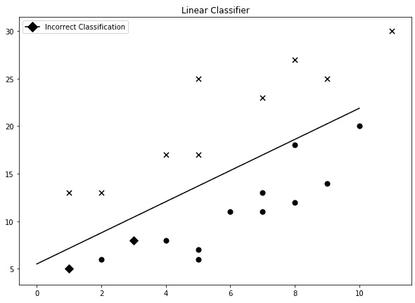
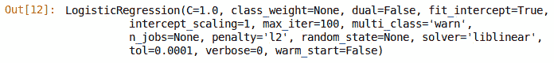
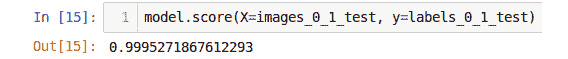
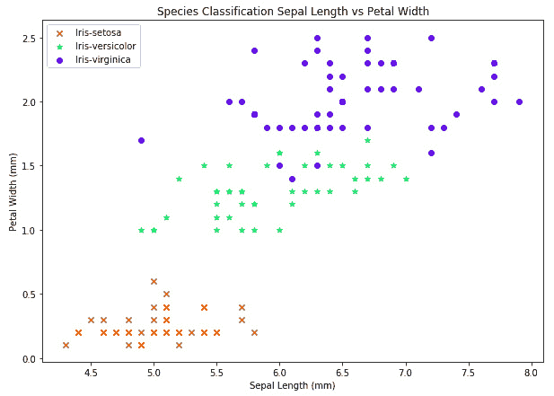
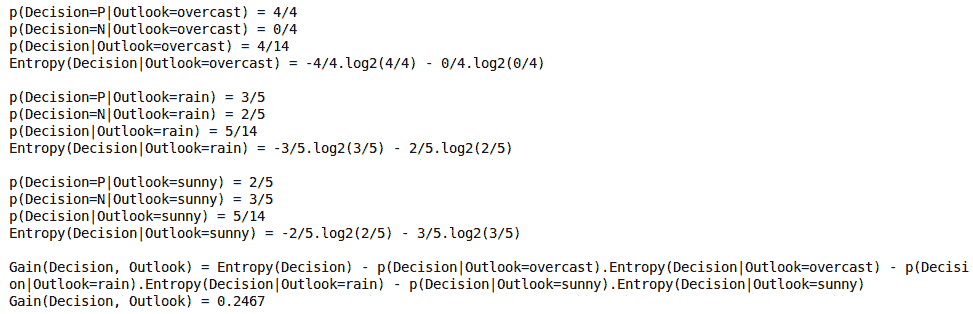
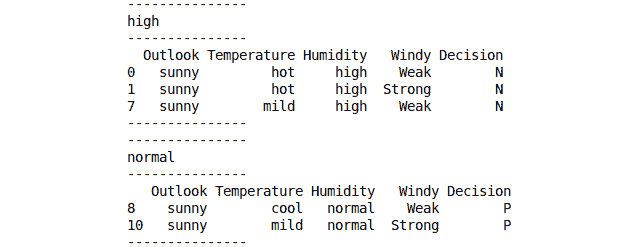

# 第四章：分类

## 学习目标

到本章结束时，你将能够：

+   实现逻辑回归，并解释如何将其用于将数据分类为特定组或类别

+   使用 K 最近邻聚类算法进行分类

+   使用决策树进行数据分类，包括 ID3 算法

+   描述数据中的熵概念

+   解释决策树（如 ID3）如何旨在减少熵

+   使用决策树进行数据分类

本章介绍了分类问题，线性回归和逻辑回归分类，K 最近邻分类和决策树。

## 介绍

在上一章中，我们开始了使用回归技术的监督学习之旅，预测给定一组输入数据时的连续变量输出。现在，我们将转向我们之前描述的另一类机器学习问题：分类问题。回想一下，分类任务的目标是根据一组输入数据，预测数据属于指定数量的类别中的哪一类。

在本章中，我们将扩展在*第三章*《回归分析》中学到的概念，并将其应用于标注有类别而非连续值作为输出的数据集。

## 将线性回归作为分类器

在上一章中，我们在预测连续变量输出的上下文中讨论了线性回归，但它也可以用于预测一组数据属于哪个类别。线性回归分类器不如我们将在本章中讨论的其他类型的分类器强大，但它们在理解分类过程时特别有用。假设我们有一个虚构的数据集，其中包含两个独立的组，X 和 O，如*图 4.1*所示。我们可以通过首先使用线性回归拟合一条直线的方程来构建一个线性分类器。对于任何位于直线之上的值，将预测为*X*类别，而对于位于直线下方的任何值，将预测为*O*类别。任何可以通过一条直线分隔的数据集被称为线性可分，这构成了机器学习问题中的一个重要数据子集。尽管在基于线性回归的分类器中，这可能并不特别有用，但在其他分类器中，如**支持向量机**（**SVM**）、决策树和基于线性神经网络的分类器中，这通常是很有帮助的。


###### 图 4.1：将线性回归作为分类器

### 练习 36：将线性回归用作分类器

本练习包含了一个使用线性回归作为分类器的构造示例。在本练习中，我们将使用一个完全虚构的数据集，并测试线性回归作为分类器的效果。数据集由手动选择的*x*和*y*值组成，这些值大致分为两组。该数据集专门为本练习设计，旨在展示如何将线性回归作为分类器使用，数据集在本书的附带代码文件中以及 GitHub 上的[`github.com/TrainingByPackt/Supervised-Learning-with-Python`](https://github.com/TrainingByPackt/Supervised-Learning-with-Python)可以找到。

1.  将`linear_classifier.csv`数据集加载到 pandas DataFrame 中：

    ```py
    df = pd.read_csv('linear_classifier.csv')
    df.head()
    ```

    输出将如下所示：

    

    ###### 图 4.2：前五行

    浏览数据集，每行包含一组*x, y*坐标以及对应的标签，指示数据属于哪个类别，可能是叉号(**x**)或圆圈(**o**)。

1.  绘制数据的散点图，每个点的标记为对应的类别标签：

    ```py
    plt.figure(figsize=(10, 7))
    for label, label_class in df.groupby('labels'):
        plt.scatter(label_class.values[:,0], label_class.values[:,1],
                    label=f'Class {label}', marker=label, c='k')
    plt.legend()
    plt.title("Linear Classifier");
    ```

    我们将得到如下的散点图：

    

    ###### 图 4.3 线性分类器的散点图

1.  使用上一章中的 scikit-learn `LinearRegression` API，拟合线性模型到数据集的*x*、*y*坐标，并打印出线性方程：

    ```py
    # Fit a linear regression model
    model = LinearRegression()
    model.fit(df.x.values.reshape((-1, 1)), df.y.values.reshape((-1, 1)))
    # Print out the parameters
    print(f'y = {model.coef_[0][0]}x + {model.intercept_[0]}')
    ```

    输出将是：

    

    ###### 图 4.4：模型拟合的输出

1.  在数据集上绘制拟合的趋势线：

    ```py
    # Plot the trendline
    trend = model.predict(np.linspace(0, 10).reshape((-1, 1)))
    plt.figure(figsize=(10, 7))
    for label, label_class in df.groupby('labels'):
        plt.scatter(label_class.values[:,0], label_class.values[:,1],
                    label=f'Class {label}', marker=label, c='k')
    plt.plot(np.linspace(0, 10), trend, c='k', label='Trendline')
    plt.legend()
    plt.title("Linear Classifier");
    ```

    输出将如下所示：

    

    ###### 图 4.5：带趋势线的散点图

1.  通过拟合的趋势线，可以应用分类器。对于数据集中的每一行，判断*x, y*点是位于线性模型（或趋势线）之上还是之下。如果点位于趋势线之下，则模型预测**o**类；如果位于线之上，则预测**x**类。将这些值作为预测标签的一列包含在内：

    ```py
    # Make predictions
    y_pred = model.predict(df.x.values.reshape((-1, 1)))
    pred_labels = []
    for _y, _y_pred in zip(df.y, y_pred):
        if _y < _y_pred:
            pred_labels.append('o')
        else:
            pred_labels.append('x')
    df['Pred Labels'] = pred_labels
    df.head()
    ```

    输出将如下所示：

    

    ###### 图 4.6：前五行

1.  绘制带有相应真实标签的点。对于那些标签被正确预测的点，绘制对应的类别；对于错误预测的点，绘制一个菱形标记：

    ```py
    plt.figure(figsize=(10, 7))
    for idx, label_class in df.iterrows():
        if label_class.labels != label_class['Pred Labels']:
            label = 'D'
            s=70
        else:
            label = label_class.labels
            s=50
        plt.scatter(label_class.values[0], label_class.values[1],
                    label=f'Class {label}', marker=label, c='k', s=s)
    plt.plot(np.linspace(0, 10), trend, c='k', label='Trendline')
    plt.title("Linear Classifier");
    incorrect_class = mlines.Line2D([], [], color='k', marker='D',
                              markersize=10, label='Incorrect Classification');
    plt.legend(handles=[incorrect_class]);
    ```

    输出将如下所示：



###### 图 4.7：显示错误预测的散点图

我们可以看到，在这个图中，线性分类器在这个完全虚构的数据集上做出了两次错误预测，一个是在*x = 1*时，另一个是在*x = 3*时。

但如果我们的数据集不是线性可分的，无法使用直线模型对数据进行分类，那该怎么办呢？这种情况非常常见。在这种情况下，我们会转向其他分类方法，其中许多方法使用不同的模型，但这一过程逻辑上是从我们简化的线性分类模型延伸出来的。

## 逻辑回归

**逻辑**或**对数几率**模型就是一种非线性模型，已经在许多不同领域的分类任务中得到了有效应用。在本节中，我们将用它来分类手写数字的图像。在理解逻辑模型的过程中，我们也迈出了理解一种特别强大的机器学习模型——**人工神经网络**的关键一步。那么，逻辑模型到底是什么呢？像线性模型一样，线性模型由一个线性或直线函数组成，而逻辑模型则由标准的逻辑函数组成，数学上看起来大致是这样的：


###### 图 4.8：逻辑函数

从实际角度来看，当经过训练后，这个函数返回输入信息属于某一特定类别或组的概率。

假设我们想预测某一数据项是否属于两个组中的一个。就像之前的例子中，在线性回归中，这等价于 *y* 要么为零，要么为一，而 *x* 可以取值范围在  和  之间：


###### 图 4.9：y 的方程

从零到一的范围与  到  的差异非常大；为了改进这一点，我们将计算赔率比，这样它就会从大于零的数值变化到小于  的数值，这就是朝着正确方向迈出的一步：


###### 图 4.10：赔率比

我们可以利用自然对数的数学关系进一步简化这一过程。当赔率比接近零时，ss 接近 ；同样，当赔率比接近一时， 接近 。这正是我们想要的；也就是说，两个分类选项尽可能远离。


###### 图 4.11：分类点的自然对数

通过稍微调整方程，我们得到了逻辑函数：


###### 图 4.12：逻辑函数

注意 *e* 的指数，即 ，并且这个关系是一个线性函数，具有两个训练参数或 *权重*， 和 ，以及输入特征 *x*。如果我们将逻辑函数绘制在 *(-6, 6)* 范围内，我们会得到以下结果：


###### 图 4.13：逻辑函数曲线

通过检查 *图 4.13*，我们可以看到一些对分类任务很重要的特征。首先需要注意的是，如果我们查看函数两端的 *y* 轴上的概率值，在 *x = -6* 时，概率值几乎为零，而在 *x = 6* 时，概率值接近 1。虽然看起来这些值实际上是零和一，但实际情况并非如此。逻辑函数在这些极值处接近零和一，只有当 *x* 达到正无穷或负无穷时，它才会等于零或一。从实际角度来看，这意味着逻辑函数永远不会返回大于一的概率或小于等于零的概率，这对于分类任务来说是完美的。我们永远不能有大于一的概率，因为根据定义，概率为一意味着事件发生是确定的。同样，我们不能有小于零的概率，因为根据定义，概率为零意味着事件不发生是确定的。逻辑函数接近但永远不等于一或零，意味着结果或分类总是存在某种不确定性。

逻辑函数的最后一个特点是，在 *x = 0* 时，概率为 0.5，如果我们得到这个结果，这意味着模型对相应类别的结果具有相等的不确定性；也就是说，它完全没有把握。通常，这是训练开始时的默认状态，随着模型接触到训练数据，它对决策的信心逐渐增加。

#### 注意

正确理解和解释分类模型（如线性回归）提供的概率信息非常重要。可以将这个概率得分视为在给定训练数据所提供的信息的变动性下，输入信息属于某一特定类别的可能性。一个常见的错误是将这个概率得分作为衡量模型对预测是否可靠的客观标准；不幸的是，这并不总是准确的。*一个模型可以提供 99.99% 的概率，认为某些数据属于某个特定类别，但它仍然可能有 99.99% 的错误*。

我们使用概率值的目的是选择分类器预测的类别。假设我们有一个模型用于预测某些数据集是否属于类 A 或类 B。如果逻辑回归模型为类 A 返回的概率为 0.7，那么我们将返回类 A 作为模型的预测类别。如果概率仅为 0.2，则模型的预测类别为类 B。

### 练习 37：逻辑回归作为分类器 – 二类分类器

在本练习中，我们将使用著名的 MNIST 数据集的一个样本（可以在 [`yann.lecun.com/exdb/mnist/`](http://yann.lecun.com/exdb/mnist/) 或 GitHub 上的 [`github.com/TrainingByPackt/Supervised-Learning-with-Python`](https://github.com/TrainingByPackt/Supervised-Learning-with-Python) 找到），它是一个包含手写邮政编码数字（从零到九）及相应标签的图像序列。MNIST 数据集包含 60,000 个训练样本和 10,000 个测试样本，每个样本都是大小为 28 x 28 像素的灰度图像。在本练习中，我们将使用逻辑回归来构建一个分类器。我们将构建的第一个分类器是一个二类分类器，用来判断图像是手写的零还是一：

1.  在这个练习中，我们需要导入一些依赖项。执行以下导入语句：

    ```py
    import struct
    import numpy as np
    import gzip
    import urllib.request
    import matplotlib.pyplot as plt
    from array import array
    from sklearn.linear_model import LogisticRegression
    ```

1.  我们还需要下载 MNIST 数据集。你只需要执行此操作一次，因此在此步骤之后，可以随意注释或删除这些代码单元。下载图像数据，具体如下：

    ```py
    request = urllib.request.urlopen('http://yann.lecun.com/exdb/mnist/train-images-idx3-ubyte.gz')
    with open('train-images-idx3-ubyte.gz', 'wb') as f:
        f.write(request.read())
    request = urllib.request.urlopen('http://yann.lecun.com/exdb/mnist/t10k-images-idx3-ubyte.gz')
    with open('t10k-images-idx3-ubyte.gz', 'wb') as f:
        f.write(request.read())
    ```

1.  下载数据的相应标签：

    ```py
    request = urllib.request.urlopen('http://yann.lecun.com/exdb/mnist/train-labels-idx1-ubyte.gz')
    with open('train-labels-idx1-ubyte.gz', 'wb') as f:
        f.write(request.read())
    request = urllib.request.urlopen('http://yann.lecun.com/exdb/mnist/t10k-labels-idx1-ubyte.gz')
    with open('t10k-labels-idx1-ubyte.gz', 'wb') as f:
        f.write(request.read())
    ```

1.  一旦所有文件成功下载，使用以下命令检查本地目录中的文件（适用于 Windows）：

    ```py
    !dir *.gz
    ```

    输出结果如下：

    

    ###### 图 4.14：目录中的文件

    #### 注意

    对于 Linux 和 macOS，使用 `!ls *.gz` 命令查看本地目录中的文件。

1.  加载下载的数据。无需过于担心读取数据的具体细节，因为这些是 MNIST 数据集特有的：

    ```py
    with gzip.open('train-images-idx3-ubyte.gz', 'rb') as f:
        magic, size, rows, cols = struct.unpack(">IIII", f.read(16))
        img = np.array(array("B", f.read())).reshape((size, rows, cols))
    with gzip.open('train-labels-idx1-ubyte.gz', 'rb') as f:
        magic, size = struct.unpack(">II", f.read(8))
        labels = np.array(array("B", f.read()))
    with gzip.open('t10k-images-idx3-ubyte.gz', 'rb') as f:
        magic, size, rows, cols = struct.unpack(">IIII", f.read(16))
        img_test = np.array(array("B", f.read())).reshape((size, rows, cols))
    with gzip.open('t10k-labels-idx1-ubyte.gz', 'rb') as f:
        magic, size = struct.unpack(">II", f.read(8))
        labels_test = np.array(array("B", f.read()))
    ```

1.  一如既往，彻底理解数据至关重要，因此，创建训练样本中前 10 张图像的图像图。注意灰度图像以及相应的标签，它们是数字零到九：

    ```py
    for i in range(10):
        plt.subplot(2, 5, i + 1)
        plt.imshow(img[i], cmap='gray');
        plt.title(f'{labels[i]}');
        plt.axis('off')
    ```

    输出结果如下：

    

    ###### 图 4.15：训练图像

1.  由于初始分类器旨在分类零图像或一图像，我们必须首先从数据集中选择这些样本：

    ```py
    samples_0_1 = np.where((labels == 0) | (labels == 1))[0]
    images_0_1 = img[samples_0_1]
    labels_0_1 = labels[samples_0_1]
    samples_0_1_test = np.where((labels_test == 0) | (labels_test == 1))
    images_0_1_test = img_test[samples_0_1_test].reshape((-1, rows * cols))
    labels_0_1_test = labels_test[samples_0_1_test]
    ```

1.  可视化一个来自零选择的样本和另一个来自手写数字一的样本，以确保我们已正确分配数据。

    下面是数字零的代码：

    ```py
    sample_0 = np.where((labels == 0))[0][0]
    plt.imshow(img[sample_0], cmap='gray');
    ```

    输出结果如下：

    

    ###### 图 4.16：第一张手写图像

    下面是一个的代码：

    ```py
    sample_1 = np.where((labels == 1))[0][0]
    plt.imshow(img[sample_1], cmap='gray');
    ```

    输出结果如下：

    

    ###### 图 4.17：第二张手写图像

1.  我们几乎可以开始构建模型了，然而，由于每个样本都是图像并且数据是矩阵格式，我们必须首先重新排列每张图像。模型需要图像以向量形式提供，即每张图像的所有信息存储在一行中。按以下步骤操作：

    ```py
    images_0_1 = images_0_1.reshape((-1, rows * cols))
    images_0_1.shape
    ```

1.  现在我们可以使用选择的图像和标签构建并拟合逻辑回归模型：

    ```py
    model = LogisticRegression(solver='liblinear')
    model.fit(X=images_0_1, y=labels_0_1)
    ```

    输出将是：

    

    ###### 图 4.18：逻辑回归模型

    请注意，scikit-learn 的逻辑回归 API 调用与线性回归的一致性。这里有一个额外的参数 `solver`，它指定要使用的优化过程类型。我们在这里提供了该参数的默认值，以抑制在当前版本的 scikit-learn 中要求指定 `solver` 参数的未来警告。`solver` 参数的具体细节超出了本章的讨论范围，仅为抑制警告信息而包含。

1.  检查此模型在相应训练数据上的表现：

    ```py
    model.score(X=images_0_1, y=labels_0_1)
    ```

    我们将得到如下输出：

    

    ###### 图 4.19：模型得分

    在这个例子中，模型能够以 100% 的准确率预测训练标签。

1.  使用模型显示训练数据的前两个预测标签：

    ```py
    model.predict(images_0_1) [:2]
    ```

    输出将是：

    

    ###### 图 4.20：模型预测的前两个标签

1.  逻辑回归模型是如何做出分类决策的？观察模型为训练集产生的一些概率值：

    ```py
    model.predict_proba(images_0_1)[:2]
    ```

    输出将如下所示：

    

    ###### 图 4.21：概率数组

    我们可以看到，对于每个预测，都会有两个概率值。第一个是类为零的概率，第二个是类为一的概率，二者加起来为一。我们可以看到，在第一个例子中，预测概率为 0.9999999（类零），因此预测为类零。同样地，第二个例子则相反。

1.  计算模型在测试集上的表现，以检查其在未见过的数据上的性能：

    ```py
    model.score(X=images_0_1_test, y=labels_0_1_test)
    ```

    输出将是：



###### 图 4.22：模型得分

#### 注意

请参考*第六章*，*模型评估*，了解更好的客观衡量模型性能的方法。

我们可以看到，逻辑回归是一个强大的分类器，能够区分手写的零和一。

### 练习 38：逻辑回归——多类分类器

在之前的练习中，我们使用逻辑回归对两类进行分类。然而，逻辑回归也可以用于将一组输入信息分类到 *k* 个不同的组，这就是我们在本练习中要研究的多类分类器。加载 MNIST 训练和测试数据的过程与之前的练习相同：

1.  加载训练/测试图像及其对应的标签：

    ```py
    with gzip.open('train-images-idx3-ubyte.gz', 'rb') as f:
        magic, size, rows, cols = struct.unpack(">IIII", f.read(16))
        img = np.array(array("B", f.read())).reshape((size, rows, cols))
    with gzip.open('train-labels-idx1-ubyte.gz', 'rb') as f:
        magic, size = struct.unpack(">II", f.read(8))
        labels = np.array(array("B", f.read()))
    with gzip.open('t10k-images-idx3-ubyte.gz', 'rb') as f:
        magic, size, rows, cols = struct.unpack(">IIII", f.read(16))
        img_test = np.array(array("B", f.read())).reshape((size, rows, cols))
    with gzip.open('t10k-labels-idx1-ubyte.gz', 'rb') as f:
        magic, size = struct.unpack(">II", f.read(8))
        labels_test = np.array(array("B", f.read()))
    ```

1.  由于训练数据量较大，我们将选择整体数据的一个子集，以减少训练时间及训练过程中所需的系统资源：

    ```py
    np.random.seed(0) # Give consistent random numbers
    selection = np.random.choice(len(img), 5000)
    selected_images = img[selection]
    selected_labels = labels[selection]
    ```

    请注意，在此示例中，我们使用的是所有 10 个类别的数据，而不仅仅是零类和一类，因此我们将此示例设置为多类分类问题。

1.  再次将输入数据重塑为向量形式，以便后续使用：

    ```py
    selected_images = selected_images.reshape((-1, rows * cols))
    selected_images.shape
    ```

    输出结果如下：

    

    ###### 图 4.23：数据重塑

1.  下一单元格故意被注释掉。暂时保持此代码为注释：

    ```py
    # selected_images = selected_images / 255.0
    # img_test = img_test / 255.0
    ```

1.  构建逻辑回归模型。这里有一些额外的参数，如下所示：`solver` 的 `lbfgs` 值适用于多类问题，需要额外的 `max_iter` 迭代次数来收敛到解。`multi_class` 参数设置为 `multinomial`，以计算整个概率分布的损失：

    ```py
    model = LogisticRegression(solver='lbfgs', multi_class='multinomial', max_iter=500, tol=0.1)
    model.fit(X=selected_images, y=selected_labels)
    ```

    输出结果如下：

    

    ###### 图 4.24：逻辑回归模型

    #### 注意

    有关参数的更多信息，请参阅文档：[`scikit-learn.org/stable/modules/generated/sklearn.linear_model.LogisticRegression.html`](https://scikit-learn.org/stable/modules/generated/sklearn.linear_model.LogisticRegression.html)。

1.  确定训练集的准确性评分：

    ```py
    model.score(X=selected_images, y=selected_labels)
    ```

    输出结果将是：

    

    ###### 图 4.25：模型评分

1.  确定训练集的前两个预测值，并绘制相应预测的图像：

    ```py
    model.predict(selected_images)[:2]
    ```

    

    ###### 图 4.26：模型评分预测值

1.  显示训练集前两个样本的图像，查看我们的判断是否正确：

    ```py
    plt.subplot(1, 2, 1)
    plt.imshow(selected_images[0].reshape((28, 28)), cmap='gray');
    plt.axis('off');
    plt.subplot(1, 2, 2)
    plt.imshow(selected_images[1].reshape((28, 28)), cmap='gray');
    plt.axis('off');
    ```

    输出结果如下：

    

    ###### 图 4.27：使用预测绘制的图像

1.  再次打印出模型为训练集第一个样本提供的概率分数。确认每个类别有 10 个不同的值：

    ```py
    model.predict_proba(selected_images)[0]
    ```

    输出结果如下：

    

    ###### 图 4.28：预测值数组

    请注意，在第一个样本的概率数组中，第五个（索引为四）样本的概率最高，因此表示预测为四。

1.  计算模型在测试集上的准确性。这将提供一个合理的估计值，表示模型在*实际环境*中的表现，因为它从未见过测试集中的数据。考虑到模型没有接触过这些数据，测试集的准确率预计会稍微低于训练集：

    ```py
    model.score(X=img_test.reshape((-1, rows * cols)), y=labels_test)
    ```

    输出结果如下：

    

    ###### 图 4.29：模型得分

    在测试集上检查时，模型的准确率为 87.8%。应用测试集时，性能下降是可以预期的，因为这是模型第一次接触这些样本；而在训练过程中，训练集已经多次呈现给模型。

1.  找到包含注释掉的代码的单元格，如*步骤四*所示。取消注释该单元格中的代码：

    ```py
    selected_images = selected_images / 255.0
    img_test = img_test / 255.0
    ```

    这个单元格只是将所有图像值缩放到零和一之间。灰度图像由像素组成，这些像素的值在 0 到 255 之间，包括 0（黑色）和 255（白色）。

1.  点击**重新启动并运行全部**以重新运行整个笔记本。

1.  找到训练集误差：

    ```py
    model.score(X=selected_images, y=selected_labels)
    ```

    我们将得到以下得分：

    

    ###### 图 4.30：训练集模型得分

1.  找到测试集误差：

    ```py
    model.score(X=img_test.reshape((-1, rows * cols)), y=labels_test)
    ```

    我们将得到以下得分：


###### 图 4.31：测试集模型得分

归一化图像对系统整体性能有什么影响？训练误差变得更糟！我们从训练集的 100%准确率下降到了 98.6%。是的，训练集的性能有所下降，但测试集的准确率却从 87.8%提高到了 90.02%。测试集的性能更为重要，因为模型之前没有见过这些数据，因此它能更好地代表模型在实际应用中的表现。那么，为什么我们会得到更好的结果呢？再次查看*图 4.13*，注意曲线接近零和接近一时的形状。曲线在接近零和接近一时趋于饱和或平坦。因此，如果我们使用 0 到 255 之间的图像（或*x*值），由逻辑函数定义的类别概率将位于曲线的平坦区域内。位于该区域内的预测变化很小，因为要产生任何有意义的变化，需要*x*值发生非常大的变化。将图像缩放到零和一之间，最初会将预测值拉近*p(x) = 0.5*，因此，*x*的变化会对*y*值产生更大的影响。这允许更敏感的预测，并导致训练集中的一些预测错误，但测试集中的更多预测是正确的。建议在训练和测试之前，将输入值缩放到零和一之间，或者负一和一之间，用于你的逻辑回归模型。

以下函数将把 NumPy 数组中的值缩放到-1 到 1 之间，均值大约为零：

```py
def scale_input(x):
    mean_x = x.mean()
    x = x – mean_x
    max_x = x / no.max(abs(x))
    return x
```

### 活动 11：线性回归分类器 – 二分类器

在这个活动中，我们将使用 MNIST 数据集构建一个基于线性回归的二分类器，用于区分数字零和数字一。

执行的步骤如下：

1.  导入所需的依赖项：

    ```py
    import struct
    import numpy as np
    import gzip
    import urllib.request
    import matplotlib.pyplot as plt
    from array import array
    from sklearn.linear_model import LinearRegression
    ```

1.  将 MNIST 数据加载到内存中。

1.  可视化一组数据样本。

1.  构建一个线性分类器模型来分类数字零和数字一。我们将创建的模型是用来判断样本是数字零还是数字一。为此，我们首先需要仅选择这些样本。

1.  使用零样本和一样本的图像可视化选择的信息。

1.  为了向模型提供图像信息，我们必须先将数据展平，使每个图像的形状为 1 x 784 像素。

1.  让我们构建模型；使用 `LinearRegression` API 并调用 `fit` 函数。

1.  计算训练集的 R2 分数。

1.  使用阈值 0.5 来确定每个训练样本的标签预测。大于 0.5 的值分类为一；小于或等于 0.5 的值分类为零。

1.  计算预测训练值与实际值之间的分类准确率。

1.  与测试集的性能进行比较。

    #### 注意

    该活动的解决方案可以在第 352 页找到。

### 活动 12：使用逻辑回归进行虹膜分类

在这个活动中，我们将使用著名的虹膜物种数据集（可在 [`en.wikipedia.org/wiki/Iris_flower_data_set`](https://en.wikipedia.org/wiki/Iris_flower_data_set) 或 GitHub 上的 [`github.com/TrainingByPackt/Supervised-Learning-with-Python`](https://github.com/TrainingByPackt/Supervised-Learning-with-Python) 获取），该数据集由植物学家罗纳德·费舍尔于 1936 年创建。数据集包含三种不同虹膜花卉物种的萼片和花瓣的长度和宽度测量值：虹膜变色花、虹膜佛罗伦萨和虹膜维尔吉尼卡。在这个活动中，我们将使用数据集中提供的测量值来分类不同的花卉物种。

执行的步骤如下：

1.  导入所需的软件包。在本次活动中，我们将需要 pandas 包来加载数据，Matplotlib 包来绘图，以及 scikit-learn 包来创建逻辑回归模型。导入所有必需的软件包和相关模块以完成这些任务：

    ```py
    import pandas as pd
    import matplotlib.pyplot as plt
    from sklearn.linear_model import LogisticRegression
    ```

1.  使用 pandas 加载虹膜数据集并检查前五行。

1.  下一步是特征工程。我们需要选择最合适的特征，以提供最强大的分类模型。绘制多个不同的特征与分配的物种分类之间的关系图，例如，萼片长度与花瓣长度及物种。通过可视化检查这些图形，查找可能表明不同物种之间分离的模式。

1.  通过在以下列表中编写列名来选择特征：

    ```py
    selected_features = [
        '', # List features here
    ]
    ```

1.  在构建模型之前，我们必须先将`species`值转换为可以在模型中使用的标签。将`Iris-setosa`物种字符串替换为值`0`，将`Iris-versicolor`物种字符串替换为值`1`，将`Iris-virginica`物种字符串替换为值`2`。

1.  使用`selected_features`和分配的`species`标签创建模型。

1.  计算模型在训练集上的准确性。

1.  使用第二选择的`selected_features`构建另一个模型，并比较其性能。

1.  使用所有可用信息构建另一个模型，并比较其性能。

    #### 注意

    本活动的解决方案可以在第 357 页找到。

## 使用 K 近邻分类

现在我们已经熟悉了使用逻辑回归创建多类分类器，并且在这些模型中取得了合理的性能，接下来我们将注意力转向另一种分类器：**K-最近邻**（**K-NN**）聚类方法。这是一种非常实用的方法，因为它不仅可以应用于监督分类问题，还可以应用于无监督问题。


###### 图 4.32：K-NN 的可视化表示

大约位于中心的实心圆是需要分类的测试点，而内圆表示分类过程，其中*K=3*，外圆表示*K=5*。

K-NN 是数据分类中最简单的“学习”算法之一。这里使用“学习”一词是明确的，因为 K-NN 并不像其他方法（例如逻辑回归）那样从数据中学习并将这些学习结果编码为参数或权重。K-NN 使用基于实例或懒惰学习，它只是存储或记住所有训练样本及其对应的类别。当一个测试样本提供给算法进行分类时，它通过对*K*个最近点的多数投票来确定对应的类别，从而得名 K-最近邻。如果我们查看*图 4.35*，实心圆表示需要分类的测试点。如果我们使用*K=3*，最近的三个点位于内虚线圆内，在这种情况下，分类结果将是空心圆。然而，如果我们使用*K=5*，最近的五个点位于外虚线圆内，分类结果将是交叉标记（三个交叉标记对两个空心圆）。

该图突出显示了 K-NN 分类的一些特征，这些特征应当加以考虑：

+   *K* 的选择非常重要。在这个简单的例子中，将 *K* 从三改为五，由于两个类别的接近性，导致了分类预测的翻转。由于最终的分类是通过多数投票决定的，因此通常使用奇数的 *K* 值以确保投票中有一个获胜者。如果选择了偶数的 *K* 值并且投票发生了平局，那么有多种方法可以用来打破平局，包括：

    将 *K* 减少一个直到平局被打破

    基于最近点的最小欧几里得距离选择类别

    应用加权函数以偏向距离较近的邻居

+   K-NN 模型具有形成极其复杂的非线性边界的能力，这在对图像或具有有趣边界的数据集进行分类时可能具有优势。考虑到在 *图 4.35* 中，随着 *K* 的增加，测试点的分类从空心圆变为十字，我们可以看到此处可能形成复杂的边界。

+   K-NN 模型对数据中的局部特征非常敏感，因为分类过程实际上仅依赖于邻近的点。

+   由于 K-NN 模型将所有训练信息都记住以进行预测，因此它们在对新的、未见过的数据进行泛化时可能会遇到困难。

K-NN 还有一种变体，它不是指定最近邻的数量，而是指定测试点周围的半径大小以进行查找。这种方法称为 **半径邻居分类**，本章将不考虑这种方法，但在理解 K-NN 的过程中，你也会对半径邻居分类有一定了解，并学习如何通过 scikit-learn 使用该模型。

#### 注意

我们对 K-NN 分类的解释以及接下来的练习将重点研究具有两个特征或两个维度的数据建模，因为这样可以简化可视化并更好地理解 K-NN 建模过程。像线性回归和逻辑回归一样，K-NN 分类并不限于仅用于二维数据集；它也可以应用于 *N* 维数据集。我们将在 *活动 13：K-NN 多分类分类器* 中进一步详细探讨这一点，在该活动中，我们将使用 K-NN 对 MNIST 数据集进行分类。请记住，仅仅因为无法绘制过多维度的图形，并不意味着它不能在 *N* 维数据集中进行分类。

### 练习 39：K-NN 分类

为了允许可视化 K-NN 过程，本练习将把重点转移到另一个数据集——著名的 Iris 数据集。该数据集作为本书附带代码文件的一部分提供：

1.  对于本练习，我们需要导入 pandas、Matplotlib 以及 scikit-learn 的 `KNeighborsClassifier`。我们将使用简写符号 `KNN` 以便快速访问：

    ```py
    import pandas as pd
    import matplotlib.pyplot as plt
    from sklearn.neighbors import KNeighborsClassifier as KNN
    ```

1.  加载 Iris 数据集并查看前五行：

    ```py
    df = pd.read_csv('iris-data.csv')
    df.head()
    ```

    输出将是：

    

    ###### 图 4.33：前五行

1.  在这个阶段，我们需要从数据集中选择最合适的特征用于分类器。我们可以简单地选择所有四个（萼片和花瓣的长度和宽度），但由于这个练习旨在允许可视化 K-NN 过程，我们只选择萼片长度和花瓣宽度。为数据集中的每个类构建萼片长度与花瓣宽度的散点图，并标注相应的物种：

    ```py
    markers = {
        'Iris-setosa': {'marker': 'x', 'facecolor': 'k', 'edgecolor': 'k'},
        'Iris-versicolor': {'marker': '*', 'facecolor': 'none', 'edgecolor': 'k'},
        'Iris-virginica': {'marker': 'o', 'facecolor': 'none', 'edgecolor': 'k'},
    }
    plt.figure(figsize=(10, 7))
    for name, group in df.groupby('Species'):
        plt.scatter(group['Sepal Length'], group['Petal Width'], 
                    label=name,
                    marker=markers[name]['marker'],
                    facecolors=markers[name]['facecolor'],
                    edgecolor=markers[name]['edgecolor'])
    plt.title('Species Classification Sepal Length vs Petal Width');
    plt.xlabel('Sepal Length (mm)');
    plt.ylabel('Petal Width (mm)');
    plt.legend();
    ```

    输出如下：

    

    ###### 图 4.34: 鸢尾花数据的散点图

1.  从这张图中可以看出，花瓣宽度在某种程度上合理地分开了这些物种，特别是鸢尾花杂色和鸢尾花维吉尼亚物种之间具有最大的相似性。在鸢尾花维吉尼亚物种的群集中，有几个点位于鸢尾花杂色群集内。作为稍后使用的测试点，选择边界样本 134：

    ```py
    df_test = df.iloc[134]
    df = df.drop([134]) # Remove the sample
    df_test
    ```

    输出将如下所示：

    

    ###### 图 4.35: 边界样本

1.  再次绘制数据，突出显示测试样本/点的位置：

    ```py
    plt.figure(figsize=(10, 7))
    for name, group in df.groupby('Species'):
        plt.scatter(group['Sepal Length'], group['Petal Width'], 
                    label=name,
                    marker=markers[name]['marker'],
                    facecolors=markers[name]['facecolor'],
                    edgecolor=markers[name]['edgecolor'])

    plt.scatter(df_test['Sepal Length'], df_test['Petal Width'], label='Test Sample', c='k', marker='D')
    plt.title('Species Classification Sepal Length vs Petal Width');
    plt.xlabel('Sepal Length (mm)');
    plt.ylabel('Petal Width (mm)');
    plt.legend();
    ```

    输出将如下：

    

    ###### 图 4.36: 带有测试样本的散点图

1.  使用 *K = 3* 构建 K-NN 分类器模型，并将其拟合到训练数据中：

    ```py
    model = KNN(n_neighbors=3)
    model.fit(X=df[['Petal Width', 'Sepal Length']], y=df.Species)
    ```

    输出将如下：

    

    ###### 图 4.37: K 近邻分类器

1.  检查模型在训练集上的性能：

    ```py
    model.score(X=df[['Petal Width', 'Sepal Length']], y=df.Species)
    ```

    输出将显示性能评分：

    

    ###### 图 4.38: 模型得分

    由于测试集的准确率超过了 97%，接下来的步骤将是检查测试样本。

1.  预测测试样本的物种：

    ```py
    model.predict(df_test[['Petal Width', 'Sepal Length']].values.reshape((-1, 2)))[0]
    ```

    输出将如下：

    

    ###### 图 4.39: 预测的测试样本

1.  用实际样本的物种来验证它：

    ```py
    df.iloc[134].Species
    ```

    输出将如下：


###### 图 4.40: 样本的物种

这个预测显然是错误的，但考虑到测试点位于边界上，这并不奇怪。有用的是知道模型的边界在哪里。我们将在下一个练习中绘制这个边界。

### 练习 40: 可视化 K-NN 边界

要可视化 K-NN 分类器生成的决策边界，我们需要在预测空间上进行扫描，即萼片宽度和长度的最小和最大值，并确定模型在这些点上的分类。一旦完成扫描，我们可以绘制模型所做的分类决策。

1.  导入所有相关的包。对于这个练习，我们还需要使用 NumPy：

    ```py
    import numpy as np
    import pandas as pd
    import matplotlib.pyplot as plt
    from matplotlib.colors import ListedColormap
    from sklearn.neighbors import KNeighborsClassifier as KNN
    ```

1.  将鸢尾花数据集加载到 pandas 的 DataFrame 中：

    ```py
    df = pd.read_csv('iris-data.csv')
    df.head()
    ```

    输出将如下：

    

    ###### 图 4.41: 前五行

1.  虽然我们可以在之前的练习中使用物种字符串来创建模型，但在绘制决策边界时，将物种映射到单独的整数值会更有用。为此，创建一个标签列表以供后续参考，并遍历该列表，用对应的索引替换现有的标签：

    ```py
    labelled_species = [
        'Iris-setosa',
        'Iris-versicolor',
        'Iris-virginica',
    ]
    for idx, label in enumerate(labelled_species):
        df.Species = df.Species.replace(label, idx)
    df.head()
    ```

    输出将如下所示：

    

    ###### 图 4.42：前五行

    注意在`for`循环定义中使用了`enumerate`函数。在迭代`for`循环时，`enumerate`函数在每次迭代中提供列表中值的索引和该值本身。我们将值的索引赋给`idx`变量，将值赋给`label`。以这种方式使用`enumerate`提供了一种简便的方法来用唯一的整数标签替换物种字符串。

1.  构建一个 K-NN 分类模型，仍然使用三个最近邻，并将其拟合到新的物种标签数据的萼片长度和花瓣宽度上：

    ```py
    model = KNN(n_neighbors=3)
    model.fit(X=df[['Sepal Length', 'Petal Width']], y=df.Species)
    ```

    输出将如下所示：

    

    ###### 图 4.43：K 邻近分类器

1.  为了可视化我们的决策边界，我们需要在信息空间内创建一个网格或预测范围，即所有萼片长度和花瓣宽度的值。从比花瓣宽度和萼片长度的最小值低 1 毫米开始，直到比它们的最大值高 1 毫米，使用 NumPy 的`arange`函数以 0.1（间距）为增量创建这些限制之间的值范围：

    ```py
    spacing = 0.1 # 0.1mm
    petal_range = np.arange(df['Petal Width'].min() - 1, df['Petal Width'].max() + 1, spacing)
    sepal_range = np.arange(df['Sepal Length'].min() - 1, df['Sepal Length'].max() + 1, spacing)
    ```

1.  使用 NumPy 的`meshgrid`函数将两个范围合并为一个网格：

    ```py
    xx, yy = np.meshgrid(sepal_range, petal_range) # Create the mesh
    ```

    查看`xx`：

    ```py
    xx
    ```

    输出将是：

    

    ###### 图 4.44：meshgrid xx 值数组

    查看`yy`：

    ```py
    yy
    ```

    输出将是：

    

    ###### 图 4.45：meshgrid yy 值数组

1.  使用`np.c_`将 mesh 拼接成一个单独的 NumPy 数组：

    ```py
    pred_x = np.c_[xx.ravel(), yy.ravel()] # Concatenate the results
    pred_x
    ```

    我们将得到以下输出：

    

    ###### 图 4.46：预测值数组

    虽然这个函数调用看起来有些神秘，但它仅仅是将两个独立的数组连接在一起（参见[`docs.scipy.org/doc/numpy/reference/generated/numpy.c_.html`](https://docs.scipy.org/doc/numpy/reference/generated/numpy.c_.html)），并且是`concatenate`的简写形式。

1.  为网格生成类别预测：

    ```py
    pred_y = model.predict(pred_x).reshape(xx.shape)
    pred_y
    ```

    我们将得到以下输出：

    

    ###### 图 4.47：预测 y 值数组

1.  为了持续可视化边界，我们需要两组一致的颜色：一组较浅的颜色用于决策边界，一组较深的颜色用于训练集点本身。创建两个`ListedColormaps`：

    ```py
    # Create color maps
    cmap_light = ListedColormap(['#F6A56F', '#6FF6A5', '#A56FF6'])
    cmap_bold = ListedColormap(['#E6640E', '#0EE664', '#640EE6'])
    ```

1.  为了突出显示决策边界，首先根据鸢尾花物种绘制训练数据，使用`cmap_bold`颜色方案，并为每个不同物种使用不同的标记：

    ```py
    markers = {
        'Iris-setosa': {'marker': 'x', 'facecolor': 'k', 'edgecolor': 'k'},
        'Iris-versicolor': {'marker': '*', 'facecolor': 'none', 'edgecolor': 'k'},
        'Iris-virginica': {'marker': 'o', 'facecolor': 'none', 'edgecolor': 'k'},
    }
    plt.figure(figsize=(10, 7))
    for name, group in df.groupby('Species'):
        species = labelled_species[name]
        plt.scatter(group['Sepal Length'], group['Petal Width'],
                    c=cmap_bold.colors[name],
                    label=labelled_species[name],
                    marker=markers[species]['marker']
                   )
    plt.title('Species Classification Sepal Length vs Petal Width');
    plt.xlabel('Sepal Length (mm)');
    plt.ylabel('Petal Width (mm)');
    plt.legend();
    ```

    输出结果如下：

    

    ###### 图 4.48：散点图与突出显示的决策边界

1.  使用之前创建的预测网格，绘制决策边界并与训练数据一起展示：

    ```py
    plt.figure(figsize=(10, 7))
    plt.pcolormesh(xx, yy, pred_y, cmap=cmap_light);
    plt.scatter(df['Sepal Length'], df['Petal Width'], c=df.Species, cmap=cmap_bold, edgecolor='k', s=20);
    plt.title('Species Decision Boundaries Sepal Length vs Petal Width');
    plt.xlabel('Sepal Length (mm)');
    plt.ylabel('Petal Width (mm)');
    ```

    输出结果如下：

    

###### 图 4.49：决策边界

#### 注意

*图 4.49*已修改为灰度打印，并增加了额外的标签，指示类别的预测边界。

### 活动 13：K-NN 多类别分类器

在此活动中，我们将使用 K-NN 模型将 MNIST 数据集分类为 10 个不同的数字类别。

要执行的步骤如下：

1.  导入以下包：

    ```py
    import struct
    import numpy as np
    import gzip
    import urllib.request
    import matplotlib.pyplot as plt
    from array import array
    from sklearn.neighbors import KNeighborsClassifier as KNN
    ```

1.  将 MNIST 数据加载到内存中。首先是训练图像，然后是训练标签，再然后是测试图像，最后是测试标签。

1.  可视化数据样本。

1.  构建一个 K-NN 分类器，使用三个最近邻来分类 MNIST 数据集。同样，为了节省处理能力，随机抽取 5,000 张图像用于训练。

1.  为了将图像信息提供给模型，我们必须先将数据展平，使每个图像的形状为 1 x 784 像素。

1.  构建三邻居 KNN 模型并将数据拟合到模型中。请注意，在本活动中，我们为模型提供了 784 个特征或维度，而不仅仅是 2 个。

1.  确定与训练集的评分。

1.  显示模型在训练数据上的前两个预测结果。

1.  比较与测试集的性能。

    #### 注意

    该活动的解答可以在第 360 页找到。

## 使用决策树进行分类

本章将要研究的最终分类方法是**决策树**，它在自然语言处理等应用中得到了广泛应用。决策树下有多种不同的机器学习算法，例如 ID3、CART 以及强大的随机森林分类器（在*第五章*，*集成建模*中介绍）。在本章中，我们将研究 ID3 方法在分类类别数据中的应用，并使用 scikit-learn 中的 CART 实现作为另一种分类鸢尾花数据集的方式。那么，究竟什么是决策树呢？

如名称所示，决策树是一种学习算法，它通过一系列基于输入信息的决策来进行最终分类。回想一下你小时候的生物学课，你可能使用过类似决策树的过程，通过二分法键来分类不同类型的动物。就像*图 4.50*所示的二分法键，决策树旨在根据一系列决策或提问步骤的结果来分类信息：


###### 图 4.50：使用二分法键进行动物分类

根据所使用的决策树算法，决策步骤的实现可能会略有不同，但我们将特别考虑 ID3 算法的实现。**迭代二分法 3**（**ID3**）算法旨在根据每个决策提供的最大信息增益来对数据进行分类。为了进一步理解这一设计，我们还需要理解两个额外的概念：熵和信息增益。

#### 注意

ID3 算法最早由澳大利亚研究员 Ross Quinlan 于 1985 年提出（[`doi.org/10.1007/BF00116251`](https://doi.org/10.1007/BF00116251)）。

+   **熵**：在信息论的背景下，熵是随机数据源提供信息的平均速率。从数学角度来看，这个熵定义为：


###### 图 4.51：熵方程

在这种情况下，当随机数据源产生低概率值时，事件携带的信息更多，因为与发生高概率事件时相比，它是不可预见的。

+   **信息增益**：与熵相关的概念是通过观察另一个随机变量获得关于某个随机变量的信息量。给定一个数据集 *S* 和一个观察的属性 *a*，信息增益在数学上定义为：


###### 图 4.52：信息增益方程

数据集 *S* 对于属性 *a* 的信息增益等于 *S* 的熵减去条件于属性 *a* 的 *S* 的熵，或者说，数据集 *S* 的熵减去 *t* 中元素的比例与 *S* 中元素的比例，再乘以 *t* 的熵，其中 *t* 是属性 *a* 中的某个类别。

如果你一开始觉得这里的数学有些令人畏惧，别担心，它比看起来简单得多。为了澄清 ID3 过程，我们将使用 Quinlan 在原始论文中提供的相同数据集来演示这个过程。

### 练习 41：ID3 分类

在原始论文中，Quinlan 提供了一个包含 10 个天气观察样本的小数据集，每个样本被标记为 **P**，表示天气适合进行某种活动，比如说星期六早上的板球比赛，或者北美朋友们喜欢的棒球比赛。如果天气不适合比赛，则标记为 **N**。论文中描述的示例数据集将在练习中创建。

1.  在 Jupyter notebook 中，创建以下训练集的 pandas DataFrame：

    ```py
    df = pd.DataFrame()
    df['Outlook'] = [
        'sunny', 'sunny', 'overcast', 'rain', 'rain', 'rain',
        'overcast', 'sunny', 'sunny', 'rain', 'sunny',
        'overcast', 'overcast', 'rain'
    ]
    df['Temperature'] = [
        'hot', 'hot', 'hot', 'mild', 'cool', 'cool', 'cool',
        'mild', 'cool', 'mild', 'mild', 'mild', 'hot', 'mild',
    ]
    df['Humidity'] = [
        'high', 'high', 'high', 'high', 'normal', 'normal', 'normal', 
        'high', 'normal', 'normal', 'normal', 'high', 'normal', 'high'
    ]
    df['Windy'] = [
        'Weak', 'Strong', 'Weak', 'Weak', 'Weak', 'Strong', 'Strong', 'Weak', 'Weak', 'Weak',
        'Strong', 'Strong', 'Weak', 'Strong'
    ]
    df['Decision'] = [
        'N', 'N', 'P', 'P', 'P', 'N', 'P', 'N', 'P', 'P',
        'P', 'P', 'P', 'N'
    ]
    df
    ```

    输出将如下所示：

    

    ###### 图 4.53：Pandas DataFrame

1.  在原始论文中，ID3 算法首先随机选择一个小的训练集样本，并将树拟合到这个窗口。对于大数据集，这可能是一个有用的方法，但考虑到我们的数据集相对较小，我们将直接从整个训练集开始。第一步是计算`P`和`N`的熵：

    ```py
    # Probability of P
    p_p = len(df.loc[df.Decision == 'P']) / len(df)
    # Probability of N
    p_n = len(df.loc[df.Decision == 'N']) / len(df)
    entropy_decision = -p_n * np.log2(p_n) - p_p * np.log2(p_p)
    print(f'H(S) = {entropy_decision:0.4f}')
    ```

    我们将得到以下输出：

    

    ###### 图 4.54：熵决策

1.  我们需要重复此计算，因此将其封装成一个函数：

    ```py
    def f_entropy_decision(data):
        p_p = len(data.loc[data.Decision == 'P']) / len(data)
        p_n = len(data.loc[data.Decision == 'N']) / len(data)
        return -p_n * np.log2(p_n) - p_p * np.log2(p_p)
    ```

1.  下一步是计算哪一个属性通过`groupby`方法提供了最高的信息增益：

    ```py
    IG_decision_Outlook = entropy_decision # H(S)
    # Create a string to print out the overall equation
    overall_eqn = 'Gain(Decision, Outlook) = Entropy(Decision)' 
    # Iterate through the values for outlook and compute the probabilities
    # and entropy values
    for name, Outlook in df.groupby('Outlook'):
        num_p = len(Outlook.loc[Outlook.Decision == 'P'])
        num_n = len(Outlook.loc[Outlook.Decision != 'P'])
        num_Outlook = len(Outlook)
        print(f'p(Decision=P|Outlook={name}) = {num_p}/{num_Outlook}')
        print(f'p(Decision=N|Outlook={name}) = {num_n}/{num_Outlook}')    
        print(f'p(Decision|Outlook={name}) = {num_Outlook}/{len(df)}')
        print(f'Entropy(Decision|Outlook={name}) = '\
             f'-{num_p}/{num_Outlook}.log2({num_p}/{num_Outlook}) - '\
             f'{num_n}/{num_Outlook}.log2({num_n}/{num_Outlook})')

        entropy_decision_outlook = 0

        # Cannot compute log of 0 so add checks
        if num_p != 0:
            entropy_decision_outlook -= (num_p / num_Outlook) \
                * np.log2(num_p / num_Outlook)

        # Cannot compute log of 0 so add checks
        if num_n != 0:
            entropy_decision_outlook -= (num_n / num_Outlook) \
                * np.log2(num_n / num_Outlook)

        IG_decision_Outlook -= (num_Outlook / len(df)) * entropy_decision_outlook
        print()
        overall_eqn += f' - p(Decision|Outlook={name}).'
        overall_eqn += f'Entropy(Decision|Outlook={name})'
    print(overall_eqn)
    print(f'Gain(Decision, Outlook) = {IG_decision_Outlook:0.4f}')
    ```

    输出将如下所示：

    

    ###### 图 4.56：概率熵和增益

    **前景**的最终增益方程可以重新写为：

    

    ###### 图 4.57：信息增益的方程

1.  我们需要重复这个过程好几次，因此将其封装成一个函数，以便后续使用：

    ```py
    def IG(data, column, ent_decision=entropy_decision):
        IG_decision = ent_decision
        for name, temp in data.groupby(column):
            p_p = len(temp.loc[temp.Decision == 'P']) / len(temp)
            p_n = len(temp.loc[temp.Decision != 'P']) / len(temp)
            entropy_decision = 0
            if p_p != 0:
                entropy_decision -= (p_p) * np.log2(p_p)
            if p_n != 0:
                entropy_decision -= (p_n) * np.log2(p_n)
            IG_decision -= (len(temp) / len(df)) * entropy_decision
        return IG_decision
    ```

1.  对其他每一列重复此过程，以计算相应的信息增益：

    ```py
    for col in df.columns[:-1]:
        print(f'Gain(Decision, {col}) = {IG(df, col):0.4f}')
    ```

    我们将得到以下输出：

    

    ###### 图 4.58：增益

1.  这些信息为树提供了第一个决策。我们希望根据最大的信息增益进行拆分，因此我们在**前景**上进行拆分。查看基于**前景**的数据拆分：

    ```py
    for name, temp in df.groupby('Outlook'):
        print('-' * 15)
        print(name)
        print('-' * 15)
        print(temp)
        print('-' * 15)
    ```

    输出将如下所示：

    

    ###### 图 4.59：信息增益

    注意到所有阴天记录的决策都是**P**。这为我们的决策树提供了第一个终止叶节点。如果是阴天，我们将会玩，而如果是雨天或晴天，则有可能我们不玩。到目前为止的决策树可以表示为下图：

    

    ###### 图 4.60：决策树

    #### 注意

    该图是手动创建的用于参考，并未包含在随附的源代码中。

1.  现在我们重复这个过程，根据信息增益进行拆分，直到所有数据都被分配，决策树的所有分支终止。首先，移除阴天样本，因为它们不再提供任何额外信息：

    ```py
    df_next = df.loc[df.Outlook != 'overcast']
    df_next
    ```

    我们将得到以下输出：

    

    ###### 图 4.61：移除阴天样本后的数据

1.  现在，我们将注意力转向晴天样本，并重新运行增益计算以确定最佳的晴天信息拆分方式：

    ```py
    df_sunny = df_next.loc[df_next.Outlook == 'sunny']
    ```

1.  重新计算晴天样本的熵：

    ```py
    entropy_decision = f_entropy_decision(df_sunny)
    entropy_decision
    ```

    输出将是：

    

    ###### 图 4.62：熵决策

1.  对晴天样本运行增益计算：

    ```py
    for col in df_sunny.columns[1:-1]:
        print(f'Gain(Decision, {col}) = {IG(df_sunny, col, entropy_decision):0.4f}')
    ```

    输出将如下所示：

    

    ###### 图 4.63：增益

1.  再次，我们选择增益最大的属性，即**湿度**。根据**湿度**对数据进行分组：

    ```py
    for name, temp in df_sunny.groupby('Humidity'):
        print('-' * 15)
        print(name)
        print('-' * 15)
        print(temp)
        print('-' * 15)
    ```

    输出将是：

    

    ###### 图 4.64: 根据湿度分组后的数据

    我们可以看到，当**湿度**高时，决策是“不玩”，而当**湿度**正常时，决策是“玩”。因此，更新我们对决策树的表示，我们得到：

    

    ###### 图 4.65: 拥有两个值的决策树

1.  因此，最后需要分类的数据是雨天预报数据。只提取**雨天**数据并重新运行熵计算：

    ```py
    df_rain = df_next.loc[df_next.Outlook == 'rain']
    entropy_decision = f_entropy_decision(df_rain)
    entropy_decision
    ```

    输出将是：

    

    ###### 图 4.66: 熵决策

1.  对**雨天**子集重复计算增益：

    ```py
    for col in df_rain.columns[1:-1]:
        print(f'Gain(Decision, {col}) = {IG(df_rain, col, entropy_decision):0.4f}')
    ```

    输出将是：

    

    ###### 图 4.67: 增益

1.  同样，基于最大增益值的属性进行分割时，需要根据**风速**值进行分割。所以，按**风速**对剩余信息进行分组：

    ```py
    for name, temp in df_rain.groupby('Windy'):
        print('-' * 15)
        print(name)
        print('-' * 15)
        print(temp)
        print('-' * 15)
    ```

    输出将是：


###### 图 4.68: 根据风速分组的数据

最后，我们得到了完成树所需的所有终止叶子节点，因为根据**风速**进行分割得到两个集合，这些集合都表示“玩”（**P**）或“不玩”（**N**）的值。我们的完整决策树如下：


###### 图 4.69: 最终决策树

我们可以看到，决策树与 K-NN 模型非常相似，都是利用整个训练集来构建模型。那么，如何用未见过的信息进行预测呢？只需要沿着树走，查看每个节点的决策，并应用未见样本的数据。最终的预测结果将是终止叶子节点指定的标签。假设我们有即将到来的周六的天气预报，想预测我们是否会进行游戏。天气预报如下：


###### 图 4.70: 即将到来的周六的天气预报

该决策树如下所示（虚线圆圈表示树中选择的叶子节点）：


###### 图 4.71: 使用决策树进行新预测

现在，希望你已经对决策树的基本概念和序列决策过程有了合理的理解。在本练习中，我们介绍了其中一种初步的决策树方法，但实际上还有许多其他方法，而且许多更现代的方法，例如随机森林，比 ID3 更不容易发生过拟合（有关更多信息，请参见*第五章*，*集成建模*）。在掌握了决策树的基本原理后，我们现在将探讨如何使用 scikit-learn 提供的功能应用更复杂的模型。

scikit-learn 的决策树方法实现了 **CART**（**分类与回归树**）方法，这提供了在分类和回归问题中使用决策树的能力。CART 与 ID3 的不同之处在于，决策是通过将特征值与计算出的值进行比较来做出的，例如，对于 Iris 数据集，*花瓣宽度是否小于 x 毫米*？

### 练习 42：使用 CART 决策树进行 Iris 分类

在本练习中，我们将使用 scikit-learn 的决策树分类器对 Iris 数据进行分类，该分类器可以应用于分类和回归问题：

1.  导入所需的包：

    ```py
    import numpy as np
    import pandas as pd
    import matplotlib.pyplot as plt
    from sklearn.tree import DecisionTreeClassifier
    ```

1.  加载 Iris 数据集：

    ```py
    df = pd.read_csv('iris-data.csv')
    df.head()
    ```

    输出将如下所示：

    

    ###### 图 4.72：前五行数据

1.  随机抽取 10 行数据用于测试。决策树可能会过拟合训练数据，因此这将提供一个独立的测量指标来评估树的准确性：

    ```py
    np.random.seed(10)
    samples = np.random.randint(0, len(df), 10)
    df_test = df.iloc[samples]
    df = df.drop(samples)
    ```

1.  将模型拟合到训练数据并检查相应的准确性：

    ```py
    model = DecisionTreeClassifier()
    model = model.fit(df[['Sepal Length', 'Sepal Width', 'Petal Length', 'Petal Width']], df.Species)
    model.score(df[['Sepal Length', 'Sepal Width', 'Petal Length', 'Petal Width']], df.Species)
    ```

    输出将如下所示：

    

    ###### 图 4.73：模型得分输出

    我们的模型在训练集上的准确率为 100%。

1.  检查测试集上的表现：

    ```py
    model.score(df_test[['Sepal Length', 'Sepal Width', 'Petal Length', 'Petal Width']], df_test.Species)
    ```

    输出将如下所示：

    

    ###### 图 4.74：使用 df_test 输出的模型得分

1.  决策树的一个优点是我们可以直观地表示模型，并准确看到模型的运作方式。安装所需的依赖包：

    ```py
    !conda install python-graphviz
    ```

1.  导入图形绘制包：

    ```py
    import graphviz
    from sklearn.tree import export_graphviz
    ```

1.  绘制模型图：

    ```py
    dot_data = export_graphviz(model, out_file=None)
    graph = graphviz.Source(dot_data)
    graph
    ```

    我们将得到如下输出：


###### 图 4.75：CART 决策树的决策

该图展示了在 scikit-learn 模型中 CART 决策树的决策过程。每个节点的第一行表示在每个步骤做出的决策。第一个节点 *X[2] <= 2.45* 表示训练数据在第二列（花瓣长度）上进行划分，基于是否小于或等于 2.45。花瓣长度小于 2.45 的样本（共有 46 个）全部属于鸢尾花的 setosa 类，因此它们的 `gini` 值（类似于信息增益的度量）为零。如果花瓣长度大于 2.45，下一步的决策是花瓣宽度（第三列）是否小于或等于 1.75 毫米。这个决策/分支过程会一直持续，直到树被完全展开，所有终止叶子节点都已构建完成。

## 总结

本章介绍了许多强大且极其有用的分类模型，从使用线性回归作为分类器开始，然后通过使用逻辑回归分类器，我们观察到了显著的性能提升。接着，我们转向了 **记忆** 型模型，比如 K-NN，尽管它简单易于拟合，但能够在分类过程中形成复杂的非线性边界，即使输入信息是图像数据。最后，我们介绍了决策树和 ID3 算法。我们看到，像 K-NN 模型一样，决策树通过使用规则和决策门来记住训练数据，从而进行预测，并且具有相当高的准确性。

在下一章中，我们将扩展本章所学内容，涵盖集成技术，包括提升方法和非常有效的随机森林方法。
