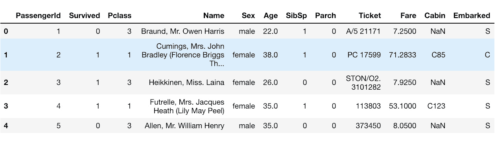
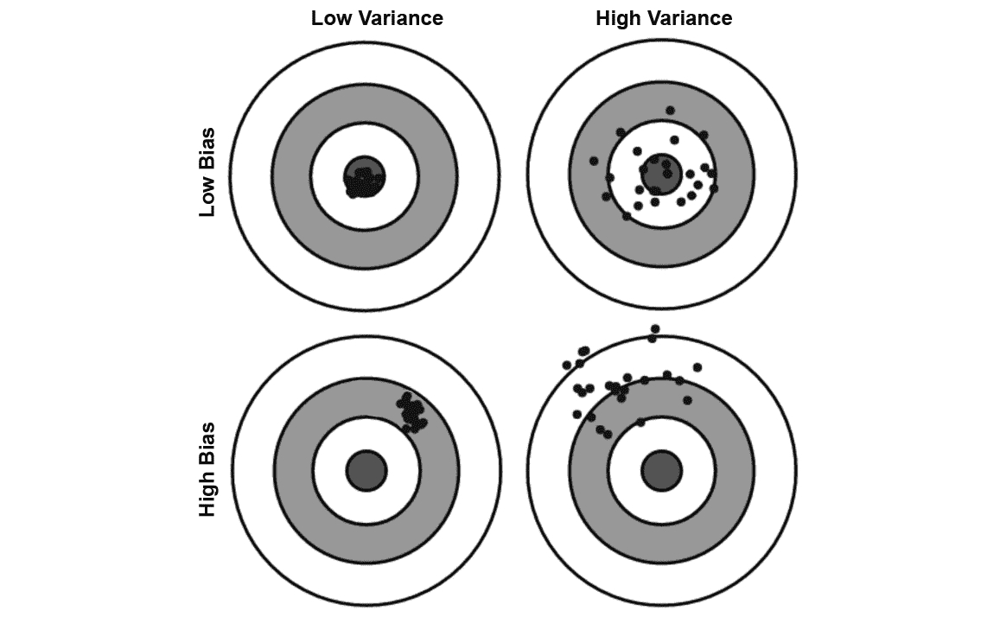
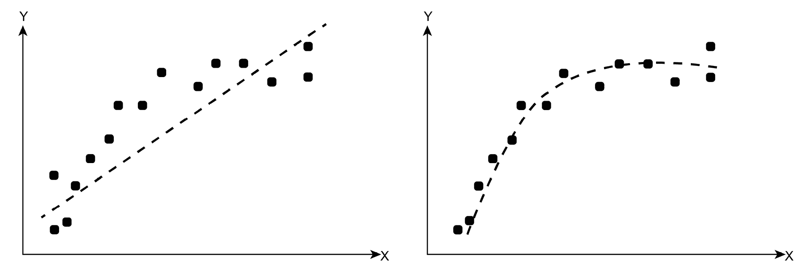
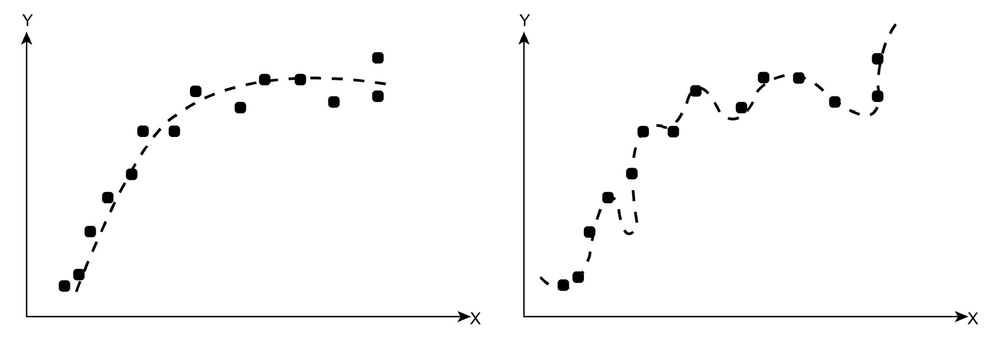
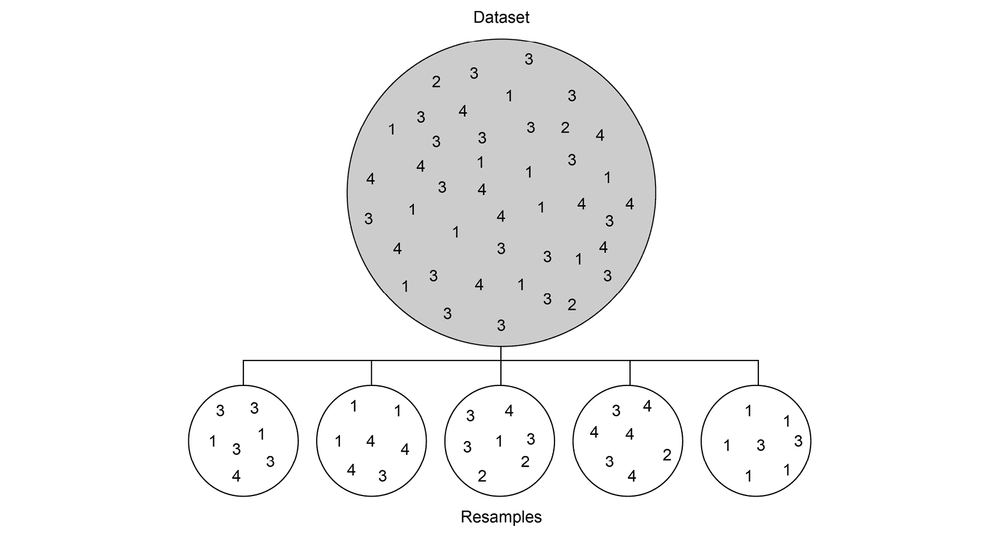
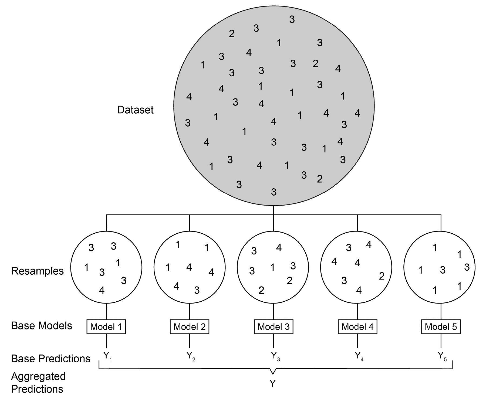
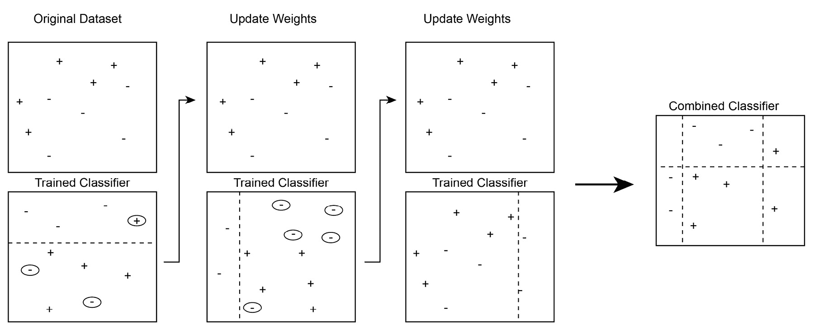
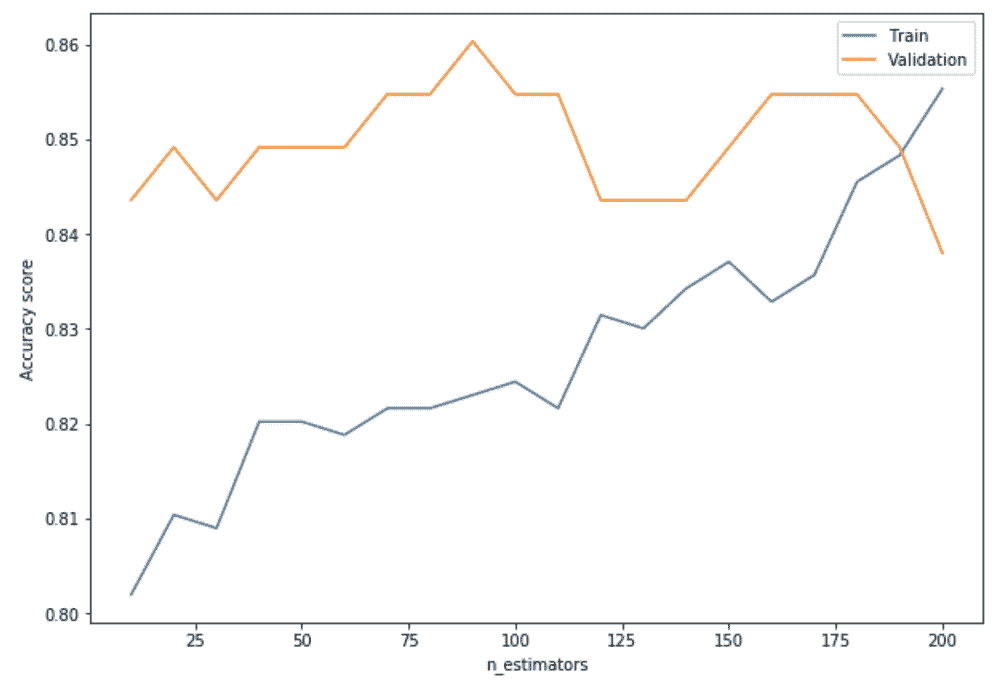
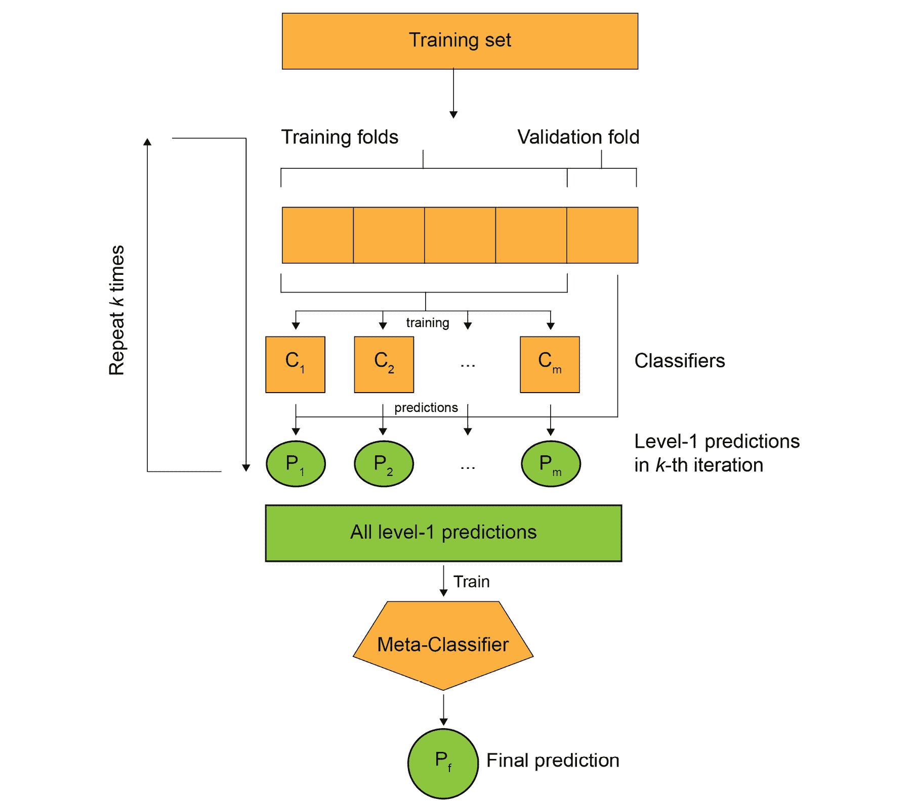

# 第五章：集成建模

## 学习目标

到本章结束时，你将能够：

+   解释偏差和方差的概念，以及它们如何导致欠拟合和过拟合

+   解释自助法（bootstrapping）背后的概念

+   使用决策树实现一个袋装分类器（bagging classifier）

+   实现自适应增强（adaptive boosting）和梯度增强（gradient boosting）模型

+   使用多个分类器实现堆叠集成（stacked ensemble）

本章介绍了偏差与方差，欠拟合与过拟合的内容，然后介绍集成建模。

## 介绍

在前几章中，我们讨论了两种监督学习问题：回归和分类。我们研究了每种类型的若干算法，并深入探讨了这些算法的工作原理。

但是，有时这些算法，无论多么复杂，都似乎无法在我们拥有的数据上表现得很好。可能有多种原因：也许数据本身不够好，也许我们试图找出的趋势根本不存在，或者可能是模型本身太复杂。

等等。什么？模型“过于复杂”怎么会是一个问题？哦，当然可以！如果模型过于复杂，而且数据量不足，模型可能会与数据拟合得过于精确，甚至学习到噪声和异常值，这正是我们所不希望发生的。

许多时候，当单个复杂算法给出的结果差异很大时，通过聚合一组模型的结果，我们可以得到更接近实际真相的结果。这是因为所有单个模型的误差有很大可能性会在我们做预测时互相抵消。

这种将多个算法组合在一起以进行聚合预测的方法就是**集成建模**的基础。集成方法的最终目标是将若干表现不佳的**基本估计器**（即各个独立算法）以某种方式组合起来，从而提高系统的整体性能，使得**集成**的算法结果能够生成一个比单一算法更强大、能更好地泛化的模型。

在本章中，我们将讨论如何构建一个集成模型来帮助我们建立一个强健的系统，使其能够做出准确的预测，而不会增加方差。我们将从讨论模型表现不佳的一些原因开始，然后转到偏差和方差的概念，以及过拟合和欠拟合。我们将介绍集成建模作为解决这些性能问题的方法，并讨论不同的集成方法，这些方法可以用于解决与表现不佳的模型相关的不同类型问题。

本章将讨论三种集成方法：装袋（bagging）、提升（boosting）和堆叠（stacking）。每种方法将从基本理论讨论到各种使用案例的讨论，以及每种方法可能不适合的使用案例。本章还将通过多个练习步骤引导您使用 Python 中的 scikit-learn 库来实现这些模型。

### 练习 43：导入模块并准备数据集

在这个练习中，我们将导入本章所需的所有模块，并准备好我们的数据集以进行接下来的练习：

1.  导入所有必要的模块来操作数据和评估模型：

    ```py
    import pandas as pd
    import numpy as np
    %matplotlib inline
    import matplotlib.pyplot as plt
    from sklearn.model_selection import train_test_split
    from sklearn.metrics import accuracy_score
    from sklearn.model_selection import KFold
    ```

1.  本章中将使用的数据集是泰坦尼克号数据集，此数据集在之前的章节中也有介绍。读取数据集并打印前五行：

    ```py
    data = pd.read_csv('titanic.csv')
    data.head()
    ```

    输出如下：

    

    ###### 图 5.1：前五行

1.  为了使数据集准备好使用，我们将添加一个`preprocess`函数，该函数将预处理数据集以使其符合 scikit-learn 库可接受的格式。

    本章假设数据集已经经过预处理并准备好使用，但我们将添加一个`preprocess`函数，该函数将预处理数据集以使其符合`Scikit-learn`库可接受的格式。

    首先，我们创建一个`fix_age`函数来预处理`age`函数并获得整数值。如果年龄为空，函数将返回*-1*以区分可用值，并且如果值小于*1*的分数，则将年龄值乘以*100*。然后，我们将此函数应用于`age`列。

    然后，我们将`Sex`列转换为二元变量，女性为*1*，男性为*0*，随后使用 pandas 的`get_dummies`函数为`Embarked`列创建虚拟二元列。之后，我们将包含虚拟列的 DataFrame 与其余数值列组合，以创建最终 DataFrame，并由该函数返回。

    ```py
    def preprocess(data):
        def fix_age(age):
            if np.isnan(age):
                return -1
            elif age < 1:
                return age*100
            else:
                return age

        data.loc[:, 'Age'] = data.Age.apply(fix_age)
        data.loc[:, 'Sex'] = data.Sex.apply(lambda s: int(s == 'female'))

        embarked = pd.get_dummies(data.Embarked, prefix='Emb')[['Emb_C','Emb_Q','Emb_S']]
        cols = ['Pclass','Sex','Age','SibSp','Parch','Fare']

        return pd.concat([data[cols], embarked], axis=1).values
    ```

1.  将数据集分为训练集和验证集。

    我们将数据集分为两部分 - 一部分用于练习中训练模型（`train`），另一部分用于进行预测以评估每个模型的性能（`val`）。我们将使用前一步中编写的函数分别预处理训练和验证数据集。

    这里，`Survived`二元变量是目标变量，确定每行中个体是否幸存于泰坦尼克号的沉没，因此我们从这两个拆分中的依赖变量列创建`y_train`和`y_val`：

    ```py
    train, val = train_test_split(data, test_size=0.2, random_state=11)
    x_train = preprocess(train)
    y_train = train['Survived'].values
    x_val = preprocess(val)
    y_val = val['Survived'].values
    ```

让我们开始吧。

## 过拟合和欠拟合

假设我们将一个监督学习算法拟合到数据上，并随后使用该模型对一个独立的验证集进行预测。基于该模型如何进行泛化，也就是它对验证数据集中的数据点做出的预测，我们将认为该模型表现良好。

有时我们发现模型无法做出准确的预测，并且在验证数据集上的表现较差。这种较差的表现可能是由于模型过于简单，无法适当地拟合数据，或者模型过于复杂，无法对验证数据集进行有效的泛化。在前一种情况下，模型具有**高偏差**，导致**欠拟合**，而在后一种情况下，模型具有**高方差**，导致**过拟合**。

**偏差**

机器学习模型预测中的偏差表示预测值与真实值之间的差异。如果平均预测值与真实值相差较大，则模型被认为具有高偏差；反之，如果平均预测值接近真实值，则模型被认为具有低偏差。

高偏差表示模型无法捕捉数据中的复杂性，并且无法识别输入和输出之间的相关关系。

**方差**

机器学习模型预测中的方差表示预测值与真实值之间的分散程度。如果预测值分散且不稳定，则模型被认为具有高方差；反之，如果预测值一致且不太分散，则模型被认为具有低方差。

高方差表示模型无法对模型以前未见过的数据点进行泛化和做出准确预测：



###### 图 5.2：数据点具有高偏差和高方差的可视化表示

### 欠拟合

假设我们在训练数据集上拟合了一个简单的模型，一个具有低模型复杂度的模型，例如一个简单的线性模型。我们拟合了一个能够在一定程度上表示训练数据中 X 和 Y 数据点之间关系的函数，但我们发现训练误差仍然很高。



###### 图 5.3：回归中的欠拟合与理想拟合

例如，查看*图 5.3*中的两个回归图；第一个图显示了一个将直线拟合到数据的模型，第二个图显示了一个尝试将相对复杂的多项式拟合到数据的模型，后者似乎很好地表示了 X 和 Y 之间的映射关系。

我们可以说，第一个模型展示了欠拟合，因为它表现出了高偏差和低方差的特征；也就是说，虽然它无法捕捉输入与输出之间映射的复杂性，但它在预测中保持一致。这个模型在训练数据和验证数据上都会有较高的预测误差。

### 过拟合

假设我们训练了一个高度复杂的模型，几乎可以完美地对训练数据集进行预测。我们已经设法拟合了一个函数来表示训练数据中 X 和 Y 数据点之间的关系，使得训练数据上的预测误差极低：



###### 图 5.4：回归中的理想拟合与过拟合

从*图 5.4*中的两个图中，我们可以看到，第二个图显示了一个试图对数据点拟合高度复杂函数的模型，而左侧的图代表了给定数据的理想拟合。

很明显，当我们尝试使用第一个模型预测在训练集未出现的 X 数据点的 Y 值时，我们会发现预测结果与相应的真实值相差甚远。这就是过拟合的表现：模型对数据拟合得*过于精确*，以至于无法对新的数据点进行泛化，因为模型学习了训练数据中的随机噪声和离群值。

这个模型展示了高方差和低偏差的特征：虽然平均预测值会接近真实值，但与真实值相比，预测值会相对分散。

### 克服欠拟合和过拟合的问题

从前面的章节中我们可以看到，当我们从一个过于简单的模型过渡到过于复杂的模型时，我们从一个具有高偏差和低方差的欠拟合模型，过渡到一个具有低偏差和高方差的过拟合模型。任何监督学习算法的目标是实现低偏差和低方差，并找到欠拟合和过拟合之间的平衡点。这将有助于算法从训练数据到验证数据点的良好泛化，从而在模型从未见过的数据上也能表现出良好的预测性能。

当模型对数据欠拟合时，改进性能的最佳方法是增加模型的复杂性，以便识别数据中的相关关系。这可以通过添加新特征或创建高偏差模型的集成来实现。然而，在这种情况下，添加更多的数据进行训练并没有帮助，因为限制因素是模型复杂度，更多的数据不会帮助减少模型的偏差。

然而，过拟合问题更难解决。以下是一些常见的应对过拟合问题的技术：

+   **获取更多数据**：一个高度复杂的模型很容易在小数据集上过拟合，但在大数据集上则不容易出现过拟合。

+   **降维**：减少特征数量有助于让模型变得不那么复杂。

+   **正则化**：向代价函数中添加一个新项，以调整系数（特别是线性回归中的高阶系数）使其趋向于较低值。

+   **集成建模**：聚合多个过拟合模型的预测结果可以有效地消除预测中的高方差，并且比单个过拟合训练数据的模型表现得更好。

我们将在*第六章*《模型评估》中更详细地讨论前三种方法的细微差别和考虑因素；本章将重点介绍不同的集成建模技术。一些常见的集成方法包括：

+   **Bagging**：即**引导聚合**的简称，这种技术也用于减少模型的方差并避免过拟合。其过程是一次性选择一部分特征和数据点，对每个子集训练一个模型，随后将所有模型的结果汇聚成最终的预测。

+   **Boosting**：这种技术用于减少偏差，而不是减少方差，它通过逐步训练新的模型，聚焦于之前模型中的错误分类数据点。

+   **Stacking**：这种技术的目的是提高分类器的预测能力，它涉及训练多个模型，然后使用组合算法根据所有这些模型的预测结果作为额外输入来做出最终预测。

我们将从 Bagging 开始，然后转向 Boosting 和 Stacking。

## Bagging

“Bagging”一词来源于一种名为引导聚合（bootstrap aggregation）的方法。为了实现成功的预测模型，了解在何种情况下我们可以从使用引导法（bootstrapping）构建集成模型中受益是非常重要的。在本节中，我们将讨论如何利用引导方法创建一个最小化方差的集成模型，并探讨如何构建一个决策树集成模型，也就是随机森林算法。那么，什么是引导法，它如何帮助我们构建强健的集成模型呢？

### 引导法

引导法是指带有放回的随机抽样，即从由随机选择的数据点组成的数据集中抽取多个样本（每个样本称为重抽样），其中每个重抽样可能包含重复的数据点，每个数据点都有相同的概率从整个数据集中被选中：



###### 图 5.5：随机选择数据点

从前面的图示中，我们可以看到，从主数据集中抽取的五个引导样本各不相同，且具有不同的特征。因此，在每个重抽样上训练模型将会得到不同的预测结果。

以下是自举的优势：

+   每个重新采样可以包含与整个数据集不同的特征，这使我们能够从不同的视角了解数据的行为。

+   利用自举法的算法能够更加健壮，并且更好地处理未见过的数据，特别是在容易导致过拟合的较小数据集上。

+   自举法可以通过使用具有不同变化和特征的数据集来测试预测的稳定性，从而得到更加健壮的模型。

### 自举聚合

现在我们知道了什么是自举，那么装袋集成究竟是什么？它本质上是一个集成模型，它在每个重新采样上生成多个预测器的版本，并使用这些版本来获取聚合的预测器。在回归问题中，聚合步骤通过模型的平均值来进行*元预测*，在分类问题中则通过投票来进行预测类别。

以下图示展示了如何从自举抽样构建装袋估计器，具体见*图 5.5*：



###### 图 5.6：从自举抽样构建的装袋估计器

由于每个模型基本上是独立的，所有基础模型可以并行训练，这显著加快了训练过程，并允许我们利用当今手头的计算能力。

装袋通过在其构建过程中引入随机化来帮助减少整个集成的方差，并且通常与具有过度拟合训练数据倾向的基础预测器一起使用。在这里需要考虑的主要点是训练数据集的稳定性（或缺乏稳定性）：在数据中轻微的扰动可能导致训练模型显著变化的情况下，装袋可以提高准确性。

scikit-learn 使用 `BaggingClassifier` 和 `BaggingRegressor` 来实现用于分类和回归任务的通用装袋集成。这些的主要输入是在每次重新采样上使用的基础估计器，以及要使用的估计器数量（即重新采样的数量）。

### 练习 44：使用装袋分类器

在本练习中，我们将使用 scikit-learn 的 `BaggingClassifier` 作为我们的集成，使用 `DecisionTreeClassifier` 作为基础估计器。我们知道决策树容易过拟合，因此在装袋集成中使用的基础估计器应具有高方差和低偏差，这两者都是重要的特征。

1.  导入基础和集成分类器：

    ```py
    from sklearn.tree import DecisionTreeClassifier
    from sklearn.ensemble import BaggingClassifier
    ```

1.  指定超参数并初始化模型。

    在这里，我们将首先指定基础估计器的超参数，使用决策树分类器，并以熵或信息增益作为划分标准。我们不会对树的深度或每棵树的叶节点大小/数量设置任何限制，以便树能够完全生长。接下来，我们将定义袋装分类器的超参数，并将基础估计器对象作为超参数传递给分类器。

    对于我们的示例，我们将选择 50 个基础估计器，这些估计器将并行运行并利用机器上所有可用的处理器（通过指定`n_jobs=-1`来实现）。此外，我们将指定`max_samples`为 0.5，表示自助法样本数量应为总数据集的一半。我们还将设置一个随机状态（为任意值，且在整个过程中保持不变），以确保结果的可复现性：

    ```py
    dt_params = {
        'criterion': 'entropy',
        'random_state': 11
    }
    dt = DecisionTreeClassifier(**dt_params)
    bc_params = {
        'base_estimator': dt,
        'n_estimators': 50,
        'max_samples': 0.5,
        'random_state': 11,
        'n_jobs': -1
    }
    bc = BaggingClassifier(**bc_params)
    ```

1.  拟合袋装分类器模型到训练数据并计算预测准确性。

    让我们拟合袋装分类器，并找出训练集和验证集的元预测。接下来，找出训练集和验证集数据集的预测准确性：

    ```py
    bc.fit(x_train, y_train)
    bc_preds_train = bc.predict(x_train)
    bc_preds_val = bc.predict(x_val)
    print('Bagging Classifier:\n> Accuracy on training data = {:.4f}\n> Accuracy on validation data = {:.4f}'.format(
        accuracy_score(y_true=y_train, y_pred=bc_preds_train),
        accuracy_score(y_true=y_val, y_pred=bc_preds_val)
    ))
    ```

    输出如下：

    

    ###### 图 5.7：袋装分类器的预测准确性

1.  拟合决策树模型到训练数据以比较预测准确性。

    我们还将拟合决策树（使用在*第二步*中初始化的对象），以便能够将集成模型的预测准确性与基础预测器进行比较：

    ```py
    dt.fit(x_train, y_train)
    dt_preds_train = dt.predict(x_train)
    dt_preds_val = dt.predict(x_val)
    print('Decision Tree:\n> Accuracy on training data = {:.4f}\n> Accuracy on validation data = {:.4f}'.format(
        accuracy_score(y_true=y_train, y_pred=dt_preds_train),
        accuracy_score(y_true=y_val, y_pred=dt_preds_val)
    ))
    ```

    输出如下：


###### 图 5.8：决策树的预测准确性

在这里，我们可以看到，尽管决策树的训练准确度远高于袋装分类器，但在验证集上的准确度较低，明显表明决策树对训练数据发生了过拟合。另一方面，袋装集成方法减少了整体方差，从而得到更为准确的预测。

### 随机森林

决策树常见的问题是每个节点的划分是使用**贪婪**算法进行的，该算法通过最小化叶节点的熵来进行划分。考虑到这一点，袋装分类器中的基础估计器决策树在划分特征上可能仍然相似，因此其预测结果也可能非常相似。然而，只有当基础模型的预测结果不相关时，袋装方法才有助于减少预测的方差。

随机森林算法通过不仅对整体训练数据集中的数据点进行引导抽样，还对每棵树的分裂特征进行引导抽样，从而尝试克服这个问题。这确保了当贪心算法在搜索*最佳*特征进行分裂时，整体*最佳*特征可能并不总是在引导抽样的特征中可用，因此不会被选择——从而导致基础树具有不同的结构。这个简单的调整使得最佳估计器能够以这样的方式进行训练：即森林中每棵树的预测结果与其他树的预测结果相关的概率更低。

随机森林中的每个基础估计器都有一个随机的数据点样本和一个随机的特征样本。由于集成是由决策树构成的，因此该算法被称为随机森林。

### 练习 45：使用随机森林构建集成模型

随机森林的两个主要参数是特征的比例和训练每个基础决策树的引导数据点的比例。

在本次练习中，我们将使用 scikit-learn 的`RandomForestClassifier`来构建集成模型：

1.  导入集成分类器：

    ```py
    from sklearn.ensemble import RandomForestClassifier
    ```

1.  指定超参数并初始化模型。

    在这里，我们将使用熵作为决策树分裂标准，森林中包含 100 棵树。与之前一样，我们不会对树的深度或叶子节点的大小/数量设置任何限制。与袋装分类器不同，袋装分类器在初始化时需要输入`max_samples`，而随机森林算法只接受`max_features`，表示引导样本中的特征数（或比例）。我们将把此值设置为 0.5，这样每棵树只考虑六个特征中的三个：

    ```py
    rf_params = {
        'n_estimators': 100,
        'criterion': 'entropy',
        'max_features': 0.5,
        'min_samples_leaf': 10,
        'random_state': 11,
        'n_jobs': -1
    }
    rf = RandomForestClassifier(**rf_params)
    ```

1.  将随机森林分类器模型拟合到训练数据并计算预测准确度。

    让我们拟合随机森林模型，并找到训练集和验证集的元预测。接下来，我们计算训练集和验证数据集上的预测准确度：

    ```py
    rf.fit(x_train, y_train)
    rf_preds_train = rf.predict(x_train)
    rf_preds_val = rf.predict(x_val)
    print('Random Forest:\n> Accuracy on training data = {:.4f}\n> Accuracy on validation data = {:.4f}'.format(
        accuracy_score(y_true=y_train, y_pred=rf_preds_train),
        accuracy_score(y_true=y_val, y_pred=rf_preds_val)
    ))
    ```

    输出结果如下：


###### 图 5.9：使用随机森林的训练和验证准确度

如果我们将随机森林在我们的数据集上的预测准确度与袋装分类器的预测准确度进行比较，我们可以看到，尽管后者在训练数据集上的准确度更高，但在验证集上的准确度几乎相同。

## 提升法

我们将讨论的第二种集成技术是**boosting**，它涉及逐步训练新模型，这些模型专注于先前模型中被错分的数据点，并利用加权平均将弱模型（具有高偏差的欠拟合模型）转变为更强的模型。与 bagging 不同，其中每个基本估计器可以独立训练，boosted 算法中每个基本估计器的训练依赖于前一个估计器。

尽管 boosting 也使用了自举法的概念，但与 bagging 不同，由于每个数据样本都有权重，这意味着某些自举样本可能被更频繁地用于训练。在训练每个模型时，算法跟踪哪些特征最有用，哪些数据样本具有最大的预测误差；这些样本被赋予更高的权重，并被认为需要更多次迭代来正确训练模型。

在预测输出时，boosting 集成从每个基本估计器的预测中取加权平均值，对训练阶段中误差较小的模型给予较高的权重。这意味着对于在迭代中由模型错分的数据点，增加这些数据点的权重，以便下一个模型更有可能正确分类它们。

与 bagging 类似，所有 boosting 基本估计器的结果被聚合以产生元预测。然而，与 bagging 不同的是，boosted 集成的准确性随着集成中基本估计器的数量显著增加而增加：



###### 图 5.10: 一个 boosted 集成

在图中，我们可以看到，在每次迭代后，错分的点具有增加的权重（由较大的图标表示），以便下一个被训练的基本估计器能够专注于这些点。最终预测器已经整合了每个基本估计器的决策边界。

### 自适应 Boosting

让我们谈谈一种称为**自适应 boosting**的 boosting 技术，它最适合提升决策桩在二元分类问题中的性能。决策桩本质上是深度为一的决策树（只对一个特征进行一次分割），因此是弱学习器。自适应 boosting 的主要原理与之前相同：通过改进基本估计器在失败区域上的表现，将一组弱学习器转化为强学习器。

首先，第一个基学习器从主训练集中抽取一个数据点的自助样本（bootstrap），并拟合一个决策树桩来对样本点进行分类，之后将训练好的决策树桩拟合到完整的训练数据上。对于那些被误分类的样本，权重会增加，从而增加这些数据点在下一个基学习器的自助样本中被选中的概率。随后，在新的自助样本上再次训练一个决策树桩，对数据点进行分类。接下来，包含两个基学习器的小型集成模型被用来对整个训练集中的数据点进行分类。在第二轮中被误分类的数据点会获得更高的权重，以提高它们被选中的概率，直到集成模型达到所需的基学习器数量为止。

自适应增强（adaptive boosting）的一个缺点是，算法容易受到噪声数据点和异常值的影响，因为它试图完美拟合每一个数据点。因此，当基学习器的数量非常高时，算法容易出现过拟合。

### 练习 46：自适应增强

在本练习中，我们将使用 scikit-learn 实现的自适应增强分类算法 `AdaBoostClassifier`：

1.  导入分类器：

    ```py
    from sklearn.ensemble import AdaBoostClassifier
    ```

1.  指定超参数并初始化模型。

    在这里，我们首先指定基学习器的超参数，使用的分类器是最大深度为 1 的决策树分类器，即决策树桩。接下来，我们将定义 AdaBoost 分类器的超参数，并将基学习器对象作为超参数传递给分类器：

    ```py
    dt_params = {
        'max_depth': 1,
        'random_state': 11
    }
    dt = DecisionTreeClassifier(**dt_params)
    ab_params = {
        'n_estimators': 100,
        'base_estimator': dt,
        'random_state': 11
    }
    ab = AdaBoostClassifier(**ab_params)
    ```

1.  将模型拟合到训练数据。

    让我们拟合 AdaBoost 模型，并找到训练集和验证集的元预测。接下来，计算训练集和验证集上的预测准确率：

    ```py
    ab.fit(x_train, y_train)
    ab_preds_train = ab.predict(x_train)
    ab_preds_val = ab.predict(x_val)
    print('Adaptive Boosting:\n> Accuracy on training data = {:.4f}\n> Accuracy on validation data = {:.4f}'.format(
        accuracy_score(y_true=y_train, y_pred=ab_preds_train),
        accuracy_score(y_true=y_val, y_pred=ab_preds_val)
    ))
    ```

    输出如下：

    

    ###### 图 5.11：使用自适应增强的训练数据和验证数据的准确性

1.  计算不同基学习器数量下，模型在训练数据和验证数据上的预测准确率。

    之前我们提到过，随着基学习器数量的增加，准确性通常会提高，但如果使用过多的基学习器，模型也容易出现过拟合。让我们计算预测准确率，以便找出模型开始过拟合训练数据的点：

    ```py
    ab_params = {
        'base_estimator': dt,
        'random_state': 11
    }
    n_estimator_values = list(range(10, 210, 10))
    train_accuracies, val_accuracies = [], []
    for n_estimators in n_estimator_values:
        ab = AdaBoostClassifier(n_estimators=n_estimators, **ab_params)
        ab.fit(x_train, y_train)
        ab_preds_train = ab.predict(x_train)
        ab_preds_val = ab.predict(x_val)

        train_accuracies.append(accuracy_score(y_true=y_train, y_pred=ab_preds_train))
        val_accuracies.append(accuracy_score(y_true=y_val, y_pred=ab_preds_val))
    ```

1.  绘制一条折线图，直观展示训练集和验证集上的预测准确率趋势：

    ```py
    plt.figure(figsize=(10,7))
    plt.plot(n_estimator_values, train_accuracies, label='Train')
    plt.plot(n_estimator_values, val_accuracies, label='Validation')
    plt.ylabel('Accuracy score')
    plt.xlabel('n_estimators')
    plt.legend()
    plt.show() 
    ```

    输出如下：



###### 图 5.12：预测准确率的趋势

正如前面提到的，我们可以看到，当决策树桩的数量从 10 增加到 200 时，训练准确度几乎一直在增加。然而，验证准确度在 0.84 到 0.86 之间波动，并且随着决策树桩数量的增加开始下降。这是因为 AdaBoost 算法试图拟合噪声数据点和离群值。

### 梯度提升

梯度提升是对提升方法的扩展，它将提升过程视为一个优化问题。定义了一个损失函数，代表误差残差（预测值与真实值之间的差异），并使用梯度下降算法来优化损失函数。

在第一步中，添加一个基估计器（这将是一个弱学习器），并在整个训练数据集上进行训练。计算预测所带来的损失，并且为了减少误差残差，更新损失函数，为那些现有估计器表现不佳的数据点添加更多的基估计器。接着，算法迭代地添加新的基估计器并计算损失，以便优化算法更新模型，最小化残差。

在自适应提升的情况下，决策树桩被用作基估计器的弱学习器。然而，对于梯度提升方法，可以使用更大的树，但仍应通过限制最大层数、节点数、分裂数或叶节点数来约束弱学习器。这确保了基估计器仍然是弱学习器，但它们可以以贪婪的方式构建。

从*第三章*，*回归分析*中我们知道，梯度下降算法可以用来最小化一组参数，比如回归方程中的系数。然而，在构建集成时，我们使用的是决策树而不是需要优化的参数。每一步计算损失后，梯度下降算法必须修改将要加入集成的新树的参数，以减少损失。这种方法更常被称为**功能梯度下降**。

### 练习 47：GradientBoostingClassifier

随机森林的两个主要参数是特征的比例和用于训练每棵基决策树的自助法数据点的比例。

在本次练习中，我们将使用 scikit-learn 的`GradientBoostingClassifier`来构建提升集成模型：

1.  导入集成分类器：

    ```py
    from sklearn.ensemble import GradientBoostingClassifier
    ```

1.  指定超参数并初始化模型。

    在这里，我们将使用 100 棵决策树作为基估计器，每棵树的最大深度为 3，每个叶节点的最小样本数为 5。虽然我们没有像前面的例子那样使用决策树桩，但树仍然很小，并且可以被视为一个弱学习器：

    ```py
    gbc_params = {
        'n_estimators': 100,
        'max_depth': 3,
        'min_samples_leaf': 5,
        'random_state': 11
    }
    gbc = GradientBoostingClassifier(**gbc_params)
    ```

1.  拟合梯度提升模型到训练数据并计算预测准确性。

    让我们拟合集成模型，并找到训练集和验证集的元预测结果。接下来，我们将找到训练集和验证集上的预测准确性：

    ```py
    gbc.fit(x_train, y_train)
    gbc_preds_train = gbc.predict(x_train)
    gbc_preds_val = gbc.predict(x_val)
    print('Gradient Boosting Classifier:\n> Accuracy on training data = {:.4f}\n> Accuracy on validation data = {:.4f}'.format(
        accuracy_score(y_true=y_train, y_pred=gbc_preds_train),
        accuracy_score(y_true=y_val, y_pred=gbc_preds_val)
    ))
    ```

    输出如下：


###### 图 5.13：训练集和验证集上的预测准确性

我们可以看到，与自适应提升集成模型相比，梯度提升集成模型在训练集和验证集上的准确性都更高。

### 堆叠

堆叠（Stacking）或堆叠泛化（也叫元集成）是一种模型集成技术，涉及将多个预测模型的信息结合起来，并将其作为特征生成一个新模型。由于堆叠模型通过平滑效应以及能够“选择”在某些场景下表现最好的基础模型，它通常会优于每个单独的模型。考虑到这一点，当每个基础模型之间有显著差异时，堆叠通常是最有效的。

堆叠使用基础模型的预测作为训练最终模型的附加特征——这些被称为**元特征**。堆叠模型本质上充当一个分类器，决定每个模型在哪些地方表现良好，在哪些地方表现较差。

然而，你不能简单地在整个训练数据上训练基础模型，在整个验证数据集上生成预测结果，然后将这些结果用于二级训练。这会导致基础模型的预测结果已经“看过”测试集，因此在使用这些预测结果时可能会发生过拟合。

需要注意的是，对于每一行的元特征，其值不能使用包含该行训练数据的模型来预测，因为这样会导致过拟合的风险，因为基础预测已经“看过”该行的目标变量。常见的做法是将训练数据分成*k*个子集，这样，在为每个子集找到元特征时，我们只会在剩余数据上训练模型。这样做还能避免模型已经“看到”的数据过拟合的问题：



###### 图 5.14：一个堆叠集成模型

上图展示了如何实现这一过程：我们将训练数据分成*k*个折叠，并通过在剩余的*k-1*个折叠上训练模型，找到每个折叠上基础模型的预测结果。因此，一旦我们得到每个折叠的元预测结果，就可以将这些元预测结果与原始特征一起用于训练堆叠模型。

### 练习 48：构建堆叠模型

在此练习中，我们将使用支持向量机（scikit-learn 的 `LinearSVC`）和 k 近邻（scikit-learn 的 `KNeighborsClassifier`）作为基础预测器，堆叠模型将是逻辑回归分类器。

1.  导入基础模型和用于堆叠的模型：

    ```py
    # Base models
    from sklearn.neighbors import KNeighborsClassifier
    from sklearn.svm import LinearSVC
    # Stacking model
    from sklearn.linear_model import LogisticRegression
    ```

1.  创建一个新的训练集，其中包含来自基础预测器的额外列。

    我们需要为每个模型的预测值创建两个新列，这些列将作为集成模型在测试和训练集中的特征使用。由于 NumPy 数组是不可变的，我们将创建一个新数组，其行数与训练数据集相同，列数比训练数据集多两列。创建数据集后，让我们打印出来看看它的样子：

    ```py
    x_train_with_metapreds = np.zeros((x_train.shape[0], x_train.shape[1]+2))
    x_train_with_metapreds[:, :-2] = x_train
    x_train_with_metapreds[:, -2:] = -1
    print(x_train_with_metapreds)
    ```

    输出如下：

    

    ###### 图 5.15：预测值的新列

    正如我们所见，每行末尾有两列填充有 *-1* 值。

1.  使用 k 折策略训练基础模型。

    让我们取 *k=5*。对于这五个折叠，使用其他四个折叠进行训练，并在第五个折叠上进行预测。然后，将这些预测添加到新的 NumPy 数组中用于基础预测的占位列中。

    首先，我们用值为 `k` 和一个随机状态初始化 `KFold` 对象，以保持可重现性。`kf.split()` 函数将数据集作为输入进行分割，并返回一个迭代器，迭代器中的每个元素分别对应于训练和验证折叠中的索引列表。每次循环迭代器时，可以使用这些索引值将训练数据细分为每行的训练和预测。

    一旦数据适当地分割，我们就会在四分之四的数据上训练这两个基础预测器，并在剩余四分之一的行上预测值。然后，将这些预测值插入到在 *步骤 2* 中用 `-1` 初始化的两个占位列中：

    ```py
    kf = KFold(n_splits=5, random_state=11)
    for train_indices, val_indices in kf.split(x_train):
        kfold_x_train, kfold_x_val = x_train[train_indices], x_train[val_indices]
        kfold_y_train, kfold_y_val = y_train[train_indices], y_train[val_indices]

        svm = LinearSVC(random_state=11, max_iter=1000)
        svm.fit(kfold_x_train, kfold_y_train)
        svm_pred = svm.predict(kfold_x_val)

        knn = KNeighborsClassifier(n_neighbors=4)
        knn.fit(kfold_x_train, kfold_y_train)
        knn_pred = knn.predict(kfold_x_val)

        x_train_with_metapreds[val_indices, -2] = svm_pred
        x_train_with_metapreds[val_indices, -1] = knn_pred
    ```

1.  创建一个新的验证集，其中包含来自基础预测器的额外预测列。

    就像我们在 *步骤 2* 中所做的那样，我们也会在验证数据集中添加两个基础模型预测的占位列：

    ```py
    x_val_with_metapreds = np.zeros((x_val.shape[0], x_val.shape[1]+2))
    x_val_with_metapreds[:, :-2] = x_val
    x_val_with_metapreds[:, -2:] = -1
    print(x_val_with_metapreds)
    ```

    输出如下：

    

    ###### 图 5.16：来自基础预测器的额外预测列

1.  在完整的训练集上拟合基础模型，以获取验证集的元特征。

    接下来，我们将在完整的训练数据集上训练这两个基础预测器，以获取验证数据集的元预测值。这类似于我们在 *步骤 3* 中对每个折叠所做的操作：

    ```py
    svm = LinearSVC(random_state=11, max_iter=1000)
    svm.fit(x_train, y_train)
    knn = KNeighborsClassifier(n_neighbors=4)
    knn.fit(x_train, y_train)
    svm_pred = svm.predict(x_val)
    knn_pred = knn.predict(x_val)
    x_val_with_metapreds[:, -2] = svm_pred
    x_val_with_metapreds[:, -1] = knn_pred
    ```

1.  训练堆叠模型并使用最终预测计算准确性。

    最后一步是使用训练数据集的所有列以及基模型的元预测结果来训练逻辑回归模型。我们使用该模型计算训练集和验证集的预测准确性：

    ```py
    lr = LogisticRegression(random_state=11)
    lr.fit(x_train_with_metapreds, y_train)
    lr_preds_train = lr.predict(x_train_with_metapreds)
    lr_preds_val = lr.predict(x_val_with_metapreds)
    print('Stacked Classifier:\n> Accuracy on training data = {:.4f}\n> Accuracy on validation data = {:.4f}'.format(
        accuracy_score(y_true=y_train, y_pred=lr_preds_train),
        accuracy_score(y_true=y_val, y_pred=lr_preds_val)
    ))
    ```

    输出如下：

    

    ###### 图 5.17：使用堆叠分类器的准确率

1.  比较准确度与基模型的准确度。

    为了了解堆叠方法带来的性能提升，我们计算基预测器在训练集和验证集上的准确率，并将其与堆叠模型的准确率进行比较：

    ```py
    print('SVM:\n> Accuracy on training data = {:.4f}\n> Accuracy on validation data = {:.4f}'.format(
        accuracy_score(y_true=y_train, y_pred=svm.predict(x_train)),
        accuracy_score(y_true=y_val, y_pred=svm_pred)
    ))
    print('kNN:\n> Accuracy on training data = {:.4f}\n> Accuracy on validation data = {:.4f}'.format(
        accuracy_score(y_true=y_train, y_pred=knn.predict(x_train)),
        accuracy_score(y_true=y_val, y_pred=knn_pred)
    ))
    ```

    输出如下：


###### 图 5.18：使用 SVM 和 K-NN 的训练和验证数据准确度

如我们所见，堆叠模型不仅使得验证准确度显著高于任何一个基预测器，而且它的准确度接近 89%，是本章讨论的所有集成模型中最高的。

### 活动 14：使用独立和集成算法进行堆叠

在本活动中，我们将使用*Kaggle 房价：高级回归技术数据库*（可在[`www.kaggle.com/c/house-prices-advanced-regression-techniques/data`](https://www.kaggle.com/c/house-prices-advanced-regression-techniques/data)上获取，或在 GitHub 上访问[`github.com/TrainingByPackt/Applied-Supervised-Learning-with-Python`](https://github.com/TrainingByPackt/Applied-Supervised-Learning-with-Python)），该数据集我们在*第二章*《探索性数据分析与可视化》中做过 EDA。这份数据集旨在解决回归问题（即目标变量为连续值的范围）。在本活动中，我们将使用决策树、K-最近邻、随机森林和梯度提升算法在数据上训练个体回归器。然后，我们将构建一个堆叠线性回归模型，使用所有这些算法并比较每个模型的性能。我们将使用**平均绝对误差**（**MAE**）作为本活动的评估指标。

执行的步骤如下：

1.  导入相关库。

1.  读取数据。

1.  对数据集进行预处理，去除空值，并对分类变量进行独热编码，为建模准备数据。

1.  将数据集分为训练集和验证集。

1.  初始化字典以存储训练和验证的 MAE 值。

1.  使用以下超参数训练决策树模型并保存得分：

    ```py
    dt_params = {
        'criterion': 'mae',
        'min_samples_leaf': 10,
        'random_state': 11
    }
    ```

1.  使用以下超参数训练 k-最近邻模型并保存得分：

    ```py
    knn_params = {
        'n_neighbors': 5
    }
    ```

1.  使用以下超参数训练随机森林模型并保存得分：

    ```py
    rf_params = {
        'n_estimators': 50,
        'criterion': 'mae',
        'max_features': 'sqrt',
        'min_samples_leaf': 10,
        'random_state': 11,
        'n_jobs': -1
    }
    ```

1.  使用以下超参数训练梯度提升模型并保存得分：

    ```py
    gbr_params = {
        'n_estimators': 50,
        'criterion': 'mae',
        'max_features': 'sqrt',
        'min_samples_leaf': 10,
        'random_state': 11
    }
    ```

1.  准备训练集和验证集，其中四个元估计器具有与前面步骤中使用的相同的超参数。

1.  训练一个线性回归模型作为堆叠模型。

1.  可视化每个独立模型和堆叠模型的训练误差和验证误差。

    #### 注意

    该活动的解决方案可以在第 364 页找到。

## 总结

本章从讨论过拟合和欠拟合以及它们如何影响模型在未见数据上的表现开始。接着，本章探讨了集成建模作为解决这些问题的方法，并继续讨论了可以使用的不同集成方法，以及它们如何减少在进行预测时遇到的总体偏差或方差。

我们首先讨论了袋装算法并介绍了自助抽样的概念。然后，我们看了随机森林作为袋装集成的经典例子，并完成了在之前的泰坦尼克数据集上构建袋装分类器和随机森林分类器的练习。

然后，我们继续讨论了提升算法，如何成功减少系统中的偏差，并理解了如何实现自适应提升和梯度提升。我们讨论的最后一种集成方法是堆叠，正如我们从练习中看到的那样，它给出了我们实现的所有集成方法中最好的准确率。

尽管构建集成模型是减少偏差和方差的好方法，而且它们通常比单一模型表现得更好，但它们本身也有自己的问题和使用场景。虽然袋装（bagging）在避免过拟合时非常有效，但提升（boosting）可以减少偏差和方差，尽管它仍然可能有过拟合的倾向。而堆叠（stacking）则是当一个模型在某部分数据上表现良好，而另一个模型在另一部分数据上表现更好时的好选择。

在下一章，我们将通过探讨验证技术来详细研究克服过拟合和欠拟合问题的方法，也就是评估模型性能的方法，以及如何使用不同的指标作为参考，构建最适合我们用例的模型。
