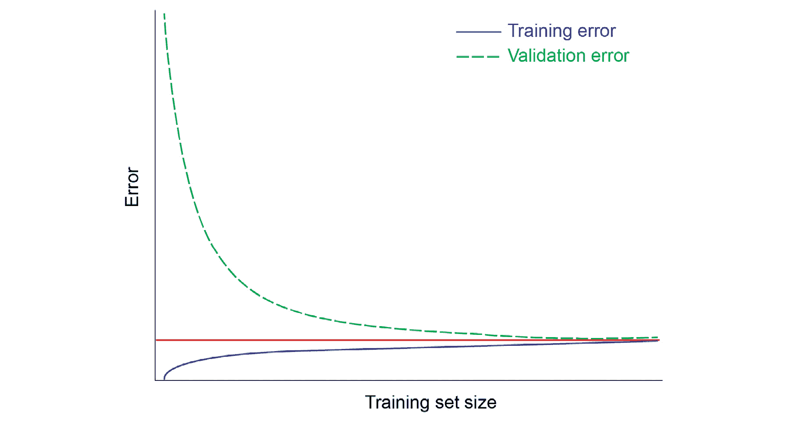

# 第六章：模型评估

## 学习目标

本章结束时，你将能够：

+   解释评估模型的重要性

+   使用多种指标评估回归和分类模型

+   选择合适的评估指标来评估和调优模型

+   解释持出数据集的重要性和采样的类型

+   进行超参数调优以找到最佳模型

+   计算特征重要性并解释它们为何重要

本章介绍了如何通过使用超参数和模型评估指标来提升模型性能。

## 介绍

在前面的三章中，我们讨论了两种类型的监督学习问题——回归和分类，接着介绍了集成模型，它是由多个基础模型的组合构建而成。我们建立了几个模型，并讨论了它们的工作原理及原因。

然而，这还不足以将模型投入生产。模型开发是一个迭代过程，模型训练步骤之后是验证和更新步骤：


###### 图 6.1：机器学习模型开发过程

本章将解释前面流程图中展示的外围步骤；我们将讨论如何选择合适的超参数，以及如何使用合适的误差指标进行模型验证。通过反复执行这两项任务，提升模型性能。

但是，为什么评估模型很重要呢？假设你已经训练好了模型，提供了一些超参数，做出了预测并找到了准确率。这就是其核心内容，但如何确保你的模型发挥出了最佳能力呢？我们需要确保你所制定的性能评估标准实际上能够代表模型，并且模型在未见过的测试数据集上也能够表现良好。

确保模型达到最佳状态的关键部分出现在初始训练之后：即评估和提升模型性能的过程。本章将引导你了解这一过程中所需的基本技术。

在本章中，我们将首先讨论为什么模型评估如此重要，并介绍几种回归任务和分类任务的评估指标，这些指标可以用来量化模型的预测性能。接下来，我们将讨论持出数据集和 k 折交叉验证，并解释为什么测试集必须独立于验证集。

在此之后，我们将讨论可以用来提高模型表现的策略。在上一章中，我们谈到了如何一个具有高偏差或高方差的模型会导致表现不佳，以及如何通过构建集成模型来帮助我们建立一个更加稳健、更加准确的系统，而不增加整体方差。我们还提到了一些避免过拟合训练数据的技巧：

+   **获取更多数据**：一个复杂的模型可能很容易在小数据集上过拟合，但在更大的数据集上却可能不容易过拟合。

+   **降维**：减少特征的数量有助于使模型变得不那么复杂。

+   **正则化**：在代价函数中添加一个新项，以便调整系数（尤其是线性回归中的高阶系数）使其趋向于较小的值。

在本章中，我们将介绍学习曲线和验证曲线，作为查看训练误差和验证误差变化的方式，以帮助我们了解模型是否需要更多的数据，并找到合适的复杂度水平。接下来将介绍超参数调优，以提升模型表现，并简要介绍特征重要性。

### 练习 49：导入模块并准备我们的数据集

在本练习中，我们将加载在*第五章*（*集成建模*）中训练的数据和模型。我们将使用*活动 14: 使用独立和集成算法进行堆叠*中的堆叠线性回归模型，以及*练习 45: 使用随机森林构建集成模型*中的随机森林分类模型来预测乘客的生存情况：

1.  导入相关的库：

    ```py
    import pandas as pd
    import numpy as np
    import pickle
    %matplotlib inline
    import matplotlib.pyplot as plt
    ```

1.  从*第五章*（*集成建模*）加载处理后的数据文件。我们将使用 pandas 的`read_csv()`方法读取准备好的数据集，并在本章练习中使用它们。首先，我们将读取房价数据：

    ```py
    house_prices_reg = pd.read_csv('houseprices_regression.csv')
    house_prices_reg.head()
    ```

    我们将看到以下输出：

    

    ###### 图 6.2: 房价数据的前五行

    接下来，我们将读取泰坦尼克号的数据：

    ```py
    titanic_clf = pd.read_csv('titanic_classification.csv')
    titanic_clf.head()
    ```

    我们将看到以下输出：

    

    ###### 图 6.3: 泰坦尼克号数据的前五行

1.  接下来，使用`pickle`库从二进制文件中加载我们将在本章练习中使用的模型文件：

    ```py
    with open('../Saved Models/titanic_regression.pkl', 'rb') as f:
        reg = pickle.load(f)
    with open('../Saved Models/random_forest_clf.pkl', 'rb') as f:
        rf = pickle.load(f)
    ```

让我们开始吧。

## 评估指标

评估机器学习模型是任何项目中的关键部分：一旦我们让模型从训练数据中学习，下一步就是衡量模型的表现。我们需要找到一种度量标准，不仅能告诉我们模型的预测准确度，还能让我们比较多个模型的表现，从而选择最适合我们用例的模型。

定义度量标准通常是我们在定义问题陈述和开始进行探索性数据分析（EDA）之前要做的第一件事，因为提前规划并思考我们打算如何评估构建的任何模型的性能以及如何判断模型是否达到最佳表现是个好主意。最终，计算性能评估度量将纳入机器学习管道中。

不用说，回归任务和分类任务的评估度量是不同的，因为前者的输出值是连续的，而后者的输出值是分类的。在这一部分，我们将探讨可以用来量化模型预测性能的不同度量标准。

### 回归

对于输入变量*X*，回归模型给出一个预测值，，该值可以取一系列不同的值。理想的情况是模型能够预测出尽可能接近实际值*y*的值。因此，两个值之间的差距越小，模型的表现就越好。回归度量通常涉及查看每个数据点的预测值与实际值之间的数值差异（即残差或误差值），然后以某种方式聚合这些差异。

我们来看一下下图，它绘制了每个点*X*的实际值和预测值：


###### 图 6.4：线性回归问题中的实际值与预测值之间的残差

然而，我们不能仅仅对所有数据点的的均值进行计算，因为可能存在某些数据点，其预测误差为正或负，最终的总和将抵消掉许多误差，并严重高估模型的性能。

相反，我们可以考虑每个数据点的绝对误差，并计算**平均绝对误差**（**MAE**），其公式如下：


###### 图 6.5：平均绝对误差

在这里，和分别是第*i*个数据点的实际值和预测值。

MAE 是一个**线性评分函数**，意味着在聚合误差时，它给每个残差赋予相等的权重。MAE 的值可以从零到无穷大，并且不关心误差的方向（正误差或负误差）。由于这些是误差度量，通常希望其值越低（越接近零越好）。

为了避免误差方向影响性能评估，我们还可以对误差项进行平方处理。对平方误差取平均值即可得到**均方误差**（**MSE**）：


###### 图 6.6：均方误差

虽然 MAE 的单位与目标变量 *y* 相同，但 MSE 的单位将是 *y* 的平方单位，这可能使得在实际应用中判断 MSE 变得稍微不太直观。然而，如果我们对 MSE 取平方根，就能得到 **均方根误差**（**RMSE**）：


###### 图 6.7：均方根误差

由于在计算平均值之前对误差进行了平方处理，哪怕只有少数几个误差值很高，也会导致 RMSE 值显著增大。这意味着在我们希望惩罚大误差的模型中，RMSE 比 MAE 更有用。

由于 MAE 和 RMSE 的单位与目标变量相同，因此判断 MAE 或 RMSE 的某个特定值好坏可能很困难，因为没有参考的标准。为了解决这个问题，常用的指标是 **R²** **分数**，也叫 **R 平方分数**：


###### 图 6.8：R 平方分数

R2 分数的下限为 *-∞*，上限为 1。基础模型预测目标变量等于训练数据集中目标值的均值，即，对于所有 *i* 的值， 等于 。考虑到这一点，R2 的负值表示训练模型的预测结果比均值还要差，而接近 1 的值表示模型的均方误差（MSE）接近零时的情况。

### 练习 50：回归指标

在本次练习中，我们将使用在 *第五章，集成建模* 中的 *活动 14：使用独立和集成算法进行堆叠* 训练过的相同模型和处理过的数据集，来计算回归指标。我们将使用 scikit-learn 实现的 MAE 和 MSE：

1.  导入度量函数：

    ```py
    from sklearn.metrics import mean_absolute_error, mean_squared_error, r2_score
    from math import sqrt
    ```

1.  使用加载的模型对给定数据进行预测。我们将使用与 *第五章，集成建模* 中 *活动 14：使用独立和集成算法进行堆叠* 相同的特征，使用该模型对加载的数据集进行预测。我们保存的 *y* 列是目标变量，我们将相应地创建 *X* 和 *y*：

    ```py
    X = house_prices_reg.drop(columns=['y'])
    y = house_prices_reg['y'].values
    y_pred = reg.predict(X)
    ```

1.  计算 MAE、RMSE 和 R2 分数。我们将打印预测值的 MAE 和 RMSE 值，并打印模型的 R2 分数：

    ```py
    print('Mean Absolute Error = {}'.format(mean_absolute_error(y, y_pred)))
    print('Root Mean Squared Error = {}'.format(sqrt(mean_squared_error(y, y_pred))))
    print('R Squared Score = {}'.format(r2_score(y, y_pred)))
    ```

    输出结果如下：


###### 图 6.9：分数

我们可以看到 RMSE 明显高于 MAE。这表明某些数据点的残差特别大，这在较大的 RMSE 值中得到了突出表现。但 R2 分数接近 1，说明该模型相比于基础模型（基础模型预测的是均值）表现得几乎理想。

### 分类

对于一个输入变量*X*，分类任务给出了一个预测值，，它可以取有限的几个值（在二分类问题中为两个值）。由于理想的情况是预测每个数据点的类别与实际类别相同，因此没有衡量*预测类别与实际类别*之间距离的指标。因此，要评判模型的表现，简单的方法就是判断模型是否正确地预测了类别。

判断分类模型表现的方法有两种：使用数值指标，或通过绘制曲线并观察曲线的形状。让我们更详细地探讨这两种方法。

**数值指标**

判断模型表现最简单且基本的方法是计算正确预测占总预测数的比例，这给出了**准确率**：


###### 图 6.10：准确率

尽管准确率指标适用于任何类别数量的情况，但接下来的几个指标将以二分类问题为背景进行讨论。此外，准确率在许多情况下可能不是评估分类任务表现的最佳指标。

让我们看一个欺诈检测的例子：假设问题是检测一封邮件是否欺诈。在这种情况下，我们的数据集高度倾斜（或不平衡，也就是说，一类数据点的数量远大于另一类数据点），在 10,000 封邮件中有 100 封（总数的 1%）被分类为欺诈（属于类别 1）。假设我们构建了两个模型：

+   第一个模型简单地将每封邮件预测为非欺诈，也就是说，10,000 封邮件中的每一封都被归类为类别 0。在这种情况下，10,000 封邮件中有 9,900 封被正确分类，这意味着该模型的准确率为 99%。

+   第二个模型将 100 封欺诈邮件预测为欺诈，但同时也错误地将另外 100 封邮件预测为欺诈。在这种情况下，同样有 100 个数据点在 10,000 封邮件中被误分类，模型的准确率为 99%。

我们如何比较这两种模型？构建欺诈检测模型的目的是让我们了解*欺诈检测的效果*：比起非欺诈邮件被误分类为欺诈邮件，正确分类欺诈邮件更为重要。尽管这两个模型的准确率相同，但第二个模型实际上比第一个更有效。

由于无法仅通过准确率捕获这一点，我们需要**混淆矩阵**，它是一个包含四种不同的预测值和实际值组合的表格，本质上为我们提供了分类问题预测结果的总结：


###### 图 6.11：混淆矩阵

下面是矩阵中使用的术语的含义：

+   **真正例**和**真负例**：这些是分别在正类和负类中被正确预测的数据点数量。

+   **假正例**：也称为**类型 1 错误**，指的是实际上属于负类但被预测为正类的数据点数量。从前面的例子继续，如果一个正常的邮件被分类为欺诈邮件，则为假正例。

+   **假负例**：也称为**类型 2 错误**，指的是实际上属于正类但被预测为负类的数据点数量。假负例的例子是，如果一封欺诈邮件被分类为非欺诈邮件。

从混淆矩阵中可以推导出两个极其重要的指标：**精度**和**召回率**。


###### 图 6.12: 精度


###### 图 6.13: 召回率

精度告诉我们有多少实际的正例被正确地预测为正例（从模型认为相关的结果中，有多少实际是相关的？），而召回率告诉我们有多少预测为正例的结果实际上是正例（从真实的相关结果中，有多少被模型列入相关结果列表？）。这两个指标在类不平衡时尤其有用。

模型的精度和召回率通常存在权衡：如果必须召回所有相关的结果，模型将生成更多不准确的结果，从而降低精度。另一方面，要确保生成的结果中有更高比例的相关结果，就需要尽量少生成结果。大多数情况下，你会优先考虑精度或召回率，这完全取决于问题的具体要求。例如，由于确保所有欺诈性邮件被正确分类更为重要，因此召回率将是一个需要最大化的关键指标。

接下来的问题是，如何使用一个单一的数值来评估模型，综合考虑精度和召回率，而不是单独平衡这两个指标。**F1** **分数**将两者合并成一个单一的数值，这个数值可以作为模型的公正评判标准，并且等于精度和召回率的调和平均值：


###### 图 6.14: F1 分数

F1 分数的值总是介于 0（如果精度或召回率为零）和 1（如果精度和召回率都为 1）之间。分数越高，说明模型的性能越好。F1 分数对两个指标赋予相等的权重，并且是一般 Fβ 指标的一个特例，其中 β 可以调整，以便根据以下公式为召回率或精度赋予更多权重：


###### 图 6.15: F β 值

*β* *< 1* 时，更注重精确度，而 *β* *> 1* 时，更注重召回率。F1 分数采用 *β* *= 1*，使两者权重相等。

**曲线图**

有时，我们不是预测类别，而是利用类别的概率值。举例来说，在一个二分类任务中，正类（类 1）和负类（类 0）的类别概率之和始终为 1（或 统一的 1），这意味着如果我们将分类概率视为类 1 的概率，并应用一个阈值，我们可以本质上将其作为一个截止值，来进行四舍五入（为 1）或下舍（为 0），从而得到输出的类别。

通常，通过改变阈值，我们可以得到分类概率接近 0.5 的数据点，这些数据点从一个类别转到另一个类别。例如，当阈值为 0.5 时，具有 0.4 概率的数据点会被分配为类 0，而具有 0.6 概率的数据点会被分配为类 1。但如果我们将阈值改为 0.35 或 0.65，这两个数据点都会被分类为 1 或 0。

事实证明，改变概率会改变精确度和召回率的值，这可以通过绘制**精确度-召回率曲线**来捕捉。图表的*Y* 轴表示精确度，*X* 轴表示召回率，对于从 0 到 1 的一系列阈值，图表绘制每一个（召回率，精确度）点。连接这些点便得到曲线。以下图显示了一个例子：


###### 图 6.16：精确度-召回率曲线

我们知道，在理想情况下，精确度和召回率的值将为 1。这意味着，当阈值从 0 增加到 1 时，精确度将保持为 1，但召回率会从 0 增加到 1，因为越来越多（相关的）数据点将被正确分类。因此，在理想情况下，精确度-召回率曲线基本上将是一个正方形，且**曲线下面积**（**AUC**）将等于 1。

因此，我们可以看到，和 F1 分数一样，AUC 是另一个从精确度和召回率行为中得出的指标，它结合了精确度和召回率的值来评估模型的性能。我们希望模型的 AUC 尽可能高，接近 1。

显示分类模型性能的另一个主要可视化技术是**接收者操作特征**（**ROC**）曲线。ROC 曲线绘制了**真正例率**（**TPR**）在*Y* 轴上的关系，以及**假正例率**（**FPR**）在*X* 轴上的关系，随着分类概率阈值的变化。TPR 恰好等于召回率（也称为模型的**灵敏度**），而 FPR 是**特异性**的补集（即 *1 - FPR = 灵敏度*）；这两者都可以通过混淆矩阵使用以下公式推导：


###### 图 6.17：真正例率


](img/C12622_06_18.jpg)

###### 图 6.18：假阳性率

下图展示了一个 ROC 曲线的示例，其绘制方式与精度-召回曲线相同：通过改变概率阈值，使得曲线上的每个点代表一个*(TPR, FPR)*数据点，对应于一个特定的概率阈值。


###### 图 6.19：ROC 曲线

当类别比较平衡时，ROC 曲线更为有用，因为它们往往会在类别不平衡的数据集上呈现过于乐观的模型表现，尤其是在 ROC 曲线中的假阳性率使用了真正负例（而精度-召回曲线中没有此项）。

### 练习 51：分类指标

在本练习中，我们将使用在*第五章*《集成建模》中训练的随机森林模型，并使用其预测生成混淆矩阵，计算精度、召回率和 F1 得分，以此来评估我们的模型。我们将使用 scikit-learn 的实现来计算这些指标：

1.  导入相关的库和函数：

    ```py
    from sklearn.metrics import (accuracy_score, confusion_matrix, precision_score,
                                 recall_score, f1_score)
    ```

1.  使用模型对所有数据点进行类别预测。我们将使用与之前相同的特征，并使用随机森林分类器对加载的数据集进行预测。scikit-learn 中的每个分类器都有一个`.predict_proba()`函数，我们将在这里使用它，并结合标准的`.predict()`函数来分别提供类别概率和预测的类别：

    ```py
    X = titanic_clf.iloc[:, :-1]
    y = titanic_clf.iloc[:, -1]
    y_pred = rf.predict(X)
    y_pred_probs = rf.predict_proba(X)
    ```

1.  计算准确率：

    ```py
    print('Accuracy Score = {}'.format(accuracy_score(y, y_pred)))
    ```

    输出将如下所示：

    

    ###### 图 6.20：准确率得分

1.  打印混淆矩阵：

    ```py
    print(confusion_matrix(y_pred=y_pred, y_true=y))
    ```

    输出将如下所示：

    

    ###### 图 6.21：混淆矩阵

    在这里，我们可以看到模型似乎有较高的假阴性数量，这意味着我们可以预期该模型的召回率将非常低。类似地，由于假阳性的数量仅为一个，我们可以预期模型将具有较高的精度。

1.  计算精度和召回率：

    ```py
    print('Precision Score = {}'.format(precision_score(y, y_pred)))
    print('Recall Score = {}'.format(recall_score(y, y_pred)))
    ```

    输出将如下所示：

    

    ###### 图 6.22：精度和召回得分

1.  计算 F1 得分：

    ```py
    print('F1 Score = {}'.format(f1_score(y, y_pred)))
    ```

    输出将如下所示：


###### 图 6.23：F1 得分

我们可以看到，由于召回率极低，这也影响了 F1 得分，使其接近零。

现在我们已经讨论了可以用来衡量模型预测性能的指标，让我们谈谈验证策略，我们将使用这些指标来评估模型在不同情况下的表现。

## 数据集划分

在评估模型表现时，一个常见的错误是计算模型在训练数据上的预测误差，并基于训练数据集上的高预测准确率得出模型表现良好的结论。

这意味着我们正在尝试在模型已经*见过*的数据上进行测试，也就是说，模型已经学到了训练数据的行为，因为它曾经接触过这些数据——如果要求模型再次预测训练数据的行为，它无疑会表现得很好。而且，模型在训练数据上的表现越好，就越有可能意味着模型对数据*了解得过于透彻*，甚至学会了数据中的噪声和异常值的行为。

现在，高训练准确度会导致模型具有高方差，正如我们在前一章中看到的那样。为了获得模型性能的无偏估计，我们需要找出它在训练过程中没有接触过的数据上的预测准确度。这时，留出数据集就显得非常重要。

### 留出数据

**留出数据集**是指从训练数据中剥离出的样本，这部分数据在训练过程中未被模型接触，因此它对模型来说是*未见过*的。由于噪声是随机的，留出数据点很可能包含异常值和噪声数据，这些数据的行为与训练数据集中的数据有所不同。因此，在留出数据集上计算模型的性能，可以帮助我们验证模型是否过拟合，并为我们提供对模型性能的无偏视角。

我们在上一章开始时将泰坦尼克号数据集拆分为训练集和验证集。那么，什么是验证数据集，它与测试数据集有何不同呢？我们经常看到“验证集”和“测试集”这两个术语互换使用——虽然它们都指代留出数据集，但在目的上存在一些差异：

+   **验证数据**：在模型从训练数据中学习后，会在验证数据集上评估其性能。然而，为了让模型发挥最佳表现，我们需要对模型进行微调，并反复迭代评估更新后的模型性能，这一过程是在验证数据集上进行的。通常，表现最好的微调版本模型会被选为最终模型。

    因此，模型在每次改进的迭代过程中都会接触到验证数据集，尽管本质上并没有*从数据中学习*。可以说，验证集间接地影响了模型。

+   **测试数据**：选择的最终模型现在在测试数据集上进行评估。在该数据集上测得的性能将是一个无偏的度量，作为模型的最终性能指标。这一最终评估是在模型已经在合并后的训练集和验证集上完全训练后进行的。此后，模型不再进行训练或更新。

    这意味着模型仅在计算最终性能指标时暴露于测试数据集一次。

应当记住，验证数据集绝不应被用来评估模型的最终性能：如果模型已经看到并被修改以特定提高在验证集上的表现，那么我们对模型真实性能的估计会存在正偏。

然而，单一的保留验证数据集确实存在一些局限性：

+   由于模型在每次改进的迭代中只进行一次验证，因此使用这个单一评估可能难以捕捉预测中的不确定性。

+   将数据划分为训练集和验证集会减少训练模型时使用的数据量，这可能导致模型具有较高的方差。

+   最终模型可能会*过拟合*此验证集，因为它是根据此数据集的最大性能进行调优的。

如果我们使用称为 K 折交叉验证的验证技术，而不是仅使用单一验证数据集，这些挑战是可以克服的。

### K 折交叉验证

K 折交叉验证是一种验证技术，它通过在*k*折中轮换验证集，帮助我们得到模型性能的无偏估计。其工作原理如下：

1.  首先，我们选择*k*的值，并将数据划分为*k*个子集。

1.  然后，我们将第一子集作为验证集，剩余的数据用于训练模型。

1.  我们在验证子集上衡量模型的性能。

1.  然后，我们将第二子集作为验证子集，并重复这一过程。

1.  一旦我们完成这*k*次操作后，我们将所有折叠的性能度量值聚合，并呈现最终指标。

下图直观地解释了这一过程：


###### 图 6.24：K 折交叉验证

尽管这种验证方法计算开销较大，但其优点超过了成本。这种方法确保模型在训练数据集中的每个示例上都得到验证一次，且最终得到的性能估计不偏向于验证集，尤其是在数据集较小的情况下。一个特例是**留一法**交叉验证，其中*k*的值等于数据点的数量。

### 采样

现在我们已经了解了用于划分数据集以进行模型训练和验证的策略，让我们讨论如何将数据点分配到这些划分中。我们可以通过两种方式对数据进行采样，这两种方式如下：

+   **随机采样**：这就是将整体数据集中的随机样本分配到训练集、验证集和/或测试集的过程。随机划分数据只有在所有数据点彼此独立时才有效。例如，如果数据是时间序列形式，随机划分就不适用，因为数据点是有序的，每个数据点都依赖于前一个数据点。随机划分数据会破坏这个顺序，忽视这种依赖关系。

+   **分层采样**：这是一种确保每个子集的目标变量的分布与原始数据集相同的方法。例如，如果原始数据集的两个类别的比例是 3:7，那么分层采样确保每个子集中的两个类别的比例也是 3:7。

    分层采样很重要，因为在数据集的目标值分布与训练模型时的数据集不同的情况下，测试模型可能会得到一个无法代表模型实际性能的结果估计。

训练集、验证集和测试集的样本大小在模型评估过程中也起着重要作用。将一个较大的数据集留作最终模型性能测试，可以帮助我们获得对模型性能的无偏估计，并减少预测的方差，但如果测试集过大，以至于由于缺少训练数据影响了模型的训练能力，这将严重影响模型的表现。这个考虑特别适用于较小的数据集。

### 练习 52：使用分层采样的 K 折交叉验证

在这个练习中，我们将实现基于分层采样的 K 折交叉验证，使用 scikit-learn 的随机森林分类器。scikit-learn 中的 `StratifiedKFold` 类实现了交叉验证和采样的结合，我们将在练习中使用它：

1.  导入相关的类。我们将导入 scikit-learn 的 `StratifiedKFold` 类，这是 `KFold` 的一种变体，返回分层折叠，同时导入 `RandomForestClassifier`：

    ```py
    from sklearn.model_selection import StratifiedKFold
    from sklearn.ensemble import RandomForestClassifier
    ```

1.  为训练准备数据并初始化 k 折交叉验证对象。在这里，我们将使用五个折叠来评估模型，因此将 `n_splits` 参数设置为 `5`：

    ```py
    X = titanic_clf.iloc[:, :-1].values
    y = titanic_clf.iloc[:, -1].values
    skf = StratifiedKFold(n_splits=5)
    ```

1.  对每个折叠训练一个分类器并记录得分。`StratifiedKFold` 类的功能类似于我们在上一章中使用的 `KFold` 类，*练习 48：构建堆叠模型*：对于五个折叠中的每一个，我们将在其他四个折叠上进行训练，并在第五个折叠上进行预测，找到第五个折叠上的准确率得分。正如我们在上一章中看到的，`skf.split()` 函数以数据集为输入，返回一个迭代器，包含用于划分训练数据进行训练和验证的每行索引值：

    ```py
    scores = []
    for train_index, val_index in skf.split(X, y):
        X_train, X_val = X[train_index], X[val_index]
        y_train, y_val = y[train_index], y[val_index]

        rf_skf = RandomForestClassifier(**rf.get_params())

        rf_skf.fit(X_train, y_train)
        y_pred = rf_skf.predict(X_val)

        scores.append(accuracy_score(y_val, y_pred))

    print(scores)
    ```

    输出结果如下：

    

    ###### 图 6.25：使用随机森林分类器的得分

1.  打印汇总的准确率得分：

    ```py
    print('Mean Accuracy Score = {}'.format(np.mean(scores)))
    ```

    输出结果如下：


###### 图 6.26：平均准确率得分

## 性能提升策略

监督式机器学习模型的性能提升是一个迭代过程，通常需要持续更新和评估周期才能得到完美的模型。虽然本章前面的部分讨论了评估策略，本节将讨论模型更新：我们将探讨如何确定模型所需的性能提升，并如何在模型中做出这些改变。

### 训练误差和测试误差的变化

在上一章中，我们介绍了欠拟合和过拟合的概念，并提到了几种克服它们的方法，随后介绍了集成模型。但是我们没有讨论如何识别我们的模型是否出现了欠拟合或过拟合的情况。

通常来说，查看学习曲线和验证曲线是很有用的。

**学习曲线**

学习曲线展示了随着训练数据量的增加，训练误差和验证误差的变化。通过观察曲线的形状，我们可以大致判断增加更多数据是否有利于建模，并可能改善模型的表现。

让我们来看一下以下图表：虚线曲线表示验证误差，实线曲线表示训练误差。左侧的图表显示这两条曲线趋向于一个相对较高的误差值。这意味着模型存在较高的偏差，增加更多的数据很可能不会对模型的表现产生影响。因此，与其浪费时间和金钱去收集更多的数据，我们只需要增加模型的复杂度。

另一方面，右侧的图表显示，即使训练集中的数据点数量增加，训练误差和测试误差之间的差距依然很大。这个宽广的差距表示系统的方差很高，也意味着模型过拟合。在这种情况下，增加更多的数据点可能有助于模型更好地进行泛化：


###### 图 6.27：数据量增加的学习曲线

但是，我们如何识别完美的学习曲线呢？当我们有一个低偏差和低方差的模型时，我们会看到像下面图示那样的曲线。它展示了低训练误差（低偏差），以及当验证曲线和训练曲线汇聚时，二者之间的低差距（低方差）。在实际操作中，我们能看到的最好的学习曲线是那些趋于某个不可减少的误差值的曲线（该误差值由于数据集中的噪声和异常值而存在）：



###### 图 6.28: 低偏差和低方差模型随着训练数据量增大，训练和验证误差的变化

**验证曲线**

正如我们之前讨论的，机器学习模型的目标是能够推广到未见过的数据。验证曲线可以帮助我们找到一个欠拟合和过拟合模型之间的理想点，在这个点上，模型能够良好地进行推广。在上一章中，我们讨论了模型复杂度如何影响预测性能：我们说，当我们从一个过于简单的模型走向一个过于复杂的模型时，我们会从一个具有高偏差和低方差的欠拟合模型，过渡到一个具有低偏差和高方差的过拟合模型。

验证曲线显示了随着模型参数值变化，训练误差和验证误差的变化，这些模型参数在某种程度上控制着模型的复杂度——这可能是线性回归中的多项式的次数，或者是决策树分类器的深度。


###### 图 6.29: 随着模型复杂度增加，训练和验证的变化

上面的图展示了随着模型复杂度变化（模型参数是其指示器之一），验证误差和训练误差如何变化。我们还可以看到，在阴影区域之间的某个点是总误差最小的地方，这个点位于欠拟合和过拟合之间的甜蜜点。找到这个点有助于我们找到理想的模型参数值，从而建立一个既具有低偏差又具有低方差的模型。

### 超参数调优

我们之前多次谈到超参数调优，现在让我们讨论一下它为什么如此重要。首先，需要注意的是，模型参数与模型超参数是不同的：前者是模型内部的，并且是从数据中学习得到的，而后者则定义了模型本身的架构。

一些超参数的示例如下：

+   用于线性回归模型的多项式特征的次数

+   允许的决策树分类器的最大深度

+   随机森林分类器中包含的树木数量

+   用于梯度下降算法的学习率

定义模型架构的设计选择可以显著影响模型的性能。通常，超参数的默认值可以工作，但是获取超参数的完美组合可以真正提升模型的预测能力，因为默认值可能完全不适合我们要建模的问题。在下图中，我们可以看到调整两个超参数值如何导致模型分数的巨大差异：


###### 图 6.30：模型分数（Z 轴）随两个模型参数值（X 和 Y 轴）变化的情况

通过探索一系列可能的值来找到完美组合，这就是所谓的**超参数调优**。由于没有损失函数可用于最大化模型性能，调整超参数通常只涉及尝试不同组合并选择在验证期间表现最佳的组合。

有几种方式可以调整我们模型的超参数：

+   **手动调整**：当我们手动选择超参数的值时，这被称为手动调整。这通常是低效的，因为通过手动解决高维优化问题不仅可能很慢，而且也不允许模型达到其性能峰值，因为我们可能不会尝试每个超参数值的所有组合。

+   **网格搜索**：网格搜索涉及对提供的超参数值的每一组合进行训练和评估，并选择产生最佳性能模型的组合。由于这涉及对超参数空间进行详尽采样，因此计算成本相当高，效率低下。

+   **随机搜索**：尽管第一种方法因尝试的组合过少而被认为效率低下，但第二种方法因尝试的组合过多而被认为效率低下。随机搜索旨在通过从网格中选择超参数组合的随机子集，并仅为这些组合训练和评估模型来解决这个问题。或者，我们还可以为每个超参数提供统计分布，从中随机抽样值。

    随机搜索的逻辑已被 Bergstra 和 Bengio 证明：如果网格上至少有 5%的点产生接近最优解，那么进行 60 次随机搜索将高概率找到该区域。

    #### 注

    您可以阅读 Bergstra 和 Bengio 的论文，网址为[`www.jmlr.org/papers/v13/bergstra12a.html`](http://www.jmlr.org/papers/v13/bergstra12a.html)。

+   **贝叶斯优化**：前两种方法涉及独立地实验不同超参数值的组合，并记录每个组合的模型性能。然而，贝叶斯优化是顺序地迭代实验，并允许我们利用先前实验的结果来改进下一个实验的采样方法。

### 练习 53：使用随机搜索进行超参数调优

使用 scikit-learn 的`RandomizedSearchCV`方法，我们可以定义一个超参数范围的网格，并从网格中随机采样，使用每个超参数值组合执行 K 折交叉验证。在这个练习中，我们将使用随机搜索方法进行超参数调优：

1.  导入随机搜索类：

    ```py
    from sklearn.model_selection import RandomizedSearchCV
    ```

1.  为训练准备数据并初始化分类器。在这里，我们将初始化随机森林分类器，而不传递任何参数，因为这只是一个基础对象，稍后将在每个网格点上进行实例化并执行随机搜索：

    ```py
    X = titanic_clf.iloc[:, :-1].values
    y = titanic_clf.iloc[:, -1].values
    rf_rand = RandomForestClassifier()
    ```

1.  指定需要采样的参数。在这里，我们将列出每个超参数的不同值，这些值将用于网格中：

    ```py
    param_dist = {"n_estimators": list(range(10,210,10)),
                  "max_depth": list(range(3,20)),
                  "max_features": list(range(1, 10)),
                  "min_samples_split": list(range(2, 11)),
                  "bootstrap": [True, False],
                  "criterion": ["gini", "entropy"]}
    ```

1.  运行随机搜索。我们用希望运行的试验总数、参数值字典、评分函数以及 K 折交叉验证中的折数来初始化随机搜索对象。然后，我们调用`.fit()`函数来执行搜索：

    ```py
    n_iter_search = 60
    random_search = RandomizedSearchCV(rf_rand, param_distributions=param_dist, scoring='accuracy',
                                       n_iter=n_iter_search, cv=5)
    random_search.fit(X, y)
    ```

1.  打印前五个模型的评分和超参数。将`results`字典转换为 pandas DataFrame，并按`rank_test_score`对值进行排序。然后，对于前五行，打印排名、平均验证得分和超参数：

    ```py
    results = pd.DataFrame(random_search.cv_results_).sort_values('rank_test_score')
    for i, row in results.head().iterrows():
        print("Model rank: {}".format(row.rank_test_score))
        print("Mean validation score: {:.3f} (std: {:.3f})".format(row.mean_test_score, row.std_test_score))
        print("Model Hyperparameters: {}\n".format(row.params))
    ```

    输出将如下所示：


###### 图 6.31：前五个模型的评分和超参数

我们可以看到，表现最好的模型只有 70 棵树，而排名 2 到 4 的模型有 160 棵以上的树。此外，排名第 5 的模型只有 10 棵树，但其性能仍然与更复杂的模型相当。

### 特征重要性

虽然关注模型性能至关重要，但理解模型中各特征如何贡献于预测同样重要：

+   我们需要能够解释模型以及不同变量如何影响预测，以便向相关利益相关者说明为什么我们的模型成功。

+   数据可能存在偏差，在这些数据上训练模型可能会影响模型的性能，并导致模型评估出现偏差，在这种情况下，通过查找重要特征并分析它们来解释模型的能力将有助于调试模型的表现。

+   除了前面提到的点之外，还必须注意，某些模型偏差可能在社会或法律上是不可接受的。例如，如果一个模型表现良好，因为它隐含地对基于种族的特征赋予了较高的重要性，这可能会引发问题。

除了这些要点，找出特征重要性还可以帮助特征选择。如果数据具有高维度，并且训练的模型具有高方差，那么删除那些重要性较低的特征是一种通过降维来降低方差的方法。

### 练习 54：使用随机森林计算特征重要性

在这个练习中，我们将从我们之前加载的随机森林模型中找出特征的重要性：

1.  找出特征重要性。让我们找出特征的重要性，并将其保存在一个 pandas DataFrame 中，索引为列名，并按降序排列这个 DataFrame：

    ```py
    feat_imps = pd.DataFrame({'importance': rf.feature_importances_}, index=titanic_clf.columns[:-1])
    feat_imps.sort_values(by='importance', ascending=False, inplace=True)
    ```

1.  将特征重要性绘制为条形图：

    ```py
    feat_imps.plot(kind='bar', figsize=(10,7))
    plt.legend()
    plt.show()
    ```

    输出将如下所示：


###### 图 6.32：特征直方图

在这里，我们可以看到`Sex`、`Fare`和`Pclass`特征似乎具有最高的重要性，也就是说，它们对目标变量的影响最大。

### 活动 15：最终测试项目

在这个活动中，我们将使用*IBM HR Analytics 员工流失与绩效*数据集（可在[`www.kaggle.com/pavansubhasht/ibm-hr-analytics-attrition-dataset`](https://www.kaggle.com/pavansubhasht/ibm-hr-analytics-attrition-dataset)找到），以及相关的源代码（见[`github.com/TrainingByPackt/Supervised-Learning-with-Python`](https://github.com/TrainingByPackt/Supervised-Learning-with-Python)）来解决一个分类问题，在这个问题中，我们需要预测员工是否会离职。针对员工流失问题，我们的目标是最大化召回率，即我们希望能够识别所有即将离职的员工，即使这意味着预测一些表现良好的员工也会离职：这将帮助 HR 对这些员工采取适当的措施，防止他们离开。

数据集中的每一行代表一个员工，目标变量是`Attrition`，它有两个值：`1`和`0`，分别表示该员工是否离职，*是*和*否*。我们将使用来自 scikit-learn 的梯度提升分类器来训练模型。这个活动是作为一个最终项目，旨在帮助巩固本书以及本章所学的概念的实际应用。

我们将通过使用交叉验证的随机搜索来找到模型的最优超参数。然后，我们将在数据集的一部分上使用梯度提升算法构建最终的分类器，并使用我们学到的分类指标评估其在数据集剩余部分的表现。我们将使用平均绝对误差作为此次活动的评估指标。

需要执行的步骤如下：

1.  导入相关的库。

1.  读取`attrition_train.csv`数据集。

1.  读取`categorical_variable_values.json`文件，该文件包含了分类变量的详细信息。

1.  处理数据集，将所有特征转换为数值型。

1.  选择基础模型，并定义与模型对应的超参数值范围，以进行超参数调优。

1.  定义初始化`RandomizedSearchCV`对象的参数，并使用 K 折交叉验证来找到最佳模型超参数。

1.  将数据集划分为训练集和验证集，并使用最终超参数在训练集上训练新模型。

1.  计算在验证集上的预测精度、精确度和召回率，并打印混淆矩阵。

1.  尝试调整不同的阈值，找到具有高召回率的最佳点。绘制精确度-召回率曲线。

1.  确定用于预测测试数据集的最终阈值。

1.  读取并处理测试数据集，将所有特征转换为数值型。

1.  在测试数据集上预测最终值。

    #### 注意

    本活动的解决方案可以在第 373 页找到。

## 总结

本章讨论了模型评估在监督学习中的重要性，并介绍了几种用于评估回归和分类任务的重要指标。我们看到，虽然回归模型的评估相对简单，但分类模型的性能可以通过多种方式进行衡量，具体取决于我们希望模型优先考虑的内容。除了数值指标，我们还探讨了如何绘制精确度-召回率曲线和 ROC 曲线，以更好地解读和评估模型性能。

之后，我们讨论了为什么通过计算模型在其训练数据上的预测误差来评估模型是一个不好的主意，以及如何在模型已经*见过*的数据上进行测试会导致模型具有高方差。通过这一点，我们引入了保持集数据集的概念，并解释了 K 折交叉验证为何是一个有用的策略，以及确保模型训练和评估过程保持无偏的采样技术。

性能改进策略的最后一节从学习曲线和验证曲线的讨论开始，探讨了如何解读这些曲线来推动模型开发过程，最终提高模型性能。随后，我们介绍了超参数调优作为提升性能的一种方法，并简要介绍了特征重要性。
