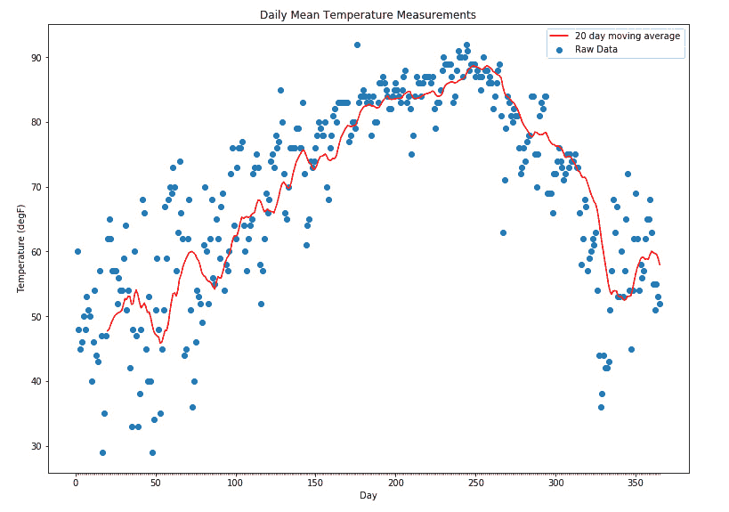
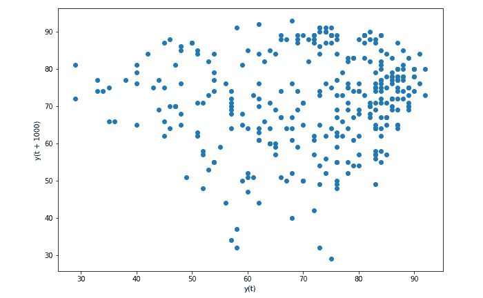
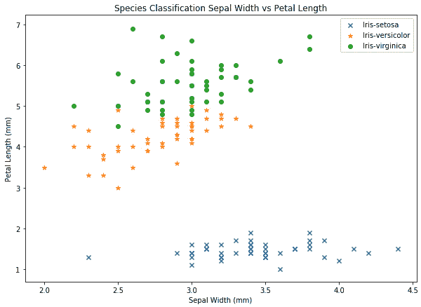
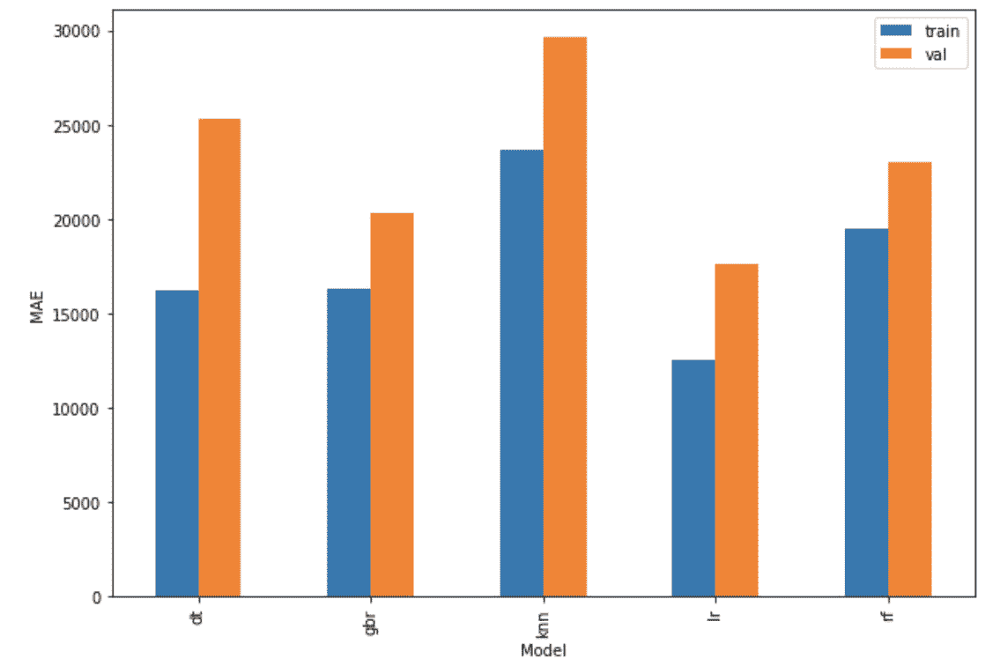
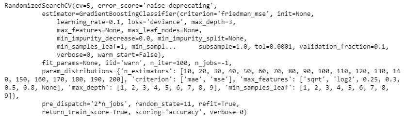

# 第八章：*附录*

## 关于

本节内容帮助学生完成书中的活动。它包括学生为实现活动目标所需执行的详细步骤。

## 第一章：Python 机器学习工具包

### 活动 1：pandas 函数

**解决方案**

1.  打开一个新的 Jupyter Notebook。

1.  使用 pandas 加载 Titanic 数据集：

    ```py
    import pandas as pd
    df = pd.read_csv('titanic.csv')
    ```

    使用 `head()` 函数查看数据集，如下：

    ```py
    # Have a look at the first 5 sample of the data
    df.head()
    ```

    输出结果如下：

    

    ###### 图 1.65：前五行

    使用 `describe` 函数如下：

    ```py
    df.describe(include='all')
    ```

    输出结果如下：

    

    ###### 图 1.66：describe()的输出

1.  我们不需要 `Unnamed: 0` 列。我们可以通过以下方式删除该列，而不使用 `del` 命令：

    ```py
    df = df[df.columns[1:]] # Use the columns
    df.head()
    ```

    输出结果如下：

    

    ###### 图 1.67：删除 `Unnamed: 0` 列后的前五行

1.  计算 DataFrame 列的均值、标准差、最小值和最大值，而不使用 `describe`：

    ```py
    df.mean()
    Fare        33.295479
    Pclass       2.294882
    Age         29.881138
    Parch        0.385027
    SibSp        0.498854
    Survived     0.383838
    dtype: float64
    df.std()
    Fare        51.758668
    Pclass       0.837836
    Age         14.413493
    Parch        0.865560
    SibSp        1.041658
    Survived     0.486592
    dtype: float64
    df.min()
    Fare        0.00
    Pclass      1.00
    Age         0.17
    Parch       0.00
    SibSp       0.00
    Survived    0.00
    dtype: float64
    df.max()
    Fare        512.3292
    Pclass        3.0000
    Age          80.0000
    Parch         9.0000
    SibSp         8.0000
    Survived      1.0000
    dtype: float64
    ```

1.  33%、66% 和 99% 的四分位数如何？使用 `quantile` 方法如下：

    ```py
    df.quantile(0.33)
    Fare         8.559325
    Pclass       2.000000
    Age         23.000000
    Parch        0.000000
    SibSp        0.000000
    Survived     0.000000
    Name: 0.33, dtype: float64
    df.quantile(0.66)
    Fare        26.0
    Pclass       3.0
    Age         34.0
    Parch        0.0
    SibSp        0.0
    Survived     1.0
    Name: 0.66, dtype: float64
    df.quantile(0.99)
    Fare        262.375
    Pclass        3.000
    Age          65.000
    Parch         4.000
    SibSp         5.000
    Survived      1.000
    Name: 0.99, dtype: float64
    ```

1.  每个班级的乘客有多少人？让我们来看一下，使用`groupby`方法：

    ```py
    class_groups = df.groupby('Pclass')
    for name, index in class_groups:
        print(f'Class: {name}: {len(index)}')
    Class: 1: 323
    Class: 2: 277
    Class: 3: 709
    ```

1.  每个班级的乘客有多少人？你可以通过使用选择/索引方法来统计每个班级的成员数量：

    ```py
    for clsGrp in df.Pclass.unique():
        num_class = len(df[df.Pclass == clsGrp])
        print(f'Class {clsGrp}: {num_class}')
    Class 3: 709
    Class 1: 323
    Class 2: 277
    ```

    *第 6 步* 和 *第 7 步* 的答案是匹配的。

1.  确定第三类中的最年长乘客是谁：

    ```py
    third_class = df.loc[(df.Pclass == 3)]
    third_class.loc[(third_class.Age == third_class.Age.max())]
    ```

    输出结果如下：

    

    ###### 图 1.68：第三类中的最年长乘客

1.  对于许多机器学习问题，通常会将数值缩放到 0 到 1 之间。使用 `agg` 方法与 Lambda 函数将 `Fare` 和 `Age` 列缩放到 0 到 1 之间：

    ```py
    fare_max = df.Fare.max()
    age_max = df.Age.max()
    df.agg({
        'Fare': lambda x: x / fare_max, 
        'Age': lambda x: x / age_max,
    }).head()
    ```

    输出结果如下：

    

    ###### 图 1.69：将数值缩放到 0 到 1 之间

1.  数据集中有一个个体没有列出 `Fare` 票价：

    ```py
    df_nan_fare = df.loc[(df.Fare.isna())]
    df_nan_fare
    ```

    这是输出：


###### 图 1.70：没有列出票价的个体

使用 `groupby` 方法，将此行的 `NaN` 值替换为与相同班级和 `Embarked` 位置对应的平均 `Fare` 值：

```py
embarked_class_groups = df.groupby(['Embarked', 'Pclass'])
indices = embarked_class_groups.groups[(df_nan_fare.Embarked.values[0], df_nan_fare.Pclass.values[0])]
mean_fare = df.iloc[indices].Fare.mean()
df.loc[(df.index == 1043), 'Fare'] = mean_fare
df.iloc[1043]
```

输出结果如下：

```py
Cabin                      NaN
Embarked                     S
Fare                   14.4354
Pclass                       3
Ticket                    3701
Age                       60.5
Name        Storey, Mr. Thomas
Parch                        0
Sex                       male
SibSp                        0
Survived                   NaN
Name: 1043, dtype: object
```

## 第二章：探索性数据分析与可视化

### 活动 2：汇总统计与缺失值

**解决方案**

完成此活动的步骤如下：

1.  读取数据。使用 pandas 的 `.read_csv` 方法将 CSV 文件读取为 pandas DataFrame：

    ```py
    data = pd.read_csv('house_prices.csv')
    ```

1.  使用 pandas 的 `.info()` 和 `.describe()` 方法查看数据集的汇总统计：

    ```py
    data.info()
    data.describe().T
    ```

    `info()` 的输出将是：

    

    ###### 图 2.39：info() 方法的输出

    `describe()`方法的输出将是：

    

    ###### 图 2.40：describe()方法的输出

1.  找出 DataFrame 中每列的缺失值总数和缺失值百分比，并按缺失值百分比降序显示至少有一个空值的列：

    正如我们在*练习 12：可视化缺失值*中所做的那样，我们将使用`.isnull()`函数在 DataFrame 上获取掩码，通过在掩码 DataFrame 上使用`.sum()`函数找出每列的空值数量，并通过在掩码 DataFrame 上使用`.mean()`函数计算空值的比例，再乘以 100 将其转换为百分比。然后，我们使用`pd.concat()`将空值的总数和百分比合并成一个单独的 DataFrame，并按缺失值的百分比排序行：

    ```py
    mask = data.isnull()
    total = mask.sum()
    percent = 100*mask.mean()
    missing_data = pd.concat([total, percent], axis=1,join='outer',
                   keys=['count_missing', 'perc_missing'])
    missing_data.sort_values(by='perc_missing', ascending=False, inplace=True)
    missing_data[missing_data.count_missing > 0]
    ```

    输出结果如下：

    

    ###### 图 2.41：每列缺失值的总数和百分比

1.  绘制空值矩阵和空值相关性热图。首先，我们找出包含至少一个空值的列名列表。然后，我们使用`missingno`库绘制空值矩阵（正如我们在*练习 12：可视化缺失值*中所做的那样），并对这些列中的数据绘制空值相关性热图（样本为 500 个点）：

    ```py
    nullable_columns = data.columns[mask.any()].tolist()
    msno.matrix(data[nullable_columns].sample(500))
    plt.show()
    msno.heatmap(data[nullable_columns], figsize=(18,18))
    plt.show()
    ```

    空值矩阵将如下所示：

    

    ###### 图 2.42：空值矩阵

    空值相关性热图将如下所示：

    

    ###### 图 2.43：空值相关性热图

1.  删除缺失值超过 80%的列。使用我们在*第 3 步*中创建的 DataFrame 的`.loc`操作符，只选择缺失值少于 80%的列：

    ```py
    data = data.loc[:,missing_data[missing_data.perc_missing < 80].index]
    ```

1.  用 NA 值替换`FireplaceQu`列中的空值。使用`.fillna()`方法将空值替换为`NA`字符串：

    ```py
    data['FireplaceQu'] = data['FireplaceQu'].fillna('NA')
    ```

### 活动 3：可视化表示值的分布

**解决方案**

1.  使用 Matplotlib 绘制目标变量`SalePrice`的直方图。首先，我们使用`plt.figure`命令初始化图形并设置图形大小。然后，使用 Matplotlib 的`.hist()`函数作为主要绘图函数，将`SalePrice`系列对象传入以绘制直方图。最后，指定坐标轴标签并显示图形：

    ```py
    plt.figure(figsize=(8,6))
    plt.hist(data.SalePrice, bins=range(0,800000,50000))
    plt.ylabel('Number of data points')
    plt.xlabel('SalePrice')
    plt.show()
    ```

    输出结果如下：

    

    ###### 图 2.44：目标变量的直方图

1.  找出每一列具有对象类型的唯一值的数量。通过在原始 DataFrame 上使用 `.select_dtypes` 函数，选择具有 `numpy.object` 数据类型的列，创建一个名为 `object_variables` 的新 DataFrame。然后，使用 `.nunique()` 函数查找该 DataFrame 中每一列的唯一值数量，并对结果系列进行排序：

    ```py
    object_variables = data.select_dtypes(include=[np.object])
    object_variables.nunique().sort_values()
    ```

    输出结果将是：

    

    ###### 图 2.45：每一列具有对象类型的唯一值的数量

1.  创建一个 DataFrame，表示 `HouseStyle` 列中每个类别值的出现次数。使用 `.value_counts()` 函数计算每个值的频率，按降序以 pandas 系列的形式表示，然后重置索引，得到一个 DataFrame，并按索引对值进行排序：

    ```py
    counts = data.HouseStyle.value_counts(dropna=False)
    counts.reset_index().sort_values(by='index')
    ```

    输出结果将是：

    

    ###### 图 2.46：HouseStyle 列中每个类别值的出现次数

1.  绘制表示这些计数的饼图。如同 *步骤 1*，我们使用 `plt.figure()` 初始化图像，并分别使用 `plt.title()` 和 `plt.show()` 方法来设置图形标题并显示图像。主要使用的绘图函数是 `plt.pie()`，将我们在前一步创建的系列传递给它：

    ```py
    plt.figure(figsize=(10,10))
    plt.pie(counts, labels=counts.index)
    plt.title('Pie chart showing counts for\nHouseStyle categories')
    plt.show()
    ```

    输出结果如下：

    

    ###### 图 2.47：表示计数的饼图

1.  找出每一列具有数字类型的唯一值的数量。如同 *步骤 2*，现在选择具有 `numpy.number` 数据类型的列，并使用 `.nunique()` 查找每一列的唯一值数量。按降序对结果系列进行排序：

    ```py
    numeric_variables = data.select_dtypes(include=[np.number])
    numeric_variables.nunique().sort_values(ascending=False)
    ```

    输出结果如下：

    

    ###### 图 2.48：每一列具有数字类型的唯一值的数量

1.  使用 Seaborn 绘制 `LotArea` 变量的直方图。使用 Seaborn 的 `.distplot()` 函数作为主要绘图函数，并将 DataFrame 中的 `LotArea` 系列传递给它（去除空值；使用 `.dropna()` 函数删除空值）。为了改善图形的显示，还可以设置 `bins` 参数，并使用 `plt.xlim()` 指定 *X* 轴的限制：

    ```py
    plt.figure(figsize=(10,7))
    sns.distplot(data.LotArea.dropna(), , bins=range(0,100000,1000))
    plt.xlim(0,100000)
    plt.show()
    ```

    输出结果如下：

    

    ###### 图 2.49：LotArea 变量的直方图

1.  计算每一列数值的偏斜值和峰度值：

    ```py
    data.skew().sort_values()
    data.kurt()
    ```

    偏斜值的输出结果将是：


###### 图 2.50：每一列的偏斜值

峰度值的输出结果将是：


###### 图 2.51：每一列的峰度值

### 活动 4：数据中的关系

**解答**

1.  绘制数据集的相关性热力图。正如我们在*练习 23：相关性热力图*中所做的那样，使用 Seaborn 的`.heatmap()`函数绘制热力图，并传递特征相关性矩阵（通过使用 pandas 的`.corr()`函数在数据框上确定）。此外，使用`cmap`参数将颜色图设置为`RdBu`，并通过`vmin`和`vmax`参数分别将颜色刻度的最小值和最大值设置为`-1`和`1`：

    ```py
    plt.figure(figsize = (12,10))
    sns.heatmap(data.corr(), square=True, cmap="RdBu", vmin=-1, vmax=1)
    plt.show()
    ```

    输出结果如下：

    

    ###### 图 2.52：数据集的热力图

1.  使用以下特征子集绘制一个更紧凑的热力图，并带有相关值的注释：

    ```py
    feature_subset = [
        'GarageArea', 'GarageCars','GarageCond','GarageFinish','GarageQual','GarageType',
        'GarageYrBlt','GrLivArea','LotArea','MasVnrArea','SalePrice'
    ]
    ```

    现在，按照上一步的方法操作，这次只选择数据集中上述列，并向主绘图函数添加一个值为`True`的`annot`参数，其他保持不变：

    ```py
    plt.figure(figsize = (12,10))
    sns.heatmap(data[feature_subset].corr(), square=True, annot=True, cmap="RdBu", vmin=-1, vmax=1)
    plt.show()
    ```

    输出结果如下：

    

    ###### 图 2.53：带有相关值注释的热力图

1.  显示同一特征子集的配对图，主对角线为 KDE 图，其它部分为散点图。使用 Seaborn 的`.pairplot()`函数绘制数据框中选定列的非空值的配对图。要将主对角线图设置为 KDE 图，可以将`kde`传递给`diag_kind`参数，要将其它图设置为散点图，则将`scatter`传递给`kind`参数：

    ```py
    sns.pairplot(data[feature_subset].dropna(), kind ='scatter', diag_kind='kde')
    plt.show()
    ```

    输出结果如下：

    

    ###### 图 2.54：同一特征子集的配对图

1.  创建一个箱型图，显示每个`GarageCars`类别中的`SalePrice`变动。这里使用的主要绘图函数是 Seaborn 的`.boxplot()`函数，我们将数据框以及`x`和`y`参数传递给它，前者是分类变量，后者是我们希望看到在每个类别中变动的连续变量，即`GarageCars`和`SalePrice`：

    ```py
    plt.figure(figsize=(10, 10))
    sns.boxplot(x='GarageCars', y="SalePrice", data=data)
    plt.show()
    ```

    输出结果如下：

    

    ###### 图 2.55：显示每个`GarageCars`类别中`SalePrice`变动的箱型图

1.  使用 Seaborn 绘制折线图，显示较旧和较新建公寓的`SalePrice`变化。在这里，我们将使用 Seaborn 的`.lineplot()`函数绘制折线图。由于我们希望查看`SalePrice`的变化，因此将其作为*y*变量，而由于变化跨越一段时间，我们将`YearBuilt`作为*x*变量。记住这一点，我们将相应的系列作为值传递给主绘图函数的`y`和`x`参数。同时，我们传递`ci=None`参数，以隐藏图中折线周围的标准差指示器：

    ```py
    plt.figure(figsize=(10,7))
    sns.lineplot(x=data.YearBuilt, y=data.SalePrice, ci=None)
    plt.show()
    ```

    输出结果如下：


###### 图 2.56：显示旧公寓和新建公寓的 SalePrice 变化的折线图

## 第三章：回归分析

### 活动 5：使用移动平均绘制数据

**解答**

1.  从 CSV 文件中将数据集加载到 pandas DataFrame 中：

    ```py
    df = pd.read_csv('austin_weather.csv')
    df.head()
    ```

    输出结果将显示`austin_weather.csv`文件的前五行：

    

    ###### 图 3.74：奥斯汀天气数据的前五行

1.  由于我们只需要`Date`和`TempAvgF`列，因此我们将从数据集中删除其他所有列：

    ```py
    df = df[['Date', 'TempAvgF']]
    df.head()
    ```

    输出结果如下：

    

    ###### 图 3.75：奥斯汀天气数据的日期和 TempAvgF 列

1.  最初，我们只关心第一年的数据，因此我们只需要提取该信息。在 DataFrame 中为年份创建一列，从`Date`列的字符串中提取年份值作为整数，并将这些值分配给`Year`列。请注意，温度是按天记录的：

    ```py
    df['Year'] = [int(dt[:4]) for dt in df.Date]
    df.head()
    ```

    输出结果如下：

    

    ###### 图 3.76：提取年份

1.  重复此过程以提取月份值，并将值以整数形式存储在`Month`列中：

    ```py
    df['Month'] = [int(dt[5:7]) for dt in df.Date]
    df.head()
    ```

    输出结果如下：

    

    ###### 图 3.77：提取月份

1.  将第一年的数据复制到 DataFrame 中：

    ```py
    df_first_year = df[:365]
    df_first_year.head()
    ```

    输出结果如下：

    

    ###### 图 3.78：复制数据到新的数据框

1.  计算 20 天的移动平均滤波器：

    ```py
    window = 20
    rolling = df_first_year.TempAvgF.rolling(window).mean();
    rolling.head(n=20)
    ```

    输出结果如下：

    ```py
    0       NaN
    1       NaN
    2       NaN
    3       NaN
    4       NaN
    5       NaN
    6       NaN
    7       NaN
    8       NaN
    9       NaN
    10      NaN
    11      NaN
    12      NaN
    13      NaN
    14      NaN
    15      NaN
    16      NaN
    17      NaN
    18      NaN
    19    47.75
    Name: TempAvgF, dtype: float64
    ```

1.  绘制原始数据和移动平均信号，*x*轴为年份中的天数：

    ```py
    fig = plt.figure(figsize=(10, 7))
    ax = fig.add_axes([1, 1, 1, 1]);
    # Temp measurements
    ax.scatter(range(1, 366), df_first_year.TempAvgF, label='Raw Data');
    ax.plot(range(1, 366), rolling, c='r', label=f'{window} day moving average');
    ax.set_title('Daily Mean Temperature Measurements')
    ax.set_xlabel('Day')
    ax.set_ylabel('Temperature (degF)')
    ax.set_xticks(range(1, 366), 10)
    ax.legend();
    ```

    输出结果如下：



###### 图 3.79：全年温度的散点图

### 活动 6：使用最小二乘法进行线性回归

**解答**

1.  可视化测量值：

    ```py
    df.head()
    ```

    输出结果如下：

    

    ###### 图 3.80：activity2_measurements.csv 数据集的前五行

1.  可视化滚动平均值：

    ```py
    rolling.head(n=30)
    ```

    输出结果如下：

    

    ###### 图 3.81：滚动头平均值

1.  使用默认参数创建线性回归模型；即，计算模型的*y*截距并且不对数据进行归一化：

    ```py
    model = LinearRegression()
    model
    ```

    输出结果如下：

    ```py
    LinearRegression(copy_X=True, fit_intercept=True, n_jobs=None,
             normalize=False)
    ```

1.  现在拟合模型，其中输入数据为年份的天数（1 到 365），输出为平均温度。为了便于后续计算，插入一列（`DayOfYear`），该列与该测量的年份天数对应：

    ```py
    df_first_year.loc[:,'DayOfYear'] = [i + 1 for i in df_first_year.index]
    df_first_year.head()
    ```

    输出结果如下：

    

    ###### 图 3.82: 添加年份中的日期列

1.  使用 `DayOfYear` 值作为输入，`df_first_year.TempAvgF` 作为输出，拟合模型：

    ```py
    # Note the year values need to be provided as an N x 1 array
    model.fit(df_first_year.DayOfYear.values.reshape((-1, 1)), df_first_year.TempAvgF)
    ```

    输出将如下所示：

    ```py
    LinearRegression(copy_X=True, fit_intercept=True, n_jobs=None,
             normalize=False)
    ```

1.  打印模型的参数：

    ```py
    print(f'm = {model.coef_[0]}')
    print(f'c = {model.intercept_}')
    print('\nModel Definition')
    print(f'y = {model.coef_[0]:0.4}x + {model.intercept_:0.4f}')
    ```

    输出将如下所示：

    ```py
    m = 0.04909173467448788
    c = 60.28196597922625
    Model Definition
    y = 0.04909x + 60.2820
    ```

1.  我们可以通过使用线性方程中的第一个、中间和最后的值（年份中的天数）来计算趋势线值：

    ```py
    trend_x = np.array([
        1,
        182.5,
        365
    ])
    trend_y = model.predict(trend_x.reshape((-1, 1)))
    trend_y
    ```

    输出将如下所示：

    ```py
    array([60.33105771, 69.24120756, 78.20044914])
    ```

1.  绘制这些值与趋势线：

    ```py
    fig = plt.figure(figsize=(10, 7))
    ax = fig.add_axes([1, 1, 1, 1]);
    # Temp measurements
    ax.scatter(df_first_year.DayOfYear, df_first_year.TempAvgF, label='Raw Data');
    ax.plot(df_first_year.DayOfYear, rolling, c='r', label=f'{window} day moving average');
    ax.plot(trend_x, trend_y, c='k', label='Model: Predicted trendline')
    ax.set_title('Daily Mean Temperature Measurements')
    ax.set_xlabel('Day')
    ax.set_ylabel('Temperature (degF)')
    ax.set_xticks(range(1, 366), 10)
    ax.legend();
    ```

    输出将如下所示：

    

    ###### 图 3.83: 全年温度的散点图与预测趋势线

1.  评估模型的表现。模型如何拟合数据？计算 r2 分数来找出答案：

    ```py
    # Note the year values need to be provided as an N x 1 array
    r2 = model.score(df_first_year.DayOfYear.values.reshape((-1, 1)), df_first_year.TempAvgF)
    print(f'r2 score = {r2:0.4f}')
    ```

    输出将如下所示：

    ```py
    r2 score = 0.1222
    ```

### 活动 7: 虚拟变量

**解决方案**

1.  绘制原始数据（`df`）和移动平均值（`rolling`）：

    ```py
    fig = plt.figure(figsize=(10, 7))
    ax = fig.add_axes([1, 1, 1, 1]);
    # Temp measurements
    ax.scatter(df_first_year.DayOfYear, df_first_year.TempAvgF, label='Raw Data');
    ax.plot(df_first_year.DayOfYear, rolling, c='r', label=f'{window} day moving average');
    ax.set_title('Daily Mean Temperature Measurements')
    ax.set_xlabel('Day')
    ax.set_ylabel('Temperature (degF)')
    ax.set_xticks(range(1, 366), 10)
    ax.legend();
    ```

    输出将如下所示：

    

    ###### 图 3.84: 全年温度的散点图

1.  从前面的图来看，似乎在第 250 天左右有一个拐点。创建一个虚拟变量，将此特征引入线性模型：

    ```py
    df_first_year.loc[:,'inflection'] = [1 * int(i < 250) for i in df_first_year.DayOfYear]
    ```

1.  检查首尾样本，确认虚拟变量是否正确。检查前五个样本：

    ```py
    df_first_year.head()
    ```

    输出将如下所示：

    

    ###### 图 3.85: 前五列

    然后，检查最后五个样本：

    ```py
    df_first_year.tail()
    ```

    输出将如下所示：

    

    ###### 图 3.86: 最后五列

1.  使用最小二乘法线性回归模型，将模型拟合到 `DayOfYear` 值和虚拟变量上，以预测 `TempAvgF`：

    ```py
    # Note the year values need to be provided as an N x 1 array
    model = LinearRegression()
    model.fit(df_first_year[['DayOfYear', 'inflection']], df_first_year.TempAvgF)
    ```

    输出将如下所示：

    ```py
    LinearRegression(copy_X=True, fit_intercept=True, n_jobs=None,
             normalize=False)
    ```

1.  计算 r2 分数：

    ```py
    # Note the year values need to be provided as an N x 1 array
    r2 = model.score(df_first_year[['DayOfYear', 'inflection']], df_first_year.TempAvgF)
    print(f'r2 score = {r2:0.4f}')
    ```

    输出将如下所示：

    ```py
    r2 score = 0.3631
    ```

1.  使用 `DayOfYear` 值，创建一组预测值，使用模型构建趋势线：

    ```py
    trend_y = model.predict(df_first_year[['DayOfYear', 'inflection']].values)
    trend_y
    ```

    输出将如下所示：

    ```py
    array([51.60311133, 51.74622654, 51.88934175, 52.03245696, 52.17557217,
           52.31868739, 52.4618026 , 52.60491781, 52.74803302, 52.89114823,
           53.03426345, 53.17737866, 53.32049387, 53.46360908, 53.60672429,
           53.7498395 , 53.89295472, 54.03606993, 54.17918514, 54.32230035,
           54.46541556, 54.60853078, 54.75164599, 54.8947612 , 55.03787641,
    …
    …
           73.88056649, 74.0236817 , 74.16679692, 74.30991213, 74.45302734,
           74.59614255, 74.73925776, 74.88237297, 75.02548819, 75.1686034 ,
           75.31171861, 75.45483382, 75.59794903, 75.74106425, 75.88417946,
           76.02729467, 76.17040988, 76.31352509, 76.4566403 , 76.59975552,
           76.74287073, 76.88598594, 77.02910115, 77.17221636, 77.31533157])
    ```

1.  绘制趋势线与数据和移动平均值的对比：

    ```py
    fig = plt.figure(figsize=(10, 7))
    ax = fig.add_axes([1, 1, 1, 1]);
    # Temp measurements
    ax.scatter(df_first_year.DayOfYear, df_first_year.TempAvgF, label='Raw Data');
    ax.plot(df_first_year.DayOfYear, rolling, c='r', label=f'{window} day moving average');
    ax.plot(df_first_year.DayOfYear, trend_y, c='k', label='Model: Predicted trendline')
    ax.set_title('Daily Mean Temperature Measurements')
    ax.set_xlabel('Day')
    ax.set_ylabel('Temperature (degF)')
    ax.set_xticks(range(1, 366), 10)
    ax.legend();
    ```

    输出将如下所示：


###### 图 3.87: 预测趋势线

### 活动 8: 其他类型的线性回归模型

**解决方案**

1.  使用正弦曲线函数作为模型的基础：

    ```py
    # Using a sine curve
    df_first_year['DayOfYear2'] = np.sin(df_first_year['DayOfYear'] / df_first_year['DayOfYear'].max())
    df_first_year.head()
    ```

    输出将如下所示：

    

    ###### 图 3.88: 前五行

1.  拟合模型：

    ```py
    # Note the year values need to be provided as an N x 1 array
    model = LinearRegression()
    model.fit(df_first_year[['DayOfYear2', 'DayOfYear']], df_first_year.TempAvgF)
    ```

    输出将如下所示：

    ```py
    LinearRegression(copy_X=True, fit_intercept=True, n_jobs=None,
             normalize=False)
    ```

1.  打印模型的参数：

    ```py
    print(f'a = {model.coef_[0]}')
    print(f'm = {model.coef_[1]}')
    print(f'c = {model.intercept_}')
    print('\nModel Definition')
    print(f'y = {model.coef_[0]:0.4}x² + {model.coef_[1]:0.4}x + {model.intercept_:0.4f}')
    ```

    输出将如下所示：

    ```py
    a = 634.322313570282
    m = -1.4371290614190075
    c = 39.93286585807408
    Model Definition
    y = 634.3x² + -1.437x + 39.9329
    ```

1.  计算 r2 值来衡量模型的表现：

    ```py
    # Note the year values need to be provided as an N x 1 array
    r2 = model.score(df_first_year[['DayOfYear2', 'DayOfYear']], df_first_year.TempAvgF)
    print(f'r2 score = {r2:0.4f}')
    ```

    输出将如下所示：

    ```py
    r2 score = 0.7047
    ```

1.  构建趋势线值：

    ```py
    trend_y = model.predict(df_first_year[['DayOfYear2', 'DayOfYear']].values)
    trend_y
    ```

    输出将如下所示：

    ```py
    array([40.23360397, 40.53432905, 40.83502803, 41.13568788, 41.43629555,
           41.736838  , 42.03730219, 42.33767507, 42.6379436 , 42.93809474,
           43.23811546, 43.5379927 , 43.83771344, 44.13726463, 44.43663324,
           44.73580624, 45.03477059, 45.33351327, 45.63202123, 45.93028146,
           46.22828093, 46.52600661, 46.82344549, 47.12058453, 47.41741073,
    …
    …
           59.96306563, 59.55705293, 59.14720371, 58.73351024, 58.31596484,
           57.89455987, 57.46928769, 57.04014072, 56.60711138, 56.17019215,
           55.7293755 , 55.28465397, 54.83602011, 54.38346649, 53.92698572,
           53.46657045, 53.00221334, 52.53390709, 52.06164442, 51.58541811,
           51.10522093, 50.62104569, 50.13288526, 49.6407325 , 49.14458033])
    ```

1.  绘制趋势线与原始数据和移动平均值：

    ```py
    fig = plt.figure(figsize=(10, 7))
    ax = fig.add_axes([1, 1, 1, 1]);
    # Temp measurements
    ax.scatter(df_first_year.DayOfYear, df_first_year.TempAvgF, label='Raw Data');
    ax.plot(df_first_year.DayOfYear, rolling, c='r', label=f'{window} day moving average');
    ax.plot(df_first_year.DayOfYear, trend_y, c='k', label='Model: Predicted trendline')
    ax.set_title('Daily Mean Temperature Measurements')
    ax.set_xlabel('Day')
    ax.set_ylabel('Temperature (degF)')
    ax.set_xticks(range(1, 366), 10)
    ax.legend();
    ```

    输出将如下所示：


###### 图 3.89: 预测趋势线

### 活动 9: 梯度下降法

**解决方案**

1.  创建一个通用的梯度下降模型，并将年份中的日期值归一化为 0 到 1 之间：

    ```py
    grad_model = SGDRegressor(max_iter=None, tol=1e-3)
    _x = df_first_year.DayOfYear / df_first_year.DayOfYear.max()
    ```

1.  拟合模型：

    ```py
    grad_model.fit(_x.values.reshape((-1, 1)), df_first_year.TempAvgF)
    ```

    输出将如下所示：

    ```py
    SGDRegressor(alpha=0.0001, average=False, early_stopping=False, epsilon=0.1,
           eta0=0.01, fit_intercept=True, l1_ratio=0.15,
           learning_rate='invscaling', loss='squared_loss', max_iter=None,
           n_iter=None, n_iter_no_change=5, penalty='l2', power_t=0.25,
           random_state=None, shuffle=True, tol=None, validation_fraction=0.1,
           verbose=0, warm_start=False)
    ```

1.  打印模型的详细信息：

    ```py
    print(f'm = {grad_model.coef_[0]}')
    print(f'c = {grad_model.intercept_[0]}')
    print('\nModel Definition')
    print(f'y = {grad_model.coef_[0]:0.4}x + {grad_model.intercept_[0]:0.4f}')
    ```

    输出将如下所示：

    ```py
    m = 26.406162532140563
    c = 55.07470859678077
    Model Definition
    y = 26.41x + 55.0747
    ```

1.  准备 *x* (`_trend_x`) 趋势线值，通过将其除以最大值。使用梯度下降模型预测 `y_trend_values`：

    ```py
    _trend_x = trend_x / trend_x.max()
    trend_y = grad_model.predict(_trend_x.reshape((-1, 1)))
    trend_y
    ```

    输出将如下所示：

    ```py
    array([55.14705425, 68.27778986, 81.48087113])
    ```

1.  绘制数据和带趋势线的移动平均图：

    ```py
    fig = plt.figure(figsize=(10, 7))
    ax = fig.add_axes([1, 1, 1, 1]);
    # Temp measurements
    ax.scatter(df_first_year.DayOfYear, df_first_year.TempAvgF, label='Raw Data');
    ax.plot(df_first_year.DayOfYear, rolling, c='r', label=f'{window} day moving average');
    ax.plot(trend_x, trend_y, c='k', linestyle='--', label='Model: Predicted trendline')
    ax.set_title('Daily Mean Temperature Measurements')
    ax.set_xlabel('Day')
    ax.set_ylabel('Temperature (degF)')
    ax.set_xticks(range(1, 366), 10)
    ax.legend();
    ```

    输出将如下所示：


###### 图 3.90：梯度下降预测的趋势线

### 活动 10：自回归模型

**解决方案**

1.  绘制完整的平均温度值（`df.TempAvgF`）图，*x* 轴为年份：

    ```py
    plt.figure(figsize=(10, 7))
    plt.plot(df.TempAvgF.values);
    yrs = [yr for yr in df.Year.unique()]
    plt.xticks(np.arange(0, len(df), len(df) // len(yrs)), yrs);
    plt.title('Austin Texas Average Daily Temperature');
    plt.xlabel('Year');
    plt.ylabel('Temperature (F)');
    ```

    输出将是：

    

    ###### 图 3.91：通过年份的温度变化图

1.  创建一个 20 天滞后，并将滞后数据绘制到原始数据集上：

    ```py
    plt.figure(figsize=(10, 7))
    plt.plot(df.TempAvgF.values, label='Original Dataset');
    plt.plot(df.TempAvgF.shift(20), c='r', linestyle='--',
        label='Lag 20');
    yrs = [yr for yr in df.Year.unique()]
    plt.xticks(np.arange(0, len(df), len(df) // len(yrs)), yrs);
    plt.title('Austin Texas Average Daily Temperature');
    plt.xlabel('Year');
    plt.ylabel('Temperature (F)');
    plt.legend();
    ```

    输出将是：

    

    ###### 图 3.92：带有 20 天滞后的温度变化图

1.  构建自相关图，查看是否可以使用自回归模型来预测平均温度。对于自回归模型，在哪些地方滞后是可接受的，在哪些地方滞后不可接受？

    ```py
    plt.figure(figsize=(10, 7))
    pd.plotting.autocorrelation_plot(df.TempAvgF);
    ```

    我们将得到以下输出：

    

    ###### 图 3.93：自相关与滞后关系图

    只有当自相关线超出 99% 置信区间（由虚线表示）时，滞后才是可接受的。

1.  选择一个可接受滞后和不可接受滞后，并使用这些值构建滞后图示：

    ```py
    plt.figure(figsize=(10,7))
    ax = pd.plotting.lag_plot(df.TempAvgF, lag=5);
    ```

    我们将得到以下输出：

    

    ###### 图 3.94：可接受滞后的图示

    使用这些值来表示不可接受的滞后：

    ```py
    plt.figure(figsize=(10,7))
    ax = pd.plotting.lag_plot(df.TempAvgF, lag=1000);
    ```

    我们将得到以下输出：

    

    ###### 图 3.95：不可接受滞后的图示

1.  创建一个自回归模型，注意选择的滞后值，计算 R2 值，并将自回归模型与原始图一起绘制。该模型用于预测超出可用数据的 1,000 个样本：

    ```py
    from statsmodels.tsa.ar_model import AR
    model = AR(df.TempAvgF)
    ```

1.  将模型拟合到数据：

    ```py
    model_fit = model.fit()
    print('Lag: %s' % model_fit.k_ar)
    print('Coefficients: %s' % model_fit.params)
    ```

    输出将是：

    ```py
    Lag: 23
    Coefficients: const           1.909395
    L1.TempAvgF     0.912076
    L2.TempAvgF    -0.334043
    L3.TempAvgF     0.157353
    L4.TempAvgF     0.025721
    L5.TempAvgF     0.041342
    L6.TempAvgF     0.030831
    L7.TempAvgF    -0.021230
    L8.TempAvgF     0.020324
    L9.TempAvgF     0.025147
    L10.TempAvgF    0.059739
    L11.TempAvgF   -0.017337
    L12.TempAvgF    0.043553
    L13.TempAvgF   -0.027795
    L14.TempAvgF    0.053547
    L15.TempAvgF    0.013070
    L16.TempAvgF   -0.033157
    L17.TempAvgF   -0.000072
    L18.TempAvgF   -0.026307
    L19.TempAvgF    0.025258
    L20.TempAvgF    0.038341
    L21.TempAvgF    0.007885
    L22.TempAvgF   -0.008889
    L23.TempAvgF   -0.011080
    dtype: float64
    ```

1.  创建一个预测集，预测最后一个样本之后的 1,000 天：

    ```py
    predictions = model_fit.predict(start=model_fit.k_ar, end=len(df) + 1000)
    predictions[:10].values
    ```

    输出将是：

    ```py
    array([54.81171857, 56.89097085, 56.41891585, 50.98627626, 56.11843512,
           53.20665111, 55.13941554, 58.4679288 , 61.92497136, 49.46049801])
    ```

1.  绘制预测图以及原始数据集：

    ```py
    plt.figure(figsize=(10, 7))
    plt.plot(df.TempAvgF.values, label='Original Dataset');
    plt.plot(predictions, c='g', linestyle=':', label='Predictions');
    yrs = [yr for yr in df.Year.unique()]
    plt.xticks(np.arange(0, len(df), len(df) // len(yrs)), yrs);
    plt.title('Austin Texas Average Daily Temperature');
    plt.xlabel('Year');
    plt.ylabel('Temperature (F)');
    plt.legend();
    ```

    输出将是：

    

    ###### 图 3.96：通过年份的温度变化图

1.  通过显示第 100 到第 200 个样本，增强视图以查看差异：

    ```py
    plt.figure(figsize=(10, 7))
    plt.plot(df.TempAvgF.values, label='Original Dataset');
    plt.plot(predictions, c='g', linestyle=':', label='Predictions');
    yrs = [yr for yr in df.Year.unique()]
    plt.xticks(np.arange(0, len(df), len(df) // len(yrs)), yrs);
    plt.title('Austin Texas Average Daily Temperature');
    plt.xlabel('Year');
    plt.ylabel('Temperature (F)');
    plt.xlim([100, 200])
    plt.legend();
    ```

    我们将得到以下输出：


###### 图 3.97：带有原始数据集的预测图

## 第四章：分类

### 活动 11：线性回归分类器 - 二类分类器

**解决方案**

1.  导入所需的依赖项：

    ```py
    import struct
    import numpy as np
    import gzip
    import urllib.request
    import matplotlib.pyplot as plt
    from array import array
    from sklearn.linear_model import LinearRegression
    ```

1.  将 MNIST 数据加载到内存中：

    ```py
    with gzip.open('train-images-idx3-ubyte.gz', 'rb') as f:
        magic, size, rows, cols = struct.unpack(">IIII", f.read(16))
        img = np.array(array("B", f.read())).reshape((size, rows, cols))
    with gzip.open('train-labels-idx1-ubyte.gz', 'rb') as f:
        magic, size = struct.unpack(">II", f.read(8))
        labels = np.array(array("B", f.read()))
    with gzip.open('t10k-images-idx3-ubyte.gz', 'rb') as f:
        magic, size, rows, cols = struct.unpack(">IIII", f.read(16))
        img_test = np.array(array("B", f.read())).reshape((size, rows, cols))
    with gzip.open('t10k-labels-idx1-ubyte.gz', 'rb') as f:
        magic, size = struct.unpack(">II", f.read(8))
        labels_test = np.array(array("B", f.read()))
    ```

1.  可视化数据的一个样本：

    ```py
    for i in range(10):
        plt.subplot(2, 5, i + 1)
        plt.imshow(img[i], cmap='gray');
        plt.title(f'{labels[i]}');
        plt.axis('off')
    ```

    我们将得到以下输出：

    

    ###### 图 4.76：样本数据

1.  构建一个线性分类器模型来分类数字 0 和 1。我们将要创建的模型是确定样本是否为数字 0 或 1。为此，我们首先需要仅选择这些样本：

    ```py
    samples_0_1 = np.where((labels == 0) | (labels == 1))[0]
    images_0_1 = img[samples_0_1]
    labels_0_1 = labels[samples_0_1]
    samples_0_1_test = np.where((labels_test == 0) | (labels_test == 1))
    images_0_1_test = img_test[samples_0_1_test].reshape((-1, rows * cols))
    labels_0_1_test = labels_test[samples_0_1_test]
    ```

1.  可视化选择的信息。以下是零的代码：

    ```py
    sample_0 = np.where((labels == 0))[0][0]
    plt.imshow(img[sample_0], cmap='gray');
    ```

    输出将如下所示：

    

    ###### 图 4.77：第一个样本数据

    这是零的代码：

    ```py
    sample_1 = np.where((labels == 1))[0][0]
    plt.imshow(img[sample_1], cmap='gray');
    ```

    输出将为：

    

    ###### 图 4.78：第二个样本数据

1.  为了将图像信息提供给模型，我们必须首先将数据展平，使得每个图像变为 1 x 784 像素的形状：

    ```py
    images_0_1 = images_0_1.reshape((-1, rows * cols))
    images_0_1.shape
    ```

    输出将为：

    ```py
    (12665, 784)
    ```

1.  让我们构建模型；使用`LinearRegression` API 并调用`fit`函数：

    ```py
    model = LinearRegression()
    model.fit(X=images_0_1, y=labels_0_1)
    ```

    输出将为：

    ```py
    LinearRegression(copy_X=True, fit_intercept=True, n_jobs=None,
             normalize=False)
    ```

1.  确定训练集的 R2 评分：

    ```py
    model.score(X=images_0_1, y=labels_0_1)
    ```

    输出将为：

    ```py
    0.9705320567708795
    ```

1.  使用 0.5 的阈值来确定每个训练样本的标签预测。大于 0.5 的值分类为一；小于或等于 0.5 的值分类为零：

    ```py
    y_pred = model.predict(images_0_1) > 0.5
    y_pred = y_pred.astype(int)
    y_pred
    ```

    输出将为：

    ```py
    array([0, 1, 1, ..., 1, 0, 1])
    ```

1.  计算预测的训练值与真实值之间的分类准确性：

    ```py
    np.sum(y_pred == labels_0_1) / len(labels_0_1)
    ```

    输出将为：

    ```py
    0.9947887879984209
    ```

1.  与测试集的性能进行比较：

    ```py
    y_pred = model.predict(images_0_1_test) > 0.5
    y_pred = y_pred.astype(int)
    np.sum(y_pred == labels_0_1_test) / len(labels_0_1_test)
    ```

    输出将为：

    ```py
    0.9938534278959811
    ```

### 活动 12：使用逻辑回归进行鸢尾花分类

**解决方案**

1.  导入所需的包。对于此活动，我们需要使用 pandas 包加载数据，Matplotlib 包绘图，以及 scikit-learn 创建逻辑回归模型。导入所有必要的包和相关模块：

    ```py
    import pandas as pd
    import matplotlib.pyplot as plt
    from sklearn.linear_model import LogisticRegression
    ```

1.  使用 pandas 加载鸢尾花数据集并检查前五行：

    ```py
    df = pd.read_csv('iris-data.csv')
    df.head()
    ```

    输出将为：

    

    ###### 图 4.79：鸢尾花数据集的前五行

1.  下一步是特征工程。我们需要选择最合适的特征，以便提供最强大的分类模型。绘制多个不同特征与分配的物种分类之间的关系，例如，萼片长度与花瓣长度及物种。目视检查图表，寻找任何可能表示物种间分离的模式：

    ```py
    markers = {
        'Iris-setosa': {'marker': 'x'},
        'Iris-versicolor': {'marker': '*'},
        'Iris-virginica': {'marker': 'o'},
    }
    plt.figure(figsize=(10, 7))
    for name, group in df.groupby('Species'):
        plt.scatter(group['Sepal Width'], group['Petal Length'], 
                    label=name,
                    marker=markers[name]['marker'],
                   )

    plt.title('Species Classification Sepal Width vs Petal Length');
    plt.xlabel('Sepal Width (mm)');
    plt.ylabel('Petal Length (mm)');
    plt.legend();
    ```

    输出将为：

    

    ###### 图 4.80：物种分类图

1.  通过在以下列表中写入列名来选择特征：

    ```py
    selected_features = [
        'Sepal Width', # List features here
        'Petal Length'
    ]
    ```

1.  在构建模型之前，我们必须先将`species`值转换为模型中可以使用的标签。将`Iris-setosa`物种字符串替换为值`0`，将`Iris-versicolor`物种字符串替换为值`1`，将`Iris-virginica`物种字符串替换为值`2`：

    ```py
    species = [
        'Iris-setosa', # 0
        'Iris-versicolor', # 1
        'Iris-virginica', # 2
    ]
    output = [species.index(spec) for spec in df.Species]
    ```

1.  使用`selected_features`和分配的`species`标签创建模型：

    ```py
    model = LogisticRegression(multi_class='auto', solver='lbfgs')
    model.fit(df[selected_features], output)
    ```

    输出将为：

    ```py
    LogisticRegression(C=1.0, class_weight=None, dual=False, fit_intercept=True,
              intercept_scaling=1, max_iter=100, multi_class='auto',
              n_jobs=None, penalty='l2', random_state=None, solver='lbfgs',
              tol=0.0001, verbose=0, warm_start=False)
    ```

1.  计算模型在训练集上的准确性：

    ```py
    model.score(df[selected_features], output)
    ```

    输出将为：

    ```py
    0.9533333333333334
    ```

1.  使用你第二选择的 `selected_features` 构建另一个模型，并比较其性能：

    ```py
    selected_features = [
        'Sepal Length', # List features here
        'Petal Width'
    ]
    model.fit(df[selected_features], output)
    model.score(df[selected_features], output)
    ```

    输出将如下：

    ```py
    0.96
    ```

1.  使用所有可用信息构建另一个模型并比较其性能：

    ```py
    selected_features = [
        'Sepal Length', # List features here
        'Sepal Width'
    ]
    model.fit(df[selected_features], output)
    model.score(df[selected_features], output)
    ```

    输出将如下：

    ```py
    0.82
    ```

### 活动 13: K-NN 多分类器

**解决方案**

1.  导入以下包：

    ```py
    import struct
    import numpy as np
    import gzip
    import urllib.request
    import matplotlib.pyplot as plt
    from array import array
    from sklearn.neighbors import KNeighborsClassifier as KNN
    ```

1.  将 MNIST 数据加载到内存中。

    训练图像：

    ```py
    with gzip.open('train-images-idx3-ubyte.gz', 'rb') as f:
        magic, size, rows, cols = struct.unpack(">IIII", f.read(16))
        img = np.array(array("B", f.read())).reshape((size, rows, cols))
    ```

    训练标签：

    ```py
    with gzip.open('train-labels-idx1-ubyte.gz', 'rb') as f:
        magic, size = struct.unpack(">II", f.read(8))
        labels = np.array(array("B", f.read()))
    ```

    测试图像：

    ```py
    with gzip.open('t10k-images-idx3-ubyte.gz', 'rb') as f:
        magic, size, rows, cols = struct.unpack(">IIII", f.read(16))
        img_test = np.array(array("B", f.read())).reshape((size, rows, cols))
    ```

    测试标签：

    ```py
    with gzip.open('t10k-labels-idx1-ubyte.gz', 'rb') as f:
        magic, size = struct.unpack(">II", f.read(8))
        labels_test = np.array(array("B", f.read()))
    ```

1.  可视化数据样本：

    ```py
    for i in range(10):
        plt.subplot(2, 5, i + 1)
        plt.imshow(img[i], cmap='gray');
        plt.title(f'{labels[i]}');
        plt.axis('off')
    ```

    输出将如下：

    

    ###### 图 4.81: 示例图像

1.  构建一个 K-NN 分类器，使用三个最近邻来分类 MNIST 数据集。同样，为了节省处理能力，我们随机抽取 5,000 张图像用于训练：

    ```py
    selection = np.random.choice(len(img), 5000)
    selected_images = img[selection]
    selected_labels = labels[selection]
    ```

1.  为了将图像信息提供给模型，我们必须先将数据展平，使得每个图像的形状为 1 x 784 像素：

    ```py
    selected_images = selected_images.reshape((-1, rows * cols))
    selected_images.shape
    ```

    输出将如下：

    ```py
    (5000, 784)
    ```

1.  构建三邻近 KNN 模型并将数据拟合到模型中。请注意，在本活动中，我们为模型提供的是 784 个特征或维度，而不仅仅是 2：

    ```py
    model = KNN(n_neighbors=3)
    model.fit(X=selected_images, y=selected_labels)
    ```

    输出将如下：

    ```py
    KNeighborsClassifier(algorithm='auto', leaf_size=30, metric='minkowski',
               metric_params=None, n_jobs=None, n_neighbors=3, p=2,
               weights='uniform')
    ```

1.  确定与训练集的得分：

    ```py
    model.score(X=selected_images, y=selected_labels)
    ```

    输出将如下所示：

    ```py
    0.9692
    ```

1.  显示模型对训练数据的前两个预测：

    ```py
    model.predict(selected_images)[:2]
    plt.subplot(1, 2, 1)
    plt.imshow(selected_images[0].reshape((28, 28)), cmap='gray');
    plt.axis('off');
    plt.subplot(1, 2, 2)
    plt.imshow(selected_images[1].reshape((28, 28)), cmap='gray');
    plt.axis('off');
    ```

    输出将如下：

    

    ###### 图 4.82: 第一个预测值

1.  与测试集的表现进行比较：

    ```py
    model.score(X=img_test.reshape((-1, rows * cols)), y=labels_test)
    ```

    输出将如下：

    ```py
    0.9376
    ```

## 第五章: 集成模型

### 活动 14: 使用独立和集成算法进行堆叠

**解决方案**

1.  导入相关库：

    ```py
    import pandas as pd
    import numpy as np
    import seaborn as sns
    %matplotlib inline
    import matplotlib.pyplot as plt
    from sklearn.model_selection import train_test_split
    from sklearn.metrics import mean_absolute_error
    from sklearn.model_selection import KFold
    from sklearn.linear_model import LinearRegression
    from sklearn.tree import DecisionTreeRegressor
    from sklearn.neighbors import KNeighborsRegressor
    from sklearn.ensemble import GradientBoostingRegressor, RandomForestRegressor
    ```

1.  读取数据并打印前五行：

    ```py
    data = pd.read_csv('house_prices.csv')
    data.head()
    ```

    输出将如下：

    

    ###### 图 5.19: 前五行

1.  对数据集进行预处理，移除空值并对类别变量进行独热编码，以准备建模数据。

    首先，我们删除所有超过 10% 值为空的列。为此，使用 `.isnull()` 方法计算缺失值的比例，得到一个掩码 DataFrame，并使用 `.mean()` 方法计算每一列的空值比例。将结果乘以 100，得到百分比形式的系列。

    然后，找到该系列中百分比值低于 10 的子集，并将索引（这将给我们列名）保存为列表。打印该列表以查看我们得到的列：

    ```py
    perc_missing = data.isnull().mean()*100
    cols = perc_missing[perc_missing < 10].index.tolist() 
    cols
    ```

    输出将如下：

    

    ###### 图 5.20: 数据集预处理的输出

    由于第一列是 `id`，我们也将排除这一列，因为它对模型没有任何帮助。

    我们将从数据中提取所有在`col`列表中的列，除了第一个元素`id`：

    ```py
    data = data.loc[:, cols[1:]]
    ```

    对于类别变量，我们用字符串 `NA` 替换空值，并使用 pandas 的 `.get_dummies()` 方法进行独热编码，而对于数值变量，我们将空值替换为 `-1`。然后，我们将数值列和类别列合并，得到最终的数据框：

    ```py
    data_obj = pd.get_dummies(data.select_dtypes(include=[np.object]).fillna('NA'))
    data_num = data.select_dtypes(include=[np.number]).fillna(-1)
    data_final = pd.concat([data_obj, data_num], axis=1)
    ```

1.  将数据集划分为训练和验证 DataFrame。

    我们使用 scikit-learn 的 `train_test_split()` 方法将最终的 DataFrame 按 4:1 的比例划分为训练集和验证集。然后，我们将每个数据集进一步拆分为各自的 `x` 和 `y` 值，分别表示特征和目标变量：

    ```py
    train, val = train, val = train_test_split(data_final, test_size=0.2, random_state=11)
    x_train = train.drop(columns=['SalePrice'])
    y_train = train['SalePrice'].values
    x_val = val.drop(columns=['SalePrice'])
    y_val = val['SalePrice'].values
    ```

1.  初始化字典，用于存储训练和验证的 MAE 值。我们将创建两个字典，用于存储训练和验证数据集上的 MAE 值：

    ```py
    train_mae_values, val_mae_values = {}, {}
    ```

1.  训练一个决策树模型并保存分数。我们将使用 scikit-learn 的 `DecisionTreeRegressor` 类来训练一个回归模型，使用单棵决策树：

    ```py
    # Decision Tree
    dt_params = {
        'criterion': 'mae',
        'min_samples_leaf': 10,
        'random_state': 11
    }
    dt = DecisionTreeRegressor(**dt_params)
    dt.fit(x_train, y_train)
    dt_preds_train = dt.predict(x_train)
    dt_preds_val = dt.predict(x_val)
    train_mae_values['dt'] = mean_absolute_error(y_true=y_train, y_pred=dt_preds_train)
    val_mae_values['dt'] = mean_absolute_error(y_true=y_val, y_pred=dt_preds_val)
    ```

1.  训练一个 k 最近邻模型并保存分数。我们将使用 scikit-learn 的 `kNeighborsRegressor` 类来训练一个回归模型，*k=5*：

    ```py
    # k-Nearest Neighbors
    knn_params = {
        'n_neighbors': 5
    }
    knn = KNeighborsRegressor(**knn_params)
    knn.fit(x_train, y_train)
    knn_preds_train = knn.predict(x_train)
    knn_preds_val = knn.predict(x_val)
    train_mae_values['knn'] = mean_absolute_error(y_true=y_train, y_pred=knn_preds_train)
    val_mae_values['knn'] = mean_absolute_error(y_true=y_val, y_pred=knn_preds_val)
    ```

1.  训练一个随机森林模型并保存分数。我们将使用 scikit-learn 的 `RandomForestRegressor` 类来训练一个回归模型，采用自助法（bagging）：

    ```py
    # Random Forest
    rf_params = {
        'n_estimators': 50,
        'criterion': 'mae',
        'max_features': 'sqrt',
        'min_samples_leaf': 10,
        'random_state': 11,
        'n_jobs': -1
    }
    rf = RandomForestRegressor(**rf_params)
    rf.fit(x_train, y_train)
    rf_preds_train = rf.predict(x_train)
    rf_preds_val = rf.predict(x_val)
    train_mae_values['rf'] = mean_absolute_error(y_true=y_train, y_pred=rf_preds_train)
    val_mae_values['rf'] = mean_absolute_error(y_true=y_val, y_pred=rf_preds_val)
    ```

1.  训练一个梯度提升模型并保存分数。我们将使用 scikit-learn 的 `GradientBoostingRegressor` 类来训练一个增强回归模型：

    ```py
    # Gradient Boosting
    gbr_params = {
        'n_estimators': 50,
        'criterion': 'mae',
        'max_features': 'sqrt',
        'max_depth': 3,
        'min_samples_leaf': 5,
        'random_state': 11
    }
    gbr = GradientBoostingRegressor(**gbr_params)
    gbr.fit(x_train, y_train)
    gbr_preds_train = gbr.predict(x_train)
    gbr_preds_val = gbr.predict(x_val)
    train_mae_values['gbr'] = mean_absolute_error(y_true=y_train, y_pred=gbr_preds_train)
    val_mae_values['gbr'] = mean_absolute_error(y_true=y_val, y_pred=gbr_preds_val)
    ```

1.  使用在之前步骤中使用的相同超参数准备训练和验证数据集，其中包含四个元估计器。我们将创建一个 `num_base_predictors` 变量，表示堆叠模型中基估计器的数量，以帮助计算训练和验证数据集的形状。这个步骤几乎可以像本章的练习一样编写代码，只不过基估计器的数量（和类型）不同。

1.  首先，我们创建一个新的训练集，增加来自基估计器的预测列，方法与之前相同：

    ```py
    num_base_predictors = len(train_mae_values) # 4
    x_train_with_metapreds = np.zeros((x_train.shape[0], x_train.shape[1]+num_base_predictors))
    x_train_with_metapreds[:, :-num_base_predictors] = x_train
    x_train_with_metapreds[:, -num_base_predictors:] = -1
    ```

    然后，我们使用 k 折交叉验证策略训练基模型。在每次迭代中，我们将预测值保存在列表中，并遍历列表，将预测值分配到该折中的列：

    ```py
    kf = KFold(n_splits=5, random_state=11)
    for train_indices, val_indices in kf.split(x_train):
        kfold_x_train, kfold_x_val = x_train.iloc[train_indices], x_train.iloc[val_indices]
        kfold_y_train, kfold_y_val = y_train[train_indices], y_train[val_indices]

        predictions = []

        dt = DecisionTreeRegressor(**dt_params)
        dt.fit(kfold_x_train, kfold_y_train)
        predictions.append(dt.predict(kfold_x_val))
        knn = KNeighborsRegressor(**knn_params)
        knn.fit(kfold_x_train, kfold_y_train)
        predictions.append(knn.predict(kfold_x_val))
        gbr = GradientBoostingRegressor(**gbr_params)
        rf.fit(kfold_x_train, kfold_y_train)
        predictions.append(rf.predict(kfold_x_val))
        gbr = GradientBoostingRegressor(**gbr_params)
        gbr.fit(kfold_x_train, kfold_y_train)
        predictions.append(gbr.predict(kfold_x_val))

        for i, preds in enumerate(predictions):
            x_train_with_metapreds[val_indices, -(i+1)] = preds
    ```

    之后，我们创建一个新的验证集，增加来自基估计器的预测列：

    ```py
    x_val_with_metapreds = np.zeros((x_val.shape[0], x_val.shape[1]+num_base_predictors))
    x_val_with_metapreds[:, :-num_base_predictors] = x_val
    x_val_with_metapreds[:, -num_base_predictors:] = -1
    ```

1.  最后，我们在完整的训练集上拟合基模型，以获取验证集的元特征：

    ```py
    predictions = []

    dt = DecisionTreeRegressor(**dt_params)
    dt.fit(x_train, y_train)
    predictions.append(dt.predict(x_val))
    knn = KNeighborsRegressor(**knn_params)
    knn.fit(x_train, y_train)
    predictions.append(knn.predict(x_val))
    gbr = GradientBoostingRegressor(**gbr_params)
    rf.fit(x_train, y_train)
    predictions.append(rf.predict(x_val))
    gbr = GradientBoostingRegressor(**gbr_params)
    gbr.fit(x_train, y_train)
    predictions.append(gbr.predict(x_val))
    for i, preds in enumerate(predictions):
        x_val_with_metapreds[:, -(i+1)] = preds
    ```

1.  训练一个线性回归模型作为堆叠模型。为了训练堆叠模型，我们在训练数据集的所有列上训练逻辑回归模型，外加基估计器的元预测。然后，我们使用最终预测值来计算 MAE 值，并将其存储在相同的 `train_mae_values` 和 `val_mae_values` 字典中：

    ```py
    lr = LinearRegression(normalize=False)
    lr.fit(x_train_with_metapreds, y_train)
    lr_preds_train = lr.predict(x_train_with_metapreds)
    lr_preds_val = lr.predict(x_val_with_metapreds)
    train_mae_values['lr'] = mean_absolute_error(y_true=y_train, y_pred=lr_preds_train)
    val_mae_values['lr'] = mean_absolute_error(y_true=y_val, y_pred=lr_preds_val)
    ```

1.  可视化每个独立模型和堆叠模型的训练和验证误差。然后，我们将字典转换为两个系列，并将它们组合成一个 Pandas DataFrame 的两列：

    ```py
    mae_scores = pd.concat([pd.Series(train_mae_values, name='train'), 
                            pd.Series(val_mae_values, name='val')], 
                           axis=1)
    mae_scores
    ```

    输出将如下所示：

    

    ###### 图 5.21：每个独立模型和堆叠模型的训练和验证误差

1.  然后，我们从这个 DataFrame 绘制条形图，使用每个模型可视化训练集和验证集的 MAE 值：

    ```py
    mae_scores.plot(kind='bar', figsize=(10,7))
    plt.ylabel('MAE')
    plt.xlabel('Model')
    plt.show()
    ```

    输出将如下所示：



###### 图 5.22：可视化 MAE 值的条形图

正如我们在图中所看到的，线性回归堆叠模型在训练和验证数据集上都具有最低的平均绝对误差值，甚至低于其他集成模型（随机森林和梯度增强回归器）。

## 第六章：模型评估

### 活动 15：最终测试项目

**解决方案**

1.  导入相关的库：

    ```py
    import pandas as pd
    import numpy as np
    import json
    %matplotlib inline
    import matplotlib.pyplot as plt
    from sklearn.preprocessing import OneHotEncoder
    from sklearn.model_selection import RandomizedSearchCV, train_test_split
    from sklearn.ensemble import GradientBoostingClassifier
    from sklearn.metrics import (accuracy_score, precision_score, recall_score, confusion_matrix, precision_recall_curve)
    ```

1.  读取 `attrition_train.csv` 数据集。将 CSV 文件读取到 DataFrame 中，并打印 DataFrame 的 `.info()`：

    ```py
    data = pd.read_csv('attrition_train.csv')
    data.info()
    ```

    输出将如下所示：

    

    ###### 图 6.33：info() 输出

1.  读取包含分类变量详情的 JSON 文件。该 JSON 文件包含一个字典，字典的键是分类特征的列名，值是该特征的类别列表。这个文件将帮助我们将分类特征进行独热编码，转换为数值特征。使用 `json` 库加载文件对象到字典中，并打印该字典：

    ```py
    with open('categorical_variable_values.json', 'r') as f:
        cat_values_dict = json.load(f)
    cat_values_dict
    ```

    输出将如下所示：

    

    ###### 图 6.34：JSON 文件

1.  处理数据集，将所有特征转换为数值。首先，找出那些保持原始形式的列（即数值特征）和需要进行独热编码的列（即分类特征）。`data.shape[1]` 给我们提供了 `data` 的列数，我们从中减去 `len(cat_values_dict)`，就能得到数值列的数量。要找出分类列的数量，我们只需从 `cat_values_dict` 字典中统计所有分类变量的类别总数：

    ```py
    num_orig_cols = data.shape[1] - len(cat_values_dict)
    num_enc_cols = sum([len(cats) for cats in cat_values_dict.values()])
    print(num_orig_cols, num_enc_cols)
    ```

    输出将是：

    ```py
    26 24
    ```

    创建一个全零的 NumPy 数组作为占位符，其形状等于先前确定的总列数减去 1（因为 `Attrition` 目标变量也包含在内）。对于数值列，我们接着创建一个掩码，从 DataFrame 中选择数值列，并将它们赋值给数组 `X` 中的前 `num_orig_cols-1` 列：

    ```py
    X = np.zeros(shape=(data.shape[0], num_orig_cols+num_enc_cols-1))
    mask = [(each not in cat_values_dict and each != 'Attrition') for each in data.columns]
    X[:, :num_orig_cols-1] = data.loc[:, data.columns[mask]]
    ```

    接下来，我们从 scikit-learn 初始化 `OneHotEncoder` 类，传入一个包含每个分类列的值列表的列表。然后，我们将分类列转换为独热编码列，并将它们赋值给 `X` 中剩余的列，并将目标变量的值保存在 `y` 变量中：

    ```py
    cat_cols = list(cat_values_dict.keys())
    cat_values = [cat_values_dict[col] for col in data[cat_cols].columns]
    ohe = OneHotEncoder(categories=cat_values, sparse=False, )
    X[:, num_orig_cols-1:] = ohe.fit_transform(X=data[cat_cols])
    y = data.Attrition.values
    print(X.shape)
    print(y.shape)
    ```

    输出将是：

    ```py
    (1176, 49)
    (1176,)
    ```

1.  选择一个基础模型，并定义要在超参数调优时搜索的超参数值范围。我们选择使用梯度增强分类器作为模型。然后，我们定义一个字典形式的所有超参数的值范围，以便进行调优：

    ```py
    meta_gbc = GradientBoostingClassifier()
    param_dist = {
        'n_estimators': list(range(10, 210, 10)),
        'criterion': ['mae', 'mse'],
        'max_features': ['sqrt', 'log2', 0.25, 0.3, 0.5, 0.8, None],
        'max_depth': list(range(1, 10)),
        'min_samples_leaf': list(range(1, 10))
    }
    ```

1.  定义初始化`RandomizedSearchCV`对象的参数，并使用 K 折交叉验证来寻找最佳模型超参数。定义随机搜索所需的参数，包括`cv`为`5`，表示通过 5 折交叉验证来选择超参数。然后，初始化`RandomizedSearchCV`对象并使用`.fit()`方法开始优化：

    ```py
    rand_search_params = {
        'param_distributions': param_dist,
        'scoring': 'accuracy',
        'n_iter': 100,
        'cv': 5,
        'return_train_score': True,
        'n_jobs': -1,
        'random_state': 11
    }
    random_search = RandomizedSearchCV(meta_gbc, **rand_search_params)
    random_search.fit(X, y)
    ```

    输出将如下所示：

    

    ###### 图 6.35：优化过程的输出

    一旦调优完成，找到获得最高均值测试分数的位置（迭代次数）。找出相应的超参数并将其保存到字典中：

    ```py
    idx = np.argmax(random_search.cv_results_['mean_test_score'])
    final_params = random_search.cv_results_['params'][idx]
    final_params
    ```

    输出将如下所示：

    

    ###### 图 6.36：超参数字典

1.  将数据集拆分为训练集和验证集，并使用最终超参数在训练数据集上训练一个新模型。使用 scikit-learn 的`train_test_split()`方法将`X`和`y`拆分为训练集和测试集，其中测试集占数据集的 15%：

    ```py
    train_X, val_X, train_y, val_y = train_test_split(X, y, test_size=0.15, random_state=11)
    print(train_X.shape, train_y.shape, val_X.shape, val_y.shape)
    ```

    输出将如下所示：

    ```py
    ((999, 49), (999,), (177, 49), (177,))
    ```

    使用最终超参数训练梯度提升分类模型，并对训练集和验证集进行预测。还计算验证集上的概率：

    ```py
    gbc = GradientBoostingClassifier(**final_params)
    gbc.fit(train_X, train_y)
    preds_train = gbc.predict(train_X)
    preds_val = gbc.predict(val_X)
    pred_probs_val = np.array([each[1] for each in gbc.predict_proba(val_X)])
    ```

1.  计算验证集上的准确度、精度和召回率，并打印混淆矩阵：

    ```py
    print('train accuracy_score = {}'.format(accuracy_score(y_true=train_y, y_pred=preds_train)))
    print('validation accuracy_score = {}'.format(accuracy_score(y_true=val_y, y_pred=preds_val)))
    print('confusion_matrix: \n{}'.format(confusion_matrix(y_true=val_y, y_pred=preds_val)))
    print('precision_score = {}'.format(precision_score(y_true=val_y, y_pred=preds_val)))
    print('recall_score = {}'.format(recall_score(y_true=val_y, y_pred=preds_val)))
    ```

    输出将如下所示：

    

    ###### 图 6.37：准确度、精度、召回率和混淆矩阵

1.  尝试不同的阈值以找到最佳的高召回率点。

    绘制精度-召回曲线：

    ```py
    plt.figure(figsize=(10,7))
    precision, recall, thresholds = precision_recall_curve(val_y, pred_probs_val)
    plt.plot(recall, precision)
    plt.xlabel('Recall')
    plt.ylabel('Precision')
    plt.show()
    ```

    输出将如下所示：

    

    ###### 图 6.38：精度-召回曲线

    绘制精度和召回率随着阈值增加的变化：

    ```py
    PR_variation_df = pd.DataFrame({'precision': precision, 'recall': recall}, index=list(thresholds)+[1])
    PR_variation_df.plot(figsize=(10,7))
    plt.xlabel('Threshold')
    plt.ylabel('P/R values')
    plt.show()
    ```

    输出将如下所示：

    

    ###### 图 6.39：精度和召回率随着阈值增加的变化

1.  确定一个最终的阈值，用于在测试数据集上进行预测。我们确定一个值，例如 0.3。这个值完全依赖于你在前一步的探索中认为最优的结果：

    ```py
    final_threshold = 0.3
    ```

1.  读取并处理测试数据集，将所有特征转换为数值。这将以类似于*步骤 4*的方式进行，唯一的区别是我们不需要考虑目标变量列，因为数据集中不包含它：

    ```py
    test = pd.read_csv('attrition_test.csv')
    test.info()
    num_orig_cols = test.shape[1] - len(cat_values_dict)
    num_enc_cols = sum([len(cats) for cats in cat_values_dict.values()])
    print(num_orig_cols, num_enc_cols)
    test_X = np.zeros(shape=(test.shape[0], num_orig_cols+num_enc_cols))
    mask = [(each not in cat_values_dict) for each in test.columns]
    test_X[:, :num_orig_cols] = test.loc[:, test.columns[mask]]
    cat_cols = list(cat_values_dict.keys())
    cat_values = [cat_values_dict[col] for col in test[cat_cols].columns]
    ohe = OneHotEncoder(categories=cat_values, sparse=False, )
    test_X[:, num_orig_cols:] = ohe.fit_transform(X=test[cat_cols])
    print(test_X.shape)
    ```

1.  在测试数据集上预测最终值并保存到文件。使用在*步骤 10*中确定的最终阈值来找到训练集中的每个值的类别。然后，将最终预测写入`final_predictions.csv`文件：

    ```py
    pred_probs_test = np.array([each[1] for each in gbc.predict_proba(test_X)])
    preds_test = (pred_probs_test > final_threshold).astype(int)
    with open('final_predictions.csv', 'w') as f:
        f.writelines([str(val)+'\n' for val in preds_test])
    ```

    输出将是一个 CSV 文件，如下所示：


###### 图 6.40：CSV 文件
