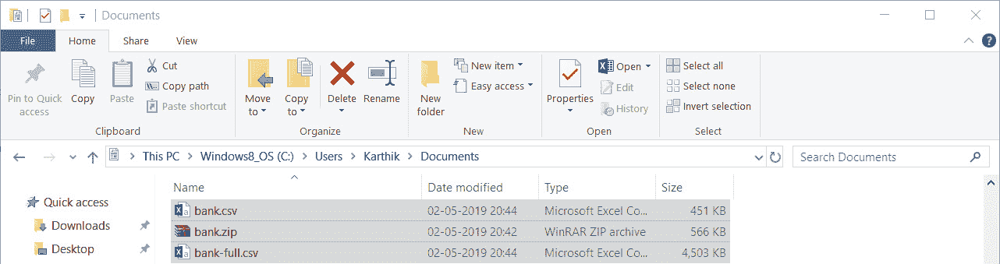
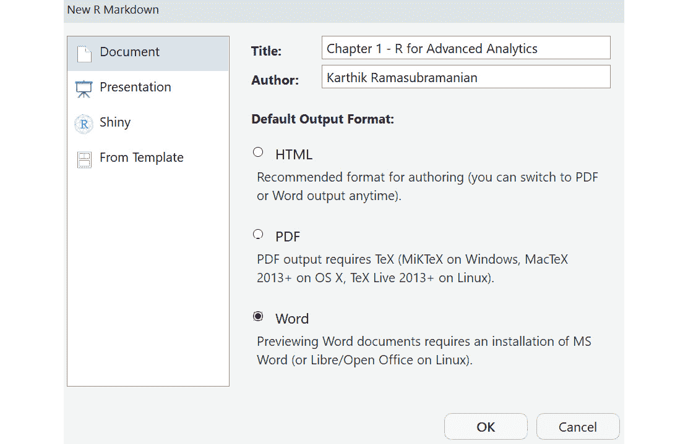
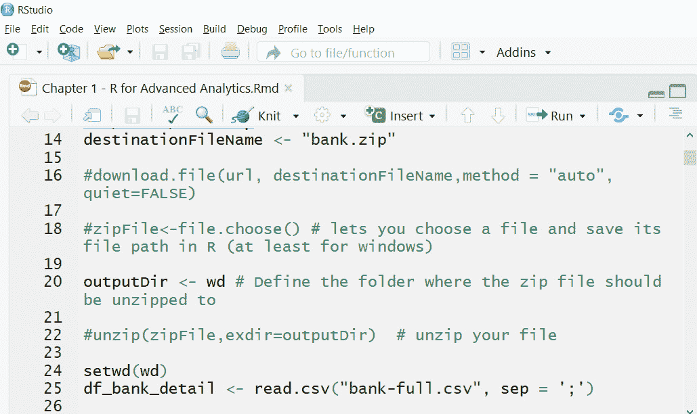
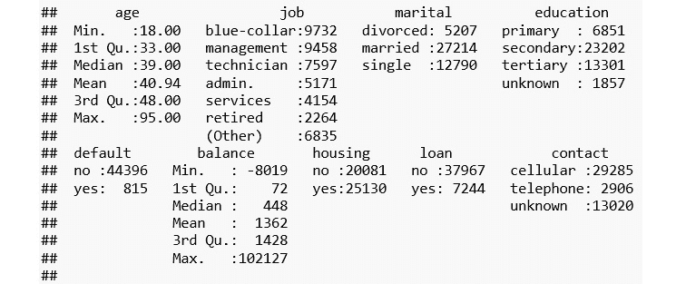
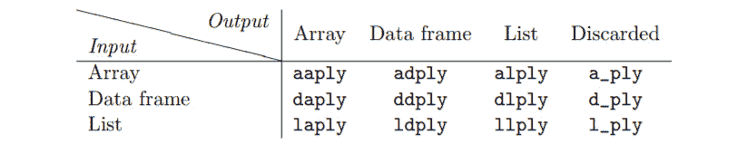
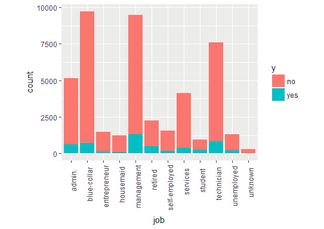
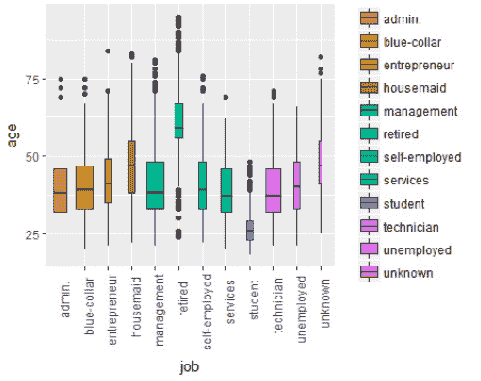

# 第一章：R 高级分析

## 学习目标

到本章结束时，你将能够：

+   解释高级 R 编程结构

+   打印真实世界数据集的摘要统计信息

+   从 CSV、文本和 JSON 文件中读取数据

+   编写 R markdown 文件以实现代码可重复性

+   解释 R 数据结构，如 data.frame、data.table、列表、数组以及矩阵

+   实现 cbind、rbind、merge、reshape、aggregate 和 apply 函数

+   使用 dplyr、plyr、caret、tm 等包以及其他许多包

+   使用 ggplot 创建可视化

在本章中，我们将为使用 R 进行编程奠定基础，并了解高级分析的各种语法和数据结构。

## 简介

R 是早期为统计计算和数据分析开发的编程语言之一，具有良好的可视化支持。随着数据科学的兴起，R 在众多数据科学从业者中成为无可争议的编程语言选择。由于 R 是开源的，并且在构建复杂的统计模型方面非常强大，它很快在工业和学术界得到了广泛应用。

工具和软件如 SAS 和 SPSS 仅大型企业能够负担得起，而传统的编程语言如 C/C++和 Java 不适合进行复杂的数据分析和构建模型。因此，需要一个更加直接、全面、社区驱动、跨平台兼容和灵活的编程语言成为了一种必需。

尽管 Python 编程语言近年来因其在整个行业的采用和强大的生产级实现而越来越受欢迎，但 R 仍然是快速原型化高级机器学习模型的编程语言选择。R 拥有最丰富的包集合（一个用于完成复杂过程的函数/方法的集合，否则需要花费大量时间和精力来实现）。在撰写本书时，**综合 R 档案网络**（**CRAN**），一个全球范围内的 FTP 和 Web 服务器网络，存储了 R 的代码和文档的相同、最新版本，拥有超过 13,000 个包。

虽然有许多关于学习 R 基础知识的书籍和在线资源，但在本章中，我们将仅限于涵盖在许多数据科学项目中广泛使用的 R 编程的重要主题。我们将使用来自 UCI 机器学习仓库的真实世界数据集来展示这些概念。本章的材料将对新接触 R 编程的学习者很有用。在接下来的章节中，监督学习概念将借鉴本章的许多实现。

## 与真实世界数据集一起工作

目前网上有大量可用的开放数据集。以下是一些流行的开放数据集来源：

+   **Kaggle**: 一个用于举办数据科学竞赛的平台。官方网站是[`www.kaggle.com/`](https://www.kaggle.com/)。

+   **UCI 机器学习仓库**: 机器学习社区用于实证分析机器学习算法的数据库、领域理论和数据生成器的集合。您可以通过导航到[`archive.ics.uci.edu/ml/index.php`](https://archive.ics.uci.edu/ml/index.php) URL 访问官方网站。

+   **data.gov.in**: 开放印度政府数据平台，可在[`data.gov.in/`](https://data.gov.in/)找到。

+   **世界银行开放数据**: 免费和开放访问全球发展数据，可通过[`data.worldbank.org/`](https://data.worldbank.org/)访问。

越来越多的私营和公共组织愿意将他们的数据公开供公众访问。然而，这仅限于那些组织正在通过 Kaggle 等众包平台寻求解决其数据科学问题的复杂数据集。从组织内部获得的数据作为工作的一部分进行学习是没有替代品的，这项工作在处理和分析方面提供了各种挑战。

数据处理方面的重大学习机会和挑战也来自公共数据源，因为这些数据源中的数据并不都是干净和标准格式的。除了 CSV 之外，JSON、Excel 和 XML 也是一些其他格式，尽管 CSV 占主导地位。每种格式都需要单独的编码和解码方法，因此在 R 中需要一个单独的读取器包。在我们下一节中，我们将讨论各种数据格式以及如何详细处理可用的数据。

在本章以及许多其他章节中，我们将使用来自 UCI 机器学习仓库的葡萄牙银行机构的直接营销活动（电话）数据集。([`archive.ics.uci.edu/ml/datasets/bank+marketing`](https://archive.ics.uci.edu/ml/datasets/bank+marketing))以下表格详细描述了字段：

![图 1.1：来自 UCI 机器学习仓库的葡萄牙银行机构数据集（第一部分）]

](img/C12624_01_01.jpg)

###### 图 1.1：来自 UCI 机器学习仓库的葡萄牙银行机构数据集（第一部分）


###### 图 1.2：来自 UCI 机器学习仓库的葡萄牙银行机构数据集（第二部分）

在以下练习中，我们将下载`bank.zip`数据集作为 ZIP 文件，并使用`unzip`方法解压它。

### 练习 1：使用 unzip 方法解压下载的文件

在这个练习中，我们将编写一个 R 脚本，从 UCI 机器学习仓库下载葡萄牙银行直接营销活动数据集，并使用`unzip`函数在指定文件夹中提取 ZIP 文件的内容。

执行以下步骤以完成练习：

1.  首先，在您的系统上打开 R Studio。

1.  现在，使用以下命令设置您选择的当前工作目录：

    ```py
    wd <- "<WORKING DIRECTORY>"
    setwd(wd)
    ```

    #### 注意

    本书中的 R 代码使用 R 版本 3.2.2 实现。

1.  使用`download.file()`方法下载包含数据集的 ZIP 文件：

    ```py
    url <- "https://archive.ics.uci.edu/ml/machine-learning-databases/00222/bank.zip"
    destinationFileName <- "bank.zip"
    download.file(url, destinationFileName,method = "auto", quiet=FALSE)
    ```

1.  现在，在我们使用`unzip()`方法在工作目录中解压文件之前，我们需要选择一个文件并将其文件路径保存在 R 中（对于 Windows）或指定完整路径：

    ```py
    zipFile<-file.choose()
    ```

1.  定义 ZIP 文件解压的文件夹：

    ```py
    outputDir <- wd
    ```

1.  最后，使用以下命令解压 ZIP 文件：

    ```py
    unzip(zipFile, exdir=outputDir)
    ```

    输出如下：



###### 图 1.3：解压 bank.zip 文件

## 从各种数据格式读取数据

来自数字系统的数据以各种形式生成：电子商务网站上的浏览历史、点击流数据、客户的购买历史、社交媒体互动、零售店的客流量、卫星和无人机图像，以及众多其他格式和类型的数据。我们正处于一个令人兴奋的时代，技术正在极大地改变我们的生活，企业正在利用它来制定他们的下一份数据战略，以做出更好的决策。

能够收集大量不同类型的数据是不够的；我们还需要从中提取价值。一天中拍摄的视频监控可以帮助政府执法团队改善公共场所的实时监控。挑战在于如何在单一系统中处理大量异构数据格式。

在**客户关系管理**（CRM）应用中的交易数据大多为表格形式，而流入社交媒体的数据大多是文本、音频、视频和图片。

我们可以将数据格式分为结构化——如 CSV 和数据库表之类的表格数据；非结构化——如推文、FB 帖子和 Word 文档之类的文本数据；以及半结构化。与难以让机器处理和理解的文本不同，半结构化提供了关联的元数据，这使得计算机处理它变得容易。它广泛应用于许多 Web 应用程序中的数据交换，JSON 是半结构化数据格式的一个例子。

在本节中，我们将了解如何在 R 中加载、处理和转换各种数据格式。在本书的范围内，我们将处理 CSV、文本和 JSON 数据。

### CSV 文件

CSV 文件是结构化数据最常见的数据存储和交换格式。R 提供了一个名为`read.csv()`的方法，用于从 CSV 文件中读取数据。它将数据读入`data.frame`（更多内容将在下一节介绍）。该方法接受许多参数；其中两个必需参数是`filename`的路径和`sep`，它指定了分隔列值的字符。`summary()`方法描述了六个汇总统计量：**最小值**、**第一四分位数**、**中位数**、**平均值**、**第三四分位数**和**最大值**。

在以下练习中，我们将读取 CSV 文件并总结其列。

### 练习 2：读取 CSV 文件并总结其列

在这个练习中，我们将读取之前提取的 CSV 文件，并使用 `summary` 函数打印数值变量的最小值、最大值、平均值、中位数、第一四分位数和第三四分位数，并计算分类变量的类别数。

执行以下步骤以读取 CSV 文件并随后总结其列：

1.  首先，使用 `read.csv` 方法将 `bank-full.csv` 载入 DataFrame：

    ```py
    df_bank_detail <- read.csv("bank-full.csv", sep = ';')
    ```

1.  打印 DataFrame 的摘要：

    ```py
    summary(df_bank_detail)
    ```

    输出如下：

    ```py
    ##       age                 job           marital          education    
    ##  Min.   :18.00   blue-collar:9732   divorced: 5207   primary  : 6851  
    ##  1st Qu.:33.00   management :9458   married :27214   secondary:23202  
    ##  Median :39.00   technician :7597   single  :12790   tertiary :13301  
    ##  Mean   :40.94   admin.     :5171                    unknown  : 1857  
    ##  3rd Qu.:48.00   services   :4154                                     
    ##  Max.   :95.00   retired    :2264                                     
    ```

### JSON

JSON 是用于共享和存储数据的下一个最常用的数据格式。它与 CSV 文件不同，CSV 文件只处理行和列的数据，其中每一行都有确定数量的列。例如，在电子商务客户数据中，每一行可能代表一个客户，其信息存储在单独的列中。对于一个客户，如果某列没有值，该字段存储为 NULL。

JSON 提供了额外的灵活性，即每个客户可以有可变数量的字段。这种类型的灵活性减轻了开发者在传统关系数据库中维护模式时的负担，在传统关系数据库中，相同客户的数据可能分散在多个表中以优化存储和查询时间。

JSON 更像是一种键值存储类型的存储，我们只关心键（如姓名、年龄和出生日期）及其对应的值。虽然这听起来很灵活，但必须采取适当的注意，否则管理可能会在某些时候失控。幸运的是，随着近年来大数据技术的出现，许多文档存储（键值存储的一个子类），通常也称为 **NoSQL** 数据库，可用于存储、检索和处理此类格式的数据。

在以下练习中，JSON 文件包含 2015-16 年印度泰米尔纳德邦辣椒（香料和调味品）种植区的数据。键包括 **面积**（公顷）、**产量**（公担）和 **生产力**（每公顷平均产量）。

`jsonlite` 包提供了一个实现，可以将 JSON 文件读取并转换为 DataFrame，这使得分析更加简单。`fromJSON` 方法读取 JSON 文件，如果 `fromJSON` 函数中的 `flatten` 参数设置为 `TRUE`，则返回一个 DataFrame。

### 练习 3：读取 JSON 文件并将数据存储在 DataFrame 中

在这个练习中，我们将读取 JSON 文件并将数据存储在 DataFrame 中。

执行以下步骤以完成练习：

1.  从 [`data.gov.in/catalog/area-production-productivity-spices-condiments-district-wise-tamil-nadu-year-2015-16`](https://data.gov.in/catalog/area-production-productivity-spices-condiments-district-wise-tamil-nadu-year-2015-16) 下载数据。

1.  首先，使用以下命令安装读取 JSON 文件所需的包：

    ```py
    install jsonlite package
    install.packages("jsonlite")
    library(jsonlite)
    ```

1.  接下来，使用 `fromJSON` 方法读取 JSON 文件，如下所示：

    ```py
    json_file <- "crop.json"
    json_data <- jsonlite::fromJSON(json_file, flatten = TRUE)
    ```

1.  列表中的第二个元素包含包含作物生产价值的 DataFrame。从 `json_data` 中检索它，并将其存储为名为 `crop_production` 的 DataFrame：

    ```py
    crop_production <- data.frame(json_data[[2]])
    ```

1.  接下来，使用以下命令重命名列：

    ```py
    colnames(crop_production) <- c("S.No","District","Area","Production","PTY")
    ```

1.  现在，使用 `head()` 函数打印前六行：

    ```py
    head(crop_production)
    ```

    输出如下：

    ```py
    ##   S.No   District Area Production  PTY
    ## 1    1   Ariyalur   NA         NA   NA
    ## 2    2 Coimbatore  808         26 0.03
    ## 3    3  Cuddalore   NA         NA   NA
    ## 4    4 Dharmapuri   NA         NA   NA
    ## 5    5   Dindigul  231          2 0.01
    ## 6    6      Erode   NA         NA   NA
    ```

### 文本

非结构化数据是网络的通用语言。所有社交媒体、博客、网页以及许多其他信息来源都是文本形式且杂乱无章，难以从中提取任何有意义的信息。越来越多的研究工作来自 **自然语言处理**（**NLP**）领域，其中计算机不仅变得更擅长理解单词的意义，而且还能理解句子中单词的使用上下文。计算机聊天机器人的兴起，它能对人类查询做出响应，是理解文本信息最复杂的形式。

在 R 中，我们将使用 `tm` 文本挖掘包来展示如何读取、处理和从文本数据中检索有意义的信息。我们将使用 Kaggle 上的 **Amazon Food Review** 数据集的小样本（[`www.kaggle.com/snap/amazon-fine-food-reviews`](https://www.kaggle.com/snap/amazon-fine-food-reviews)）来练习本节的内容。

在 `tm` 包中，文本文档的集合被称为 `tm` 包的 `VCorpus`（`VCorpus` 对象）。我们可以使用 `inspect()` 方法。以下练习使用 `lapply` 方法遍历前两条评论并将文本转换为字符。你将在 *函数的 Apply 家族* 部分了解更多关于 `apply` 家族函数的信息。

### 练习 4：读取具有文本列的 CSV 文件并将数据存储在 VCorpus 中

在这个练习中，我们将读取具有文本列的 CSV 文件并将数据存储在 VCorpus 中。

完成练习的步骤如下：

1.  首先，让我们将 R 中的文本挖掘包加载到系统中以读取文本文件：

    ```py
    library(tm)
    ```

1.  现在，从文件中读取前 10 条评论：

    ```py
    review_top_10 <- read.csv("Reviews_Only_Top_10_Records.csv")
    ```

1.  要将文本列存储在 `VCorpus` 中，使用以下命令：

    ```py
    review_corpus <- VCorpus(VectorSource(review_top_10$Text))
    ```

1.  要检查前两条评论的结构，执行以下命令：

    ```py
    inspect(review_corpus[1:2])
    ```

    输出如下：

    ```py
    ## <<VCorpus>>
    ## Metadata:  corpus specific: 0, document level (indexed): 0
    ## Content:  documents: 2
    ## [[1]]
    ## <<PlainTextDocument>>
    ## Metadata:  7
    ## Content:  chars: 263
    ## [[2]]
    ## <<PlainTextDocument>>
    ## Metadata:  7
    ## Content:  chars: 190
    ```

1.  使用 `lapply` 将第一条评论转换为字符并打印：

    ```py
    lapply(review_corpus[1:2], as.character)
    ## $'1'
    ## [1] "I have bought several of the Vitality canned dog food products and have found them all to be of good quality. The product looks more like a stew than a processed meat and it smells better. My Labrador is finicky and she appreciates this product better than  most."
    ## $'2'
    ## [1] "Product arrived labeled as Jumbo Salted Peanuts...the peanuts were actually small sized unsalted. Not sure if this was an error or if the vendor intended to represent the product as \"Jumbo\".
    ```

我们将在稍后的部分重新访问 `review_corpus` 数据集，展示如何将非结构化文本信息转换为结构化表格数据。

除了 CSV、文本和 JSON 格式之外，还有许多其他数据格式，这取决于数据来源及其用途。R 拥有一系列丰富的库，可以帮助处理许多格式。R 可以导入不仅包括标准格式（除前三种之外）如 HTML 表格和 XML，还可以导入特定于分析工具的格式，如 SAS 和 SPSS。这种民主化导致了行业专家的重大迁移，他们之前在专有工具（成本高昂且通常只有大型企业才有）中工作，转向开源分析编程语言，如 R 和 Python。

## 为代码可重复性编写 R Markdown 文件

分析学的巨大成功是信息与知识网络在主题周围开始传播的结果。出现了更多的开源社区，开发者们愉快地与外界分享他们的工作，许多数据项目变得可重复。这种变化意味着一个人开始的工作很快就会被一个社区以许多不同的形式适应、即兴创作和修改，在它被完全不同的领域采用之前，这个领域与它最初出现的领域完全不同。想象一下，每个在会议上发表的研究工作都提交了一个易于重复的代码和数据集，以及他们的研究论文。这种变化正在加快想法与现实相遇的速度，创新将开始蓬勃发展。

现在，让我们看看如何在单个文件中创建这样的可重复工作，我们称之为**R Markdown**文件。在以下活动中，我们将演示如何在 RStudio 中创建一个新的 R Markdown 文件。有关 R Markdown 的详细介绍，请参阅[`rmarkdown.rstudio.com/lesson-1.html`](https://rmarkdown.rstudio.com/lesson-1.html)。

在下一个活动中，你将把 *练习 4* 中显示的代码（使用 Text Column 读取 CSV 文件并将数据存储在 VCorpus 中）重新创建到 R Markdown 中。在 *图 4.2* 中观察，你刚刚在 R Markdown 中编写了说明和代码，当执行 **Knit to Word** 操作时，它将说明、代码及其输出整齐地交织到一个文档中。

### 活动 1：创建一个 R Markdown 文件来读取 CSV 文件并编写数据摘要

在这个活动中，我们将创建一个 R Markdown 文件来读取 CSV 文件，并在一个文档中打印数据的小型摘要：

执行以下步骤以完成活动：

1.  打开 RStudio 并导航到**R Markdown**选项：

    ###### 图 1.4：在 RStudio 中创建新的 R Markdown 文件

1.  为文档提供**标题**和**作者**名称，并将**默认输出格式**选择为**Word**：

    ###### 图 1.5：使用 read.csv 方法读取数据

1.  使用 `read.csv()` 方法读取 `bank-full.csv` 文件。

1.  最后，使用`summary`方法将摘要打印到 word 文件中。

    输出如下：



###### 图 1.6：使用 summary 方法后的最终输出

#### 注意

该活动的解决方案可以在第 438 页找到。

## R 中的数据结构

在任何编程语言中，数据结构是存储信息并使其准备进一步处理的基本单元。根据数据类型，有各种形式的数据结构可用于**存储**和**处理**。下一节中解释的每个数据结构都有其特征和适用性。

在本节中，我们将探索每个数据结构及其如何与我们的数据一起使用。

### 向量

`c()`方法，如下所示：

```py
c_names <- c("S.No","District","Area","Production","PTY")
```

我们可以通过指定向量名称旁边的方括号中的索引来提取向量中的第二个值。让我们回顾以下代码，其中我们提取第二个索引的值：

```py
c_names[2]
```

输出如下：

```py
## [1] "District"
```

使用`c()`方法连接的字符串集合是一个向量。它可以存储同质的数据集合，如字符、整数或浮点值。在尝试用字符存储整数时，将发生隐式类型转换，将所有值转换为字符。

#### 谨慎

注意，这不一定每次都是预期的行为。需要谨慎，尤其是在数据不干净时。否则可能会造成比通常编程错误更难找到的错误。

### 矩阵

**矩阵**是用于存储*n*维数据的更高维数据结构。它适用于存储表格数据。与向量类似，矩阵也只允许在其行和列中存储同质的数据集合。

以下代码生成 16 个来自参数为试验次数`(size) = 100`和成功概率等于`0.4`的二项分布的随机数。R 中的`rbinom()`方法用于生成此类随机数：

```py
r_numbers <- rbinom(n = 16, size = 100, prob = 0.4)
```

现在，要存储`r_number`为矩阵，请使用以下命令：

```py
matrix(r_numbers, nrow = 4, ncol = 4)
```

输出如下：

```py
##      [,1] [,2] [,3] [,4]
## [1,]   48   39   37   39
## [2,]   34   41   32   38
## [3,]   40   34   42   46
## [4,]   37   42   36   44
```

让我们扩展我们在*练习 4*中使用的文本挖掘示例，即*使用 VCorpus 存储具有文本列的 CSV 文件*，以了解矩阵在文本挖掘中的使用。

考虑以下两个评论。使用`lapply`将第一个评论转换为`as.character`并打印：

```py
lapply(review_corpus[1:2], as.character)
```

输出如下：

```py
## $'1'
## [1] "I have bought several of the Vitality canned dog food products and have found them all to be of good quality. The product looks more like a stew than a processed meat, and it smells better. My Labrador is finicky, and she appreciates this product better than  most."
## $'2'
## [1] "Product arrived labeled as Jumbo Salted Peanuts...the peanuts were actually small sized unsalted. Not sure if this was an error or if the vendor intended to represent the product as \"Jumbo\".
```

现在，在以下练习中，我们将转换数据以从这两段文本中删除停用词、空白和标点符号。然后我们将进行词干提取（both *looking* 和 *looked* 将被缩减为 look）。此外，为了保持一致性，将所有文本转换为小写。

### 练习 5：对数据进行转换以便进行分析

在这个练习中，我们将对数据进行转换，使其可用于进一步分析。

完成练习的以下步骤：

1.  首先，使用以下命令将数据中的所有字符转换为小写：

    ```py
    top_2_reviews <- review_corpus[1:2]
    top_2_reviews <- tm_map(top_2_reviews,content_transformer(tolower))
    lapply(top_2_reviews[1], as.character)
    ```

    输出结果如下：

    ```py
    ## [1] "I have bought several of the vitality canned dog food products and have found them all to be of good quality. the product looks more like a stew than a processed meat and it smells better. my labrador is finicky, and she appreciates this product better than  most."
    ```

1.  接下来，从数据中移除停用词，例如，`a`、`the`、`an` 以及更多：

    ```py
    top_2_reviews <- tm_map(top_2_reviews,removeWords, stopwords("english"))
    lapply(top_2_reviews[1], as.character)
    ```

    输出结果如下：

    ```py
    ## [1] "  bought several   vitality canned dog food products   found      good quality.  product looks  like  stew   processed meat   smells better.  labrador  finicky   appreciates  product better   ."
    ```

1.  使用以下命令移除单词之间的额外空格：

    ```py
    top_2_reviews <- tm_map(top_2_reviews,stripWhitespace)
    lapply(top_2_reviews[1], as.character)
    ```

    输出结果如下：

    ```py
    ## [1] " bought several vitality canned dog food products found good quality. product looks like stew processed meat smells better. labrador finicky appreciates product better ."
    ```

1.  执行词干提取过程，这将只保留单词的词根。例如，`looking` 和 `looked` 将变为 `look`：

    ```py
    top_2_reviews <- tm_map(top_2_reviews,stemDocument)
    lapply(top_2_reviews[1], as.character)
    ```

    输出结果如下：

    ```py
    ## [1] " bought sever vital can dog food product found good quality. product look like stew process meat smell better. labrador finicki appreci product better ."
    ```

    现在我们已经处理并清理了文本，我们可以创建一个文档矩阵，该矩阵仅存储两个评论中不同单词出现的频率。我们将演示如何计算评论中包含的每个单词。矩阵的每一行代表一个评论，列是不同的单词。大多数值都是零，因为并非每个评论都会包含所有单词。在这个例子中，稀疏度为 49%，这意味着矩阵中只有 51% 的值是非零的。

1.  再次创建 `as.matrix()` 方法。矩阵包含两个文档（评论）和 37 个唯一单词。通过指定矩阵中的行和列索引或名称来检索文档中特定单词的计数。

1.  现在，使用以下命令将结果存储在矩阵中：

    ```py
    dtm_matrix <- as.matrix(dtm)
    ```

1.  要找到矩阵的维度，即 2 个文档和 37 个单词，请使用以下命令：

    ```py
    dim(dtm_matrix)
    ```

    输出结果如下：

    ```py
    ## [1]  2 37
    ```

1.  现在，打印矩阵的子集：

    ```py
    dtm_matrix[1:2,1:7]
    ```

    输出结果如下：

    ```py
    ##     Terms
    ## Docs "jumbo". actual appreci arriv better better. bought
    ##    1        0      0       1     0      1       1      1
    ##    2        1      1       0     1      0       0      0
    ```

1.  最后，使用以下命令在文档 1 中计算单词 `product`：

    ```py
    dtm_matrix[1,"product"]
    ```

    输出结果如下：

    ```py
    ## [1] 3
    ```

### 列表

虽然 vector 和 matrix 都是程序中用于各种计算的有用结构，但它们可能不足以存储现实世界的数据集，因为现实世界的数据集通常包含混合类型的数据，例如 CRM 应用程序中的客户表有两个列，一列是客户姓名，另一列是年龄。列表提供了一种结构，允许存储两种不同类型的数据。

在以下练习中，除了生成 16 个随机数外，我们还使用了 `sample()` 方法从英文字母表中生成 16 个字符。`list` 方法将整数和字符一起存储。

### 练习 6：使用列表方法存储整数和字符

在这个练习中，我们将使用 `list` 方法存储随机生成的数字和字符。随机数将使用 `rbinom` 函数生成，随机字符将从英文字母表 A-Z 中选择。

执行以下步骤来完成练习：

1.  首先，生成参数大小为 `100` 且成功概率为 `0.4` 的二项分布的 16 个随机数：

    ```py
    r_numbers <- rbinom(n = 16, size = 100, prob = 0.4)
    ```

1.  现在，从英语 `LETTERS` 中选择 16 个字母，不重复：

    ```py
    #sample() will generate 16 random letters from the English alphabet without repetition
    r_characters <- sample(LETTERS, size = 16, replace = FALSE)
    ```

1.  将 `r_numbers` 和 `r_characters` 放入一个单独的列表中。`list()` 函数将创建包含 `r_numbers` 和 `r_characters` 的数据结构列表：

    ```py
    list(r_numbers, r_characters)
    ```

    输出结果如下：

    ```py
    ## [[1]]
    ##  [1] 48 53 38 31 44 43 36 47 43 38 43 41 45 40 44 50
    ## 
    ## [[2]]
    ##  [1] "V" "C" "N" "Z" "E" "L" "A" "Y" "U" "F" "H" "D" "O" "K" "T" "X"
    ```

    在以下步骤中，我们将看到一个包含整数和字符向量一起存储的列表。

1.  现在，让我们将整数和字符向量存储和检索自一个列表：

    ```py
    r_list <- list(r_numbers, r_characters)
    ```

1.  接下来，使用以下命令检索字符向量中的值：

    ```py
    r_list[[2]]
    ```

    输出如下：

    ```py
    ##  [1] "V" "C" "N" "Z" "E" "L" "A" "Y" "U" "F" "H" "D" "O" "K" "T" "X"
    ```

1.  最后，检索字符向量中的第一个值：

    ```py
    (r_list[[2]])[1]
    ```

    输出如下：

    ```py
    ## [1] "V" 
    ```

    虽然这解决了存储异构数据类型的要求，但它仍然没有对两个向量中的值之间的关系进行任何完整性检查。如果我们想将每个*字母*分配给一个*整数*。在先前的输出中，`V`代表`48`，`C`代表`53`，以此类推。

    列表无法很好地处理这种一对一映射。考虑以下代码，如果我们生成 18 个随机字符，而不是`16`个字符，它仍然允许将它们存储在列表中。现在最后两个字符没有与整数相关联的映射。

1.  现在，生成参数大小等于`100`，成功概率等于`0.4`的来自二项分布的 16 个随机数：

    ```py
    r_numbers <- rbinom(n = 16, size = 100, prob = 0.4)
    ```

1.  从英语`LETTERS`中选择任意 18 个字母，且不重复：

    ```py
    r_characters <- sample(LETTERS, 18, FALSE)
    ```

1.  将`r_numbers`和`r_characters`放入一个单独的列表中：

    ```py
    list(r_numbers, r_characters)
    ```

    输出如下：

    ```py
    ## [[1]]
    ##  [1] 48 53 38 31 44 43 36 47 43 38 43 41 45 40 44 50
    ## 
    ## [[2]]
    ##  [1] "V" "C" "N" "Z" "E" "L" "A" "Y" "U" "F" "H" "D" "O" "K" "T" "X" "P"  "Q"
    ```

### 活动二：创建两个矩阵的列表并访问其值

在这个活动中，你将创建两个矩阵，并使用矩阵的索引检索一些值。你还将执行乘法和减法等操作。

执行以下步骤以完成活动：

1.  通过从二项分布（使用`rbinom`方法）随机生成数字来创建大小为`10 x 4`和`4 x 5`的两个矩阵。分别命名为`mat_A`和`mat_B`。

1.  现在，将两个矩阵存储在一个列表中。

1.  使用列表，访问`mat_A`的第 4 行第 2 列并将其存储在变量`A`中，以及访问`mat_B`的第 2 行第 1 列并将其存储在变量`B`中。

1.  将`A`和`B`矩阵相乘，并从`mat_A`的第 2 行第 1 列中减去。

    #### 注意

    本活动的解决方案可在第 440 页找到。

## DataFrame

由于向量、矩阵和列表的限制，对于数据科学从业者来说，需要一个适合现实世界数据集的数据结构，这是一个迫切需要的要求。DataFrame 是存储和检索表格数据的一种优雅方式。我们已经在*练习 3*，*读取 JSON 文件并将数据存储在 DataFrame 中*中看到了 DataFrame 如何处理数据的行和列。DataFrame 将在整本书中广泛使用。

### 练习 7：使用 DataFrame 执行完整性检查

让我们回顾一下*练习 6*的第*6 步*，*使用列表方法存储整数和字符*，其中我们讨论了在尝试将两个不等长向量存储在列表中时的完整性检查，并看看 DataFrame 是如何不同地处理它的。我们再次生成随机数字（`r_numbers`）和随机字符（`r_characters`）。

执行以下步骤以完成练习：

1.  首先，生成 16 个来自参数大小等于`100`和成功概率等于`0.4`的二项分布的随机数：

    ```py
    r_numbers <- rbinom(n = 16, size = 100, prob = 0.4)
    ```

1.  从英语`LETTERS`中选择任何 18 个字母，不重复：

    ```py
    r_characters <- sample(LETTERS, 18, FALSE)
    ```

1.  将`r_numbers`和`r_characters`放入一个 DataFrame 中：

    ```py
    data.frame(r_numbers, r_characters)
    ```

    输出如下：

    ```py
    Error in data.frame(r_numbers, r_characters) : 
      arguments imply differing number of rows: 16, 18
    ```

    如您所见，前一个输出中的错误表明最后两个字母，即`P`和`Q`，与使用二项分布生成的相应随机`INTEGER`没有映射。

访问 DataFrame 中的任何特定行和列与矩阵类似。我们将展示许多技巧和技术来最好地利用 DataFrame 中索引的强大功能，这还包括一些过滤选项。

DataFrame 中的每一行都是紧密耦合的列集合的结果。每一列清楚地定义了数据中的每一行与其他每一行之间的关系。如果没有相应的值在列中可用，它将被填充为 NA。例如，在 CRM 应用程序中，客户可能没有填写他们的婚姻状况，而其他一些客户填写了。因此，在应用程序设计期间指定哪些列是必需的，哪些是可选的变得至关重要。

### 数据表

随着 DataFrame 的日益普及，其局限性开始显现。特别是在处理大型数据集时，DataFrame 的表现不佳。在复杂分析中，我们经常创建许多中间 DataFrame 来存储结果。然而，R 建立在内存计算架构之上，并且高度依赖于 RAM。与磁盘空间不同，许多标准台式机和笔记本电脑的 RAM 限制在 4 或 8GB。DataFrame 在计算过程中没有高效地管理内存，这通常会导致“内存不足错误”，尤其是在处理大型数据集时。

为了处理这个问题，`data.table`继承了`data.frame`的功能，并在其基础上提供了快速且内存高效的版本，用于以下任务：

+   文件读取器和写入器

+   聚合

+   更新

+   等值、不等值、滚动、范围和区间连接

高效的内存管理使得开发快速，并减少了操作之间的延迟。以下练习展示了`data.table`与`data.frame`相比在计算时间上的显著差异。首先，我们读取完整的`fread()`方法，这是`data.table`中快速读取方法之一。

### 练习 8：探索文件读取操作

在这个练习中，我们只展示文件读取操作。我们鼓励您测试其他功能（[`cran.r-project.org/web/packages/data.table/vignettes/datatable-intro.html`](https://cran.r-project.org/web/packages/data.table/vignettes/datatable-intro.html)）并比较数据表与 DataFrame 的能力。

执行以下步骤以完成练习：

1.  首先，使用以下命令加载数据表包：

    ```py
    library(data.table)
    ```

1.  使用`data.table`包的`fread()`方法读取数据集：

    ```py
    system.time(fread("Reviews_Full.csv"))
    ```

    输出如下：

    ```py
    Read 14.1% of 568454 rows
    Read 31.7% of 568454 rows
    Read 54.5% of 568454 rows
    Read 72.1% of 568454 rows
    Read 79.2% of 568454 rows
    Read 568454 rows and 10 (of 10) columns from 0.280 GB file in 00:00:08
    ##    user  system elapsed 
    ##    3.62    0.15    3.78
    ```

1.  现在，使用基础包中的`read.csv()`方法读取相同的 CSV 文件：

    ```py
    system.time(read.csv("Reviews_Full.csv"))
    ```

    输出如下：

    ```py
    ##    user  system elapsed 
    ##    4.84    0.05    4.91
    ```

注意，通过`fread()`方法读取它花费了`3.78`秒，而`read.csv`函数则花费了`4.91`秒。执行速度几乎快了*30%*。随着数据量的增加，这种差异变得更加显著。

在前面的输出中，`user`时间是当前 R 会话花费的时间，而`system`时间是操作系统完成该过程花费的时间。即使使用相同的数据集，执行`system.time`方法后也可能得到不同的值。这很大程度上取决于在运行方法时 CPU 有多忙。然而，我们应该将`system.time`方法的输出相对于我们进行的比较来读取，而不是相对于绝对值。 

当数据集的大小太大时，我们有很多中间操作要完成最终输出。然而，请记住，`data.table`并不是一根魔杖，它不能让我们在 R 中处理任何大小的数据集。RAM 的大小仍然起着重要作用，`data.table`不能替代分布式和并行处理大数据系统。然而，即使是对于较小的数据集，`data.table`的使用也显示出比`data.frames`更好的性能。

## 数据处理和转换

到目前为止，我们已经看到了不同的读取和存储数据的方法。现在，让我们关注进行数据分析、提取见解或构建模型所需的数据处理和转换。原始数据几乎没有任何用途，因此将其处理成适合任何有用目的变得至关重要。本节重点介绍了 R 在数据分析中广泛使用的方法。

### cbind

如其名所示，它通过列组合两个或多个向量、矩阵、DataFrame 或表。当我们需要将多个向量、矩阵或 DataFrame 组合成一个进行分析或可视化时，`cbind`非常有用。`cbind`的输出取决于输入数据。以下练习提供了几个`cbind`的例子，它结合了两个向量。

### 练习 9：探索 cbind 函数

在这个练习中，我们将实现`cbind`函数以组合两个 DataFrame 对象。

执行以下步骤以完成练习：

1.  生成 16 个来自参数大小等于`100`和成功概率等于`0.4`的二项分布的随机数：

    ```py
    r_numbers <- rbinom(n = 16, size = 100, prob = 0.4)
    ```

1.  接下来，使用以下命令打印`r_numbers`值：

    ```py
    r_numbers
    ```

    输出如下：

    ```py
    ##  [1] 38 46 40 42 45 39 37 35 44 39 46 41 31 32 34 43
    ```

1.  从英语`LETTERS`中选择任意 16 个字母，不重复：

    ```py
    r_characters <- sample(LETTERS, 18, FALSE)
    ```

1.  现在，使用以下命令打印`r_characters`值：

    ```py
    r_characters
    ```

    输出如下：

    ```py
    ##  [1] "C" "K" "Z" "I" "E" "A" "X" "O" "H" "Y" "T" "B" "N" "F" "U" "V" "S"
    ## [18] "P"
    ```

1.  使用`cbind`组合`r_numbers`和`r_characters`：

    ```py
    cbind(r_numbers, r_characters)
    ```

    输出如下：

    ```py
    ## Warning in cbind(r_numbers, r_characters): number of rows of result is not a multiple of vector length (arg 1)
    ##       r_numbers r_characters
    ##  [1,] "38"      "C"         
    ##  [2,] "46"      "K"         
    ##  [3,] "40"      "Z"         
    ##  [4,] "42"      "I"         
    ##  [5,] "45"      "E"         
    ##  [6,] "39"      "A"         
    ##  [7,] "37"      "X"         
    ##  [8,] "35"      "O"         
    ##  [9,] "44"      "H"         
    "
    ```

1.  打印使用`cbind`后获得的类（数据结构类型）：

    ```py
    class(cbind(r_numbers, r_characters))
    ```

    输出如下：

    ```py
    ## [1] "matrix"
    ```

    观察到在练习的第 5 步中`cbind`输出的警告信息：

    ```py
    number of rows of result is not a multiple of vector length (arg 1)
    r_numbers r_characters
    ```

这个错误意味着`r_numbers`和`r_characters`的长度不相同（分别是 16 和 18）。请注意，与`as.data.frame()`不同，`cbind()`方法不会抛出错误。相反，它会自动执行所谓的`r_numbers` `38`和`48`从顶部回收以填充第 17 和第 18 个索引。

考虑我们编写以下命令而不是：

```py
cbind(as.data.frame(r_numbers), as.data.frame(r_characters))
```

现在会抛出一个错误，正如我们在数据框部分之前所展示的：

```py
Error in data.frame(..., check.names = FALSE) : 
  arguments imply differing number of rows: 16, 18
```

需要始终检查维度和数据类型，否则可能会导致不希望的结果。当我们给出两个向量时，通过`cbind`默认创建一个矩阵。

#### 注意

由于我们没有设置任何种子值，因此每次执行代码时，样本和`rbinom`的输出都会不同。

### rbind

`rbind`类似于`cbind`，但它通过行而不是列进行组合。为了使`rbind`工作，两个数据框中的列数应该相等。当我们在具有相同列的原始数据集中附加额外的观测值时，它很有用，其中原始数据集的所有列都是相同的，并且顺序相同。让我们在以下练习中探索`rbind`。

### 练习 10：探索`rbind`函数

在这个练习中，我们将使用`rbind`函数组合两个数据框。

执行以下步骤来完成练习：

1.  生成 16 个来自二项分布的随机数，参数大小等于`100`，成功概率等于 0.4：

    ```py
    r_numbers <- rbinom(n = 18, size = 100, prob = 0.4)
    ```

1.  接下来，打印`r_numbers`的值：

    ```py
    r_numbers
    ```

    输出如下：

    ```py
    ##  [1] 38 46 40 42 45 39 37 35 44 39 46 41 31 32 34 43
    ```

1.  从英语`LETTERS`中选择任何 16 个字母，不重复：

    ```py
    r_characters <- sample(LETTERS, 18, FALSE)
    ```

1.  现在，使用以下命令打印`r_characters`：

    ```py
    r_characters
    ```

    输出如下：

    ```py
    ##  [1] "C" "K" "Z" "I" "E" "A" "X" "O" "H" "Y" "T" "B" "N" "F" "U" "V" "S"
    ## [18] "P"
    ```

1.  最后，使用`rbind`方法打印`r_numbers`和`r_characters`的合并值：

    ```py
    rbind(r_numbers, r_characters)
    ```

    输出如下：

    ```py
    ##              [,1] [,2] [,3] [,4] [,5] [,6] [,7] [,8] [,9] [,10] [,11]
    ## r_numbers    "37" "44" "38" "38" "41" "35" "38" "40" "38" "45"  "37" 
    ## r_characters "Q"  "Y"  "O"  "L"  "A"  "G"  "V"  "S"  "B"  "U"   "D"  
    ##              [,12] [,13] [,14] [,15] [,16] [,17] [,18]
    ## r_numbers    "40"  "41"  "42"  "36"  "44"  "37"  "44" 
    ## r_characters "R"   "T"   "P"   "F"   "X"   "C"   "I"
    ```

从最后一步可以看出，`rbind`函数将`r_numbers`和`r_characters`作为两行数据连接（绑定），这与`cbind`不同，在`cbind`中它是堆叠在两列中的。除了输出之外，`cbind`的所有其他规则也适用于`rbind`。

### 合并函数

R 中的`merge()`函数在需要使用公共列（在数据库世界中我们称之为**主键**）连接多个数据框时特别有用。`merge()`函数对数据框和数据表有两种不同的实现方式，它们的行为基本上是相同的。

### 练习 11：探索合并函数

在这个练习中，我们将生成两个数据框，即`df_one`和`df_two`，使得`r_numbers`列在每个数据框中唯一标识每一行。

执行以下步骤来完成练习：

**第一个数据框**

1.  使用`set.seed()`方法确保每次运行代码时生成相同的随机数：

    ```py
    set.seed(100)
    ```

1.  接下来，生成 1 到 30 之间的任意 16 个不重复的随机数：

    ```py
    r_numbers <- sample(1:30,10, replace = FALSE)
    ```

1.  从英文字母表中生成任意 16 个字符，允许重复：

    ```py
    r_characters <- sample(LETTERS, 10, TRUE)
    ```

1.  将`r_numbers`和`r_characters`合并到一个名为`df_one`的 DataFrame 中：

    ```py
    df_one <- cbind(as.data.frame(r_numbers), as.data.frame(r_characters))
    df_one
    ```

    输出如下：

    ```py
    ##    r_numbers r_characters
    ## 1         10            Q
    ## 2          8            W
    ## 3         16            H
    ## 4          2            K
    ## 5         13            T
    ## 6         26            R
    ## 7         20            F
    ## 8          9            J
    ## 9         25            J
    ## 10         4            R
    ```

**第二个 DataFrame**

1.  使用`set.seed()`方法来保留多次运行中相同的随机数：

    ```py
    set.seed(200)
    ```

1.  接下来，生成 1 到 30 之间的任意 16 个不重复的随机数：

    ```py
    r_numbers <- sample(1:30,10, replace = FALSE)
    ```

1.  现在，从英文字母表中生成任意 16 个字符，允许重复：

    ```py
    r_characters <- sample(LETTERS, 10, TRUE)
    ```

1.  将`r_numbers`和`r_characters`合并到一个名为`df_two`的 DataFrame 中：

    ```py
    df_two <- cbind(as.data.frame(r_numbers), as.data.frame(r_characters))
    df_two
    ```

    输出如下：

    ```py
    ##    r_numbers r_characters
    ## 1         17            L
    ## 2         30            Q
    ## 3         29            D
    ## 4         19            Q
    ## 5         18            J
    ## 6         21            H
    ## 7         26            O
    ## 8          3            D
    ## 9         12            X
    ## 10         5            Q
    ```

一旦我们使用`cbind()`函数创建了`df_one`和`df_two`DataFrame，我们就可以执行一些合并操作（将使用 JOIN 这个词，它与`merge()`的意思相同）。

现在，让我们看看不同类型的连接会产生不同的结果。

在数据库的世界中，JOIN 操作用于通过公共主键结合两个或两个以上的表。在数据库中，我们使用结构化查询语言（SQL）来执行 JOIN 操作。在 R 中，`merge()`函数帮助我们实现与 SQL 在数据库中提供的相同功能。此外，在这里我们不是使用表，而是使用 DataFrame，它也是一个具有行和列数据的表。

### 内连接

在*练习 11*，*探索 merge 函数*中，我们创建了两个 DataFrame：`df_one`和`df_two`。现在，我们将使用`r_numbers`列中两个 DataFrame 共有的`26`（行号`7`）来连接这两个 DataFrame，其中`r_characters`列中相应的字符在`df_one`中是`R`，在`df_two`中是`O`。在输出中，`X`对应于`df_one`DataFrame，`Y`对应于`df_two`DataFrame。

要使用`r_numbers`列将`df_one`和`df_two`DataFrame 合并，使用以下命令：

```py
merge(df_one, df_two, by = "r_numbers")
##   r_numbers r_characters.x r_characters.y
## 1        26              R              O
```

### 左连接

在`df_one`的`r_numbers`列中添加`<NA>`作为值，无论在`df_two`中找不到相应的值。例如，对于`r_number = 2`，在`df_two`中没有值，而对于`r_number = 26`，`df_one`和`df_two`中`r_characters`列的值分别是`R`和`O`。

要使用`r_numbers`列将`df_one`和`df_two`DataFrame 合并，使用以下命令：

```py
merge(df_one, df_two, by = "r_numbers", all.x = TRUE)
##    r_numbers r_characters.x r_characters.y
## 1          2              K           <NA>
## 2          4              R           <NA>
## 3          8              W           <NA>
## 4          9              J           <NA>
## 5         10              Q           <NA>
## 6         13              T           <NA>
## 7         16              H           <NA>
## 8         20              F           <NA>
## 9         25              J           <NA>
## 10        26              R              O
```

### 右连接

`df_one`的`r_character`列在找不到匹配项的地方是`<NA>`。同样，`r_numbers = 26`是唯一的匹配项。

要使用`r_numbers`列将`df_one`和`df_two`DataFrame 合并，使用以下命令：

```py
merge(df_one, df_two, by = "r_numbers", all.y = TRUE)
##    r_numbers r_characters.x r_characters.y
## 1          3           <NA>              D
## 2          5           <NA>              Q
## 3         12           <NA>              X
## 4         17           <NA>              L
## 5         18           <NA>              J
## 6         19           <NA>              Q
## 7         21           <NA>              H
## 8         26              R              O
## 9         29           <NA>              D
## 10        30           <NA>              Q
```

### 全外连接

与左连接和右连接不同，`r_numbers`列从两个 DataFrame 中添加，并在`r_characters`列的相应 DataFrame 中添加`<NA>`。观察发现，只有`r_number = 26`这一行在两个 DataFrame 中都有值。

要使用`r_numbers`列将`df_one`和`df_two`DataFrame 合并，使用以下命令：

```py
merge(df_one, df_two, by = "r_numbers", all = TRUE)
##    r_numbers r_characters.x r_characters.y
## 1          2              K           <NA>
## 2          3           <NA>              D
## 3          4              R           <NA>
## 4          5           <NA>              Q
## 5          8              W           <NA>
## 6          9              J           <NA>
## 7         10              Q           <NA>
## 8         12           <NA>              X
## 9         13              T           <NA>
## 10        16              H           <NA>
## 11        17           <NA>              L
## 12        18           <NA>              J
## 13        19           <NA>              Q
…
```

### `reshape`函数

数据通常在`reshape`函数中使用，经常用于在宽格式和长格式之间转换，以便进行各种操作，使数据对计算或分析有用。在许多可视化中，我们使用`reshape()`将宽格式转换为长格式，反之亦然。

我们将使用 Iris 数据集。这个数据集包含名为`Sepal.Length`、`Sepal.Width`、`Petal.Length`和`Petal.Width`的变量，这些变量的测量值以厘米为单位，来自 3 种鸢尾花物种的每种 50 朵花，即*setosa*、*versicolor*和*virginica*。

### 练习 12：探索重塑函数

在这个练习中，我们将探索`reshape`函数。

执行以下步骤以完成练习：

1.  首先，使用以下命令打印 iris 数据集的前五行：

    ```py
    head(iris)
    ```

    上一条命令的输出如下：

    ```py
    ##   Sepal.Length Sepal.Width Petal.Length Petal.Width Species
    ## 1          5.1         3.5          1.4         0.2  setosa
    ## 2          4.9         3.0          1.4         0.2  setosa
    ## 3          4.7         3.2          1.3         0.2  setosa
    ## 4          4.6         3.1          1.5         0.2  setosa
    ## 5          5.0         3.6          1.4         0.2  setosa
    ## 6          5.4         3.9          1.7         0.4  setosa
    ```

1.  现在，根据以下条件创建一个名为`Type`的变量。当`Sepal.Width > 2`且`Sepal Width <= 3`时，我们将分配`TYPE 1`或`TYPE 2`。类型列仅用于演示目的，没有特定的逻辑：

    ```py
    iris$Type <- ifelse((iris$Sepal.Width>2 & iris$Sepal.Width <=3),"TYPE 1","TYPE 2")
    ```

1.  将`Type`、`Sepal.Width`和`Species`列存储在`df_iris`数据框中：

    ```py
    df_iris <- iris[,c("Type","Sepal.Width","Species")]
    ```

1.  接下来，使用以下`reshape`命令将`df_iris`重塑为宽数据框：

    ```py
    reshape(df_iris,idvar = "Species", timevar = "Type", direction = "wide")
    ```

    输出如下：

    ```py
    ##        Species Sepal.Width.TYPE 2 Sepal.Width.TYPE 1
    ## 1       setosa                3.5                3.0
    ## 51  versicolor                3.2                2.3
    ## 101  virginica                3.3                2.7
    ```

    当运行`reshape`命令时，你会得到一个警告，如下所示：

    ```py
    multiple rows match for Type=TYPE 2: first taken multiple rows match for Type=TYPE 1: first taken
    ```

这个警告意味着三种物种的`Type 1`和`Type 2`有多个值，所以重塑选择了每种物种的第一个出现。在这种情况下，行号`1`、`51`和`101`。我们现在将看到如何在`aggregate`函数中更好地处理这种转换。

### 聚合函数

聚合是一种有用的计算统计方法，如计数、平均值、标准差和四分位数，它还允许编写自定义函数。在下面的代码中，每个鸢尾花物种的公式（在 R 中，公式是数据结构的名字，而不是数学方程）计算了萼片和花瓣宽度和长度的数值测量值的平均值。聚合函数的第一个参数是一个公式，它接受物种和所有其他测量值，从所有观测值中计算平均值。

```py
aggregate(formula =. ~ Species, data = iris, FUN = mean)
```

上一条命令的输出如下：

```py
##      Species Sepal.Length Sepal.Width Petal.Length Petal.Width
## 1     setosa        5.006       3.428        1.462       0.246
## 2 versicolor        5.936       2.770        4.260       1.326
## 3  virginica        6.588       2.974        5.552       2.026
```

## `apply`函数族

如果必须讨论 R 编程的几个强大功能，`apply`函数族将会被提及。它通常被用来避免使用 R 中可用的循环结构，如`for`和`while`。

首先，在 R 中运行`for`循环比较慢，其次，R 中`apply`函数的实现基于高效的编程语言，如 C/C++，这使得循环非常快。

`apply`函数族中有许多函数。根据所需的输入和输出结构，我们选择合适的函数：

+   `apply()`

+   `lapply()`

+   `sapply()`

+   `vapply()`

+   `mapply()`

+   `rapply()`

+   `tapply()`

我们将在本节讨论几个。

### `apply`函数

`apply()` 函数接受一个数组，包括一个矩阵，作为输入，并返回通过将一个函数应用于数组的边缘或矩阵的边缘得到的值向量、数组或列表。

### 练习 13：实现 apply 函数

在这个练习中，我们将计算从英语字母表中随机生成的 100 x 100 矩阵中每一列的元音字母数量。`MARGIN = 1` 函数将扫描每一行，而 `MARGIN = 2` 将指定列。相同的函数将计算每一行的元音字母数量。

执行以下步骤以完成练习：

1.  使用以下命令创建一个 100 x 100 的随机字母矩阵（`ncol` 是列数，`nrow` 是行数）：

    ```py
    r_characters <- matrix(sample(LETTERS, 10000, replace = TRUE), ncol = 100, nrow = 100)
    ```

1.  现在，创建一个名为 `c_vowel` 的函数来计算给定数组中的元音字母数量：

    ```py
    c_vowel <- function(x_char){
      return(sum(x_char %in% c("A","I","O","U")))
    }
    ```

1.  接下来，使用 `apply` 函数遍历矩阵的每一列，并使用此处所示的 `c_vowel` 函数：

    ```py
    apply(r_characters, MARGIN = 2, c_vowel)
    ```

    输出如下：

    ```py
    ##   [1] 17 16 10 11 12 25 16 14 14 12 20 13 16 14 14 20 10 12 11 16 10 20 15
    ##  [24] 10 14 13 17 14 14 13 15 19 18 21 15 13 19 21 24 18 13 20 15 15 15 19
    ##  [47] 13  6 18 11 16 16 11 13 20 14 12 17 11 14 14 16 13 11 23 14 17 14 22
    ##  [70] 11 18 10 18 21 19 14 18 12 13 15 16 10 15 19 14 13 16 15 12 12 14 10
    ##  [93] 16 16 20 16 13 22 15 15
    ```

### lapply 函数

`lapply` 函数看起来与 `apply()` 函数相似，不同之处在于它以 *列表* 作为输入并返回 *列表* 作为输出。在以下练习中重写我们之前的示例后，类函数的输出显示输出是一个列表。

### 练习 14：实现 lapply 函数

在这个练习中，我们将取一个向量列表并计算元音字母的数量。

执行以下步骤以完成练习：

1.  创建一个包含两个随机字母向量的列表，每个向量的大小为 100：

    ```py
    r_characters <- list(a=sample(LETTERS, 100, replace = TRUE),
                         b=sample(LETTERS, 100, replace = TRUE))
    ```

1.  使用 `lapply` 函数遍历列表 `a` 和 `b`，并使用 `c_vowel` 函数从列表中计算元音字母的数量：

    ```py
    lapply(r_characters, c_vowel)
    ```

    输出如下：

    ```py
    ## $a
    ## [1] 19
    ## $b
    ## [1] 10
    ```

1.  检查输出的类（类型）。`class()` 函数提供数据结构的类型：

    ```py
    out_list <- lapply(r_characters, c_vowel)
    class(out_list)
    ```

    输出如下：

    ```py
    ## [1] "list"
    ```

### sapply 函数

`sapply` 函数是 `lapply` 函数的一个包装器，其中输出是一个向量或矩阵而不是列表。在以下代码中，观察应用 `sapply` 差异后的输出类型。输出返回一个整数向量，我们可以通过 `class()` 函数来检查：

```py
sapply(r_characters, c_vowel)
##  a  b 
## 19 10
```

要打印输出类的信息，请使用以下命令：

```py
out_vector <- sapply(r_characters, c_vowel)
class(out_vector)
```

之前命令的输出如下：

```py
## [1] "integer"
```

### tapply 函数

将一个函数应用于稀疏数组的每个单元格，即应用于由某些因素级别的唯一组合给出的每个（非空）值组。当涉及到在数据子集级别工作时，`tapply` 函数非常有用。例如，在我们的 `aggregate` 函数中，如果我们想要获取 Iris 物种类型的标准差聚合，我们可以使用 `tapply`。以下代码显示了如何使用 `tapply` 函数：

首先，计算每个 Iris 物种花瓣长度的标准差：

```py
tapply(iris$Sepal.Length, iris$Species,sd)
```

输出如下：

```py
##     setosa versicolor  virginica 
##  0.3524897  0.5161711  0.6358796
```

接下来，计算每个 Iris 物种花瓣宽度的标准差：

```py
tapply(iris$Sepal.Width, iris$Species,sd)
```

之前命令的输出如下：

```py
##     setosa versicolor  virginica 
##  0.3790644  0.3137983  0.3224966
```

现在，让我们探索一些在构建复杂数据处理方法、机器学习模型或数据可视化时可能很有价值的流行且有用的 R 包。

## 有用的包

尽管 CRAN 仓库中有超过十三万个包，但其中一些包在某些主要功能方面具有独特的位置和用途。到目前为止，我们看到了许多数据操作示例，如连接、聚合、重塑和子集。接下来我们将讨论的 R 包将提供大量函数，提供广泛的数据处理和转换能力。

### dplyr 包

`dplyr`包通过五种不同的方法帮助解决最常见的数据操作挑战，即`mutate()`、`select()`、`filter()`、`summarise()`和`arrange()`。让我们回顾一下来自 UCI 机器学习仓库的葡萄牙银行机构的直接营销活动（电话）数据集，以测试所有这些方法。

在以下练习中的`%>%`符号被称为**链操作符**。一个操作的结果被发送到下一个操作，而不需要显式创建一个新变量。这种链式操作是存储高效的，并且使代码的可读性变得容易。

### 练习 15：实现 dplyr 包

在这个练习中，我们感兴趣的是了解从事蓝领工作的人的平均银行余额，根据他们的婚姻状况。使用`dplyr`包中的函数来获取答案。

执行以下步骤以完成练习：

1.  使用`read.csv()`函数将`bank-full.csv`文件导入到`df_bank_detail`对象中：

    ```py
    df_bank_detail <- read.csv("bank-full.csv", sep = ';')
    ```

1.  现在，使用以下命令加载`dplyr`库：

    ```py
    library(dplyr)
    ```

1.  选择（过滤）所有`job`列包含值`blue-collar`的观测值，然后按婚姻状况分组生成汇总统计量，即`mean`：

    ```py
    df_bank_detail %>%
      filter(job == "blue-collar") %>%
      group_by(marital) %>%
      summarise(
        cnt = n(),
        average = mean(balance, na.rm = TRUE)
      )
    ```

    输出如下：

    ```py
    ## # A tibble: 3 x 3
    ##    marital   cnt   average
    ##     <fctr> <int>     <dbl>
    ## 1 divorced   750  820.8067
    ## 2  married  6968 1113.1659
    ## 3   single  2014 1056.1053
    ```

1.  让我们找出具有中等教育水平和默认值为`yes`的客户的银行余额：

    ```py
    df_bank_detail %>%
      mutate(sec_edu_and_default = ifelse((education == "secondary" & default == "yes"), "yes","no")) %>%
      select(age, job, marital,balance, sec_edu_and_default) %>%
      filter(sec_edu_and_default == "yes") %>%
      group_by(marital) %>%
      summarise(
        cnt = n(),
        average = mean(balance, na.rm = TRUE)
      )
    ```

    输出如下：

    ```py
    ## # A tibble: 3 x 3
    ##    marital   cnt    average
    ##     <fctr> <int>      <dbl>
    ## 1 divorced    64   -8.90625
    ## 2  married   243  -74.46914
    ## 3   single   151 -217.43046
    ```

许多复杂分析都可以轻松完成。请注意，`mutate()`方法有助于创建具有特定计算或逻辑的自定义列。

### tidyr 包

`tidyr`包有三个基本函数——`gather()`、`separate()`和`spread()`——用于清理混乱的数据。

`gather()`函数通过将多个列取出来并将它们聚合成键值对，将**宽**DataFrame 转换为长 DataFrame。

### 练习 16：实现 tidyr 包

在这个练习中，我们将探索`tidyr`包及其相关函数。

执行以下步骤以完成练习：

1.  使用以下命令导入`tidyr`库：

    ```py
    library(tidyr)
    ```

1.  接下来，使用以下命令将`seed`设置为 100：

    ```py
    set.seed(100)
    ```

1.  创建一个`r_name`对象，并将 5 个人名存储在其中：

    ```py
    r_name <- c("John", "Jenny", "Michael", "Dona", "Alex")
    ```

1.  对于`r_food_A`对象，生成 1 到 30 之间的 16 个不重复的随机数：

    ```py
    r_food_A <- sample(1:150,5, replace = FALSE)
    ```

1.  类似地，对于`r_food_B`对象，生成 1 到 30 之间的 16 个不重复的随机数：

    ```py
    r_food_B <- sample(1:150,5, replace = FALSE)
    ```

1.  使用以下命令创建并打印 DataFrame 中的数据：

    ```py
    df_untidy <- data.frame(r_name, r_food_A, r_food_B)
    df_untidy
    ```

    输出如下：

    ```py
    ##    r_name r_food_A r_food_B
    ## 1    John       47       73
    ## 2   Jenny       39      122
    ## 3 Michael       82       55
    ## 4    Dona        9       81
    ## 5    Alex       69       25
    ```

1.  使用`tidyr`包中的`gather()`方法：

    ```py
    df_long <- df_untidy %>%
      gather(food, calories, r_food_A:r_food_B)
    df_long
    ```

    输出如下：

    ```py
    ##     r_name     food calories
    ## 1     John r_food_A       47
    ## 2    Jenny r_food_A       39
    ## 3  Michael r_food_A       82
    ## 4     Dona r_food_A        9
    ## 5     Alex r_food_A       69
    ## 6     John r_food_B       73
    ## 7    Jenny r_food_B      122
    ## 8  Michael r_food_B       55
    ## 9     Dona r_food_B       81
    ## 10    Alex r_food_B       25
    ```

1.  `spread()`函数与`gather()`函数相反，即它将长格式转换为宽格式：

    ```py
    df_long %>%
      spread(food,calories)
    ##    r_name r_food_A r_food_B
    ## 1    Alex       69       25
    ## 2    Dona        9       81
    ## 3   Jenny       39      122
    ## 4    John       47       73
    ## 5 Michael       82       55
    ```

1.  `separate()`函数在列是值组合的地方很有用，用于将其作为其他目的的关键列。如果它有一个共同的分隔符字符，我们可以分离出关键部分：

    ```py
    key <- c("John.r_food_A", "Jenny.r_food_A", "Michael.r_food_A", "Dona.r_food_A", "Alex.r_food_A", "John.r_food_B", "Jenny.r_food_B", "Michael.r_food_B", "Dona.r_food_B", "Alex.r_food_B")
    calories <- c(74, 139, 52, 141, 102, 134, 27, 94, 146, 20)
    df_large_key <- data.frame(key,calories)  
    df_large_key
    ```

    输出如下：

    ```py
    ##                 key calories
    ## 1     John.r_food_A       74
    ## 2    Jenny.r_food_A      139
    ## 3  Michael.r_food_A       52
    ## 4     Dona.r_food_A      141
    ## 5     Alex.r_food_A      102
    ## 6     John.r_food_B      134
    ## 7    Jenny.r_food_B       27
    ## 8  Michael.r_food_B       94
    ## 9     Dona.r_food_B      146
    ## 10    Alex.r_food_B       20
    df_large_key %>%
      separate(key, into = c("name","food"), sep = "\\.")
    ##       name     food calories
    ## 1     John r_food_A       74
    ## 2    Jenny r_food_A      139
    ## 3  Michael r_food_A       52
    ## 4     Dona r_food_A      141
    ## 5     Alex r_food_A      102
    ## 6     John r_food_B      134
    ## 7    Jenny r_food_B       27
    ## 8  Michael r_food_B       94
    ## 9     Dona r_food_B      146
    ## 10    Alex r_food_B       20
    ```

### 活动三：使用 dplyr 和 tidyr 从银行数据创建包含所有数值变量的五个汇总统计的 DataFrame

这个活动将使你习惯于从银行数据中选择所有数值字段，并对数值变量生成汇总统计。

执行以下步骤以完成活动：

1.  使用`select()`从银行数据中提取所有数值变量。

1.  使用`summarise_all()`方法，计算最小值、第一四分位数、第三四分位数、中位数、平均值、最大值和标准差。

    #### 注意

    你可以在[`www.rdocumentation.org/packages/dplyr/versions/0.5.0/topics/summarise_all`](https://www.rdocumentation.org/packages/dplyr/versions/0.5.0/topics/summarise_all)了解更多关于`summarise_all`函数的信息。

1.  将结果存储在名为`df_wide`的宽格式 DataFrame 中。

1.  现在，要将宽格式转换为深格式，请使用`tidyr`包中的`gather`、`separate`和`spread`函数。

1.  最终输出应该为每个变量一行，以及最小值、第一四分位数、第三四分位数、中位数、平均值、最大值和标准差的每一列。

    一旦完成活动，你应该得到以下最终输出：

    ```py
    ## # A tibble: 4 x 8
    ##        var   min   q25 median   q75    max       mean         sd
    ## *    <chr> <dbl> <dbl>  <dbl> <dbl>  <dbl>      <dbl>      <dbl>
    ## 1      age    18    33     39    48     95   40.93621   10.61876
    ## 2  balance -8019    72    448  1428 102127 1362.27206 3044.76583
    ## 3 duration     0   103    180   319   4918  258.16308  257.52781
    ## 4    pdays    -1    -1     -1    -1    871   40.19783  100.12875
    ```

    #### 注意

    本活动的解决方案可以在第 440 页找到。

### plyr 包

我们通过`apply`函数看到的情况可以通过`plyr`包在更大规模和稳健性上完成。`plyr`包提供了将数据集拆分为子集、对每个子集应用公共函数以及将结果合并为单个输出的能力。使用`plyr`而不是`apply`函数的优势包括以下特点：

+   代码执行速度

+   使用`foreach`循环进行处理的并行化。

+   支持列表、DataFrame 和矩阵。

+   更好的错误调试

`plyr`包中所有的函数名都是根据输入和输出明确定义的。例如，如果输入是 DataFrame，输出是列表，则函数名将是`dlply`。

下图来自《数据分析的 Split-Apply-Combine 策略》论文，显示了所有不同的`plyr`函数：



###### 图 1.7：plyr 包中的函数

`_`表示输出将被丢弃。

### 练习 17：探索 plyr 包

在这个练习中，我们将看到如何通过控制输入和输出的灵活性，split-apply-combine 方法使事情变得简单。

执行以下步骤以完成练习：

1.  使用以下命令加载 `plyr` 包：

    ```py
    library(plyr)
    ```

1.  接下来，使用我们在早期示例 *练习 13*，*探索 apply 函数* 中创建的 `c_vowel` 函数的略微修改版本：

    ```py
    c_vowel <- function(x_char){
      return(sum(as.character(x_char[,"b"]) %in% c("A","I","O","U")))
    }
    ```

1.  将 `seed` 设置为 `101`：

    ```py
    set.seed(101)
    ```

1.  将值存储在 `r_characters` 对象中：

    ```py
    r_characters <- data.frame(a=rep(c("Split_1","Split_2","Split_3"),1000),
                         b= sample(LETTERS, 3000, replace = TRUE))
    ```

    #### 注意

    `输入 = DataFrame 输出 = 列表`

1.  使用 `dlply()` 函数并按行格式打印拆分：

    ```py
    dlply(r_characters, c_vowel)
    ```

    输出如下：

    ```py
    ## $Split_1
    ## [1] 153
    ## 
    ## $Split_2
    ## [1] 154
    ## 
    ## $Split_3
    ## [1] 147
    ```

    #### 注意

    `输入 = data.frame 输出 = 数组`

1.  我们可以简单地用 `daply()` 函数替换 dlply，并按列格式作为数组打印拆分：

    ```py
    daply(r_characters, c_vowel)
    ```

    输出如下：

    ```py
    ## Split_1 Split_2 Split_3 
    ##     153     154     147
    ```

    #### 注意

    `输入 = DataFrame 输出 = DataFrame`

1.  使用 `ddply()` 函数并打印拆分：

    ```py
    ddply(r_characters, c_vowel)
    ```

    输出如下：

    ```py
    ##         a  V1
    ## 1 Split_1 153
    ## 2 Split_2 154
    ## 3 Split_3 147
    ```

在步骤 5、6 和 7 中，观察我们如何创建了一个列表、数组以及作为 DataFrame 输出的数据。我们只需使用 `plyr` 的不同函数即可。这使得在许多可能的组合之间进行类型转换变得容易。

### `caret` 包

`caret` 包特别适用于构建预测模型，它提供了一个无缝地跟随整个预测模型构建过程的框架。从数据拆分到训练和测试数据集以及变量重要性估计，我们将在回归和分类章节中广泛使用 `caret` 包。总之，`caret` 提供了以下工具：

+   数据拆分

+   预处理

+   特征选择

+   模型训练

+   使用重采样进行模型调优

+   变量重要性估计

我们将在 *第四章*，*回归* 和 *第五章*，*分类* 中通过示例重新访问 `caret` 包。

## 数据可视化

我们所说的 `ggplot2` 是 R 中一个强大的包的一个基本部分。就像 `dplyr` 和 `plyr` 一样，`ggplot2` 建立在 **图形语法** 的基础上，这是一种使我们能够简洁地描述图形组件的工具。

#### 注意

良好的语法将使我们能够深入了解复杂图形的组成，并揭示看似不同图形之间意想不到的联系。

(Cox 1978) [Cox, D. R. (1978), "Some Remarks on the Role in Statistics of Graphical Methods," Applied Statistics, 27 (1), 4–9\. [3,26].

### 散点图

散点图是一种使用笛卡尔坐标系显示数据集中通常两个变量的值的一种图表或数学图。如果点被着色，则可以显示一个额外的变量。

这是最常见的图表类型，在发现数据中的模式，尤其是在两个变量之间时非常有用。我们将再次使用我们的银行数据来进行一些 EDA。让我们使用葡萄牙银行直接营销活动数据集进行可视化：

```py
df_bank_detail <- read.csv("bank-full.csv", sep = ';')
```

`ggplot` 以分层的方式堆叠图表的不同元素。在以下本节的示例中，在第一层，我们向 `ggplot()` 方法提供数据，然后使用诸如 *x* 和 *y* 轴等美学细节进行映射，在示例中，分别是 `age` 和 `balance` 值。最后，为了能够识别与少数高银行余额相关的一些推理，我们根据工作类型添加了颜色。

执行以下命令以绘制年龄和余额的散点图：

```py
ggplot(data = df_bank_detail) +
  geom_point(mapping = aes(x = age, y = balance, color = job))
```

![图 1.8：年龄和余额的散点图。

![img/C12624_01_08.jpg]

###### 图 1.8：年龄和余额的散点图。

从 *图 1.8* 中，银行余额随年龄分布看起来非常正常，中年人显示出较高的银行余额，而年轻人和老年人位于光谱的较低端。

有趣的是，一些异常值似乎来自管理层和退休的专业人士。

在数据可视化中，看到图表并迅速得出结论总是很有诱惑力。数据可视化是为了更好地消费数据，而不是为了绘制因果推断。通常，分析师的解释总是要经过商业的审查。美观的图表往往会诱使你将其放入演示文稿中。所以，下次一个漂亮的图表进入你的演示文稿时，仔细分析你将要说的内容。

### 按婚姻状况分割的年龄和余额散点图

在本节中，我们将绘制三个散点图，这些散点图在年龄和余额按婚姻状况分割的单一图表中（每个单身、离婚和已婚个体一个）。

现在，你可以根据婚姻状况来分割分布。单身、已婚和离婚个体的模式似乎是一致的。我们使用了一种称为 `facet_wrap()` 的方法作为 `ggplot` 的第三层。它接受一个 `marital` 变量作为公式：

```py
ggplot(data = df_bank_detail) +
  geom_point(mapping = aes(x = age, y = balance, color = job)) +
  facet_wrap(~ marital, nrow = 1)
```

![图 1.9：按婚姻状况分割的年龄和余额散点图

![img/C12624_01_09.jpg]

###### 图 1.9：按婚姻状况分割的年龄和余额散点图

## 线形图

线形图或线形图是一种图表类型，它通过一系列称为 **标记** 的数据点显示信息，这些点由直线段连接。

`ggplot` 使用优雅的 `geom()` 方法，这有助于快速在两个视觉对象之间切换。在前面的示例中，我们看到了用于散点图的 `geom_point()`。在线形图中，观察结果按 *x* 轴上变量的顺序通过线连接。围绕线的阴影区域代表 *95%* 的置信区间，即有 95%的置信度认为实际的回归线位于阴影区域内。我们将在 *第四章*，*回归* 中对此概念进行更多讨论。

在以下图表中，我们展示了单身、已婚和离婚个体的年龄和银行余额的线形图。是否有一些趋势尚不清楚，但可以看到三个类别之间的模式：

```py
ggplot(data = df_bank_detail) +
  geom_smooth(mapping = aes(x = age, y = balance, linetype = marital))
## 'geom_smooth()' using method = 'gam'
```

![图 1.10：年龄和余额的线形图

![img/C12624_01_10.jpg]

###### 图 1.10：年龄和余额的折线图

## 直方图

直方图是由矩形组成的可视化，其面积与变量的频率成正比，其宽度等于组距。

在直方图中，柱状的高度代表每个组中的观测值数量。在以下示例中，我们正在计算每种工作类型和婚姻状况的观测值数量。**y**是一个二进制变量，检查客户是否响应活动号召订阅了定期存款（**是**，**否**）。

看起来蓝领工人对活动号召的反应最少，而管理岗位的人对定期存款的订阅最多：

```py
ggplot(data = df_bank_detail) +
  geom_bar(mapping = aes(x=job, fill = y)) +
  theme(axis.text.x = element_text(angle=90, vjust=.8, hjust=0.8))
```



###### 图 1.11：计数和工作的直方图

## 箱线图

箱线图是基于五个数值摘要（最小值、第一四分位数（Q1）、中位数、第三四分位数（Q3）和最大值）显示数据分布的一种标准化方式。箱线图可能是唯一一种与其他图表相比，在美观的表示中封装了更多信息图表。观察每个`job`类型对`age`变量的摘要。五个摘要统计量，即最小值、第一四分位数、中位数、均值、第三四分位数和最大值，通过箱线图简洁地描述。

第一四分位数和第三四分位数中的第 25 百分位数和第 75 百分位数分别由下四分位数和上四分位数表示。上四分位数，即从四分位数延伸到最大值的范围，在 1.5 * IQR（四分位距）内，这里的 IQR 是指四分位距，即两个四分位数之间的距离。下四分位数的情况类似。所有位于四分位数之外的数据点被称为**异常值**：

```py
tapply(df_bank_detail$age, df_bank_detail$job, summary)
```

输出如下：

```py
## $admin.
##    Min. 1st Qu.  Median    Mean 3rd Qu.    Max. 
##   20.00   32.00   38.00   39.29   46.00   75.00 
## 
## $'blue-collar'
##    Min. 1st Qu.  Median    Mean 3rd Qu.    Max. 
##   20.00   33.00   39.00   40.04   47.00   75.00 
## 
## $entrepreneur
##    Min. 1st Qu.  Median    Mean 3rd Qu.    Max. 
##   21.00   35.00   41.00   42.19   49.00   84.00 
## 
## $housemaid
##    Min. 1st Qu.  Median    Mean 3rd Qu.    Max. 
##   22.00   38.00   47.00   46.42   55.00   83.00 
## 
## $management
##    Min. 1st Qu.  Median    Mean 3rd Qu.    Max. 
##   21.00   33.00   38.00   40.45   48.00   81.00 
## 
## $retired
##    Min. 1st Qu.  Median    Mean 3rd Qu.    Max. 
##   24.00   56.00   59.00   61.63   67.00   95.00 
## 
## $'self-employed'
##    Min. 1st Qu.  Median    Mean 3rd Qu.    Max. 
##   22.00   33.00   39.00   40.48   48.00   76.00 
## 
0
```

在下面的箱线图中，我们正在查看每个工作类型的年龄摘要。在`geom_boxplot`中的`varwidth = TRUE`设置下，箱的大小显示了特定工作类型中的观测值数量。箱越宽，观测值数量就越多：

```py
ggplot(data = df_bank_detail, mapping = aes(x=job, y = age, fill = job)) +
  geom_boxplot(varwidth = TRUE) +
  theme(axis.text.x = element_text(angle=90, vjust=.8, hjust=0.8))
```



###### 图 1.12：年龄和工作的箱线图

## 摘要

在本章中，我们介绍了 R 编程的基础数据类型、数据结构和重要的函数及包。我们描述了向量、矩阵、列表、DataFrame 和数据表作为存储数据的不同形式。在数据处理和转换空间中，我们探讨了`cbind`、`rbind`、`merge`、`reshape`、`aggregate`和`apply`函数族。

我们还讨论了 R 中最重要的包，如`dplyr`、`tidyr`和`plyr`。最后，使用`ggplot2`数据可视化包展示了各种可视化类型以及如何从中提取洞察。

在下一章中，我们将利用本章所学的一切来执行探索性数据分析（EDA）。在 EDA 中，您在这里学到的数据转换和可视化技巧将有助于从数据中得出推断。
