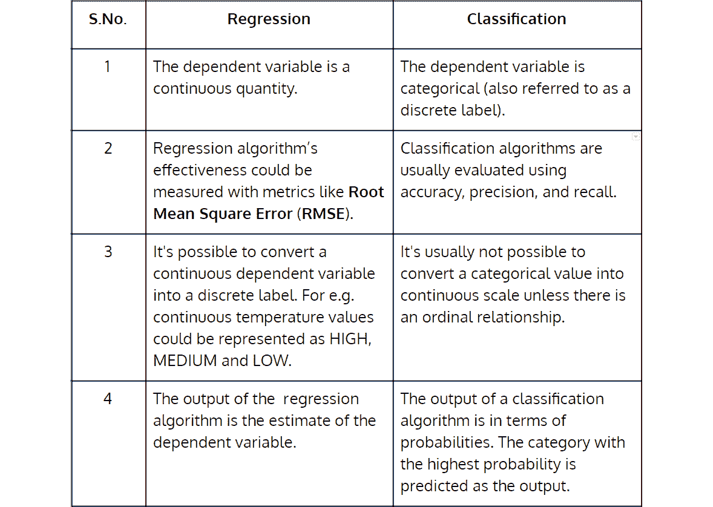
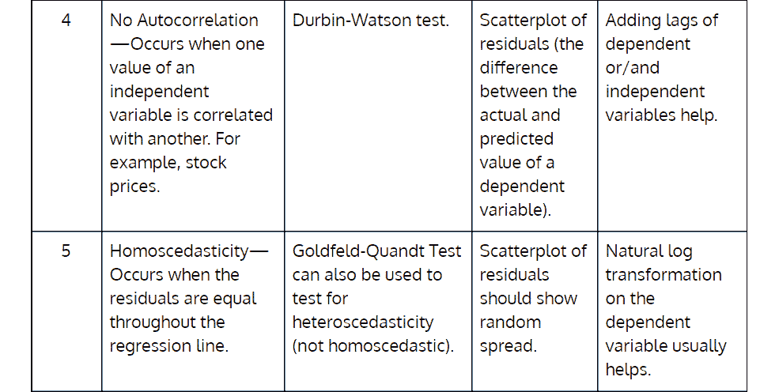
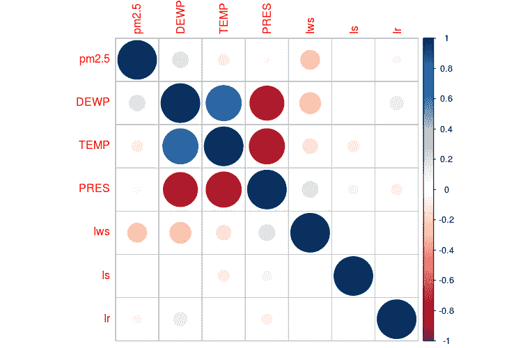
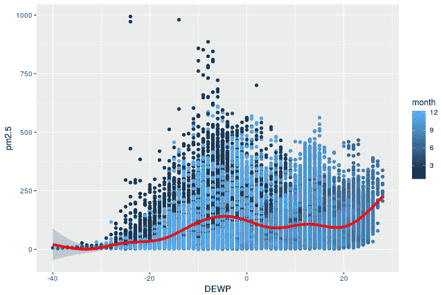
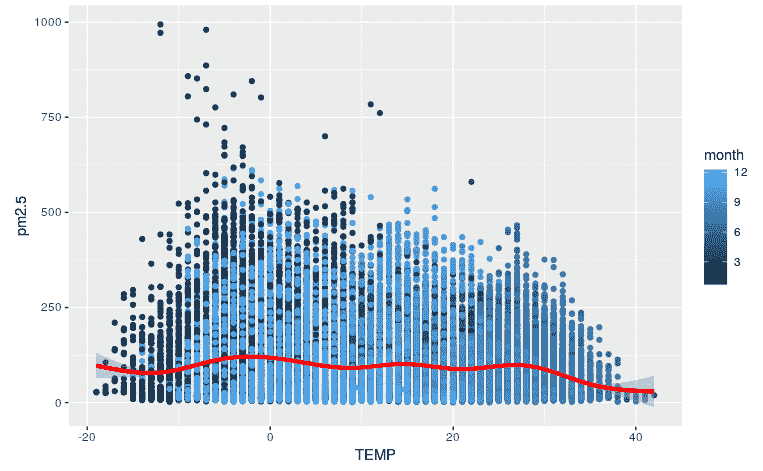
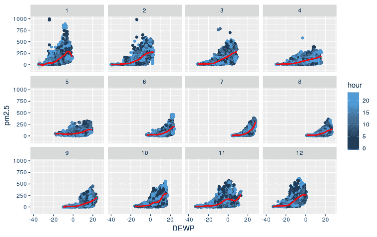
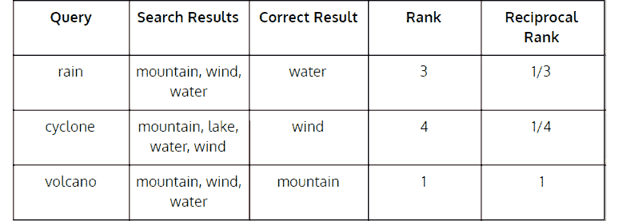
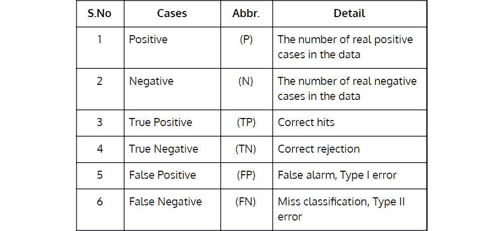

# 第三章：监督学习简介

## 学习目标

到本章结束时，你将能够：

+   解释监督学习和机器学习工作流程

+   使用和探索北京 PM2.5 数据集

+   解释连续和分类因变量的区别

+   在 R 中实现基本的回归和分类算法

+   区分监督学习与其他类型机器学习的关键差异

+   与监督学习算法的评估指标一起工作

+   进行模型诊断，以避免系数估计偏差和大的标准误差

在本章中，我们将介绍监督学习，并通过实际案例展示构建机器学习模型的流程。

## 简介

在前面的章节中，我们探讨了 R 的一些包，如`dplyr`、`plyr`、`lubridate`和`ggplot2`，其中我们讨论了在 R 中存储和处理数据的基本方法。后来，这些思想被用于探索性数据分析（EDA），以了解如何将数据分解成更小的部分，从数据中提取洞察力，并探索其他更好地理解数据的方法，在尝试高级建模技术之前。

在本章中，我们将进一步介绍机器学习思想。在广泛地为思考机器学习中的各种算法打下基础的同时，我们将详细讨论监督学习。

监督学习基于由领域专家良好标记的数据。对于从图像中分类猫和狗，算法首先需要看到标记为猫和狗的图像，然后根据标签学习特征。大多数拥有大量历史数据的企业的最大受益者是从这些数据中提取的丰富知识。如果数据干净且标注良好，监督学习可以实现高预测精度，这与其他机器学习算法不同，其他机器学习算法通常在开始时会产生较大的误差。在没有正确标签的情况下，从数据中提取任何意义变得困难，除了能够进行探索性分析和聚类之外。 

在解决现实世界问题（如预测贷款违约（是/否）、工厂制造机器故障（是/否）、自动驾驶汽车中的目标检测（道路、汽车、信号）、预测股票市场价格（数值））时，标准组件是一组输入（特征）和一个给定的输出（标签），这通常是从历史数据中获得的。当我们预测定量输出时，我们称之为**回归**，当我们预测定性输出时，我们称之为**分类**。

## 北京 PM2.5 数据集概述

在许多国家的城市和农村地区，主要污染物，细颗粒物，是导致人类许多健康风险的原因，同时也影响气候变化。特别是，PM2.5，定义为直径小于 2.5 µm 的气溶胶颗粒，是大气颗粒物的主要类别。各种研究将 PM2.5 与严重的健康问题联系起来，如心脏病和中风。本节中的表格显示了大气颗粒物的类型及其微米级的尺寸分布。

在本章和后续章节中，我们将使用研究论文《评估北京的 PM2.5 污染：严重程度、天气影响、APEC 和冬季供暖》的作者发布的数据集，其中他们使用位于北京 116.47 E，39.95 N 的美国大使馆的每小时 PM2.5 读数，以及从 weather.nocrew.org 获得的每小时气象测量数据，这些数据是在**北京首都国际机场**（**BCIA**）获得的。他们的研究声称是首次在中国 PM2.5 污染中结合了 PM2.5 和气象数据。以下表格描述了数据集中的属性：


###### 图 3.1：北京 PM2.5 数据集的属性。

### 练习 40：探索数据

在这个练习中，我们将通过每个属性的样本值学习数据的结构，并使用`summary`函数。我们将看到数值变量的五个数字摘要统计量。

执行以下步骤以完成此练习：

1.  首先，使用以下命令将北京 PM2.5 数据集读入 PM25 数据框对象：

    ```py
    PM25 <- read.csv("https://raw.githubusercontent.com/TrainingByPackt/Applied-Supervised-Learning-with-R/master/Lesson03/PRSA_data_2010.1.1-2014.12.31.csv")
    ```

1.  接下来，使用`str`命令打印具有样本值的数据结构：

    ```py
    str(PM25)
    ```

    上一条命令的输出如下：

    ```py
    'data.frame':	43824 obs. of  13 variables:
     $ No   : int  1 2 3 4 5 6 7 8 9 10 ...
     $ year : int  2010 2010 2010 2010 2010 2010 2010 2010 2010 2010 ...
     $ month: int  1 1 1 1 1 1 1 1 1 1 ...
     $ day  : int  1 1 1 1 1 1 1 1 1 1 ...
     $ hour : int  0 1 2 3 4 5 6 7 8 9 ...
     $ pm2.5: int  NA NA NA NA NA NA NA NA NA NA ...
     $ DEWP : int  -21 -21 -21 -21 -20 -19 -19 -19 -19 -20 ...
     $ TEMP : num  -11 -12 -11 -14 -12 -10 -9 -9 -9 -8 ...
     $ PRES : num  1021 1020 1019 1019 1018 ...
     $ cbwd : Factor w/ 4 levels "cv","NE","NW",..: 3 3 3 3 3 3 3 3 3 3 ...
     $ Iws  : num  1.79 4.92 6.71 9.84 12.97 ...
     $ Is   : int  0 0 0 0 0 0 0 0 0 0 ...
     $ Ir   : int  0 0 0 0 0 0 0 0 0 0 ...
    ```

    #### 注意

    观察到数据集包含`43824`个观测值和 13 个属性。观察到数据集包含 2010 年至 2014 年的数据。pm2.5、温度、气压、综合风向、累积风速、累积降雪小时数和累积降雨小时数的值每天每小时都会汇总。

1.  现在，让我们展示数据集的摘要统计量：

    ```py
    summary(PM25)
    ```

    输出如下：

    ```py
           No             year          month             day             hour           pm2.5       
     Min.   :    1   Min.   :2010   Min.   : 1.000   Min.   : 1.00   Min.   : 0.00   Min.   :  0.00  
     1st Qu.:10957   1st Qu.:2011   1st Qu.: 4.000   1st Qu.: 8.00   1st Qu.: 5.75   1st Qu.: 29.00  
     Median :21912   Median :2012   Median : 7.000   Median :16.00   Median :11.50   Median : 72.00  
     Mean   :21912   Mean   :2012   Mean   : 6.524   Mean   :15.73   Mean   :11.50   Mean   : 98.61  
     3rd Qu.:32868   3rd Qu.:2013   3rd Qu.:10.000   3rd Qu.:23.00   3rd Qu.:17.25   3rd Qu.:137.00  
     Max.   :43824   Max.   :2014   Max.   :12.000   Max.   :31.00   Max.   :23.00   Max.   :994.00  
                                                                                     NA's   :2067    
          DEWP              TEMP             PRES      cbwd            Iws               Is          
     Min.   :-40.000   Min.   :-19.00   Min.   : 991   cv: 9387   Min.   :  0.45   Min.   : 0.00000  
     1st Qu.:-10.000   1st Qu.:  2.00   1st Qu.:1008   NE: 4997   1st Qu.:  1.79   1st Qu.: 0.00000  
     Median :  2.000   Median : 14.00   Median :1016   NW:14150   Median :  5.37   Median : 0.00000  
     Mean   :  1.817   Mean   : 12.45   Mean   :1016   SE:15290   Mean   : 23.89   Mean   : 0.05273  
     3rd Qu.: 15.000   3rd Qu.: 23.00   3rd Qu.:1025              3rd Qu.: 21.91   3rd Qu.: 0.00000  
     Max.   : 28.000   Max.   : 42.00   Max.   :1046              Max.   :585.60   Max.   :27.00000  

           Ir         
     Min.   : 0.0000  
     1st Qu.: 0.0000  
     Median : 0.0000  
     Mean   : 0.1949  
     3rd Qu.: 0.0000  
     Max.   :36.0000
    ```

以下图像是大气颗粒物尺寸分布（微米）的图形表示：


###### 图 3.2：大气颗粒物的类型和尺寸分布（微米）。

###### 来源：https://en.wikipedia.org/wiki/File:Airborne-particulate-size-chart.svg

#### 注意

发表在《胸科疾病杂志》（**JTD**）上的文章《PM2.5 对人类呼吸系统的影响》的作者讨论了空气污染与呼吸系统疾病之间的关联。他们提供了一种全面的数据驱动方法来解释导致此类呼吸疾病的原因。特别关注北京，研究人员已经广泛研究了 PM2.5 上升的负面影响，并已成为全球各种气候变化论坛的主流讨论点。更多细节可以在文章中找到，链接为 https://www.ncbi.nlm.nih.gov/pmc/articles/PMC4740125/。

## 回归问题和分类问题

在我们的日常生活中，我们随处可见分类和回归问题。例如，从 https://weather.com 获取降雨概率，我们的电子邮件被过滤到垃圾邮件箱和收件箱，我们的个人和家庭贷款被批准或拒绝，决定选择下一个假日目的地，探索购买新房的选项，投资决策以获得短期和长期收益，从亚马逊购买下一本书；这个列表可以一直继续下去。我们周围的世界今天正越来越多地由帮助我们做出选择的算法（这并不总是好事）来运行。

如第二章*数据探索分析*中所述，我们将使用被称为**情境-复杂性-问题**（**SCQ**）的**Minto 金字塔**原则来定义我们的问题陈述。以下表格展示了针对北京的 PM2.5 问题的 SCQ 方法：


###### ![图 3.3：应用 SCQ 解决北京的 PM2.5 问题。现在，在前面表格中描述的 SCQ 构造中，我们可以进行简单的相关性分析，以确定影响 PM2.5 水平的因素，或者创建一个预测问题（预测意味着找到一个近似函数，将输入变量映射到输出），使用所有因素估计 PM2.5 水平。为了术语的清晰，我们将把因素称为输入变量。然后，PM2.5 成为因变量（通常被称为输出变量）。因变量可以是分类的或连续的。例如，在电子邮件分类到 **SPAM**/**非 SPAM** 的问题中，因变量是分类的。以下表格突出了回归问题和分类问题之间的一些关键区别：

###### 图 3.4：回归问题和分类问题之间的区别。

## 机器学习工作流程

为了演示构建预测模型（机器学习或监督学习）的端到端过程，我们创建了一个易于理解的流程。第一步是设计问题，然后是获取和准备数据，这导致为训练和评估编码模型，最后部署模型。在本章的范围内，我们将保持模型解释的简洁，因为它将在第四章和第五章中详细讨论。

下图描述了从准备数据到部署模型所需的整个工作流程：


###### 图 3.5：机器学习工作流程。

### 设计问题

一旦确定了工作领域，就会进行问题设计的头脑风暴。首先，将问题定义为回归问题或分类问题。一旦完成，我们选择正确的目标变量，并识别特征。目标变量很重要，因为它决定了训练的方式。监督学习算法将目标变量放在中心，同时试图从给定的特征集中找到模式。

### 数据来源和准备

数据收集和准备是一项费力的工作，尤其是在数据来源多样且众多的情况下。对于每个数据源，挑战都是不同的，因此处理所需的时间也会有所不同。如果表格数据不包含大量垃圾信息，那么具有表格数据的数据源是最容易处理的，而文本数据由于其自由流动的特性，清理起来最为困难。

### 编码模型

一旦数据准备就绪，我们就开始选择合适的模型。通常，专家们首先选择一个基线模型，以评估算法使用输入特征和目标变量的可预测性。然后，可以直接尝试最先进的算法，或者决定采用试错法（尝试使用所有可能的模型）。必须理解的是，没有绝对正确或错误的模型，一切取决于数据。在编码过程中，数据被随机分为训练集和测试集。代码被编写来在训练数据集上训练模型，评估则在测试数据上进行，这确保了模型在实际部署时不会表现不佳。

### 训练和评估

模型评估是模型的重要组成部分，其中决定了其在实际中的可用性。基于给定的一组模型评估指标，我们需要在经过多次尝试和错误后，决定最佳模型。在每次迭代中，计算如 R 平方值、准确率、精确率和 F 分数等指标。通常，整个数据被分为训练数据和测试数据（通常还包括一个用于验证的第三部分）。模型在训练数据上训练，在测试数据上测试。这种分离确保模型不会进行任何机械学习。在更技术性的术语中，模型不会过拟合（关于这一点，请参阅本章的*评估指标*部分）。通常，在这个工作流程的阶段，一个人可以决定返回并包括更多变量，训练模型，然后重新部署。这个过程会重复进行，直到模型的准确率（或其他重要指标）达到平台期。

我们使用随机数生成函数，如 R 中的`sample()`函数，将数据随机分割成不同的部分，就像在下一个练习 2 的第 2 步中所做的那样。

### 练习 41：从北京 PM2.5 数据集中随机生成训练和测试数据集

在这个练习中，我们将从北京 PM2.5 数据集中创建一个随机生成的训练和测试数据集。我们将重用之前练习中创建的`PM25`对象。

执行以下步骤：

1.  创建一个`num_index`变量，并将其设置为北京 PM2.5 数据集中观测值的数量：

    ```py
    num_index <- nrow(PM25)
    ```

1.  使用`sample()`函数，随机选择`num_index`值的 70%，并将它们存储在`train_index`中：

    ```py
    train_index <- sample(1:num_index, 0.7*nrow(PM25))
    ```

1.  使用`train_index`从北京 PM2.5 数据集中选择一个随机子集的行，并将它们存储到一个名为`PM25_Train`的 DataFrame 中：

    ```py
    PM25_Train <- PM25[train_index,]
    ```

1.  将剩余的观测值存储到一个名为`PM25_Test`的 DataFrame 中：

    ```py
    PM25_Test <- PM25[-train_index,]
    ```

练习展示了创建训练和测试集的简单示例。随机选择的训练和测试集确保模型没有偏见，并在用于现实世界中的未见数据之前，从所有可能的示例中学习得很好。

### 部署模型

一旦选定了最佳模型，下一步就是使模型输出能够被业务应用使用。该模型以**表示状态转移**（**REST**）API 的形式托管。这些 API 是以端点托管 Web 应用的方式，它监听对模型调用的任何请求，通常返回一个 JSON 对象作为响应。

模型的部署正成为工业界所有机器学习项目的必要部分。一个不可部署的模型对公司来说毫无价值，也许仅仅是为了研发目的。越来越多的专业人士正在专注于模型部署，这有时是一个繁琐且复杂的过程。为了给模型部署应有的重视，我们为其专门设立了一章，即*第八章，模型部署*。

## 回归

现在我们已经看到了机器学习的工作流程，我们将探讨两种广泛使用的机器学习算法：回归和分类；两者都采用监督学习来训练模型。本书的整个主题围绕这两种类型的算法展开。北京 PM2.5 数据集将在演示这两种类型时被广泛使用。该数据集有助于理解如何将回归问题转换为分类问题，反之亦然。

### 简单和多重线性回归

回归是分析学和计量经济学（关注于使用数学方法，尤其是统计学，来描述经济系统的经济学分支）中最有用和最基本的工具之一。在许多方面，现代机器学习的根源在于统计学，这主要归功于弗朗西斯·高尔顿爵士的工作。高尔顿是一位对遗传学、心理学和人类学等领域有深厚兴趣和专长的英国维多利亚时代统计学家和博学家。他是第一个将统计方法应用于研究人类行为和智力的人。值得注意的是，他的出版物《遗传身高回归到中等》基于回归有许多有洞察力的发现。

在本节中，我们将简要分析影响 PM2.5 水平的各种因素，使用北京数据集。特别是，我们将探讨露点、温度、风速和压力等变量对 PM2.5 的影响。

### 线性回归模型中的假设

由于回归从应用统计学中借鉴了许多概念来建模数据，因此它伴随着许多假设。我们不应将回归算法应用于任何数据集或问题。在我们构建任何模型之前，让我们先检查线性回归的假设。

下表显示了假设以及我们如何从统计上测试线性回归模型是否遵循该假设。该表还显示了一些如果假设被违反的纠正措施。我们将在第四章“回归”中详细讨论这些假设，并执行诊断分析以识别违规情况。


###### 图 3.6：线性回归模型中的各种假设（第一部分）。



###### 图 3.7：线性回归模型中的各种假设（第二部分）。

## 探索性数据分析（EDA）

构建回归模型需要对目标变量和输入变量之间的模式和关系进行深入分析。北京数据集提供了大量可能影响大气中 PM2.5 水平的环境因素。

### 练习 42：探索北京 PM2.5 数据集中 PM2.5、DEWP、TEMP 和 PRES 变量的时间序列视图

在这个练习中，我们将可视化`pm2.5`、`DEWP`、`TEMP`和`PRES`变量在时间序列图中的表现，并观察这些变量在多年中可能出现的任何模式。

执行以下步骤来完成练习：

1.  在系统中导入所有必需的库：

    ```py
    library(dplyr)
    library(lubridate)
    library(tidyr)
    library(grid)
    library(ggplot2)
    ```

1.  接下来，使用`lubridate`包的`ymd_h`函数将年、月和小时转换为日期时间：

    ```py
    PM25$datetime <- with(PM25, ymd_h(sprintf('%04d%02d%02d%02d', year, month, day,hour)))
    ```

1.  使用以下命令绘制所有年份的 PM2.5、TEMP、DEWP 和 PRES：

    ```py
    plot_pm25 <- PM25 %>%
      select(datetime, pm2.5) %>%
      na.omit() %>%
      ggplot() + 
      geom_point(aes(x = datetime, y = pm2.5), size = 0.5, alpha = 0.75) +
      ylab("PM2.5")
    plot_TEMP <- PM25 %>%
      select(datetime, TEMP) %>%
      na.omit() %>%
      ggplot() + 
      geom_point(aes(x = datetime, y = TEMP), size = 0.5, alpha = 0.75) +
      ylab("TEMP")
    plot_DEWP <- PM25 %>%
      select(datetime, DEWP) %>%
      na.omit() %>%
      ggplot() + 
      geom_point(aes(x = datetime, y = DEWP), size = 0.5, alpha = 0.75) +
      ylab("DEWP")
    plot_PRES <- PM25 %>%
      select(datetime, PRES) %>%
      na.omit() %>%
      ggplot() + 
      geom_point(aes(x = datetime, y = PRES), size = 0.5, alpha = 0.75) +
      ylab("PRES")
    ```

1.  现在，使用以下命令来绘制图表：

    ```py
    grid.newpage()
    grid.draw(rbind(ggplotGrob(plot_pm25), ggplotGrob(plot_TEMP),ggplotGrob(plot_DEWP),ggplotGrob(plot_PRES), size = "last"))
    ```

    图如下：


###### 图 3.8：散点图显示了环境因素（如温度、露点和压力）的趋势和季节性，以及 2010 年至 2014 年底北京地区的 PM2.5 水平。

在这个练习中，我们首先展示了数据集中`PM2.5`、`DEWP`、`TEMP`和`PRES`变量的时间序列视图，并观察其模式。如图*图 3.8*所示，观察到`DEWP`、`TEMP`和`PRES`具有明显的季节性（每 12 个月重复相同的模式），而 PM2.5 似乎具有随机模式。这是早期迹象，表明我们不太可能看到三个变量对 PM2.5 有任何影响。然而，让我们进一步探究这个假设，使用相关性图并观察变量之间是否存在任何关系。

### 练习 43：进行相关性分析

在这个练习中，我们将进行相关性分析，研究各种因素之间关系的强度。

执行以下步骤来完成练习：

1.  使用以下命令将`corrplot`包导入到系统中：

    ```py
    library(corrplot)
    ```

1.  现在，创建一个新的对象并将`PM25`中的所需值存储在其中：

    ```py
    corr <- cor(PM25[!is.na(PM25$pm2.5),c("pm2.5","DEWP","TEMP","PRES","Iws","Is","Ir")])
    ```

1.  使用`corrplot`包来显示相关性矩阵的图形表示：

    ```py
    corrplot(corr)
    ```

    图如下：



###### 图 3.9：北京数据集中所有变量对的关联性。

首先，我们计算所有变量之间的相关性。生成的相关性图显示，PM2.5 与其他变量之间似乎没有强烈的关联。然而，`PM2.5`与`DEWP`、`TEMP`和`Iws`显示出一些轻微的相关性，这表明存在某种关系。这并不令人惊讶，因为我们已经在*图 3.8*中看到，虽然三个变量遵循季节性趋势，但 PM2.5 似乎更随机。请注意，我们对数据集没有进行任何处理或转换；这些发现直接来自我们的第一层分析。我们将在*第四章*，*回归*中详细说明。现在，让我们也使用散点图来可视化变量之间的关系。

### 练习 44：绘制散点图以探索 PM2.5 水平与其他因素之间的关系

在这个练习中，我们将使用散点图来探索 `pm2.5` 水平与其他因素之间的关系。我们希望看到是否会出现任何有趣的模式或关系。散点图是探索变量之间关系的简单而有效的可视化工具。

执行以下步骤来完成练习：

1.  将 `ggplot2` 包导入到您的系统中：

    ```py
    library(ggplot2)
    ```

1.  以 `month` 变量作为颜色绘制 `DEWP` 和 `PM2.5` 之间的散点图：

    ```py
    ggplot(data = PM25, aes(x = DEWP, y = pm2.5, color = month)) +  geom_point() +  geom_smooth(method='auto',formula=y~x, colour = "red", size =1.5)
    ```

    散点图如下：

    

    ###### 图 3.10：显示 DEWP 和 PM2.5 水平之间关系的散点图。

1.  以 `month` 变量作为颜色绘制 `TEMP` 和 `PM2.5` 之间的散点图：

    ```py
    ggplot(data = PM25, aes(x = TEMP, y = pm2.5, color = month)) +  geom_point() +  geom_smooth(method='auto',formula=y~x, colour = "red", size =1.5)
    ```

    散点图如下：

    

    ###### 图 3.11：显示 TEMP 和 PM2.5 水平之间关系的散点图。

1.  创建一个以一天中的小时为颜色，按月份分别显示的 `DEWP` 和 `PM2.5` 之间的散点图：

    ```py
    ggplot(data = PM25, aes(x = DEWP, y = pm2.5, color = hour)) +  geom_point() +  geom_smooth(method='auto',formula=y~x, colour = "red", size =1) +  facet_wrap(~ month, nrow = 4)
    ```

    散点图如下：



###### 图 3.12：按年份月份拆分的 DEWP 和 PM2.5 关系的散点图。

为了评估变量之间的一些关系，我们使用 `PM2.5` 和 `DEWP` 之间的散点图并添加了拟合线。观察代码中，我们向 `geom_smooth()` 传递了一个参数，即 `method = "auto"`，它会根据数据自动决定使用哪种模型来拟合直线。如图 *图 3.10* 所示，直线不是线性的。`geom_smooth` 方法选择了 `TEMP` 和 `PM2.5` 的绘图，如图 *图 3.11* 所示。然而，我们可以更进一步，按月份拆分散点图，如图 *图 3.12* 所示。这表明存在线性关系，但它高度依赖于季节。例如，在四月（用整数 `4` 表示），`DEWP` 和 `PM2.5` 有一个近乎完美的直线拟合。我们将在 *第四章*，*回归* 中进一步讨论这个话题。

因此，我们已经看到了一些假设的违反和环境污染因素与 PM2.5 之间缺乏强相关性的情况。然而，似乎还有进一步审查的空间。在本章关于监督学习的介绍中，我们只关注基于我们的机器学习工作流程的方法。

#### 备注

要了解更多关于 GAM 的信息，请参阅此文档：https://www.stat.cmu.edu/~cshalizi/uADA/12/lectures/ch13.pdf。

### 活动 5：按月份绘制 PRES 和 PM2.5 的散点图

在这个活动中，我们将创建`DWEP`和`PM2.5`之间的散点图。通过这个活动，我们将学习使用`facet_wrap()`函数在`ggplot()`之上创建一个层，将散点图的可视化分割到每个月，从而帮助观察任何季节性模式。

执行以下步骤来完成活动：

1.  在`ggplot`中，使用`PRES`变量分配`a()`方法的组件。

1.  在`geom_smooth()`方法的下一层，将`colour = "blue"`设置为区分。

1.  最后，在`facet_wrap()`层中，使用`month`变量为每个月绘制单独的隔离图。

    图表如下：


###### 图 3.13：显示 PRES 和 PM2.5 之间关系的散点图。

#### 注意

该活动的解决方案可以在第 445 页找到。

### 模型构建

我们简要探讨了`PM2.5`与一些因素（如`TEMP`和`DEWP`）之间的关系。同样的分析可以应用于其他变量，如`PRES`、`Iwd`等。在本节中，让我们创建一个线性模型。（即使我们知道模型的选择不是最好的，我们也不会犹豫去运行模型。机器学习中的试错法总是建立事实的最佳方式。）

通常，线性回归模型输入变量（自变量）和目标变量（因变量或解释变量）之间的线性关系。如果我们有一个解释变量，它被称为**简单线性回归**；如果有多个解释变量，则称为**多元线性回归**。以下方程是线性回归或线性预测函数的数学表示，其中包含*p*个解释变量和*n*个观测值：


这里，每个是一个列值的向量（解释变量）对于是未知的参数或系数。，这使得这个方程适合简单的线性回归。有许多算法可以将这个函数拟合到数据上。最流行的一个是**普通最小二乘法**（**OLS**）。我们将在下一章关于回归的章节中详细讨论 OLS。

另一种思考方式是是它是一个线性预测函数，尽可能地将观测值拟合到维度的空间中，最小化残差平方和（目标值的实际值与预测值之间的差异）。

在接下来的练习中，我们将跳过将数据集分为训练集和测试集的步骤，因为我们仍然处于探索阶段，尚未决定正式进行建模练习。（我们将在下一章中涉及这一点。）我们将使用 R 中的 `lm()` 方法构建线性模型。同样，关于这一点将在下一章中详细介绍。目前，只需注意 `lm()` 方法使用一个或多个输入变量将目标变量拟合到一条直线。在简单线性回归中，我们只使用一个变量来拟合直线，而在多重线性回归中，我们可以使用多个变量。

### 练习 45：探索简单和多重回归模型

在这个练习中，我们将探索简单和多重回归模型。

执行以下步骤以完成练习：

1.  将所需的库和包导入 R-Studio。

1.  接下来，创建一个名为 `simple_PM25_linear_model` 的 DataFrame 对象，并使用 `lm()` 方法构建线性模型：

    ```py
    simple_PM25_linear_model <- lm(pm2.5 ~ DEWP, data = PM25)
    ```

1.  使用如下所示的方法，使用 summary 方法打印对象的摘要：

    ```py
    summary(simple_PM25_linear_model)
    ```

    输出如下：

    ```py
    Call:
    lm(formula = pm2.5 ~ DEWP, data = PM25)
    Residuals:
        Min      1Q  Median      3Q     Max 
    -115.47  -61.26  -28.75   33.83  923.54 
    Coefficients:
                Estimate Std. Error t value Pr(>|t|)    
    (Intercept) 96.69984    0.44705  216.31   <2e-16 ***
    DEWP         1.09325    0.03075   35.55   <2e-16 ***
    ---
    Signif. codes:  0 '***' 0.001 '**' 0.01 '*' 0.05 '.' 0.1 ' ' 1
    Residual standard error: 90.69 on 41755 degrees of freedom
      (2067 observations deleted due to missingness)
    Multiple R-squared:  0.02939,	Adjusted R-squared:  0.02936 
    F-statistic:  1264 on 1 and 41755 DF,  p-value: < 2.2e-16
    ```

1.  接下来，创建另一个 DataFrame 对象，并使用 `lm()` 方法构建线性模型：

    ```py
    multiple_PM25_linear_model <- lm(pm2.5 ~ DEWP+TEMP+Iws, data = PM25)
    ```

1.  使用 `summary` 函数打印模型对象的摘要：

    ```py
    summary(multiple_PM25_linear_model)
    ```

    输出如下：

    ```py
    A)
    ______________________________________________________________
    Call:
    lm(formula = pm2.5 ~ DEWP + TEMP + Iws, data = PM25)
    Residuals:
        Min      1Q  Median      3Q     Max 
    -149.02  -53.74  -16.61   34.14  877.82 
    ______________________________________________________________
    B)
    ______________________________________________________________
    Coefficients:
                  Estimate Std. Error t value Pr(>|t|)    
    (Intercept) 161.151207   0.768727  209.63   <2e-16 ***
    DEWP          4.384196   0.051159   85.70   <2e-16 ***
    TEMP         -5.133511   0.058646  -87.53   <2e-16 ***
    Iws          -0.274337   0.008532  -32.15   <2e-16 ***
    ---
    Signif. codes:  0 '***' 0.001 '**' 0.01 '*' 0.05 '.' 0.1 ' ' 1
    ______________________________________________________________
    C)
    ______________________________________________________________
    Residual standard error: 81.51 on 41753 degrees of freedom
      (2067 observations deleted due to missingness)
    Multiple R-squared:  0.216,	Adjusted R-squared:  0.2159 
    F-statistic:  3834 on 3 and 41753 DF,  p-value: < 2.2e-16
    ______________________________________________________________
    ```

### 模型解释

现在，基于简单和多重线性回归模型的先前输出，让我们尝试理解输出中的每一部分代表什么。在本书的这个阶段，了解每一部分的意义就足够了；我们将在 *第四章*，*回归* 中讨论结果。

+   使用 `lm()` 方法与因变量和自变量，用 `~` 符号表示的公式形式表示。这类似于我们的线性预测函数。在简单的回归模型中，只有一个变量——`DEWP`——而在多重模型中，有 `DEWP`、`TEMP` 和 `Iws`。您还可以看到残差的五个汇总统计量（最小值、第一四分位数、中位数、第三四分位数和最大值）。这表明预测值与实际值之间的差距。

+   将 `X_j` 部分纳入我们的预测方程中，我们将得到预测值。名为 `Std. Error` 的列是估计的标准误差。t 值是通过将 `Estimate` 和 `Std. Error` 的比率得到的，而 p 值突出了估计的统计显著性。视觉线索，即 `*` 和 . 符号是基于 p 值的。小于 0.001 的值得到三个星号，而介于 0.1 和 0.05 之间的值得到一个 `.`（点）。三个星号意味着最佳情况，即对应于自变量的估计是显著的并且对预测（或解释）因变量是有用的。换句话说，p 值有助于确定回归模型相对于零模型（仅因变量的均值）的显著性。

+   部分 **C**：

    这一部分展示了模型的功效。最重要的观察值是 R 平方和调整 R 平方值，这些是表示回归模型中由独立变量（s）解释的因变量变化的百分比统计量。

在本章中查看关于评估指标的章节，以了解模型在 R 平方和调整 R 平方指标上的表现解释。

## 分类

与回归算法类似，分类也通过依赖或目标变量进行学习，并使用所有预测或独立变量来找到正确的模式。主要区别在于，在分类中，目标变量是分类的，而在回归中，它是数字的。在本节中，我们将通过使用北京 PM2.5 数据集来介绍逻辑回归，以展示这一概念。

### 逻辑回归

**逻辑回归**是用于二元分类的最受欢迎的透明模型。透明模型定义为提供对预测中整个推理过程的可见性的模型。对于每个做出的预测，我们可以利用模型的数学方程式并解码预测的原因。还有一些完全属于黑盒的分类模型，也就是说，我们无论如何都无法理解模型利用的预测推理。在我们只想关注最终结果的情况下，我们应该更喜欢黑盒模型，因为它们更强大。

### 简要介绍

虽然名称以**回归**结尾，但逻辑回归是一种用于预测二元分类结果的技巧，因此是分类问题的良好选择。如前节所述，我们需要一种不同的方法来对分类结果进行建模。这可以通过将结果转换为优势比的对数或事件发生的概率来实现。

让我们将这种方法提炼成更简单的结构。假设一个事件成功的概率为 0.7。那么，同一事件失败的概率将被定义为*1 – 0.7 = 0.3*。成功的优势被定义为成功概率与失败概率的比率。成功的优势将是*0.7/0.3 = 2.33*，即成功的优势是 2 比 1。如果成功的概率是 0.5，即 50-50 的机会，那么成功的优势是 1 比 1。逻辑回归模型可以用以下方式数学表示：

![图片 C12624_03_27.jpg]

这里，是优势比的对数，也称为**logit**函数。进一步解决数学问题，我们可以推导出结果概率，如下所示：

![图片 C12624_03_29.jpg]

讨论方程的数学背景和推导超出了本章的范围。然而，为了总结，logit 函数（或逻辑函数），作为连接函数，帮助逻辑回归直观地将预测结果（预测结果）重新表述为优势比的对数。这当解决时，有助于我们预测二元因变量的概率。

### 逻辑回归的机制

就像线性回归一样，其中变量的 beta 系数使用 OLS 方法估计，逻辑回归模型利用**最大似然估计**（**MLE**）方法。MLE 函数估计模型参数或 beta 系数的最佳值集，以最大化似然函数，即概率估计。它也可以定义为所选模型与观察数据之间的**一致性**。当估计出最佳参数值集时，将这些值/β系数插入到前面定义的模型方程中，有助于估计给定样本的输出概率。类似于 OLS，MLE 是一个迭代过程。

### 模型构建

就像在 R 中使用线性回归构建逻辑回归模型一样，我们有`glm()`广义线性模型方法来拟合数据和 logit 函数来评分观测值。

使用 glm()函数的语法如下：

```py
glm(Y ~ X1 + X2 + X3, data = <train_data>,family=binomial(link='logit'))
```

在这里，Y 是我们的因变量，X1、X2 和 X3 是自变量。data 参数将采用训练数据集。family 参数设置为 binomial(link='logit')，这适合逻辑回归模型。

### 练习 46：将北京 PM2.5 数据集中的滚动 3 小时平均值存储

在这个练习中，我们将创建一个新变量，该变量存储北京 PM2.5 数据集中 PM2.5 变量的滚动 3 小时平均值。滚动平均值将平滑 PM2.5 读数中的任何噪声。

让我们使用`zoo`包中的`rollapply`方法来完成练习：

1.  将`年`、`月`、`日`和`小时`合并成一个名为`datetime`的新变量：

    ```py
    PM25$datetime <- with(PM25, ymd_h(sprintf('%04d%02d%02d%02d', year, month, day,hour)))
    ```

1.  删除 NAs 并查看 PM2.5 数据集中`pm2.5`变量的前 6 个值：

    ```py
    PM25_subset <- na.omit(PM25[,c("datetime","pm2.5")])
    head(PM25_subset$pm2.5)
    ```

    输出如下：

    ```py
    [1] 129 148 159 181 138 109
    ```

1.  将`PM25_subset`存储到以 datetime 为索引的有序观测值的`zoo`对象中，并打印前 6 个值：

    ```py
    zoo(PM25_subset$pm2.5,PM25_subset$datetime)
    ```

    输出如下：

    ```py
    2010-01-02 00:00:00 2010-01-02 01:00:00 2010-01-02 02:00:00 
                    129                 148                 159 
    2010-01-02 03:00:00 2010-01-02 04:00:00 2010-01-02 05:00:00 
                    181                 138                 109 
    ```

1.  使用`rollapply`函数创建`pm2.5`变量的 3 小时滚动平均值，并打印前 6 个值：

    ```py
    PM25_three_hour_pm25_avg <- rollapply(zoo(PM25_subset$pm2.5,PM25_subset$datetime), 3, mean)
    ```

    输出如下：

    ```py
    2010-01-02 01:00:00 2010-01-02 02:00:00 2010-01-02 03:00:00 
               145.3333            162.6667            159.3333 
    2010-01-02 04:00:00 2010-01-02 05:00:00 2010-01-02 06:00:00 
               142.6667            117.3333            112.6667 
    ```

注意到`145.33`值是三个小时的`pm2.5`变量的平均值，如步骤 3 所示（`129`、`148`和`159`）。

### 活动 6：转换变量并推导新变量以构建模型

在这个活动中，我们将在构建模型之前执行一系列转换并推导新变量。我们需要将`pm2.5`变量转换为分类变量，以便应用逻辑回归模型。

在我们构建逻辑回归分类模型之前，需要执行以下步骤：

1.  将年、月、日和小时合并成一个名为 `datetime` 的新变量。

1.  使用 datetime 变量，计算 3 小时窗口内 `pm2.5` 值的平均值。将这个新变量命名为 `PM25_three_hour_pm25_avg`。

1.  创建一个名为 `pollution_level` 的二进制变量。如果 `PM25_three_hour_pm25_avg` 大于 `35`，则其值为 `1`，否则为 `0`。

1.  以 `pollution_level` 作为因变量，构建逻辑回归模型。

1.  打印模型的摘要。

    最终输出如下：

    ```py
    Call:
    glm(formula = pollution_level ~ DEWP + TEMP + Iws, family = binomial(link = "logit"), 
        data = PM25_for_class)
    Deviance Residuals: 
        Min       1Q   Median       3Q      Max  
    -2.4699  -0.5212   0.4569   0.6508   3.5824  
    Coefficients:
                  Estimate Std. Error z value Pr(>|z|)    
    (Intercept)  2.5240276  0.0273353   92.34   <2e-16 ***
    DEWP         0.1231959  0.0016856   73.09   <2e-16 ***
    TEMP        -0.1028211  0.0018447  -55.74   <2e-16 ***
    Iws         -0.0127037  0.0003535  -35.94   <2e-16 ***
    ---
    Signif. codes:  0 '***' 0.001 '**' 0.01 '*' 0.05 '.' 0.1 ' ' 1
    (Dispersion parameter for binomial family taken to be 1)
        Null deviance: 49475  on 41754  degrees of freedom
    Residual deviance: 37821  on 41751  degrees of freedom
    AIC: 37829
    Number of Fisher Scoring iterations: 5
    ```

    #### 注意

    这个活动的解决方案可以在第 446 页找到。

### 解释模型

大部分 `glm()` 输出看起来与 `lm()` 方法相似，但有一些新的值，如下所示：

+   **零偏差**

+   **残差偏差**

+   **赤池信息量准则**（**AIC**）

+   **费舍尔评分**

为了避免评分，所有上述措施将在 *第五章*，*分类* 中详细描述。

参考本章下一节关于 *评估指标*（基于 *混淆矩阵指标* 部分）的内容，以找到对模型在 R 平方和调整 R 平方指标上表现如何的解释。

## 评估指标

在本节中，我们将介绍所有用于评估机器学习模型预测质量的评估措施。根据因变量，我们有几种评估措施的选择。在我们机器学习工作流程的训练和评估步骤中，我们提到，在我们得到期望的结果之前，我们通过添加新变量或更改参数来迭代训练模型。在每次迭代中，我们尝试优化任何一个或两个评估指标。以下表格总结了用于回归、分类和推荐系统的各种类型指标。鉴于本书的范围，我们将更深入地探讨回归和分类算法的细节：


###### 图 3.14：各种机器学习算法的指标。

### 均方误差 (MAE)

绝对误差是无方向的，这意味着它并不重要，模型在测试数据集上预测的因变量的值是小于还是大于实际值。因此，在我们的北京 PM2.5 数据集示例中，MAE 将给出 PM2.5 预测的平均绝对误差（因变量的预测值和实际值之间的差异），不考虑误差的方向（正或负）：


这里， 是因变量的第 i 个观测值， 是预测值或期望值。

### 均方根误差 (RMSE)

与 MAE 类似，均方根误差也计算平均预测误差。然而，它基于二次评分，计算平均平方误差的平方根。此外，与 MAE 不同，MAE 取预测值和实际值之间的绝对差，而 RMSE 取平方，这增加了高误差值在开平方前的权重：


在这里，表示第 i 个观测的因变量实际值和估计值之间的差异。

### R 平方

R 平方衡量的是线性模型解释响应变量变异的百分比（介于 0 和 1 之间或从 0%到 100%的值）。换句话说，它衡量的是输入特征解释的变异。0%的 R 平方意味着模型的输入特征对响应变量没有任何解释作用。接近 100%意味着该模型是响应变量的良好预测器。例如，如果我们想预测某个地区的房价，特征如卧室数量、面积（平方英尺）以及学校和市场附近的距离决定了房产的价值。然而，仅凭 R 平方不能用于评估模型的好坏。还需要进行关于残差、正态性和异方差性的各种诊断检查。我们将在*第四章*，*回归*中详细讨论这一点。


在这里，是因变量实际值和估计值之间平方差的和，而表示因变量实际值和平均值之间平方差的和。


### 调整后的 R 平方

当我们在回归模型中添加新变量时，随着新变量在解释因变量变化方面的贡献增加，模型的 R 平方值也会提高。（如果新变量设计不当且与解释因变量不相关，则会出现反论点。）因此，为了使评估指标对变量数量保持无偏见，我们在计算中引入了*n*（观测数）和*q*（变量数），从而惩罚 R 平方值。这被称为调整后的 R 平方，它同时调整了观测数和变量数。在处理多元线性回归时，查看调整后的 R 平方是一个好的做法。

**MSE**（均方误差）:


在这里，*n*是观测数，而*q*是模型中的系数数。

**MST**（总均方误差）:


### 平均倒数排名（MRR）

MRR 常用于评估搜索引擎、推荐算法以及数字空间中的许多其他信息检索算法。MRR 易于解释。通常，它可以用来评估为输入生成响应列表的算法。例如，您在 Google 查询中看到的搜索结果和您在 Amazon 上看到的商品推荐。以下表格显示了计算倒数排名的示例。MRR 的范围从 0 到 1；值越接近 1，表明算法在列表顶部给出了相关结果。



###### 图 3.15：计算倒数排名的示例。

### 练习 47：寻找评估指标

在这个练习中，我们将找到 MAE、RMSE、R-squared、调整后的 R-squared 和 MRR。

执行以下步骤：

1.  导入所需的库和包。

1.  创建一个名为`y_predicted`的变量，并将`multiple_PM25_linear_model`的值赋给它：

    ```py
    y_predicted <- predict(multiple_PM25_linear_model, data = PM25)
    ```

1.  使用以下命令将`PM25`数据集的值赋给变量：

    ```py
    y_actual <- PM25[!is.na(PM25$pm2.5),"pm2.5"]
    ```

1.  使用均值函数找到 MAE：

    ```py
    MAE <- mean(abs(y_actual - y_predicted))
    ```

    输出如下：

    ```py
    ## [1] 59.82112
    ```

1.  接下来，计算 RMSE：

    ```py
    RMSE <- sqrt(mean((y_actual - y_predicted)²))
    ```

    输出如下：

    ```py
    ## [1] 82.09164
    ```

1.  现在，使用以下命令计算 R-squared 值：

    ```py
    model_summary <- summary(multiple_PM25_linear_model)
    model_summary$r.squared
    ```

    输出如下：

    ```py
    ## [1] 0.216
    ```

1.  接下来，使用以下命令找到调整后的 R-squared：

    ```py
    model_summary$adj.r.squared
    ```

    输出如下：

    ```py
    ## [1] 0.2159
    ```

1.  最后，使用以下命令找到 MRR：

    ```py
    Query_RR_Vector <- c(1/3,1/4,1)
    MRR <- sum(Query_RR_Vector)/length(Query_RR_Vector)
    ```

    输出如下：

    ```py
    ## [1] 0.5277778
    ```

观察到 MAE 的值为`59.82`，RMSE 为`82.09`，这表明误差有很高的方差。换句话说，预测中的观测值有很高的误差（这增加了误差幅度频率分布的方差）；MAE 未能识别误差，而 RMSE 很好地放大了它。如果 MAE 和 RMSE 几乎相等，我们可以推断误差幅度频率分布的方差很低，并且模型对所有观测值的表现都很好。

### 基于混淆矩阵的指标

基于混淆矩阵的指标用于分类算法。可以从混淆矩阵（也称为`A`和`B`）中推导出一系列指标。否则，关于目标变量没有负面或正面的东西。列联表也可以是 NxN，其中*N*是响应变量中的类别或类别的数量。例如，如果我们想在一个给定的图像中分类 26 个手写英文字符，我们需要一个 26x26 的矩阵：



###### 图 3.16：混淆矩阵的元素。

如果我们将**TP**、**TN**、**FP**和**FN**排列在一个 2x2 的列联表中，我们就可以得到混淆矩阵，如下表所示：


###### 图 3.17：混淆矩阵。

### 准确度

准确率衡量模型对正负样本的正确整体分类。矩阵对角线元素（TP 和 TN）之和除以正负样本的总数给出准确率。在现实场景中，准确率并不总是可靠的指标。考虑一下，我们想要区分癌症 CT 扫描和良性 CT 扫描。显然，我们可能会有许多阴性扫描和很少的阳性扫描。这导致了我们所说的**不平衡数据集**。如果模型主要能够准确预测良性扫描，但在预测癌症 CT 扫描时产生重大错误，准确率可能仍然很高，但模型并不那么有用。


### 灵敏度

为了解决我们之前讨论的**准确率**问题，我们可以使用灵敏度（也称为召回率、命中率或**真正例率****TPR**）和特异性（下一节讨论）的组合。灵敏度给出了模型对阳性案例的预测能力（例如，在 CT 扫描中检测癌症）。我们从所有**真正例**（**TP**）案例与**阳性**（**P**）案例的数量之比中获得灵敏度。


### 特异性

特异性提供了对负例正确预测的定量评估（例如，检测良性 CT 扫描）。我们从真阴性案例数与负案例数之比中获得灵敏度。


高灵敏度和特异性值表示模型质量较好。在大多数情况下，我们试图平衡这两个指标以获得最佳模型。

### F1 分数

F1 分数通过取两个指标（精确度和灵敏度）的调和平均值（适用于取两个或更多率的平均值）来结合精确度和灵敏度，如下公式所述。**阳性预测值**（**PPV**或精确度）衡量的是正确预测的数量与真阳性数和假阳性数之和的比值，即所有阳性病例预测中正确的是多少。


F1 分数比准确率更稳健，但在不平衡类别的情况下仍然存在问题。

对于评估分类模型的好坏，没有好或坏的指标。机器学习从业者通常会查看许多指标的组合来得出模型好坏的结论。这就是为什么了解如何解释上述讨论的每个指标变得很重要。

### 练习 48：在训练数据上使用模型评估

在这个练习中，我们将使用`caret`包中的`confusionMatrix`函数对训练数据进行模型评估。该函数会打印出准确率、灵敏度、特异性和许多其他指标。

执行以下步骤以完成练习：

1.  将所需的库和包导入系统。

1.  创建一个名为`predicted`的变量，并赋予其值，如图所示：

    ```py
    predicted <- ifelse(PM25_logit_model$fitted.values>0.5, 1,0)
    ```

1.  接下来，创建另一个名为`actual`的变量，如图所示：

    ```py
    actual <- PM25_for_class$pollution_level
    ```

1.  导入 caret 库：

    ```py
    library(caret)
    ```

1.  最后，使用`confusionMatrix`方法来描述分类模型的表现：

    ```py
    confusionMatrix(predicted, actual)
    ```

    输出如下：

    ```py
    ## Confusion Matrix and Statistics
    ## 
    ##           Reference
    ## Prediction     0     1
    ##          0  5437  2097
    ##          1  6232 27989
    ##                                           
    ##                Accuracy : 0.8005          
    ##                  95% CI : (0.7967, 0.8044)
    ##     No Information Rate : 0.7205          
    ##     P-Value [Acc > NIR] : < 2.2e-16       
    ##                                           
    ##                   Kappa : 0.4444          
    ##  Mcnemar's Test P-Value : < 2.2e-16       
    ##                                           
    ##             Sensitivity : 0.4659          
    ##             Specificity : 0.9303          
    ##          Pos Pred Value : 0.7217          
    ##          Neg Pred Value : 0.8179          
    ##              Prevalence : 0.2795          
    ##          Detection Rate : 0.1302          
    ##    Detection Prevalence : 0.1804          
    ##       Balanced Accuracy : 0.6981          
    ##                                           
    ##        'Positive' Class : 0               
    ```

`confusionMatric()`输出结果中显示的许多指标在本节中都有描述。然而，在阅读详细内容之前，这里有一个简要的总结。这个逻辑回归模型的准确率为 80%，按照标准来看是好的。这表明我们可以用其他环境因素以 80%的准确率预测正常和高于正常的 PM2.5 值。然而，请注意，准确率是基于整个训练数据集的。我们没有将数据分成两部分来检查过拟合情况，这是一种模型在训练数据上测试时表现非常好，但在测试（或未见）数据上表现较差的情况。

敏感性为 46%，特异性为 93%。这意味着模型在处理负例（高于正常 PM2.5）方面表现良好。通常，这两个指标之间必须有一个权衡。然而，在这种情况下，模型的优先级是尽可能多地预测**高于正常**的状态。因此，一旦我们有了混淆矩阵，高特异性是可取的；我们可以从中计算出所有指标。

### 受试者工作特征（ROC）曲线

在分类模型的背景下，预测的输出是一个定量估计，通常是一个概率度量。在二元逻辑回归中，将一个观测值分类为另一个观测值（例如，垃圾邮件与非垃圾邮件）的常用阈值是 0.5。这意味着如果概率大于 0.5，则将其分类为垃圾邮件，否则为非垃圾邮件。现在，根据阈值的不同，你将在我们之前讨论的混淆矩阵中得到不同的 TP、TN、FP 和 FN 值。虽然查看给定阈值（通常是 0.5）下的混淆矩阵是一种标准做法，但它可能无法完全展示模型在现实世界中的表现，这就是为什么阈值的选择至关重要。

ROC 曲线是一种优雅的可视化方式，显示了在每一个可能的阈值下，真正例率（通常由敏感性表示）和真正例率（通常由特异性表示）之间的变化。它帮助我们确定分类的正确阈值。此外，ROC 曲线下的面积（称为 AUC），其值在 0 到 1 之间，告诉我们模型的好坏。越接近 1，意味着模型能够成功地将大多数观测值分类为正类和负类。

在 R 中使用 ROCR 包，我们将使用逻辑回归获取 PM2.5 预测的 ROC 曲线。我们将在下一个练习中观察 AUC。

### 练习 49：创建 ROC 曲线

在这个练习中，我们将使用 ROCR 包来获取 ROC 曲线。

执行以下步骤：

1.  使用以下命令将 ROCR 包导入系统：

    ```py
    library(ROCR)
    ```

1.  接下来，定义 pred1 和 pref1 对象：

    ```py
    pred1 <- prediction(predict(PM25_logit_model), PM25_for_class$pollution_level)
    perf1 <- performance(pred1,"tpr","fpr")
    ```

1.  接下来，使用以下命令找到 AUC：

    ```py
    auc <- performance(pred1,"auc")
    as.numeric(auc@y.values)
    ```

    输出如下：

    ```py
    ## [1] 0.8077673
    ```

1.  使用 plot 命令绘制图形：

    ```py
    plot(perf1)
    ```

    

###### 图 3.18：真阳性率（灵敏度）与假阳性率（特异性）之间的 ROC 曲线。

## 摘要

在本章中，我们从设计问题开始，逐步介绍了构建机器学习工作流程的过程，包括部署模型。我们简要讨论了简单回归、多重回归和逻辑回归，以及所有必要的评估指标，以解释和判断模型的性能。这两个算法分别展示了回归和分类问题的监督学习。

在本章中，我们使用了北京 PM2.5 数据集来构建模型。在这个过程中，我们通过简单地重新设计因变量，将回归问题转换为分类问题。这种重新设计通常用于现实世界问题，以适应特定的用例。

下一章，我们将深入探讨回归算法的细节，并详细阐述除线性回归之外的多种回归算法类型，并讨论何时使用哪种算法。
