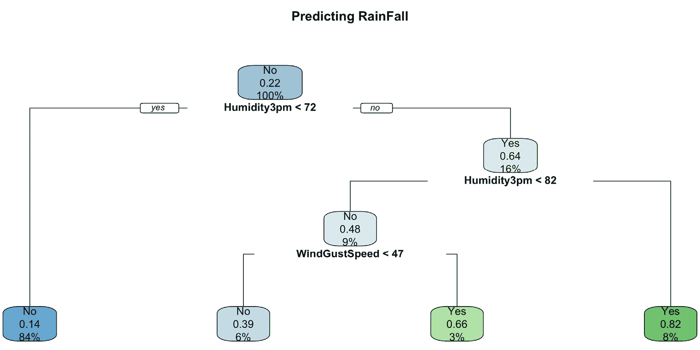

# 第五章：分类

## 学习目标

到本章结束时，你将能够：

+   定义监督机器学习中的二元分类

+   使用白盒模型进行二元分类：逻辑回归和决策树

+   评估监督分类模型的表现

+   使用黑盒集成模型进行二元分类 - 随机森林和 XGBoost

+   设计和开发用于分类的深度神经网络

+   为给定的分类用例选择最佳模型

在本章中，我们将专注于解决监督学习的分类用例。我们将使用一个为分类用例设计的数据库，围绕它构建一个业务问题，并探索一些流行的技术来解决该问题。

## 简介

让我们快速回顾一下我们在*第三章*中学到的内容，*监督学习简介*。正如你现在所知道的，监督学习是机器学习和人工智能的一个分支，它帮助机器在没有明确编程的情况下学习。描述监督学习的一种更简单的方式是开发从标记数据中学习的算法。监督学习的广泛类别包括分类和回归，它们的基本区别在于标签的类型，即**连续**或**分类**。处理连续变量的算法被称为**回归算法**，而处理分类变量的算法被称为**分类算法**。

在分类算法中，我们的目标、依赖或标准变量是一个**分类变量**。根据类别的数量，我们可以进一步将它们分为以下几组：

+   二元分类

+   多项式分类

+   多标签分类

在本章中，我们将专注于**二元分类**。讨论多项式分类和多类分类的细节和实际例子超出了本章的范围；然而，在结束本章之前，我们将列出一些高级主题的额外阅读参考。

二元分类算法是机器学习中最受欢迎的算法类别，在商业、研究和学术界有众多应用。简单的模型可以根据学生的过去表现（通过或失败）来预测他们未来考试通过的可能性，预测是否会下雨，预测客户是否会违约，预测患者是否患有癌症等等，这些都是由分类算法解决的常见用例。

在深入研究算法之前，我们将首先从一个小案例开始，这个小案例将帮助我们通过实际练习解决监督学习分类问题。

## 开始使用用例

在本章中，我们将参考来自澳大利亚联邦气象局并通过 R 提供的`weather`数据集。该数据集有两个目标变量，`RainTomorrow`，一个表示明天是否会下雨的标志，以及`RISK_MM`，它衡量的是下一天降雨量。

简而言之，我们可以使用这个数据集的`RainTomorrow`进行分类练习。有关数据集的元数据和附加详细信息可在 https://www.rdocumentation.org/packages/rattle/versions/5.2.0/topics/weather 上探索。由于数据集可以通过 R 直接使用，我们不需要单独下载它；相反，我们可以直接使用`rattle`库中的 R 函数将数据加载到系统内存中。

### 关于用例的一些背景信息

记录了温度、方向、气压、云量、湿度和日照等天气参数，持续一年。下一天的降雨量已经在数据集中作为目标变量`RainTomorrow`进行工程化。我们可以利用这些数据定义一个机器学习模型，该模型从当天的天气参数中学习，并预测下一天的降雨概率。

雨量预测对许多行业至关重要。火车和长途汽车的长途旅行通常关注天气模式的变化，主要是降雨，以估计到达时间和旅行长度。同样，大多数实体店、小型餐馆和食品摊位等也受到降雨的严重影响。了解明天的天气条件可以帮助企业从多个方面更好地准备，以应对业务损失，在某些情况下，甚至可以最大化业务成果。

为了在问题解决练习中建立良好的直觉，让我们使用数据集构建一个业务问题，并为用例制定问题陈述。由于数据是关于降雨预测的，我们将选择当今超本地食品配送服务面临的流行业务问题。DoorDash、Skip the Dishes、FoodPanda、Swiggy、Foodora 等初创公司为不同国家的客户提供超本地食品配送服务。在大多数国家，一个普遍的趋势是随着雨季的到来，食品配送订单量增加。一般来说，大多数配送公司预计在给定的一天内总配送量会增加 30%-40%。由于配送代理人数有限，雨天订单的增加对配送时间影响巨大。为了保持成本最优，这些公司不可能增加全职代理人数；因此，一个常见的策略是在预计服务需求高的日子里动态雇佣更多代理。为了更好地规划，了解下一天的降雨预测至关重要。

### 定义问题陈述

在设置好问题背景后，让我们尝试为一家超本地食品配送服务公司定义我们的问题陈述，以预测明天的降雨量。为了保持简单和一致性，让我们使用之前研究的框架，即*第二章*，*数据探索分析*来构建问题陈述。这将帮助我们以业务优先的方法提炼出我们想要解决的最终目标，同时将机器学习视角放在首位。

下图展示了之前定义的使用案例的简单视觉框架——**情境**-**复杂性**-**问题**（**SCQ**）框架：


###### 图 5.1：分类使用案例的 SCQ

我们可以清楚地从 SCQ 中回答问题：我们需要一个预测模型来预测明天的降雨概率，作为解决问题的解决方案。让我们继续下一步——收集数据以构建一个预测模型，这将帮助我们解决业务问题。

### 数据收集

`rattle.data`包为我们提供了使用案例的数据，可以使用 R 的内部数据集方法访问。如果你还没有安装这些包，你可以使用`install.packages("rattle.data")`命令轻松安装它们。

### 练习 63：探索使用案例的数据

在这个练习中，我们将对为使用案例收集的数据集进行初步探索。我们将探索数据的形状，即行数和列数，并研究每个列中的内容。

为了探索数据的形状（行数 x 列数）和内容，执行以下步骤：

1.  首先，使用以下命令加载`rattle`包：

    ```py
    library(rattle.data)
    ```

1.  加载我们使用案例的数据，这些数据可以从`rattle`包中获取：

    ```py
    data(weatherAUS)
    ```

    #### 注意

    `weatherAUS`数据集是一个 DataFrame，包含来自 45 个以上澳大利亚气象站的超过 140,000 条每日观测数据。

1.  现在，将天气数据直接加载到名为`df`的 DataFrame 中：

    ```py
    df <- weatherAUS
    ```

1.  使用`str`命令探索 DataFrame 的内容：

    ```py
    str(df)
    ```

    输出如下：


###### 图 5.2：最终输出

我们有近 150,000 行数据，24 个变量。我们需要删除`RISK_MM`变量，因为它将是回归使用案例（即预测明天下雨量）的目标变量。因此，我们剩下 22 个独立变量和 1 个因变量`RainTomorrow`，用于我们的使用案例。我们还可以看到连续变量和分类变量的良好混合。`Location`、`WindDir`、`RainToday`等多个变量是分类的，其余的是连续的。

#### 注意

你可以在 GitHub 上找到完整的代码：http://bit.ly/2Vwgu8Q。

在下一个练习中，我们将计算每个列中缺失值的总百分比。

### 练习 64：计算所有列的缺失值百分比

我们在*练习 1*，*探索数据集以用于用例*中探索的数据集有相当多的空值。在这个练习中，我们将编写一个脚本来计算每个列中空值的百分比。

我们可以看到几个变量中存在空值。让我们检查`df`数据集中每个列的空值百分比。

执行以下步骤以计算数据集中每列的空值百分比：

1.  首先，移除名为`RISK_MM`的列，因为它打算用作回归用途的目标变量。（将其添加到我们的模型会导致数据泄露）：

    ```py
    df$RISK_MM <- NULL
    ```

1.  创建一个`temp_df` DataFrame 对象并将其值存储在其中：

    ```py
    temp_df<-as.data.frame(
      sort(
      round(
      sapply(df, function(y) sum(length(which(is.na(y)))))/dim(df)[1],2)
      )
    )
    colnames(temp_df) <- "NullPerc"
    ```

1.  现在，使用`print`函数显示每列的空值百分比，使用以下命令：

    ```py
    print(temp_df)
    ```

    输出如下：

    ```py
                  NullPerc
    Date              0.00
    Location          0.00
    MinTemp           0.01
    MaxTemp           0.01
    WindSpeed9am      0.01
    Temp9am           0.01
    Rainfall          0.02
    WindSpeed3pm      0.02
    Humidity9am       0.02
    Temp3pm           0.02
    RainToday         0.02
    RainTomorrow      0.02
    WindDir3pm        0.03
    Humidity3pm       0.03
    WindGustDir       0.07
    WindGustSpeed     0.07
    WindDir9am        0.07
    Pressure9am       0.10
    Pressure3pm       0.10
    Cloud9am          0.38
    Cloud3pm          0.41
    Evaporation       0.43
    Sunshine          0.48
    ```

我们可以看到最后四个变量有超过*30%*的缺失或空值。这是一个相当大的下降。最好从我们的分析中删除这些变量。此外，我们还可以看到一些其他变量大约有*1%*到*2%，在某些情况下，高达*10%*的缺失或空值。我们可以使用各种缺失值处理技术来处理这些变量，例如用均值或众数替换它们。在某些重要情况下，我们还可以使用基于聚类的均值和众数替换等额外技术来提高处理效果。此外，在非常关键的场景中，我们可以使用回归模型来估计剩余缺失值的剩余部分，通过定义一个模型，其中所需的缺失值列被视为剩余变量的函数。

#### 注意

您可以在 GitHub 上找到完整的代码：http://bit.ly/2ViZEp1。

在以下练习中，我们将移除空值。如果没有合适的模型，我们将重新审视数据。

### 练习 65：从数据集中移除空值

约翰正在处理新创建的数据集，在进行分析时，他发现数据集中存在显著的空值。为了使数据集对进一步分析有用，他必须从其中移除空值。

执行以下步骤以从`df`数据集中移除空值：

1.  首先，使用以下命令选择最后四列，这些列的空值超过*30%*：

    ```py
    cols_to_drop <-tail(rownames(temp_df),4)
    ```

1.  使用`na.omit`命令从 DataFrame 中移除所有包含一个或多个空值列的行，该命令会从 DataFrame 中移除所有空行：

    ```py
    df_new<- na.omit(df[,!names(df) %in% cols_to_drop])
    ```

1.  现在，使用以下`print`命令打印新格式化的数据：

    ```py
    print("Shape of data after dropping columns:")
    print(dim(df_new))
    ```

    输出如下：

    ```py
    Shape of data after dropping columns:
    112925     19
    ```

1.  使用以下命令，验证新创建的数据集中是否存在空值：

    ```py
    temp_df<-as.data.frame(sort(round(sapply(df_new, function(y) sum(length(which(is.na(y)))))/dim(df)[1],2)))
    colnames(temp_df) <- "NullPerc"
    ```

1.  现在，使用以下`print`命令打印数据集：

    ```py
    print(temp_df)
    ```

    输出如下：

    ```py
                  NullPerc
    Date                 0
    Location             0
    MinTemp              0
    MaxTemp              0
    Rainfall             0
    WindGustDir          0
    WindGustSpeed        0
    WindDir9am           0
    WindDir3pm           0
    WindSpeed9am         0
    WindSpeed3pm         0
    Humidity9am          0
    Humidity3pm          0
    Pressure9am          0
    Pressure3pm          0
    Temp9am              0
    Temp3pm              0
    RainToday            0
    RainTomorrow         0
    ```

我们现在可以再次检查，看看新的数据集没有更多的缺失值，数据集的总行数也减少到 112,000 行，这大约是训练数据的*20%*损失。我们应该使用替换缺失值（如平均值、众数或中位数）等技术来对抗由于缺失值的省略而导致的高损失。一个经验法则是安全地忽略小于*5%*的损失。由于我们有超过 100,000 条记录（对于简单用例来说是一个相当高的记录数），我们正在忽略这个经验法则。

#### 注意

您可以在 GitHub 上找到完整的代码：http://bit.ly/2Q3HIgT。

此外，我们还可以使用`Date`列来构建日期和时间相关的特征。以下练习创建了诸如日、月、星期和季度等数值特征作为额外的时相关特征，并删除了原始的`Date`变量。

我们将使用 R 中的`lubridate`库来处理日期和时间相关特征。它为我们提供了执行日期和时间操作的极其易于使用的函数。如果您尚未安装此包，请使用`install.packages('lubridate')`命令安装库。

### 练习 66：从日期变量中构建基于时间的特征

时间和日期相关的属性不能直接用于监督分类模型。为了从日期和时间相关的变量中提取有意义的属性，通常的做法是从日期中创建月份、年份、星期和季度作为特征。

执行以下步骤以在 R 中处理数据和时间函数：

1.  使用以下命令将`lubridate`库导入 RStudio：

    ```py
    library(lubridate)
    ```

    #### 注意

    `lubridate`库提供了方便的日期和时间相关函数。

1.  使用`lubridate`函数从`Date`变量中提取`day`、`month`、`dayofweek`和`quarter`作为新特征：

    ```py
    df_new$day <- day(df_new$Date)
    df_new$month <- month(df_new$Date)
    df_new$dayofweek <- wday(df_new$Date)
    df_new$quarter <- quarter(df_new$Date)
    ```

1.  检查新创建的变量：

    ```py
    str(df_new[,c("day","month","dayofweek","quarter")])
    ```

1.  现在我们已经创建了所有日期和时间相关的特征，我们不再需要实际的`Date`变量。因此，删除之前的`Date`列：

    ```py
    df_new$Date <- NULL
    ```

    输出如下：

    ```py
    'data.frame':	112925 obs. of  4 variables:
     $ day      : int  1 2 3 4 5 6 7 8 9 10 ...
     $ month    : num  12 12 12 12 12 12 12 12 12 12 ...
     $ dayofweek: num  2 3 4 5 6 7 1 2 3 4 ...
     $ quarter  : int  4 4 4 4 4 4 4 4 4 4 ...
    ```

在这个练习中，我们从日期和时间相关的属性中提取了有意义的特征，并删除了实际的日期相关列。

#### 注意

您可以在 GitHub 上找到完整的代码：http://bit.ly/2E4hOEU。

接下来，我们需要处理或清理 DataFrame 中的另一个特征：`location`。

### 练习 67：探索位置频率

`Location`变量定义了在指定时间实际捕获天气数据的实际位置。让我们快速检查这个变量中捕获的不同值的数量，看看是否有任何可能重要的有趣模式。

在以下练习中，我们将使用`Location`变量来定义在指定时间实际捕获天气数据的实际位置。

执行以下步骤：

1.  使用`dplyr`包中的分组函数计算每个位置的降雨频率：

    ```py
    location_dist <- df_new %>%    group_by(Location) %>%     summarise(Rain  = sum(ifelse(RainTomorrow =="Yes",1,0)), cnt=n()) %>%    mutate(pct = Rain/cnt) %>%    arrange(desc(pct))
    ```

1.  检查不同位置的数量以确保正确：

    ```py
    print(paste("#Distinct locations:",dim(location_dist)[1]))
    ```

    输出如下：

    ```py
    "#Distinct locations: 44"
    ```

1.  打印`summary`以检查执行的聚合：

    ```py
    print(summary(location_dist))
    ```

    输出如下：

    ```py
        Location        Rain             cnt            pct         
     Adelaide     : 1   Min.   : 102.0   Min.   : 670   Min.   :0.06687  
     Albury       : 1   1st Qu.: 427.8   1st Qu.:2330   1st Qu.:0.18380  
     AliceSprings : 1   Median : 563.5   Median :2742   Median :0.21833  
     BadgerysCreek: 1   Mean   : 568.6   Mean   :2566   Mean   :0.21896  
     Ballarat     : 1   3rd Qu.: 740.5   3rd Qu.:2884   3rd Qu.:0.26107  
     Bendigo      : 1   Max.   :1031.0   Max.   :3117   Max.   :0.36560  
     (Other)      :38  
    ```

我们可以看到数据中有 44 个不同的位置。定义每个位置记录数（在之前转换的数据中）的`cnt`变量，平均有 2,566 条记录。第一四分位数、中位数和第三四分位数的相似数量分布表明，位置在数据中分布均匀。然而，如果我们调查记录降雨的记录百分比（`pct`），我们会看到一个有趣的趋势。在这里，我们有一些位置大约有 6%的降雨概率，还有一些位置大约有 36%的降雨概率。根据位置的不同，降雨的可能性有很大的差异。

#### 注意

你可以在 GitHub 上找到完整的代码：http://bit.ly/30aKUMx。

由于我们有大约 44 个不同的位置，直接将此变量作为分类特征使用是有困难的。在 R 中，大多数监督学习算法内部将分类列转换为模型可以解释的数值形式。然而，随着分类变量中类别的数量增加，模型的复杂性也随之增加，但没有额外的价值。为了保持简单，我们可以将`Location`变量转换为一个具有较少级别的新的变量。我们将选择降雨概率最高的五个和最低的五个位置，并将所有其他位置标记为`Others`。这将减少变量中不同级别的数量为 10+1，这将更适合模型。

### 练习 68：创建具有较少级别的新的位置

`location`变量有太多的不同值（44 个位置），通常机器学习模型在具有高频率不同类别的分类变量上表现不佳。因此，我们需要通过减少变量中不同类别的数量来修剪变量。我们将选择降雨概率最高的五个和最低的五个位置，并将所有其他位置标记为`Others`。这将减少变量中不同级别的数量为 10+1，这将更适合模型。

执行以下步骤以创建一个具有较少不同级别的位置新变量：

1.  将`location`变量从因子转换为字符：

    ```py
    location_dist$Location <- as.character(location_dist$Location)
    ```

1.  创建一个包含降雨概率最高和最低的五个位置的列表。我们可以通过在按升序排序的 DataFrame 中使用`head`命令获取前五个位置，以及使用`tail`命令获取后五个位置来实现这一点：

    ```py
    location_list <- c(head(location_dist$Location,5),tail(location_dist$Location,5))
    ```

1.  打印列表以确认我们已经正确存储了位置：

    ```py
    print("Final list of locations - ")
    print(location_list)
    ```

    输出如下：

    ```py
    [1] "Final list of locations - "
     [1] "Portland"      "Walpole"       "Dartmoor"      "Cairns"       
     [5] "NorfolkIsland" "Moree"         "Mildura"       "AliceSprings" 
     [9] "Uluru"         "Woomera" 
    ```

1.  将主`df_new` DataFrame 中的`Location`变量转换为`字符`：

    ```py
    df_new$Location <- as.character(df_new$Location)
    ```

1.  减少变量中不同位置的数量。这可以通过将所有不属于`location_list`列表的位置标记为`Others`来实现：

    ```py
    df_new$new_location <- factor(ifelse(df_new$Location %in% location_list,df_new$Location,"Others"))
    ```

1.  使用以下命令删除旧的`Location`变量：

    ```py
    df_new$Location <- NULL
    ```

1.  为了确保第五步正确执行，我们可以创建一个临时 DataFrame，并总结记录频率与我们所创建的新`location`变量之间的对比：

    ```py
    temp <- df_new %>% mutate(loc = as.character(new_location)) %>%    group_by(as.character(loc)) %>%    summarise(Rain  = sum(ifelse(RainTomorrow =="Yes",1,0)), cnt=n()) %>%    mutate(pct = Rain/cnt) %>%    arrange(desc(pct))
    ```

1.  打印临时测试 DataFrame 并观察结果。我们应该只看到 11 个不同的位置值：

    ```py
    print(temp)
    ```

    输出如下：

    ```py
    # A tibble: 11 x 4
       `as.character(loc)`  Rain   cnt    pct
       <chr>               <dbl> <int>  <dbl>
      Portland             1031  2820 0.366 
      Walpole               864  2502 0.345 
      Dartmoor              770  2294 0.336 
      Cairns                910  2899 0.314 
      NorfolkIsland         883  2864 0.308 
      Others              19380 86944 0.223 
      Moree                 336  2629 0.128 
      Mildura               315  2897 0.109 
      AliceSprings          227  2744 0.0827
      Uluru                 110  1446 0.0761
      Woomera               193  2886 0.0669
    ```

我们首先将`Location`变量从因子转换为字符，以简化字符串操作任务。DataFrame 根据降雨概率的百分比降序排序。`head`和`tail`命令用于提取列表中的前五个和后五个位置。然后，这个列表被用作参考检查，以减少新特征中的级别数量。最后，在工程化减少级别的新的特征后，我们进行简单的检查以确保我们的特征已经按照预期的方式工程化。

#### 注意

您可以在 GitHub 上找到完整的代码：http://bit.ly/30fnR31。

让我们现在进入本章最有趣的主题，并探讨监督学习的分类技术。

## 监督学习的分类技术

要接近**监督分类算法**，我们首先需要理解算法的基本功能，以抽象的方式探索一点数学，然后使用 R 中现成的包来开发算法。我们将介绍几个基本算法，例如透明算法如逻辑回归和决策树，然后我们将转向高级建模技术，例如黑盒模型如随机森林、XGBoost 和神经网络。我们计划涵盖的算法列表并不全面，但这五个算法将帮助您对主题有一个广泛的理解。

## 逻辑回归

**逻辑回归**是用于二元分类的最受欢迎的透明模型。透明模型定义为我们可以看到用于预测的整个推理过程的模型。对于每个做出的预测，我们可以利用模型的数学方程式来解码预测的原因。也存在一组完全黑盒的分类模型，也就是说，我们根本无法理解模型利用的预测推理。在我们只想关注最终结果的情况下，我们应该选择黑盒模型，因为它们更强大。

尽管名称以*回归*结尾，但逻辑回归是一种用于预测二元分类结果的技巧。我们需要不同的方法来对分类结果进行建模。这可以通过将结果转换为优势比的对数或事件发生的概率来实现。

让我们将这种方法提炼成更简单的结构。假设一个事件成功的概率为 0.8。那么，同一事件失败的概率将被定义为*(1-0.8) = 0.2*。成功的优势被定义为成功概率与失败概率的比率。

在以下示例中，成功的优势将是*(0.8/0.2) = 4*。这意味着成功的优势是四比一。如果成功的概率是 0.5，即 50-50 的机会，那么成功的优势是 0.5 比 1。逻辑回归模型可以用以下方式数学表示：


其中，是优势比的对数。

进一步解决数学问题，我们可以推导出以下结果：


讨论方程的数学背景和推导超出了本章的范围。为了总结，`logit`函数，即连接函数，帮助逻辑回归直观地将问题（预测结果）重新表述为优势比的对数。当求解时，它帮助我们预测二元因变量的概率。

## 逻辑回归是如何工作的？

就像线性回归中，变量的贝塔系数是通过**普通最小二乘法**（**OLS**）来估计的，逻辑回归模型利用**最大似然估计**（**MLE**）。MLE 函数估计模型参数或贝塔系数的最佳值集，以最大化似然函数，即概率估计，这也可以定义为所选模型与观察数据的**一致性**。当最佳参数值集被估计出来后，将这些值或贝塔系数按先前定义的方式插入到模型方程中，将有助于估计给定样本的输出概率。类似于 OLS，MLE 也是一个迭代过程。

让我们看看逻辑回归模型在我们数据集上的实际应用。为了开始，我们将只使用模型的一小部分变量。理想情况下，建议根据 EDA 练习开始于最重要的变量，然后逐步添加剩余变量。现在，我们将从一个与最高和最低温度值相关的变量开始，一个与风速相关的变量，下午 3 点的气压和湿度，以及当天的降雨量。

我们将整个数据集分为训练集（70%）和测试集（30%）。在将数据拟合到模型时，我们只将使用训练集，稍后将在训练集以及未见过的测试数据上评估模型的表现。这种方法将帮助我们了解我们的模型是否过拟合，并在未见过的数据上提供更现实的模型性能。

### 练习 69：构建逻辑回归模型

我们将使用逻辑回归和我们在练习 1-6 中探索的数据集构建一个二元分类模型。我们将数据分为训练集和测试集（分别为 70%和 30%），利用训练数据来拟合模型，并使用测试数据来评估模型在未见数据上的性能。

执行以下步骤来完成练习：

1.  首先，使用以下命令设置 `seed` 以确保可重复性：

    ```py
    set.seed(2019)
    ```

1.  接下来，为训练数据集（70%）创建一个索引列表：

    ```py
    train_index <- sample(seq_len(nrow(df_new)),floor(0.7 * nrow(df_new)))
    ```

1.  现在，使用以下命令将数据分割为测试集和训练集：

    ```py
    train <- df_new[train_index,]
    test <- df_new[-train_index,]
    ```

1.  使用 `RainTomorrow` 作为因变量和几个自变量（我们选择了 `MinTemp`、`Rainfall`、`WindGustSpeed`、`WindSpeed3pm`、`Humidity3pm`、`Pressure3pm`、`RainToday`、`Temp3pm` 和 `Temp9am`）构建逻辑回归模型。我们也可以在 DataFrame 中添加所有可用的自变量：

    ```py
    model <- glm(RainTomorrow ~ MinTemp + Rainfall + WindGustSpeed +         WindSpeed3pm +Humidity3pm + Pressure3pm +        RainToday +  Temp3pm + Temp9am,         data=train,        family=binomial(link='logit'))
    ```

1.  使用 `summary` 函数打印数据集的摘要：

    ```py
    summary(model)
    ```

    输出如下：

    ```py
    Call:
    glm(formula = RainTomorrow ~ MinTemp + Rainfall + WindGustSpeed + 
        WindSpeed3pm + Humidity3pm + Pressure3pm + RainToday + Temp3pm + 
        Temp9am, family = binomial(link = "logit"), data = train)
    Deviance Residuals: 
        Min       1Q   Median       3Q      Max  
    -2.9323  -0.5528  -0.3235  -0.1412   3.2047  
    Coefficients:
                    Estimate Std. Error z value Pr(>|z|)    
    (Intercept)    6.543e+01  1.876e+00  34.878  < 2e-16 ***
    MinTemp        9.369e-05  5.056e-03   0.019    0.985    
    Rainfall       7.496e-03  1.404e-03   5.337 9.44e-08 ***
    WindGustSpeed  5.817e-02  1.153e-03  50.434  < 2e-16 ***
    WindSpeed3pm  -4.331e-02  1.651e-03 -26.234  < 2e-16 ***
    Humidity3pm    7.363e-02  9.868e-04  74.614  < 2e-16 ***
    Pressure3pm   -7.162e-02  1.821e-03 -39.321  < 2e-16 ***
    RainTodayYes   4.243e-01  2.751e-02  15.425  < 2e-16 ***
    Temp3pm        3.930e-02  5.171e-03   7.599 2.98e-14 ***
    Temp9am       -4.605e-02  6.270e-03  -7.344 2.07e-13 ***
    ---
    Signif. codes:  0 '***' 0.001 '**' 0.01 '*' 0.05 '.' 0.1 ' ' 1
    (Dispersion parameter for binomial family taken to be 1)
        Null deviance: 83718 on 79046 degrees of freedom
    Residual deviance: 56557 on 79037 degrees of freedom
    AIC: 56577
    Number of Fisher Scoring iterations: 5
    ```

`set.seed` 命令确保用于训练和测试数据集分割的随机选择可以重现。我们将数据分为 70%的训练集和 30%的测试集。设置种子函数确保，对于相同的种子，每次都能得到相同的分割。在 R 中，`glm` 函数用于构建广义线性模型。在模型中使用 `family` 参数值设置为 `binomial(link ='logit')` 定义了逻辑回归。`glm` 函数还可以用于构建其他几种模型（如 gamma、Poisson 和 binomial）。公式定义了因变量，以及一组自变量。它采用一般形式 *Var1 ~ Var2 + Var3 + …*，表示 `Var1` 为因变量或目标变量，其余为自变量。如果我们想使用 DataFrame 中的所有变量作为自变量，我们可以使用 `formula = Var1 ~ .`，这表示 `Var1` 是因变量，其余都是自变量。

#### 注意

你可以在 GitHub 上找到完整的代码：http://bit.ly/2HwwUUX。

### 逻辑回归结果解释

我们在 *第二章*，*数据探索分析* 中曾经简要地了解过逻辑回归，但并未深入探讨模型结果的细节。前一个输出片段中展示的结果将类似于你在线性回归中观察到的结果，但也有一些不同之处。让我们逐部分探索和解释这些结果。

首先，我们有的`glm`函数计算两种类型的残差，即**零偏差**和**残差偏差**。两者的区别在于，一个报告了只使用截距（即没有因变量）时的拟合优度，而另一个报告了使用所有提供的自变量时的拟合优度。零偏差和残差偏差之间的偏差减少有助于我们理解独立变量在定义方差或预测正确性时增加的量化值。偏差残差的分布紧随公式之后报告。

接下来，我们有**beta 系数**和相关的**标准误差**，*z 值*和*p 值*，即显著性概率。对于每个提供的变量，R 内部计算系数，并连同参数值一起报告额外的测试结果，帮助我们解释这些系数的有效性。系数的绝对值是理解该变量对最终预测能力重要性的简单方法，即该变量在确定预测结果最终结果中的影响程度。我们可以看到所有变量的系数值都很低。

接下来，标准误差帮助我们量化值的稳定性。标准误差的值越低，表明 beta 系数的值越一致或稳定。在我们练习中的所有变量的标准误差都很低。*z 值*和显著性概率共同帮助我们判断结果是否具有统计学意义，或者只是由于随机机会而看似如此。这个想法遵循我们在*第二章*，*数据探索分析*中学到的相同原理，类似于我们在*第四章*，*回归*中学到的线性回归参数显著性。

解释显著性的最简单方法就是研究每个自变量旁边的*星号*，即`*`。星号的数量由实际概率值定义，如下所示。在我们的练习中，注意`MinTemp`变量不具有统计学意义，即*p 值 > 0.05*。其余的都是具有统计意义的变量。

**赤池信息量准则**（**AIC**）是 R 报告的另一个指标，用于评估模型的拟合度或模型的质量。这个数字在比较同一用例的不同模型时非常有用。比如说，你使用一组独立变量但相同的因变量拟合了几个模型，AIC 可以通过简单比较所有模型中的值来研究最佳模型。该指标的计算来源于模型预测与实际标签之间的偏差，但考虑了没有增加任何价值的变量。因此，类似于线性回归中的**R 平方**和**调整 R 平方**，AIC 帮助我们避免构建复杂的模型。要从候选模型列表中选择最佳模型，我们应该选择 AIC 最低的模型。

在上一个输出的末尾，我们可以看到**费舍尔评分**算法的结果，这是一种牛顿法求解最大似然问题的衍生方法。我们看到它需要五次迭代来将数据拟合到模型中，但除此之外，这些信息对我们来说价值不大。这仅仅是我们得出模型已经收敛的简单指示。

我们现在已经理解了逻辑回归的工作原理，并解释了模型在 R 中报告的结果。然而，我们仍然需要使用我们的训练集和测试集来评估模型结果，并确保模型在未见过的数据上表现良好。为了研究分类模型的表现，我们需要利用各种指标，例如准确率、精确率和召回率。尽管我们已经在*第四章*，*回归*中探讨了它们，但现在让我们更详细地研究它们。

## 评估分类模型

分类模型需要一系列不同的指标来彻底评估，这与回归模型不同。在这里，我们没有像**R 平方**这样直观的东西。此外，性能要求完全基于特定的用例。让我们简要地看看我们在*第三章*，*监督学习简介*中已经研究过的各种指标，用于分类。

### 混淆矩阵及其衍生指标

研究分类算法模型性能的第一个基础是从**混淆矩阵**开始。混淆矩阵是每个类别实际值中预测分布的简单表示：


###### 图 5.3：混淆矩阵

之前的表格是混淆矩阵的简单表示。在这里，我们假设`1`和`0`；当结果被正确预测时，我们将其正确预测的`1`分配为`1`，依此类推，对于剩余的结果也是如此。

基于混淆矩阵及其定义的值，我们可以进一步定义一些指标，帮助我们更好地理解模型的表现。从现在开始，我们将使用缩写 **TP** 代表 **True Positive**（真正），**FP** 代表 **False Positive**（假正），**TN** 代表 **True Negative**（真负），**FN** 代表 **False Negative**（假负）：

+   **整体准确率**：整体准确率定义为整个测试样本中正确预测总数与预测总数的比率。因此，这将是**真正**和**真负**的总和除以混淆矩阵中的所有指标：


+   **精确度**或**阳性预测值**（**PPV**）：精确度定义为正确预测的正标签数与所有预测为正标签的总数的比率：


+   **召回率**或**灵敏度**：召回率通过表示正确预测的正标签数与实际正标签总数的比率来衡量你的模型灵敏度：


+   **特异性**或**真正负率**（**TNR**）：特异性定义为正确预测的负标签数与实际负标签总数的比率：


+   **F1 分数**：F1 分数是精确度和召回率的调和平均值。对于大多数情况来说，它是一个比整体准确率更好的指标：


## 你应该选择哪个指标？

在认真考虑的情况下，另一个重要的方面是我们在评估模型时应考虑哪个指标。没有直接的答案，因为最佳指标组合完全取决于我们处理的分类用例类型。在分类用例中，常见的一种情况是类别不平衡。我们并不总是需要在数据中保持正负标签的平等分布。事实上，在大多数情况下，我们会遇到正类别的数据少于 *30%* 的情况。在这种情况下，整体准确率并不是一个理想的指标来考虑。

让我们通过一个简单的例子来更好地理解这一点。考虑预测信用卡交易中的欺诈的例子。在现实场景中，对于每 100 笔交易，可能只有一两次欺诈交易。现在，如果我们只用整体准确率作为评估模型的唯一指标，即使我们将所有标签预测为**否**，即**非欺诈**，我们会有大约 *99%* 的准确率，*0%* 的精确度和 *0%* 的召回率。*99%* 的准确率可能看起来是一个很好的模型性能指标；然而，在这种情况下，它并不是一个理想的评估指标。

为了处理这种情况，通常需要额外的业务背景来做出有形的决策，但在大多数情况下（对于此类场景），业务希望召回率更高，同时整体准确率和精度有所妥协。使用高召回率作为模型评估指标的合理性在于，即使交易是真实的，预测交易为欺诈仍然是可以接受的；然而，将欺诈交易预测为真实将是一个错误；业务损失将是巨大的。

通常，模型的评估是根据业务需求结合多种指标进行的。最大的决策者将是精度和召回率之间的权衡。如混淆矩阵所示，每当试图提高精度时，都会损害召回率，反之亦然。

这里有一些我们优先考虑不同指标的业务场景：

+   **预测具有灾难性后果的罕见事件**：当预测患者是否有癌症或交易是否为欺诈等情况时，预测一个没有癌症的人患有癌症是可以接受的，但反过来预测会导致生命损失。这些场景需要通过妥协*精度*和*整体准确率*来保证高召回率。

+   **预测具有非灾难性后果的罕见事件**：当预测客户是否会流失或客户是否会积极回应营销活动时，错误的预测不会危及业务结果，而是会危及活动本身。在这种情况下，根据具体情况，拥有高精度并稍微妥协召回率是有意义的。

+   **预测具有非灾难性后果的常规（非罕见）事件**：这将处理大多数分类用例，其中正确预测一个类别的成本几乎等于错误预测该类别的成本。在这种情况下，我们可以使用 F1 分数，它代表精度和召回率之间的调和平均值。使用整体准确率与 F1 分数结合使用将是理想的，因为准确率更容易解释。

## 评估逻辑回归

现在我们来评估我们之前构建的逻辑回归模型。

### 练习 70：评估逻辑回归模型

在训练数据集上拟合的机器学习模型不能使用同一数据集进行评估。我们需要利用一个单独的测试数据集，并比较模型在训练集和测试集上的性能。`caret`包有一些方便的函数来计算之前讨论过的模型评估指标。

执行以下步骤以评估我们在*练习 7*，*构建逻辑回归模型*中构建的逻辑回归模型：

1.  计算 DataFrame `df_new`中`RainTomorrow`目标变量的记录分布：

    ```py
    print("Distribution of labels in the data-")
    print(table(df_new$RainTomorrow)/dim(df_new)[1])
    ```

    输出如下：

    ```py
    "Distribution of labels in the data-"
           No       Yes 
    0.7784459 0.2215541 
    ```

1.  使用 `predict` 函数在训练数据上预测 `RainTomorrow` 目标变量，并将概率值大于（>0.5）的观测值转换为 `Yes`，否则为 `No`：

    ```py
    print("Training data results -")
    pred_train <-factor(ifelse(predict(model,
                               newdata=train, type="response")> 0.5,"Yes","No"))
    ```

1.  为训练数据创建混淆矩阵并打印结果：

    ```py
    train_metrics <- confusionMatrix(pred_train,  
                                         train$RainTomorrow,positive="Yes")
    print(train_metrics)
    ```

    输出如下：

    ```py
    [1] "Training data results -"
    Confusion Matrix and Statistics
              Reference
    Prediction    No   Yes
           No  58233  8850
           Yes  3258  8706

                   Accuracy : 0.8468          
                     95% CI : (0.8443, 0.8493)
        No Information Rate : 0.7779          
        P-Value [Acc > NIR] : < 2.2e-16       

                      Kappa : 0.4998          
     Mcnemar's Test P-Value : < 2.2e-16       

                Sensitivity : 0.4959          
                Specificity : 0.9470          
             Pos Pred Value : 0.7277          
             Neg Pred Value : 0.8681          
                 Prevalence : 0.2221          
             Detection Rate : 0.1101          
       Detection Prevalence : 0.1514          
          Balanced Accuracy : 0.7215          

           'Positive' Class : Yes             
    ```

1.  与第二步类似，在测试数据上预测结果：

    ```py
    print("Test data results -")
    pred_test <-factor(ifelse(predict(model,newdata=test,type = "response") > 0.5,"Yes","No"))
    ```

1.  为测试数据预测创建混淆矩阵并打印结果：

    ```py
    test_metrics <- confusionMatrix(pred_test, 
                                    test$RainTomorrow,positive="Yes")
    print(test_metrics)
    ```

    输出如下：

    ```py
    [1] "Test data results -"
    Confusion Matrix and Statistics
              Reference
    Prediction    No   Yes
           No  25066  3754
           Yes  1349  3709

                   Accuracy : 0.8494          
                     95% CI : (0.8455, 0.8532)
        No Information Rate : 0.7797          
        P-Value [Acc > NIR] : < 2.2e-16       

                      Kappa : 0.5042          
     Mcnemar's Test P-Value : < 2.2e-16       

                Sensitivity : 0.4970          
                Specificity : 0.9489          
             Pos Pred Value : 0.7333          
             Neg Pred Value : 0.8697          
                 Prevalence : 0.2203          
             Detection Rate : 0.1095          
       Detection Prevalence : 0.1493          
          Balanced Accuracy : 0.7230          

           'Positive' Class : Yes    
    ```

我们首先加载必要的 `caret` 库，该库将提供计算所需指标的功能，如前所述。然后我们使用 R 中的 `predict` 函数，使用先前拟合的模型在训练数据以及测试数据（分别）上预测结果。`predict` 函数对于逻辑回归默认返回 `link` 函数的值。使用 `type= 'response'` 参数，我们可以覆盖该函数以返回目标的概率。为了简单起见，我们在预测中使用 `0.5` 作为阈值。因此，任何大于 0.5 的值都会被 `confusionMatrix` 函数从 `caret` 库提供给我们一个简单的方式来构建混淆矩阵并计算详尽的指标列表。我们需要将实际标签以及预测标签传递给该函数。

#### 注意

你可以在 GitHub 上找到完整的代码：http://bit.ly/2Q6mYW0。

目标标签的分布不平衡：*77%* 为无，*23%* 为有。在这种情况下，我们不能仅仅依靠整体准确率作为评估模型性能的指标。此外，与之前章节中所示的混淆矩阵相比，如图 3 和 5 的输出所示，混淆矩阵是倒置的。我们有预测作为行，实际值作为列。然而，解释和结果将保持不变。下一组输出报告了感兴趣的指标，以及我们尚未探索的一些其他指标。我们已经涵盖了最重要的指标（敏感性、精确度，即阳性预测值）；然而，建议探索剩余的指标，例如阴性预测值、患病率和检测率。我们可以看到，我们得到的精确度约为 *73%*，召回率约为 *50%，整体准确率为 *85%*。在训练和测试数据集上，结果相似；因此，我们可以得出结论，该模型没有过拟合。

#### 注意

总体而言，结果还不错。请不要对低召回率感到惊讶；在我们有不平衡数据集的场景中，用于评估模型性能的指标是业务驱动的。

我们可以得出结论，每次有下雨的可能性时，我们至少可以正确预测一半的时间，并且每次我们预测时，我们都是 *73%* 正确的。从业务角度来看，如果我们试图考虑是否应该努力提高召回率或精确度，我们需要估计误分类的成本。

在我们的用例中，每当预测到第二天有降雨时，运营管理团队就会准备更多的代理人数以更快地交付。由于没有现成的技术来应对与降雨相关的问题，即使我们只有 50%的召回率，我们也有机会覆盖。在这个问题中，由于错误预测降雨的成本对业务来说会更昂贵，也就是说，如果预测降雨的机会，团队将投资于更多的代理人数以交付，这会带来额外的成本。因此，我们希望有更高的精确度，同时我们可以接受在召回率上的妥协。

#### 注意

理想的情况是具有较高的精确度和召回率。然而，在两者之间总是存在权衡。在大多数现实生活中的机器学习用例中，由业务驱动的决策最终确定优先选择精确度或召回率。

在*练习 8*，*评估逻辑回归模型*中开发的先前模型仅使用了`df_new`数据集中可用的一些变量。让我们构建一个包含数据集中所有可用变量的改进模型，并检查在测试数据集上的性能。

为了迭代改进模型，最佳方式是进行特征选择和超参数调整。特征选择涉及通过各种验证方法从可用列表中选择最佳特征集，并最终确定一个具有最佳性能和最少特征数量的模型。超参数调整涉及构建泛化模型，这些模型不会过拟合，即模型在训练和未见过的测试数据上都能表现良好。这些主题将在*第六章*，*特征选择和降维*和*第七章*，*模型改进*中详细讨论。现在，本章的范围将仅限于演示模型评估。我们将在后续章节中涉及相同的用例进行超参数调整和特征选择。

### 练习 71：使用我们用例中所有可用独立变量开发逻辑回归模型

在先前的练习中，我们限制了独立变量的数量，只限于几个。在这个例子中，我们将使用`df_new`数据集中所有可用的独立变量来创建一个改进的模型。我们再次使用训练数据集来拟合模型，并使用测试数据集来评估模型性能。

执行以下步骤以构建一个包含用例中所有可用独立变量的逻辑回归模型：

1.  使用所有可用独立变量拟合逻辑回归模型：

    ```py
    model <- glm(RainTomorrow~., data=train ,family=binomial(link='logit'))
    ```

1.  在训练数据集上预测：

    ```py
    print("Training data results-")
    pred_train <-factor(ifelse(predict(model,newdata=train,type = "response") >= 0.5,"Yes","No"))
    ```

1.  创建混淆矩阵：

    ```py
    train_metrics <- confusionMatrix(pred_train, train$RainTomorrow,positive="Yes")
    print(train_metrics)
    ```

    输出如下：

    ```py
    "Training data results -"
    Confusion Matrix and Statistics
              Reference
    Prediction    No   Yes
           No  58189  8623
           Yes  3302  8933

                   Accuracy : 0.8491          
                     95% CI : (0.8466, 0.8516)
        No Information Rate : 0.7779          
        P-Value [Acc > NIR] : < 2.2e-16       

                      Kappa : 0.5104          
     Mcnemar's Test P-Value : < 2.2e-16       

                Sensitivity : 0.5088          
                Specificity : 0.9463          
             Pos Pred Value : 0.7301          
             Neg Pred Value : 0.8709          
                 Prevalence : 0.2221          
             Detection Rate : 0.1130          
       Detection Prevalence : 0.1548          
          Balanced Accuracy : 0.7276          

           'Positive' Class : Yes             
    ```

1.  在测试数据上预测结果：

    ```py
    print("Test data results -")
    pred_test <-factor(ifelse(predict(model,newdata=test,type = "response") > 0.5,"Yes","No"))
    ```

1.  创建混淆矩阵：

    ```py
    test_metrics <- confusionMatrix(pred_test, test$RainTomorrow,positive="Yes")
    print(test_metrics)
    ```

    输出如下：

    ```py
    "Test data results -"
    Confusion Matrix and Statistics
              Reference
    Prediction    No   Yes
           No  25057  3640
           Yes  1358  3823

                   Accuracy : 0.8525          
                     95% CI : (0.8486, 0.8562)
        No Information Rate : 0.7797          
        P-Value [Acc > NIR] : < 2.2e-16       

                      Kappa : 0.5176          
     Mcnemar's Test P-Value : < 2.2e-16       

                Sensitivity : 0.5123          
                Specificity : 0.9486          
             Pos Pred Value : 0.7379          
             Neg Pred Value : 0.8732          
                 Prevalence : 0.2203          
             Detection Rate : 0.1128          
       Detection Prevalence : 0.1529          
          Balanced Accuracy : 0.7304          

           'Positive' Class : Yes
    ```

我们利用数据集中的所有变量，使用`glm`函数创建逻辑回归模型。然后我们使用**拟合**的模型来预测训练集和测试集的结果；类似于之前的练习。

#### 注意

你可以在 GitHub 上找到完整的代码：http://bit.ly/2HgwjaU。

注意整体准确率、精确率和召回率有所提高（尽管幅度很小）。结果尚可，我们可以通过逻辑回归进一步迭代改进它们。现在，让我们探索一些其他分类技术并研究模型的性能。

#### 注意

在这个练习中，我们没有打印模型的摘要统计信息，类似于第一个模型，只有几个变量。如果打印出来，结果将占用不到两页的章节内容。目前，我们将忽略这一点，因为我们不是在探索 R 报告的模型特征；相反，我们是从训练集和测试集上的准确率、精确率和召回率指标来评估模型的。

获取最佳模型的最理想方式是消除所有统计上不显著的变量，消除多重共线性，处理异常值数据等。鉴于本章的范围，现在我们将忽略所有这些步骤。

### 活动 8：构建具有额外特征的逻辑回归模型

在*练习 8*，*评估逻辑回归模型*中，我们构建了一个具有少量特征的简单模型，然后在*练习 9*，*使用我们用例中所有可用独立变量的逻辑回归模型开发*中，我们使用了所有特征。在这个活动中，我们将构建一个逻辑回归模型，该模型具有我们可以使用简单数学变换生成的额外特征。添加额外的数值特征变换，如对数变换、平方和立方幂变换、平方根变换等，是一种良好的实践。

执行以下步骤以开发具有额外特征的逻辑回归模型：

1.  为活动创建`df_new`数据集的副本到`df_copy`中，并选择任何三个数值特征（例如，`MaxTemp`，`Rainfall`和`Humidity3pm`）。

1.  为每个选定的特征使用平方和立方幂以及平方根变换来生成新特征。

1.  将`df_copy`数据集分成 70:30 的训练集和测试集。

1.  使用新的训练数据拟合模型，在测试数据上评估它，最后比较结果。

    输出如下：

    ```py
    "Test data results -"
    Confusion Matrix and Statistics
              Reference
    Prediction    No   Yes
           No  25057  3640
           Yes  1358  3823

                   Accuracy : 0.8525          
                     95% CI : (0.8486, 0.8562)
        No Information Rate : 0.7797          
        P-Value [Acc > NIR] : < 2.2e-16       

                      Kappa : 0.5176          
     Mcnemar's Test P-Value : < 2.2e-16       

                Sensitivity : 0.5123          
                Specificity : 0.9486          
             Pos Pred Value : 0.7379          
             Neg Pred Value : 0.8732          
                 Prevalence : 0.2203          
             Detection Rate : 0.1128          
       Detection Prevalence : 0.1529          
          Balanced Accuracy : 0.7304          

           'Positive' Class : Yes             
    ```

    #### 注意

    你可以在第 451 页找到这个活动的解决方案。

## 决策树

与逻辑回归一样，还有一种流行的分类技术因其简单性和白盒特性而非常受欢迎。决策树是一个以树（倒置树）的形式表示的简单流程图。它从一个根节点开始，分支到几个节点，可以根据决策进行遍历，并以叶节点结束，其中确定 *最终结果*。决策树可以用于回归，也可以用于分类用例。机器学习中实现了多种决策树的变体。这里列出了几个流行的选择：

+   **迭代二分器 3**（**ID3**）

+   **ID3 的继承者**（**C4.5**）

+   **分类和回归树**（**CART**）

+   **CHi-squared 自动交互检测器**（**CHAID**）

+   **条件推理树**（**C 树**）

前面的列表并不详尽。还有其他替代方案，它们在如何处理分类和数值变量、选择树中根节点和连续节点的方法、分支每个决策节点的规则等方面都有细微的差别。在本章中，我们将限制我们的探索范围到 **CART 决策树**，这是最广泛使用的。R 提供了一些包含 CART 算法实现的包。在我们深入研究实现之前，让我们在以下几节中探讨决策树的一些重要方面。

### 决策树是如何工作的？

决策树的每个变体都有略微不同的方法。总的来说，如果我们尝试简化通用决策树的伪代码，可以总结如下：

1.  选择根节点（节点对应一个变量）。

1.  将数据划分为组。

1.  对于上一步中的每个组：

    创建一个决策节点或叶节点（基于分割标准）。

    重复执行，直到节点大小 <= 阈值或特征 = 空集。

不同形式的树实现之间的差异包括处理分类和数值变量的方式、选择树中根节点和连续节点的方法、分支每个决策节点的规则等。

下面的视觉图是一个示例决策树。根节点和决策节点是我们提供给算法的独立变量。叶节点表示最终结果，而根节点和中间决策节点有助于遍历数据到叶节点。决策树的简单性使其非常有效且易于解释。这有助于轻松识别预测任务中的规则。通常，许多研究和商业倡议利用决策树来设计一套简单的分类系统规则：


###### 图 5.4：示例决策树

在一般意义上，给定一组依赖变量和多个独立变量，决策树算法计算一个指标，该指标表示依赖目标变量与所有独立变量之间的拟合优度。对于分类用例，熵和信息增益是 CART 决策树中常用的指标。对于该指标的最好拟合变量被选为根节点，下一个最佳拟合变量被用作决策节点，按拟合优度降序排列。节点根据定义的阈值终止为叶节点。树继续增长，直到耗尽决策节点的变量数量或达到预定义的节点数量阈值。

为了提高树性能并减少过拟合，一些策略，如限制树的深度或宽度，或为叶节点或决策节点添加额外的规则，有助于对预测进行泛化。

让我们使用 R 中的 CART 决策树实现相同的用例。CART 模型通过 R 中的`rpart`包提供。该算法由 Leo Breiman、Jerome Friedman、Richard Olshen 和 Charles Stone 在 1984 年开发，并在业界得到广泛应用。

### 练习 72：在 R 中创建决策树模型

在这个练习中，我们将使用与我们在 *练习 9* 中使用的相同数据和用例，在 R 中创建决策树模型，该用例是 *使用我们用例中所有可用独立变量开发逻辑回归模型*。我们将尝试研究决策树模型与逻辑回归模型在性能上是否存在任何差异。

在 R 中创建决策树模型的以下步骤：

1.  使用以下命令导入`rpart`和`rpart.plot`包：

    ```py
    library(rpart)
    library(rpart.plot)
    ```

1.  使用所有变量构建 CART 模型：

    ```py
    tree_model <- rpart(RainTomorrow~.,data=train)
    ```

1.  绘制成本参数：

    ```py
    plotcp(tree_model)
    ```

    输出如下：

    

    ###### 图 5.5：决策树模型

1.  使用以下命令绘制树：

    ```py
    rpart.plot(tree_model,uniform=TRUE, main="Predicting RainFall")
    ```

    输出如下：

    

    ###### 图 5.6：预测降雨

1.  在训练数据上做出预测：

    ```py
    print("Training data results -")
    pred_train <- predict(tree_model,newdata = train,type = "class")
    confusionMatrix(pred_train, train$RainTomorrow,positive="Yes")
    ```

    输出如下：

    ```py
    "Training data results -"
    Confusion Matrix and Statistics
              Reference
    Prediction    No   Yes
           No  59667 11215
           Yes  1824  6341

                   Accuracy : 0.835           
                     95% CI : (0.8324, 0.8376)
        No Information Rate : 0.7779          
        P-Value [Acc > NIR] : < 2.2e-16       

                      Kappa : 0.4098          
     Mcnemar's Test P-Value : < 2.2e-16       

                Sensitivity : 0.36119         
                Specificity : 0.97034         
             Pos Pred Value : 0.77661         
             Neg Pred Value : 0.84178         
                 Prevalence : 0.22210         
             Detection Rate : 0.08022         
       Detection Prevalence : 0.10329         
          Balanced Accuracy : 0.66576         

           'Positive' Class : Yes             
    ```

1.  在测试数据上做出预测：

    ```py
    print("Test data results -")
    pred_test <- predict(tree_model,newdata = test,type = "class")
    confusionMatrix(pred_test, test$RainTomorrow,positive="Yes")
    ```

    输出如下：

    ```py
    [1] "Test data results -"
    Confusion Matrix and Statistics
              Reference
    Prediction    No   Yes
           No  25634  4787
           Yes   781  2676

                   Accuracy : 0.8356          
                     95% CI : (0.8317, 0.8396)
        No Information Rate : 0.7797          
        P-Value [Acc > NIR] : < 2.2e-16       

                      Kappa : 0.4075          
     Mcnemar's Test P-Value : < 2.2e-16       

                Sensitivity : 0.35857         
                Specificity : 0.97043         
             Pos Pred Value : 0.77408         
             Neg Pred Value : 0.84264         
                 Prevalence : 0.22029         
             Detection Rate : 0.07899         
       Detection Prevalence : 0.10204         
          Balanced Accuracy : 0.66450         

           'Positive' Class : Yes
    ```

`rpart`库为我们提供了决策树的 CART 实现。还有其他库帮助我们可视化 R 中的决策树。我们在这里使用了`rpart.plot`。如果包尚未安装，请使用`install.packages`命令安装。我们使用`rpart`函数创建树模型，并使用所有可用的独立变量。然后我们使用`plotcp`函数可视化复杂度参数对应的不同迭代中的验证误差。我们还使用`plot.rpart`函数绘制决策树。

最后，我们在训练集和测试集上做出预测，并使用`confusionMatrix`函数分别对训练集和测试集计算感兴趣的指标，构建混淆矩阵。

#### 注意

您可以在 GitHub 上找到完整的代码：http://bit.ly/2WECLgZ。

R 中实现的 CART 决策树已经内置了一些优化。默认情况下，该函数设置了许多参数以获得最佳结果。在决策树中，有几个参数我们可以手动设置，以根据我们的需求调整性能。然而，R 实现通过默认值设置大量参数，并取得了相对较好的效果。这些额外的设置可以通过`control`参数添加到`rpart`树中。

我们可以将以下参数添加到树模型中：

```py
control = rpart.control(
    minsplit = 20, 
    minbucket = round(minsplit/3), 
    cp = 0.01, 
    maxcompete = 4, 
    maxsurrogate = 5, 
    usesurrogate = 2, xval = 10, 
    surrogatestyle = 0, 
    maxdepth = 30
)
```

一个有趣的参数是`0.01`。我们可以将其进一步更改为一个更小的数字，这将使树生长得更深，变得更加复杂。`plotcp`函数可视化了不同`cp`值（即复杂度参数）的相对验证误差。在*图 5.4*中，最理想的`cp`值是位于虚线以下的最左侧值。在这种情况下（如图所示），最佳值是 0.017。由于这个值与默认值相差不大，我们没有进一步更改它。

下一个图表（*图 5.5*）帮助我们可视化算法构建的实际决策树。我们可以看到正在使用可用数据构建的简单规则集。正如您所看到的，只有两个独立变量，即`Humidity3pm`和`WindGustSpeed`，被选入树中。如果我们将复杂度参数从*0.01*改为*0.001*，我们可以看到一个更深层次的树（这可能导致模型过拟合）将被构建。最后，我们可以看到混淆矩阵（步骤 6）的结果，以及训练集和测试集的感兴趣的其他指标。

我们可以看到，训练集和测试集的结果相似。因此，我们可以得出结论，该模型没有过拟合。然而，准确率（*83%*）和召回率（*35%*）有显著下降，而精确率则增加到略高的值（*77%*）。

我们现在已经与几种白盒建模技术合作过。鉴于白盒模型的简单性和易于解释，它们是商业中分类用例中最受欢迎的技术，在这些用例中，推理和驱动分析至关重要。然而，在某些情况下，企业可能对模型的*净结果*更感兴趣，而不是对结果的整个解释。在这种情况下，最终模型的表现更为重要。在我们的用例中，我们希望实现高精度。让我们探索一些在模型性能上优于（在大多数情况下）白盒模型，并且可以用更少的努力和更多的训练数据实现的黑盒模型。

### 活动 9：创建具有额外控制参数的决策树模型

我们在*练习 10*，*在 R 中创建决策树模型*中创建的决策树模型使用了树的默认控制参数。在这个活动中，我们将覆盖一些控制参数，并研究其对整体树拟合过程的影响。

执行以下步骤以创建具有额外控制参数的决策树模型：

1.  加载`rpart`库。

1.  为决策树创建控制对象，并使用新值：`minsplit =15`和`cp = 0.00`。

1.  使用训练数据拟合树模型，并将控制对象传递给`rpart`函数。

1.  绘制复杂性参数图，以查看树在不同`CP`值下的表现。

1.  使用拟合的模型对训练数据进行预测，并创建混淆矩阵。

1.  使用拟合的模型对测试数据进行预测，并创建混淆矩阵。

    输出如下：

    ```py
    "Test data results -"
    Confusion Matrix and Statistics
              Reference
    Prediction    No   Yes
           No  25068  3926
           Yes  1347  3537

                   Accuracy : 0.8444          
                     95% CI : (0.8404, 0.8482)
        No Information Rate : 0.7797          
        P-Value [Acc > NIR] : < 2.2e-16       

                      Kappa : 0.4828          
     Mcnemar's Test P-Value : < 2.2e-16       

                Sensitivity : 0.4739          
                Specificity : 0.9490          
             Pos Pred Value : 0.7242          
             Neg Pred Value : 0.8646          
                 Prevalence : 0.2203          
             Detection Rate : 0.1044          
       Detection Prevalence : 0.1442          
          Balanced Accuracy : 0.7115          

           'Positive' Class : Yes 
    ```

    #### 注意

    你可以在第 454 页找到这个活动的解决方案。

### 集成建模

当需要在大规模训练样本中提高性能时，集成建模是分类和回归建模技术中最常用的方法之一。简单来说，集成建模可以通过分解其名称为个别术语来定义：**集成**和**建模**。我们已经在本书中研究了建模；简单来说，集成就是一个**组**。因此，为同一任务构建多个模型而不是一个模型，然后将结果通过任何方式（如平均或投票）结合成一个单一结果的过程，称为**集成建模**。

我们可以构建任何模型的集成，例如线性模型或树模型，实际上甚至可以构建集成模型的集成。然而，最流行的方法是使用树模型作为集成的基座。集成模型主要有两种类型：

+   **Bagging**: 在这里，每个模型都是并行构建的，并在每个模型内部引入了一些随机化，所有模型的结果通过简单的投票机制进行组合。比如说我们构建了 100 个树模型，其中 60 个模型预测结果为*是*，40 个模型预测为*否*。最终结果将是*是*。

+   **Boosting**: 在这里，模型是按顺序构建的，第一个模型的结果被用来调整下一个模型。每个模型迭代地从先前模型犯的错误中学习，并试图在连续迭代中改进。结果是所有单个结果的加权平均值。

在 Bagging 和 Boosting 中都有几种实现方式。**Bagging**本身是 R 中可用的一种集成模型。迄今为止，最流行的 Bagging 技术是随机森林。与随机森林类似，另一种 Bagging 技术是**额外树**。同样，一些 Boosting 技术的例子包括 AdaBoost、随机梯度提升、BrownBoost 等。然而，最流行的 Boosting 技术是**XGBoost**，它源自名称**EXtreme Gradient Boosting**。在大多数情况下，对于分类以及回归用例，数据科学家更喜欢使用随机森林或 XGBoost 模型。Kaggle（一个在线数据科学社区）的一项最近调查显示，在大多数机器学习竞赛中最常用的技术总是随机森林和 XGBoost。在本章中，我们将更深入地研究这两种模型。

### 随机森林

**随机森林**是机器学习中使用的最流行的 Bagging 技术。它是由 CART 的作者 Leo Brieman 开发的。这种简单技术非常有效，以至于在给定的监督用例中，数据科学家几乎总是首先选择算法。随机森林是分类和回归用例的良好选择。它是一种高度有效的方法，可以以最小的努力减少过拟合。让我们更深入地了解随机森林是如何工作的。

如我们所知，随机森林是一种集成建模技术，其中我们构建了多个模型，并使用简单的投票技术结合它们的结果。在随机森林中，我们使用决策树作为基础模型。算法的内部工作原理可以从其名称本身推测出来，即随机（因为它在构建的每个模型中引入了一层随机化）和森林（因为我们要构建多个*树*模型）。在我们深入了解算法的实际工作原理之前，我们首先需要了解其前身**Bagging**的故事，并研究为什么我们需要集成。

### 为什么使用集成模型？

在你的脑海中浮现的第一个问题可能就是，为什么我们一开始就需要为同一个任务构建多个模型？这是必要的吗？嗯，是的！当我们构建集成模型时，我们并不是多次构建完全相同的模型；相反，我们构建的每个模型都会以某种方式与其他模型不同。这个背后的直觉可以通过我们日常生活中的一个简单例子来理解。它是基于这样一个原则：将几个弱学习器结合起来可以构建一个更强、更健壮的模型。

让我们用一个简单的例子来理解这个想法。假设你到达一个新城市，想知道第二天这个城市下雨的概率。假设技术不是一个可用的选项，你能找到的最简单的方法就是询问在这个地方居住了一段时间的邻居。也许答案并不总是正确的；如果有人说第二天有很大的下雨概率，这并不一定意味着一定会下雨。因此，为了做出改进的猜测，你会询问几个邻居。现在，如果你询问的 10 个人中有 7 个人提到第二天有很高的下雨概率，那么第二天几乎肯定会下雨。这个方法之所以有效，是因为你接触到的每个人都会对降雨模式有一定的了解，而且每个人的了解也会有所不同。尽管这些差异并不大，但当这些了解汇总成一个集体答案时，就会产生更好的答案。

### Bagging – 随机森林的前身

集成建模遵循相同的原理。在这里，每个模型中都会引入一定程度的随机性。Bagging 算法为每个模型在训练数据上引入这种随机性。Bagging 这个名字来源于**自助聚合**；这是一个过程，我们用替换数据从可用的数据中抽取三分之二的数据用于训练，其余的用于测试和验证。在这里，每个模型，即决策树模型，在略微不同的数据集上训练，因此对于相同的测试样本可能会有略微不同的结果。Bagging 在某种程度上模仿了我们讨论的现实世界例子，因此将几个弱学习器（决策树模型）组合成一个强学习器。

### 随机森林是如何工作的？

**随机森林**基本上是 bagging 的继承者。在这里，除了训练数据的随机性外，随机森林还通过特征集添加了一个额外的随机层。因此，每个决策树不仅具有自助聚合，即三分之二的训练数据有放回地替换，而且还从可用列表中随机选择特征的一个子集。因此，集成中的每个单个决策树都有略微不同的训练数据集和略微不同的特征集进行训练。这额外的随机层在泛化模型方面非常有效，并减少了方差。

### 练习 73：在 R 中构建随机森林模型

在这个练习中，我们将在练习 8、9 和 10 中使用的相同数据集上构建一个随机森林模型。我们将利用集成建模，并测试整体模型性能是否优于决策树和逻辑回归。

#### 注意

要开始，我们可以快速使用之前使用的相同数据集构建一个随机森林模型。R 中的 `randomForest` 包提供了模型的实现，以及一些额外的函数来优化模型。

让我们看看一个基本的随机森林模型。执行以下步骤：

1.  首先，使用以下命令导入 `randomForest` 库：

    ```py
    library(randomForest)
    ```

1.  使用所有可用的独立特征构建一个随机森林模型：

    ```py
    rf_model <- randomForest(RainTomorrow ~ . , data = train, ntree = 100,                                             importance = TRUE, 
                                                maxnodes=60)
    ```

1.  在训练数据上评估：

    ```py
    print("Training data results -")
    pred_train <- predict(rf_model,newdata = train,type = "class")
    confusionMatrix(pred_train, train$RainTomorrow,positive="Yes")
    ```

1.  在测试数据上评估：

    ```py
    print("Test data results -")
    pred_test <- predict(rf_model,newdata = test,type = "class")
    confusionMatrix(pred_test, test$RainTomorrow,positive="Yes")
    ```

1.  绘制特征重要性：

    ```py
    varImpPlot(rf_model)
    ```

    输出如下：

    ```py
    [1] "Training data results -"
    Confusion Matrix and Statistics
              Reference
    Prediction    No   Yes
           No  59630 10133
           Yes  1861  7423

                   Accuracy : 0.8483          
                     95% CI : (0.8457, 0.8508)
        No Information Rate : 0.7779          
        P-Value [Acc > NIR] : < 2.2e-16       

                      Kappa : 0.472           
     Mcnemar's Test P-Value : < 2.2e-16       

                Sensitivity : 0.42282         
                Specificity : 0.96974         
             Pos Pred Value : 0.79955         
             Neg Pred Value : 0.85475         
                 Prevalence : 0.22210         
             Detection Rate : 0.09391         
       Detection Prevalence : 0.11745         
          Balanced Accuracy : 0.69628         

           'Positive' Class : Yes             

    [1] "Test data results -"
    Confusion Matrix and Statistics
              Reference
    Prediction    No   Yes
           No  25602  4369
           Yes   813  3094

                   Accuracy : 0.847           
                     95% CI : (0.8432, 0.8509)
        No Information Rate : 0.7797          
        P-Value [Acc > NIR] : < 2.2e-16       

                      Kappa : 0.4629          
     Mcnemar's Test P-Value : < 2.2e-16       

                Sensitivity : 0.41458         
                Specificity : 0.96922         
             Pos Pred Value : 0.79191         
             Neg Pred Value : 0.85423         
                 Prevalence : 0.22029         
             Detection Rate : 0.09133         
       Detection Prevalence : 0.11533         
          Balanced Accuracy : 0.69190         

           'Positive' Class : Yes             

    ```


###### 图 5.7：随机森林模型

#### 注意

你可以在 GitHub 上找到完整的代码：http://bit.ly/2Q2xKwd。

### 活动 10：构建具有更多树的随机森林模型

在 *练习 11*，*在 R 中构建随机森林模型* 中，我们创建了一个只有 100 树的随机森林模型；我们可以构建一个具有更多树的更健壮的模型。在这个活动中，我们将创建一个拥有 500 树的随机森林模型，并研究模型只有 100 树的影响。一般来说，我们预计模型的性能会提高（至少随着树的数量增加而略有提高）。这伴随着模型收敛所需更高的计算时间。

执行以下步骤以构建一个拥有 500 树的随机森林模型：

1.  开发一个具有更多树的随机森林模型；比如说，500 树。鼓励读者尝试更高的数字，如 1,000、2,000 等，并研究每个版本的增量改进。

1.  利用拟合的模型在训练和测试数据上预测估计值，并研究与拥有 100 树的模型相比是否有任何改进。

    #### 注意

    你可以在第 457 页找到这个活动的解决方案。

## XGBoost

**XGBoost** 是近年来最受欢迎的增强技术。尽管有大型公司开发了各种新版本，但 XGBoost 仍然稳居王座。让我们简要回顾一下增强技术的历史。

### 提升过程是如何工作的？

提升法与装袋法在核心原则上有区别；学习过程实际上是顺序的。在集成中构建的每个模型理想上都是前一个模型的改进版本。用简单的话来说，想象你正在玩一个游戏，你必须记住你只被展示了一次、持续 30 秒的所有放在桌子上的物品。游戏的主持人将大约 50-100 种不同的物品放在桌子上，如蝙蝠、球、钟、骰子、硬币等等，然后用一块大布覆盖它们。当游戏开始时，他从桌子上取下布，给你 30 秒的时间看它们，然后再次拉上布。你现在必须回忆起你能记住的所有物品。能回忆起最多物品的参与者赢得了游戏。

在这个游戏中，让我们增加一个新维度。假设你是一个团队，玩家们一个接一个地轮流宣布他们能回忆起的所有物品，而其他人则聆听。假设有 10 名参与者；每个参与者走上前来，大声宣布他们从桌子上能回忆起的物品。当第二个玩家走上前来时，他们已经听到了第一个玩家宣布的所有物品。他们可能会提到一些第二个玩家可能没有回忆起的物品。为了改进第一个玩家的表现，第二个玩家从第一个玩家那里学习了一些新的物品，将它们添加到自己的列表中，然后大声宣布。当最后一名玩家走上前来时，他们已经学习了其他玩家回忆起的几个物品，而这些物品他们自己未能回忆起来。

将这些放在一起，那个玩家创建了最详尽的列表，并赢得了比赛。每个玩家依次宣布列表的事实有助于下一个玩家从他们的错误中学习并改进。

提升法以相同的方式工作。每个按顺序训练的模型都获得了额外的知识，使得第一个模型的错误在第二个模型中得到了更好的学习。比如说，第一个模型学会了在特定独立变量的大多数情况下进行良好的分类；然而，它未能正确预测一个特定的类别。下一个模型被赋予了不同的训练样本，使得模型在先前模型失败的类别中学习得更好。一个简单的例子是基于感兴趣变量或类别的过采样。提升法有效地减少了偏差，因此提高了模型的表现。

### 有哪些流行的提升技术？

之前介绍的提升技术并不太受欢迎，因为它们很容易过拟合，并且通常需要相对较多的努力来调整以达到出色的性能。AdaBoost、BrownBoost、梯度提升和随机梯度提升都是长期流行的提升技术。然而，在 2014 年，当 T Chen 和其他人引入 XGBoost（**极端梯度提升**）时，它为提升性能带来了新的高度。

### XGBoost 是如何工作的？

XGBoost 原生引入了正则化，这有助于模型对抗过拟合，从而实现了高性能。与其他当时可用的提升技术相比，XGBoost 显著减少了过拟合问题，并且所需的工作量最少。在 R 或任何其他语言的当前模型实现中，XGBoost 几乎总是使用默认参数设置表现出色。（尽管，这并不总是正确的；在许多情况下，随机森林的表现优于 XGBoost）。XGBoost 一直是数据科学黑客马拉松和企业项目中使用的最流行的算法之一。

简而言之，XGBoost 在目标函数中引入了正则化，当模型在训练迭代中变得更加复杂时，会对模型进行惩罚。讨论 XGBoost 中涉及的数学结构的深度超出了本章的范围。您可以参考 T Chen 的论文以获取更多信息（https://arxiv.org/abs/1603.02754）。此外，这篇博客以简单的方式帮助您理解 GBM 和 XGBoost 之间的数学差异：https://towardsdatascience.com/boosting-algorithm-xgboost-4d9ec0207d。

### 在 R 中实现 XGBoost

我们可以利用 XGBoost 包，它提供了算法的整洁实现。在开始之前，我们需要注意一些实现方法上的差异。与其他 R 中算法的实现不同，XGBoost 不处理分类数据（其他实现会将其内部转换为数值数据）。XGBoost 在 R 中的内部工作方式不处理将分类列自动转换为数值列。因此，我们手动将分类列转换为数值或独热编码形式。

独热编码形式基本上是将单个分类列表示为二进制编码形式。比如说我们有一个包含**是**/**否**/**可能**等值的分类列；然后，我们将这个单一变量转换为，其中我们为分类变量的每个值都有一个单独的变量，表示其值为**0**或**1**。因此，**是**、**否**和**可能**的值将根据原始值取**0**和**1**。

独热编码在以下表格中演示：


###### 图 5.8：独热编码

让我们将数据转换为所需的形式，并在数据集上构建一个 XGBoost 模型。

### 练习 74：在 R 中构建 XGBoost 模型

正如我们在*练习 11*，*在 R 中构建随机森林模型*中做的那样，我们将尝试通过为与*练习 11*，*在 R 中构建随机森林模型*相同的用例和数据集构建 XGBoost 模型来提高分类模型的性能。

执行以下步骤以在 R 中构建 XGBoost 模型。

1.  为目标、分类和数值变量创建列表占位符：

    ```py
    target<- "RainTomorrow"
    categorical_columns <- c("RainToday","WindGustDir","WindDir9am",
    "WindDir3pm", "new_location")
    numeric_columns <- setdiff(colnames(train),c(categorical_columns,target))
    ```

1.  将分类因子变量转换为字符。这将在将它们转换为独热编码形式时很有用：

    ```py
    df_new <- df_new %>% mutate_if(is.factor, as.character)
    ```

1.  使用`caret`包中的`dummyVars`函数将分类变量转换为独热编码形式：

    ```py
    dummies <- dummyVars(~ RainToday + WindGustDir + WindDir9am + 
                         WindDir3pm + new_location, data = df_new)
    df_all_ohe <- as.data.frame(predict(dummies, newdata = df_new))
    ```

1.  将第三步中的数值变量和独热编码变量合并到一个名为`df_final`的单个 DataFrame 中：

    ```py
    df_final <- cbind(df_new[,numeric_columns],df_all_ohe)
    ```

1.  将目标变量转换为数值形式，因为 R 中的 XGBoost 实现不接受因子或字符形式：

    ```py
    y <- ifelse(df_new[,target] == "Yes",1,0)
    ```

1.  将`df_final`数据集分为训练集（70%）和测试集（30%）：

    ```py
    set.seed(2019)
    train_index <- sample(seq_len(nrow(df_final)),floor(0.7 * nrow(df_final)))
    xgb.train <- df_final[train_index,]
    y_train<- y[train_index]
    xgb.test <- df_final[-train_index,]
    y_test <- y[-train_index]
    ```

1.  使用`xgboost`函数构建 XGBoost 模型。传递训练数据和`y_train`目标变量，并定义`eta = 0.01`、`max_depth = 6`、`nrounds = 200`和`colsample_bytree = 1`超参数，定义评估指标为`logloss`，目标函数为`binary:logistic`，因为我们处理的是二元分类：

    ```py
    xgb <- xgboost(data = data.matrix(xgb.train), 
                   label = y_train, 
                   eta = 0.01,
                   max_depth = 6, 
                   nround=200, 
                   subsample = 1,
                   colsample_bytree = 1,
                   seed = 1,
                   eval_metric = "logloss",
                   objective = "binary:logistic",
                   nthread = 4
    )
    ```

1.  使用训练数据集上的拟合模型进行预测，并创建混淆矩阵以评估模型在训练数据上的性能：

    ```py
    print("Training data results -")
    pred_train <- factor(ifelse(predict(xgb,data.matrix(xgb.train),type="class")>0.5,1,0))
    confusionMatrix(pred_train,factor(y_train),positive='1')
    ```

    输出如下：

    ```py
    "Training data results -"
    Confusion Matrix and Statistics
              Reference
    Prediction     0     1
             0 58967  8886
             1  2524  8670

                   Accuracy : 0.8557          
                     95% CI : (0.8532, 0.8581)
        No Information Rate : 0.7779          
        P-Value [Acc > NIR] : < 2.2e-16       

                      Kappa : 0.5201          
     Mcnemar's Test P-Value : < 2.2e-16       

                Sensitivity : 0.4938          
                Specificity : 0.9590          
             Pos Pred Value : 0.7745          
             Neg Pred Value : 0.8690          
                 Prevalence : 0.2221          
             Detection Rate : 0.1097          
       Detection Prevalence : 0.1416          
          Balanced Accuracy : 0.7264          

           'Positive' Class : 1               
    ```

1.  现在，就像在之前的步骤中一样，使用拟合模型在测试数据集上进行预测，并创建混淆矩阵以评估模型在测试数据上的性能：

    ```py
    print("Test data results -")
    pred_test <- factor(ifelse(predict(xgb,data.matrix(xgb.test),
    type="class")>0.5,1,0))
    confusionMatrix(pred_test,factor(y_test),positive='1')
    ```

    输出如下：

    ```py
    [1] "Test data results -"
    Confusion Matrix and Statistics
              Reference
    Prediction     0     1
             0 25261  3884
             1  1154  3579

                   Accuracy : 0.8513          
                     95% CI : (0.8475, 0.8551)
        No Information Rate : 0.7797          
        P-Value [Acc > NIR] : < 2.2e-16       

                      Kappa : 0.5017          
     Mcnemar's Test P-Value : < 2.2e-16       

                Sensitivity : 0.4796          
                Specificity : 0.9563          
             Pos Pred Value : 0.7562          
             Neg Pred Value : 0.8667          
                 Prevalence : 0.2203          
             Detection Rate : 0.1056          
       Detection Prevalence : 0.1397          
          Balanced Accuracy : 0.7179          

           'Positive' Class : 1
    ```

如果我们仔细观察模型的结果，我们可以看到与随机森林模型结果相比，性能略有提升。从`0.5`提升到`0.54`，我们可以在保持比随机森林略高的召回率的同时提高精确度（以匹配随机森林）。XGBoost 的召回率提升幅度远大于精确度的下降。概率截止值的阈值不是一个固定的、硬性的截止值。我们可以根据我们的用例调整阈值。最佳数值可以通过经验实验或研究敏感性、特异性分布来研究。

#### 注意

你可以在 GitHub 上找到完整的代码：http://bit.ly/30gzSW0。

以下练习使用 0.54 而不是 0.5 作为概率截止值，以研究在牺牲召回率的情况下精确度的提升。

### 练习 75：提高 XGBoost 模型性能

我们可以通过调整输出的阈值来调整二元分类模型的性能。默认情况下，我们选择 0.5 作为默认概率截止值。因此，所有高于 0.5 的响应都被标记为`Yes`，否则为`No`。调整阈值可以帮助我们实现更敏感或更精确的模型。

通过调整概率截止阈值来提高 XGBoost 模型的性能，执行以下步骤：

1.  将训练数据集上预测的概率截止阈值从 0.5 提高到 0.53 并打印结果：

    ```py
    print("Training data results -")
    pred_train <- factor(ifelse(predict(xgb,data.matrix(xgb.train),
    type="class")>0.53,1,0))
    confusionMatrix(pred_train,factor(y_train),positive='1')
    ```

    输出如下：

    ```py
    [1] "Training data results -"
    Confusion Matrix and Statistics
              Reference
    Prediction     0     1
             0 59626  9635
             1  1865  7921

                   Accuracy : 0.8545        
                     95% CI : (0.852, 0.857)
        No Information Rate : 0.7779        
        P-Value [Acc > NIR] : < 2.2e-16     

                      Kappa : 0.4999        
     Mcnemar's Test P-Value : < 2.2e-16     

                Sensitivity : 0.4512        
                Specificity : 0.9697        
             Pos Pred Value : 0.8094        
             Neg Pred Value : 0.8609        
                 Prevalence : 0.2221        
             Detection Rate : 0.1002        
       Detection Prevalence : 0.1238        
          Balanced Accuracy : 0.7104        

           'Positive' Class : 1             
    ```

1.  将测试数据集上预测的概率截止阈值从 0.5 提高到 0.53 并打印结果：

    ```py
    print("Test data results -")
    pred_test <- factor(ifelse(predict(xgb,data.matrix(xgb.test),
    type="class")>0.53,1,0))
    confusionMatrix(pred_test,factor(y_test),positive='1')
    ```

    输出如下：

    ```py
    1] "Test data results -"
    Confusion Matrix and Statistics
              Reference
    Prediction     0     1
             0 25551  4210
             1   864  3253

                   Accuracy : 0.8502         
                     95% CI : (0.8464, 0.854)
        No Information Rate : 0.7797         
        P-Value [Acc > NIR] : < 2.2e-16      

                      Kappa : 0.4804         
     Mcnemar's Test P-Value : < 2.2e-16      

                Sensitivity : 0.43588        
                Specificity : 0.96729        
             Pos Pred Value : 0.79014        
             Neg Pred Value : 0.85854        
                 Prevalence : 0.22029        
             Detection Rate : 0.09602        
       Detection Prevalence : 0.12152        
          Balanced Accuracy : 0.70159        

           'Positive' Class : 1  
    ```

我们可以看到，在 44% 的召回率下，我们在测试数据集上达到了 80% 的精确率，训练集和测试集之间的性能差异也可以忽略不计。因此，我们可以得出结论，XGBoost 的模型性能略优于随机森林，尽管只是略好。

#### 注意

你可以在 GitHub 上找到完整的代码：http://bit.ly/30c5DQ9。

在结束本章之前，让我们通过实验最后一种用于分类的监督技术，即深度神经网络。

## 深度神经网络

在结束本章之前，我们将讨论最后一种技术，即深度神经网络或深度学习。这是一个漫长且复杂的话题，我们绝对无法在章节的简短部分中公正地处理它。一本书可能甚至不足以覆盖这个话题的表面！我们将从高处探讨这个话题，并快速研究 R 中的简单实现。

深度神经网络主要应用于计算机视觉和自然语言处理领域，在机器学习的回归和分类用例中也具有重要意义，特别是在表格横截面数据上。随着大量数据的出现，深度神经网络已被证明在学习潜在模式并因此训练出性能更好的模型方面非常有效。

### 深度神经网络的深入探讨

深度神经网络受到人脑神经结构的启发。深度学习领域因解决计算机视觉问题而变得流行，即那些人类容易解决但计算机长期难以解决的问题领域。设计类似微型且高度简化的深度神经网络，旨在解决人类特别容易解决的问题。后来，随着深度学习在计算机视觉领域的成功，它被应用于其他几个领域，包括传统的机器学习监督用例。

神经网络组织成一个神经元层次结构，就像人脑中的神经元一样。每个神经元都与其他神经元相连，这使它们之间能够通过信号进行通信，形成一个可以学习并具有反馈机制的复杂网络。

下图展示了一个简单的神经网络：


###### 图 5.9：简单的神经网络

输入数据构成了网络的第 0 层。这一层然后连接到下一层的神经元，下一层是隐藏的。它被称为**隐藏的**，因为网络可以被看作是一个黑盒，我们向网络提供输入并直接看到输出。中间层是隐藏的。在神经网络中，一层可以有任意数量的神经元，每个网络可以有任意数量的层。层的数量越多，网络就越“深”。因此得名深度学习和深度神经网络。每个隐藏层中的每个神经元都计算一个数学函数，在深度学习中这被称为激活函数。这个函数有助于模拟两个神经元之间的信号。如果函数（激活）计算出的值大于阈值，它就会向下一层直接连接的神经元发送信号。这两个神经元之间的连接由一个权重调节。权重决定了传入神经元的信号对接收神经元的重要性。深度学习模型中的学习方法通过更新神经元之间的权重，使得最终的预测，类似于机器学习模型，是最准确的。

### 深度学习模型是如何工作的？

要理解神经网络是如何工作以及如何学习在数据上做出预测的，让我们考虑一个对人类来说相对非常简单的任务。考虑通过人脸识别不同人的任务。我们大多数人每天都会遇到几个不同的人；比如说，在工作、学校或街道上。我们遇到的每个人在某些维度上都是不同的。尽管每个人都会有大量的相似特征，比如两只眼睛、两只耳朵、嘴唇、两只手等等，但我们的大脑可以轻易地区分两个人。当我们第二次遇到某个人时，我们很可能会认出他们，并将他们识别为我们之前遇到过的人。考虑到这种情况发生的规模以及我们的大脑能够轻松地解决这个巨大问题的现实，这让我们不禁想知道这究竟是如何发生的。

为了理解这一点并欣赏我们大脑的美丽，我们需要了解大脑是如何从根本上学习的。大脑是一个由相互连接的神经元组成的大型、复杂结构。当神经元感知到某些重要事物时，它会被激活，并将消息或信号传递给它连接的其他神经元。神经元之间的连接通过从反馈中不断学习而得到加强。在这里，当我们看到一张新面孔时，我们的大脑不是学习面孔的结构来识别人，而是学习给定的面孔与通用基准面孔的不同之处。这可以进一步简化为计算重要面部特征（如眼睛形状、鼻子、嘴唇、耳朵和唇部结构）之间的差异，以及皮肤和头发的颜色偏差和其他属性。这些差异由不同的神经元量化，然后以系统化的方式编排，以便大脑能够区分不同的面孔并从记忆中回忆起面孔。整个计算都是在潜意识中发生的，我们几乎意识不到这一点，因为结果对我们来说是一瞬间就能注意到的。

神经网络本质上试图以极其简化的形式模仿大脑的学习功能。神经元以分层的方式相互连接，并使用随机权重进行初始化。网络中的数学计算结合了所有神经元的输入，最终达到最终结果。最终结果的偏差（预测值）被量化为误差，并作为反馈提供给网络。基于误差，网络试图更新连接的权重，并尝试迭代地减少预测中的误差。经过几次迭代，网络以有序的方式更新其权重，从而学会识别模式以做出正确的预测。

### 我们使用什么框架进行深度学习模型？

目前，我们将使用 Keras for R 进行深度神经网络实验，以用于我们的分类用例。对于深度学习模型开发，我们需要编写大量的代码，这将构成网络的构建块。为了加快我们的进程，我们可以利用 Keras，这是一个提供深度学习组件整洁抽象的深度学习框架。Keras 有一个 R 接口，并且建立在低级深度学习框架之上。

今天的人工智能社区中可用的深度学习框架要么是低级的，要么是高级的。TensorFlow、Theano、PyTorch、PaddlePaddle 和 mxnet 等框架是低级框架，为深度学习模型提供基本构建块。使用低级框架为最终网络设计提供了大量的灵活性和定制性。然而，我们仍然需要编写相当多的代码才能使一个相对较大的网络工作。为了进一步简化，有一些高级框架可用，它们在低级框架之上工作，并在构建深度学习模型的过程中提供第二层抽象。Keras、Gluon 和 Lasagne 是一些利用上述低级框架作为后端并提供新 API 的框架，这使得整体开发过程变得容易得多。与直接使用 TensorFlow 等低级框架相比，这减少了灵活性，并为大多数网络提供了一个稳健的解决方案。对于我们的用例，我们可以直接利用 Keras 的 R 接口。

使用`install.packages('keras')`命令将安装 Keras 的 R 接口，并会自动安装 TensorFlow 作为 Keras 的低级后端。

### 在 Keras 中构建深度神经网络

要在 R 中利用 Keras，我们需要对我们的现有训练数据集进行额外的数据增强。在 R 中大多数机器学习函数中，我们可以直接将分类列编码为因子传递。然而，我们注意到 XGBoost 强制要求数据需要被转换成 one-hot 编码形式，因为它不会将数据内部转换为所需的格式。因此，我们使用了 R 中的`dummyVars`函数将训练和测试数据集转换为 one-hot 编码版本，这样我们数据集中就只有数值数据。在 Keras 中，我们需要将训练数据集作为矩阵而不是 DataFrame 来提供。因此，除了将数据转换为 one-hot 编码形式外，我们还需要将数据集转换为矩阵。

此外，还建议我们标准化、归一化或缩放所有输入维度。归一化过程将数据值重新缩放到 0 到 1 的范围。同样，标准化将数据缩放到均值为（μ）0 和标准差（σ）为 1（单位方差）。这种转换在机器学习中是一个很好的特性，因为某些算法从中受益并更好地学习。然而，在深度学习中，这种转换变得至关重要，因为如果我们提供一个所有维度都在不同范围或尺度上的输入训练数据集，模型的学习过程就会受到影响。这个问题背后的原因是神经元中使用的激活函数类型。

以下代码片段实现了 Keras 中的一个基本神经网络。在这里，我们使用一个具有三个层，每层有 250 个神经元的架构。找到正确的架构是一个经验过程，没有明确的指南。网络越深，拟合数据所需的计算就越多。以下代码片段中使用的数据集与 XGBoost 中使用的相同，并且已经有一元编码的形式。

### 练习 76：使用 R Keras 在 R 中构建深度神经网络

在这个练习中，我们将利用深度神经网络构建一个分类模型，用于与*练习 13*，*提高 XGBoost 模型性能*相同的用例，并尝试提高性能。深度神经网络并不总是比集成模型表现更好。当我们有非常高的训练样本数量时，例如 1000 万，它们通常是一个更好的选择。然而，我们将进行实验并检查我们是否能实现比我们在练习 10-13 中构建的模型更好的性能。

按照以下步骤在 R 中构建深度神经网络。

1.  将输入数据集缩放到 0 到 1 的范围内。我们首先需要在训练数据上初始化一个`preProcess`对象。这将随后用于缩放训练数据以及测试数据。神经网络在缩放数据上表现更好。仅使用训练数据来创建缩放对象：

    ```py
    standardizer <- preProcess(x_train, method='range',rangeBounds=c(0,1))
    ```

1.  使用之前步骤中创建的`standardizer`对象来缩放训练和测试数据：

    ```py
    x_train_scaled <- predict(standardizer, newdata=x_train)
    x_test_scaled <- predict(standardizer, newdata=x_test)
    ```

1.  将预测变量数量存储在一个名为**predictors**的变量中。我们将使用这些信息来构建网络：

    ```py
    predictors <-  dim(x_train_scaled)[2]
    ```

1.  定义深度神经网络的架构。我们将使用`keras_model_sequential`方法。我们将创建一个包含三个隐藏层，每个层有 250 个神经元，激活函数为`relu`的网络。输出层将有一个神经元，激活函数为`sigmoid`（因为我们正在开发一个二元分类模型）：

    ```py
    dl_model <-  keras_model_sequential()  %>% 
      layer_dense(units = 250, activation = 'relu', 
    input_shape =c(predictors)) %>% 
      layer_dense(units = 250, activation = 'relu' ) %>% 
      layer_dense(units = 250, activation = 'relu') %>% 
      layer_dense(units = 1, activation = 'sigmoid') 
    ```

1.  定义模型优化器为`adam`，损失函数以及模型训练迭代中要捕获的指标：

    ```py
    dl_model %>% compile(
      loss = 'binary_crossentropy',
      optimizer = optimizer_adam(),
      metrics = c('accuracy')
    )
    summary(dl_model)
    ```

    输出如下：

    ```py
    _____________________________________________________________
    Layer (type)                 Output Shape               Param #
    =============================================================
    dense_34 (Dense)             (None, 250)                16750
    _____________________________________________________________
    dense_35 (Dense)             (None, 250)                62750
    _____________________________________________________________
    dense_36 (Dense)             (None, 250)                62750
    _____________________________________________________________
    dense_37 (Dense)             (None, 1)                  251  
    =============================================================
    Total params: 142,501
    Trainable params: 142,501
    Non-trainable params: 0
    ```

1.  使用步骤 4-5 中创建的模型结构，以及步骤 1-2 中的训练和测试数据来拟合模型：

    ```py
    history <- dl_model %>% fit(
      as.matrix(x_train_scaled), as.matrix(y_train), 
      epochs = 10, batch_size = 32, 
      validation_split = 0.2
    )
    ```

    输出如下：

    ```py
    Train on 63237 samples, validate on 15810 samples
    Epoch 1/10
    63237/63237 [==============================] - 7s 104us/step – 
    loss: 0.3723 - acc: 0.8388 - val_loss: 0.3639 - val_acc: 0.8426
    Epoch 2/10
    63237/63237 [==============================] - 6s 102us/step – 
    loss: 0.3498 - acc: 0.8492 - val_loss: 0.3695 - val_acc: 0.8380
    Epoch 3/10
    63237/63237 [==============================] - 6s 97us/step – 
    loss: 0.3434 - acc: 0.8518 - val_loss: 0.3660 - val_acc: 0.8438
    Epoch 4/10
    63237/63237 [==============================] - 6s 99us/step – 
    loss: 0.3390 - acc: 0.8527 - val_loss: 0.3628 - val_acc: 0.8395
    Epoch 5/10
    63237/63237 [==============================] - 6s 97us/step – 
    loss: 0.3340 - acc: 0.8551 - val_loss: 0.3556 - val_acc: 0.8440
    Epoch 6/10
    63237/63237 [==============================] - 7s 119us/step – 
    loss: 0.3311 - acc: 0.8574 - val_loss: 0.3612 - val_acc: 0.8414
    Epoch 7/10
    63237/63237 [==============================] - 7s 107us/step – 
    loss: 0.3266 - acc: 0.8573 - val_loss: 0.3536 - val_acc: 0.8469
    Epoch 8/10
    63237/63237 [==============================] - 7s 105us/step – 
    loss: 0.3224 - acc: 0.8593 - val_loss: 0.3575 - val_acc: 0.8471
    Epoch 9/10
    63237/63237 [==============================] - 7s 105us/step – 
    loss: 0.3181 - acc: 0.8607 - val_loss: 0.3755 - val_acc: 0.8444
    Epoch 10/10
    63237/63237 [==============================] - 7s 104us/step – 
    loss: 0.3133 - acc: 0.8631 - val_loss: 0.3601 - val_acc: 0.8468
    ```

1.  使用拟合的模型在训练数据集上预测响应：

    ```py
    print("Training data results - ")
    pred_train <- factor(ifelse(predict(dl_model, 
    as.matrix(x_train_scaled))>0.5,1,0))
    confusionMatrix(pred_train,factor(y_train),positive='1')
    ```

    输出如下：

    ```py
    "Training data results - "
    Confusion Matrix and Statistics
              Reference
    Prediction     0     1
             0 59281  8415
             1  2351  9000

                   Accuracy : 0.8638          
                     95% CI : (0.8614, 0.8662)
        No Information Rate : 0.7797          
        P-Value [Acc > NIR] : < 2.2e-16       

                      Kappa : 0.547           
     Mcnemar's Test P-Value : < 2.2e-16       

                Sensitivity : 0.5168          
                Specificity : 0.9619          
             Pos Pred Value : 0.7929          
             Neg Pred Value : 0.8757          
                 Prevalence : 0.2203          
             Detection Rate : 0.1139          
       Detection Prevalence : 0.1436          
          Balanced Accuracy : 0.7393          

           'Positive' Class : 1               
    ```

1.  使用拟合的模型在测试数据集上预测响应：

    ```py
    #Predict on Test Data
    pred_test <- factor(ifelse(predict(dl_model,   
                               as.matrix(x_test_scaled))>0.5,1,0))
    confusionMatrix(pred_test,factor(y_test),positive='1')
    ```

    输出如下：

    ```py
    "Test data results - "
    Confusion Matrix and Statistics
              Reference
    Prediction     0     1
             0 25028  3944
             1  1246  3660

                   Accuracy : 0.8468          
                     95% CI : (0.8429, 0.8506)
        No Information Rate : 0.7755          
        P-Value [Acc > NIR] : < 2.2e-16       

                      Kappa : 0.4965          
     Mcnemar's Test P-Value : < 2.2e-16       

                Sensitivity : 0.4813          
                Specificity : 0.9526          
             Pos Pred Value : 0.7460          
             Neg Pred Value : 0.8639          
                 Prevalence : 0.2245          
             Detection Rate : 0.1080          
       Detection Prevalence : 0.1448          
          Balanced Accuracy : 0.7170          
           'Positive' Class : 1               
    ```

    #### 注意

    你可以在 GitHub 上找到完整的代码：http://bit.ly/2Vz8Omb。

预处理函数有助于将数据转换成所需的尺度或范围。在这里，我们将数据缩放到 0 到 1 的尺度。我们应仅考虑使用训练数据作为函数生成器的输入，并使用拟合方法来缩放测试数据。这在实际场景中非常重要，因为我们无法实时访问测试数据。一旦`preProcess`方法拟合完成，我们就用它来转换训练和测试数据。然后我们定义深度神经网络模型的架构。R 提供了易于扩展的管道操作符`%>%`，它使得操作符的连接变得简单。我们设计了一个包含三个层次，每个层次有 250 个神经元的网络。输入数据将形成第 0 层，最后一层将是预测结果。网络中用于隐藏层的激活函数是`relu`，这是任何深度学习用例中最推荐的激活函数。最后一层使用`sigmoid`激活函数，因为我们有一个二元分类用例。在 Keras 中可以选择许多激活函数，例如`prelu`、`tanh`、`swish`等等。一旦模型架构定义完成，我们就定义损失函数`binary_crossentropy`，它与二元的`logloss`（类似于 XGBoost）类似，是模型用来学习和反向传播的技术，即优化器。预测中的错误会被反向传播到网络中，以便它可以调整权重，并迭代地减少错误。

这个功能的数学直观性可以采取多种方法。基于低阶矩自适应估计的 Adam 优化是最受欢迎的选择，对于大多数深度学习用例，我们几乎可以盲目地进行实验。其他一些选项包括`rmsprop`、随机梯度下降和`Adagrad`。我们还定义了在每个 epoch 后要在验证数据集上计算的指标，即网络对训练样本的一次完整展示。`summary`函数显示了使用 Keras 构造在前一节定义的架构的结果。`summary`函数给我们一个关于每个层中参数数量的简要概念，并且以层次结构的形式表示网络，帮助我们可视化模型架构。最后，我们使用`fit`函数来训练或“拟合”数据到网络中。我们还定义了模型应该迭代的 epoch 数；epoch 数越高，训练过程将需要更长的时间来计算。

批次大小表示网络在更新网络权重之前在一次单次传递中消耗的训练样本数量；批次较小的数字表示更频繁的权重更新，有助于有效地利用 RAM 内存。验证分割定义了每个 epoch 结束时用于验证的训练样本的百分比。最后，我们在训练数据和测试数据上验证模型的表现。

#### 注意

代码片段中的这种解释无论如何都不能成为主题的正当理由。深度神经网络是一个极其庞大且复杂的主题，可能需要一本书来介绍基础知识。我们已将上下文封装成一段简短的段落，以便您了解模型开发过程中使用的结构。探索这个主题的深度将超出本书的范围。

从结果来看，我们可以看到与之前模型相似的结果。结果几乎可以与之前开发的 XGBoost 模型相媲美。在测试数据集上，我们大约有 48%的召回率和 75%的精确率。结果可以进一步调整以降低召回率并提高精确率（如果需要）。

因此，我们可以得出结论，我们从简单的逻辑回归模型、XGBoost 和深度神经网络模型中得到了相当好的结果。这三个模型之间的差异相对较小。这可能会让你产生重要的问题：在相同的使用案例上迭代各种模型是否值得？哪种模型理论上会给出最佳结果？尽管对这些问题的答案并不直接，但我们可以这样说，总的来说，简单模型总是表现良好；集成模型在大量数据的情况下表现更佳；而深度学习模型在大量数据的情况下表现更佳。在本章中，我们实验的使用案例中，通过超参数调整和；最重要的是；特征工程，我们将从所有模型中获得改进的结果。我们将在第七章“模型改进”中探讨超参数调整，在第六章“特征选择和降维”中探讨轻节点上的特征工程。特征工程的过程非常特定于领域，只能在一定程度上进行概括。我们将在下一章中更详细地探讨这一点。本章的主要议程是介绍涵盖该领域大量建模技术的范围，并帮助您为任何用于分类用例的机器学习技术打下基础。

## 为您的用例选择正确的模型

到目前为止，我们已经探索了一组白盒模型和几个用于相同分类用例的黑盒机器学习模型。我们还用 Keras 扩展了相同的用例，并研究了其性能。从几个模型和多次迭代的结果来看，我们需要决定哪个模型最适合分类用例。对此并没有简单直接的答案。在更广泛的意义上，我们可以认为对于大多数用例，最佳模型将是随机森林或 XGBoost。然而，这并不适用于所有类型的数据。会有许多场景，集成建模可能并不合适，线性模型会优于它，反之亦然。在数据科学家为分类用例进行的多数实验中，方法将是探索性和迭代的。在机器学习中没有一种适合所有情况的模型。设计和训练机器学习模型的过程是艰巨且极其迭代的，并且始终取决于用于训练的数据类型。

在给定构建监督机器学习模型的任务的情况下，最佳的前进方法如下：

+   **步骤 0**: **探索性数据分析、数据处理和特征工程**：使用可视化技术的组合对数据进行深入研究，然后处理缺失值、去除异常值、构建新特征，并建立训练集和测试集。（如果需要，也可以创建一个验证集。）

+   **步骤 1**: **从简单的白盒模型如逻辑回归开始**：在建模迭代中，最佳起点是一个简单的白盒模型，它可以帮助我们以易于量化的方式研究每个预测变量对因变量的影响。几次模型迭代将有助于特征选择，并清晰地理解最佳预测变量和模型基准。

+   **步骤 2**: **使用决策树模型重复建模实验**：利用决策树模型将始终帮助我们获得对模型和特征模式的全新视角。它可能会给出简单的规则，从而为改进模型提供新的特征工程思路。

+   **步骤 3**: 如果有足够的数据，尝试集成建模；否则，尝试其他方法，例如支持向量机。

    使用随机森林和 XGBoost 进行集成建模几乎总是实验的一个安全选项。但在数据稀缺的情况下进行训练时，集成建模可能不是一种有效的推进方法。在这种情况下，基于黑盒核的模型在学习和数据模式方面可能更有效，从而提高模型性能。鉴于范围，我们没有在本章中涵盖**支持向量机**（**SVM**）。然而，考虑到本章涵盖的广泛主题，对于您来说，开始使用 SVM 将是一个简单直接的任务。本博客提供了一个简单易懂的 SVM 指南：https://eight2late.wordpress.com/2017/02/07/a-gentle-introduction-to-support-vector-machines-using-r/.

    此外，为了了解训练样本的数量是更多还是更少，你可以使用一个简单的经验法则。如果数据集中每个特征至少有 100 个训练样本行，那么对于集成模型来说，数据就足够了；如果样本数量低于那个水平，那么集成模型可能并不总是有效的。尽管如此，尝试一下仍然值得。例如，如果有 15 个特征（自变量）和 1 个因变量，那么如果我们有*15 x 100 = 1500*个训练样本，集成模型在白盒模型上可能会有更好的性能。

+   **步骤 4**：如果数据量足够多，尝试深度神经网络。如果数据集中每个特征至少有 10,000 个样本，那么尝试深度神经网络可能是个好主意。神经网络的问题主要是需要大量的训练数据和大量的迭代才能获得良好的性能。在大多数通用情况下，对于使用表格横截面数据进行分类（本书中我们解决的那种用例），深度神经网络与集成模型一样有效，但需要显著更多的努力来训练和调整以达到相同的结果。当有显著大量的样本进行训练时，它们确实优于集成模型。只有在有显著更多的训练样本时，在深度神经网络上的努力才会带来有利的结果。

## 摘要

在本章中，我们探讨了监督机器学习中不同类型的分类算法。我们利用澳大利亚天气数据，围绕它设计了一个商业问题，并探索了同一用例上的各种机器学习技术。我们研究了如何在 R 中开发这些模型，并深入研究了这些算法的数学抽象功能。我们总结了每种技术的结果，并研究了处理常见分类用例的通用方法。

在下一章中，我们将研究机器学习模型的特征选择、降维和特征工程。
