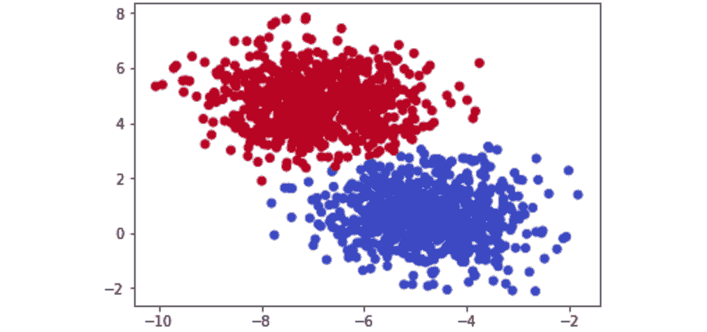
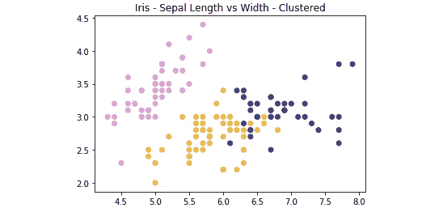

# 第一章：聚类简介

## 学习目标

到本章结束时，你将能够：

+   区分监督学习与无监督学习

+   解释聚类的概念

+   使用内建的 Python 包实现 k-means 聚类算法

+   计算数据的轮廓系数（Silhouette Score）

在本章中，我们将讨论聚类的概念。

## 引言

你是否曾经被要求查看一些数据，但最终一无所获？也许你不熟悉该数据集，或者甚至不知道从哪里开始。这可能非常令人沮丧，甚至会让你感到尴尬，尤其是当是别人让你处理这个任务时。

你不是孤单的，实际上，数据本身很多时候也过于混乱，难以理解。你可能正在模仿很多无监督算法的做法，试图从数据中找出意义。当你试图理解电子表格中的那些数字时，可能正是这些无监督算法在做的事情。现实中，很多真实世界中的数据集并没有任何规律或合理性，你将被要求在几乎没有背景准备的情况下分析它们。不过不用担心——本书将为你提供所需的知识，以便你在处理数据探索任务时不再感到沮丧。

在本书中，我们为你开发了一些最佳内容，帮助你理解无监督算法如何工作以及如何使用它们。我们将涵盖如何在数据中寻找聚类的基础知识，如何减少数据的规模以便更容易理解，以及无监督学习的各个方面如何应用于实际世界。希望你能够通过本书，深入理解无监督学习，了解它能解决的问题以及不能解决的问题。

感谢你的加入，祝你旅途愉快！

## 无监督学习与监督学习的区别

**无监督学习**是当前机器学习领域最令人兴奋的研究方向之一。如果你之前有研究过机器学习教材，可能已经熟悉过常见的监督学习和无监督学习问题的区分。**监督学习**包括使用带标签的数据集来进行分类（例如，在研究肺部健康数据集时预测吸烟者和非吸烟者）或拟合回归线（例如，根据房间数量预测房屋销售价格）。这种模型最接近人类直观的学习方法。

如果你想通过基本的烹饪知识来学习如何不把食物烧焦，你可以通过将食物放在炉子上并观察它烧焦所需的时间（输入），来构建一个数据集。最终，随着你不断地烧焦食物，你会建立一个关于何时会烧焦的心理模型，并避免将来再次发生。监督学习的发展曾经是快速而有价值的，但近年来已经逐渐平缓——许多了解数据的障碍已经被克服：


###### 图 1.1：无监督学习与监督学习的区别

相反，无监督学习涵盖了大量无标签数据的问题。在这种情况下，有标签的数据是指提供了“目标”结果的数据，你试图找出与提供的数据的相关性（例如，在之前的例子中你知道你在找的是食物是否被烧焦）。无标签数据是指你不知道“目标”结果是什么，只有提供的输入数据。

基于之前的例子，假设你被丢到了地球上，对烹饪一无所知。你得到了 100 天的时间、一台炉子和一冰箱，里面满是食物，但没有任何关于该做什么的指示。你对厨房的初步探索可能会有无数种方向——在第 10 天，你可能终于学会如何打开冰箱；在第 30 天，你可能会学到食物可以放在炉子上；而在许多天之后，你可能会不经意间做出一道可食用的餐点。正如你所看到的，试图在没有足够信息结构的厨房中找到意义，会导致产生非常嘈杂且与实际做饭完全无关的数据。

无监督学习可以成为解决这个问题的答案。通过回顾你 100 天的数据，**聚类**可以用来寻找在某些天生产了餐点的相似模式，这样你就可以轻松回顾那些日子里你做了什么。然而，无监督学习并不是一种神奇的答案——仅仅发现聚类同样可能帮助你找到一些相似但最终无用的数据。

这个挑战正是让无监督学习如此令人兴奋的原因。我们如何才能找到更聪明的技术，加速发现对最终目标有益的信息聚类的过程？

## 聚类

如果你想找出数据集中的潜在含义，能够找到其中相似数据的分组是非常有价值的。如果你是商店老板，并且想要了解哪些客户更有价值，但并没有一个明确的“有价值”标准，那么聚类将是一个很好的起点，帮助你在数据中找到模式。你可能有一些关于“有价值客户”高层次的想法，但在面对大量数据时，你并不完全确定。通过聚类，你可以找到数据中相似群体之间的共性。如果你更深入地研究一个相似的群体，可能会发现这个群体中的每个人在你的网站上停留的时间比其他人都长。这能帮助你识别出“价值”的标准，并为未来的监督学习实验提供清晰的样本数据。

### 识别聚类

下图展示了两个散点图：


###### 图 1.2：两个不同的散点图

下图将散点图分为两个不同的聚类：


###### 图 1.3：散点图清晰展示了在提供的数据集中存在的聚类

两个图都显示了从高斯分布中随机生成的数字对（x，y 坐标）。仅仅通过瞥一眼*图 1.2*，你就应该能清楚地看到数据中聚类的位置——但在现实生活中，永远不会这么简单。现在你知道数据可以清晰地分成两个聚类，你可以开始理解这两个群体之间的差异。

从无监督学习在更大范围的机器学习环境中的位置稍作回顾，让我们从理解聚类的基本构成开始。最基本的定义将聚类视为大型数据集的子集中的相似数据组。举个例子，假设你有一个房间，里面有 10 个人，每个人的职业要么是金融行业，要么是科学家。如果你让所有金融行业的人员站在一起，所有科学家也站到一起，那么你就实际上形成了基于职业类型的两个聚类。找到聚类在识别更相似的项时极具价值，而在规模的另一端，它也能帮助识别相互之间有很大差异的项。

### 二维数据

为了理解这一点，假设你的雇主给了你一个简单的包含 1,000 行数据的数据集，其中有两列数字数据，如下所示：


###### 图 1.4：NumPy 数组中的二维原始数据

初看之下，这个数据集没有提供任何实际的结构或理解——至少可以说是令人困惑的！

数据集中的**维度**是另一种简单的计数特征数量的方法。在大多数组织良好的数据表中，你可以通过查看列的数量来知道特征的数量。因此，使用一个大小为（1,000 x 2）的 1,000 行数据集，你将有 1,000 个观测值，涵盖两个维度：

你可以通过将第一列与第二列绘制出来，更好地了解数据的结构。会有很多时候，组间差异的原因看起来微不足道，但那些你能够采取行动的差异案例往往是非常有意义的！

### 练习 1：识别数据中的聚类

你将看到二维图形。请查看提供的二维图形并识别聚类，以强调机器学习的重要性。在不使用任何算法方法的情况下，识别数据中的聚类位置。

本练习将帮助你开始培养通过自身的眼睛和思维过程识别聚类的直觉。在完成这些练习时，思考一下为什么一组数据点应该被视为一个聚类，而另一组数据点不应该被视为聚类：

1.  识别以下散点图中的聚类：

    ###### 图 1.5 二维散点图

    聚类如下：

    

    ###### 图 1.6：散点图中的聚类

1.  识别散点图中的聚类：

    ###### 图 1.7：二维散点图

    聚类如下：

    

    ###### 图 1.8：散点图中的聚类

1.  识别散点图中的聚类：


###### 图 1.9：二维散点图

聚类如下：


###### 图 1.10：散点图中的聚类

这些例子大多数你可能很容易理解——这就是重点！人类的大脑和眼睛在发现现实世界中的模式方面非常出色。仅仅通过几毫秒的查看，你就能分辨出哪些数据是组合在一起的，哪些不是。虽然对你来说很容易，但计算机无法像我们一样查看和处理图表。然而，这并不总是坏事——回顾图 1.10，你能仅凭观察图表就找到数据中的六个离散聚类吗？你可能只找到了三个到四个聚类，而计算机可以看到所有六个。人类的大脑非常强大，但它也缺乏基于严格逻辑方法所能处理的细微差别。通过算法聚类，你将学习如何建立一个比人类在这些任务中表现更好的模型！

让我们在下一节中看看这个算法。

## k-means 聚类简介

希望到现在为止，你已经可以看到，在机器学习的工作流中，寻找聚类是非常有价值的。那么，如何实际找到这些聚类呢？其中一个最基础但最流行的方法是使用一种叫做 **k-means 聚类** 的聚类分析方法。k-means 通过在你的数据中寻找 K 个聚类，整个工作流程实际上非常直观——我们将从 k-means 的无数学介绍开始，随后进行 Python 实现。

### 无数学 k-means 解析

下面是 k-means 聚类的无数学算法：

1.  选择 K 个质心（K = 期望的不同聚类数量）。

1.  随机地将 K 个质心放置在你的现有训练数据中。

1.  计算每个质心到你训练数据中所有点的欧几里得距离。

1.  训练数据点会根据它们与质心的距离进行分组。

1.  在每个质心分组中的数据点中，计算均值数据点，并将质心移动到该位置。

1.  重复这个过程，直到收敛，或者每个组内的成员不再变化。

就这样！下面是一步步的过程，带有一个简单的聚类示例：


###### 图 1.11: 原始数据图，标注在 x,y 坐标上

在图 1.11 中给出的原始数据的基础上，我们可以通过展示每一步的预测聚类来显示 k-means 的迭代过程：


###### 图 1.12: 从左到右读取——红色点是随机初始化的质心，最接近的数据点被分配到各个质心的分组中

### k-means 聚类深度解析

为了更深入地理解 k-means，让我们再次走过介绍部分给出的示例，并加入一些支持 k-means 的数学内容。这里的关键组件是欧几里得距离公式：


###### 图 1.13: 欧几里得距离公式

质心在开始时随机设置为你 n 维空间中的点。每个质心作为 (a,b) 输入到前面的公式中，而你空间中的点作为 (x,y) 输入。计算每个点与每个质心坐标之间的距离，选择距离最短的质心作为该点所属的组。

该过程如下：

1.  随机质心：[ (2,5) , (8,3) , (4, 5) ]

1.  任意点 x: (0, 8)

1.  从点到每个质心的距离：[ 3.61, 9.43, 5.00 ]

1.  点 x 被分配给质心 1。

### 曼哈顿距离（替代距离度量）

欧几里得距离是许多机器学习应用中最常用的距离度量，通常被称为距离度量；然而，它并不是唯一的，也不是在每种情况下最好的距离度量。另一个在聚类中常用的距离度量是**曼哈顿距离**。

曼哈顿距离之所以如此命名，是因为该度量的直觉就像是你在一个大城市（比如纽约市）里开车，城市有许多方形街区。欧几里得距离依赖于对角线，因为它基于勾股定理，而曼哈顿距离则将距离限制为只有直角。曼哈顿距离的公式如下：


###### 图 1.14：曼哈顿距离公式

这里，是像欧几里得距离一样的向量。在我们之前关于欧几里得距离的例子中，我们希望找到两个点之间的距离，如果和，那么曼哈顿距离将等于。这个功能适用于任何维度。在实践中，曼哈顿距离可能在处理高维数据时表现得比欧几里得距离更好。

### 更深的维度

当数据只有二维时，前面的例子很容易可视化。这是为了方便，帮助说明 k-means 是如何工作的，但也可能会让你产生聚类很简单的误解。在许多应用中，你的数据可能会大得多，甚至大到无法通过可视化感知（超过三维的数据对于人类来说是无法感知的）。在前面的例子中，你可以通过心算一些二维线条来将数据分成不同的组。而在更高维度时，你将需要计算机的帮助，找到一个适合分隔数据集的 n 维超平面。在实践中，这就是像 k-means 这样的聚类方法能够提供巨大价值的地方。


###### 图 1.15：二维、三维和 n 维图

在接下来的练习中，我们将计算欧几里得距离。我们将使用`NumPy`和`Math`包。`NumPy`是一个用于 Python 的科学计算包，它将常见的数学函数以高度优化的格式进行预打包。通过使用像`NumPy`或`Math`这样的包，我们可以减少从头编写自定义数学函数所花费的时间，从而专注于开发我们的解决方案。

### 练习 2：在 Python 中计算欧几里得距离

在这个练习中，我们将创建一个示例点以及三个样本中心点，以帮助说明欧几里得距离是如何工作的。理解这个距离公式是我们进行聚类工作的基础。

在本次练习结束时，我们将能够从零开始实现欧几里得距离，并完全理解它在特征空间中对点的作用。

在本次练习中，我们将使用标准的 Python 内置 `math` 包。使用 `math` 包没有任何前提要求，并且它包含在所有 Python 的标准安装中。顾名思义，这个包非常有用，允许我们直接使用各种基本的数学构件，如指数、平方根等：

1.  打开 Jupyter Notebook，并创建一个天真的公式来计算欧几里得距离，具体如下：

    ```py
    import math
    import numpy as np
    def dist(a, b):
        return math.sqrt(math.pow(a[0]-b[0],2) + math.pow(a[1]-b[1],2))
    ```

    这种方法被认为是天真的，因为它对数据点执行逐元素计算（慢），相比之下，使用向量和矩阵运算的更实际实现能够显著提高性能。

1.  按如下方式在 Python 中创建数据点：

    ```py
    centroids = [ (2, 5), (8, 3), (4,5) ]
    x = (0, 8)
    ```

1.  使用你创建的公式，计算示例点与所提供的三个质心之间的欧几里得距离：

    ```py
    centroid_distances =[]
    for centroid in centroids:
        centroid_distances.append(dist(x,centroid))
    print(centroid_distances)
    print(np.argmin(centroid_distances))
    ```

    输出如下：

    ```py
    [3.605551275463989, 9.433981132056603, 5.0]
    0
    ```

    由于 Python 是零索引的，列表中质心距离的零位置向我们表明，示例点 x 将被分配给三个质心中的第一个。

这个过程会对数据集中的每个点重复，直到每个点都被分配到一个聚类。每分配一个点后，会计算每个聚类中所有点的平均点。计算这些点的平均值与计算单个整数的平均值相同。

现在，既然你已经通过欧几里得距离作为主要度量方法在数据中找到了聚类，回想一下你是如何在 *练习 2* 中轻松完成这一任务的，*在 Python 中计算欧几里得距离*。对于我们的人类思维来说，看到图中的点群并确定哪些点属于不同的聚类是非常直观的。然而，我们如何让一个天真的计算机重复这一任务呢？通过理解这个练习，你帮助计算机学习一种通过距离来形成聚类的方法。我们将在下一个练习中继续使用这些距离度量。

### 练习 3：通过距离的概念形成聚类

通过理解这个练习，你将帮助计算机学习通过距离来形成聚类的方法。我们将在本次练习中继续使用这些距离度量：

1.  存储分配给聚类一的点 [ (0,8), (3,8), (3,4) ]：

    ```py
    cluster_1_points =[ (0,8), (3,8), (3,4) ]
    ```

1.  计算所有点的平均点以找到新的质心：

    ```py
    mean =[ (0+3+3)/3, (8+8+4)/3 ]
    print(mean)
    ```

    输出如下：

    ```py
    [2.0, 6.666666666666667]
    ```

1.  在计算出新的质心后，您将重复在*练习 2*中看到的聚类成员计算，即*在 Python 中计算欧几里得距离*，然后再进行前两步来找到新的聚类质心。最终，新的聚类质心将与进入问题时的质心相同，练习也将完成。重复的次数取决于您正在聚类的数据。

一旦您将质心位置移动到新的均值点（2, 6.67），可以将其与您进入问题时输入的初始质心列表进行比较。如果新的均值点与当前列表中的质心不同，这意味着您需要再执行前两个练习的迭代。直到您计算出的新的均值点与您开始时的质心相同，您就完成了 k-means 的一次运行，并达到了称为**收敛**的点。

在下一个练习中，我们将从头实现 k-means。

### 练习 4：从头实现 k-means

在这个练习中，我们将研究从头实现 k-means。这个练习依赖于 scikit-learn，一个开源的 Python 包，它使得快速原型化流行的机器学习模型成为可能。在 scikit-learn 中，我们将使用 `datasets` 功能来创建一个合成的簇数据集。除了利用 scikit-learn 的强大功能外，我们还将依赖 Matplotlib，这是一个流行的 Python 绘图库，它使得我们可以轻松地可视化数据。为此，请执行以下步骤：

1.  导入必要的库：

    ```py
    from sklearn.datasets import make_blobs
    import matplotlib.pyplot as plt
    import numpy as np
    import math
    %matplotlib inline
    ```

1.  生成一个随机的聚类数据集进行实验，X = 坐标点，y = 聚类标签，并定义随机质心：

    ```py
    X, y = make_blobs(n_samples=1500, centers=3, 
                      n_features=2, random_state=800)
    centroids = [[-6,2],[3,-4],[-5,10]]
    ```

1.  打印数据：

    ```py
    X
    ```

    输出如下：

    ```py
    array([[-3.83458347,  6.09210705],
           [-4.62571831,  5.54296865],
           [-2.87807159, -7.48754592],
           ...,
            [-3.709726  , -7.77993633],
            [-8.44553266, -1.83519866],
            [-4.68308431,  6.91780744]])
    ```

1.  按如下方式绘制坐标点：

    ```py
    plt.scatter(X[:, 0], X[:, 1], s=50, cmap='tab20b')
    plt.show()
    ```

    绘图如下所示：

    

    ###### 图 1.16：坐标点的绘图

1.  打印 `y` 数组：

    ```py
    y
    ```

    输出如下：

    ```py
    array([2, 2, 1, ..., 1, 0, 2])
    ```

1.  按照正确的聚类标签绘制坐标点：

    ```py
    plt.scatter(X[:, 0], X[:, 1], c=y,s=50, cmap='tab20b')
    plt.show()
    ```

    绘图如下所示：


###### 图 1.17：带有正确聚类标签的坐标点绘图

### 练习 5：实现带优化的 k-means

让我们自己重新创建这些结果！我们将通过一个例子来实现这个过程，并进行一些优化。这个练习是在前一个练习的基础上构建的，应在同一个 Jupyter notebook 中进行。对于这个练习，我们将依赖 SciPy，一个 Python 包，它提供了对高效版本科学计算的便捷访问。特别是，我们将使用 `cdist` 实现欧几里得距离，该函数的功能以更高效的方式复制了我们距离度量的基本实现：

1.  欧几里得距离的非向量化实现如下：

    ```py
    def dist(a, b):
        return math.sqrt(math.pow(a[0]-b[0],2) + math.pow(a[1]-b[1],2))
    ```

1.  现在，实现优化的欧几里得距离：

    ```py
    from scipy.spatial.distance import cdist
    ```

1.  存储 X 的值：

    ```py
    X[105:110]
    ```

    输出如下：

    ```py
    array([[-3.09897933,  4.79407445],
           [-3.37295914, -7.36901393],
            [-3.372895  ,  5.10433846],
            [-5.90267987, -3.28352194],
            [-3.52067739,  7.7841276 ]])
    ```

1.  计算距离并选择最短距离的索引作为一个聚类：

    ```py
    for x in X[105:110]:
        calcs = []
        for c in centroids:
            calcs.append(dist(x, c))
        print(calcs, "Cluster Membership: ", np.argmin(calcs, axis=0))
    ```

1.  定义`k_means`函数如下，并随机初始化 k 个质心。使用`while`循环重复该过程，直到新旧`centroids`之间的差值为`0`：

    ```py
    def k_means(X, K):
        # Keep track of history so you can see k-means in action
        centroids_history = []
        labels_history = []
        rand_index = np.random.choice(X.shape[0], K)  
        centroids = X[rand_index]
        centroids_history.append(centroids)
        while True:
    # Euclidean distances are calculated for each point relative to
    # centroids, and then np.argmin returns the index location of the
    # minimal distance - which cluster a point is assigned to
            labels = np.argmin(cdist(X, centroids), axis=1)
            labels_history.append(labels)
        # Take mean of points within clusters to find new centroids
            new_centroids = np.array([X[labels == i].mean(axis=0) 
                                      for i in range(K)])
            centroids_history.append(new_centroids)

    # If old centroids and new centroids no longer change, k-means is
    # complete and end. Otherwise continue
            if np.all(centroids == new_centroids):
                break
            centroids = new_centroids

        return centroids, labels, centroids_history, labels_history
    centers, labels, centers_hist, labels_hist = k_means(X, 3)
    ```

    #### 注意

    请不要破坏这段代码，因为这样可能会导致错误。

1.  将中心的历史步骤及其标签压缩在一起：

    ```py
    for x, y in history:
        plt.figure(figsize=(4,3))
        plt.scatter(X[:, 0], X[:, 1], c=y, s=50, cmap='tab20b');
        plt.scatter(x[:, 0], x[:, 1], c='red')
        plt.show()
    ```

    第一张图如下所示：


###### 图 1.18：第一次散点图

第二张图如下所示：


###### 图 1.19：第二次散点图

第三张图如下所示：


###### 图 1.20：第三次散点图

正如你在上面的图中看到的，K-means 采用迭代方法，通过距离不断精细化最佳聚类。该算法从随机初始化开始，根据数据的复杂性，迅速找到最合理的分隔。

### 聚类性能：轮廓分数

理解无监督学习方法的性能本质上比监督学习方法要困难得多，因为通常没有明确的“最佳”解决方案。对于监督学习，有许多可靠的性能指标——其中最直接的指标就是通过将模型预测标签与实际标签进行比较，并查看模型预测正确的数量来衡量准确度。不幸的是，对于聚类，我们没有标签可以依赖，需要建立对聚类“差异”的理解。我们通过轮廓分数（Silhouette Score）指标来实现这一点。这个方法的固有特性是，我们还可以使用轮廓分数来寻找无监督学习方法的最佳“K”聚类数量。

轮廓分数指标通过分析一个点在其聚类中的适配程度来工作。该指标的范围是从-1 到 1——如果你在聚类中计算的平均轮廓分数为 1，那么你将达成完美的聚类，且不会有任何混淆，知道哪个点属于哪个聚类。如果你想象我们上一个练习中的散点图，轮廓分数会接近 1，因为聚类之间的“球”非常紧凑，并且每个“球”之间有明显的距离。不过这种情况非常罕见——轮廓分数应视为尽力而为的结果，因为获得 1 的可能性极低。

从数学上讲，轮廓分数的计算通过简化的轮廓指数（SSI）非常简单，如下所示：，其中  是点 *i* 到其所在聚类质心的距离， 是点 *i* 到最近的聚类质心的距离。

这里捕捉到的直觉是，表示点*i*的簇作为一个明确簇的凝聚度，表示簇之间的距离。我们将使用 scikit-learn 中`silhouette_score`的优化实现来完成*活动 1*，*实现 k-means 聚类*。使用它非常简单，只需传入特征数组和从 k-means 聚类方法中预测的簇标签。

在下一个练习中，我们将使用 pandas 库来读取 CSV。Pandas 是一个 Python 库，通过使用 DataFrame 使得数据处理变得更容易。要在 Python 中读取数据，你可以使用`variable_name = pd.read_csv('file_name.csv', header=None)`。

### 练习 6：计算轮廓系数

在这个练习中，我们将学习如何计算一个数据集的轮廓系数（Silhouette Score），并且该数据集有一个固定数量的簇。为此，我们将使用 Iris 数据集，数据集可以在[`github.com/TrainingByPackt/Unsupervised-Learning-with-Python/tree/master/Lesson01/Exercise06`](https://github.com/TrainingByPackt/Unsupervised-Learning-with-Python/tree/master/Lesson01/Exercise06)找到。

#### 注意

这个数据集是从[`archive.ics.uci.edu/ml/machine-learning-databases/iris/iris.data`](https://archive.ics.uci.edu/ml/machine-learning-databases/iris/iris.data)下载的，可以通过[`github.com/TrainingByPackt/Unsupervised-Learning-with-Python/tree/master/Lesson01/Exercise06`](https://github.com/TrainingByPackt/Unsupervised-Learning-with-Python/tree/master/Lesson01/Exercise06)访问。

1.  使用 pandas 加载 Iris 数据文件，pandas 是一个通过使用 DataFrame 使数据处理变得更加容易的库：

    ```py
    import pandas as pd
    import numpy as np
    import matplotlib.pyplot as plt
    from sklearn.metrics import silhouette_score
    from scipy.spatial.distance import cdist
    iris = pd.read_csv('iris_data.csv', header=None)
    iris.columns = ['SepalLengthCm', 'SepalWidthCm', 'PetalLengthCm', 'PetalWidthCm', 'species']
    ```

1.  分离`X`特征，因为我们希望将其视为无监督学习问题：

    ```py
    X = iris[['SepalLengthCm', 'SepalWidthCm', 'PetalLengthCm', 'PetalWidthCm']]
    ```

1.  引入我们之前做的`k_means`函数作为参考：

    ```py
    def k_means(X, K):
    #Keep track of history so you can see k-means in action
        centroids_history = []
        labels_history = []
        rand_index = np.random.choice(X.shape[0], K)
        centroids = X[rand_index]
        centroids_history.append(centroids)
        while True:
    # Euclidean distances are calculated for each point relative to
    # centroids, #and then np.argmin returns
    # the index location of the minimal distance - which cluster a point
    # is #assigned to
            labels = np.argmin(cdist(X, centroids), axis=1)
            labels_history.append(labels)
    #Take mean of points within clusters to find new centroids:
            new_centroids = np.array([X[labels == i].mean(axis=0)
                                      for i in range(K)])
            centroids_history.append(new_centroids)

    # If old centroids and new centroids no longer change, k-means is
    # complete and end. Otherwise continue
            if np.all(centroids == new_centroids):
                break
            centroids = new_centroids

        return centroids, labels, centroids_history, labels_history
    ```

1.  将我们的 Iris `X`特征 DataFrame 转换为`NumPy`矩阵：

    ```py
    X_mat = X.values
    ```

1.  在 Iris 矩阵上运行我们的`k_means`函数：

    ```py
    centroids, labels, centroids_history, labels_history = k_means(X_mat, 3)
    ```

1.  计算`PetalLengthCm`和`PetalWidthCm`列的轮廓系数（Silhouette Score）：

    ```py
    silhouette_score(X[['PetalLengthCm','PetalWidthCm']], labels)
    ```

    输出结果类似于：

    ```py
    0.6214938502379446
    ```

在这个练习中，我们计算了 Iris 数据集的`PetalLengthCm`和`PetalWidthCm`列的轮廓系数。

### 活动 1：实现 k-means 聚类

**情景**：在面试中，你被要求从零实现一个 k-means 聚类算法，以证明你理解其工作原理。我们将使用 UCI ML 库提供的 Iris 数据集。Iris 数据集是数据科学界的经典，具有用于预测鸢尾花物种的特征。下载链接将在后面的活动中提供。

对于这个活动，你可以使用 Matplotlib、NumPy、scikit-learn 指标和 pandas。

通过轻松加载和重塑数据，你可以更多地专注于学习 k-means，而不是编写数据加载器功能。

Iris 数据列如下所示，供参考：

```py
['SepalLengthCm', 'SepalWidthCm', 'PetalLengthCm', 'PetalWidthCm', 'species']
```

**目标**：要真正理解某个事物如何运作，您需要从头开始构建它。将您在前面的章节中学到的知识付诸实践，并在 Python 中从零开始实现 k-means。

请打开您最喜欢的编辑平台并尝试以下内容：

1.  使用`NumPy`或`math`包及欧几里得距离公式，编写一个计算两个坐标之间距离的函数。

1.  编写一个函数，计算数据集中每个点到质心的距离，并返回簇的成员身份。

1.  编写一个 k-means 函数，接受一个数据集和簇的数量(K)，并返回最终的聚类质心以及构成该聚类的成员数据点。在从零开始实现 k-means 后，将您的自定义算法应用到鸢尾花数据集，数据集位置如下：[`github.com/TrainingByPackt/Unsupervised-Learning-with-Python/tree/master/Lesson01/Activity01`](https://github.com/TrainingByPackt/Unsupervised-Learning-with-Python/tree/master/Lesson01/Activity01)。

    #### 注意

    这个数据集是从[`archive.ics.uci.edu/ml/machine-learning-databases/iris/iris.data`](https://archive.ics.uci.edu/ml/machine-learning-databases/iris/iris.data)下载的。可以在[`github.com/TrainingByPackt/Unsupervised-Learning-with-Python/tree/master/Lesson01/Activity01`](https://github.com/TrainingByPackt/Unsupervised-Learning-with-Python/tree/master/Lesson01/Activity01)访问。

    UCI 机器学习库 [[`archive.ics.uci.edu/ml`](http://archive.ics.uci.edu/ml)]。加利福尼亚州欧文市：加利福尼亚大学信息与计算机科学学院。

1.  移除此数据集中提供的类别，看看您的 k-means 算法能否仅根据植物特征将不同的鸢尾花物种分到正确的组别！

1.  使用 scikit-learn 实现计算轮廓系数。

结果：通过完成这个练习，您将获得调优 k-means 聚类算法以适应真实世界数据集的实践经验。鸢尾花数据集被视为数据科学领域经典的“hello world”问题，适合用于测试基础技术。您的最终聚类算法应该能够较好地找到数据中存在的三类鸢尾花物种，具体如下：



###### 图 1.21：鸢尾花物种的三类聚类期望图

#### 注意

此活动的解决方案可以在第 306 页找到。

## 总结

在本章中，我们探讨了聚类的定义以及它在各种数据挑战中的重要性。基于这一聚类知识的基础，您实现了 k 均值算法，这是一种最简单但也最流行的无监督学习方法之一。如果您能够在这里总结并能够逐步向您的同学解释 k 均值算法的操作步骤，那么干得漂亮！如果不能，请返回并复习之前的材料——从这里开始，内容将变得更加复杂。接下来，我们将转向层次聚类，其中的一种配置重复使用了我们在 k 均值中使用的质心学习方法。在下一章中，我们将进一步阐述其他聚类方法和方法。
