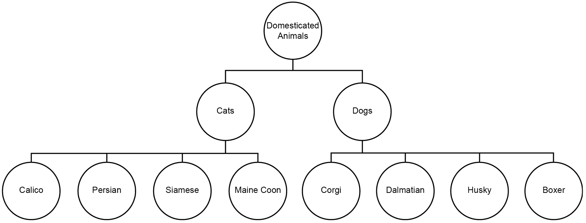
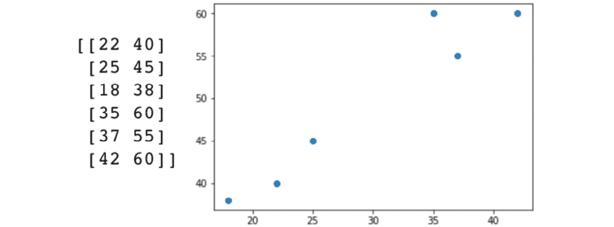
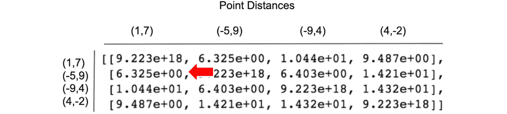

# 第二章：层次聚类

## 学习目标

到本章结束时，你将能够：

+   从头开始实现层次聚类算法，使用软件包

+   执行聚合聚类

+   比较 k-means 和层次聚类

在这一章中，我们将使用层次聚类来构建更强的分组，这些分组在逻辑上更合理。

## 介绍

在这一章中，我们将在*第一章*《聚类介绍》中构建的基本思想基础上扩展，通过将聚类与相似性的概念结合起来。我们将再次实现欧几里得距离的各种形式来捕捉相似性这一概念。需要记住的是，欧几里得距离只是最流行的距离度量之一，而不是唯一的度量！通过这些距离度量，我们将通过引入层次结构的概念，扩展我们在上一章中探索的简单邻居计算。通过使用层次结构传递聚类信息，我们可以构建出更强的、在逻辑上更合理的分组。

## 聚类复习

*第一章*《聚类介绍》涵盖了最基础聚类算法之一：k-means 的高层次直觉和深入细节。虽然这确实是一种简单的方法，但不要小看它；它将是你继续探索无监督学习世界时，工具箱中的一个宝贵补充。在许多实际应用场景中，公司通过最简单的方法，比如 k-means 或线性回归（监督学习）取得了突破性的发现。作为复习，我们快速回顾一下什么是聚类以及 k-means 如何找到它们：


](img/C12626_02_01.jpg)

###### 图 2.1：区分监督学习和无监督学习问题的属性

如果你被给了一组没有任何指导的随机数据，你可能会开始使用基本统计方法进行探索——例如，求出每个特征的均值、中位数和众数。记住，从一个简单存在的高层次数据模型来看，是否是监督学习或无监督学习是由你为自己设定的目标或由经理设定的目标决定的。如果你确定其中一个特征实际上是标签，并且你想查看数据集中其余特征对它的影响，那么这将成为一个监督学习问题。然而，如果在初步探索后你意识到你所拥有的数据实际上只是没有目标的特征集合（例如一组健康指标、网店的购买发票等），那么你可以通过无监督方法来分析它。

无监督学习的一个经典例子是在来自网店发票的集合中找到相似客户的簇。您的假设是通过了解哪些人最相似，您可以创建更细粒度的营销活动，以迎合每个簇的兴趣。实现这些相似用户簇的一种方式是通过 k-means。

### k-means 刷新

k-means 聚类是通过在您的数据中找到“k”个簇来工作，通过成对的欧氏距离计算。“K”点（也称为质心）在您的数据中随机初始化，并且计算每个数据点到每个质心的距离。这些距离的最小值指定了数据点属于哪个簇。一旦每个点都被分配到一个簇中，就会计算出簇内数据点的平均值作为新的质心。这个过程重复进行，直到新计算出的簇质心不再改变位置。

## 层次结构的组织

自然界和人造世界都包含许多将系统组织成层次结构的例子，大多数情况下这是很有道理的。从这些层次结构中开发出的常见表示可以在基于树的数据结构中看到。想象一下，你有一个父节点和任意数量的子节点，这些子节点随后可以成为自己的父节点。通过将概念组织成树形结构，您可以构建一个信息密集的图表，清晰地显示事物与其同行及其更大抽象概念的关系。

一个帮助说明这一概念的自然界的例子可以在如何看待动物的层次结构中看到，这些层次结构从父类到个体物种：



###### 图 2.2: 在层次树结构中导航动物物种的关系

在图 2.2 中，您可以看到动物品种之间关系信息的一个示例，以一种既节省空间又传递大量信息的方式进行映射。这个例子可以看作是其自身的一棵树（显示猫和狗如何不同但都是驯养动物），也可以看作是一个更大树的一部分，显示驯养与非驯养动物的分解。

假设大多数人不是生物学家，让我们回到一个销售产品的网店的概念。如果你销售多种产品，那么你可能希望为客户创建一个层次化的导航系统。通过仅展示产品目录中的所有信息，客户将只暴露于与其兴趣相匹配的树路径。层次化导航的好处的一个示例可以在图 2.3 中看到：


###### 图 2.3：在层次树结构中导航产品类别

显然，层级导航系统的优势在改善客户体验方面是无法过分强调的。通过将信息组织成层级结构，你可以从数据中构建一个直观的结构，展示明确的嵌套关系。如果这听起来像是另一种在数据中寻找聚类的方法，那么你绝对走在正确的轨道上！通过使用类似欧氏距离这样的距离度量方法（如 k-means 中的欧氏距离），我们可以开发出一棵树，展示数据的许多切割点，允许用户根据需要主观地创建聚类。

## 分层聚类简介

直到这一点为止，我们已经展示了层级结构可以作为一个很好的组织信息的方式，清晰地展示了数据点之间的嵌套关系。虽然这在理解项目之间的父子关系时非常有帮助，但在形成聚类时也非常有用。以前一节的动物示例为扩展，假设你仅仅获得了两种动物的特征：它们的身高（从鼻尖到尾端的长度）和体重。利用这些信息，你需要重新构建相同的结构，以便识别数据集中哪些记录对应于狗或猫，并区分它们的亚种。

由于你仅仅获得了动物的身高和体重信息，你无法推断出每个物种的具体名称。然而，通过分析你所得到的特征，你可以在数据中构建一个结构，用以近似表示数据中存在的动物物种。这为无监督学习问题提供了一个理想的背景，而分层聚类则是一个非常适合解决该问题的方法。在下面的图表中，你将看到我们在左侧创建的两个特征：左栏是动物的身高，右栏是动物的体重。接着，这些数据被绘制在一个二维坐标图上，身高为 x 轴，体重为 y 轴：



###### 图 2.4：一个包含动物身高和体重的二维特征数据集示例

一种进行分层聚类的方法是从每个数据点作为其自身的聚类开始，并递归地将相似的点结合在一起形成聚类——这被称为**凝聚**型分层聚类。我们将在后面的章节中详细介绍不同的分层聚类方法。

在凝聚型层次聚类方法中，数据点相似性的概念可以在我们在 k-means 中看到的范式下进行思考。在 k-means 中，我们使用欧几里得距离来计算个体点到预期“k”簇的质心之间的距离。对于这种层次聚类方法，我们将重新使用相同的距离度量来确定数据集中记录之间的相似性。

最终，通过递归地将数据中每个记录与其最相似的记录进行组合，您会从底部构建一个层次结构。所有单成员簇将汇聚成一个顶层簇，形成层次结构的最上层。

### 执行层次聚类的步骤

为了理解凝聚型层次聚类的工作原理，我们可以通过一个简单的示例程序追踪它如何合并并形成一个层次结构：

1.  给定 n 个样本数据点，将每个点视为一个单独的“簇”，其成员仅为该点。

1.  计算所有簇的质心之间的成对欧几里得距离。

1.  将最接近的点对聚集在一起。

1.  重复*步骤 2* 和 *步骤 3*，直到您得到一个包含所有数据的单一簇。

1.  绘制一个树状图，显示您的数据如何以层次结构的形式汇聚在一起。树状图只是用来表示树形结构的图表，展示簇从上到下的排列。

1.  决定要在哪个层级创建簇。

### 分层聚类的示例演示

尽管比 k-means 稍微复杂一些，层次聚类在逻辑上并没有太大变化。以下是一个简单的示例，通过稍微详细的步骤演示前述过程：

1.  给定四个样本数据点的列表，将每个点视为一个质心，该质心也是它自身的簇，点的索引为 0 到 3：

    簇（4）：[ (1,7) ], [ (-5,9) ], [ (-9,4) ] , [ (4, -2) ]

    质心（4）：[ (1,7) ], [ (-5,9) ], [ (-9,4) ] , [ (4, -2) ]

1.  计算所有簇的质心之间的成对欧几里得距离。在下图显示的矩阵中，点的索引在水平方向和垂直方向上都介于 0 和 3 之间，表示各自点之间的距离。沿对角线的值极高，以确保我们不会将一个点选为其自身的邻居（因为它在技术上是“最接近”的点）。请注意，这些值在对角线两侧是对称的：

    ###### 图 2.5：距离数组

1.  将最接近的点对聚集在一起。

    在这种情况下，点[1,7]和[-5,9]由于最接近而合并成一个簇，其余两个点则保持为单成员簇：

    

    ###### 图 2.6：距离数组

    这里是最终得到的三个簇：

    ```py
    [ [1,7], [-5,9] ]
    [-9,4]
    [4,-2] 
    ```

1.  计算两个成员簇的质心，如下所示：

    ```py
    mean([ [1,7], [-5,9] ]) = [-2,8]
    ```

1.  将聚类中心添加到两个单一成员的聚类中心，并重新计算距离。

    聚类 (3):

    ```py
    [ [1,7], [-5,9] ]
    [-9,4]
    [4,-2] 
    ```

    聚类中心 (3):

    ```py
    [-2,8]
    [-9,4]
    [4,-2]
    ```

    输出将类似于以下图示，最短距离通过红色箭头标示：

    

    ###### 图 2.7：距离数组

1.  由于它具有最短的距离，点[-9,4]被添加到聚类 1：

    聚类 (2):

    ```py
    [ [1,7], [-5,9], [-9,4] ]
    [4,-2] 
    ```

1.  由于只有点(4,-2)与其邻近点的距离最远，你可以将它添加到聚类 1，从而统一所有聚类：

    聚类 (1):

    ```py
    [ [ [1,7], [-5,9], [-9,4], [4,-2] ] ]
    ```

1.  绘制树状图以展示点与聚类之间的关系：


###### 图 2.8：展示点与聚类之间关系的树状图

在这个过程的最后，你可以通过树状图可视化你创建的层次结构。这个图展示了数据点的相似性，看起来与我们之前讨论的层次树状结构相似。一旦你拥有了这个树状图结构，你可以解释数据点之间的关系，并主观决定聚类应存在于哪个“层级”。

回顾之前涉及狗和猫物种的动物分类示例，假设你面临以下树状图：


###### 图 2.9：一个动物分类的树状图

层次聚类和树状图的优点在于，你可以看到所有可能的聚类拆分。如果你只对将物种数据集分为狗和猫感兴趣，你可以在分组的第一级停止聚类。然而，如果你想将所有物种分为家养动物和非家养动物，你可以在第二级停止聚类。

### 练习 7：构建层次结构

让我们尝试在 Python 中实现前述的层次聚类方法。通过为直觉打下框架，现在我们可以探索如何使用`SciPy`提供的辅助函数构建层次聚类。这个练习使用了`SciPy`，这是一个开源库，提供了许多有助于科学和技术计算的函数；例如，它简化了线性代数和微积分相关方法的实现。除了`SciPy`，我们还将使用 Matplotlib 来完成这个练习：

1.  生成如下虚拟数据：

    ```py
    from scipy.cluster.hierarchy import linkage, dendrogram, fcluster
    from sklearn.datasets import make_blobs
    import matplotlib.pyplot as plt
    %matplotlib inline
    # Generate a random cluster dataset to experiment on. X = coordinate points, y = cluster labels (not needed)
    X, y = make_blobs(n_samples=1000, centers=8, n_features=2, random_state=800)
    ```

1.  可视化数据如下：

    ```py
    plt.scatter(X[:,0], X[:,1])
    plt.show()
    ```

    输出结果如下：

    

    ###### 图 2.10：虚拟数据的绘图

    在绘制这个简单的示例数据之后，应该很清楚我们的虚拟数据包含了八个聚类。

1.  我们可以通过内置的`SciPy`包轻松生成距离矩阵，使用'`linkage`'：

    ```py
    # Generate distance matrix with 'linkage' function
    distances = linkage(X, method="centroid", metric="euclidean")
    print(distances)
    ```

    输出结果如下：

    

    ###### 图 2.11：距离的矩阵

    在第一种情况中，你可以看到，定制超参数确实会影响找到理想链接矩阵的性能。如果你回顾我们之前的步骤，链接的工作原理是通过计算每个数据点之间的距离来完成的。在 `linkage` 函数中，我们可以选择度量标准和方法（稍后我们会详细讲解）。

1.  在我们确定了链接矩阵后，可以轻松地将其传递给 `SciPy` 提供的树状图函数：

    ```py
    dn = dendrogram(distances)
    plt.show()
    ```

    输出如下：

    

    ###### 图 2.12：距离的树状图

    这个图将帮助我们更好地理解数据的潜在分组情况。

1.  使用这些信息，我们可以通过使用 `SciPy` 的 `fcluster` 函数来完成我们的层次聚类练习。公式中的数字 `3` 在这里表示

1.  以下示例表示你将设置的最大簇间距离阈值超参数。这个超参数可以根据你所使用的数据集进行调整；然而，对于本次练习，它的默认值为 `3`：

    ```py
    scipy_clusters = fcluster(distances, 3, criterion="distance")
    plt.scatter(X[:,0], X[:,1], c=scipy_clusters)
    plt.show()
    ```

    输出如下：


###### 图 2.13：距离的散点图

只需调用 `SciPy` 提供的几个辅助函数，你就可以轻松地在几行代码中实现聚合聚类。尽管 `SciPy` 在许多中间步骤中提供了帮助，但这个例子仍然稍显冗长，可能不是你在日常工作中会遇到的情况。我们将在稍后的部分介绍更加简洁的实现方式。

## 链接

在*练习 7*，*构建层次结构*中，你使用了被称为**质心链接**的层次聚类方法。链接是指确定如何计算簇间距离的概念，这取决于你所面临的问题类型。选择质心链接是因为它本质上与我们在 k-means 中使用的新的质心搜索方法相似。然而，在将数据点聚类时，这并不是唯一的选择。另两种常见的用于计算簇间距离的方法是单链接和完全链接。

**单链接**通过找到两个簇之间一对点的最小距离来确定链接标准。简单来说，它通过基于两簇之间最接近的点来合并簇。数学表达式如下：

dist(a,b) = min( dist( a[i]), b[j] ) )

**完全链接**与单链接相反，它通过找到两个簇之间一对点的最大距离来确定链接标准。简单来说，它通过基于两簇之间最远的点来合并簇。数学表达式如下：

dist(a,b) = max( dist( a[i]), b[j] ) )

确定哪种连接标准最适合你的问题既是艺术也是科学，并且极大依赖于你特定的数据集。选择单一连接的一种原因是你的数据在邻近点上非常相似，因此，当存在差异时，这些数据就会表现出极大的不同。由于单一连接通过找到最接近的点来工作，因此它不会受到这些远离点的影响。相反，如果你的数据在类间较远，但类内相对密集，那么完全连接可能是一个更好的选择。质心连接有类似的优点，但如果数据非常嘈杂且聚类的“中心”不明确，它可能会失效。通常，最好的方法是尝试几种不同的连接标准选项，看看哪种最符合你的数据，并与目标最相关。

### 活动 2：应用连接标准

回想一下我们在上一练习中生成的八个聚类的虚拟数据。在现实世界中，你可能会获得类似的实际数据，这些数据表现得像离散的高斯“团块”。假设这些虚拟数据代表了某个特定商店中不同的顾客群体。商店经理要求你分析顾客数据，将顾客分类成不同的群体，以便根据每个群体的特点定制营销材料。

使用在上一练习中已经生成的数据，或生成新数据，你将分析哪些连接方式最适合将顾客分为不同的群体。

一旦你生成了数据，使用 SciPy 提供的文档来查看`linkage`函数中可用的连接类型。然后，通过将它们应用到你的数据中来评估这些连接类型。你应该测试的连接类型在以下列表中：

```py
['centroid', 'single', 'complete', 'average', 'weighted']
```

完成这个活动后，你将理解连接标准——了解它对于你的层次聚类效果至关重要。目标是理解连接标准在不同数据集中的作用，以及它如何将一个无效的聚类转变为一个有效的聚类。

你可能会发现我们没有涵盖所有之前提到的连接类型——这项活动的关键部分是学习如何解析包提供的文档字符串，以探索它们的所有功能。

以下是完成此活动所需的步骤：

1.  可视化我们在*练习 7*中创建的数据集，*构建层次结构*。

1.  创建一个包含所有可能连接方法超参数的列表。

1.  遍历你刚刚创建的列表中的每个方法，并展示它们对相同数据集的影响。

你应该为每种连接方式生成一个图表，并利用这些图表评论哪种连接方式最适合该数据。

你将生成的图表应该类似于下图所示：


###### 图 2.14：所有方法的预期散点图

#### 注意

这个活动的解决方案在第 310 页。

## 聚合式与分裂式聚类

迄今为止，我们的层次聚类实例都是聚合式的——也就是说，它们是从下往上构建的。虽然这种方法通常是这种类型聚类中最常见的做法，但重要的是要知道，它并不是创建层次结构的唯一方式。相反的层次方法，即从上往下构建，也可以用于创建分类法。这个方法叫做**分裂式**层次聚类，它的工作原理是将数据集中所有的数据点放在一个大的聚类中。分裂式方法的许多内部机制与聚合式方法非常相似：


](img/C12626_02_15.jpg)

###### 图 2.15：聚合式与分裂式层次聚类

与大多数无监督学习中的问题一样，选择最佳方法通常高度依赖于你所面临的具体问题。

想象一下，你是一位刚刚购买了一家新杂货店的企业家，需要为商店进货。你收到了一个装满食物和饮料的大货柜，但你已经丢失了所有的货物信息！为了最有效地销售商品，你必须将类似的商品分组（如果你把所有东西随机摆放到货架上，商店将会是一团糟）。为了解决这个组织问题，你可以采取自下而上或自上而下的方法。从自下而上的角度，你会将整个运输容器视为杂乱无章——然后，你会拿起一个随机的物品，并找到它最相似的商品。例如，你可能会拿起苹果汁，意识到将它与橙汁放在一起是合理的。采用自上而下的方法，你会将所有物品视为一个大组。然后，你会遍历库存，并根据最大差异将这些组拆分开来。例如，你最初可能会认为苹果汁和豆腐是搭配的，但仔细想想，它们实际上非常不同。因此，你会把它们分成更小、不相似的组。

一般来说，帮助理解聚合方法是自下而上的方式，而分裂方法是自上而下的方式——但它们在性能上如何权衡呢？由于聚合方法的贪婪性质，它可能会被局部邻居所迷惑，无法看到任何时候形成的聚类的更大意义。另一方面，分裂方法的好处在于，它从一开始就能看到整个数据分布，并选择最佳的方式来拆分聚类。了解整个数据集的分布有助于潜在地创建更准确的聚类，这一点不容忽视。不幸的是，通常情况下，顶层的分裂方法会以更深的复杂度来交换更高的准确度。在实际应用中，聚合方法通常能正常工作，并且在层次聚类中应该是优先的起始点。如果在检查层次结构后，你对结果不满意，可以考虑使用分裂方法。

### 练习 8：使用 scikit-learn 实现聚合层次聚类

在大多数实际应用中，你可能会发现自己在使用一个将所有内容抽象化的包来实现层次聚类，比如 scikit-learn。Scikit-learn 是一个免费且不可或缺的 Python 机器学习包。它便捷地提供了许多流行算法的高度优化版本，如回归、分类和聚类等。通过使用像 scikit-learn 这样的优化包，你的工作变得更加轻松。然而，只有在你完全理解了前面章节中层次聚类的工作原理后，才应使用它。以下练习将比较两种形成聚类的潜在方法——使用 SciPy 和 scikit-learn。通过完成这个练习，你将了解它们各自的优缺点，以及从用户角度看，哪种方法最适合你：

1.  Scikit-learn 使得实现变得非常简单，只需几行代码：

    ```py
    from sklearn.cluster import AgglomerativeClustering
    from sklearn.datasets import make_blobs
    import matplotlib.pyplot as plt
    from scipy.cluster.hierarchy import linkage, dendrogram, fcluster
    ac = AgglomerativeClustering(n_clusters = 8, affinity="euclidean", linkage="average")
    X, y = make_blobs(n_samples=1000, centers=8, n_features=2, random_state=800)
    distances = linkage(X, method="centroid", metric="euclidean")
    sklearn_clusters = ac.fit_predict(X)
    scipy_clusters = fcluster(distances, 3, criterion="distance")
    ```

    首先，我们通过传入我们熟悉的参数，如 `affinity`（距离函数）和 `linkage`（如同我们在*活动 2*中所做的那样，探索你的选项，*实现连接准则*），将模型分配给 `ac` 变量。

1.  在实例化模型到变量后，我们可以简单地传入我们感兴趣的数据集，并使用 `.fit_predict()` 来确定聚类的归属，并将结果分配给另一个变量。

1.  然后，我们可以通过绘图比较每种方法的最终聚类结果，看看 scikit-learn 方法的聚类：

    ```py
    plt.figure(figsize=(6,4))
    plt.title("Clusters from Sci-Kit Learn Approach")
    plt.scatter(X[:, 0], X[:, 1], c = sklearn_clusters ,s=50, cmap='tab20b')
    plt.show()
    ```

    以下是 scikit-learn 方法聚类的输出：

    

###### 图 2.16：Scikit-Learn 方法的图示

看看 SciPy 学习方法的聚类：

```py
plt.figure(figsize=(6,4))
plt.title("Clusters from SciPy Approach")
plt.scatter(X[:, 0], X[:, 1], c = scipy_clusters ,s=50, cmap='tab20b')
plt.show()
```

输出如下：


###### 图 2.17：SciPy 方法的图示

正如你在我们的示例问题中看到的，两个方法最终收敛到了基本相同的聚类。虽然从玩具问题的角度来看这很好，但你很快会在下一个活动中学到，输入参数的微小变化可能会导致完全不同的结果！

### 活动 3：比较 k-means 和层次聚类

你正在管理一家商店的库存，并收到一大批葡萄酒，但在运输过程中瓶上的品牌标签掉了。幸运的是，供应商提供了每瓶酒的化学成分数据及其对应的序列号。不幸的是，你不能打开每一瓶酒进行品尝测试，你必须找到一种方法，根据化学成分将未标记的瓶子重新分组！你知道从订单列表中，自己订购了三种不同类型的葡萄酒，并且只给出了两种葡萄酒属性来将它们重新分组。在这个活动中，我们将使用葡萄酒数据集。

#### 注意

葡萄酒数据集可以从 [`archive.ics.uci.edu/ml/machine-learning-databases/wine/`](https://archive.ics.uci.edu/ml/machine-learning-databases/wine/) 下载。也可以通过 [`github.com/TrainingByPackt/Applied-Unsupervised-Learning-with-Python/tree/master/Lesson02/Activity03`](https://github.com/TrainingByPackt/Applied-Unsupervised-Learning-with-Python/tree/master/Lesson02/Activity03) 访问。

UCI 机器学习库 [[`archive.ics.uci.edu/ml`](http://archive.ics.uci.edu/ml)]。加利福尼亚州欧文市：加利福尼亚大学信息与计算机科学学院

本活动的目的是在葡萄酒数据集上实现 k-means 和层次聚类，并探索哪种方法最终更准确或更易于使用。你可以尝试不同的 scikit-learn 实现组合，并使用 SciPy 和 NumPy 中的辅助函数。你可以使用轮廓系数（silhouette score）比较不同的聚类方法，并在图表上可视化聚类结果。

预期结果：

完成此活动后，你将理解 k-means 和层次聚类在相似数据集上的工作原理。你可能会注意到，根据数据的形状，一个方法比另一个方法表现得更好。此活动的另一个关键收获是理解在任何给定用例中超参数的重要性。

以下是完成此活动的步骤：

1.  从 scikit-learn 导入必要的包（`KMeans`、`AgglomerativeClustering` 和 `silhouette_score`）。

1.  将葡萄酒数据集读入 pandas DataFrame 并打印一个小样本。

1.  可视化葡萄酒数据集，以理解其数据结构。

1.  使用 sklearn 实现的 k-means 算法处理葡萄酒数据集，已知有三种葡萄酒类型。

1.  在葡萄酒数据集上使用 sklearn 实现的层次聚类。

1.  绘制 k-means 聚类的预测结果。

1.  绘制来自层次聚类的预测聚类。

1.  比较每种聚类方法的轮廓系数。

如下所示，绘制来自 k-means 聚类方法的预测聚类：


###### 图 2.18：k-means 方法的预期聚类

如下所示，绘制来自凝聚层次聚类方法的预测聚类：


###### 图 2.19：来自凝聚方法的预期聚类

#### 注意

本活动的解决方案见第 312 页。

## k-means 与层次聚类

现在我们已经扩展了对 k-means 聚类如何工作的理解，接下来要探讨的是层次聚类在整个过程中所扮演的角色。如在连接准则部分所提到的，当使用质心进行数据点分组时，确实存在一些直接重叠的可能性。到目前为止，所有提到的方法都通用地使用了距离函数来确定相似度。由于我们在上一章的深入探讨，我们一直使用欧几里得距离，但我们理解，任何距离函数都可以用来确定相似度。

实际操作中，选择某种聚类方法而非另一种方法时，有一些快速的要点：

+   层次聚类的优势在于不需要预先传入明确的“k”聚类数。这意味着你可以在算法完成后找到所有潜在的聚类，并决定哪些聚类最为合理。

+   从简化的角度来看，k-means 聚类有其优势——在商业应用中，往往需要找到既能向非技术观众解释，又能生成高质量结果的方法。k-means 可以轻松地填补这一空白。

+   层次聚类在处理形状异常的数据时，比 k-means 聚类有更多的参数可供调整。虽然 k-means 非常擅长发现离散聚类，但当涉及到混合聚类时，它可能会出现问题。通过调整层次聚类中的参数，你可能会得到更好的结果。

+   Vanilla k-means 聚类通过初始化随机质心并找到与这些质心最接近的点来工作。如果它们在特征空间中被随机初始化在离数据很远的地方，那么可能需要相当长的时间才能收敛，或者甚至可能永远无法到达那个点。层次聚类则不太容易受到这种弱点的影响。

## 总结

本章中，我们讨论了层次聚类的工作原理以及它最适合应用的场景。特别是，我们讨论了如何通过评估树状图（dendrogram）图来主观选择聚类的各个方面。如果你完全不知道数据中要寻找什么，这相较于 k-means 聚类来说是一个巨大的优势。我们还讨论了驱动层次聚类成功的两个关键参数：聚合法和分裂法，以及连接准则。聚合法聚类采用自下而上的方法，通过递归地将相邻的数据组合在一起，直到形成一个大簇。而分裂法聚类则采用自上而下的方法，从一个大簇开始，递归地将其拆分，直到每个数据点都属于自己的簇。分裂法聚类由于从一开始就能完整地看到数据，具有更高的准确性；然而，它增加了一层复杂性，可能会降低稳定性并增加运行时间。

连接准则处理的是如何计算候选簇之间距离的概念。我们已经探讨了质心如何在超越 k-means 聚类后再次出现，以及单链和完全链连接准则。单链连接通过比较每个簇中最接近的点来寻找簇间的距离，而完全链连接则通过比较每个簇中更远的点来寻找簇间的距离。从你在本章中获得的理解来看，你现在能够评估 k-means 聚类和层次聚类如何最好地解决你所面临的挑战。在下一章中，我们将介绍一种在高度复杂数据中最适合我们的聚类方法：**DBSCAN**（基于密度的空间聚类噪声应用）。
