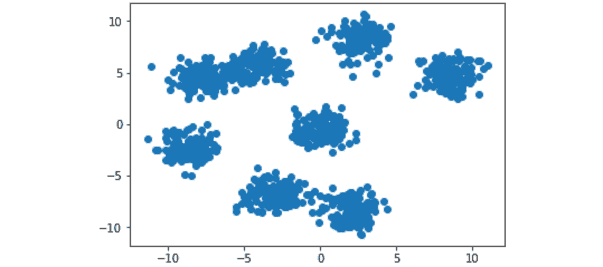
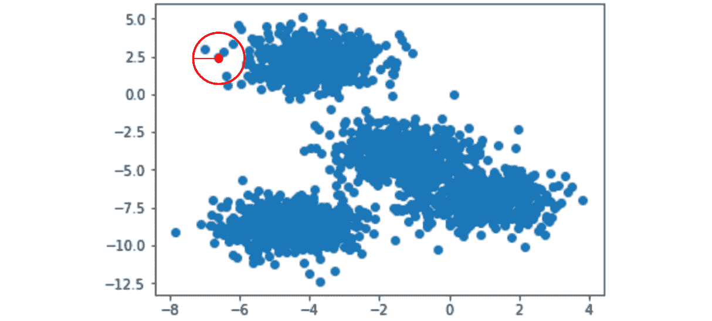

# 第三章：邻域方法与 DBSCAN

## 学习目标

在本章结束时，你将能够：

+   理解邻域方法在聚类中的工作原理，从头到尾

+   从头实现 DBSCAN 算法，使用相关软件包

+   从 k-means、层次聚类和 DBSCAN 中选择最适合的算法来解决你的问题

本章我们将介绍 DBSCAN 聚类方法，这对于处理高度复杂的数据最为适用。

## 介绍

到目前为止，我们已经介绍了两种流行的聚类方法：k-means 和层次聚类。每种聚类技术在实施时都有优缺点。让我们再次回顾前两章的内容，以便为本章的内容提供更好的背景。

在无监督学习的挑战领域中，你将会面临一组特征数据，但没有补充标签告诉你这些特征变量的具体含义。尽管你无法直接得知目标标签是什么，但你可以通过将相似的群体聚集在一起，查看组内的相似性，来从数据中挖掘出一定的结构。我们之前讲解的聚类相似数据点的第一个方法是 k-means。

k-means 最适用于简单的数据挑战，其中速度至关重要。通过简单地查看最接近的数据点，计算开销不大，但当面对高维数据集时，挑战也会增大。如果你不知道可能需要寻找多少个聚类，k-means 也不适合使用。在*第二章*，*层次聚类*中，我们曾经探讨过通过化学分析数据来判断哪些葡萄酒属于同一类别。这一练习之所以有效，是因为你知道有三种类型的葡萄酒已经被订购。然而，如果你对最初的排序没有任何直觉，k-means 的效果会大打折扣。

我们探讨的第二种聚类方法是层次聚类。这种方法可以通过两种方式工作——合并式或分裂式。合并式聚类采用自下而上的方式，将每个数据点视为一个独立的簇，并通过连接准则递归地将它们聚集在一起。分裂式聚类则朝相反方向工作，它将所有数据点视为一个大的类别，并递归地将其拆分为更小的簇。这种方法的优势在于能够全面理解整个数据分布，因为它计算了分割的潜力；然而，由于其更高的复杂性，通常在实际操作中并不常用。在不知道数据任何信息的情况下，层次聚类是聚类需求的有力竞争者。通过使用树状图，你可以可视化数据中的所有分割，并在事后考虑哪个簇的数量更合理。在你的特定使用案例中，这非常有帮助；然而，它也带来了与 k 均值聚类相似的较高计算成本。

在本章中，我们将介绍一种在高度复杂数据中最适合的聚类方法：**DBSCAN**（基于密度的空间聚类与噪声）。经典地，这种方法一直被认为在数据集密集分布的情况下表现优秀。让我们一起探讨它为什么在这些用例中表现如此出色。

### 聚类作为邻域

在前两章中，我们探讨了相似性的概念，这一概念通过欧几里得距离来描述——与某一点较近的数据点可以视为相似，而在欧几里得空间中距离较远的数据点则可以视为不相似。这一概念在 DBSCAN 算法中再次出现。正如其冗长的名称所暗示的，DBSCAN 方法通过引入密度的概念，扩展了基本的距离度量评估。如果一群数据点都位于彼此相同的区域中，它们可以被视为同一簇的成员：


###### 图 3.1：邻居与聚类有直接的联系

在前面的示例中，我们可以看到四个邻域。

与我们之前讨论过的仅关注距离的传统方法相比，基于密度的方法有许多优势。如果你仅将距离作为聚类的阈值，那么在面对稀疏特征空间和离群点时，可能会发现你的聚类结果毫无意义。无论是 k 均值聚类还是层次聚类，都会自动将空间中的所有数据点分组，直到没有剩余点为止。

虽然层次聚类确实在某种程度上绕过了这个问题，因为你可以在聚类后使用树状图来指定聚类的形成位置，但 k-means 仍然是最容易失败的，因为它是最简单的聚类方法。当我们开始评估基于邻域的聚类方法时，这些问题就不那么明显了：


###### 图 3.2：示例树状图

通过在 DBSCAN 中引入邻居密度的概念，我们可以根据运行时选择的超参数，选择是否将异常值排除在聚类之外。只有具有密切邻居的数据点才会被视为同一聚类的成员，而那些距离较远的数据点则可以被视为未聚类的异常值。

## DBSCAN 简介

正如前一节所提到的，当我们分析基于密度的聚类方法的优势时，DBSCAN 的强大之处就显现出来了。DBSCAN 将密度评估为邻域半径和在邻域中找到的最小点数的组合，这些点数被视为一个聚类。

如果我们重新考虑你被要求为商店整理一批未标记的葡萄酒货物的场景，可能更容易理解这个概念。在之前的示例中，已经明确说明，我们可以根据葡萄酒的特征（如科学化学特性）找到相似的葡萄酒。了解这些信息后，我们可以更轻松地将相似的葡萄酒分组，并且快速将产品整理好以供销售。希望到现在为止这一点已经清楚了——但可能不太清楚的是，你为商店订购的商品通常反映了现实世界的购买模式。为了在库存中促进品种多样性，但又能保证最受欢迎的葡萄酒有足够的库存，你的商品种类往往会呈现出高度不均衡的分布。大多数人喜欢经典的葡萄酒，如白葡萄酒和红葡萄酒，但你可能仍会为那些喜欢昂贵葡萄酒的顾客提供更多异国情调的葡萄酒。这使得聚类更加困难，因为存在不均衡的类别分布（例如，你不会订购每种葡萄酒各 10 瓶）。

DBSCAN 与 k-means 和层次聚类的不同之处在于，你可以将直觉融入到如何评估我们感兴趣的顾客聚类的过程中。它可以以更简单的方式去除噪声，并且仅指出那些在营销活动中具有最高潜力的顾客。

通过基于邻域的聚类方法，我们可以区分出那些可以视为随机噪声的偶尔顾客，以及那些一次次光顾我们商店的更有价值的顾客。这种方法自然会引发关于如何确定邻域半径和每个邻域最小点数的最佳数值的问题。

作为一种高级启发式方法，我们希望将邻域半径设置得较小，但又不能太小。在极端的一端，你可以将邻域半径设置得非常大——这可能导致将所有点视为一个庞大的聚类。而在另一端，你可以将邻域半径设置得非常小。过小的邻域半径可能导致没有任何点被聚集在一起，并且出现大量单一成员的聚类。

类似的逻辑适用于构成聚类的最小点数。最小点数可以看作是一个次要阈值，它根据你数据空间中可用的数据来调整邻域半径。如果你在特征空间中的所有数据非常稀疏，最小点数会变得尤为重要，它与邻域半径配合使用，以确保不会只是大量无关的数据点。当数据非常密集时，最小点数阈值就不像邻域半径那样成为主导因素。

如你所见，这两个超参数规则的最佳选择通常依赖于数据集的具体情况。很多时候，你需要找到一个“恰到好处”的区间，即超参数既不过小，也不过大。

### DBSCAN 深入解析

为了观察 DBSCAN 如何工作，我们可以通过一个简单的示例程序，跟踪其如何合并形成不同的聚类和噪声标记数据点：

1.  给定 *n* 个未访问的样本数据点，在循环中依次遍历每个点并标记为已访问。

1.  从每个点出发，查看与数据集中其他所有点的距离。

1.  对于所有位于邻域半径超参数内的点，将它们连接为邻居。

1.  检查邻居的数量是否至少达到所需的最小点数。

1.  如果达到最小点数阈值，将点归为一个聚类。如果没有，将该点标记为噪声。

1.  重复此过程，直到所有数据点被分类到聚类中或标记为噪声。

在某些方面，DBSCAN 算法相对简单——虽然引入了通过邻域半径和最小点数来衡量密度的新概念，但它的核心仍然是使用距离度量进行评估。

### DBSCAN 算法演示

这是一个简单的示例，稍微详细地演示了前述步骤：

1.  给定四个样本数据点，将每个点视为一个独立的聚类 [ (1,7) ]、[ (-8,6) ]、[ (-9,4) ] 、[ (4, -2) ]:

    ###### 图 3.3：样本数据点的绘制

1.  计算每一对点之间的欧几里得距离：

    ###### 图 3.4：点之间的距离

1.  从每个点出发，扩展一个邻域大小并形成簇。为了这个示例，假设我们通过了半径为三的邻域。这意味着任何两个点，如果它们之间的距离小于三，就会被视为邻居。点(-8,6)和(-9,4)现在是聚类的候选点。

1.  没有邻居的点被标记为噪声，并且保持未聚类状态。点(1,7)和(4,-2)由于在聚类中无用，超出了我们的兴趣范围。

1.  有邻居的点随后会被评估，看它们是否符合最小点数阈值。在这个示例中，如果我们设置最小点数阈值为二，那么点(-8,6)和(-9,4)就可以正式组合成一个簇。如果最小点数阈值为三，那么这个集合中的所有四个数据点将被视为多余的噪声。

1.  在剩余的未访问数据点上重复此过程。

在这个过程结束时，你将获得整个数据集，所有数据要么被归类为簇的一部分，要么被视为无关的噪声。通过走完整个玩具示例，你可以发现，DBSCAN 的性能高度依赖于你事先选择的阈值超参数。这意味着你可能需要多次运行 DBSCAN，并尝试不同的超参数选项，以了解它们如何影响整体性能。

DBSCAN 的一个优点是，它摒弃了我们在 k 均值和以质心为中心的层次聚类实现中看到的质心概念。这个特性使得 DBSCAN 更适合处理复杂的数据集，因为大多数现实世界中的数据并不像干净的簇那样分布。

### 练习 9：评估邻域半径大小的影响

对于这个练习，我们将采用与之前示例中常见的方式相反的顺序，先查看 scikit-learn 中 DBSCAN 的封装实现，然后再自己实现。这是故意为之，以充分探讨不同邻域半径大小如何极大地影响 DBSCAN 的性能。

完成这个练习后，你将熟悉调整邻域半径大小如何影响 DBSCAN 的性能。理解这些 DBSCAN 的特点很重要，因为它们可以帮助你在未来通过高效地排查聚类算法问题来节省时间。

1.  生成一些虚拟数据：

    ```py
    from sklearn.cluster import DBSCAN
    from sklearn.datasets import make_blobs
    import matplotlib.pyplot as plt
    %matplotlib inline
    # Generate a random cluster dataset to experiment on. X = coordinate points, #y = cluster labels (not needed)
    X, y = make_blobs(n_samples=1000, centers=8, n_features=2, random_state=800)
    # Visualize the data
    plt.scatter(X[:,0], X[:,1])
    plt.show()
    ```

    输出结果如下：

    

    ###### 图 3.5：可视化的玩具数据示例

1.  在为这个玩具问题绘制虚拟数据后，你将看到数据集有两个特征，并大约有七到八个簇。要使用 scikit-learn 实现 DBSCAN，你需要实例化一个新的 scikit-learn 类：

    ```py
    db = DBSCAN(eps=0.5, min_samples=10, metric='euclidean')
    ```

    我们的 DBSCAN 实例存储在`db`变量中，超参数在创建时传入。为了这个例子，你可以看到邻域半径（`eps`）设置为 0.5，而最小点数设置为 10。为了与前几章一致，我们将继续使用欧几里得距离作为度量标准。

1.  让我们设置一个循环，允许我们交互式地探索潜在的邻域半径大小选项：

    ```py
    eps = [0.2,0.7]
    for ep in eps:
        db = DBSCAN(eps=ep, min_samples=10, metric='euclidean')
        plt.scatter(X[:,0], X[:,1], c=db.fit_predict(X))
        plt.title('Toy Problem with eps: ' + str(ep))
        plt.show()
    ```

    上述代码产生以下两张图：


###### 图：3.6: 结果图

从图中可以看到，设置邻域半径过小会导致所有数据被视为随机噪声（紫色点）。稍微增加邻域半径，可以让我们形成更有意义的簇。试着重新创建前面的图形并尝试不同的`eps`值。

### DBSCAN 属性 - 邻域半径

在*练习 9*，*评估邻域半径大小的影响*中，你看到了设置合适的邻域半径对你的 DBSCAN 实现性能的影响。如果邻域太小，你会遇到所有数据都未被聚类的问题。如果你设置的邻域过大，那么所有数据会被聚集到一个簇中，且无法提供任何价值。如果你用自己的`eps`值进一步探索前面的练习，你可能会注意到，仅凭邻域大小很难得到理想的聚类效果。这时，最小点数阈值就显得非常重要。我们稍后会讨论这一主题。

为了更深入了解 DBSCAN 的邻域概念，我们来看一下你在实例化时传入的`eps`超参数。`eps`代表 epsilon，是算法在寻找邻居时查看的距离。这个 epsilon 值会被转换为一个半径，围绕任意给定数据点以圆形方式进行扫描，以形成邻域：



###### 图 3.7: 邻域半径可视化，红色圆圈为邻域

在这个例子中，中心点将有四个邻居。

这里需要注意的一个关键点是，你的邻域搜索形成的形状在二维空间中是圆形，在三维空间中是球形。根据数据的结构，这可能会影响你模型的表现。再次强调，簇可能看起来像是一个直观的结构，但这并不总是如此。幸运的是，DBSCAN 在处理这种你感兴趣的簇，但又不符合明确的簇状结构时非常有效。


###### 图 3.8: 不同邻域半径大小的影响

在左侧，数据点会被分类为随机噪声。右侧，数据点有多个邻居，可能会成为一个独立的簇。

### 活动 4：从头实现 DBSCAN

在面试中使用生成的二维数据集时，你被要求从头开始实现 DBSCAN 算法。为此，你需要编码邻域搜索的直觉，并进行递归调用以添加邻居。

根据你在前几章中学到的 DBSCAN 和距离度量，使用 Python 从头实现 DBSCAN。你可以自由使用 NumPy 和 SciPy 来评估距离。

完成此活动的步骤如下：

1.  生成一个随机簇数据集

1.  可视化数据

1.  从头创建函数，允许你在数据集上调用 DBSCAN

1.  使用你创建的 DBSCAN 实现来寻找生成数据集中的簇。可以根据需要调整超参数，并根据其表现进行调优。

1.  可视化从头开始实现的 DBSCAN 聚类效果

本练习的预期结果是让你理解 DBSCAN 的工作原理，从而在使用 scikit-learn 的完整实现之前，能够从头开始实现 DBSCAN。采取这种方法来学习任何机器学习算法是很重要的，它有助于你“获得”使用更简单实现的能力，同时在未来仍能深入讨论 DBSCAN：


###### 图 3.9：预期结果

#### 注意

此活动的解决方案可以在第 316 页找到。

### DBSCAN 属性 – 最小点数

除了邻域半径之外，DBSCAN 成功实现的另一个核心组件是需要的最小点数，以证明某个数据点属于某个簇。如前所述，当数据集较为稀疏时，这个下限能明显有利于你的算法。不过，当数据非常密集时，这个参数并非无用——虽然将单个数据点随机散布在特征空间中可以很容易地被归类为噪声，但当数据随机形成两到三个点的“斑块”时，问题就变得模糊了。例如，这些数据点是应该作为一个独立的簇，还是也应该归类为噪声？最小点数阈值帮助解决了这个问题。

在 scikit-learn 实现的 DBSCAN 中，此超参数在`min_samples`字段中设置，该字段会在创建 DBSCAN 实例时传递。此字段与邻域半径大小超参数配合使用时非常有价值，可以帮助完善基于密度的聚类方法：


###### 图 3.10：最小点数阈值决定数据点是否为噪声或簇

在右侧，如果最小点数阈值为 10 个点，它会将该邻域中的数据分类为噪声。

在现实场景中，当你拥有大量数据时，最小点数将产生显著影响。以葡萄酒聚类为例，如果你的商店实际上是一个大型酒类仓库，你可能会有成千上万种葡萄酒，每种酒只有一两瓶，这些酒可能会被轻松视为自己的独立聚类。根据你的使用场景，这可能会有帮助；然而，重要的是要记住数据的主观大小。如果你的数据有数百万个数据点，那么随机噪声可能会被视为数百甚至数千个随机的单次销售。然而，如果你的数据量在几百或几千个数据点的规模上，单个数据点可能会被视为随机噪声。

### 练习 10：评估最小点数阈值的影响

类似于我们的*练习 9，评估邻域半径大小的影响*，我们探索了设置适当邻域半径大小的值，我们将重复这一练习，但这次会在多种数据集上更改最小点数阈值。

使用我们当前实现的 DBSCAN，我们可以轻松地调整最小点数阈值。调整这个超参数，并观察它在生成的数据上的表现。

通过调整 DBSCAN 的最小点数阈值，你将理解它如何影响聚类预测的质量。

再次，从随机生成的数据开始：

1.  按如下方式生成随机聚类数据集：

    ```py
    from sklearn.cluster import DBSCAN
    from sklearn.datasets import make_blobs
    import matplotlib.pyplot as plt
    %matplotlib inline
    X, y = make_blobs(n_samples=1000, centers=8, n_features=2, random_state=800)
    ```

1.  按如下方式可视化数据：

    ```py
    # Visualize the data
    plt.scatter(X[:,0], X[:,1])
    plt.show()
    ```

    

    ###### 图 3.11：生成数据的绘图

1.  使用与之前相同的绘图数据，让我们从*练习 1*，*评估邻域半径大小的影响*中选择一个表现较好的邻域半径大小——`eps` = 0.7：

    ```py
    db = DBSCAN(eps=0.7, min_samples=10, metric='euclidean')
    ```

    #### 注意

    `eps` 是一个可调的超参数。然而，正如前文所述，0.7 是来自之前实验的结果，因此我们选择 `eps = 0.7` 作为最优值。

1.  在实例化 DBSCAN 聚类算法后，让我们将 `min_samples` 超参数视为我们希望调整的变量。我们可以通过循环来查找最适合我们使用场景的最小点数：

    ```py
    num_samples = [10,19,20]
    for min_num in num_samples:
        db = DBSCAN(eps=0.7, min_samples=min_num, metric='euclidean')
        plt.scatter(X[:,0], X[:,1], c=db.fit_predict(X))
        plt.title('Toy Problem with Minimum Points: ' + str(min_num))
        plt.show()
    ```

    观察生成的第一个图，我们可以看到，如果你按照*练习 1*，*评估邻域半径大小的影响*，使用 10 个最小点作为聚类成员资格的阈值，你将达到的结果：


###### 图 3.12：具有 10 个最小点的玩具问题绘图

剩下的两个超参数选项对 DBSCAN 聚类算法的性能有很大影响，并展示了单一数值的变化如何显著影响性能：


###### 图 3.13：玩具问题的绘图

正如你所看到的，仅仅将最小点数从 19 改为 20，就为我们的特征空间添加了一个额外的（错误的！）聚类。通过这次练习，你已了解最小点数的概念，现在你可以调整 scikit-learn 实现中的 epsilon 值和最小点数阈值，以获得最优的聚类数。

#### 注意

在我们最初生成数据时，我们创建了八个聚类。这表明，最小点数的小变化可以添加整个新的聚类，而这些聚类显然不应出现在数据中。

### 活动 5：将 DBSCAN 与 k-means 和层次聚类进行比较

你正在管理商店库存，收到了一大批葡萄酒货物，但在运输过程中瓶子的品牌标签掉落了。幸运的是，供应商提供了每瓶葡萄酒的化学成分数据以及各自的序列号。不幸的是，你不能打开每瓶酒并品尝其差异——你必须找到一种方法，根据化学成分将未标记的酒瓶重新分组！你从订单列表中得知，订购了三种不同类型的葡萄酒，并且只提供了两个酒的属性来将这些葡萄酒分组。

在*第二章*、*层次聚类*中，我们已经看到 k-means 和层次聚类如何在葡萄酒数据集上表现。在我们的最佳情况下，得到了 0.59 的轮廓系数。现在，使用 scikit-learn 实现的 DBSCAN，让我们看看能否获得更好的聚类结果。

以下步骤将帮助你完成此活动：

1.  导入必要的包

1.  加载葡萄酒数据集并检查数据的结构

1.  可视化数据

1.  使用 k-means、凝聚层次聚类和 DBSCAN 生成聚类

1.  评估不同的 DBSCAN 超参数选项及其对轮廓系数的影响

1.  基于最高的轮廓系数生成最终的聚类

1.  可视化使用三种方法生成的聚类

    #### 注意

    我们已从[`archive.ics.uci.edu/ml/datasets/wine`](https://archive.ics.uci.edu/ml/datasets/wine)下载了此数据集。你可以通过[`github.com/TrainingByPackt/Applied-Unsupervised-Learning-with-Python/tree/master/Lesson03/Activity05`](https://github.com/TrainingByPackt/Applied-Unsupervised-Learning-with-Python/tree/master/Lesson03/Activity05)访问该数据集。

    UCI 机器学习库[[`archive.ics.uci.edu/ml`](http://archive.ics.uci.edu/ml)]。加利福尼亚州尔湾：加利福尼亚大学信息与计算机科学学院。

完成此活动后，你将重新创建一个聚类问题的完整工作流。你已经在*第二章*、*层次聚类*中熟悉了数据，并且在完成此活动后，你将执行模型选择，找到最适合你数据集的最佳模型和超参数。你将得到葡萄酒数据集在每种聚类方法下的轮廓系数。

#### 注意

该活动的解决方案可以在第 319 页找到。

## DBSCAN 与 k-means 和层次聚类的比较

现在你已经了解了 DBSCAN 是如何实现的，以及可以调整哪些不同的超参数来优化性能，我们来看看它与我们在*第一章*，*聚类简介*和*第二章*，*层次聚类*中介绍的聚类方法的比较。

你可能在*活动 5*，*将 DBSCAN 与 k-means 和层次聚类进行比较*中注意到，DBSCAN 在通过轮廓分数寻找最优簇时可能有些挑剔。这是邻域方法的一个缺点——当你对数据中的簇的数量有一些了解时，k-means 和层次聚类表现得更为出色。在大多数情况下，这个数量足够小，你可以迭代地尝试几个不同的数量，看看效果如何。相反，DBSCAN 采用更自下而上的方法，通过调整超参数来发现它认为重要的簇。在实践中，当前两种方法失败时，考虑使用 DBSCAN 是很有帮助的，因为它需要大量的调整才能正常工作。话虽如此，当 DBSCAN 实现正常工作时，它通常会远远超越 k-means 和层次聚类。（实际上，这种情况通常发生在高度交织但仍然离散的数据上，比如包含两个半月形状的特征空间）。

与 k-means 和层次聚类相比，DBSCAN 可能更加高效，因为它只需要对每个数据点进行一次检查。与需要多次迭代寻找新质心并评估其最近邻的位置不同，一旦一个点被分配到 DBSCAN 中的一个簇，它的簇成员就不会再改变。DBSCAN 与层次聚类相比，与 k-means 的另一个关键区别是，它不需要在创建时明确指定预期的簇的数量。这在没有外部指导如何将数据集拆分时非常有用。

## 总结

DBSCAN 在聚类方法上采取了与 k-means 和层次聚类不同的有趣方式。虽然层次聚类在某些方面可以看作是 k-means 中最近邻方法的扩展，但 DBSCAN 通过应用密度的概念来处理查找邻居的问题。当数据非常复杂且交织在一起时，这种方法尤为有用。虽然 DBSCAN 非常强大，但并不是万无一失的，并且根据原始数据的情况，它有时可能会显得过于复杂。

然而，将 DBSCAN 与 k-means 和层次聚类结合使用时，DBSCAN 为无监督学习任务中的数据聚类提供了强大的工具箱。在遇到这类问题时，比较每种方法的性能并找出最合适的方案是值得的。

在探索完聚类之后，我们将进入无监督学习中另一个关键的技能：降维。通过智能地减少维度，我们可以让聚类变得更易理解，并能够向利益相关者传达。降维对于以最有效的方式创建各种机器学习模型也是至关重要的。
