# 第四章：降维和 PCA

## 学习目标

到本章结束时，您将能够：

+   应用降维技术。

+   描述主成分和降维背后的概念。

+   在使用 scikit-learn 解决问题时应用主成分分析（PCA）。

+   比较手动 PCA 与 scikit-learn 的 PCA。

本章将探讨降维及其不同的降维技术。

## 介绍

本章是三章系列中的第一章，探讨我们在无监督学习算法中使用不同特征集（或空间）的应用，我们将从降维的讨论开始，特别是主成分分析（PCA）。接下来，我们将通过探索两种独立且强大的机器学习架构——基于神经网络的自编码器，扩展我们对不同特征空间好处的理解。神经网络在监督学习问题中无疑有着应得的声誉，而通过使用自编码器阶段，它们已被证明在无监督学习问题的应用上足够灵活。最后，在本微系列的最后一章中，我们将基于神经网络实现和降维的基础，讨论 t 分布最近邻算法。

### 什么是降维？

降维是数据科学家工具包中的一个重要工具，并且由于其广泛的应用场景，它在该领域几乎被视为基本知识。因此，在我们考虑降维及其必要性之前，我们首先需要理解什么是维度。简单来说，维度是与数据样本相关的维度、特征或变量的数量。通常，可以将其视为电子表格中的列数，其中每个样本占据一行，每一列描述样本的某个属性。以下表格就是一个例子：


###### 图 4.1：具有三个不同特征的两个数据样本

在*图 4.1*中，我们有两个数据样本，每个样本有三个独立的特征或维度。根据所解决的问题或数据集的来源，我们可能希望在不丢失已提供信息的情况下，减少每个样本的维度数量。这就是降维发挥作用的地方。

但是，降维究竟如何帮助我们解决问题呢？我们将在接下来的部分更详细地介绍应用；但假设我们有一个非常大的时间序列数据集，例如回声心动图或心电图（在一些国家也称为 EKG）信号，如下图所示：

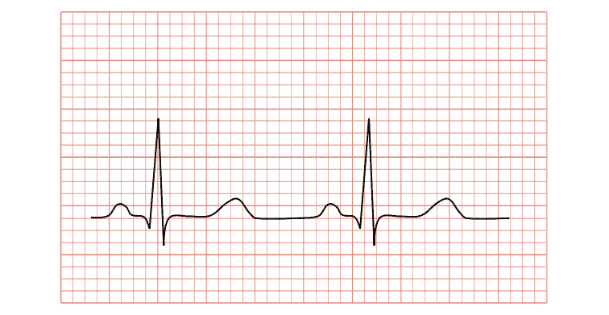

###### 图 4.2：心电图（ECG 或 EKG）

这些信号是从您公司新型号的手表中捕获的，我们需要寻找心脏病或中风的迹象。在查看数据集时，我们可以做出以下几项观察：

+   大多数单独的心跳信号非常相似。

+   数据中存在来自录音系统或患者在录音过程中移动的噪音。

+   尽管有噪音，心跳信号仍然可见。

+   数据量非常大——超出了手表可用硬件的处理能力。

正是在这种情况下，降维技术真正显示其优势！通过使用降维技术，我们能够从信号中去除大量噪音，这反过来将有助于提高应用于数据的算法性能，并减少数据集的大小，从而降低硬件要求。本章中我们将讨论的技术，特别是 PCA 和自编码器，在研究和行业中已被广泛应用于有效地处理、聚类和分类这类数据集。在本章结束时，您将能够将这些技术应用于您自己的数据，并希望看到您自己机器学习系统性能的提升。

### 降维的应用

在开始详细研究降维和 PCA 之前，我们将讨论这些技术的一些常见应用：

+   **预处理/特征工程**：这种方法最常见的应用是在机器学习解决方案开发的预处理或特征工程阶段。在算法开发过程中提供的信息质量，以及输入数据与期望结果之间的相关性，对于设计高性能的解决方案至关重要。在这种情况下，PCA 可以提供帮助，因为我们能够从数据中提取出最重要的信息成分，并将其提供给模型，从而确保只提供最相关的信息。这还可以带来第二个好处，即我们减少了提供给模型的特征数量，因此计算量也能相应减少，这可以减少系统的整体训练时间。

+   **噪音减少**：降维也可以作为一种有效的噪音减少/滤波技术。预期信号或数据集中的噪音并不占数据变异的主要成分。因此，我们可以通过去除变异较小的成分来去除信号中的一部分噪音，然后将数据恢复到原始数据空间。在以下示例中，左侧的图像已经过滤掉了最重要的 20 个数据源，生成了右侧的图像。我们可以看到图像质量有所降低，但关键信息仍然保留：


###### 图 4.3：经过维度减少滤波的图像。左：原始图像（照片由来自 Pexels 的 Arthur Brognoli 拍摄），右：滤波后的图像

#### 注意

这张照片是由来自 Pexels 的 Arthur Brognoli 拍摄，并可在[`www.pexels.com/photo-license/`](https://www.pexels.com/photo-license/)上免费使用。

+   **生成可信的人工数据集**：由于 PCA 将数据集分解为信息（或变化）的组件，我们可以通过调整特征值之间的比率来研究每个组件的效果或生成新的数据集样本。我们可以缩放这些组件，从而增加或减少特定组件的重要性。这也被称为**统计形状建模**，因为其中一种常见方法是使用它来创建形状的合理变体。它还被用来在图像中检测面部特征点，这是**主动形状建模**过程中的一个步骤。

+   **金融建模/风险分析**：降维为金融行业提供了一个有用的工具箱，因为能够将大量单独的市场指标或信号整合为较少的组件，可以加快和更高效地进行计算。同样，这些组件可以用来突出那些高风险的产品/公司。

### 维数灾难

在我们理解使用降维技术的好处之前，我们必须先了解为什么需要减少特征集的维度。**维数灾难**是一个常用的术语，用来描述在处理具有高维度特征空间的数据时出现的问题；例如，为每个样本收集的属性数量。考虑一个《吃豆人》游戏中点位置的数据集。你的角色吃豆人在虚拟世界中的位置由两个维度或坐标（*x*，*y*）定义。假设我们正在创建一个新的电脑敌人：一个由 AI 驱动的幽灵来对抗玩家，并且它需要一些关于我们角色的信息来做出自己的游戏逻辑决策。为了使这个机器人有效，我们需要玩家的位置（*x*，*y*）以及每个方向上的速度（*vx*，*vy*），此外还需要玩家最后五个（*x*，*y*）位置，剩余的心数以及迷宫中剩余的能量豆数（能量豆暂时允许吃豆人吃掉幽灵）。现在，对于每个时间点，我们的机器人需要 16 个单独的特征（或维度）来做出决策。显然，这比只提供位置的两个维度要多得多。


###### 图 4.4：《吃豆人》游戏中的维度

为了解释降维的概念，我们将考虑一个虚构的数据集（见*图 4.5*），其中 *x* 和 *y* 坐标作为特征，形成了特征空间中的两个维度。需要注意的是，这个例子绝不是数学证明，而是旨在提供一种可视化增加维度后影响的方式。在这个数据集中，我们有六个独立的样本（或点），我们可以可视化当前在特征空间内占据的体积，约为 (3 - 1) x (4 - 2) = 2 x 2 = 4 平方单位。

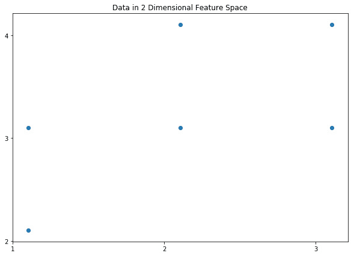

###### 图 4.5：二维特征空间中的数据

假设数据集包含相同数量的点，但每个样本都有一个额外的特征（*z* 坐标）。此时，所占数据体积大约为 2 x 2 x 2 = 8 立方单位。因此，我们现在有相同数量的样本，但包围数据集的空间变得更大。这样，数据在可用空间中占据的相对体积变小，数据变得更加稀疏。这就是维度灾难；随着可用特征数量的增加，数据的稀疏性增加，从而使得统计上有效的相关性变得更加困难。回到我们创建视频游戏机器人来与人类玩家对战的例子，我们有 12 个特征，包含不同类型的特征：速度、速度变化、加速度、技能水平、选择的武器和可用弹药。根据这些特征的可能值范围以及每个特征对数据集方差的贡献，数据可能非常稀疏。即使在受限的吃豆人世界中，每个特征的潜在方差也可能非常大，有些特征的方差远大于其他特征。

因此，在不处理数据集稀疏性的情况下，我们通过额外的特征获得了更多信息，但可能无法提高机器学习模型的性能，因为统计相关性变得更加困难。我们希望做的是保留额外特征提供的有用信息，同时最小化稀疏性的负面影响。这正是降维技术的设计目的，而这些技术在提高机器学习模型性能方面可能非常强大。

本章将讨论多种降维技术，并将在更详细的工作示例中介绍其中一种最重要和有用的方法——主成分分析（PCA）。

## 降维技术概述

正如在引言部分所讨论的，任何降维技术的目标都是在保持提供的有用信息的同时管理数据集的稀疏性，因此降维通常是分类阶段前的一个重要预处理步骤。大多数降维技术旨在通过**特征投影**的过程来完成这一任务，将数据从高维空间调整到较低维度的空间，以去除数据的稀疏性。再次通过可视化投影过程来理解这一点，可以考虑在三维空间中的一个球体。我们可以将球体投影到二维空间，变成一个圆形，虽然会有一些信息丢失（*z* 坐标的值），但仍保留了描述其原始形状的大部分信息。我们仍然知道原点、半径和流形（轮廓），而且仍然非常清楚它是一个圆。因此，如果我们仅仅得到了二维投影，凭借这些信息也能够重新构建原始的三维形状。所以，根据我们尝试解决的问题，我们可能已经在保留重要信息的同时减少了维度：

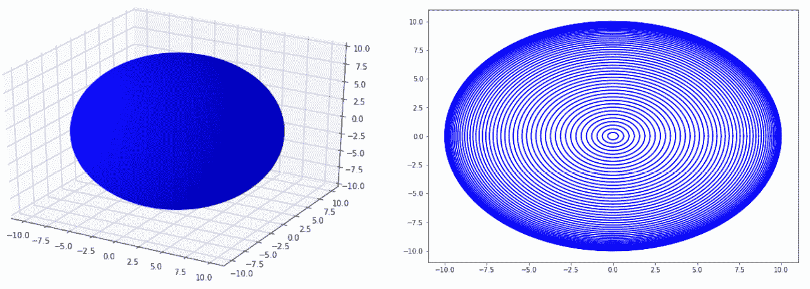

###### 图 4.6：将一个三维球体投影到二维空间

通过在降维阶段对数据集进行预处理，能够获得的附加好处是提高的计算性能。由于数据已经被投影到较低维度的空间，它将包含更少但可能更强大的特征。特征较少意味着在后续的分类或回归阶段，处理的数据集的大小显著较小。这将可能减少分类/回归所需的系统资源和处理时间，在某些情况下，降维技术还可以直接用于完成分析。

这个类比还引入了降维的一个重要考虑因素。我们总是试图在将数据投影到低维空间时，平衡信息丢失和减少数据稀疏性之间的关系。根据问题的性质和使用的数据集，正确的平衡可能会自然出现，并且相对直接。在某些应用中，这个决策可能依赖于额外验证方法的结果，比如交叉验证（特别是在监督学习问题中）或领域专家的评估。

我们喜欢将降维中的这一权衡方式比作在计算机上传输文件或图像时的压缩过程。降维技术，如 PCA，实质上是将信息压缩成较小的大小以便传输，而在许多压缩方法中，压缩过程中会发生一些信息丢失。有时，这些丢失是可以接受的；例如，如果我们要传输一张 50MB 的图像并需要将其压缩到 5MB，我们可以预期仍然能够看到图像的主要内容，但一些较小的背景细节可能会变得模糊不清。我们也不会期望从压缩后的图像恢复出完全无损的原始图像，但可以期望在恢复时会出现一些附加的伪影，比如模糊。

### 降维与无监督学习

降维技术在机器学习中有许多用途，因为能够提取数据集中的有用信息可以在许多机器学习问题中提高性能。与监督学习方法不同，降维技术在无监督学习中尤其有用，因为数据集不包含任何实际标签或目标。无监督学习中，训练环境用于以适合问题解决的方式组织数据（例如，分类问题中的聚类），这种组织方式通常基于数据集中的最重要信息。降维提供了提取重要信息的有效手段，且由于我们可以使用多种方法，因此回顾一些可用选项是有益的：

+   **线性判别分析**（**LDA**）：这是一种非常实用的技术，既可以用于分类，也可以用于降维。LDA 将在*第七章*中更详细地讲解：*主题建模*。

+   **非负矩阵分解**（**NNMF**）：与许多降维技术一样，这种方法依赖于线性代数的性质来减少数据集中的特征数量。NNMF 也将在*第七章*，*主题建模*中进行更详细的讨论。

+   **奇异值分解**（**SVD**）：这与 PCA（本章中将详细讨论）有些相关，也是一个矩阵分解过程，与 NNMF 并无太大不同。

+   **独立成分分析**（**ICA**）：这与 SVD 和 PCA 有一些相似之处，但通过放宽数据为高斯分布的假设，可以实现非高斯数据的分离。

到目前为止描述的每种方法都使用线性分离来减少数据在其原始实现中的稀疏性。一些方法还有使用非线性核函数的变体，能够以非线性的方式减少稀疏性。根据所使用的数据集，非线性核可能在从信号中提取最有用的信息方面更为有效。

## 主成分分析（PCA）

如前所述，PCA 是一种常用且非常有效的降维技术，通常作为许多机器学习模型和技术的预处理阶段。因此，我们将在本书中专门花一章更详细地探讨 PCA，超越其他方法。PCA 通过将数据分解为一系列组件来减少数据的稀疏性，每个组件代表数据中的一个信息源。顾名思义，PCA 中产生的第一个组件，**主成分**，包含了数据中大部分的信息或方差。主成分通常可以被认为是除了均值之外，贡献最多有趣信息的部分。随着每个后续组件的加入，数据中传递的信息减少，但更加微妙。如果我们将所有这些组件都考虑在内，使用 PCA 将没有任何好处，因为它将恢复原始数据集。为了澄清这个过程以及 PCA 返回的信息，我们将使用一个实际的例子，通过手动完成 PCA 计算。但首先，我们需要回顾一些基础的统计学概念，这些概念是进行 PCA 计算所必需的。

### 均值

均值，或称平均值，简单来说就是将所有值相加后，除以数据集中值的数量。

### 标准差

协方差矩阵通常被称为数据的分布，与方差相关，标准差是衡量数据与均值的接近程度的指标。在正态分布的数据集中，大约 68%的数据位于均值的一个标准差范围内。

方差与标准差之间的关系相当简单——方差是标准差的平方。

### 协方差

当标准差或方差是计算单一维度数据的分布时，协方差是一个维度（或特征）与另一个维度的方差。当一个维度的协方差与其自身计算时，结果与仅计算该维度的方差相同。

### 协方差矩阵

协方差矩阵是可以计算数据集协方差值的矩阵表示。除了在数据探索中非常有用外，协方差矩阵在执行 PCA（主成分分析）时也是必需的。为了确定一个特征相对于另一个特征的方差，我们只需查找协方差矩阵中对应的值。参见*图 4.7*，我们可以看到，在第 1 列、第 2 行，值是特征或数据集*Y*相对于*X*的方差（*cov(Y, X))*。我们还可以看到，有一列协方差值是针对同一特征或数据集计算的；例如，*cov(X, X)*。在这种情况下，值就是*X*的方差。


###### 图 4.7：协方差矩阵

通常，每个协方差的具体数值并不像观察矩阵中每个协方差的大小和相对大小那样有趣。某个特征与另一个特征的协方差较大，意味着一个特征与另一个特征有显著的变化，而接近零的值则表示变化极小。另一个值得关注的协方差特性是其符号；正值表示当一个特征增加或减少时，另一个特征也随之增加或减少，而负协方差则表示两个特征相互背离，一个增加时另一个减少，反之亦然。

值得庆幸的是，`numpy`和`scipy`提供了高效的函数来为你完成这些计算。在下一个练习中，我们将使用 Python 来计算这些值。

### 练习 11：理解统计学基础概念

在本练习中，我们将简要回顾如何使用`numpy`和`pandas`这两个 Python 包来计算一些基础的统计概念。在本练习中，我们将使用一个包含不同鸢尾花物种测量数据集，该数据集由英国生物学家和统计学家罗纳德·费舍尔爵士于 1936 年创建。该数据集可以在随附的源代码中找到，包含了三种不同鸢尾花品种（鸢尾花 Setosa、鸢尾花 Versicolor 和鸢尾花 Virginica）的四个独立测量值（花萼宽度和长度，花瓣宽度和长度）。

#### 注意

该数据集来自 [`archive.ics.uci.edu/ml/machine-learning-databases/iris/`](https://archive.ics.uci.edu/ml/machine-learning-databases/iris/)。它可以从 [`github.com/TrainingByPackt/Applied-Unsupervised-Learning-with-Python/tree/master/Lesson04/Exercise11`](https://github.com/TrainingByPackt/Applied-Unsupervised-Learning-with-Python/tree/master/Lesson04/Exercise11) 下载。

UCI 机器学习库 [[`archive.ics.uci.edu/ml`](http://archive.ics.uci.edu/ml)]。加利福尼亚州欧文市：加利福尼亚大学信息与计算机科学学院。

执行的步骤如下：

1.  导入 `pandas`、`numpy` 和 `matplotlib` 包以供使用：

    ```py
    import pandas as pd
    import numpy as np
    import matplotlib.pyplot as plt
    ```

1.  加载数据集并预览前五行数据：

    ```py
    df = pd.read_csv('iris-data.csv')
    df.head()
    ```

    输出如下：

    

    ###### 图 4.8：数据的头部

1.  我们只需要 `Sepal Length` 和 `Sepal Width` 特征，因此删除其他列：

    ```py
    df = df[['Sepal Length', 'Sepal Width']]
    df.head()
    ```

    输出如下：

    

    ###### 图 4.9：清洗后的数据头部

1.  通过绘制 `Sepal Length` 与 `Sepal Width` 的值来可视化数据集：

    ```py
    plt.figure(figsize=(10, 7))
    plt.scatter(df['Sepal Length'], df['Sepal Width']);
    plt.xlabel('Sepal Length (mm)');
    plt.ylabel('Sepal Width (mm)');
    plt.title('Sepal Length versus Width');
    ```

    输出如下：

    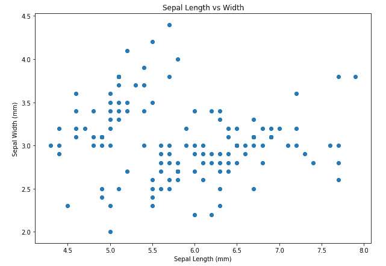

    ###### 图 4.10：数据的图示

1.  使用 `pandas` 方法计算均值：

    ```py
    df.mean()
    ```

    输出如下：

    ```py
    Sepal Length    5.843333
    Sepal Width     3.054000
    dtype: float64
    ```

1.  使用 `numpy` 方法计算均值：

    ```py
    np.mean(df.values, axis=0)
    ```

    输出如下：

    ```py
    array([5.84333333, 3.054     ])
    ```

1.  使用 `pandas` 方法计算标准差值：

    ```py
    df.std()
    ```

    输出如下：

    ```py
    Sepal Length    0.828066
    Sepal Width     0.433594
    dtype: float64
    ```

1.  使用 `numpy` 方法计算标准差值：

    ```py
    np.std(df.values, axis=0)
    ```

    输出如下：

    ```py
    array([0.82530129, 0.43214658])
    ```

1.  使用 `pandas` 方法计算方差值：

    ```py
    df.var()
    ```

    输出如下：

    ```py
    Sepal Length    0.685694
    Sepal Width     0.188004
    dtype: float64
    ```

1.  使用 `numpy` 方法计算方差值：

    ```py
    np.var(df.values, axis=0)
    ```

    输出如下：

    ```py
    array([0.68112222, 0.18675067])
    ```

1.  使用 `pandas` 方法计算协方差矩阵：

    ```py
    df.cov()
    ```

    输出如下：

    

    ###### 图 4.11：使用 Pandas 方法的协方差矩阵

1.  使用 `numpy` 方法计算协方差矩阵：

    ```py
    np.cov(df.values.T)
    ```

    输出如下：


###### 图 4.12：使用 NumPy 方法的协方差矩阵

现在我们知道如何计算基础的统计值，接下来我们将重点讨论 PCA 的其他组成部分。

### 特征值和特征向量

特征值和特征向量的数学概念在物理学和工程学领域中非常重要，它们也是计算数据集主成分的最后步骤。特征值和特征向量的精确定义超出了本书的范围，因为它涉及较为复杂的内容，并且需要有一定的线性代数基础。将数据集 (*a)* 分解为特征值 (*S*) 和特征向量 (*U*) 的线性代数方程如下：


###### 图 4.13：特征向量/特征值分解

在 *图 4.13* 中，*U* 和 *V* 作为数据集 *a* 的左右值相关。如果 *a* 的形状为 *m x n*，则 *U* 将包含形状为 *m x m* 的值，*V* 的形状为 *n x n*。

简而言之，在 PCA 的上下文中：

+   **特征向量** (*U*) 是对数据集做出信息贡献的成分，如本节第一段所述的主成分。每个特征向量描述了数据集中的某种变异性。

+   **特征值** (*S*) 是描述每个特征向量对数据集贡献多少的单独数值。如我们之前所述，描述最大贡献的信号特征向量称为主成分，因此它将具有最大的特征值。因此，具有最小特征值的特征向量对数据的方差或信息贡献最少。

### 练习 12：计算特征值和特征向量

如我们之前所讨论的，手动推导和计算特征值及特征向量稍显复杂，并且超出了本书的范围。幸运的是，`numpy` 为我们提供了计算这些值的所有功能。再次说明，我们将使用 Iris 数据集作为示例：

#### 注意

该数据集来自 [`archive.ics.uci.edu/ml/machine-learning-databases/iris/`](https://archive.ics.uci.edu/ml/machine-learning-databases/iris/)。

可以从 [`github.com/TrainingByPackt/Applied-Unsupervised-Learning-with-Python/tree/master/Lesson04/Exercise12`](https://github.com/TrainingByPackt/Applied-Unsupervised-Learning-with-Python/tree/master/Lesson04/Exercise12) 下载。

UCI 机器学习库 [[`archive.ics.uci.edu/ml`](http://archive.ics.uci.edu/ml)]。加利福尼亚州尔湾：加利福尼亚大学信息与计算机科学学院。

1.  导入 `pandas` 和 `numpy` 包：

    ```py
    import pandas as pd
    import numpy as np
    ```

1.  加载数据集：

    ```py
    df = pd.read_csv('iris-data.csv')
    df.head()
    ```

    输出如下所示：

    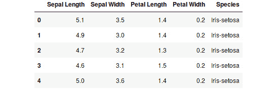

    ###### 图 4.14: 数据集的前五行

1.  同样，我们只需要`花萼长度`和`花萼宽度`特征，因此删除其他列：

    ```py
    df = df[['Sepal Length', 'Sepal Width']]
    df.head()
    ```

    输出如下所示：

    

    ###### 图 4.15: 花萼长度和花萼宽度特征

1.  从 NumPy 的线性代数模块中，使用单值分解函数来计算`特征值`和`特征向量`：

    ```py
    eigenvectors, eigenvalues, _ = np.linalg.svd(df.values, full_matrices=False)
    ```

    #### 注意

    使用`full_matrices=False`函数参数是一个标志，表示函数返回我们需要形状的特征向量；即：# 样本 x # 特征。

1.  观察特征值，我们可以看到第一个值是最大的，因此第一个特征向量贡献了最多的信息：

    ```py
    eigenvalues
    ```

    输出如下所示：

    ```py
    array([81.25483015,  6.96796793])
    ```

1.  观察特征值作为数据集总方差的百分比非常方便。我们将使用累积和函数来实现这一点：

    ```py
    eigenvalues = np.cumsum(eigenvalues)
    eigenvalues
    ```

    输出如下所示：

    ```py
    array([81.25483015, 88.22279808])
    ```

1.  除以最后一个或最大值来转换为百分比：

    ```py
    eigenvalues /= eigenvalues.max()
    eigenvalues
    ```

    输出如下所示：

    ```py
    array([0.92101851, 1\.        ])
    ```

    我们可以看到，这里第一个（或主）成分包含了数据中 92%的变化量，因此包含了大部分信息。

1.  现在，让我们看看 `特征向量`：

    ```py
    eigenvectors
    ```

    输出的一部分如下所示：

    

    ###### 图 4.16: 特征向量

1.  确认特征向量矩阵的形状为 `# 样本 x # 特征`；即，`150` x `2`：

    ```py
    eigenvectors.shape
    ```

    输出如下所示：

    ```py
    (150, 2)
    ```

1.  因此，从特征值中我们可以看出，第一个特征向量是主成分。看看第一个特征向量的值：

    ```py
    P = eigenvectors[0]
    P
    ```

    输出如下：

    ```py
    array([-0.07553027, -0.11068158])
    ```

我们已经将数据集分解为主成分，并且利用特征向量，我们可以进一步减少可用数据的维度。在后续的示例中，我们将考虑 PCA 并将该技术应用于示例数据集。

### PCA 的过程

现在，我们已经准备好所有步骤来完成 PCA，减少数据集的维度。

完成 PCA 的总体算法如下：

1.  导入所需的 Python 包（`numpy`和`pandas`）。

1.  加载整个数据集。

1.  从可用数据中选择你希望用于降维的特征。

    #### 注意

    如果数据集的特征之间存在显著的尺度差异，例如，一个特征的值范围在 0 到 1 之间，而另一个在 100 到 1,000 之间，你可能需要对其中一个特征进行归一化，因为这种量级差异会消除较小特征的影响。在这种情况下，你可能需要将较大特征除以其最大值。

    举个例子，看看这个：

    `x1 = [0.1, 0.23, 0.54, 0.76, 0.78]`

    `x2 = [121, 125, 167, 104, 192]`

    `x2 = x2 / np.max(x2) # 将 x2 归一化到 0 和 1 之间`

1.  计算所选（并可能已归一化）数据的`协方差`矩阵。

1.  计算`协方差`矩阵的特征值和特征向量。

1.  按从高到低的顺序对特征值（及其对应的特征向量）进行排序。

1.  计算特征值在数据集总方差中的百分比。

1.  选择所需的特征值（及其对应的特征向量）数量，以组成一个预定的最小组成方差值。

    #### 注意

    在这一阶段，排序后的特征值表示数据集总方差的百分比。因此，我们可以利用这些值来选择所需的特征向量的数量，无论是为了解决问题，还是为了充分减少应用于模型的数据集的大小。例如，假设我们要求 PCA 输出中至少包含 90%的方差。那么，我们将选择那些包含至少 90%方差的特征值（及其对应的特征向量）的数量。

1.  将数据集与选定的特征向量相乘，你就完成了 PCA，减少了表示数据的特征数量。

1.  绘制结果。

在进行下一个练习之前，请注意，**转置**是线性代数中的一个术语，意思是将行和列互换。假设我们有一个矩阵 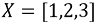，那么 *X* 的转置将是 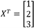。

### 练习 13：手动执行 PCA

在这个练习中，我们将手动完成主成分分析（PCA），再次使用鸢尾花数据集。在这个例子中，我们希望将数据集中的维度数减少到足以包含至少 75% 的可用方差：

#### 注意

此数据集取自 [`archive.ics.uci.edu/ml/machine-learning-databases/iris/`](https://archive.ics.uci.edu/ml/machine-learning-databases/iris/)。可以从 [`github.com/TrainingByPackt/Applied-Unsupervised-Learning-with-Python/tree/master/Lesson04/Exercise13`](https://github.com/TrainingByPackt/Applied-Unsupervised-Learning-with-Python/tree/master/Lesson04/Exercise13) 下载。

UCI 机器学习库 [[`archive.ics.uci.edu/ml`](http://archive.ics.uci.edu/ml)]。加利福尼亚州欧文：加利福尼亚大学信息与计算机科学学院。

1.  导入 `pandas` 和 `numpy` 包：

    ```py
    import pandas as pd
    import numpy as np
    import matplotlib.pyplot as plt
    ```

1.  加载数据集：

    ```py
    df = pd.read_csv('iris-data.csv')
    df.head()
    ```

    输出如下：

    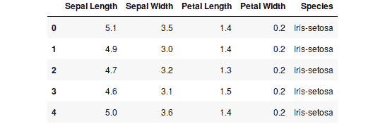

    ###### 图 4.17：数据集的前五行

1.  再次，我们只需要 `花萼长度` 和 `花萼宽度` 特征，因此去除其他列。在这个例子中，我们没有对所选数据集进行归一化：

    ```py
    df = df[['Sepal Length', 'Sepal Width']]
    df.head()
    ```

    输出如下：

    

    ###### 图 4.18：花萼长度和花萼宽度特征

1.  计算所选数据的`协方差`矩阵。请注意，我们需要对`协方差`矩阵进行转置，以确保它基于特征数（2）而不是样本数（150）：

    ```py
    data = np.cov(df.values.T)
    # The transpose is required to ensure the covariance matrix is 
    #based on features, not samples data
    data
    ```

    输出如下：

    

    ###### 图 4.19：所选数据的协方差矩阵

1.  计算协方差矩阵的特征向量和特征值。再次使用`full_matrices`函数参数：

    ```py
    eigenvectors, eigenvalues, _ = np.linalg.svd(data, full_matrices=False)
    ```

1.  特征值是什么？这些特征值按从高到低的顺序返回：

    ```py
    eigenvalues
    ```

    输出如下：

    ```py
    array([0.6887728 , 0.18492474])
    ```

1.  对应的特征向量是什么？

    ```py
    eigenvectors
    ```

    输出如下：

    

    ###### 图 4.20：特征向量

1.  计算特征值作为数据集中方差的百分比：

    ```py
    eigenvalues = np.cumsum(eigenvalues)
    eigenvalues /= eigenvalues.max()
    eigenvalues
    ```

    输出如下：

    ```py
    array([0.78834238, 1\.        ])
    ```

1.  根据练习介绍，我们需要描述至少包含 75% 可用方差的数据。根据*步骤* *7*，主成分包含 78% 的可用方差。因此，我们只需要数据集中的主成分。主成分是什么？

    ```py
    P = eigenvectors[0]
    P
    ```

    输出如下：

    ```py
    array([-0.99693955,  0.07817635])
    ```

    现在，我们可以应用降维过程。执行主成分与数据集转置矩阵的矩阵乘法。

    #### 注意

    降维过程是所选特征向量与待转换数据的矩阵乘法。

1.  如果不对`df.values`矩阵进行转置，就无法进行矩阵乘法：

    ```py
    x_t_p = P.dot(df.values.T)
    x_t_p
    ```

    输出的一部分如下：

    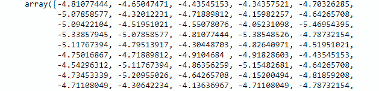

    ###### 图 4.21：矩阵乘法结果

    #### 注意

    为了执行矩阵乘法，数据集的转置是必需的，因为**矩阵的内维必须相同**才能进行矩阵乘法。为了使 **A.dot(B)** 有效，**A** 必须具有 *m x n* 的形状，**B** 必须具有 *n x p* 的形状。在本例中，**A** 和 **B** 的内维都是 *n*。

    在以下示例中，PCA 的输出是一个单列、150 个样本的数据集。因此，我们只是将初始数据集的大小减少了一半，包含了数据中约 79% 的方差：

    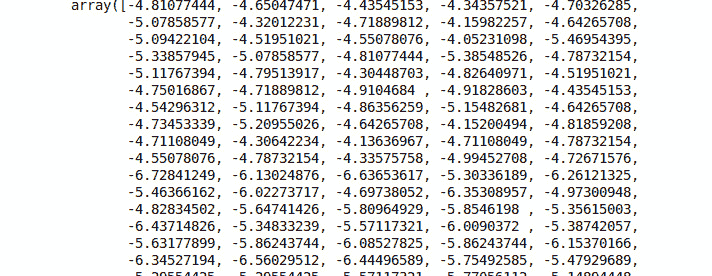

    ###### 图 4.22: PCA 输出结果

1.  绘制主成分的值：

    ```py
    plt.figure(figsize=(10, 7))
    plt.plot(x_t_p);
    plt.title('Principal Component of Selected Iris Dataset');
    plt.xlabel('Sample');
    plt.ylabel('Component Value');
    ```

    输出结果如下：

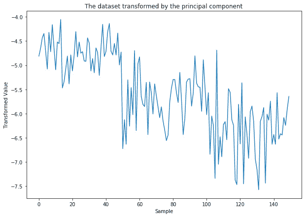

###### 图 4.23: 使用手动 PCA 转换后的 Iris 数据集

在本次练习中，我们简单地计算了数据集的协方差矩阵，而没有对数据集进行任何预处理。如果两个特征的均值和标准差大致相同，这是完全可以接受的。然而，如果一个特征的值远大于另一个特征（并且均值也有所不同），那么在分解为主成分时，这个特征可能会主导另一个特征，从而可能会完全丧失较小特征所提供的信息。在计算协方差矩阵之前，一种简单的归一化方法是从特征中减去各自的均值，从而使数据集围绕零进行中心化。我们将在*练习 15*，*通过手动 PCA 可视化方差减少*中演示这一过程。

### 练习 14: Scikit-Learn PCA

通常情况下，我们不会手动完成 PCA，尤其是当 scikit-learn 提供了一个优化的 API，并且它的便捷方法能让我们轻松地将数据转换到低维空间并返回时。在本次练习中，我们将更详细地研究如何在 Iris 数据集上使用 scikit-learn 的 PCA：

#### 注意

该数据集来自 [`archive.ics.uci.edu/ml/machine-learning-databases/iris/`](https://archive.ics.uci.edu/ml/machine-learning-databases/iris/)。

数据集可以从 [`github.com/TrainingByPackt/Applied-Unsupervised-Learning-with-Python/tree/master/Lesson04/Exercise14`](https://github.com/TrainingByPackt/Applied-Unsupervised-Learning-with-Python/tree/master/Lesson04/Exercise14) 下载。

UCI 机器学习库 [[`archive.ics.uci.edu/ml`](http://archive.ics.uci.edu/ml)]。加利福尼亚州尔湾市：加利福尼亚大学信息与计算机科学学院。

1.  从 `sklearn` 包中导入 `pandas`、`numpy` 和 `PCA` 模块：

    ```py
    import pandas as pd
    import numpy as np
    import matplotlib.pyplot as plt
    from sklearn.decomposition import PCA
    ```

1.  加载数据集：

    ```py
    df = pd.read_csv('iris-data.csv')
    df.head()
    ```

    输出结果如下：

    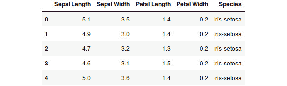

    ###### 图 4.24: 数据集的前五行

1.  同样，我们只需要 `花萼长度` 和 `花萼宽度` 两个特征，因此需要删除其他列。在这个示例中，我们没有对选定的数据集进行归一化处理：

    ```py
    df = df[['Sepal Length', 'Sepal Width']]
    df.head()
    ```

    输出如下：

    

    ###### 图 4.25：花萼长度和花萼宽度特征

1.  将数据拟合到 scikit-learn 的 PCA 模型上，使用协方差数据。使用默认值，就像我们这里所做的那样，会生成该数据集可能的最大特征值和特征向量数量：

    ```py
    model = PCA()
    model.fit(df.values)
    ```

    输出如下：

    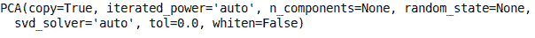

    ###### 图 4.26：将数据拟合到 PCA 模型

    在这里，`copy`表示数据在模型内的拟合会在应用任何计算之前进行复制。`iterated_power`显示`花萼长度`和`花萼宽度`特征是保留的主成分数量。默认值为`None`，它会选择组件数量为样本数或特征数中的最小值减一。`random_state`允许用户为 SVD 求解器使用的随机数生成器指定种子。`svd_solver`指定在 PCA 过程中使用的 SVD 求解器。`tol`是 SVD 求解器使用的容差值。通过`whiten`，组件向量会乘以样本数的平方根。这将删除一些信息，但可以改善某些后续估计器的性能。

1.  成分（特征值）所描述的方差百分比包含在`explained_variance_ratio_`属性中。显示`explained_variance_ratio_`的值：

    ```py
    model.explained_variance_ratio_
    ```

    输出如下：

    ```py
    array([0.78834238, 0.21165762])
    ```

1.  通过`components_`属性显示特征向量：

    ```py
    model.components_
    ```

    输出如下：

    

    ###### 图 4.27：特征向量

1.  在这个练习中，我们将再次只使用主要成分，因此我们将创建一个新的`PCA`模型，这次指定成分（特征向量/特征值）的数量为`1`：

    ```py
    model = PCA(n_components=1)
    ```

1.  使用`fit`方法将`covariance`矩阵拟合到`PCA`模型，并生成相应的特征值/特征向量：

    ```py
    model.fit(df.values)
    ```

    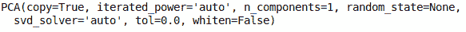

    ###### 图 4.28：特征值和特征向量的最大数量

    使用多个默认参数拟合模型，具体参数如前面的输出所示。`copy = True`是提供给`fit`方法的数据，该数据在应用 PCA 之前会被复制。`iterated_power='auto'`用于定义内部 SVD 求解器的迭代次数。`n_components=1`指定 PCA 模型只返回主成分。`random_state=None`指定需要时内部 SVD 求解器使用的随机数生成器。`svd_solver='auto'`是使用的 SVD 求解器类型。`tol=0.0`是 SVD 求解器认为已收敛的容差值。`whiten=False`指定不修改特征向量。如果设置为`True`，白化会进一步通过乘以样本数量的平方根并除以奇异值来修改成分。这可以帮助改善后续算法步骤的性能。

    通常，除了组件数量（`n_components`）之外，你无需担心调整任何这些参数。例如，你可以将`n_components`传递给`fit`方法，如`model.fit(data, n_components=2)`。

1.  使用`components_`属性显示特征向量：

    ```py
    model.components_
    ```

    输出如下：

    ```py
    array([[ 0.99693955, -0.07817635]])
    ```

1.  使用模型的`fit_transform`方法将鸢尾花数据集转换到低维空间。将转换后的值赋给`data_t`变量。

    ```py
    data_t = model.fit_transform(df.values)
    ```

1.  绘制转换后的值以可视化结果：

    ```py
    plt.figure(figsize=(10, 7))
    plt.plot(data_t);
    plt.xlabel('Sample');
    plt.ylabel('Transformed Data');
    plt.title('The dataset transformed by the principal component');
    ```

    输出如下：

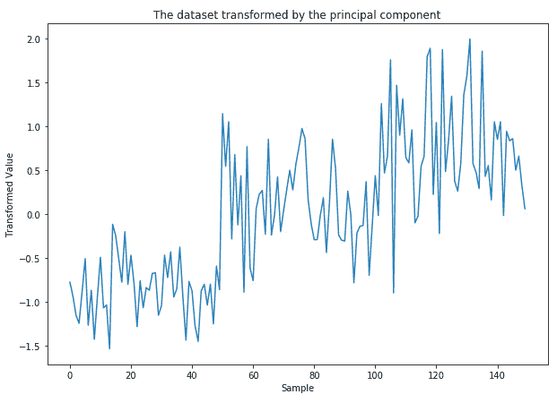

###### 图 4.29：使用 scikit-learn PCA 转换的鸢尾花数据集

恭喜你！你刚刚使用手动 PCA 以及 scikit-learn API 减少了鸢尾花数据集的维度。但在我们过早庆祝之前，比较图 4.23 和图 4.29；这两张图应该是相同的，对吧？我们使用了两种不同的方法在同一数据集上完成 PCA，并且都选择了主成分。在下一个活动中，我们将探讨为什么两者之间存在差异。

### 活动 6：手动 PCA 与 scikit-learn

假设你被要求将一个旧应用程序中手动执行 PCA 的遗留代码移植到一个新的使用 scikit-learn 的应用程序。在移植过程中，你注意到手动 PCA 的输出与移植后的输出之间存在一些差异。为什么手动 PCA 和 scikit-learn 之间会有输出差异？比较两种方法在鸢尾花数据集上的结果。它们之间有什么区别？

#### 注意

该数据集来源于[`archive.ics.uci.edu/ml/machine-learning-databases/iris/`](https://archive.ics.uci.edu/ml/machine-learning-databases/iris/)。可以从[`github.com/TrainingByPackt/Applied-Unsupervised-Learning-with-Python/tree/master/Lesson04/Activity06`](https://github.com/TrainingByPackt/Applied-Unsupervised-Learning-with-Python/tree/master/Lesson04/Activity06)下载。

UCI 机器学习库 [[`archive.ics.uci.edu/ml`](http://archive.ics.uci.edu/ml)]。加利福尼亚州尔湾：加利福尼亚大学信息与计算机科学学院。

1.  导入`pandas`、`numpy`和`matplotlib`绘图库以及 scikit-learn 的`PCA`模型。

1.  加载数据集并按照之前的练习仅选择萼片特征。显示数据的前五行。

1.  计算数据的`协方差`矩阵。

1.  使用 scikit-learn API 并仅使用第一个主成分转换数据。将转换后的数据存储在`sklearn_pca`变量中。

1.  使用手动 PCA 和仅第一个主成分转换数据。将转换后的数据存储在`manual_pca`变量中。

1.  在同一图表上绘制`sklearn_pca`和`manual_pca`的值，以可视化它们的差异。

1.  请注意，两个图表看起来几乎相同，但有一些关键的差异。这些差异是什么？

1.  看看是否能够修改手动 PCA 过程的输出，使其与 scikit-learn 版本一致。

    #### 注意

    提示：scikit-learn API 在转换前会减去数据的均值。

预期输出：在本活动结束时，你将使用手动 PCA 和 scikit-learn PCA 方法对数据集进行转化。你将生成一张图表，展示两个降维数据集实际上是相同的，并且你应该理解为什么它们最初看起来有很大的不同。最终图表应类似于以下内容：

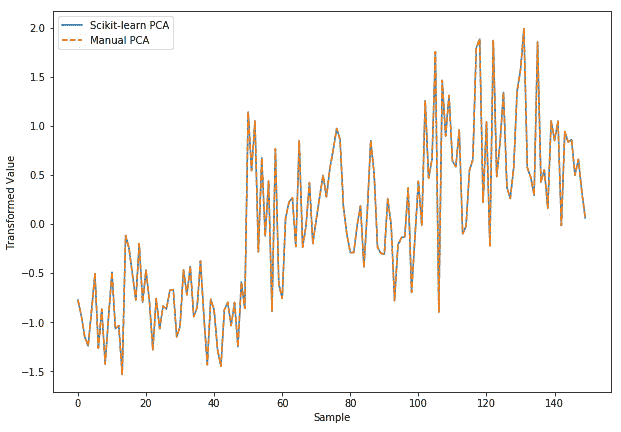

###### 图 4.30：预期的最终图表

该图将展示通过两种方法完成的降维实际上是相同的。

#### 注意

本活动的解决方案可以在第 324 页找到。

### 恢复压缩的数据集

现在我们已经覆盖了一些不同的将数据集转化为低维空间的例子，我们应当考虑这种转化对数据产生了什么实际效果。将 PCA 作为预处理步骤来压缩数据中的特征数量，会导致部分方差被丢弃。以下练习将引导我们完成这一过程，帮助我们了解通过转化丢弃了多少信息。

### 练习 15：通过手动 PCA 可视化方差减少

降维的一个最重要的方面是理解由于降维过程，从数据集中移除了多少信息。移除过多的信息会给后续处理带来额外挑战，而移除的信息不足则会破坏 PCA 或其他技术的目的。在本练习中，我们将可视化 PCA 将 Iris 数据集移除的多少信息：

#### 注意

该数据集来自于[`archive.ics.uci.edu/ml/machine-learning-databases/iris/`](https://archive.ics.uci.edu/ml/machine-learning-databases/iris/)。

它可以从[`github.com/TrainingByPackt/Applied-Unsupervised-Learning-with-Python/tree/master/Lesson04/Exercise15`](https://github.com/TrainingByPackt/Applied-Unsupervised-Learning-with-Python/tree/master/Lesson04/Exercise15)下载。

UCI 机器学习库 [[`archive.ics.uci.edu/ml`](http://archive.ics.uci.edu/ml)]。加利福尼亚大学欧文分校，信息与计算机科学学院。

1.  导入`pandas`、`numpy`和`matplotlib`绘图库：

    ```py
    import pandas as pd
    import numpy as np
    import matplotlib.pyplot as plt
    ```

1.  从鸢尾花数据集读取`花萼`特征：

    ```py
    df = pd.read_csv('iris-data.csv')[['Sepal Length', 'Sepal Width']]
    df.head()
    ```

    输出如下：

    

    ###### 图 4.31：花萼特征

1.  通过减去相应的均值，使数据集围绕零居中：

    #### 注意

    ```py
    means = np.mean(df.values, axis=0)
    means
    ```

    输出如下：

    ```py
    array([5.84333333, 3.054     ])
    ```

    为了计算数据并打印结果，请使用以下代码：

    ```py
    data = df.values - means
    data
    ```

    输出的部分如下：

    

    ###### 图 4.32：输出的部分

1.  使用手动 PCA 基于第一个主成分来变换数据：

    ```py
    eigenvectors, eigenvalues, _ = np.linalg.svd(np.cov(data.T), full_matrices=False)
    P = eigenvectors[0]
    P
    ```

    输出如下：

    ```py
    array([-0.99693955,  0.07817635])
    ```

1.  将数据转换为低维空间：

    ```py
    data_transformed = P.dot(data.T)
    ```

1.  重塑主成分以便后续使用：

    ```py
    P = P.reshape((-1, 1))
    ```

1.  为了计算减少数据集的逆变换，我们需要将选定的特征向量恢复到更高维空间。为此，我们将对矩阵进行求逆。矩阵求逆是另一种线性代数技术，这里我们只会简单介绍。一个方阵，*A*，如果存在另一个方阵*B*，且满足*AB=BA=I*，其中*I*是一个特殊矩阵，称为单位矩阵，只有主对角线上的值为`1`，则该方阵被称为可逆矩阵：

    ```py
    P_transformed = np.linalg.pinv(P)
    P_transformed
    ```

    输出如下：

    ```py
    array([[-0.99693955,  0.07817635]])
    ```

1.  为矩阵乘法准备变换后的数据：

    ```py
    data_transformed = data_transformed.reshape((-1, 1))
    ```

1.  计算减少数据的逆变换，并绘制结果以可视化去除数据方差的效果：

    ```py
    data_restored = data_transformed.dot(P_transformed)
    data_restored
    ```

    输出的部分如下：

    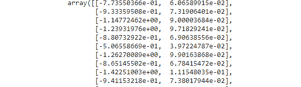

    ###### 图 4.33：减少数据的逆变换

1.  将`means`添加回变换后的数据：

    ```py
    data_restored += means
    ```

1.  通过绘制原始数据集和变换后的数据集来可视化结果：

    ```py
    plt.figure(figsize=(10, 7))
    plt.plot(data_restored[:,0], data_restored[:,1], linestyle=':', label='PCA restoration');
    plt.scatter(df['Sepal Length'], df['Sepal Width'], marker='*', label='Original');
    plt.legend();
    plt.xlabel('Sepal Length');
    plt.ylabel('Sepal Width');
    plt.title('Inverse transform after removing variance');
    ```

    输出如下：

    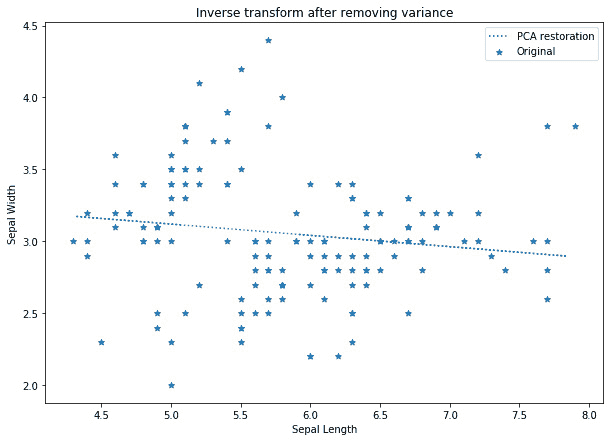

    ###### 图 4.34：去除方差后的逆变换

1.  该数据集只有两个变化成分。如果我们不去除任何成分，那么逆变换的结果会是什么？再次将数据转换为低维空间，但这次使用所有的特征向量：

    ```py
    P = eigenvectors
    data_transformed = P.dot(data.T)
    ```

1.  转置`data_transformed`，使其具有正确的形状以进行矩阵乘法：

    ```py
    data_transformed = data_transformed.T
    ```

1.  现在，将数据恢复到更高维空间：

    ```py
    data_restored = data_transformed.dot(P)
    data_restored
    ```

    输出的部分如下：

    

    ###### 图 4.35：恢复的数据

1.  将均值添加回恢复的数据：

    ```py
    data_restored += means
    ```

1.  在原始数据集的背景下可视化恢复的数据：

    ```py
    plt.figure(figsize=(10, 7))
    plt.scatter(data_restored[:,0], data_restored[:,1], marker='d', label='PCA restoration', c='k');
    plt.scatter(df['Sepal Length'], df['Sepal Width'], marker='o', label='Original', c='k');
    plt.legend();
    plt.xlabel('Sepal Length');
    plt.ylabel('Sepal Width');
    plt.title('Inverse transform after removing variance');
    ```

    输出如下：


###### 图 4.36：去除方差后的逆变换

如果我们比较本练习中生成的两个图，我们可以看到，PCA 降维后的数据集与恢复的数据集基本上是两个特征集之间的负线性趋势线。我们可以将其与从所有可用成分恢复的数据集进行比较，在该数据集中我们已经完整地重建了原始数据集。

### 练习 16：通过可视化降方差

在本练习中，我们将再次可视化降维对数据集的影响；不过这次，我们将使用 scikit-learn API。由于 scikit-learn 模型的强大功能和简便性，这也是在实际应用中常用的方法：

#### 注意

该数据集来自 [`archive.ics.uci.edu/ml/machine-learning-databases/iris/`](https://archive.ics.uci.edu/ml/machine-learning-databases/iris/)。可以从 [`github.com/TrainingByPackt/Applied-Unsupervised-Learning-with-Python/tree/master/Lesson04/Exercise16`](https://github.com/TrainingByPackt/Applied-Unsupervised-Learning-with-Python/tree/master/Lesson04/Exercise16) 下载。

UCI 机器学习库 [[`archive.ics.uci.edu/ml`](http://archive.ics.uci.edu/ml)]。加利福尼亚州欧文市：加利福尼亚大学信息与计算机科学学院。

1.  导入 `pandas`、`numpy` 和 `matplotlib` 绘图库，以及从 scikit-learn 中导入 `PCA` 模型：

    ```py
    import pandas as pd
    import numpy as np
    import matplotlib.pyplot as plt
    from sklearn.decomposition import PCA
    ```

1.  从鸢尾花数据集中读取 `Sepal` 特征：

    ```py
    df = pd.read_csv('iris-data.csv')[['Sepal Length', 'Sepal Width']]
    df.head()
    ```

    输出如下：

    

    ###### 图 4.37：来自鸢尾花数据集的 Sepal 特征

1.  使用 scikit-learn API 基于第一个主成分对数据进行变换：

    ```py
    model = PCA(n_components=1)
    data_p = model.fit_transform(df.values)
    ```

    输出如下：

1.  计算降维数据的逆变换，并绘制结果以可视化去除数据中方差的效果：

    ```py
    data = model.inverse_transform(data_p);
    plt.figure(figsize=(10, 7))
    plt.plot(data[:,0], data[:,1], linestyle=':', label='PCA restoration');
    plt.scatter(df['Sepal Length'], df['Sepal Width'], marker='*', label='Original');
    plt.legend();
    plt.xlabel('Sepal Length');
    plt.ylabel('Sepal Width');
    plt.title('Inverse transform after removing variance');
    ```

    输出如下：

    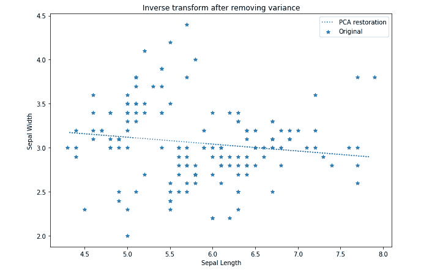

    ###### 图 4.38：去除方差后的逆变换

1.  该数据集中只有两个变化成分。如果我们不去除任何成分，逆变换的结果会是什么？

    ```py
    model = PCA()
    data_p = model.fit_transform(df.values)
    data = model.inverse_transform(data_p);
    plt.figure(figsize=(10, 7))
    plt.scatter(data[:,0], data[:,1], marker='d', label='PCA restoration', c='k');
    plt.scatter(df['Sepal Length'], df['Sepal Width'], marker='o', label='Original', c='k');
    plt.legend();
    plt.xlabel('Sepal Length');
    plt.ylabel('Sepal Width');
    plt.title('Inverse transform after removing variance');
    ```

    输出如下：

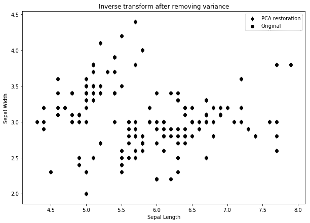

###### 图 4.39：去除方差后的逆变换

再次，我们展示了从数据集中去除信息的效果，并且展示了如何使用所有可用的特征向量重新创建原始数据。

之前的练习指定了使用 PCA 将数据维度减少到二维，部分原因是为了方便结果的可视化。然而，我们也可以使用 PCA 将数据维度减少到任何小于原始数据集的值。以下示例演示了如何使用 PCA 将数据集减少到三维，从而实现可视化。

### 练习 17：在 Matplotlib 中绘制 3D 图形

在 matplotlib 中创建 3D 散点图并不像简单地将一系列 (*x*, *y*, *z*) 坐标提供给散点图那么简单。在本练习中，我们将通过一个简单的 3D 绘图示例，使用鸢尾花数据集进行操作：

#### 注意

本数据集来自 [`archive.ics.uci.edu/ml/machine-learning-databases/iris/`](https://archive.ics.uci.edu/ml/machine-learning-databases/iris/)。

可以从 [`github.com/TrainingByPackt/Applied-Unsupervised-Learning-with-Python/tree/master/Lesson04/Exercise17`](https://github.com/TrainingByPackt/Applied-Unsupervised-Learning-with-Python/tree/master/Lesson04/Exercise17) 下载。

UCI 机器学习数据库 [[`archive.ics.uci.edu/ml`](http://archive.ics.uci.edu/ml)]。加利福尼亚州欧文市：加利福尼亚大学信息与计算机科学学院。

1.  导入 `pandas` 和 `matplotlib`。为了启用 3D 绘图，你还需要导入 `Axes3D`：

    ```py
    from mpl_toolkits.mplot3d import Axes3D
    import pandas as pd
    import matplotlib.pyplot as plt
    ```

1.  读取数据集并选择 `Sepal Length`、`Sepal Width` 和 `Petal Width` 列

    ```py
    df = pd.read_csv('iris-data.csv')[['Sepal Length', 'Sepal Width', 'Petal Width']]
    df.head()
    ```

    输出结果如下：

    

    ###### 图 4.40：数据的前五行

1.  在三维空间中绘制数据，并使用 `projection='3d'` 参数与 `add_subplot` 方法来创建 3D 图：

    ```py
    fig = plt.figure(figsize=(10, 7))
    ax = fig.add_subplot(111, projection='3d') # Where Axes3D is required
    ax.scatter(df['Sepal Length'], df['Sepal Width'], df['Petal Width']);
    ax.set_xlabel('Sepal Length (mm)');
    ax.set_ylabel('Sepal Width (mm)');
    ax.set_zlabel('Petal Width (mm)');
    ax.set_title('Expanded Iris Dataset');
    ```

    绘图结果如下：

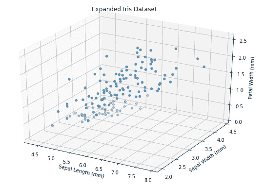

###### 图 4.41：扩展版鸢尾花数据集

#### 注意

尽管导入了 Axes3D，但没有直接使用，它对于配置三维绘图窗口是必需的。如果省略了 Axes3D 的导入，`projection='3d'` 参数将返回一个 `AttributeError`。

### 活动 7：使用扩展版鸢尾花数据集进行 PCA

在本活动中，我们将使用完整的鸢尾花数据集，观察选择不同数量组件进行 PCA 分解的效果。本活动旨在模拟一个真实世界问题中的过程，我们试图确定选择最佳组件数，同时平衡降维程度和信息丢失。因此，我们将使用 scikit-learn 的 PCA 模型：

#### 注意

本数据集来自 [`archive.ics.uci.edu/ml/machine-learning-databases/iris/`](https://archive.ics.uci.edu/ml/machine-learning-databases/iris/)。

可以从 [`github.com/TrainingByPackt/Applied-Unsupervised-Learning-with-Python/tree/master/Lesson04/Activity07`](https://github.com/TrainingByPackt/Applied-Unsupervised-Learning-with-Python/tree/master/Lesson04/Activity07) 下载。

UCI 机器学习库 [[`archive.ics.uci.edu/ml`](http://archive.ics.uci.edu/ml)]。加利福尼亚州欧文市：加利福尼亚大学信息与计算机科学学院。

1.  导入`pandas`和`matplotlib`。为了启用三维绘图，您还需要导入`Axes3D`。

1.  读取数据集，并选择`花萼长度`、`花萼宽度`和`花瓣宽度`列。

1.  在三维空间中绘制数据。

1.  创建一个`PCA`模型，未指定组件数量。

1.  将模型拟合到数据集。

1.  显示特征值或`explained_variance_ratio_`。

1.  我们希望减少数据集的维度，但仍保持至少 90%的方差。为保持 90%的方差，所需的最小组件数是多少？

1.  创建一个新的`PCA`模型，这次指定所需的组件数量，以保持至少 90%的方差。

1.  使用新模型变换数据。

1.  绘制变换后的数据。

1.  将变换后的数据恢复到原始数据空间。

1.  在一个子图中绘制恢复后的三维数据，在第二个子图中绘制原始数据，以可视化去除部分方差的效果：

    ```py
    fig = plt.figure(figsize=(10, 14))
    # Original Data
    ax = fig.add_subplot(211, projection='3d')
    # Transformed Data
    ax = fig.add_subplot(212, projection='3d')
    ```

预期输出：最终图形将如下所示：

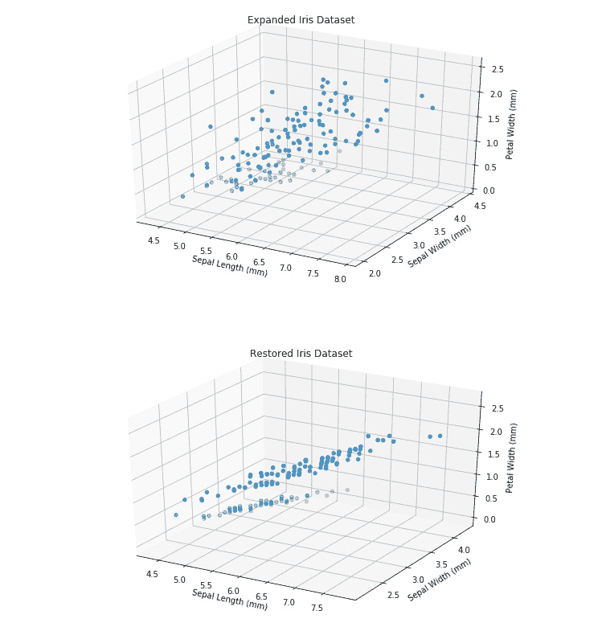

###### 图 4.42：预期图

#### 注意

本活动的解决方案可以在第 328 页找到。

## 总结

本章介绍了降维和 PCA 的过程。我们完成了一些练习，并发展了提取数据中最重要方差成分的技能，以减少数据集的大小，既使用手动 PCA 过程，也使用 scikit-learn 提供的模型。在本章中，我们还将降维后的数据集恢复到原始数据空间，并观察去除方差对原始数据的影响。最后，我们讨论了 PCA 和其他降维过程的多种潜在应用。在下一章中，我们将介绍基于神经网络的自编码器，并使用 Keras 包实现它们。
