# 第五章：自编码器

## 学习目标

本章结束时，您将能够完成以下内容：

+   解释自编码器的应用领域及其使用案例

+   理解人工神经网络的实现与应用

+   使用 Keras 框架实现一个人工神经网络

+   解释自编码器在降维和去噪中的应用

+   使用 Keras 框架实现自编码器

+   解释并实现一个基于卷积神经网络的自编码器模型

本章将介绍自编码器及其应用。

## 引言

本章继续讨论降维技术，我们将焦点转向自编码器。自编码器是一个特别有趣的研究领域，因为它们提供了一种基于人工神经网络的有监督学习方法，但又是在无监督的环境下进行的。基于人工神经网络的自编码器是一种极为有效的降维手段，并且提供了额外的好处。随着数据、处理能力和网络连接的可用性不断提升，自编码器自 1980 年代末期以来，正在经历一场复兴，重新被广泛使用和研究。这也与人工神经网络的研究相一致，后者最早在 1960 年代被提出和实现。如今，只需进行简单的互联网搜索，就能发现神经网络的流行性和强大能力。

自编码器可以用于图像去噪和生成人工数据样本，结合其他方法，如递归神经网络或**长短期记忆**（**LSTM**）架构，用于预测数据序列。人工神经网络的灵活性和强大功能使得自编码器能够形成数据的高效表示，之后这些表示可以直接用于极其高效的搜索方法，或作为特征向量进行后续处理。

考虑在图像去噪应用中使用自编码器，我们展示的是左侧的图像（见*图 5.1*）。可以看到，图像受到一些随机噪声的影响。我们可以使用经过特殊训练的自编码器去除这些噪声，右侧的图像就是去噪后的结果（见*图 5.1*）。在学习如何去除噪声的过程中，自编码器也学习到了如何编码构成图像的重要信息，并将这些信息解码（或重构）为原始图像的更清晰版本。

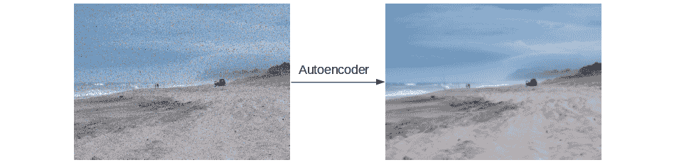

###### 图 5.1：自编码器去噪

#### 注意

此图像修改自 [`www.freenzphotos.com/free-photos-of-bay-of-plenty/stormy-fishermen/`](http://www.freenzphotos.com/free-photos-of-bay-of-plenty/stormy-fishermen/) 并遵循 CC0 许可协议。

本例演示了自编码器在无监督学习中有用的一个方面（编码阶段），以及在生成新图像时有用的另一个方面（解码阶段）。在本章中，我们将进一步探讨自编码器的这两个有用阶段，并将自编码器的输出应用于 CIFAR-10 数据集的聚类。

这里是编码器和解码器的表示：

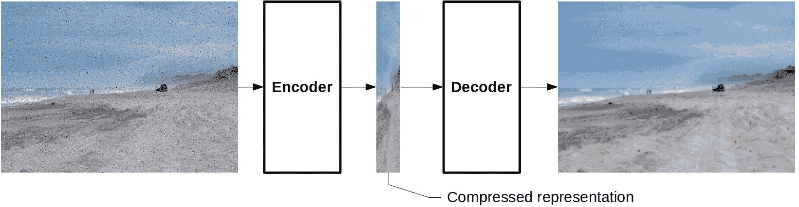

###### 图 5.2：编码器/解码器表示

## 人工神经网络基础

鉴于自编码器是基于人工神经网络的，因此理解神经网络的原理对于理解自编码器至关重要。本章的这一部分将简要回顾人工神经网络的基础知识。需要注意的是，神经网络的许多方面超出了本书的范围。神经网络的主题本身就能填满许多本书，这一部分并不是对该主题的详尽讨论。

如前所述，人工神经网络主要用于监督学习问题，其中我们有一组输入信息，例如一系列图像，我们正在训练一个算法将这些信息映射到所需的输出，例如类别或标签。以 CIFAR-10 数据集（*图 5.3*）为例，它包含了 10 个不同类别的图像（飞机、汽车、鸟、猫、鹿、狗、青蛙、马、船和卡车），每个类别有 6,000 张图像。当神经网络用于监督学习时，图像被输入到网络中，而对应的类别标签则是网络的期望输出。

然后，网络经过训练，以最大化推断或预测给定图像正确标签的能力。

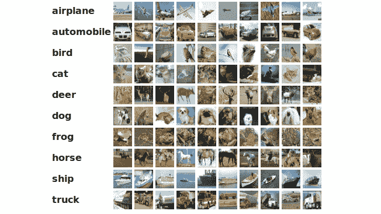

###### 图 5.3：CIFAR-10 数据集

#### 注意

此图来自[`www.cs.toronto.edu/~kriz/cifar.html`](https://www.cs.toronto.edu/~kriz/cifar.html)，出自《从微小图像中学习多层特征》，Alex Krizhevsky，2009 年。

### 神经元

人工神经网络得名于生物神经网络，这些神经网络通常存在于大脑中。虽然这一类比的准确性是值得质疑的，但它是帮助理解人工神经网络概念的有用隐喻。与生物神经元类似，神经元是构建所有神经网络的基本单元，通过不同的配置将多个神经元连接起来，从而形成更强大的结构。每个神经元（*图 5.4*）由四个部分组成：输入值、可调权重（θ）、作用于输入值的激活函数以及最终的输出值：


###### 图 5.4：神经元的解剖结构

激活函数的选择是根据神经网络的目标来特定选择的，有许多常用的函数，包括`tanh`、`sigmoid`、`linear`、`sigmoid`和`ReLU`（修正线性单元）。在本章中，我们将同时使用`sigmoid`和`ReLU`激活函数，接下来我们将更详细地讨论它们。

### Sigmoid 函数

Sigmoid 激活函数因其能将输入值转化为接近二进制的输出，因此在神经网络分类任务中非常常见。Sigmoid 函数的输出如下：

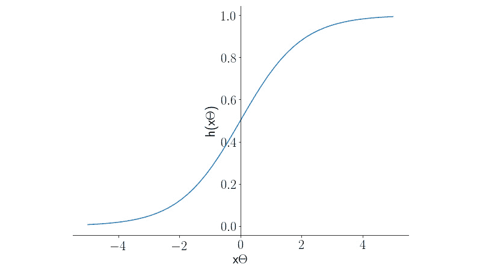

###### 图 5.5：Sigmoid 函数的输出

我们可以在*图 5.5*中看到，sigmoid 函数的输出随着*x*的增大渐近于 1，而当*x*在负方向远离 0 时，输出渐近于 0。这个函数常用于分类任务，因为它提供接近二进制的输出，表示是否属于类（0）或类（1）。

### 修正线性单元（ReLU）

修正线性单元是一个非常有用的激活函数，通常在神经网络的中间阶段使用。简单来说，输入小于 0 时输出为 0，大于 0 时输出为输入值本身。

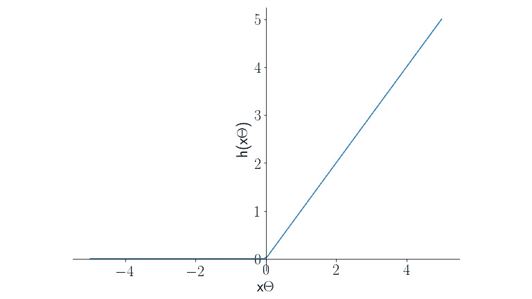

###### 图 5.6：ReLU 的输出

### 练习 18：模拟人工神经网络的神经元

在这个练习中，我们将通过使用 sigmoid 函数，实际介绍神经元在 NumPy 中的编程表示。我们将固定输入并调整可调权重，以研究其对神经元的影响。有趣的是，这个模型也非常接近于逻辑回归的监督学习方法。请执行以下步骤：

1.  导入`numpy`和 matplotlib 包：

    ```py
    import numpy as np
    import matplotlib.pyplot as plt
    ```

1.  配置 matplotlib 以启用使用 Latex 渲染图像中的数学符号：

    ```py
    plt.rc('text', usetex=True)
    ```

1.  将`sigmoid`函数定义为 Python 函数：

    ```py
    def sigmoid(z):
        return np.exp(z) / (np.exp(z) + 1)
    ```

    #### 注意

    在这里，我们使用的是 sigmoid 函数。你也可以使用 ReLU 函数。尽管 ReLU 激活函数在人工神经网络中非常强大，但它的定义非常简单。它只需要在输入大于 0 时返回输入值，否则返回 0：

    `def relu(x):`

    `return np.max(0, x)`

1.  定义神经元的输入（`x`）和可调权重（`theta`）。在这个示例中，输入（`x`）将是 100 个在`-5`和`5`之间线性分布的数字。设置`theta = 1`：

    ```py
    theta = 1
    x = np.linspace(-5, 5, 100)
    x
    ```

    输出的一部分如下：

    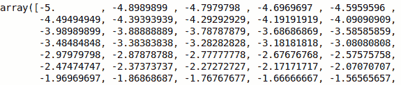

    ###### 图 5.7：打印输入

1.  计算神经元的输出（`y`）：

    ```py
    y = sigmoid(x * theta)
    ```

1.  绘制神经元的输出与输入的关系图：

    ```py
    fig = plt.figure(figsize=(10, 7))
    ax = fig.add_subplot(111)
    ax.plot(x, y)
    ax.set_xlabel('$x$', fontsize=22);
    ax.set_ylabel('$h(x\Theta)$', fontsize=22);
    ax.spines['left'].set_position(('data', 0));
    ax.spines['top'].set_visible(False);
    ax.spines['right'].set_visible(False);
    ax.tick_params(axis='both', which='major', labelsize=22)
    ```

    输出如下：

    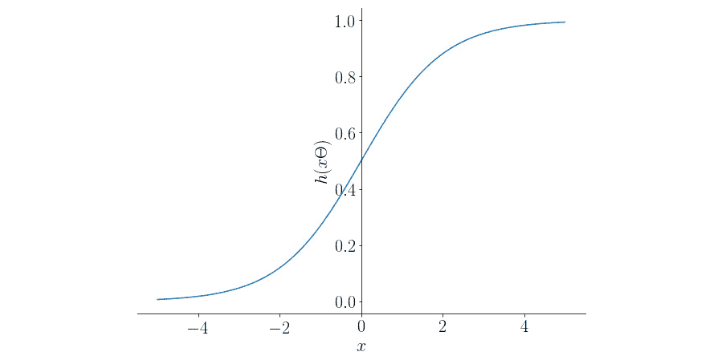

    ###### 图 5.8：神经元与输入的关系图

1.  将可调参数 `theta` 设置为 5，重新计算并存储神经元的输出：

    ```py
    theta = 5
    y_2 = sigmoid(x * theta)
    ```

1.  将可调参数 `theta` 更改为 `0.2`，然后重新计算并存储神经元的输出：

    ```py
    theta = 0.2
    y_3 = sigmoid(x * theta)
    ```

1.  在同一图表上绘制神经元的三条不同输出曲线（`theta = 1`，`theta = 5`，`theta = 0.2`）：

    ```py
    fig = plt.figure(figsize=(10, 7))
    ax = fig.add_subplot(111)
    ax.plot(x, y, label='$\Theta=1$');
    ax.plot(x, y_2, label='$\Theta=5$', linestyle=':');
    ax.plot(x, y_3, label='$\Theta=0.2$', linestyle='--');
    ax.set_xlabel('$x\Theta$', fontsize=22);
    ax.set_ylabel('$h(x\Theta)$', fontsize=22);
    ax.spines['left'].set_position(('data', 0));
    ax.spines['top'].set_visible(False);
    ax.spines['right'].set_visible(False);
    ax.tick_params(axis='both', which='major', labelsize=22);
    ax.legend(fontsize=22);
    ```

    输出如下所示：

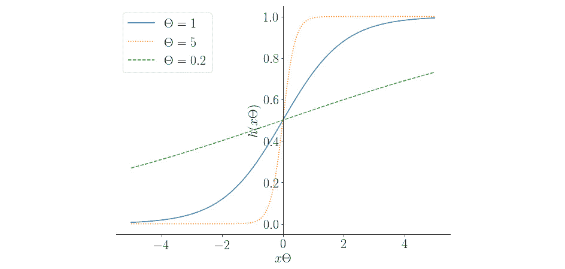

###### 图 5.9: 神经元的输出曲线

在本次练习中，我们使用了一个具有 Sigmoid 激活函数的人工神经网络基本构建模块。我们可以看到，使用 Sigmoid 函数会增加梯度的陡峭度，这意味着只有较小的 x 值才能将输出推向接近 1 或 0。同样，减小 `theta` 会降低神经元对非零值的敏感度，导致需要更极端的输入值才能将输出推向 0 或 1，从而调节神经元的输出。

### 活动 8：使用 ReLU 激活函数建模神经元

在本次活动中，我们将研究 ReLU 激活函数以及可调权重对修改 ReLU 单元输出的影响：

1.  导入 `numpy` 和 matplotlib。

1.  将 ReLU 激活函数定义为一个 Python 函数。

1.  定义神经元的输入（`x`）和可调权重（`theta`）。在这个示例中，输入（`x`）将是 100 个在线性间隔内从`-5`到`5`的数字。设置`theta = 1`。

1.  计算输出（`y`）。

1.  绘制神经元的输出与输入的关系图。

1.  现在，将 `theta` 设置为 5，重新计算并存储神经元的输出。

1.  现在，将 `theta` 设置为 `0.2`，然后重新计算并存储神经元的输出。

1.  在同一图表上绘制神经元的三条不同输出曲线（`theta = 1`，`theta = 5`，和 `theta = 0.2`）。

在本活动结束时，您将为 ReLU 激活神经元开发一系列响应曲线。您还将能够描述改变 `theta` 值对神经元输出的影响。输出将如下所示：

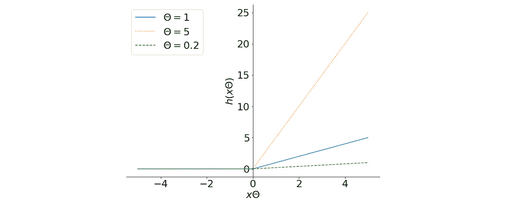

###### 图 5.10: 预期的输出曲线

#### 注意

这个活动的解决方案可以在第 333 页找到。

### 神经网络：架构定义

单个神经元在孤立状态下并不是特别有用；它提供一个激活函数和调节输出的手段，但单个神经元的学习能力有限。当多个神经元被组合并连接成网络结构时，它们的功能会更强大。通过使用多个不同的神经元并结合各个神经元的输出，可以建立更复杂的关系并构建更强大的学习算法。在本节中，我们将简要讨论神经网络的结构，并使用 Keras 机器学习框架([`keras.io/`](https://keras.io/)) 实现一个简单的神经网络。


###### 图 5.11：简化表示的神经网络

*图 5.11*展示了一个两层全连接神经网络的结构。我们可以做出的第一个观察是，这个结构包含了大量的信息，并且具有高度的连接性，这通过指向每个节点的箭头表示。从图像的左侧开始，我们可以看到神经网络的输入值，表示为(*x*)值。在这个例子中，每个样本有*m*个输入值，而且只有第一个样本被输入到网络中，因此，值来自于！凳子的特写

描述自动生成 到 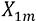。这些值随后与神经网络第一层的相应权重相乘（），然后传递到相应神经元的激活函数中。这被称为**前馈**神经网络。*图 5.11*中用于标识权重的符号是！标志的特写

描述自动生成，其中*i*是权重所属的层，*j*是输入节点的编号（从顶部开始为 1），*k*是权重传递到的后续层节点。

观察第一层（也称为**隐藏层**）输出与输出层输入之间的互联性，我们可以看到，有大量的可训练参数（权重）可以用于将输入映射到期望的输出。*图 5.11*中的网络表示一个*n*类神经网络分类器，其中每个*n*节点的输出表示输入属于相应类别的概率。

每一层都可以使用不同的激活函数，如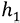和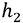所示，从而允许不同的激活函数混合使用，例如，第一层可以使用 ReLU，第二层可以使用 tanh，第三层可以使用 sigmoid。最终输出通过将前一层输出与相应的权重相乘并求和来计算。

如果我们考虑第一层节点的输出，可以通过将输入值与相应的权重相乘，求和结果，并通过激活函数来计算：


###### 图 5.12：计算最后一个节点的输出

随着输入和输出之间的层数增加，我们增加了网络的深度。深度的增加也意味着可训练参数的数量增多，同时数据中描述关系的复杂性增加。通常，随着深度的增加，训练网络会变得更加困难，因为选择用于输入的特征变得更加关键。此外，随着我们向每一层添加更多的神经元，我们也增加了神经网络的高度。通过增加更多的神经元，网络描述数据集的能力增强，同时可训练的参数也增多。如果添加了过多的神经元，网络可能会记住数据集中的样本，但无法对新样本进行泛化。构建神经网络的关键在于找到一个平衡点，使得模型既有足够的复杂性来描述数据中的关系，又不会复杂到只会记忆训练样本。

### 练习 19：定义 Keras 模型

在这个练习中，我们将使用 Keras 机器学习框架定义一个神经网络架构（类似于*图 5.11*），用于对 CIFAR-10 数据集中的图像进行分类。由于每个输入图像的大小为 32 x 32 像素，输入向量将包含 32*32 = 1,024 个值。CIFAR-10 有 10 个不同的类别，因此神经网络的输出将由 10 个独立的值组成，每个值表示输入数据属于相应类别的概率。

1.  对于这个练习，我们将需要 Keras 机器学习框架。Keras 是一个高层神经网络 API，通常用于现有库之上，如 TensorFlow 或 Theano。Keras 使得在底层框架之间切换变得更加容易，因为它提供的高层接口在不同的底层库中保持一致。在本书中，我们将使用 TensorFlow 作为底层库。如果你还没有安装 Keras 和 TensorFlow，请使用`conda`安装：

    ```py
    !conda install tensforflow keras
    ```

    或者，你也可以使用`pip`安装它：

    ```py
    !pip install tensorflow keras
    ```

1.  我们将需要从`keras.models`和`keras.layers`中导入`Sequential`和`Dense`类。导入这些类：

    ```py
    from keras.models import Sequential
    from keras.layers import Dense
    ```

1.  如前所述，输入层将接收 1,024 个值。第二层（层 1）将包含 500 个单元，并且因为网络需要分类 10 个不同的类别，所以输出层将包含 10 个单元。在 Keras 中，模型是通过将有序的层列表传递给`Sequential`模型类来定义的。此示例使用了`Dense`层类，它是一个全连接神经网络层。第一层将使用 ReLU 激活函数，而输出层将使用`softmax`函数来确定每个类别的概率。定义模型：

    ```py
    model = Sequential([
        Dense(500, input_shape=(1024,), activation='relu'),
        Dense(10, activation='softmax')
    ])
    ```

1.  在定义了模型之后，我们可以使用`summary`方法来确认模型的结构以及其中可训练的参数（或权重）的数量：

    ```py
    model.summary()
    ```

    输出如下：

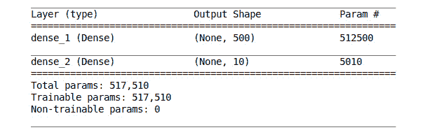

###### 图 5.13：模型中可训练参数的结构与数量

该表总结了神经网络的结构。我们可以看到，模型中有我们指定的两层，第一层包含 500 个单元，第二层包含 10 个输出单元。`Param #` 列显示了每一层中可训练权重的数量。表格还告诉我们，网络中总共有 517,510 个可训练权重。

在这个练习中，我们在 Keras 中创建了一个神经网络模型，该模型包含超过 500,000 个权重，可以用来对 CIFAR-10 的图像进行分类。在接下来的章节中，我们将训练该模型。

### 神经网络：训练

定义好神经网络模型后，我们可以开始训练过程；在这个阶段，我们将以监督学习的方式训练模型，以便在继续训练自编码器之前，对 Keras 框架有一定的熟悉度。监督学习模型通过提供输入信息和已知输出信息来训练模型；训练的目标是构建一个网络，使其能够仅通过模型的参数，将输入信息映射到已知输出。

在像 CIFAR-10 这样的监督分类示例中，输入信息是一张图像，而已知输出是该图像所属的类别。在训练过程中，对于每一个样本的预测，使用指定的误差函数计算前馈网络的预测误差。然后，模型中的每个权重都会进行调整，试图减少误差。这一调整过程被称为**反向传播**，因为误差是从输出开始通过网络向后传播，直到网络的起始位置。

在反向传播过程中，每个可训练的权重都会根据它对整体误差的贡献进行调整，调整幅度与一个被称为**学习率**的值成正比，该值控制可训练权重变化的速率。看一下*图 5.14*，我们可以看到，增加学习率的值可以加快误差减少的速度，但也有可能因为步长过大而无法收敛到最小误差。学习率过小可能会导致我们失去耐心，或者根本没有足够的时间找到全局最小值。因此，找到正确的学习率是一个试错过程，尽管从较大的学习率开始并逐步减少通常是一个有效的方法。以下图示展示了学习率的选择：

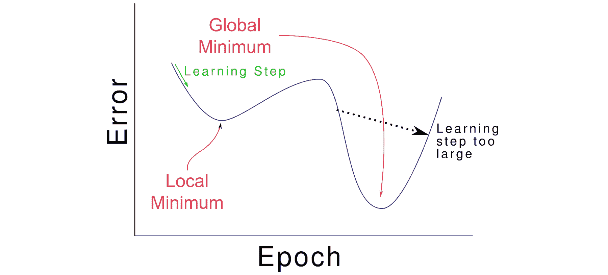

###### 图 5.14：选择正确的学习率（一个 epoch 是一次学习步骤）

训练会重复进行，直到预测中的误差不再减少，或者开发者在等待结果时失去耐心。为了完成训练过程，我们首先需要做出一些设计决策，第一个是选择最合适的误差函数。可用的误差函数有很多种，从简单的均方差到更复杂的选项。类别交叉熵（在接下来的练习中使用）是一个非常有用的误差函数，适用于分类多个类别。

在定义了误差函数之后，我们需要选择一种使用误差函数更新可训练参数的方法。最节省内存且有效的更新方法之一是随机梯度下降法（SGD）；SGD 有许多变种，所有变种都涉及根据每个权重对计算误差的贡献来调整权重。最后的训练设计决策是模型评估的性能指标，以及选择最佳架构；在分类问题中，这可能是模型的分类准确度，或者在回归问题中，可能是产生最低误差分数的模型。这些比较通常是通过交叉验证方法进行的。

### 练习 20：训练 Keras 神经网络模型

幸运的是，我们不需要担心手动编写神经网络的各个组件，如反向传播，因为 Keras 框架会为我们管理这些。在本次练习中，我们将使用 Keras 训练一个神经网络，使用前面练习中定义的模型架构对 CIFAR-10 数据集的一个小子集进行分类。与所有机器学习问题一样，第一步也是最重要的一步是尽可能多地了解数据集，这将是本次练习的初步重点：

#### 注意

你可以从[`github.com/TrainingByPackt/Applied-Unsupervised-Learning-with-Python/tree/master/Lesson05/Exercise20`](https://github.com/TrainingByPackt/Applied-Unsupervised-Learning-with-Python/tree/master/Lesson05/Exercise20)下载`data_batch_1`和`batches.meta`文件。

1.  导入`pickle`、`numpy`、`matplotlib`以及从`keras.models`导入`Sequential`类，并从`keras.layers`导入`Dense`：

    ```py
    import pickle
    import numpy as np
    import matplotlib.pyplot as plt
    from keras.models import Sequential
    from keras.layers import Dense
    ```

1.  加载与随附源代码一起提供的 CIFAR-10 数据集样本，该样本位于`data_batch_1`文件中：

    ```py
    with open('data_batch_1', 'rb') as f:
        dat = pickle.load(f, encoding='bytes')
    ```

1.  数据作为字典加载。显示字典的键：

    ```py
    dat.keys()
    ```

    输出结果如下：

    ```py
    dict_keys([b'batch_label', b'labels', b'data', b'filenames'])
    ```

1.  注意，键是作为二进制字符串存储的，表示为`b'`。我们关心的是数据和标签的内容。我们先来看标签：

    ```py
    labels = dat[b'labels']
    labels
    ```

    输出结果如下：

    

    ###### 图 5.15：显示标签

1.  我们可以看到标签是一个 0 到 9 的值列表，表示每个样本所属的类别。现在，来看一下`data`键的内容：

    ```py
    dat[b'data']
    ```

    输出结果如下：

    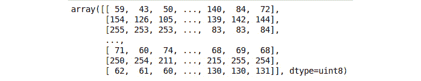

    ###### 图 5.16：数据键的内容

1.  数据键提供了一个包含所有图像数据的 NumPy 数组。图像数据的形状是什么？

    ```py
    dat[b'data'].shape
    ```

    输出结果如下：

    ```py
    (1000, 3072)
    ```

1.  我们可以看到我们有 1000 个样本，但每个样本是一个长度为 3,072 的一维数组。难道图像不应该是 32 x 32 像素吗？是的，它们是，但由于图像是彩色的或 RGB 图像，它们包含三个通道（红、绿、蓝），这意味着图像的尺寸是 32 x 32 x 3。它们还被展开，提供 3,072 长度的向量。所以，我们可以重新调整数组形状，然后可视化一个样本图像。根据 CIFAR-10 文档，前 1,024 个样本是红色，第二个 1,024 个是绿色，第三个 1,024 个是蓝色：

    ```py
    images = np.zeros((10000, 32, 32, 3), dtype='uint8')
    for idx, img in enumerate(dat[b'data']):
        images[idx, :, :, 0] = img[:1024].reshape((32, 32)) # Red
        images[idx, :, :, 1] = img[1024:2048].reshape((32, 32)) # Green
        images[idx, :, :, 2] = img[2048:].reshape((32, 32)) # Blue
    ```

1.  显示前 12 张图片及其标签：

    ```py
    plt.figure(figsize=(10, 7))
    for i in range(12):
        plt.subplot(3, 4, i + 1)
        plt.imshow(images[i])
        plt.title(labels[i])
        plt.axis('off')
    ```

    输出结果如下：

    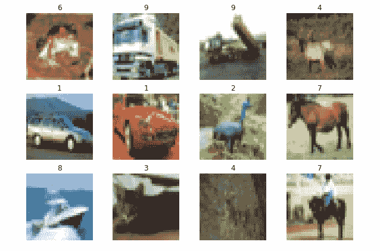

    ###### 图 5.17：前 12 张图片

1.  标签的实际意义是什么？要了解这一点，加载 `batches.meta` 文件：

    ```py
    with open('batches.meta', 'rb') as f:
        label_strings = pickle.load(f, encoding='bytes')

    label_strings
    ```

    输出结果如下：

    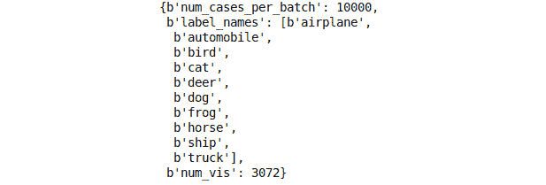

    ###### 图 5.18：标签的含义

1.  解码二进制字符串以获取实际标签：

    ```py
    actual_labels = [label.decode() for label in label_strings[b'label_names']]
    actual_labels
    ```

    输出结果如下：

    

    ###### 图 5.19：打印实际标签

1.  打印前 12 张图片的标签：

    ```py
    for lab in labels[:12]:
        print(actual_labels[lab], end=', ')
    ```

    输出结果如下：

    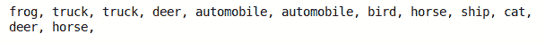

    ###### 图 5.20：前 12 张图片的标签

1.  现在我们需要准备数据来训练模型。第一步是准备输出。目前，输出是一个 0 到 9 的数字列表，但我们需要每个样本都用一个包含 10 个单位的向量表示，正如前面模型所要求的那样。编码后的输出将是一个形状为 10000 x 10 的 NumPy 数组：

    #### 注意

    ```py
    one_hot_labels = np.zeros((images.shape[0], 10))
    for idx, lab in enumerate(labels):
        one_hot_labels[idx, lab] = 1
    ```

1.  显示前 12 个样本的独热编码值：

    ```py
    one_hot_labels[:12]
    ```

    输出结果如下：

    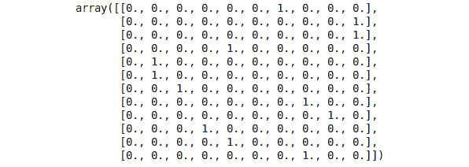

    ###### 图 5.21：前 12 个样本的独热编码值

1.  模型有 1,024 个输入，因为它期望输入的是 32 x 32 的灰度图像。将每张图像的三个通道的平均值取出，将其转换为 RGB：

    ```py
    images = images.mean(axis=-1)
    ```

1.  再次显示前 12 张图片：

    ```py
    plt.figure(figsize=(10, 7))
    for i in range(12):
        plt.subplot(3, 4, i + 1)
        plt.imshow(images[i], cmap='gray')
        plt.title(labels[i])
        plt.axis('off')
    ```

    输出结果如下：

    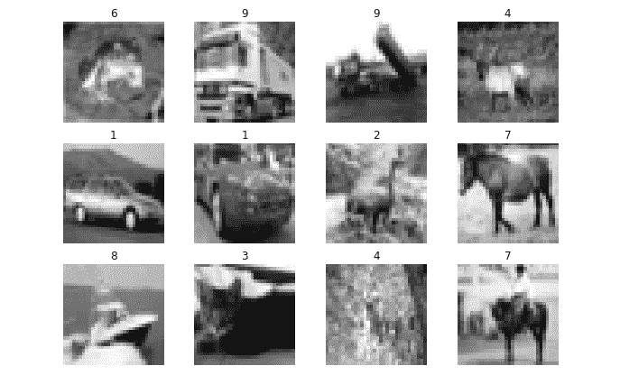

    ###### 图 5.22：再次显示前 12 张图片。

1.  最后，将图片缩放到 0 和 1 之间，这是神经网络所有输入所需要的。由于图像中的最大值为 255，我们将其直接除以 255：

    ```py
    images /= 255.
    ```

1.  我们还需要将图像的形状调整为 10,000 x 1,024：

    ```py
    images = images.reshape((-1, 32 ** 2))
    ```

1.  重新定义模型，使用与*练习 19*，*定义 Keras 模型*相同的架构：

    ```py
    model = Sequential([
        Dense(500, input_shape=(1024,), activation='relu'),
        Dense(10, activation='softmax')

    ])
    ```

1.  现在我们可以在 Keras 中训练模型。我们首先需要编译方法，以指定训练参数。我们将使用分类交叉熵，随机梯度下降，并使用分类准确率作为性能指标：

    ```py
    model.compile(loss='categorical_crossentropy',
                  optimizer='sgd',
                  metrics=['accuracy'])
    ```

1.  使用反向传播方法训练模型，训练 100 个周期，并使用模型的 `fit` 方法：

    ```py
    model.fit(images, one_hot_labels, epochs=100)
    ```

    输出结果如下：

    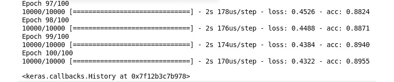

    ###### 图 5.23：训练模型

1.  我们使用这个网络对 1,000 个样本进行了分类，并取得了大约 90% 的分类准确率。请再次检查对前 12 个样本的预测结果：

    ```py
    predictions = model.predict(images[:12])
    predictions
    ```

    输出结果如下：

    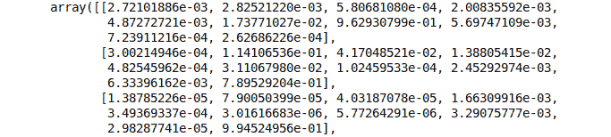

    ###### 图 5.24：打印预测结果

1.  我们可以使用 `argmax` 方法来确定每个样本最可能的类别：

    ```py
    np.argmax(predictions, axis=1)
    ```

    输出结果如下：

    ```py
    array([6, 9, 9, 4, 1, 1, 2, 7, 8, 3, 2, 7])
    ```

1.  与标签进行比较：

    ```py
    labels[:12]
    ```

    输出结果如下：

    ```py
    [6, 9, 9, 4, 1, 1, 2, 7, 8, 3, 4, 7]
    ```

网络在这些样本中犯了一个错误，即它将倒数第二个样本分类为 2（鸟）而不是 4（鹿）。恭喜你！你刚刚成功训练了一个 Keras 神经网络模型。完成下一个活动，进一步巩固你在训练神经网络方面的技能。

### 活动 9：MNIST 神经网络

在本次活动中，你将训练一个神经网络来识别 MNIST 数据集中的图像，并进一步巩固你在训练神经网络方面的技能。这个活动为许多不同分类问题中的神经网络架构奠定了基础，尤其是在计算机视觉领域。从目标检测和识别到分类，这种通用结构被应用于多种不同的场景。

这些步骤将帮助你完成活动：

1.  导入 `pickle`、`numpy`、`matplotlib`，以及来自 Keras 的 `Sequential` 和 `Dense` 类。

1.  加载包含前 10,000 张图像及其相应标签的 `mnist.pkl` 文件，这些数据来自附带源代码中的 MNIST 数据集。MNIST 数据集是一系列 28 x 28 像素的手写数字灰度图像，数字范围从 0 到 9。提取图像和标签。

    #### 注意

    你可以在 [`github.com/TrainingByPackt/Applied-Unsupervised-Learning-with-Python/tree/master/Lesson05/Activity09`](https://github.com/TrainingByPackt/Applied-Unsupervised-Learning-with-Python/tree/master/Lesson05/Activity09) 找到 `mnist.pkl` 文件。

1.  绘制前 10 个样本及其对应标签。

1.  使用独热编码对标签进行编码。

1.  准备图像以便输入神经网络。提示：这个过程有 **两个** 独立的步骤。

1.  在 Keras 中构建一个神经网络模型，接受已准备好的图像，并具有 600 单元的隐藏层，激活函数为 ReLU，输出层的单元数与类别数相同。输出层使用 `softmax` 激活函数。

1.  使用多类交叉熵、随机梯度下降和准确性性能指标编译模型。

1.  训练模型。要达到训练数据至少 95%的分类准确率，需要多少个训练周期（epoch）？

通过完成此活动，你已经训练了一个简单的神经网络来识别手写数字 0 到 9。你还开发了一个用于构建分类问题神经网络的通用框架。通过这个框架，你可以扩展和修改网络以适应其他任务。

#### 注意

本活动的解答可以在第 335 页找到。

## 自编码器

既然我们已经习惯在 Keras 中开发监督学习神经网络模型，我们可以将注意力转回到无监督学习及本章的主要主题——自编码器。自编码器是一种专门设计的神经网络架构，旨在以高效且具有描述性的方式将输入信息压缩到较低维度空间。自编码器网络可以分解为两个独立的子网络或阶段：**编码**阶段和**解码**阶段。首先，编码阶段将输入信息通过一个后续的层进行压缩，该层的单元数少于输入样本的大小。随后，解码阶段扩展压缩后的图像，并试图将压缩数据恢复为其原始形式。因此，网络的输入和期望输出是相同的；网络输入的是 CIFAR-10 数据集中的一张图像，并试图返回相同的图像。该网络架构如*图 5.25*所示；在此图中，我们可以看到自编码器的编码阶段将表示信息的神经元数量减少，而解码阶段则将压缩格式的图像恢复到其原始状态。解码阶段的使用有助于确保编码器正确地表示了信息，因为恢复图像到原始状态所需的所有信息都来自于压缩后的表示。接下来，我们将使用 CIFAR-10 数据集来实现一个简化的自编码器模型：

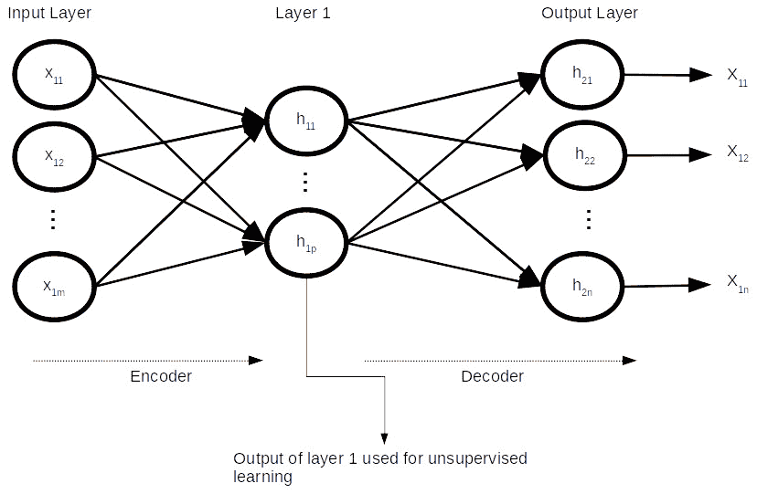

###### 图 5.25：简单自编码器网络架构

### 练习 21：简单自编码器

在本练习中，我们将为 CIFAR-10 数据集的样本构建一个简单的自编码器，将图像中存储的信息压缩以供后续使用。

#### 注意

你可以从[`github.com/TrainingByPackt/Applied-Unsupervised-Learning-with-Python/tree/master/Lesson05/Exercise21`](https://github.com/TrainingByPackt/Applied-Unsupervised-Learning-with-Python/tree/master/Lesson05/Exercise21)下载`data_batch_1`文件。

1.  导入`pickle`、`numpy`和`matplotlib`，以及从`keras.models`中导入`Model`类，从`keras.layers`中导入`Input`和`Dense`：

    ```py
    import pickle
    import numpy as np
    import matplotlib.pyplot as plt
    from keras.models import Model
    from keras.layers import Input, Dense
    ```

1.  加载数据：

    ```py
    with open('data_batch_1', 'rb') as f:
        dat = pickle.load(f, encoding='bytes')
    ```

1.  由于这是无监督学习方法，我们只关注图像数据。按照前一个练习加载图像数据：

    ```py
    images = np.zeros((10000, 32, 32, 3), dtype='uint8')
    for idx, img in enumerate(dat[b'data']):
        images[idx, :, :, 0] = img[:1024].reshape((32, 32)) # Red
        images[idx, :, :, 1] = img[1024:2048].reshape((32, 32)) # Green
        images[idx, :, :, 2] = img[2048:].reshape((32, 32)) # Blue
    ```

1.  将图像转换为灰度图像，缩放至 0 到 1 之间，并将每个图像展平为一个长度为 1,024 的向量：

    ```py
    images = images.mean(axis=-1)
    images = images / 255.0
    images = images.reshape((-1, 32 ** 2))
    images
    ```

1.  定义自编码器模型。由于我们需要访问编码器阶段的输出，我们将使用一种稍微不同于之前的方法来定义模型。定义一个包含`1024`个单元的输入层：

    ```py
    input_layer = Input(shape=(1024,))
    ```

1.  定义后续的`Dense`层，包含`256`个单元（压缩比为 1024/256 = 4），并使用 ReLU 激活函数作为编码阶段。请注意，我们已将该层分配给一个变量，并将前一层传递给类的调用方法：

    ```py
    encoding_stage = Dense(256, activation='relu')(input_layer)
    ```

1.  定义一个后续解码器层，使用 sigmoid 函数作为激活函数，并与输入层具有相同的形状。选择 sigmoid 函数是因为网络的输入值仅介于 0 和 1 之间：

    ```py
    decoding_stage = Dense(1024, activation='sigmoid')(encoding_stage)
    ```

1.  通过将网络的第一层和最后一层传递给`Model`类来构建模型：

    ```py
    autoencoder = Model(input_layer, decoding_stage)
    ```

1.  使用二元交叉熵损失函数和 adadelta 梯度下降法编译自编码器：

    ```py
    autoencoder.compile(loss='binary_crossentropy',
                  optimizer='adadelta')
    ```

    #### 注意

    `adadelta`是随机梯度下降法的一个更复杂版本，其中学习率根据最近一段时间内的梯度更新窗口进行调整。与其他学习率调整方法相比，这避免了非常旧的周期的梯度影响学习率。

1.  现在，让我们拟合模型；同样，我们将图像作为训练数据并作为期望的输出。训练 100 个周期：

    ```py
    autoencoder.fit(images, images, epochs=100)
    ```

    输出如下：

    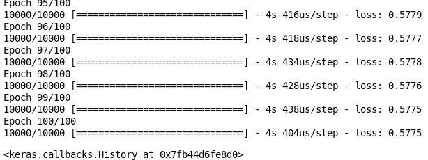

    ###### 图 5.26：训练模型

1.  计算并存储编码阶段前五个样本的输出：

    ```py
    encoder_output = Model(input_layer, encoding_stage).predict(images[:5])
    ```

1.  将编码器输出重塑为 16 x 16（16 x 16 = 256）像素，并乘以 255：

    ```py
    encoder_output = encoder_output.reshape((-1, 16, 16)) * 255
    ```

1.  计算并存储解码阶段前五个样本的输出：

    ```py
    decoder_output = autoencoder.predict(images[:5])
    ```

1.  将解码器的输出重塑为 32 x 32 并乘以 255：

    ```py
    decoder_output = decoder_output.reshape((-1, 32,32)) * 255
    ```

1.  重塑原始图像：

    ```py
    images = images.reshape((-1, 32, 32))
    plt.figure(figsize=(10, 7))
    for i in range(5):
        plt.subplot(3, 5, i + 1)
        plt.imshow(images[i], cmap='gray')
        plt.axis('off')

        plt.subplot(3, 5, i + 6)
        plt.imshow(encoder_output[i], cmap='gray')
        plt.axis('off')   

        plt.subplot(3, 5, i + 11)
        plt.imshow(decoder_output[i], cmap='gray')
        plt.axis('off')        
    ```

    输出如下：

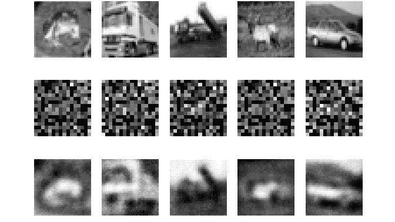

###### 图 5.27：简单自编码器的输出

在*图 5.27*中，我们可以看到三行图像。第一行是原始的灰度图像，第二行是对应于原始图像的自编码器输出，最后，第三行是从编码输入中重建的原始图像。我们可以看到第三行中的解码图像包含了图像的基本形状信息；我们可以看到青蛙和鹿的主体，以及卡车和汽车的轮廓。鉴于我们只训练了 100 个样本，这个练习也可以通过增加训练周期的数量来进一步提高编码器和解码器的性能。现在我们已经获得了训练好的自编码器阶段的输出，我们可以将其作为其他无监督算法的特征向量，如 K-means 或 K 近邻。

### 活动 10：简单 MNIST 自编码器

在此活动中，您将为包含在附带源代码中的 MNIST 数据集创建一个自编码器网络。像本活动中构建的自编码器网络，可以在无监督学习的预处理阶段非常有用。网络产生的编码信息可以用于聚类或分割分析，例如基于图像的网络搜索：

1.  导入`pickle`、`numpy`和`matplotlib`，以及来自 Keras 的`Model`、`Input`和`Dense`类。

1.  从随附源代码提供的 MNIST 数据集样本加载图像（`mnist.pkl`）。

    #### 注意

    你可以从[`github.com/TrainingByPackt/Applied-Unsupervised-Learning-with-Python/tree/master/Lesson05/Activity10`](https://github.com/TrainingByPackt/Applied-Unsupervised-Learning-with-Python/tree/master/Lesson05/Activity10)下载`mnist.pklP-code`文件。

1.  准备输入神经网络的图像。作为提示，这个过程分为**两个**独立的步骤。

1.  构建一个简单的自编码器网络，在编码阶段后将图像大小缩小到 10 x 10。

1.  使用二进制交叉熵损失函数和`adadelta`梯度下降法编译自编码器。

1.  拟合编码器模型。

1.  计算并存储前五个样本的编码阶段输出。

1.  将编码器输出重塑为 10 x 10（10 x 10 = 100）像素并乘以 255。

1.  计算并存储前五个样本的解码阶段输出。

1.  将解码器的输出重塑为 28 x 28 并乘以 255。

1.  绘制原始图像、编码器输出和解码器输出。

完成此活动后，你将成功训练一个自编码器网络，该网络能够提取数据集中关键信息，并为后续处理做好准备。输出将类似于以下内容：

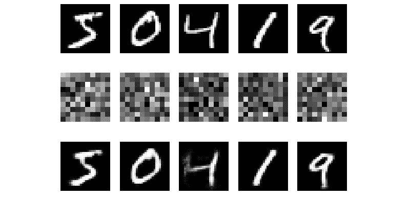

###### 图 5.28：原始图像、编码器输出和解码器的预期图示

#### 注意

此活动的解决方案可以在第 338 页找到。

### 练习 22：多层自编码器

在本练习中，我们将为 CIFAR-10 数据集的样本构建一个多层自编码器，将图像中存储的信息压缩以备后续使用：

#### 注意

你可以从[`github.com/TrainingByPackt/Applied-Unsupervised-Learning-with-Python/tree/master/Lesson05/Exercise22`](https://github.com/TrainingByPackt/Applied-Unsupervised-Learning-with-Python/tree/master/Lesson05/Exercise22)下载`data_batch_1`文件。

1.  导入`pickle`、`numpy`和`matplotlib`，以及来自`keras.models`的`Model`类，并导入来自`keras.layers`的`Input`和`Dense`类：

    ```py
    import pickle
    import numpy as np
    import matplotlib.pyplot as plt
    from keras.models import Model
    from keras.layers import Input, Dense
    ```

1.  加载数据：

    ```py
    with open('data_batch_1', 'rb') as f:
        dat = pickle.load(f, encoding='bytes')
    ```

1.  由于这是无监督学习方法，我们只关心图像数据。按照之前的练习加载图像数据：

    ```py
    images = np.zeros((10000, 32, 32, 3), dtype='uint8')
    for idx, img in enumerate(dat[b'data']):
        images[idx, :, :, 0] = img[:1024].reshape((32, 32)) # Red
        images[idx, :, :, 1] = img[1024:2048].reshape((32, 32)) # Green
        images[idx, :, :, 2] = img[2048:].reshape((32, 32)) # Blue
    ```

1.  将图像转换为灰度，缩放到 0 到 1 之间，并将每个图像展平为一个长度为 1,024 的向量：

    ```py
    images = images.mean(axis=-1)
    images = images / 255.0
    images = images.reshape((-1, 32 ** 2))
    images
    ```

1.  定义多层自编码器模型。我们将使用与简单自编码器模型相同形状的输入：

    ```py
    input_layer = Input(shape=(1024,))
    ```

1.  我们将在 256 自编码器阶段之前添加另一个层，这次使用 512 个神经元：

    ```py
    hidden_encoding = Dense(512, activation='relu')(input_layer)
    ```

1.  使用与之前练习相同大小的自编码器，但这次输入层是`hidden_encoding`层：

    ```py
    encoding_stage = Dense(256, activation='relu')(hidden_encoding)
    ```

1.  添加解码隐藏层：

    ```py
    hidden_decoding = Dense(512, activation='relu')(encoding_stage)
    ```

1.  使用与之前练习相同的输出阶段，这次连接到隐藏的解码阶段：

    ```py
    decoding_stage = Dense(1024, activation='sigmoid')(hidden_decoding)
    ```

1.  通过将网络的第一层和最后一层传递给 `Model` 类来构建模型：

    ```py
    autoencoder = Model(input_layer, decoding_stage)
    ```

1.  使用二元交叉熵损失函数和 `adadelta` 梯度下降法编译自编码器：

    ```py
    autoencoder.compile(loss='binary_crossentropy',
                  optimizer='adadelta')
    ```

1.  现在，让我们拟合模型；再次，我们将图像作为训练数据和期望的输出。训练 100 个 epoch：

    ```py
    autoencoder.fit(images, images, epochs=100)
    ```

    输出如下：

    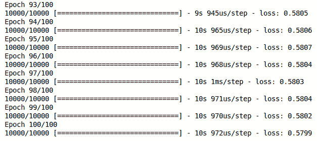

    ###### 图 5.29: 训练模型

1.  计算并存储前五个样本的编码阶段输出：

    ```py
    encoder_output = Model(input_stage, encoding_stage).predict(images[:5])
    ```

1.  将编码器输出调整为 10 x 10（10 x 10 = 100）像素，并乘以 255：

    ```py
    encoder_output = encoder_output.reshape((-1, 10, 10)) * 255
    ```

1.  计算并存储前五个样本的解码阶段输出：

    ```py
    decoder_output = autoencoder.predict(images[:5])
    ```

1.  将解码器的输出调整为 28 x 28，并乘以 255：

    ```py
    decoder_output = decoder_output.reshape((-1, 28, 28)) * 255
    ```

1.  绘制原始图像、编码器输出和解码器：

    ```py
    images = images.reshape((-1, 28, 28))
    plt.figure(figsize=(10, 7))
    for i in range(5):
        plt.subplot(3, 5, i + 1)
        plt.imshow(images[i], cmap='gray')
        plt.axis('off')

        plt.subplot(3, 5, i + 6)
        plt.imshow(encoder_output[i], cmap='gray')
        plt.axis('off')   

        plt.subplot(3, 5, i + 11)
        plt.imshow(decoder_output[i], cmap='gray')
        plt.axis('off')      
    ```

    输出如下：

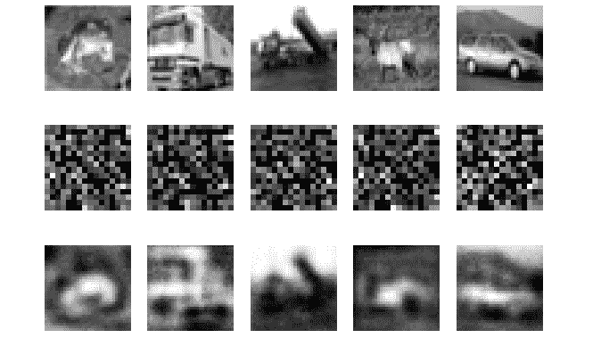

###### 图 5.30: 多层自编码器的输出

通过查看简单和多层自编码器产生的误差得分，并比较 *图 5.27* 和 *图 5.30*，我们可以看到这两种编码器结构的输出几乎没有区别。两幅图的中间行显示，两个模型学习到的特征实际上是不同的。我们可以使用许多选项来改进这两个模型，例如，训练更多的 epochs，使用不同数量的单元或神经元，或使用不同数量的层。这个练习的构建旨在展示如何构建和使用自编码器，但优化通常是一个系统性的试错过程。我们鼓励您调整模型的一些参数，并自己研究不同的结果。

### 卷积神经网络

在构建我们之前的所有神经网络模型时，您可能会注意到，我们在将图像转换为灰度图像时移除了所有颜色信息，并将每张图像展平为一个长度为 1,024 的单一向量。通过这种方式，我们本质上丢失了可能对我们有用的许多信息。图像中的颜色可能是特定于图像中的类别或物体的；此外，我们还丢失了许多关于图像的空间信息，例如，卡车图像中拖车相对于驾驶室的位置，或鹿的腿部相对于头部的位置。卷积神经网络不会遭遇这种信息丢失的问题。这是因为，卷积神经网络不是使用平坦的可训练参数结构，而是将权重存储在网格或矩阵中，这意味着每组参数可以在其结构中具有多个层。通过将权重组织成网格，我们防止了空间信息的丢失，因为这些权重以滑动的方式应用于图像。此外，通过拥有多个层，我们可以保留与图像相关的颜色通道。

在开发基于卷积神经网络的自编码器时，MaxPooling2D 和 Upsampling2D 层非常重要。MaxPooling2D 层通过在输入的窗口中选择最大值，来对输入矩阵在两个维度上进行降采样或减小尺寸。假设我们有一个 2 x 2 的矩阵，其中三个单元的值为 1，一个单元的值为 2：


###### 图 5.31：示例矩阵演示

如果提供给 MaxPooling2D 层，这个矩阵会返回一个单一的 2 值，从而在两个方向上都将输入的尺寸减半。

UpSampling2D 层的作用与 MaxPooling2D 层相反，它增加了输入的尺寸，而不是减少它。上采样过程会重复数据的行和列，从而将输入矩阵的大小加倍。

### 练习 23：卷积自编码器

在本练习中，我们将开发一个基于卷积神经网络的自编码器，并将其性能与之前的全连接神经网络自编码器进行比较：

#### 注意

你可以从[`github.com/TrainingByPackt/Applied-Unsupervised-Learning-with-Python/tree/master/Lesson05/Exercise23`](https://github.com/TrainingByPackt/Applied-Unsupervised-Learning-with-Python/tree/master/Lesson05/Exercise23)下载`data_batch_1`文件。

1.  导入`pickle`、`numpy`、`matplotlib`，以及来自`keras.models`的`Model`类，和来自`keras.layers`的`Input`、`Conv2D`、`MaxPooling2D`、`UpSampling2D`：

    ```py
    import pickle
    import numpy as np
    import matplotlib.pyplot as plt
    from keras.models import Model
    from keras.layers import Input, Conv2D, MaxPooling2D, UpSampling2D
    ```

1.  加载数据：

    ```py
    with open('data_batch_1', 'rb') as f:
        dat = pickle.load(f, encoding='bytes')
    ```

1.  由于这是一个无监督学习方法，我们只对图像数据感兴趣。根据之前的练习加载图像数据：

    ```py
    images = np.zeros((10000, 32, 32, 3), dtype='uint8')
    for idx, img in enumerate(dat[b'data']):
        images[idx, :, :, 0] = img[:1024].reshape((32, 32)) # Red
        images[idx, :, :, 1] = img[1024:2048].reshape((32, 32)) # Green
        images[idx, :, :, 2] = img[2048:].reshape((32, 32)) # Blue
    ```

1.  由于我们使用的是卷积网络，因此可以仅通过重新缩放图像来使用它们：

    ```py
    images = images / 255.
    ```

1.  定义卷积自编码器模型。我们将使用与图像相同形状的输入：

    ```py
    input_layer = Input(shape=(32, 32, 3,))
    ```

1.  添加一个卷积层，包含 32 个层或滤波器，一个 3 x 3 的权重矩阵，ReLU 激活函数，并使用相同的填充方式，这意味着输出的尺寸与输入图像相同：

    #### 注意

    ```py
    hidden_encoding = Conv2D(
        32, # Number of layers or filters in the weight matrix
        (3, 3), # Shape of the weight matrix
        activation='relu',
        padding='same', # How to apply the weights to the images
    )(input_layer)
    ```

1.  向编码器添加一个最大池化层，使用 2 x 2 的卷积核。`MaxPooling`查看图像中的所有值，使用 2 x 2 的矩阵进行扫描。在每个 2 x 2 区域中，返回最大值，从而将编码层的尺寸减小一半：

    ```py
    encoded = MaxPooling2D((2, 2))(hidden_encoding)
    ```

1.  添加一个解码卷积层（此层应与之前的卷积层相同）：

    ```py
    hidden_decoding = Conv2D(
        32, # Number of layers or filters in the weight matrix
        (3, 3), # Shape of the weight matrix
        activation='relu',
        padding='same', # How to apply the weights to the images
    )(encoded)
    ```

1.  现在我们需要将图像恢复到原始尺寸，因此我们将进行与`MaxPooling2D`相同大小的上采样：

    ```py
    upsample_decoding = UpSampling2D((2, 2))(hidden_decoding)
    ```

1.  添加最后的卷积层，为图像的 RGB 通道使用三个层：

    ```py
    decoded = Conv2D(
        3, # Number of layers or filters in the weight matrix
        (3, 3), # Shape of the weight matrix
        activation='sigmoid',
        padding='same', # How to apply the weights to the images
    )(upsample_decoding)
    ```

1.  通过将网络的第一层和最后一层传递给`Model`类来构建模型：

    ```py
    autoencoder = Model(input_layer, decoded)
    ```

1.  显示模型的结构：

    ```py
    autoencoder.summary()
    ```

    请注意，与之前的自动编码器示例相比，我们的可训练参数要少得多。这是一个特定的设计决策，目的是确保该示例可以在各种硬件上运行。卷积网络通常需要更多的处理能力，并且经常需要特殊硬件，如图形处理单元（GPU）。

1.  使用二元交叉熵损失函数和`adadelta`梯度下降法编译自动编码器：

    ```py
    autoencoder.compile(loss='binary_crossentropy',
                  optimizer='adadelta')
    ```

1.  现在，让我们训练模型；再次地，我们将图像作为训练数据，并将其作为期望的输出。训练 20 个 epoch，因为卷积神经网络的计算需要更多时间：

    ```py
    autoencoder.fit(images, images, epochs=20)
    ```

    输出结果如下：

    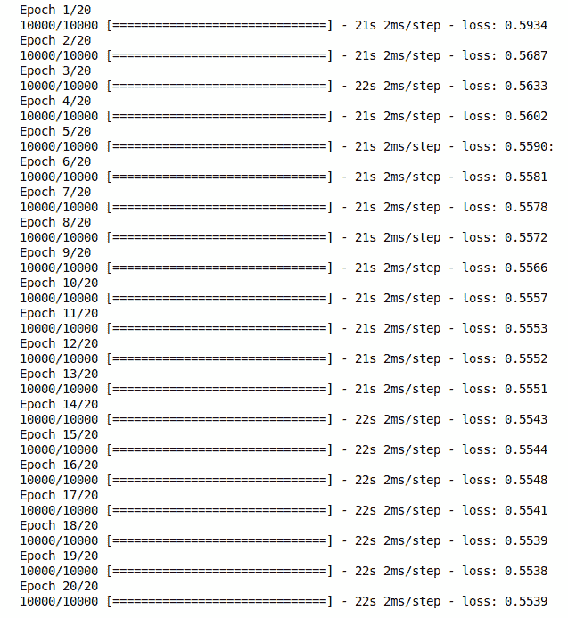

    ###### 图 5.32：训练模型

    请注意，在第二个 epoch 之后，误差已经比之前的自动编码器练习要小，这表明编码/解码模型有所改进。这种误差的减少主要归因于卷积神经网络没有丢弃太多数据，并且编码后的图像是 16 x 16 x 32，这比之前的 16 x 16 尺寸要大得多。此外，我们没有对图像进行压缩，因为它们现在包含的像素较少（16 x 16 x 32 = 8,192），但深度（32 x 32 x 3,072）比之前更多。这些信息已被重新排列，以便更有效地进行编码/解码过程。

1.  计算并存储前五个样本的编码阶段输出：

    ```py
    encoder_output = Model(input_layer, encoded).predict(images[:5])
    ```

1.  每个编码图像的形状为 16 x 16 x 32，这是由于为卷积阶段选择的滤波器数量。因此，我们不能在不进行修改的情况下直接可视化它们。我们将它们重塑为 256 x 32 大小以进行可视化：

    ```py
    encoder_output = encoder_output.reshape((-1, 256, 32))
    ```

1.  获取前五个图像的解码器输出：

    ```py
    decoder_output = autoencoder.predict(images[:5])
    ```

1.  绘制原始图像、均值编码器输出和解码器：

    ```py
    plt.figure(figsize=(10, 7))
    for i in range(5):
        plt.subplot(3, 5, i + 1)
        plt.imshow(images[i], cmap='gray')
        plt.axis('off')

        plt.subplot(3, 5, i + 6)
        plt.imshow(encoder_output[i], cmap='gray')
        plt.axis('off')   

        plt.subplot(3, 5, i + 11)
        plt.imshow(decoder_output[i])
        plt.axis('off')    
    ```

    输出结果如下：

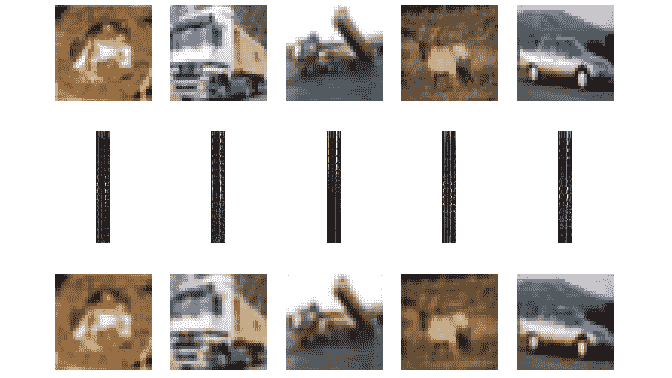

###### 图 5.33：原始图像、编码器输出和解码器

### 活动 11：MNIST 卷积自动编码器

在本次活动中，我们将通过使用 MNIST 数据集来加深对卷积自动编码器的理解。当使用合理大小的基于图像的数据集时，卷积自动编码器通常能显著提高性能。这在使用自动编码器生成人工图像样本时尤其有用：

1.  导入`pickle`、`numpy`和`matplotlib`，以及从`keras.models`中导入`Model`类，从`keras.layers`中导入`Input`、`Conv2D`、`MaxPooling2D`和`UpSampling2D`。

1.  加载`mnist.pkl`文件，该文件包含来自 MNIST 数据集的前 10,000 张图像及其对应标签，这些文件可在随附的源代码中找到。

    #### 注意

    你可以从[`github.com/TrainingByPackt/Applied-Unsupervised-Learning-with-Python/tree/master/Lesson05/Activity11`](https://github.com/TrainingByPackt/Applied-Unsupervised-Learning-with-Python/tree/master/Lesson05/Activity11)下载`mnist.pkl`文件。

1.  将图像重新缩放为值在 0 和 1 之间。

1.  我们需要重塑图像，添加一个单一的深度通道，以便与卷积阶段一起使用。将图像重塑为 28 x 28 x 1 的形状。

1.  定义输入层。我们将使用与图像相同形状的输入。

1.  添加一个卷积阶段，使用 16 层或过滤器，3 x 3 的权重矩阵，ReLU 激活函数，并使用相同填充，这意味着输出的大小与输入图像相同。

1.  在编码器中添加一个最大池化层，使用 2 x 2 的卷积核。

1.  添加一个解码卷积层。

1.  添加一个上采样层。

1.  按照初始图像深度，使用 1 层添加最终的卷积阶段。

1.  通过将网络的第一层和最后一层传递给`Model`类来构建模型。

1.  显示模型的结构。

1.  使用二元交叉熵损失函数和`adadelta`梯度下降法编译自编码器。

1.  现在，让我们来拟合模型；再次将图像作为训练数据和期望的输出。训练 20 个周期，因为卷积网络需要较长的计算时间。

1.  计算并存储编码阶段对前五个样本的输出。

1.  为了可视化，将编码器的输出重塑为每张图像大小为 X*Y。

1.  获取解码器对前五个图像的输出。

1.  将解码器输出重塑为 28 x 28 的大小。

1.  将原始图像重新调整回 28 x 28 的大小。

1.  绘制原始图像、平均编码器输出和解码器。

在本次活动结束时，你将开发一个包含卷积层的自编码器神经网络。注意解码器表示的改进。输出将类似于以下内容：

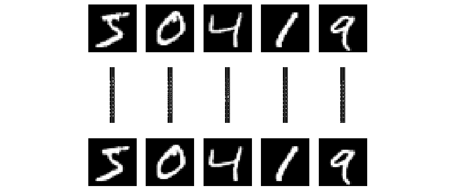

###### 图 5.34：期望的原始图像、编码器输出和解码器

#### 注意

本活动的解决方案可以在第 340 页找到。

## 总结

在本章中，我们首先介绍了人工神经网络，它们的结构以及它们如何学习完成特定任务。从一个有监督学习的例子开始，我们构建了一个人工神经网络分类器来识别 CIFAR-10 数据集中的物体。然后，我们深入了解了神经网络的自编码器架构，学习了如何利用这些网络为无监督学习问题准备数据集。最后，我们完成了这项调查，查看了卷积神经网络以及这些附加层能带来的好处。通过这章内容，我们为接下来进行降维的最终章节做好了准备，学习如何使用和可视化通过 t-分布近邻（t-SNE）编码的数据。t-SNE 提供了一种非常有效的方法来可视化高维数据，即使在应用 PCA 等降维技术后也是如此。t-SNE 是无监督学习中特别有用的方法。
