# 第六章：t-分布随机邻域嵌入（t-SNE）

## 学习目标

到本章结束时，你将能够：

+   描述并理解 t-SNE 背后的动机

+   描述 SNE 和 t-SNE 的推导过程

+   在 scikit-learn 中实现 t-SNE 模型

+   解释 t-SNE 的局限性

在本章中，我们将讨论随机邻域嵌入（SNE）和 t-分布随机邻域嵌入（t-SNE）作为可视化高维数据集的一种手段。

## 介绍

本章是关于降维技术和变换的微型系列的最后一篇。我们在本系列的前几章中描述了多种不同的降维方法，用于清理数据、提高计算效率或提取数据集中最重要的信息。虽然我们已经展示了许多降维高维数据集的方法，但在许多情况下，我们无法将维度数量减少到可以可视化的规模，即二维或三维，而不严重降低数据的质量。考虑我们在*第五章*《自编码器》中使用的 MNIST 数据集，它是 0 到 9 的手写数字的数字化集合。每个图像的大小为 28 x 28 像素，提供 784 个独立的维度或特征。如果我们将这 784 个维度降到 2 或 3 个以进行可视化，我们几乎会失去所有可用的信息。

在本章中，我们将讨论随机邻域嵌入（SNE）和 t-分布随机邻域嵌入（t-SNE）作为可视化高维数据集的一种手段。这些技术在无监督学习和机器学习系统设计中非常有用，因为数据的可视化是一种强大的工具。能够可视化数据可以帮助探索关系、识别群体并验证结果。t-SNE 技术已被用于可视化癌细胞核，其中有超过 30 种感兴趣的特征，而来自文档的数据可能有成千上万个维度，有时即使在应用 PCA 等技术后也如此。

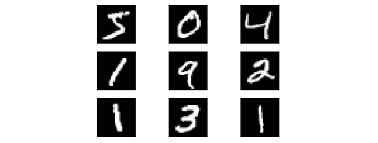

###### 图 6.1：MNIST 数据样本

在本章中，我们将使用 MNIST 数据集，并结合附带的源代码，通过实际示例来探索 SNE 和 t-SNE。在继续之前，我们将快速回顾 MNIST 及其包含的数据。完整的 MNIST 数据集包含 60,000 个训练样本和 10,000 个测试样本，所有样本为手写数字 0 到 9，表示为 28x28 像素大小的黑白（或灰度）图像（总计 784 个维度或特征），每种数字（或类别）的数量相等。由于其数据量大且质量高，MNIST 已成为机器学习中的经典数据集，通常作为许多研究论文中的参考数据集。与其他数据集相比，使用 MNIST 探索 SNE 和 t-SNE 的一个优势是，尽管样本具有较高的维度，但在降维后仍然可以可视化，因为它们可以表示为图像。*图 6.1*展示了一个 MNIST 数据集的样本，*图 6.2*展示了同一个样本，使用 PCA 降维到 30 个成分后的效果：

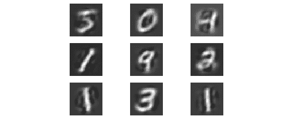

###### 图 6.2：使用 PCA 将 MNIST 数据降维至 30 个成分

## 随机邻域嵌入（SNE）

随机邻域嵌入（SNE）是属于**流形学习**类别的众多方法之一，旨在将高维空间描述为低维流形或有界区域。一开始看，这似乎是一项不可能完成的任务；如果我们有一个至少包含 30 个特征的数据集，如何合理地在二维中表示数据呢？在我们推导 SNE 的过程中，期望你能看到这是如何实现的。别担心，我们不会深入探讨这一过程的数学细节，因为这些内容超出了本章的范围。构建 SNE 可以分为以下步骤：

1.  将高维空间中数据点之间的距离转换为条件概率。假设我们有两个点，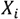和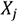，在高维空间中，我们想确定概率（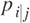），即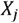将被选为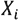。为了定义这个概率，我们使用高斯曲线，可以看到对于邻近的点，概率较高，而对于远离的点，概率非常低。

1.  我们需要确定高斯曲线的宽度，因为它控制概率选择的速率。宽曲线表明很多点距离较远，而窄曲线则表明点紧密集中。

1.  一旦我们将数据投影到低维空间，我们还可以确定相应的概率 (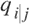)，这与对应的低维数据 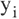 和 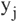 之间的关系有关。

1.  SNE 的目标是将数据定位到低维空间，以通过使用名为 Kullback-Leibler (KL) 散度的代价函数 (C)，最小化 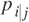 和  之间的差异，覆盖所有数据点：


###### 图 6.3：Kullback-Leibler 散度。

#### 注意

要构建高斯分布的 Python 代码，请参阅 [`github.com/TrainingByPackt/Applied-Unsupervised-Learning-with-Python/blob/master/Lesson06/GaussianDist.ipynb`](https://github.com/TrainingByPackt/Applied-Unsupervised-Learning-with-Python/blob/master/Lesson06/GaussianDist.ipynb) 中的 `GaussianDist.ipynb` Jupyter 笔记本。

高斯分布将数据映射到低维空间。为此，SNE 使用梯度下降过程来最小化 C，使用我们在上一章中讲解过的标准学习率和迭代次数参数，回顾了神经网络和自编码器的内容。SNE 在训练过程中引入了一个额外的术语——**困惑度**。困惑度是用来选择有效邻居数量的参数，对于困惑度值在 5 到 50 之间时，效果相对稳定。实际上，建议使用该范围内的困惑度值进行反复试验。

SNE 提供了一种有效的方式将高维数据可视化到低维空间中，尽管它仍然面临一个被称为 **拥挤问题** 的问题。如果我们有一些点在某个点 *i* 周围大致等距离地分布，就可能出现拥挤问题。当这些点被可视化到低维空间时，它们会紧密聚集在一起，导致可视化困难。如果我们试图让这些拥挤的点之间保持更大的间距，问题会加剧，因为任何远离这些点的其他点都会被置于低维空间的非常远的位置。实质上，我们在尝试平衡能够可视化接近的点，同时又不丢失远离点提供的信息。

## t-分布 SNE

t-SNE 通过修改 KL 散度代价函数，并用学生 t 分布代替低维空间中的高斯分布来解决拥挤问题。学生 t 分布是一种连续分布，通常在样本量较小且未知总体标准差时使用，广泛应用于学生 t 检验中。

修改后的 KL 代价函数将低维空间中的成对距离视为相等，而学生分布在低维空间中采用重尾分布来避免拥挤问题。在高维概率计算中，仍然使用高斯分布，确保高维中的适度距离在低维中也能得到相应的表示。不同分布在各自空间中的组合使得在小距离和中等距离分离的数据点能够得到真实的表示。

#### 注意

有关如何在 Python 中重现学生 t 分布的示例代码，请参考 Jupyter notebook：[`github.com/TrainingByPackt/Applied-Unsupervised-Learning-with-Python/blob/master/Lesson06/StudentTDist.ipynb`](https://github.com/TrainingByPackt/Applied-Unsupervised-Learning-with-Python/blob/master/Lesson06/StudentTDist.ipynb)。

幸运的是，我们不需要手动实现 t-SNE，因为 scikit-learn 提供了一个非常有效的实现，且 API 简单明了。我们需要记住的是，SNE 和 t-SNE 都是通过计算两个点在高维空间和低维空间中作为邻居的概率，旨在最小化这两个空间之间的概率差异。

### 练习 24：t-SNE MNIST

在本练习中，我们将使用 MNIST 数据集（随附源代码提供）来探索 scikit-learn 对 t-SNE 的实现。如前所述，使用 MNIST 使我们能够以其他数据集（如波士顿住房价格或鸢尾花数据集）无法实现的方式来可视化高维空间：

1.  对于此练习，导入 `pickle`、`numpy`、`PCA` 和 `TSNE` 来自 scikit-learn，以及 `matplotlib`：

    ```py
    import pickle
    import numpy as np
    import matplotlib.pyplot as plt
    from sklearn.decomposition import PCA
    from sklearn.manifold import TSNE
    ```

1.  加载并可视化随附源代码提供的 MNIST 数据集：

    #### 注意

    ```py
    with open('mnist.pkl', 'rb') as f:
        mnist = pickle.load(f)
    plt.figure(figsize=(10, 7))
    for i in range(9):
        plt.subplot(3, 3, i + 1)
        plt.imshow(mnist['images'][i], cmap='gray')
        plt.title(mnist['labels'][i])
        plt.axis('off')
    plt.show()
    ```

    输出如下：

    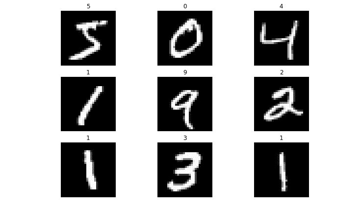

    ###### 图 6.4：加载数据集后的输出

    这表明 MNIST 数据集已成功加载。

1.  在本练习中，我们将对数据集使用 PCA 降维，只提取前 30 个成分。

    #### 注意

    ```py
    model_pca = PCA(n_components=30)
    mnist_pca = model_pca.fit(mnist['images'].reshape((-1, 28 ** 2)))
    ```

1.  可视化将数据集降至 30 个成分的效果。为此，我们必须首先将数据集转换到低维空间，然后使用 `inverse_transform` 方法将数据返回到原始大小，以便进行绘图。当然，我们还需要在转换过程前后调整数据的形状：

    ```py
    mnist_30comp = model_pca.transform(mnist['images'].reshape((-1, 28 ** 2)))
    mnist_30comp_vis = model_pca.inverse_transform(mnist_30comp)
    mnist_30comp_vis = mnist_30comp_vis.reshape((-1, 28, 28))
    plt.figure(figsize=(10, 7))
    for i in range(9):
        plt.subplot(3, 3, i + 1)
        plt.imshow(mnist_30comp_vis[i], cmap='gray')
        plt.title(mnist['labels'][i])
        plt.axis('off')
    plt.show()
    ```

    输出如下：

    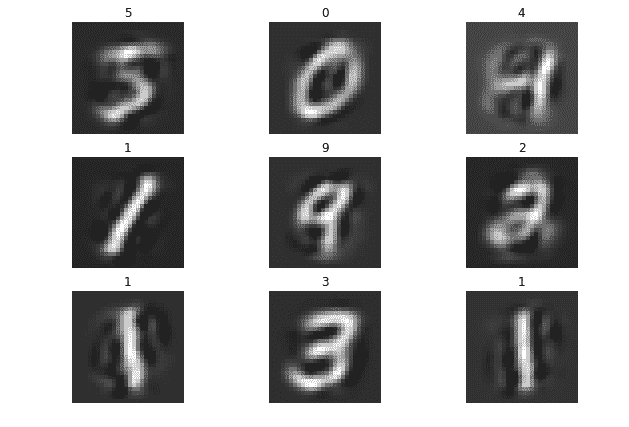

    ###### 图 6.5：可视化减少数据集的效果

    请注意，虽然我们在图像中丧失了一些清晰度，但由于降维过程，大部分数字仍然相当清晰可见。有趣的是，数字四（4）似乎是受此过程影响最大的。也许 PCA 过程丢弃的许多信息包含了特定于数字四（4）样本的信息。

1.  现在，我们将 t-SNE 应用于 PCA 转换后的数据，以在二维空间中可视化 30 个组件。我们可以使用 scikit-learn 中的标准模型 API 接口来构建 t-SNE 模型。我们将首先使用默认值，这些值指定我们将 30 维数据嵌入到二维空间中进行可视化，使用 30 的困惑度、200 的学习率和 1000 次迭代。我们将指定 `random_state` 值为 0，并将 `verbose` 设置为 1：

    ```py
    model_tsne = TSNE(random_state=0, verbose=1)
    model_tsne
    ```

    输出结果如下：

    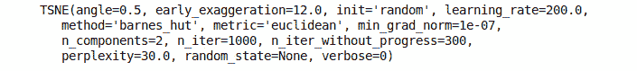

    ###### 图 6.6：将 t-SNE 应用于 PCA 转换后的数据

    在之前的截图中，我们可以看到 t-SNE 模型的多个配置选项，其中一些比其他选项更为重要。我们将重点关注 `learning_rate`、`n_components`、`n_iter`、`perplexity`、`random_state` 和 `verbose` 的值。对于 `learning_rate`，如前所述，t-SNE 使用随机梯度下降将高维数据投影到低维空间。学习率控制过程执行的速度。如果学习率过高，模型可能无法收敛到解决方案；如果学习率过低，可能需要很长时间才能收敛（如果能够收敛）。一个好的经验法则是从默认值开始；如果你发现模型产生了 NaN（非数值），则可能需要降低学习率。一旦你对模型满意，也可以降低学习率并让其运行更长时间（`增加 n_iter`）；事实上，这样可能会得到略微更好的结果。`n_components` 是嵌入（或可视化空间）的维度数量。通常，你希望获得数据的二维图，因此只需使用默认值 `2`。`n_iter` 是梯度下降的最大迭代次数。`perplexity`，如前一节所述，是在可视化数据时使用的邻居数量。

    通常，介于 5 到 50 之间的值是合适的，因为较大的数据集通常需要比较小的数据集更多的困惑度（perplexity）。`random_state` 是任何模型或算法中一个重要的变量，它在训练开始时会随机初始化其值。计算机硬件和软件工具提供的随机数生成器实际上并非真正的随机数生成器；它们实际上是伪随机数生成器。它们提供了一个良好的随机性近似值，但并不是真正的随机。计算机中的随机数是从一个称为种子的值开始的，之后通过复杂的方式生成。通过在过程开始时提供相同的种子，每次运行该过程时都会生成相同的“随机数”。虽然这听起来不直观，但对于复现机器学习实验来说，这非常有用，因为你不会看到仅仅由于参数初始化的不同而导致的性能差异。这可以提供更多的信心，认为性能变化是由于模型或训练的某些改变，例如神经网络的架构。

    #### 注意

    产生真正的随机序列实际上是计算机最难实现的任务之一。计算机的软件和硬件设计是为了每次执行时按完全相同的方式运行指令，从而得到相同的结果。执行中的随机差异，虽然对于生成随机数序列来说理想，但在自动化任务和调试问题时会造成噩梦。

    `verbose` 是模型的详细程度，描述了在模型拟合过程中打印到屏幕上的信息量。值为 0 表示没有输出，而 1 或更大的值表示输出中详细信息的增加。

1.  使用 t-SNE 转换 MNIST 的分解数据集：

    ```py
    mnist_tsne = model_tsne.fit_transform(mnist_30comp)
    ```

    输出如下：

    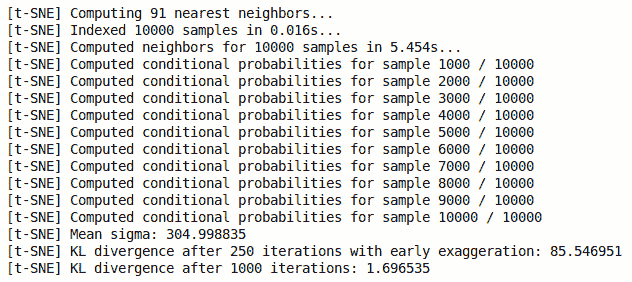

    ###### 图 6.7：转换分解数据集

    在拟合过程中提供的输出能帮助我们了解 scikit-learn 完成的计算。我们可以看到它正在为所有样本进行索引和计算邻居，然后再批量地计算数据作为邻居的条件概率，每次批次为 10。过程结束时，它提供了一个标准差（方差）均值为 304.9988，且在梯度下降的 250 和 1,000 次迭代后得到了 KL 散度。

1.  现在，可视化返回数据集中的维度数量：

    ```py
    mnist_tsne.shape
    ```

    输出如下：

    ```py
    1000,2
    ```

    所以，我们成功地将 784 个维度降到了 2 维进行可视化，那么它看起来是什么样的呢？

1.  创建模型生成的二维数据的散点图：

    ```py
    plt.figure(figsize=(10, 7))
    plt.scatter(mnist_tsne[:,0], mnist_tsne[:,1], s=5)
    plt.title('Low Dimensional Representation of MNIST');
    ```

    输出如下：

    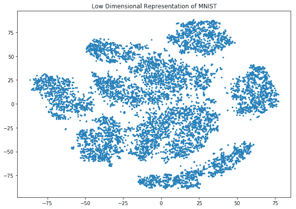

    ###### 图 6.8：MNIST 的二维表示（无标签）。

    在 *图 6**.8* 中，我们可以看到我们已经将 MNIST 数据表示为二维，但我们也可以看到它似乎被分组在一起。这里有很多不同的数据聚类或团块，它们与其他聚类通过一些空白区域分开。似乎大约有九个不同的数据组。所有这些观察结果表明，个别聚类之间以及聚类内可能存在某种关系。

1.  绘制按图像标签分组的二维数据，并使用标记区分各个标签。结合数据，在图上添加图像标签，以研究嵌入数据的结构：

    ```py
    MARKER = ['o', 'v', '1', 'p' ,'*', '+', 'x', 'd', '4', '.']
    plt.figure(figsize=(10, 7))
    plt.title('Low Dimensional Representation of MNIST');
    for i in range(10):
        selections = mnist_tsne[mnist['labels'] == i]
        plt.scatter(selections[:,0], selections[:,1], alpha=0.2, marker=MARKER[i], s=5);
        x, y = selections.mean(axis=0)
        plt.text(x, y, str(i), fontdict={'weight': 'bold', 'size': 30})
    plt.show()
    ```

    输出结果如下：

    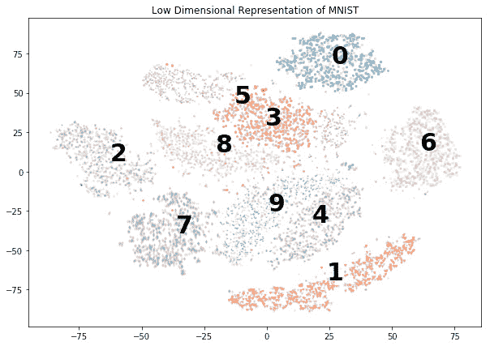

    ###### 图 6.9：带标签的 MNIST 二维表示。

    *图* *6.9* 非常有趣！我们可以看到，数据集中的不同图像类别（从零到九）对应着不同的聚类。在无监督的情况下，即没有提前提供标签，PCA 和 t-SNE 的结合成功地将 MNIST 数据集中的各个类别分开并进行分组。特别有趣的是，数据中似乎存在一些混淆，尤其是数字四和数字九的图像，以及数字五和数字三的图像；这两个聚类有些重叠。如果我们查看从 *步骤 4*、*练习 24* 和 *t-SNE MNIST* 提取的数字九和数字四的 PCA 图像，这就可以理解：

    

    ###### 图 6.10：数字九的 PCA 图像。

    它们实际上看起来非常相似；也许是因为数字四的形状存在不确定性。看一下接下来的图像，我们可以看到左侧的数字四，两条垂直线几乎连接，而右侧的数字四则是两条平行线：

    

    ###### 图 6.11：数字四的形状

    在 *图 6.9* 中需要注意的另一个有趣特征是边缘案例，这在 Jupyter 笔记本中通过颜色显示得更清楚。我们可以看到每个聚类的边缘附近，一些样本在传统的监督学习中会被误分类，但它们实际上可能与其他聚类更为相似。让我们看一个例子；有许多数字三的样本，它们离正确的聚类相当远。

1.  获取数据集中所有数字三的索引：

    ```py
    threes = np.where(mnist['labels'] == 3)[0]
    threes
    ```

    输出结果如下：

    

    ###### 图 6.12：数据集中三的索引。

1.  查找 `x` 值小于 0 的三类数据：

    ```py
    tsne_threes = mnist_tsne[threes]
    far_threes = np.where(tsne_threes[:,0]< 0)[0]
    far_threes
    ```

    输出结果如下：

    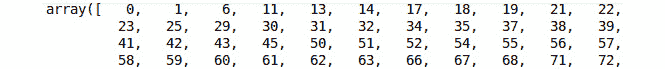

    ###### 图 6.13：x 值小于零的三类

1.  显示坐标以找到一个合理远离三的聚类的样本：

    ```py
    tsne_threes[far_threes]
    ```

    输出结果如下：

    

    ###### 图 6.14：远离三的聚类的坐标

1.  选择一个具有较高负值的`x`坐标的样本。在这个示例中，我们将选择第四个样本，即样本 10。显示该样本的图像：

    ```py
    plt.imshow(mnist['images'][10], cmap='gray')
    plt.axis('off');
    plt.show()
    ```

    输出结果如下：


###### 图 6.15：样本十的图像

看着这个示例图像及其对应的 t-SNE 坐标，大约是(-8, 47)，不难理解这个样本为何会靠近八和五的聚类，因为在这张图像中，八和五这两个数字有很多相似的特征。在这个示例中，我们应用了简化版的 SNE，展示了它的一些高效性以及可能的混淆源和无监督学习的输出结果。

#### 注意

即使提供了随机数种子，t-SNE 也不能保证每次执行时输出完全相同，因为它基于选择概率。因此，您可能会注意到，内容中提供的示例与您的实现之间在细节上有所不同。尽管具体细节可能有所不同，但整体原则和技术依然适用。从实际应用的角度来看，建议多次重复该过程，以从数据中辨别出重要信息。

### 活动 12：葡萄酒 t-SNE

在本活动中，我们将通过使用葡萄酒数据集来巩固我们对 t-SNE 的理解。完成此活动后，您将能够为自己的自定义应用程序构建 SNE 模型。葡萄酒数据集 ([`archive.ics.uci.edu/ml/datasets/Wine`](https://archive.ics.uci.edu/ml/datasets/Wine)) 是关于来自意大利三家不同生产商的葡萄酒化学分析的属性集合，但每个生产商的葡萄酒类型相同。此信息可作为示例，用于验证瓶装葡萄酒是否来自意大利特定地区的葡萄。13 个属性包括：酒精、苹果酸、灰分、灰的碱度、镁、总酚、类黄酮、非类黄酮酚、前花青素、颜色强度、色调、稀释酒的 OD280/OD315 比值，以及脯氨酸。

每个样本包含一个类别标识符（1 – 3）。

#### 注意

本数据集来源于 [`archive.ics.uci.edu/ml/machine-learning-databases/wine/`](https://archive.ics.uci.edu/ml/machine-learning-databases/wine/)，可以从 [`github.com/TrainingByPackt/Applied-Unsupervised-Learning-with-Python/tree/master/Lesson06/Activity12`](https://github.com/TrainingByPackt/Applied-Unsupervised-Learning-with-Python/tree/master/Lesson06/Activity12) 下载。

UCI 机器学习库 [http://archive.ics.uci.edu/ml]。加利福尼亚州尔湾：加利福尼亚大学信息与计算机科学学院。

以下步骤将帮助您完成活动：

1.  导入`pandas`、`numpy`、`matplotlib`以及 scikit-learn 中的`t-SNE`和`PCA`模型。

1.  使用随附源代码中的`wine.data`文件加载 Wine 数据集，并显示前五行数据。

    #### 注意

    您可以通过使用`del`关键字删除 Pandas DataFrame 中的列。只需将`del`和所选列放在方括号内。

1.  第一列包含标签；提取该列并将其从数据集中移除。

1.  执行 PCA，将数据集降至前六个主成分。

1.  确定这六个成分所描述的数据中的方差量。

1.  使用指定的随机状态和`verbose`值为 1 创建 t-SNE 模型。

1.  将 PCA 数据拟合到 t-SNE 模型中。

1.  确认 t-SNE 拟合数据的形状是二维的。

1.  创建二维数据的散点图。

1.  创建一个二位数据的散点图，并应用类标签，以可视化可能存在的聚类。

在本活动结束时，您将构建一个基于 Wine 数据集六个成分的 t-SNE 可视化，并识别图中数据位置的一些关系。最终的图将类似于以下内容：

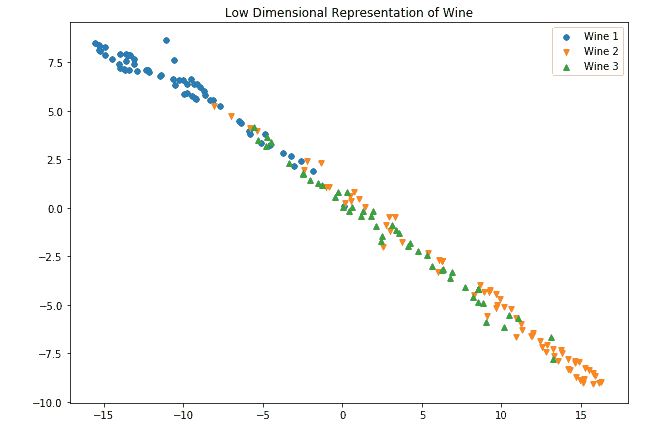

###### 图 6.16：预期的图示

#### 注意

本活动的解决方案可以在第 345 页找到。

在本节中，我们介绍了生成 SNE 图示的基础知识。在低维空间中表示高维数据的能力至关重要，特别是对于深入理解手头数据至关重要。有时，这些图示的解释可能会有些棘手，因为确切的关系有时会相互矛盾，导致误导性结构。

## 解释 t-SNE 图示

现在我们可以使用 t-分布 SNE 来可视化高维数据，重要的是理解此类图示的局限性，以及在解释和生成这些图示时需要关注的方面。在本章的这一部分，我们将突出 t-SNE 的一些重要特性，并演示在使用该可视化技术时应注意的事项。

### 困惑度

如 t-SNE 介绍中所述，困惑度值指定用于计算条件概率的最近邻数量。选择该值对最终结果有显著影响；当困惑度值较低时，数据中的局部变化占主导，因为计算中使用的样本数量较少。相反，较大的困惑度值会考虑更多的全局变化，因为使用了更多的样本进行计算。通常，尝试不同的值以调查困惑度的效果是值得的。通常，困惑度值在 5 到 50 之间的效果较好。

### 练习 25：t-SNE MNIST 与困惑度

在这个练习中，我们将尝试不同的困惑度值，并查看它在可视化图中的效果：

1.  导入`pickle`、`numpy`、`matplotlib`，以及来自 scikit-learn 的`PCA`和`t-SNE`：

    ```py
    import pickle
    import numpy as np
    import matplotlib.pyplot as plt
    from sklearn.decomposition import PCA
    from sklearn.manifold import TSNE
    ```

1.  加载 MNIST 数据集：

    #### 注意

    ```py
    with open('mnist.pkl', 'rb') as f:
        mnist = pickle.load(f)
    ```

1.  使用 PCA，从图像数据中选择前 30 个方差成分：

    ```py
    model_pca = PCA(n_components=30)
    mnist_pca = model_pca.fit_transform(mnist['images'].reshape((-1, 28 ** 2)))
    ```

1.  在这个练习中，我们正在研究困惑度对 t-SNE 流形的影响。通过一个困惑度为 3、30 和 300 的模型/绘图循环进行迭代：

    ```py
    MARKER = ['o', 'v', '1', 'p' ,'*', '+', 'x', 'd', '4', '.']
    for perp in [3, 30, 300]:
        model_tsne = TSNE(random_state=0, verbose=1, perplexity=perp)
        mnist_tsne = model_tsne.fit_transform(mnist_pca)
        plt.figure(figsize=(10, 7))
        plt.title(f'Low Dimensional Representation of MNIST (perplexity = {perp})');
        for i in range(10):
            selections = mnist_tsne[mnist['labels'] == i]
            plt.scatter(selections[:,0], selections[:,1], alpha=0.2, marker=MARKER[i], s=5);
            x, y = selections.mean(axis=0)
            plt.text(x, y, str(i), fontdict={'weight': 'bold', 'size': 30})    
    ```

    输出结果如下：

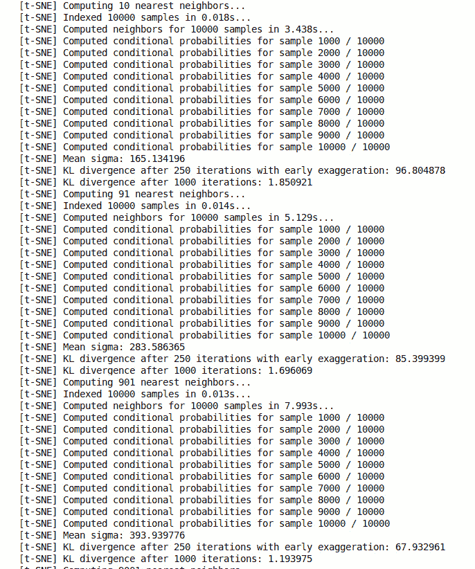

###### 图 6.17：通过模型进行迭代

请注意三个不同困惑度值下的 KL 散度，以及平均标准差（方差）的增加。通过查看以下三个带有类标签的 t-SNE 图，我们可以看到，当困惑度值较低时，聚类被很好地分隔，重叠较少。然而，聚类之间几乎没有空间。当我们增加困惑度时，聚类之间的空间改善，在困惑度为 30 时有相对清晰的区分。随着困惑度增加到 300，我们可以看到 8 和 5 的聚类，以及 9、4 和 7 的聚类，开始趋于融合。

从低困惑度值开始：

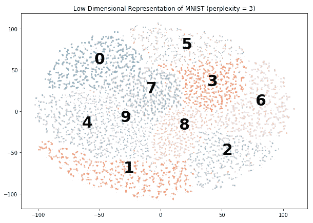

###### 图 6.18：低困惑度值的绘图

将困惑度增加 10 倍后，聚类变得更加清晰：

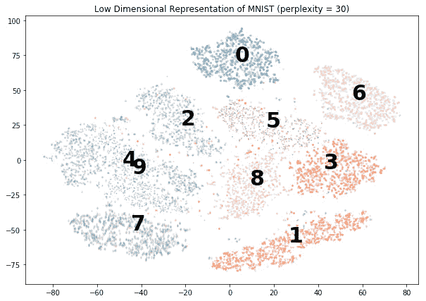

###### 图 6.19：困惑度增加 10 倍后的绘图

将困惑度增加到 300 后，我们开始将更多的标签合并在一起：

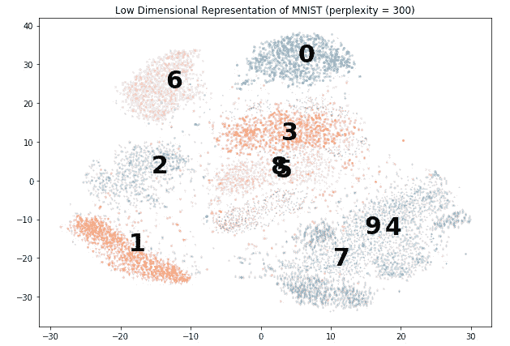

###### 图 6.20：将困惑度值增加到 300

在这个练习中，我们加深了对困惑度影响及其对整体结果敏感性的理解。较小的困惑度值可能导致位置之间的混合更加均匀，且它们之间的空间非常小。增加困惑度可以更有效地分离聚类，但过大的值会导致聚类重叠。

### 活动 13：t-SNE 葡萄酒和困惑度

在这个活动中，我们将使用葡萄酒数据集进一步强化困惑度对 t-SNE 可视化过程的影响。在这个活动中，我们尝试确定是否可以根据葡萄酒的化学成分识别其来源。t-SNE 过程提供了一种有效的表示方法，可能帮助识别来源。

#### 注意

该数据集来自于[`archive.ics.uci.edu/ml/machine-learning-databases/wine/`](https://archive.ics.uci.edu/ml/machine-learning-databases/wine/)，可以从[`github.com/TrainingByPackt/Applied-Unsupervised-Learning-with-Python/tree/master/Lesson06/Activity1`](https://github.com/TrainingByPackt/Applied-Unsupervised-Learning-with-Python/tree/master/Lesson06/Activity12)3 下载。

UCI 机器学习库 [http://archive.ics.uci.edu/ml]。加利福尼亚州欧文市：加利福尼亚大学信息与计算机科学学院。

1.  导入`pandas`、`numpy`、`matplotlib`以及来自 scikit-learn 的`t-SNE`和`PCA`模型。

1.  加载 Wine 数据集并检查前五行数据。

1.  第一列提供了标签；从 DataFrame 中提取这些标签并存储在单独的变量中。确保该列从 DataFrame 中移除。

1.  对数据集执行 PCA 操作，并提取前六个主成分。

1.  构建一个循环，遍历不同的困惑度值（1、5、20、30、80、160、320）。对于每次循环，生成一个带有相应困惑度的 t-SNE 模型，并打印带标签的葡萄酒类别的散点图。注意不同困惑度值的效果。

在本活动结束时，你将生成 Wine 数据集的二维表示，并检查生成的图表，寻找数据的聚类或分组。

#### 注意

该活动的解决方案可以在第 348 页找到。

### 迭代次数

我们将要实验研究的最后一个参数是迭代次数，正如我们在自动编码器中的研究所示，这只是应用于梯度下降的训练轮次数量。幸运的是，迭代次数是一个相对简单的参数，通常只需要一定的耐心，因为低维空间中点的位置会在最终位置上稳定下来。

### 练习 26：t-SNE MNIST 和迭代次数

在这个练习中，我们将观察一系列不同的迭代参数对 t-SNE 模型的影响，并突出一些可能需要更多训练的指示符。再次强调，这些参数的值在很大程度上依赖于数据集以及可用于训练的数据量。在本示例中，我们仍然使用 MNIST 数据集：

1.  导入`pickle`、`numpy`、`matplotlib`以及来自 scikit-learn 的 PCA 和 t-SNE：

    ```py
    import pickle
    import numpy as np
    import matplotlib.pyplot as plt
    from sklearn.decomposition import PCA
    from sklearn.manifold import TSNE
    ```

1.  加载 MNIST 数据集：

    #### 注意

    ```py
    with open('mnist.pkl', 'rb') as f:
        mnist = pickle.load(f)
    ```

1.  使用 PCA，从图像数据中仅选择前 30 个方差成分：

    ```py
    model_pca = PCA(n_components=30)
    mnist_pca = model_pca.fit_transform(mnist['images'].reshape((-1, 28 ** 2)))
    ```

1.  在这个练习中，我们将研究迭代次数对 t-SNE 流形的影响。通过模型/绘图循环，进行迭代，迭代次数分别为`250`、`500`和`1000`：

    ```py
    MARKER = ['o', 'v', '1', 'p' ,'*', '+', 'x', 'd', '4', '.']
    for iterations in [250, 500, 1000]:
        model_tsne = TSNE(random_state=0, verbose=1, n_iter=iterations, n_iter_without_progress=iterations)
        mnist_tsne = model_tsne.fit_transform(mnist_pca)
    ```

1.  绘制结果：

    ```py
        plt.figure(figsize=(10, 7))
        plt.title(f'Low Dimensional Representation of MNIST (iterations = {iterations})');
        for i in range(10):
            selections = mnist_tsne[mnist['labels'] == i]
            plt.scatter(selections[:,0], selections[:,1], alpha=0.2, marker=MARKER[i], s=5);
            x, y = selections.mean(axis=0)
            plt.text(x, y, str(i), fontdict={'weight': 'bold', 'size': 30})    
    ```

    迭代次数较少会限制算法找到相关邻居的程度，导致聚类不清晰：

![图 6.21：250 次迭代后的绘图]

](img/C12626_06_21.jpg)

###### 图 6.21：250 次迭代后的绘图

增加迭代次数为算法提供了足够的时间来充分投影数据：

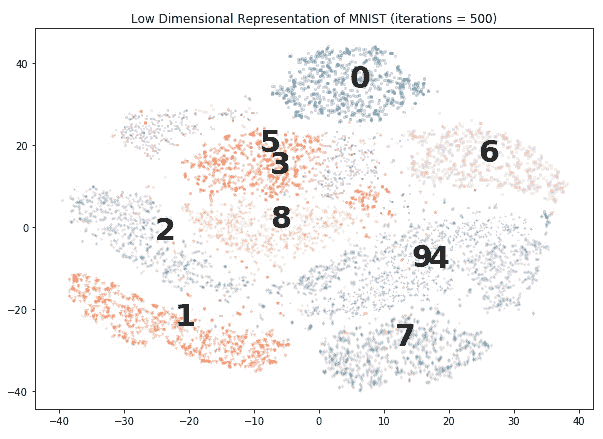

###### 图 6.22：将迭代次数增加到 500 后的绘图

一旦簇群稳定，增加迭代次数的影响非常小，基本上只是增加了训练时间：

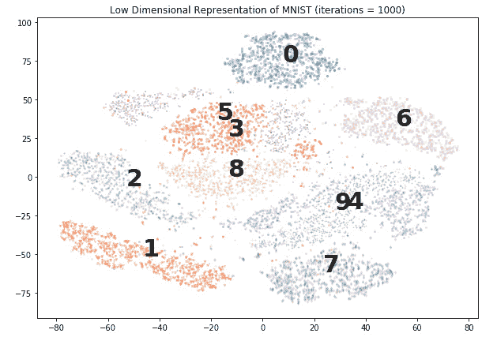

###### 图 6.23：1000 次迭代后的绘图

从前面的绘图来看，我们可以看到，迭代次数为 500 和 1000 时，簇群的位置稳定且在各个图之间几乎没有变化。最有趣的图是迭代次数为 250 的图，其中簇群似乎仍在移动过程中，正在向最终位置靠拢。因此，有充分的证据表明，500 次迭代足以。

### 活动 14：t-SNE 葡萄酒与迭代次数

在本活动中，我们将研究迭代次数对葡萄酒数据集可视化的影响。这是数据处理、清洗和理解数据关系的探索阶段中常用的一个过程。根据数据集和分析类型，我们可能需要尝试多种不同的迭代次数，就像本次活动中所做的那样。

#### 注意

此数据集来自 [`archive.ics.uci.edu/ml/machine-learning-databases/wine/`](https://archive.ics.uci.edu/ml/machine-learning-databases/wine/)。它可以从 [`github.com/TrainingByPackt/Applied-Unsupervised-Learning-with-Python/tree/master/Lesson06/Activity1`](https://github.com/TrainingByPackt/Applied-Unsupervised-Learning-with-Python/tree/master/Lesson06/Activity12)4 下载。

UCI 机器学习库 [http://archive.ics.uci.edu/ml]。加利福尼亚州欧文市：加利福尼亚大学信息与计算机科学学院。

以下步骤将帮助你完成活动：

1.  导入`pandas`、`numpy`、`matplotlib`，以及从 scikit-learn 导入`t-SNE`和`PCA`模型。

1.  加载葡萄酒数据集并检查前五行数据。

1.  第一列提供了标签；从 DataFrame 中提取这些标签并存储到一个单独的变量中。确保将该列从 DataFrame 中删除。

1.  对数据集执行 PCA，并提取前六个主成分。

1.  构建一个循环，遍历迭代值（`250`、`500`、`1000`）。对于每个循环，生成一个具有相应迭代次数的 t-SNE 模型，并生成一个没有进度值的相同迭代次数的模型。

1.  构建标记葡萄酒类别的散点图。注意不同迭代值的影响。

通过完成本活动，我们将研究修改模型迭代参数的效果。这是确保数据在低维空间中稳定在某个最终位置的重要参数。

#### 注意

本活动的解决方案可以在第 353 页找到。

### 关于可视化的最终思考

在我们总结关于 t-分布随机邻域嵌入（t-SNE）这一章节时，有几个关于可视化的重要方面需要注意。首先，聚类的大小或聚类之间的相对空间可能并不能真正反映接近度。正如我们在本章前面讨论的，结合高斯分布和学生 t 分布被用来在低维空间中表示高维数据。因此，距离之间的线性关系并不能得到保证，因为 t-SNE 平衡了局部和全局数据结构的位置。局部结构中点之间的实际距离在可视化表示中可能看起来非常接近，但在高维空间中可能仍然存在一定的距离。

这个特性还有一个附带的后果，那就是有时随机数据看起来像是具有某种结构，并且通常需要生成多个可视化图像，使用不同的困惑度、学习率、迭代次数和随机种子值。

## 总结

在这一章中，我们介绍了 t-分布随机邻域嵌入（t-SNE）作为可视化高维信息的一种方法，这些信息可能来自先前的过程，如 PCA 或自编码器。我们讨论了 t-SNE 如何生成这种表示，并使用 MNIST 和 Wine 数据集以及 scikit-learn 生成了多个表示。在这一章中，我们能够看到无监督学习的一些强大之处，因为 PCA 和 t-SNE 能够在不知道真实标签的情况下对每张图片的类别进行聚类。在下一章中，我们将基于这次实践经验，探讨无监督学习的应用，包括篮子分析和主题建模。
