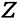
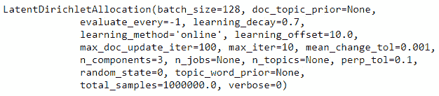
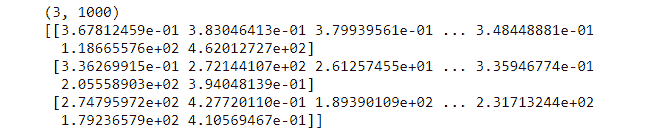

# 第七章：主题建模

## 学习目标

本章结束时，您将能够：

+   为文本数据执行基本的清理技术

+   评估隐含狄利克雷分配模型

+   执行非负矩阵分解模型

+   解释主题模型的结果

+   为给定场景识别最佳主题模型

在本章中，我们将看到如何通过主题建模深入了解文档的潜在结构。

## 引言

主题建模是**自然语言处理**（**NLP**）的一个方面，这是计算机科学领域探索计算机与人类语言关系的一个领域，随着文本数据集的增加可用性的增加而日益流行。NLP 可以处理几乎任何形式的语言，包括文本、语音和图像。除了主题建模外，情感分析、对象字符识别和词汇语义是值得注意的 NLP 算法。如今，收集和需要分析的数据很少是以标准表格形式出现，而更频繁地以较少结构化的形式出现，包括文档、图像和音频文件。因此，成功的数据科学从业者需要精通处理这些多样化数据集的方法论。

下面是一个示例，演示如何识别文本中的单词并将其分配给主题：


###### 图 7.1：示例，识别文本中的单词并将它们分配给主题

你可能立即问的问题是*什么是主题*？让我们通过一个例子来回答这个问题。你可以想象，或者可能已经注意到，在发生重大事件的日子，例如国家选举、自然灾害或体育冠军赛，社交媒体网站上的帖子往往会集中在这些事件上。帖子通常以某种方式反映当天的事件，并且会以不同的方式这样做。帖子可以并且将会有许多不同的观点。如果我们有关于世界杯决赛的推文，这些推文的主题可能涵盖各种不同的观点，从裁判的裁判质量到球迷行为。在美国，总统在每年的一月中旬到晚些时候发表一次称为国情咨文的年度演讲。通过足够数量的社交媒体帖子，我们将能够通过使用其中包含的特定关键词对帖子进行分组来推断或预测社交媒体社区对演讲的高级反应 - 主题。

### 主题模型

主题模型属于无监督学习类别，因为几乎总是无法事先知道要识别的主题。因此，没有目标可以进行回归或分类建模。在无监督学习中，主题模型最像聚类算法，特别是 k-means 聚类。你会记得，在 k-means 聚类中，首先确定聚类的数量，然后模型将每个数据点分配到预定的某个聚类中。主题模型通常也是如此。我们在开始时选择主题的数量，然后模型会提取出构成这些主题的词汇。这是一个很好的出发点，用于对主题建模进行高层次的概述。

在此之前，我们先检查一下是否安装了正确的环境和库，并准备好使用。下表列出了所需的库及其主要用途：


###### 图 7.2：显示不同库及其用途的表格

### 练习 27：设置环境

为了检查环境是否准备好进行主题建模，我们将执行几个步骤。其中第一步是加载本章将需要的所有库：

#### 注意

如果这些库中有任何一个或全部未安装，请通过命令行使用`pip`安装所需的软件包。例如，若未安装，运行`pip install langdetect`。

1.  打开一个新的 Jupyter 笔记本。

1.  导入所需的库：

    ```py
    import langdetect
    import matplotlib.pyplot
    import nltk
    import numpy
    import pandas
    import pyLDAvis
    import pyLDAvis.sklearn
    import regex
    import sklearn
    ```

    请注意，并非所有这些库都用于清理数据；其中一些库用于实际建模，但一次性导入所有所需的库是很方便的，所以我们现在就将所有库的导入处理好。

1.  尚未安装的库将返回以下错误：

    ###### 图 7.3：库未安装错误

    如果返回此错误，请按照之前讨论的方法通过命令行安装相关库。成功安装后，使用`import`重新运行库导入过程。

1.  某些文本数据清理和预处理过程需要词典（更多内容稍后介绍）。在此步骤中，我们将安装其中的两个词典。如果导入了`nltk`库，可以执行以下代码：

    ```py
    nltk.download('wordnet')
    nltk.download('stopwords')
    ```

    输出如下：

    

    ###### 图 7.4：导入库并下载词典

1.  运行`matplotlib`魔法命令并指定 inline，以便图表显示在笔记本中：

    ```py
    %matplotlib inline
    ```

笔记本和环境已设置好，准备好加载数据。

### 主题模型的高层次概述

在分析大量可能相关的文本数据时，主题模型是一个常用方法。所谓相关，是指文档理想情况下来自相同来源。也就是说，调查结果、推文和新闻文章通常不会在同一个模型中同时进行分析。当然，也可以将它们一起分析，但结果可能非常模糊，因此没有意义。运行任何主题模型的唯一数据要求是文档本身。不需要额外的数据，无论是元数据还是其他类型的数据。

简单来说，主题模型通过分析文档中的词汇，识别一组文档（称为**语料库**）中的抽象主题（也称为主题）。也就是说，如果一句话中包含“薪水”、“员工”和“会议”等词汇，就可以推测这句话的主题是与工作相关的。需要注意的是，构成语料库的文档不一定是传统意义上的文档——可以是信件或合同等。文档可以是任何包含文本的内容，包括推文、新闻标题或转录的演讲。

主题模型假设同一文档中的词汇是相关的，并利用这一假设通过寻找反复出现在相近位置的词汇组来定义抽象主题。通过这种方式，这些模型属于经典的模式识别算法，其中被检测到的模式是由词汇组成的。一般的主题建模算法包含四个主要步骤：

1.  确定主题的数量。

1.  扫描文档并识别共现的词汇或短语。

1.  自动学习表征文档的词汇组（或集群）。

1.  输出表征语料库的抽象主题，作为词汇组合。

正如步骤 1 所示，在拟合模型之前需要选择主题的数量。选择合适的主题数量可能会有些棘手，但与大多数机器学习模型一样，这个参数可以通过拟合多个使用不同主题数量的模型，并基于某些性能指标选择最佳模型来优化。稍后我们会再深入讨论这个过程。

以下是通用主题建模工作流程：


###### 图 7.5: 通用主题建模工作流程

选择最佳的主题数非常重要，因为这一参数会对主题的连贯性产生重大影响。这是因为模型会在预定义的主题数限制下，找到最适合语料库的词组。如果主题数过高，主题会变得过于狭窄。过于具体的主题被称为**过度加工**。同样地，如果主题数过低，主题会变得过于通用和模糊。这些类型的主题被认为是**加工不足**。过度加工和加工不足的主题有时可以通过分别减少或增加主题数来修正。话题模型的一个常见且不可避免的结果是，通常至少有一个话题会出现问题。

话题模型的一个关键方面是，它们不会生成特定的单词或短语主题，而是生成一组词汇，每个词汇代表一个抽象的主题。回想一下之前关于工作的假设句子。构建出来的主题模型识别该句子所属的假设语料库的主题时，不会返回单词“work”作为主题。它会返回一组词汇，例如“paycheck”（薪水）、“employee”（员工）和“boss”（老板）；这些词汇描述了主题，并可以推断出一个单词或短语主题。这是因为话题模型理解的是词汇的**接近度**，而不是上下文。模型并不理解“paycheck”、“employee”和“boss”的含义；它只知道这些词汇通常在一起出现并且彼此接近：


###### 图 7.6：从词组中推断主题

话题模型可以用来预测未见文档的主题，但如果你打算做预测，重要的是要认识到，话题模型只知道用来训练它们的词汇。也就是说，如果未见文档中包含训练数据中没有的词汇，模型将无法处理这些词汇，即使它们与训练数据中已识别的某个主题相关。因此，话题模型更多地用于探索性分析和推断，而不是预测。

每个话题模型输出两个矩阵。第一个矩阵包含词汇与主题的关系。它列出了每个词汇与每个主题的关联，并对这种关系进行量化。考虑到模型正在考虑的词汇数量，每个主题只会由相对较少的词汇描述。词汇可以被分配给一个主题，或者分配给多个主题，并在不同的量化下表示。词汇是被分配给一个主题还是多个主题，取决于算法。同样，第二个矩阵包含文档与主题的关系。它列出了与某个主题相关的每个文档，并对每个文档与该主题的关联程度进行量化。

在讨论主题建模时，重要的是要不断强调，代表主题的词汇组之间并不是概念上的关联，而仅仅是通过词汇的接近度来关联的。文档中某些单词的频繁接近足以定义主题，这是因为前面提到的假设——同一文档中的所有单词都是相关的。然而，这个假设可能并不成立，或者这些单词可能过于泛化，无法形成连贯的主题。解释抽象的主题涉及将文本数据的固有特性与生成的词汇组进行平衡。文本数据和语言一般来说是高度可变的、复杂的，并且具有上下文，这意味着任何普遍的结果都需要谨慎对待。这并不是贬低或否定模型的结果。在彻底清理过的文档和适当数量的主题下，词汇组，如我们将看到的，能够很好地指导语料库的内容，并且可以有效地融入到更大的数据系统中。

我们已经讨论了一些主题模型的局限性，但还有一些额外的注意事项。文本数据的噪声特性可能会导致主题模型将与某个主题无关的单词错误地分配给该主题。再考虑之前提到的关于工作的句子。单词 meeting 可能出现在代表“工作”主题的词汇组中。也有可能单词 long 也会出现在该组中，但单词 long 与工作没有直接关系。long 之所以可能出现在该组，是因为它常常出现在 meeting 旁边。因此，long 可能会被认为与工作虚假相关，并且如果可能的话，应该从该主题词汇组中移除。词汇组中的虚假相关词可能会在分析数据时引起严重问题。

这不一定是模型的缺陷，而是模型的一个特性，在面对噪声数据时，可能会从数据中提取出一些特征，这些特征可能会对结果产生负面影响。虚假的相关性可能是由于数据的收集方式、地点或时间造成的。如果文档仅在某些特定的地理区域内收集，那么与该区域相关的词汇可能会不正确地、尽管是偶然地，链接到模型输出的一个或多个词汇组。请注意，随着词汇组中单词数量的增加，我们可能会将更多的文档归类到该主题中，超出应归类的范围。显然，如果我们减少属于某一主题的词汇数量，那么该主题将会被分配给更少的文档。记住，这并不是什么坏事。我们希望每个词汇组只包含有意义的单词，从而将合适的主题分配给合适的文档。

有许多主题建模算法，但也许最为人熟知的两种是**潜在狄利克雷分配（Latent Dirichlet Allocation）**和**非负矩阵分解（Non-Negative Matrix Factorization）**。我们稍后将详细讨论这两种算法。

### 商业应用

尽管存在局限性，但如果在正确的上下文中正确使用，主题建模可以提供可操作的洞察，推动商业价值。现在，让我们回顾一下主题模型的一个重要应用。

其中一个使用案例是对新文本数据进行探索性数据分析，其中数据集的底层结构未知。这相当于为一个未见过的数据集绘制图表并计算总结统计量，该数据集包含需要理解其特征的数值和类别变量，才能在进行更复杂的分析之前做出合理的判断。通过主题建模的结果，可以确定此数据集在未来建模工作中的可用性。例如，如果主题模型返回了清晰且 distinct 的主题，那么该数据集将是进一步聚类分析的理想候选对象。

实际上，确定主题的作用是创建一个额外的变量，用于排序、分类和/或分块数据。如果我们的主题模型返回了汽车、农业和电子产品作为抽象主题，我们可以将大量的文本数据集过滤到只有农业作为主题的文档。一旦过滤完毕，我们可以进行进一步的分析，包括情感分析、另一次主题建模，或者任何我们能想到的分析。除了定义语料库中存在的主题外，主题建模还会间接返回许多其他信息，这些信息也可以用于分解大型数据集并理解其特征。

这里显示了文档排序的表示：


###### 图 7.7：文档排序/分类

其中一个特征是主题的普遍性。想象一下对一个开放式问卷调查进行分析，这个问卷调查旨在评估对某个产品的反馈。我们可以设想主题模型返回的主题形式为情感。一组词可能是“好”，“优秀”，“推荐”和“质量”，而另一组则可能是“垃圾”，“损坏”，“差”和“失望”。鉴于这种类型的调查，主题本身可能不会太令人惊讶，但有趣的是，我们可以统计每个主题包含的文档数量。从统计结果中，我们可以得出这样的结论：例如，有 x 百分比的调查参与者对该产品有正面反应，而只有 y 百分比的参与者有负面反应。实质上，我们所创建的是情感分析的粗略版本。

当前，主题模型最常见的用途是作为推荐引擎的一个组件。如今的重点是个性化——为客户提供专门设计和策划的产品。以网站为例，无论是新闻网站还是其他类型的网站，它们的目的是传播文章。像雅虎和 Medium 这样的公司需要客户持续阅读才能维持生意，而让客户继续阅读的一种方法是向他们推送他们更倾向于阅读的文章。这就是主题建模的用武之地。通过使用一个由个体之前阅读的文章组成的语料库，主题模型基本上会告诉我们该订阅者喜欢阅读什么类型的文章。公司然后可以查找其库存中的相关文章，并通过用户的账户页面或电子邮件将其发送给该个体。这就是定制策划，以简化使用并保持用户的持续参与。

在我们开始为模型准备数据之前，让我们快速加载并浏览一下数据。

### 练习 28：数据加载

在这个练习中，我们将从一个数据集加载数据并进行格式化。本章中的所有练习的数据集均来自加利福尼亚大学尔湾分校（UCI）托管的机器学习库。要找到数据，请访问[`github.com/TrainingByPackt/Applied-Unsupervised-Learning-with-Python/tree/master/Lesson07/Exercise27-Exercise%2038`](https://github.com/TrainingByPackt/Applied-Unsupervised-Learning-with-Python/tree/master/Lesson07/Exercise27-Exercise%2038)。

#### 注意

该数据下载自[`archive.ics.uci.edu/ml/datasets/News+Popularity+in+Multiple+Social+Media+Platforms`](https://archive.ics.uci.edu/ml/datasets/News+Popularity+in+Multiple+Social+Media+Platforms)。可以通过[`github.com/TrainingByPackt/Applied-Unsupervised-Learning-with-Python/tree/master/Lesson07/Exercise27-Exercise%2038`](https://github.com/TrainingByPackt/Applied-Unsupervised-Learning-with-Python/tree/master/Lesson07/Exercise27-Exercise%2038)访问。Nuno Moniz 和 Luís Torgo（2018），《在线新闻源的多源社交反馈》，CoRR UCI 机器学习库[[`archive.ics.uci.edu/ml`](http://archive.ics.uci.edu/ml)]。加利福尼亚尔湾：加利福尼亚大学信息与计算机科学学院。

这是进行此练习所需的唯一文件。下载并保存在本地后，数据可以加载到笔记本中：

#### 注意

在同一个笔记本中执行本章的练习。

1.  定义数据的路径并使用`pandas`加载它：

    ```py
    path = "News_Final.csv"
    df = pandas.read_csv(path, header=0)
    ```

    #### 注意

    将文件添加到与您打开的笔记本相同的路径中。

1.  通过执行以下代码简要检查数据：

    ```py
    def dataframe_quick_look(df, nrows):
        print("SHAPE:\n{shape}\n".format(shape=df.shape))
        print("COLUMN NAMES:\n{names}\n".format(names=df.columns))
        print("HEAD:\n{head}\n".format(head=df.head(nrows)))
    dataframe_quick_look(df, nrows=2)
    ```

    这个用户定义的函数返回数据的形状（行数和列数）、列名和数据的前两行。

    

    ###### 图 7.8：原始数据

    这是一个在特征上比运行主题模型所需的数据集要大得多的数据集。

1.  请注意，其中一列名为`Topic`，实际上包含了主题模型试图确定的信息。让我们简要查看提供的主题数据，以便在最终生成我们自己的主题时，能够进行比较。运行以下代码行，打印唯一的主题值及其出现次数：

    ```py
    print("TOPICS:\n{topics}\n".format(topics=df["Topic"].value_counts()))
    ```

    输出如下：

    ```py
    TOPICS:
    economy      33928
    obama        28610
    microsoft    21858
    palestine     8843
    Name: Topic, dtype: int64
    ```

1.  现在，我们提取标题数据并将提取的数据转换为一个列表对象。打印列表中的前五个元素以及列表长度，以确认提取是否成功：

    ```py
    raw = df["Headline"].tolist()
    print("HEADLINES:\n{lines}\n".format(lines=raw[:5]))
    print("LENGTH:\n{length}\n".format(length=len(raw)))
    ```


###### 图 7.9：标题列表

现在数据已加载并正确格式化，让我们讨论文本数据清洗，然后进行一些实际的清洗和预处理。为了教学目的，清洗过程最初将在一个标题上构建和执行。建立并测试了该过程之后，我们将返回并在每个标题上运行该过程。

## 清洗文本数据

所有成功建模工作的一个关键组成部分是清洗过的数据集，该数据集已针对特定数据类型和分析方法进行了适当且充分的预处理。文本数据也不例外，因为它以原始形式几乎无法使用。无论运行什么算法：如果数据未经过适当准备，结果充其量是毫无意义，最坏的情况则可能是误导性的。正如俗话所说，*“垃圾进，垃圾出。”* 对于主题建模来说，数据清洗的目标是通过移除可能妨碍分析的内容，来提取每个文档中可能相关的词汇。

数据清洗和预处理几乎总是特定于数据集的，这意味着每个数据集都需要选择一套独特的清洗和预处理步骤，专门处理该数据集中的问题。对于文本数据，清洗和预处理步骤可能包括语言过滤、移除网址和用户名、词形还原、去除停用词等。在接下来的练习中，我们将清洗一个包含新闻标题的数据集，以进行主题建模。

### 数据清洗技术

重申一下之前的观点，清洗文本数据以进行主题建模的目标是提取每个文档中可能与发现语料库的抽象主题相关的词汇。这意味着需要去除常见词、短词（通常较为常见）、数字和标点符号。没有固定的清洗流程，因此理解数据类型中的典型问题点并进行广泛的探索性工作是非常重要的。

接下来，我们将讨论一些我们将要使用的文本数据清理技术。进行任何涉及文本的建模任务时，首先需要做的一件事是确定文本的语言。在这个数据集中，大多数标题是英语，因此为了简化处理，我们将删除非英语的标题。构建基于非英语文本数据的模型需要额外的技能，最基本的是流利掌握所处理的语言。

数据清理的下一个关键步骤是删除文档中所有与基于单词的模型无关的元素，或那些可能成为噪声源，进而影响结果的元素。需要删除的元素可能包括网站地址、标点符号、数字和停用词。停用词基本上是一些简单的日常用词，包括 we、are 和 the。需要注意的是，没有一个权威的停用词词典；相反，每个词典都会有所不同。尽管存在差异，每个词典都表示一些常见的单词，这些单词被认为与话题无关。主题模型试图识别那些既频繁又不太频繁的单词，以便能够描述一个抽象的主题。

删除网站地址有类似的动机。特定的网站地址出现的频率非常低，但即使一个特定的网站地址出现足够多，足以与某个话题相关联，网站地址的解释方式也不同于单词。从文档中移除不相关的信息，可以减少可能阻碍模型收敛或模糊结果的噪声。

**词形还原**，与语言检测一样，是所有涉及文本的建模活动中一个重要的组成部分。它是将单词还原为其基本形式的过程，以便将应该相同但实际不同的单词归为一类。考虑单词 running、runs 和 ran，它们的基本形式都是 run。词形还原的一个好处是，它在决定如何处理每个单词之前，会考虑整个句子的所有单词，换句话说，它会考虑上下文。像大多数前述的清理技术一样，词形还原只是减少数据中的噪声，从而使我们能够识别干净且可解释的主题。

现在，掌握了基本的文本清理技术后，让我们将其应用于实际数据。

### 练习 29：逐步清理数据

在这个练习中，我们将学习如何实现一些清理文本数据的关键技术。每个技术将在我们进行练习时进行解释。在每一步清理操作后，使用`print`输出示例标题，便于我们观察从原始数据到适合建模的数据的演变：

1.  选择第五个标题作为我们构建和测试清理过程的示例。第五个标题不是随意选择的，它被选中是因为它包含了在清理过程中将要解决的特定问题：

    ```py
    example = raw[5]
    print(example)
    ```

    输出结果如下：

    

    ###### 图 7.10：第五个标题

1.  使用`langdetect`库来检测每个标题的语言。如果语言不是英语（"en"），则从数据集中删除该标题：

    ```py
    def do_language_identifying(txt):
        try: the_language = langdetect.detect(txt)
        except: the_language = 'none'
        return the_language
    print("DETECTED LANGUAGE:\n{lang}\n".format(lang=do_language_identifying(example)
    ))
    ```

    输出结果如下：

    

    ###### 图 7.11：检测到的语言

1.  将包含标题的字符串使用空格分割成片段，称为**tokens**。返回的对象是构成标题的单词和数字的列表。将标题字符串拆分成 tokens 会使清理和预处理过程更简单：

    ```py
    example = example.split(" ")
    print(example)
    ```

    输出结果如下：

    

    ###### 图 7.12：使用空格分割字符串

1.  使用正则表达式查找包含`http://`或`https://`的 tokens 来识别所有 URL。将 URL 替换为`'URL'`字符串：

    ```py
    example = ['URL' if bool(regex.search("http[s]?://", i))else i for i in example]
    print(example)
    ```

    输出结果如下：

    

    ###### 图 7.13：将 URLs 替换为 URL 字符串

1.  使用正则表达式将所有标点符号和换行符（`\n`）替换为空字符串：

    ```py
    example = [regex.sub("[^\\w\\s]|\n", "", i) for i in example]
    print(example)
    ```

    输出结果如下：

    

    ###### 图 7.14：将标点符号替换为换行符

1.  使用正则表达式将所有数字替换为空字符串：

    ```py
    example = [regex.sub("^[0-9]*$", "", i) for i in example]
    print(example)
    ```

    输出结果如下：

    

    ###### 图 7.15：将数字替换为空字符串

1.  将所有大写字母转换为小写字母。将所有内容转换为小写并不是强制性步骤，但它有助于减少复杂性。将所有内容转换为小写后，跟踪的内容更少，因此出错的机会也更小：

    ```py
    example = [i.lower() if i not in "URL" else i for i in example]
    print(example)
    ```

    输出结果如下：

    

    ###### 图 7.16：将大写字母转换为小写字母

1.  删除*步骤 4*中作为占位符添加的`"URL"`字符串。之前添加的`"URL"`字符串实际上对于建模来说并不需要。如果认为它留在里面无害，考虑到`"URL"`字符串可能自然出现在标题中，而我们不希望人为地增加它出现的频率。此外，`"URL"`字符串并非每个标题中都会出现，因此如果将其留在里面，可能会无意中创建`"URL"`字符串与某一主题之间的关联：

    ```py
    example = [i for i in example if i not in "URL"]
    print(example)
    ```

    输出结果如下：

    

    ###### 图 7.17：移除字符串 URL

1.  从`nltk`加载`stopwords`字典并打印出来：

    ```py
    list_stop_words = nltk.corpus.stopwords.words("English")
    list_stop_words = [regex.sub("[^\\w\\s]", "", i) for i in list_stop_words]
    print(list_stop_words)
    ```

    输出结果如下：

    

    ###### 图 7.18：停用词列表

    在使用字典之前，重要的是要重新格式化单词，以符合我们标题的格式。这包括确认所有内容都是小写且没有标点符号。

1.  现在我们已经正确格式化了`stopwords`字典，使用它来删除标题中的所有停用词：

    ```py
    example = [i for i in example if i not in list_stop_words]
    print(example)
    ```

    输出结果如下：

    

    ###### 图 7.19：从标题中移除停用词

1.  通过定义一个可以单独应用于每个标题的函数来执行词形还原。词形还原需要加载 WordNet 字典：

    ```py
    def do_lemmatizing(wrd):
        out = nltk.corpus.wordnet.morphy(wrd)
        return (wrd if out is None else out)
    example = [do_lemmatizing(i) for i in example]
    print(example)
    ```

    输出如下：

    

    ###### 图 7.20：执行词形还原后的输出

1.  从标记列表中移除所有长度为四个或更短的单词。该步骤的假设是，短单词通常更为常见，因此不会对我们希望从主题模型中提取的见解产生重要影响。这是数据清理和预处理的最后一步：

    ```py
    example = [i for i in example if len(i) >= 5]
    print(example)
    ```

    输出如下：


###### 图 7.21：标题五号清理后的结果

现在，我们已经逐个标题完成了清理和预处理步骤，我们需要将这些步骤应用到近 100,000 个标题上。将这些步骤像对单个标题那样手动应用到每个标题上是不可行的。

### 练习 30：完整数据清理

在本练习中，我们将把*练习 29*中的第 2 步到第 12 步（*逐步清理数据*）合并成一个可以应用于每个标题的函数。该函数将接受一个字符串格式的标题作为输入，并输出一个以标记列表形式呈现的清理后标题。主题模型要求文档以字符串格式而非标记列表的形式呈现，因此，在*第 4 步*中，标记列表将被转换回字符串：

1.  定义一个包含*练习 29*中清理过程所有单独步骤的函数（*逐步清理数据*）：

    ```py
    def do_headline_cleaning(txt):
          # identify language of tweet
          # return null if language not English
        lg = do_language_identifying(txt)
        if lg != 'en': 
            return None
          # split the string on whitespace
        out = txt.split(" ")
          # identify urls
          # replace with URL
        out = ['URL' if bool(regex.search("http[s]?://", i)) else i for i in out]
          # remove all punctuation
        out = [regex.sub("[^\\w\\s]|\n", "", i) for i in out]
          # remove all numerics
        out = [regex.sub("^[0-9]*$", "", i) for i in out]
          # make all non-keywords lowercase
        out = [i.lower() if i not in "URL" else i for i in out]
          # remove URL
        out = [i for i in out if i not in "URL"]
          # remove stopwords
        list_stop_words = nltk.corpus.stopwords.words("English")
        list_stop_words = [regex.sub("[^\\w\\s]", "", i) for i in list_stop_words]
        out = [i for i in out if i not in list_stop_words]
          # lemmatizing
        out = [do_lemmatizing(i) for i in out]
          # keep words 5 or more characters long
        out = [i for i in out if len(i) >= 5]
        return out
    ```

1.  在每个标题上执行该函数。Python 中的`map`函数是将用户定义的函数应用于列表中每个元素的一个好方法。将`map`对象转换为列表，并将其赋值给`clean`变量。`clean`变量是一个列表的列表：

    ```py
    clean = list(map(do_headline_cleaning, raw))
    ```

1.  在`do_headline_cleaning`中，如果检测到标题的语言不是英语，则返回`None`。最终清理后的列表元素应仅为列表，而不是`None`，因此需要移除所有`None`类型。使用`print`显示前五个清理后的标题和`clean`变量的长度：

    ```py
    clean = list(filter(None.__ne__, clean))
    print("HEADLINES:\n{lines}\n".format(lines=clean[:5]))
    print("LENGTH:\n{length}\n".format(length=len(clean)))
    ```

    输出如下：

    

    ###### 图 7.22：标题及其长度

1.  对每个单独的标题，使用空格分隔符连接标记。此时，标题应为一个非结构化的单词集合，尽管对人类读者来说毫无意义，但对主题建模来说是理想的：

    ```py
    clean_sentences = [" ".join(i) for i in clean]
    print(clean_sentences[0:10])
    ```

    清理后的标题应类似于以下内容：


###### 图 7.23：用于建模的清理后的标题

回顾一下，清理和预处理工作实际做的事情是从数据中剔除噪声，使得模型能够集中于那些实际上可能提供洞察的数据元素。例如，任何与特定主题无关的词（或停用词）不应该影响主题的生成，但如果不小心留下，它们可能会影响主题的生成。为了避免所谓的“*假信号*”，我们移除了这些词。同样，由于主题模型无法识别上下文，标点符号是无关的，因此也被移除。即使模型在没有清理噪声数据的情况下能够找到主题，未清理的数据可能会有成千上万甚至更多的额外词汇和随机字符需要解析，具体取决于语料库中文档的数量，这可能会显著增加计算需求。因此，数据清理是主题建模的一个重要部分。

### 活动 15：加载并清理 Twitter 数据

在此活动中，我们将加载并清理 Twitter 数据，以便在后续活动中进行建模。我们对标题数据的使用仍在进行中，因此我们将在一个单独的 Jupyter notebook 中完成此活动，但所有要求和导入的库都保持一致。

目标是处理原始推文数据，清理它，并生成与前一个练习中*步骤 4*相同的输出。该输出应该是一个列表，列表长度类似于原始数据文件中的行数。长度类似，意味着可能不等于行数，因为在清理过程中可能会丢弃一些推文，原因包括推文可能不是英文的。列表中的每个元素应代表一条推文，且仅包含可能与主题形成相关的词汇。

完成此活动的步骤如下：

1.  导入必要的库。

1.  从[`github.com/TrainingByPackt/Applied-Unsupervised-Learning-with-Python/tree/master/Lesson07/Activity15-Activity17`](https://github.com/TrainingByPackt/Applied-Unsupervised-Learning-with-Python/tree/master/Lesson07/Activity15-Activity17)加载 LA Times 健康推特数据（latimeshealth.txt）。

    #### 注意

    此数据集下载自[`archive.ics.uci.edu/ml/datasets/Health+News+in+Twitter`](https://archive.ics.uci.edu/ml/datasets/Health+News+in+Twitter)。我们已将其上传至 GitHub，并可以从[`github.com/TrainingByPackt/Applied-Unsupervised-Learning-with-Python/tree/master/Lesson07/Activity15-Activity17`](https://github.com/TrainingByPackt/Applied-Unsupervised-Learning-with-Python/tree/master/Lesson07/Activity15-Activity17)下载。Karami, A., Gangopadhyay, A., Zhou, B., & Kharrazi, H. (2017). 模糊方法在健康与医学语料库中的主题发现。《国际模糊系统杂志》。UCI 机器学习库[[`archive.ics.uci.edu/ml`](http://archive.ics.uci.edu/ml)]。加利福尼亚大学欧文分校：加利福尼亚大学信息与计算机科学学院。

1.  运行快速的探索性分析，确定数据的大小和结构。

1.  提取推文文本并转换为列表对象。

1.  编写一个函数来执行语言检测、基于空格的分词、将屏幕名称和网址替换为 `SCREENNAME` 和 `URL`。该函数还应删除标点、数字以及屏幕名称和网址的替换。将所有内容转换为小写，但屏幕名称和网址除外。它应删除所有停用词，执行词形还原，并保留五个或更多字母的单词。

1.  将在 *步骤 5* 中定义的函数应用于每个推文。

1.  删除输出列表中等于 `None` 的元素。

1.  将每个推文的元素转换回字符串。使用空格连接。

1.  保持笔记本开放以备将来建模。

    #### 注意

    本章中的所有活动都需要在同一个笔记本中执行。

1.  输出将如下所示：


###### 图 7.24：用于建模的已清理推文

#### 注意

此活动的解决方案可以在第 357 页找到。

## 潜在狄利克雷分配

2003 年，David Biel、Andrew Ng 和 Michael Jordan 发表了关于主题建模算法的文章，称为**潜在狄利克雷分配**（**LDA**）。LDA 是一种生成概率模型。这意味着我们假定已知生成数据的过程，该过程以概率形式表达，并且从数据反推生成数据的参数。在这种情况下，我们感兴趣的是生成数据的主题。这里讨论的过程是 LDA 的最基本形式，但对于学习来说也是最易理解的。

对于语料库中的每个文档，假定生成过程如下：

1.  选择 ，其中是单词的数量。

1.  选择 ，其中  是主题的分布。

1.  对于每一个 单词 ，选择主题 ，并从 。

让我们更详细地回顾一下生成过程。前面提到的三个步骤会为语料库中的每个文档重复执行。初始步骤是通过从大多数情况下的*泊松*分布中抽样来选择文档中的单词数。需要注意的是，由于 N 与其他变量无关，因此在推导算法时，生成 N 的随机性大多被忽略。选择了*N*后，接下来是生成主题混合或每个文档独有的主题分布。可以将其看作是每个文档的主题列表，列表中的概率表示每个主题在文档中所占的比例。考虑三个主题：A、B 和 C。例如，一个文档可能是 100%的主题 A、75%的主题 B 和 25%的主题 C，或者是其他无数的组合。最后，文档中的特定单词是通过基于所选主题和该主题的单词分布的概率条件来选择的。需要注意的是，文档并不是以这种方式生成的，但这种方式是一个合理的代理。

这个过程可以看作是在分布上的分布。从文档集合（分布）中选择一个文档，并从该文档中通过多项分布选择一个主题，这个主题来自由狄利克雷分布生成的该文档的主题概率分布：


###### 图 7.25：LDA 的图形表示

构建表示 LDA 解的公式最直接的方法是通过图形表示。这种特殊的表示法称为板符号图模型，因为它使用板块来表示过程中的两个迭代步骤。你可能还记得，生成过程会对语料库中的每个文档执行，因此最外层的板块，标记为 M，表示对每个文档进行迭代。同样，*第 3 步*中的单词迭代则通过图表中最内层的板块表示，标记为*N*。圆圈表示参数、分布和结果。带阴影的圆圈，标记为*w*，表示选定的单词，它是唯一已知的数据，因此用来反推生成过程。除了*w*之外，图中的其他四个变量定义如下：

+   ：这是主题的潜在变量

+   ：这是每个文档主题分布的潜在变量

和  参数表现相似。

### 变分推断

LDA 的一个大问题是条件概率（即分布）的评估是不可管理的，因此不直接计算这些概率，而是进行近似。变分推断是一种简单的近似算法，但它有一个复杂的推导过程，需要对概率有深入的理解。为了能更多地关注 LDA 的应用，本节将简要介绍变分推断在此背景下的应用，但不会全面探讨该算法。

让我们花一点时间直观地讲解变分推断算法。首先，随机地将语料库中每个文档中的每个单词分配给一个主题。然后，针对每个文档中的每个单词，分别计算两个比例。这些比例分别是：文档中当前分配给该主题的单词比例，，以及在所有文档中，特定单词分配给该主题的比例，。将这两个比例相乘，使用结果比例为该单词分配一个新的主题。重复此过程，直到达到稳态，即主题分配不再发生显著变化为止。然后，这些分配将被用来估算文档内的主题混合和主题内的单词混合。


###### 图 7.26：变分推断过程

变分推断背后的思维过程是，如果实际分布是不可解的，那么应该找到一个简单的分布，称为变分分布，它非常接近可解的初始分布，以便使推断成为可能。

首先，选择一个分布族 *q*，并基于新的变分参数进行条件化。优化这些参数，使得原始分布（对于熟悉贝叶斯统计的人来说，实际上是后验分布）与变分分布尽可能接近。变分分布将足够接近原始的后验分布，可以作为代理，从而使得基于该分布进行的任何推断都适用于原始的后验分布。分布族 *q* 的通用公式如下：


###### 图 7.27：分布族的公式，q

有大量潜在的变分分布可以用作后验分布的近似。首先从这些分布中选择一个初始变分分布，作为优化过程的起点，该过程会迭代地不断逼近最优分布。最优参数是能够最好地近似后验分布的分布参数。

两个分布的相似度通过 **Kullback-Leibler**（KL）散度来衡量。KL 散度也被称为相对熵。同样，找到最佳的变分分布 *q*，以近似原始后验分布 *p*，需要最小化 KL 散度。找到最小化散度的参数的默认方法是迭代的固定点方法，我们在这里不深入讨论。

一旦识别出最优分布（这意味着最优参数已被确定），就可以利用它来生成输出矩阵并进行任何必要的推断。

### 词袋模型

文本不能直接传递给任何机器学习算法；首先需要将其进行数值编码。在机器学习中处理文本的一种简单方法是通过词袋模型，该模型去除词语顺序的信息，严格关注每个词的出现程度，即计数或频率。可以利用 Python 的 `sklearn` 库，将前一个练习中创建的清理向量转换为 LDA 模型所需的结构。由于 LDA 是一个概率模型，我们不希望对词语出现次数进行任何缩放或加权；相反，我们选择输入原始计数。

词袋模型的输入将是从*练习 4*（*完整数据清理*）返回的清理后的字符串列表。输出将是文档编号、单词的数字编码及该单词在文档中出现的次数。这三项将以元组和整数的形式呈现。元组类似于（0，325），其中 0 是文档编号，325 是数字编码的单词。请注意，325 是该单词在所有文档中的编码。然后，整数表示该单词的出现次数。我们将在本章运行的词袋模型来自`sklearn`，分别为`CountVectorizer`和`TfIdfVectorizer`。第一个模型返回原始计数，第二个模型返回一个缩放值，我们稍后会讨论。

一个重要的说明是，本章介绍的两个主题模型的结果可能会有所不同，即使数据相同，也会因为随机性而有所变化。无论是 LDA 中的概率还是优化算法都不是确定性的，因此，如果您的结果与这里展示的结果略有不同，也不必惊讶。

### 练习 31：使用计数向量化器创建词袋模型

在本练习中，我们将运行`CountVectorizer`（在`sklearn`中）将我们之前创建的清洗过的标题向量转换为词袋数据结构。此外，我们还将定义一些变量，这些变量将在建模过程中使用。

1.  定义`number_words`、`number_docs`和`number_features`。前两个变量控制 LDA 结果的可视化，稍后会详细介绍。`number_features`变量控制将在特征空间中保留的单词数：

    ```py
    number_words = 10
    number_docs = 10
    number_features = 1000
    ```

1.  运行计数向量化器并打印输出。有三个关键输入参数，分别是`max_df`、`min_df`和`max_features`。这些参数进一步筛选语料库中的单词，保留那些最有可能影响模型的单词。那些只出现在少数文档中的单词太稀有，无法归属到任何一个主题中，因此`min_df`用于丢弃在指定文档数以下出现的单词。而那些出现在太多文档中的单词则不够具体，无法与特定主题关联，因此`max_df`用于丢弃在超过指定百分比文档中出现的单词。最后，为了避免过拟合模型，限制用于拟合模型的单词数量为出现频率最高的指定数量单词（`max_features`）：

    ```py
    vectorizer1 = sklearn.feature_extraction.text.CountVectorizer(
        analyzer="word",
        max_df=0.5, 
        min_df=20, 
        max_features=number_features
    )
    clean_vec1 = vectorizer1.fit_transform(clean_sentences)
    print(clean_vec1[0])
    ```

    输出如下：

    

    ###### 图 7.28：词袋数据结构

1.  提取特征名称和向量化器中的单词。模型仅接受单词的数字编码，因此将特征名称向量与结果合并将使解释更加容易：

    ```py
    feature_names_vec1 = vectorizer1.get_feature_names()
    ```

### 困惑度

模型通常具有可以用来评估其性能的指标。主题模型也不例外，尽管在这种情况下，性能的定义略有不同。在回归和分类中，预测值可以与实际值进行比较，从中可以计算出明确的性能指标。而在主题模型中，预测的可靠性较差，因为模型只知道它训练时使用的单词，而新文档可能不包含这些单词，尽管它们可能涉及相同的主题。由于这一差异，主题模型使用一种特定于语言模型的指标来评估，即**困惑度**。困惑度（Perplexity，简称 PP）衡量的是在给定单词后，平均而言，有多少个不同的最可能的单词可以跟随它。我们可以用两个单词作为例子：the 和 announce。单词 the 后可以接大量的同样最可能的单词，而单词 announce 后可以接的同样最可能的单词则要少得多——尽管它们的数量仍然很大。

这个思路是：那些平均可以被更少数量的同样最可能的单词跟随的词语更具特异性，并且可以与主题更紧密地关联。因此，较低的困惑度得分意味着更好的语言模型。困惑度与熵非常相似，但通常使用困惑度，因为它更易于解释。正如我们接下来将看到的，它可以用来选择最佳的主题数。当 *m* 是单词序列中的单词数时，困惑度定义为：


###### 图 7.29：困惑度公式

### 练习 32：选择主题数

如前所述，LDA 有两个必需的输入。第一个是文档本身，第二个是主题数。选择合适的主题数非常具有挑战性。寻找最佳主题数的一种方法是对多个主题数进行搜索，并选择对应于最小困惑度得分的主题数。在机器学习中，这种方法称为网格搜索（grid search）。

在本练习中，我们使用不同主题数下拟合的 LDA 模型的困惑度得分，来确定最终采用的主题数。请记住，原始数据集中的标题已经被分类成四个主题。让我们看看这种方法是否返回了四个主题：

1.  定义一个函数，该函数根据不同的主题数拟合 LDA 模型并计算困惑度得分。返回两个项目：一个数据框，包含主题数及其困惑度得分；一个整数，表示最小困惑度得分对应的主题数：

    ```py
    def perplexity_by_ntopic(data, ntopics):
        output_dict = {
            "Number Of Topics": [], 
            "Perplexity Score": []
        }

        for t in ntopics:
            lda = sklearn.decomposition.LatentDirichletAllocation(
                n_components=t,
                learning_method="online",
                random_state=0
            )
            lda.fit(data)

            output_dict["Number Of Topics"].append(t)
            output_dict["Perplexity Score"].append(lda.perplexity(data))

        output_df = pandas.DataFrame(output_dict)

        index_min_perplexity = output_df["Perplexity Score"].idxmin()
        output_num_topics = output_df.loc[
            index_min_perplexity,  # index
            "Number Of Topics"  # column
        ]

        return (output_df, output_num_topics)
    ```

1.  执行在*步骤 1* 中定义的函数。`ntopics` 输入是一个包含任何值的主题数列表，可以具有任意长度。打印出数据框：

    ```py
    df_perplexity, optimal_num_topics = perplexity_by_ntopic(
        clean_vec1, 
        ntopics=[1, 2, 3, 4, 6, 8, 10]
    )
    print(df_perplexity)
    ```

    输出结果如下：

    

    ###### 图 7.30：包含主题数量和困惑度得分的数据框

1.  将困惑度得分绘制为主题数量的函数。这只是查看*步骤 2*数据框中结果的另一种方式：

    ```py
    df_perplexity.plot.line("Number Of Topics", "Perplexity Score")
    ```

    图表如下所示：


###### 图 7.31：困惑度作为主题数量函数的折线图

正如数据框和图表所示，使用困惑度（perplexity）得到的最佳主题数量是三个。将主题数量设置为四时得到的困惑度为第二低，因此，尽管结果与原始数据集中的信息不完全匹配，但结果足够接近，足以增强对网格搜索方法的信心，用于确定最佳主题数量。网格搜索返回三个而不是四个的原因可能有很多，未来的练习中我们将深入探讨这些原因。

### 练习 33：运行潜在狄利克雷分配（Latent Dirichlet Allocation）

在本练习中，我们实现 LDA 并检查结果。LDA 输出两个矩阵，第一个是主题-文档矩阵，第二个是词-主题矩阵。我们将查看这些矩阵，分别以模型返回的原始形式以及易于理解的格式化表格呈现：

1.  使用*练习 32*中找到的最佳主题数量拟合 LDA 模型，*选择主题数量*：

    ```py
    lda = sklearn.decomposition.LatentDirichletAllocation(
        n_components=optimal_num_topics,
        learning_method="online",
        random_state=0
    )
    lda.fit(clean_vec1)
    ```

    输出如下所示：

    

    ###### 图 7.32：LDA 模型

1.  输出主题-文档矩阵及其形状，以确认其与主题数量和文档数量一致。矩阵的每一行是每个文档的主题分布：

    ```py
    lda_transform = lda.transform(clean_vec1)
    print(lda_transform.shape)
    print(lda_transform)
    ```

    输出如下所示：

    

    ###### 图 7.33：主题-文档矩阵及其维度

1.  输出词-主题矩阵及其形状，以确认其与*练习 31*中指定的特征数量（词语）以及输入的主题数量一致。每一行基本上是每个词分配到该主题的计数（虽然不完全是计数），但这些准计数可以转化为每个主题的词分布：

    ```py
    lda_components = lda.components_
    print(lda_components.shape)
    print(lda_components)
    ```

    输出如下所示：

    

    ###### 图 7.34：词-主题矩阵及其维度

1.  定义一个函数，将两个输出矩阵格式化为易于阅读的表格：

    ```py
    def get_topics(mod, vec, names, docs, ndocs, nwords):
        # word to topic matrix
        W = mod.components_
        W_norm = W / W.sum(axis=1)[:, numpy.newaxis]
        # topic to document matrix
        H = mod.transform(vec)
        W_dict = {}
        H_dict = {}
        for tpc_idx, tpc_val in enumerate(W_norm):
            topic = "Topic{}".format(tpc_idx)
            # formatting w
            W_indices = tpc_val.argsort()[::-1][:nwords]
            W_names_values = [
                (round(tpc_val[j], 4), names[j]) 
                for j in W_indices
            ]
            W_dict[topic] = W_names_values
            # formatting h
            H_indices = H[:, tpc_idx].argsort()[::-1][:ndocs]
            H_names_values = [
                (round(H[:, tpc_idx][j], 4), docs[j]) 
                for j in H_indices
            ]
            H_dict[topic] = H_names_values
        W_df = pandas.DataFrame(
            W_dict, 
            index=["Word" + str(i) for i in range(nwords)]
        )
        H_df = pandas.DataFrame(
            H_dict,
            index=["Doc" + str(i) for i in range(ndocs)]
        )
        return (W_df, H_df)
    ```

    该函数可能比较复杂，因此让我们一步步分析。首先创建*W*和*H*矩阵，包括将*W*的分配计数转化为每个主题的词分布。然后，遍历各个主题。在每次迭代中，识别与每个主题相关的顶级词汇和文档。将结果转换为两个数据框。

1.  执行*步骤 4*中定义的函数：

    ```py
    W_df, H_df = get_topics(
        mod=lda,
        vec=clean_vec1,
        names=feature_names_vec1,
        docs=raw,
        ndocs=number_docs, 
        nwords=number_words
    )
    ```

1.  打印出单词-主题数据框。它展示了与每个主题相关的前十个单词，按分布值排序。从这个数据框中，我们可以识别出单词分组所代表的抽象主题。更多关于抽象主题的内容请参见后续：

    ```py
    print(W_df)
    ```

    输出如下：

    

    ###### 图 7.35：单词-主题表

1.  打印出主题-文档数据框。它展示了与每个主题最相关的 10 篇文档。数据来源于每篇文档的主题分布：

    ```py
    print(H_df)
    ```

    输出如下：


###### 图 7.36：主题-文档表

单词-主题数据框的结果显示，抽象主题是巴拉克·奥巴马、经济和微软。有趣的是，描述经济的单词分组中包含了关于巴勒斯坦的提及。原始数据集中指定的四个主题在单词-主题数据框输出中都有体现，但并不是以预期的完全独立的方式呈现。我们可能面临两种问题。首先，涉及经济和巴勒斯坦的主题可能还不成熟，这意味着增加主题的数量可能会解决这个问题。另一个潜在的问题是，LDA 对于相关主题的处理较差。在*练习 35*，*尝试四个主题*中，我们将尝试扩展主题的数量，这将帮助我们更好地理解为什么某个单词分组似乎是多个主题的混合。

### 练习 34：可视化 LDA

可视化是探索主题模型结果的有用工具。在本练习中，我们将查看三种不同的可视化图表。这些可视化图表包括基本的直方图以及使用 t-SNE 和 PCA 的专业可视化。

为了创建一些可视化图表，我们将使用`pyLDAvis`库。这个库足够灵活，可以处理使用不同框架构建的主题模型。在这种情况下，我们将使用`sklearn`框架。这个可视化工具会返回一个直方图，展示与每个主题最相关的单词，以及一个二元图，常用于 PCA，其中每个圆圈代表一个主题。从二元图中，我们可以了解每个主题在整个语料库中的流行度，圆圈的大小反映了这一点；圆圈的接近度反映了主题之间的相似性。理想的情况是，圆圈在图中均匀分布，且大小适中。也就是说，我们希望主题之间是独立的，并且在语料库中一致地出现：

1.  运行并显示`pyLDAvis`。这个图表是交互式的。点击每个圆圈会更新直方图，显示与该主题最相关的词汇。以下是这个交互式图表的一个视图：

    ```py
    lda_plot = pyLDAvis.sklearn.prepare(lda, clean_vec1, vectorizer1, R=10)
    pyLDAvis.display(lda_plot)
    ```

    图表如下所示：

    

    ###### 图 7.37：LDA 模型的直方图和二元图

1.  定义一个函数，拟合 t-SNE 模型并绘制结果：

    ```py
    def plot_tsne(data, threshold):
        # filter data according to threshold
        index_meet_threshold = numpy.amax(data, axis=1) >= threshold
        lda_transform_filt = data[index_meet_threshold]
        # fit tsne model
        # x-d -> 2-d, x = number of topics
        tsne = sklearn.manifold.TSNE(
            n_components=2, 
            verbose=0, 
            random_state=0, 
            angle=0.5, 
            init='pca'
        )
        tsne_fit = tsne.fit_transform(lda_transform_filt)
        # most probable topic for each headline
        most_prob_topic = []
        for i in range(tsne_fit.shape[0]):
            most_prob_topic.append(lda_transform_filt[i].argmax())
        print("LENGTH:\n{}\n".format(len(most_prob_topic)))
        unique, counts = numpy.unique(
            numpy.array(most_prob_topic), 
            return_counts=True
        )
        print("COUNTS:\n{}\n".format(numpy.asarray((unique, counts)).T))
        # make plot
        color_list = ['b', 'g', 'r', 'c', 'm', 'y', 'k']
        for i in list(set(most_prob_topic)):
            indices = [idx for idx, val in enumerate(most_prob_topic) if val == i]
            matplotlib.pyplot.scatter(
                x=tsne_fit[indices, 0], 
                y=tsne_fit[indices, 1], 
                s=0.5, 
                c=color_list[i], 
                label='Topic' + str(i),
                alpha=0.25
            )
        matplotlib.pyplot.xlabel('x-tsne')
        matplotlib.pyplot.ylabel('y-tsne')
        matplotlib.pyplot.legend(markerscale=10)
    ```

    该函数首先通过输入阈值过滤主题-文档矩阵。由于有数万个标题，包含所有标题的任何图形都会难以阅读，因此不具备实用性。因此，只有当分布值大于或等于输入阈值时，函数才会绘制文档。一旦数据经过过滤，我们运行 t-SNE，其中组件数为 2，因此可以在二维中绘制结果。接下来，创建一个向量，指示与每个文档最相关的主题。该向量将用于按主题为图形着色。为了理解语料库中主题的分布情况以及阈值过滤的影响，该函数返回主题向量的长度，以及每个主题与最大分布值相关联的文档数。函数的最后一步是创建并返回图形。

1.  执行该函数：

    ```py
    plot_tsne(data=lda_transform, threshold=0.75)
    ```

    输出结果如下：


###### 图 7.38：带有关于主题分布度量的 t-SNE 图

可视化结果显示，使用三主题的 LDA 模型总体表现良好。在双变量图中，圆圈的大小适中，表明主题在语料库中出现的一致性较高，并且圆圈之间的间距良好。t-SNE 图展示了清晰的聚类，支持双变量图中圆圈之间的分隔。唯一显著的问题是，之前已讨论过的，某个主题包含了看起来与该主题不相关的词语。在下一个练习中，我们将使用四个主题重新运行 LDA。

### 练习 35：尝试四个主题

在这个练习中，LDA 模型的主题数被设置为四。这样做的动机是尝试解决三主题 LDA 模型中的一个可能不成熟的主题，该主题包含了与巴勒斯坦和经济相关的词汇。我们将首先按照步骤进行，然后在最后探索结果：

1.  运行一个 LDA 模型，主题数设置为四：

    ```py
    lda4 = sklearn.decomposition.LatentDirichletAllocation(
        n_components=4,  # number of topics data suggests
        learning_method="online",
        random_state=0
    )
    lda4.fit(clean_vec1)
    ```

    输出结果如下：

    

    ###### 图 7.39：LDA 模型

1.  执行前面代码中定义的`get_topics`函数，生成更易读的词-主题和主题-文档表：

    ```py
    W_df4, H_df4 = get_topics(
        mod=lda4,
        vec=clean_vec1,
        names=feature_names_vec1,
        docs=raw,
        ndocs=number_docs, 
        nwords=number_words
    )
    ```

1.  打印词-主题表：

    ```py
    print(W_df4)
    ```

    输出结果如下：

    

    ###### 图 7.40：使用四主题 LDA 模型的词-主题表

1.  打印文档-主题表：

    ```py
    print(H_df4)
    ```

    输出结果如下：

    

    ###### 图 7.41：使用四主题 LDA 模型的文档-主题表

1.  使用`pyLDAvis`显示 LDA 模型结果：

    ```py
    lda4_plot = pyLDAvis.sklearn.prepare(lda4, clean_vec1, vectorizer1, R=10)
    pyLDAvis.display(lda4_plot)
    ```

    图形如下：


###### 图 7.42：描述四主题 LDA 模型的直方图和双图

看着单词-主题表格，我们发现该模型找到的四个主题与原始数据集中指定的四个主题一致。这些主题分别是巴拉克·奥巴马、巴勒斯坦、微软和经济。现在的问题是，为什么使用四个主题建立的模型比使用三个主题的模型具有更高的困惑度得分？答案可以从*步骤 5*中生成的可视化中得出。双图中有大小合适的圆圈，但其中两个圆圈非常接近，这表明这两个主题——微软和经济——非常相似。在这种情况下，这种相似性其实是合乎直觉的。微软是一个全球性的大公司，既受到经济的影响，也影响着经济。如果我们继续下一步，可能会运行 t-SNE 图，以检查 t-SNE 图中的聚类是否重叠。现在，让我们将 LDA 的知识应用到另一个数据集上。

### 活动 16：潜在狄利克雷分配与健康推文

在这个活动中，我们将 LDA 应用于*活动 15*中加载并清理过的健康推文数据，*加载和清理 Twitter 数据*。记得使用与*活动 15*中相同的笔记本。执行完这些步骤后，讨论模型的结果。这些单词组合是否合理？

在这个活动中，让我们假设我们有兴趣获得关于主要公共卫生话题的高层次理解。也就是说，了解人们在健康领域讨论的内容。我们收集了一些数据，可以为这个问题提供一些线索。如我们所讨论的，识别数据集中主要话题的最简单方法是主题建模。

以下是完成此活动的步骤：

1.  指定`number_words`、`number_docs`和`number_features`变量。

1.  创建一个词袋模型，并将特征名称分配给另一个变量以供以后使用。

1.  确定最优的主题数。

1.  使用最优的主题数拟合 LDA 模型。

1.  创建并打印单词-主题表格。

1.  打印文档-主题表格。

1.  创建一个双图可视化。

1.  保持笔记本开启以便进行未来的建模。

    输出将如下所示：


###### 图 7.43：用于健康推文的 LDA 模型训练的直方图和双图

#### 注意

此活动的解决方案可以在第 360 页找到。

### 词袋模型后续处理

在运行 LDA 模型时，使用了计数向量器词袋模型，但这不是唯一的词袋模型。词频 – 逆文档频率（TF-IDF）类似于 LDA 算法中使用的计数向量器，不同之处在于，TF-IDF 返回的是一个权重，而不是原始计数，反映了给定单词在语料库中文档中的重要性。这种加权方案的关键组成部分是，对于给定单词在整个语料库中出现的频率有一个归一化组件。考虑单词 "have"。

单词 "have" 可能在单个文档中出现多次，表明它可能对区分该文档的主题很重要，但 "have" 会出现在许多文档中，如果不是大多数的话，在语料库中，可能因此使其无法用于区分主题。本质上，这个方案比仅返回文档中单词的原始计数更进一步，旨在初步识别可能有助于识别抽象主题的单词。TF-IDF 向量化器通过 `sklearn` 使用 `TfidfVectorizer` 执行。

### 练习 36：使用 TF-IDF 创建词袋模型

在这个练习中，我们将使用 TF-IDF 创建一个词袋模型：

1.  运行 TF-IDF 向量化器并打印出前几行：

    ```py
    vectorizer2 = sklearn.feature_extraction.text.TfidfVectorizer(
        analyzer="word",
        max_df=0.5, 
        min_df=20, 
        max_features=number_features,
        smooth_idf=False
    )
    clean_vec2 = vectorizer2.fit_transform(clean_sentences)
    print(clean_vec2[0])
    ```

    输出如下：

    

    ###### 图 7.44：TF-IDF 向量化器的输出

1.  返回特征名称，即语料库字典中的实际单词，用于分析输出时使用。你还记得我们在 *练习 31* 中运行 `CountVectorizer` 时做的同样事情，*使用计数向量器创建词袋模型*：

    ```py
    feature_names_vec2 = vectorizer2.get_feature_names()
    feature_names_vec2
    ```

    输出的一部分如下：

    ```py
    'abbas',
     'ability',
     'accelerate',
     'accept',
     'access',
     'accord',
     'account',
     'accused',
     'achieve',
     'acknowledge',
     'acquire',
     'acquisition',
     'across',
     'action',
     'activist',
     'activity',
     'actually',
    ```

## 非负矩阵分解

与 LDA 不同，非负矩阵分解（NMF）不是一个概率模型。相反，正如其名称所示，它是一种涉及线性代数的方法。使用矩阵分解作为主题建模的方法是由 Daniel D. Lee 和 H. Sebastian Seung 在 1999 年提出的。该方法属于分解类模型，包括 *第四章* 中介绍的 PCA，*降维与 PCA 入门*。

PCA 和 NMF 之间的主要区别在于，PCA 要求组件是正交的，同时允许它们是正数或负数。而 NMF 要求矩阵组件是非负的，如果你在数据的上下文中思考这个要求，应该能理解这一点。主题与文档之间不能有负相关，单词与主题之间也不能有负相关。如果你不信服，试着解读一个负权重将一个主题与文档关联起来。比如，主题 T 占文档 D 的 -30%；但这意味着什么呢？这是没有意义的，因此 NMF 对矩阵分解的每一部分都有非负的要求。

让我们定义要分解的矩阵，称之为 *X*，作为术语-文档矩阵，其中行是词，列是文档。矩阵 X 的每个元素是词 *i*（ 列）中出现的次数，或者是词 i 与文档 j 之间关系的其他量化表示。矩阵 X 本质上是一个稀疏矩阵，因为术语-文档矩阵中的大多数元素都是零，因为每个文档只包含有限数量的词。稍后会有更多关于创建此矩阵和推导量化方法的内容：


###### 图 7.45：矩阵分解

矩阵分解的形式为  是一个词-话题矩阵，![包含家具的图片自动生成的描述是一个由文档矩阵组成的话题，正如前面所述，![包含家具的图片自动生成的描述是一个词-文档矩阵。将此分解方式视为一个加权和的词组集合定义抽象话题是一种很好的思路。矩阵分解公式中的等价符号表示分解 *WH* 是一种近似，因此这两个矩阵的乘积不会完全再现原始术语-文档矩阵。目标，如同在 LDA 中一样，是找到最接近原始矩阵的近似值。像 X 一样，*W* 和 *H* 都是稀疏矩阵，因为每个话题只与少数几个词相关，每个文档通常只包含少量话题——在许多情况下只有一个话题。### Frobenius 范数求解 NMF 的目标与 LDA 相同：找到最佳近似。为了衡量输入矩阵与近似值之间的距离，NMF 可以使用几乎任何距离度量，但标准的是 Frobenius 范数，也称为欧几里得范数。Frobenius 范数是元素逐项平方误差的总和，数学表达式为 ![包含物体的图片自动生成的描述。在选择了距离度量之后，下一步是定义目标函数。最小化 Frobenius 范数将返回原始术语-文档矩阵的最佳近似，从而得到最合理的话题。请注意，目标函数是针对 *W* 和 *H* 最小化的，以确保这两个矩阵都是非负的。其表达式为 

###### 图 7.46：第一个更新规则

第二个更新规则如下：


###### 图 7.47：第二个更新规则

*W* 和 *H* 会通过迭代更新，直到算法收敛。目标函数也可以证明是非递增的。也就是说，每次迭代更新 *W* 和 *H* 后，目标函数都会更接近最小值。注意，如果重新组织更新规则，乘法更新优化器实际上是一个缩放版的梯度下降算法。

构建成功的 NMF 算法的最后一个组件是初始化 *W* 和 *H* 组件矩阵，以便乘法更新能够快速工作。初始化矩阵的一个常用方法是奇异值分解（SVD），它是特征分解的推广。在接下来的练习中实现的 NMF 中，矩阵是通过非负双重奇异值分解（Double Singular Value Decomposition）进行初始化的，这基本上是 SVD 的一种更高级版本，且严格非负。对于理解 NMF，这些初始化算法的具体细节并不重要。只需要注意，初始化算法作为优化算法的起点，能够显著加速收敛过程。

### 练习 37：非负矩阵分解

在这个练习中，我们拟合了 NMF 算法，并输出了与之前使用 LDA 得到的相同的两个结果表。这些表格是单词-主题表，显示与每个主题相关的前 10 个单词，以及文档-主题表，显示与每个主题相关的前 10 个文档。NMF 算法函数中有两个我们之前没有讨论的额外参数，分别是 `alpha` 和 `l1_ratio`。如果担心模型过拟合，这些参数控制正则化应用到目标函数的方式（`l1_ratio`）和程度（`alpha`）。更多详细信息可以在 scikit-learn 库的文档中找到（[`scikit-learn.org/stable/modules/generated/sklearn.decomposition.NMF.html`](https://scikit-learn.org/stable/modules/generated/sklearn.decomposition.NMF.html)）：

1.  定义 NMF 模型，并使用 TF-IDF 向量化器的输出调用 `fit` 函数：

    ```py
    nmf = sklearn.decomposition.NMF(
        n_components=4,
        init="nndsvda",
        solver="mu",
        beta_loss="frobenius",
        random_state=0, 
        alpha=0.1, 
        l1_ratio=0.5
    )
    nmf.fit(clean_vec2)
    ```

    输出如下：

    

    ###### 图 7.48：定义 NMF 模型

1.  运行`get_topics`函数生成两个输出表：

    ```py
    W_df, H_df = get_topics(
        mod=nmf,
        vec=clean_vec2,
        names=feature_names_vec2,
        docs=raw,
        ndocs=number_docs, 
        nwords=number_words
    )
    ```

1.  打印`W`表：

    ```py
    print(W_df)
    ```

    输出结果如下：

    

    ###### 图 7.49：包含概率的词汇-主题表

1.  打印`H`表：

    ```py
    print(H_df)
    ```


###### 图 7.50：包含概率的文档-主题表

词汇-主题表包含的词汇分组表明与*练习 35*中使用四主题 LDA 模型得到的抽象主题相同。然而，这次比较中有趣的部分是，一些包含在这些分组中的单词是新的，或者在分组中的位置发生了变化。考虑到两种方法论的不同，这是不足为奇的。鉴于与原始数据集中的主题对齐，我们已经证明这两种方法都是提取语料库潜在主题结构的有效工具。

### 练习 38：可视化 NMF

本练习的目的是可视化 NMF 的结果。通过可视化结果，可以深入了解各主题的独特性以及每个主题在语料库中的普遍性。在本练习中，我们使用 t-SNE 进行可视化，t-SNE 已在*第六章*中详细讨论过，*t-分布随机邻居嵌入（t-SNE）*：

1.  对清理后的数据运行`transform`，以获取主题-文档分配。打印数据的形状和示例：

    ```py
    nmf_transform = nmf.transform(clean_vec2)
    print(nmf_transform.shape)
    print(nmf_transform)
    ```

    输出结果如下：

    

    ###### 图 7.51：数据的形状和示例

1.  运行`plot_tsne`函数以拟合 t-SNE 模型并绘制结果：

    ```py
    plot_tsne(data=nmf_transform, threshold=0)
    ```

    图形如下：


###### 图 7.52：t-SNE 图，带有总结语料库中主题分布的指标

t-SNE 图，未指定阈值，显示了部分主题重叠，并且跨语料库的主题频率有明显的差异。这两个事实解释了为什么在使用困惑度时，最佳的主题数是三个。似乎有一些主题之间的相关性，而模型未能完全处理这些相关性。即使有这些主题之间的相关性，当主题数设置为四时，模型仍能找出应该有的主题。

回顾一下，NMF（非负矩阵分解）是一个非概率性主题模型，旨在回答与 LDA（潜在狄利克雷分配）相同的问题。它使用了一个在线性代数中非常流行的概念——矩阵分解，这是将一个庞大且难以处理的矩阵分解成较小且更容易解释的矩阵的过程，这些矩阵可以帮助回答有关数据的许多问题。请记住，非负要求并不是源于数学，而是源于数据本身。任何文档的组件不应该是负数。在许多情况下，NMF 的表现不如 LDA，因为 LDA 结合了先验分布，为主题词分组提供了额外的信息层。然而，我们知道在某些情况下，特别是当主题高度相关时，NMF 可能表现得更好。这些情况之一就是所有练习所基于的头条数据。

### 活动 17：非负矩阵分解

本活动是对健康 Twitter 数据进行主题建模分析的总结，这些数据在第一项活动中被加载并清理过，并且在第二项活动中使用了 LDA。执行 NMF 非常简单，需要的编码很少，因此我建议利用这个机会调整模型参数，同时思考 NMF 的局限性和优点。

完成此活动的步骤如下：

1.  创建适当的词袋模型，并将特征名称输出为另一个变量。

1.  使用第二项活动中的主题数量（`n_components`）值定义并拟合 NMF 算法。

1.  获取主题-文档和词-主题结果表。花几分钟时间探索词语分组，并尝试定义抽象的主题。你能量化这些词语分组的含义吗？这些词语分组是否合理？结果是否与使用 LDA 时的结果相似？

1.  调整模型参数并重新运行*第 3 步*和*第 4 步*。结果如何变化？

    输出将如下所示：


###### 图 7.53：带有概率的词-主题表

#### 注意

这个活动的解决方案可以在第 364 页找到。

## 总结

当面临从尚未见过的大量文档集合中提取信息的任务时，主题建模是一个很好的方法，因为它提供了对文档底层结构的洞察。也就是说，主题模型通过接近度而非上下文来寻找词语分组。在这一章中，我们学习了如何应用两种最常见且最有效的主题建模算法：潜在狄利克雷分配（LDA）和非负矩阵分解（NMF）。现在我们应该能够通过多种不同的技术来清理原始文本文档；这些技术可以应用于许多其他建模场景。我们继续学习如何通过应用词袋模型将清理后的语料库转换为每篇文档的原始词频或词权重的适当数据结构。本章的主要焦点是拟合这两种主题模型，包括优化主题数、将输出转换为易于解释的表格，并可视化结果。有了这些信息，你应该能够应用功能完备的主题模型，为你的业务提取价值和洞察。

在下一章，我们将完全改变方向。我们将深入探讨市场篮子分析。
