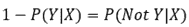
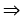
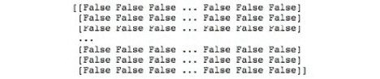
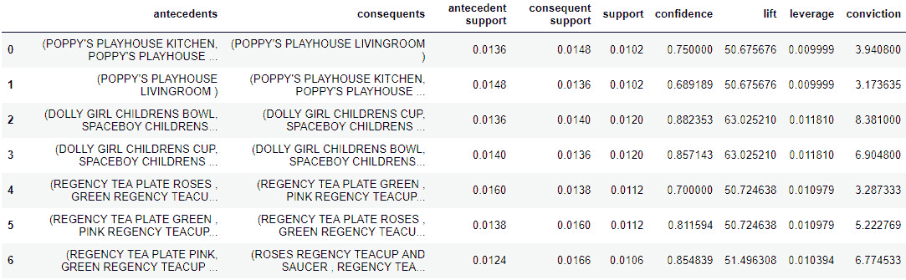

# 第八章：市场篮子分析

## 学习目标

到本章结束时，你将能够：

+   使用交易级别的数据

+   在合适的情境中使用市场篮子分析

+   运行 Apriori 算法并构建关联规则

+   对关联规则进行基本的可视化

+   解读市场篮子分析的关键指标

在本章中，我们将探讨一种基础且可靠的算法，用于分析交易数据。

## 介绍

在本章中，我们将完全改变方向。前一章探讨了主题模型，重点是自然语言处理、文本数据和应用相对较新开发的算法。大多数数据科学从业者会同意，自然语言处理（包括主题模型）处于数据科学的前沿，是一个活跃的研究领域。我们现在已经明白，主题模型可以并且应该在任何文本数据可能带来洞察或增长的地方应用，包括社交媒体分析、推荐引擎和新闻过滤。

本章将带我们进入零售领域，探索一种基础且可靠的算法，用于分析交易数据。虽然这个算法可能不是最前沿的，也不是最流行的机器学习算法之一，但它在零售领域无处不在，并且其影响力不可否认。它带来的洞察易于解读，立刻可以采取行动，并且对确定分析的下一步非常有帮助。如果你从事零售或交易数据分析工作，那么深入了解市场篮子分析将对你非常有益。

## 市场篮子分析

假设你为一家零售商工作，卖着几十种产品，你的老板走过来，问你以下问题：

+   哪些产品最常一起购买？

+   产品应该如何在商店中组织和定位？

+   我们如何识别最适合通过优惠券打折的产品？

你可能会感到完全困惑，因为这些问题非常广泛，而且似乎无法通过单一的算法和数据集直接回答。然而，所有这些问题以及更多问题的答案就是**市场篮子分析**。市场篮子分析背后的基本理念是识别并量化哪些商品或商品组经常一起购买，从而为顾客行为和产品关系提供洞察。

在深入分析之前，值得定义一下“市场篮子”这个术语。市场篮子是一个经济系统中永久存在的商品集合。在这里，永久并不一定意味着传统意义上的永久。它意味着，直到该商品被从目录中移除之前，它将始终可以购买。前述定义中的商品指的是任何商品、服务或一个群体的组成部分，包括自行车、给房子刷漆或一个网站。最后，经济系统可以是一个公司、一系列活动或一个国家。市场篮子的最简单例子是杂货店，它是由一系列食品和饮料商品组成的系统。


###### 图 8.1：一个示例市场篮子，其中经济系统是肉店，永久集合的商品是肉店提供的所有肉类产品

即使不使用任何模型或分析，某些产品之间的关系也是显而易见的。让我们以肉类和蔬菜的关系为例。通常，市场篮子分析模型会返回比“肉类和蔬菜”更具体的关系，但为了讨论的方便，我们将其概括为“肉类和蔬菜”。好吧，肉类和蔬菜之间确实存在关系。那么呢？我们知道这些是常见的食材，通常会一起购买。我们可以利用这一信息，将蔬菜和肉类分别摆放在商店的两端，你会发现这两样商品常常被摆放在商店的对立面，这迫使顾客走完整个商店，从而增加他们购买额外商品的可能性，这些商品如果顾客不需要走遍整个商店，可能就不会买。

零售公司面临的一个难题是如何有效地打折商品。让我们考虑另一个显而易见的关系：花生酱和果冻。在美国，花生酱和果冻三明治非常受欢迎，尤其是在孩子们中间。当购物篮里有花生酱时，可以假设果冻也很可能在其中。既然我们知道花生酱和果冻是一起购买的，那么同时对两者打折就没有意义。如果我们希望顾客购买这两件商品，我们只需打折其中一件商品，知道如果我们能让顾客购买打折商品，他们很可能也会购买另一件商品，即使它是原价。


###### 图 8.2：市场篮子分析的可视化

就像前一章中的主题模型一样，市场篮子分析的关键是识别频繁出现的组。在这里，我们寻找的是频繁出现的产品组，而在主题模型中，我们寻找的是频繁出现的词组。因此，正如它可以应用于主题模型一样，词汇聚类也可以应用于市场篮子分析。主要的不同之处在于，市场篮子分析中的聚类是微观的，每个聚类只有少数几个产品，并且在计算概率指标时，聚类中项目的顺序是至关重要的。我们将在本章后面深入探讨这些指标以及它们是如何计算的。

从前面两个例子中可以明显看出，在市场篮子分析中，零售商能够发现顾客购买的产品之间的关系——这些关系有时显而易见，有时又出乎意料。一旦这些关系被揭示出来，就可以用来指导和改善决策过程。市场篮子分析的一个重要特点是，尽管这种分析最初是在零售领域开发、讨论并应用的，但它同样可以应用于许多不同类型的企业。

执行这种分析的唯一要求是数据必须是一个项集合的列表。在零售案例中，这通常是一个包含多次交易的列表，每次交易中包含一组已购买的产品。另一个替代应用的例子是分析网站流量。对于网站流量，我们把网站视作产品，所以列表中的每个元素就是某个个体在特定时间段内访问的所有网站集合。不用说，市场篮子分析的应用远远超出了零售领域的主应用。

### 用例

在传统零售应用中，有三个主要的用例：定价优化、优惠券和折扣推荐以及商店布局。如前所述，零售商可以利用模型揭示的产品关联，策略性地在商店内摆放商品，从而促使顾客购买更多商品，并因此花费更多的钱。如果两个或更多产品之间的关系足够强大——即该产品组合在数据集中出现的频率很高，并且组合中的单个产品在其他时候很少单独出现——那么这些产品就可以放在商店的远离彼此的地方，而不会显著影响顾客购买这两种产品的几率。通过迫使顾客走遍整个商店去购买这两种产品，零售商增加了顾客注意到并购买其他商品的机会。同样，零售商也可以通过将两种相关性较弱或非基础性产品放在一起，提高顾客购买这两种商品的几率。显然，商店布局受许多因素的影响，但市场篮子分析无疑是其中一个重要因素：


###### 图 8.3：产品关联如何帮助设计高效且有利可图的商店布局

定价提升和优惠券及折扣推荐是同一个问题的两个方面。可以简单地理解为在哪里提高价格，在哪里降低价格。考虑两个强相关商品的情况。这两件商品很可能会在同一笔交易中被购买，因此提高其中一件商品的价格是增加交易利润的一种方式。如果这两件商品之间的关联足够强，价格的提高几乎不会影响客户购买这两件商品的可能性。以类似的方式，零售商可以通过折扣或优惠券促使客户购买与其他商品有弱关联的商品。

例如，零售商可以将单个客户的购买历史与所有交易的市场篮分析结果进行比较，找出某些客户购买的商品与他们未购买的商品之间的弱关联。通过这个比较，零售商可以为这些客户提供折扣，推荐模型认为与他们之前购买的商品相关的尚未购买的商品。如果你曾在交易结束时收到打印出来的优惠券，极有可能这些商品与刚刚完成的交易中的商品是相关的。

市场篮分析的一个非传统但可行的应用是增强在线广告和搜索引擎优化。假设我们可以访问个人访问的网站列表。利用市场篮分析，我们可以找到网站之间的关系，并利用这些关系来策略性地排序和分组搜索引擎查询结果中的网站。在很多方面，这与商店布局的应用场景类似。

通过对市场篮分析的总体了解和对其应用场景的清晰认识，我们现在可以深入研究这些模型中使用的数据。

### 重要的概率度量

市场篮分析是建立在几个概率度量的计算基础上的。这里讨论的五个主要度量是支持度、置信度、提升度、杠杆度和确信度。在深入研究交易数据和具体的市场篮分析模型（包括**Apriori 算法**和**关联规则**）之前，我们应该花些时间定义并探讨这些度量，使用一个小的、虚构的交易数据集来说明。我们从编造一些数据开始。

### 练习 39：创建样本交易数据

由于这是本章的第一个练习，让我们设置环境。本章将使用与*第七章*、*主题建模*中相同的环境要求。如果任何一个包没有加载，就像前一章那样，使用`pip`通过命令行安装它们。我们将使用的一个库是`mlxtend`，它可能对你来说比较陌生。它是一个机器学习扩展库，包含了许多有用的辅助工具，包括集成、堆叠和市场篮分析模型。本次练习没有实际输出，我们将简单地创建一个示例交易数据集，用于后续的练习。

1.  打开一个使用 Python 3 的 Jupyter 笔记本。

1.  安装以下库：`matplotlib.pyplot`，用于绘制模型的结果，`mlxtend.frequent_patterns`，用于运行模型，`mlxtend.preprocessing`，用于对数据进行编码和准备，以适应模型，`numpy`，用于处理数组，`pandas`，用于处理数据框：

    #### 注意

    ```py
    import matplotlib.pyplot as plt
    import mlxtend.frequent_patterns
    import mlxtend.preprocessing
    import numpy
    import pandas
    ```

1.  创建 10 个虚拟交易，内容为杂货店项目。这些数据将以列表的形式出现，这种数据结构在后面讨论格式化交易数据以适应模型时会非常有用：

    ```py
    example = [
        ['milk', 'bread', 'apples', 'cereal', 'jelly', 
         'cookies', 'salad', 'tomatoes'],
        ['beer', 'milk', 'chips', 'salsa', 'grapes', 
         'wine', 'potatoes', 'eggs', 'carrots'],
        ['diapers', 'baby formula', 'milk', 'bread', 
         'chicken', 'asparagus', 'cookies'],
        ['milk', 'cookies', 'chicken', 'asparagus', 
         'broccoli', 'cereal', 'orange juice'],
        ['steak', 'asparagus', 'broccoli', 'chips', 
         'salsa', 'ketchup', 'potatoes', 'salad'],
        ['beer', 'salsa', 'asparagus', 'wine', 'cheese', 
         'crackers', 'strawberries', 'cookies'],
        ['chocolate cake', 'strawberries', 'wine', 'cheese', 
         'beer', 'milk', 'orange juice'],
        ['chicken', 'peas', 'broccoli', 'milk', 'bread', 
         'eggs', 'potatoes', 'ketchup', 'crackers'],
        ['eggs', 'bread', 'cheese', 'turkey', 'salad', 
         'tomatoes', 'wine', 'steak', 'carrots'],
        ['bread', 'milk', 'tomatoes', 'cereal', 'chicken', 
         'turkey', 'chips', 'salsa', 'diapers']
    ]
    ```

这个简单的数据集将使得解释和理解概率度量变得更加容易。

### 支持度

**支持度**简单来说就是项目集在数据中出现的概率，可以通过计算项目集出现的交易次数并将该次数除以总交易数来得到。需要注意的是，项目集可以是一个单独的项目，也可以是一组项目。尽管支持度非常简单，但它是一个重要的度量指标，因为它是用于确定项目集之间关联的可信度和强度的主要指标之一。例如，可能有两个项目只在彼此之间出现，表明它们的关联非常强，但在一个包含 100 个交易的数据集中，只有两次出现并不令人印象深刻。因为该项目集只在 2%的交易中出现，而 2%在原始出现次数中算是很小的，因此该关联不能被视为显著，因此在决策中可能无法使用。

请注意，由于支持度是一个概率值，它的范围将在[0,1]之间。如果项目集包含两个项目，X 和 Y，且 N 为总交易数，则公式如下所示。


###### 图 8.4：支持度公式

让我们暂时回到*练习 39*中制作的数据，*创建样本交易数据*，并将商品集定义为牛奶和面包。我们可以轻松地查看这 10 个交易，并统计牛奶和面包商品集出现的次数——这是 4 次。鉴于总共有 10 个交易，牛奶和面包的支持度是 4 除以 10，即 0.4。是否足够大，这取决于数据集本身，我们将在后续部分进行讨论。

### 置信度

**置信度**度量可以通过条件概率来理解，它基本上是指在购买了产品 A 的前提下，购买产品 B 的概率。置信度通常表示为 A  B，并表达为包含 A 的交易中同时包含 B 的比例。因此，置信度是通过将交易全集筛选为包含 A 的交易，然后计算这些交易中包含 B 的比例来得出的。与支持度类似，置信度是一个概率值，因此其范围是[0,1]。使用与支持度部分相同的变量定义，以下是置信度的公式：


###### 图 8.5：置信度公式

为了演示置信度，我们将使用啤酒和葡萄酒这两个商品。具体来说，我们来计算啤酒  葡萄酒的置信度。首先，我们需要找出包含啤酒的交易。有 3 个这样的交易，它们是交易 2、6 和 7。现在，在这些交易中，有多少包含葡萄酒？答案是所有的交易都包含葡萄酒。因此，啤酒  葡萄酒的置信度是 1。每次顾客购买了啤酒，他们也购买了葡萄酒。这可能很明显，但为了识别可操作的关联，更高的置信度值是更好的：

### 提升度和杠杆度

我们将同时讨论接下来的两个度量，提升度和杠杆度，因为尽管它们的计算方式不同，但都试图回答相同的问题。与置信度一样，**提升度**和**杠杆度**也表示为 A  B。我们要回答的问题是，是否可以通过一个物品，比如 A，来推断另一个物品，比如 B？换句话说，如果一个人购买了产品 A，我们能否在一定程度上确定他们是否会购买产品 B？这些问题通过将 A 和 B 的支持度在假设 A 和 B 不独立的标准情况下与假设两者独立的情况进行比较来回答。提升度计算这两种情况的比率，因此其范围是[0, 无限]。当提升度等于 1 时，两个产品是独立的，因此在购买产品 A 时，无法得出关于产品 B 的任何结论：


###### 图 8.6：提升度公式

Leverage 计算两种情况之间的差异，因此其范围是[-1, 1]。Leverage 等于零可以解释为与 lift 等于一相同的含义：


###### 图 8.7：杠杆公式

这些指标的值衡量项目之间关系的强度和方向。如果 lift 值为 0.1，我们可以说两个项目之间的关系在负方向上很强。也就是说，可以认为当购买一个产品时，购买第二个产品的机会会减少。正相关和负相关被独立性点所分隔，正如前面所说，lift 的独立性点为 1，leverage 的独立性点为 0，而值越远离这些点，关联越强。

### 信念

最后要讨论的指标是信念，它比其他指标稍微不直观。信念是指在 X 和 Y 独立的情况下，X 发生但 Y 不发生的预期频率与错误预测频率的比值。错误预测频率定义为 1 减去 X 的置信度  Y。记住，置信度可以定义为 ，这意味着 .。分子也可以视为 。两者的唯一区别是分子假设 X 和 Y 之间是独立的，而分母则没有。理想情况下，值大于 1，因为这意味着当 X 和 Y 之间的关联是随机偶然（换句话说，X 和 Y 是独立的）时，产品或项目集合 X 和 Y 之间的关联更常是错误的。再强调一遍，这表明 X 和 Y 之间的关联是有意义的。值为 1 表示独立性，而小于 1 的值则意味着 X 和 Y 之间的随机关系比定义为 X  Y 的关系更常见。在这种情况下，关系可能是反向的（换句话说，Y  X）。信念的范围是[0, ∞]，其形式如下：


###### 图 8.8：信念公式

让我们再次回到啤酒和葡萄酒这两个产品，但为了说明本次情况，我们将考虑葡萄酒  啤酒的相反关联。Support(Y)，或在本例中为 Support(啤酒)，是 3/10，而 Confidence X  Y，或在本例中为 Confidence(葡萄酒  啤酒)，是 3/4。因此，Conviction(葡萄酒  啤酒)为(1-3/10) / (1-3/4) = (7/10) * (4/1)。我们可以得出结论，如果葡萄酒和啤酒是独立的，那么葡萄酒  啤酒的关联会错误出现 2.8 次。因此，之前提到的葡萄酒和啤酒的关联是有效的。

### 练习 40：计算指标

在本练习中，我们使用*练习 39*中的虚拟数据，*创建样本事务数据*，来计算之前描述的五个指标，我们将在讲解 Apriori 算法和关联规则时再次使用这些指标。我们将评估的关联是牛奶  面包。

#### 注意

本章中的所有练习都需要在同一个 Jupyter 笔记本中完成。

1.  定义并打印构成所有五个指标基础的频率，即 Frequency(牛奶)、Frequency(面包)和 Frequency(牛奶, 面包)。还需定义 N 为数据集中交易的总数：

    ```py
    N = len(example)
    f_x = sum(['milk' in i for i in example]) # milk
    f_y = sum(['bread' in i for i in example]) # bread
    f_x_y = sum([
        all(w in i for w in ['milk', 'bread']) 
        for i in example
    ])
    print(
        "N = {}\n".format(N) + 
        "Freq(x) = {}\n".format(f_x) + 
        "Freq(y) = {}\n".format(f_y) + 
        "Freq(x, y) = {}".format(f_x_y)
    )
    ```

    输出如下：

    

    ###### 图 8.9：频率截图

1.  计算并打印 Support(牛奶  面包)：

    ```py
    support = f_x_y / N
    print("Support = {}".format(round(support, 4)))
    ```

    `x` 到 `y` 的支持度为 `0.4`。根据经验，如果我们使用的是完整的交易数据集，那么这个支持值在许多情况下会被认为是非常大的。

1.  计算并打印 Confidence(牛奶  面包)：

    ```py
    confidence = support / (f_x / N)
    print("Confidence = {}".format(round(confidence, 4)))
    ```

    `x` 到 `y` 的置信度为 `0.5714`。这意味着，给定已经购买了`x`，Y 被购买的概率略高于 50%。

1.  计算并打印 Lift(牛奶  面包)：

    ```py
    lift = confidence / (f_y / N)
    print("Lift = {}".format(round(lift, 4)))
    ```

    `x` 到 `y` 的提升度为 `1.1429`。

1.  计算并打印 Leverage(牛奶  面包)：

    ```py
    leverage = support - ((f_x / N) * (f_y / N))
    print("Leverage = {}".format(round(leverage, 4)))
    ```

    `x` 到 `y` 的杠杆度为 `0.05`。提升度和杠杆度都可以用来说明关联`x`到`y`是正向的（换句话说，`x`意味着`y`），但弱。也就是说，值分别接近 1 和 0。

1.  计算并打印 Conviction(牛奶  面包)：

    ```py
    conviction = (1 - (f_y / N)) / (1 - confidence)
    print("Conviction = {}".format(round(conviction, 4)))
    ```

    `1.1667`的置信度值可以解释为，如果牛奶和面包是独立的，那么牛奶  面包的关联会错误出现`1.1667`次。

在深入了解 Apriori 算法和实际数据上的关联规则学习之前，我们将先探索事务数据，并加载和准备一些零售数据进行建模。

## 事务数据的特点

在市场篮分析中使用的数据是交易数据，或者任何类似交易数据的数据。最基本的交易数据包含某种交易标识符，如发票号或交易号，以及与该标识符相关的产品列表。恰好这两项基本要素就是进行市场篮分析所需的全部内容。然而，交易数据很少——甚至可以说从未——以这种基本形式存在。交易数据通常还包括定价信息、日期和时间、客户标识符等许多其他信息：


###### 图 8.10：每个可用的产品将映射到多个发票号码

由于交易数据的复杂性，数据清洗至关重要。在市场篮分析的背景下，数据清洗的目标是过滤掉所有不必要的信息，包括移除与分析无关的变量，并清理掉有问题的交易。完成这两步清洗所使用的技术有所不同，具体取决于交易数据文件的情况。为了避免在数据清洗中陷入困境，接下来的练习将使用来自 UCI 机器学习库的在线零售数据集的一个子集，活动将使用完整的数据集。这既限制了数据清洗的讨论，又为我们提供了一个机会，讨论当数据集大小变化时，结果如何变化。这一点很重要，因为如果你为零售商工作并进行市场篮分析，你需要理解并清楚地说明，随着数据量的增加，产品之间的关系可能会发生变化，而且很可能会发生变化。在讨论此数据集所需的具体清洗过程之前，让我们先加载在线零售数据集。

### 练习 41：加载数据

在本次练习中，我们将加载并查看一个示例的在线零售数据集。该数据集最初来自 UCI 机器学习库，可以在[`github.com/TrainingByPackt/Applied-Unsupervised-Learning-with-Python/tree/master/Lesson08/Exercise39-Exercise45`](https://github.com/TrainingByPackt/Applied-Unsupervised-Learning-with-Python/tree/master/Lesson08/Exercise39-Exercise45)找到。下载数据集后，请保存并记下路径。现在，我们开始练习。本练习的输出结果是交易数据，未来建模练习中将使用这些数据，并通过一些探索性图形帮助我们更好地理解我们正在处理的数据。

#### 注意

数据集来自[`archive.ics.uci.edu/ml/datasets/online+retail#`](http://archive.ics.uci.edu/ml/datasets/online+retail)。可以从[`github.com/TrainingByPackt/Applied-Unsupervised-Learning-with-Python/tree/master/Lesson08/Exercise39-Exercise45`](https://github.com/TrainingByPackt/Applied-Unsupervised-Learning-with-Python/tree/master/Lesson08/Exercise39-Exercise45)下载。陈大庆、梁赛、郭坤，《面向在线零售行业的数据挖掘：基于 RFM 模型的客户细分案例研究》，《数据库营销与客户战略管理杂志》，第 19 卷，第 3 期，197-208 页，2012 年。

UCI 机器学习库 [http://archive.ics.uci.edu/ml]。加利福尼亚州欧文市：加利福尼亚大学信息与计算机科学学院。

1.  使用`pandas`中的`read_excel`函数加载数据。请注意，Excel 文件的第一行包含列名：

    ```py
    online = pandas.read_excel(
        io="~/Desktop/Online Retail.xlsx", 
        sheet_name="Online Retail", 
        header=0
    )
    ```

    #### 注意

    `Online Retail.xlsx`的路径应根据文件在系统中的位置进行修改。

1.  打印出数据框的前 10 行。请注意，数据中包含一些与市场篮子分析无关的列：

    ```py
    online.head(10)
    ```

    输出结果如下：

    

    ###### 图 8.11：原始在线零售数据

1.  打印出数据框中每一列的类型。此信息在执行特定的清理任务时将非常有用：

    ```py
    online.dtypes
    ```

    输出结果如下：

    

    ###### 图 8.12：数据集中每列的数据类型

1.  获取数据框的维度，以及唯一发票号和客户标识的数量：

    ```py
    print(
         "Data dimension (row count, col count): {dim}"
         .format(dim=online.shape)
    )
    print(
         "Count of unique invoice numbers: {cnt}"
         .format(cnt=online.InvoiceNo.nunique())
    )
    print(
         "Count of unique customer ids: {cnt}"
         .format(cnt=online.CustomerID.nunique())
    )
    ```

    输出结果如下：

    ```py
    Data dimension (row count, col count): (541909, 8)
    Count of unique invoice numbers: 25900
    Count of unique customer ids: 4372
    ```

在本次练习中，我们已经加载了数据并进行了初步探索性工作。

### 数据清理与格式化

现在数据集已经加载，让我们深入探讨具体的数据清理过程。由于我们将数据筛选为仅包含发票号和商品项，我们将数据清理工作集中在数据集的这两列上。请记住，市场篮分析旨在识别所有客户在一段时间内购买商品之间的关联。因此，数据清理的主要工作是删除包含非正数商品的交易。这种情况可能发生在交易作废、商品退货或行政操作等场景中。这些类型的交易将通过两种方式进行筛选。首先，已取消的交易其发票号前面带有“C”，所以我们将识别这些特定的发票号并将其从数据中删除。另一种方法是删除所有商品数量为零或负数的交易。执行这两步后，数据将仅保留发票号和商品描述这两列，并删除任何包含至少一个缺失值的行。

数据清理的下一阶段涉及将数据转换为适合建模的格式。在此及后续的练习中，我们将使用完整数据的一个子集。这个子集通过获取前 5000 个唯一的发票号来创建。将数据缩减到前 5000 个唯一发票号后，我们将数据结构更改为运行模型所需的格式。请注意，目前数据是长格式，每个商品占一行。期望的格式是一个列表的列表，类似于本章早些时候所提到的虚构数据。每个子集列表表示一个唯一的发票号，因此，在本例中，外部列表应包含 5000 个子列表。子列表的元素是所有属于该发票号的商品。按照描述的清理过程，我们接下来开始练习。

### 练习 42：数据清理与格式化

在这个练习中，我们将执行之前描述的数据清理步骤。在处理过程中，我们将通过打印出数据的当前状态并计算一些基本的汇总指标来监控数据的变化。确保在加载数据的同一个笔记本中执行数据清理。

1.  创建一个指示列，标明发票号是否以 "`C`" 开头：

    ```py
    online['IsCPresent'] = (
        online['InvoiceNo']
        .astype(str)
        .apply(lambda x: 1 if x.find('C') != -1 else 0)
    )
    ```

1.  筛选出所有商品数量为零或负数的交易，使用第一步创建的列删除所有以“C”开头的发票号，将 DataFrame 子集化为 `InvoiceNo` 和 `Description`，最后删除所有包含至少一个缺失值的行。将 DataFrame 重命名为 `online1`：

    ```py
    online1 = (
        online
        # filter out non-positive quantity values
        .loc[online["Quantity"] > 0]
        # remove InvoiceNos starting with C
        .loc[online['IsCPresent'] != 1]
        # column filtering
        .loc[:, ["InvoiceNo", "Description"]]
        # dropping all rows with at least one missing value
        .dropna()
    )
    ```

1.  打印出过滤后的 DataFrame `online1` 的前 10 行：

    ```py
    online1.head(10)
    ```

    

    ###### 图 8.13：清理后的在线零售数据集

1.  打印出清理后的 DataFrame 的维度以及唯一发票号的数量：

    ```py
    print(
        "Data dimension (row count, col count): {dim}"
        .format(dim=online1.shape)
    )
    print(
        "Count of unique invoice numbers: {cnt}"
        .format(cnt=online1.InvoiceNo.nunique())
    )
    ```

    输出结果如下：

    ```py
    Data dimension (row count, col count): (530693, 2)
    Count of unique invoice numbers: 20136
    ```

    请注意，我们已经删除了大约 10,000 行和 5,800 个发票号。

1.  将发票号从 DataFrame 中提取为列表。删除重复元素，生成唯一发票号的列表。通过打印唯一发票号列表的长度来确认处理是否成功。与*步骤 4*的输出进行比较：

    ```py
    invoice_no_list = online1.InvoiceNo.tolist()
    invoice_no_list = list(set(invoice_no_list))
    print(
        "Length of list of invoice numbers: {ln}"
        .format(ln=len(invoice_no_list))
    )
    ```

    输出结果如下：

    ```py
    Length of list of invoice numbers: 20136
    ```

1.  从第五步的列表中取出，仅保留前 5,000 个元素。打印新列表的长度以确认它确实是预期的 5,000 长度：

    ```py
    subset_invoice_no_list = invoice_no_list[0:5000]
    print(
        "Length of subset list of invoice numbers: {ln}"
        .format(ln=len(subset_invoice_no_list))
    )
    ```

    输出结果如下：

    ```py
    Length of subset list of invoice numbers: 5000
    ```

1.  仅保留前一步列表中的发票号，过滤`online1` DataFrame：

    ```py
    online1 = online1.loc[online1["InvoiceNo"].isin(subset_invoice_no_list)]
    ```

1.  打印出`online1`的前 10 行：

    ```py
    online1.head(10)
    ```

    输出结果如下：

    

    ###### 图 8.14：仅包含 5,000 个唯一发票号的清理后的数据集

1.  打印出 DataFrame 的维度和唯一发票号的数量，以确认过滤和清理过程是否成功：

    ```py
    print(
        "Data dimension (row count, col count): {dim}"
        .format(dim=online1.shape)
    )
    print(
        "Count of unique invoice numbers: {cnt}"
        .format(cnt=online1.InvoiceNo.nunique())
    )
    ```

    输出结果如下：

    ```py
    Data dimension (row count, col count): (129815, 2)
    Count of unique invoice numbers: 5000
    ```

1.  将`online1`中的数据转换为上述所述的列表形式，称为`invoice_item_list`。实现这一过程的方法是遍历唯一的发票号，在每次迭代时提取项目描述作为一个列表，并将该列表附加到更大的`invoice_item_list`列表中。打印列表中的前四个元素：

    ```py
    invoice_item_list = []
    for num in list(set(online1.InvoiceNo.tolist())):
        # filter dataset down to one invoice number
        tmp_df = online1.loc[online1['InvoiceNo'] == num]
        # extract item descriptions and convert to list
        tmp_items = tmp_df.Description.tolist()
        # append list invoice_item_list
        invoice_item_list.append(tmp_items)

    print(invoice_item_list[1:5])
    ```

    输出结果如下：


###### 图 8.15：列表中包含四个元素的子列表，每个子列表包含属于单个发票的所有项目

#### 注意

此步骤可能需要几分钟才能完成。

### 数据编码

虽然清理数据至关重要，但数据准备过程最重要的部分是将数据调整为正确的形式。在运行模型之前，当前以列表的形式存在的数据需要被编码并重新转换为 DataFrame。为此，我们将利用`mlxtend`的`preprocessing`模块中的`TransactionEncoder`。编码器输出的是一个多维数组，每一行的长度等于事务数据集中唯一项目的总数，元素为布尔变量，指示该特定项目是否与该行所表示的发票号相关联。数据编码后，我们可以将其重新转换为 DataFrame，其中行是发票号，列是事务数据集中的唯一项目。

在以下练习中，数据编码将使用 `mlxtend` 完成，但也可以不使用任何包进行编码，方法非常简单。第一步是将嵌套列表展平，返回一个包含原始嵌套列表中每个值的单一列表。接下来，去除重复的产品，并且如果需要，可以按字母顺序对数据进行排序。在进行实际编码之前，我们通过将所有元素初始化为 `false` 来初始化最终的 DataFrame，行数等于数据集中发票号码的数量，列名为非重复的产品名称列表。

在这种情况下，我们有 5,000 笔交易和超过 3,100 个唯一产品。因此，DataFrame 中包含超过 15,000,000 个元素。实际的编码是通过遍历每笔交易和每笔交易中的每个商品来完成的。如果交易包含某个产品，便将初始化数据集中第 *i* 行和第 *j* 列的值从 false 改为 true。由于我们需要遍历 15,000,000 个单元格，这个双重循环并不高效。虽然有一些方法可以提高性能，包括在 `mlxtend` 中实现的一些方法，但为了更好地理解这个过程，通过双重循环的方法是很有帮助的。以下是一个示例函数，用于在不借助任何包（除了 `pandas`）的情况下从头开始进行编码：

```py
def manual_encoding(ll):
    # unlist the list of lists input
    # result is one list with all the elements of the sublists
    list_dup_unsort_items = [element for sub in ll for element in sub]
    # two cleaning steps:
    #     1\. remove duplicate items, only want one of each item in list
    #     2\. sort items in alphabetical order
    list_nondup_sort_items = sorted(list(set(list_dup_unsort_items)))

    # initialize DataFrame with all elements having False value
    # name the columns the elements of list_dup_unsort_items
    manual_df = pandas.DataFrame(
        False, 
        index=range(len(ll)), 
        columns=list_dup_unsort_items
    )

    # change False to True if element is in individual transaction list
    # each row is represents the contains of an individual transaction
    # (sublist from the original list of lists)
    for i in range(len(ll)):
        for j in ll[i]:
            manual_df.loc[i, j] = True

    # return the True/False DataFrame
    return manual_df
```

### 练习 43：数据编码

在本练习中，我们通过对上一练习中生成的嵌套列表进行编码，继续数据准备过程，以便以特定方式运行模型。

1.  初始化并拟合事务编码器。打印出结果数据的示例：

    ```py
    online_encoder = mlxtend.preprocessing.TransactionEncoder()
    online_encoder_array = online_encoder.fit_transform(invoice_item_list)
    print(online_encoder_array)
    ```

    输出如下：

    

    ](img/C12626_08_16.jpg)

    ###### 图 8.16：包含表示每笔交易中产品存在的布尔变量的多维数组

1.  将编码后的数组重构为名为 `online_encoder_df` 的 DataFrame。打印出一个预定义的 DataFrame 子集，包含 true 和 false 值：

    ```py
    online_encoder_df = pandas.DataFrame(
        online_encoder_array, 
        columns=online_encoder.columns_
    )
    # this is a very big table, so for more 
    # easy viewing only a subset is printed
    online_encoder_df.loc[
        4970:4979, 
        online_encoder_df.columns.tolist()[0:8]
    ]
    ```

    输出结果将类似于以下内容：

    

    ](img/C12626_08_17.jpg)

    ###### 图 8.17：将编码数据的小部分重构为 DataFrame

1.  打印出编码后 DataFrame 的维度。它应该有 5,000 行，因为生成它的数据已经过滤为 5,000 个唯一的发票号码：

    ```py
    print(
        "Data dimension (row count, col count): {dim}"
        .format(dim=online_encoder_df.shape)
    )
    ```

    输出结果将类似于以下内容：

    ```py
    Data dimension (row count, col count): (5000, 3334)
    ```

数据现已准备好用于建模。在接下来的部分，我们将探索 Apriori 算法。

### 活动 18：加载并准备完整的在线零售数据

在本活动中，我们的任务是加载并准备一个大型事务数据集进行建模。最终输出将是一个适当编码的数据集，每个独特的事务占一行，每个独特的商品占一列。如果某个商品出现在某个事务中，那么该数据框中的该元素将标记为真。

本活动将大致重复前几次练习，但将使用完整的在线零售数据集文件。无需执行新的下载，但你需要先前下载文件的路径。请在单独的 Jupyter 笔记本中执行此活动。

以下步骤将帮助你完成此活动：

1.  加载在线零售数据集文件：

    #### 注

    此数据集来自 [`archive.ics.uci.edu/ml/datasets/online+retail#`](http://archive.ics.uci.edu/ml/datasets/online+retail)。它可以从 https://github.com/TrainingByPackt/Applied-Unsupervised-Learning-with-Python/tree/master/Lesson08/Activity18-Activity20 下载。Daqing Chen、Sai Liang Sain 和 Kun Guo, 数据挖掘在在线零售行业中的应用：基于 RFM 模型的客户细分案例研究，发表于《数据库营销与客户战略管理杂志》，第 19 卷，第 3 期，197-208 页，2012 年。

    UCI 机器学习库 [http://archive.ics.uci.edu/ml]。加利福尼亚州尔湾：加利福尼亚大学信息与计算机科学学院。

1.  清理并准备建模数据，包括将清理后的数据转换为列表的列表。

1.  对数据进行编码并将其重塑为数据框：

    #### 注

    本活动的解决方案可以在第 366 页找到。

输出将类似于以下内容：


](img/C12626_08_18.jpg)

###### 图 8.18：从完整的在线零售数据集中清理、编码和重塑后的数据框的一个子集

## Apriori 算法

**Apriori** 算法是一种数据挖掘方法，用于识别和量化事务数据中的频繁项集，是关联规则学习的基础组件。在下一节中，将讨论如何将 Apriori 算法的结果扩展到关联规则学习。Apriori 算法中作为频繁项集的最小值是模型的输入，因此是可调节的。频率在此通过支持度来量化，因此输入模型的值是分析中接受的最小支持度。模型随后识别所有支持度大于或等于输入给定的最小支持度的项集。请注意，最小支持度参数不是通过网格搜索可以优化的参数，因为 Apriori 算法没有评估指标。相反，最小支持度参数是根据数据、使用案例和领域专业知识来设置的。

Apriori 算法背后的主要思想是 Apriori 原则：任何频繁项集的子集必须本身也是频繁的。

另一个值得提及的方面是推论：不频繁项集的超集不可能是频繁的。

让我们举一些例子。如果项集 {锤子、锯子和钉子} 是频繁的，那么根据 Apriori 原则以及显而易见的道理，任何更简单的项集，例如 {锤子、锯子}，也一定是频繁的。相反，如果同样的项集 {锤子、锯子、钉子} 是不频繁的，那么增加复杂性，比如在项集 {锤子、锯子、钉子} 中加入木材 {锤子、锯子、钉子、木材}，也不会使该项集变得频繁。

计算事务数据库中每个项集的支持度值，并仅返回支持度大于或等于预设的最小支持度阈值的项集，可能看起来很简单，但实际上并非如此，因为需要进行大量计算。例如，考虑一个包含 10 个独特项的项集。这将导致 1,023 个单独的项集，需要计算它们的支持度值。现在，试着推算一下我们的工作数据集，它包含 3,135 个独特项。我们需要为这些项集计算支持度值的数量将是巨大的。计算效率是一个重大问题。


###### 图 8.19：项集如何构建以及 Apriori 原则如何大幅减少计算需求的映射（所有灰色节点为不频繁项集）。

为了解决计算需求，Apriori 算法被定义为一个自下而上的模型，包含两个步骤。这些步骤包括通过向已存在的频繁项集中添加项目来生成候选项集，并将这些候选项集与数据集进行测试，以确定这些候选项集是否也是频繁的。对于包含不频繁项集的项集，不会计算支持度值。这个过程会一直重复，直到不再有候选项集存在：


###### 图 8.20：假设最小支持度阈值为 0.4，图示显示了一般的 Apriori 算法结构。

前述结构包括建立项集、计算支持度值、过滤掉不频繁项集、创建新项集并重复此过程。

存在一个清晰的树状结构，作为识别候选项集的路径。所使用的具体搜索技术，是为遍历树状数据结构而设计的宽度优先搜索，这意味着搜索过程的每一步都专注于完全搜索树的一层，然后再移动到下一层，而不是逐分支进行搜索。

算法的高层步骤如下：

1.  定义频繁项集。首先，这通常是单个项目的集合。

1.  通过将频繁项集组合在一起，推导候选项集。每次增加一个项集的大小。也就是说，从一个项集的集合开始，逐渐增加到两个项集、三个项集，依此类推。

1.  计算每个候选项集的支持度值。

1.  创建一个新的频繁项集，由支持度值超过指定阈值的候选项集组成。

重复*步骤 1*到*步骤 4*，直到没有更多的频繁项集；也就是说，直到我们遍历了所有的组合。

Apriori 算法的伪代码如下：

```py
L1 = {frequent items}
For k = 1 and L1 != empty set do
    Ck+1 = candidate item sets derived from Lk
    For each transaction t in the dataset do
        Increment the count of the candidates in Ck+1 that appear in t
    Compute the support for the candidates in Ck+1 using the appearance counts
    Lk+1 = the candidates in Ck+1 meeting the minimum support requirement
        End
Return L = UkLk = all frequent item sets with corresponding support values
```

尽管遵循 Apriori 原则，这个算法仍然可能面临显著的计算挑战，具体取决于事务数据集的大小。目前有几种策略被接受，以进一步减少计算需求。

### 计算修正

事务减少是一种减少计算负担的简单方法。请注意，在生成每个候选项集之后，必须扫描整个事务数据集，以统计每个候选项集的出现次数。如果我们能缩小事务数据集的大小，数据集扫描的大小将大幅减少。事务数据集的缩小通过意识到任何在*第 i*次迭代中不包含频繁项集的事务，在后续迭代中也不会包含频繁项集。因此，一旦每个事务不包含频繁项集，它就可以从未来扫描中使用的事务数据集中移除。

对事务数据集进行抽样并测试每个候选项集，是减少扫描事务数据集计算每个项集支持度所需的计算量的另一种方法。在实施这一方法时，重要的是要降低最小支持度要求，以确保最终数据中没有遗漏应包含的项集。由于抽样后的事务数据集会自然导致支持度值较小，因此如果将最小支持度保持在原值，将错误地从模型输出中移除那些应该是频繁项集的项集。

一种类似的方法是分区。在这种情况下，数据集被分割成若干个独立的数据集，在每个数据集上评估每个候选项集。如果某个项集在其中一个分区中频繁出现，那么它在完整的交易数据集中也被认为是频繁的。每个分区会被连续扫描，直到确定某个项集的频率。

无论是否使用这些技术，Apriori 算法的计算需求通常都会相当庞大。正如现在应该清楚的，算法的核心，支持度的计算，并不像本文讨论的其他模型那样复杂。

### 练习 44：执行 Apriori 算法

`mlxtend`使得执行 Apriori 算法变得简单。因此，本次练习将重点讲解如何操作输出的数据集以及如何解读结果。你将回忆起清洗和编码后的交易数据被定义为`online_encoder_df`。请在之前所有练习运行过的相同笔记本中执行本练习，因为我们将继续使用该笔记本中已经建立的环境、数据和结果。（因此，你应该使用包含 5000 条记录的缩减数据集的笔记本，而不是活动中使用的完整数据集。）

1.  使用`mlxtend`运行 Apriori 算法，不改变任何默认参数值：

    ```py
    mod = mlxtend.frequent_patterns.apriori(online_encoder_df)
    mod
    ```

    输出是一个空的 DataFrame。默认的最小支持度值为 0.5，因此，由于返回了一个空的 DataFrame，我们知道所有项集的支持度都低于 0.5。根据交易的数量和可用项的多样性，没有项集支持度超过 0.5 并不罕见。

1.  重新运行 Apriori 算法，但将最小支持度设置为 0.01。这个最小支持度值的含义是，在分析 5000 笔交易时，项集需要出现 50 次才被认为是频繁的。如前所述，最小支持度可以设置为[0,1]范围内的任何值。没有最优的最小支持度值；该值的设置完全是主观的。许多企业有自己的特定显著性阈值，但没有行业标准或优化此值的方法：

    ```py
    mod_minsupport = mlxtend.frequent_patterns.apriori(
        online_encoder_df,
        min_support=0.01
    )
    mod_minsupport.loc[0:6]
    ```

    输出将类似于以下内容：

    

    ###### 图 8.21：使用 mlxtend 运行的 Apriori 算法的基本输出

    注意，输出中项集的标识是数字形式的，这使得结果难以解读。

1.  重新运行 Apriori 算法，使用与*步骤 2*中相同的最小支持度，但这次将`use_colnames`设置为 True。这样将用实际的项名称替代数字标识：

    ```py
    mod_colnames_minsupport = mlxtend.frequent_patterns.apriori(
        online_encoder_df, 
        min_support=0.01,
        use_colnames=True
    )
    mod_colnames_minsupport.loc[0:6]
    ```

    输出将类似于以下内容：

    

    ###### 图 8.22：Apriori 算法输出，使用实际商品名称代替数字表示

    这个 DataFrame 包含了每个支持度值大于指定最小支持度值的商品集。也就是说，这些商品集出现的频率足够高，可能具有一定的意义，因而可以采取行动。

1.  在*步骤 3*的输出中添加一列，包含商品集的大小，这有助于过滤和进一步分析：

    ```py
    mod_colnames_minsupport['length'] = (
        mod_colnames_minsupport['itemsets'].apply(lambda x: len(x))
    )
    mod_colnames_minsupport.loc[0:6]
    ```

    输出结果将类似于以下内容：

    

    ###### 图 8.23：Apriori 算法输出，外加一个包含商品集长度的额外列

1.  查找包含'`10 COLOUR SPACEBOY PEN`'的商品集的支持度：

    ```py
    mod_colnames_minsupport[
        mod_colnames_minsupport['itemsets'] == frozenset(
            {'10 COLOUR SPACEBOY PEN'}
        )
    ]
    ```

    输出结果如下：

    

    ###### 图 8.24：输出的 DataFrame 被过滤为单一商品集

    这个单行 DataFrame 给出了这个特定商品集的支持度值，该商品集包含一个商品。支持度值表示该商品集出现在 1.5%的交易中。

1.  返回所有长度为 2、支持度在[0.02, 0.021]范围内的商品集

    ```py
    mod_colnames_minsupport[
        (mod_colnames_minsupport['length'] == 2) & 
        (mod_colnames_minsupport['support'] >= 0.02) &
        (mod_colnames_minsupport['support'] < 0.021)
    ] 
    ```

    输出结果将类似于以下内容：

    

    ###### 图 8.25：通过长度和支持度过滤后的 Apriori 算法输出 DataFrame

    这个 DataFrame 包含了所有支持度值在步骤开始时指定范围内的商品集（成对购买的商品）。这些商品集出现在约 2.0%到 2.1%的交易中。

    注意，当进行`support`过滤时，最好指定一个范围而非具体的值，因为很有可能选择的值没有商品集。前面的输出有 18 个商品集。请记住这一点，并记住商品集中的具体商品，因为当我们扩展到完整数据时，可能会运行相同的过滤，并且我们希望执行对比。

1.  绘制支持度值。请注意，这个图表中不会有小于 0.01 的支持度值，因为 0.01 是最小支持度值：

    ```py
    mod_colnames_minsupport.hist("support", grid=False, bins=30)
    plt.title("Support")
    ```

    输出结果将类似于以下图表：


###### 图 8.26：Apriori 算法返回的支持度值分布

最大支持度值大约为 0.14，约为 700 笔交易。看似较小的值，考虑到可用商品的数量，实际上可能并不小。商品数量较多时，通常会导致较低的支持度值，因为商品组合的变化性增加。

希望你能想到更多的方式来利用这些数据，并且从支持零售业务的角度来考虑。我们将在下一节通过使用 Apriori 算法结果来生成关联规则，从而生成更多有用的信息。

### 活动 19：在完整的在线零售数据集上运行 Apriori 算法

想象你在一家在线零售商工作。你被提供了上个月的所有交易数据，并被要求找出在至少 1%的交易中出现的所有项集。确定符合条件的项集后，你接着被要求识别支持度值的分布。支持度值的分布将告诉所有相关方是否存在高概率一起购买的商品组，以及支持度值的平均值。让我们为公司领导和战略家收集所有信息。

在本次活动中，你将对完整的在线零售数据集运行 Apriori 算法。

#### 注意

该数据集来自[`archive.ics.uci.edu/ml/datasets/online+retail#`](http://archive.ics.uci.edu/ml/datasets/online+retail)。你可以从[`github.com/TrainingByPackt/Applied-Unsupervised-Learning-with-Python/tree/master/Lesson08/Activity18-Activity20`](https://github.com/TrainingByPackt/Applied-Unsupervised-Learning-with-Python/tree/master/Lesson08/Activity18-Activity20)下载。Daqing Chen, Sai Liang Sain, 和 Kun Guo, 《在线零售行业的数据挖掘：基于 RFM 模型的数据挖掘客户细分的案例研究》，《数据库营销与客户战略管理期刊》，第 19 卷，第 3 期，页 197-208，2012 年。

UCI 机器学习库[http://archive.ics.uci.edu/ml]。加利福尼亚州欧文市：加利福尼亚大学信息与计算机科学学院。

确保你在与之前活动相同的笔记本中完成此活动（换句话说，使用完整数据集的笔记本，而不是使用你为练习所用的 5000 个项目的子集的笔记本）。

这也将为你提供一个机会，将结果与仅使用 5000 个交易生成的结果进行比较。这是一个有趣的活动，因为它提供了一些关于随着更多数据的收集，数据如何变化的见解，同时也为支持度值在使用分区技术时如何变化提供了一些见解。请注意，练习中的做法并不是分区技术的完美代表，因为 5000 个交易数是一个任意的抽样数。

#### 注意

本章的所有活动都需要在同一笔记本中完成。

以下步骤将帮助你完成该活动：

1.  在完整数据上使用合理的参数设置运行 Apriori 算法。

1.  将结果筛选至包含`10 COLOUR SPACEBOY PEN`的项集。将其支持度值与*练习 44*，*执行 Apriori 算法*的结果进行比较。

1.  添加另一列，包含项集长度。然后，筛选出那些长度为 2 且支持度在[0.02, 0.021]范围内的项集。将其与*练习 44*，*执行 Apriori 算法*的结果进行比较。

1.  绘制`support`值。

    #### 注意

    本次活动的解答可以在第 367 页找到。

本次活动的输出将类似于以下内容：


###### 图 8.27：支持度值的分布

## 关联规则

关联规则学习是一种机器学习模型，旨在发掘交易数据中隐藏的模式（换句话说，关系），这些数据描述了任何零售商的客户的购物习惯。关联规则的定义在之前定义和解释常见的概率度量时已经有所暗示。

考虑虚拟的频繁项集 {牛奶, 面包}。可以从这个项集形成两个关联规则：牛奶  面包 和 面包  牛奶。为了简便，关联规则中的第一个项集称为前件，而第二个项集称为后件。一旦关联规则被识别出来，就可以计算之前讨论的所有度量，来评估这些关联规则的有效性，确定这些规则是否可以在决策过程中发挥作用。

关联规则的建立基于支持度和置信度。支持度，正如我们在上一节中讨论的，识别哪些项目集是频繁出现的，而置信度则衡量某个特定规则的真实性频率。置信度通常被称为有趣度的度量，因为它是决定是否应该形成关联的指标。因此，建立关联规则是一个两步过程。首先识别频繁的数据集，然后评估候选关联规则的置信度，如果该置信度值超过某个任意的阈值，则该规则就成为一个关联规则。

关联规则学习的一个主要问题是发现虚假的关联，这在潜在规则数量庞大的情况下是非常可能发生的。虚假关联被定义为那些在数据中出现的规律性令人惊讶的关联，尽管这些关联完全是偶然发生的。为了清楚地表达这个观点，假设我们处于一个拥有 100 条候选规则的情境中。如果我们在 0.05 的显著性水平上进行独立性统计检验，我们仍然会面临 5%的概率，即使没有关联，仍然会发现关联。进一步假设所有的 100 条候选规则都不是有效的关联。由于 5%的概率，我们仍然会期望发现 5 条有效的关联规则。现在，将这些假设的候选规则列表规模扩大到百万或十亿级别，那么这 5%的概率就会产生一个巨大的关联数量。这个问题与几乎所有模型面临的统计显著性和错误问题类似。值得指出的是，确实存在一些技术可以用来应对虚假关联问题，但这些技术既没有在常用的关联规则库中得到一致的应用，也不在本章的讨论范围内。

现在让我们将已掌握的关联规则学习知识应用到在线零售数据集上。

### 练习 45：推导关联规则

在本次练习中，我们将为在线零售数据集推导关联规则并探索相关度量。确保在与之前练习相同的笔记本中完成此练习（换句话说，使用 5,000 项子集的笔记本，而不是活动中的完整数据集）。

1.  使用`mlxtend`库为在线零售数据集推导关联规则。使用置信度作为有趣性度量，将最小阈值设置为 0.6，并返回所有的度量，而不仅仅是支持度。计算返回的关联规则数量：

    ```py
    rules = mlxtend.frequent_patterns.association_rules(
        mod_colnames_minsupport, 
        metric="confidence",
        min_threshold=0.6, 
        support_only=False
    )
    rules.loc[0:6]
    ```

    输出结果类似于以下内容：

    

    ###### 图 8.28: 仅使用 5,000 笔交易生成的关联规则的前 7 行

1.  按如下方式打印关联规则的数量：

    ```py
    print("Number of Associations: {}".format(rules.shape[0]))
    ```

    找到的关联规则数量为 5,070 条。

    #### 注：

    关联规则的数量可能不同。

1.  尝试运行模型的另一个版本。选择任何最小阈值和有趣性度量。计算并探索返回的规则：

    ```py
    rules2 = mlxtend.frequent_patterns.association_rules(
        mod_colnames_minsupport, 
        metric="lift",
        min_threshold=50, 
        support_only=False
    )
    rules2.loc[0:6]
    ```

    输出结果如下：

    

    ###### 图 8.29: 关联规则的前 7 行

1.  按如下方式打印关联规则的数量：

    ```py
    print("Number of Associations: {}".format(rules2.shape[0]))
    ```

    使用 lift 度量和最小阈值为 50 时找到的关联规则数量为 26，比*步骤 2*中的数量明显少。我们将看到，50 是一个相当高的阈值，因此返回的关联规则较少并不令人惊讶。

1.  将置信度与支持度作图并识别数据中的特定趋势：

    ```py
    rules.plot.scatter("support", "confidence", alpha=0.5, marker="*")
    plt.xlabel("Support")
    plt.ylabel("Confidence")
    plt.title("Association Rules")
    plt.show()
    ```

    输出如下：

    

    ###### 图 8.30：置信度与支持度的关系图

    请注意，没有任何关联规则同时具有极高的置信度和极高的支持度。这应该是可以理解的。如果一个项集有很高的支持度，那么这些项很可能会与许多其他项一起出现，这就使得置信度很高的可能性非常低。

1.  查看置信度的分布：

    ```py
    rules.hist("confidence", grid=False, bins=30)
    plt.title("Confidence")
    ```

    输出如下：

    

    ###### 图 8.31：置信度值的分布

1.  现在，查看提升值的分布：

    ```py
    rules.hist("lift", grid=False, bins=30)
    plt.title("Lift")
    ```

    输出如下：

    

    ###### 图 8.32：提升值的分布

    如前所述，此图显示 50 是一个较高的阈值，因为在该值之上的点并不多。

1.  现在，查看杠杆值的分布：

    ```py
    rules.hist("leverage", grid=False, bins=30)
    plt.title("Leverage")
    ```

    输出如下：

    

    ###### 图 8.33：杠杆值的分布

1.  现在，查看定罪度的分布：

    ```py
    plt.hist(
        rules[numpy.isfinite(rules['conviction'])].conviction.values, 
        bins = 30
    )
    plt.title("Conviction")
    ```

    输出如下：


###### 图 8.34：定罪度值的分布

四个分布中有趣的是，在图表的上端出现了不同大小的尖峰，这意味着有一些非常强的关联规则。随着置信度值增大，置信度的分布逐渐下降，但在最高值附近，分布略微上升。提升分布有最明显的尖峰。定罪度分布图在 50 左右有一个小的尖峰，也许更准确地说是一个小的突起。最后，杠杆分布在较高的值处并没有显著的尖峰，但它确实显示了一个长尾，包含一些非常高的杠杆值。

花一些时间探索模型发现的关联规则。产品配对对你有意义吗？当你改变模型参数值时，关联规则的数量发生了什么变化？你是否理解这些规则在尝试改善任何零售业务时可能产生的影响？

### 活动 20：在完整的在线零售数据集上查找关联规则

让我们继续在*活动 19* *完整在线零售数据集上的 Apriori* 中设定的场景。公司领导回来说，知道每个项集在数据集中出现的频率很好，但我们可以采取哪些项集的行动？哪些项集可以用来改变商店布局或调整定价？为了找到这些答案，我们推导出了完整的关联规则。

在本次活动中，我们将从完整的在线零售交易数据集推导关联规则。确保你在使用完整数据集的笔记本中完成此活动（换句话说，就是使用完整零售数据集的笔记本，而不是练习中使用的包含 5,000 个商品子集的笔记本）。

以下步骤将帮助我们完成此活动：

1.  在完整数据集上拟合关联规则模型。使用指标置信度，并设定最小阈值为 0.6。

1.  计算关联规则的数量。这个数量与*练习 45 的步骤 1*中找到的数量是否不同？*推导关联规则*？

1.  绘制置信度与支持度的关系图。

1.  查看置信度、提升度、杠杆度和确信度的分布情况。

    #### 注意

    本次活动的解决方案可以在第 370 页找到。

到本次活动结束时，你将获得关于提升度、杠杆度和确信度的图表。

## 总结

市场篮子分析用于分析和提取来自交易或类似交易的数据的见解，这些见解可以帮助推动多个行业的增长，最著名的就是零售行业。这些决策可能包括如何布置零售空间、打折哪些产品以及如何定价。市场篮子分析的核心支柱之一是建立关联规则。关联规则学习是一种机器学习方法，用于发现消费者购买商品之间足够强的关联，这些关联可以在商业决策中加以利用。关联规则学习依赖于 Apriori 算法，以计算高效的方式找到频繁项集。这些模型与传统的机器学习模型不同，因为它们不进行预测，结果不能通过单一指标来评估，且参数值不是通过网格搜索选择的，而是由特定问题的领域需求来决定。尽管如此，所有机器学习模型的核心目标——模式提取，在这里依然存在。在本章结束时，你应该能舒适地评估和解读概率指标，能够运行并调整使用`mlxtend`的 Apriori 算法和关联规则学习模型，并了解这些模型在商业中的应用。你应该知道，附近超市中的商品陈列和定价很可能是根据你和其他顾客过去的行为做出的决策！

在下一章，我们将探讨使用核密度估计的热点分析，毫无疑问，这是所有统计学和机器学习中最常用的算法之一。
