# 第二章：*第一章*

# 聚类方法简介

## 学习目标

到本章结束时，你将能够：

+   描述聚类的用途

+   使用内置的 R 库执行 k-means 算法

+   使用内置的 R 库执行 k-medoids 算法

+   确定最佳聚类数量

在本章中，我们将探讨聚类的概念和一些基本的聚类算法。

## 简介

21 世纪是数字世纪，在这个世纪里，经济阶梯上的每个人都在以前所未有的速度使用数字设备并以数字格式产生数据。在过去 10 年中产生的 90%的数据是在过去两年中产生的。这是一个指数增长的趋势，数据量每两年增加 10 倍。预计这种趋势将在可预见的未来继续：

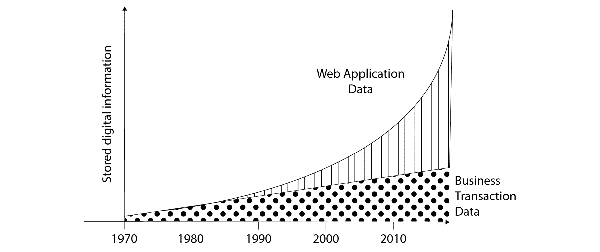

###### 图 1.1：年度数字数据增长

但这些数据不仅仅存储在硬盘上；它们正在被用来让生活变得更好。例如，谷歌使用它拥有的数据为你提供更好的搜索结果，Netflix 使用它拥有的数据为你提供更好的电影推荐。事实上，他们制作热门剧集《纸牌屋》的决定是基于数据分析的。IBM 正在使用它拥有的医疗数据创建一个人工智能医生，并从 X 光图像中检测癌细胞。

为了使用计算机处理如此大量的数据并得出相关结果，使用特定类别的算法。这些算法统称为机器学习算法。机器学习根据所使用的数据类型分为两部分：一种称为**监督学习**，另一种称为**无监督学习**。

当我们获得标记数据时，进行监督学习。例如，假设我们从一家医院获得了 1,000 张标记为正常或骨折的 X 光片。我们可以使用这些数据来训练一个机器学习模型，以预测 X 光片是否显示骨折的骨头。

无监督学习是在我们只有原始数据并期望在没有标签的情况下得出见解时进行的。我们有能力理解数据并识别其中的模式，而无需明确告知要识别哪些模式。到本书结束时，你将了解所有主要类型的无监督学习算法。在本书中，我们将使用 R 编程语言进行演示，但算法对所有语言都是相同的。

在本章中，我们将研究最基本的无监督学习类型，**聚类**。首先，我们将研究聚类是什么，它的类型，以及如何使用任何类型的数据集创建聚类。然后我们将研究每种聚类类型的工作原理，查看它们的优缺点。最后，我们将学习何时使用哪种类型的聚类。

## 聚类简介

聚类是一组用于根据数据集中变量的预定义属性找到自然分组的方法或算法。Merriam-Webster 词典将聚类定义为“一起发生的一组相似事物。”无监督学习中的聚类在传统意义上正是这个意思。例如，你如何从远处识别一串葡萄？你不需要仔细看这串葡萄就能直观地感觉到葡萄是否相互连接。聚类就是这样。下面提供了一个聚类的例子：


###### 图 1.2：数据集中两个聚类的表示

在前面的图表中，数据点有两个属性：胆固醇和血压。根据它们之间的**欧几里得**距离，数据点被分类为两个聚类，或两个串。一个聚类包含明显有心脏病高风险的人，另一个聚类包含心脏病风险低的人。也可以有超过两个聚类，如下面的例子所示：

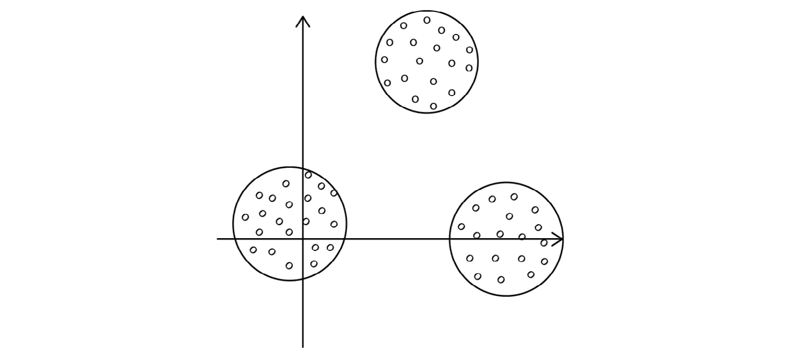

###### 图 1.3：数据集中三个聚类的表示

在前面的图表中，有三个聚类。一个额外的人群有高血压但胆固醇低。这个群体可能或可能没有心脏病风险。在接下来的章节中，将在实际数据集上展示聚类，其中 x 和 y 坐标表示实际数量。

### 聚类的应用

与所有无监督学习方法一样，聚类通常在我们没有标记数据——即具有预定义类别的数据——用于训练模型时使用。聚类使用各种属性，如欧几里得距离和**曼哈顿****距离**，来寻找数据中的模式并将它们根据其属性的相似性进行分类，而不需要任何用于训练的标签。因此，聚类在标记数据不可用或我们想要找到由标签未定义的模式的应用领域中有许多用例。

以下是一些聚类的应用：

+   **探索性数据分析**：当我们有未标记的数据时，我们通常会进行聚类以探索数据集的潜在结构和类别。例如，一家零售店可能想要根据购买历史来探索他们有多少不同的客户细分市场。

+   **生成训练数据**：有时，在用聚类方法处理未标记数据后，它可以被标记以进一步使用监督学习算法进行训练。例如，两个未标记的不同类别可能形成两个完全不同的聚类，我们可以使用它们的聚类来为更有效的实时分类的监督学习算法标记数据，这些算法比我们的无监督学习算法更有效。

+   **推荐系统**：借助聚类，我们可以找到相似物品的特性，并利用这些特性进行推荐。例如，一个电子商务网站，在找到同一集群的客户后，可以根据该集群中其他客户购买的物品向该集群中的客户推荐商品。

+   **自然语言处理**：聚类可以用于对相似词语、文本、文章或推文的分组，无需标签数据。例如，你可能希望自动将同一主题的文章分组。

+   **异常检测**：你可以使用聚类来找到异常值。我们将在第六章 *异常检测* 中学习这一点。异常检测也可以用于数据中存在不平衡类别的情况，例如在欺诈信用卡交易检测中。

## 爱丽丝数据集简介

在本章中，我们将使用爱丽丝花朵数据集进行练习，学习如何在不使用标签的情况下对三种爱丽丝花朵（Versicolor、Setosa 和 Virginica）进行分类。这个数据集是 R 内置的，非常适合学习聚类技术的实现。

注意，在我们的练习数据集中，我们为花朵有最终标签。我们将比较聚类结果与这些标签。我们选择这个数据集只是为了展示聚类结果是有意义的。在数据集如批发客户数据集（本书后面将介绍）的情况下，我们没有最终标签，聚类结果无法客观验证，因此可能会导致错误的结论。这就是在实际生活中没有数据集的最终标签时使用聚类的用例。一旦你完成了这两个练习和活动，这一点将更加清晰。

### 练习 1：探索爱丽丝数据集

在这个练习中，我们将学习如何在 R 中使用爱丽丝数据集。假设你已经在系统中安装了 R，让我们继续：

1.  按如下方式将爱丽丝数据集加载到变量中：

    ```py
    iris_data<-iris
    ```

1.  现在，我们的爱丽丝数据已经存储在 `iris_data` 变量中，我们可以使用 R 中的 `head` 函数查看其前几行：

    ```py
    head(iris_data)
    ```

    输出如下：

    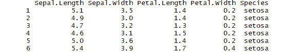

###### 图 1.4：爱丽丝数据集的前六行

我们可以看到我们的数据集有五个列。我们将主要使用两个列来简化二维图的可视化。

### 聚类类型

如前所述，聚类算法可以在数据中找到自然分组。我们可以以多种方式在数据中找到自然分组。以下是我们将在本章中研究的方法：

+   k-means 聚类

+   k-medoids 聚类

一旦基本聚类类型的概念清晰，我们将探讨其他类型的聚类，如下所示：

+   k-modes

+   基于密度的聚类

+   聚类层次聚类

+   分裂聚类

## k-means 聚类简介

K-means 聚类是最基本的无监督学习算法之一。这个算法根据预定义的相似度或距离度量找到自然分组。距离度量可以是以下任何一种：

+   欧几里得距离

+   曼哈顿距离

+   余弦距离

+   汉明距离

要了解距离度量做什么，以一束笔为例。你有 12 支笔。其中 6 支是蓝色的，6 支是红色的。其中 6 支是圆珠笔，6 支是墨水笔。如果你要用墨水颜色作为相似度度量，那么 6 支蓝色笔和 6 支红色笔将位于不同的簇中。这里的 6 支蓝色笔可以是墨水笔或圆珠笔，没有限制。但如果你要用笔的类型作为相似度度量，那么 6 支墨水笔和 6 支圆珠笔将位于不同的簇中。现在，每个簇中的笔是否颜色相同并不重要。

### 欧几里得距离

欧几里得距离是任意两点之间的直线距离。在二维空间中计算这个距离可以被视为你在学校可能学过的勾股定理的扩展。但欧几里得距离可以在任何 n 维空间中计算，而不仅仅是二维空间。任意两点之间的欧几里得距离是它们坐标差的平方和的平方根。这里展示了欧几里得距离计算的例子：

![图 1.5：欧几里得距离计算的表示

![img/C12628_01_05.jpg]

###### 图 1.5：欧几里得距离计算的表示

在 k-means 聚类中，使用欧几里得距离。使用欧几里得距离的一个缺点是，当数据的维度非常高时，它就失去了意义。这与一个被称为维度诅咒的现象有关。当数据集具有许多维度时，它们可能更难处理，因为所有点之间的距离都可能变得极高，而这些距离难以解释和可视化。

因此，当数据的维度非常高时，我们要么通过主成分分析来降低其维度，我们将在*第四章*，*降维*中学习到这一方法，要么使用余弦相似度。

### 曼哈顿距离

根据定义，曼哈顿距离是沿着与坐标轴成直角测量的两点之间的距离：

![图 1.6：曼哈顿距离的表示

![img/C12628_01_06.jpg]

###### 图 1.6：曼哈顿距离的表示

对角线的长度是两点之间的欧几里得距离。曼哈顿距离简单地说就是两个坐标之间差的绝对值的总和。因此，欧几里得距离和曼哈顿距离的主要区别在于，在欧几里得距离中，我们平方坐标之间的距离，然后取和的根，但在曼哈顿距离中，我们直接取坐标之间差的绝对值的总和。

### 余弦距离

任意两点之间的余弦相似度定义为以原点为顶点的任意两点之间的角度的余弦值。它可以通过将任意两个向量的点积除以向量的模的乘积来计算：

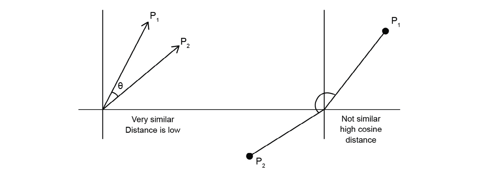

###### 图 1.7：余弦相似度和余弦距离的表示

余弦距离定义为（1-余弦相似度）。

余弦距离的范围是 0 到 2，而余弦相似度的范围在-1 到 1 之间。始终记住，余弦相似度是余弦距离的值的倒数。

### 汉明距离

汉明距离是一种特殊的距离，用于分类变量。给定两个维度相等的点，汉明距离定义为彼此不同的坐标的数量。例如，让我们取两个点（0，1，1）和（0，1，0）。这两个变量之间只有一个值不同，即最后一个值。因此，它们之间的汉明距离是 1：


###### 图 1.8：汉明距离的表示

### k-means 聚类算法

K-means 聚类用于在未标记的数据集的相似点数据集中找到簇。在本章中，我们将使用鸢尾花数据集。这个数据集包含了不同物种的花瓣长度和宽度的信息。借助无监督学习，我们将学习如何在不了解哪些属性属于哪个物种的情况下区分它们。以下是我们数据集的散点图：

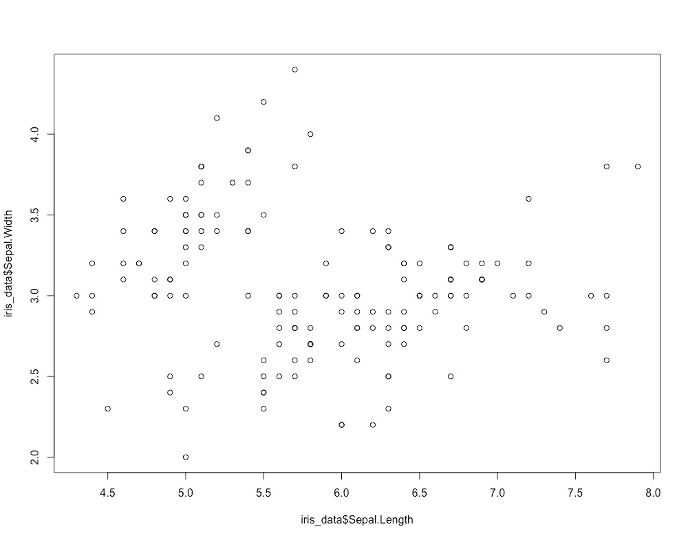

###### 图 1.9：鸢尾花数据集的散点图

这是鸢尾花数据集两个变量的散点图：花瓣长度和花瓣宽度。

如果我们要根据点之间的距离来识别前一个数据集中的簇，我们会选择看起来像挂在树上的葡萄串的簇。你可以看到有两个主要的大串（一个在左上角，另一个是剩余的点）。k-means 算法识别这些“葡萄串”。

下图显示了相同的散点图，但用不同颜色显示了三种不同的鸢尾花品种。这些品种来自原始数据集的“species”列，具体如下：鸢尾花 setosa（用绿色表示），鸢尾花 versicolor（用红色表示），和鸢尾花 virginica（用蓝色表示）。我们将通过形成自己的分类来尝试确定这些品种，使用聚类：

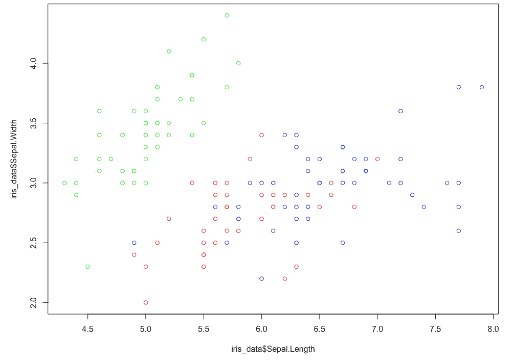

###### 图 1.10：展示不同品种的鸢尾花数据集的散点图

这里是鸢尾花 setosa 的照片，在先前的散点图中用绿色表示：


###### 图 1.11：鸢尾花

下面的照片是鸢尾花 versicolor，在先前的散点图中用红色表示：


###### 图 1.12：鸢尾花 versicolor

这里是鸢尾花 virginica 的照片，在先前的散点图中用蓝色表示：


###### 图 1.13：鸢尾花 virginica

### 实现 k-means 聚类的步骤

正如我们在图 1.9 中的散点图中看到的，每个数据点代表一朵花。我们将找到可以识别这些品种的簇。为了进行这种聚类，我们将使用 k-means 聚类，其中 k 是我们想要的簇数。以下执行 k-means 聚类的步骤，为了理解简单，我们将用两个簇来演示。我们将在稍后使用三个簇，以尝试匹配实际的物种分组：

1.  在散点图上选择任意两个随机坐标，k1 和 k2，作为初始簇中心。

1.  计算散点图中每个数据点与坐标 k1 和 k2 的距离。

1.  根据数据点与 k1 或 k2 的接近程度，将每个数据点分配到簇中。

1.  找到每个簇中所有点的平均坐标，并将 k1 和 k2 的值分别更新到这些坐标。

1.  从*步骤 2*重新开始，直到 k1 和 k2 的坐标停止显著移动，或者经过一定预定的迭代次数后。

我们将使用图表和代码演示先前的算法。

### 练习 2：在鸢尾花数据集上实现 k-means 聚类

在这个练习中，我们将逐步实现 k-means 聚类：

1.  在`iris_data`变量中加载内置的鸢尾花数据集：

    ```py
    iris_data<-iris
    ```

1.  设置不同物种在散点图上的颜色，以便表示。这将帮助我们看到三种不同的物种是如何在我们最初的两组分类之间分割的：

    ```py
    iris_data$t_color='red'
    iris_data$t_color[which(iris_data$Species=='setosa')]<-'green'
    iris_data$t_color[which(iris_data$Species=='virginica')]<-'blue'
    ```

1.  选择任意两个随机簇的中心开始：

    ```py
    k1<-c(7,3)
    k2<-c(5,3)
    ```

    #### 注意

    你可以尝试改变点，看看它如何影响最终的簇。

1.  绘制散点图，并包含您在上一步骤中选择的中心。在第一行中，将鸢尾花花瓣的长度和宽度以及颜色传递给`plot`函数，然后将中心和点的 x 和 y 坐标传递给`points()`函数。在这里，`pch`用于选择聚类中心的表示类型——在这种情况下，4 代表一个十字，5 代表一个菱形：

    ```py
    plot(iris_data$Sepal.Length,iris_data$Sepal.Width,col=iris_data$t_color)
    points(k1[1],k1[2],pch=4)
    points(k2[1],k2[2],pch=5)
    ```

    输出如下：

    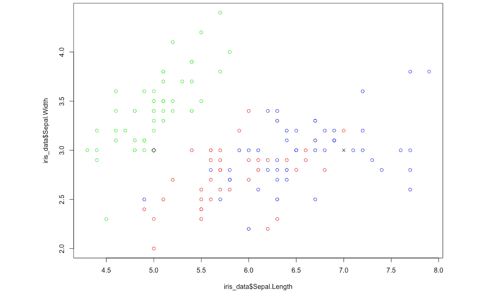

    ###### 图 1.14：所选聚类中心点的散点图

1.  选择您想要的迭代次数。迭代次数应使得每次迭代后中心的变化不再显著。在我们的例子中，六次迭代就足够了：

    ```py
    number_of_steps<-6
    ```

1.  初始化将跟踪循环中迭代次数的变量：

    ```py
    n<-1
    ```

1.  开始`while`循环以找到最终的聚类中心：

    ```py
    while(n<number_of_steps)
    {
    ```

1.  计算每个点到当前聚类中心的距离，这是算法中的*第二步*。我们在这里使用`sqrt`函数计算欧几里得距离：

    ```py
      iris_data$distance_to_clust1 <- sqrt((iris_data$Sepal.Length-k1[1])²+(iris_data$Sepal.Width-k1[2])²)
      iris_data$distance_to_clust2 <- sqrt((iris_data$Sepal.Length-k2[1])²+(iris_data$Sepal.Width-k2[2])²)
    ```

1.  将每个点分配到其最近的中心所在的聚类，这是算法的*第三步*：

    ```py
      iris_data$clust_1 <- 1*(iris_data$distance_to_clust1<=iris_data$distance_to_clust2)
      iris_data$clust_2 <- 1*(iris_data$distance_to_clust1>iris_data$distance_to_clust2) 
    ```

1.  通过计算每个聚类中点的平均`x`和`y`坐标来计算新的聚类中心（算法中的*第四步*），使用 R 中的`mean()`函数：

    ```py
      k1[1]<-mean(iris_data$Sepal.Length[which(iris_data$clust_1==1)])
      k1[2]<-mean(iris_data$Sepal.Width[which(iris_data$clust_1==1)])
      k2[1]<-mean(iris_data$Sepal.Length[which(iris_data$clust_2==1)])
      k2[2]<-mean(iris_data$Sepal.Width[which(iris_data$clust_2==1)])
    ```

1.  更新变量以记录迭代的次数，以便有效地执行算法的*第五步*：

    ```py
      n=n+1
    }
    ```

1.  现在，我们将用新的颜色覆盖物种颜色以展示两个聚类。因此，我们的下一个散点图上只有两种颜色——一种颜色代表聚类 1，另一种颜色代表聚类 2：

    ```py
    iris_data$color='red'
    iris_data$color[which(iris_data$clust_2==1)]<-'blue'
    ```

1.  绘制包含聚类及其中心的新的散点图：

    ```py
    plot(iris_data$Sepal.Length,iris_data$Sepal.Width,col=iris_data$color)
    points(k1[1],k1[2],pch=4)
    points(k2[1],k2[2],pch=5)
    ```

    输出如下：

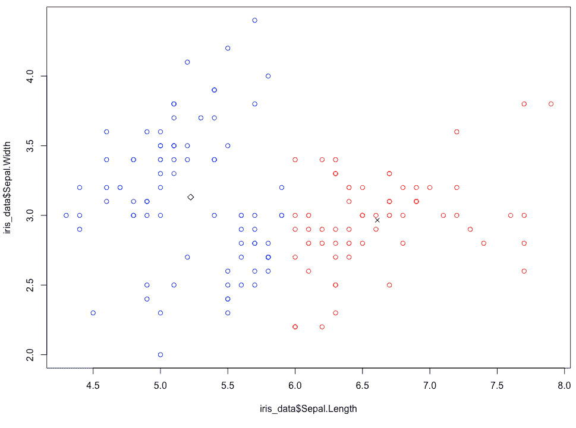

###### 图 1.15：用不同颜色表示每个聚类的散点图

注意到 setosa（以前是绿色）已被分组在左侧聚类中，而大多数 virginica 花朵（以前是蓝色）已被分组在右侧聚类中。versicolor 花朵（以前是红色）被分在两个新的聚类之间。

您已成功实现 k-means 聚类算法，根据花瓣大小识别两组花朵。注意算法运行后中心位置的变化。

在以下活动中，我们将增加聚类的数量到三个，以查看我们是否可以将花朵正确地分组到三种不同的物种中。

### 活动 1：使用三个聚类的 k-means 聚类

编写一个 R 程序，使用三个聚类对鸢尾花数据集进行 k-means 聚类。在这个活动中，我们将执行以下步骤：

1.  在图上选择任意三个随机坐标，k1、k2 和 k3，作为中心。

1.  计算每个数据点到 k1、k2 和 k3 的距离。

1.  通过找到最近的聚类中心来对每个点进行分类。

1.  找到各自聚类中所有点的平均坐标，并将 k1、k2 和 k3 的值更新到这些值。

1.  从 *步骤 2* 重新开始，直到 k1、k2 和 k3 的坐标停止显著移动，或者经过 10 次迭代过程后。

本活动的结果将是一个包含三个聚类的图表，如下所示：

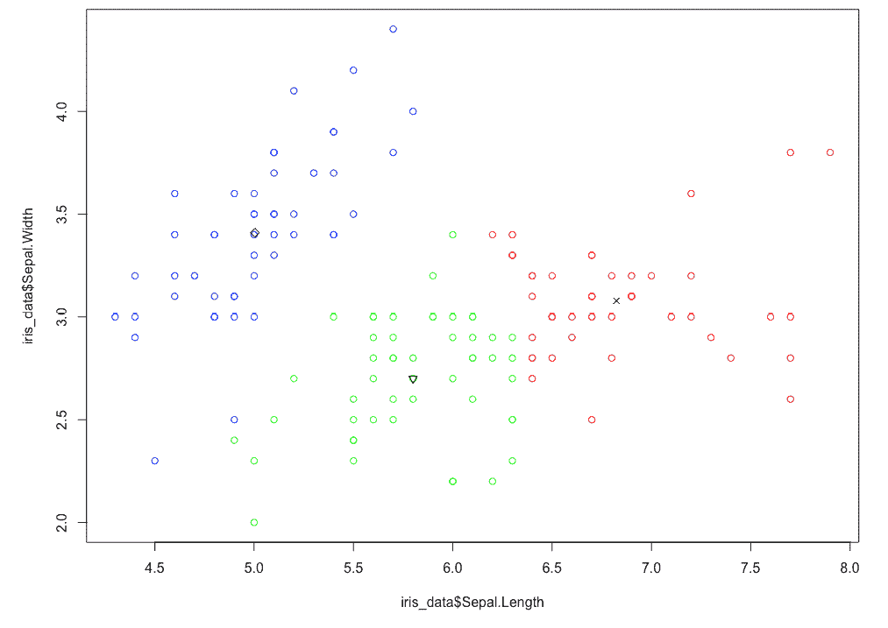


###### 图 1.16：给定聚类中心的预期散点图

您可以将您的图表与图 1.10 进行比较，以查看聚类与实际物种分类的匹配程度。

#### 注意

本活动的解决方案可在第 198 页找到。

## 使用内置函数的 k-means 聚类介绍

在本节中，我们将使用 R 的某些内置库来执行 k-means 聚类，而不是编写冗长且容易出错的自定义代码。使用预构建库而不是编写自己的代码也有其他优点：

+   库函数在计算上效率很高，因为这些函数的开发投入了数千人的工时。

+   库函数几乎无错误，因为它们在几乎所有实际可用的场景中都被数千人测试过。

+   使用库可以节省时间，因为您不必花费时间编写自己的代码。

### 使用三个聚类的 k-means 聚类

在上一个活动中，我们通过编写自己的代码执行了具有三个聚类的 k-means 聚类。在本节中，我们将借助预构建的 R 库实现类似的结果。

首先，我们将在数据集中以三种类型的花的分布开始，如下所示：

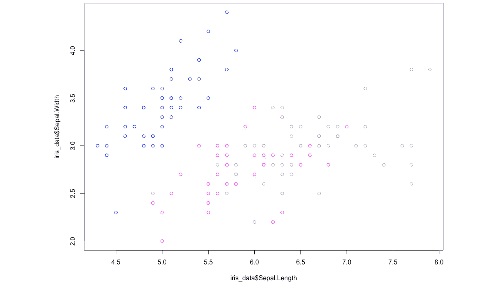


###### 图 1.17：用三种颜色表示三种鸢尾花物种的图

在前面的图中，setosa 用蓝色表示，virginica 用灰色表示，versicolor 用粉色表示。

使用这个数据集，我们将执行 k-means 聚类，看看内置算法是否能够自己找到模式来根据花瓣大小对这些三种鸢尾花物种进行分类。这次，我们只需要四行代码。

### 练习 3：使用 R 库进行 k-means 聚类

在这个练习中，我们将学习使用 R 的预构建库以更简单的方式执行 k-means 聚类。通过完成这个练习，您将能够将三种 Iris 物种划分为三个单独的聚类：

1.  我们将鸢尾花数据集的前两列，即花瓣长度和花瓣宽度，放入 `iris_data` 变量中：

    ```py
    iris_data<-iris[,1:2]
    ```

1.  我们找到 k-means 聚类中心以及每个点所属的聚类，并将所有这些存储在 `km.res` 变量中。在这里，在 `kmeans` 函数中，我们将数据集作为第一个参数输入，我们想要的聚类数量作为第二个参数：

    ```py
    km.res<-kmeans(iris_data,3)
    ```

    #### 注意

    k-means 函数有许多输入变量，可以调整以获得不同的最终输出。你可以在[`www.rdocumentation.org/packages/stats/versions/3.5.1/topics/kmeans`](https://www.rdocumentation.org/packages/stats/versions/3.5.1/topics/kmeans)的文档中了解更多信息。

1.  按以下步骤安装`factoextra`库：

    ```py
    install.packages('factoextra')
    ```

1.  我们导入`factoextra`库来可视化我们刚刚创建的簇。`Factoextra`是一个 R 包，用于绘制多元数据：

    ```py
    library("factoextra") 
    ```

1.  生成簇的图。在这里，我们需要将 k-means 的结果作为第一个参数输入。在`data`中，我们需要输入聚类所用的数据。在`pallete`中，我们选择点的几何形状类型，在`ggtheme`中，我们选择输出图的样式：

    ```py
    fviz_cluster(km.res, data = iris_data,palette = "jco",ggtheme = theme_minimal())
    ```

    输出将如下所示：

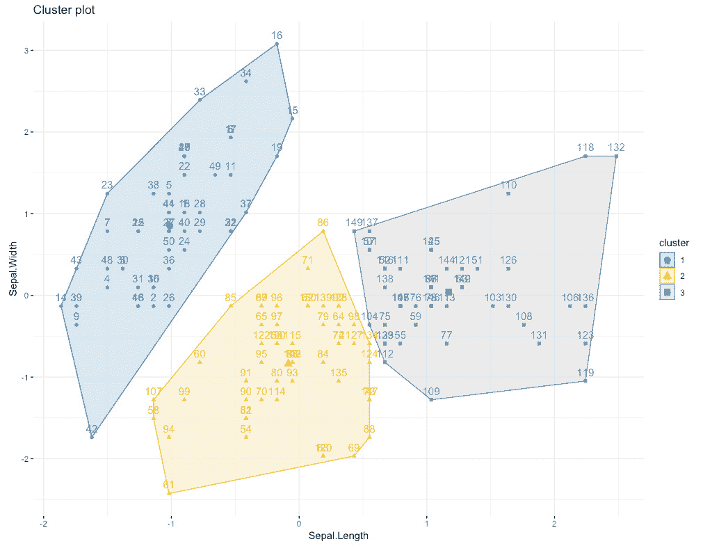

###### 图 1.18：三种鸢尾花已经被聚成三个簇

在这里，如果你将图 1.18 与图 1.17 进行比较，你会看到我们几乎正确地分类了所有三种物种。我们生成的簇与图 1.18 中显示的物种不完全匹配，但考虑到仅使用花瓣长度和宽度进行分类的限制，我们已经非常接近了。

从这个例子中，你可以看到，如果我们不知道它们的物种，聚类将是一个非常有用的对鸢尾花进行分类的方法。你将遇到许多数据集的例子，在这些数据集中，你没有标记的类别，但能够使用聚类来形成自己的分组。

## 市场细分简介

市场细分是根据共同特征将客户划分为不同的细分市场。以下是一些客户细分的用途：

+   提高客户转化率和留存率

+   通过识别特定细分市场和其需求来开发新产品

+   通过特定细分市场改善品牌沟通

+   识别营销策略中的差距并制定新的营销策略以增加销售额

### 练习 4：探索批发客户数据集

在这个练习中，我们将查看批发客户数据集中的数据。

#### 注意

对于所有需要导入外部 CSV 或图像文件的外部练习和活动，请转到**RStudio**-> **会话**-> **设置工作目录**-> **到源文件位置**。你可以在控制台中看到路径已自动设置。

1.  要下载 CSV 文件，请访问[`github.com/TrainingByPackt/Applied-Unsupervised-Learning-with-R/tree/master/Lesson01/Exercise04/wholesale_customers_data.csv`](https://github.com/TrainingByPackt/Applied-Unsupervised-Learning-with-R/tree/master/Lesson01/Exercise04/wholesale_customers_data.csv)。点击`wholesale_customers_data.csv`。

    #### 注意

    此数据集来自 UCI 机器学习仓库。您可以在以下网址找到数据集：[`archive.ics.uci.edu/ml/machine-learning-databases/00292/`](https://archive.ics.uci.edu/ml/machine-learning-databases/00292/)。我们已经下载了文件并将其保存在[`github.com/TrainingByPackt/Applied-Unsupervised-Learning-with-R/tree/master/Lesson01/Exercise04/wholesale_customers_data.csv.`](https://github.com/TrainingByPackt/Applied-Unsupervised-Learning-with-R/tree/master/Lesson01/Exercise04/wholesale_customers_data.csv.)

1.  将其保存到您安装 R 的文件夹中。现在，要在 R 中加载它，请使用以下函数：

    ```py
    ws<-read.csv("wholesale_customers_data.csv")
    ```

1.  现在，我们可以通过使用以下 R 函数来查看这个数据集的不同列和行：

    ```py
    head(ws)
    ```

    输出如下：

![Figure 1.19：批发客户数据集的列]

![img/C12628_01_19.jpg]

###### 图 1.19：批发客户数据集的列

这六行显示了按产品类别划分的年度货币消费的前六行。

### 活动二：使用 k-means 进行客户细分

对于这个活动，我们将使用来自 UCI 机器学习仓库的批发客户数据集。它可在以下网址找到：[`github.com/TrainingByPackt/Applied-Unsupervised-Learning-with-R/tree/master/Lesson01/Activity02/wholesale_customers_data.csv`](https://github.com/TrainingByPackt/Applied-Unsupervised-Learning-with-R/tree/master/Lesson01/Activity02/wholesale_customers_data.csv)。我们将通过聚类来识别属于不同市场细分、喜欢购买不同类型商品的客户。尝试使用 k-means 聚类，k 的值为 2 到 6。

#### 注意

此数据集来自 UCI 机器学习仓库。您可以在以下网址找到数据集：[`archive.ics.uci.edu/ml/machine-learning-databases/00292/`](https://archive.ics.uci.edu/ml/machine-learning-databases/00292/)。我们已经下载了文件并将其保存在[`github.com/TrainingByPackt/Applied-Unsupervised-Learning-with-R/tree/master/Lesson01/Activity02/wholesale_customers_data.csv.`](https://github.com/TrainingByPackt/Applied-Unsupervised-Learning-with-R/tree/master/Lesson01/Activity02/wholesale_customers_data.csv.)

这些步骤将帮助您完成活动：

1.  将从 UCI 机器学习仓库下载的数据读入一个变量。数据可在以下网址找到：[`github.com/TrainingByPackt/Applied-Unsupervised-Learning-with-R/tree/master/Lesson01/Activity02/wholesale_customers_data.csv`](https://github.com/TrainingByPackt/Applied-Unsupervised-Learning-with-R/tree/master/Lesson01/Activity02/wholesale_customers_data.csv).

1.  只选择两列，即杂货和冷冻食品，以便于可视化聚类。

1.  如同*第 4 步*中*练习 4*，*探索批发客户数据集*的*第 2 步*，将聚类数量设置为 2 并生成聚类中心。

1.  按照第 4 步中的*练习 4*，*探索批发客户数据集*绘制图表。

1.  保存您生成的图表。

1.  通过改变聚类数量的值，重复*步骤 3*、*步骤 4*和*步骤 5*，将聚类数量设置为 3、4、5 和 6。

1.  决定哪个聚类数量的值最适合对数据进行分类。

输出将是一个包含六个聚类的图表，如下所示：

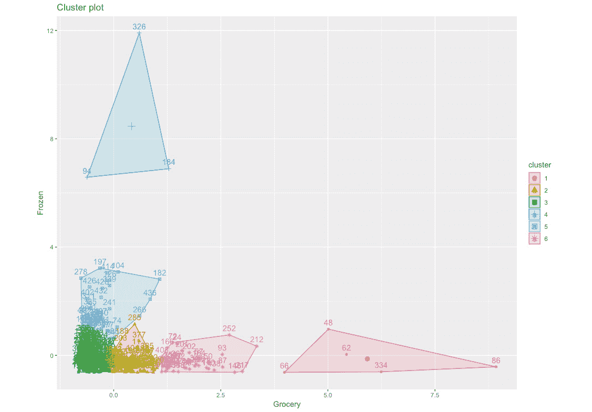

###### 图 1.20：预期六个聚类的图表

#### 注意

本活动的解决方案可以在第 201 页找到。

## k-medoids 聚类简介

k-medoids 是另一种聚类算法，可用于在数据集中找到自然分组。k-medoids 聚类与 k-means 聚类非常相似，除了几个不同之处。k-medoids 聚类算法的优化函数与 k-means 略有不同。在本节中，我们将研究 k-medoids 聚类。

### k-medoids 聚类算法

有许多不同类型的算法可以执行 k-medoids 聚类，其中最简单且效率最高的算法是**基于聚类中心的划分**，简称 PAM。在 PAM 中，我们执行以下步骤来找到聚类中心：

1.  从散点图中选择 k 个数据点作为聚类中心的起始点。

1.  计算它们与散点图中所有点的距离。

1.  将每个点分类到其最近的中心所在的聚类中。

1.  在每个聚类中选择一个新点，该点使该聚类中所有点与该点的距离之和最小。

1.  重复*步骤 2*，直到中心不再改变。

您可以看到，PAM 算法与 k-means 聚类算法相同，除了*步骤 1*和*步骤 4*。对于大多数实际应用，k-medoids 聚类几乎给出了与 k-means 聚类相同的结果。但在某些特殊情况下，如果数据集中有异常值，k-medoids 聚类更受欢迎，因为它对异常值更稳健。关于何时使用哪种类型的聚类及其差异将在后面的章节中研究。

### k-medoids 聚类代码

在本节中，我们将使用与上一节相同的鸢尾花数据集，并将其与上次的结果进行比较，以查看结果是否与上次的结果有明显的不同。我们将直接使用 R 的库来执行 PAM 聚类，而不是编写代码来执行 k-medoids 算法的每个步骤。

### 练习 5：实现 k-medoid 聚类

在这个练习中，我们将使用 R 的预建库来执行 k-medoids 聚类：

1.  将鸢尾花数据集的前两列存储在`iris_data`变量中：

    ```py
    iris_data<-iris[,1:2]
    ```

1.  安装`cluster`包：

    ```py
    install.packages("cluster")
    ```

1.  导入`cluster`包：

    ```py
    library("cluster")
    ```

1.  将 PAM 聚类结果存储在`km.res`变量中：

    ```py
    km<-pam(iris_data,3)
    ```

1.  导入`factoextra`库：

    ```py
    library("factoextra")
    ```

1.  在图中绘制 PAM 聚类结果：

    ```py
    fviz_cluster(km, data = iris_data,palette = "jco",ggtheme = theme_minimal())
    ```

    输出如下所示：

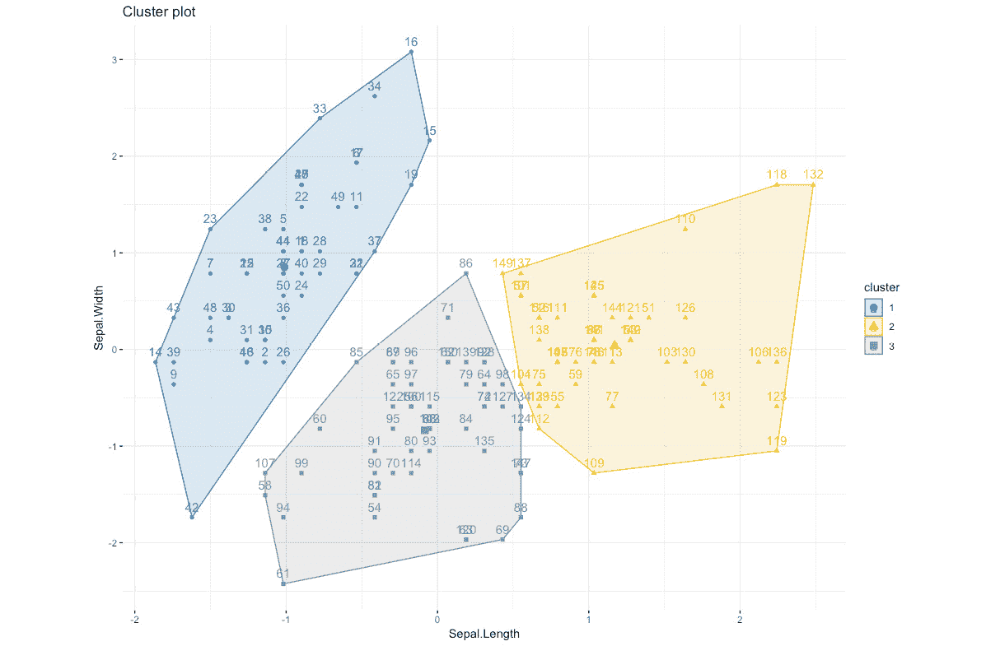

###### 图 1.21：k-medoids 聚类结果

k-medoids 聚类的结果与我们在上一节中执行的 k-means 聚类结果没有很大差异。

因此，我们可以看到，前面的 PAM 算法将我们的数据集划分为三个与 k-means 聚类得到的簇相似的簇。如果我们将这两种聚类的结果并排绘制，我们可以清楚地看到它们是多么相似：

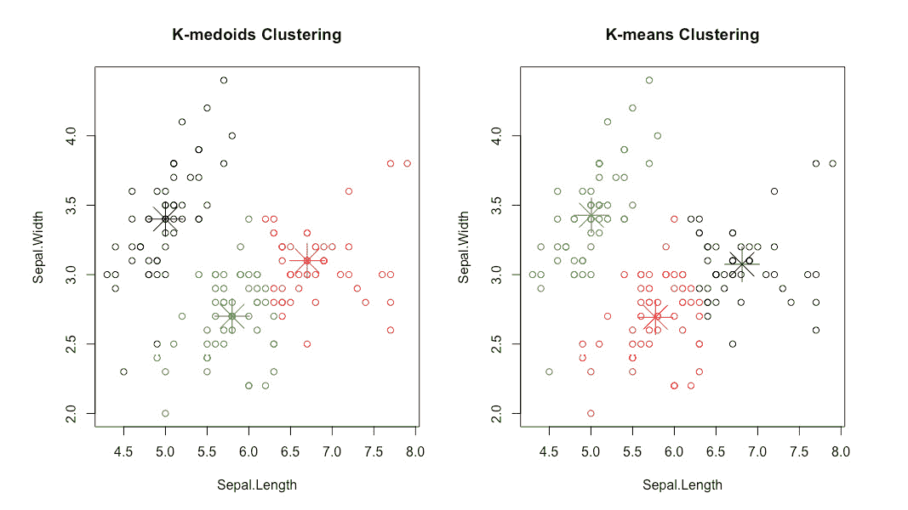

###### 图 1.22：k-medoids 聚类与 k-means 聚类的结果

在前面的图表中，观察 k-means 和 k-medoids 聚类的中心是如何如此接近的，但 k-medoids 聚类的中心直接重叠在数据中的点上，而 k-means 聚类的中心则不是。

### k-means 聚类与 k-medoids 聚类

现在我们已经研究了 k-means 和 k-medoids 聚类，它们几乎相同，我们将研究它们之间的差异以及何时使用哪种类型的聚类：

+   计算复杂度：在这两种方法中，k-medoids 聚类的计算成本更高。当我们的数据集太大（>10,000 个点）且我们想要节省计算时间时，我们将更倾向于选择 k-means 聚类而不是 k-medoids 聚类。

    #### 注意

    数据集的大小完全取决于可用的计算能力。随着时间的推移，计算成本越来越低，因此被认为是大数据集的标准将在未来发生变化。

+   异常值的存在：与 k-medoids 聚类相比，k-means 聚类对异常值更敏感。由于数据集中存在异常值，簇中心的定位可能会发生显著变化，因此当我们需要构建对异常值有弹性的簇时，我们使用 k-medoids 聚类。

+   簇中心：k-means 和 k-medoids 算法以不同的方式找到簇中心。k-medoids 簇的中心始终是数据集中的数据点。k-means 簇的中心不需要是数据集中的数据点。

### 活动三：使用 k-medoids 聚类进行客户细分

使用批发客户数据集进行 k-means 和 k-medoids 聚类，然后比较结果。将从 UCI 机器学习仓库下载的数据读入一个变量。数据可以在[`github.com/TrainingByPackt/Applied-Unsupervised-Learning-with-R/tree/master/Lesson01/Data/wholesale_customers_data.csv`](https://github.com/TrainingByPackt/Applied-Unsupervised-Learning-with-R/tree/master/Lesson01/Data/wholesale_customers_data.csv)找到。

#### 注意

此数据集来自 UCI 机器学习仓库。您可以在[`archive.ics.uci.edu/ml/machine-learning-databases/00292/`](https://archive.ics.uci.edu/ml/machine-learning-databases/00292/)找到数据集。我们已经下载了文件并将其保存在[`github.com/TrainingByPackt/Applied-Unsupervised-Learning-with-R/tree/master/Lesson01/Activity03/wholesale_customers_data.csv.`](https://github.com/TrainingByPackt/Applied-Unsupervised-Learning-with-R/tree/master/Lesson01/Activity03/wholesale_customers_data.csv. )

这些步骤将帮助您完成活动：

1.  仅选择两列，杂货和冷冻，以便于进行簇的二维可视化。

1.  使用 k-medoids 聚类来绘制显示四个簇的图表。

1.  使用 k-means 聚类来绘制四簇图表。

1.  比较两个图表，以评论两种方法的结果差异。

结果将是一个 k-means 簇的图表，如下所示：

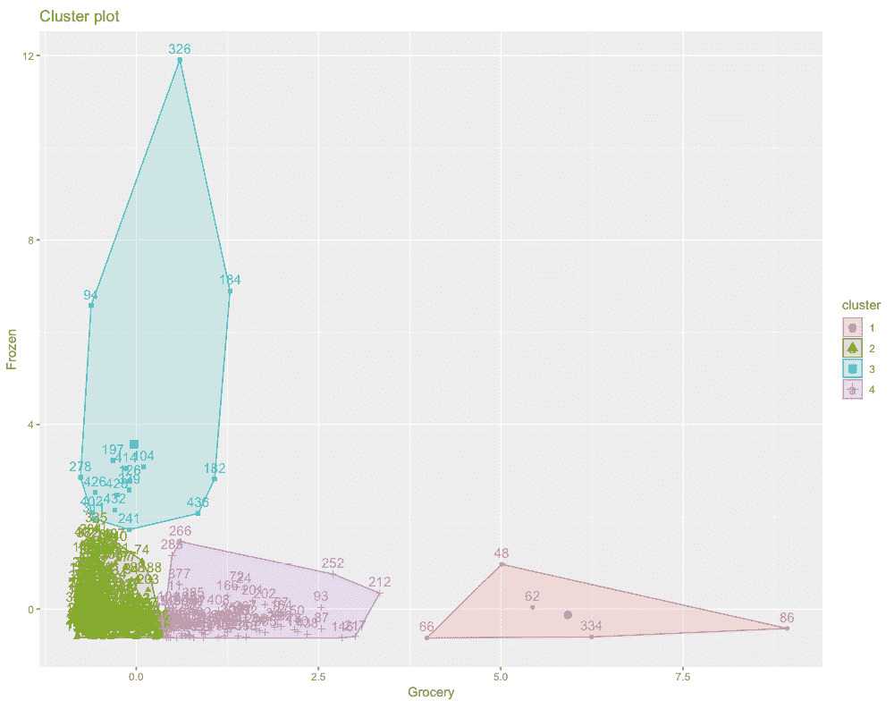

###### 图 1.23：簇的预期 k-means 图

#### 注意

本活动的解决方案可以在第 206 页找到。

### 决定簇的最佳数量

到目前为止，我们一直在处理鸢尾花数据集，其中我们知道有多少种类的花，并且我们根据这个知识将我们的数据集划分为三个簇。但在无监督学习中，我们的主要任务是处理关于我们没有任何信息的数据，例如数据集中有多少自然簇或类别。此外，聚类也可以是一种探索性数据分析的形式，在这种情况下，你不会对数据有太多了解。有时，当数据有超过两个维度时，可视化变得困难，手动找出簇的数量也变得困难。那么，在这些情况下，我们如何找到簇的最佳数量呢？在本节中，我们将学习获取簇数量最佳值的技术。

### 聚类度量类型

在无监督学习中，确定簇的最佳数量有多种方法。以下是我们将在本章中研究的方法：

+   轮廓分数

+   肘部方法 / WSS

+   Gap 统计量

### 轮廓分数

轮廓分数或平均轮廓分数的计算用于量化聚类算法获得的簇的质量。让我们以簇 x 中的一个点 a 为例：

1.  计算点 a 与簇 x 中所有点的平均距离（用 **dxa** 表示）：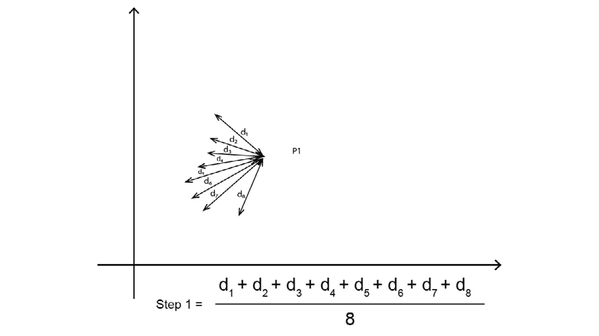

    ###### 图 1.24：计算点 a 与簇 x 中所有点的平均距离

1.  计算点 a 与另一个簇中离 a 最近的簇中所有点的平均距离（**dya**）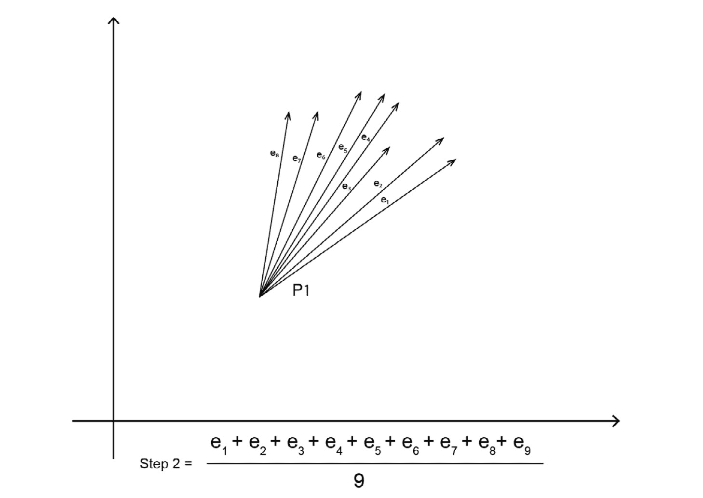

    ###### 图 1.25：计算点 a 与簇 x 中所有点的平均距离

1.  通过将 *步骤 1* 的结果与 *步骤 2* 的结果之差除以 *步骤 1* 和 *步骤 2* 的最大值来计算该点的轮廓分数（(dya-dxa)/max(dxa,dya)）。

1.  对簇中的所有点重复前三个步骤。

1.  在得到聚类中每个点的轮廓得分后，所有这些得分的平均值是该聚类的轮廓得分：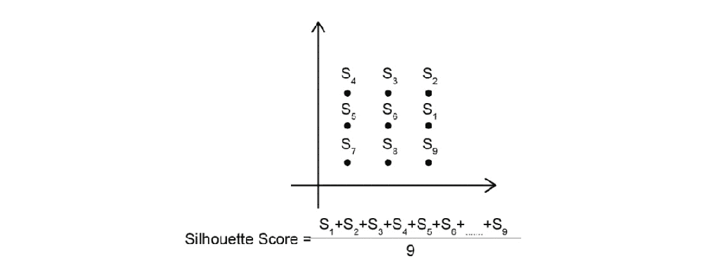

    ###### 图 1.26：计算轮廓得分

1.  对数据集中的所有聚类重复前面的步骤。

1.  在得到数据集中所有聚类的轮廓得分后，所有这些得分的平均值是该数据集的轮廓得分：

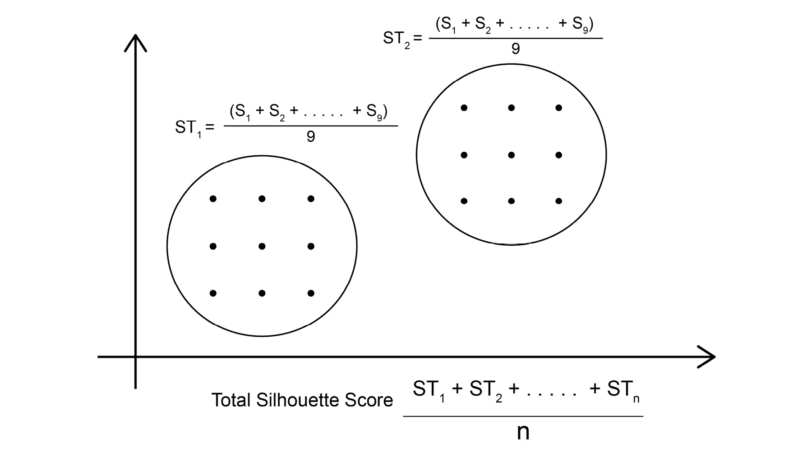

###### 图 1.27：计算平均轮廓得分

轮廓得分介于 1 和 -1 之间。如果一个聚类的轮廓得分低（介于 0 和 -1 之间），这意味着该聚类分布较广或该聚类中点的距离较高。如果一个聚类的轮廓得分高（接近 1），这意味着聚类定义良好，聚类中点的距离较低，而与其他聚类中点的距离较高。因此，理想的轮廓得分接近 1。

理解前面的算法对于形成对轮廓得分的理解很重要，但它对于学习如何实现它并不重要。因此，我们将学习如何使用一些预构建的库在 R 中进行轮廓分析。

### 练习 6：计算轮廓得分

在这个练习中，我们将学习如何计算具有固定聚类数量的数据集的轮廓得分：

1.  将 Iris 数据集的前两列，即花瓣长度和花瓣宽度，放入 `iris_data` 变量中：

    ```py
    iris_data<-iris[,1:2]
    ```

1.  导入 `cluster` 库以执行 k-means 聚类：

    ```py
    library(cluster)
    ```

1.  将 k-means 聚类存储在 `km.res` 变量中：

    ```py
    km.res<-kmeans(iris_data,3)
    ```

1.  将所有数据点的成对距离矩阵存储在 `pair_dis` 变量中：

    ```py
    pair_dis<-daisy(iris_data)
    ```

1.  计算数据集中每个点的轮廓得分：

    ```py
    sc<-silhouette(km.res$cluster, pair_dis)
    ```

1.  绘制轮廓得分图：

    ```py
    plot(sc,col=1:8,border=NA)
    ```

    输出如下：

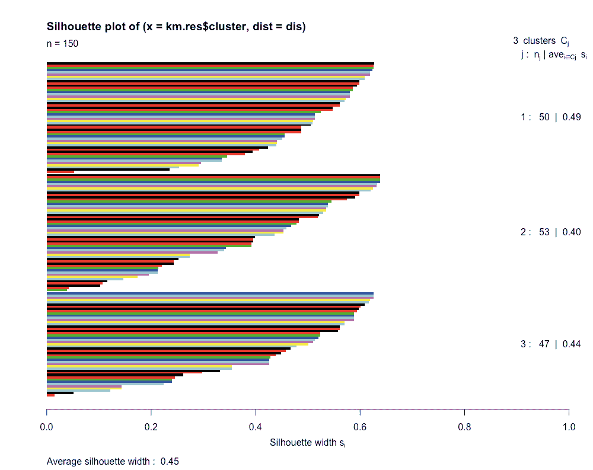

###### 图 1.28：每个聚类中每个点的轮廓得分用一个单独的条形表示

前面的图显示了数据集的平均轮廓得分为 0.45。它还显示了按聚类和按点计算的平均轮廓得分。

在前面的练习中，我们计算了三个聚类的轮廓得分。但为了决定有多少个聚类，我们必须计算数据集中多个聚类的轮廓得分。在下一个练习中，我们将学习如何使用 R 中的 `factoextra` 库来完成这项工作。

### 练习 7：确定最佳聚类数量

在这个练习中，我们将通过在一行代码中使用 R 库来计算 k 的各种值，以确定最佳聚类数量：

1.  将 Iris 数据集的前两列，即花瓣长度和花瓣宽度，放入 `iris_data` 变量中：

    ```py
    iris_data<-iris[,1:2]
    ```

1.  导入 `factoextra` 库：

    ```py
    library("factoextra")
    ```

1.  绘制轮廓分数与簇数量（最多 20 个）的图表：

    ```py
    fviz_nbclust(iris_data, kmeans, method = "silhouette",k.max=20)
    ```

    #### 注意

    在第二个参数中，你可以将 k-means 改为 k-medoids 或任何其他类型的聚类。`k.max`变量是要计算的簇的最大数量。在函数的方法参数中，你可以输入要包含的三种聚类度量类型。所有这三种度量在本章中都有讨论。

    输出如下：

![图 1.29：簇数量与平均轮廓分数的关系]

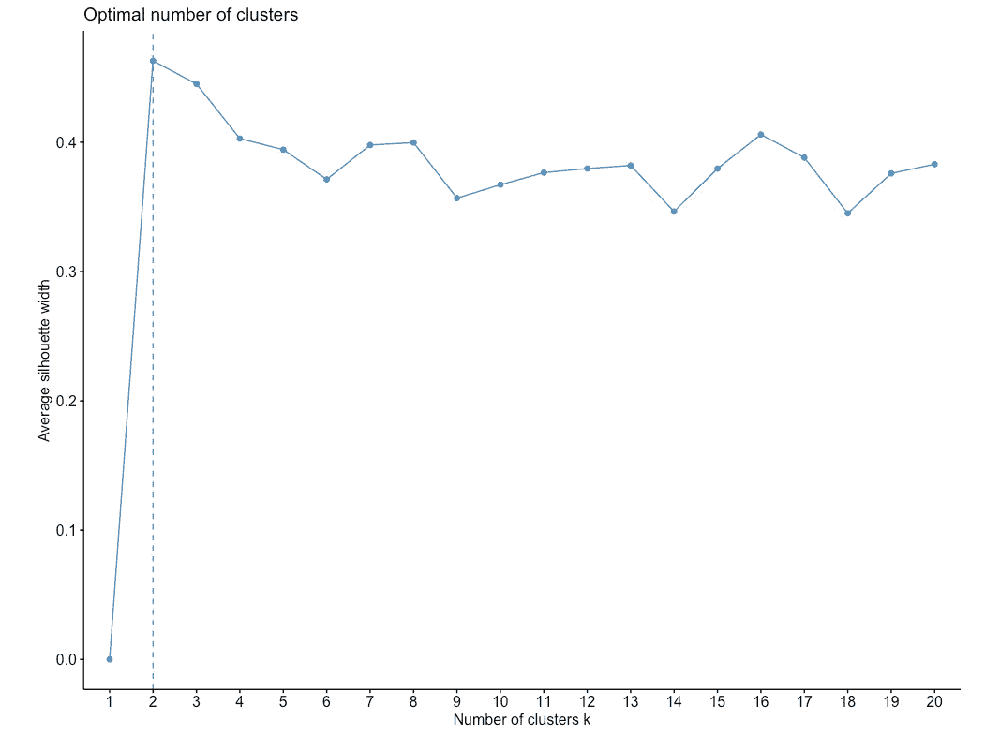

###### 图 1.29：簇数量与平均轮廓分数的关系

从前面的图表中，你选择一个具有最高分数的 k 值；即 2。根据轮廓分数，2 是最佳簇数量。

### WSS/肘部方法

为了在数据集中识别簇，我们尝试最小化簇内点之间的距离，而**内部平方和**（WSS）方法正是衡量这一点。WSS 分数是簇内所有点距离平方的总和。在此方法中，我们执行以下步骤：

1.  使用不同的 k 值计算簇。

1.  对于每个 k 值，使用以下公式计算 WSS：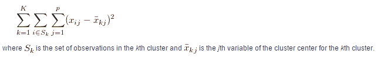

    ###### 图 1.30：计算 WSS 的公式，其中 p 是数据的总维度数

    此公式在此处展示：

    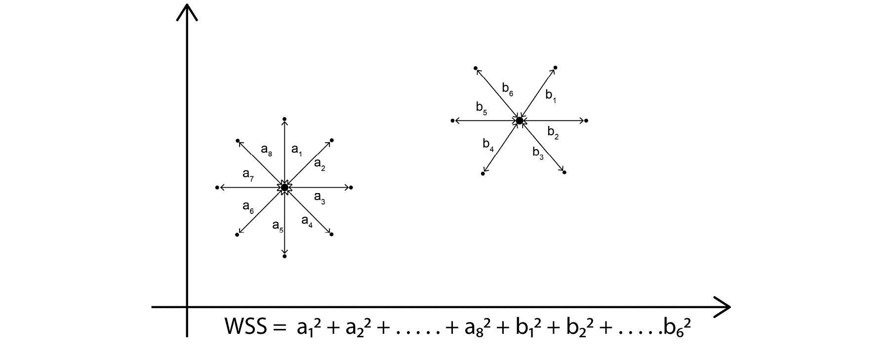

    ###### 图 1.31：WSS 分数的说明

    #### 注意

    图 1.31 说明了相对于两个点的 WSS，但现实中 WSS 衡量的是相对于每个簇内所有点的所有距离的总和。

1.  绘制簇数量 k 与 WSS 分数的关系图。

1.  确定 WSS 分数不再显著下降的 k 值，并选择这个 k 作为理想的簇数量。这个点也被称为图表的“肘部”，因此得名“**肘部方法**”。

在接下来的练习中，我们将学习如何借助`factoextra`库来确定理想簇的数量。

### 练习 8：使用 WSS 确定簇的数量

在这个练习中，我们将看到如何使用 WSS 来确定簇的数量。执行以下步骤。

1.  将 Iris 数据集的前两列，即花瓣长度和花瓣宽度，放入`iris_data`变量中：

    ```py
    iris_data<-iris[,1:2]
    ```

1.  导入`factoextra`库：

    ```py
    library("factoextra")
    ```

1.  绘制 WSS 与簇数量（最多 20 个）的图表：

    ```py
    fviz_nbclust(iris_data, kmeans, method = "wss", k.max=20)
    ```

    输出如下：

![图 1.32：WSS 与簇数量的关系]

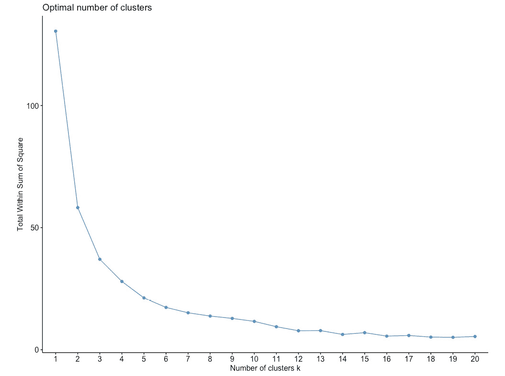

###### 图 1.32：WSS 与簇数量的关系

在前面的图表中，我们可以选择图表的肘部作为 k=3，因为当 k=3 后，WSS 的值开始下降得更慢。选择图表的肘部始终是一个主观的选择，有时你可能选择 k=4 或 k=2 而不是 k=3，但在这个图表中，很明显 k>5 的值不合适，因为它们不是图表的肘部，图表的斜率在这里急剧变化。

### 间隙统计

间隙统计是寻找数据集中最佳聚类数量的最有效方法之一。它适用于任何类型的聚类方法。间隙统计是通过比较在观测数据集上生成的聚类与在参考数据集上生成的聚类（其中没有明显的聚类）的 WSS 值来计算的。参考数据集是在我们想要计算间隙统计的观测数据集的最小值和最大值之间均匀分布的数据点。

因此，简而言之，间隙统计测量观测和随机数据集的 WSS 值，并找出观测数据集与随机数据集的偏差。为了找到理想的聚类数量，我们选择一个使间隙统计值最大的 k 值。这些偏差如何测量的数学细节超出了本书的范围。在下一项练习中，我们将学习如何使用 `factoviz` 库计算间隙统计。

这里是一个参考数据集：

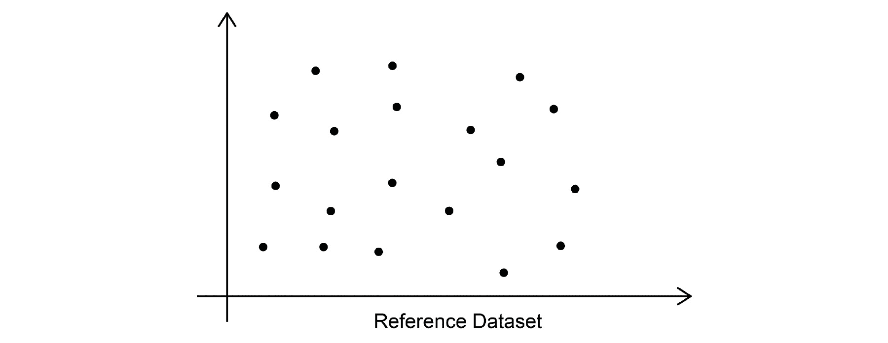

###### 图 1.33：参考数据集

以下为观测数据集：

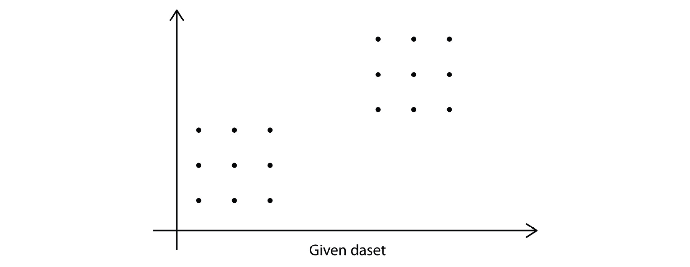

###### 图 1.34：观测数据集

### 练习 9：使用间隙统计计算理想的聚类数量

在这个练习中，我们将使用间隙统计计算理想的聚类数量：

1.  将 Iris 数据集的前两列，即花瓣长度和花瓣宽度，放入 `iris_data` 变量中，如下所示：

    ```py
    iris_data<-iris[,1:2]
    ```

1.  按以下方式导入 `factoextra` 库：

    ```py
    library("factoextra")
    ```

1.  绘制间隙统计与聚类数量（最多 20）的图表：

    ```py
    fviz_nbclust(iris_data, kmeans, method = "gap_stat",k.max=20)
    ```

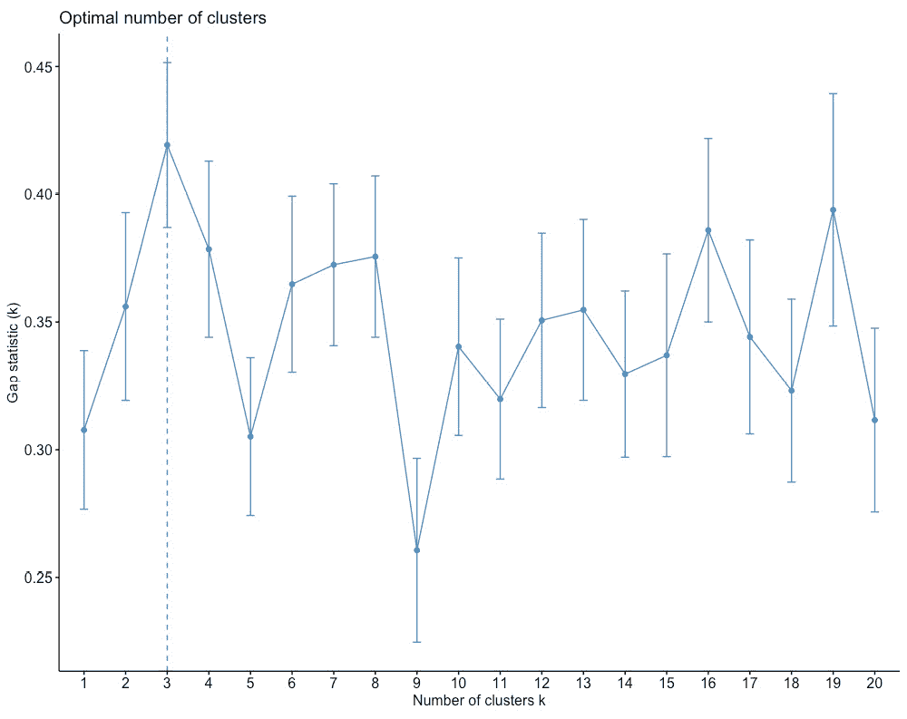

###### 图 1.35：间隙统计与聚类数量

如前图所示，间隙统计的最高值对应于 k=3。因此，iris 数据集中的理想聚类数量是三个。三个也是数据集中的物种数量，这表明间隙统计使我们得出了正确的结论。

### 活动 4：寻找理想的市场细分数量

使用前述三种方法在批发客户数据集中找到最佳聚类数量：

#### 注意

此数据集来自 UCI 机器学习仓库。您可以在[`archive.ics.uci.edu/ml/machine-learning-databases/00292/`](https://archive.ics.uci.edu/ml/machine-learning-databases/00292/)找到数据集。我们已经下载了文件并将其保存在[`github.com/TrainingByPackt/Applied-Unsupervised-Learning-with-R/tree/master/Lesson01/Activity04/wholesale_customers_data.csv.`](https://github.com/TrainingByPackt/Applied-Unsupervised-Learning-with-R/tree/master/Lesson01/Activity04/wholesale_customers_data.csv. )

1.  在一个变量中加载批发客户数据集的第 5 到 6 列。

1.  使用轮廓分数计算 k-means 聚类的最佳聚类数量。

1.  使用 WSS 分数计算 k-means 聚类的最佳聚类数量。

1.  使用 Gap 统计量计算 k-means 聚类的最佳聚类数量。

结果将是三个图表，分别表示最佳聚类数量与轮廓分数、WSS 分数和 Gap 统计量。

#### 注意

本活动的解决方案可以在第 208 页找到。

正如我们所看到的，每种方法都会给出最佳聚类数量的不同值。有时，结果可能没有意义，就像你在 Gap 统计量的例子中看到的那样，它给出的最佳聚类数量为一，这意味着不应该在这个数据集上进行聚类，所有数据点都应该在一个单独的聚类中。 

给定聚类中的所有点将具有相似的性质。对这些性质的解读留给领域专家。在无监督学习中，几乎永远没有一个正确的答案来确定正确的聚类数量。

## 摘要

恭喜！你已经完成了这本书的第一章。如果你理解了我们至今所学的所有内容，你现在对无监督学习的了解比大多数声称了解数据科学的人都要多。k-means 聚类算法对无监督学习来说如此基础，以至于许多人把 k-means 聚类和无监督学习等同起来。

在本章中，你不仅学习了 k-means 聚类及其应用，还学习了 k-medoids 聚类，以及各种聚类指标及其应用。因此，现在你对 k-means 和 k-medoid 聚类算法有了顶级理解。

在下一章，我们将探讨一些不太为人所知的聚类算法及其应用。
